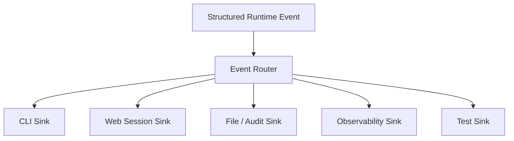

# Automation and Orchestration

Election Pulse uses layered orchestration.

No single file should permanently coordinate application hosting, parser
semantics, maintenance, training, deployment, and presentation.

## Layers

```text
Application Composition
Application Orchestration
Parse Orchestration
Maintenance Orchestration
Repository / CI Orchestration
```

## Application composition

The current primary host is:

```text
webapp/Smart_Elections_Parser_Webapp.py
```

It wires Flask, Socket.IO, authentication, sessions, routes, runtime
configuration, and web entry points.

## Application orchestration

`web_pipeline.py` currently handles much of the run adapter role:

- session association;
- cancellation;
- prompts;
- progress;
- result publication;
- lifecycle.

## Parse orchestration

`html_election_parser.py` coordinates:

```text
acquire
detect
route
extract
normalize
validate
finalize
```

It should become easier to test this layer without Flask, Socket.IO, or terminal
presentation.

## Maintenance orchestration

Maintenance work includes context migrations, integrity checks,
review/promotion jobs, model maintenance, cleanup, and health diagnostics.

Historical `health` modules contain several domains. The long-term direction is
to separate integrity, review, ML, maintenance, runtime/session, and security
responsibilities.

## Repository and CI orchestration

Repository automation includes GitHub Actions, deployment checks,
documentation audits, maintenance scripts, pre-commit validation, and generated
reports.

Repository automation should not redefine runtime parser semantics.

## Session state

Web traffic adds concurrency requirements absent from the original CLI parser.

Session state should be explicit and should not be represented by mutable global
presentation state.

## Runtime events



Presentation is selected by sinks, not by changing domain behavior.

## Failure isolation

One failed parser run should not corrupt another session.

One failed maintenance job should not silently rewrite canonical data.

One failed generated report should not redefine architecture.

## Invariants

1. orchestration coordinates; domains decide election semantics;
2. presentation does not change parser meaning;
3. session state is explicit;
4. maintenance cannot silently promote runtime evidence;
5. repository automation is separate from production parser execution;
6. failures remain scoped to the smallest practical boundary.
