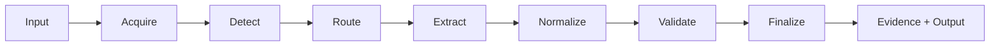

# Parser Pipeline

The parser pipeline coordinates source acquisition through canonical output
without making raw extraction equivalent to verified election truth.



## Input

Inputs may originate from:

- public URLs;
- uploaded files;
- structured JSON or APIs;
- CSV or spreadsheet data;
- HTML;
- PDF;
- worklists;
- previously acquired artifacts.

Application adapters own user interaction. The parser owns the normalized parse
request.

## Acquisition

Acquisition obtains a source artifact without discarding provenance.

Useful acquisition facts include:

- source URL or upload identity;
- acquisition timestamp;
- content type;
- source filename;
- response/download metadata;
- hashes where appropriate;
- browser/navigation evidence.

## Detection and routing

Detection identifies source structure. Routing selects the smallest appropriate
handler.

Routing may include:

- format routing;
- state routing;
- county or jurisdiction handling;
- vendor-specific behavior;
- URL hints;
- safe fallback behavior.

Handlers should not duplicate shared browser, logging, normalization, or output
infrastructure.

## Extraction

Extraction produces evidence-bearing parser observations such as:

- candidates;
- vote methods;
- precinct labels;
- contest titles;
- party labels;
- reporting percentages;
- table structures;
- OCR text regions.

Extraction output is not automatically canonical knowledge.

## Normalization

Normalization maps source-specific values into shared concepts while preserving
enough source evidence to explain the transformation.

Examples:

- candidate names;
- party aliases;
- vote methods;
- precinct identity;
- contest titles;
- jurisdiction values;
- numeric vote conversion.

## Validation

Expected checks include:

- candidate totals versus vote-method sums;
- precinct reconciliation where source totals are comparable;
- ballot-method reconciliation;
- duplicate precinct detection;
- candidate/method completeness;
- explicit missing-method state;
- discrepancy flags.

Validation must not invent values merely to satisfy a schema.

## Finalization

Smart Elections output is finalized through:

```python
finalize_election_output(headers, rows, metadata)
```

Handlers should produce data compatible with this shared boundary.

## Precinct row rule

The default model is:

> One row equals one precinct.

Every candidate must remain comparable across precincts.

Zero-vote candidates and methods are preserved.

## PDF and OCR

PDF handling may require:

- page orientation;
- OCR;
- table reconstruction;
- page-spanning precinct joining;
- break-sensitive handling;
- image/text evidence.

OCR output is evidence, not knowledge.

## Cancellation and progress

Cancellation and progress are run-lifecycle concerns.

The parser may emit structured events, but adapters decide how those events are
presented.

## Failure behavior

Prefer explicit partial state over fabricated completion.

A source may be acquired while a contest remains unresolved. A precinct may be
extracted while a method is missing. OCR may succeed while table structure is
ambiguous. Those states must remain inspectable.

## Invariants

1. evidence is not silently promoted to canonical truth;
2. candidates and methods are not omitted because their count is zero;
3. source-specific code does not bypass shared finalization;
4. discrepancies remain visible;
5. presentation does not change election semantics;
6. repeated runs remain explainable from evidence and metadata.
