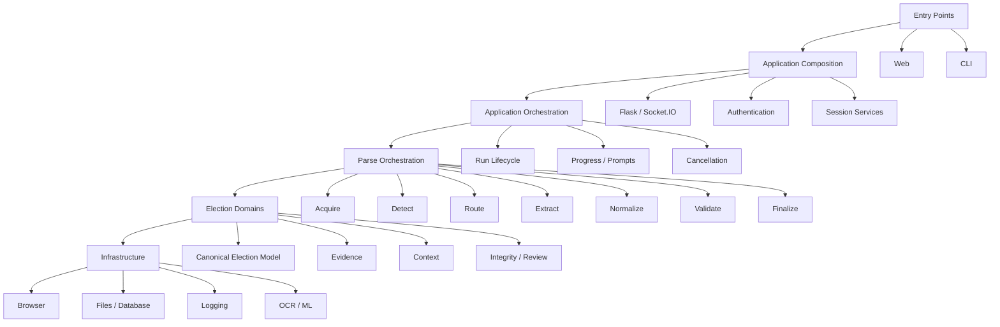
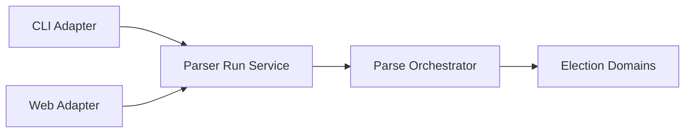

# System Overview

Election Pulse is an election-data acquisition, normalization, validation,
review, and analysis platform.

The parser remains a major subsystem, but it is no longer the whole system.

## Architectural layers



## Application composition

`webapp/Smart_Elections_Parser_Webapp.py` currently acts as the deployed
application composition root.

It wires concerns such as:

- Flask and Socket.IO;
- blueprints;
- authentication and certificate policy;
- session services;
- runtime configuration;
- web task entry points;
- application observability.

It should not become the permanent home for election extraction semantics.

## Application orchestration

`web_pipeline.py` currently bridges web runtime concerns to parser execution.

Its durable role is to supervise a parser run:

- associate a session;
- propagate cancellation;
- publish progress;
- deliver prompts;
- translate application inputs to parser-run inputs;
- return parser results to the application.

CLI and web should ultimately use the same parser-run contract.

## Parse orchestration

`webapp/parser/html_election_parser.py` remains the historical parse coordinator.

Its durable responsibility is:

```text
acquire
  -> detect
  -> route
  -> extract
  -> normalize
  -> validate
  -> finalize
```

Presentation, authentication, session ownership, training, and repository
maintenance are separate responsibilities.

## CLI and web parity



CLI parity is achieved by sharing contracts, not by embedding terminal behavior
inside the parser.

## Structured runtime events

Logging is an event stream, not a presentation mode.

A runtime event may be routed to:

- a terminal;
- the Ballot Lens debug console;
- a persisted log;
- metrics or observability;
- an audit sink;
- a test sink.

Global logger state must not stand in for web-session state.

## Ballot Lens

Ballot Lens is a presentation workspace, not the parser engine.

Its responsibilities may include:

- geographic or map exploration;
- source acquisition;
- parser-run controls;
- result review;
- artifact inspection;
- evidence and quality views;
- structured runtime console output;
- session actions.

The UI may evolve without changing canonical election or evidence contracts.

## Browser boundary

DOM interaction belongs behind shared browser infrastructure.

`browser_utils.py` represents the historical start of this boundary. Long term,
browser work should be separable into navigation, interaction, selectors,
diagnostics, CAPTCHA handling, and browser adapters.

## Shared safeguards

The project accumulated many `safe_*` helpers to prevent path, URL, collection,
serialization, database, and execution failures.

The durable rule is:

> Centralize policy, not unrelated business logic.

Filesystem safety belongs to filesystem infrastructure. URL safety belongs to
navigation/security infrastructure. Election normalization belongs to election
domains.

## Current versus target architecture

Some modules still combine responsibilities because the project evolved
incrementally.

Architecture therefore distinguishes:

- **current implementation**: what the repository does now;
- **target boundary**: where responsibility should live as refactoring proceeds.

A target boundary must not be described as implemented until code and tests
support that claim.
