Comprehensive pipeline audit for `webapp/parser/`.

## 📋 Table of Contents

- [Overview](#overview)
- [Interactive Pipeline Graph](#interactive-pipeline-graph)
- [File Connection Map](#file-connection-map)
- [Detailed Module Contexts](#detailed-module-contexts)

## Overview

- **Total Modules Audited:** 92
- **Total Connections:** 115
- **Clusters:** Entry, Pipeline, Routing, State Handlers, Format Handlers,
Shared Handlers, Services, Utils, Context Integration, Health
- **Audit Scope:** All `webapp/parser/` files with full context, imports,
dependencies, and optimization insights.

## Interactive Pipeline Graph

```mermaid
graph TD
  subgraph Entry["Entry"]
    html_election_parser["html_election_parser"]
  end
  subgraph Pipeline["Pipeline"]
    web_pipeline["web_pipeline"]
  end
  subgraph Routing["Routing"]
    state_router["state_router"]
  end
  subgraph State_Handlers["State Handlers"]
    example_county["example_county"]
    example_state["example_state"]
    rockland["rockland"]
    westchester["westchester"]
  end
  subgraph Format_Handlers["Format Handlers"]
    csv_handler["csv_handler"]
    html_handler["html_handler"]
    json_handler["json_handler"]
    pdf_handler["pdf_handler"]
    xlsx_handler["xlsx_handler"]
  end
  subgraph Shared_Handlers["Shared Handlers"]
    state_handler_base["state_handler_base"]
  end
  subgraph Services["Services"]
    election_data_services["election_data_services"]
  end
  subgraph Utils["Utils"]
    browser_utils["browser_utils"]
    contest_selector["contest_selector"]
    detect["detect"]
    dynamic_table_extractor["dynamic_table_extractor"]
    html_scanner["html_scanner"]
    models["models"]
    pattern_extractor["pattern_extractor"]
    pivot["pivot"]
    shared_logic["shared_logic"]
    table_builder["table_builder"]
    user_prompt["user_prompt"]
  end
  subgraph Context_Integration["Context Integration"]
    context_coordinator["context_coordinator"]
    librarian["librarian"]
    loader["loader"]
    vocab_loader["vocab_loader"]
    Integrity_check["Integrity_check"]
    constants["constants"]
    context_organizer["context_organizer"]
  end
  subgraph Health["Health"]
    manual_correction_bot["manual_correction_bot"]
    create_test_dataset["create_test_dataset"]
    dataset_promotion["dataset_promotion"]
    fine_tune_bert_ner["fine_tune_bert_ner"]
    health_router["health_router"]
    integrity_check_runner["integrity_check_runner"]
    log_cache_cleaner_bot["log_cache_cleaner_bot"]
    promotion_helpers["promotion_helpers"]
    quarantine_queue["quarantine_queue"]
    retrain_table_structure_models["retrain_table_structure_models"]
  end
  table_builder -->|37| dynamic_table_extractor
  manual_correction_bot -->|36| librarian
  detect -->|18| browser_utils
  file_io_blueprint -->|16| data_framework_blueprint
  loader -->|13| vocab_loader
  pivot -->|12| contest_selector
  election_data_blueprint -->|11| data_framework_blueprint
  pivot -->|11| html_election_parser
  utility_admin_blueprint -->|10| data_framework_blueprint
  dynamic_table_extractor -->|10| context_coordinator
  url_library_blueprint -->|9| data_framework_blueprint
  html_scanner -->|9| librarian
  user_prompt -->|9| shared_logic
  ui_navigation_blueprint -->|8| data_framework_blueprint
  pattern_extractor -->|7| browser_utils
  fec_data_assurance_blueprint -->|6| data_framework_blueprint
  health_blueprint -->|6| data_framework_blueprint
  election_data_services -->|6| models
  html_scanner -->|6| context_coordinator
  verification_endpoints -->|5| local_dl_sync
```



**✨ Legend:** Colors indicate module categories with metallic accents. Click
nodes for details below.

## Connection Highlights

Key integration points across major parser aspects to simplify tracking
relevance.

### Top Module Links

- `table_builder` → `dynamic_table_extractor` (37 refs, Utils → Utils) —
review `dynamic_table_extractor` whenever `table_builder` changes.
- `manual_correction_bot` → `librarian` (36 refs, Health → Context
Integration) — review `librarian` whenever `manual_correction_bot` changes.
- `detect` → `browser_utils` (18 refs, Utils → Utils) — review `browser_utils`
whenever `detect` changes.
- `file_io_blueprint` → `data_framework_blueprint` (16 refs, Other → Other) —
review `data_framework_blueprint` whenever `file_io_blueprint` changes.
- `loader` → `vocab_loader` (13 refs, Context Integration → Context
Integration) — review `vocab_loader` whenever `loader` changes.
- `pivot` → `contest_selector` (12 refs, Utils → Utils) — review
`contest_selector` whenever `pivot` changes.
- `election_data_blueprint` → `data_framework_blueprint` (11 refs, Other →
Other) — review `data_framework_blueprint` whenever `election_data_blueprint`
changes.
- `pivot` → `html_election_parser` (11 refs, Utils → Entry) — review
`html_election_parser` whenever `pivot` changes.
- `utility_admin_blueprint` → `data_framework_blueprint` (10 refs, Other →
Other) — review `data_framework_blueprint` whenever `utility_admin_blueprint`
changes.
- `dynamic_table_extractor` → `context_coordinator` (10 refs, Utils → Context
Integration) — review `context_coordinator` whenever `dynamic_table_extractor`
changes.

### Cluster Flow Summary

- Utils → Utils: 118 edges (intra-cluster flow to monitor.)
- Other → Other: 86 edges (intra-cluster flow to monitor.)
- Health → Context Integration: 39 edges (cross-cluster flow to monitor.)
- Utils → Context Integration: 38 edges (cross-cluster flow to monitor.)
- Context Integration → Context Integration: 19 edges (intra-cluster flow to
monitor.)
- Utils → Entry: 16 edges (cross-cluster flow to monitor.)
- Format Handlers → Other: 11 edges (cross-cluster flow to monitor.)
- Health → Entry: 8 edges (cross-cluster flow to monitor.)
- Health → Health: 7 edges (intra-cluster flow to monitor.)
- Entry → Health: 6 edges (cross-cluster flow to monitor.)

## File Connection Map

Detailed import/export relationships and dependencies.

## Detailed Module Contexts

Click to expand each module for full audit details.

### Context\_Integration/Context\_Library/constants.py {#webapp-parser-context-integration-context-library-constants-py}

#### 🔧 Key Functions & Classes (Context_Integration_Context_Library_constants)

- `_log_vocab_fallback` (function, line 11)
- `_load_state_to_county_map_from_vocab` (function, line 21)
- `_load_county_to_precincts_map_from_vocab` (function, line 48)
- `_LazyMapping` (class, line 74)
- `load_vocab_list` (function, line 107)
- `load_vocab_mapping` (function, line 122)
- `_load_division_type_defaults_from_vocab` (function, line 137)
- `_load_division_type_overrides_from_vocab` (function, line 142)
- `_load_canonical_state_abbr_from_vocab` (function, line 156)
- `_load_party_code_map_from_vocab` (function, line 171)
- `_load_party_code_descriptions_from_vocab` (function, line 177)
- `_load_party_aliases_from_vocab` (function, line 183)
- `_load_party_normalization_overrides_from_vocab` (function, line 189)
- `_load_office_keywords_from_vocab` (function, line 195)
- `_load_html_taxonomy_from_vocab` (function, line 201)
- `_load_html_taxonomy_category` (function, line 222)
- `_load_html_tags_from_vocab` (function, line 236)
- `_load_button_tags_from_vocab` (function, line 247)
- `_load_heading_tags_from_vocab` (function, line 258)
- `_load_table_tags_from_vocab` (function, line 269)
- `_load_state_tags_from_vocab` (function, line 280)
- `_load_panel_tags_from_vocab` (function, line 291)
- `_load_container_extra_keywords_from_vocab` (function, line 302)
- `_load_container_fallback_selectors_from_vocab` (function, line 308)
- `_load_root_container_tags_from_vocab` (function, line 314)

#### 📦 Key Imports (Context_Integration_Context_Library_constants)

- `os`
- `re`
- `collections.abc`
- `functools`
- `typing`
- `typing`
- `typing`
- `typing`
- `typing`
- `typing`
- `typing`
- `typing`
- `typing`
- `utils.logger_singleton`
- `vocab.loader`

### Context\_Integration/Integrity\_check.py {#webapp-parser-context-integration-integrity-check-py}

#### 🔧 Key Functions & Classes (Context_Integration_Integrity_check)

- `_trim_monitor_log` (function, line 53)
- `_cap_log_value` (function, line 76)
- `log_integrity_monitor` (function, line 98)
- `_ensure_alerts_table` (function, line 109)
- `find_date_anomalies` (function, line 116)
- `detect_anomalies_with_ml` (function, line 124)
- `election_integrity_checks` (function, line 211)
- `advanced_cross_field_validation` (function, line 232)
- `summarize_context_entities` (function, line 241)
- `analyze_contests` (function, line 250)
- `auto_tune_contamination` (function, line 296)
- `print_issues_table` (function, line 317)
- `print_entity_summary` (function, line 337)
- `print_ml_anomalies` (function, line 345)
- `print_date_anomalies` (function, line 375)
- `print_auto_tune_result` (function, line 393)
- `print_analyze_contests` (function, line 399)
- `monitor_db_for_alerts` (function, line 411)
- `log_integrity_issues` (function, line 457)
- `detect_statistical_outliers` (function, line 474)
- `print_integrity_summary` (function, line 510)

#### 📦 Key Imports (Context_Integration_Integrity_check)

- `__future__`
- `re`
- `threading`
- `time`
- `collections`
- `pathlib`
- `typing`
- `typing`
- `typing`
- `typing`
- `matplotlib`
- `numpy`
- `orjson`
- `rich.panel`
- `rich.table`
- `sklearn.cluster`
- `sklearn.ensemble`
- `sklearn.preprocessing`
- `sqlalchemy`
- `config`

### Context\_Integration/\_\_init\_\_.py {#webapp-parser-context-integration-init-py}

> Context integration module for election results.

### Context\_Integration/context\_coordinator.py {#webapp-parser-context-integration-context-coordinator-py}

> context*coordinator.py

#### 🔧 Key Functions & Classes (Context_Integration_context_coordinator)

- `get_semantic_score` (function, line 106)
- `merge_and_rank_candidates` (function, line 175)
- `dynamic_state_county_detection` (function, line 265)
- `ContextCoordinator` (class, line 866)

#### 📦 Key Imports (Context_Integration_context_coordinator)

- `__future__`
- `difflib`
- `hashlib`
- `numbers`
- `os`
- `re`
- `subprocess`
- `threading`
- `collections`
- `collections`
- `collections.abc`
- `datetime`
- `datetime`
- `typing`
- `typing`
- `typing`
- `typing`
- `typing`
- `typing`
- `urllib.parse`

#### ⚠️ Task markers (Context_Integration_context_coordinator)

- L911 **WARNING**: ("\[ALERT MONITOR\] Thread did not stop cleanly.")
- L999 **WARNING**: ({
- L1000 **WARNING**: ",
- L1754 **WARNING**: (f"\[yellow\]Integrity issues:\[/yellow\]
{issues\['integrity_issues'\]}")
- L2017 **WARNING**: (f"\[ContextCoordinator\] No table structure found for
contest: {contest}")
- L2322 **WARNING**: (f"\[get_feedback_pattern_kb\] Skipping corrupt line:
{e}")
- L2434 **WARNING**: ("\[group_dom_nodes_by_label\] No organized DOM parts.
(Further warnings suppressed)")
- L2436 **WARNING**: (f"\[group_dom_nodes_by_label\] No organized DOM parts.
(Occurred {ContextCoordinator._dom_parts_warning_count} times)")
- L2441 **WARNING**: ("\[group_dom_nodes_by_label\] No DOM nodes found.")
- L2459 **WARNING**: ("\[submit_user_feedback\] ContextOrganizer has no
submit_user_feedback method.")
- L2487 **WARNING**: (f"\[correct_and_update_contest\] Contest {contest_id}
missing type/election_types after sync.")
- L2511 **WARNING**: ("\[print_contest_summary\] No organized contests to
summarize.")
- L2524 **WARNING**: ("\[plot_contest_distribution\] No organized contests to
plot.")
- L2591 **WARNING**: ("No organized DOM parts.")
- L2594 **WARNING**: ("No organized DOM parts. (Further warnings suppressed)")
- L2605 **WARNING**: ("\[get_contest_groups\] No contest groups found.")
- L2614 **WARNING**: ("\[get_panel_groups\] No panel groups found.")
- L2623 **WARNING**: ("\[get_button_groups\] No button groups found.")
- L2632 **WARNING**: ("\[get_table_groups\] No table groups found.")
- L2641 **WARNING**: ("\[get_relationships\] No organized context.")

### Context\_Integration/context\_organizer.py {#webapp-parser-context-integration-context-organizer-py}

> context*organizer.py

#### 🔧 Key Functions & Classes (Context_Integration_context_organizer)

- `get_loading_indicator` (function, line 63)
- `ensure_dict` (function, line 66)
- `remove_functions` (function, line 79)
- `contest_hash` (function, line 87)
- `repair_dom_segments` (function, line 99)
- `_defensive_dom_check` (function, line 161)
- `ContextOrganizer` (class, line 182)

#### 📦 Key Imports (Context_Integration_context_organizer)

- `__future__`
- `itertools`
- `os`
- `re`
- `types`
- `collections`
- `collections`
- `collections.abc`
- `datetime`
- `datetime`
- `difflib`
- `typing`
- `matplotlib.pyplot`
- `numpy`
- `orjson`
- `rich.table`
- `sqlalchemy.exc`
- `config`
- `config`
- `config`

#### ⚠️ Task markers (Context_Integration_context_organizer)

- L288 **WARNING**: (
- L413 **WARNING**: (f"\[CONTEST\] Skipping contest with suspiciously large or
missing title: {str(title)\[:100\]}...")
- L501 **WARNING**: (f"\[CONTEST\] Filtered out {len(filtered_out)} contests
due to missing required fields.")
- L503 **WARNING**: (f"  \[Filtered\] {reason}: {str(c)\[:100\]}...")
- L506 **WARNING**: ("\[CONTEST\] No contests with required fields for
downstream output.")
- L822 **WARNING**: (f"\[ML\] Anomaly index {idx} out of range for contests
list of length {len(contests)}")
- L1665 **WARNING**: (f"  \[yellow\]{title}\[/yellow\]: {fixes}")
- L1671 **WARNING**: (f"\[bold yellow\]\[INTEGRITY\]\[/bold yellow\] Duplicate
contest detected.\n \[dim\]Context:\[/dim\] {contest}")
- L1673 **WARNING**: (f"\[bold yellow\]\[INTEGRITY\]\[/bold yellow\] Contest
missing location info.\n \[dim\]Context:\[/dim\] {contest}")
- L1675 **WARNING**: (f"\[bold yellow\]\[INTEGRITY\]\[/bold yellow\] Contest
missing year.\n \[dim\]Context:\[/dim\] {contest}")
- L2146 **WARNING**: (f"\[ContextOrganizer\] Could not update context library
with feedback: {e}")
- L2223 **WARNING**: (f"\[CONTEXT ORGANIZER\] No table structure found for
contest: {contest}")

### Context\_Integration/librarian.py {#webapp-parser-context-integration-librarian-py}

#### 🔧 Key Functions & Classes (Context_Integration_librarian)

- `_cap_log_value` (function, line 82)
- `get_vocab_constant` (function, line 105)
- `safe_path` (function, line 119)
- `get_safe_log_path` (function, line 148)
- `atomic_write_json` (function, line 170)
- `extend_panel_tags` (function, line 233)
- `extend_heading_tags` (function, line 237)
- `extend_html_tags` (function, line 241)
- `_normalize_custom_attr_pattern` (function, line 245)
- `_dedupe_custom_attr_pattern_strings` (function, line 261)
- `extend_custom_attr_patterns` (function, line 277)
- `extend_location_keywords` (function, line 287)
- `extend_candidate_keywords` (function, line 291)
- `extend_ballot_types` (function, line 295)
- `safe_join` (function, line 299)
- `clean_for_json` (function, line 315)
- `robust_orjson_loads` (function, line 331)
- `load_context_library` (function, line 339)
- `update_context_library` (function, line 439)
- `backup_context_library` (function, line 455)
- `save_context_library` (function, line 525)
- `merge_and_save_context_library` (function, line 579)
- `_dedupe_string_list` (function, line 588)
- `dedupe_context_library_fields` (function, line 605)
- `update_context_library_field` (function, line 640)

#### 📦 Key Imports (Context_Integration_librarian)

- `__future__`
- `argparse`
- `os`
- `random`
- `re`
- `shutil`
- `subprocess`
- `sys`
- `tempfile`
- `threading`
- `time`
- `datetime`
- `datetime`
- `pathlib`
- `typing`
- `typing`
- `typing`
- `typing`
- `typing`
- `typing`

#### 💬 Top-of-file Comments (Context_Integration_librarian)

```python

# webapp/parser/Context\_Integration/librarian.py

# -----------------------------------------------------------------------------------

# This file contains functions to manage the context library for the HTML parser,

# including loading, saving, and updating the context library, as well as

# It also includes utilities for logging unknown HTML tags and attributes,

# extending context library structures, and handling ML feedback.

#

# SECURITY: All file operations are validated using safe\_path() to prevent path traversal attacks.

# -----------------------------------------------------------------------------------

```

#### ⚠️ Task markers (Context_Integration_librarian)

- L915 **WARNING**: (f"\n\[LIBRARIAN SELF-HEAL\] Attempt {attempt}...")
- L925 **WARNING**: ("\[LIBRARIAN SELF-HEAL\] Misalignments found. Launching
manual_correction...")
- L928 **WARNING**: (f"\[LIBRARIAN SELF-HEAL\] Sleeping {cooldown}s before
rescanning...")

### Context\_Integration/library/entity\_confidence\_map.py {#webapp-parser-context-integration-library-entity-confidence-map-py}

> Entity Confidence Mapping: Weighted Signal Catalog for Decision Gates

#### 🔧 Key Functions & Classes (Context_Integration_library_entity_confidence_map)

- `DecisionCode` (class, line 21)
- `SignalType` (class, line 28)
- `AnomalyType` (class, line 42)
- `OverrideTrigger` (class, line 54)
- `SignalCoefficient` (class, line 65)
- `AnomalyCoefficient` (class, line 75)
- `ConfidenceCautionResult` (class, line 85)
- `EntityConfidenceMap` (class, line 287)
- `get_confidence_map` (function, line 466)

#### 📦 Key Imports (Context_Integration_library_entity_confidence_map)

- `__future__`
- `dataclasses`
- `enum`
- `typing`
- `typing`
- `typing`

### Context\_Integration/location\_inference.py {#webapp-parser-context-integration-location-inference-py}

#### 🔧 Key Functions & Classes (Context_Integration_location_inference)

- `infer_county_from_lines` (function, line 11)

#### 📦 Key Imports (Context_Integration_location_inference)

- `__future__`
- `re`
- `collections`
- `typing`
- `typing`
- `utils.shared_logic`
- `utils.shared_logic`
- `Context_Library.constants`

### Context\_Integration/vocab/loader.py {#webapp-parser-context-integration-vocab-loader-py}

> Vocab Loader: Safe, audited vocabulary file management for confidence/caution
framework.

#### 🔧 Key Functions & Classes (Context_Integration_vocab_loader)

- `VocabLoaderError` (class, line 31)
- `VocabSecurityError` (class, line 36)
- `VocabFileNotFound` (class, line 41)
- `VocabIntegrityError` (class, line 46)
- `RateLimitError` (class, line 51)
- `VocabLoader` (class, line 66)
- `get_vocab_loader` (function, line 358)

#### 📦 Key Imports (Context_Integration_vocab_loader)

- `hashlib`
- `time`
- `pathlib`
- `typing`
- `typing`
- `typing`
- `typing`
- `webapp.parser.utils.logger_singleton`

### Context\_Integration/vocab\_loader.py {#webapp-parser-context-integration-vocab-loader-py}

> VocabLoader: Secure, auditable vocabulary file loader for election integrity.

#### 🔧 Key Functions & Classes (Context_Integration_vocab_loader)

- `VocabLoaderError` (class, line 22)
- `VocabFileNotFound` (class, line 27)
- `VocabIntegrityError` (class, line 32)
- `VocabSecurityError` (class, line 37)
- `RateLimitError` (class, line 42)
- `VocabLoader` (class, line 47)
- `get_vocab_loader` (function, line 413)

#### 📦 Key Imports (Context_Integration_vocab_loader)

- `__future__`
- `hashlib`
- `os`
- `threading`
- `time`
- `datetime`
- `datetime`
- `pathlib`
- `typing`
- `typing`
- `typing`
- `webapp.parser.utils.logger_singleton`

### config.py {#webapp-parser-config-py}

> Central configuration module for the Smart Elections Parser Webapp.

#### 🔧 Key Functions & Classes (config)

- `get_subprocess_env` (function, line 335)
- `get_supported_formats` (function, line 344)
- `get_sqlalchemy_engine` (function, line 380)
- `get_ocr_config_dict` (function, line 669)
- `log_ocr_config_summary` (function, line 721)
- `build_extraction_quality_metrics` (function, line 739)
- `log_extraction_quality` (function, line 934)

#### 📦 Key Imports (config)

- `os`
- `threading`
- `urllib.parse`
- `pathlib`
- `orjson`
- `psycopg2`
- `azure.identity`
- `sqlalchemy`
- `utils.logger_singleton`

#### ⚠️ Task markers (config)

- L964 **WARNING**: ({
- L965 **WARNING**: ",
- L983 **NOTE**: Both DL1 and DL2 are now stored in
CONTEXT_LIBRARY_DIR/verification

### config\_helpers/\_ocr\_helpers.py {#webapp-parser-config-helpers-ocr-helpers-py}

> OCR Configuration Helper Functions

#### 🔧 Key Functions & Classes (config_helpers__ocr_helpers)

- `get_ocr_config_dict` (function, line 8)
- `log_ocr_config_summary` (function, line 43)

### config\_helpers/ocr\_tuning.py {#webapp-parser-config-helpers-ocr-tuning-py}

> OCR Tuning Parameters — Centralized Configuration

#### 🔧 Key Functions & Classes (config_helpers_ocr_tuning)

- `OcrTuningConfig` (class, line 46)

#### 📦 Key Imports (config_helpers_ocr_tuning)

- `os`
- `typing`

### data\_manager.py {#webapp-parser-data-manager-py}

#### 🔧 Key Functions & Classes (data_manager)

- `_ensure_parent` (function, line 9)
- `_atomic_write_lines` (function, line 16)
- `load_urls` (function, line 25)
- `save_urls` (function, line 41)
- `add_url` (function, line 60)
- `remove_url` (function, line 75)
- `replace_urls` (function, line 96)
- `list_urls_cli` (function, line 99)
- `list_files` (function, line 109)
- `copy_file_to_folder` (function, line 133)
- `run_manager` (function, line 147)

#### 📦 Key Imports (data_manager)

- `os`
- `re`
- `config`
- `config`
- `config`
- `utils.logger_singleton`
- `utils.logger_singleton`
- `utils.logger_singleton`

### data\_standardization/election\_data\_standardizer.py {#webapp-parser-data-standardization-election-data-standardizer-py}

> Election Data Standardizer

#### 🔧 Key Functions & Classes (data_standardization_election_data_standardizer)

- `DataQualityFlag` (class, line 18)
- `StandardizationResult` (class, line 31)
- `PartyCodeMapper` (class, line 48)
- `CandidateNameStandardizer` (class, line 124)
- `VoteTypeStandardizer` (class, line 192)
- `CountyDistrictStandardizer` (class, line 276)
- `WriteInFlagStandardizer` (class, line 299)
- `ElectionDataStandardizer` (class, line 337)
- `CandidateNameMatcher` (class, line 465)
- `PreQCResult` (class, line 547)
- `PreQCComparisonEngine` (class, line 561)
- `QCAutoFlagger` (class, line 693)

#### 📦 Key Imports (data_standardization_election_data_standardizer)

- `dataclasses`
- `dataclasses`
- `enum`
- `typing`
- `typing`
- `typing`
- `typing`
- `typing`

### data\_standardization/google\_sheets\_client.py {#webapp-parser-data-standardization-google-sheets-client-py}

> Google Sheets API Client

#### 🔧 Key Functions & Classes (data_standardization_google_sheets_client)

- `_build_service_account_json_from_env` (function, line 23)
- `_load_credentials_from_file` (function, line 67)
- `SheetFetchResult` (class, line 86)
- `GoogleSheetsElectionClient` (class, line 101)
- `get_election_data_client` (function, line 456)
- `get_worklist_client` (function, line 461)
- `fetch_worklist_overview` (function, line 473)

#### 📦 Key Imports (data_standardization_google_sheets_client)

- `json`
- `logging`
- `os`
- `dataclasses`
- `datetime`
- `typing`
- `typing`
- `typing`
- `typing`
- `typing`

### db\_init.py {#webapp-parser-db-init-py}

> Database Initialization for SMART Elections Workflow

#### 🔧 Key Functions & Classes (db_init)

- `get_connection_string` (function, line 31)
- `init_db` (function, line 47)
- `test_connection` (function, line 123)

#### 📦 Key Imports (db_init)

- `os`
- `sys`
- `models.election_data`
- `sqlalchemy`
- `sqlalchemy`
- `sqlalchemy.orm`

#### 💬 Top-of-file Comments (db_init)

```python

#!/usr/bin/env python3

```

### election\_fixtures.py {#webapp-parser-election-fixtures-py}

> Election results fixture loader with lazy caching (mirrors fec*lookup.py
pattern).

#### 🔧 Key Functions & Classes (election_fixtures)

- `_get_fixture_dir` (function, line 37)
- `load_election_results_index` (function, line 42)
- `load_election_results_shards` (function, line 77)
- `get_results_by_state` (function, line 111)
- `get_results_by_contest` (function, line 166)
- `find_candidate_by_name` (function, line 207)
- `get_cache_metrics` (function, line 283)
- `clear_cache` (function, line 289)
- `reset_metrics` (function, line 299)

#### 📦 Key Imports (election_fixtures)

- `json`
- `threading`
- `pathlib`
- `typing`
- `typing`
- `typing`
- `typing`

### fec\_lookup.py {#webapp-parser-fec-lookup-py}

#### 🔧 Key Functions & Classes (fec_lookup)

- `_normalize_name` (function, line 17)
- `load_fec_candidates` (function, line 38)
- `get_candidate_by_id` (function, line 56)
- `_build_name_index` (function, line 63)
- `find_candidate_by_name` (function, line 79)

#### 📦 Key Imports (fec_lookup)

- `__future__`
- `json`
- `os`
- `typing`
- `typing`
- `typing`
- `config`
- `config`

### filename\_parser.py {#webapp-parser-filename-parser-py}

> Filename Parser for Smart Elections Parser

#### 🔧 Key Functions & Classes (filename_parser)

- `FilenameComponents` (class, line 61)
- `split_filename_parts` (function, line 87)
- `detect_state_from_parts` (function, line 113)
- `detect_county_from_parts` (function, line 143)
- `detect_year_from_parts` (function, line 180)
- `detect_contest_type_from_parts` (function, line 199)
- `detect_scope_from_parts` (function, line 216)
- `detect_format_hint_from_parts` (function, line 232)
- `parse_filename` (function, line 256)
- `parse_filename_simple` (function, line 297)

#### 📦 Key Imports (filename_parser)

- `re`
- `dataclasses`
- `dataclasses`
- `datetime`
- `datetime`
- `pathlib`
- `typing`
- `typing`
- `typing`

### handlers/batch\_handler.py {#webapp-parser-handlers-batch-handler-py}

#### 🔧 Key Functions & Classes (handlers_batch_handler)

- `_normalize_label` (function, line 14)
- `BatchProcessor` (class, line 24)

#### 📦 Key Imports (handlers_batch_handler)

- `__future__`
- `copy`
- `time`
- `uuid`
- `concurrent.futures`
- `concurrent.futures`
- `typing`
- `typing`
- `typing`
- `typing`
- `typing`
- `typing`
- `typing`
- `utils.logger_singleton`
- `utils.logger_singleton`
- `utils.shared_logic`
- `utils.shared_logic`
- `utils.shared_logic`
- `utils.shared_logic`
- `utils.user_prompt`

#### ⚠️ Task markers (handlers_batch_handler)

- L134 **WARNING**: ({
- L135 **WARNING**: ",
- L426 **WARNING**: ({
- L427 **WARNING**: ",

### handlers/fec\_handler.py {#webapp-parser-handlers-fec-handler-py}

#### 🔧 Key Functions & Classes (handlers_fec_handler)

- `parse` (function, line 22)

#### 📦 Key Imports (handlers_fec_handler)

- `__future__`
- `csv`
- `os`
- `typing`
- `typing`
- `typing`
- `typing`
- `typing`
- `webapp.parser.fec_lookup`
- `webapp.parser.fec_lookup`
- `webapp.parser.utils.fec_utils`
- `webapp.parser.utils.fec_utils`
- `webapp.parser.utils.fec_utils`
- `webapp.parser.utils.fec_utils`
- `webapp.parser.utils.fec_utils`

### handlers/formats/csv\_handler.py {#webapp-parser-handlers-formats-csv-handler-py}

#### 🔧 Key Functions & Classes (handlers_formats_csv_handler)

- `parse_csv_election_results` (function, line 44)
- `parse` (function, line 327)

#### 📦 Key Imports (handlers_formats_csv_handler)

- `__future__`
- `csv`
- `os`
- `re`
- `typing`
- `typing`
- `typing`
- `typing`
- `typing`
- `typing`
- `config`
- `Context_Integration.Context_Library.constants`
- `Context_Integration.librarian`
- `utils.contest_detection`
- `utils.contest_detection`
- `utils.contest_detection`
- `utils.contest_selector`
- `utils.header_utils`
- `utils.location_helpers`
- `utils.location_helpers`

### handlers/formats/download\_finder.py {#webapp-parser-handlers-formats-download-finder-py}

#### 🔧 Key Functions & Classes (handlers_formats_download_finder)

- `find_download_links` (function, line 9)

#### 📦 Key Imports (handlers_formats_download_finder)

- `__future__`
- `typing`
- `typing`
- `urllib.parse`
- `utils.logger_singleton`

#### ⚠️ Task markers (handlers_formats_download_finder)

- L45 **WARNING**:
({"level":"WARNING","type":"download_finder","message":f"Download finder
failed: {e}","session_id":session_id})

### handlers/formats/html\_dynamic\_fallback.py {#webapp-parser-handlers-formats-html-dynamic-fallback-py}

#### 🔧 Key Functions & Classes (handlers_formats_html_dynamic_fallback)

- `parse` (function, line 9)

#### 📦 Key Imports (handlers_formats_html_dynamic_fallback)

- `__future__`
- `typing`
- `typing`
- `typing`
- `webapp.parser.html_election_parser`
- `webapp.parser.utils.logger_singleton`

### handlers/formats/html\_handler.py {#webapp-parser-handlers-formats-html-handler-py}

#### 🔧 Key Functions & Classes (handlers_formats_html_handler)

- `_attempt_generic_fallback` (function, line 19)
- `parse` (function, line 80)

#### 📦 Key Imports (handlers_formats_html_handler)

- `__future__`
- `importlib`
- `os`
- `typing`
- `typing`
- `typing`
- `typing`
- `typing`
- `typing`
- `orjson`
- `Context_Integration.Context_Library.constants`
- `state_router`
- `state_router`
- `state_router`
- `utils.contest_selector`
- `utils.logger_singleton`
- `utils.logger_singleton`
- `utils.shared_logic`
- `utils.shared_logic`
- `utils.shared_logic`

#### ⚠️ Task markers (handlers_formats_html_handler)

- L216 **WARNING**: (f"\[HTML Handler\] County '{county}' not found. Closest
matches: {matches}")
- L220 **WARNING**: (f"\[HTML Handler\] Detected county '{county}' is not in
known counties for state '{suggested_state or state}'.")
- L241 **WARNING**: (f"\[HTML Handler\] State '{user_state}' not found.
Closest matches: {matches}")
- L285 **WARNING**: (f"\[HTML Handler\] County '{user_county}' not found.
Closest matches: {matches}")

### handlers/formats/json\_handler.py {#webapp-parser-handlers-formats-json-handler-py}

#### 🔧 Key Functions & Classes (handlers_formats_json_handler)

- `_build_contest_regex` (function, line 53)
- `_canonical_contest_key` (function, line 86)
- `_split_primary_title_for_grouping` (function, line 91)
- `_format_county_preview` (function, line 121)
- `_format_scope_label` (function, line 148)
- `_collect_contest_groups` (function, line 168)
- `find_key_by_keywords` (function, line 290)
- `_is_dict_list` (function, line 308)
- `_state_key_for_county` (function, line 313)
- `_extract_first_str` (function, line 324)
- `_derive_location_metadata` (function, line 332)
- `_fastpath_county_results` (function, line 360)
- `parse_json_election_results` (function, line 977)
- `parse` (function, line 1350)

#### 📦 Key Imports (handlers_formats_json_handler)

- `__future__`
- `os`
- `re`
- `collections`
- `collections`
- `collections`
- `pathlib`
- `typing`
- `typing`
- `typing`
- `typing`
- `typing`
- `typing`
- `typing`
- `typing`
- `typing`
- `orjson`
- `config`
- `Context_Integration.Context_Library.constants`
- `Context_Integration.Context_Library.constants`

#### ⚠️ Task markers (handlers_formats_json_handler)

- L377 **WARNING**: ({
- L378 **WARNING**: ",
- L501 **WARNING**: ({
- L502 **WARNING**: ",

### handlers/formats/pdf\_handler.py {#webapp-parser-handlers-formats-pdf-handler-py}

#### 🔧 Key Functions & Classes (handlers_formats_pdf_handler)

- `_env_truthy` (function, line 190)
- `PDFParseCancelled` (class, line 212)
- `_cleanup_pdf_resources` (function, line 216)
- `_register_pdf_cleanup` (function, line 261)
- `_sanitize_cache_get` (function, line 270)
- `_sanitize_cache_set` (function, line 281)
- `_normalize_angle` (function, line 292)
- `_quantize_angle` (function, line 300)
- `_collect_page_orientation` (function, line 310)
- `_get_page_orientation_map` (function, line 390)
- `_log_orientation_application` (function, line 454)
- `_apply_page_orientation` (function, line 467)
- `_expand_focus_windows` (function, line 498)
- `_normalize_contest_key` (function, line 524)
- `_contest_title_tokens` (function, line 531)
- `_ensure_not_cancelled` (function, line 537)
- `_cancelled_result` (function, line 598)
- `_estimate_ocr_time_budgets` (function, line 623)
- `_refine_focus_windows_for_contest` (function, line 634)
- `_focus_windows_from_line_records` (function, line 677)
- `_merge_focus_windows` (function, line 735)
- `_autopick_contest_from_probe` (function, line 762)
- `_compute_sample_page_indices` (function, line 811)
- `_contest_probe_scan` (function, line 843)
- `_yield_full_pass_batches` (function, line 943)

#### 📦 Key Imports (handlers_formats_pdf_handler)

- `__future__`
- `os`
- `re`
- `csv`
- `time`
- `math`
- `platform`
- `shutil`
- `importlib`
- `hashlib`
- `atexit`
- `gc`
- `tempfile`
- `typing`
- `collections`
- `collections`
- `collections`
- `concurrent.futures`
- `PIL`
- `PIL`

#### ⚠️ Task markers (handlers_formats_pdf_handler)

- L1004 **WARNING**: ({
- L1005 **WARNING**: ",
- L1007 **WARN**: \] Skipping page {page_index} during OCR batch render:
{exc}",
- L1160 **WARNING**: ({
- L1161 **WARNING**: ",
- L1164 **WARN**: \] Detected PyMuPDF %s. Upgrade to %s or newer to avoid
parser instability."
- L2756 **WARNING**: ({
- L2757 **WARNING**: ",
- L2759 **WARN**: \] Poppler binaries not detected; skipping pdf2image and
using PyMuPDF fallback.",
- L2799 **WARNING**: ({
- L2800 **WARNING**: ",
- L2803 **WARN**: \] pdf2image conversion failed; "
- L3187 **WARNING**: ({
- L3188 **WARNING**: ",
- L3190 **WARN**: \] Skipping full-document OCR pass due to expired sample
budget.",
- L3238 **WARNING**: ({
- L3239 **WARNING**: ",
- L3241 **WARN**: \] Aborting full-document OCR pass due to timeout budget.",
- L3268 **WARNING**: ({
- L3269 **WARNING**: ",

### handlers/formats/txt\_handler.py {#webapp-parser-handlers-formats-txt-handler-py}

#### 🔧 Key Functions & Classes (handlers_formats_txt_handler)

- `_read_delimited_file` (function, line 44)
- `parse_txt_election_results` (function, line 75)
- `parse` (function, line 327)

#### 📦 Key Imports (handlers_formats_txt_handler)

- `__future__`
- `csv`
- `os`
- `re`
- `typing`
- `typing`
- `typing`
- `typing`
- `typing`
- `typing`
- `config`
- `Context_Integration.Context_Library.constants`
- `utils.contest_detection`
- `utils.contest_detection`
- `utils.contest_detection`
- `utils.contest_selector`
- `utils.location_helpers`
- `utils.location_helpers`
- `utils.logger_singleton`
- `utils.output_utils`

### handlers/formats/xlsx\_handler.py {#webapp-parser-handlers-formats-xlsx-handler-py}

#### 🔧 Key Functions & Classes (handlers_formats_xlsx_handler)

- `_dataframe_to_records` (function, line 48)
- `parse_xlsx_election_results` (function, line 65)
- `parse` (function, line 354)

#### 📦 Key Imports (handlers_formats_xlsx_handler)

- `__future__`
- `os`
- `re`
- `typing`
- `typing`
- `typing`
- `typing`
- `typing`
- `typing`
- `config`
- `Context_Integration.Context_Library.constants`
- `utils.contest_detection`
- `utils.contest_detection`
- `utils.contest_detection`
- `utils.contest_selector`
- `utils.location_helpers`
- `utils.location_helpers`
- `utils.logger_singleton`
- `utils.output_utils`
- `utils.pivot`

### handlers/registry.py {#webapp-parser-handlers-registry-py}

#### 🔧 Key Functions & Classes (handlers_registry)

- `register_state_handler` (function, line 16)
- `register_county_handler` (function, line 23)
- `apply_vendor_overrides` (function, line 32)
- `_module_exists` (function, line 43)
- `get_state_handler_module_path` (function, line 50)
- `get_county_handler_module_path` (function, line 67)

#### 📦 Key Imports (handlers_registry)

- `__future__`
- `importlib.util`
- `typing`
- `typing`
- `webapp.parser.Context_Integration.Context_Library.constants`
- `webapp.parser.handlers.vendor_state_map`
- `webapp.parser.utils.shared_logic`
- `webapp.parser.utils.shared_logic`

### handlers/shared/\_\_init\_\_.py {#webapp-parser-handlers-shared-init-py}

> Shared handler helpers.

### handlers/shared/parity\_hooks.py {#webapp-parser-handlers-shared-parity-hooks-py}

#### 🔧 Key Functions & Classes (handlers_shared_parity_hooks)

- `safe_parity_note` (function, line 10)
- `attach_router_parity_note` (function, line 21)
- `extract_router_parity_note` (function, line 30)
- `attach_parity_note_to_metadata` (function, line 36)

#### 📦 Key Imports (handlers_shared_parity_hooks)

- `__future__`
- `typing`
- `typing`

#### ⚠️ Task markers (handlers_shared_parity_hooks)

- L10 **NOTE**: str | None) -&gt; str | None:
- L11 **NOTE**: , str):
- L13 **NOTE**: .strip()
- L21 **NOTE**: str | None) -&gt; None:
- L24 **NOTE**: )
- L36 **NOTE**: str | None) -&gt; Dict\[str, Any\]:
- L37 **NOTE**: )

### handlers/shared/state\_handler\_base.py {#webapp-parser-handlers-shared-state-handler-base-py}

> State Handler Base Class

#### 🔧 Key Functions & Classes (handlers_shared_state_handler_base)

- `StateHandlerBase` (class, line 35)
- `SimpleTableHandler` (class, line 450)

#### 📦 Key Imports (handlers_shared_state_handler_base)

- `__future__`
- `abc`
- `abc`
- `typing`
- `typing`
- `typing`
- `typing`
- `typing`
- `webapp.parser.Context_Integration.librarian`
- `webapp.parser.handlers.shared.parity_hooks`
- `webapp.parser.handlers.shared.parity_hooks`
- `webapp.parser.utils.contest_selector`
- `webapp.parser.utils.html_scanner`
- `webapp.parser.utils.logger_singleton`
- `webapp.parser.utils.retry_utils`
- `webapp.parser.utils.table_core`

#### ⚠️ Task markers (handlers_shared_state_handler_base)

- L157 **WARNING**: (f"\[{self.STATE_NAME}\] No contest selected")
- L178 **NOTE**:             # Attach parity note
- L252 **WARNING**: (f"\[{self.STATE_NAME}\] No contests detected in HTML")

### handlers/shared/state\_scaffold.py {#webapp-parser-handlers-shared-state-scaffold-py}

#### 🔧 Key Functions & Classes (handlers_shared_state_scaffold)

- `parse` (function, line 12)

#### 📦 Key Imports (handlers_shared_state_scaffold)

- `__future__`
- `typing`
- `typing`
- `typing`
- `webapp.parser.handlers.formats.html_dynamic_fallback`
- `webapp.parser.handlers.shared.parity_hooks`
- `webapp.parser.handlers.shared.parity_hooks`

### handlers/shared/vendor\_dispatch.py {#webapp-parser-handlers-shared-vendor-dispatch-py}

> Vendor dispatch handler.

#### 🔧 Key Functions & Classes (handlers_shared_vendor_dispatch)

- `_display_state_name` (function, line 27)
- `_get_canonical_state` (function, line 31)
- `_get_handler` (function, line 44)
- `parse` (function, line 71)

#### 📦 Key Imports (handlers_shared_vendor_dispatch)

- `__future__`
- `typing`
- `typing`
- `typing`
- `typing`
- `webapp.parser.Context_Integration.librarian`
- `webapp.parser.Context_Integration.librarian`
- `webapp.parser.handlers.shared.state_scaffold`
- `webapp.parser.handlers.shared.vendors.clarity_base_handler`
- `webapp.parser.handlers.shared.vendors.dominion_base_handler`
- `webapp.parser.handlers.shared.vendors.voteworks_base_handler`
- `webapp.parser.handlers.vendor_state_map`
- `webapp.parser.utils.logger_singleton`

### handlers/shared/vendors/\_\_init\_\_.py {#webapp-parser-handlers-shared-vendors-init-py}

#### 📦 Key Imports (handlers_shared_vendors___init__)

- `webapp.parser.handlers.shared.vendors.clarity_base_handler`
- `webapp.parser.handlers.shared.vendors.dominion_base_handler`
- `webapp.parser.handlers.shared.vendors.voteworks_base_handler`

### handlers/shared/vendors/clarity\_base\_handler.py {#webapp-parser-handlers-shared-vendors-clarity-base-handler-py}

> Clarity Elections base handler.

#### 🔧 Key Functions & Classes (handlers_shared_vendors_clarity_base_handler)

- `ClarityBaseHandler` (class, line 16)

#### 📦 Key Imports (handlers_shared_vendors_clarity_base_handler)

- `__future__`
- `re`
- `typing`
- `typing`
- `typing`
- `typing`
- `webapp.parser.handlers.shared.state_handler_base`
- `webapp.parser.utils.logger_singleton`
- `webapp.parser.utils.table_core`

### handlers/shared/vendors/dominion\_base\_handler.py {#webapp-parser-handlers-shared-vendors-dominion-base-handler-py}

> Dominion base handler.

#### 🔧 Key Functions & Classes (handlers_shared_vendors_dominion_base_handler)

- `DominionBaseHandler` (class, line 16)

#### 📦 Key Imports (handlers_shared_vendors_dominion_base_handler)

- `__future__`
- `re`
- `typing`
- `typing`
- `typing`
- `typing`
- `webapp.parser.handlers.shared.state_handler_base`
- `webapp.parser.utils.logger_singleton`
- `webapp.parser.utils.table_core`

### handlers/shared/vendors/voteworks\_base\_handler.py {#webapp-parser-handlers-shared-vendors-voteworks-base-handler-py}

> VoteWorks base handler.

#### 🔧 Key Functions & Classes (handlers_shared_vendors_voteworks_base_handler)

- `VoteWorksBaseHandler` (class, line 16)

#### 📦 Key Imports (handlers_shared_vendors_voteworks_base_handler)

- `__future__`
- `re`
- `typing`
- `typing`
- `typing`
- `typing`
- `webapp.parser.handlers.shared.state_handler_base`
- `webapp.parser.utils.logger_singleton`
- `webapp.parser.utils.table_core`

### handlers/states/alabama/alabama.py {#webapp-parser-handlers-states-alabama-alabama-py}

#### 🔧 Key Functions & Classes (handlers_states_alabama_alabama)

- `AlabamaHandler` (class, line 8)
- `parse` (function, line 17)

#### 📦 Key Imports (handlers_states_alabama_alabama)

- `__future__`
- `typing`
- `typing`
- `webapp.parser.handlers.shared.state_handler_base`

### handlers/states/alaska/alaska.py {#webapp-parser-handlers-states-alaska-alaska-py}

#### 🔧 Key Functions & Classes (handlers_states_alaska_alaska)

- `AlaskaHandler` (class, line 8)
- `parse` (function, line 17)

#### 📦 Key Imports (handlers_states_alaska_alaska)

- `__future__`
- `typing`
- `typing`
- `webapp.parser.handlers.shared.state_handler_base`

### handlers/states/american\_samoa/american\_samoa.py {#webapp-parser-handlers-states-american-samoa-american-samoa-py}

#### 🔧 Key Functions & Classes (handlers_states_american_samoa_american_samoa)

- `AmericanSamoaHandler` (class, line 8)
- `parse` (function, line 17)

#### 📦 Key Imports (handlers_states_american_samoa_american_samoa)

- `__future__`
- `typing`
- `typing`
- `webapp.parser.handlers.shared.state_handler_base`

### handlers/states/arizona/\_\_init\_\_.py {#webapp-parser-handlers-states-arizona-init-py}

#### 📦 Key Imports (handlers_states_arizona___init__)

- `arizona`

### handlers/states/arizona/arizona.py {#webapp-parser-handlers-states-arizona-arizona-py}

#### 🔧 Key Functions & Classes (handlers_states_arizona_arizona)

- `parse` (function, line 33)

#### 📦 Key Imports (handlers_states_arizona_arizona)

- `os`
- `orjson`
- `config`
- `Context_Integration.context_organizer`
- `utils.logger_singleton`
- `utils.output_utils`

#### 💬 Top-of-file Comments (handlers_states_arizona_arizona)

```python

# handlers/arizona.py

# ==============================================================

# Handler for Arizona election result sites with expandable cards

# and toggles between 'Vote Type' and 'By County' views.

# ==============================================================

```

#### ⚠️ Task markers (handlers_states_arizona_arizona)

- L25 **WARNING**: ("\[WARN\] context_library.json not found. Using fallback
config for Arizona handler.")
- L51 **WARNING**: (f"\[WARN\] Could not expand card {i+1}: {e}")
- L64 **WARNING**: (f"\[WARN\] Vote Type toggle failed: {e}")
- L77 **WARNING**: (f"\[WARN\] County toggle failed: {e}")
- L164 **WARNING**: ("\[FALLBACK\] No tables were parsed. Either no results
are published yet or the structure has changed.")
- L165 **WARNING**: ("\[FALLBACK\] Please verify that the site has posted
election data.")

### handlers/states/arkansas/arkansas.py {#webapp-parser-handlers-states-arkansas-arkansas-py}

#### 🔧 Key Functions & Classes (handlers_states_arkansas_arkansas)

- `ArkansasHandler` (class, line 8)
- `parse` (function, line 17)

#### 📦 Key Imports (handlers_states_arkansas_arkansas)

- `__future__`
- `typing`
- `typing`
- `webapp.parser.handlers.shared.state_handler_base`

### handlers/states/california.py {#webapp-parser-handlers-states-california-py}

> California State Handler

#### 🔧 Key Functions & Classes (handlers_states_california)

- `CaliforniaHandler` (class, line 19)
- `parse` (function, line 44)

#### 📦 Key Imports (handlers_states_california)

- `webapp.parser.handlers.shared.state_handler_base`

### handlers/states/california/california.py {#webapp-parser-handlers-states-california-california-py}

#### 🔧 Key Functions & Classes (handlers_states_california_california)

- `CaliforniaHandler` (class, line 8)
- `parse` (function, line 17)

#### 📦 Key Imports (handlers_states_california_california)

- `__future__`
- `typing`
- `typing`
- `webapp.parser.handlers.shared.state_handler_base`

### handlers/states/colorado/colorado.py {#webapp-parser-handlers-states-colorado-colorado-py}

#### 🔧 Key Functions & Classes (handlers_states_colorado_colorado)

- `ColoradoHandler` (class, line 8)
- `parse` (function, line 17)

#### 📦 Key Imports (handlers_states_colorado_colorado)

- `__future__`
- `typing`
- `typing`
- `webapp.parser.handlers.shared.state_handler_base`

### handlers/states/connecticut/connecticut.py {#webapp-parser-handlers-states-connecticut-connecticut-py}

#### 🔧 Key Functions & Classes (handlers_states_connecticut_connecticut)

- `ConnecticutHandler` (class, line 8)
- `parse` (function, line 17)

#### 📦 Key Imports (handlers_states_connecticut_connecticut)

- `__future__`
- `typing`
- `typing`
- `webapp.parser.handlers.shared.state_handler_base`

### handlers/states/delaware/delaware.py {#webapp-parser-handlers-states-delaware-delaware-py}

#### 🔧 Key Functions & Classes (handlers_states_delaware_delaware)

- `DelawareHandler` (class, line 8)
- `parse` (function, line 17)

#### 📦 Key Imports (handlers_states_delaware_delaware)

- `__future__`
- `typing`
- `typing`
- `webapp.parser.handlers.shared.state_handler_base`

### handlers/states/district\_of\_columbia/district\_of\_columbia.py {#webapp-parser-handlers-states-district-of-columbia-district-of-columbia-py}

#### 🔧 Key Functions & Classes (handlers_states_district_of_columbia_district_of_columbia)

- `DistrictofColumbiaHandler` (class, line 8)
- `parse` (function, line 17)

#### 📦 Key Imports (handlers_states_district_of_columbia_district_of_columbia)

- `__future__`
- `typing`
- `typing`
- `webapp.parser.handlers.shared.state_handler_base`

### handlers/states/example state/example\_county/example\_county.py {#webapp-parser-handlers-states-example-state-example-county-example-county-py}

#### 🔧 Key Functions & Classes (handlers_states_example state_example_county_example_county)

- `parse` (function, line 16)
- `parse_single_contest_dynamic` (function, line 75)

#### 📦 Key Imports (handlers_states_example state_example_county_example_county)

- `typing`
- `playwright.sync_api`
- `utils.contest_selector`
- `utils.html_scanner`
- `utils.logger_singleton`
- `utils.output_utils`
- `utils.table_builder`
- `utils.table_core`

#### ⚠️ Task markers (handlers_states_example state_example_county_example_county)

- L123 **WARNING**: ("\[yellow\]\[WARNING\] No ballot items found by div
selectors. Trying table-based extraction...\[/yellow\]")

### handlers/states/example state/example\_state.py {#webapp-parser-handlers-states-example-state-example-state-py}

#### 🔧 Key Functions & Classes (handlers_states_example state_example_state)

- `parse` (function, line 24)
- `parse_single_contest_dynamic` (function, line 104)

#### 📦 Key Imports (handlers_states_example state_example_state)

- `importlib`
- `typing`
- `playwright.sync_api`
- `utils.contest_selector`
- `utils.html_scanner`
- `utils.logger_singleton`
- `utils.output_utils`
- `utils.shared_logic`
- `utils.shared_logic`
- `utils.shared_logic`
- `utils.shared_logic`
- `utils.table_builder`
- `utils.table_core`

#### ⚠️ Task markers (handlers_states_example state_example_state)

- L51 **WARNING**: (f"\[Example Handler\] No specific parser implemented for
county: '{county}'. Continuing with state-level logic.")
- L152 **WARNING**: ("\[yellow\]\[WARNING\] No ballot items found by div
selectors. Trying table-based extraction...\[/yellow\]")

### handlers/states/florida/florida.py {#webapp-parser-handlers-states-florida-florida-py}

#### 🔧 Key Functions & Classes (handlers_states_florida_florida)

- `FloridaHandler` (class, line 8)
- `parse` (function, line 17)

#### 📦 Key Imports (handlers_states_florida_florida)

- `__future__`
- `typing`
- `typing`
- `webapp.parser.handlers.shared.state_handler_base`

### handlers/states/georgia/georgia.py {#webapp-parser-handlers-states-georgia-georgia-py}

#### 🔧 Key Functions & Classes (handlers_states_georgia_georgia)

- `GeorgiaHandler` (class, line 8)
- `parse` (function, line 17)

#### 📦 Key Imports (handlers_states_georgia_georgia)

- `__future__`
- `typing`
- `typing`
- `webapp.parser.handlers.shared.state_handler_base`

### handlers/states/guam/guam.py {#webapp-parser-handlers-states-guam-guam-py}

#### 🔧 Key Functions & Classes (handlers_states_guam_guam)

- `GuamHandler` (class, line 8)
- `parse` (function, line 17)

#### 📦 Key Imports (handlers_states_guam_guam)

- `__future__`
- `typing`
- `typing`
- `webapp.parser.handlers.shared.state_handler_base`

### handlers/states/hawaii/hawaii.py {#webapp-parser-handlers-states-hawaii-hawaii-py}

#### 🔧 Key Functions & Classes (handlers_states_hawaii_hawaii)

- `HawaiiHandler` (class, line 8)
- `parse` (function, line 17)

#### 📦 Key Imports (handlers_states_hawaii_hawaii)

- `__future__`
- `typing`
- `typing`
- `webapp.parser.handlers.shared.state_handler_base`

### handlers/states/idaho/idaho.py {#webapp-parser-handlers-states-idaho-idaho-py}

#### 🔧 Key Functions & Classes (handlers_states_idaho_idaho)

- `IdahoHandler` (class, line 8)
- `parse` (function, line 17)

#### 📦 Key Imports (handlers_states_idaho_idaho)

- `__future__`
- `typing`
- `typing`
- `webapp.parser.handlers.shared.state_handler_base`

### handlers/states/illinois/illinois.py {#webapp-parser-handlers-states-illinois-illinois-py}

#### 🔧 Key Functions & Classes (handlers_states_illinois_illinois)

- `IllinoisHandler` (class, line 8)
- `parse` (function, line 17)

#### 📦 Key Imports (handlers_states_illinois_illinois)

- `__future__`
- `typing`
- `typing`
- `webapp.parser.handlers.shared.state_handler_base`

### handlers/states/indiana/indiana.py {#webapp-parser-handlers-states-indiana-indiana-py}

#### 🔧 Key Functions & Classes (handlers_states_indiana_indiana)

- `IndianaHandler` (class, line 8)
- `parse` (function, line 17)

#### 📦 Key Imports (handlers_states_indiana_indiana)

- `__future__`
- `typing`
- `typing`
- `webapp.parser.handlers.shared.state_handler_base`

### handlers/states/iowa/iowa.py {#webapp-parser-handlers-states-iowa-iowa-py}

#### 🔧 Key Functions & Classes (handlers_states_iowa_iowa)

- `IowaHandler` (class, line 8)
- `parse` (function, line 17)

#### 📦 Key Imports (handlers_states_iowa_iowa)

- `__future__`
- `typing`
- `typing`
- `webapp.parser.handlers.shared.state_handler_base`

### handlers/states/kansas/kansas.py {#webapp-parser-handlers-states-kansas-kansas-py}

#### 🔧 Key Functions & Classes (handlers_states_kansas_kansas)

- `KansasHandler` (class, line 8)
- `parse` (function, line 17)

#### 📦 Key Imports (handlers_states_kansas_kansas)

- `__future__`
- `typing`
- `typing`
- `webapp.parser.handlers.shared.state_handler_base`

### handlers/states/kentucky/kentucky.py {#webapp-parser-handlers-states-kentucky-kentucky-py}

#### 🔧 Key Functions & Classes (handlers_states_kentucky_kentucky)

- `KentuckyHandler` (class, line 8)
- `parse` (function, line 17)

#### 📦 Key Imports (handlers_states_kentucky_kentucky)

- `__future__`
- `typing`
- `typing`
- `webapp.parser.handlers.shared.state_handler_base`

### handlers/states/louisiana/louisiana.py {#webapp-parser-handlers-states-louisiana-louisiana-py}

#### 🔧 Key Functions & Classes (handlers_states_louisiana_louisiana)

- `LouisianaHandler` (class, line 8)
- `parse` (function, line 17)

#### 📦 Key Imports (handlers_states_louisiana_louisiana)

- `__future__`
- `typing`
- `typing`
- `webapp.parser.handlers.shared.state_handler_base`

### handlers/states/maine/maine.py {#webapp-parser-handlers-states-maine-maine-py}

#### 🔧 Key Functions & Classes (handlers_states_maine_maine)

- `MaineHandler` (class, line 8)
- `parse` (function, line 17)

#### 📦 Key Imports (handlers_states_maine_maine)

- `__future__`
- `typing`
- `typing`
- `webapp.parser.handlers.shared.state_handler_base`

### handlers/states/maryland/maryland.py {#webapp-parser-handlers-states-maryland-maryland-py}

#### 🔧 Key Functions & Classes (handlers_states_maryland_maryland)

- `MarylandHandler` (class, line 8)
- `parse` (function, line 17)

#### 📦 Key Imports (handlers_states_maryland_maryland)

- `__future__`
- `typing`
- `typing`
- `webapp.parser.handlers.shared.state_handler_base`

### handlers/states/massachusetts/massachusetts.py {#webapp-parser-handlers-states-massachusetts-massachusetts-py}

#### 🔧 Key Functions & Classes (handlers_states_massachusetts_massachusetts)

- `MassachusettsHandler` (class, line 8)
- `parse` (function, line 17)

#### 📦 Key Imports (handlers_states_massachusetts_massachusetts)

- `__future__`
- `typing`
- `typing`
- `webapp.parser.handlers.shared.state_handler_base`

### handlers/states/michigan/michigan.py {#webapp-parser-handlers-states-michigan-michigan-py}

#### 🔧 Key Functions & Classes (handlers_states_michigan_michigan)

- `MichiganHandler` (class, line 8)
- `parse` (function, line 17)

#### 📦 Key Imports (handlers_states_michigan_michigan)

- `__future__`
- `typing`
- `typing`
- `webapp.parser.handlers.shared.state_handler_base`

### handlers/states/minnesota/minnesota.py {#webapp-parser-handlers-states-minnesota-minnesota-py}

#### 🔧 Key Functions & Classes (handlers_states_minnesota_minnesota)

- `MinnesotaHandler` (class, line 8)
- `parse` (function, line 17)

#### 📦 Key Imports (handlers_states_minnesota_minnesota)

- `__future__`
- `typing`
- `typing`
- `webapp.parser.handlers.shared.state_handler_base`

### handlers/states/mississippi/mississippi.py {#webapp-parser-handlers-states-mississippi-mississippi-py}

#### 🔧 Key Functions & Classes (handlers_states_mississippi_mississippi)

- `MississippiHandler` (class, line 8)
- `parse` (function, line 17)

#### 📦 Key Imports (handlers_states_mississippi_mississippi)

- `__future__`
- `typing`
- `typing`
- `webapp.parser.handlers.shared.state_handler_base`

### handlers/states/missouri/missouri.py {#webapp-parser-handlers-states-missouri-missouri-py}

#### 🔧 Key Functions & Classes (handlers_states_missouri_missouri)

- `MissouriHandler` (class, line 8)
- `parse` (function, line 17)

#### 📦 Key Imports (handlers_states_missouri_missouri)

- `__future__`
- `typing`
- `typing`
- `webapp.parser.handlers.shared.state_handler_base`

### handlers/states/montana/montana.py {#webapp-parser-handlers-states-montana-montana-py}

#### 🔧 Key Functions & Classes (handlers_states_montana_montana)

- `MontanaHandler` (class, line 8)
- `parse` (function, line 17)

#### 📦 Key Imports (handlers_states_montana_montana)

- `__future__`
- `typing`
- `typing`
- `webapp.parser.handlers.shared.state_handler_base`

### handlers/states/nebraska/nebraska.py {#webapp-parser-handlers-states-nebraska-nebraska-py}

#### 🔧 Key Functions & Classes (handlers_states_nebraska_nebraska)

- `NebraskaHandler` (class, line 8)
- `parse` (function, line 17)

#### 📦 Key Imports (handlers_states_nebraska_nebraska)

- `__future__`
- `typing`
- `typing`
- `webapp.parser.handlers.shared.state_handler_base`

### handlers/states/nevada/nevada.py {#webapp-parser-handlers-states-nevada-nevada-py}

#### 🔧 Key Functions & Classes (handlers_states_nevada_nevada)

- `NevadaHandler` (class, line 8)
- `parse` (function, line 17)

#### 📦 Key Imports (handlers_states_nevada_nevada)

- `__future__`
- `typing`
- `typing`
- `webapp.parser.handlers.shared.state_handler_base`

### handlers/states/new\_hampshire/new\_hampshire.py {#webapp-parser-handlers-states-new-hampshire-new-hampshire-py}

#### 🔧 Key Functions & Classes (handlers_states_new_hampshire_new_hampshire)

- `NewHampshireHandler` (class, line 8)
- `parse` (function, line 17)

#### 📦 Key Imports (handlers_states_new_hampshire_new_hampshire)

- `__future__`
- `typing`
- `typing`
- `webapp.parser.handlers.shared.state_handler_base`

### handlers/states/new\_jersey/new\_jersey.py {#webapp-parser-handlers-states-new-jersey-new-jersey-py}

#### 🔧 Key Functions & Classes (handlers_states_new_jersey_new_jersey)

- `NewJerseyHandler` (class, line 8)
- `parse` (function, line 17)

#### 📦 Key Imports (handlers_states_new_jersey_new_jersey)

- `__future__`
- `typing`
- `typing`
- `webapp.parser.handlers.shared.state_handler_base`

### handlers/states/new\_mexico/new\_mexico.py {#webapp-parser-handlers-states-new-mexico-new-mexico-py}

#### 🔧 Key Functions & Classes (handlers_states_new_mexico_new_mexico)

- `NewMexicoHandler` (class, line 8)
- `parse` (function, line 17)

#### 📦 Key Imports (handlers_states_new_mexico_new_mexico)

- `__future__`
- `typing`
- `typing`
- `webapp.parser.handlers.shared.state_handler_base`

### handlers/states/new\_york/county/rockland.py {#webapp-parser-handlers-states-new-york-county-rockland-py}

#### 🔧 Key Functions & Classes (handlers_states_new_york_county_rockland)

- `_write_debug_html` (function, line 80)
- `_score_keyword_match` (function, line 89)
- `_extract_button_label` (function, line 99)
- `_fallback_button_search` (function, line 116)
- `_score_keyword_groups` (function, line 136)
- `_flatten_panel_text` (function, line 142)
- `parse` (function, line 153)

#### 📦 Key Imports (handlers_states_new_york_county_rockland)

- `pathlib`
- `typing`
- `playwright.sync_api`
- `Context_Integration.librarian`
- `utils.browser_utils`
- `utils.browser_utils`
- `utils.browser_utils`
- `utils.browser_utils`
- `utils.contest_selector`
- `utils.html_scanner`
- `utils.logger_singleton`
- `utils.logger_singleton`
- `utils.output_utils`
- `utils.shared_logic`
- `utils.table_builder`
- `utils.table_core`

#### ⚠️ Task markers (handlers_states_new_york_county_rockland)

- L198 **WARNING**: ("\[WARNING\] dom_parts missing after
organize_and_enrich.")
- L221 **WARNING**: ("\[red\]No contest selected. Skipping.\[/red\]")
- L267 **WARNING**: (f"\[yellow\]\[WARNING\] Button '{btn1.get('label', '')}'
is not clickable (visible={safe_is_visible(element, logger)},
enabled={safe_is_enabled(element, logger)})\[/yellow\]")
- L271 **WARNING**: (f"\[yellow\]\[WARNING\] No suitable '{toggle_name}'
button found; continuing without toggle.\[/yellow\]")
- L306 **WARNING**: (f"\[yellow\]\[WARNING\] Button '{btn2.get('label', '')}'
is not clickable (visible={safe_is_visible(element, logger)},
enabled={safe_is_enabled(element, logger)})\[/yellow\]")
- L310 **WARNING**: (f"\[yellow\]\[WARNING\] No suitable '{toggle_name2}'
button found; continuing without toggle.\[/yellow\]")

### handlers/states/new\_york/county/westchester.py {#webapp-parser-handlers-states-new-york-county-westchester-py}

> Westchester County Handler (New York)

#### 🔧 Key Functions & Classes (handlers_states_new_york_county_westchester)

- `parse` (function, line 43)

#### 📦 Key Imports (handlers_states_new_york_county_westchester)

- `typing`
- `typing`
- `typing`
- `typing`
- `typing`
- `playwright.sync_api`
- `webapp.parser.Context_Integration.librarian`
- `webapp.parser.utils.browser_utils`
- `webapp.parser.utils.contest_selector`
- `webapp.parser.utils.html_scanner`
- `webapp.parser.utils.logger_singleton`
- `webapp.parser.utils.shared_logic`
- `webapp.parser.utils.table_core`

#### ⚠️ Task markers (handlers_states_new_york_county_westchester)

- L61 **TODO**: Customize this handler for Westchester County's specific UI.
- L122 **WARNING**: ("\[Westchester County\] No contest selected")
- L132 **TODO**: Add button toggles, navigation sequences, etc. specific to
Westchester County

### handlers/states/new\_york/new\_york.py {#webapp-parser-handlers-states-new-york-new-york-py}

#### 🔧 Key Functions & Classes (handlers_states_new_york_new_york)

- `parse` (function, line 15)

#### 📦 Key Imports (handlers_states_new_york_new_york)

- `importlib`
- `typing`
- `typing`
- `typing`
- `playwright.sync_api`
- `utils.logger_singleton`
- `utils.shared_logic`
- `utils.shared_logic`
- `utils.shared_logic`
- `utils.shared_logic`

#### ⚠️ Task markers (handlers_states_new_york_new_york)

- L27 **WARNING**: ("\[NY Handler\] No county specified in html_context.")
- L47 **WARNING**: (f"\[NY Handler\] No specific parser implemented for
county: '{county}'. Please add it under {module_path}.py")

### handlers/states/north\_carolina/north\_carolina.py {#webapp-parser-handlers-states-north-carolina-north-carolina-py}

#### 🔧 Key Functions & Classes (handlers_states_north_carolina_north_carolina)

- `NorthCarolinaHandler` (class, line 8)
- `parse` (function, line 17)

#### 📦 Key Imports (handlers_states_north_carolina_north_carolina)

- `__future__`
- `typing`
- `typing`
- `webapp.parser.handlers.shared.state_handler_base`

### handlers/states/north\_dakota/north\_dakota.py {#webapp-parser-handlers-states-north-dakota-north-dakota-py}

#### 🔧 Key Functions & Classes (handlers_states_north_dakota_north_dakota)

- `NorthDakotaHandler` (class, line 8)
- `parse` (function, line 17)

#### 📦 Key Imports (handlers_states_north_dakota_north_dakota)

- `__future__`
- `typing`
- `typing`
- `webapp.parser.handlers.shared.state_handler_base`

### handlers/states/northern\_mariana\_islands/northern\_mariana\_islands.py {#webapp-parser-handlers-states-northern-mariana-islands-northern-mariana-islands-py}

#### 🔧 Key Functions & Classes (handlers_states_northern_mariana_islands_northern_mariana_islands)

- `NorthernMarianaIslandsHandler` (class, line 8)
- `parse` (function, line 17)

#### 📦 Key Imports (handlers_states_northern_mariana_islands_northern_mariana_islands)

- `__future__`
- `typing`
- `typing`
- `webapp.parser.handlers.shared.state_handler_base`

### handlers/states/ohio/ohio.py {#webapp-parser-handlers-states-ohio-ohio-py}

#### 🔧 Key Functions & Classes (handlers_states_ohio_ohio)

- `OhioHandler` (class, line 8)
- `parse` (function, line 17)

#### 📦 Key Imports (handlers_states_ohio_ohio)

- `__future__`
- `typing`
- `typing`
- `webapp.parser.handlers.shared.state_handler_base`

### handlers/states/oklahoma/oklahoma.py {#webapp-parser-handlers-states-oklahoma-oklahoma-py}

#### 🔧 Key Functions & Classes (handlers_states_oklahoma_oklahoma)

- `OklahomaHandler` (class, line 8)
- `parse` (function, line 17)

#### 📦 Key Imports (handlers_states_oklahoma_oklahoma)

- `__future__`
- `typing`
- `typing`
- `webapp.parser.handlers.shared.state_handler_base`

### handlers/states/oregon/oregon.py {#webapp-parser-handlers-states-oregon-oregon-py}

#### 🔧 Key Functions & Classes (handlers_states_oregon_oregon)

- `OregonHandler` (class, line 8)
- `parse` (function, line 17)

#### 📦 Key Imports (handlers_states_oregon_oregon)

- `__future__`
- `typing`
- `typing`
- `webapp.parser.handlers.shared.state_handler_base`

### handlers/states/pennsylvania/\_\_init\_\_.py {#webapp-parser-handlers-states-pennsylvania-init-py}

#### 📦 Key Imports (handlers_states_pennsylvania___init__)

- `pennsylvania`

### handlers/states/pennsylvania/pennsylvania.py {#webapp-parser-handlers-states-pennsylvania-pennsylvania-py}

#### 🔧 Key Functions & Classes (handlers_states_pennsylvania_pennsylvania)

- `apply_navigation_steps` (function, line 25)
- `parse` (function, line 46)

#### 📦 Key Imports (handlers_states_pennsylvania_pennsylvania)

- `csv`
- `os`
- `pathlib`
- `config`
- `utils.browser_utils`
- `utils.browser_utils`
- `utils.browser_utils`
- `utils.browser_utils`
- `utils.logger_singleton`
- `utils.output_utils`
- `utils.shared_logic`
- `utils.shared_logic`
- `utils.shared_logic`
- `utils.shared_logic`
- `utils.shared_logic`

#### ⚠️ Task markers (handlers_states_pennsylvania_pennsylvania)

- L44 **WARNING**: (f"\[NAV\] Step failed: {step} — {e}")
- L55 **WARNING**: (f"\[bold yellow\]Detected election:\[/bold yellow\]
{header_text}")
- L76 **WARNING**: ("\[PA\] Invalid index input for election selection.")
- L78 **WARNING**: ("\[PA\] Elections dropdown not found.")
- L80 **WARNING**: (f"\[PA\] Failed to expand Elections menu or load
selection: {e}")
- L96 **WARNING**: ("\[PA\] County Breakdown link not found.")
- L98 **WARNING**: (f"\[PA\] Failed to click County Breakdown link: {e}")
- L113 **WARNING**: ("\[yellow\]Multiple CSV files found in input. Please
select one:\[/yellow\]")

### handlers/states/puerto\_rico/puerto\_rico.py {#webapp-parser-handlers-states-puerto-rico-puerto-rico-py}

#### 🔧 Key Functions & Classes (handlers_states_puerto_rico_puerto_rico)

- `PuertoRicoHandler` (class, line 8)
- `parse` (function, line 17)

#### 📦 Key Imports (handlers_states_puerto_rico_puerto_rico)

- `__future__`
- `typing`
- `typing`
- `webapp.parser.handlers.shared.state_handler_base`

### handlers/states/rhode\_island/rhode\_island.py {#webapp-parser-handlers-states-rhode-island-rhode-island-py}

#### 🔧 Key Functions & Classes (handlers_states_rhode_island_rhode_island)

- `RhodeIslandHandler` (class, line 8)
- `parse` (function, line 17)

#### 📦 Key Imports (handlers_states_rhode_island_rhode_island)

- `__future__`
- `typing`
- `typing`
- `webapp.parser.handlers.shared.state_handler_base`

### handlers/states/south\_carolina/south\_carolina.py {#webapp-parser-handlers-states-south-carolina-south-carolina-py}

#### 🔧 Key Functions & Classes (handlers_states_south_carolina_south_carolina)

- `SouthCarolinaHandler` (class, line 8)
- `parse` (function, line 17)

#### 📦 Key Imports (handlers_states_south_carolina_south_carolina)

- `__future__`
- `typing`
- `typing`
- `webapp.parser.handlers.shared.state_handler_base`

### handlers/states/south\_dakota/south\_dakota.py {#webapp-parser-handlers-states-south-dakota-south-dakota-py}

#### 🔧 Key Functions & Classes (handlers_states_south_dakota_south_dakota)

- `SouthDakotaHandler` (class, line 8)
- `parse` (function, line 17)

#### 📦 Key Imports (handlers_states_south_dakota_south_dakota)

- `__future__`
- `typing`
- `typing`
- `webapp.parser.handlers.shared.state_handler_base`

### handlers/states/tennessee/tennessee.py {#webapp-parser-handlers-states-tennessee-tennessee-py}

#### 🔧 Key Functions & Classes (handlers_states_tennessee_tennessee)

- `TennesseeHandler` (class, line 8)
- `parse` (function, line 17)

#### 📦 Key Imports (handlers_states_tennessee_tennessee)

- `__future__`
- `typing`
- `typing`
- `webapp.parser.handlers.shared.state_handler_base`

### handlers/states/texas.py {#webapp-parser-handlers-states-texas-py}

> Texas State Handler

#### 🔧 Key Functions & Classes (handlers_states_texas)

- `TexasHandler` (class, line 19)
- `parse` (function, line 44)

#### 📦 Key Imports (handlers_states_texas)

- `webapp.parser.handlers.shared.state_handler_base`

### handlers/states/texas/texas.py {#webapp-parser-handlers-states-texas-texas-py}

#### 🔧 Key Functions & Classes (handlers_states_texas_texas)

- `TexasHandler` (class, line 8)
- `parse` (function, line 17)

#### 📦 Key Imports (handlers_states_texas_texas)

- `__future__`
- `typing`
- `typing`
- `webapp.parser.handlers.shared.state_handler_base`

### handlers/states/us\_virgin\_islands/us\_virgin\_islands.py {#webapp-parser-handlers-states-us-virgin-islands-us-virgin-islands-py}

#### 🔧 Key Functions & Classes (handlers_states_us_virgin_islands_us_virgin_islands)

- `USVirginIslandsHandler` (class, line 8)
- `parse` (function, line 17)

#### 📦 Key Imports (handlers_states_us_virgin_islands_us_virgin_islands)

- `__future__`
- `typing`
- `typing`
- `webapp.parser.handlers.shared.state_handler_base`

### handlers/states/utah/utah.py {#webapp-parser-handlers-states-utah-utah-py}

#### 🔧 Key Functions & Classes (handlers_states_utah_utah)

- `UtahHandler` (class, line 8)
- `parse` (function, line 17)

#### 📦 Key Imports (handlers_states_utah_utah)

- `__future__`
- `typing`
- `typing`
- `webapp.parser.handlers.shared.state_handler_base`

### handlers/states/vermont/vermont.py {#webapp-parser-handlers-states-vermont-vermont-py}

#### 🔧 Key Functions & Classes (handlers_states_vermont_vermont)

- `VermontHandler` (class, line 8)
- `parse` (function, line 17)

#### 📦 Key Imports (handlers_states_vermont_vermont)

- `__future__`
- `typing`
- `typing`
- `webapp.parser.handlers.shared.state_handler_base`

### handlers/states/virginia/virginia.py {#webapp-parser-handlers-states-virginia-virginia-py}

#### 🔧 Key Functions & Classes (handlers_states_virginia_virginia)

- `VirginiaHandler` (class, line 8)
- `parse` (function, line 17)

#### 📦 Key Imports (handlers_states_virginia_virginia)

- `__future__`
- `typing`
- `typing`
- `webapp.parser.handlers.shared.state_handler_base`

### handlers/states/washington/washington.py {#webapp-parser-handlers-states-washington-washington-py}

#### 🔧 Key Functions & Classes (handlers_states_washington_washington)

- `WashingtonHandler` (class, line 8)
- `parse` (function, line 17)

#### 📦 Key Imports (handlers_states_washington_washington)

- `__future__`
- `typing`
- `typing`
- `webapp.parser.handlers.shared.state_handler_base`

### handlers/states/west\_virginia/west\_virginia.py {#webapp-parser-handlers-states-west-virginia-west-virginia-py}

#### 🔧 Key Functions & Classes (handlers_states_west_virginia_west_virginia)

- `WestVirginiaHandler` (class, line 8)
- `parse` (function, line 17)

#### 📦 Key Imports (handlers_states_west_virginia_west_virginia)

- `__future__`
- `typing`
- `typing`
- `webapp.parser.handlers.shared.state_handler_base`

### handlers/states/wisconsin/wisconsin.py {#webapp-parser-handlers-states-wisconsin-wisconsin-py}

#### 🔧 Key Functions & Classes (handlers_states_wisconsin_wisconsin)

- `WisconsinHandler` (class, line 8)
- `parse` (function, line 17)

#### 📦 Key Imports (handlers_states_wisconsin_wisconsin)

- `__future__`
- `typing`
- `typing`
- `webapp.parser.handlers.shared.state_handler_base`

### handlers/states/wyoming/wyoming.py {#webapp-parser-handlers-states-wyoming-wyoming-py}

#### 🔧 Key Functions & Classes (handlers_states_wyoming_wyoming)

- `WyomingHandler` (class, line 8)
- `parse` (function, line 17)

#### 📦 Key Imports (handlers_states_wyoming_wyoming)

- `__future__`
- `typing`
- `typing`
- `webapp.parser.handlers.shared.state_handler_base`

### handlers/vendor\_state\_map.py {#webapp-parser-handlers-vendor-state-map-py}

> State to vendor mapping for vendor-dispatch handlers.

#### 🔧 Key Functions & Classes (handlers_vendor_state_map)

- `get_vendor_for_state` (function, line 51)

#### 📦 Key Imports (handlers_vendor_state_map)

- `__future__`
- `typing`
- `typing`
- `webapp.parser.utils.shared_logic`

#### ⚠️ Task markers (handlers_vendor_state_map)

- L38 **TODO**: enhancedvoting.com domain; confirm vendor",
- L45 **TODO**: enhancedvoting.com domain; confirm vendor",

### health/context\_migration.py {#webapp-parser-health-context-migration-py}

#### 🔧 Key Functions & Classes (health_context_migration)

- `table_structure_exists` (function, line 30)
- `create_table_structure` (function, line 37)
- `migrate_table_structures_from_jsonl` (function, line 50)
- `migrate_table_structures_from_json` (function, line 74)
- `load_migration_state` (function, line 109)
- `save_migration_state` (function, line 115)
- `_normalize_geo` (function, line 120)
- `_coerce_year` (function, line 128)
- `_ensure_contest_for_snapshot` (function, line 137)
- `migrate_context_snapshot_from_metadata` (function, line 191)
- `migrate_all` (function, line 281)
- `migrate_context_cache_to_db` (function, line 320)

#### 📦 Key Imports (health_context_migration)

- `datetime`
- `datetime`
- `pathlib`
- `typing`
- `typing`
- `typing`
- `orjson`
- `config`
- `config`
- `config`
- `config`
- `Context_Integration.librarian`
- `utils.db_utils`
- `utils.db_utils`
- `utils.db_utils`
- `utils.html_scanner`
- `utils.logger_singleton`
- `utils.models`
- `utils.models`
- `utils.models`

### health/create\_test\_dataset.py {#webapp-parser-health-create-test-dataset-py}

> Test Dataset Split Script for NER Model Evaluation

#### 🔧 Key Functions & Classes (health_create_test_dataset)

- `load_verified_ner_data_from_db` (function, line 31)
- `load_ner_data_from_jsonl` (function, line 51)
- `split_train_test` (function, line 78)
- `save_datasets` (function, line 119)
- `compute_entity_distribution` (function, line 155)
- `print_dataset_statistics` (function, line 166)
- `main` (function, line 185)

#### 📦 Key Imports (health_create_test_dataset)

- `os`
- `random`
- `sys`
- `pathlib`
- `typing`
- `typing`
- `typing`
- `typing`
- `orjson`
- `webapp.parser.config`
- `webapp.parser.utils.db_utils`
- `webapp.parser.utils.logger_singleton`

#### ⚠️ Task markers (health_create_test_dataset)

- L56 **WARNING**: (f"\[TEST_SPLIT\] No JSONL training data found at
{jsonl_path}")
- L71 **WARNING**: (f"\[TEST_SPLIT\] Failed to parse JSONL line: {e}")
- L97 **WARNING**: (
- L190 **WARNING**: ("\[TEST_SPLIT\] No verified data in DB, falling back to
JSONL")

### health/dataset\_promotion.py {#webapp-parser-health-dataset-promotion-py}

#### 🔧 Key Functions & Classes (health_dataset_promotion)

- `discover_dataset_dirs` (function, line 67)
- `resolve_dataset_path` (function, line 79)
- `_load_metadata` (function, line 94)
- `_load_rows` (function, line 101)
- `_has_value` (function, line 110)
- `_match_field` (function, line 118)
- `_coerce_text` (function, line 137)
- `_coerce_votes` (function, line 144)
- `_resolve_election_date` (function, line 168)
- `build_warehouse_records` (function, line 193)
- `promote_dataset` (function, line 242)
- `_build_arg_parser` (function, line 350)
- `main` (function, line 374)

#### 📦 Key Imports (health_dataset_promotion)

- `__future__`
- `argparse`
- `csv`
- `datetime`
- `datetime`
- `pathlib`
- `typing`
- `typing`
- `typing`
- `orjson`
- `webapp.parser.config`
- `webapp.parser.Context_Integration.librarian`
- `webapp.parser.health.promotion_helpers`
- `webapp.parser.health.promotion_helpers`
- `webapp.parser.utils.db_utils`
- `webapp.parser.utils.db_utils`
- `webapp.parser.utils.db_utils`
- `webapp.parser.utils.logger_singleton`
- `webapp.parser.utils.models`

#### ⚠️ Task markers (health_dataset_promotion)

- L294 **WARNING**: (f"\[PROMOTE\] Skipping blocked URL: {source_url}")

### health/fine\_tune\_bert\_ner.py {#webapp-parser-health-fine-tune-bert-ner-py}

> BERT/RoBERTa NER Fine-Tuning Module for Election Data Extraction

#### 🔧 Key Functions & Classes (health_fine_tune_bert_ner)

- `load_ner_data_from_db` (function, line 61)
- `load_ner_data_from_jsonl` (function, line 89)
- `tokenize_and_align_labels` (function, line 124)
- `fine_tune_bert_ner` (function, line 160)

#### 📦 Key Imports (health_fine_tune_bert_ner)

- `os`
- `sys`
- `pathlib`
- `typing`
- `typing`
- `typing`
- `orjson`
- `datasets`
- `transformers`
- `transformers`
- `transformers`
- `transformers`
- `transformers`
- `webapp.parser.config`
- `webapp.parser.config`
- `webapp.parser.utils.db_utils`
- `webapp.parser.utils.logger_singleton`

#### ⚠️ Task markers (health_fine_tune_bert_ner)

- L80 **TODO**: Improve token alignment with actual character offsets (start,
end)
- L94 **WARNING**: (f"\[BERT_NER\] No JSONL training data found at
{jsonl_path}")
- L112 **TODO**: Improve token alignment (start, end offsets)
- L117 **WARNING**: (f"\[BERT_NER\] Failed to parse JSONL line: {e}")
- L165 **WARNING**: ("\[BERT_NER\] No verified data in DB, falling back to
JSONL")

### health/health\_config.py {#webapp-parser-health-health-config-py}

> health*config.py

#### 📦 Key Imports (health_health_config)

- `pathlib`
- `config`
- `config`
- `config`

#### ⚠️ Task markers (health_health_config)

- L110 **WARN**: 0.45 ≤ suspicion &lt; 0.72 (middle third, 45–72%) →
confirm/verify

### health/health\_router.py {#webapp-parser-health-health-router-py}

#### 🔧 Key Functions & Classes (health_health_router)

- `LocalLearningEngine` (class, line 70)
- `get_learning_engine` (function, line 127)
- `register_orchestration_plugin` (function, line 136)
- `run_orchestration_plugins` (function, line 139)
- `preclean_json_logs` (function, line 148)
- `BotPipeline` (class, line 238)

#### 📦 Key Imports (health_health_router)

- `errno`
- `glob`
- `os`
- `re`
- `subprocess`
- `sys`
- `time`
- `datetime`
- `datetime`
- `pathlib`
- `orjson`
- `sqlalchemy`
- `config`
- `config`
- `config`
- `config`
- `config`
- `config`
- `config`
- `config`

#### ⚠️ Task markers (health_health_router)

- L95 **WARNING**: (f"\[LocalLearning\] Failed to record training signal:
{e}")
- L357 **WARNING**: (f"\[health_router\] manual_correction failed (attempt
{attempt}): {result.stderr}")
- L441 **WARNING**: ("\[SELF-HEAL\] Misalignments found. Launching
manual_correction...")
- L443 **WARNING**: (f"\[SELF-HEAL\] Sleeping {cooldown}s before
rescanning...")
- L445 **WARNING**: ("\[SELF-HEAL\] Max retries reached. Some misalignments
may remain.")
- L480 **WARNING**: (f"\[PIPELINE\] Could not fix corrupted JSON files: {e}")
- L497 **WARNING**: ("\[PIPELINE\] Misaligned NER examples found. Self-heal
loop will be handled by scan_misaligned_ner.")
- L499 **WARNING**: ("\[PIPELINE\] scan_misaligned_ner failed or file missing.
Proceeding with caution.")
- L525 **WARNING**: ("\[PIPELINE\] Model retraining failed.")

### health/integrity\_check\_runner.py {#webapp-parser-health-integrity-check-runner-py}

#### 🔧 Key Functions & Classes (health_integrity_check_runner)

- `load_contests` (function, line 13)
- `run_integrity_summary` (function, line 23)
- `_build_arg_parser` (function, line 45)
- `main` (function, line 68)

#### 📦 Key Imports (health_integrity_check_runner)

- `__future__`
- `argparse`
- `pathlib`
- `typing`
- `webapp.parser.config`
- `webapp.parser.Context_Integration.Integrity_check`
- `webapp.parser.Context_Integration.librarian`
- `webapp.parser.utils.logger_singleton`

#### ⚠️ Task markers (health_integrity_check_runner)

- L18 **WARNING**: ("\[INTEGRITY\] Context library at %s is missing contest
data", context_path)

### health/integrity\_monitor.py {#webapp-parser-health-integrity-monitor-py}

> integrity*monitor.py

#### 🔧 Key Functions & Classes (health_integrity_monitor)

- `IntegrityNeuralNetwork` (class, line 59)
- `HuggingFaceNLPAnalyzer` (class, line 96)
- `IntegrityMonitor` (class, line 203)
- `get_integrity_monitor` (function, line 542)

#### 📦 Key Imports (health_integrity_monitor)

- `__future__`
- `asyncio`
- `hashlib`
- `time`
- `datetime`
- `datetime`
- `pathlib`
- `typing`
- `typing`
- `typing`
- `typing`
- `typing`
- `orjson`
- `config`
- `config`
- `config`
- `Context_Integration.librarian`
- `Context_Integration.librarian`
- `utils.logger_singleton`

#### ⚠️ Task markers (health_integrity_monitor)

- L264 **WARNING**: (f"\[IntegrityMonitor\] Hash mismatch for
{file_path.name}: expected {expected_hash}, got {file_hash}")

### health/log\_cache\_cleaner\_bot.py {#webapp-parser-health-log-cache-cleaner-bot-py}

> log*cache*cleaner*bot.py

#### 🔧 Key Functions & Classes (health_log_cache_cleaner_bot)

- `is_jsonl_file` (function, line 44)
- `is_json_file` (function, line 47)
- `is_html_file` (function, line 50)
- `safe_path` (function, line 53)
- `log_empty_entry` (function, line 61)
- `clean_jsonl` (function, line 72)
- `clean_json` (function, line 175)
- `clean_html` (function, line 295)
- `human_size` (function, line 388)
- `clean_dir` (function, line 395)
- `run_db_maintenance` (function, line 441)
- `run_log_cache_cleaner` (function, line 486)
- `schedule_log_cache_cleaner` (function, line 520)
- `main` (function, line 530)

#### 📦 Key Imports (health_log_cache_cleaner_bot)

- `argparse`
- `os`
- `threading`
- `time`
- `pathlib`
- `orjson`
- `sqlalchemy`
- `sqlalchemy.exc`
- `config`
- `config`
- `config`
- `utils.db_utils`
- `utils.logger_singleton`
- `context_migration`

#### ⚠️ Task markers (health_log_cache_cleaner_bot)

- L151 **WARNING**: (f"Skipping non-dict entry in spacy_ner_train_data.jsonl:
{entry}")
- L460 **WARNING**: ("\[DB\]\[WARNING\] No user tables found in schema
'public'.")
- L503 **WARNING**: ("\[CLEAN\]\[WARNING\] The following files are still too
large after cleaning:")
- L507 **WARNING**: ("\[MISALIGNED\] Consider cleaning or pattern-excluding
these from your training data:")

### health/manual\_correction\_bot.py {#webapp-parser-health-manual-correction-bot-py}

> manual*correction.py

#### 🔧 Key Functions & Classes (health_manual_correction_bot)

- `safe_path` (function, line 70)
- `load_cache` (function, line 99)
- `close_cache` (function, line 114)
- `write_audit_log` (function, line 118)
- `process_logs_with_cache` (function, line 133)
- `process_and_sync` (function, line 145)
- `discover_field_types_from_logs` (function, line 189)
- `atomic_write_json` (function, line 222)
- `ml_score_entry` (function, line 295)
- `ml_suggest_field` (function, line 318)
- `load_jsonl` (function, line 337)
- `check_and_fix_json_files` (function, line 353)
- `find_log_files` (function, line 515)
- `load_jsonl_incremental` (function, line 582)
- `save_jsonl` (function, line 600)
- `deduplicate_entries` (function, line 613)
- `entry_key` (function, line 627)
- `aggregate_successful_field_entries` (function, line 638)
- `feedback_loop` (function, line 679)
- `trim_log_file` (function, line 747)
- `update_context_with_new_entries` (function, line 754)
- `validate_context_schema` (function, line 771)
- `extract_year` (function, line 796)
- `extract_state` (function, line 810)
- `extract_county` (function, line 829)

#### 📦 Key Imports (health_manual_correction_bot)

- `argparse`
- `importlib`
- `os`
- `re`
- `shelve`
- `shutil`
- `subprocess`
- `sys`
- `time`
- `collections`
- `collections`
- `datetime`
- `datetime`
- `pathlib`
- `orjson`
- `config`
- `config`
- `config`
- `config`
- `config`

#### ⚠️ Task markers (health_manual_correction_bot)

- L307 **WARNING**: (f"Coordinator ML scoring failed: {e}")
- L328 **WARNING**: (f"Coordinator field suggestion failed: {e}")
- L341 **WARNING**: (f"Log file not found: {path}")
- L350 **WARNING**: (f"\[CORRUPT\] {path} line {i}: {e}")
- L380 **WARNING**: (f"\[SECURITY\] Skipping invalid directory: {directory} -
{e}")
- L394 **WARNING**: (f"\[SECURITY\] Skipping file outside allowed directories:
{file} - {e}")
- L400 **WARNING**: (f"\[SKIP\] File not found: {file}")
- L404 **WARNING**: (f"\[SKIP\] File too large: {file}")
- L429 **WARNING**: (f"\[CORRUPT-LINE\] {file} line {i+1}: {line\[:80\]}...
({e})")
- L443 **WARNING**: (f"\[CORRUPT\] {len(corrupt_items)} lines saved to
{corrupt_path}")
- L448 **WARNING**: (f"\[FIXED\] All lines invalid, recreated empty .jsonl
file: {file}")
- L462 **WARNING**: (f"\[CORRUPT\] {file}: {e}")
- L476 **WARNING**: (f"\[CORRUPT\] Corrupt JSON saved to {corrupt_path}")
- L482 **WARNING**: (f"\[FIXED\] All content invalid, recreated minimal valid
JSON in {file}")
- L487 **WARNING**: (f"\[CORRUPT\] {file}: {e}")
- L501 **WARNING**: (f"\[QUARANTINED\] {file} -&gt; {dest_path}")
- L505 **WARNING**: (f"\[DELETED\] {file}")
- L508 **WARNING**: (f"\[SKIP-DELETE\] File already missing: {file}")
- L543 **WARNING**: (f"\[SECURITY\] Skipping invalid directory: {d} - {e}")
- L561 **WARNING**: (f"\[SECURITY\] Skipping file outside allowed directories:
{f} - {e}")

### health/navigation\_feedback\_ingest.py {#webapp-parser-health-navigation-feedback-ingest-py}

#### 🔧 Key Functions & Classes (health_navigation_feedback_ingest)

- `ingest_navigation_feedback` (function, line 24)
- `_read_offset` (function, line 66)
- `_write_offset` (function, line 75)
- `_format_entry` (function, line 82)

#### 📦 Key Imports (health_navigation_feedback_ingest)

- `__future__`
- `pathlib`
- `typing`
- `typing`
- `orjson`

### health/promotion\_helpers.py {#webapp-parser-health-promotion-helpers-py}

> Helper functions for dataset promotion with verification gating.

#### 🔧 Key Functions & Classes (health_promotion_helpers)

- `check_exact_duplicate` (function, line 8)
- `get_url_verification_tier` (function, line 33)

#### 📦 Key Imports (health_promotion_helpers)

- `webapp.parser.utils.logger_singleton`

#### ⚠️ Task markers (health_promotion_helpers)

- L54 **WARNING**: (f"\[URL_TIER\] Failed to compute trust score: {exc}")

### health/quarantine\_queue.py {#webapp-parser-health-quarantine-queue-py}

> Quarantine Queue: Transparent URL quarantine workflow with audit trails.

#### 🔧 Key Functions & Classes (health_quarantine_queue)

- `QuarantineReason` (class, line 35)
- `ReviewStatus` (class, line 75)
- `DataCollectionNotice` (class, line 87)
- `QuarantineEntry` (class, line 99)
- `QuarantineQueue` (class, line 179)
- `get_quarantine_queue` (function, line 442)

#### 📦 Key Imports (health_quarantine_queue)

- `__future__`
- `hashlib`
- `json`
- `threading`
- `time`
- `dataclasses`
- `dataclasses`
- `dataclasses`
- `datetime`
- `datetime`
- `enum`
- `pathlib`
- `typing`
- `typing`
- `typing`
- `typing`
- `config`
- `utils.logger_singleton`

#### ⚠️ Task markers (health_quarantine_queue)

- L293 **WARNING**: ({
- L294 **WARNING**: ",

### health/retrain\_table\_structure\_models.py {#webapp-parser-health-retrain-table-structure-models-py}

#### 🔧 Key Functions & Classes (health_retrain_table_structure_models)

- `NERPipeProtocol` (class, line 86)
- `MakeDocProtocol` (class, line 89)
- `normalize_entity` (function, line 98)
- `normalize_entity_list` (function, line 103)
- `update_advanced_entities` (function, line 107)
- `is_misaligned_text` (function, line 152)
- `clean_misaligned_ner_jsonl` (function, line 158)
- `append_training_data` (function, line 218)
- `save_training_data_jsonl` (function, line 244)
- `cluster_container_patterns` (function, line 257)
- `auto_label_header` (function, line 297)
- `extract_candidates_from_context` (function, line 319)
- `entity_frequency_analysis` (function, line 327)
- `update_db_with_new_entities` (function, line 334)
- `load_spacy_ner_examples` (function, line 350)
- `remove_overlapping_entities` (function, line 366)
- `validate_training_data` (function, line 388)
- `retrain_spacy_ner_advanced` (function, line 411)
- `get_all_confirmed_structures` (function, line 648)
- `run_manual_correction` (function, line 670)
- `retrain_sentence_transformer` (function, line 689)
- `segment_hash` (function, line 786)
- `load_cached_segment_hashes` (function, line 796)
- `scan_in_memory_ner_examples` (function, line 800)
- `ensure_table_structures_exists` (function, line 817)

#### 📦 Key Imports (health_retrain_table_structure_models)

- `copy`
- `datetime`
- `gc`
- `glob`
- `hashlib`
- `os`
- `random`
- `re`
- `shutil`
- `subprocess`
- `sys`
- `collections`
- `importlib.util`
- `types`
- `typing`
- `typing`
- `typing`
- `typing`
- `typing`
- `typing`

#### ⚠️ Task markers (health_retrain_table_structure_models)

- L178 **WARNING**: (f"\[CLEAN\] File not found: {jsonl_path}")
- L186 **WARNING**: (f"\[CLEAN\] Could not parse line: {e}")
- L201 **WARNING**: (f"\[CLEAN\] Alignment check failed for text:
{text\[:50\]}... ({e})")
- L274 **WARNING**: (f"Failed to load {path}: {e}")
- L403 **WARNING**: (f"Skipping misaligned entity in: {text}")
- L408 **WARNING**: (f"Error validating entity alignment: {e}")
- L434 **WARNING**: (f"\[spaCy\] Could not check GPU availability: {e}")
- L450 **WARNING**: (f"\[spaCy\] Could not load lexeme normalization table.
You may ignore this for English. Error: {e}")
- L536 **WARNING**: (f"\[NER\] Skipped {misaligned_count} misaligned examples.
Saved to {misaligned_path}")
- L550 **WARNING**: ("No NER training examples found. Skipping spaCy NER
retraining.")
- L619 **WARNING**: ("\[SUGGESTION\] Consider lowering min_delta or increasing
patience if you want longer training.")
- L621 **WARNING**: ("\[SUGGESTION\] Model improved until the last epoch.
Consider increasing epochs for further improvement.")
- L622 **WARNING**: (f"\[SUGGESTION\] Next run: patience={patience},
min_delta={min_delta:.2f}, epochs={epochs}")
- L708 **WARNING**: ("No training examples found. Aborting retraining.")
- L727 **WARNING**: (f"\[WARN\] Could not delete old model directory
{oldest_path}: {e}")
- L739 **WARNING**: (f"\[WARN\] Failed to load existing model: {e}")
- L742 **WARNING**: ("Falling back to base model (all-MiniLM-L6-v2).")
- L782 **WARNING**: (f"\[WARN\] Could not update canonical model directory:
{e}")
- L810 **WARNING**: (f"MISALIGNED: {text} {annots\['entities'\]}")
- L840 **WARNING**: ("\[DB\] Base.metadata.tables is empty. No models
registered? Did you import all model classes?")

### health/risk\_gates.py {#webapp-parser-health-risk-gates-py}

> risk*gates.py

#### 🔧 Key Functions & Classes (health_risk_gates)

- `RiskGateScores` (class, line 38)
- `RiskGateConfig` (class, line 49)
- `RiskGateEvaluator` (class, line 67)
- `evaluate_risk` (function, line 390)

#### 📦 Key Imports (health_risk_gates)

- `dataclasses`
- `typing`
- `typing`
- `typing`

#### ⚠️ Task markers (health_risk_gates)

- L11 **WARN**: /log tiers (⅓-proportioned boundaries).
- L24 **WARN**: 0.45 ≤ suspicion &lt; 0.72  (middle third → confirm/verify)
- L44 **WARN**: ", or "log"
- L274 **WARN**: 0.45 ≤ suspicion &lt; 0.72  (middle ⅓, 45–72%)
- L278 **WARN**: tier (~27% width) is middle third
- L287 **WARN**: " | "log"
- L306 **WARN**: tier
- L315 **WARN**: ", confidence)
- L319 **WARN**: threshold

### health/risk\_gates\_calculus.py {#webapp-parser-health-risk-gates-calculus-py}

> risk*gates*calculus.py

#### 🔧 Key Functions & Classes (health_risk_gates_calculus)

- `DerivativeGates` (class, line 43)
- `SubTierClassification` (class, line 60)
- `CalculusRiskEvaluator` (class, line 71)
- `evaluate_risk_with_calculus` (function, line 365)
- `visualize_sub_tier_classification` (function, line 437)

#### 📦 Key Imports (health_risk_gates_calculus)

- `math`
- `dataclasses`
- `typing`
- `typing`
- `typing`
- `webapp.parser.health.risk_gates`
- `webapp.parser.health.risk_gates`
- `webapp.parser.health.risk_gates`

#### ⚠️ Task markers (health_risk_gates_calculus)

- L15 **WARN**: boundary (approaching 0.45)
- L16 **WARN**: →BLOCK boundary (approaching 0.72)
- L63 **WARN**: ", or "block"
- L78 **WARN**: /BLOCK
- L156 **WARN**: boundary (0.45)
- L246 **WARN**: /BLOCK) from base classifier
- L270 **WARN**: ":
- L271 **WARN**: tier has two boundaries; pick nearest
- L404 **WARN**: WARN→BLOCK
- L412 **WARN**: TIER (0.45 – 0.72)

### health/risk\_gates\_integration\_examples.py {#webapp-parser-health-risk-gates-integration-examples-py}

> risk*gates*integration*examples.py

#### 🔧 Key Functions & Classes (health_risk_gates_integration_examples)

- `evaluate_parser_extraction` (function, line 22)
- `evaluate_data_framework_upload` (function, line 90)
- `evaluate_ballot_lens_display` (function, line 156)
- `evaluate_guarded_action` (function, line 228)
- `summarize_risk_distribution` (function, line 299)

#### 📦 Key Imports (health_risk_gates_integration_examples)

- `typing`
- `typing`
- `typing`
- `webapp.parser.health.risk_gates`

#### ⚠️ Task markers (health_risk_gates_integration_examples)

- L8 **WARN**: /log extraction
- L45 **WARN**: (0.45 ≤ tier &lt; 0.72): Import with explicit confirmation
prompt
- L65 **WARN**: " else action
- L130 **NOTE**: = "Data quality acceptable; direct upload approved."
- L131 **WARN**: ":
- L134 **NOTE**: = "Medium-risk data; requires user confirmation before
upload."
- L138 **NOTE**: = "High-risk data; escalated to admin review. Do not expose
to Data Framework."
- L149 **NOTE**:         "audit_note": note
- L173 **WARN**: tier: Yellow badge, normal display with "⚠️ verify" tooltip
- L191 **WARN**: ": "#ffc107",   # Yellow
- L197 **WARN**: ": "visible",
- L213 **WARN**: "
- L219 **WARN**: "),
- L282 **WARN**: " if profile\["suspicion"\] &gt;= 0.45 else "log")
- L308 **WARN**: /BLOCK items)
- L322 **WARN**: ": 0, "block": 0}
- L337 **WARN**: ": 0, "block": 0}
- L347 **WARN**: ": round(100_tier_counts\["warn"\] / total, 1) if total &gt;
0 else 0,
- L355 **WARN**: '\]} items awaiting user confirmation (WARN tier)"
- L406 **WARN**: tier (0=near LOG, 1=near BLOCK)

### health/risk\_gates\_spec.py {#webapp-parser-health-risk-gates-spec-py}

> TECHNICAL SPECIFICATION: Three-Dimensional Risk Assessment Model

#### ⚠️ Task markers (health_risk_gates_spec)

- L24 **WARN**: (0.45 – 0.72): User confirmation required
- L72 **WARN**:   • TOTAL SUSPICION ≈ 0.60 → TIER: WARN
- L86 **WARN**: ) is narrower: user confirmation gates
- L94 **WARN**: tier
- L130 **WARN**: (center of warn, tier_conf ≈ 0.76)
- L137 **WARN**: (near BLOCK boundary, tier_conf ≈ 0.99)
- L173 **WARN**: tier → IMPORT_CONFIRM
- L194 **WARN**: If tier == WARN:
- L220 **WARN**:   tier == WARN:
- L239 **WARN**: If tier &gt;= WARN:
- L280 **WARN**: tier narrower
- L287 **WARN**: tier broader (0.55–0.85), BLOCK narrower (0.85–1.0)
- L289 **WARN**: tier is broader and more forgiving.
- L327 **WARN**: , BLOCK)
- L394 **WARN**: "

### health/scan\_misaligned\_ner.py {#webapp-parser-health-scan-misaligned-ner-py}

#### 🔧 Key Functions & Classes (health_scan_misaligned_ner)

- `resolve_jsonl_path` (function, line 15)
- `scan_misaligned` (function, line 22)
- `self_heal_loop` (function, line 101)
- `main` (function, line 125)

#### 📦 Key Imports (health_scan_misaligned_ner)

- `os`
- `subprocess`
- `sys`
- `time`
- `pathlib`
- `orjson`
- `spacy`
- `spacy.training`
- `config`
- `config`
- `utils.logger_singleton`

#### ⚠️ Task markers (health_scan_misaligned_ner)

- L62 **WARNING**: (f"\[CORRUPT\] Could not parse line: {e}")
- L83 **WARNING**: (f"\n\[MISALIGNED\] Top {top_n} most frequent misaligned
NER texts:")
- L85 **WARNING**: (f"  {repr(text)}: {count} times")
- L86 **WARNING**: ("\[MISALIGNED\] Consider cleaning or pattern-excluding
these from your training data.")
- L87 **WARNING**: ("Run the manual_correction to review and clean these
examples before retraining.")
- L88 **WARNING**: ("If you see spaCy entity alignment warnings, consider
cleaning your training data or using the provided validation function.")
- L98 **WARNING**: (f"\[WARN\] Could not remove old misaligned file: {e}")
- L112 **WARNING**: ("\[SELF-HEAL\] Misalignments found. Launching
manual_correction for spacy_ner_misaligned...")
- L119 **WARNING**: (f"\[SELF-HEAL\] manual_correction exited with code
{result.returncode}")
- L120 **WARNING**: (f"\[SELF-HEAL\] Sleeping {cooldown}s before
rescanning...")
- L122 **WARNING**: ("\[SELF-HEAL\] Max retries reached. Some misalignments
may remain.")

### health/session\_branching.py {#webapp-parser-health-session-branching-py}

> Session Branching and Multi-Tenant Isolation for Smart Elections Parser

#### 🔧 Key Functions & Classes (health_session_branching)

- `SessionBranch` (class, line 22)
- `get_isolated_branch` (function, line 164)
- `validate_url_access` (function, line 182)
- `add_url_to_isolation` (function, line 240)
- `get_isolation_summary` (function, line 274)
- `list_all_isolation_branches` (function, line 289)
- `cleanup_principal_isolation` (function, line 302)

#### 📦 Key Imports (health_session_branching)

- `__future__`
- `threading`
- `typing`
- `typing`
- `typing`
- `utils.logger_singleton`
- `utils.privilege_tiers`
- `utils.privilege_tiers`

#### ⚠️ Task markers (health_session_branching)

- L230 **WARNING**: ({
- L231 **WARNING**: ",
- L295 **WARNING**:     WARNING:

### health/session\_manager.py {#webapp-parser-health-session-manager-py}

#### 🔧 Key Functions & Classes (health_session_manager)

- `SessionManager` (class, line 15)

#### 📦 Key Imports (health_session_manager)

- `__future__`
- `os`
- `time`
- `datetime`
- `datetime`
- `queue`
- `threading`
- `threading`
- `typing`
- `typing`
- `typing`
- `typing`
- `webapp.parser.utils.session_state`
- `webapp.parser.utils.session_state`
- `webapp.parser.utils.session_state`

### html\_election\_parser.py {#webapp-parser-html-election-parser-py}

#### 🔧 Key Functions & Classes (html_election_parser)

- `_normalize_unit_interval` (function, line 93)
- `_safe_int` (function, line 105)
- `_apply_risk_assessment` (function, line 114)
- `_close_browser_quietly` (function, line 257)
- `_captcha_detection_key` (function, line 279)
- `_register_cloudflare_detection` (function, line 283)
- `_prompt_for_captcha_assist` (function, line 299)
- `_sanitize_error_metadata` (function, line 357)
- `_log_session_exception_metadata` (function, line 380)
- `_count_dom_table_rows` (function, line 392)
- `load_urls` (function, line 423)
- `mark_url_processed` (function, line 483)
- `prompt_url_selection` (function, line 544)
- `process_format_override` (function, line 712)
- `ai_analyze_results` (function, line 908)
- `stream_results` (function, line 1008)
- `_read_text_file_with_fallback` (function, line 1055)
- `_extract_text_blocks` (function, line 1071)
- `generate_generic_html_result` (function, line 1259)
- `orchestrate_url` (function, line 1485)
- `_orchestrate_url_worker` (function, line 2549)
- `main` (function, line 2566)
- `_capture_selenium_ner_training` (function, line 2886)

#### 📦 Key Imports (html_election_parser)

- `__future__`
- `os`
- `re`
- `threading`
- `time`
- `collections`
- `collections`
- `datetime`
- `multiprocessing`
- `typing`
- `typing`
- `typing`
- `orjson`
- `psycopg2`
- `playwright.sync_api`
- `sqlalchemy.exc`
- `config`
- `config`
- `config`
- `config`

#### ⚠️ Task markers (html_election_parser)

- L84 **WARNING**: ("Deleting .processed_urls cache for fresh start...")
- L248 **WARNING**: ({
- L249 **WARNING**: ",
- L268 **WARNING**: ({
- L269 **WARNING**: ",
- L341 **WARNING**: ({
- L342 **WARNING**: ",
- L807 **WARNING**: ({
- L808 **WARNING**: ",
- L822 **WARNING**: ({
- L823 **WARNING**: ",
- L885 **WARNING**: ({
- L886 **WARNING**: ",
- L985 **WARNING**: (payload_2)
- L1313 **WARNING**: ({
- L1314 **WARNING**: ",
- L1360 **WARNING**: ({
- L1361 **WARNING**: ",
- L1414 **WARNING**: ({
- L1415 **WARNING**: ",

### models/election\_data.py {#webapp-parser-models-election-data-py}

> Election Data SQLAlchemy Models

#### 🔧 Key Functions & Classes (models_election_data)

- `Integer` (function, line 23)
- `String` (function, line 27)
- `Text` (function, line 33)
- `Boolean` (function, line 37)
- `DateTime` (function, line 41)
- `Float` (function, line 45)
- `SQLEnum` (function, line 49)
- `DataQualityTier` (class, line 53)
- `ManualReviewStatus` (class, line 60)
- `DataQualityFlagType` (class, line 69)
- `ElectionResult` (class, line 81)
- `ValidationRecord` (class, line 146)
- `StagingRecord` (class, line 214)
- `VoterDropoff` (class, line 257)
- `RaceMetadata` (class, line 288)
- `AuditLog` (class, line 324)
- `ManualReviewQueue` (class, line 360)
- `GoogleSheetsSync` (class, line 406)
- `DownloadRecord` (class, line 439)
- `ValidationRecord_DL1` (class, line 513)
- `ValidationRecord_DL2` (class, line 577)
- `PreQCComparison` (class, line 644)
- `QC1Checkpoint` (class, line 683)
- `QC2Checkpoint` (class, line 721)
- `ChainOfCustody` (class, line 763)

#### 📦 Key Imports (models_election_data)

- `datetime`
- `enum`
- `typing`
- `sqlalchemy`
- `sqlalchemy`
- `sqlalchemy`
- `sqlalchemy`
- `sqlalchemy`
- `sqlalchemy`
- `sqlalchemy`
- `sqlalchemy`
- `sqlalchemy`
- `sqlalchemy`
- `sqlalchemy.orm`
- `sqlalchemy.orm`

### navigator/\_\_init\_\_.py {#webapp-parser-navigator-init-py}

> Dynamic navigation recipes for Smart Elections Parser.

#### 📦 Key Imports (navigator___init__)

- `navigation_recipes`
- `navigation_recipes`
- `navigation_runner`

### navigator/dom\_snapshot.py {#webapp-parser-navigator-dom-snapshot-py}

> DOM Snapshot Mode for Medium-Trust URLs

#### 🔧 Key Functions & Classes (navigator_dom_snapshot)

- `capture_dom_snapshot` (function, line 31)
- `extract_tables_from_snapshot` (function, line 123)
- `snapshot_mode_pipeline` (function, line 282)

#### 📦 Key Imports (navigator_dom_snapshot)

- `__future__`
- `time`
- `typing`
- `typing`
- `typing`
- `typing`
- `utils.logger_singleton`
- `utils.telemetry`

#### ⚠️ Task markers (navigator_dom_snapshot)

- L78 **WARNING**: ({
- L79 **WARNING**: ",
- L147 **WARNING**: ({
- L148 **WARNING**: ",
- L201 **WARNING**: ({
- L202 **WARNING**: ",

### navigator/keyword\_bias.py {#webapp-parser-navigator-keyword-bias-py}

#### 🔧 Key Functions & Classes (navigator_keyword_bias)

- `_iter_lines` (function, line 16)
- `load_keyword_bias` (function, line 35)

#### 📦 Key Imports (navigator_keyword_bias)

- `__future__`
- `threading`
- `pathlib`
- `typing`
- `typing`
- `typing`
- `orjson`

### navigator/navigation\_recipes.py {#webapp-parser-navigator-navigation-recipes-py}

#### 🔧 Key Functions & Classes (navigator_navigation_recipes)

- `NavigationRecipeStore` (class, line 16)

#### 📦 Key Imports (navigator_navigation_recipes)

- `__future__`
- `threading`
- `pathlib`
- `typing`
- `typing`
- `typing`
- `typing`
- `typing`
- `urllib.parse`
- `orjson`
- `config`

### navigator/navigation\_runner.py {#webapp-parser-navigator-navigation-runner-py}

#### 🔧 Key Functions & Classes (navigator_navigation_runner)

- `NavigationResult` (class, line 24)
- `NavigationInstructionRunner` (class, line 32)

#### 📦 Key Imports (navigator_navigation_runner)

- `__future__`
- `threading`
- `concurrent.futures`
- `concurrent.futures`
- `dataclasses`
- `typing`
- `typing`
- `typing`
- `typing`
- `utils.browser_utils`
- `utils.browser_utils`
- `utils.browser_utils`
- `utils.browser_utils`
- `utils.browser_utils`
- `utils.html_scanner`
- `utils.logger_singleton`
- `keyword_bias`
- `navigation_recipes`
- `navigation_recipes`

#### ⚠️ Task markers (navigator_navigation_runner)

- L250 **WARNING**: ({
- L251 **WARNING**: ",

### navigator/training\_data.py {#webapp-parser-navigator-training-data-py}

#### 🔧 Key Functions & Classes (navigator_training_data)

- `iter_navigation_feedback` (function, line 14)
- `build_training_dataset` (function, line 32)
- `export_training_dataset` (function, line 56)
- `main` (function, line 69)

#### 📦 Key Imports (navigator_training_data)

- `__future__`
- `argparse`
- `pathlib`
- `typing`
- `typing`
- `typing`
- `orjson`
- `config`

### quality\_assurance/\_\_init\_\_.py {#webapp-parser-quality-assurance-init-py}

> Quality Assurance Module: Data Classification & Verification Pipeline

#### 📦 Key Imports (quality_assurance___init__)

- `data_classifier`
- `data_classifier`
- `data_classifier`
- `data_classifier`
- `data_classifier`
- `data_classifier`
- `data_classifier`
- `data_classifier`
- `data_classifier`
- `data_classifier`
- `data_classifier`
- `data_classifier`
- `qa_endpoints`

### quality\_assurance/data\_classifier.py {#webapp-parser-quality-assurance-data-classifier-py}

> Data Classifier: DL1/DL2 Quality Assurance Pipeline

#### 🔧 Key Functions & Classes (quality_assurance_data_classifier)

- `DLStatus` (class, line 35)
- `QAIssueType` (class, line 43)
- `IssureSeverity` (class, line 55)
- `ActionType` (class, line 63)
- `QAIssue` (class, line 77)
- `ClassificationResult` (class, line 91)
- `DatasetMetadata` (class, line 102)
- `get_db_connection` (function, line 120)
- `classify_as_dl1` (function, line 142)
- `detect_quality_issues` (function, line 258)
- `promote_to_dl2` (function, line 372)
- `get_pending_dl2_reviews` (function, line 462)
- `get_dl2_inventory` (function, line 495)
- `get_rejected_count` (function, line 542)
- `get_dataset_lineage` (function, line 572)

#### 📦 Key Imports (quality_assurance_data_classifier)

- `__future__`
- `json`
- `dataclasses`
- `dataclasses`
- `dataclasses`
- `datetime`
- `datetime`
- `enum`
- `typing`
- `typing`
- `typing`
- `typing`
- `uuid`
- `psycopg2`
- `psycopg2.extras`
- `config`
- `config`
- `config`
- `config`
- `config`

#### ⚠️ Task markers (quality_assurance_data_classifier)

- L58 **WARNING**: = "WARNING"
- L290 **WARNING**: .value,
- L333 **WARNING**: .value,
- L361 **WARNING**: .value,

### quality\_assurance/qa\_endpoints.py {#webapp-parser-quality-assurance-qa-endpoints-py}

> Data Assurance Endpoints: REST API for DL1/DL2 Classification & Review

#### 🔧 Key Functions & Classes (quality_assurance_qa_endpoints)

- `_require_qa_enabled` (function, line 39)
- `_get_reviewer_principal` (function, line 50)
- `_get_reviewer_identity` (function, line 56)
- `_normalize_required_tier` (function, line 62)
- `_require_reviewer` (function, line 74)
- `_require_reviewer_tier` (function, line 108)
- `parse_and_classify` (function, line 148)
- `get_pending_reviews` (function, line 241)
- `verify_and_promote` (function, line 284)
- `get_inventory` (function, line 348)
- `get_lineage` (function, line 402)
- `export_dl2_data` (function, line 451)
- `get_stats` (function, line 519)

#### 📦 Key Imports (quality_assurance_qa_endpoints)

- `__future__`
- `csv`
- `io`
- `functools`
- `io`
- `flask`
- `flask`
- `flask`
- `flask`
- `config`
- `config`
- `utils.cert_utils`
- `utils.privilege_tiers`
- `utils.privilege_tiers`
- `utils.shared_logic`
- `utils.shared_logic`
- `data_classifier`
- `data_classifier`
- `data_classifier`
- `data_classifier`

### quarantine\_endpoints.py {#webapp-parser-quarantine-endpoints-py}

> Quarantine Review Endpoints: Transparent UI for URL quarantine review.

#### 🔧 Key Functions & Classes (quarantine_endpoints)

- `_require_quarantine_enabled` (function, line 28)
- `_get_reviewer_principal` (function, line 38)
- `_require_reviewer` (function, line 44)
- `get_pending_quarantines` (function, line 60)
- `get_quarantine_detail` (function, line 114)
- `submit_quarantine_review` (function, line 164)
- `get_quarantine_stats` (function, line 232)

#### 📦 Key Imports (quarantine_endpoints)

- `__future__`
- `functools`
- `flask`
- `flask`
- `flask`
- `config`
- `health.quarantine_queue`
- `health.quarantine_queue`
- `utils.cert_utils`
- `utils.shared_logic`
- `utils.shared_logic`

### routes/\_\_init\_\_.py {#webapp-parser-routes-init-py}

#### 📦 Key Imports (routes___init__)

- `data_framework_blueprint`
- `election_data_blueprint`
- `fec_data_assurance_blueprint`
- `file_io_blueprint`
- `health_blueprint`
- `observability_blueprint`
- `prometheus_metrics_blueprint`
- `public_pages_blueprint`
- `session_orchestration_blueprint`
- `ui_navigation_blueprint`
- `url_library_blueprint`
- `utility_admin_blueprint`

### routes/data\_framework\_blueprint.py {#webapp-parser-routes-data-framework-blueprint-py}

#### 🔧 Key Functions & Classes (routes_data_framework_blueprint)

- `_call_handler` (function, line 8)
- `create_data_framework_blueprint` (function, line 26)

#### 📦 Key Imports (routes_data_framework_blueprint)

- `__future__`
- `flask`
- `flask`
- `flask`
- `route_monitor`

### routes/election\_data\_blueprint.py {#webapp-parser-routes-election-data-blueprint-py}

#### 🔧 Key Functions & Classes (routes_election_data_blueprint)

- `_call_handler` (function, line 8)
- `create_election_data_blueprint` (function, line 26)

#### 📦 Key Imports (routes_election_data_blueprint)

- `__future__`
- `flask`
- `flask`
- `flask`
- `route_monitor`

### routes/fec\_data\_assurance\_blueprint.py {#webapp-parser-routes-fec-data-assurance-blueprint-py}

#### 🔧 Key Functions & Classes (routes_fec_data_assurance_blueprint)

- `_call_handler` (function, line 8)
- `create_fec_data_assurance_blueprint` (function, line 26)

#### 📦 Key Imports (routes_fec_data_assurance_blueprint)

- `__future__`
- `flask`
- `flask`
- `flask`
- `route_monitor`

### routes/file\_io\_blueprint.py {#webapp-parser-routes-file-io-blueprint-py}

#### 🔧 Key Functions & Classes (routes_file_io_blueprint)

- `_call_handler` (function, line 8)
- `create_file_io_blueprint` (function, line 26)

#### 📦 Key Imports (routes_file_io_blueprint)

- `__future__`
- `flask`
- `flask`
- `flask`
- `route_monitor`

### routes/health\_blueprint.py {#webapp-parser-routes-health-blueprint-py}

#### 🔧 Key Functions & Classes (routes_health_blueprint)

- `_call_handler` (function, line 8)
- `create_health_blueprint` (function, line 26)

#### 📦 Key Imports (routes_health_blueprint)

- `__future__`
- `flask`
- `flask`
- `flask`
- `route_monitor`

### routes/observability\_blueprint.py {#webapp-parser-routes-observability-blueprint-py}

#### 🔧 Key Functions & Classes (routes_observability_blueprint)

- `_call_handler` (function, line 8)
- `create_observability_blueprint` (function, line 26)

#### 📦 Key Imports (routes_observability_blueprint)

- `__future__`
- `flask`
- `flask`
- `flask`
- `route_monitor`

### routes/prometheus\_metrics\_blueprint.py {#webapp-parser-routes-prometheus-metrics-blueprint-py}

#### 🔧 Key Functions & Classes (routes_prometheus_metrics_blueprint)

- `_call_handler` (function, line 8)
- `create_prometheus_metrics_blueprint` (function, line 26)

#### 📦 Key Imports (routes_prometheus_metrics_blueprint)

- `__future__`
- `flask`
- `flask`
- `flask`
- `route_monitor`

### routes/public\_pages\_blueprint.py {#webapp-parser-routes-public-pages-blueprint-py}

#### 🔧 Key Functions & Classes (routes_public_pages_blueprint)

- `_call_handler` (function, line 8)
- `create_public_pages_blueprint` (function, line 26)

#### 📦 Key Imports (routes_public_pages_blueprint)

- `__future__`
- `flask`
- `flask`
- `flask`
- `route_monitor`

### routes/route\_monitor.py {#webapp-parser-routes-route-monitor-py}

#### 🔧 Key Functions & Classes (routes_route_monitor)

- `_utc_now_iso` (function, line 11)
- `record_route_monitor_event` (function, line 15)

#### 📦 Key Imports (routes_route_monitor)

- `__future__`
- `threading`
- `datetime`
- `datetime`
- `flask`

### routes/session\_orchestration\_blueprint.py {#webapp-parser-routes-session-orchestration-blueprint-py}

#### 🔧 Key Functions & Classes (routes_session_orchestration_blueprint)

- `_call_handler` (function, line 8)
- `create_session_orchestration_blueprint` (function, line 26)

#### 📦 Key Imports (routes_session_orchestration_blueprint)

- `__future__`
- `flask`
- `flask`
- `flask`
- `route_monitor`

### routes/ui\_navigation\_blueprint.py {#webapp-parser-routes-ui-navigation-blueprint-py}

#### 🔧 Key Functions & Classes (routes_ui_navigation_blueprint)

- `_call_handler` (function, line 8)
- `create_ui_navigation_blueprint` (function, line 26)

#### 📦 Key Imports (routes_ui_navigation_blueprint)

- `__future__`
- `flask`
- `flask`
- `flask`
- `route_monitor`

### routes/url\_library\_blueprint.py {#webapp-parser-routes-url-library-blueprint-py}

#### 🔧 Key Functions & Classes (routes_url_library_blueprint)

- `_call_handler` (function, line 8)
- `create_url_library_blueprint` (function, line 26)

#### 📦 Key Imports (routes_url_library_blueprint)

- `__future__`
- `flask`
- `flask`
- `flask`
- `route_monitor`

### routes/utility\_admin\_blueprint.py {#webapp-parser-routes-utility-admin-blueprint-py}

#### 🔧 Key Functions & Classes (routes_utility_admin_blueprint)

- `_call_handler` (function, line 8)
- `create_utility_admin_blueprint` (function, line 26)

#### 📦 Key Imports (routes_utility_admin_blueprint)

- `__future__`
- `flask`
- `flask`
- `flask`
- `route_monitor`

### services/context\_service.py {#webapp-parser-services-context-service-py}

#### 🔧 Key Functions & Classes (services_context_service)

- `ContextBasedPredictor` (class, line 35)
- `ContextService` (class, line 215)

#### 📦 Key Imports (services_context_service)

- `hashlib`
- `json`
- `os`
- `re`
- `datetime`
- `datetime`
- `typing`
- `typing`
- `typing`
- `typing`
- `typing`
- `Context_Integration.Context_Library.constants`
- `Context_Integration.Context_Library.constants`
- `Context_Integration.Context_Library.constants`
- `Context_Integration.Context_Library.constants`
- `Context_Integration.Context_Library.constants`
- `Context_Integration.Context_Library.constants`
- `Context_Integration.Context_Library.constants`
- `Context_Integration.librarian`
- `services.election_data_services`

### services/election\_data\_services.py {#webapp-parser-services-election-data-services-py}

> ElectionDataService: Service layer for all election DB operations.

#### 🔧 Key Functions & Classes (services_election_data_services)

- `DictConvertible` (class, line 66)
- `get_decl_class_registry` (function, line 83)
- `iter_orm_classes` (function, line 92)
- `get_orm_class_by_tablename` (function, line 100)
- `get_table_columns` (function, line 109)
- `get_row_table` (function, line 119)
- `iter_row_columns` (function, line 125)
- `row_to_dict` (function, line 134)
- `_get_contest_id` (function, line 146)
- `columns_to_names` (function, line 164)
- `get_metadata_tables` (function, line 170)
- `ElectionDataService` (class, line 183)

#### 📦 Key Imports (services_election_data_services)

- `typing`
- `typing`
- `typing`
- `typing`
- `typing`
- `typing`
- `typing`
- `typing`
- `sqlalchemy`
- `sqlalchemy.engine`
- `sqlalchemy.orm`
- `sqlalchemy.orm`
- `sqlalchemy.sql.schema`
- `sqlalchemy.sql.schema`
- `Context_Integration.librarian`
- `utils.db_utils`
- `utils.db_utils`
- `utils.db_utils`
- `utils.db_utils`
- `utils.db_utils`

### socket\_ballot\_lens\_orchestration.py {#webapp-parser-socket-ballot-lens-orchestration-py}

#### 🔧 Key Functions & Classes (socket_ballot_lens_orchestration)

- `_normalize_payload` (function, line 6)
- `_initialize_session_and_auth` (function, line 10)
- `_prepare_run_inputs` (function, line 118)
- `_configure_logging_and_prompt` (function, line 369)
- `_snapshot_output_artifacts` (function, line 406)
- `_detect_new_artifacts` (function, line 427)
- `_emit_download_ready_for_rel` (function, line 442)
- `_finalize_worker_session` (function, line 470)
- `_start_pipeline_worker` (function, line 528)
- `run_ballot_lens_socket_handler` (function, line 681)

#### 📦 Key Imports (socket_ballot_lens_orchestration)

- `__future__`
- `typing`

#### ⚠️ Task markers (socket_ballot_lens_orchestration)

- L27 **WARNING**: ",
- L102 **WARNING**: ({
- L103 **WARNING**: ",
- L169 **WARNING**: ({
- L170 **WARNING**: ",
- L197 **WARNING**: ({
- L198 **WARNING**: ",
- L213 **WARNING**: ({
- L214 **WARNING**: ",
- L224 **WARNING**: ({
- L225 **WARNING**: ",
- L233 **WARNING**: ({
- L234 **WARNING**: ",
- L262 **WARNING**: ({
- L263 **WARNING**: ",
- L269 **WARNING**: ({
- L270 **WARNING**: ",
- L280 **WARNING**: ({
- L281 **WARNING**: ",
- L341 **WARNING**: ({

### state\_router.py {#webapp-parser-state-router-py}

#### 🔧 Key Functions & Classes (state_router)

- `_guard_context_for_db` (function, line 67)
- `list_available_states` (function, line 84)
- `list_available_counties` (function, line 96)
- `import_handler` (function, line 115)
- `prompt_for_handler_fallback` (function, line 159)
- `preload_handler_map` (function, line 231)
- `reload_handler_map` (function, line 258)
- `scan_url_for_state_county` (function, line 265)
- `fuzzy_match_handler` (function, line 302)
- `list_available_handlers` (function, line 316)
- `get_handler` (function, line 361)
- `cli` (function, line 535)

#### 📦 Key Imports (state_router)

- `difflib`
- `importlib`
- `os`
- `time`
- `traceback`
- `typing`
- `typing`
- `typing`
- `typing`
- `typing`
- `orjson`
- `config`
- `Context_Integration.Context_Library.constants`
- `Context_Integration.Context_Library.constants`
- `handlers.registry`
- `handlers.registry`
- `handlers.registry`
- `handlers.shared.parity_hooks`
- `handlers.shared.parity_hooks`
- `utils.logger_singleton`

#### 💬 Top-of-file Comments (state_router)

```python

# state\_router.py

# ===============================================

# Dynamically routes to the correct state or county-specific handler module

# Uses importlib for auto-resolution from folder structure.

# Now uses librarian.py for state/county mapping.

# Also provides state/county info for format\_router and download\_utils.

# ===============================================

```

#### ⚠️ Task markers (state_router)

- L88 **WARNING**: ("\[Router\] handlers/states directory not found.")
- L105 **WARNING**: (f"\[Router\] counties directory not found for state:
{state_key}")
- L176 **WARNING**: (f"\[Fallback\]\[Session:{session_id}\] No handler states
available for manual selection.")
- L193 **WARNING**: (f"\[Fallback\]\[Session:{session_id}\] Aborted by user.")
- L196 **WARNING**: (f"\[Fallback\]\[Session:{session_id}\] Aborted by user.")
- L199 **WARNING**: (f"\[Fallback\]\[Session:{session_id}\] State '{state}'
not found. Please try again.")
- L218 **WARNING**: (f"\[Fallback\]\[Session:{session_id}\] Aborted by user.")
- L221 **WARNING**: (f"\[Fallback\]\[Session:{session_id}\] County '{county}'
not found for state '{state}'. Please try again.")
- L228 **WARNING**: (f"\[Fallback\]\[Session:{session_id}\] Too many failed
attempts. Exiting fallback.")
- L244 **WARNING**: (f"\[Router\] Requested state '{state_name}' not found on
disk. Skipping restrict filter.")
- L565 **WARNING**: (f"No counties found for state '{state}'. Try --fuzzy for
fuzzy matching.")
- L576 **WARNING**: (f"Failed to load context from file: {e}")
- L586 **WARNING**: ("No suitable handler found.")
- L593 **WARNING**: ("No handler selected. Exiting.")
- L600 **WARNING**: ("Still could not import a suitable handler.")

### tests/test\_extract\_url.py {#webapp-parser-tests-test-extract-url-py}

#### 🔧 Key Functions & Classes (tests_test_extract_url)

- `test_extract_url_and_label_cases` (function, line 23)
- `test_load_urls_integration` (function, line 28)

#### 📦 Key Imports (tests_test_extract_url)

- `tempfile`
- `pathlib`
- `importlib`
- `pytest`
- `webapp.parser.utils.misc_utils`

### tests/test\_fec\_handler.py {#webapp-parser-tests-test-fec-handler-py}

#### 🔧 Key Functions & Classes (tests_test_fec_handler)

- `test_party_normalize` (function, line 7)
- `test_money_and_date_normalize` (function, line 13)
- `test_handler_parse_fixture` (function, line 19)

#### 📦 Key Imports (tests_test_fec_handler)

- `os`
- `webapp.parser.handlers`
- `webapp.parser.utils`

### url\_parser.py {#webapp-parser-url-parser-py}

> URL Parser for Smart Elections Parser

#### 🔧 Key Functions & Classes (url_parser)

- `UrlComponents` (class, line 64)
- `extract_root_domain` (function, line 106)
- `extract_state_from_url` (function, line 136)
- `extract_county_from_url` (function, line 159)
- `extract_year_from_url` (function, line 184)
- `detect_contest_type` (function, line 208)
- `detect_vendor_hint` (function, line 219)
- `find_election_keywords` (function, line 238)
- `parse_url_components` (function, line 250)
- `format_url_components_for_training` (function, line 319)
- `parse_url_simple` (function, line 346)

#### 📦 Key Imports (url_parser)

- `re`
- `dataclasses`
- `datetime`
- `datetime`
- `typing`
- `typing`
- `typing`
- `typing`
- `urllib.parse`
- `urllib.parse`
- `urllib.parse`

### utils/audit\_trail\_router.py {#webapp-parser-utils-audit-trail-router-py}

> Audit Trail Router - Multi-Tier Compliance Logging

#### 🔧 Key Functions & Classes (utils_audit_trail_router)

- `_ensure_audit_logs` (function, line 46)
- `AuditEntry` (class, line 69)
- `ComplianceMetadata` (class, line 116)
- `log_decision_with_tier` (function, line 148)
- `add_event_chain_id` (function, line 211)
- `summarize_daily_compliance` (function, line 223)
- `write_compliance_summary` (function, line 306)
- `get_audit_entries_for_chain` (function, line 347)
- `get_principal_decisions` (function, line 377)

#### 📦 Key Imports (utils_audit_trail_router)

- `__future__`
- `json`
- `os`
- `threading`
- `uuid`
- `dataclasses`
- `datetime`
- `datetime`
- `pathlib`
- `typing`
- `typing`
- `typing`
- `config`
- `utils.logger_singleton`

### utils/browser\_utils.py {#webapp-parser-utils-browser-utils-py}

#### 🔧 Key Functions & Classes (utils_browser_utils)

- `Closable` (class, line 117)
- `get_random_user_agent` (function, line 122)
- `safe_url` (function, line 129)
- `safe_inner_text` (function, line 138)
- `safe_locator` (function, line 163)
- `safe_evaluate` (function, line 174)
- `safe_wait_for_timeout` (function, line 208)
- `safe_content` (function, line 220)
- `safe_nth` (function, line 243)
- `safe_is_visible` (function, line 250)
- `safe_is_enabled` (function, line 261)
- `safe_click` (function, line 272)
- `capture_page_diagnostics` (function, line 296)
- `safe_click_with_retry` (function, line 343)
- `safe_get_attribute` (function, line 494)
- `safe_attributes` (function, line 506)
- `safe_query_selector_all` (function, line 576)
- `safe_context_library` (function, line 587)
- `safe_count` (function, line 599)
- `safe_context_result` (function, line 634)
- `safe_launch` (function, line 660)
- `async_safe_launch` (async_function, line 680)
- `safe_new_context` (function, line 699)
- `async_safe_new_context` (async_function, line 710)
- `safe_new_page` (function, line 721)

#### 📦 Key Imports (utils_browser_utils)

- `__future__`
- `asyncio`
- `inspect`
- `json`
- `os`
- `random`
- `re`
- `time`
- `datetime`
- `typing`
- `typing`
- `typing`
- `typing`
- `typing`
- `typing`
- `typing`
- `typing`
- `typing`
- `playwright.async_api`
- `playwright.async_api`

#### ⚠️ Task markers (utils_browser_utils)

- L105 **WARNING**: (f"\[browser_utils\] Failed to safely parse
context_library value for key '{key}'")
- L107 **WARNING**: (f"\[browser_utils\] Skipping unsafe context_library value
for key '{key}'")
- L296 **NOTE**: str = "click_failure") -&gt; dict:
- L308 **NOTE**: }\_\_{ts}.html")
- L316 **NOTE**: }\_\_{ts}.png")
- L404 **WARNING**: (f"\[safe_click_with_retry\] Re-query failed: {e} (attempt
{attempt})")
- L407 **WARNING**: (f"\[safe_click_with_retry\] No element found for
selector={selector} (attempt {attempt})")
- L459 **WARNING**: ({"level": "WARNING", "type": "browser", "message":
f"Click attempt failed (attempt {attempt}/{max_retries}): {e}", "session_id":
session_id})
- L465 **WARNING**: (f"\[safe_click_with_retry\] Element has no click()
(attempt {attempt})")
- L471 **WARNING**: ({"level": "WARNING", "type": "browser", "message":
f"Exception during click helper (attempt {attempt}): {e}", "session_id":
session_id})
- L477 **WARNING**: ({
- L478 **WARNING**: ",
- L488 **NOTE**: =(selector or 'element_click').replace('/', '_'))
- L527 **WARNING**: (f"\[safe_attributes\] Playwright JS extraction failed:
{e}")
- L541 **WARNING**: (f"\[safe_attributes\] Playwright fallback extraction
failed: {e}")
- L627 **WARNING**: (f"\[safe_count\] Object is not countable: {type(obj)}")
- L673 **WARNING**: (f"\[safe_launch\] browser_type is not a SyncBrowserType:
{type(browser_type)}")
- L693 **WARNING**: (f"\[async_safe_launch\] browser_type is not an
AsyncBrowserType: {type(browser_type)}")
- L772 **WARNING**: ({
- L773 **WARNING**: ",

### utils/camelot\_utils.py {#webapp-parser-utils-camelot-utils-py}

#### 🔧 Key Functions & Classes (utils_camelot_utils)

- `_normalize_headers` (function, line 22)
- `_row_is_title_noise` (function, line 40)
- `_table_to_rows` (function, line 44)
- `_score_table` (function, line 67)
- `attempt_camelot_extraction` (function, line 83)
- `hybrid_fill_camelot` (function, line 118)

#### 📦 Key Imports (utils_camelot_utils)

- `__future__`
- `re`
- `typing`
- `typing`
- `typing`
- `typing`
- `Context_Integration.Context_Library.constants`
- `Context_Integration.Context_Library.constants`
- `salvage`

### utils/captcha\_tools.py {#webapp-parser-utils-captcha-tools-py}

#### 🔧 Key Functions & Classes (utils_captcha_tools)

- `HasContent` (class, line 22)
- `HasPageSource` (class, line 28)
- `HasBringToFront` (class, line 35)
- `HasMaximizeWindow` (class, line 41)
- `detect_cloudflare_challenge` (function, line 57)
- `get_page_content` (function, line 70)
- `bring_to_front` (function, line 80)
- `is_cloudflare_captcha_present` (function, line 120)
- `wait_for_user_to_solve_captcha` (function, line 131)
- `_capture_captcha_dom_state` (function, line 179)
- `_log_captcha_transition` (function, line 212)

#### 📦 Key Imports (utils_captcha_tools)

- `__future__`
- `ctypes`
- `os`
- `platform`
- `time`
- `typing`
- `typing`
- `typing`
- `orjson`
- `config`
- `config`
- `logger_singleton`
- `shared_logic`
- `shared_logic`

#### ⚠️ Task markers (utils_captcha_tools)

- L118 **WARNING**: (f"\[CAPTCHA\] Foreground window fallback failed: {e}")
- L175 **WARNING**: ("\[CAPTCHA\] CAPTCHA not resolved within timeout.")

### utils/cert\_utils.py {#webapp-parser-utils-cert-utils-py}

#### 🔧 Key Functions & Classes (utils_cert_utils)

- `_sha256_hex` (function, line 28)
- `_decode_base64` (function, line 34)
- `_extract_cert_metadata` (function, line 41)
- `extract_client_cert_fingerprint` (function, line 135)
- `extract_sso_principal` (function, line 163)
- `extract_client_principal` (function, line 189)

#### 📦 Key Imports (utils_cert_utils)

- `__future__`
- `base64`
- `hashlib`
- `json`
- `datetime`
- `datetime`
- `typing`
- `typing`
- `typing`
- `typing`
- `typing`

### utils/confidence\_scorer.py {#webapp-parser-utils-confidence-scorer-py}

> Confidence Scoring System with Harmonic Ranking & Immediate Flush

#### 🔧 Key Functions & Classes (utils_confidence_scorer)

- `ConfidenceLevel` (class, line 55)
- `RunConfidence` (class, line 68)
- `HarmonicScore` (class, line 148)
- `MaliciousActFlag` (class, line 181)
- `CriticalErrorSnapshot` (class, line 219)
- `_ensure_log_files` (function, line 255)
- `flush_run_confidence` (function, line 273)
- `flush_malicious_act` (function, line 309)
- `flush_critical_error_snapshot` (function, line 347)
- `flush_harmonic_score` (function, line 384)
- `store_traceback_in_memory` (function, line 414)
- `get_traceback_from_memory` (function, line 440)
- `clear_traceback_memory` (function, line 448)
- `compute_extraction_confidence` (function, line 458)
- `compute_factor_integrity_confidence` (function, line 478)
- `detect_malicious_act` (function, line 506)
- `create_run_confidence` (function, line 535)

#### 📦 Key Imports (utils_confidence_scorer)

- `__future__`
- `os`
- `threading`
- `time`
- `uuid`
- `dataclasses`
- `dataclasses`
- `datetime`
- `datetime`
- `pathlib`
- `typing`
- `typing`
- `typing`
- `typing`
- `config`
- `utils.logger_singleton`

#### ⚠️ Task markers (utils_confidence_scorer)

- L290 **WARNING**: ({
- L291 **WARNING**: ",
- L363 **WARNING**: ({
- L364 **WARNING**: ",

### utils/contest\_detection.py {#webapp-parser-utils-contest-detection-py}

#### 🔧 Key Functions & Classes (utils_contest_detection)

- `_build_contest_regex` (function, line 19)
- `_should_drop_contest_title` (function, line 81)
- `detect_contest_titles_from_text` (function, line 99)
- `gather_lines_for_contest_detection` (function, line 186)

#### 📦 Key Imports (utils_contest_detection)

- `__future__`
- `os`
- `re`
- `collections`
- `typing`
- `typing`
- `Context_Integration.Context_Library.constants`

### utils/contest\_normalization.py {#webapp-parser-utils-contest-normalization-py}

> Utilities for normalizing contest titles (referenda, propositions, etc.).

#### 🔧 Key Functions & Classes (utils_contest_normalization)

- `_split_referendum_title` (function, line 25)
- `_normalize_candidate_label` (function, line 57)
- `normalize_contest_label` (function, line 63)

#### 📦 Key Imports (utils_contest_normalization)

- `__future__`
- `re`
- `typing`
- `typing`

### utils/contest\_selector.py {#webapp-parser-utils-contest-selector-py}

#### 🔧 Key Functions & Classes (utils_contest_selector)

- `_env_truthy` (function, line 66)
- `ContestRecord` (class, line 81)
- `_bundle_key` (function, line 95)
- `_collect_bundle_members` (function, line 108)
- `_should_bundle` (function, line 188)
- `_inject_bundle_records` (function, line 224)
- `_merge_contest_metadata` (function, line 279)
- `_extract_first_int` (function, line 378)
- `_contest_sort_key` (function, line 390)
- `_extract_display_details` (function, line 417)
- `_extract_year_tokens` (function, line 455)
- `_strip_years` (function, line 458)
- `_base_canonical_key` (function, line 461)
- `_expand_contests_from_context` (function, line 471)
- `_merge_expanded_contests` (function, line 528)
- `_cluster_titles_by_base` (function, line 547)
- `_pick_rep_title` (function, line 564)
- `_score_title` (function, line 576)
- `_chunk_log_options` (function, line 587)
- `_render_paginated_contest_menu` (function, line 601)
- `_log` (function, line 638)
- `_norm_key` (function, line 663)
- `_tokens` (function, line 669)
- `_jaccard` (function, line 672)
- `_cluster_titles` (function, line 677)

#### 📦 Key Imports (utils_contest_selector)

- `__future__`
- `json`
- `math`
- `os`
- `re`
- `collections`
- `dataclasses`
- `dataclasses`
- `difflib`
- `typing`
- `typing`
- `typing`
- `typing`
- `typing`
- `typing`
- `numpy`
- `config`
- `config`
- `config`
- `config`

#### ⚠️ Task markers (utils_contest_selector)

- L652 **WARNING**: ":
- L653 **WARNING**: (entry)
- L1060 **WARNING**: ", "selector", f"Feedback loop {loop+1}: verifying
contests", session_id=session_id,
- L1730 **WARNING**: ({"level": "WARNING", "type": "selector", "message":
"Empty search term", "session_id": session_id})
- L1735 **WARNING**: ({"level": "WARNING", "type": "selector", "message": f"No
matches for '{term}'", "session_id": session_id})
- L1807 **WARNING**: ({"level": "WARNING", "type": "selector", "message": "No
match; try again.", "session_id": session_id})

### utils/coordinator\_protocol.py {#webapp-parser-utils-coordinator-protocol-py}

#### 🔧 Key Functions & Classes (utils_coordinator_protocol)

- `CoordinatorProtocol` (class, line 7)

#### 📦 Key Imports (utils_coordinator_protocol)

- `__future__`
- `typing`
- `typing`
- `typing`
- `typing`
- `typing`

### utils/data\_comparator.py {#webapp-parser-utils-data-comparator-py}

#### 🔧 Key Functions & Classes (utils_data_comparator)

- `ComparisonDifference` (class, line 9)
- `ComparisonResult` (class, line 19)
- `DataComparator` (class, line 31)

#### 📦 Key Imports (utils_data_comparator)

- `__future__`
- `dataclasses`
- `dataclasses`
- `dataclasses`
- `datetime`
- `datetime`
- `typing`

### utils/database\_comparison.py {#webapp-parser-utils-database-comparison-py}

> Database Comparison Utility

#### 🔧 Key Functions & Classes (utils_database_comparison)

- `check_existing_finalized_data` (function, line 17)
- `_check_google_sheets_finalized_data` (function, line 125)
- `_check_warehouse_database` (function, line 196)
- `_check_verified_datasets` (function, line 271)

#### 📦 Key Imports (utils_database_comparison)

- `__future__`
- `typing`
- `typing`
- `typing`
- `logger_singleton`

#### ⚠️ Task markers (utils_database_comparison)

- L187 **WARNING**: ({
- L188 **WARNING**: ",
- L262 **WARNING**: ({
- L263 **WARNING**: ",
- L334 **WARNING**: ({
- L335 **WARNING**: ",

### utils/date\_utils.py {#webapp-parser-utils-date-utils-py}

> date*utils.py

#### 🔧 Key Functions & Classes (utils_date_utils)

- `is_date_like` (function, line 13)

#### 📦 Key Imports (utils_date_utils)

- `__future__`
- `re`

### utils/db\_utils.py {#webapp-parser-utils-db-utils-py}

#### 🔧 Key Functions & Classes (utils_db_utils)

- `robust_orjson_loads` (function, line 42)
- `get_session` (function, line 53)
- `get_engine` (function, line 65)
- `update_contest_in_db` (function, line 72)
- `fetch_contests_by_filter` (function, line 97)
- `create_all_tables` (function, line 131)
- `create_batch_metadata` (function, line 135)
- `update_batch_metadata` (function, line 142)
- `get_batch_metadata` (function, line 151)
- `create_staging_election_result` (function, line 156)
- `get_staging_results_by_batch` (function, line 163)
- `create_warehouse_election_result` (function, line 168)
- `get_warehouse_results_by_batch` (function, line 175)
- `create_table_structure` (function, line 179)
- `update_table_structure` (function, line 192)
- `get_table_structure_by_id` (function, line 201)
- `fetch_table_structures` (function, line 205)
- `search_table_structures` (function, line 219)
- `update_table_structure_fields` (function, line 235)
- `select_table_structures_by_title` (function, line 250)
- `save_table_structure_to_db` (function, line 258)
- `get_table_structure_from_db` (function, line 286)
- `upsert_contest` (function, line 307)
- `get_or_create_state` (function, line 367)
- `get_or_create_county` (function, line 375)

#### 📦 Key Imports (utils_db_utils)

- `__future__`
- `os`
- `contextlib`
- `typing`
- `typing`
- `typing`
- `orjson`
- `sqlalchemy`
- `sqlalchemy`
- `sqlalchemy`
- `sqlalchemy`
- `sqlalchemy`
- `sqlalchemy`
- `sqlalchemy`
- `sqlalchemy.exc`
- `sqlalchemy.orm`
- `sqlalchemy.orm`
- `config`
- `Context_Integration.librarian`
- `logger_singleton`

### utils/detect.py {#webapp-parser-utils-detect-py}

> detect.py

#### 🔧 Key Functions & Classes (utils_detect)

- `emit_metric` (function, line 42)
- `EntityInfo` (class, line 50)
- `StructureInfo` (class, line 64)
- `_norm` (function, line 74)
- `normalize_text` (function, line 80)
- `normalize_for_matching` (function, line 83)
- `extract_percent_reported_from_heading` (function, line 89)
- `_is_percent_header` (function, line 100)
- `_should_exclude_as_location` (function, line 106)
- `_is_bad_location_fallback` (function, line 109)
- `is_location_header` (function, line 115)
- `dynamic_detect_location_header` (function, line 124)
- `detect_candidate_column` (function, line 178)
- `nlp_entity_annotate_table` (function, line 239)
- `harmonize_headers_and_data` (function, line 280)
- `find_best_header` (function, line 379)
- `is_likely_header` (function, line 393)
- `parse_numeric` (function, line 409)
- `extract_table_data` (function, line 424)
- `normalize_header` (function, line 466)
- `dedupe_headers_with_suffix` (function, line 491)
- `is_total_column` (function, line 504)

#### 📦 Key Imports (utils_detect)

- `__future__`
- `difflib`
- `re`
- `unicodedata`
- `dataclasses`
- `dataclasses`
- `functools`
- `typing`
- `typing`
- `typing`
- `typing`
- `typing`
- `Context_Integration.Context_Library.constants`
- `Context_Integration.Context_Library.constants`
- `Context_Integration.Context_Library.constants`
- `Context_Integration.Context_Library.constants`
- `Context_Integration.Context_Library.constants`
- `Context_Integration.Context_Library.constants`
- `Context_Integration.Context_Library.constants`
- `logger_singleton`

### utils/detector.py {#webapp-parser-utils-detector-py}

> detector.py

#### 🔧 Key Functions & Classes (utils_detector)

- `_norm` (function, line 28)
- `_numeric_like` (function, line 33)
- `EntityAnnotation` (class, line 40)
- `Detector` (class, line 46)

#### 📦 Key Imports (utils_detector)

- `__future__`
- `difflib`
- `re`
- `unicodedata`
- `dataclasses`
- `dataclasses`
- `functools`
- `typing`
- `typing`
- `typing`
- `typing`
- `Context_Integration.Context_Library.constants`
- `Context_Integration.Context_Library.constants`
- `Context_Integration.Context_Library.constants`
- `Context_Integration.Context_Library.constants`
- `Context_Integration.Context_Library.constants`
- `shared_logic`

### utils/dom\_extractor.py {#webapp-parser-utils-dom-extractor-py}

> dom*extractor.py

#### 🔧 Key Functions & Classes (utils_dom_extractor)

- `_row_score` (function, line 17)
- `_extract_row_cells` (function, line 23)
- `_pick_header` (function, line 36)
- `extract_rows_and_headers_from_dom` (function, line 72)
- `guess_headers_from_row` (function, line 156)

#### 📦 Key Imports (utils_dom_extractor)

- `__future__`
- `statistics`
- `typing`
- `typing`
- `typing`
- `typing`
- `browser_utils`
- `browser_utils`
- `browser_utils`
- `browser_utils`
- `detect`
- `detect`
- `logger_singleton`

#### ⚠️ Task markers (utils_dom_extractor)

- L153 **WARNING**: (f"\[DOM_EXTRACTOR\] failure: {e}")

### utils/download\_utils.py {#webapp-parser-utils-download-utils-py}

#### 🔧 Key Functions & Classes (utils_download_utils)

- `ensure_input_directory` (function, line 22)
- `ensure_output_directory` (function, line 26)
- `load_download_manifest` (function, line 30)
- `_normalize_download_url` (function, line 46)
- `_retry_step_back_url` (function, line 57)
- `update_download_manifest` (function, line 87)
- `is_already_downloaded` (function, line 92)
- `download_file` (function, line 112)
- `download_multiple_files` (function, line 222)
- `download_confirmed_file` (function, line 253)
- `summarize_downloads` (function, line 278)
- `get_downloaded_files_by_status` (function, line 289)

#### 📦 Key Imports (utils_download_utils)

- `__future__`
- `os`
- `re`
- `datetime`
- `urllib.parse`
- `urllib.parse`
- `urllib.parse`
- `urllib.parse`
- `orjson`
- `requests`
- `config`
- `config`
- `config`
- `config`
- `config`
- `Context_Integration.context_organizer`
- `utils.logger_singleton`
- `utils.misc_utils`
- `utils.shared_logic`
- `utils.shared_logic`

#### ⚠️ Task markers (utils_download_utils)

- L144 **WARNING**: (f"\[DOWNLOAD\] HTTP {response.status_code} for
{file_url}, trying fallback URLs...")

### utils/dynamic\_table\_extractor.py {#webapp-parser-utils-dynamic-table-extractor-py}

#### 🔧 Key Functions & Classes (utils_dynamic_table_extractor)

- `_emit` (function, line 86)
- `dynamic_table_extractor` (function, line 109)
- `find_tabular_candidates` (function, line 193)
- `analyze_candidate_nlp` (function, line 278)
- `score_candidate` (function, line 304)
- `remove_low_signal_columns` (function, line 392)
- `infer_column_types` (function, line 407)
- `advanced_party_candidate_detection` (function, line 473)
- `extract_candidates_and_parties` (function, line 492)
- `entity_linking` (function, line 543)
- `find_tables_with_headings` (function, line 597)
- `discover_container_selectors` (function, line 714)
- `log_new_dom_pattern` (function, line 761)
- `review_dom_patterns` (function, line 776)
- `auto_approve_dom_pattern` (function, line 822)
- `find_tables_with_panel_headings` (function, line 840)
- `find_tables_with_section_headings` (function, line 910)
- `is_candidate_major_row` (function, line 986)
- `is_candidate_major_col` (function, line 1030)
- `is_precinct_major` (function, line 1060)
- `is_flat_candidate_table` (function, line 1078)
- `is_single_row_summary` (function, line 1104)
- `is_candidate_footer` (function, line 1110)
- `detect_wide_vs_long` (function, line 1129)
- `classify_ambiguous_tables` (function, line 1140)

#### 📦 Key Imports (utils_dynamic_table_extractor)

- `__future__`
- `difflib`
- `os`
- `re`
- `typing`
- `typing`
- `typing`
- `typing`
- `typing`
- `typing`
- `dateutil.parser`
- `numpy`
- `orjson`
- `selectolax.parser`
- `config`
- `Context_Integration.Context_Library.constants`
- `Context_Integration.Context_Library.constants`
- `Context_Integration.Context_Library.constants`
- `Context_Integration.Context_Library.constants`
- `Context_Integration.Context_Library.constants`

#### ⚠️ Task markers (utils_dynamic_table_extractor)

- L125 **WARNING**: ", "extractor", "\[EXTRACTOR\] No &lt;table&gt; found in
provided table_html.", session_id)
- L130 **WARNING**: ", "extractor", "\[EXTRACTOR\] No &lt;tr&gt; rows found in
table_html.", session_id)
- L172 **WARNING**: ", "extractor", "\[EXTRACTOR\] Candidate NLP/score step
failed", session_id, error=str(e))
- L188 **WARNING**: ", "extractor", "\[EXTRACTOR\] No suitable table
candidates found.", session_id)
- L218 **WARNING**: ", "extractor", "\[EXTRACTOR\] Error while scanning
&lt;table&gt; elements", session_id, error=str(e))
- L230 **WARNING**: ", "extractor", "\[EXTRACTOR\] DOM extraction failed",
session_id, error=str(e))
- L273 **WARNING**: ", "extractor", "\[EXTRACTOR\] Pattern extraction failed",
session_id, error=str(e))
- L784 **WARNING**: ", "extractor", "No learned DOM patterns found.")
- L808 **WARNING**: ", "extractor", "Entry deleted.")
- L813 **WARNING**: ", "extractor", "Unknown action.")
- L815 **WARNING**: ", "extractor", "Invalid entry number.")

### utils/embedding\_cache.py {#webapp-parser-utils-embedding-cache-py}

#### 🔧 Key Functions & Classes (utils_embedding_cache)

- `_int_env` (function, line 53)
- `_warn_on_large_disk_cache` (function, line 149)
- `_checkpoint_disk_cache` (function, line 160)
- `_note_disk_cache_mutation` (function, line 171)
- `get_embedding_cache_status` (function, line 177)
- `_log_cache_status` (function, line 197)
- `_save_disk_cache_on_exit` (function, line 221)
- `ensure_embedding_cache_table` (function, line 228)
- `_db_write_allowed` (function, line 273)
- `_seed_cache_from_db` (function, line 289)
- `compute_embedding_for_hash` (function, line 326)
- `save_embedding` (function, line 340)
- `load_embedding` (function, line 366)
- `get_embedding_from_memory` (function, line 397)
- `save_embeddings_batch` (function, line 416)
- `load_embeddings_batch` (function, line 481)
- `fix_missing_embeddings` (function, line 541)

#### 📦 Key Imports (utils_embedding_cache)

- `__future__`
- `atexit`
- `logging`
- `os`
- `threading`
- `time`
- `functools`
- `numpy`
- `orjson`
- `sqlalchemy`
- `sqlalchemy`
- `sqlalchemy.dialects.postgresql`
- `sqlalchemy.exc`
- `sqlalchemy.orm.exc`
- `config`
- `config`
- `db_utils`
- `db_utils`
- `db_utils`
- `logger_singleton`

#### ⚠️ Task markers (utils_embedding_cache)

- L313 **WARNING**: (f"\[EMBEDDING CACHE\] DB seed skipped due to error: {e}")

### utils/extraction\_strategies.py {#webapp-parser-utils-extraction-strategies-py}

> extraction*strategies.py

#### 🔧 Key Functions & Classes (utils_extraction_strategies)

- `register_strategy` (function, line 36)
- `run_registered_strategies` (function, line 45)
- `strategy_html_tables` (function, line 81)
- `strategy_dom_repetition` (function, line 94)
- `strategy_pattern_based` (function, line 100)
- `strategy_heading_associated` (function, line 104)
- `strategy_ml_detection` (function, line 157)
- `strategy_selectolax_fallback` (function, line 173)
- `strategy_nlp_fallback` (function, line 196)
- `_normalized_header_tuple` (function, line 236)
- `_merge_similar_tables` (function, line 239)

#### 📦 Key Imports (utils_extraction_strategies)

- `__future__`
- `re`
- `time`
- `typing`
- `typing`
- `typing`
- `typing`
- `typing`
- `selectolax.parser`
- `Context_Integration.Context_Library.constants`
- `Context_Integration.Context_Library.constants`
- `browser_utils`
- `browser_utils`
- `browser_utils`
- `browser_utils`
- `browser_utils`
- `detect`
- `detect`
- `detect`
- `detect`

#### ⚠️ Task markers (utils_extraction_strategies)

- L68 **WARNING**: (f"\[STRATEGY\] {name} failed: {e}")

### utils/factor\_chain\_tracker.py {#webapp-parser-utils-factor-chain-tracker-py}

> Deterministic Factor Chain Tracker with Breaking-Chain Detection

#### 🔧 Key Functions & Classes (utils_factor_chain_tracker)

- `_ensure_anomaly_log` (function, line 41)
- `FactorSnapshot` (class, line 57)
- `FactorChain` (class, line 71)
- `detect_breaking_chains` (function, line 175)
- `flush_factor_chain_analysis` (function, line 306)
- `create_factor_chain` (function, line 349)
- `finalize_factor_chain` (function, line 369)

#### 📦 Key Imports (utils_factor_chain_tracker)

- `__future__`
- `uuid`
- `dataclasses`
- `dataclasses`
- `datetime`
- `datetime`
- `pathlib`
- `typing`
- `typing`
- `typing`
- `config`
- `utils.logger_singleton`

### utils/fec\_utils.py {#webapp-parser-utils-fec-utils-py}

#### 🔧 Key Functions & Classes (utils_fec_utils)

- `_load_json` (function, line 16)
- `_append_ambiguous_log` (function, line 64)
- `canonicalize_headers` (function, line 74)
- `money_normalize` (function, line 104)
- `date_normalize` (function, line 126)
- `party_normalize` (function, line 152)
- `incumbent_normalize` (function, line 166)

#### 📦 Key Imports (utils_fec_utils)

- `__future__`
- `json`
- `os`
- `re`
- `datetime`
- `typing`
- `typing`
- `typing`
- `typing`
- `webapp.parser.config`

### utils/format\_router.py {#webapp-parser-utils-format-router-py}

#### 🔧 Key Functions & Classes (utils_format_router)

- `_guard_text` (function, line 63)
- `_guard_download_links` (function, line 72)
- `_guard_google_sheet_meta` (function, line 85)
- `_normalize_text` (function, line 91)
- `_infer_format_from_text` (function, line 95)
- `_infer_format_from_attr_value` (function, line 106)
- `_extract_candidate_urls` (function, line 117)
- `_clean_filename` (function, line 144)
- `_guess_filename_from_url` (function, line 150)
- `_extract_filename_from_disposition` (function, line 169)
- `_extract_google_sheet_metadata` (function, line 179)
- `_probe_remote_format` (function, line 224)
- `_browser_headers` (function, line 275)
- `_build_download_url` (function, line 296)
- `_normalize_download_url` (function, line 306)
- `_cookies_header_from_page` (function, line 317)
- `extract_contest_from_filename` (function, line 331)
- `summarize_downloads` (function, line 370)
- `_infer_format_from_url` (function, line 380)
- `_expose_download_interfaces` (function, line 388)
- `detect_format_from_links` (function, line 437)
- `route_format_handler` (function, line 488)
- `extract_download_links_from_html` (function, line 515)
- `prompt_and_handle_download` (function, line 535)

#### 📦 Key Imports (utils_format_router)

- `os`
- `re`
- `tempfile`
- `time`
- `difflib`
- `typing`
- `typing`
- `typing`
- `typing`
- `urllib.parse`
- `urllib.parse`
- `urllib.parse`
- `urllib.parse`
- `urllib.parse`
- `urllib.parse`
- `requests`
- `config`
- `config`
- `config`
- `config`

#### ⚠️ Task markers (utils_format_router)

- L473 **WARNING**: ({
- L474 **WARNING**: ",
- L476 **WARN**: \] No supported file formats found on the page.",
- L501 **WARNING**: ({
- L502 **WARNING**: ",
- L504 **WARN**: \] Unsupported format requested: {format_str}",
- L508 **WARNING**: ({
- L509 **WARNING**: ",
- L803 **WARNING**: ({
- L804 **WARNING**: ",
- L1012 **WARNING**: ({
- L1013 **WARNING**: ",
- L1063 **WARNING**: ({
- L1064 **WARNING**: ",
- L1170 **WARNING**: ({
- L1171 **WARNING**: ",

### utils/header\_confidence.py {#webapp-parser-utils-header-confidence-py}

> Header mapping confidence scoring and validation.

#### 🔧 Key Functions & Classes (utils_header_confidence)

- `get_header_confidence` (function, line 35)
- `validate_row_headers` (function, line 88)
- `should_insert_row` (function, line 128)

#### 📦 Key Imports (utils_header_confidence)

- `logging`
- `typing`
- `typing`
- `typing`
- `config`
- `config`

### utils/header\_utils.py {#webapp-parser-utils-header-utils-py}

#### 🔧 Key Functions & Classes (utils_header_utils)

- `build_candidate_group_hierarchical` (function, line 10)
- `normalize_headers_list` (function, line 37)
- `_clean_header_fragment` (function, line 46)
- `_assemble_header_label` (function, line 57)
- `compact_header_tokens` (function, line 84)
- `collapse_multiline_header` (function, line 147)
- `_register_header_mapping` (function, line 171)
- `normalize_table_headers` (function, line 178)

#### 📦 Key Imports (utils_header_utils)

- `__future__`
- `re`
- `typing`
- `typing`
- `typing`
- `typing`
- `typing`
- `detect`
- `detect`
- `salvage`

### utils/html\_scanner.py {#webapp-parser-utils-html-scanner-py}

#### 🔧 Key Functions & Classes (utils_html_scanner)

- `robust_orjson_loads` (function, line 129)
- `_get_label_cache_path` (function, line 149)
- `_load_label_cache` (function, line 202)
- `_save_label_cache` (function, line 222)
- `cache_segment_label` (function, line 233)
- `get_cached_segment_label` (function, line 242)
- `safe_cache_path` (function, line 270)
- `safe_log_path` (function, line 331)
- `is_trivial_segment` (function, line 396)
- `segment_identity_hash` (function, line 473)
- `embedding_cache_hash` (function, line 499)
- `get_segment_embedding` (function, line 518)
- `batch_get_segment_embeddings` (function, line 620)
- `deduplicate_pattern_kb` (function, line 692)
- `prune_embedding_cache` (function, line 702)
- `submit_segment_correction` (function, line 714)
- `auto_label_segment` (function, line 723)
- `_extract_clean_text` (function, line 953)
- `_label_in` (function, line 968)
- `_extract_segments_by_label` (function, line 976)
- `extract_year_and_type` (function, line 1078)
- `is_update_panel` (function, line 1155)
- `split_possible_contests` (function, line 1172)
- `extract_tagged_segments_with_attrs` (function, line 1196)
- `get_page_hash` (function, line 1755)

#### 📦 Key Imports (utils_html_scanner)

- `__future__`
- `concurrent.futures`
- `datetime`
- `hashlib`
- `os`
- `re`
- `tempfile`
- `threading`
- `time`
- `traceback`
- `collections`
- `difflib`
- `typing`
- `typing`
- `typing`
- `typing`
- `typing`
- `typing`
- `numpy`
- `orjson`

#### ⚠️ Task markers (utils_html_scanner)

- L166 **WARNING**: ",
- L170 **WARNING**: (payload)
- L192 **WARNING**: ",
- L196 **WARNING**: (payload)
- L291 **WARNING**: ",
- L295 **WARNING**: (payload)
- L318 **WARNING**: ",
- L322 **WARNING**: (payload)
- L356 **WARNING**: ",
- L360 **WARNING**: (payload)
- L383 **WARNING**: ",
- L387 **WARNING**: (payload)
- L582 **WARNING**: ",
- L586 **WARNING**: (payload)
- L798 **WARNING**: (f"\[ML SIMILARITY\] No embedding computed for segment:
{safe_get(segment, 'segment_hash', None)}")
- L832 **WARNING**: (f"\[ML SIMILARITY\] No embedding computed for segment:
{safe_get(segment, 'segment_hash', None)}")
- L1059 **WARNING**: ",
- L1063 **WARNING**: (payload)
- L1070 **WARNING**: ",
- L1074 **WARNING**: (payload)

### utils/json\_export\_loader.py {#webapp-parser-utils-json-export-loader-py}

#### 🔧 Key Functions & Classes (utils_json_export_loader)

- `_safe_int` (function, line 34)
- `_collapse_spaces` (function, line 50)
- `_strip_party_from_name` (function, line 54)
- `_normalize_candidate` (function, line 73)
- `NormalizedResultRow` (class, line 87)
- `ContestCoverage` (class, line 101)
- `NormalizedExport` (class, line 120)
- `_iter_county_contests` (function, line 132)
- `_normalize_group_labels` (function, line 139)
- `_derive_division_metadata` (function, line 143)
- `_build_context_snapshot` (function, line 179)
- `load_state_export` (function, line 223)
- `load_json_export` (function, line 405)

#### 📦 Key Imports (utils_json_export_loader)

- `__future__`
- `json`
- `re`
- `collections`
- `dataclasses`
- `dataclasses`
- `pathlib`
- `typing`
- `typing`
- `typing`
- `typing`
- `typing`
- `Context_Integration.Context_Library.constants`
- `Context_Integration.Context_Library.constants`
- `Context_Integration.Context_Library.constants`
- `Context_Integration.Context_Library.constants`
- `Context_Integration.librarian`
- `contest_normalization`

### utils/location\_helpers.py {#webapp-parser-utils-location-helpers-py}

#### 🔧 Key Functions & Classes (utils_location_helpers)

- `_normalize_location_text` (function, line 75)
- `_location_phrases` (function, line 84)
- `is_strict_location_header` (function, line 127)
- `collect_location_headers` (function, line 149)
- `format_location_fragment` (function, line 189)
- `attach_precinct_column` (function, line 238)

#### 📦 Key Imports (utils_location_helpers)

- `__future__`
- `re`
- `functools`
- `typing`
- `typing`
- `typing`
- `typing`
- `typing`
- `typing`
- `Context_Integration.Context_Library.constants`
- `Context_Integration.Context_Library.constants`
- `Context_Integration.Context_Library.constants`
- `detect`

### utils/logger\_singleton.py {#webapp-parser-utils-logger-singleton-py}

#### 🔧 Key Functions & Classes (utils_logger_singleton)

- `set_log_level` (function, line 20)
- `get_shared_logger` (function, line 23)

#### 📦 Key Imports (utils_logger_singleton)

- `__future__`
- `os`
- `shared_logger`
- `shared_logger`

### utils/merge\_utils.py {#webapp-parser-utils-merge-utils-py}

> merge*utils.py

#### 🔧 Key Functions & Classes (utils_merge_utils)

- `merge_table_data` (function, line 19)

#### 📦 Key Imports (utils_merge_utils)

- `__future__`
- `typing`
- `typing`
- `typing`
- `typing`
- `salvage`

### utils/metrics\_prom.py {#webapp-parser-utils-metrics-prom-py}

> Prometheus metrics integration (optional).

#### 🔧 Key Functions & Classes (utils_metrics_prom)

- `increment_test_counter` (function, line 53)
- `_push_registry_async` (function, line 68)
- `increment_prom_counter` (function, line 85)

#### 📦 Key Imports (utils_metrics_prom)

- `os`
- `threading`
- `typing`

### utils/misc\_utils.py {#webapp-parser-utils-misc-utils-py}

#### 🔧 Key Functions & Classes (utils_misc_utils)

- `load_processed_urls` (function, line 29)
- `safe_db_path` (function, line 48)
- `load_output_cache` (function, line 51)
- `file_hash` (function, line 60)
- `is_safe_path` (function, line 75)
- `extract_url_and_label` (function, line 92)

#### 📦 Key Imports (utils_misc_utils)

- `__future__`
- `hashlib`
- `os`
- `re`
- `pathlib`
- `typing`
- `typing`
- `typing`
- `orjson`
- `config`
- `config`
- `config`
- `config`
- `config`
- `config`
- `config`
- `logger_singleton`
- `shared_logic`
- `shared_logic`

#### ⚠️ Task markers (utils_misc_utils)

- L127 **WARNING**: ({
- L128 **WARNING**: ",

### utils/ml\_table\_detector.py {#webapp-parser-utils-ml-table-detector-py}

#### 🔧 Key Functions & Classes (utils_ml_table_detector)

- `detect_tables_ml` (function, line 47)
- `_ml_detect_tables` (function, line 115)
- `_vision_detect_tables` (function, line 134)
- `_extract_table_from_selectolax` (function, line 145)
- `_looks_like_table_selectolax` (function, line 188)
- `_extract_table_from_selectolax` (function, line 213)
- `_looks_like_table_selectolax` (function, line 254)
- `_extract_table_like_structure_selectolax` (function, line 284)
- `_regex_table_detection` (function, line 327)
- `_normalize_header` (function, line 366)

#### 📦 Key Imports (utils_ml_table_detector)

- `__future__`
- `re`
- `collections`
- `typing`
- `typing`
- `typing`
- `typing`
- `typing`
- `selectolax.parser`
- `config`
- `browser_utils`
- `browser_utils`
- `logger_singleton`
- `model_registry`

### utils/model\_registry.py {#webapp-parser-utils-model-registry-py}

#### 🔧 Key Functions & Classes (utils_model_registry)

- `_hf_offline` (function, line 41)
- `load_vocab_from_file` (function, line 50)
- `build_reverse_vocab` (function, line 68)
- `advanced_tokenizer` (function, line 92)
- `ModelRegistry` (class, line 255)

#### 📦 Key Imports (utils_model_registry)

- `__future__`
- `os`
- `re`
- `subprocess`
- `sys`
- `threading`
- `collections`
- `typing`
- `typing`
- `typing`
- `selectolax.parser`
- `config`
- `config`
- `config`
- `config`
- `Context_Integration.librarian`
- `logger_singleton`

#### ⚠️ Task markers (utils_model_registry)

- L425 **WARNING**: (f"Failed loading local override for SentenceTransformer:
{e}")
- L445 **WARNING**: ("TRANSFORMERS_OFFLINE/HUGGINGFACE_HUB_OFFLINE set;
skipping HF download. Embeddings disabled.")
- L462 **WARNING**: for noisy environments
- L465 **WARNING**: (f"Failed to load base SentenceTransformer (network/DNS).
Running without embeddings. Error: {e}")

### utils/models.py {#webapp-parser-utils-models-py}

#### 🔧 Key Functions & Classes (utils_models)

- `MetaDataProtocol` (class, line 36)
- `DeclarativeBaseProtocol` (class, line 40)
- `ElectionTypeEnum` (class, line 45)
- `OfficeLevelEnum` (class, line 51)
- `StatusEnum` (class, line 57)
- `State` (class, line 64)
- `County` (class, line 76)
- `District` (class, line 89)
- `Office` (class, line 104)
- `Party` (class, line 115)
- `Candidate` (class, line 125)
- `Contest` (class, line 143)
- `Result` (class, line 171)
- `Panel` (class, line 189)
- `Button` (class, line 204)
- `CandidatePanel` (class, line 217)
- `LocationPanel` (class, line 234)
- `Heading` (class, line 251)
- `BallotType` (class, line 267)
- `ResultsTimestamp` (class, line 284)
- `PartyLabel` (class, line 299)
- `VoteMethod` (class, line 314)
- `Entity` (class, line 331)
- `MiscEntity` (class, line 341)
- `TableStructure` (class, line 353)

#### 📦 Key Imports (utils_models)

- `__future__`
- `enum`
- `uuid`
- `datetime`
- `datetime`
- `typing`
- `typing`
- `sqlalchemy`
- `sqlalchemy`
- `sqlalchemy`
- `sqlalchemy`
- `sqlalchemy`
- `sqlalchemy`
- `sqlalchemy`
- `sqlalchemy`
- `sqlalchemy`
- `sqlalchemy`
- `sqlalchemy`
- `sqlalchemy`
- `sqlalchemy`

### utils/output\_utils.py {#webapp-parser-utils-output-utils-py}

#### 🔧 Key Functions & Classes (utils_output_utils)

- `coerce_percent_strings` (function, line 42)
- `get_project_root` (function, line 50)
- `get_output_root` (function, line 54)
- `safe_join` (function, line 66)
- `get_output_path` (function, line 89)
- `format_timestamp` (function, line 189)
- `update_output_cache` (function, line 192)
- `check_existing_output` (function, line 213)
- `convert_sets_to_lists` (function, line 255)
- `deep_merge_dicts` (function, line 265)
- `_slug` (function, line 282)
- `build_filename_triplet` (function, line 292)
- `_ensure_dir` (function, line 306)
- `_coerce_headers` (function, line 312)
- `apply_results_conditional_formatting` (function, line 324)
- `export_dataframe_with_format` (function, line 361)
- `_compute_structure_hash` (function, line 370)
- `finalize_election_output` (function, line 384)

#### 📦 Key Imports (utils_output_utils)

- `__future__`
- `csv`
- `datetime`
- `hashlib`
- `os`
- `re`
- `collections`
- `datetime`
- `typing`
- `typing`
- `typing`
- `typing`
- `orjson`
- `pandas`
- `config`
- `config`
- `config`
- `config`
- `logger_singleton`
- `pivot`

#### ⚠️ Task markers (utils_output_utils)

- L136 **WARNING**: ("\[yellow\]\[OUTPUT\] Year could not be verified. Using
'Unknown'.\[/yellow\]")
- L139 **WARNING**: ("\[yellow\]\[OUTPUT\] contests could not be verified.
Using 'unknown_contests'.\[/yellow\]")
- L610 **WARNING**: (f"\[OUTPUT_UTILS\] Enrichment build failed: {e}")
- L689 **WARNING**: (f"\[OUTPUT_UTILS\] XLSX export failed: {e}")

### utils/pattern\_extractor.py {#webapp-parser-utils-pattern-extractor-py}

> pattern*extractor.py

#### 🔧 Key Functions & Classes (utils_pattern_extractor)

- `load_dom_patterns` (function, line 17)
- `extract_with_patterns` (function, line 29)

#### 📦 Key Imports (utils_pattern_extractor)

- `__future__`
- `json`
- `os`
- `typing`
- `typing`
- `typing`
- `typing`
- `detect`
- `logger_singleton`
- `shared_logic`

#### ⚠️ Task markers (utils_pattern_extractor)

- L26 **WARNING**: (f"\[PATTERN\] load fail {e}")
- L95 **WARNING**: (f"\[PATTERN\] pattern error {pat.get('name')}: {e}")

### utils/pdf\_table\_utils.py {#webapp-parser-utils-pdf-table-utils-py}

#### 🔧 Key Functions & Classes (utils_pdf_table_utils)

- `_recon_debug_enabled` (function, line 72)
- `_record_recon_event` (function, line 80)
- `consume_reconstruction_debug_events` (function, line 86)
- `detect_district_heading` (function, line 156)
- `build_contest_regex` (function, line 223)
- `normalize_text_token` (function, line 246)
- `token_set` (function, line 252)
- `header_signature` (function, line 256)
- `looks_like_candidate_header` (function, line 262)
- `compute_header_richness` (function, line 276)
- `is_numeric_like` (function, line 301)
- `normalize_numeric_token` (function, line 312)
- `compute_numeric_fill` (function, line 321)
- `evaluate_table_candidate_quality` (function, line 344)
- `find_best_header_match` (function, line 428)
- `normalize_anchor_value` (function, line 449)
- `merge_camelot_with_text` (function, line 455)
- `best_title_match_idx` (function, line 519)
- `extract_contest_block` (function, line 543)
- `parse_candidate_line` (function, line 663)
- `extract_candidate_totals_from_lines` (function, line 751)
- `_split_crammed_numeric_row` (function, line 789)
- `split_ws_blocks` (function, line 831)
- `is_bad_header_line` (function, line 849)
- `table_looks_bad` (function, line 887)

#### 📦 Key Imports (utils_pdf_table_utils)

- `__future__`
- `os`
- `re`
- `collections`
- `typing`
- `typing`
- `typing`
- `Context_Integration.Context_Library.constants`
- `Context_Integration.Context_Library.constants`
- `Context_Integration.Context_Library.constants`
- `Context_Integration.Context_Library.constants`
- `Context_Integration.Context_Library.constants`
- `Context_Integration.Context_Library.constants`
- `header_utils`

### utils/pivot.py {#webapp-parser-utils-pivot-py}

> pivot.py

#### 🔧 Key Functions & Classes (utils_pivot)

- `_token_to_pattern` (function, line 149)
- `_build_division_token_patterns` (function, line 157)
- `_parse_numeric_token` (function, line 235)
- `_coerce_int` (function, line 269)
- `_normalized_header_cache` (function, line 285)
- `_natural_key` (function, line 288)
- `_sort_precincts` (function, line 299)
- `_infer_division_type_by_suffix` (function, line 318)
- `_extract_municipality` (function, line 327)
- `_numeric_ratio` (function, line 352)
- `_is_numeric_column` (function, line 363)
- `_fast_path_already_wide` (function, line 367)
- `debug_dump_pivot_state` (function, line 416)
- `_strip_party_fragment` (function, line 420)
- `_normalize_candidate_label` (function, line 469)
- `_collect_ballot_types` (function, line 494)
- `_derive_party_map` (function, line 528)
- `_normalize_division_name` (function, line 542)
- `_division_type_for` (function, line 550)
- `_s` (function, line 566)
- `_safe_col_name` (function, line 573)
- `_norm_text` (function, line 581)
- `_normalize_state_key` (function, line 585)
- `_detect_division_type_for_precinct` (function, line 597)
- `_detect_division_name_for_precinct` (function, line 656)

#### 📦 Key Imports (utils_pivot)

- `__future__`
- `hashlib`
- `math`
- `os`
- `re`
- `collections`
- `typing`
- `typing`
- `typing`
- `typing`
- `typing`
- `typing`
- `orjson`
- `Context_Integration.Context_Library.constants`
- `Context_Integration.Context_Library.constants`
- `Context_Integration.Context_Library.constants`
- `Context_Integration.Context_Library.constants`
- `Context_Integration.Context_Library.constants`
- `Context_Integration.Context_Library.constants`
- `Context_Integration.Context_Library.constants`

#### ⚠️ Task markers (utils_pivot)

- L1353 **WARNING**: ("\[PIVOT\] No candidates detected – verify headers and
candidate column extraction.")

### utils/privilege\_tiers.py {#webapp-parser-utils-privilege-tiers-py}

> 4-Tier Privilege System for Election Results Parser

#### 🔧 Key Functions & Classes (utils_privilege_tiers)

- `PrivilegeTier` (class, line 23)
- `get_tier_trust_thresholds` (function, line 48)
- `get_principal_tier` (function, line 71)
- `should_apply_admin_boost` (function, line 187)
- `is_domain_in_allowlist` (function, line 228)
- `_parse_env_list` (function, line 242)
- `require_minimum_tier` (function, line 254)

#### 📦 Key Imports (utils_privilege_tiers)

- `__future__`
- `os`
- `enum`
- `typing`
- `typing`
- `utils.logger_singleton`

#### ⚠️ Task markers (utils_privilege_tiers)

- L167 **WARNING**: ({
- L168 **WARNING**: ",

### utils/rawjson\_utils.py {#webapp-parser-utils-rawjson-utils-py}

#### 🔧 Key Functions & Classes (utils_rawjson_utils)

- `_rj_first` (function, line 17)
- `_rj_as_dict` (function, line 29)
- `_rj_ensure_list` (function, line 44)
- `_infer_party_from_name` (function, line 49)
- `extract_rawjson_enrichment_from_rows` (function, line 58)
- `offload_rawjson_to_ndjson` (function, line 183)

#### 📦 Key Imports (utils_rawjson_utils)

- `__future__`
- `os`
- `typing`
- `orjson`

### utils/retry\_utils.py {#webapp-parser-utils-retry-utils-py}

> Retry Utilities with Snapshot Mode

#### 🔧 Key Functions & Classes (utils_retry_utils)

- `retry_with_snapshot` (function, line 30)
- `_get_html_context` (function, line 115)
- `_save_failure_snapshot` (function, line 139)
- `_log_extraction_failure` (function, line 208)
- `_get_traceback_str` (function, line 246)
- `example_handler_with_retry` (function, line 260)

#### 📦 Key Imports (utils_retry_utils)

- `functools`
- `time`
- `datetime`
- `pathlib`
- `typing`
- `typing`
- `typing`
- `logger_singleton`

#### ⚠️ Task markers (utils_retry_utils)

- L84 **WARNING**: (f"\[yellow\]\[retry\] Attempt {attempt}/{max_attempts}
failed: {e}\[/yellow\]")
- L173 **WARNING**: (f"\[snapshot\] Could not save HTML: {e}")
- L184 **WARNING**: (f"\[snapshot\] Could not save context: {e}")
- L243 **WARNING**: (f"\[retry\] Could not log failure: {e}")

### utils/root\_admin\_session.py {#webapp-parser-utils-root-admin-session-py}

> Root Admin Session Management for Smart Elections Parser

#### 🔧 Key Functions & Classes (utils_root_admin_session)

- `generate_root_admin_token` (function, line 39)
- `hash_token` (function, line 62)
- `verify_root_admin_token` (function, line 74)
- `check_is_root_uid` (function, line 101)
- `create_root_admin_session` (function, line 119)
- `is_root_admin_session` (function, line 185)
- `get_root_admin_session_info` (function, line 214)
- `revoke_root_admin_session` (function, line 238)
- `cleanup_expired_root_admin_sessions` (function, line 268)
- `list_active_root_admin_sessions` (function, line 294)

#### 📦 Key Imports (utils_root_admin_session)

- `__future__`
- `hashlib`
- `os`
- `secrets`
- `time`
- `typing`
- `typing`
- `logger_singleton`

#### ⚠️ Task markers (utils_root_admin_session)

- L84 **NOTE**:     Note:
- L107 **NOTE**:     Note:
- L258 **WARNING**: ({
- L259 **WARNING**: ",
- L300 **WARNING**:     WARNING:

### utils/safe\_decide.py {#webapp-parser-utils-safe-decide-py}

> Safe Decision Helpers: Confidence/Caution Gates for Election Entities

#### 🔧 Key Functions & Classes (utils_safe_decide)

- `_emit_decision_log` (function, line 27)
- `safe_decide_jurisdiction` (function, line 76)
- `safe_decide_office` (function, line 124)
- `safe_decide_party` (function, line 159)
- `safe_decide_source` (function, line 193)
- `should_proceed` (function, line 227)
- `should_caution` (function, line 232)
- `should_stop` (function, line 237)

#### 📦 Key Imports (utils_safe_decide)

- `__future__`
- `datetime`
- `datetime`
- `typing`
- `typing`
- `typing`
- `webapp.parser.Context_Integration.library.entity_confidence_map`
- `webapp.parser.Context_Integration.library.entity_confidence_map`
- `webapp.parser.Context_Integration.library.entity_confidence_map`
- `webapp.parser.Context_Integration.library.entity_confidence_map`
- `webapp.parser.utils.logger_singleton`
- `webapp.parser.utils.shared_logic`

#### ⚠️ Task markers (utils_safe_decide)

- L66 **WARNING**: ({
- L67 **WARNING**: ",

### utils/salvage.py {#webapp-parser-utils-salvage-py}

> salvage.py

#### 🔧 Key Functions & Classes (utils_salvage)

- `_to_int_or_none` (function, line 35)
- `normalize_ballot_column_name` (function, line 39)
- `collapse_ballot_synonym_columns` (function, line 96)
- `merge_multiline_candidate_rows` (function, line 183)
- `combine_panel_tables_by_precinct` (function, line 216)
- `_salvage_rows_from_rawjson` (function, line 237)
- `remove_footer_and_summary_rows` (function, line 333)
- `remove_outlier_and_empty_rows` (function, line 354)

#### 📦 Key Imports (utils_salvage)

- `__future__`
- `re`
- `typing`
- `typing`
- `typing`
- `typing`
- `detect`

### utils/seleniumbase\_launcher.py {#webapp-parser-utils-seleniumbase-launcher-py}

#### 🔧 Key Functions & Classes (utils_seleniumbase_launcher)

- `_MissingDriver` (class, line 20)
- `launch_browser` (function, line 38)
- `relaunch_browser_fullscreen_if_needed` (function, line 55)
- `relaunch_browser_stealth` (function, line 102)
- `close_driver` (function, line 119)
- `_capture_post_captcha_dom_metadata` (function, line 129)
- `_log_captcha_resolution_data` (function, line 163)

#### 📦 Key Imports (utils_seleniumbase_launcher)

- `__future__`
- `time`
- `typing`
- `config`
- `logger_singleton`

### utils/session\_state.py {#webapp-parser-utils-session-state-py}

#### 🔧 Key Functions & Classes (utils_session_state)

- `SessionState` (class, line 7)
- `PipelinePhase` (class, line 21)
- `export_session_enums` (function, line 44)

#### 📦 Key Imports (utils_session_state)

- `__future__`
- `enum`
- `typing`

### utils/shared\_logger.py {#webapp-parser-utils-shared-logger-py}

#### 🔧 Key Functions & Classes (utils_shared_logger)

- `safe_getvalue` (function, line 39)
- `RichConsoleProxy` (class, line 50)
- `SQLAlchemyToSharedLoggerHandler` (class, line 150)
- `SharedLogger` (class, line 167)

#### 📦 Key Imports (utils_shared_logger)

- `__future__`
- `inspect`
- `logging`
- `os`
- `re`
- `threading`
- `time`
- `traceback`
- `contextlib`
- `io`
- `pathlib`
- `typing`
- `typing`
- `typing`
- `typing`
- `typing`
- `typing`
- `typing`
- `typing`
- `orjson`

#### ⚠️ Task markers (utils_shared_logger)

- L160 **WARNING**:         elif record.levelno &gt;= logging.WARNING:
- L161 **WARNING**: (msg)
- L286 **WARNING**: ": logging.WARNING,
- L357 **WARNING**: ": "yellow",
- L419 **WARNING**: (self, msg, context=None, exc_info=None):
- L421 **WARNING**: ", msg, context, color="yellow")
- L435 **WARNING**: ": "yellow",
- L667 **WARNING**: (f"Log directory does not exist: {log_dir}")
- L684 **WARNING**: (f"Corrupt line in {path}: {e}")

### utils/shared\_logic.py {#webapp-parser-utils-shared-logic-py}

#### 🔧 Key Functions & Classes (utils_shared_logic)

- `DecisionTuple` (class, line 80)
- `ExtractPlugin` (class, line 111)
- `Saveable` (class, line 114)
- `GCModule` (class, line 117)
- `ShutilModule` (class, line 120)
- `TimeModule` (class, line 124)
- `HasItem` (class, line 128)
- `HasAllMethod` (class, line 133)
- `PredictionResult` (class, line 140)
- `EventLike` (class, line 162)
- `Predictable` (class, line 171)
- `safe_filename` (function, line 197)
- `is_path_safe` (function, line 283)
- `safe_resolve_path` (function, line 316)
- `safe_join_path` (function, line 347)
- `validate_directory_path` (function, line 375)
- `safe_slug` (function, line 391)
- `safe_query` (function, line 407)
- `safe_key` (function, line 418)
- `_filter_valid_kwargs` (function, line 429)
- `safe_filter_by` (function, line 447)
- `safe_first` (function, line 461)
- `get_or_create` (function, line 474)
- `safe_translate` (function, line 497)
- `safe_scheme` (function, line 509)

#### 📦 Key Imports (utils_shared_logic)

- `__future__`
- `copy`
- `difflib`
- `gc`
- `inspect`
- `ipaddress`
- `os`
- `platform`
- `re`
- `shutil`
- `socket`
- `textwrap`
- `time`
- `traceback`
- `pathlib`
- `typing`
- `typing`
- `typing`
- `typing`
- `typing`

#### ⚠️ Task markers (utils_shared_logic)

- L415 **WARNING**: (f"\[safe_query\] session.query({model}) failed: {e}")
- L438 **WARNING**: (f"\[safe_filter_by\] No mapper found for model {model}")
- L444 **WARNING**: (f"\[safe_filter_by\] Could not inspect model {model}:
{e}")
- L458 **WARNING**: (f"\[safe_filter_by\] filter_by failed: {e}")
- L471 **WARNING**: (f"\[safe_first\] query.first() failed: {e}")
- L629 **WARNING**: ({
- L630 **WARNING**: ",
- L656 **WARNING**: (f"\[PLUGIN EXTRACTION\] Plugin {plugin} has no callable
'extract' method.")
- L790 **WARNING**: (f"\[WARN\] Model save failed (attempt {attempt}): {e}")
- L1004 **WARNING**: (f"\[safe_append\] Target is not a list: {type(lst)};
coercing to list.")
- L1026 **WARNING**: (f"\[safe_update\] Target is not a dict: {type(dct)}")
- L1030 **WARNING**: (f"\[safe_update\] Updates is not a dict:
{type(updates)}")
- L1050 **WARNING**: (f"\[safe_extend\] Target is not a list: {type(lst)};
coercing to list.")
- L1390 **WARNING**: (f"\[DOM_PARTS\] '{label}' is not a list for URL: {url}
(type: {type(lst).\_\_name\_\_})")
- L1799 **WARNING**: (f"State '{state_norm}' not found in county map")
- L2665 **WARNING**: (f"\[inventory\] architecture.md not found at {md_file}")
- L2671 **WARNING**: ("\[inventory\] Markers not found in architecture.md;
aborting replace.")
- L2686 **WARNING**: ("\[inventory\] generate_project_map completed with
warnings; check markers and path.")
- L2732 **WARN**: ) and return their metadata."""
- L2734 **WARN**: ", "WARNING", "NOTE", "HA" + "CK", "X"_3, "BUG")

### utils/spacy\_utils.py {#webapp-parser-utils-spacy-utils-py}

#### 🔧 Key Functions & Classes (utils_spacy_utils)

- `_get_nlp` (function, line 27)
- `extract_entities` (function, line 45)
- `get_sentences` (function, line 94)
- `clean_text` (function, line 101)
- `extract_entities_from_list` (function, line 104)
- `extract_entity_labels` (function, line 107)
- `is_location_entity` (function, line 114)
- `extract_locations` (function, line 117)
- `extract_dates` (function, line 124)
- `filter_entities_by_type` (function, line 131)
- `entity_frequency` (function, line 138)
- `get_entity_context` (function, line 150)
- `similarity_score` (function, line 160)
- `extract_persons` (function, line 170)
- `extract_organizations` (function, line 177)
- `extract_money` (function, line 184)
- `extract_emails` (function, line 191)
- `extract_urls` (function, line 194)
- `load_known_states_counties` (function, line 200)
- `normalize_location` (function, line 211)
- `is_known_state` (function, line 219)
- `is_known_county` (function, line 222)
- `detect_noisy_or_ambiguous_entities` (function, line 225)
- `canonicalize_entity` (function, line 245)
- `validate_contest` (function, line 251)

#### 📦 Key Imports (utils_spacy_utils)

- `__future__`
- `os`
- `re`
- `sys`
- `collections`
- `typing`
- `typing`
- `typing`
- `typing`
- `typing`
- `orjson`
- `Context_Integration.Context_Library.constants`
- `logger_singleton`
- `shared_logic`
- `shared_logic`

#### ⚠️ Task markers (utils_spacy_utils)

- L40 **WARNING**: (f"spaCy unavailable or model load failed: {e}")

### utils/status\_reconciliation.py {#webapp-parser-utils-status-reconciliation-py}

> Status Reconciliation System

#### 🔧 Key Functions & Classes (utils_status_reconciliation)

- `StatusReconciliation` (class, line 15)
- `WorklistParser` (class, line 197)
- `_normalize_state` (function, line 260)

#### 📦 Key Imports (utils_status_reconciliation)

- `__future__`
- `typing`
- `typing`
- `typing`
- `typing`

#### ⚠️ Task markers (utils_status_reconciliation)

- L58 **WARNING**: ', 'priority': 4},
- L59 **WARNING**: ', 'priority': 7},
- L61 **WARNING**: ', 'priority': 9},
- L72 **WARNING**: ', 'priority': 6},

### utils/strategy\_concurrency.py {#webapp-parser-utils-strategy-concurrency-py}

> strategy*concurrency.py

#### 🔧 Key Functions & Classes (utils_strategy_concurrency)

- `run_strategies_concurrently` (function, line 19)
- `_safe_run_strategy` (function, line 68)
- `run_strategies_concurrently_async` (async_function, line 76)

#### 📦 Key Imports (utils_strategy_concurrency)

- `__future__`
- `asyncio`
- `concurrent.futures`
- `concurrent.futures`
- `functools`
- `typing`
- `typing`
- `typing`
- `typing`
- `typing`
- `browser_utils`
- `logger_singleton`

#### ⚠️ Task markers (utils_strategy_concurrency)

- L37 **WARNING**: (f"\[CONCURRENCY\] DOM strategy {name} failed: {e}")
- L65 **WARNING**: (f"\[CONCURRENCY\] Strategy {name} error: {e}")
- L73 **WARNING**: (f"\[CONCURRENCY\] {_safe_run_strategy.\_\_name\_\_} {name}
failed: {e}")
- L102 **WARNING**: (f"\[CONCURRENCY\]\[ASYNC\] DOM strategy {name} failed:
{e}")
- L120 **WARNING**: (f"\[CONCURRENCY\]\[ASYNC\] Strategy {name} error: {e}")

### utils/structure\_cache.py {#webapp-parser-utils-structure-cache-py}

> structure*cache.py

#### 🔧 Key Functions & Classes (utils_structure_cache)

- `table_signature` (function, line 14)
- `cache_table_structure` (function, line 19)
- `get_cached_structure` (function, line 25)

#### 📦 Key Imports (utils_structure_cache)

- `__future__`
- `hashlib`
- `typing`
- `typing`
- `typing`
- `detect`

### utils/table\_builder.py {#webapp-parser-utils-table-builder-py}

#### 🔧 Key Functions & Classes (utils_table_builder)

- `_normalize_header_cached` (function, line 76)
- `_norm_header` (function, line 81)
- `_percent_norms` (function, line 91)
- `_percent_reported_norm` (function, line 105)
- `_looks_like_location_header` (function, line 175)
- `_location_priority_score` (function, line 183)
- `_candidate_header_info` (function, line 194)
- `_extract_candidate_blocks` (function, line 213)
- `_coerce_int_for_total` (function, line 224)
- `_ensure_division_totals` (function, line 247)
- `_apply_canonical_order` (function, line 324)
- `_emit` (function, line 406)
- `_salvage_promote_best_row_as_header` (function, line 425)
- `_salvage_promote_first_row_as_header` (function, line 480)
- `_sanitize_headers_and_rows` (function, line 509)
- `_stringify_for_pivot` (function, line 600)
- `_stringify_entity_info` (function, line 623)
- `_drop_title_noise_rows` (function, line 648)
- `build_dynamic_table` (function, line 751)
- `build_table_noninteractive` (function, line 1042)
- `_get_table_builder_cache_dir` (function, line 1076)
- `_save_table_builder_cache` (function, line 1084)
- `_list_table_builder_cache` (function, line 1108)
- `_load_table_builder_cache` (function, line 1121)
- `prompt_user_to_confirm_table_structure` (function, line 1143)

#### 📦 Key Imports (utils_table_builder)

- `__future__`
- `copy`
- `os`
- `re`
- `time`
- `collections`
- `functools`
- `typing`
- `typing`
- `typing`
- `typing`
- `typing`
- `typing`
- `orjson`
- `rich.table`
- `config`
- `config`
- `config`
- `Context_Integration.Context_Library.constants`
- `Context_Integration.Context_Library.constants`

#### ⚠️ Task markers (utils_table_builder)

- L821 **WARNING**: ", "builder", "\[TABLE_BUILDER\] dynamic_table_extractor
failed for panel table", session_id, error=str(e))
- L833 **WARNING**: ", "builder", "\[TABLE_BUILDER\] dynamic_table_extractor
failed (no panels path)", session_id, error=str(e))
- L841 **WARNING**: ", "builder", "\[TABLE_BUILDER\] all_panel_tables was not
a list; coercing to empty list", session_id,
got_type=str(type(all_panel_tables)))
- L850 **WARNING**: ", "builder", "\[TABLE_BUILDER\] Dropping invalid table
entry", session_id, entry_type=str(type(item)))
- L867 **WARNING**: ", "builder", "\[TABLE_BUILDER\] sanitize failed",
session_id, error=str(e))
- L872 **WARNING**: ", "builder", "\[TABLE_BUILDER\] harmonize failed",
session_id, error=str(e))
- L878 **WARNING**: ", "builder", "\[TABLE_BUILDER\]
collapse_ballot_synonym_columns failed", session_id, error=str(e))
- L930 **WARNING**: ",
- L955 **WARNING**: ", "builder", "\[TABLE_BUILDER\] entity annotate failed",
session_id, error=str(e))
- L960 **WARNING**: ", "builder", "\[TABLE_BUILDER\] stringify entity_info
failed", session_id, error=str(e))
- L980 **WARNING**: ", "builder", "\[TABLE_BUILDER\] pivot_to_wide failed",
session_id, error=str(e))
- L1000 **WARNING**: ", "builder", "\[TABLE_BUILDER\] ensure division totals
failed", session_id, error=str(e))
- L1326 **WARNING**: ", "builder", f"\[TABLE_BUILDER\] Column marked
incorrect: {col_name}", session_id, contest=contest)
- L1399 **WARNING**: ", "builder", "\[TABLE_BUILDER\] Failed to persist table
structure logs", session_id, error=str(e))
- L1414 **WARNING**: ", "builder", "\[TABLE_BUILDER\] Failed to persist
coordinator DB log", session_id, error=str(e))

### utils/table\_core.py {#webapp-parser-utils-table-core-py}

> table*core.py (refactored orchestrator)

#### 🔧 Key Functions & Classes (utils_table_core)

- `_stringify_for_pivot` (function, line 83)
- `_deduplicate_tables` (function, line 100)
- `_log_extraction_summary` (function, line 114)
- `_annotate_entities_via_detector` (function, line 123)
- `robust_table_extraction` (function, line 142)
- `_sanitize_headers` (function, line 317)
- `build_table_from_page` (function, line 333)
- `robust_table_extraction_async` (async_function, line 352)
- `build_table_from_page_async` (async_function, line 464)
- `auto_table_build` (function, line 480)

#### 📦 Key Imports (utils_table_core)

- `__future__`
- `asyncio`
- `re`
- `time`
- `typing`
- `typing`
- `typing`
- `typing`
- `typing`
- `detect`
- `detect`
- `detect`
- `detector`
- `extraction_strategies`
- `extraction_strategies`
- `extraction_strategies`
- `extraction_strategies`
- `extraction_strategies`
- `extraction_strategies`
- `extraction_strategies`

#### ⚠️ Task markers (utils_table_core)

- L231 **WARNING**: (f"\[TABLE BUILDER\] Concurrent strategies execution
failed: {e}")
- L288 **WARNING**: (f"\[TABLE BUILDER\] RawJSON pivot failed: {e}")
- L296 **WARNING**: (f"\[TABLE BUILDER\] pivot_to_wide signature mismatch
(skipped): {e}")
- L298 **WARNING**: (f"\[TABLE BUILDER\] pivot_to_wide failed (skipped): {e}")
- L349 **WARNING**: (f"\[TABLE BUILDER\] finalize output failed: {e}")
- L414 **WARNING**: (f"\[TABLE BUILDER\]\[ASYNC\] Concurrent strategies
execution failed: {e}")
- L477 **WARNING**: (f"\[TABLE BUILDER\]\[ASYNC\] finalize output failed:
{e}")

### utils/telemetry.py {#webapp-parser-utils-telemetry-py}

#### 🔧 Key Functions & Classes (utils_telemetry)

- `_derive_url_fields` (function, line 23)
- `emit_telemetry_event` (function, line 35)

#### 📦 Key Imports (utils_telemetry)

- `hashlib`
- `json`
- `os`
- `time`
- `typing`
- `typing`

### utils/telemetry\_agg.py {#webapp-parser-utils-telemetry-agg-py}

#### 🔧 Key Functions & Classes (utils_telemetry_agg)

- `_read` (function, line 14)
- `_write` (function, line 23)
- `get_counters` (function, line 38)
- `increment_counter` (function, line 41)
- `set_counter` (function, line 63)
- `reset_counters` (function, line 69)

#### 📦 Key Imports (utils_telemetry_agg)

- `json`
- `os`
- `time`
- `typing`
- `typing`

### utils/url\_ingestion.py {#webapp-parser-utils-url-ingestion-py}

#### 🔧 Key Functions & Classes (utils_url_ingestion)

- `url_already_listed` (function, line 9)

#### 📦 Key Imports (utils_url_ingestion)

- `__future__`
- `os`
- `webapp.parser.utils.misc_utils`
- `webapp.parser.utils.shared_logic`

### utils/url\_trust\_scorer.py {#webapp-parser-utils-url-trust-scorer-py}

> URL Trust Scoring System for Smart Elections Parser

#### 🔧 Key Functions & Classes (utils_url_trust_scorer)

- `_load_verified_domains` (function, line 85)
- `_load_trust_history` (function, line 113)
- `_log_trust_decision` (function, line 184)
- `get_domain_trust_factors` (function, line 211)
- `detect_domain_mimicry` (function, line 310)
- `compute_trust_score` (function, line 376)
- `should_use_snapshot_mode` (function, line 586)
- `should_quarantine` (function, line 599)
- `should_reject` (function, line 630)

#### 📦 Key Imports (utils_url_trust_scorer)

- `__future__`
- `json`
- `re`
- `time`
- `pathlib`
- `typing`
- `typing`
- `typing`
- `typing`
- `urllib.parse`
- `config`
- `config`
- `config`
- `config`
- `logger_singleton`
- `privilege_tiers`
- `privilege_tiers`
- `privilege_tiers`
- `telemetry`

#### ⚠️ Task markers (utils_url_trust_scorer)

- L104 **WARNING**: ({
- L105 **WARNING**: ",
- L459 **WARNING**: ({
- L460 **WARNING**: ",
- L470 **WARNING**: ({
- L471 **WARNING**: ",
- L484 **WARNING**: ({
- L485 **WARNING**: ",
- L497 **WARNING**: ({
- L498 **WARNING**: ",
- L648 **NOTE**:     Security Note:
- L658 **WARNING**: ({
- L659 **WARNING**: ",

### utils/user\_prompt.py {#webapp-parser-utils-user-prompt-py}

#### 🔧 Key Functions & Classes (utils_user_prompt)

- `safe_lower` (function, line 33)
- `safe_strip` (function, line 39)
- `PromptCancelled` (class, line 50)
- `PromptSession` (class, line 54)
- `UserPrompt` (class, line 135)

#### 📦 Key Imports (utils_user_prompt)

- `__future__`
- `datetime`
- `inspect`
- `os`
- `re`
- `threading`
- `time`
- `traceback`
- `contextlib`
- `datetime`
- `typing`
- `typing`
- `typing`
- `typing`
- `typing`
- `typing`
- `typing`
- `typing`
- `orjson`
- `rich.progress`

#### ⚠️ Task markers (utils_user_prompt)

- L318 **WARNING**: ("\[UserPrompt\] Webapp mode active but no
socketio_emit_func set!")
- L355 **WARNING**: ("\[CLI Prompt\] EOFError encountered.")
- L376 **WARNING**: ("\[Webapp Prompt\] socketio_emit_func not set.")
- L434 **WARNING**: ": 30,
- L515 **WARNING**: ("\n\[Prompt\] Timed out.")
- L566 **WARNING**: ("\n\[Prompt\] No input available (EOF). Exiting prompt.")
- L600 **WARNING**: ("Invalid input. Please try again.")
- L602 **WARNING**: ("\[Prompt\] Too many invalid attempts.")
- L667 **WARNING**: ("\[Prompt Queue\] Invalid queued yes/no response; falling
back to interactive prompt.")
- L682 **WARNING**: ("\n\[Prompt\] Timed out.")
- L889 **WARNING**: ("\[yellow\]\[FEEDBACK\] Skipped manual
correction.\[/yellow\]")
- L921 **WARNING**: ("\[yellow\]Button confirmation cancelled by
user.\[/yellow\]")

### utils/verification\_framework.py {#webapp-parser-utils-verification-framework-py}

> Dual-Truth Verification Framework for Smart Elections Parser

#### 🔧 Key Functions & Classes (utils_verification_framework)

- `VerificationStatus` (class, line 41)
- `VerificationConfidence` (class, line 49)
- `AnomalyType` (class, line 57)
- `VerificationLineageEntry` (class, line 69)
- `VerificationLog` (class, line 162)
- `classify_anomaly` (function, line 295)

#### 📦 Key Imports (utils_verification_framework)

- `__future__`
- `hashlib`
- `json`
- `datetime`
- `datetime`
- `enum`
- `pathlib`
- `typing`
- `typing`
- `typing`
- `typing`
- `typing`
- `logger_singleton`

### utils/xlsx\_exporter.py {#webapp-parser-utils-xlsx-exporter-py}

#### 🔧 Key Functions & Classes (utils_xlsx_exporter)

- `_auto_width` (function, line 13)
- `_apply_styles` (function, line 26)
- `export_candidate_group_pivot_xlsx` (function, line 50)

#### 📦 Key Imports (utils_xlsx_exporter)

- `__future__`
- `re`
- `typing`
- `typing`
- `typing`
- `typing`
- `openpyxl`
- `openpyxl.formatting.rule`
- `openpyxl.styles`
- `openpyxl.styles`
- `openpyxl.styles`
- `openpyxl.styles`
- `openpyxl.styles`
- `openpyxl.utils`

### verification/local\_dl\_sync.py {#webapp-parser-verification-local-dl-sync-py}

> Local DL1/DL2 File System Sync Implementation

#### 🔧 Key Functions & Classes (verification_local_dl_sync)

- `LocalStorageSync` (class, line 22)

#### 📦 Key Imports (verification_local_dl_sync)

- `hashlib`
- `os`
- `shutil`
- `threading`
- `datetime`
- `datetime`
- `pathlib`
- `typing`
- `typing`
- `typing`
- `orjson`

### verification\_endpoints.py {#webapp-parser-verification-endpoints-py}

> Verification Framework API Endpoints

#### 🔧 Key Functions & Classes (verification_endpoints)

- `_require_verification_enabled` (function, line 50)
- `_get_verifier_principal` (function, line 60)
- `_get_verifier_identity` (function, line 70)
- `_normalize_required_tier` (function, line 81)
- `_require_verifier_tier` (function, line 94)
- `_require_principal` (function, line 134)
- `get_system_mission` (function, line 145)
- `get_verification_stats` (function, line 163)
- `get_verification_entries` (function, line 200)
- `submit_verification` (function, line 268)
- `compare_dl1_dl2` (function, line 381)
- `export_dl1_verified` (function, line 467)
- `sync_status` (function, line 548)
- `sync_list_dl2` (function, line 593)
- `sync_list_dl1` (function, line 648)
- `sync_stage_dl2` (function, line 702)
- `sync_promote` (function, line 762)

#### 📦 Key Imports (verification_endpoints)

- `__future__`
- `os`
- `datetime`
- `datetime`
- `functools`
- `typing`
- `flask`
- `flask`
- `flask`
- `flask`
- `webapp.parser.config`
- `webapp.parser.config`
- `webapp.parser.config`
- `webapp.parser.config`
- `webapp.parser.utils.logger_singleton`
- `webapp.parser.utils.privilege_tiers`
- `webapp.parser.utils.privilege_tiers`
- `webapp.parser.utils.shared_logic`
- `webapp.parser.utils.shared_logic`
- `webapp.parser.utils.verification_framework`

#### ⚠️ Task markers (verification_endpoints)

- L110 **WARNING**: ({
- L111 **WARNING**: ",
- L810 **WARNING**: ({
- L811 **WARNING**: ",
- L817 **WARNING**: ({
- L818 **WARNING**: ",

### web\_pipeline.py {#webapp-parser-web-pipeline-py}

#### 🔧 Key Functions & Classes (web_pipeline)

- `CancellationManager` (class, line 22)
- `heartbeat` (function, line 97)
- `save_pipeline_report` (function, line 111)
- `_collect_output_artifacts` (function, line 123)
- `process_urls_for_web` (function, line 211)
- `cancel_processing` (function, line 910)

#### 📦 Key Imports (web_pipeline)

- `os`
- `threading`
- `time`
- `traceback`
- `pathlib`
- `orjson`
- `config`
- `config`
- `config`
- `config`
- `config`
- `config`
- `html_election_parser`
- `utils.logger_singleton`
- `utils.logger_singleton`
- `utils.shared_logic`
- `utils.shared_logic`
- `utils.shared_logic`

#### ⚠️ Task markers (web_pipeline)

- L53 **WARNING**: ({
- L54 **WARNING**: ",
- L70 **WARNING**: ({
- L71 **WARNING**: ",
- L87 **WARNING**: ({
- L88 **WARNING**: ",
- L279 **WARNING**: ({
- L280 **WARNING**: ",
- L440 **WARNING**: ({
- L441 **WARNING**: ",
- L451 **WARNING**: ({
- L452 **WARNING**: ",
- L514 **WARNING**: ({
- L515 **WARNING**: ",
- L525 **WARNING**: ({
- L526 **WARNING**: ",
- L731 **WARNING**: ({
- L732 **WARNING**: ",
- L749 **WARNING**: ({
- L750 **WARNING**: ",
