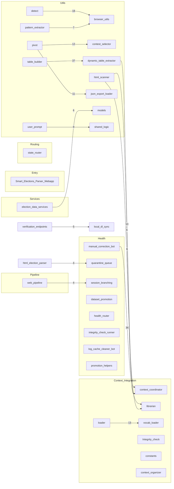
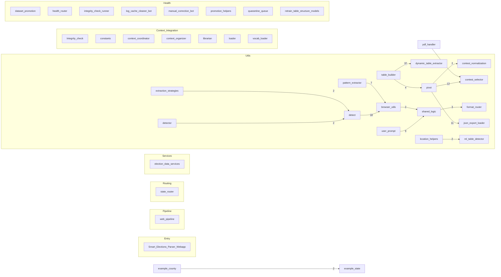
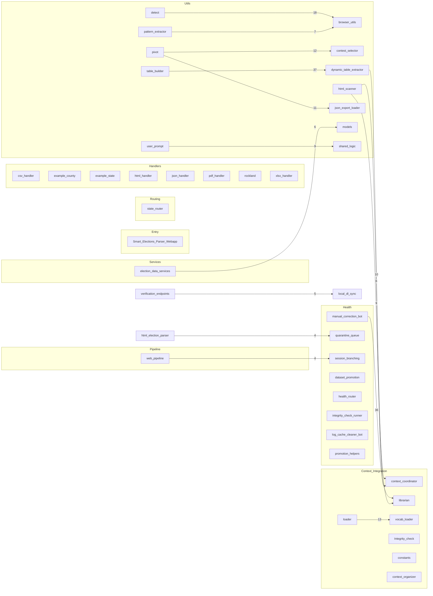

Audit scope: `webapp/parser/` modules.

Modules scanned: 197 | ~73505 non-empty LOC

## Pipeline map (Mermaid)



## Connection highlights

Key module-to-module and cluster relationships to watch during refactors.

### Top module edges

- `table_builder` → `dynamic_table_extractor` (37 refs, Utils → Utils)
- `manual_correction_bot` → `librarian` (36 refs, Health → Context_Integration)
- `detect` → `browser_utils` (18 refs, Utils → Utils)
- `loader` → `vocab_loader` (13 refs, Context_Integration → Context_Integration)
- `pivot` → `contest_selector` (12 refs, Utils → Utils)
- `pivot` → `json_export_loader` (11 refs, Utils → Utils)
- `dynamic_table_extractor` → `context_coordinator` (10 refs, Utils →
  Context_Integration)
- `html_scanner` → `librarian` (9 refs, Utils → Context_Integration)
- `user_prompt` → `shared_logic` (9 refs, Utils → Utils)
- `pattern_extractor` → `browser_utils` (7 refs, Utils → Utils)

### Cluster flow summary

- Utils → Utils: 1089 edges (intra-cluster)
- Format Handlers → Format Handlers: 234 edges (intra-cluster)
- Health → Health: 174 edges (intra-cluster)
- Entry → Entry: 172 edges (intra-cluster)
- Context_Integration → Context_Integration: 170 edges (intra-cluster)
- Other → Other: 150 edges (intra-cluster)
- Health → Context_Integration: 39 edges (cross-cluster)
- Utils → Context_Integration: 38 edges (cross-cluster)
- Routing → Routing: 25 edges (intra-cluster)
- Services → Services: 17 edges (intra-cluster)

## Pipeline focus (compact)



## Cross-module hotspots

- webapp.parser.utils.dynamic_table_extractor:_emit ← 62 refs
  (dynamic_table_extractor.py)
- webapp.parser.Context_Integration.librarian:safe_path ← 50 refs (librarian.py)
- webapp.parser.utils.table_builder:_norm_header ← 50 refs (table_builder.py)
- webapp.parser.Context_Integration.context_coordinator:ContextCoordinator ← 32
  refs (context_coordinator.py)
- webapp.parser.utils.pdf_table_utils:_record_recon_event ← 23 refs
  (pdf_table_utils.py)
- webapp.parser.html_election_parser:mark_url_processed ← 21 refs
  (html_election_parser.py)
- webapp.parser.utils.contest_selector:_norm_key ← 20 refs (contest_selector.py)
- webapp.parser.utils.pivot:_safe_col_name ← 20 refs (pivot.py)
- webapp.parser.handlers.formats.pdf_handler:_ensure_not_cancelled ← 19 refs
  (pdf_handler.py)
- webapp.parser.utils.shared_logic:safe_lower ← 18 refs (shared_logic.py)
- webapp.parser.utils.db_utils:get_session ← 17 refs (db_utils.py)
- webapp.Smart_Elections_Parser_Weba:get_request_principal ← 16 refs
  (Smart_Elections_Parser_Webapp.py)
- webapp.parser.Context_Integration.library.entity_confidence_ma:SignalCoefficient
  ← 16 refs (entity_confidence_map.py)
- webapp.parser.utils.rawjson_utils:_rj_first ← 16 refs (rawjson_utils.py)
- webapp.Smart_Elections_Parser_Weba:resolve_session_id ← 15 refs
  (Smart_Elections_Parser_Webapp.py)

## Leaf modules (candidates for review)

- `location_inference.py`
- `loader.py`
- `_ocr_helpers.py`
- `ocr_tuning.py`
- `fec_handler.py`
- `download_finder.py`
- `html_dynamic_fallback.py`
- `alabama.py`
- `alaska.py`
- `american_samoa.py`
- `arizona.py`
- `arkansas.py`
- `california.py`
- `colorado.py`
- `connecticut.py`
- `delaware.py`
- `district_of_columbia.py`
- `example_county.py`
- `florida.py`
- `georgia.py`
- `guam.py`
- `hawaii.py`
- `idaho.py`
- `illinois.py`
- `indiana.py`
- `iowa.py`
- `kansas.py`
- `kentucky.py`
- `louisiana.py`
- `maine.py`
- `maryland.py`
- `massachusetts.py`
- `michigan.py`
- `minnesota.py`
- `mississippi.py`
- `missouri.py`
- `montana.py`
- `nebraska.py`
- `nevada.py`
- `new_hampshire.py`
- `new_jersey.py`
- `new_mexico.py`
- `rockland.py`
- `new_york.py`
- `north_carolina.py`
- `north_dakota.py`
- `northern_mariana_islands.py`
- `ohio.py`
- `oklahoma.py`
- `oregon.py`
- (+27 more hidden)

## Pipeline clusters (Mermaid)



## Modules

### webapp/Smart\_Elections\_Parser\_Webapp.py {#webapp-smart-elections-parser-webapp-py}

- Definitions:
  - function: `\_flagged\_url\_log\_dir` (line 191)
  - function: `\_rotate\_flagged\_url\_path` (line 199)
  - function: `\_prune\_flagged\_url\_logs` (line 217)
  - function: `log\_flagged\_url` (line 233)
  - function: `\_require\_health\_auth` (line 377)
  - function: `\_health\_auth\_response` (line 396)
  - function: `\_public\_health\_task\_definitions` (line 401)
  - function: `\_get\_health\_tasks` (line 413)
  - function: `\_get\_health\_task` (line 420)
  - function: `\_append\_health\_task\_log` (line 426)
  - function: `\_trim\_health\_task\_history` (line 442)
  - function: `\_finalize\_health\_task` (line 454)
  - function: `\_launch\_health\_task` (line 465)
  - function: `\_run\_health\_task` (line 489)
  - function: `ensure\_utf8` (line 539)
  - function: `\_is\_request\_secure` (line 553)
  - class: `EnsureWsSecurityHeaders` (line 561)
  - function: `\_socket\_payload\_too\_large` (line 689)
  - function: `\_rate\_limit\_socket\_action` (line 700)
  - function: `\_rate\_limit` (line 714)
  - function: `\_generate\_upload\_filename` (line 719)
  - function: `\_enforce\_request\_size` (line 725)
  - function: `\_validate\_uploaded\_file` (line 734)
  - function: `\_save\_uploaded\_file` (line 777)
  - function: `\_log\_download\_access` (line 800)
  - function: `\_resolve\_output\_metadata\_path` (line 810)
  - function: `\_is\_output\_download\_allowed` (line 822)
  - function: `is\_owner` (line 841)
  - function: `create\_session\_metadata` (line 845)
  - function: `\_recover\_stale\_session` (line 848)
  - function: `cleanup\_sessions` (line 876)
  - function: `transition\_session` (line 904)
  - function: `cleanup\_old\_log\_files` (line 943)
  - function: `client\_fingerprint` (line 964)
  - function: `get\_request\_principal` (line 974)
  - function: `resolve\_session\_id` (line 993)
  - function: `emit\_contest\_options` (line 1102)
  - function: `\_promote\_inner` (line 1140)
  - function: `ensure\_db\_tables` (line 1162)
  - function: `normalize\_log\_obj` (line 1191)
  - function: `store\_log` (line 1323)
  - function: `\_heartbeat\_loop` (line 1335)
  - function: `socketio\_emit\_func` (line 1350)
  - function: `get\_prompt\_queue` (line 1458)
  - function: `broadcast\_sessions` (line 1461)
  - function: `lock\_session` (line 1478)
  - function: `unlock\_session` (line 1489)
  - function: `safe\_is\_alive` (line 1500)
  - function: `is\_output\_bypassed` (line 1520)
  - function: `get\_manual\_source` (line 1523)
  - function: `get\_manual\_source\_origin` (line 1526)
  - function: `get\_all\_file\_lists` (line 1529)
  - function: `get\_session\_enums` (line 1537)
  - function: `redirect\_to\_https\_www` (line 1554)
  - function: `\_csp\_nonce` (line 1626)
  - function: `build\_csp` (line 1635)
  - function: `add\_headers` (line 1711)
  - function: `\_handle\_global\_exception` (line 1788)
  - function: `add\_url` (line 1835)
  - function: `allowed\_file` (line 1847)
  - function: `get\_url\_list` (line 1856)
  - function: `list\_urls` (line 1872)
  - function: `log\_run\_event` (line 1898)
  - function: `\_validate\_filter\_value` (line 1922)
  - function: `log\_db\_monitor\_event` (line 1939)
  - function: `index` (line 1950)
  - function: `api\_urls` (line 1955)
  - function: `data\_framework` (line 2045)
  - function: `\_collect\_data\_framework\_scaffold` (line 2049)
  - function: `api\_data\_framework\_scaffold` (line 2104)
  - function: `api\_data\_framework\_scaffold\_csv` (line 2118)
  - function: `api\_data\_framework\_exports` (line 2143)
  - function: `azure\_health\_page` (line 2192)
  - function: `api\_list\_health\_tasks` (line 2213)
  - function: `api\_start\_health\_task` (line 2221)
  - function: `api\_health\_task\_detail` (line 2236)
  - function: `test\_ui\_prompt` (line 2247)
  - function: `api\_fs\_list` (line 2298)
  - function: `api\_list\_dir\_compat` (line 2344)
  - function: `api\_fs\_mkdir` (line 2348)
  - function: `api\_fs\_delete` (line 2378)
  - function: `download\_fs` (line 2415)
  - function: `view\_csv` (line 2494)
  - function: `\_build\_or\_load\_csv\_index` (line 2684)
  - function: `csv\_locate` (line 2732)
  - function: `favicon` (line 2774)
  - function: `robots\_txt` (line 2834)
  - function: `serve\_well\_known\_appspecific` (line 2840)
  - function: `api\_warehouse\_election\_results` (line 2849)
  - function: `delete\_input\_file` (line 3094)
  - function: `delete\_output\_file` (line 3104)
  - function: `delete\_upload\_file` (line 3114)
  - function: `download\_input\_file` (line 3124)
  - function: `download\_output\_file` (line 3128)
  - function: `download\_upload\_file` (line 3212)
  - function: `ballot\_lens` (line 3216)
  - function: `ballot\_lens\_modern` (line 3248)
  - function: `site\_webmanifest` (line 3252)
  - function: `quality\_dashboard` (line 3290)
  - function: `quick\_reference\_page` (line 3296)
  - function: `api\_quality\_metrics` (line 3301)
  - function: `api\_auth\_certificate\_info` (line 3371)
  - function: `auth\_welcome` (line 3410)
  - function: `upload\_to\_input` (line 3439)
  - function: `upload\_to\_output` (line 3492)
  - function: `upload\_to\_uploads` (line 3543)
  - function: `health` (line 3593)
  - function: `heartbeat` (line 3597)
  - function: `clear\_history` (line 3601)
  - function: `history` (line 3611)
  - function: `rerun\_prior` (line 3654)
  - function: `handle\_contest\_selected` (line 3686)
  - function: `handle\_get\_session\_history` (line 3727)
  - function: `handle\_clone\_session` (line 3779)
  - function: `on\_join` (line 3823)
  - function: `handle\_get\_sessions` (line 3862)
  - function: `handle\_connect` (line 3869)
  - function: `handle\_disconnect` (line 4049)
  - function: `handle\_set\_output\_mode` (line 4079)
  - function: `handle\_parser\_prompt` (line 4108)
  - function: `handle\_prompt\_cancel` (line 4165)
  - function: `handle\_cancel\_parser` (line 4217)
  - function: `handle\_toggle\_output\_bypass` (line 4282)
  - function: `handle\_set\_manual\_source` (line 4311)
  - function: `handle\_delete\_session` (line 4357)
  - function: `handle\_ballot\_lens` (line 4379)
  - function: `\_read\_jsonl` (line 4717)
  - function: `fec\_mappings\_review` (line 4738)
  - function: `api\_fec\_problem\_rows` (line 4781)
  - function: `api\_fec\_save\_mapping` (line 4805)
- Imports:
  - **Standard Library** (18):
    - `import os as os` (line 4)
    - `import csv as csv` (line 44)
    - `import json as json` (line 46)
    - `import re as re` (line 47)
    - `import shutil as shutil` (line 49)
    - `import subprocess as subprocess` (line 50)
    - `import sys as sys` (line 51)
    - `import threading as threading` (line 52)
    - `import time as time` (line 53)
    - `from datetime import datetime` (line 54)
    - `from datetime import timedelta` (line 54)
    - `from datetime import timezone` (line 54)
    - `from pathlib import Path` (line 55)
    - `from threading import Event` (line 56)
    - `from threading import Thread` (line 56)
    - `from typing import Callable` (line 57)
    - `from typing import Tuple` (line 57)
    - `from urllib.parse import urlparse` (line 58)
  - **Third-party** (68):
    - `import orjson as orjson` (line 60)
    - `import psycopg2 as psycopg2` (line 61)
    - `from flask import Flask` (line 62)
    - `from flask import Response` (line 62)
    - `from flask import flash` (line 62)
    - `from flask import g` (line 62)
    - `from flask import jsonify` (line 62)
    - `from flask import redirect` (line 62)
    - `from flask import render_template` (line 62)
    - `from flask import request` (line 62)
    - `from flask import send_file` (line 62)
    - `from flask import send_from_directory` (line 62)
    - `from flask import session` (line 62)
    - `from flask import url_for` (line 62)
    - `from psycopg2 import errors as pg_errors` (line 76)
    - `from sqlalchemy.exc import OperationalError` (line 77)
    - `from werkzeug.exceptions import HTTPException` (line 78)
    - `from werkzeug.exceptions import NotFound` (line 78)
    - `from webapp.parser.health.integrity_monitor import get_integrity_monitor`
      (line 108)
    - `from webapp.parser.health.session_manager import SessionManager` (line
      109)
    - `from webapp.parser.utils.logger_singleton import logger` (line 110)
    - `from webapp.parser.utils.logger_singleton import prompt` (line 110)
    - `from webapp.parser.utils.session_state import DEFAULT_PHASE_BY_STATE`
      (line 111)
    - `from webapp.parser.utils.session_state import PipelinePhase` (line 111)
    - `from webapp.parser.utils.session_state import SessionState` (line 111)
    - `from webapp.parser.utils.session_state import export_session_enums` (line
      111)
    - `from webapp.parser.config import ALLOW_GOOGLE_DOCS` (line 126)
    - `from webapp.parser.config import ALLOW_LEGACY_OUTPUT_DOWNLOAD` (line 126)
    - `from webapp.parser.config import DATA_API_URL` (line 126)
    - `from webapp.parser.config import DEPLOY_ENV` (line 126)
    - `from webapp.parser.config import INPUT_DIR` (line 126)
    - `from webapp.parser.config import LOG_DIR` (line 126)
    - `from webapp.parser.config import MAX_CSV_ROWS` (line 126)
    - `from webapp.parser.config import MAX_PDF_PAGES` (line 126)
    - `from webapp.parser.config import MAX_SOCKET_EVENT_BYTES` (line 126)
    - `from webapp.parser.config import MAX_SOCKET_LOG_BYTES` (line 126)
    - `from webapp.parser.config import MAX_UPLOAD_BYTES` (line 126)
    - `from webapp.parser.config import MAX_UPLOAD_SIZE_MB` (line 126)
    - `from webapp.parser.config import MAX_XLSX_BYTES` (line 126)
    - `from webapp.parser.config import OUTPUT_DIR` (line 126)
    - `from webapp.parser.config import POSTGRES_DB` (line 126)
    - `from webapp.parser.config import POSTGRES_HOST` (line 126)
    - `from webapp.parser.config import POSTGRES_PASSWORD_RAW` (line 126)
    - `from webapp.parser.config import POSTGRES_PORT` (line 126)
    - `from webapp.parser.config import POSTGRES_USER_RAW` (line 126)
    - `from webapp.parser.config import PROJECT_ROOT` (line 126)
    - `from webapp.parser.config import RUN_HISTORY_FILE` (line 126)
    - `from webapp.parser.config import SUPPORTED_EXTENSION_SET` (line 126)
    - `from webapp.parser.config import UPLOADS_DIR` (line 126)
    - `from webapp.parser.config import URL_ALLOWLIST_HOSTS` (line 126)
  - **Local/Project** (4):
    - `from __future__ import annotations` (line 1)
    - `import hmac as hmac` (line 3)
    - `import gzip as gzip` (line 45)
    - `import secrets as secrets` (line 48)
- Task markers:
  - L559 **WARNING**: ").upper().split(","))
  - L595 **WARNING**: ({
  - L596 **WARNING**: ",
  - L613 **WARNING**: ({
  - L614 **WARNING**: ",
  - L631 **WARNING**: ({
  - L632 **WARNING**: ",
  - L749 **WARNING**: ({
  - L750 **WARNING**: ",
  - L766 **WARNING**: ({
  - L767 **WARNING**: ",
  - L1194 **WARNING**: , ERROR, CRITICAL, TRACE
  - L1233 **WARNING**: ", "ERROR", "CRITICAL", "TRACE"}
  - L1269 **WARNING**: " in mlow:
  - L1763 **WARNING**:         # For websocket handshake only: add Cache-Control
    so webhint stops warning
  - L2784 **WARNING**: ({"type": "sec", "message": "Favicon path escape
    blocked", "requested": ico_path})
  - L2913 **WARNING**: ({
  - L2914 **WARNING**: ",
  - L2997 **WARNING**: ({
  - L2998 **WARNING**: ",
  - L3014 **WARNING**: ({
  - L3015 **WARNING**: ",
  - L3475 **WARNING**: ")
  - L3526 **WARNING**: ")
  - L3574 **WARNING**: ")
  - L3699 **WARNING**: ",
  - L3782 **WARNING**: (
  - L3784 **WARNING**: ",
  - L3794 **WARNING**: (
  - L3796 **WARNING**: ",
  - L3826 **WARNING**: (
  - L3828 **WARNING**: ",
  - L3896 **WARNING**: ({
  - L3897 **WARNING**: ",
  - L3909 **WARNING**: ({
  - L3910 **WARNING**: ",
  - L4008 **WARNING**: ({
  - L4009 **WARNING**: ",
  - L4142 **WARNING**: ({
  - L4143 **WARNING**: ",
  - L4179 **WARNING**: ({
  - L4180 **WARNING**: ",
  - L4229 **WARNING**: ({
  - L4230 **WARNING**: ",
  - L4293 **WARNING**: ({
  - L4294 **WARNING**: ",
  - L4323 **WARNING**: ({
  - L4324 **WARNING**: ",
  - L4360 **WARNING**: ({
  - L4361 **WARNING**: ",
- Outgoing cross-module calls (sample):
  - origin.strip (line 30)
  - \_RAW\_SOCKETIO\_ORIGINS.split (line 31)
  - origin.strip (line 32)
  - dotenv.load\_dotenv (line 120)
  - DB\_MONITOR\_FILE.touch (line 182)
  - webapp.parser.config.LOG\_DIR.mkdir (line 193)
  - datetime.datetime.now (line 201)
  - now.strftime (line 203)
  - prefix.with\_suffix (line 204)
  - candidate.exists (line 205)
  - candidate.stat (line 205)
  - prefix.with\_name (line 209)
  - cand.exists (line 210)
  - cand.stat (line 210)
  - datetime.datetime.now (line 218)
  - datetime.timedelta (line 219)
  - base.glob (line 222)
  - datetime.datetime.fromtimestamp (line 224)
  - entry.stat (line 224)
  - entry.unlink (line 226)
  - payload.setdefault (line 235)
  - datetime.datetime.now (line 235)
  - f.write (line 239)
  - orjson.dumps (line 239)
  - flask.Flask (line 246)
  - flask.Response (line 281)
  - webapp.parser.utils.logger\_singleton.logger.error (line 284)
  - flask.Response (line 287)
  - app.route (line 277)
  - flask.jsonify (line 296)
  - flask.jsonify (line 299)
  - flask.jsonify (line 301)
  - app.route (line 291)
  - webapp.parser.utils.logger\_singleton.logger.info (line 304)
  - webapp.parser.utils.logger\_singleton.logger.debug (line 314)
  - threading.Lock (line 371)
  - flask.jsonify (line 380)
  - auth\_header.lower (line 385)
  - auth\_header.split (line 386)
  - hmac.compare\_digest (line 389)
  - flask.jsonify (line 391)
  - HEALTH\_TASK\_DEFINITIONS.items (line 403)
  - entries.append (line 404)
  - meta.get (line 408)
  - \_HEALTH\_TASK\_RUNS.values (line 415)
  - records.sort (line 416)
  - item.get (line 416)
  - \_HEALTH\_TASK\_RUNS.get (line 422)
  - chunk.endswith (line 429)
  - \_HEALTH\_TASK\_RUNS.get (line 432)
- Inbound references:
  - \_flagged\_url\_log\_dir ← Smart_Elections_Parser_Webapp.py:202
  - \_flagged\_url\_log\_dir ← Smart_Elections_Parser_Webapp.py:220
  - \_rotate\_flagged\_url\_path ← Smart_Elections_Parser_Webapp.py:236
  - \_prune\_flagged\_url\_logs ← Smart_Elections_Parser_Webapp.py:243
  - log\_flagged\_url ← Smart_Elections_Parser_Webapp.py:1990
  - log\_flagged\_url ← Smart_Elections_Parser_Webapp.py:2021
  - log\_flagged\_url ← Smart_Elections_Parser_Webapp.py:2029
  - log\_flagged\_url ← Smart_Elections_Parser_Webapp.py:3469
  - log\_flagged\_url ← Smart_Elections_Parser_Webapp.py:3520
  - log\_flagged\_url ← Smart_Elections_Parser_Webapp.py:3565
  - \_require\_health\_auth ← Smart_Elections_Parser_Webapp.py:397
  - \_health\_auth\_response ← Smart_Elections_Parser_Webapp.py:2193
  - \_health\_auth\_response ← Smart_Elections_Parser_Webapp.py:2214
  - \_health\_auth\_response ← Smart_Elections_Parser_Webapp.py:2222
  - \_health\_auth\_response ← Smart_Elections_Parser_Webapp.py:2237
  - \_public\_health\_task\_definitions ← Smart_Elections_Parser_Webapp.py:2205
  - \_get\_health\_tasks ← Smart_Elections_Parser_Webapp.py:2208
  - \_get\_health\_tasks ← Smart_Elections_Parser_Webapp.py:2217
  - \_get\_health\_task ← Smart_Elections_Parser_Webapp.py:2240
  - \_append\_health\_task\_log ← Smart_Elections_Parser_Webapp.py:496
  - \_append\_health\_task\_log ← Smart_Elections_Parser_Webapp.py:504
  - \_append\_health\_task\_log ← Smart_Elections_Parser_Webapp.py:508
  - \_append\_health\_task\_log ← Smart_Elections_Parser_Webapp.py:520
  - \_append\_health\_task\_log ← Smart_Elections_Parser_Webapp.py:527
  - \_append\_health\_task\_log ← Smart_Elections_Parser_Webapp.py:529
  - \_trim\_health\_task\_history ← Smart_Elections_Parser_Webapp.py:483
  - \_finalize\_health\_task ← Smart_Elections_Parser_Webapp.py:497
  - \_finalize\_health\_task ← Smart_Elections_Parser_Webapp.py:531
  - \_launch\_health\_task ← Smart_Elections_Parser_Webapp.py:2231
  - ensure\_utf8 ← Smart_Elections_Parser_Webapp.py:1783
  - \_is\_request\_secure ← Smart_Elections_Parser_Webapp.py:1776
  - EnsureWsSecurityHeaders ← Smart_Elections_Parser_Webapp.py:582
  - \_socket\_payload\_too\_large ← Smart_Elections_Parser_Webapp.py:4114
  - \_socket\_payload\_too\_large ← Smart_Elections_Parser_Webapp.py:4114
  - \_rate\_limit\_socket\_action ← Smart_Elections_Parser_Webapp.py:4141
  - \_rate\_limit\_socket\_action ← Smart_Elections_Parser_Webapp.py:4178
  - \_rate\_limit\_socket\_action ← Smart_Elections_Parser_Webapp.py:4228
  - \_rate\_limit\_socket\_action ← Smart_Elections_Parser_Webapp.py:4292
  - \_rate\_limit\_socket\_action ← Smart_Elections_Parser_Webapp.py:4322
  - \_rate\_limit\_socket\_action ← Smart_Elections_Parser_Webapp.py:4396
  - \_rate\_limit ← Smart_Elections_Parser_Webapp.py:1954
  - \_rate\_limit ← Smart_Elections_Parser_Webapp.py:3438
  - \_rate\_limit ← Smart_Elections_Parser_Webapp.py:3491
  - \_rate\_limit ← Smart_Elections_Parser_Webapp.py:3542
  - \_generate\_upload\_filename ← Smart_Elections_Parser_Webapp.py:784
  - \_generate\_upload\_filename ← Smart_Elections_Parser_Webapp.py:3465
  - \_generate\_upload\_filename ← Smart_Elections_Parser_Webapp.py:3516
  - \_generate\_upload\_filename ← Smart_Elections_Parser_Webapp.py:3561
  - \_enforce\_request\_size ← Smart_Elections_Parser_Webapp.py:780
  - \_validate\_uploaded\_file ← Smart_Elections_Parser_Webapp.py:791

### Context\_Integration/Context\_Library/constants.py {#webapp-parser-context-integration-context-library-constants-py}

- Definitions:
  - function: `build\_state\_to\_division\_type\_map` (line 691)
  - function: `get\_party\_code\_info` (line 1358)
  - function: `\_sanitize\_party\_token` (line 2573)
  - function: `normalize\_party\_code` (line 2592)
  - function: `canonical\_ballot\_group` (line 2619)
  - function: `split\_and\_normalize\_ballot\_groups` (line 2646)
  - function: `normalize\_result\_group\_label` (line 2665)
  - function: `normalize\_party\_label` (line 2683)
  - function: `is\_pseudo\_result\_party` (line 2713)
  - function: `\_iter\_strings` (line 2884)
  - function: `\_compile\_union` (line 2895)
  - function: `\_norm\_state\_key` (line 2938)
  - function: `\_norm\_county\_key` (line 2949)
  - function: `\_collect\_layered\_patterns` (line 2958)
  - function: `get\_camelot\_title\_regex` (line 2969)
  - function: `get\_camelot\_row\_regex` (line 2979)
  - function: `build\_camelot\_row\_filter` (line 2992)
- Imports:
  - **Standard Library** (11):
    - `import re as re` (line 1)
    - `from functools import lru_cache` (line 2)
    - `from typing import Any` (line 3)
    - `from typing import Callable` (line 3)
    - `from typing import Dict` (line 3)
    - `from typing import Iterable` (line 3)
    - `from typing import List` (line 3)
    - `from typing import Optional` (line 3)
    - `from typing import Pattern` (line 3)
    - `from typing import Set` (line 3)
    - `from typing import Tuple` (line 3)
- Task markers:
  - L2005 **NOTE**: ._$",                     # Note
  - L2194 **WARNING**: ",
  - L2285 **WARNING**: ", "info_box", "navigation", "pagination", "tab",
    "modal", "tooltip", "ignore", "unknown"
  - L2318 **NOTE**: ", "comment",
  - L2394 **NOTE**: ", "Comment", "Feedback", "Suggestion", "Recommendation",
  - L2410 **NOTE**: ", "Comment", "Feedback", "Suggestion",
- Outgoing cross-module calls (sample):
  - DEFAULT\_DIVISION\_TYPE\_BY\_STATE.get (line 707)
  - KNOWN\_STATE\_TO\_COUNTY\_MAP.items (line 710)
  - DIVISION\_TYPE\_OVERRIDES.items (line 714)
  - KNOWN\_STATE\_TO\_COUNTY\_MAP.keys (line 750)
  - CANONICAL\_STATE\_ABBR.items (line 811)
  - k.upper (line 1252)
  - PARTY\_CODE\_MAP.items (line 1252)
  - PARTY\_CODE\_DESCRIPTIONS.get (line 1363)
  - t.lower (line 1526)
  - GROUP\_RENAME\_MAP.update (line 1528)
  - \_BALLOT\_INLINE\_ALIAS\_DEFAULTS.items (line 1581)
  - GROUP\_RENAME\_MAP.get (line 1584)
  - \_target.lower (line 1584)
  - \_token.lower (line 1585)
  - dict.fromkeys (line 1775)
  - label.strip (line 1776)
  - kw.title (line 1779)
  - label.strip (line 1781)
  - dict.fromkeys (line 1802)
  - dict.fromkeys (line 1819)
  - kw.lower (line 1823)
  - dict.fromkeys (line 1843)
  - re.escape (line 1885)
  - x.startswith (line 1885)
  - re.escape (line 1940)
  - re.escape (line 1941)
  - re.escape (line 1942)
  - re.escape (line 1943)
  - re.escape (line 1944)
  - re.escape (line 1945)
  - re.escape (line 1946)
  - re.escape (line 1947)
  - re.escape (line 1948)
  - re.escape (line 1949)
  - re.escape (line 1950)
  - re.escape (line 1951)
  - re.escape (line 1952)
  - re.compile (line 2145)
  - re.compile (line 2146)
  - re.compile (line 2147)
  - re.compile (line 2151)
  - re.compile (line 2225)
  - re.compile (line 2226)
  - GROUP\_RENAME\_MAP.items (line 2482)
  - \_k.lower (line 2483)
  - \_EXTRA\_BALLOT\_VARIANTS.items (line 2507)
  - BALLOT\_NAME\_CANON\_MAP.setdefault (line 2508)
  - \_PARTY\_CANON\_MAP.items (line 2562)
  - PARTY\_CODE\_MAP.items (line 2566)
  - PARTY\_NORMALIZATION\_MAP.setdefault (line 2567)
- Inbound references:
  - build\_state\_to\_division\_type\_map ← constants.py:721
  - \_sanitize\_party\_token ← constants.py:2602
  - \_sanitize\_party\_token ← constants.py:2697
  - normalize\_party\_code ← constants.py:2700
  - canonical\_ballot\_group ← constants.py:2654
  - canonical\_ballot\_group ← constants.py:2657
  - canonical\_ballot\_group ← constants.py:2678
  - canonical\_ballot\_group ← salvage.py:93
  - normalize\_party\_label ← constants.py:2717
  - is\_pseudo\_result\_party ← constants.py:3008
  - \_iter\_strings ← constants.py:2989
  - \_compile\_union ← constants.py:2976
  - \_compile\_union ← constants.py:2990
  - \_norm\_state\_key ← constants.py:2960
  - \_norm\_county\_key ← constants.py:2961
  - \_collect\_layered\_patterns ← constants.py:2975
  - \_collect\_layered\_patterns ← constants.py:2986
  - \_collect\_layered\_patterns ← constants.py:2987
  - get\_camelot\_title\_regex ← constants.py:2999
  - get\_camelot\_row\_regex ← constants.py:3000

### Context\_Integration/Integrity\_check.py {#webapp-parser-context-integration-integrity-check-py}

- Definitions:
  - function: `\_trim\_monitor\_log` (line 47)
  - function: `log\_integrity\_monitor` (line 70)
  - function: `\_ensure\_alerts\_table` (line 80)
  - function: `find\_date\_anomalies` (line 87)
  - function: `detect\_anomalies\_with\_ml` (line 95)
  - function: `election\_integrity\_checks` (line 182)
  - function: `advanced\_cross\_field\_validation` (line 203)
  - function: `summarize\_context\_entities` (line 212)
  - function: `analyze\_contests` (line 221)
  - function: `auto\_tune\_contamination` (line 267)
  - function: `print\_issues\_table` (line 288)
  - function: `print\_entity\_summary` (line 308)
  - function: `print\_ml\_anomalies` (line 316)
  - function: `print\_date\_anomalies` (line 346)
  - function: `print\_auto\_tune\_result` (line 364)
  - function: `print\_analyze\_contests` (line 370)
  - function: `monitor\_db\_for\_alerts` (line 382)
  - function: `log\_integrity\_issues` (line 428)
  - function: `detect\_statistical\_outliers` (line 444)
  - function: `print\_integrity\_summary` (line 480)
- Imports:
  - **Standard Library** (9):
    - `import re as re` (line 3)
    - `import threading as threading` (line 4)
    - `import time as time` (line 5)
    - `from collections import Counter` (line 6)
    - `from pathlib import Path` (line 7)
    - `from typing import Any` (line 8)
    - `from typing import Dict` (line 8)
    - `from typing import List` (line 8)
    - `from typing import Tuple` (line 8)
  - **Third-party** (3):
    - `import numpy as np` (line 11)
    - `import orjson as orjson` (line 12)
    - `from sqlalchemy import select` (line 18)
  - **Local/Project** (25):
    - `from __future__ import annotations` (line 1)
    - `import matplotlib as matplotlib` (line 10)
    - `from rich.panel import Panel` (line 13)
    - `from rich.table import Table` (line 14)
    - `from sklearn.cluster import DBSCAN` (line 15)
    - `from sklearn.ensemble import IsolationForest` (line 16)
    - `from sklearn.preprocessing import LabelEncoder` (line 17)
    - `from config import CONTEXT_DB_PATH` (line 20)
    - `from config import CONTEXT_LIBRARY_PATH` (line 20)
    - `from config import LOG_DIR` (line 20)
    - `from Context_Integration.librarian import clean_for_json` (line 21)
    - `from utils import misc_utils` (line 22)
    - `from utils.db_utils import get_session` (line 23)
    - `from utils.logger_singleton import console` (line 24)
    - `from utils.models import Alert` (line 25)
    - `from utils.privilege_tiers import PrivilegeTier` (line 26)
    - `from utils.shared_logic import safe_all` (line 27)
    - `from utils.shared_logic import safe_encode` (line 27)
    - `from utils.shared_logic import safe_execute` (line 27)
    - `from utils.shared_logic import safe_get` (line 27)
    - `from utils.shared_logic import safe_items` (line 27)
    - `from utils.shared_logic import safe_tolist` (line 27)
    - `from utils.spacy_utils import extract_dates` (line 35)
    - `from utils.spacy_utils import extract_entities` (line 35)
    - `from utils.spacy_utils import flag_suspicious_contests` (line 35)
- Outgoing cross-module calls (sample):
  - matplotlib.use (line 38)
  - pathlib.Path (line 41)
  - INTEGRITY\_MONITOR\_LOG.touch (line 43)
  - path.exists (line 48)
  - path.stat (line 51)
  - path.open (line 54)
  - handle.seek (line 57)
  - handle.read (line 58)
  - tail.find (line 62)
  - path.open (line 65)
  - handle.write (line 66)
  - payload.setdefault (line 72)
  - time.time (line 72)
  - INTEGRITY\_MONITOR\_LOG.open (line 74)
  - handle.write (line 75)
  - orjson.dumps (line 75)
  - utils.spacy\_utils.extract\_dates (line 90)
  - utils.shared\_logic.safe\_get (line 90)
  - anomalies.append (line 92)
  - numpy.array (line 105)
  - sklearn.preprocessing.LabelEncoder (line 107)
  - sklearn.preprocessing.LabelEncoder (line 108)
  - sklearn.preprocessing.LabelEncoder (line 109)
  - utils.shared\_logic.safe\_get (line 110)
  - utils.shared\_logic.safe\_get (line 111)
  - utils.shared\_logic.safe\_get (line 112)
  - le\_state.fit (line 113)
  - le\_county.fit (line 114)
  - le\_type.fit (line 115)
  - le\_state.transform (line 119)
  - utils.shared\_logic.safe\_get (line 119)
  - le\_county.transform (line 120)
  - utils.shared\_logic.safe\_get (line 120)
  - le\_type.transform (line 121)
  - utils.shared\_logic.safe\_get (line 121)
  - utils.shared\_logic.safe\_get (line 122)
  - utils.shared\_logic.safe\_get (line 122)
  - utils.shared\_logic.safe\_get (line 123)
  - utils.shared\_logic.safe\_get (line 124)
  - utils.shared\_logic.safe\_get (line 124)
  - utils.shared\_logic.safe\_get (line 125)
  - utils.shared\_logic.safe\_get (line 125)
  - trust\_factors.get (line 132)
  - trust\_factors.get (line 133)
  - trust\_factors.get (line 134)
  - trust\_factors.get (line 134)
  - trust\_factors.get (line 135)
  - trust\_factors.get (line 136)
  - trust\_factors.get (line 137)
  - trust\_factors.get (line 138)
- Inbound references:
  - \_trim\_monitor\_log ← Integrity_check.py:76
  - log\_integrity\_monitor ← Integrity_check.py:247
  - \_ensure\_alerts\_table ← Integrity_check.py:83
  - find\_date\_anomalies ← Integrity_check.py:223
  - detect\_anomalies\_with\_ml ← Integrity_check.py:224
  - election\_integrity\_checks ← Integrity_check.py:222
  - advanced\_cross\_field\_validation ← Integrity_check.py:502
  - summarize\_context\_entities ← Integrity_check.py:498
  - summarize\_context\_entities ← manual_correction_bot.py:1132
  - analyze\_contests ← html_election_parser.py:641
  - analyze\_contests ← Integrity_check.py:488
  - analyze\_contests ← manual_correction_bot.py:1112
  - auto\_tune\_contamination ← Integrity_check.py:507
  - print\_issues\_table ← Integrity_check.py:371
  - print\_issues\_table ← Integrity_check.py:503
  - print\_entity\_summary ← Integrity_check.py:499
  - print\_ml\_anomalies ← Integrity_check.py:373
  - print\_date\_anomalies ← Integrity_check.py:372
  - print\_auto\_tune\_result ← Integrity_check.py:508
  - print\_analyze\_contests ← Integrity_check.py:495
  - print\_integrity\_summary ← html_election_parser.py:699
  - print\_integrity\_summary ← html_election_parser.py:747

### Context\_Integration/\_\_init\_\_.py {#webapp-parser-context-integration-init-py}

> Context integration module for election results.

### Context\_Integration/context\_coordinator.py {#webapp-parser-context-integration-context-coordinator-py}

> context_coordinator.py

- Definitions:
  - function: `get\_semantic\_score` (line 97)
  - function: `merge\_and\_rank\_candidates` (line 166)
  - function: `dynamic\_state\_county\_detection` (line 256)
  - class: `ContextCoordinator` (line 857)
- Imports:
  - **Standard Library** (14):
    - `import os as os` (line 15)
    - `import re as re` (line 16)
    - `import subprocess as subprocess` (line 17)
    - `import threading as threading` (line 18)
    - `from collections import Counter` (line 19)
    - `from collections import defaultdict` (line 19)
    - `from datetime import datetime` (line 20)
    - `from datetime import timezone` (line 20)
    - `from typing import Any` (line 21)
    - `from typing import Callable` (line 21)
    - `from typing import Dict` (line 21)
    - `from typing import List` (line 21)
    - `from typing import Optional` (line 21)
    - `from typing import Tuple` (line 21)
  - **Third-party** (2):
    - `import numpy as np` (line 23)
    - `import orjson as orjson` (line 24)
  - **Local/Project** (69):
    - `from __future__ import annotations` (line 11)
    - `import difflib as difflib` (line 13)
    - `import numbers as numbers` (line 14)
    - `from rapidfuzz import fuzz` (line 25)
    - `from rapidfuzz import process` (line 25)
    - `from sklearn.preprocessing import LabelEncoder` (line 26)
    - `from config import BATCH_MAX_WORKERS` (line 28)
    - `from config import CONTEXT_LIBRARY_PATH` (line 28)
    - `from config import LOG_DIR` (line 28)
    - `from config import PROJECT_ROOT` (line 28)
    - `from handlers.batch_handler import BatchProcessor` (line 29)
    - `from services.election_data_services import ElectionDataService` (line
      30)
    - `from utils.browser_utils import safe_click` (line 31)
    - `from utils.browser_utils import safe_count` (line 31)
    - `from utils.browser_utils import safe_evaluate` (line 31)
    - `from utils.browser_utils import safe_get_attribute` (line 31)
    - `from utils.browser_utils import safe_inner_text` (line 31)
    - `from utils.browser_utils import safe_is_enabled` (line 31)
    - `from utils.browser_utils import safe_is_visible` (line 31)
    - `from utils.browser_utils import safe_locator` (line 31)
    - `from utils.browser_utils import safe_nth` (line 31)
    - `from utils.browser_utils import safe_wait_for_timeout` (line 31)
    - `from utils.browser_utils import scan_buttons_with_progress` (line 31)
    - `from utils.html_scanner import deduplicate_pattern_kb` (line 44)
    - `from utils.html_scanner import get_segment_embedding` (line 44)
    - `from utils.html_scanner import load_pattern_kb` (line 44)
    - `from utils.logger_singleton import logger` (line 49)
    - `from utils.model_registry import ModelRegistry` (line 50)
    - `from utils.shared_logic import keyphrase_match` (line 51)
    - `from utils.shared_logic import normalize_county_name` (line 51)
    - `from utils.shared_logic import normalize_state_name` (line 51)
    - `from utils.shared_logic import safe_append` (line 51)
    - `from utils.shared_logic import safe_endswith` (line 51)
    - `from utils.shared_logic import safe_filename` (line 51)
    - `from utils.shared_logic import safe_get` (line 51)
    - `from utils.shared_logic import safe_get_first` (line 51)
    - `from utils.shared_logic import safe_isupper` (line 51)
    - `from utils.shared_logic import safe_items` (line 51)
    - `from utils.shared_logic import safe_lower` (line 51)
    - `from utils.shared_logic import safe_model_encode` (line 51)
    - `from utils.shared_logic import safe_replace` (line 51)
    - `from utils.shared_logic import safe_similarity` (line 51)
    - `from utils.shared_logic import safe_startswith` (line 51)
    - `from utils.shared_logic import safe_strip` (line 51)
    - `from utils.shared_logic import safe_tolist` (line 51)
    - `from utils.shared_logic import sync_type_and_election_types` (line 51)
    - `from utils.spacy_utils import extract_dates` (line 71)
    - `from utils.spacy_utils import extract_entities` (line 71)
    - `from utils.spacy_utils import extract_locations` (line 71)
    - `from Context_Library.constants import BALLOT_TYPES` (line 72)
- Task markers:
  - L896 **WARNING**: ("\[ALERT MONITOR\] Thread did not stop cleanly.")
  - L984 **WARNING**: ({
  - L985 **WARNING**: ",
  - L1383 **WARNING**: (f"\[yellow\]Integrity issues:\[/yellow\]
    {issues\['integrity_issues'\]}")
  - L1622 **WARNING**: (f"\[ContextCoordinator\] No table structure found for
    contest: {contest}")
  - L1799 **WARNING**: (f"\[get_feedback_pattern_kb\] Skipping corrupt line:
    {e}")
  - L1911 **WARNING**: ("\[group_dom_nodes_by_label\] No organized DOM parts.
    (Further warnings suppressed)")
  - L1913 **WARNING**: (f"\[group_dom_nodes_by_label\] No organized DOM parts.
    (Occurred {ContextCoordinator._dom_parts_warning_count} times)")
  - L1918 **WARNING**: ("\[group_dom_nodes_by_label\] No DOM nodes found.")
  - L1936 **WARNING**: ("\[submit_user_feedback\] ContextOrganizer has no
    submit_user_feedback method.")
  - L1964 **WARNING**: (f"\[correct_and_update_contest\] Contest {contest_id}
    missing type/election_types after sync.")
  - L1988 **WARNING**: ("\[print_contest_summary\] No organized contests to
    summarize.")
  - L2001 **WARNING**: ("\[plot_contest_distribution\] No organized contests to
    plot.")
  - L2052 **WARNING**: ("No organized DOM parts.")
  - L2055 **WARNING**: ("No organized DOM parts. (Further warnings suppressed)")
  - L2066 **WARNING**: ("\[get_contest_groups\] No contest groups found.")
  - L2075 **WARNING**: ("\[get_panel_groups\] No panel groups found.")
  - L2084 **WARNING**: ("\[get_button_groups\] No button groups found.")
  - L2093 **WARNING**: ("\[get_table_groups\] No table groups found.")
  - L2102 **WARNING**: ("\[get_relationships\] No organized context.")
  - L2210 **WARNING**: (f"\[fuzzy_score\] One or both inputs are empty:
    a='{a_str}', b='{b_str}'")
  - L2216 **WARNING**: (f"\[fuzzy_score\] One or both inputs are too short:
    a='{a_str}', b='{b_str}'")
  - L2662 **WARNING**: (f"\[extract_field\] Unknown field_type: {field_type}")
  - L2920 **WARNING**: (f"\[get_full_contest\] Contest {contest_id} missing
    type/election_types after sync.")
  - L3005 **WARNING**: (f"\[list_tables\] Table '{tbl}' missing metadata or
    columns.")
  - L3037 **WARNING**: (f"\[get_table_metadata\] Table '{table_name}' missing
    columns.")
  - L3055 **WARNING**: (f"\[check_missing_tables\] Missing tables: {missing}")
  - L3116 **WARNING**: (f"\[save_table_structure\] Failed to save structure for
    contest: {contest}")
  - L3293 **WARNING**: (f"\[get_best_button_advanced\] Contest argument was not
    a dict. Converted to: {contest}")
  - L3297 **WARNING**: (f"\[get_best_button_advanced\] Keywords argument was not
    a list. Converted to: {keywords}")
  - L3301 **WARNING**: (f"\[get_best_button_advanced\] Context argument was not
    a dict. Converted to: {context}")
  - L3308 **WARNING**: ("\[get_best_button_advanced\]_semantic_model is not set
    or is not an object. Using None.")
  - L3453 **WARNING**: (f"\[yellow\]\[Coordinator\] Button '{cand.get('label')}'
    rejected, retrying...\[/yellow\]")
- Outgoing cross-module calls (sample):
  - utils.shared\_logic.safe\_model\_encode (line 134)
  - utils.shared\_logic.safe\_model\_encode (line 135)
  - utils.logger\_singleton.logger.debug (line 137)
  - util.pytorch\_cos\_sim (line 140)
  - cos\_sim.item (line 142)
  - cos\_sim.numpy (line 144)
  - arr.flatten (line 145)
  - utils.logger\_singleton.logger.error (line 150)
  - utils.logger\_singleton.logger.error (line 155)
  - utils.shared\_logic.safe\_lower (line 159)
  - text1.split (line 159)
  - utils.shared\_logic.safe\_lower (line 160)
  - text2.split (line 160)
  - utils.shared\_logic.safe\_get (line 177)
  - utils.shared\_logic.safe\_get (line 179)
  - utils.shared\_logic.safe\_get (line 179)
  - seen.add (line 181)
  - all\_candidates.append (line 182)
  - utils.shared\_logic.safe\_get (line 185)
  - utils.shared\_logic.safe\_get (line 186)
  - utils.shared\_logic.safe\_get (line 189)
  - utils.shared\_logic.safe\_get (line 190)
  - utils.shared\_logic.safe\_get (line 191)
  - utils.shared\_logic.safe\_get (line 192)
  - utils.shared\_logic.safe\_get (line 195)
  - utils.shared\_logic.safe\_get (line 196)
  - utils.shared\_logic.safe\_get (line 201)
  - utils.shared\_logic.safe\_lower (line 203)
  - label.strip (line 203)
  - utils.shared\_logic.safe\_lower (line 203)
  - contest\_title.strip (line 203)
  - utils.shared\_logic.keyphrase\_match (line 207)
  - utils.shared\_logic.keyphrase\_match (line 207)
  - difflib.SequenceMatcher (line 212)
  - utils.shared\_logic.safe\_lower (line 212)
  - utils.shared\_logic.safe\_lower (line 212)
  - utils.shared\_logic.safe\_get (line 218)
  - utils.shared\_logic.safe\_get (line 224)
  - utils.shared\_logic.safe\_get (line 225)
  - utils.shared\_logic.safe\_lower (line 226)
  - utils.shared\_logic.safe\_lower (line 228)
  - all\_candidates.sort (line 246)
  - utils.shared\_logic.safe\_get (line 248)
  - utils.shared\_logic.safe\_get (line 249)
  - utils.shared\_logic.safe\_get (line 250)
  - state\_to\_county.keys (line 284)
  - state\_to\_county.values (line 285)
  - utils.shared\_logic.normalize\_county\_name (line 286)
  - county\_to\_precinct.values (line 287)
  - utils.shared\_logic.normalize\_county\_name (line 288)
- Inbound references:
  - get\_semantic\_score ← context_coordinator.py:216
  - get\_semantic\_score ← context_coordinator.py:221
  - get\_semantic\_score ← context_coordinator.py:2773
  - get\_semantic\_score ← context_coordinator.py:2792
  - get\_semantic\_score ← context_coordinator.py:2801
  - get\_semantic\_score ← context_coordinator.py:2837
  - get\_semantic\_score ← context_coordinator.py:2850
  - get\_semantic\_score ← context_coordinator.py:2977
  - get\_semantic\_score ← context_coordinator.py:3163
  - merge\_and\_rank\_candidates ← context_coordinator.py:1863
  - merge\_and\_rank\_candidates ← context_coordinator.py:3419
  - dynamic\_state\_county\_detection ← state_router.py:365
  - dynamic\_state\_county\_detection ← context_organizer.py:1705
  - dynamic\_state\_county\_detection ← shared_logic.py:1953
  - ContextCoordinator ← html_election_parser.py:1041
  - ContextCoordinator ← html_election_parser.py:1208
  - ContextCoordinator ← html_election_parser.py:1487
  - ContextCoordinator ← state_router.py:361
  - ContextCoordinator ← html_handler.py:103
  - ContextCoordinator ← example_state.py:34
  - ContextCoordinator ← example_county.py:27
  - ContextCoordinator ← rockland.py:39
  - ContextCoordinator ← dom_snapshot.py:182
  - ContextCoordinator ← contest_selector.py:896
  - ContextCoordinator ← contest_selector.py:1036
  - ContextCoordinator ← dynamic_table_extractor.py:284
  - ContextCoordinator ← dynamic_table_extractor.py:312
  - ContextCoordinator ← dynamic_table_extractor.py:478
  - ContextCoordinator ← dynamic_table_extractor.py:497
  - ContextCoordinator ← dynamic_table_extractor.py:984
  - ContextCoordinator ← dynamic_table_extractor.py:1028
  - ContextCoordinator ← dynamic_table_extractor.py:1058
  - ContextCoordinator ← dynamic_table_extractor.py:1076
  - ContextCoordinator ← dynamic_table_extractor.py:1108
  - ContextCoordinator ← dynamic_table_extractor.py:1138
  - ContextCoordinator ← html_scanner.py:730
  - ContextCoordinator ← html_scanner.py:1195
  - ContextCoordinator ← html_scanner.py:2585
  - ContextCoordinator ← html_scanner.py:2776
  - ContextCoordinator ← html_scanner.py:2882
  - ContextCoordinator ← html_scanner.py:3161
  - ContextCoordinator ← output_utils.py:99
  - ContextCoordinator ← table_builder.py:766
  - ContextCoordinator ← table_builder.py:1151
  - ContextCoordinator ← table_builder.py:1461
  - ContextCoordinator ← table_builder.py:1520

### Context\_Integration/context\_organizer.py {#webapp-parser-context-integration-context-organizer-py}

> context_organizer.py

- Definitions:
  - function: `get\_loading\_indicator` (line 63)
  - function: `ensure\_dict` (line 66)
  - function: `remove\_functions` (line 79)
  - function: `contest\_hash` (line 87)
  - function: `repair\_dom\_segments` (line 99)
  - function: `\_defensive\_dom\_check` (line 161)
  - class: `ContextOrganizer` (line 182)
- Imports:
  - **Standard Library** (9):
    - `import itertools as itertools` (line 10)
    - `import os as os` (line 11)
    - `import re as re` (line 12)
    - `from collections import Counter` (line 14)
    - `from collections import defaultdict` (line 14)
    - `from collections.abc import Hashable` (line 15)
    - `from datetime import datetime` (line 16)
    - `from datetime import timezone` (line 16)
    - `from typing import Any` (line 18)
  - **Third-party** (3):
    - `import numpy as np` (line 21)
    - `import orjson as orjson` (line 22)
    - `from sqlalchemy.exc import SQLAlchemyError` (line 24)
  - **Local/Project** (41):
    - `from __future__ import annotations` (line 8)
    - `import types as types` (line 13)
    - `from difflib import get_close_matches` (line 17)
    - `import matplotlib.pyplot as plt` (line 20)
    - `from rich.table import Table` (line 23)
    - `from config import CONTEXT_DB_PATH` (line 26)
    - `from config import CONTEXT_LIBRARY_PATH` (line 26)
    - `from config import LOG_DIR` (line 26)
    - `from services.election_data_services import ElectionDataService` (line
      27)
    - `from utils.html_scanner import load_context_cache_from_disk` (line 28)
    - `from utils.logger_singleton import console` (line 29)
    - `from utils.logger_singleton import logger` (line 29)
    - `from utils.misc_utils import load_output_cache` (line 30)
    - `from utils.misc_utils import load_processed_urls` (line 30)
    - `from utils.model_registry import ModelRegistry` (line 31)
    - `from utils.shared_logic import flatten_raw_field` (line 32)
    - `from utils.shared_logic import infer_contest_fields` (line 32)
    - `from utils.shared_logic import normalize_label` (line 32)
    - `from utils.shared_logic import safe_add` (line 32)
    - `from utils.shared_logic import safe_db_call` (line 32)
    - `from utils.shared_logic import safe_filename` (line 32)
    - `from utils.shared_logic import safe_get_first` (line 32)
    - `from utils.shared_logic import safe_items` (line 32)
    - `from utils.shared_logic import safe_model_encode` (line 32)
    - `from utils.shared_logic import safe_update` (line 32)
    - `from utils.shared_logic import scan_environment` (line 32)
    - `from utils.shared_logic import sync_type_and_election_types` (line 32)
    - `from Context_Library.constants import BALLOT_TYPES` (line 46)
    - `from Context_Library.constants import CANDIDATE_KEYWORDS` (line 46)
    - `from Context_Library.constants import CONTEST_KEYWORDS` (line 46)
    - `from Context_Library.constants import LOCATION_KEYWORDS` (line 46)
    - `from Context_Library.constants import MISC_FOOTER_KEYWORDS` (line 46)
    - `from Context_Library.constants import PARTY_KEYWORDS` (line 46)
    - `from Context_Library.constants import PERCENT_KEYWORDS` (line 46)
    - `from Context_Library.constants import TOTAL_KEYWORDS` (line 46)
    - `from Integrity_check import detect_anomalies_with_ml` (line 56)
    - `from Integrity_check import election_integrity_checks` (line 56)
    - `from Integrity_check import print_ml_anomalies` (line 56)
    - `from librarian import clean_for_json` (line 57)
    - `from librarian import load_context_library` (line 57)
    - `from librarian import update_context_library` (line 57)
- Task markers:
  - L282 **WARNING**: (
  - L407 **WARNING**: (f"\[CONTEST\] Skipping contest with suspiciously large or
    missing title: {str(title)\[:100\]}...")
  - L495 **WARNING**: (f"\[CONTEST\] Filtered out {len(filtered_out)} contests
    due to missing required fields.")
  - L497 **WARNING**: (f"  \[Filtered\] {reason}: {str(c)\[:100\]}...")
  - L500 **WARNING**: ("\[CONTEST\] No contests with required fields for
    downstream output.")
  - L816 **WARNING**: (f"\[ML\] Anomaly index {idx} out of range for contests
    list of length {len(contests)}")
  - L1602 **WARNING**: (f"  \[yellow\]{title}\[/yellow\]: {fixes}")
  - L1608 **WARNING**: (f"\[bold yellow\]\[INTEGRITY\]\[/bold yellow\] Duplicate
    contest detected.\n  \[dim\]Context:\[/dim\] {contest}")
  - L1610 **WARNING**: (f"\[bold yellow\]\[INTEGRITY\]\[/bold yellow\] Contest
    missing location info.\n  \[dim\]Context:\[/dim\] {contest}")
  - L1612 **WARNING**: (f"\[bold yellow\]\[INTEGRITY\]\[/bold yellow\] Contest
    missing year.\n  \[dim\]Context:\[/dim\] {contest}")
  - L2082 **WARNING**: (f"\[ContextOrganizer\] Could not update context library
    with feedback: {e}")
  - L2159 **WARNING**: (f"\[CONTEXT ORGANIZER\] No table structure found for
    contest: {contest}")
- Outgoing cross-module calls (sample):
  - utils.misc\_utils.load\_processed\_urls (line 59)
  - utils.misc\_utils.load\_output\_cache (line 60)
  - itertools.cycle (line 61)
  - v.get (line 73)
  - v.get (line 73)
  - obj.items (line 81)
  - c\_dict.get (line 90)
  - c\_dict.get (line 92)
  - c\_dict.get (line 93)
  - c\_dict.get (line 94)
  - c\_dict.get (line 95)
  - seg.get (line 108)
  - seg.get (line 115)
  - normalized\_children.append (line 119)
  - normalized\_children.append (line 123)
  - seg.get (line 127)
  - parent\_idx.get (line 129)
  - seg.get (line 132)
  - seg.get (line 140)
  - idx\_map.get (line 141)
  - child.get (line 142)
  - seg.get (line 142)
  - seg.get (line 143)
  - seg.get (line 149)
  - seg.get (line 151)
  - idx\_map.get (line 152)
  - child\_node.get (line 155)
  - valid\_children.append (line 157)
  - dom\_parts\_dict.get (line 175)
  - utils.shared\_logic.safe\_get\_first (line 176)
  - utils.logger\_singleton.logger.error (line 179)
  - librarian.load\_context\_library (line 205)
  - self.\_default\_library (line 205)
  - utils.logger\_singleton.logger.error (line 207)
  - utils.logger\_singleton.logger.debug (line 209)
  - utils.logger\_singleton.logger.error (line 211)
  - utils.misc\_utils.load\_processed\_urls (line 214)
  - utils.misc\_utils.load\_output\_cache (line 215)
  - utils.html\_scanner.load\_context\_cache\_from\_disk (line 218)
  - services.election\_data\_services.ElectionDataService (line 221)
  - self.\_resolve\_embedding\_model (line 223)
  - utils.logger\_singleton.logger.error (line 225)
  - utils.model\_registry.ModelRegistry.get\_sentence\_transformer (line 272)
  - utils.logger\_singleton.logger.info (line 274)
  - utils.logger\_singleton.logger.info (line 279)
  - utils.logger\_singleton.logger.warning (line 282)
  - item.get (line 299)
  - item.get (line 300)
  - deduped.append (line 301)
  - seen.add (line 302)
- Inbound references:
  - get\_loading\_indicator ← context_organizer.py:1809
  - ensure\_dict ← context_organizer.py:668
  - ensure\_dict ← context_organizer.py:676
  - ensure\_dict ← context_organizer.py:684
  - ensure\_dict ← context_organizer.py:692
  - ensure\_dict ← context_organizer.py:700
  - ensure\_dict ← context_organizer.py:708
  - ensure\_dict ← context_organizer.py:716
  - ensure\_dict ← context_organizer.py:724
  - ensure\_dict ← context_organizer.py:732
  - ensure\_dict ← context_organizer.py:740
  - remove\_functions ← context_organizer.py:81
  - remove\_functions ← context_organizer.py:83
  - remove\_functions ← context_organizer.py:2128
  - contest\_hash ← context_organizer.py:989
  - repair\_dom\_segments ← context_organizer.py:333
  - repair\_dom\_segments ← context_organizer.py:1783
  - \_defensive\_dom\_check ← context_organizer.py:340
  - ContextOrganizer ← html_scanner.py:1556
  - ContextOrganizer ← html_scanner.py:3222

### Context\_Integration/librarian.py {#webapp-parser-context-integration-librarian-py}

- Top-of-file comments:

```python

# webapp/parser/Context\_Integration/librarian.py

# -----------------------------------------------------------------------------------

# This file contains functions to manage the context library for the HTML parser,

# including loading, saving, and updating the context library, as well as

# It also includes utilities for logging unknown HTML tags and attributes,

# extending context library structures, and handling ML/LLM feedback.

#

# SECURITY: All file operations are validated using safe\_path() to prevent path traversal attacks.

# -----------------------------------------------------------------------------------

```

- Definitions:
  - function: `safe\_path` (line 74)
  - function: `get\_safe\_log\_path` (line 103)
  - function: `atomic\_write\_json` (line 125)
  - function: `extend\_panel\_tags` (line 188)
  - function: `extend\_heading\_tags` (line 192)
  - function: `extend\_html\_tags` (line 196)
  - function: `extend\_custom\_attr\_patterns` (line 200)
  - function: `extend\_location\_keywords` (line 208)
  - function: `extend\_candidate\_keywords` (line 212)
  - function: `extend\_ballot\_types` (line 216)
  - function: `safe\_join` (line 220)
  - function: `clean\_for\_json` (line 236)
  - function: `robust\_orjson\_loads` (line 252)
  - function: `load\_context\_library` (line 260)
  - function: `update\_context\_library` (line 352)
  - function: `backup\_context\_library` (line 368)
  - function: `save\_context\_library` (line 426)
  - function: `merge\_and\_save\_context\_library` (line 480)
  - function: `update\_context\_library\_field` (line 489)
  - function: `update\_domain\_selector\_cache` (line 501)
  - function: `get\_domain\_selectors` (line 522)
  - function: `log\_selector\_attempt` (line 527)
  - function: `\_get\_log\_path` (line 551)
  - function: `\_deduplicate\_jsonl\_log` (line 567)
  - function: `log\_unknown\_tag` (line 602)
  - function: `log\_unknown\_attr` (line 624)
  - function: `integrate\_llm\_feedback` (line 649)
  - function: `lookup\_state` (line 664)
  - function: `get\_state\_abbr` (line 689)
  - function: `lookup\_county` (line 702)
  - function: `normalize\_segment\_text` (line 728)
  - function: `get\_canonical\_segment\_label` (line 734)
  - function: `cache\_segment\_label` (line 739)
  - function: `get\_cached\_segment\_label` (line 743)
  - function: `self\_heal\_context\_library` (line 748)
  - function: `parse\_filename\_for\_location` (line 789)
- Imports:
  - **Standard Library** (17):
    - `import argparse as argparse` (line 12)
    - `import os as os` (line 13)
    - `import re as re` (line 14)
    - `import shutil as shutil` (line 15)
    - `import subprocess as subprocess` (line 16)
    - `import sys as sys` (line 17)
    - `import tempfile as tempfile` (line 18)
    - `import threading as threading` (line 19)
    - `import time as time` (line 20)
    - `from datetime import datetime` (line 21)
    - `from datetime import timezone` (line 21)
    - `from pathlib import Path` (line 22)
    - `from typing import Any` (line 23)
    - `from typing import Dict` (line 23)
    - `from typing import List` (line 23)
    - `from typing import Optional` (line 23)
    - `from typing import Set` (line 23)
  - **Third-party** (2):
    - `import numpy as np` (line 25)
    - `import orjson as orjson` (line 26)
  - **Local/Project** (23):
    - `from __future__ import annotations` (line 10)
    - `from config import BASE_DIR` (line 28)
    - `from config import CONTEXT_LIBRARY_PATH` (line 28)
    - `from config import LOG_DIR` (line 28)
    - `from config import PROJECT_ROOT` (line 28)
    - `from utils.logger_singleton import logger` (line 29)
    - `from utils.misc_utils import file_hash` (line 30)
    - `from utils.shared_logic import safe_append` (line 31)
    - `from utils.shared_logic import safe_filename` (line 31)
    - `from utils.shared_logic import safe_get` (line 31)
    - `from utils.shared_logic import safe_merge_defaults` (line 31)
    - `from utils.shared_logic import safe_setdefault` (line 31)
    - `from Context_Library.constants import BALLOT_TYPES` (line 38)
    - `from Context_Library.constants import CANDIDATE_KEYWORDS` (line 38)
    - `from Context_Library.constants import CANONICAL_SEGMENT_LABELS` (line 38)
    - `from Context_Library.constants import CANONICAL_STATE_ABBR` (line 38)
    - `from Context_Library.constants import CUSTOM_ATTR_PATTERNS` (line 38)
    - `from Context_Library.constants import HEADING_TAGS` (line 38)
    - `from Context_Library.constants import HTML_TAGS` (line 38)
    - `from Context_Library.constants import KNOWN_STATE_TO_COUNTY_MAP` (line
      38)
    - `from Context_Library.constants import LOCATION_KEYWORDS` (line 38)
    - `from Context_Library.constants import PANEL_TAGS` (line 38)
    - `from Context_Library.constants import STATE_ABBR` (line 38)
- Task markers:
  - L763 **WARNING**: (f"\n\[LIBRARIAN SELF-HEAL\] Attempt {attempt}...")
  - L773 **WARNING**: ("\[LIBRARIAN SELF-HEAL\] Misalignments found. Launching
    manual_correction...")
  - L776 **WARNING**: (f"\[LIBRARIAN SELF-HEAL\] Sleeping {cooldown}s before
    rescanning...")
- Outgoing cross-module calls (sample):
  - threading.Lock (line 52)
  - pathlib.Path (line 57)
  - pathlib.Path (line 58)
  - pathlib.Path (line 59)
  - pathlib.Path (line 60)
  - pathlib.Path (line 91)
  - pathlib.Path (line 93)
  - path.relative\_to (line 96)
  - log\_dir.mkdir (line 111)
  - utils.shared\_logic.safe\_filename (line 114)
  - path.with\_suffix (line 136)
  - path.with\_suffix (line 137)
  - tmp\_path.exists (line 144)
  - tmp\_path.unlink (line 146)
  - backup\_path.exists (line 151)
  - backup\_path.unlink (line 153)
  - tf.write (line 159)
  - orjson.dumps (line 159)
  - path.exists (line 162)
  - shutil.copy2 (line 163)
  - shutil.move (line 168)
  - os.remove (line 173)
  - time.sleep (line 176)
  - tmp\_path.exists (line 181)
  - tmp\_path.unlink (line 183)
  - t.lower (line 190)
  - t.lower (line 194)
  - t.lower (line 198)
  - Context\_Library.constants.CUSTOM\_ATTR\_PATTERNS.append (line 204)
  - re.compile (line 204)
  - Context\_Library.constants.CUSTOM\_ATTR\_PATTERNS.append (line 206)
  - k.lower (line 210)
  - k.lower (line 214)
  - Context\_Library.constants.BALLOT\_TYPES.extend (line 218)
  - utils.logger\_singleton.logger.debug (line 231)
  - obj.items (line 238)
  - obj.tolist (line 244)
  - orjson.loads (line 254)
  - orjson.loads (line 256)
  - val.encode (line 256)
  - safe\_path\_obj.exists (line 278)
  - safe\_path\_obj.stat (line 278)
  - f.write (line 289)
  - orjson.dumps (line 289)
  - f.read (line 295)
  - fw.write (line 308)
  - orjson.dumps (line 308)
  - utils.logger\_singleton.logger.error (line 312)
  - os.rename (line 316)
  - f.write (line 329)
- Inbound references:
  - safe\_path ← librarian.py:119
  - safe\_path ← librarian.py:134
  - safe\_path ← librarian.py:140
  - safe\_path ← librarian.py:141
  - safe\_path ← librarian.py:229
  - safe\_path ← librarian.py:274
  - safe\_path ← librarian.py:314
  - safe\_path ← librarian.py:378
  - safe\_path ← librarian.py:394
  - safe\_path ← librarian.py:440
  - safe\_path ← librarian.py:461
  - safe\_path ← librarian.py:563
  - safe\_path ← librarian.py:574
  - safe\_path ← librarian.py:757
  - safe\_path ← librarian.py:767
  - safe\_path ← log_cache_cleaner_bot.py:408
  - safe\_path ← manual_correction_bot.py:107
  - safe\_path ← manual_correction_bot.py:126
  - safe\_path ← manual_correction_bot.py:237
  - safe\_path ← manual_correction_bot.py:243
  - safe\_path ← manual_correction_bot.py:244
  - safe\_path ← manual_correction_bot.py:393
  - safe\_path ← manual_correction_bot.py:432
  - safe\_path ← manual_correction_bot.py:446
  - safe\_path ← manual_correction_bot.py:462
  - safe\_path ← manual_correction_bot.py:492
  - safe\_path ← manual_correction_bot.py:525
  - safe\_path ← manual_correction_bot.py:548
  - safe\_path ← manual_correction_bot.py:552
  - safe\_path ← manual_correction_bot.py:595
  - safe\_path ← manual_correction_bot.py:613
  - safe\_path ← manual_correction_bot.py:638
  - safe\_path ← manual_correction_bot.py:656
  - safe\_path ← manual_correction_bot.py:659
  - safe\_path ← manual_correction_bot.py:748
  - safe\_path ← manual_correction_bot.py:830
  - safe\_path ← manual_correction_bot.py:1149
  - safe\_path ← manual_correction_bot.py:1167
  - safe\_path ← manual_correction_bot.py:1174
  - safe\_path ← manual_correction_bot.py:1177
  - safe\_path ← manual_correction_bot.py:1185
  - safe\_path ← manual_correction_bot.py:1186
  - safe\_path ← manual_correction_bot.py:1214
  - safe\_path ← manual_correction_bot.py:1242
  - safe\_path ← manual_correction_bot.py:1254
  - safe\_path ← manual_correction_bot.py:1356
  - safe\_path ← manual_correction_bot.py:1357
  - safe\_path ← manual_correction_bot.py:1366
  - safe\_path ← manual_correction_bot.py:1389
  - safe\_path ← manual_correction_bot.py:1514

### Context\_Integration/library/entity\_confidence\_map.py {#webapp-parser-context-integration-library-entity-confidence-map-py}

> Entity Confidence Mapping: Weighted Signal Catalog for Decision Gates

- Definitions:
  - class: `DecisionCode` (line 23)
  - class: `SignalType` (line 30)
  - class: `AnomalyType` (line 44)
  - class: `OverrideTrigger` (line 56)
  - class: `SignalCoefficient` (line 67)
  - class: `AnomalyCoefficient` (line 77)
  - class: `ConfidenceCautionResult` (line 87)
  - class: `EntityConfidenceMap` (line 289)
  - function: `get\_confidence\_map` (line 468)
- Imports:
  - **Standard Library** (7):
    - `from dataclasses import dataclass` (line 16)
    - `from enum import Enum` (line 17)
    - `from typing import Any` (line 18)
    - `from typing import Dict` (line 18)
    - `from typing import List` (line 18)
    - `from typing import Optional` (line 18)
    - `from typing import Tuple` (line 18)
  - **Third-party** (1):
    - `import orjson as orjson` (line 20)
  - **Local/Project** (1):
    - `from __future__ import annotations` (line 14)
- Outgoing cross-module calls (sample):
  - catalog\_map.get (line 317)
  - entity\_type.lower (line 317)
  - catalog.get (line 318)
  - self.get\_signal\_coefficient (line 357)
  - observed\_signals.append (line 362)
  - self.get\_anomaly\_coefficient (line 373)
  - observed\_anomalies.append (line 378)
  - self.\_generate\_reasoning (line 403)
  - entity\_type.upper (line 444)
  - parts.append (line 448)
  - parts.append (line 452)
  - parts.append (line 456)
  - parts.append (line 458)
  - parts.append (line 459)
- Inbound references:
  - SignalCoefficient ← entity_confidence_map.py:109
  - SignalCoefficient ← entity_confidence_map.py:116
  - SignalCoefficient ← entity_confidence_map.py:123
  - SignalCoefficient ← entity_confidence_map.py:130
  - SignalCoefficient ← entity_confidence_map.py:137
  - SignalCoefficient ← entity_confidence_map.py:147
  - SignalCoefficient ← entity_confidence_map.py:154
  - SignalCoefficient ← entity_confidence_map.py:161
  - SignalCoefficient ← entity_confidence_map.py:168
  - SignalCoefficient ← entity_confidence_map.py:178
  - SignalCoefficient ← entity_confidence_map.py:185
  - SignalCoefficient ← entity_confidence_map.py:192
  - SignalCoefficient ← entity_confidence_map.py:199
  - SignalCoefficient ← entity_confidence_map.py:209
  - SignalCoefficient ← entity_confidence_map.py:216
  - SignalCoefficient ← entity_confidence_map.py:223
  - AnomalyCoefficient ← entity_confidence_map.py:237
  - AnomalyCoefficient ← entity_confidence_map.py:244
  - AnomalyCoefficient ← entity_confidence_map.py:251
  - AnomalyCoefficient ← entity_confidence_map.py:258
  - AnomalyCoefficient ← entity_confidence_map.py:265
  - AnomalyCoefficient ← entity_confidence_map.py:272
  - AnomalyCoefficient ← entity_confidence_map.py:279
  - ConfidenceCautionResult ← entity_confidence_map.py:415
  - EntityConfidenceMap ← entity_confidence_map.py:472

### Context\_Integration/location\_inference.py {#webapp-parser-context-integration-location-inference-py}

- Definitions:
  - function: `infer\_county\_from\_lines` (line 11)
- Imports:
  - **Standard Library** (4):
    - `import re as re` (line 3)
    - `from collections import Counter` (line 4)
    - `from typing import Sequence` (line 5)
    - `from typing import Tuple` (line 5)
  - **Local/Project** (4):
    - `from __future__ import annotations` (line 1)
    - `from utils.shared_logic import normalize_county_name` (line 7)
    - `from utils.shared_logic import normalize_state_name` (line 7)
    - `from Context_Library.constants import KNOWN_STATE_TO_COUNTY_MAP` (line 8)
- Outgoing cross-module calls (sample):
  - utils.shared\_logic.normalize\_state\_name (line 31)
  - Context\_Library.constants.KNOWN\_STATE\_TO\_COUNTY\_MAP.get (line 35)
  - utils.shared\_logic.normalize\_county\_name (line 40)
  - normalized\_lookup.items (line 43)
  - collections.Counter (line 47)
  - re.sub (line 54)
  - re.sub (line 55)
  - normalized\_lookup.keys (line 56)
  - hits.most\_common (line 66)

### Context\_Integration/vocab/loader.py {#webapp-parser-context-integration-vocab-loader-py}

> Vocab Loader: Safe, audited vocabulary file management for confidence/caution framework.

- Definitions:
  - class: `VocabLoaderError` (line 33)
  - class: `VocabSecurityError` (line 38)
  - class: `VocabFileNotFound` (line 43)
  - class: `VocabIntegrityError` (line 48)
  - class: `RateLimitError` (line 53)
  - class: `VocabLoader` (line 68)
  - function: `get\_vocab\_loader` (line 356)
- Imports:
  - **Standard Library** (8):
    - `import hashlib as hashlib` (line 22)
    - `import os as os` (line 23)
    - `import time as time` (line 24)
    - `from pathlib import Path` (line 25)
    - `from typing import Dict` (line 26)
    - `from typing import List` (line 26)
    - `from typing import Optional` (line 26)
    - `from typing import Tuple` (line 26)
  - **Third-party** (1):
    - `from webapp.parser.utils.logger_singleton import logger` (line 28)
- Outgoing cross-module calls (sample):
  - pathlib.Path (line 60)
  - pathlib.Path (line 85)
  - self.\_make\_cache\_key (line 122)
  - self.\_load\_from\_disk (line 127)
  - self.\_make\_cache\_key (line 153)
  - self.\_load\_from\_disk (line 158)
  - self.\_parse\_mapping (line 159)
  - self.\_make\_cache\_key (line 184)
  - time.time (line 185)
  - self.\_load\_from\_disk (line 195)
  - self.\_make\_cache\_key (line 205)
  - self.\_make\_cache\_key (line 210)
  - self.\_make\_cache\_key (line 221)
  - filename.lower (line 257)
  - file\_path.relative\_to (line 269)
  - file\_path.exists (line 273)
  - file\_path.is\_file (line 276)
  - file\_path.read\_text (line 281)
  - hashlib.sha256 (line 286)
  - content.encode (line 286)
  - self.\_make\_cache\_key (line 287)
  - content.split (line 293)
  - raw\_line.strip (line 294)
  - line.startswith (line 297)
  - seen.add (line 305)
  - entries.append (line 306)
  - webapp.parser.utils.logger\_singleton.logger.info (line 310)
  - entry.split (line 338)
  - key.strip (line 339)
  - value.strip (line 340)

### Context\_Integration/vocab\_loader.py {#webapp-parser-context-integration-vocab-loader-py}

> VocabLoader: Secure, auditable vocabulary file loader for election integrity.

- Definitions:
  - class: `VocabLoaderError` (line 22)
  - class: `VocabFileNotFound` (line 27)
  - class: `VocabIntegrityError` (line 32)
  - class: `VocabSecurityError` (line 37)
  - class: `RateLimitError` (line 42)
  - class: `VocabLoader` (line 47)
  - function: `get\_vocab\_loader` (line 413)
- Imports:
  - **Standard Library** (11):
    - `import hashlib as hashlib` (line 10)
    - `import os as os` (line 11)
    - `import threading as threading` (line 12)
    - `import time as time` (line 13)
    - `from datetime import datetime` (line 14)
    - `from datetime import timezone` (line 14)
    - `from pathlib import Path` (line 15)
    - `from typing import Dict` (line 16)
    - `from typing import List` (line 16)
    - `from typing import Optional` (line 16)
    - `from typing import Set` (line 16)
  - **Third-party** (1):
    - `from webapp.parser.utils.logger_singleton import logger` (line 18)
  - **Local/Project** (1):
    - `from __future__ import annotations` (line 8)
- Outgoing cross-module calls (sample):
  - pathlib.Path (line 81)
  - threading.RLock (line 91)
  - threading.RLock (line 95)
  - self.\_resolve\_path (line 128)
  - self.\_check\_rate\_limit (line 132)
  - self.\_get\_cached (line 136)
  - self.\_audit (line 138)
  - self.\_load\_and\_hash (line 142)
  - self.\_verify\_integrity (line 145)
  - self.\_set\_cached (line 149)
  - self.\_audit (line 152)
  - self.load (line 178)
  - line.split (line 183)
  - alias.strip (line 184)
  - canonical.strip (line 184)
  - line.strip (line 187)
  - line.strip (line 187)
  - self.\_resolve\_path (line 202)
  - normalized.startswith (line 235)
  - abs\_path.exists (line 245)
  - time.time (line 257)
  - f.read (line 286)
  - hashlib.sha256 (line 291)
  - raw\_content.encode (line 291)
  - raw\_content.splitlines (line 295)
  - line.strip (line 296)
  - stripped.startswith (line 297)
  - lines.append (line 299)
  - abs\_path.stat (line 345)
  - cached.get (line 346)
  - abs\_path.stat (line 373)
  - datetime.datetime.now (line 374)
  - datetime.datetime.now (line 388)
  - webapp.parser.utils.logger\_singleton.logger.info (line 398)
- Inbound references:
  - VocabLoaderError ← vocab_loader.py:288
  - VocabLoaderError ← loader.py:283
  - VocabFileNotFound ← vocab_loader.py:246
  - VocabFileNotFound ← loader.py:94
  - VocabFileNotFound ← loader.py:274
  - VocabIntegrityError ← vocab_loader.py:318
  - VocabIntegrityError ← loader.py:302
  - VocabIntegrityError ← loader.py:334
  - VocabIntegrityError ← loader.py:343
  - VocabSecurityError ← vocab_loader.py:236
  - VocabSecurityError ← vocab_loader.py:242
  - VocabSecurityError ← loader.py:252
  - VocabSecurityError ← loader.py:258
  - VocabSecurityError ← loader.py:261
  - VocabSecurityError ← loader.py:271
  - VocabSecurityError ← loader.py:277
  - RateLimitError ← vocab_loader.py:270
  - RateLimitError ← loader.py:190
  - VocabLoader ← vocab_loader.py:431
  - VocabLoader ← loader.py:360

### config.py {#webapp-parser-config-py}

> Central configuration module for the Smart Elections Parser Webapp.

- Definitions:
  - function: `get\_subprocess\_env` (line 336)
  - function: `get\_supported\_formats` (line 345)
  - function: `get\_sqlalchemy\_engine` (line 381)
  - function: `get\_ocr\_config\_dict` (line 616)
  - function: `log\_ocr\_config\_summary` (line 668)
  - function: `build\_extraction\_quality\_metrics` (line 686)
  - function: `log\_extraction\_quality` (line 881)
- Imports:
  - **Standard Library** (4):
    - `import os as os` (line 8)
    - `import threading as threading` (line 9)
    - `import urllib.parse as urllib` (line 10)
    - `from pathlib import Path` (line 11)
  - **Third-party** (4):
    - `import orjson as orjson` (line 13)
    - `import psycopg2 as psycopg2` (line 14)
    - `from azure.identity import DefaultAzureCredential` (line 15)
    - `from sqlalchemy import create_engine` (line 16)
  - **Local/Project** (1):
    - `from utils.logger_singleton import logger` (line 18)
- Task markers:
  - L911 **WARNING**: ({
  - L912 **WARNING**: ",
  - L930 **NOTE**: Both DL1 and DL2 are now stored in
    CONTEXT_LIBRARY_DIR/verification
- Outgoing cross-module calls (sample):
  - dotenv.load\_dotenv (line 22)
  - pathlib.Path (line 31)
  - VOCAB\_DIR.mkdir (line 48)
  - INPUT\_DIR.mkdir (line 52)
  - OUTPUT\_DIR.mkdir (line 54)
  - UPLOADS\_DIR.mkdir (line 56)
  - URL\_LIST\_FILE.exists (line 64)
  - f.write (line 66)
  - URL\_LIST\_FILE.stat (line 67)
  - f.write (line 70)
  - LOG\_DIR.mkdir (line 78)
  - CACHE\_DIR.mkdir (line 79)
  - RUN\_HISTORY\_FILE.exists (line 84)
  - RUN\_HISTORY\_FILE.touch (line 86)
  - OCR\_DEBUG\_DIR.mkdir (line 204)
  - threading.Lock (line 208)
  - s.strip (line 246)
  - s.strip (line 248)
  - s.strip (line 251)
  - s.strip (line 253)
  - URL\_ALLOWLIST\_HOSTS.append (line 264)
  - ext.startswith (line 356)
  - env\_formats.split (line 357)
  - CONTEXT\_LIBRARY\_PATH.exists (line 360)
  - orjson.loads (line 362)
  - f.read (line 362)
  - context\_library.get (line 364)
  - json.loads (line 369)
  - ext.lower (line 375)
  - ext.startswith (line 377)
  - ext.lower (line 377)
  - ext.lower (line 377)
  - utils.logger\_singleton.logger.error (line 393)
  - azure.identity.DefaultAzureCredential (line 397)
  - cred.get\_token (line 398)
  - utils.logger\_singleton.logger.info (line 399)
  - psycopg2.connect (line 400)
  - utils.logger\_singleton.logger.info (line 410)
  - sqlalchemy.create\_engine (line 411)
  - utils.logger\_singleton.logger.error (line 418)
  - utils.logger\_singleton.logger.info (line 422)
  - sqlalchemy.create\_engine (line 423)
  - utils.logger\_singleton.logger.info (line 432)
  - sqlalchemy.create\_engine (line 433)
  - x.strip (line 587)
  - x.strip (line 587)
  - x.strip (line 588)
  - x.strip (line 588)
  - x.strip (line 589)
  - x.strip (line 589)
- Inbound references:
  - get\_supported\_formats ← config.py:375
  - get\_ocr\_config\_dict ← config.py:674
  - get\_ocr\_config\_dict ← _ocr_helpers.py:51
  - get\_ocr\_config\_dict ← pdf_handler.py:4595
  - log\_ocr\_config\_summary ← pdf_handler.py:4581
  - build\_extraction\_quality\_metrics ← config.py:898
  - log\_extraction\_quality ← html_election_parser.py:1191
  - log\_extraction\_quality ← csv_handler.py:320
  - log\_extraction\_quality ← csv_handler.py:409
  - log\_extraction\_quality ← json_handler.py:970
  - log\_extraction\_quality ← json_handler.py:1343
  - log\_extraction\_quality ← json_handler.py:1430
  - log\_extraction\_quality ← pdf_handler.py:4586
  - log\_extraction\_quality ← pdf_handler.py:6136
  - log\_extraction\_quality ← xlsx_handler.py:347
  - log\_extraction\_quality ← xlsx_handler.py:429

### config/\_ocr\_helpers.py {#webapp-parser-config-ocr-helpers-py}

> OCR Configuration Helper Functions

- Definitions:
  - function: `get\_ocr\_config\_dict` (line 8)
  - function: `log\_ocr\_config\_summary` (line 43)
- Outgoing cross-module calls (sample):
  - logger\_instance.info (line 54)
  - summary.items (line 57)

### config/ocr\_tuning.py {#webapp-parser-config-ocr-tuning-py}

> OCR Tuning Parameters — Centralized Configuration

- Definitions:
  - class: `OcrTuningConfig` (line 46)
- Imports:
  - **Standard Library** (2):
    - `import os as os` (line 42)
    - `from typing import List` (line 43)
- Outgoing cross-module calls (sample):
  - x.strip (line 68)
  - x.strip (line 68)
  - x.strip (line 74)
  - x.strip (line 74)
  - x.strip (line 80)
  - x.strip (line 80)
  - cls.get (line 147)
  - cls.get (line 148)
  - cls.get (line 149)
  - cls.get (line 150)
  - cls.get (line 151)
  - cls.get (line 152)
  - cls.get (line 153)
  - cls.get (line 154)
  - cls.get (line 155)
  - cls.get (line 156)
  - cls.get (line 157)
  - cls.get (line 158)
  - cls.get (line 159)
  - cls.get (line 160)
  - cls.get (line 161)
  - cls.get (line 162)
  - cls.get (line 163)
  - cls.get (line 164)
  - cls.get (line 165)
  - cls.to\_dict (line 171)
  - logger.info (line 174)
  - summary.items (line 177)

### data\_manager.py {#webapp-parser-data-manager-py}

- Definitions:
  - function: `\_ensure\_parent` (line 9)
  - function: `\_atomic\_write\_lines` (line 16)
  - function: `load\_urls` (line 25)
  - function: `save\_urls` (line 41)
  - function: `add\_url` (line 60)
  - function: `remove\_url` (line 75)
  - function: `replace\_urls` (line 96)
  - function: `list\_urls\_cli` (line 99)
  - function: `list\_files` (line 109)
  - function: `copy\_file\_to\_folder` (line 133)
  - function: `run\_manager` (line 147)
- Imports:
  - **Standard Library** (2):
    - `import os as os` (line 1)
    - `import re as re` (line 2)
  - **Local/Project** (6):
    - `from config import INPUT_DIR` (line 4)
    - `from config import OUTPUT_DIR` (line 4)
    - `from config import URL_LIST_FILE` (line 4)
    - `from utils.logger_singleton import console` (line 5)
    - `from utils.logger_singleton import logger` (line 5)
    - `from utils.logger_singleton import prompt` (line 5)
- Outgoing cross-module calls (sample):
  - re.compile (line 7)
  - os.makedirs (line 12)
  - os.makedirs (line 14)
  - os.fspath (line 17)
  - f.write (line 22)
  - ln.rstrip (line 22)
  - os.replace (line 23)
  - line.strip (line 32)
  - s.startswith (line 33)
  - URL\_LINE\_RE.match (line 35)
  - urls.append (line 36)
  - m.group (line 36)
  - utils.logger\_singleton.logger.error (line 38)
  - u.strip (line 47)
  - s.lower (line 50)
  - seen.add (line 52)
  - clean.append (line 53)
  - utils.logger\_singleton.logger.info (line 56)
  - utils.logger\_singleton.logger.error (line 58)
  - url.strip (line 63)
  - u.lower (line 67)
  - existing.lower (line 67)
  - utils.logger\_singleton.logger.info (line 68)
  - urls.append (line 70)
  - utils.logger\_singleton.logger.info (line 72)
  - urls.pop (line 82)
  - utils.logger\_singleton.logger.info (line 83)
  - u.lower (line 87)
  - utils.logger\_singleton.logger.info (line 90)
  - utils.logger\_singleton.logger.info (line 102)
  - utils.logger\_singleton.logger.info (line 104)
  - utils.logger\_singleton.logger.info (line 106)
  - os.fspath (line 110)
  - utils.logger\_singleton.logger.info (line 111)
  - os.listdir (line 113)
  - utils.logger\_singleton.logger.info (line 115)
  - utils.logger\_singleton.logger.info (line 118)
  - utils.logger\_singleton.logger.info (line 121)
  - utils.logger\_singleton.prompt.prompt\_input (line 123)
  - choice.isdigit (line 124)
  - os.remove (line 128)
  - utils.logger\_singleton.logger.info (line 129)
  - utils.logger\_singleton.logger.error (line 131)
  - os.fspath (line 134)
  - utils.logger\_singleton.logger.error (line 136)
  - d.write (line 142)
  - s.read (line 142)
  - utils.logger\_singleton.logger.info (line 143)
  - utils.logger\_singleton.logger.error (line 145)
  - utils.logger\_singleton.console.panel (line 148)
- Inbound references:
  - \_ensure\_parent ← data_manager.py:18
  - \_ensure\_parent ← data_manager.py:138
  - \_atomic\_write\_lines ← data_manager.py:55
  - load\_urls ← data_manager.py:66
  - load\_urls ← data_manager.py:76
  - load\_urls ← data_manager.py:100
  - load\_urls ← html_election_parser.py:2220
  - save\_urls ← data_manager.py:71
  - save\_urls ← data_manager.py:93
  - save\_urls ← data_manager.py:97
  - remove\_url ← data_manager.py:176
  - replace\_urls ← data_manager.py:180
  - list\_urls\_cli ← data_manager.py:167
  - list\_urls\_cli ← data_manager.py:172
  - list\_files ← data_manager.py:182
  - list\_files ← data_manager.py:184
  - list\_files ← data_manager.py:192
  - list\_files ← data_manager.py:194
  - copy\_file\_to\_folder ← data_manager.py:187
  - copy\_file\_to\_folder ← data_manager.py:190
  - run\_manager ← data_manager.py:199

### election\_fixtures.py {#webapp-parser-election-fixtures-py}

> Election results fixture loader with lazy caching (mirrors fec_lookup.py pattern).

- Definitions:
  - function: `\_get\_fixture\_dir` (line 39)
  - function: `load\_election\_results\_index` (line 44)
  - function: `load\_election\_results\_shards` (line 79)
  - function: `get\_results\_by\_state` (line 113)
  - function: `get\_results\_by\_contest` (line 168)
  - function: `find\_candidate\_by\_name` (line 209)
  - function: `get\_cache\_metrics` (line 285)
  - function: `clear\_cache` (line 291)
  - function: `reset\_metrics` (line 301)
- Imports:
  - **Standard Library** (10):
    - `import json as json` (line 11)
    - `import os as os` (line 12)
    - `import threading as threading` (line 13)
    - `from functools import lru_cache` (line 14)
    - `from pathlib import Path` (line 15)
    - `from typing import Dict` (line 16)
    - `from typing import List` (line 16)
    - `from typing import Optional` (line 16)
    - `from typing import Tuple` (line 16)
    - `from typing import Any` (line 16)
- Outgoing cross-module calls (sample):
  - threading.RLock (line 25)
  - pathlib.Path (line 41)
  - index\_path.exists (line 61)
  - json.load (line 68)
  - shard\_dir.exists (line 95)
  - shard\_dir.glob (line 100)
  - json.load (line 103)
  - state.upper (line 129)
  - main\_index.items (line 136)
  - key.startswith (line 137)
  - key.split (line 138)
  - results.append (line 146)
  - key.split (line 153)
  - results.append (line 161)
  - state.upper (line 186)
  - name.strip (line 231)
  - idx\_dict.items (line 234)
  - key.split (line 236)
  - state.upper (line 244)
  - candidate.get (line 252)
  - fuzzy\_fuzz.token\_sort\_ratio (line 255)
  - matches.append (line 262)
  - record.get (line 265)
  - shards.items (line 273)
  - matches.sort (line 277)
- Inbound references:
  - \_get\_fixture\_dir ← election_fixtures.py:58
  - \_get\_fixture\_dir ← election_fixtures.py:92
  - load\_election\_results\_index ← election_fixtures.py:130
  - load\_election\_results\_index ← election_fixtures.py:189
  - load\_election\_results\_index ← election_fixtures.py:227
  - load\_election\_results\_index ← election_fixtures.py:320
  - load\_election\_results\_shards ← election_fixtures.py:131
  - load\_election\_results\_shards ← election_fixtures.py:190
  - load\_election\_results\_shards ← election_fixtures.py:228
  - load\_election\_results\_shards ← election_fixtures.py:323
  - get\_results\_by\_state ← election_fixtures.py:328
  - get\_results\_by\_contest ← election_fixtures.py:332
  - find\_candidate\_by\_name ← election_fixtures.py:336
  - get\_cache\_metrics ← election_fixtures.py:340

### fec\_lookup.py {#webapp-parser-fec-lookup-py}

- Definitions:
  - function: `\_normalize\_name` (line 17)
  - function: `load\_fec\_candidates` (line 38)
  - function: `get\_candidate\_by\_id` (line 56)
  - function: `\_build\_name\_index` (line 63)
  - function: `find\_candidate\_by\_name` (line 79)
- Imports:
  - **Standard Library** (5):
    - `import json as json` (line 3)
    - `import os as os` (line 4)
    - `from typing import Any` (line 5)
    - `from typing import Dict` (line 5)
    - `from typing import Optional` (line 5)
  - **Local/Project** (3):
    - `from __future__ import annotations` (line 1)
    - `from config import FUZZY_SCORER` (line 7)
    - `from config import MIN_FUZZY_SCORE_MANUAL` (line 7)
- Outgoing cross-module calls (sample):
  - s.replace (line 23)
  - s.replace (line 24)
  - s.replace (line 25)
  - p.strip (line 28)
  - s.split (line 28)
  - p.strip (line 28)
  - s.split (line 34)
  - json.load (line 48)
  - data.get (line 60)
  - rec.get (line 71)
  - rec.get (line 71)
  - rec.get (line 71)
  - out.append (line 74)
  - out.append (line 120)
  - process.extractOne (line 134)
  - process.extract (line 139)
  - names\_map.keys (line 152)
  - difflib.get\_close\_matches (line 154)
  - names\_map.get (line 157)
  - difflib.SequenceMatcher (line 158)
  - difflib.SequenceMatcher (line 165)
  - scored.append (line 166)
  - scored.sort (line 167)
  - best.get (line 181)
  - best.get (line 182)
  - best.get (line 183)
- Inbound references:
  - \_normalize\_name ← fec_lookup.py:72
  - \_normalize\_name ← fec_lookup.py:105
  - load\_fec\_candidates ← fec_lookup.py:59
  - load\_fec\_candidates ← fec_lookup.py:68
  - load\_fec\_candidates ← fec_lookup.py:119
  - \_build\_name\_index ← fec_lookup.py:102

### handlers/batch\_handler.py {#webapp-parser-handlers-batch-handler-py}

- Definitions:
  - function: `\_normalize\_label` (line 14)
  - class: `BatchProcessor` (line 24)
- Imports:
  - **Standard Library** (10):
    - `import copy as copy` (line 3)
    - `import time as time` (line 4)
    - `import uuid as uuid` (line 5)
    - `from typing import Any` (line 7)
    - `from typing import Callable` (line 7)
    - `from typing import Dict` (line 7)
    - `from typing import List` (line 7)
    - `from typing import Optional` (line 7)
    - `from typing import Sequence` (line 7)
    - `from typing import Tuple` (line 7)
  - **Local/Project** (10):
    - `from __future__ import annotations` (line 1)
    - `from concurrent.futures import Future` (line 6)
    - `from concurrent.futures import ThreadPoolExecutor` (line 6)
    - `from utils.logger_singleton import logger` (line 9)
    - `from utils.logger_singleton import prompt` (line 9)
    - `from utils.shared_logic import safe_get` (line 10)
    - `from utils.shared_logic import safe_lower` (line 10)
    - `from utils.shared_logic import safe_parse` (line 10)
    - `from utils.shared_logic import safe_strip` (line 10)
    - `from utils.user_prompt import PromptCancelled` (line 11)
- Task markers:
  - L134 **WARNING**: ({
  - L135 **WARNING**: ",
  - L426 **WARNING**: ({
  - L427 **WARNING**: ",
- Outgoing cross-module calls (sample):
  - utils.shared\_logic.safe\_strip (line 19)
  - utils.shared\_logic.safe\_lower (line 19)
  - uuid.uuid4 (line 56)
  - self.\_prepare\_races (line 62)
  - copy.deepcopy (line 63)
  - self.\_find\_initial\_match\_index (line 64)
  - concurrent.futures.ThreadPoolExecutor (line 77)
  - copy.deepcopy (line 83)
  - time.time (line 93)
  - utils.logger\_singleton.logger.info (line 104)
  - self.\_race\_label (line 111)
  - self.\_emit\_result (line 118)
  - self.\_process\_single\_race (line 129)
  - utils.logger\_singleton.logger.warning (line 134)
  - utils.logger\_singleton.logger.error (line 145)
  - self.\_await\_postprocessing (line 153)
  - self.\_compute\_status (line 155)
  - time.time (line 156)
  - self.\_mark\_processed (line 157)
  - utils.logger\_singleton.logger.info (line 159)
  - prepared.append (line 177)
  - copy.deepcopy (line 177)
  - prepared.append (line 179)
  - prepared.append (line 181)
  - self.\_race\_label (line 192)
  - self.\_race\_label (line 198)
  - utils.logger\_singleton.logger.info (line 199)
  - self.\_queue\_prompt\_responses (line 206)
  - self.\_build\_context (line 207)
  - utils.shared\_logic.safe\_parse (line 209)
  - metadata.get (line 218)
  - utils.logger\_singleton.logger.error (line 219)
  - metadata.get (line 222)
  - self.\_emit\_result (line 228)
  - copy.deepcopy (line 234)
  - context.setdefault (line 240)
  - race.get (line 246)
  - overrides.update (line 248)
  - context.update (line 250)
  - self.\_race\_label (line 252)
  - race.get (line 264)
  - self.\_format\_prompt\_value (line 269)
  - race.get (line 274)
  - self.\_build\_matcher (line 279)
  - entry.get (line 279)
  - self.\_format\_prompt\_value (line 282)
  - entry.get (line 282)
  - entry.get (line 284)
  - utils.logger\_singleton.logger.error (line 297)
  - metadata\_out.get (line 307)
- Inbound references:
  - \_normalize\_label ← batch_handler.py:188
  - \_normalize\_label ← batch_handler.py:193

### handlers/fec\_handler.py {#webapp-parser-handlers-fec-handler-py}

- Definitions:
  - function: `parse` (line 22)
- Imports:
  - **Standard Library** (7):
    - `import csv as csv` (line 3)
    - `import os as os` (line 4)
    - `from typing import Any` (line 5)
    - `from typing import Dict` (line 5)
    - `from typing import List` (line 5)
    - `from typing import Optional` (line 5)
    - `from typing import Tuple` (line 5)
  - **Third-party** (7):
    - `from webapp.parser.fec_lookup import find_candidate_by_name` (line 7)
    - `from webapp.parser.fec_lookup import get_candidate_by_id` (line 7)
    - `from webapp.parser.utils.fec_utils import canonicalize_headers` (line 8)
    - `from webapp.parser.utils.fec_utils import date_normalize` (line 8)
    - `from webapp.parser.utils.fec_utils import incumbent_normalize` (line 8)
    - `from webapp.parser.utils.fec_utils import money_normalize` (line 8)
    - `from webapp.parser.utils.fec_utils import party_normalize` (line 8)
  - **Local/Project** (1):
    - `from __future__ import annotations` (line 1)
- Outgoing cross-module calls (sample):
  - pd.read\_excel (line 38)
  - webapp.parser.utils.fec\_utils.canonicalize\_headers (line 40)
  - df.iterrows (line 41)
  - r.get (line 44)
  - mapping.get (line 45)
  - webapp.parser.utils.fec\_utils.money\_normalize (line 47)
  - webapp.parser.utils.fec\_utils.date\_normalize (line 49)
  - webapp.parser.utils.fec\_utils.party\_normalize (line 51)
  - webapp.parser.utils.fec\_utils.incumbent\_normalize (line 53)
  - rows.append (line 56)
  - out.get (line 59)
  - out.get (line 59)
  - out.get (line 59)
  - webapp.parser.fec\_lookup.get\_candidate\_by\_id (line 61)
  - out.get (line 65)
  - cand.get (line 66)
  - cand.get (line 66)
  - cand.get (line 66)
  - webapp.parser.utils.fec\_utils.party\_normalize (line 67)
  - out.get (line 68)
  - cand.get (line 69)
  - cand.get (line 69)
  - out.get (line 73)
  - out.get (line 73)
  - out.get (line 73)
  - out.get (line 74)
  - out.get (line 74)
  - out.get (line 74)
  - webapp.parser.fec\_lookup.find\_candidate\_by\_name (line 76)
  - match.get (line 79)
  - match.get (line 80)
  - out.get (line 83)
  - webapp.parser.utils.fec\_utils.party\_normalize (line 84)
  - rec.get (line 84)
  - rec.get (line 84)
  - out.get (line 85)
  - rec.get (line 86)
  - rec.get (line 86)
  - csv.DictReader (line 91)
  - webapp.parser.utils.fec\_utils.canonicalize\_headers (line 93)
  - r.items (line 96)
  - mapping.get (line 99)
  - orig.strip (line 99)
  - orig.strip (line 99)
  - webapp.parser.utils.fec\_utils.money\_normalize (line 102)
  - webapp.parser.utils.fec\_utils.date\_normalize (line 104)
  - webapp.parser.utils.fec\_utils.party\_normalize (line 106)
  - webapp.parser.utils.fec\_utils.incumbent\_normalize (line 108)
  - val.strip (line 110)
  - rows.append (line 111)

### handlers/formats/csv\_handler.py {#webapp-parser-handlers-formats-csv-handler-py}

- Definitions:
  - function: `parse\_csv\_election\_results` (line 44)
  - function: `parse` (line 327)
- Imports:
  - **Standard Library** (9):
    - `import csv as csv` (line 3)
    - `import os as os` (line 4)
    - `import re as re` (line 5)
    - `from typing import Any` (line 6)
    - `from typing import Dict` (line 6)
    - `from typing import List` (line 6)
    - `from typing import Optional` (line 6)
    - `from typing import Tuple` (line 6)
    - `from typing import cast` (line 6)
  - **Local/Project** (20):
    - `from __future__ import annotations` (line 1)
    - `from config import ENABLE_PARALLEL` (line 8)
    - `from Context_Integration.Context_Library.constants import
      CONTEST_TITLE_SKIP_PHRASES` (line 9)
    - `from Context_Integration.librarian import parse_filename_for_location`
      (line 12)
    - `from utils.contest_detection import CONTEST_PATTERN as _CONTEST_RX` (line
      13)
    - `from utils.contest_detection import detect_contest_titles_from_text`
      (line 16)
    - `from utils.contest_detection import gather_lines_for_contest_detection`
      (line 16)
    - `from utils.contest_selector import select_contest_auto_first` (line 20)
    - `from utils.header_utils import normalize_table_headers` (line 23)
    - `from utils.location_helpers import attach_precinct_column` (line 24)
    - `from utils.location_helpers import collect_location_headers` (line 24)
    - `from utils.logger_singleton import logger` (line 28)
    - `from utils.output_utils import finalize_election_output` (line 29)
    - `from utils.pivot import expand_single_rawjson_row` (line 30)
    - `from utils.shared_logic import derive_candidate_party_metadata` (line 31)
    - `from utils.shared_logic import derive_state_county_from_table` (line 31)
    - `from utils.shared_logic import safe_get` (line 31)
    - `from utils.shared_logic import safe_slug` (line 31)
    - `from utils.table_builder import build_table_noninteractive` (line 37)
    - `from utils.table_core import robust_table_extraction` (line 38)
- Outgoing cross-module calls (sample):
  - csv.DictReader (line 62)
  - row.items (line 68)
  - normalized\_row.values (line 70)
  - data.append (line 71)
  - utils.header\_utils.normalize\_table\_headers (line 73)
  - h.strip (line 74)
  - utils.contest\_detection.gather\_lines\_for\_contest\_detection (line 77)
  - utils.contest\_detection.detect\_contest\_titles\_from\_text (line 78)
  - dict.fromkeys (line 83)
  - contest\_detection\_diag.get (line 84)
  - utils.logger\_singleton.logger.info (line 85)
  - utils.contest\_detection.CONTEST\_PATTERN.search (line 93)
  - possible\_contest\_cols.sort (line 95)
  - row.get (line 101)
  - row.get (line 101)
  - contest\_names.append (line 108)
  - Context\_Integration.librarian.parse\_filename\_for\_location (line 111)
  - parsed\_location.get (line 112)
  - s.lower (line 124)
  - utils.contest\_selector.select\_contest\_auto\_first (line 138)
  - utils.logger\_singleton.logger.error (line 147)
  - utils.shared\_logic.safe\_get (line 154)
  - row.get (line 160)
  - utils.location\_helpers.collect\_location\_headers (line 162)
  - utils.location\_helpers.attach\_precinct\_column (line 163)
  - html\_context.get (line 179)
  - html\_context.get (line 180)
  - utils.shared\_logic.derive\_state\_county\_from\_table (line 182)
  - state\_county\_diag.get (line 190)
  - state\_county\_diag.get (line 191)
  - utils.shared\_logic.derive\_candidate\_party\_metadata (line 193)
  - re.search (line 199)
  - m.group (line 200)
  - html\_context.get (line 203)
  - utils.shared\_logic.safe\_slug (line 210)
  - party\_diag.get (line 234)
  - utils.pivot.expand\_single\_rawjson\_row (line 236)
  - utils.table\_builder.build\_table\_noninteractive (line 238)
  - utils.output\_utils.finalize\_election\_output (line 267)
  - result.get (line 282)
  - result.get (line 289)
  - result.get (line 290)
  - utils.logger\_singleton.logger.info (line 305)
  - result.get (line 308)
  - utils.logger\_singleton.logger.info (line 311)
  - result.get (line 314)
  - html\_context.get (line 341)
  - ctx.update (line 345)
  - utils.table\_core.robust\_table\_extraction (line 349)
  - utils.header\_utils.normalize\_table\_headers (line 350)
- Inbound references:
  - parse\_csv\_election\_results ← csv_handler.py:440
  - parse\_csv\_election\_results ← test_csv_handler.py:23
  - parse\_csv\_election\_results ← test_csv_handler.py:46

### handlers/formats/download\_finder.py {#webapp-parser-handlers-formats-download-finder-py}

- Definitions:
  - function: `find\_download\_links` (line 9)
- Imports:
  - **Standard Library** (3):
    - `from typing import Any` (line 3)
    - `from typing import List` (line 3)
    - `from urllib.parse import urljoin` (line 4)
  - **Local/Project** (2):
    - `from __future__ import annotations` (line 1)
    - `from utils.logger_singleton import logger` (line 6)
- Task markers:
  - L45 **WARNING**:
    ({"level":"WARNING","type":"download_finder","message":f"Download finder
    failed: {e}","session_id":session_id})
- Outgoing cross-module calls (sample):
  - page.query\_selector\_all (line 20)
  - a.get\_attribute (line 27)
  - href.strip (line 29)
  - href.startswith (line 30)
  - urllib.parse.urljoin (line 31)
  - urls.append (line 32)
  - page.evaluate (line 38)
  - urls.extend (line 40)
  - utils.logger\_singleton.logger.warning (line 45)

### handlers/formats/html\_dynamic\_fallback.py {#webapp-parser-handlers-formats-html-dynamic-fallback-py}

- Definitions:
  - function: `parse` (line 9)
- Imports:
  - **Standard Library** (3):
    - `from typing import Any` (line 3)
    - `from typing import Dict` (line 3)
    - `from typing import Tuple` (line 3)
  - **Third-party** (2):
    - `from webapp.parser.html_election_parser import
      generate_generic_html_result` (line 5)
    - `from webapp.parser.utils.logger_singleton import logger` (line 6)
  - **Local/Project** (1):
    - `from __future__ import annotations` (line 1)
- Outgoing cross-module calls (sample):
  - ctx.get (line 16)
  - ctx.get (line 16)
  - webapp.parser.html\_election\_parser.generate\_generic\_html\_result (line
    18)
  - webapp.parser.utils.logger\_singleton.logger.error (line 29)

### handlers/formats/html\_handler.py {#webapp-parser-handlers-formats-html-handler-py}

- Definitions:
  - function: `\_attempt\_generic\_fallback` (line 19)
  - function: `parse` (line 80)
- Imports:
  - **Standard Library** (7):
    - `import os as os` (line 4)
    - `from typing import Any` (line 5)
    - `from typing import Dict` (line 5)
    - `from typing import List` (line 5)
    - `from typing import Optional` (line 5)
    - `from typing import Tuple` (line 5)
    - `from typing import cast` (line 5)
  - **Third-party** (1):
    - `import orjson as orjson` (line 7)
  - **Local/Project** (13):
    - `from __future__ import annotations` (line 1)
    - `import importlib as importlib` (line 3)
    - `from Context_Integration.Context_Library.constants import
      KNOWN_COUNTY_TO_PRECINCTS_MAP` (line 9)
    - `from state_router import fuzzy_match_handler` (line 10)
    - `from state_router import get_handler` (line 10)
    - `from state_router import list_available_handlers` (line 10)
    - `from utils.contest_selector import resolve_selection_context` (line 11)
    - `from utils.logger_singleton import logger as app_logger` (line 14)
    - `from utils.logger_singleton import prompt` (line 15)
    - `from utils.shared_logic import normalize_county_name` (line 16)
    - `from utils.shared_logic import normalize_state_name` (line 16)
    - `from utils.shared_logic import safe_get` (line 16)
    - `from utils.shared_logic import safe_parse` (line 16)
- Task markers:
  - L216 **WARNING**: (f"\[HTML Handler\] County '{county}' not found. Closest
    matches: {matches}")
  - L220 **WARNING**: (f"\[HTML Handler\] Detected county '{county}' is not in
    known counties for state '{suggested_state or state}'.")
  - L241 **WARNING**: (f"\[HTML Handler\] State '{user_state}' not found.
    Closest matches: {matches}")
  - L285 **WARNING**: (f"\[HTML Handler\] County '{user_county}' not found.
    Closest matches: {matches}")
- Outgoing cross-module calls (sample):
  - fallback\_ctx.setdefault (line 42)
  - fallback\_ctx.setdefault (line 44)
  - context.get (line 46)
  - fallback\_ctx.get (line 46)
  - context.get (line 47)
  - context.get (line 48)
  - fallback\_ctx.get (line 48)
  - context.get (line 49)
  - context.get (line 53)
  - context.get (line 53)
  - utils.logger\_singleton.logger.debug (line 98)
  - coordinator.organize\_and\_enrich (line 105)
  - utils.contest\_selector.resolve\_selection\_context (line 109)
  - html\_context.get (line 110)
  - html\_context.get (line 112)
  - html\_context.get (line 114)
  - utils.shared\_logic.normalize\_state\_name (line 120)
  - utils.shared\_logic.normalize\_county\_name (line 122)
  - state\_router.get\_handler (line 125)
  - routing\_trace.append (line 131)
  - html\_context.get (line 131)
  - html\_context.get (line 131)
  - attempts.append (line 148)
  - routing\_trace.append (line 149)
  - attempts.append (line 152)
  - routing\_trace.append (line 153)
  - attempts.append (line 156)
  - routing\_trace.append (line 161)
  - utils.logger\_singleton.logger.info (line 162)
  - utils.logger\_singleton.prompt.prompt\_input (line 164)
  - importlib.import\_module (line 167)
  - attempts.append (line 176)
  - routing\_trace.append (line 180)
  - utils.logger\_singleton.logger.error (line 182)
  - routing\_trace.append (line 183)
  - utils.shared\_logic.normalize\_state\_name (line 185)
  - html\_context.get (line 185)
  - utils.shared\_logic.normalize\_county\_name (line 186)
  - html\_context.get (line 186)
  - html\_context.get (line 187)
  - organized.get (line 188)
  - entities.extend (line 191)
  - utils.shared\_logic.safe\_get (line 191)
  - coordinator.validate\_and\_check\_integrity (line 193)
  - utils.shared\_logic.normalize\_state\_name (line 198)
  - ml\_suggestions.get (line 198)
  - utils.shared\_logic.normalize\_county\_name (line 199)
  - ml\_suggestions.get (line 199)
  - attempts.append (line 200)
  - routing\_trace.append (line 207)
- Inbound references:
  - \_attempt\_generic\_fallback ← html_handler.py:139

### handlers/formats/json\_handler.py {#webapp-parser-handlers-formats-json-handler-py}

- Definitions:
  - function: `\_build\_contest\_regex` (line 53)
  - function: `\_canonical\_contest\_key` (line 86)
  - function: `\_split\_primary\_title\_for\_grouping` (line 91)
  - function: `\_format\_county\_preview` (line 121)
  - function: `\_format\_scope\_label` (line 148)
  - function: `\_collect\_contest\_groups` (line 168)
  - function: `find\_key\_by\_keywords` (line 290)
  - function: `\_is\_dict\_list` (line 308)
  - function: `\_state\_key\_for\_county` (line 313)
  - function: `\_extract\_first\_str` (line 324)
  - function: `\_derive\_location\_metadata` (line 332)
  - function: `\_fastpath\_county\_results` (line 360)
  - function: `parse\_json\_election\_results` (line 977)
  - function: `parse` (line 1350)
- Imports:
  - **Standard Library** (15):
    - `import os as os` (line 3)
    - `import re as re` (line 4)
    - `from collections import Counter` (line 5)
    - `from collections import OrderedDict` (line 5)
    - `from collections import defaultdict` (line 5)
    - `from pathlib import Path` (line 6)
    - `from typing import Any` (line 7)
    - `from typing import DefaultDict` (line 7)
    - `from typing import Dict` (line 7)
    - `from typing import Iterable` (line 7)
    - `from typing import List` (line 7)
    - `from typing import Optional` (line 7)
    - `from typing import Set` (line 7)
    - `from typing import Tuple` (line 7)
    - `from typing import cast` (line 7)
  - **Third-party** (1):
    - `import orjson as orjson` (line 9)
  - **Local/Project** (30):
    - `from __future__ import annotations` (line 1)
    - `from config import ENABLE_PARALLEL` (line 11)
    - `from Context_Integration.Context_Library.constants import BALLOT_TYPES`
      (line 12)
    - `from Context_Integration.Context_Library.constants import
      BALLOT_TYPES_SORT_ORDER` (line 12)
    - `from Context_Integration.Context_Library.constants import
      CANDIDATE_KEYWORDS` (line 12)
    - `from Context_Integration.Context_Library.constants import
      CONTEST_KEYWORDS` (line 12)
    - `from Context_Integration.Context_Library.constants import
      CONTEST_TITLE_SKIP_PHRASES` (line 12)
    - `from Context_Integration.Context_Library.constants import
      DEFAULT_TOTAL_RESULT_DISPLAY` (line 12)
    - `from Context_Integration.Context_Library.constants import
      GROUP_RENAME_MAP` (line 12)
    - `from Context_Integration.Context_Library.constants import
      KNOWN_STATE_TO_COUNTY_MAP` (line 12)
    - `from Context_Integration.Context_Library.constants import
      LOCATION_KEYWORDS` (line 12)
    - `from Context_Integration.Context_Library.constants import PARTY_KEYWORDS`
      (line 12)
    - `from Context_Integration.Context_Library.constants import
      canonical_ballot_group` (line 12)
    - `from Context_Integration.librarian import parse_filename_for_location`
      (line 25)
    - `from utils.contest_selector import select_contest_auto_first` (line 26)
    - `from utils.json_export_loader import _ALL_COUNTIES_LABEL` (line 29)
    - `from utils.json_export_loader import load_json_export` (line 29)
    - `from utils.location_helpers import attach_precinct_column` (line 30)
    - `from utils.location_helpers import collect_location_headers` (line 30)
    - `from utils.logger_singleton import logger` (line 34)
    - `from utils.output_utils import finalize_election_output` (line 35)
    - `from utils.pivot import expand_single_rawjson_row` (line 36)
    - `from utils.salvage import normalize_ballot_column_name` (line 37)
    - `from utils.shared_logic import format_county_label` (line 38)
    - `from utils.shared_logic import format_state_label` (line 38)
    - `from utils.shared_logic import normalize_county_name` (line 38)
    - `from utils.shared_logic import safe_get` (line 38)
    - `from utils.shared_logic import safe_slug` (line 38)
    - `from utils.table_builder import build_table_noninteractive` (line 45)
    - `from utils.table_core import robust_table_extraction` (line 46)
- Task markers:
  - L377 **WARNING**: ({
  - L378 **WARNING**: ",
  - L501 **WARNING**: ({
  - L502 **WARNING**: ",
- Outgoing cross-module calls (sample):
  - phrase.strip (line 62)
  - re.split (line 65)
  - phrase.strip (line 65)
  - re.escape (line 68)
  - t.replace (line 69)
  - t.replace (line 70)
  - xtoks.append (line 71)
  - parts.append (line 76)
  - re.compile (line 79)
  - re.compile (line 80)
  - re.sub (line 87)
  - title.lower (line 87)
  - re.sub (line 88)
  - title.strip (line 93)
  - text.split (line 100)
  - head.strip (line 101)
  - tail.strip (line 101)
  - re.search (line 104)
  - match.start (line 105)
  - match.start (line 106)
  - match.group (line 107)
  - re.search (line 111)
  - match.start (line 112)
  - match.start (line 113)
  - match.group (line 114)
  - county.strip (line 126)
  - cleaned.append (line 128)
  - scope.replace (line 155)
  - seen.add (line 158)
  - cleaned.append (line 160)
  - cleaned.append (line 162)
  - cleaned.append (line 164)
  - scope\_s.title (line 164)
  - groups.setdefault (line 173)
  - groups.items (line 211)
  - collections.Counter (line 212)
  - title\_counts.most\_common (line 213)
  - summary\_parts.append (line 237)
  - summary\_parts.append (line 239)
  - summary\_parts.append (line 241)
  - detail\_segments.append (line 258)
  - scope\_label.lower (line 259)
  - detail\_segments.append (line 260)
  - detail\_segments.append (line 262)
  - scope\_label.lower (line 268)
  - base\_office.lower (line 268)
  - group\_list.append (line 279)
  - group\_list.sort (line 287)
  - obj.keys (line 294)
  - key.lower (line 296)
- Inbound references:
  - \_build\_contest\_regex ← json_handler.py:83
  - \_build\_contest\_regex ← contest_detection.py:40
  - \_canonical\_contest\_key ← json_handler.py:172
  - \_split\_primary\_title\_for\_grouping ← json_handler.py:243
  - \_format\_county\_preview ← json_handler.py:245
  - \_format\_scope\_label ← json_handler.py:244
  - \_collect\_contest\_groups ← json_handler.py:398
  - find\_key\_by\_keywords ← json_handler.py:999
  - find\_key\_by\_keywords ← json_handler.py:1008
  - find\_key\_by\_keywords ← json_handler.py:1020
  - find\_key\_by\_keywords ← json_handler.py:1103
  - find\_key\_by\_keywords ← json_handler.py:1116
  - find\_key\_by\_keywords ← json_handler.py:1130
  - find\_key\_by\_keywords ← json_handler.py:1135
  - find\_key\_by\_keywords ← json_handler.py:1136
  - find\_key\_by\_keywords ← json_handler.py:1137
  - find\_key\_by\_keywords ← json_handler.py:1141
  - find\_key\_by\_keywords ← json_handler.py:1179
  - find\_key\_by\_keywords ← json_handler.py:1188
  - \_is\_dict\_list ← json_handler.py:1017
  - \_is\_dict\_list ← json_handler.py:1101
  - \_is\_dict\_list ← json_handler.py:1122
  - \_is\_dict\_list ← json_handler.py:1127
  - \_is\_dict\_list ← json_handler.py:1134
  - \_state\_key\_for\_county ← json_handler.py:353
  - \_extract\_first\_str ← json_handler.py:338
  - \_extract\_first\_str ← json_handler.py:344
  - \_extract\_first\_str ← json_handler.py:345
  - \_extract\_first\_str ← json_handler.py:348
  - \_extract\_first\_str ← json_handler.py:350
  - \_derive\_location\_metadata ← json_handler.py:372
  - \_derive\_location\_metadata ← json_handler.py:394
  - \_derive\_location\_metadata ← json_handler.py:989
  - \_fastpath\_county\_results ← json_handler.py:991
  - parse\_json\_election\_results ← json_handler.py:1461

### handlers/formats/pdf\_handler.py {#webapp-parser-handlers-formats-pdf-handler-py}

- Definitions:
  - function: `\_env\_truthy` (line 190)
  - class: `PDFParseCancelled` (line 212)
  - function: `\_cleanup\_pdf\_resources` (line 216)
  - function: `\_register\_pdf\_cleanup` (line 261)
  - function: `\_sanitize\_cache\_get` (line 270)
  - function: `\_sanitize\_cache\_set` (line 281)
  - function: `\_normalize\_angle` (line 292)
  - function: `\_quantize\_angle` (line 300)
  - function: `\_collect\_page\_orientation` (line 310)
  - function: `\_get\_page\_orientation\_map` (line 390)
  - function: `\_log\_orientation\_application` (line 454)
  - function: `\_apply\_page\_orientation` (line 467)
  - function: `\_expand\_focus\_windows` (line 498)
  - function: `\_normalize\_contest\_key` (line 524)
  - function: `\_contest\_title\_tokens` (line 531)
  - function: `\_ensure\_not\_cancelled` (line 537)
  - function: `\_cancelled\_result` (line 598)
  - function: `\_estimate\_ocr\_time\_budgets` (line 623)
  - function: `\_refine\_focus\_windows\_for\_contest` (line 634)
  - function: `\_focus\_windows\_from\_line\_records` (line 677)
  - function: `\_merge\_focus\_windows` (line 735)
  - function: `\_autopick\_contest\_from\_probe` (line 762)
  - function: `\_compute\_sample\_page\_indices` (line 811)
  - function: `\_contest\_probe\_scan` (line 843)
  - function: `\_yield\_full\_pass\_batches` (line 943)
  - function: `\_camelot\_signal\_sets` (line 1015)
  - function: `\_split\_ws\_blocks` (line 1058)
  - function: `\_is\_bad\_header\_line` (line 1062)
  - function: `\_prepare\_output\_context` (line 1066)
  - function: `\_table\_looks\_bad` (line 1079)
  - function: `\_find\_header\_line` (line 1083)
  - function: `\_extract\_table\_by\_whitespace` (line 1087)
  - function: `\_record\_table\_stage` (line 1091)
  - function: `\_ensure\_fitz` (line 1108)
  - function: `\_coerce\_version\_tuple` (line 1124)
  - function: `\_check\_pymupdf\_version` (line 1150)
  - function: `\_score\_camelot\_table` (line 1191)
  - function: `\_normalize\_camelot\_headers` (line 1256)
  - function: `\_camelot\_table\_to\_rows` (line 1271)
  - function: `\_merge\_camelot\_tables\_if\_compatible` (line 1310)
  - function: `\_extract\_camelot\_tables` (line 1341)
  - function: `\_hybrid\_fill\_camelot` (line 1384)
  - function: `\_norm\_txt` (line 1451)
  - function: `\_token\_set` (line 1455)
  - function: `\_header\_signature` (line 1459)
  - function: `\_looks\_like\_candidate\_header` (line 1463)
  - function: `\_compute\_header\_richness` (line 1467)
  - function: `\_compute\_numeric\_fill` (line 1471)
  - function: `\_evaluate\_table\_candidate\_quality` (line 1475)
  - function: `\_find\_best\_header\_match` (line 1486)
  - function: `\_normalize\_anchor\_value` (line 1490)
  - function: `\_merge\_camelot\_with\_text` (line 1494)
  - function: `\_best\_title\_match\_idx` (line 1502)
  - function: `\_extract\_contest\_block` (line 1506)
  - function: `\_parse\_candidate\_line` (line 1521)
  - function: `extract\_candidate\_totals\_from\_lines` (line 1525)
  - function: `\_is\_numeric\_like` (line 1530)
  - function: `\_normalize\_numeric\_token` (line 1534)
  - function: `\_matches\_anchor\_header` (line 1538)
  - function: `\_reconstruct\_columnar\_block` (line 1542)
  - function: `\_extract\_party\_lookup\_from\_lines` (line 1546)
  - function: `\_parse\_candidate\_header\_with\_party` (line 1550)
  - function: `\_coerce\_vote\_value\_for\_reconstruction` (line 1554)
  - function: `\_split\_dense\_precinct\_segments` (line 1565)
  - function: `\_expand\_dense\_precinct\_block` (line 1584)
  - function: `\_normalize\_precinct\_inline\_rows` (line 1608)
  - function: `\_prepare\_dense\_precinct\_lines` (line 1648)
  - function: `\_try\_columnar\_reconstruction` (line 1662)
  - function: `\_log\_ocr\_environment` (line 2242)
  - function: `\_detect\_poppler\_path` (line 2264)
  - function: `\_detect\_contest\_positions` (line 2297)
  - function: `\_associate\_tables\_with\_contests` (line 2317)
  - function: `\_is\_mostly\_markup` (line 2341)
  - function: `\_sanitize\_extracted\_text` (line 2377)
  - function: `\_split\_dense\_precinct\_line` (line 2531)
  - function: `\_explode\_dense\_ocr\_lines` (line 2558)
  - function: `\_summarize\_pages\_from\_records` (line 2599)
  - function: `\_assemble\_page\_line\_records` (line 2623)
  - function: `\_pdf\_to\_images` (line 2686)
  - function: `\_prep\_variants` (line 2855)
  - function: `\_dedupe\_contest\_titles` (line 2882)
  - function: `\_ocr\_images` (line 2914)
  - function: `adaptive\_ocr\_pipeline` (line 2976)
  - function: `ocr\_multi\_pass` (line 3303)
  - function: `\_extract\_text\_multi` (line 3349)
  - function: `\_save\_ocr\_debug\_images` (line 3397)
  - function: `\_write\_debug\_text` (line 3433)
  - function: `\_header\_token\_score` (line 3462)
  - function: `\_line\_has\_digits` (line 3467)
  - function: `\_line\_is\_candidate\_only` (line 3474)
  - function: `\_group\_words\_by\_gaps` (line 3482)
  - function: `\_build\_layout\_columns` (line 3498)
  - function: `\_assign\_words\_to\_columns` (line 3528)
  - function: `\_clean\_numeric\_cell` (line 3551)
  - function: `\_split\_key\_value\_line` (line 3568)
  - function: `\_finalize\_layout\_table` (line 3583)
  - function: `\_merge\_layout\_tables` (line 3598)
  - function: `\_extract\_tables\_via\_layout` (line 3623)
  - function: `\_identify\_statement\_location\_columns` (line 3859)
  - function: `\_statement\_value\_has\_payload` (line 3863)
  - function: `\_coerce\_statement\_numeric` (line 3885)
  - function: `\_remap\_statement\_summary\_header` (line 3903)
  - function: `\_is\_statement\_summary\_header` (line 3926)
  - function: `\_parse\_statement\_candidate\_header` (line 3935)
  - function: `\_normalize\_statement\_candidate\_results` (line 3956)
  - function: `\_extract\_statement\_return\_blocks` (line 4045)
  - function: `\_attach\_statement\_precinct` (line 4326)
  - function: `\_should\_prefer\_statement\_blocks` (line 4358)
  - function: `\_finalize\_structured\_table\_output` (line 4375)
  - function: `infer\_headers\_and\_methods` (line 4491)
  - function: `\_should\_force\_ocr` (line 4496)
  - function: `\_should\_auto\_select` (line 4512)
  - function: `\_pick\_representative\_title` (line 4541)
  - function: `\_dedupe\_contest\_titles` (line 4573)
  - function: `parse\_pdf\_election\_results` (line 4576)
  - function: `parse` (line 6049)
- Imports:
  - **Standard Library** (14):
    - `import os as os` (line 5)
    - `import re as re` (line 6)
    - `import csv as csv` (line 7)
    - `import time as time` (line 8)
    - `import math as math` (line 9)
    - `import platform as platform` (line 10)
    - `import shutil as shutil` (line 11)
    - `import hashlib as hashlib` (line 13)
    - `import tempfile as tempfile` (line 16)
    - `from typing import Any` (line 17)
    - `from collections import Counter` (line 18)
    - `from collections import OrderedDict` (line 18)
    - `from collections import defaultdict` (line 18)
    - `import html as html` (line 49)
  - **Third-party** (4):
    - `from PIL import Image` (line 20)
    - `from PIL import ImageOps` (line 20)
    - `from PIL import ImageFilter` (line 20)
    - `from PIL import ImageEnhance` (line 20)
  - **Local/Project** (96):
    - `from __future__ import annotations` (line 1)
    - `import importlib as importlib` (line 12)
    - `import atexit as atexit` (line 14)
    - `import gc as gc` (line 15)
    - `from concurrent.futures import ThreadPoolExecutor` (line 19)
    - `from Context_Integration.location_inference import
      infer_county_from_lines` (line 21)
    - `from config import ENABLE_OCR` (line 22)
    - `from config import ENABLE_PARALLEL` (line 22)
    - `from config import OUTPUT_DIR` (line 22)
    - `from config import OCR_CONFIDENCE_THRESHOLD` (line 22)
    - `from config import OCR_MIN_ALPHA_SIGNAL` (line 22)
    - `from config import OCR_AVG_CONF_ACCEPT` (line 22)
    - `from config import OCR_DPI_MIN` (line 22)
    - `from config import OCR_DPI_MAX` (line 22)
    - `from config import OCR_DPI_STEP` (line 22)
    - `from config import OCR_PSM_LIST` (line 22)
    - `from config import OCR_OEM_LIST` (line 22)
    - `from config import OCR_PREPROCESS_VARIANTS` (line 22)
    - `from config import OCR_SAMPLE_BUDGET` (line 22)
    - `from config import OCR_MAX_RUNS` (line 22)
    - `from config import OCR_ORIENTATION_THRESHOLD` (line 22)
    - `from config import OCR_DENSE_LINE_THRESHOLD` (line 22)
    - `from config import OCR_TABLE_SIGNAL_MIN_COLS` (line 22)
    - `from config import OCR_TABLE_SIGNAL_MIN_ROWS` (line 22)
    - `from config import OCR_MARKUP_HTML_TAG_RATIO` (line 22)
    - `from config import OCR_DEBUG_SAVE_IMAGES` (line 22)
    - `from config import OCR_FAST_MODE_DPI_LIMIT` (line 22)
    - `from config import OCR_FAST_MODE_SAMPLE_LIMIT` (line 22)
    - `from config import PDF_FAST_MODE` (line 22)
    - `from config import PDF_PROBE_MAX_PAGES` (line 22)
    - `from utils.camelot_utils import attempt_camelot_extraction` (line 78)
    - `from utils.camelot_utils import hybrid_fill_camelot` (line 78)
    - `from utils.pdf_table_utils import best_title_match_idx as
      utils_best_title_match_idx` (line 82)
    - `from utils.pdf_table_utils import coerce_vote_value_for_reconstruction as
      utils_coerce_vote_value_for_reconstruction` (line 82)
    - `from utils.pdf_table_utils import compute_header_richness as
      utils_compute_header_richness` (line 82)
    - `from utils.pdf_table_utils import compute_numeric_fill as
      utils_compute_numeric_fill` (line 82)
    - `from utils.pdf_table_utils import evaluate_table_candidate_quality as
      utils_evaluate_table_candidate_quality` (line 82)
    - `from utils.pdf_table_utils import extract_candidate_totals_from_lines as
      utils_extract_candidate_totals_from_lines` (line 82)
    - `from utils.pdf_table_utils import extract_contest_block as
      utils_extract_contest_block` (line 82)
    - `from utils.pdf_table_utils import extract_party_lookup_from_lines as
      utils_extract_party_lookup_from_lines` (line 82)
    - `from utils.pdf_table_utils import extract_table_by_whitespace as
      utils_extract_table_by_whitespace` (line 82)
    - `from utils.pdf_table_utils import find_best_header_match as
      utils_find_best_header_match` (line 82)
    - `from utils.pdf_table_utils import find_header_line as
      utils_find_header_line` (line 82)
    - `from utils.pdf_table_utils import detect_district_heading as
      utils_detect_district_heading` (line 82)
    - `from utils.pdf_table_utils import header_signature as
      utils_header_signature` (line 82)
    - `from utils.pdf_table_utils import is_bad_header_line as
      utils_is_bad_header_line` (line 82)
    - `from utils.pdf_table_utils import is_numeric_like as
      utils_is_numeric_like` (line 82)
    - `from utils.pdf_table_utils import looks_like_candidate_header as
      utils_looks_like_candidate_header` (line 82)
    - `from utils.pdf_table_utils import matches_anchor_header as
      utils_matches_anchor_header` (line 82)
    - `from utils.pdf_table_utils import merge_camelot_with_text as
      utils_merge_camelot_with_text` (line 82)
- Task markers:
  - L1004 **WARNING**: ({
  - L1005 **WARNING**: ",
  - L1007 **WARN**: \] Skipping page {page_index} during OCR batch render:
    {exc}",
  - L1160 **WARNING**: ({
  - L1161 **WARNING**: ",
  - L1164 **WARN**: \] Detected PyMuPDF %s. Upgrade to %s or newer to avoid
    parser instability."
  - L2756 **WARNING**: ({
  - L2757 **WARNING**: ",
  - L2759 **WARN**: \] Poppler binaries not detected; skipping pdf2image and
    using PyMuPDF fallback.",
  - L2799 **WARNING**: ({
  - L2800 **WARNING**: ",
  - L2803 **WARN**: \] pdf2image conversion failed; "
  - L3187 **WARNING**: ({
  - L3188 **WARNING**: ",
  - L3190 **WARN**: \] Skipping full-document OCR pass due to expired sample
    budget.",
  - L3238 **WARNING**: ({
  - L3239 **WARNING**: ",
  - L3241 **WARN**: \] Aborting full-document OCR pass due to timeout budget.",
  - L3268 **WARNING**: ({
  - L3269 **WARNING**: ",
  - L3272 **WARN**: \] Full-document OCR pass truncated due to
    OCR_FULLDOC_MAX_PAGES limit. "
  - L3354 **WARNING**: ({
  - L3355 **WARNING**: ",
  - L3357 **WARN**: \] Multi-mode text extraction failed: {e}",
  - L4711 **WARNING**: ({
  - L4712 **WARNING**: ",
  - L4714 **WARN**: \] fitz text extraction failed: {e}",
  - L4753 **WARNING**: ({
  - L4754 **WARNING**: ",
  - L4756 **WARN**: \] ENABLE_OCR_FORCE is set but Tesseract is unavailable;
    skipping OCR fallback.",
  - L4820 **WARNING**: ({
  - L4821 **WARNING**: ",
  - L4823 **WARN**: \] Low-signal text detected but OCR is unavailable or
    disabled.",
  - L5188 **WARNING**: ({
  - L5189 **WARNING**: ",
  - L5191 **WARN**: \] Auto contest selection failed in batch mode; falling back
    to filename.",
  - L5703 **WARNING**: ({
  - L5704 **WARNING**: ",
  - L5706 **WARN**: \] Selected contest '{contest}' not found in column
    '{contest_column}'. Skipping row filter.",
  - L5805 **WARNING**: ({
  - L5806 **WARNING**: ",
  - L5808 **WARN**: \] No structured rows matched the inferred column count of
    {len(headers)}. Total lines scanned: {unmatched_count}",
  - L5848 **WARNING**: ({
  - L5849 **WARNING**: ",
  - L6041 **WARNING**: ({
  - L6042 **WARNING**: ",
- Outgoing cross-module calls (sample):
  - os.makedirs (line 56)
  - collections.OrderedDict (line 176)
  - value.strip (line 193)
  - os.getenv (line 196)
  - img.close (line 227)
  - \_PDF\_IMAGE\_REFS.clear (line 230)
  - gc.collect (line 233)
  - time.sleep (line 236)
  - shutil.rmtree (line 244)
  - time.sleep (line 248)
  - gc.collect (line 249)
  - shutil.rmtree (line 253)
  - \_PDF\_TEMP\_DIRS.clear (line 258)
  - atexit.register (line 265)
  - \_SANITIZE\_CACHE.get (line 271)
  - \_SANITIZE\_CACHE.move\_to\_end (line 277)
  - \_SANITIZE\_CACHE.move\_to\_end (line 287)
  - \_SANITIZE\_CACHE.popitem (line 289)
  - page.get\_text (line 312)
  - raw.get (line 318)
  - collections.Counter (line 319)
  - collections.Counter (line 320)
  - block.get (line 329)
  - line.get (line 333)
  - span.get (line 339)
  - span.get (line 345)
  - math.degrees (line 354)
  - math.atan2 (line 354)
  - counter.most\_common (line 376)
  - \_PAGE\_ORIENTATION\_CACHE.get (line 393)
  - \_PAGE\_ORIENTATION\_DEFAULT.get (line 395)
  - collections.Counter (line 398)
  - fitz.open (line 400)
  - utils.logger\_singleton.logger.debug (line 402)
  - doc.close (line 428)
  - orientation\_counts.most\_common (line 434)
  - orientation\_counts.values (line 435)
  - orientation\_counts.keys (line 443)
  - utils.logger\_singleton.logger.info (line 444)
  - \_PAGE\_ORIENTATION\_LOGGED.add (line 450)
  - \_PAGE\_ORIENTATION\_APPLIED.add (line 458)
  - utils.logger\_singleton.logger.info (line 459)
  - orientation\_map.get (line 478)
  - image.rotate (line 485)
  - utils.logger\_singleton.logger.debug (line 487)
  - normalized.append (line 512)
  - merged.append (line 518)
  - re.sub (line 527)
  - value.lower (line 527)
  - re.sub (line 528)
- Inbound references:
  - \_env\_truthy ← pdf_handler.py:196
  - \_env\_truthy ← contest_selector.py:65
  - PDFParseCancelled ← pdf_handler.py:595
  - \_register\_pdf\_cleanup ← pdf_handler.py:2766
  - \_register\_pdf\_cleanup ← pdf_handler.py:2813
  - \_sanitize\_cache\_get ← pdf_handler.py:2391
  - \_sanitize\_cache\_set ← pdf_handler.py:2521
  - \_normalize\_angle ← pdf_handler.py:301
  - \_quantize\_angle ← pdf_handler.py:357
  - \_quantize\_angle ← pdf_handler.py:481
  - \_collect\_page\_orientation ← pdf_handler.py:417
  - \_get\_page\_orientation\_map ← pdf_handler.py:878
  - \_get\_page\_orientation\_map ← pdf_handler.py:953
  - \_get\_page\_orientation\_map ← pdf_handler.py:2701
  - \_log\_orientation\_application ← pdf_handler.py:494
  - \_apply\_page\_orientation ← pdf_handler.py:895
  - \_apply\_page\_orientation ← pdf_handler.py:994
  - \_apply\_page\_orientation ← pdf_handler.py:2705
  - \_expand\_focus\_windows ← pdf_handler.py:674
  - \_expand\_focus\_windows ← pdf_handler.py:727
  - \_expand\_focus\_windows ← pdf_handler.py:4647
  - \_normalize\_contest\_key ← pdf_handler.py:649
  - \_normalize\_contest\_key ← pdf_handler.py:667
  - \_normalize\_contest\_key ← pdf_handler.py:695
  - \_normalize\_contest\_key ← pdf_handler.py:711
  - \_contest\_title\_tokens ← pdf_handler.py:647
  - \_contest\_title\_tokens ← pdf_handler.py:660
  - \_contest\_title\_tokens ← pdf_handler.py:694
  - \_contest\_title\_tokens ← pdf_handler.py:710
  - \_ensure\_not\_cancelled ← pdf_handler.py:889
  - \_ensure\_not\_cancelled ← pdf_handler.py:985
  - \_ensure\_not\_cancelled ← pdf_handler.py:989
  - \_ensure\_not\_cancelled ← pdf_handler.py:2731
  - \_ensure\_not\_cancelled ← pdf_handler.py:2822
  - \_ensure\_not\_cancelled ← pdf_handler.py:3011
  - \_ensure\_not\_cancelled ← pdf_handler.py:3016
  - \_ensure\_not\_cancelled ← pdf_handler.py:3094
  - \_ensure\_not\_cancelled ← pdf_handler.py:3103
  - \_ensure\_not\_cancelled ← pdf_handler.py:3151
  - \_ensure\_not\_cancelled ← pdf_handler.py:3246
  - \_ensure\_not\_cancelled ← pdf_handler.py:3399
  - \_ensure\_not\_cancelled ← pdf_handler.py:3685
  - \_ensure\_not\_cancelled ← pdf_handler.py:4168
  - \_ensure\_not\_cancelled ← pdf_handler.py:4606
  - \_ensure\_not\_cancelled ← pdf_handler.py:4626
  - \_ensure\_not\_cancelled ← pdf_handler.py:4657
  - \_ensure\_not\_cancelled ← pdf_handler.py:4699
  - \_ensure\_not\_cancelled ← pdf_handler.py:4966
  - \_cancelled\_result ← pdf_handler.py:6172
  - \_estimate\_ocr\_time\_budgets ← pdf_handler.py:4740

### handlers/formats/txt\_handler.py {#webapp-parser-handlers-formats-txt-handler-py}

- Definitions:
  - function: `\_read\_delimited\_file` (line 44)
  - function: `parse\_txt\_election\_results` (line 75)
  - function: `parse` (line 327)
- Imports:
  - **Standard Library** (9):
    - `import csv as csv` (line 3)
    - `import os as os` (line 4)
    - `import re as re` (line 5)
    - `from typing import Any` (line 6)
    - `from typing import Dict` (line 6)
    - `from typing import List` (line 6)
    - `from typing import Optional` (line 6)
    - `from typing import Tuple` (line 6)
    - `from typing import cast` (line 6)
  - **Local/Project** (18):
    - `from __future__ import annotations` (line 1)
    - `from config import ENABLE_PARALLEL` (line 8)
    - `from Context_Integration.Context_Library.constants import
      CONTEST_TITLE_SKIP_PHRASES` (line 9)
    - `from utils.contest_detection import CONTEST_PATTERN as _CONTEST_RX` (line
      12)
    - `from utils.contest_detection import detect_contest_titles_from_text`
      (line 15)
    - `from utils.contest_detection import gather_lines_for_contest_detection`
      (line 15)
    - `from utils.contest_selector import select_contest_auto_first` (line 19)
    - `from utils.location_helpers import attach_precinct_column` (line 20)
    - `from utils.location_helpers import collect_location_headers` (line 20)
    - `from utils.logger_singleton import logger` (line 24)
    - `from utils.output_utils import finalize_election_output` (line 25)
    - `from utils.pivot import expand_single_rawjson_row` (line 26)
    - `from utils.shared_logic import derive_candidate_party_metadata` (line 27)
    - `from utils.shared_logic import derive_state_county_from_table` (line 27)
    - `from utils.shared_logic import safe_get` (line 27)
    - `from utils.shared_logic import safe_slug` (line 27)
    - `from utils.table_builder import build_table_noninteractive` (line 33)
    - `from utils.table_core import robust_table_extraction` (line 34)
- Outgoing cross-module calls (sample):
  - handle.read (line 49)
  - handle.seek (line 50)
  - csv.Sniffer (line 52)
  - csv.DictReader (line 55)
  - raw.items (line 63)
  - clean.values (line 65)
  - rows.append (line 66)
  - utils.logger\_singleton.logger.error (line 84)
  - utils.contest\_detection.CONTEST\_PATTERN.search (line 93)
  - possible\_contest\_cols.sort (line 95)
  - utils.contest\_detection.gather\_lines\_for\_contest\_detection (line 99)
  - utils.contest\_detection.detect\_contest\_titles\_from\_text (line 100)
  - dict.fromkeys (line 105)
  - contest\_detection\_diag.get (line 106)
  - utils.logger\_singleton.logger.info (line 107)
  - row.get (line 117)
  - row.get (line 117)
  - contest\_names.append (line 124)
  - s.lower (line 133)
  - utils.contest\_selector.select\_contest\_auto\_first (line 147)
  - utils.logger\_singleton.logger.error (line 156)
  - utils.shared\_logic.safe\_get (line 163)
  - row.get (line 168)
  - utils.location\_helpers.collect\_location\_headers (line 170)
  - utils.location\_helpers.attach\_precinct\_column (line 171)
  - html\_context.get (line 187)
  - html\_context.get (line 188)
  - utils.shared\_logic.derive\_state\_county\_from\_table (line 190)
  - state\_county\_diag.get (line 198)
  - state\_county\_diag.get (line 199)
  - utils.shared\_logic.derive\_candidate\_party\_metadata (line 201)
  - utils.shared\_logic.safe\_slug (line 206)
  - re.search (line 207)
  - m.group (line 208)
  - html\_context.get (line 211)
  - party\_diag.get (line 240)
  - utils.pivot.expand\_single\_rawjson\_row (line 242)
  - utils.table\_builder.build\_table\_noninteractive (line 244)
  - utils.output\_utils.finalize\_election\_output (line 273)
  - result.get (line 288)
  - result.get (line 295)
  - result.get (line 296)
  - utils.logger\_singleton.logger.info (line 311)
  - result.get (line 314)
  - utils.logger\_singleton.logger.info (line 317)
  - result.get (line 320)
  - html\_context.get (line 336)
  - ctx.update (line 339)
  - utils.table\_core.robust\_table\_extraction (line 343)
  - html\_context.get (line 345)
- Inbound references:
  - \_read\_delimited\_file ← txt_handler.py:82
  - parse\_txt\_election\_results ← txt_handler.py:426

### handlers/formats/xlsx\_handler.py {#webapp-parser-handlers-formats-xlsx-handler-py}

- Definitions:
  - function: `\_dataframe\_to\_records` (line 48)
  - function: `parse\_xlsx\_election\_results` (line 65)
  - function: `parse` (line 354)
- Imports:
  - **Standard Library** (8):
    - `import os as os` (line 3)
    - `import re as re` (line 4)
    - `from typing import Any` (line 5)
    - `from typing import Dict` (line 5)
    - `from typing import List` (line 5)
    - `from typing import Optional` (line 5)
    - `from typing import Tuple` (line 5)
    - `from typing import cast` (line 5)
  - **Local/Project** (18):
    - `from __future__ import annotations` (line 1)
    - `from config import ENABLE_PARALLEL` (line 7)
    - `from Context_Integration.Context_Library.constants import
      CONTEST_TITLE_SKIP_PHRASES` (line 8)
    - `from utils.contest_detection import CONTEST_PATTERN as _CONTEST_RX` (line
      11)
    - `from utils.contest_detection import detect_contest_titles_from_text`
      (line 14)
    - `from utils.contest_detection import gather_lines_for_contest_detection`
      (line 14)
    - `from utils.contest_selector import select_contest_auto_first` (line 18)
    - `from utils.location_helpers import attach_precinct_column` (line 19)
    - `from utils.location_helpers import collect_location_headers` (line 19)
    - `from utils.logger_singleton import logger` (line 23)
    - `from utils.output_utils import finalize_election_output` (line 24)
    - `from utils.pivot import expand_single_rawjson_row` (line 25)
    - `from utils.shared_logic import derive_candidate_party_metadata` (line 26)
    - `from utils.shared_logic import derive_state_county_from_table` (line 26)
    - `from utils.shared_logic import safe_get` (line 26)
    - `from utils.shared_logic import safe_slug` (line 26)
    - `from utils.table_builder import build_table_noninteractive` (line 32)
    - `from utils.table_core import robust_table_extraction` (line 33)
- Outgoing cross-module calls (sample):
  - typing.cast (line 42)
  - df.to\_dict (line 52)
  - record.items (line 54)
  - pd.notna (line 56)
  - pd.isna (line 59)
  - clean.values (line 60)
  - records.append (line 61)
  - utils.logger\_singleton.logger.error (line 74)
  - pd.read\_excel (line 84)
  - utils.logger\_singleton.logger.error (line 86)
  - df.keys (line 96)
  - utils.logger\_singleton.logger.error (line 101)
  - utils.contest\_detection.CONTEST\_PATTERN.search (line 111)
  - possible\_contest\_cols.sort (line 113)
  - utils.contest\_detection.gather\_lines\_for\_contest\_detection (line 117)
  - utils.contest\_detection.detect\_contest\_titles\_from\_text (line 118)
  - dict.fromkeys (line 123)
  - contest\_detection\_diag.get (line 124)
  - utils.logger\_singleton.logger.info (line 125)
  - row.get (line 135)
  - row.get (line 135)
  - contest\_names.append (line 142)
  - s.lower (line 151)
  - utils.contest\_selector.select\_contest\_auto\_first (line 165)
  - utils.logger\_singleton.logger.error (line 174)
  - utils.shared\_logic.safe\_get (line 181)
  - row.get (line 186)
  - utils.location\_helpers.collect\_location\_headers (line 188)
  - utils.location\_helpers.attach\_precinct\_column (line 189)
  - html\_context.get (line 205)
  - html\_context.get (line 206)
  - utils.shared\_logic.derive\_state\_county\_from\_table (line 208)
  - state\_county\_diag.get (line 216)
  - state\_county\_diag.get (line 217)
  - utils.shared\_logic.derive\_candidate\_party\_metadata (line 219)
  - utils.shared\_logic.safe\_slug (line 224)
  - re.search (line 225)
  - m.group (line 226)
  - html\_context.get (line 229)
  - party\_diag.get (line 259)
  - utils.pivot.expand\_single\_rawjson\_row (line 261)
  - utils.table\_builder.build\_table\_noninteractive (line 263)
  - utils.output\_utils.finalize\_election\_output (line 293)
  - result.get (line 308)
  - result.get (line 316)
  - result.get (line 317)
  - utils.logger\_singleton.logger.info (line 332)
  - result.get (line 335)
  - utils.logger\_singleton.logger.info (line 338)
  - result.get (line 341)
- Inbound references:
  - \_dataframe\_to\_records ← xlsx_handler.py:109
  - parse\_xlsx\_election\_results ← xlsx_handler.py:470

### handlers/states/alabama/alabama.py {#webapp-parser-handlers-states-alabama-alabama-py}

- Definitions:
  - function: `parse` (line 8)
- Imports:
  - **Standard Library** (2):
    - `from typing import Any` (line 3)
    - `from typing import Dict` (line 3)
  - **Third-party** (1):
    - `from webapp.parser.handlers.formats.html_dynamic_fallback import parse as
      dynamic_parse` (line 5)
  - **Local/Project** (1):
    - `from __future__ import annotations` (line 1)
- Outgoing cross-module calls (sample):
  - webapp.parser.handlers.formats.html\_dynamic\_fallback.parse (line 13)

### handlers/states/alaska/alaska.py {#webapp-parser-handlers-states-alaska-alaska-py}

- Definitions:
  - function: `parse` (line 8)
- Imports:
  - **Standard Library** (2):
    - `from typing import Any` (line 3)
    - `from typing import Dict` (line 3)
  - **Third-party** (1):
    - `from webapp.parser.handlers.formats.html_dynamic_fallback import parse as
      dynamic_parse` (line 5)
  - **Local/Project** (1):
    - `from __future__ import annotations` (line 1)
- Outgoing cross-module calls (sample):
  - webapp.parser.handlers.formats.html\_dynamic\_fallback.parse (line 13)

### handlers/states/american\_samoa/american\_samoa.py {#webapp-parser-handlers-states-american-samoa-american-samoa-py}

- Definitions:
  - function: `parse` (line 8)
- Imports:
  - **Standard Library** (2):
    - `from typing import Any` (line 3)
    - `from typing import Dict` (line 3)
  - **Third-party** (1):
    - `from webapp.parser.handlers.formats.html_dynamic_fallback import parse as
      dynamic_parse` (line 5)
  - **Local/Project** (1):
    - `from __future__ import annotations` (line 1)
- Outgoing cross-module calls (sample):
  - webapp.parser.handlers.formats.html\_dynamic\_fallback.parse (line 13)

### handlers/states/arizona/\_\_init\_\_.py {#webapp-parser-handlers-states-arizona-init-py}

- Imports:
  - **Local/Project** (1):
    - `from arizona import parse as parse` (line 1)

### handlers/states/arizona/arizona.py {#webapp-parser-handlers-states-arizona-arizona-py}

- Top-of-file comments:

```python

# handlers/arizona.py

# ==============================================================

# Handler for Arizona election result sites with expandable cards

# and toggles between 'Vote Type' and 'By County' views.

# ==============================================================

```

- Definitions:
  - function: `parse` (line 33)
- Imports:
  - **Standard Library** (1):
    - `import os as os` (line 6)
  - **Third-party** (1):
    - `import orjson as orjson` (line 8)
  - **Local/Project** (4):
    - `from config import CONTEXT_LIBRARY_PATH` (line 10)
    - `from Context_Integration.context_organizer import ContextOrganizer` (line
      11)
    - `from utils.logger_singleton import logger` (line 12)
    - `from utils.output_utils import finalize_election_output` (line 13)
- Task markers:
  - L25 **WARNING**: ("\[WARN\] context_library.json not found. Using fallback
    config for Arizona handler.")
  - L51 **WARNING**: (f"\[WARN\] Could not expand card {i+1}: {e}")
  - L64 **WARNING**: (f"\[WARN\] Vote Type toggle failed: {e}")
  - L77 **WARNING**: (f"\[WARN\] County toggle failed: {e}")
  - L164 **WARNING**: ("\[FALLBACK\] No tables were parsed. Either no results
    are published yet or the structure has changed.")
  - L165 **WARNING**: ("\[FALLBACK\] Please verify that the site has posted
    election data.")
- Outgoing cross-module calls (sample):
  - orjson.loads (line 21)
  - f.read (line 21)
  - CONTEXT\_LIBRARY.get (line 22)
  - STATE\_CONFIGS.get (line 23)
  - utils.logger\_singleton.logger.warning (line 25)
  - config.setdefault (line 29)
  - config.setdefault (line 30)
  - config.setdefault (line 31)
  - utils.logger\_singleton.logger.info (line 37)
  - config.get (line 40)
  - page.locator (line 42)
  - buttons.count (line 43)
  - buttons.nth (line 45)
  - btn.scroll\_into\_view\_if\_needed (line 46)
  - btn.click (line 47)
  - page.wait\_for\_timeout (line 48)
  - utils.logger\_singleton.logger.info (line 49)
  - buttons.count (line 49)
  - utils.logger\_singleton.logger.warning (line 51)
  - config.get (line 54)
  - page.locator (line 57)
  - vote\_toggle.count (line 58)
  - utils.logger\_singleton.logger.info (line 61)
  - page.wait\_for\_timeout (line 62)
  - utils.logger\_singleton.logger.warning (line 64)
  - config.get (line 67)
  - page.locator (line 70)
  - county\_toggle.count (line 71)
  - utils.logger\_singleton.logger.info (line 74)
  - page.wait\_for\_timeout (line 75)
  - utils.logger\_singleton.logger.warning (line 77)
  - utils.logger\_singleton.logger.info (line 80)
  - utils.logger\_singleton.logger.info (line 81)
  - page.query\_selector\_all (line 85)
  - el.evaluate (line 89)
  - el.inner\_text (line 90)
  - utils.logger\_singleton.logger.debug (line 91)
  - el.inner\_text (line 94)
  - utils.logger\_singleton.logger.debug (line 97)
  - el.query\_selector\_all (line 99)
  - el.query\_selector\_all (line 100)
  - h.inner\_text (line 103)
  - utils.logger\_singleton.logger.progress\_bar (line 106)
  - cell.inner\_text (line 107)
  - row.query\_selector\_all (line 107)
  - full\_name.split (line 111)
  - full\_name.strip (line 117)
  - all\_candidates.add (line 120)
  - row\_blocks.append (line 121)
  - precinct\_data.append (line 135)

### handlers/states/arkansas/arkansas.py {#webapp-parser-handlers-states-arkansas-arkansas-py}

- Definitions:
  - function: `parse` (line 8)
- Imports:
  - **Standard Library** (2):
    - `from typing import Any` (line 3)
    - `from typing import Dict` (line 3)
  - **Third-party** (1):
    - `from webapp.parser.handlers.formats.html_dynamic_fallback import parse as
      dynamic_parse` (line 5)
  - **Local/Project** (1):
    - `from __future__ import annotations` (line 1)
- Outgoing cross-module calls (sample):
  - webapp.parser.handlers.formats.html\_dynamic\_fallback.parse (line 13)

### handlers/states/california/california.py {#webapp-parser-handlers-states-california-california-py}

- Definitions:
  - function: `parse` (line 8)
- Imports:
  - **Standard Library** (2):
    - `from typing import Any` (line 3)
    - `from typing import Dict` (line 3)
  - **Third-party** (1):
    - `from webapp.parser.handlers.formats.html_dynamic_fallback import parse as
      dynamic_parse` (line 5)
  - **Local/Project** (1):
    - `from __future__ import annotations` (line 1)
- Outgoing cross-module calls (sample):
  - webapp.parser.handlers.formats.html\_dynamic\_fallback.parse (line 13)

### handlers/states/colorado/colorado.py {#webapp-parser-handlers-states-colorado-colorado-py}

- Definitions:
  - function: `parse` (line 8)
- Imports:
  - **Standard Library** (2):
    - `from typing import Any` (line 3)
    - `from typing import Dict` (line 3)
  - **Third-party** (1):
    - `from webapp.parser.handlers.formats.html_dynamic_fallback import parse as
      dynamic_parse` (line 5)
  - **Local/Project** (1):
    - `from __future__ import annotations` (line 1)
- Outgoing cross-module calls (sample):
  - webapp.parser.handlers.formats.html\_dynamic\_fallback.parse (line 13)

### handlers/states/connecticut/connecticut.py {#webapp-parser-handlers-states-connecticut-connecticut-py}

- Definitions:
  - function: `parse` (line 8)
- Imports:
  - **Standard Library** (2):
    - `from typing import Any` (line 3)
    - `from typing import Dict` (line 3)
  - **Third-party** (1):
    - `from webapp.parser.handlers.formats.html_dynamic_fallback import parse as
      dynamic_parse` (line 5)
  - **Local/Project** (1):
    - `from __future__ import annotations` (line 1)
- Outgoing cross-module calls (sample):
  - webapp.parser.handlers.formats.html\_dynamic\_fallback.parse (line 13)

### handlers/states/delaware/delaware.py {#webapp-parser-handlers-states-delaware-delaware-py}

- Definitions:
  - function: `parse` (line 8)
- Imports:
  - **Standard Library** (2):
    - `from typing import Any` (line 3)
    - `from typing import Dict` (line 3)
  - **Third-party** (1):
    - `from webapp.parser.handlers.formats.html_dynamic_fallback import parse as
      dynamic_parse` (line 5)
  - **Local/Project** (1):
    - `from __future__ import annotations` (line 1)
- Outgoing cross-module calls (sample):
  - webapp.parser.handlers.formats.html\_dynamic\_fallback.parse (line 13)

### handlers/states/district\_of\_columbia/district\_of\_columbia.py {#webapp-parser-handlers-states-district-of-columbia-district-of-columbia-py}

- Definitions:
  - function: `parse` (line 8)
- Imports:
  - **Standard Library** (2):
    - `from typing import Any` (line 3)
    - `from typing import Dict` (line 3)
  - **Third-party** (1):
    - `from webapp.parser.handlers.formats.html_dynamic_fallback import parse as
      dynamic_parse` (line 5)
  - **Local/Project** (1):
    - `from __future__ import annotations` (line 1)
- Outgoing cross-module calls (sample):
  - webapp.parser.handlers.formats.html\_dynamic\_fallback.parse (line 13)

### handlers/states/example state/example\_county/example\_county.py {#webapp-parser-handlers-states-example-state-example-county-example-county-py}

- Definitions:
  - function: `parse` (line 16)
  - function: `parse\_single\_contest\_dynamic` (line 75)
- Imports:
  - **Standard Library** (1):
    - `from typing import TYPE_CHECKING` (line 1)
  - **Third-party** (1):
    - `from playwright.sync_api import Page` (line 3)
  - **Local/Project** (6):
    - `from utils.contest_selector import select_contest` (line 5)
    - `from utils.html_scanner import scan_html_for_context` (line 6)
    - `from utils.logger_singleton import logger` (line 7)
    - `from utils.output_utils import finalize_election_output` (line 8)
    - `from utils.table_builder import build_dynamic_table` (line 9)
    - `from utils.table_core import robust_table_extraction` (line 10)
- Task markers:
  - L123 **WARNING**: ("\[yellow\]\[WARNING\] No ballot items found by div
    selectors. Trying table-based extraction...\[/yellow\]")
- Outgoing cross-module calls (sample):
  - utils.logger\_singleton.logger.info (line 28)
  - utils.html\_scanner.scan\_html\_for\_context (line 31)
  - html\_context.update (line 42)
  - html\_context.get (line 43)
  - html\_context.get (line 44)
  - coordinator.organize\_and\_enrich (line 47)
  - utils.contest\_selector.select\_contest (line 50)
  - html\_context.get (line 54)
  - utils.logger\_singleton.logger.error (line 57)
  - contest.get (line 64)
  - results.append (line 68)
  - selected.get (line 71)
  - html\_context.get (line 79)
  - utils.logger\_singleton.logger.info (line 80)
  - coordinator.extract\_entities (line 83)
  - ent.lower (line 84)
  - page.locator (line 93)
  - items.count (line 94)
  - items.nth (line 95)
  - item.locator (line 96)
  - cells.nth (line 97)
  - cells.count (line 97)
  - ballot\_items.append (line 99)
  - cell.lower (line 104)
  - headers.append (line 111)
  - headers.append (line 113)
  - headers.append (line 115)
  - headers.append (line 117)
  - headers.append (line 119)
  - utils.logger\_singleton.logger.warning (line 123)
  - utils.table\_core.robust\_table\_extraction (line 124)
  - utils.logger\_singleton.logger.error (line 126)
  - utils.table\_builder.build\_dynamic\_table (line 130)
  - utils.logger\_singleton.logger.error (line 133)
  - row.keys (line 137)
  - utils.output\_utils.finalize\_election\_output (line 145)
  - metadata.update (line 151)

### handlers/states/example state/example\_state.py {#webapp-parser-handlers-states-example-state-example-state-py}

- Definitions:
  - function: `parse` (line 24)
  - function: `parse\_single\_contest\_dynamic` (line 104)
- Imports:
  - **Standard Library** (1):
    - `from typing import TYPE_CHECKING` (line 2)
  - **Third-party** (1):
    - `from playwright.sync_api import Page` (line 4)
  - **Local/Project** (11):
    - `import importlib as importlib` (line 1)
    - `from utils.contest_selector import select_contest` (line 6)
    - `from utils.html_scanner import scan_html_for_context` (line 7)
    - `from utils.logger_singleton import logger` (line 8)
    - `from utils.output_utils import finalize_election_output` (line 9)
    - `from utils.shared_logic import safe_get` (line 10)
    - `from utils.shared_logic import safe_lower` (line 10)
    - `from utils.shared_logic import safe_parse` (line 10)
    - `from utils.shared_logic import safe_strip` (line 10)
    - `from utils.table_builder import build_dynamic_table` (line 16)
    - `from utils.table_core import robust_table_extraction` (line 17)
- Task markers:
  - L51 **WARNING**: (f"\[Example Handler\] No specific parser implemented for
    county: '{county}'. Continuing with state-level logic.")
  - L152 **WARNING**: ("\[yellow\]\[WARNING\] No ballot items found by div
    selectors. Trying table-based extraction...\[/yellow\]")
- Outgoing cross-module calls (sample):
  - utils.shared\_logic.safe\_get (line 36)
  - utils.shared\_logic.safe\_lower (line 37)
  - utils.shared\_logic.safe\_strip (line 37)
  - importlib.import\_module (line 41)
  - utils.logger\_singleton.logger.info (line 42)
  - utils.shared\_logic.safe\_parse (line 43)
  - utils.logger\_singleton.logger.warning (line 51)
  - utils.logger\_singleton.logger.error (line 53)
  - utils.logger\_singleton.logger.info (line 57)
  - utils.html\_scanner.scan\_html\_for\_context (line 60)
  - html\_context.update (line 71)
  - html\_context.get (line 72)
  - html\_context.get (line 73)
  - coordinator.organize\_and\_enrich (line 76)
  - utils.contest\_selector.select\_contest (line 79)
  - html\_context.get (line 83)
  - utils.logger\_singleton.logger.error (line 86)
  - contest.get (line 93)
  - results.append (line 97)
  - selected.get (line 100)
  - html\_context.get (line 108)
  - utils.logger\_singleton.logger.info (line 109)
  - coordinator.extract\_entities (line 112)
  - ent.lower (line 113)
  - page.locator (line 122)
  - items.count (line 123)
  - items.nth (line 124)
  - item.locator (line 125)
  - cells.nth (line 126)
  - cells.count (line 126)
  - ballot\_items.append (line 128)
  - cell.lower (line 133)
  - headers.append (line 140)
  - headers.append (line 142)
  - headers.append (line 144)
  - headers.append (line 146)
  - headers.append (line 148)
  - utils.logger\_singleton.logger.warning (line 152)
  - utils.table\_core.robust\_table\_extraction (line 154)
  - utils.logger\_singleton.logger.error (line 156)
  - utils.table\_builder.build\_dynamic\_table (line 160)
  - utils.logger\_singleton.logger.error (line 163)
  - row.keys (line 167)
  - utils.output\_utils.finalize\_election\_output (line 175)
  - metadata.update (line 181)
- Inbound references:
  - parse\_single\_contest\_dynamic ← example_state.py:96
  - parse\_single\_contest\_dynamic ← example_state.py:102
  - parse\_single\_contest\_dynamic ← example_county.py:67
  - parse\_single\_contest\_dynamic ← example_county.py:73

### handlers/states/florida/florida.py {#webapp-parser-handlers-states-florida-florida-py}

- Definitions:
  - function: `parse` (line 8)
- Imports:
  - **Standard Library** (2):
    - `from typing import Any` (line 3)
    - `from typing import Dict` (line 3)
  - **Third-party** (1):
    - `from webapp.parser.handlers.formats.html_dynamic_fallback import parse as
      dynamic_parse` (line 5)
  - **Local/Project** (1):
    - `from __future__ import annotations` (line 1)
- Outgoing cross-module calls (sample):
  - webapp.parser.handlers.formats.html\_dynamic\_fallback.parse (line 13)

### handlers/states/georgia/georgia.py {#webapp-parser-handlers-states-georgia-georgia-py}

- Definitions:
  - function: `parse` (line 8)
- Imports:
  - **Standard Library** (2):
    - `from typing import Any` (line 3)
    - `from typing import Dict` (line 3)
  - **Third-party** (1):
    - `from webapp.parser.handlers.formats.html_dynamic_fallback import parse as
      dynamic_parse` (line 5)
  - **Local/Project** (1):
    - `from __future__ import annotations` (line 1)
- Outgoing cross-module calls (sample):
  - webapp.parser.handlers.formats.html\_dynamic\_fallback.parse (line 13)

### handlers/states/guam/guam.py {#webapp-parser-handlers-states-guam-guam-py}

- Definitions:
  - function: `parse` (line 8)
- Imports:
  - **Standard Library** (2):
    - `from typing import Any` (line 3)
    - `from typing import Dict` (line 3)
  - **Third-party** (1):
    - `from webapp.parser.handlers.formats.html_dynamic_fallback import parse as
      dynamic_parse` (line 5)
  - **Local/Project** (1):
    - `from __future__ import annotations` (line 1)
- Outgoing cross-module calls (sample):
  - webapp.parser.handlers.formats.html\_dynamic\_fallback.parse (line 13)

### handlers/states/hawaii/hawaii.py {#webapp-parser-handlers-states-hawaii-hawaii-py}

- Definitions:
  - function: `parse` (line 8)
- Imports:
  - **Standard Library** (2):
    - `from typing import Any` (line 3)
    - `from typing import Dict` (line 3)
  - **Third-party** (1):
    - `from webapp.parser.handlers.formats.html_dynamic_fallback import parse as
      dynamic_parse` (line 5)
  - **Local/Project** (1):
    - `from __future__ import annotations` (line 1)
- Outgoing cross-module calls (sample):
  - webapp.parser.handlers.formats.html\_dynamic\_fallback.parse (line 13)

### handlers/states/idaho/idaho.py {#webapp-parser-handlers-states-idaho-idaho-py}

- Definitions:
  - function: `parse` (line 8)
- Imports:
  - **Standard Library** (2):
    - `from typing import Any` (line 3)
    - `from typing import Dict` (line 3)
  - **Third-party** (1):
    - `from webapp.parser.handlers.formats.html_dynamic_fallback import parse as
      dynamic_parse` (line 5)
  - **Local/Project** (1):
    - `from __future__ import annotations` (line 1)
- Outgoing cross-module calls (sample):
  - webapp.parser.handlers.formats.html\_dynamic\_fallback.parse (line 13)

### handlers/states/illinois/illinois.py {#webapp-parser-handlers-states-illinois-illinois-py}

- Definitions:
  - function: `parse` (line 8)
- Imports:
  - **Standard Library** (2):
    - `from typing import Any` (line 3)
    - `from typing import Dict` (line 3)
  - **Third-party** (1):
    - `from webapp.parser.handlers.formats.html_dynamic_fallback import parse as
      dynamic_parse` (line 5)
  - **Local/Project** (1):
    - `from __future__ import annotations` (line 1)
- Outgoing cross-module calls (sample):
  - webapp.parser.handlers.formats.html\_dynamic\_fallback.parse (line 13)

### handlers/states/indiana/indiana.py {#webapp-parser-handlers-states-indiana-indiana-py}

- Definitions:
  - function: `parse` (line 8)
- Imports:
  - **Standard Library** (2):
    - `from typing import Any` (line 3)
    - `from typing import Dict` (line 3)
  - **Third-party** (1):
    - `from webapp.parser.handlers.formats.html_dynamic_fallback import parse as
      dynamic_parse` (line 5)
  - **Local/Project** (1):
    - `from __future__ import annotations` (line 1)
- Outgoing cross-module calls (sample):
  - webapp.parser.handlers.formats.html\_dynamic\_fallback.parse (line 13)

### handlers/states/iowa/iowa.py {#webapp-parser-handlers-states-iowa-iowa-py}

- Definitions:
  - function: `parse` (line 8)
- Imports:
  - **Standard Library** (2):
    - `from typing import Any` (line 3)
    - `from typing import Dict` (line 3)
  - **Third-party** (1):
    - `from webapp.parser.handlers.formats.html_dynamic_fallback import parse as
      dynamic_parse` (line 5)
  - **Local/Project** (1):
    - `from __future__ import annotations` (line 1)
- Outgoing cross-module calls (sample):
  - webapp.parser.handlers.formats.html\_dynamic\_fallback.parse (line 13)

### handlers/states/kansas/kansas.py {#webapp-parser-handlers-states-kansas-kansas-py}

- Definitions:
  - function: `parse` (line 8)
- Imports:
  - **Standard Library** (2):
    - `from typing import Any` (line 3)
    - `from typing import Dict` (line 3)
  - **Third-party** (1):
    - `from webapp.parser.handlers.formats.html_dynamic_fallback import parse as
      dynamic_parse` (line 5)
  - **Local/Project** (1):
    - `from __future__ import annotations` (line 1)
- Outgoing cross-module calls (sample):
  - webapp.parser.handlers.formats.html\_dynamic\_fallback.parse (line 13)

### handlers/states/kentucky/kentucky.py {#webapp-parser-handlers-states-kentucky-kentucky-py}

- Definitions:
  - function: `parse` (line 8)
- Imports:
  - **Standard Library** (2):
    - `from typing import Any` (line 3)
    - `from typing import Dict` (line 3)
  - **Third-party** (1):
    - `from webapp.parser.handlers.formats.html_dynamic_fallback import parse as
      dynamic_parse` (line 5)
  - **Local/Project** (1):
    - `from __future__ import annotations` (line 1)
- Outgoing cross-module calls (sample):
  - webapp.parser.handlers.formats.html\_dynamic\_fallback.parse (line 13)

### handlers/states/louisiana/louisiana.py {#webapp-parser-handlers-states-louisiana-louisiana-py}

- Definitions:
  - function: `parse` (line 8)
- Imports:
  - **Standard Library** (2):
    - `from typing import Any` (line 3)
    - `from typing import Dict` (line 3)
  - **Third-party** (1):
    - `from webapp.parser.handlers.formats.html_dynamic_fallback import parse as
      dynamic_parse` (line 5)
  - **Local/Project** (1):
    - `from __future__ import annotations` (line 1)
- Outgoing cross-module calls (sample):
  - webapp.parser.handlers.formats.html\_dynamic\_fallback.parse (line 13)

### handlers/states/maine/maine.py {#webapp-parser-handlers-states-maine-maine-py}

- Definitions:
  - function: `parse` (line 8)
- Imports:
  - **Standard Library** (2):
    - `from typing import Any` (line 3)
    - `from typing import Dict` (line 3)
  - **Third-party** (1):
    - `from webapp.parser.handlers.formats.html_dynamic_fallback import parse as
      dynamic_parse` (line 5)
  - **Local/Project** (1):
    - `from __future__ import annotations` (line 1)
- Outgoing cross-module calls (sample):
  - webapp.parser.handlers.formats.html\_dynamic\_fallback.parse (line 13)

### handlers/states/maryland/maryland.py {#webapp-parser-handlers-states-maryland-maryland-py}

- Definitions:
  - function: `parse` (line 8)
- Imports:
  - **Standard Library** (2):
    - `from typing import Any` (line 3)
    - `from typing import Dict` (line 3)
  - **Third-party** (1):
    - `from webapp.parser.handlers.formats.html_dynamic_fallback import parse as
      dynamic_parse` (line 5)
  - **Local/Project** (1):
    - `from __future__ import annotations` (line 1)
- Outgoing cross-module calls (sample):
  - webapp.parser.handlers.formats.html\_dynamic\_fallback.parse (line 13)

### handlers/states/massachusetts/massachusetts.py {#webapp-parser-handlers-states-massachusetts-massachusetts-py}

- Definitions:
  - function: `parse` (line 8)
- Imports:
  - **Standard Library** (2):
    - `from typing import Any` (line 3)
    - `from typing import Dict` (line 3)
  - **Third-party** (1):
    - `from webapp.parser.handlers.formats.html_dynamic_fallback import parse as
      dynamic_parse` (line 5)
  - **Local/Project** (1):
    - `from __future__ import annotations` (line 1)
- Outgoing cross-module calls (sample):
  - webapp.parser.handlers.formats.html\_dynamic\_fallback.parse (line 13)

### handlers/states/michigan/michigan.py {#webapp-parser-handlers-states-michigan-michigan-py}

- Definitions:
  - function: `parse` (line 8)
- Imports:
  - **Standard Library** (2):
    - `from typing import Any` (line 3)
    - `from typing import Dict` (line 3)
  - **Third-party** (1):
    - `from webapp.parser.handlers.formats.html_dynamic_fallback import parse as
      dynamic_parse` (line 5)
  - **Local/Project** (1):
    - `from __future__ import annotations` (line 1)
- Outgoing cross-module calls (sample):
  - webapp.parser.handlers.formats.html\_dynamic\_fallback.parse (line 13)

### handlers/states/minnesota/minnesota.py {#webapp-parser-handlers-states-minnesota-minnesota-py}

- Definitions:
  - function: `parse` (line 8)
- Imports:
  - **Standard Library** (2):
    - `from typing import Any` (line 3)
    - `from typing import Dict` (line 3)
  - **Third-party** (1):
    - `from webapp.parser.handlers.formats.html_dynamic_fallback import parse as
      dynamic_parse` (line 5)
  - **Local/Project** (1):
    - `from __future__ import annotations` (line 1)
- Outgoing cross-module calls (sample):
  - webapp.parser.handlers.formats.html\_dynamic\_fallback.parse (line 13)

### handlers/states/mississippi/mississippi.py {#webapp-parser-handlers-states-mississippi-mississippi-py}

- Definitions:
  - function: `parse` (line 8)
- Imports:
  - **Standard Library** (2):
    - `from typing import Any` (line 3)
    - `from typing import Dict` (line 3)
  - **Third-party** (1):
    - `from webapp.parser.handlers.formats.html_dynamic_fallback import parse as
      dynamic_parse` (line 5)
  - **Local/Project** (1):
    - `from __future__ import annotations` (line 1)
- Outgoing cross-module calls (sample):
  - webapp.parser.handlers.formats.html\_dynamic\_fallback.parse (line 13)

### handlers/states/missouri/missouri.py {#webapp-parser-handlers-states-missouri-missouri-py}

- Definitions:
  - function: `parse` (line 8)
- Imports:
  - **Standard Library** (2):
    - `from typing import Any` (line 3)
    - `from typing import Dict` (line 3)
  - **Third-party** (1):
    - `from webapp.parser.handlers.formats.html_dynamic_fallback import parse as
      dynamic_parse` (line 5)
  - **Local/Project** (1):
    - `from __future__ import annotations` (line 1)
- Outgoing cross-module calls (sample):
  - webapp.parser.handlers.formats.html\_dynamic\_fallback.parse (line 13)

### handlers/states/montana/montana.py {#webapp-parser-handlers-states-montana-montana-py}

- Definitions:
  - function: `parse` (line 8)
- Imports:
  - **Standard Library** (2):
    - `from typing import Any` (line 3)
    - `from typing import Dict` (line 3)
  - **Third-party** (1):
    - `from webapp.parser.handlers.formats.html_dynamic_fallback import parse as
      dynamic_parse` (line 5)
  - **Local/Project** (1):
    - `from __future__ import annotations` (line 1)
- Outgoing cross-module calls (sample):
  - webapp.parser.handlers.formats.html\_dynamic\_fallback.parse (line 13)

### handlers/states/nebraska/nebraska.py {#webapp-parser-handlers-states-nebraska-nebraska-py}

- Definitions:
  - function: `parse` (line 8)
- Imports:
  - **Standard Library** (2):
    - `from typing import Any` (line 3)
    - `from typing import Dict` (line 3)
  - **Third-party** (1):
    - `from webapp.parser.handlers.formats.html_dynamic_fallback import parse as
      dynamic_parse` (line 5)
  - **Local/Project** (1):
    - `from __future__ import annotations` (line 1)
- Outgoing cross-module calls (sample):
  - webapp.parser.handlers.formats.html\_dynamic\_fallback.parse (line 13)

### handlers/states/nevada/nevada.py {#webapp-parser-handlers-states-nevada-nevada-py}

- Definitions:
  - function: `parse` (line 8)
- Imports:
  - **Standard Library** (2):
    - `from typing import Any` (line 3)
    - `from typing import Dict` (line 3)
  - **Third-party** (1):
    - `from webapp.parser.handlers.formats.html_dynamic_fallback import parse as
      dynamic_parse` (line 5)
  - **Local/Project** (1):
    - `from __future__ import annotations` (line 1)
- Outgoing cross-module calls (sample):
  - webapp.parser.handlers.formats.html\_dynamic\_fallback.parse (line 13)

### handlers/states/new\_hampshire/new\_hampshire.py {#webapp-parser-handlers-states-new-hampshire-new-hampshire-py}

- Definitions:
  - function: `parse` (line 8)
- Imports:
  - **Standard Library** (2):
    - `from typing import Any` (line 3)
    - `from typing import Dict` (line 3)
  - **Third-party** (1):
    - `from webapp.parser.handlers.formats.html_dynamic_fallback import parse as
      dynamic_parse` (line 5)
  - **Local/Project** (1):
    - `from __future__ import annotations` (line 1)
- Outgoing cross-module calls (sample):
  - webapp.parser.handlers.formats.html\_dynamic\_fallback.parse (line 13)

### handlers/states/new\_jersey/new\_jersey.py {#webapp-parser-handlers-states-new-jersey-new-jersey-py}

- Definitions:
  - function: `parse` (line 8)
- Imports:
  - **Standard Library** (2):
    - `from typing import Any` (line 3)
    - `from typing import Dict` (line 3)
  - **Third-party** (1):
    - `from webapp.parser.handlers.formats.html_dynamic_fallback import parse as
      dynamic_parse` (line 5)
  - **Local/Project** (1):
    - `from __future__ import annotations` (line 1)
- Outgoing cross-module calls (sample):
  - webapp.parser.handlers.formats.html\_dynamic\_fallback.parse (line 13)

### handlers/states/new\_mexico/new\_mexico.py {#webapp-parser-handlers-states-new-mexico-new-mexico-py}

- Definitions:
  - function: `parse` (line 8)
- Imports:
  - **Standard Library** (2):
    - `from typing import Any` (line 3)
    - `from typing import Dict` (line 3)
  - **Third-party** (1):
    - `from webapp.parser.handlers.formats.html_dynamic_fallback import parse as
      dynamic_parse` (line 5)
  - **Local/Project** (1):
    - `from __future__ import annotations` (line 1)
- Outgoing cross-module calls (sample):
  - webapp.parser.handlers.formats.html\_dynamic\_fallback.parse (line 13)

### handlers/states/new\_york/county/rockland.py {#webapp-parser-handlers-states-new-york-county-rockland-py}

- Definitions:
  - function: `parse` (line 27)
- Imports:
  - **Standard Library** (1):
    - `from typing import TYPE_CHECKING` (line 1)
  - **Third-party** (1):
    - `from playwright.sync_api import Page` (line 3)
  - **Local/Project** (13):
    - `from Context_Integration.librarian import clean_for_json` (line 5)
    - `from utils.browser_utils import autoscroll_until_stable` (line 6)
    - `from utils.browser_utils import safe_click` (line 6)
    - `from utils.browser_utils import safe_is_enabled` (line 6)
    - `from utils.browser_utils import safe_is_visible` (line 6)
    - `from utils.contest_selector import select_contest_auto_first` (line 12)
    - `from utils.html_scanner import scan_html_for_context` (line 13)
    - `from utils.logger_singleton import logger` (line 14)
    - `from utils.logger_singleton import prompt` (line 14)
    - `from utils.output_utils import finalize_election_output` (line 15)
    - `from utils.shared_logic import safe_get` (line 16)
    - `from utils.table_builder import build_dynamic_table` (line 17)
    - `from utils.table_core import harmonize_headers_and_data` (line 18)
- Task markers:
  - L72 **WARNING**: ("\[WARNING\] dom_parts missing after
    organize_and_enrich.")
  - L95 **WARNING**: ("\[red\]No contest selected. Skipping.\[/red\]")
  - L139 **WARNING**: (f"\[yellow\]\[WARNING\] Button '{btn1.get('label', '')}'
    is not clickable (visible={safe_is_visible(element, logger)},
    enabled={safe_is_enabled(element, logger)})\[/yellow\]")
  - L176 **WARNING**: (f"\[yellow\]\[WARNING\] Button '{btn2.get('label', '')}'
    is not clickable (visible={safe_is_visible(element, logger)},
    enabled={safe_is_enabled(element, logger)})\[/yellow\]")
- Outgoing cross-module calls (sample):
  - utils.logger\_singleton.logger.info (line 40)
  - utils.html\_scanner.scan\_html\_for\_context (line 43)
  - context\_result.get (line 54)
  - context\_result.get (line 55)
  - context\_result.get (line 56)
  - utils.shared\_logic.safe\_get (line 57)
  - utils.shared\_logic.safe\_get (line 58)
  - utils.shared\_logic.safe\_get (line 60)
  - utils.shared\_logic.safe\_get (line 62)
  - Context\_Integration.librarian.clean\_for\_json (line 67)
  - coordinator.organize\_and\_enrich (line 68)
  - utils.logger\_singleton.logger.debug (line 70)
  - utils.logger\_singleton.logger.warning (line 72)
  - coordinator.get\_for\_selector (line 73)
  - utils.logger\_singleton.logger.debug (line 74)
  - selector\_data.get (line 74)
  - context\_result.get (line 80)
  - html\_context.items (line 81)
  - utils.contest\_selector.select\_contest\_auto\_first (line 86)
  - utils.logger\_singleton.logger.warning (line 95)
  - user\_selected\_contest.get (line 102)
  - utils.logger\_singleton.logger.info (line 103)
  - user\_selected\_contest.get (line 103)
  - utils.logger\_singleton.logger.debug (line 115)
  - coordinator.get\_best\_button\_advanced (line 116)
  - btn1.get (line 128)
  - utils.browser\_utils.safe\_is\_visible (line 129)
  - utils.browser\_utils.safe\_is\_enabled (line 129)
  - utils.logger\_singleton.logger.debug (line 131)
  - btn1.get (line 131)
  - utils.browser\_utils.safe\_click (line 132)
  - page.wait\_for\_timeout (line 133)
  - utils.logger\_singleton.logger.debug (line 134)
  - btn1.get (line 135)
  - utils.logger\_singleton.logger.error (line 137)
  - btn1.get (line 137)
  - utils.logger\_singleton.logger.warning (line 139)
  - btn1.get (line 139)
  - utils.browser\_utils.safe\_is\_visible (line 139)
  - utils.browser\_utils.safe\_is\_enabled (line 139)
  - utils.logger\_singleton.logger.debug (line 141)
  - btn1.get (line 141)
  - utils.logger\_singleton.logger.error (line 143)
  - utils.logger\_singleton.logger.debug (line 145)
  - utils.logger\_singleton.logger.debug (line 152)
  - coordinator.get\_best\_button\_advanced (line 153)
  - btn2.get (line 165)
  - utils.browser\_utils.safe\_is\_visible (line 166)
  - utils.browser\_utils.safe\_is\_enabled (line 166)
  - utils.logger\_singleton.logger.debug (line 168)

### handlers/states/new\_york/new\_york.py {#webapp-parser-handlers-states-new-york-new-york-py}

- Definitions:
  - function: `parse` (line 15)
- Imports:
  - **Standard Library** (3):
    - `from typing import Any` (line 2)
    - `from typing import Optional` (line 2)
    - `from typing import Tuple` (line 2)
  - **Third-party** (1):
    - `from playwright.sync_api import Page` (line 4)
  - **Local/Project** (6):
    - `import importlib as importlib` (line 1)
    - `from utils.logger_singleton import logger` (line 6)
    - `from utils.shared_logic import safe_get` (line 7)
    - `from utils.shared_logic import safe_lower` (line 7)
    - `from utils.shared_logic import safe_parse` (line 7)
    - `from utils.shared_logic import safe_strip` (line 7)
- Task markers:
  - L27 **WARNING**: ("\[NY Handler\] No county specified in html_context.")
  - L43 **WARNING**: (f"\[NY Handler\] No specific parser implemented for
    county: '{county}'. Please add it under {module_path}.py")
- Outgoing cross-module calls (sample):
  - utils.shared\_logic.safe\_get (line 24)
  - utils.shared\_logic.safe\_lower (line 25)
  - utils.shared\_logic.safe\_strip (line 25)
  - utils.logger\_singleton.logger.warning (line 27)
  - importlib.import\_module (line 33)
  - utils.logger\_singleton.logger.info (line 34)
  - utils.shared\_logic.safe\_parse (line 36)
  - utils.logger\_singleton.logger.warning (line 43)
  - utils.logger\_singleton.logger.error (line 46)

### handlers/states/north\_carolina/north\_carolina.py {#webapp-parser-handlers-states-north-carolina-north-carolina-py}

- Definitions:
  - function: `parse` (line 8)
- Imports:
  - **Standard Library** (2):
    - `from typing import Any` (line 3)
    - `from typing import Dict` (line 3)
  - **Third-party** (1):
    - `from webapp.parser.handlers.formats.html_dynamic_fallback import parse as
      dynamic_parse` (line 5)
  - **Local/Project** (1):
    - `from __future__ import annotations` (line 1)
- Outgoing cross-module calls (sample):
  - webapp.parser.handlers.formats.html\_dynamic\_fallback.parse (line 13)

### handlers/states/north\_dakota/north\_dakota.py {#webapp-parser-handlers-states-north-dakota-north-dakota-py}

- Definitions:
  - function: `parse` (line 8)
- Imports:
  - **Standard Library** (2):
    - `from typing import Any` (line 3)
    - `from typing import Dict` (line 3)
  - **Third-party** (1):
    - `from webapp.parser.handlers.formats.html_dynamic_fallback import parse as
      dynamic_parse` (line 5)
  - **Local/Project** (1):
    - `from __future__ import annotations` (line 1)
- Outgoing cross-module calls (sample):
  - webapp.parser.handlers.formats.html\_dynamic\_fallback.parse (line 13)

### handlers/states/northern\_mariana\_islands/northern\_mariana\_islands.py {#webapp-parser-handlers-states-northern-mariana-islands-northern-mariana-islands-py}

- Definitions:
  - function: `parse` (line 8)
- Imports:
  - **Standard Library** (2):
    - `from typing import Any` (line 3)
    - `from typing import Dict` (line 3)
  - **Third-party** (1):
    - `from webapp.parser.handlers.formats.html_dynamic_fallback import parse as
      dynamic_parse` (line 5)
  - **Local/Project** (1):
    - `from __future__ import annotations` (line 1)
- Outgoing cross-module calls (sample):
  - webapp.parser.handlers.formats.html\_dynamic\_fallback.parse (line 13)

### handlers/states/ohio/ohio.py {#webapp-parser-handlers-states-ohio-ohio-py}

- Definitions:
  - function: `parse` (line 8)
- Imports:
  - **Standard Library** (2):
    - `from typing import Any` (line 3)
    - `from typing import Dict` (line 3)
  - **Third-party** (1):
    - `from webapp.parser.handlers.formats.html_dynamic_fallback import parse as
      dynamic_parse` (line 5)
  - **Local/Project** (1):
    - `from __future__ import annotations` (line 1)
- Outgoing cross-module calls (sample):
  - webapp.parser.handlers.formats.html\_dynamic\_fallback.parse (line 13)

### handlers/states/oklahoma/oklahoma.py {#webapp-parser-handlers-states-oklahoma-oklahoma-py}

- Definitions:
  - function: `parse` (line 8)
- Imports:
  - **Standard Library** (2):
    - `from typing import Any` (line 3)
    - `from typing import Dict` (line 3)
  - **Third-party** (1):
    - `from webapp.parser.handlers.formats.html_dynamic_fallback import parse as
      dynamic_parse` (line 5)
  - **Local/Project** (1):
    - `from __future__ import annotations` (line 1)
- Outgoing cross-module calls (sample):
  - webapp.parser.handlers.formats.html\_dynamic\_fallback.parse (line 13)

### handlers/states/oregon/oregon.py {#webapp-parser-handlers-states-oregon-oregon-py}

- Definitions:
  - function: `parse` (line 8)
- Imports:
  - **Standard Library** (2):
    - `from typing import Any` (line 3)
    - `from typing import Dict` (line 3)
  - **Third-party** (1):
    - `from webapp.parser.handlers.formats.html_dynamic_fallback import parse as
      dynamic_parse` (line 5)
  - **Local/Project** (1):
    - `from __future__ import annotations` (line 1)
- Outgoing cross-module calls (sample):
  - webapp.parser.handlers.formats.html\_dynamic\_fallback.parse (line 13)

### handlers/states/pennsylvania/\_\_init\_\_.py {#webapp-parser-handlers-states-pennsylvania-init-py}

- Imports:
  - **Local/Project** (1):
    - `from pennsylvania import parse as parse` (line 1)

### handlers/states/pennsylvania/pennsylvania.py {#webapp-parser-handlers-states-pennsylvania-pennsylvania-py}

- Definitions:
  - function: `apply\_navigation\_steps` (line 25)
  - function: `parse` (line 46)
- Imports:
  - **Standard Library** (3):
    - `import csv as csv` (line 1)
    - `import os as os` (line 2)
    - `from pathlib import Path` (line 3)
  - **Local/Project** (12):
    - `from config import BASE_DIR` (line 5)
    - `from utils.browser_utils import safe_click` (line 6)
    - `from utils.browser_utils import safe_inner_text` (line 6)
    - `from utils.browser_utils import safe_query_selector_all` (line 6)
    - `from utils.browser_utils import safe_wait_for_timeout` (line 6)
    - `from utils.logger_singleton import logger` (line 12)
    - `from utils.output_utils import finalize_election_output` (line 13)
    - `from utils.shared_logic import safe_get` (line 14)
    - `from utils.shared_logic import safe_isdigit` (line 14)
    - `from utils.shared_logic import safe_lower` (line 14)
    - `from utils.shared_logic import safe_replace` (line 14)
    - `from utils.shared_logic import safe_strip` (line 14)
- Task markers:
  - L44 **WARNING**: (f"\[NAV\] Step failed: {step} — {e}")
  - L55 **WARNING**: (f"\[bold yellow\]Detected election:\[/bold yellow\]
    {header_text}")
  - L76 **WARNING**: ("\[PA\] Invalid index input for election selection.")
  - L78 **WARNING**: ("\[PA\] Elections dropdown not found.")
  - L80 **WARNING**: (f"\[PA\] Failed to expand Elections menu or load
    selection: {e}")
  - L96 **WARNING**: ("\[PA\] County Breakdown link not found.")
  - L98 **WARNING**: (f"\[PA\] Failed to click County Breakdown link: {e}")
  - L113 **WARNING**: ("\[yellow\]Multiple CSV files found in input. Please
    select one:\[/yellow\]")
- Outgoing cross-module calls (sample):
  - pathlib.Path (line 22)
  - pathlib.Path (line 23)
  - utils.shared\_logic.safe\_get (line 26)
  - utils.shared\_logic.safe\_get (line 29)
  - utils.shared\_logic.safe\_get (line 30)
  - utils.shared\_logic.safe\_get (line 31)
  - utils.shared\_logic.safe\_get (line 32)
  - utils.browser\_utils.safe\_query\_selector\_all (line 34)
  - utils.logger\_singleton.logger.info (line 37)
  - utils.browser\_utils.safe\_click (line 38)
  - utils.browser\_utils.safe\_wait\_for\_timeout (line 39)
  - utils.logger\_singleton.logger.info (line 41)
  - utils.browser\_utils.safe\_wait\_for\_timeout (line 42)
  - utils.logger\_singleton.logger.warning (line 44)
  - utils.shared\_logic.safe\_get (line 48)
  - utils.logger\_singleton.logger.info (line 49)
  - utils.shared\_logic.safe\_get (line 54)
  - utils.logger\_singleton.logger.warning (line 55)
  - utils.shared\_logic.safe\_lower (line 56)
  - utils.shared\_logic.safe\_strip (line 56)
  - utils.logger\_singleton.logger.info (line 58)
  - utils.browser\_utils.safe\_query\_selector\_all (line 61)
  - utils.browser\_utils.safe\_click (line 64)
  - utils.browser\_utils.safe\_wait\_for\_timeout (line 65)
  - utils.browser\_utils.safe\_query\_selector\_all (line 66)
  - utils.shared\_logic.safe\_strip (line 68)
  - utils.browser\_utils.safe\_inner\_text (line 68)
  - utils.logger\_singleton.logger.info (line 69)
  - utils.shared\_logic.safe\_strip (line 70)
  - utils.shared\_logic.safe\_isdigit (line 71)
  - utils.browser\_utils.safe\_click (line 73)
  - utils.browser\_utils.safe\_wait\_for\_timeout (line 74)
  - utils.logger\_singleton.logger.warning (line 76)
  - utils.logger\_singleton.logger.warning (line 78)
  - utils.logger\_singleton.logger.warning (line 80)
  - utils.logger\_singleton.logger.info (line 82)
  - utils.shared\_logic.safe\_get (line 86)
  - utils.logger\_singleton.logger.info (line 88)
  - utils.browser\_utils.safe\_query\_selector\_all (line 89)
  - utils.browser\_utils.safe\_click (line 92)
  - utils.browser\_utils.safe\_wait\_for\_timeout (line 93)
  - utils.logger\_singleton.logger.info (line 94)
  - utils.logger\_singleton.logger.warning (line 96)
  - utils.logger\_singleton.logger.warning (line 98)
  - os.listdir (line 102)
  - utils.shared\_logic.safe\_lower (line 102)
  - utils.logger\_singleton.logger.error (line 104)
  - utils.logger\_singleton.logger.error (line 108)
  - utils.logger\_singleton.logger.warning (line 113)
  - utils.logger\_singleton.logger.info (line 115)
- Inbound references:
  - apply\_navigation\_steps ← pennsylvania.py:52
  - apply\_navigation\_steps ← pennsylvania.py:83

### handlers/states/puerto\_rico/puerto\_rico.py {#webapp-parser-handlers-states-puerto-rico-puerto-rico-py}

- Definitions:
  - function: `parse` (line 8)
- Imports:
  - **Standard Library** (2):
    - `from typing import Any` (line 3)
    - `from typing import Dict` (line 3)
  - **Third-party** (1):
    - `from webapp.parser.handlers.formats.html_dynamic_fallback import parse as
      dynamic_parse` (line 5)
  - **Local/Project** (1):
    - `from __future__ import annotations` (line 1)
- Outgoing cross-module calls (sample):
  - webapp.parser.handlers.formats.html\_dynamic\_fallback.parse (line 13)

### handlers/states/rhode\_island/rhode\_island.py {#webapp-parser-handlers-states-rhode-island-rhode-island-py}

- Definitions:
  - function: `parse` (line 8)
- Imports:
  - **Standard Library** (2):
    - `from typing import Any` (line 3)
    - `from typing import Dict` (line 3)
  - **Third-party** (1):
    - `from webapp.parser.handlers.formats.html_dynamic_fallback import parse as
      dynamic_parse` (line 5)
  - **Local/Project** (1):
    - `from __future__ import annotations` (line 1)
- Outgoing cross-module calls (sample):
  - webapp.parser.handlers.formats.html\_dynamic\_fallback.parse (line 13)

### handlers/states/south\_carolina/south\_carolina.py {#webapp-parser-handlers-states-south-carolina-south-carolina-py}

- Definitions:
  - function: `parse` (line 8)
- Imports:
  - **Standard Library** (2):
    - `from typing import Any` (line 3)
    - `from typing import Dict` (line 3)
  - **Third-party** (1):
    - `from webapp.parser.handlers.formats.html_dynamic_fallback import parse as
      dynamic_parse` (line 5)
  - **Local/Project** (1):
    - `from __future__ import annotations` (line 1)
- Outgoing cross-module calls (sample):
  - webapp.parser.handlers.formats.html\_dynamic\_fallback.parse (line 13)

### handlers/states/south\_dakota/south\_dakota.py {#webapp-parser-handlers-states-south-dakota-south-dakota-py}

- Definitions:
  - function: `parse` (line 8)
- Imports:
  - **Standard Library** (2):
    - `from typing import Any` (line 3)
    - `from typing import Dict` (line 3)
  - **Third-party** (1):
    - `from webapp.parser.handlers.formats.html_dynamic_fallback import parse as
      dynamic_parse` (line 5)
  - **Local/Project** (1):
    - `from __future__ import annotations` (line 1)
- Outgoing cross-module calls (sample):
  - webapp.parser.handlers.formats.html\_dynamic\_fallback.parse (line 13)

### handlers/states/tennessee/tennessee.py {#webapp-parser-handlers-states-tennessee-tennessee-py}

- Definitions:
  - function: `parse` (line 8)
- Imports:
  - **Standard Library** (2):
    - `from typing import Any` (line 3)
    - `from typing import Dict` (line 3)
  - **Third-party** (1):
    - `from webapp.parser.handlers.formats.html_dynamic_fallback import parse as
      dynamic_parse` (line 5)
  - **Local/Project** (1):
    - `from __future__ import annotations` (line 1)
- Outgoing cross-module calls (sample):
  - webapp.parser.handlers.formats.html\_dynamic\_fallback.parse (line 13)

### handlers/states/texas/texas.py {#webapp-parser-handlers-states-texas-texas-py}

- Definitions:
  - function: `parse` (line 8)
- Imports:
  - **Standard Library** (2):
    - `from typing import Any` (line 3)
    - `from typing import Dict` (line 3)
  - **Third-party** (1):
    - `from webapp.parser.handlers.formats.html_dynamic_fallback import parse as
      dynamic_parse` (line 5)
  - **Local/Project** (1):
    - `from __future__ import annotations` (line 1)
- Outgoing cross-module calls (sample):
  - webapp.parser.handlers.formats.html\_dynamic\_fallback.parse (line 13)

### handlers/states/us\_virgin\_islands/us\_virgin\_islands.py {#webapp-parser-handlers-states-us-virgin-islands-us-virgin-islands-py}

- Definitions:
  - function: `parse` (line 8)
- Imports:
  - **Standard Library** (2):
    - `from typing import Any` (line 3)
    - `from typing import Dict` (line 3)
  - **Third-party** (1):
    - `from webapp.parser.handlers.formats.html_dynamic_fallback import parse as
      dynamic_parse` (line 5)
  - **Local/Project** (1):
    - `from __future__ import annotations` (line 1)
- Outgoing cross-module calls (sample):
  - webapp.parser.handlers.formats.html\_dynamic\_fallback.parse (line 13)

### handlers/states/utah/utah.py {#webapp-parser-handlers-states-utah-utah-py}

- Definitions:
  - function: `parse` (line 8)
- Imports:
  - **Standard Library** (2):
    - `from typing import Any` (line 3)
    - `from typing import Dict` (line 3)
  - **Third-party** (1):
    - `from webapp.parser.handlers.formats.html_dynamic_fallback import parse as
      dynamic_parse` (line 5)
  - **Local/Project** (1):
    - `from __future__ import annotations` (line 1)
- Outgoing cross-module calls (sample):
  - webapp.parser.handlers.formats.html\_dynamic\_fallback.parse (line 13)

### handlers/states/vermont/vermont.py {#webapp-parser-handlers-states-vermont-vermont-py}

- Definitions:
  - function: `parse` (line 8)
- Imports:
  - **Standard Library** (2):
    - `from typing import Any` (line 3)
    - `from typing import Dict` (line 3)
  - **Third-party** (1):
    - `from webapp.parser.handlers.formats.html_dynamic_fallback import parse as
      dynamic_parse` (line 5)
  - **Local/Project** (1):
    - `from __future__ import annotations` (line 1)
- Outgoing cross-module calls (sample):
  - webapp.parser.handlers.formats.html\_dynamic\_fallback.parse (line 13)

### handlers/states/virginia/virginia.py {#webapp-parser-handlers-states-virginia-virginia-py}

- Definitions:
  - function: `parse` (line 8)
- Imports:
  - **Standard Library** (2):
    - `from typing import Any` (line 3)
    - `from typing import Dict` (line 3)
  - **Third-party** (1):
    - `from webapp.parser.handlers.formats.html_dynamic_fallback import parse as
      dynamic_parse` (line 5)
  - **Local/Project** (1):
    - `from __future__ import annotations` (line 1)
- Outgoing cross-module calls (sample):
  - webapp.parser.handlers.formats.html\_dynamic\_fallback.parse (line 13)

### handlers/states/washington/washington.py {#webapp-parser-handlers-states-washington-washington-py}

- Definitions:
  - function: `parse` (line 8)
- Imports:
  - **Standard Library** (2):
    - `from typing import Any` (line 3)
    - `from typing import Dict` (line 3)
  - **Third-party** (1):
    - `from webapp.parser.handlers.formats.html_dynamic_fallback import parse as
      dynamic_parse` (line 5)
  - **Local/Project** (1):
    - `from __future__ import annotations` (line 1)
- Outgoing cross-module calls (sample):
  - webapp.parser.handlers.formats.html\_dynamic\_fallback.parse (line 13)

### handlers/states/west\_virginia/west\_virginia.py {#webapp-parser-handlers-states-west-virginia-west-virginia-py}

- Definitions:
  - function: `parse` (line 8)
- Imports:
  - **Standard Library** (2):
    - `from typing import Any` (line 3)
    - `from typing import Dict` (line 3)
  - **Third-party** (1):
    - `from webapp.parser.handlers.formats.html_dynamic_fallback import parse as
      dynamic_parse` (line 5)
  - **Local/Project** (1):
    - `from __future__ import annotations` (line 1)
- Outgoing cross-module calls (sample):
  - webapp.parser.handlers.formats.html\_dynamic\_fallback.parse (line 13)

### handlers/states/wisconsin/wisconsin.py {#webapp-parser-handlers-states-wisconsin-wisconsin-py}

- Definitions:
  - function: `parse` (line 8)
- Imports:
  - **Standard Library** (2):
    - `from typing import Any` (line 3)
    - `from typing import Dict` (line 3)
  - **Third-party** (1):
    - `from webapp.parser.handlers.formats.html_dynamic_fallback import parse as
      dynamic_parse` (line 5)
  - **Local/Project** (1):
    - `from __future__ import annotations` (line 1)
- Outgoing cross-module calls (sample):
  - webapp.parser.handlers.formats.html\_dynamic\_fallback.parse (line 13)

### handlers/states/wyoming/wyoming.py {#webapp-parser-handlers-states-wyoming-wyoming-py}

- Definitions:
  - function: `parse` (line 8)
- Imports:
  - **Standard Library** (2):
    - `from typing import Any` (line 3)
    - `from typing import Dict` (line 3)
  - **Third-party** (1):
    - `from webapp.parser.handlers.formats.html_dynamic_fallback import parse as
      dynamic_parse` (line 5)
  - **Local/Project** (1):
    - `from __future__ import annotations` (line 1)
- Outgoing cross-module calls (sample):
  - webapp.parser.handlers.formats.html\_dynamic\_fallback.parse (line 13)

### health/context\_migration.py {#webapp-parser-health-context-migration-py}

- Definitions:
  - function: `table\_structure\_exists` (line 30)
  - function: `create\_table\_structure` (line 37)
  - function: `migrate\_table\_structures\_from\_jsonl` (line 50)
  - function: `migrate\_table\_structures\_from\_json` (line 74)
  - function: `load\_migration\_state` (line 109)
  - function: `save\_migration\_state` (line 115)
  - function: `\_normalize\_geo` (line 120)
  - function: `\_coerce\_year` (line 128)
  - function: `\_ensure\_contest\_for\_snapshot` (line 137)
  - function: `migrate\_context\_snapshot\_from\_metadata` (line 191)
  - function: `migrate\_all` (line 281)
  - function: `migrate\_context\_cache\_to\_db` (line 320)
- Imports:
  - **Standard Library** (6):
    - `from datetime import datetime` (line 1)
    - `from datetime import timezone` (line 1)
    - `from pathlib import Path` (line 2)
    - `from typing import Any` (line 3)
    - `from typing import Dict` (line 3)
    - `from typing import List` (line 3)
  - **Third-party** (1):
    - `import orjson as orjson` (line 5)
  - **Local/Project** (22):
    - `from config import CACHE_DIR` (line 7)
    - `from config import CONTEXT_LIBRARY_DIR` (line 7)
    - `from config import LOG_DIR` (line 7)
    - `from config import OUTPUT_DIR` (line 7)
    - `from Context_Integration.librarian import clean_for_json` (line 8)
    - `from utils.db_utils import get_or_create_county` (line 9)
    - `from utils.db_utils import get_or_create_state` (line 9)
    - `from utils.db_utils import get_session` (line 9)
    - `from utils.html_scanner import export_context_cache_for_db` (line 10)
    - `from utils.logger_singleton import console` (line 11)
    - `from utils.models import BallotType` (line 12)
    - `from utils.models import CandidatePanel` (line 12)
    - `from utils.models import Contest` (line 12)
    - `from utils.models import Heading` (line 12)
    - `from utils.models import LocationPanel` (line 12)
    - `from utils.models import Panel` (line 12)
    - `from utils.models import PartyLabel` (line 12)
    - `from utils.models import ResultsTimestamp` (line 12)
    - `from utils.models import TableStructure` (line 12)
    - `from utils.models import VoteMethod` (line 12)
    - `from manual_correction_bot import AUX_FIELDS` (line 24)
    - `from manual_correction_bot import MAIN_FIELDS` (line 24)
- Outgoing cross-module calls (sample):
  - pathlib.Path (line 28)
  - session.query (line 31)
  - utils.models.TableStructure (line 41)
  - session.add (line 47)
  - utils.logger\_singleton.console.table (line 48)
  - utils.logger\_singleton.console.panel (line 51)
  - utils.db\_utils.get\_session (line 53)
  - orjson.loads (line 57)
  - utils.logger\_singleton.console.log (line 59)
  - utils.logger\_singleton.console.log (line 62)
  - entry.get (line 64)
  - entry.get (line 64)
  - entry.get (line 65)
  - orjson.dumps (line 66)
  - entry.get (line 66)
  - orjson.dumps (line 67)
  - entry.get (line 67)
  - session.commit (line 71)
  - utils.logger\_singleton.console.log (line 72)
  - utils.logger\_singleton.console.log (line 75)
  - utils.db\_utils.get\_session (line 77)
  - orjson.loads (line 80)
  - f.read (line 80)
  - utils.logger\_singleton.console.log (line 82)
  - data.get (line 87)
  - utils.logger\_singleton.console.log (line 92)
  - entry.get (line 94)
  - orjson.dumps (line 95)
  - entry.get (line 95)
  - orjson.dumps (line 96)
  - entry.get (line 96)
  - entry.get (line 103)
  - session.commit (line 106)
  - utils.logger\_singleton.console.panel (line 107)
  - MIGRATION\_STATE\_FILE.exists (line 110)
  - orjson.loads (line 112)
  - f.read (line 112)
  - f.write (line 118)
  - orjson.dumps (line 118)
  - value.lower (line 124)
  - value.strip (line 132)
  - raw.isdigit (line 133)
  - utils.db\_utils.get\_or\_create\_state (line 147)
  - utils.db\_utils.get\_or\_create\_county (line 148)
  - session.query (line 150)
  - query.filter (line 152)
  - query.filter (line 154)
  - query.filter (line 156)
  - query.filter (line 158)
  - query.filter (line 160)
- Inbound references:
  - table\_structure\_exists ← context_migration.py:68
  - table\_structure\_exists ← context_migration.py:97
  - create\_table\_structure ← context_migration.py:69
  - create\_table\_structure ← context_migration.py:98
  - migrate\_table\_structures\_from\_jsonl ← context_migration.py:311
  - migrate\_table\_structures\_from\_json ← context_migration.py:313
  - load\_migration\_state ← context_migration.py:286
  - save\_migration\_state ← context_migration.py:318
  - \_normalize\_geo ← context_migration.py:214
  - \_normalize\_geo ← context_migration.py:215
  - \_coerce\_year ← context_migration.py:220
  - \_ensure\_contest\_for\_snapshot ← context_migration.py:251
  - migrate\_context\_snapshot\_from\_metadata ← context_migration.py:305
  - migrate\_all ← context_migration.py:420
  - migrate\_context\_cache\_to\_db ← context_migration.py:292

### health/dataset\_promotion.py {#webapp-parser-health-dataset-promotion-py}

- Definitions:
  - function: `discover\_dataset\_dirs` (line 68)
  - function: `resolve\_dataset\_path` (line 80)
  - function: `\_load\_metadata` (line 95)
  - function: `\_load\_rows` (line 102)
  - function: `\_has\_value` (line 111)
  - function: `\_match\_field` (line 119)
  - function: `\_coerce\_text` (line 138)
  - function: `\_coerce\_votes` (line 145)
  - function: `\_resolve\_election\_date` (line 169)
  - function: `build\_warehouse\_records` (line 194)
  - function: `promote\_dataset` (line 243)
  - function: `\_build\_arg\_parser` (line 351)
  - function: `main` (line 375)
- Imports:
  - **Standard Library** (8):
    - `import argparse as argparse` (line 3)
    - `import csv as csv` (line 4)
    - `from datetime import datetime` (line 5)
    - `from datetime import timezone` (line 5)
    - `from pathlib import Path` (line 6)
    - `from typing import Any` (line 7)
    - `from typing import Iterable` (line 7)
    - `from typing import Sequence` (line 7)
  - **Third-party** (10):
    - `import orjson as orjson` (line 9)
    - `from webapp.parser.config import OUTPUT_DIR` (line 10)
    - `from webapp.parser.Context_Integration.librarian import clean_for_json`
      (line 11)
    - `from webapp.parser.utils.db_utils import create_batch_metadata` (line 12)
    - `from webapp.parser.utils.db_utils import
      create_warehouse_election_result` (line 12)
    - `from webapp.parser.utils.db_utils import update_batch_metadata` (line 12)
    - `from webapp.parser.utils.logger_singleton import logger` (line 17)
    - `from webapp.parser.utils.models import StatusEnum` (line 18)
    - `from webapp.parser.health.promotion_helpers import check_exact_duplicate`
      (line 19)
    - `from webapp.parser.health.promotion_helpers import
      get_url_verification_tier` (line 19)
  - **Local/Project** (1):
    - `from __future__ import annotations` (line 1)
- Task markers:
  - L295 **WARNING**: (f"\[PROMOTE\] Skipping blocked URL: {source_url}")
- Outgoing cross-module calls (sample):
  - root.exists (line 70)
  - root.iterdir (line 73)
  - entry.is\_dir (line 74)
  - candidates.append (line 75)
  - candidates.sort (line 76)
  - p.stat (line 76)
  - pathlib.Path (line 83)
  - candidate.is\_absolute (line 84)
  - candidate.exists (line 86)
  - candidate.is\_dir (line 86)
  - metadata\_path.exists (line 97)
  - orjson.loads (line 99)
  - metadata\_path.read\_bytes (line 99)
  - csv\_path.exists (line 104)
  - csv\_path.open (line 106)
  - csv.DictReader (line 107)
  - value.strip (line 115)
  - header.lower (line 124)
  - row.keys (line 124)
  - lower\_map.get (line 126)
  - exact.lower (line 126)
  - row.get (line 127)
  - row.get (line 128)
  - row.items (line 129)
  - header.strip (line 132)
  - text.replace (line 157)
  - normalized.lower (line 158)
  - metadata.get (line 170)
  - context.get (line 172)
  - context.get (line 173)
  - context.get (line 174)
  - metadata.get (line 175)
  - candidate.replace (line 181)
  - text.replace (line 185)
  - datetime.datetime.fromisoformat (line 187)
  - parsed.replace (line 190)
  - metadata.get (line 202)
  - metadata.get (line 203)
  - context.get (line 203)
  - context.get (line 203)
  - metadata.get (line 204)
  - context.get (line 204)
  - context.get (line 204)
  - metadata.get (line 205)
  - context.get (line 205)
  - context.get (line 205)
  - metadata.get (line 209)
  - webapp.parser.Context\_Integration.librarian.clean\_for\_json (line 236)
  - records.append (line 239)
  - metadata.get (line 255)
- Inbound references:
  - discover\_dataset\_dirs ← dataset_promotion.py:89
  - resolve\_dataset\_path ← dataset_promotion.py:380
  - \_load\_metadata ← dataset_promotion.py:250
  - \_load\_rows ← dataset_promotion.py:251
  - \_has\_value ← dataset_promotion.py:127
  - \_has\_value ← dataset_promotion.py:130
  - \_has\_value ← location_helpers.py:315
  - \_match\_field ← dataset_promotion.py:216
  - \_match\_field ← dataset_promotion.py:217
  - \_match\_field ← dataset_promotion.py:218
  - \_match\_field ← dataset_promotion.py:219
  - \_coerce\_text ← dataset_promotion.py:203
  - \_coerce\_text ← dataset_promotion.py:203
  - \_coerce\_text ← dataset_promotion.py:203
  - \_coerce\_text ← dataset_promotion.py:204
  - \_coerce\_text ← dataset_promotion.py:204
  - \_coerce\_text ← dataset_promotion.py:204
  - \_coerce\_text ← dataset_promotion.py:205
  - \_coerce\_text ← dataset_promotion.py:205
  - \_coerce\_text ← dataset_promotion.py:205
  - \_coerce\_text ← dataset_promotion.py:228
  - \_coerce\_text ← dataset_promotion.py:229
  - \_coerce\_text ← dataset_promotion.py:231
  - \_coerce\_votes ← dataset_promotion.py:220
  - \_resolve\_election\_date ← dataset_promotion.py:210
  - build\_warehouse\_records ← dataset_promotion.py:252
  - promote\_dataset ← dataset_promotion.py:381
  - \_build\_arg\_parser ← dataset_promotion.py:376
  - \_build\_arg\_parser ← integrity_check_runner.py:69

### health/health\_config.py {#webapp-parser-health-health-config-py}

> health_config.py

- Imports:
  - **Standard Library** (1):
    - `from pathlib import Path` (line 7)
  - **Local/Project** (3):
    - `from config import LOG_DIR` (line 9)
    - `from config import MODEL_DIR` (line 9)
    - `from config import PROJECT_ROOT` (line 9)
- Outgoing cross-module calls (sample):
  - pathlib.Path (line 28)
  - pathlib.Path (line 29)
  - pathlib.Path (line 74)

### health/health\_router.py {#webapp-parser-health-health-router-py}

- Definitions:
  - class: `LocalLearningEngine` (line 74)
  - function: `get\_learning\_engine` (line 131)
  - function: `register\_orchestration\_plugin` (line 140)
  - function: `run\_orchestration\_plugins` (line 143)
  - function: `preclean\_json\_logs` (line 152)
  - class: `BotPipeline` (line 207)
- Imports:
  - **Standard Library** (8):
    - `import os as os` (line 3)
    - `import re as re` (line 4)
    - `import subprocess as subprocess` (line 5)
    - `import sys as sys` (line 6)
    - `import time as time` (line 7)
    - `from datetime import datetime` (line 8)
    - `from datetime import timezone` (line 8)
    - `from pathlib import Path` (line 9)
  - **Third-party** (2):
    - `import orjson as orjson` (line 11)
    - `from sqlalchemy import inspect` (line 12)
  - **Local/Project** (39):
    - `import errno as errno` (line 1)
    - `import glob as glob` (line 2)
    - `from config import BATCH_MODE` (line 14)
    - `from config import CACHE_DIR` (line 14)
    - `from config import CACHE_EXPIRE_DAYS` (line 14)
    - `from config import CONTEXT_PATH` (line 14)
    - `from config import COOLDOWN` (line 14)
    - `from config import CORRECTION_MODE` (line 14)
    - `from config import DB_PATH` (line 14)
    - `from config import DRY_RUN` (line 14)
    - `from config import ENABLE_ENHANCED` (line 14)
    - `from config import EXPORT_AUDIT_LOG` (line 14)
    - `from config import FAST_MODE` (line 14)
    - `from config import FIELDS` (line 14)
    - `from config import FILTER_CONTEXT_KEY` (line 14)
    - `from config import FILTER_VALUE` (line 14)
    - `from config import FLUSH_CACHE` (line 14)
    - `from config import INTEGRITY_CHECK` (line 14)
    - `from config import LLM_API_KEY` (line 14)
    - `from config import LLM_EXTRA_INSTRUCTIONS` (line 14)
    - `from config import LLM_MODEL` (line 14)
    - `from config import LLM_PROVIDER` (line 14)
    - `from config import LLM_SYSTEM_PROMPT` (line 14)
    - `from config import LOG_DIR` (line 14)
    - `from config import MAX_RETRIES` (line 14)
    - `from config import MODEL_DIR` (line 14)
    - `from config import NO_COORDINATOR` (line 14)
    - `from config import NO_ORGANIZER` (line 14)
    - `from config import PROJECT_ROOT` (line 14)
    - `from config import REST_API` (line 14)
    - `from config import SELF_HEAL` (line 14)
    - `from config import UPDATE_DB` (line 14)
    - `from Context_Integration.librarian import load_context_library` (line 46)
    - `from utils.db_utils import get_engine` (line 47)
    - `from utils.logger_singleton import console` (line 48)
    - `from utils.logger_singleton import logger` (line 48)
    - `from utils.models import Base` (line 49)
    - `from integrity_monitor import get_integrity_monitor` (line 50)
    - `from navigation_feedback_ingest import ingest_navigation_feedback` (line
      51)
- Task markers:
  - L99 **WARNING**: (f"\[LocalLearning\] Failed to record training signal:
    {e}")
  - L337 **WARNING**: (f"\[health_router\] manual_correction failed (attempt
    {attempt}): {result.stderr}")
  - L421 **WARNING**: ("\[SELF-HEAL\] Misalignments found. Launching
    manual_correction...")
  - L423 **WARNING**: (f"\[SELF-HEAL\] Sleeping {cooldown}s before
    rescanning...")
  - L425 **WARNING**: ("\[SELF-HEAL\] Max retries reached. Some misalignments
    may remain.")
  - L460 **WARNING**: (f"\[PIPELINE\] Could not fix corrupted JSON files: {e}")
  - L477 **WARNING**: ("\[PIPELINE\] Misaligned NER examples found. Self-heal
    loop will be handled by scan_misaligned_ner.")
  - L479 **WARNING**: ("\[PIPELINE\] scan_misaligned_ner failed or file missing.
    Proceeding with caution.")
  - L511 **WARNING**: ("\[PIPELINE\] Model retraining failed.")
- Outgoing cross-module calls (sample):
  - integrity\_monitor.get\_integrity\_monitor (line 78)
  - datetime.datetime.now (line 85)
  - session\_context.get (line 86)
  - session\_context.get (line 87)
  - session\_context.get (line 88)
  - session\_context.get (line 89)
  - f.write (line 97)
  - orjson.dumps (line 97)
  - utils.logger\_singleton.logger.warning (line 99)
  - session\_context.get (line 104)
  - session\_context.get (line 105)
  - Context\_Integration.librarian.load\_context\_library (line 109)
  - library.get (line 110)
  - c.get (line 115)
  - c.get (line 116)
  - m.get (line 120)
  - utils.logger\_singleton.logger.debug (line 124)
  - ORCHESTRATION\_PLUGINS.append (line 141)
  - suggestions.extend (line 147)
  - utils.logger\_singleton.logger.error (line 149)
  - glob.glob (line 161)
  - line.strip (line 166)
  - json.loads (line 172)
  - valid\_lines.append (line 173)
  - re.sub (line 177)
  - re.sub (line 178)
  - re.sub (line 179)
  - fixed.replace (line 180)
  - json.loads (line 182)
  - valid\_lines.append (line 183)
  - corrupt\_lines.append (line 185)
  - out.write (line 189)
  - out.write (line 195)
  - utils.db\_utils.get\_engine (line 217)
  - sqlalchemy.inspect (line 219)
  - inspector.get\_table\_names (line 220)
  - table.add\_column (line 223)
  - table.add\_row (line 225)
  - utils.logger\_singleton.console.table (line 226)
  - utils.logger\_singleton.logger.info (line 227)
  - utils.logger\_singleton.logger.info (line 228)
  - utils.logger\_singleton.logger.error (line 232)
  - args.append (line 239)
  - args.append (line 241)
  - args.append (line 243)
  - args.append (line 245)
  - args.append (line 247)
  - args.extend (line 254)
  - args.extend (line 260)
  - args.extend (line 262)
- Inbound references:
  - LocalLearningEngine ← health_router.py:135
  - get\_learning\_engine ← web_pipeline.py:586
  - get\_learning\_engine ← health_router.py:627
  - run\_orchestration\_plugins ← health_router.py:615
  - preclean\_json\_logs ← health_router.py:441
  - BotPipeline ← health_router.py:675

### health/integrity\_check\_runner.py {#webapp-parser-health-integrity-check-runner-py}

- Definitions:
  - function: `load\_contests` (line 13)
  - function: `run\_integrity\_summary` (line 23)
  - function: `\_build\_arg\_parser` (line 45)
  - function: `main` (line 68)
- Imports:
  - **Standard Library** (3):
    - `import argparse as argparse` (line 3)
    - `from pathlib import Path` (line 4)
    - `from typing import Any` (line 5)
  - **Third-party** (4):
    - `from webapp.parser.config import CONTEXT_LIBRARY_PATH` (line 7)
    - `from webapp.parser.Context_Integration.Integrity_check import
      print_integrity_summary` (line 8)
    - `from webapp.parser.Context_Integration.librarian import
      load_context_library` (line 9)
    - `from webapp.parser.utils.logger_singleton import logger` (line 10)
  - **Local/Project** (1):
    - `from __future__ import annotations` (line 1)
- Task markers:
  - L18 **WARNING**: ("\[INTEGRITY\] Context library at %s is missing contest
    data", context_path)
- Outgoing cross-module calls (sample):
  - webapp.parser.Context\_Integration.librarian.load\_context\_library (line
    15)
  - library.get (line 16)
  - webapp.parser.utils.logger\_singleton.logger.warning (line 18)
  - pathlib.Path (line 29)
  - webapp.parser.utils.logger\_singleton.logger.info (line 34)
  - webapp.parser.Context\_Integration.Integrity\_check.print\_integrity\_summary
    (line 38)
  - argparse.ArgumentParser (line 46)
  - parser.add\_argument (line 49)
  - parser.add\_argument (line 54)
  - parser.add\_argument (line 60)
  - parser.parse\_args (line 70)
  - webapp.parser.utils.logger\_singleton.logger.error (line 78)
- Inbound references:
  - load\_contests ← integrity_check_runner.py:30
  - run\_integrity\_summary ← integrity_check_runner.py:72

### health/integrity\_monitor.py {#webapp-parser-health-integrity-monitor-py}

> integrity_monitor.py

- Definitions:
  - class: `IntegrityNeuralNetwork` (line 59)
  - class: `HuggingFaceNLPAnalyzer` (line 96)
  - class: `IntegrityMonitor` (line 203)
  - function: `get\_integrity\_monitor` (line 542)
- Imports:
  - **Standard Library** (11):
    - `import asyncio as asyncio` (line 14)
    - `import hashlib as hashlib` (line 15)
    - `import time as time` (line 16)
    - `from datetime import datetime` (line 17)
    - `from datetime import timezone` (line 17)
    - `from pathlib import Path` (line 18)
    - `from typing import Any` (line 19)
    - `from typing import Dict` (line 19)
    - `from typing import List` (line 19)
    - `from typing import Optional` (line 19)
    - `from typing import Tuple` (line 19)
  - **Third-party** (1):
    - `import orjson as orjson` (line 21)
  - **Local/Project** (7):
    - `from __future__ import annotations` (line 12)
    - `from config import LOG_DIR` (line 40)
    - `from config import OUTPUT_DIR` (line 40)
    - `from config import PROJECT_ROOT` (line 40)
    - `from Context_Integration.librarian import atomic_write_json` (line 41)
    - `from Context_Integration.librarian import clean_for_json` (line 41)
    - `from utils.logger_singleton import logger` (line 42)
- Task markers:
  - L264 **WARNING**: (f"\[IntegrityMonitor\] Hash mismatch for
    {file_path.name}: expected {expected_hash}, got {file_hash}")
- Outgoing cross-module calls (sample):
  - pathlib.Path (line 45)
  - DOWNLOAD\_CACHE\_DIR.mkdir (line 46)
  - pathlib.Path (line 51)
  - asyncio.Lock (line 56)
  - nn.Linear (line 69)
  - nn.Linear (line 70)
  - nn.Linear (line 71)
  - nn.Dropout (line 72)
  - F.relu (line 75)
  - self.fc1 (line 75)
  - self.dropout (line 76)
  - F.relu (line 77)
  - self.fc2 (line 77)
  - self.dropout (line 78)
  - torch.sigmoid (line 79)
  - self.fc3 (line 79)
  - torch.no\_grad (line 88)
  - self.eval (line 89)
  - self.forward (line 90)
  - AutoTokenizer.from\_pretrained (line 116)
  - AutoModel.from\_pretrained (line 117)
  - utils.logger\_singleton.logger.info (line 127)
  - utils.logger\_singleton.logger.error (line 129)
  - self.\_lazy\_init (line 141)
  - session\_context.get (line 154)
  - session\_context.get (line 155)
  - session\_context.get (line 156)
  - session\_context.get (line 157)
  - context\_text.strip (line 161)
  - self.ner\_pipeline (line 161)
  - context\_text.lower (line 169)
  - risk\_factors.append (line 170)
  - session\_context.get (line 173)
  - risk\_factors.append (line 174)
  - session\_context.get (line 175)
  - risk\_factors.append (line 176)
  - utils.logger\_singleton.logger.error (line 194)
  - pathlib.Path (line 210)
  - utils.logger\_singleton.logger.info (line 218)
  - utils.logger\_singleton.logger.error (line 220)
  - asyncio.get\_event\_loop (line 224)
  - loop.run\_in\_executor (line 225)
  - hashlib.sha256 (line 229)
  - f.read (line 232)
  - hasher.update (line 233)
  - hasher.hexdigest (line 234)
  - utils.logger\_singleton.logger.error (line 236)
  - file\_path.exists (line 255)
  - self.compute\_file\_hash (line 258)
  - file\_path.stat (line 259)
- Inbound references:
  - IntegrityNeuralNetwork ← integrity_monitor.py:217
  - HuggingFaceNLPAnalyzer ← integrity_monitor.py:211
  - IntegrityMonitor ← integrity_monitor.py:546

### health/log\_cache\_cleaner\_bot.py {#webapp-parser-health-log-cache-cleaner-bot-py}

> log_cache_cleaner_bot.py

- Definitions:
  - function: `is\_jsonl\_file` (line 44)
  - function: `is\_json\_file` (line 47)
  - function: `is\_html\_file` (line 50)
  - function: `safe\_path` (line 53)
  - function: `log\_empty\_entry` (line 61)
  - function: `clean\_jsonl` (line 72)
  - function: `clean\_json` (line 175)
  - function: `clean\_html` (line 295)
  - function: `human\_size` (line 388)
  - function: `clean\_dir` (line 395)
  - function: `run\_db\_maintenance` (line 441)
  - function: `run\_log\_cache\_cleaner` (line 486)
  - function: `schedule\_log\_cache\_cleaner` (line 520)
  - function: `main` (line 530)
- Imports:
  - **Standard Library** (5):
    - `import argparse as argparse` (line 24)
    - `import os as os` (line 25)
    - `import threading as threading` (line 26)
    - `import time as time` (line 27)
    - `from pathlib import Path` (line 28)
  - **Third-party** (3):
    - `import orjson as orjson` (line 30)
    - `from sqlalchemy import text` (line 31)
    - `from sqlalchemy.exc import SQLAlchemyError` (line 32)
  - **Local/Project** (6):
    - `from config import CACHE_DIR` (line 34)
    - `from config import CONTEXT_LIBRARY_DIR` (line 34)
    - `from config import LOG_DIR` (line 34)
    - `from utils.db_utils import get_engine` (line 35)
    - `from utils.logger_singleton import logger` (line 36)
    - `from context_migration import migrate_all` (line 37)
- Task markers:
  - L151 **WARNING**: (f"Skipping non-dict entry in spacy_ner_train_data.jsonl:
    {entry}")
  - L460 **WARNING**: ("\[DB\]\[WARNING\] No user tables found in schema
    'public'.")
  - L503 **WARNING**: ("\[CLEAN\]\[WARNING\] The following files are still too
    large after cleaning:")
  - L507 **WARNING**: ("\[MISALIGNED\] Consider cleaning or pattern-excluding
    these from your training data:")
- Outgoing cross-module calls (sample):
  - fname.endswith (line 45)
  - fname.endswith (line 48)
  - fname.endswith (line 51)
  - path.startswith (line 57)
  - f.write (line 70)
  - orjson.dumps (line 70)
  - os.remove (line 104)
  - shutil.copy2 (line 107)
  - line.strip (line 109)
  - orjson.loads (line 115)
  - malformed\_examples.append (line 119)
  - null\_examples.append (line 124)
  - empty\_examples.append (line 129)
  - nondict\_examples.append (line 134)
  - missing\_required\_examples.append (line 140)
  - orjson.dumps (line 142)
  - seen.add (line 144)
  - entries.append (line 145)
  - misaligned.append (line 147)
  - utils.logger\_singleton.logger.warning (line 151)
  - f.write (line 153)
  - orjson.dumps (line 153)
  - error\_parts.append (line 156)
  - error\_parts.append (line 158)
  - error\_parts.append (line 160)
  - error\_parts.append (line 162)
  - error\_parts.append (line 164)
  - f.write (line 197)
  - orjson.dumps (line 197)
  - os.remove (line 203)
  - shutil.copy2 (line 206)
  - orjson.loads (line 209)
  - f.read (line 209)
  - wf.write (line 212)
  - orjson.dumps (line 212)
  - data.items (line 219)
  - empty\_keys.append (line 225)
  - seen.add (line 232)
  - f.write (line 236)
  - orjson.dumps (line 236)
  - utils.logger\_singleton.logger.info (line 238)
  - utils.logger\_singleton.logger.info (line 244)
  - empty\_indices.append (line 259)
  - orjson.dumps (line 265)
  - seen.add (line 267)
  - deduped.append (line 268)
  - f.write (line 274)
  - orjson.dumps (line 274)
  - utils.logger\_singleton.logger.info (line 276)
  - utils.logger\_singleton.logger.info (line 282)
- Inbound references:
  - is\_jsonl\_file ← log_cache_cleaner_bot.py:416
  - is\_json\_file ← log_cache_cleaner_bot.py:418
  - is\_html\_file ← log_cache_cleaner_bot.py:420
  - log\_empty\_entry ← log_cache_cleaner_bot.py:226
  - log\_empty\_entry ← log_cache_cleaner_bot.py:260
  - clean\_jsonl ← log_cache_cleaner_bot.py:417
  - clean\_json ← log_cache_cleaner_bot.py:419
  - clean\_html ← log_cache_cleaner_bot.py:421
  - human\_size ← log_cache_cleaner_bot.py:437
  - clean\_dir ← log_cache_cleaner_bot.py:490
  - clean\_dir ← log_cache_cleaner_bot.py:492
  - clean\_dir ← log_cache_cleaner_bot.py:494
  - run\_db\_maintenance ← log_cache_cleaner_bot.py:515
  - run\_log\_cache\_cleaner ← log_cache_cleaner_bot.py:523
  - run\_log\_cache\_cleaner ← log_cache_cleaner_bot.py:557
  - schedule\_log\_cache\_cleaner ← log_cache_cleaner_bot.py:542

### health/manual\_correction\_bot.py {#webapp-parser-health-manual-correction-bot-py}

> manual_correction.py

- Definitions:
  - function: `safe\_path` (line 76)
  - function: `load\_cache` (line 105)
  - function: `close\_cache` (line 120)
  - function: `write\_audit\_log` (line 124)
  - function: `process\_logs\_with\_cache` (line 139)
  - function: `process\_and\_sync` (line 151)
  - function: `discover\_field\_types\_from\_logs` (line 195)
  - function: `atomic\_write\_json` (line 228)
  - function: `llm\_suggest\_action` (line 297)
  - function: `ml\_score\_entry` (line 349)
  - function: `ml\_suggest\_field` (line 372)
  - function: `load\_jsonl` (line 391)
  - function: `check\_and\_fix\_json\_files` (line 407)
  - function: `find\_log\_files` (line 569)
  - function: `load\_jsonl\_incremental` (line 636)
  - function: `save\_jsonl` (line 654)
  - function: `deduplicate\_entries` (line 667)
  - function: `entry\_key` (line 681)
  - function: `aggregate\_successful\_field\_entries` (line 692)
  - function: `feedback\_loop` (line 733)
  - function: `trim\_log\_file` (line 821)
  - function: `update\_context\_with\_new\_entries` (line 828)
  - function: `validate\_context\_schema` (line 845)
  - function: `extract\_year` (line 870)
  - function: `extract\_state` (line 884)
  - function: `extract\_county` (line 903)
  - function: `extract\_type` (line 925)
  - function: `autofix\_contest\_fields` (line 945)
  - function: `suggest\_fields\_with\_models` (line 991)
  - function: `prompt\_for\_missing\_fields` (line 1071)
  - function: `highlight\_anomalies` (line 1094)
  - function: `update\_database\_with\_context` (line 1142)
  - function: `export\_correction\_session` (line 1161)
  - function: `import\_correction\_session` (line 1182)
  - function: `field\_matches\_log` (line 1190)
  - function: `ensure\_context\_library` (line 1207)
  - function: `process\_auto\_mode` (line 1235)
  - function: `main` (line 1312)
- Imports:
  - **Standard Library** (12):
    - `import argparse as argparse` (line 16)
    - `import os as os` (line 18)
    - `import re as re` (line 19)
    - `import shutil as shutil` (line 21)
    - `import subprocess as subprocess` (line 22)
    - `import sys as sys` (line 23)
    - `import time as time` (line 24)
    - `from collections import Counter` (line 25)
    - `from collections import defaultdict` (line 25)
    - `from datetime import datetime` (line 26)
    - `from datetime import timedelta` (line 26)
    - `from pathlib import Path` (line 27)
  - **Third-party** (2):
    - `import openai as openai` (line 29)
    - `import orjson as orjson` (line 30)
  - **Local/Project** (24):
    - `import importlib as importlib` (line 17)
    - `import shelve as shelve` (line 20)
    - `from config import CACHE_DIR` (line 32)
    - `from config import CONTEXT_LIBRARY_DIR` (line 32)
    - `from config import CONTEXT_LIBRARY_PATH` (line 32)
    - `from config import LLM_API_KEY` (line 32)
    - `from config import LLM_EXTRA_INSTRUCTIONS` (line 32)
    - `from config import LLM_MODEL` (line 32)
    - `from config import LLM_PROVIDER` (line 32)
    - `from config import LLM_SYSTEM_PROMPT` (line 32)
    - `from config import LOG_DIR` (line 32)
    - `from config import PROJECT_ROOT` (line 32)
    - `from config import USER_NAME` (line 32)
    - `from Context_Integration.context_coordinator import ContextCoordinator`
      (line 45)
    - `from Context_Integration.librarian import DEFAULT_STRUCTURE` (line 46)
    - `from Context_Integration.librarian import SCHEMA_VERSION` (line 46)
    - `from Context_Integration.librarian import get_state_abbr` (line 46)
    - `from Context_Integration.librarian import load_context_library` (line 46)
    - `from Context_Integration.librarian import lookup_county` (line 46)
    - `from Context_Integration.librarian import lookup_state` (line 46)
    - `from Context_Integration.librarian import update_context_library` (line
      46)
    - `from utils.logger_singleton import logger` (line 55)
    - `from utils.misc_utils import file_hash` (line 56)
    - `from utils.model_registry import ModelRegistry` (line 57)
- Task markers:
  - L361 **WARNING**: (f"Coordinator ML scoring failed: {e}")
  - L382 **WARNING**: (f"Coordinator field suggestion failed: {e}")
  - L395 **WARNING**: (f"Log file not found: {path}")
  - L404 **WARNING**: (f"\[CORRUPT\] {path} line {i}: {e}")
  - L434 **WARNING**: (f"\[SECURITY\] Skipping invalid directory: {directory} -
    {e}")
  - L448 **WARNING**: (f"\[SECURITY\] Skipping file outside allowed directories:
    {file} - {e}")
  - L454 **WARNING**: (f"\[SKIP\] File not found: {file}")
  - L458 **WARNING**: (f"\[SKIP\] File too large: {file}")
  - L483 **WARNING**: (f"\[CORRUPT-LINE\] {file} line {i+1}: {line\[:80\]}...
    ({e})")
  - L497 **WARNING**: (f"\[CORRUPT\] {len(corrupt_items)} lines saved to
    {corrupt_path}")
  - L502 **WARNING**: (f"\[FIXED\] All lines invalid, recreated empty .jsonl
    file: {file}")
  - L516 **WARNING**: (f"\[CORRUPT\] {file}: {e}")
  - L530 **WARNING**: (f"\[CORRUPT\] Corrupt JSON saved to {corrupt_path}")
  - L536 **WARNING**: (f"\[FIXED\] All content invalid, recreated minimal valid
    JSON in {file}")
  - L541 **WARNING**: (f"\[CORRUPT\] {file}: {e}")
  - L555 **WARNING**: (f"\[QUARANTINED\] {file} -&gt; {dest_path}")
  - L559 **WARNING**: (f"\[DELETED\] {file}")
  - L562 **WARNING**: (f"\[SKIP-DELETE\] File already missing: {file}")
  - L597 **WARNING**: (f"\[SECURITY\] Skipping invalid directory: {d} - {e}")
  - L615 **WARNING**: (f"\[SECURITY\] Skipping file outside allowed directories:
    {f} - {e}")
  - L624 **WARNING**: (f"\[FIND-LOGS\] Skipped {d}: {e}")
  - L649 **WARNING**: (f"\[CORRUPT\] {path} line {line_num}: {e}")
  - L808 **WARNING**: (f"Invalid JSON, skipping edit: {e}")
  - L851 **WARNING**: (
  - L1105 **WARNING**: (
  - L1211 **WARN**: if schema version mismatches.
  - L1232 **WARNING**: (f"Schema version mismatch: found
    {context_lib.get('schema_version')}, expected {SCHEMA_VERSION}. Consider
    migrating.")
  - L1256 **WARNING**: (f"\[SECURITY\] Skipping invalid log file: {log_file} -
    {e}")
  - L1288 **WARNING**: (f"\[AUTO\] Could not delete log file {log_file}: {e}")
  - L1416 **WARNING**: (f"\[SKIP\] Could not load {log_file}: {e}")
  - L1432 **WARNING**: ("No log files matched any of the specified fields. Will
    attempt to process all log files for all fields.")
  - L1518 **WARNING**: (f"\[SECURITY\] Cannot delete file outside allowed
    directories: {log_file} - {e}")
  - L1520 **WARNING**: (f"Could not delete log file {log_file}: {e}")
  - L1540 **WARNING**: ("\[WARNING\] No entries were processed. Check your log
    file naming, field configuration, or use --dry-run for debugging.")
- Outgoing cross-module calls (sample):
  - pathlib.Path (line 60)
  - pathlib.Path (line 61)
  - pathlib.Path (line 62)
  - pathlib.Path (line 63)
  - pathlib.Path (line 64)
  - config.LOG\_DIR.mkdir (line 70)
  - pathlib.Path (line 93)
  - pathlib.Path (line 95)
  - path.relative\_to (line 98)
  - shelve.open (line 108)
  - datetime.datetime.now (line 110)
  - cache.items (line 112)
  - v.get (line 113)
  - datetime.datetime.fromisoformat (line 114)
  - datetime.timedelta (line 114)
  - expired.append (line 115)
  - cache.close (line 121)
  - datetime.datetime.now (line 128)
  - orjson.dumps (line 130)
  - f.write (line 137)
  - orjson.dumps (line 137)
  - orjson.dumps (line 143)
  - cache.sync (line 149)
  - orjson.dumps (line 156)
  - batch.append (line 160)
  - datetime.datetime.now (line 161)
  - batch.clear (line 166)
  - cache.sync (line 172)
  - orjson.loads (line 212)
  - field\_types.add (line 216)
  - entry.keys (line 218)
  - field\_types.add (line 220)
  - path.with\_suffix (line 239)
  - path.with\_suffix (line 240)
  - tmp\_path.exists (line 247)
  - tmp\_path.unlink (line 249)
  - backup\_path.exists (line 254)
  - backup\_path.unlink (line 256)
  - tf.write (line 262)
  - orjson.dumps (line 262)
  - path.exists (line 265)
  - shutil.copy2 (line 266)
  - shutil.move (line 271)
  - os.remove (line 276)
  - time.sleep (line 279)
  - tmp\_path.exists (line 284)
  - tmp\_path.unlink (line 286)
  - spacy.load (line 293)
  - entry.get (line 327)
  - orjson.dumps (line 328)
- Inbound references:
  - load\_cache ← manual_correction_bot.py:1346
  - load\_cache ← manual_correction_bot.py:1352
  - close\_cache ← manual_correction_bot.py:1348
  - write\_audit\_log ← manual_correction_bot.py:1278
  - discover\_field\_types\_from\_logs ← manual_correction_bot.py:1402
  - llm\_suggest\_action ← manual_correction_bot.py:789
  - ml\_score\_entry ← manual_correction_bot.py:785
  - ml\_suggest\_field ← manual_correction_bot.py:786
  - load\_jsonl ← manual_correction_bot.py:141
  - load\_jsonl ← manual_correction_bot.py:154
  - load\_jsonl ← manual_correction_bot.py:696
  - load\_jsonl ← manual_correction_bot.py:823
  - load\_jsonl ← manual_correction_bot.py:1414
  - check\_and\_fix\_json\_files ← manual_correction_bot.py:1408
  - find\_log\_files ← manual_correction_bot.py:1396
  - save\_jsonl ← manual_correction_bot.py:825
  - deduplicate\_entries ← manual_correction_bot.py:698
  - deduplicate\_entries ← manual_correction_bot.py:824
  - entry\_key ← manual_correction_bot.py:777
  - entry\_key ← manual_correction_bot.py:777
  - aggregate\_successful\_field\_entries ← manual_correction_bot.py:1262
  - aggregate\_successful\_field\_entries ← manual_correction_bot.py:1444
  - feedback\_loop ← manual_correction_bot.py:1482
  - update\_context\_with\_new\_entries ← manual_correction_bot.py:163
  - update\_context\_with\_new\_entries ← manual_correction_bot.py:169
  - update\_context\_with\_new\_entries ← manual_correction_bot.py:816
  - update\_context\_with\_new\_entries ← manual_correction_bot.py:1300
  - update\_context\_with\_new\_entries ← manual_correction_bot.py:1306
  - update\_context\_with\_new\_entries ← manual_correction_bot.py:1474
  - validate\_context\_schema ← manual_correction_bot.py:842
  - extract\_year ← manual_correction_bot.py:952
  - extract\_year ← manual_correction_bot.py:953
  - extract\_state ← manual_correction_bot.py:962
  - extract\_state ← manual_correction_bot.py:963
  - extract\_county ← manual_correction_bot.py:972
  - extract\_county ← manual_correction_bot.py:973
  - extract\_type ← manual_correction_bot.py:982
  - extract\_type ← manual_correction_bot.py:983
  - suggest\_fields\_with\_models ← manual_correction_bot.py:1125
  - prompt\_for\_missing\_fields ← manual_correction_bot.py:1128
  - highlight\_anomalies ← manual_correction_bot.py:1503
  - update\_database\_with\_context ← manual_correction_bot.py:165
  - update\_database\_with\_context ← manual_correction_bot.py:171
  - update\_database\_with\_context ← manual_correction_bot.py:1510
  - field\_matches\_log ← manual_correction_bot.py:1420
  - ensure\_context\_library ← manual_correction_bot.py:1390
  - process\_auto\_mode ← manual_correction_bot.py:1465

### health/navigation\_feedback\_ingest.py {#webapp-parser-health-navigation-feedback-ingest-py}

- Definitions:
  - function: `ingest\_navigation\_feedback` (line 24)
  - function: `\_read\_offset` (line 66)
  - function: `\_write\_offset` (line 75)
  - function: `\_format\_entry` (line 82)
- Imports:
  - **Standard Library** (3):
    - `from pathlib import Path` (line 3)
    - `from typing import Any` (line 4)
    - `from typing import Dict` (line 4)
  - **Third-party** (1):
    - `import orjson as orjson` (line 6)
  - **Local/Project** (1):
    - `from __future__ import annotations` (line 1)
- Outgoing cross-module calls (sample):
  - pathlib.Path (line 31)
  - log\_path.exists (line 33)
  - log\_path.stat (line 33)
  - log\_path.stat (line 40)
  - log\_path.open (line 45)
  - output\_path.open (line 45)
  - source.seek (line 46)
  - raw.strip (line 48)
  - orjson.loads (line 52)
  - sink.write (line 58)
  - orjson.dumps (line 58)
  - source.tell (line 60)
  - path.exists (line 67)
  - path.read\_text (line 70)
  - path.write\_text (line 77)
  - entry.get (line 86)
  - entry.get (line 87)
  - entry.get (line 88)
  - entry.get (line 89)
  - context\_after.get (line 91)
  - context\_before.get (line 91)
  - context\_after.get (line 92)
  - context\_before.get (line 92)
  - entry.get (line 93)
  - metadata.get (line 93)
  - entry.get (line 101)
  - metadata.get (line 103)
  - metadata.get (line 103)
  - context\_after.get (line 103)
  - context\_before.get (line 103)
  - metadata.get (line 106)
  - metadata.get (line 106)
  - entry.get (line 106)
  - entry.get (line 114)
- Inbound references:
  - \_read\_offset ← navigation_feedback_ingest.py:39
  - \_write\_offset ← navigation_feedback_ingest.py:62
  - \_format\_entry ← navigation_feedback_ingest.py:55

### health/promotion\_helpers.py {#webapp-parser-health-promotion-helpers-py}

> Helper functions for dataset promotion with verification gating.

- Definitions:
  - function: `check\_exact\_duplicate` (line 8)
  - function: `get\_url\_verification\_tier` (line 33)
- Imports:
  - **Third-party** (1):
    - `from webapp.parser.utils.logger_singleton import logger` (line 5)
- Task markers:
  - L54 **WARNING**: (f"\[URL_TIER\] Failed to compute trust score: {exc}")
- Outgoing cross-module calls (sample):
  - session.query (line 17)
  - query.filter (line 27)
  - query.filter (line 29)
  - query.first (line 30)
  - webapp.parser.utils.logger\_singleton.logger.warning (line 54)

### health/quarantine\_queue.py {#webapp-parser-health-quarantine-queue-py}

> Quarantine Queue: Transparent URL quarantine workflow with audit trails.

- Definitions:
  - class: `QuarantineReason` (line 37)
  - class: `ReviewStatus` (line 77)
  - class: `DataCollectionNotice` (line 89)
  - class: `QuarantineEntry` (line 101)
  - class: `QuarantineQueue` (line 181)
  - function: `get\_quarantine\_queue` (line 444)
- Imports:
  - **Standard Library** (16):
    - `import hashlib as hashlib` (line 20)
    - `import json as json` (line 21)
    - `import os as os` (line 22)
    - `import threading as threading` (line 23)
    - `import time as time` (line 24)
    - `from dataclasses import asdict` (line 25)
    - `from dataclasses import dataclass` (line 25)
    - `from dataclasses import field` (line 25)
    - `from datetime import datetime` (line 26)
    - `from datetime import timezone` (line 26)
    - `from enum import Enum` (line 27)
    - `from pathlib import Path` (line 28)
    - `from typing import Any` (line 29)
    - `from typing import Dict` (line 29)
    - `from typing import List` (line 29)
    - `from typing import Optional` (line 29)
  - **Local/Project** (3):
    - `from __future__ import annotations` (line 18)
    - `from config import LOG_DIR` (line 31)
    - `from utils.logger_singleton import logger` (line 32)
- Task markers:
  - L295 **WARNING**: ({
  - L296 **WARNING**: ",
- Outgoing cross-module calls (sample):
  - explanations.get (line 60)
  - impacts.get (line 74)
  - dataclasses.asdict (line 97)
  - dataclasses.field (line 119)
  - dataclasses.field (line 123)
  - dataclasses.field (line 127)
  - datetime.datetime.now (line 154)
  - dataclasses.asdict (line 165)
  - json.dumps (line 166)
  - json.loads (line 171)
  - data.get (line 174)
  - pathlib.Path (line 191)
  - threading.RLock (line 196)
  - hashlib.sha256 (line 225)
  - time.time (line 226)
  - datetime.datetime.now (line 247)
  - f.write (line 260)
  - entry.to\_json (line 260)
  - utils.logger\_singleton.logger.info (line 262)
  - line.strip (line 285)
  - QuarantineEntry.from\_json (line 289)
  - entries.append (line 291)
  - utils.logger\_singleton.logger.warning (line 295)
  - utils.logger\_singleton.logger.error (line 301)
  - line.strip (line 316)
  - QuarantineEntry.from\_json (line 320)
  - line.strip (line 338)
  - QuarantineEntry.from\_json (line 342)
  - line.strip (line 383)
  - QuarantineEntry.from\_json (line 386)
  - entry.add\_review (line 388)
  - entries.append (line 395)
  - f.write (line 405)
  - approved\_entry.to\_json (line 405)
  - f.write (line 411)
  - entry.to\_json (line 411)
  - utils.logger\_singleton.logger.info (line 413)
  - self.get\_pending (line 427)
  - pending\_by\_reason.get (line 431)
- Inbound references:
  - QuarantineReason ← quarantine_queue.py:133
  - QuarantineReason ← quarantine_queue.py:141
  - DataCollectionNotice ← html_election_parser.py:1366
  - DataCollectionNotice ← html_election_parser.py:1372
  - DataCollectionNotice ← quarantine_queue.py:173
  - DataCollectionNotice ← quarantine_queue.py:232
  - DataCollectionNotice ← quarantine_queue.py:237
  - QuarantineEntry ← quarantine_queue.py:176
  - QuarantineEntry ← quarantine_queue.py:244
  - QuarantineQueue ← quarantine_queue.py:448
  - get\_quarantine\_queue ← html_election_parser.py:1263
  - get\_quarantine\_queue ← html_election_parser.py:1363

### health/retrain\_table\_structure\_models.py {#webapp-parser-health-retrain-table-structure-models-py}

- Definitions:
  - class: `NERPipeProtocol` (line 86)
  - class: `MakeDocProtocol` (line 89)
  - function: `normalize\_entity` (line 98)
  - function: `normalize\_entity\_list` (line 103)
  - function: `update\_advanced\_entities` (line 107)
  - function: `is\_misaligned\_text` (line 152)
  - function: `clean\_misaligned\_ner\_jsonl` (line 158)
  - function: `append\_training\_data` (line 218)
  - function: `save\_training\_data\_jsonl` (line 244)
  - function: `cluster\_container\_patterns` (line 257)
  - function: `auto\_label\_header` (line 297)
  - function: `extract\_candidates\_from\_context` (line 319)
  - function: `entity\_frequency\_analysis` (line 327)
  - function: `update\_db\_with\_new\_entities` (line 334)
  - function: `load\_spacy\_ner\_examples` (line 350)
  - function: `remove\_overlapping\_entities` (line 366)
  - function: `validate\_training\_data` (line 388)
  - function: `retrain\_spacy\_ner\_advanced` (line 411)
  - function: `get\_all\_confirmed\_structures` (line 648)
  - function: `run\_manual\_correction` (line 670)
  - function: `retrain\_sentence\_transformer` (line 689)
  - function: `segment\_hash` (line 786)
  - function: `load\_cached\_segment\_hashes` (line 796)
  - function: `scan\_in\_memory\_ner\_examples` (line 800)
  - function: `ensure\_table\_structures\_exists` (line 817)
  - function: `main` (line 850)
- Imports:
  - **Standard Library** (18):
    - `import copy as copy` (line 1)
    - `import datetime as datetime` (line 2)
    - `import hashlib as hashlib` (line 5)
    - `import os as os` (line 6)
    - `import random as random` (line 7)
    - `import re as re` (line 8)
    - `import shutil as shutil` (line 9)
    - `import subprocess as subprocess` (line 10)
    - `import sys as sys` (line 11)
    - `from collections import Counter` (line 12)
    - `from typing import Any` (line 15)
    - `from typing import Dict` (line 15)
    - `from typing import List` (line 15)
    - `from typing import Optional` (line 15)
    - `from typing import Protocol` (line 15)
    - `from typing import Set` (line 15)
    - `from typing import Tuple` (line 15)
    - `from typing import runtime_checkable` (line 15)
  - **Third-party** (10):
    - `import numpy as np` (line 17)
    - `import orjson as orjson` (line 18)
    - `import spacy as spacy` (line 19)
    - `from spacy.language import Language` (line 23)
    - `from spacy.lookups import Lookups` (line 24)
    - `from spacy.training import Example` (line 25)
    - `from spacy.training import offsets_to_biluo_tags` (line 25)
    - `from sqlalchemy import inspect` (line 26)
    - `from sqlalchemy import select` (line 26)
    - `from torch.utils.data import DataLoader` (line 27)
  - **Local/Project** (55):
    - `import gc as gc` (line 3)
    - `import glob as glob` (line 4)
    - `from importlib.util import find_spec` (line 13)
    - `from types import ModuleType` (line 14)
    - `from sentence_transformers import InputExample` (line 20)
    - `from sentence_transformers import losses` (line 20)
    - `from sklearn.cluster import KMeans` (line 21)
    - `from sklearn.feature_extraction.text import TfidfVectorizer` (line 22)
    - `from config import CONTEXT_DB_PATH` (line 29)
    - `from config import LOG_DIR` (line 29)
    - `from config import MODEL_DIR` (line 29)
    - `from config import PROJECT_ROOT` (line 29)
    - `from config import REVIEW_WITH_MANUAL_BOT` (line 29)
    - `from config import SBERT_BATCH_SIZE` (line 29)
    - `from config import SBERT_EPOCHS` (line 29)
    - `from config import SPACY_NER_BATCH_SIZE` (line 29)
    - `from config import SPACY_NER_EPOCHS` (line 29)
    - `from config import SPACY_NER_MIN_DELTA` (line 29)
    - `from config import SPACY_NER_PATIENCE` (line 29)
    - `from config import get_sqlalchemy_engine` (line 29)
    - `from config import get_subprocess_env` (line 29)
    - `from Context_Integration.Context_Library.constants import
      ELECTION_ENTITY_LABELS` (line 44)
    - `from Context_Integration.Context_Library.constants import
      ENTITY_PATTERNS` (line 44)
    - `from Context_Integration.Context_Library.constants import
      MISALIGNED_PATTERNS` (line 44)
    - `from Context_Integration.Context_Library.constants import PARTY_KEYWORDS`
      (line 44)
    - `from Context_Integration.librarian import load_context_library` (line 50)
    - `from utils.db_utils import get_session` (line 51)
    - `from utils.logger_singleton import console` (line 52)
    - `from utils.logger_singleton import logger` (line 52)
    - `from utils.misc_utils import safe_db_path` (line 53)
    - `from utils.model_registry import ModelRegistry` (line 54)
    - `from utils.models import Base` (line 55)
    - `from utils.models import Candidate` (line 55)
    - `from utils.models import Contest` (line 55)
    - `from utils.models import County` (line 55)
    - `from utils.models import DeclarativeBaseProtocol` (line 55)
    - `from utils.models import District` (line 55)
    - `from utils.models import Entity` (line 55)
    - `from utils.models import MetaDataProtocol` (line 55)
    - `from utils.models import Office` (line 55)
    - `from utils.models import Party` (line 55)
    - `from utils.models import Result` (line 55)
    - `from utils.models import State` (line 55)
    - `from utils.models import TableStructure` (line 55)
    - `from utils.shared_logic import get_or_create` (line 70)
    - `from utils.shared_logic import safe_add` (line 70)
    - `from utils.shared_logic import safe_commit` (line 70)
    - `from utils.shared_logic import safe_encode` (line 70)
    - `from utils.shared_logic import safe_execute` (line 70)
    - `from utils.shared_logic import safe_get` (line 70)
- Task markers:
  - L178 **WARNING**: (f"\[CLEAN\] File not found: {jsonl_path}")
  - L186 **WARNING**: (f"\[CLEAN\] Could not parse line: {e}")
  - L201 **WARNING**: (f"\[CLEAN\] Alignment check failed for text:
    {text\[:50\]}... ({e})")
  - L274 **WARNING**: (f"Failed to load {path}: {e}")
  - L403 **WARNING**: (f"Skipping misaligned entity in: {text}")
  - L408 **WARNING**: (f"Error validating entity alignment: {e}")
  - L434 **WARNING**: (f"\[spaCy\] Could not check GPU availability: {e}")
  - L450 **WARNING**: (f"\[spaCy\] Could not load lexeme normalization table.
    You may ignore this for English. Error: {e}")
  - L536 **WARNING**: (f"\[NER\] Skipped {misaligned_count} misaligned examples.
    Saved to {misaligned_path}")
  - L550 **WARNING**: ("No NER training examples found. Skipping spaCy NER
    retraining.")
  - L619 **WARNING**: ("\[SUGGESTION\] Consider lowering min_delta or increasing
    patience if you want longer training.")
  - L621 **WARNING**: ("\[SUGGESTION\] Model improved until the last epoch.
    Consider increasing epochs for further improvement.")
  - L622 **WARNING**: (f"\[SUGGESTION\] Next run: patience={patience},
    min_delta={min_delta:.2f}, epochs={epochs}")
  - L708 **WARNING**: ("No training examples found. Aborting retraining.")
  - L727 **WARNING**: (f"\[WARN\] Could not delete old model directory
    {oldest_path}: {e}")
  - L739 **WARNING**: (f"\[WARN\] Failed to load existing model: {e}")
  - L742 **WARNING**: ("Falling back to base model (all-MiniLM-L6-v2).")
  - L782 **WARNING**: (f"\[WARN\] Could not update canonical model directory:
    {e}")
  - L810 **WARNING**: (f"MISALIGNED: {text} {annots\['entities'\]}")
  - L840 **WARNING**: ("\[DB\] Base.metadata.tables is empty. No models
    registered? Did you import all model classes?")
- Outgoing cross-module calls (sample):
  - value.strip (line 101)
  - utils.misc\_utils.safe\_db\_path (line 115)
  - utils.db\_utils.get\_session (line 116)
  - utils.shared\_logic.get\_or\_create (line 119)
  - utils.shared\_logic.safe\_get (line 119)
  - utils.shared\_logic.get\_or\_create (line 120)
  - utils.shared\_logic.safe\_get (line 120)
  - utils.shared\_logic.get\_or\_create (line 121)
  - utils.shared\_logic.safe\_get (line 121)
  - utils.shared\_logic.get\_or\_create (line 122)
  - utils.shared\_logic.safe\_get (line 122)
  - utils.shared\_logic.get\_or\_create (line 123)
  - utils.shared\_logic.safe\_get (line 123)
  - utils.shared\_logic.get\_or\_create (line 124)
  - utils.shared\_logic.safe\_get (line 126)
  - utils.shared\_logic.get\_or\_create (line 129)
  - utils.shared\_logic.safe\_get (line 131)
  - utils.shared\_logic.safe\_get (line 132)
  - utils.shared\_logic.get\_or\_create (line 135)
  - utils.shared\_logic.safe\_get (line 138)
  - utils.shared\_logic.safe\_get (line 139)
  - utils.shared\_logic.safe\_get (line 140)
  - utils.shared\_logic.safe\_get (line 141)
  - utils.shared\_logic.safe\_get (line 142)
  - results.append (line 144)
  - utils.logger\_singleton.console.panel (line 145)
  - utils.logger\_singleton.console.table (line 147)
  - utils.shared\_logic.safe\_commit (line 148)
  - utils.logger\_singleton.console.log (line 149)
  - re.match (line 154)
  - spacy.blank (line 164)
  - Context\_Integration.Context\_Library.constants.MISALIGNED\_PATTERNS.copy
    (line 165)
  - patterns.extend (line 167)
  - re.match (line 171)
  - utils.logger\_singleton.logger.warning (line 178)
  - orjson.loads (line 184)
  - utils.logger\_singleton.logger.warning (line 186)
  - utils.shared\_logic.safe\_get (line 188)
  - utils.shared\_logic.safe\_get (line 189)
  - misaligned.append (line 192)
  - spacy.training.offsets\_to\_biluo\_tags (line 196)
  - nlp.make\_doc (line 196)
  - misaligned.append (line 198)
  - utils.logger\_singleton.logger.warning (line 201)
  - misaligned.append (line 202)
  - cleaned.append (line 204)
  - utils.shared\_logic.safe\_replace (line 207)
  - f.write (line 210)
  - orjson.dumps (line 210)
  - f.write (line 214)
- Inbound references:
  - normalize\_entity ← retrain_table_structure_models.py:104
  - normalize\_entity ← retrain_table_structure_models.py:119
  - normalize\_entity ← retrain_table_structure_models.py:120
  - normalize\_entity ← retrain_table_structure_models.py:121
  - normalize\_entity ← retrain_table_structure_models.py:122
  - normalize\_entity ← retrain_table_structure_models.py:123
  - normalize\_entity ← retrain_table_structure_models.py:126
  - normalize\_entity ← retrain_table_structure_models.py:131
  - normalize\_entity\_list ← retrain_table_structure_models.py:644
  - is\_misaligned\_text ← retrain_table_structure_models.py:509
  - is\_misaligned\_text ← retrain_table_structure_models.py:927
  - clean\_misaligned\_ner\_jsonl ← retrain_table_structure_models.py:857
  - save\_training\_data\_jsonl ← retrain_table_structure_models.py:538
  - cluster\_container\_patterns ← retrain_table_structure_models.py:967
  - auto\_label\_header ← retrain_table_structure_models.py:511
  - auto\_label\_header ← retrain_table_structure_models.py:929
  - extract\_candidates\_from\_context ← retrain_table_structure_models.py:484
  - extract\_candidates\_from\_context ← retrain_table_structure_models.py:915
  - entity\_frequency\_analysis ← retrain_table_structure_models.py:539
  - update\_db\_with\_new\_entities ← retrain_table_structure_models.py:645
  - load\_spacy\_ner\_examples ← retrain_table_structure_models.py:469
  - load\_spacy\_ner\_examples ← retrain_table_structure_models.py:898
  - remove\_overlapping\_entities ← retrain_table_structure_models.py:513
  - remove\_overlapping\_entities ← retrain_table_structure_models.py:546
  - remove\_overlapping\_entities ← retrain_table_structure_models.py:931
  - retrain\_spacy\_ner\_advanced ← retrain_table_structure_models.py:959
  - get\_all\_confirmed\_structures ← retrain_table_structure_models.py:859
  - run\_manual\_correction ← retrain_table_structure_models.py:853
  - run\_manual\_correction ← retrain_table_structure_models.py:949
  - retrain\_sentence\_transformer ← retrain_table_structure_models.py:954
  - segment\_hash ← retrain_table_structure_models.py:885
  - segment\_hash ← html_scanner.py:1583
  - segment\_hash ← html_scanner.py:2884
  - load\_cached\_segment\_hashes ← retrain_table_structure_models.py:882
  - scan\_in\_memory\_ner\_examples ← retrain_table_structure_models.py:936
  - ensure\_table\_structures\_exists ← retrain_table_structure_models.py:851

### health/scan\_misaligned\_ner.py {#webapp-parser-health-scan-misaligned-ner-py}

- Definitions:
  - function: `resolve\_jsonl\_path` (line 15)
  - function: `scan\_misaligned` (line 22)
  - function: `self\_heal\_loop` (line 101)
  - function: `main` (line 125)
- Imports:
  - **Standard Library** (5):
    - `import os as os` (line 1)
    - `import subprocess as subprocess` (line 2)
    - `import sys as sys` (line 3)
    - `import time as time` (line 4)
    - `from pathlib import Path` (line 5)
  - **Third-party** (3):
    - `import orjson as orjson` (line 7)
    - `import spacy as spacy` (line 8)
    - `from spacy.training import offsets_to_biluo_tags` (line 9)
  - **Local/Project** (3):
    - `from config import LOG_DIR` (line 11)
    - `from config import PROJECT_ROOT` (line 11)
    - `from utils.logger_singleton import logger` (line 12)
- Task markers:
  - L62 **WARNING**: (f"\[CORRUPT\] Could not parse line: {e}")
  - L83 **WARNING**: (f"\n\[MISALIGNED\] Top {top_n} most frequent misaligned
    NER texts:")
  - L85 **WARNING**: (f"  {repr(text)}: {count} times")
  - L86 **WARNING**: ("\[MISALIGNED\] Consider cleaning or pattern-excluding
    these from your training data.")
  - L87 **WARNING**: ("Run the manual_correction to review and clean these
    examples before retraining.")
  - L88 **WARNING**: ("If you see spaCy entity alignment warnings, consider
    cleaning your training data or using the provided validation function.")
  - L98 **WARNING**: (f"\[WARN\] Could not remove old misaligned file: {e}")
  - L112 **WARNING**: ("\[SELF-HEAL\] Misalignments found. Launching
    manual_correction for spacy_ner_misaligned...")
  - L119 **WARNING**: (f"\[SELF-HEAL\] manual_correction exited with code
    {result.returncode}")
  - L120 **WARNING**: (f"\[SELF-HEAL\] Sleeping {cooldown}s before
    rescanning...")
  - L122 **WARNING**: ("\[SELF-HEAL\] Max retries reached. Some misalignments
    may remain.")
- Outgoing cross-module calls (sample):
  - pathlib.Path (line 17)
  - p.is\_absolute (line 18)
  - pathlib.Path (line 19)
  - spacy.blank (line 31)
  - utils.logger\_singleton.logger.error (line 39)
  - line.strip (line 44)
  - orjson.loads (line 47)
  - entry.get (line 48)
  - entry.get (line 49)
  - spacy.training.offsets\_to\_biluo\_tags (line 52)
  - nlp.make\_doc (line 52)
  - misaligned.append (line 54)
  - utils.logger\_singleton.logger.info (line 56)
  - misaligned.append (line 58)
  - utils.logger\_singleton.logger.error (line 60)
  - utils.logger\_singleton.logger.warning (line 62)
  - utils.logger\_singleton.logger.error (line 64)
  - utils.logger\_singleton.logger.info (line 67)
  - f.write (line 73)
  - orjson.dumps (line 73)
  - utils.logger\_singleton.logger.info (line 74)
  - entry.get (line 79)
  - utils.logger\_singleton.logger.warning (line 83)
  - counter.most\_common (line 84)
  - utils.logger\_singleton.logger.warning (line 85)
  - utils.logger\_singleton.logger.warning (line 86)
  - utils.logger\_singleton.logger.warning (line 87)
  - utils.logger\_singleton.logger.warning (line 88)
  - utils.logger\_singleton.logger.info (line 91)
  - os.remove (line 95)
  - utils.logger\_singleton.logger.info (line 96)
  - utils.logger\_singleton.logger.warning (line 98)
  - utils.logger\_singleton.logger.info (line 107)
  - utils.logger\_singleton.logger.info (line 110)
  - utils.logger\_singleton.logger.warning (line 112)
  - subprocess.run (line 114)
  - utils.logger\_singleton.logger.warning (line 119)
  - utils.logger\_singleton.logger.warning (line 120)
  - time.sleep (line 121)
  - utils.logger\_singleton.logger.warning (line 122)
  - argparse.ArgumentParser (line 129)
  - parser.add\_argument (line 136)
  - parser.add\_argument (line 137)
  - parser.add\_argument (line 138)
  - parser.add\_argument (line 139)
  - parser.add\_argument (line 140)
  - parser.add\_argument (line 141)
  - parser.parse\_args (line 142)
  - utils.logger\_singleton.logger.info (line 151)
  - subprocess.run (line 152)
- Inbound references:
  - resolve\_jsonl\_path ← scan_misaligned_ner.py:37
  - resolve\_jsonl\_path ← scan_misaligned_ner.py:145
  - scan\_misaligned ← scan_misaligned_ner.py:108
  - scan\_misaligned ← scan_misaligned_ner.py:149
  - self\_heal\_loop ← scan_misaligned_ner.py:147

### health/session\_branching.py {#webapp-parser-health-session-branching-py}

> Session Branching and Multi-Tenant Isolation for Smart Elections Parser

- Definitions:
  - class: `SessionBranch` (line 22)
  - function: `get\_isolated\_branch` (line 153)
  - function: `validate\_url\_access` (line 171)
  - function: `add\_url\_to\_isolation` (line 229)
  - function: `get\_isolation\_summary` (line 263)
  - function: `list\_all\_isolation\_branches` (line 278)
  - function: `cleanup\_principal\_isolation` (line 291)
- Imports:
  - **Standard Library** (4):
    - `import threading as threading` (line 15)
    - `from typing import Any` (line 16)
    - `from typing import Dict` (line 16)
    - `from typing import Set` (line 16)
  - **Local/Project** (4):
    - `from __future__ import annotations` (line 13)
    - `from utils.logger_singleton import logger` (line 18)
    - `from utils.privilege_tiers import PrivilegeTier` (line 19)
    - `from utils.privilege_tiers import get_principal_tier` (line 19)
- Task markers:
  - L219 **WARNING**: ({
  - L220 **WARNING**: ",
  - L284 **WARNING**:     WARNING:
- Outgoing cross-module calls (sample):
  - threading.RLock (line 39)
  - time.time (line 126)
  - threading.RLock (line 150)
  - utils.privilege\_tiers.get\_principal\_tier (line 197)
  - utils.logger\_singleton.logger.info (line 200)
  - branch.record\_access (line 208)
  - branch.can\_access\_url (line 214)
  - branch.record\_access (line 216)
  - utils.logger\_singleton.logger.warning (line 219)
  - branch.add\_quarantined\_url (line 245)
  - branch.add\_rejected\_url (line 247)
  - utils.logger\_singleton.logger.info (line 252)
  - branch.get\_summary (line 275)
  - branch.get\_summary (line 288)
  - \_BRANCH\_ISOLATION\_MAP.values (line 288)
  - \_BRANCH\_ISOLATION\_MAP.pop (line 302)
  - utils.logger\_singleton.logger.info (line 303)
- Inbound references:
  - SessionBranch ← session_branching.py:167
  - get\_isolated\_branch ← web_pipeline.py:159
  - get\_isolated\_branch ← session_branching.py:190
  - get\_isolated\_branch ← session_branching.py:240
  - get\_isolated\_branch ← session_branching.py:272
  - validate\_url\_access ← web_pipeline.py:318
  - validate\_url\_access ← web_pipeline.py:383
  - validate\_url\_access ← session_manager.py:653
  - add\_url\_to\_isolation ← session_manager.py:682
  - get\_isolation\_summary ← session_manager.py:704
  - cleanup\_principal\_isolation ← web_pipeline.py:694
  - cleanup\_principal\_isolation ← session_manager.py:726

### health/session\_manager.py {#webapp-parser-health-session-manager-py}

- Definitions:
  - class: `SessionManager` (line 15)
- Imports:
  - **Standard Library** (11):
    - `import os as os` (line 3)
    - `import time as time` (line 4)
    - `from datetime import datetime` (line 5)
    - `from datetime import timezone` (line 5)
    - `from queue import Queue` (line 6)
    - `from threading import RLock` (line 7)
    - `from threading import Thread` (line 7)
    - `from typing import Any` (line 8)
    - `from typing import Callable` (line 8)
    - `from typing import Dict` (line 8)
    - `from typing import Optional` (line 8)
  - **Third-party** (3):
    - `from webapp.parser.utils.session_state import DEFAULT_PHASE_BY_STATE`
      (line 10)
    - `from webapp.parser.utils.session_state import PipelinePhase` (line 10)
    - `from webapp.parser.utils.session_state import SessionState` (line 10)
  - **Local/Project** (1):
    - `from __future__ import annotations` (line 1)
- Outgoing cross-module calls (sample):
  - threading.RLock (line 19)
  - metadata.get (line 56)
  - dt.fromisoformat (line 61)
  - expiry\_str.replace (line 61)
  - exp\_dt.timestamp (line 62)
  - metadata.items (line 67)
  - hashlib.sha256 (line 68)
  - meta\_str.encode (line 68)
  - time.time (line 73)
  - self.get\_cached\_cert (line 90)
  - cached.get (line 94)
  - new\_metadata.items (line 99)
  - hashlib.sha256 (line 100)
  - meta\_str.encode (line 100)
  - cached.get (line 101)
  - self.get\_cached\_cert (line 109)
  - cached.get (line 110)
  - time.time (line 112)
  - time.perf\_counter (line 124)
  - self.\_build\_metadata (line 129)
  - meta.get (line 131)
  - time.time (line 133)
  - self.\_record\_profile (line 148)
  - time.perf\_counter (line 148)
  - datetime.datetime.now (line 154)
  - time.time (line 155)
  - meta.update (line 179)
  - self.\_infer\_phase\_from\_state (line 209)
  - datetime.datetime.now (line 210)
  - meta.update (line 212)
  - extras.get (line 213)
  - extras.get (line 214)
  - self.set\_manual\_source (line 216)
  - meta.get (line 218)
  - self.set\_manual\_source (line 219)
  - time.time (line 220)
  - webapp.parser.utils.session\_state.DEFAULT\_PHASE\_BY\_STATE.get (line 224)
  - webapp.parser.utils.session\_state.PipelinePhase (line 227)
  - time.time (line 241)
  - time.perf\_counter (line 265)
  - datetime.datetime.now (line 273)
  - time.time (line 274)
  - self.\_record\_profile (line 300)
  - time.perf\_counter (line 300)
  - logs.append (line 308)
  - queue.Queue (line 328)
  - self.ensure\_session (line 467)
  - time.time (line 497)
  - time.perf\_counter (line 541)
  - self.\_record\_profile (line 566)

### html\_election\_parser.py {#webapp-parser-html-election-parser-py}

- Definitions:
  - function: `\_close\_browser\_quietly` (line 83)
  - function: `\_count\_dom\_table\_rows` (line 105)
  - function: `load\_urls` (line 136)
  - function: `mark\_url\_processed` (line 196)
  - function: `prompt\_url\_selection` (line 257)
  - function: `process\_format\_override` (line 425)
  - function: `ai\_analyze\_results` (line 621)
  - function: `stream\_results` (line 721)
  - function: `\_read\_text\_file\_with\_fallback` (line 768)
  - function: `\_extract\_text\_blocks` (line 784)
  - function: `generate\_generic\_html\_result` (line 972)
  - function: `orchestrate\_url` (line 1198)
  - function: `\_orchestrate\_url\_worker` (line 2098)
  - function: `main` (line 2115)
- Imports:
  - **Standard Library** (10):
    - `import os as os` (line 6)
    - `import re as re` (line 7)
    - `import threading as threading` (line 8)
    - `from collections import Counter` (line 9)
    - `from collections import defaultdict` (line 9)
    - `from datetime import datetime` (line 10)
    - `from multiprocessing import Pool` (line 11)
    - `from typing import Any` (line 12)
    - `from typing import Dict` (line 12)
    - `from typing import List` (line 12)
  - **Third-party** (4):
    - `import orjson as orjson` (line 14)
    - `import psycopg2 as psycopg2` (line 15)
    - `from playwright.sync_api import sync_playwright` (line 16)
    - `from sqlalchemy.exc import OperationalError` (line 17)
  - **Local/Project** (56):
    - `from __future__ import annotations` (line 1)
    - `from config import CACHE_LOCK` (line 19)
    - `from config import CACHE_RESET` (line 19)
    - `from config import ENABLE_AI_ANALYSIS` (line 19)
    - `from config import ENABLE_PARALLEL` (line 19)
    - `from config import ENABLE_REALTIME_STREAM` (line 19)
    - `from config import ENABLE_SELENIUM_FALLBACK` (line 19)
    - `from config import INPUT_DIR` (line 19)
    - `from config import MAX_URLS_DISPLAYED` (line 19)
    - `from config import NAV_MAX_ATTEMPTS` (line 19)
    - `from config import NAV_TIMEOUT_PLAYWRIGHT_MS` (line 19)
    - `from config import NAV_TIMEOUT_SELENIUM_MS` (line 19)
    - `from config import OUTPUT_DIR` (line 19)
    - `from config import PROCESSED_URLS_FILE` (line 19)
    - `from config import UPLOADS_DIR` (line 19)
    - `from config import URL_LIST_FILE` (line 19)
    - `from navigator import NavigationInstructionRunner` (line 36)
    - `from navigator import NavigationRecipeStore` (line 36)
    - `from navigator.dom_snapshot import snapshot_mode_pipeline` (line 37)
    - `from state_router import get_handler` (line 38)
    - `from state_router import preload_handler_map` (line 38)
    - `from utils.browser_utils import SCROLL_METRIC_KEYS` (line 39)
    - `from utils.browser_utils import TABLE_DISCOVERY_SELECTOR` (line 39)
    - `from utils.browser_utils import autoscroll_until_stable` (line 39)
    - `from utils.browser_utils import safe_content` (line 39)
    - `from utils.browser_utils import safe_count` (line 39)
    - `from utils.browser_utils import safe_locator` (line 39)
    - `from utils.browser_utils import safe_query_selector_all` (line 39)
    - `from utils.browser_utils import sync_browser_pipeline` (line 39)
    - `from utils.browser_utils import sync_safe_browser_close` (line 39)
    - `from utils.captcha_tools import detect_cloudflare_challenge` (line 50)
    - `from utils.download_utils import ensure_input_directory` (line 51)
    - `from utils.download_utils import ensure_output_directory` (line 51)
    - `from utils.dynamic_table_extractor import dynamic_table_extractor` (line
      52)
    - `from utils.format_router import prompt_and_handle_download` (line 53)
    - `from utils.format_router import route_format_handler` (line 53)
    - `from utils.logger_singleton import logger` (line 54)
    - `from utils.logger_singleton import prompt` (line 54)
    - `from utils.misc_utils import extract_url_and_label` (line 55)
    - `from utils.misc_utils import load_processed_urls` (line 55)
    - `from utils.output_utils import finalize_election_output` (line 56)
    - `from utils.seleniumbase_launcher import SELENIUMBASE_AVAILABLE` (line 57)
    - `from utils.seleniumbase_launcher import close_driver` (line 57)
    - `from utils.seleniumbase_launcher import launch_browser` (line 57)
    - `from utils.shared_logic import infer_state_county_from_url` (line 58)
    - `from utils.shared_logic import safe_is_set` (line 58)
    - `from utils.shared_logic import safe_parse` (line 58)
    - `from utils.shared_logic import safe_slug` (line 58)
    - `from utils.shared_logic import safe_strip` (line 58)
    - `from utils.table_builder import build_table_noninteractive` (line 65)
- Task markers:
  - L76 **WARNING**: ("Deleting .processed_urls cache for fresh start...")
  - L94 **WARNING**: ({
  - L95 **WARNING**: ",
  - L520 **WARNING**: ({
  - L521 **WARNING**: ",
  - L535 **WARNING**: ({
  - L536 **WARNING**: ",
  - L598 **WARNING**: ({
  - L599 **WARNING**: ",
  - L698 **WARNING**: (payload_2)
  - L1026 **WARNING**: ({
  - L1027 **WARNING**: ",
  - L1073 **WARNING**: ({
  - L1074 **WARNING**: ",
  - L1127 **WARNING**: ({
  - L1128 **WARNING**: ",
  - L1288 **WARNING**: ({
  - L1289 **WARNING**: ",
  - L1344 **WARNING**: ({
  - L1345 **WARNING**: ",
  - L1595 **WARNING**: ({
  - L1596 **WARNING**: ",
  - L1631 **WARNING**: ({
  - L1632 **WARNING**: ",
  - L1728 **WARNING**: ({
  - L1729 **WARNING**: ",
  - L1823 **WARNING**: ({
  - L1824 **WARNING**: ",
  - L1889 **WARNING**: ",
  - L1894 **WARNING**: (payload)
  - L2008 **WARNING**: ({
  - L2009 **WARNING**: ",
  - L2026 **WARNING**: ",
  - L2031 **WARNING**: (payload)
  - L2042 **WARNING**: ",
  - L2047 **WARNING**: (payload)
  - L2049 **WARN**: \] No output file path returned from parser and no output
    files found."
  - L2051 **WARNING**: ",
  - L2056 **WARNING**: (payload)
  - L2061 **WARNING**: ",
  - L2066 **WARNING**: (payload)
  - L2191 **WARNING**: ({
  - L2192 **WARNING**: ",
  - L2252 **WARNING**: ({
  - L2253 **WARNING**: ",
- Outgoing cross-module calls (sample):
  - config.PROCESSED\_URLS\_FILE.exists (line 75)
  - utils.logger\_singleton.logger.warning (line 76)
  - config.PROCESSED\_URLS\_FILE.unlink (line 77)
  - navigator.NavigationRecipeStore (line 79)
  - navigator.NavigationInstructionRunner (line 80)
  - utils.browser\_utils.sync\_safe\_browser\_close (line 91)
  - utils.logger\_singleton.logger.warning (line 94)
  - page.query\_selector\_all (line 114)
  - utils.browser\_utils.safe\_query\_selector\_all (line 116)
  - utils.browser\_utils.safe\_query\_selector\_all (line 118)
  - tbl.query\_selector\_all (line 123)
  - utils.browser\_utils.safe\_locator (line 127)
  - utils.browser\_utils.safe\_count (line 128)
  - config.URL\_LIST\_FILE.exists (line 137)
  - utils.logger\_singleton.logger.error (line 144)
  - utils.shared\_logic.safe\_strip (line 145)
  - utils.logger\_singleton.prompt.prompt\_input (line 145)
  - utils.misc\_utils.extract\_url\_and\_label (line 147)
  - config.URL\_LIST\_FILE.write\_text (line 149)
  - utils.logger\_singleton.logger.info (line 156)
  - config.URL\_LIST\_FILE.open (line 159)
  - utils.shared\_logic.safe\_strip (line 162)
  - line\_stripped.startswith (line 163)
  - utils.misc\_utils.extract\_url\_and\_label (line 165)
  - lines.append (line 167)
  - lines.append (line 170)
  - utils.logger\_singleton.logger.error (line 179)
  - utils.shared\_logic.safe\_strip (line 180)
  - utils.logger\_singleton.prompt.prompt\_input (line 180)
  - utils.misc\_utils.extract\_url\_and\_label (line 182)
  - config.URL\_LIST\_FILE.open (line 184)
  - f\_append.write (line 185)
  - utils.logger\_singleton.logger.info (line 192)
  - datetime.datetime.now (line 197)
  - config.PROCESSED\_URLS\_FILE.exists (line 205)
  - orjson.loads (line 208)
  - f.read (line 208)
  - e.get (line 217)
  - entries.append (line 223)
  - f.write (line 225)
  - orjson.dumps (line 225)
  - utils.telemetry.emit\_telemetry\_event (line 228)
  - utils.telemetry\_agg.increment\_counter (line 233)
  - status.lower (line 235)
  - utils.telemetry\_agg.increment\_counter (line 237)
  - utils.telemetry\_agg.increment\_counter (line 239)
  - utils.telemetry\_agg.increment\_counter (line 241)
  - utils.telemetry\_agg.increment\_counter (line 243)
  - metadata.get (line 245)
  - utils.telemetry\_agg.increment\_counter (line 246)
- Inbound references:
  - \_close\_browser\_quietly ← html_election_parser.py:1462
  - \_close\_browser\_quietly ← html_election_parser.py:1472
  - \_close\_browser\_quietly ← html_election_parser.py:1535
  - \_close\_browser\_quietly ← html_election_parser.py:1583
  - \_close\_browser\_quietly ← html_election_parser.py:1592
  - \_close\_browser\_quietly ← html_election_parser.py:1605
  - \_close\_browser\_quietly ← html_election_parser.py:1625
  - \_close\_browser\_quietly ← html_election_parser.py:1919
  - \_close\_browser\_quietly ← html_election_parser.py:1945
  - \_close\_browser\_quietly ← html_election_parser.py:1957
  - \_close\_browser\_quietly ← html_election_parser.py:1987
  - \_close\_browser\_quietly ← html_election_parser.py:2097
  - \_count\_dom\_table\_rows ← html_election_parser.py:1789
  - mark\_url\_processed ← html_election_parser.py:526
  - mark\_url\_processed ← html_election_parser.py:610
  - mark\_url\_processed ← html_election_parser.py:1285
  - mark\_url\_processed ← html_election_parser.py:1311
  - mark\_url\_processed ← html_election_parser.py:1328
  - mark\_url\_processed ← html_election_parser.py:1415
  - mark\_url\_processed ← html_election_parser.py:1473
  - mark\_url\_processed ← html_election_parser.py:1517
  - mark\_url\_processed ← html_election_parser.py:1525
  - mark\_url\_processed ← html_election_parser.py:1533
  - mark\_url\_processed ← html_election_parser.py:1697
  - mark\_url\_processed ← html_election_parser.py:1699
  - mark\_url\_processed ← html_election_parser.py:1709
  - mark\_url\_processed ← html_election_parser.py:1918
  - mark\_url\_processed ← html_election_parser.py:1944
  - mark\_url\_processed ← html_election_parser.py:1956
  - mark\_url\_processed ← html_election_parser.py:1986
  - mark\_url\_processed ← html_election_parser.py:2057
  - mark\_url\_processed ← html_election_parser.py:2067
  - mark\_url\_processed ← html_election_parser.py:2095
  - mark\_url\_processed ← html_election_parser.py:2182
  - prompt\_url\_selection ← html_election_parser.py:2269
  - process\_format\_override ← html_election_parser.py:2147
  - ai\_analyze\_results ← html_election_parser.py:1515
  - ai\_analyze\_results ← html_election_parser.py:1695
  - ai\_analyze\_results ← html_election_parser.py:1991
  - stream\_results ← html_election_parser.py:1516
  - stream\_results ← html_election_parser.py:1696
  - stream\_results ← html_election_parser.py:1992
  - stream\_results ← html_election_parser.py:2181
  - \_read\_text\_file\_with\_fallback ← html_election_parser.py:1014
  - \_extract\_text\_blocks ← html_election_parser.py:1060
  - generate\_generic\_html\_result ← html_election_parser.py:1657
  - generate\_generic\_html\_result ← html_election_parser.py:1900
  - generate\_generic\_html\_result ← html_election_parser.py:2172
  - generate\_generic\_html\_result ← html_handler.py:56
  - orchestrate\_url ← html_election_parser.py:2087

### navigator/\_\_init\_\_.py {#webapp-parser-navigator-init-py}

> Dynamic navigation recipes for Smart Elections Parser.

- Imports:
  - **Local/Project** (3):
    - `from navigation_recipes import DEFAULT_RECIPE_PATH` (line 8)
    - `from navigation_recipes import NavigationRecipeStore` (line 8)
    - `from navigation_runner import NavigationInstructionRunner` (line 9)

### navigator/dom\_snapshot.py {#webapp-parser-navigator-dom-snapshot-py}

> DOM Snapshot Mode for Medium-Trust URLs

- Definitions:
  - function: `capture\_dom\_snapshot` (line 31)
  - function: `extract\_tables\_from\_snapshot` (line 123)
  - function: `snapshot\_mode\_pipeline` (line 282)
- Imports:
  - **Standard Library** (5):
    - `import time as time` (line 18)
    - `from typing import Any` (line 19)
    - `from typing import Dict` (line 19)
    - `from typing import List` (line 19)
    - `from typing import Tuple` (line 19)
  - **Local/Project** (3):
    - `from __future__ import annotations` (line 16)
    - `from utils.logger_singleton import logger` (line 27)
    - `from utils.telemetry import emit_telemetry_event` (line 28)
- Task markers:
  - L78 **WARNING**: ({
  - L79 **WARNING**: ",
  - L147 **WARNING**: ({
  - L148 **WARNING**: ",
  - L201 **WARNING**: ({
  - L202 **WARNING**: ",
- Outgoing cross-module calls (sample):
  - time.time (line 61)
  - page.wait\_for\_selector (line 66)
  - utils.logger\_singleton.logger.debug (line 71)
  - utils.logger\_singleton.logger.warning (line 78)
  - page.content (line 87)
  - utils.logger\_singleton.logger.error (line 89)
  - time.time (line 97)
  - utils.logger\_singleton.logger.info (line 100)
  - utils.telemetry.emit\_telemetry\_event (line 111)
  - utils.logger\_singleton.logger.warning (line 147)
  - time.time (line 155)
  - utils.logger\_singleton.logger.error (line 163)
  - utils.logger\_singleton.logger.debug (line 172)
  - time.time (line 185)
  - utils.logger\_singleton.logger.info (line 186)
  - parser.css (line 199)
  - utils.logger\_singleton.logger.warning (line 201)
  - utils.logger\_singleton.logger.debug (line 209)
  - t.css (line 218)
  - largest\_table.css\_first (line 222)
  - largest\_table.css\_first (line 222)
  - header\_row.css (line 224)
  - cell.text (line 225)
  - headers.append (line 227)
  - largest\_table.css (line 231)
  - largest\_table.css\_first (line 231)
  - largest\_table.css (line 231)
  - first\_row.css (line 233)
  - largest\_table.css\_first (line 238)
  - largest\_table.css (line 238)
  - largest\_table.css (line 238)
  - row.css (line 241)
  - cell.text (line 247)
  - data\_rows.append (line 252)
  - time.time (line 254)
  - utils.logger\_singleton.logger.info (line 256)
  - utils.telemetry.emit\_telemetry\_event (line 268)
  - utils.logger\_singleton.logger.info (line 309)
  - context.get (line 314)
  - utils.logger\_singleton.logger.error (line 326)
  - utils.logger\_singleton.logger.error (line 347)
  - context.get (line 361)
  - context.get (line 361)
  - context.get (line 367)
  - context.get (line 368)
  - context.get (line 369)
  - context.get (line 373)
  - context.get (line 374)
  - utils.logger\_singleton.logger.info (line 377)
- Inbound references:
  - capture\_dom\_snapshot ← dom_snapshot.py:319
  - extract\_tables\_from\_snapshot ← dom_snapshot.py:341

### navigator/keyword\_bias.py {#webapp-parser-navigator-keyword-bias-py}

- Definitions:
  - function: `\_iter\_lines` (line 16)
  - function: `load\_keyword\_bias` (line 35)
- Imports:
  - **Standard Library** (5):
    - `import threading as threading` (line 3)
    - `from pathlib import Path` (line 4)
    - `from typing import Dict` (line 5)
    - `from typing import Iterable` (line 5)
    - `from typing import List` (line 5)
  - **Third-party** (1):
    - `import orjson as orjson` (line 7)
  - **Local/Project** (1):
    - `from __future__ import annotations` (line 1)
- Outgoing cross-module calls (sample):
  - pathlib.Path (line 9)
  - threading.RLock (line 13)
  - path.exists (line 17)
  - path.is\_file (line 17)
  - path.open (line 21)
  - line.strip (line 23)
  - orjson.loads (line 26)
  - obj.get (line 42)
  - obj.get (line 43)
  - normalized\_phrases.append (line 49)
  - p.lower (line 49)
  - entries.append (line 50)
  - obj.get (line 54)
  - obj.get (line 55)
  - obj.get (line 56)
  - \_cache.clear (line 59)
  - \_cache.extend (line 60)
- Inbound references:
  - \_iter\_lines ← keyword_bias.py:41

### navigator/navigation\_recipes.py {#webapp-parser-navigator-navigation-recipes-py}

- Definitions:
  - class: `NavigationRecipeStore` (line 12)
- Imports:
  - **Standard Library** (7):
    - `import threading as threading` (line 3)
    - `from pathlib import Path` (line 4)
    - `from typing import Any` (line 5)
    - `from typing import Dict` (line 5)
    - `from typing import Iterable` (line 5)
    - `from typing import List` (line 5)
    - `from typing import Sequence` (line 5)
  - **Third-party** (1):
    - `import orjson as orjson` (line 7)
  - **Local/Project** (1):
    - `from __future__ import annotations` (line 1)
- Outgoing cross-module calls (sample):
  - pathlib.Path (line 9)
  - pathlib.Path (line 21)
  - threading.RLock (line 25)
  - orjson.loads (line 40)
  - self.\_maybe\_reload\_locked (line 52)
  - self.load (line 56)
  - value.strip (line 62)
  - normalized.lower (line 63)
  - normalized.upper (line 63)
  - value.lower (line 70)
  - value.upper (line 70)
  - normalized\_candidate.lower (line 73)
  - normalized\_candidate.upper (line 73)
  - self.\_normalize (line 82)
  - context.get (line 82)
  - self.\_normalize (line 83)
  - context.get (line 83)
  - self.iter\_recipes (line 85)
  - recipe.get (line 86)
  - self.\_match\_list (line 89)
  - match.get (line 89)
  - match.get (line 89)
  - self.\_match\_list (line 90)
  - match.get (line 90)
  - match.get (line 90)
  - selected.append (line 92)
  - recipe.get (line 100)
  - self.\_maybe\_reload\_locked (line 102)
  - existing.get (line 106)
  - self.\_write\_locked (line 112)
  - orjson.dumps (line 116)

### navigator/navigation\_runner.py {#webapp-parser-navigator-navigation-runner-py}

- Definitions:
  - class: `NavigationResult` (line 18)
  - class: `NavigationInstructionRunner` (line 26)
- Imports:
  - **Standard Library** (6):
    - `import threading as threading` (line 3)
    - `from dataclasses import dataclass` (line 5)
    - `from typing import Any` (line 6)
    - `from typing import Dict` (line 6)
    - `from typing import List` (line 6)
    - `from typing import Optional` (line 6)
  - **Local/Project** (10):
    - `from __future__ import annotations` (line 1)
    - `from concurrent.futures import ThreadPoolExecutor` (line 4)
    - `from concurrent.futures import wait` (line 4)
    - `from utils.browser_utils import SCROLL_METRIC_KEYS` (line 8)
    - `from utils.browser_utils import autoscroll_until_stable` (line 8)
    - `from utils.html_scanner import scan_html_for_context` (line 9)
    - `from utils.logger_singleton import logger` (line 10)
    - `from keyword_bias import load_keyword_bias` (line 11)
    - `from navigation_recipes import DEFAULT_RECIPE_PATH` (line 12)
    - `from navigation_recipes import NavigationRecipeStore` (line 12)
- Task markers:
  - L202 **WARNING**: ({
  - L203 **WARNING**: ",
- Outgoing cross-module calls (sample):
  - navigation\_recipes.NavigationRecipeStore (line 37)
  - threading.RLock (line 42)
  - threading.RLock (line 43)
  - context.get (line 54)
  - self.\_apply\_keyword\_bias (line 60)
  - self.\_script\_matches (line 63)
  - self.\_execute\_script (line 65)
  - script.get (line 67)
  - script.get (line 69)
  - script.get (line 73)
  - match.get (line 76)
  - target\_url.lower (line 78)
  - substr.lower (line 79)
  - match.get (line 81)
  - page.content (line 84)
  - html\_source.lower (line 87)
  - marker.lower (line 90)
  - script.get (line 96)
  - self.\_execute\_step (line 97)
  - context\_updates.update (line 99)
  - script.get (line 100)
  - context\_updates.update (line 102)
  - action.lower (line 109)
  - step.get (line 112)
  - step.get (line 113)
  - page.wait\_for\_selector (line 116)
  - self.\_record\_trace (line 117)
  - step.get (line 119)
  - step.get (line 120)
  - page.wait\_for\_load\_state (line 122)
  - self.\_record\_trace (line 123)
  - step.get (line 125)
  - page.click (line 128)
  - step.get (line 128)
  - step.get (line 129)
  - page.wait\_for\_timeout (line 132)
  - self.\_record\_trace (line 133)
  - step.get (line 135)
  - page.wait\_for\_timeout (line 138)
  - self.\_record\_trace (line 139)
  - step.get (line 141)
  - step.get (line 142)
  - page.fill (line 145)
  - self.\_record\_trace (line 146)
  - step.get (line 148)
  - page.evaluate (line 151)
  - self.\_record\_trace (line 152)
  - step.get (line 154)
  - self.autoscroll\_fn (line 157)
  - self.\_record\_trace (line 168)
- Inbound references:
  - NavigationResult ← navigation_runner.py:58
  - NavigationResult ← navigation_runner.py:69
  - NavigationResult ← navigation_runner.py:70

### navigator/training\_data.py {#webapp-parser-navigator-training-data-py}

- Definitions:
  - function: `iter\_navigation\_feedback` (line 14)
  - function: `build\_training\_dataset` (line 32)
  - function: `export\_training\_dataset` (line 56)
  - function: `main` (line 69)
- Imports:
  - **Standard Library** (5):
    - `import argparse as argparse` (line 3)
    - `from pathlib import Path` (line 4)
    - `from typing import Iterable` (line 5)
    - `from typing import List` (line 5)
    - `from typing import Optional` (line 5)
  - **Third-party** (1):
    - `import orjson as orjson` (line 7)
  - **Local/Project** (2):
    - `from __future__ import annotations` (line 1)
    - `from config import LOG_DIR` (line 9)
- Outgoing cross-module calls (sample):
  - pathlib.Path (line 11)
  - pathlib.Path (line 15)
  - path.exists (line 16)
  - path.is\_file (line 16)
  - path.open (line 19)
  - line.strip (line 21)
  - orjson.loads (line 24)
  - entry.get (line 40)
  - entry.get (line 41)
  - entry.get (line 42)
  - entry.get (line 43)
  - entry.get (line 44)
  - entry.get (line 45)
  - samples.append (line 50)
  - pathlib.Path (line 63)
  - out\_path.write\_bytes (line 65)
  - orjson.dumps (line 65)
  - argparse.ArgumentParser (line 70)
  - parser.add\_argument (line 71)
  - parser.add\_argument (line 72)
  - parser.add\_argument (line 73)
  - parser.parse\_args (line 74)
  - orjson.dumps (line 80)
- Inbound references:
  - iter\_navigation\_feedback ← training_data.py:38
  - build\_training\_dataset ← training_data.py:62
  - build\_training\_dataset ← training_data.py:76
  - export\_training\_dataset ← training_data.py:78

### quality\_assurance/\_\_init\_\_.py {#webapp-parser-quality-assurance-init-py}

> Quality Assurance Module: Data Classification & Verification Pipeline

- Imports:
  - **Local/Project** (12):
    - `from data_classifier import ActionType` (line 13)
    - `from data_classifier import ClassificationResult` (line 13)
    - `from data_classifier import DatasetMetadata` (line 13)
    - `from data_classifier import DLStatus` (line 13)
    - `from data_classifier import QAIssue` (line 13)
    - `from data_classifier import QAIssueType` (line 13)
    - `from data_classifier import classify_as_dl1` (line 13)
    - `from data_classifier import get_dataset_lineage` (line 13)
    - `from data_classifier import get_dl2_inventory` (line 13)
    - `from data_classifier import get_pending_dl2_reviews` (line 13)
    - `from data_classifier import promote_to_dl2` (line 13)
    - `from qa_endpoints import qa_bp` (line 26)

### quality\_assurance/data\_classifier.py {#webapp-parser-quality-assurance-data-classifier-py}

> Data Classifier: DL1/DL2 Quality Assurance Pipeline

- Definitions:
  - class: `DLStatus` (line 30)
  - class: `QAIssueType` (line 38)
  - class: `IssureSeverity` (line 50)
  - class: `ActionType` (line 58)
  - class: `QAIssue` (line 72)
  - class: `ClassificationResult` (line 86)
  - class: `DatasetMetadata` (line 97)
  - function: `get\_db\_connection` (line 115)
  - function: `classify\_as\_dl1` (line 137)
  - function: `detect\_quality\_issues` (line 253)
  - function: `promote\_to\_dl2` (line 367)
  - function: `get\_pending\_dl2\_reviews` (line 457)
  - function: `get\_dl2\_inventory` (line 490)
  - function: `get\_dataset\_lineage` (line 537)
- Imports:
  - **Standard Library** (12):
    - `import json as json` (line 14)
    - `from dataclasses import asdict` (line 15)
    - `from dataclasses import dataclass` (line 15)
    - `from dataclasses import field` (line 15)
    - `from datetime import datetime` (line 16)
    - `from datetime import timezone` (line 16)
    - `from enum import Enum` (line 17)
    - `from typing import Any` (line 18)
    - `from typing import Dict` (line 18)
    - `from typing import List` (line 18)
    - `from typing import Optional` (line 18)
    - `from uuid import uuid4` (line 19)
  - **Third-party** (2):
    - `import psycopg2 as psycopg2` (line 21)
    - `from psycopg2.extras import RealDictCursor` (line 22)
  - **Local/Project** (7):
    - `from __future__ import annotations` (line 12)
    - `from config import VERIFIED_DATA_DB_HOST` (line 24)
    - `from config import VERIFIED_DATA_DB_NAME` (line 24)
    - `from config import VERIFIED_DATA_DB_PASSWORD` (line 24)
    - `from config import VERIFIED_DATA_DB_PORT` (line 24)
    - `from config import VERIFIED_DATA_DB_USER` (line 24)
    - `from utils.logger_singleton import logger` (line 25)
- Task markers:
  - L53 **WARNING**: = "WARNING"
  - L285 **WARNING**: .value,
  - L328 **WARNING**: .value,
  - L356 **WARNING**: .value,
- Outgoing cross-module calls (sample):
  - dataclasses.asdict (line 82)
  - dataclasses.field (line 91)
  - dataclasses.field (line 109)
  - dataclasses.field (line 110)
  - psycopg2.connect (line 118)
  - utils.logger\_singleton.logger.error (line 127)
  - uuid.uuid4 (line 147)
  - conn.cursor (line 166)
  - cursor.execute (line 169)
  - cursor.execute (line 190)
  - json.dumps (line 200)
  - cursor.execute (line 204)
  - json.dumps (line 212)
  - conn.commit (line 219)
  - cursor.close (line 220)
  - conn.close (line 221)
  - utils.logger\_singleton.logger.info (line 223)
  - utils.logger\_singleton.logger.error (line 233)
  - issues.append (line 270)
  - row.items (line 281)
  - issues.append (line 283)
  - seen\_rows.add (line 290)
  - issues.append (line 300)
  - vote\_counts.append (line 308)
  - issues.append (line 310)
  - issues.append (line 326)
  - issues.append (line 340)
  - issues.append (line 354)
  - conn.cursor (line 390)
  - cursor.execute (line 393)
  - cursor.fetchone (line 398)
  - cursor.execute (line 403)
  - resolve\_issues.items (line 411)
  - cursor.execute (line 412)
  - cursor.execute (line 420)
  - json.dumps (line 428)
  - datetime.datetime.now (line 428)
  - conn.commit (line 431)
  - cursor.close (line 432)
  - conn.close (line 433)
  - utils.logger\_singleton.logger.info (line 435)
  - utils.logger\_singleton.logger.error (line 446)
  - conn.cursor (line 464)
  - cursor.execute (line 465)
  - cursor.fetchall (line 475)
  - cursor.close (line 476)
  - conn.close (line 477)
  - utils.logger\_singleton.logger.error (line 482)
  - conn.cursor (line 497)
  - params.append (line 509)
- Inbound references:
  - QAIssue ← data_classifier.py:270
  - QAIssue ← data_classifier.py:283
  - QAIssue ← data_classifier.py:300
  - QAIssue ← data_classifier.py:310
  - QAIssue ← data_classifier.py:326
  - QAIssue ← data_classifier.py:340
  - QAIssue ← data_classifier.py:354
  - ClassificationResult ← data_classifier.py:241
  - get\_db\_connection ← data_classifier.py:162
  - get\_db\_connection ← data_classifier.py:386
  - get\_db\_connection ← data_classifier.py:460
  - get\_db\_connection ← data_classifier.py:493
  - get\_db\_connection ← data_classifier.py:540
  - detect\_quality\_issues ← data_classifier.py:150

### quality\_assurance/qa\_endpoints.py {#webapp-parser-quality-assurance-qa-endpoints-py}

> Data Assurance Endpoints: REST API for DL1/DL2 Classification & Review

- Definitions:
  - function: `\_require\_qa\_enabled` (line 39)
  - function: `\_get\_reviewer\_principal` (line 50)
  - function: `\_require\_reviewer` (line 56)
  - function: `parse\_and\_classify` (line 90)
  - function: `get\_pending\_reviews` (line 185)
  - function: `verify\_and\_promote` (line 227)
  - function: `get\_inventory` (line 291)
  - function: `get\_lineage` (line 345)
  - function: `export\_dl2\_data` (line 394)
  - function: `get\_stats` (line 462)
- Imports:
  - **Standard Library** (7):
    - `import csv as csv` (line 15)
    - `import io as io` (line 16)
    - `import json as json` (line 17)
    - `from datetime import datetime` (line 18)
    - `from datetime import timezone` (line 18)
    - `from io import StringIO` (line 19)
    - `from functools import wraps` (line 20)
  - **Third-party** (4):
    - `from flask import Blueprint` (line 22)
    - `from flask import jsonify` (line 22)
    - `from flask import request` (line 22)
    - `from flask import send_file` (line 22)
  - **Local/Project** (12):
    - `from __future__ import annotations` (line 13)
    - `from config import ENABLE_VERIFICATION_FRAMEWORK` (line 24)
    - `from config import QA_REQUIRE_CERT_AUTH` (line 24)
    - `from utils.cert_utils import extract_client_principal` (line 25)
    - `from utils.shared_logic import safe_get` (line 26)
    - `from utils.shared_logic import safe_strip` (line 26)
    - `from data_classifier import classify_as_dl1` (line 27)
    - `from data_classifier import DatasetMetadata` (line 27)
    - `from data_classifier import get_dataset_lineage` (line 27)
    - `from data_classifier import get_dl2_inventory` (line 27)
    - `from data_classifier import get_pending_dl2_reviews` (line 27)
    - `from data_classifier import promote_to_dl2` (line 27)
- Task markers:
  - L485 **TODO**: Query for rejected count
- Outgoing cross-module calls (sample):
  - flask.Blueprint (line 36)
  - flask.jsonify (line 44)
  - functools.wraps (line 41)
  - utils.cert\_utils.extract\_client\_principal (line 52)
  - flask.jsonify (line 64)
  - functools.wraps (line 58)
  - flask.request.get\_json (line 129)
  - utils.shared\_logic.safe\_strip (line 132)
  - utils.shared\_logic.safe\_get (line 132)
  - utils.shared\_logic.safe\_strip (line 133)
  - utils.shared\_logic.safe\_get (line 133)
  - utils.shared\_logic.safe\_strip (line 134)
  - utils.shared\_logic.safe\_get (line 134)
  - utils.shared\_logic.safe\_get (line 135)
  - utils.shared\_logic.safe\_get (line 136)
  - utils.shared\_logic.safe\_strip (line 137)
  - utils.shared\_logic.safe\_get (line 137)
  - utils.shared\_logic.safe\_get (line 138)
  - utils.shared\_logic.safe\_get (line 139)
  - utils.shared\_logic.safe\_get (line 140)
  - utils.shared\_logic.safe\_get (line 141)
  - utils.shared\_logic.safe\_get (line 142)
  - utils.shared\_logic.safe\_get (line 143)
  - flask.jsonify (line 147)
  - data\_classifier.DatasetMetadata (line 151)
  - data\_classifier.classify\_as\_dl1 (line 167)
  - flask.jsonify (line 169)
  - issue.to\_dict (line 173)
  - flask.jsonify (line 179)
  - qa\_bp.route (line 87)
  - data\_classifier.get\_pending\_dl2\_reviews (line 212)
  - flask.jsonify (line 215)
  - flask.jsonify (line 221)
  - qa\_bp.route (line 182)
  - flask.request.get\_json (line 255)
  - utils.shared\_logic.safe\_strip (line 256)
  - utils.shared\_logic.safe\_get (line 256)
  - utils.shared\_logic.safe\_strip (line 257)
  - utils.shared\_logic.safe\_get (line 257)
  - utils.shared\_logic.safe\_get (line 258)
  - flask.jsonify (line 261)
  - data\_classifier.promote\_to\_dl2 (line 264)
  - flask.jsonify (line 272)
  - flask.jsonify (line 276)
  - datetime.datetime.now (line 281)
  - flask.jsonify (line 285)
  - qa\_bp.route (line 224)
  - utils.shared\_logic.safe\_strip (line 319)
  - utils.shared\_logic.safe\_get (line 319)
  - utils.shared\_logic.safe\_strip (line 320)

### quarantine\_endpoints.py {#webapp-parser-quarantine-endpoints-py}

> Quarantine Review Endpoints: Transparent UI for URL quarantine review.

- Definitions:
  - function: `\_require\_quarantine\_enabled` (line 28)
  - function: `\_get\_reviewer\_principal` (line 38)
  - function: `\_require\_reviewer` (line 44)
  - function: `get\_pending\_quarantines` (line 60)
  - function: `get\_quarantine\_detail` (line 114)
  - function: `submit\_quarantine\_review` (line 164)
  - function: `get\_quarantine\_stats` (line 232)
- Imports:
  - **Standard Library** (1):
    - `from functools import wraps` (line 13)
  - **Third-party** (3):
    - `from flask import Blueprint` (line 15)
    - `from flask import jsonify` (line 15)
    - `from flask import request` (line 15)
  - **Local/Project** (7):
    - `from __future__ import annotations` (line 11)
    - `from config import ENABLE_VERIFICATION_FRAMEWORK` (line 17)
    - `from health.quarantine_queue import ReviewStatus` (line 18)
    - `from health.quarantine_queue import get_quarantine_queue` (line 18)
    - `from utils.cert_utils import extract_client_principal` (line 22)
    - `from utils.shared_logic import safe_get` (line 23)
    - `from utils.shared_logic import safe_strip` (line 23)
- Outgoing cross-module calls (sample):
  - flask.Blueprint (line 25)
  - flask.jsonify (line 33)
  - functools.wraps (line 30)
  - utils.cert\_utils.extract\_client\_principal (line 40)
  - flask.jsonify (line 50)
  - functools.wraps (line 46)
  - health.quarantine\_queue.get\_quarantine\_queue (line 75)
  - queue.get\_pending (line 76)
  - result.append (line 80)
  - flask.jsonify (line 105)
  - quarantine\_bp.route (line 57)
  - health.quarantine\_queue.get\_quarantine\_queue (line 127)
  - queue.get\_pending (line 128)
  - flask.jsonify (line 132)
  - flask.jsonify (line 134)
  - quarantine\_bp.route (line 111)
  - flask.jsonify (line 187)
  - flask.request.get\_json (line 189)
  - utils.shared\_logic.safe\_strip (line 190)
  - utils.shared\_logic.safe\_get (line 190)
  - utils.shared\_logic.safe\_strip (line 191)
  - utils.shared\_logic.safe\_get (line 191)
  - utils.shared\_logic.safe\_strip (line 192)
  - utils.shared\_logic.safe\_get (line 192)
  - flask.jsonify (line 195)
  - health.quarantine\_queue.ReviewStatus (line 198)
  - flask.jsonify (line 200)
  - flask.jsonify (line 205)
  - health.quarantine\_queue.get\_quarantine\_queue (line 207)
  - queue.record\_review (line 208)
  - flask.jsonify (line 217)
  - flask.jsonify (line 219)
  - quarantine\_bp.route (line 161)
  - health.quarantine\_queue.get\_quarantine\_queue (line 241)
  - queue.get\_stats (line 242)
  - flask.jsonify (line 244)
  - stats.get (line 245)
  - stats.get (line 246)
  - stats.get (line 247)
  - quarantine\_bp.route (line 229)
- Inbound references:
  - \_get\_reviewer\_principal ← quarantine_endpoints.py:48
  - \_get\_reviewer\_principal ← quarantine_endpoints.py:185
  - \_get\_reviewer\_principal ← qa_endpoints.py:60

### services/context\_service.py {#webapp-parser-services-context-service-py}

- Definitions:
  - class: `ContextBasedPredictor` (line 35)
  - class: `ContextService` (line 215)
- Imports:
  - **Standard Library** (11):
    - `import hashlib as hashlib` (line 1)
    - `import json as json` (line 2)
    - `import os as os` (line 3)
    - `import re as re` (line 4)
    - `from datetime import datetime` (line 5)
    - `from datetime import timezone` (line 5)
    - `from typing import Any` (line 6)
    - `from typing import Callable` (line 6)
    - `from typing import Dict` (line 6)
    - `from typing import List` (line 6)
    - `from typing import Optional` (line 6)
  - **Local/Project** (20):
    - `from Context_Integration.Context_Library.constants import
      CANDIDATE_KEYWORDS` (line 8)
    - `from Context_Integration.Context_Library.constants import
      CONTEST_KEYWORDS` (line 8)
    - `from Context_Integration.Context_Library.constants import ELECTION_TYPES`
      (line 8)
    - `from Context_Integration.Context_Library.constants import
      KNOWN_COUNTY_TO_PRECINCTS_MAP` (line 8)
    - `from Context_Integration.Context_Library.constants import
      KNOWN_STATE_TO_COUNTY_MAP` (line 8)
    - `from Context_Integration.Context_Library.constants import PARTY_KEYWORDS`
      (line 8)
    - `from Context_Integration.Context_Library.constants import STATE_ABBR`
      (line 8)
    - `from Context_Integration.librarian import load_context_library` (line 17)
    - `from services.election_data_services import ElectionDataService` (line
      21)
    - `from utils.logger_singleton import logger` (line 22)
    - `from utils.logger_singleton import prompt` (line 22)
    - `from utils.shared_logic import PredictionResult` (line 23)
    - `from utils.shared_logic import normalize_county_name` (line 23)
    - `from utils.shared_logic import normalize_state_name` (line 23)
    - `from utils.shared_logic import resolve_county_alias` (line 23)
    - `from utils.shared_logic import safe_append` (line 23)
    - `from utils.shared_logic import safe_get` (line 23)
    - `from utils.spacy_utils import extract_dates` (line 31)
    - `from utils.spacy_utils import extract_entities` (line 31)
    - `from utils.spacy_utils import extract_locations` (line 31)
- Outgoing cross-module calls (sample):
  - services.election\_data\_services.ElectionDataService (line 38)
  - ModelRegistry.get\_sentence\_transformer (line 43)
  - text.lower (line 49)
  - utils.spacy\_utils.extract\_entities (line 52)
  - utils.spacy\_utils.extract\_dates (line 53)
  - utils.spacy\_utils.extract\_locations (line 54)
  - utils.shared\_logic.normalize\_state\_name (line 59)
  - Context\_Integration.Context\_Library.constants.STATE\_ABBR.items (line 62)
  - utils.shared\_logic.resolve\_county\_alias (line 65)
  - utils.shared\_logic.normalize\_county\_name (line 67)
  - difflib.get\_close\_matches (line 73)
  - Context\_Integration.Context\_Library.constants.KNOWN\_COUNTY\_TO\_PRECINCTS\_MAP.get
    (line 80)
  - re.search (line 88)
  - year\_match.group (line 90)
  - re.match (line 92)
  - ent.lower (line 101)
  - re.search (line 128)
  - ballot\_type\_match.group (line 130)
  - re.search (line 133)
  - vote\_method\_match.group (line 135)
  - re.search (line 138)
  - timestamp\_match.group (line 140)
  - re.match (line 142)
  - re.search (line 147)
  - url\_match.group (line 149)
  - self.\_get\_confidence\_keys (line 157)
  - result.get (line 158)
  - db\_c.get (line 158)
  - db\_c.get (line 162)
  - emb.tolist (line 169)
  - utils.logger\_singleton.logger.error (line 171)
  - self.\_estimate\_confidence (line 174)
  - asyncio.sleep (line 189)
  - self.predict (line 190)
  - context\_fields.append (line 202)
  - self.\_get\_confidence\_keys (line 206)
  - result.get (line 207)
  - result.get (line 209)
  - Context\_Integration.librarian.load\_context\_library (line 223)
  - self.\_compute\_version (line 224)
  - self.get\_all (line 236)
  - self.get\_all (line 239)
  - self.get\_all (line 242)
  - self.get\_all (line 245)
  - self.get\_all (line 248)
  - utils.shared\_logic.normalize\_state\_name (line 253)
  - utils.shared\_logic.resolve\_county\_alias (line 256)
  - self.get\_all (line 262)
  - f.write (line 266)
  - self.\_log\_audit (line 267)
- Inbound references:
  - ContextService ← context_service.py:37
  - ContextService ← context_service.py:431

### services/election\_data\_services.py {#webapp-parser-services-election-data-services-py}

> ElectionDataService: Service layer for all election DB operations.

- Definitions:
  - class: `DictConvertible` (line 66)
  - function: `get\_decl\_class\_registry` (line 83)
  - function: `iter\_orm\_classes` (line 92)
  - function: `get\_orm\_class\_by\_tablename` (line 100)
  - function: `get\_table\_columns` (line 109)
  - function: `get\_row\_table` (line 119)
  - function: `iter\_row\_columns` (line 125)
  - function: `row\_to\_dict` (line 134)
  - function: `\_get\_contest\_id` (line 146)
  - function: `columns\_to\_names` (line 164)
  - function: `get\_metadata\_tables` (line 170)
  - class: `ElectionDataService` (line 183)
- Imports:
  - **Standard Library** (8):
    - `from typing import Any` (line 9)
    - `from typing import Dict` (line 9)
    - `from typing import Iterator` (line 9)
    - `from typing import List` (line 9)
    - `from typing import Optional` (line 9)
    - `from typing import Protocol` (line 9)
    - `from typing import Type` (line 9)
    - `from typing import Union` (line 9)
  - **Third-party** (6):
    - `from sqlalchemy import inspect` (line 11)
    - `from sqlalchemy.engine import Engine` (line 12)
    - `from sqlalchemy.orm import DeclarativeMeta` (line 13)
    - `from sqlalchemy.orm import Session` (line 13)
    - `from sqlalchemy.sql.schema import Column` (line 14)
    - `from sqlalchemy.sql.schema import Table` (line 14)
  - **Local/Project** (45):
    - `from Context_Integration.librarian import clean_for_json` (line 16)
    - `from utils.db_utils import SessionLocal` (line 17)
    - `from utils.db_utils import check_missing_tables` (line 17)
    - `from utils.db_utils import create_batch_metadata` (line 17)
    - `from utils.db_utils import create_staging_election_result` (line 17)
    - `from utils.db_utils import create_warehouse_election_result` (line 17)
    - `from utils.db_utils import fetch_contest_full` (line 17)
    - `from utils.db_utils import fetch_table_structures` (line 17)
    - `from utils.db_utils import get_batch_metadata` (line 17)
    - `from utils.db_utils import get_engine` (line 17)
    - `from utils.db_utils import get_or_create_county` (line 17)
    - `from utils.db_utils import get_or_create_party` (line 17)
    - `from utils.db_utils import get_or_create_state` (line 17)
    - `from utils.db_utils import get_session` (line 17)
    - `from utils.db_utils import get_staging_results_by_batch` (line 17)
    - `from utils.db_utils import get_table_structure_from_db` (line 17)
    - `from utils.db_utils import get_warehouse_results_by_batch` (line 17)
    - `from utils.db_utils import save_table_structure_to_db` (line 17)
    - `from utils.db_utils import search_table_structures` (line 17)
    - `from utils.db_utils import select_table_structures_by_title` (line 17)
    - `from utils.db_utils import update_batch_metadata` (line 17)
    - `from utils.db_utils import update_table_structure_fields` (line 17)
    - `from utils.db_utils import upsert_contest` (line 17)
    - `from utils.logger_singleton import logger` (line 41)
    - `from utils.models import BallotType` (line 42)
    - `from utils.models import Base` (line 42)
    - `from utils.models import Button` (line 42)
    - `from utils.models import Candidate` (line 42)
    - `from utils.models import CandidatePanel` (line 42)
    - `from utils.models import Contest` (line 42)
    - `from utils.models import County` (line 42)
    - `from utils.models import District` (line 42)
    - `from utils.models import Heading` (line 42)
    - `from utils.models import LocationPanel` (line 42)
    - `from utils.models import Office` (line 42)
    - `from utils.models import Panel` (line 42)
    - `from utils.models import Party` (line 42)
    - `from utils.models import PartyLabel` (line 42)
    - `from utils.models import Result` (line 42)
    - `from utils.models import ResultsTimestamp` (line 42)
    - `from utils.models import State` (line 42)
    - `from utils.models import TableStructure` (line 42)
    - `from utils.models import VoteMethod` (line 42)
    - `from utils.shared_logic import safe_items` (line 63)
    - `from utils.shared_logic import safe_values` (line 63)
- Outgoing cross-module calls (sample):
  - k.startswith (line 79)
  - utils.shared\_logic.safe\_values (line 88)
  - row.as\_dict (line 143)
  - contest.get (line 149)
  - contest.get (line 151)
  - session.query (line 152)
  - filters.items (line 153)
  - q.filter (line 155)
  - q.first (line 156)
  - utils.logger\_singleton.logger.error (line 161)
  - utils.db\_utils.get\_session (line 199)
  - utils.db\_utils.fetch\_contest\_full (line 200)
  - utils.logger\_singleton.logger.error (line 202)
  - utils.db\_utils.get\_session (line 221)
  - session.query (line 222)
  - utils.shared\_logic.safe\_items (line 224)
  - query.filter (line 226)
  - query.limit (line 227)
  - query.with\_entities (line 230)
  - query.all (line 232)
  - query.all (line 238)
  - results.append (line 240)
  - results.append (line 243)
  - utils.logger\_singleton.logger.error (line 246)
  - self.get\_contests\_by\_advanced\_filter (line 253)
  - utils.db\_utils.get\_session (line 254)
  - utils.db\_utils.fetch\_contest\_full (line 255)
  - utils.db\_utils.get\_engine (line 262)
  - sqlalchemy.inspect (line 263)
  - inspector.get\_table\_names (line 264)
  - utils.db\_utils.SessionLocal (line 272)
  - session.query (line 274)
  - result.append (line 278)
  - Context\_Integration.librarian.clean\_for\_json (line 278)
  - utils.logger\_singleton.logger.error (line 281)
  - session.close (line 284)
  - utils.db\_utils.get\_session (line 289)
  - session.query (line 292)
  - utils.logger\_singleton.logger.error (line 304)
  - utils.db\_utils.get\_session (line 310)
  - session.query (line 311)
  - utils.logger\_singleton.logger.error (line 324)
  - utils.db\_utils.get\_session (line 330)
  - session.query (line 332)
  - utils.logger\_singleton.logger.error (line 345)
  - utils.db\_utils.get\_session (line 351)
  - session.query (line 353)
  - utils.logger\_singleton.logger.error (line 366)
  - utils.db\_utils.get\_session (line 372)
  - session.query (line 374)
- Inbound references:
  - get\_decl\_class\_registry ← election_data_services.py:96
  - iter\_orm\_classes ← election_data_services.py:104
  - get\_orm\_class\_by\_tablename ← election_data_services.py:268
  - get\_table\_columns ← election_data_services.py:72
  - get\_table\_columns ← election_data_services.py:235
  - get\_row\_table ← election_data_services.py:129
  - row\_to\_dict ← election_data_services.py:240
  - row\_to\_dict ← election_data_services.py:277
  - \_get\_contest\_id ← election_data_services.py:480
  - \_get\_contest\_id ← election_data_services.py:504
  - columns\_to\_names ← election_data_services.py:74
  - columns\_to\_names ← election_data_services.py:236
  - get\_metadata\_tables ← election_data_services.py:867
  - get\_metadata\_tables ← election_data_services.py:874
  - get\_metadata\_tables ← election_data_services.py:886

### state\_router.py {#webapp-parser-state-router-py}

- Top-of-file comments:

```python

# state\_router.py

# ===============================================

# Dynamically routes to the correct state or county-specific handler module

# Uses importlib for auto-resolution from folder structure.

# Now uses librarian.py for state/county mapping.

# Also provides state/county info for format\_router and download\_utils.

# ===============================================

```

- Definitions:
  - function: `list\_available\_states` (line 45)
  - function: `list\_available\_counties` (line 57)
  - function: `import\_handler` (line 76)
  - function: `prompt\_for\_handler\_fallback` (line 120)
  - function: `preload\_handler\_map` (line 192)
  - function: `reload\_handler\_map` (line 219)
  - function: `scan\_url\_for\_state\_county` (line 226)
  - function: `fuzzy\_match\_handler` (line 263)
  - function: `list\_available\_handlers` (line 277)
  - function: `get\_handler` (line 322)
  - function: `cli` (line 482)
- Imports:
  - **Standard Library** (8):
    - `import os as os` (line 10)
    - `import time as time` (line 11)
    - `import traceback as traceback` (line 12)
    - `from typing import Any` (line 13)
    - `from typing import Dict` (line 13)
    - `from typing import List` (line 13)
    - `from typing import Optional` (line 13)
    - `from typing import Tuple` (line 13)
  - **Third-party** (1):
    - `import orjson as orjson` (line 15)
  - **Local/Project** (14):
    - `import difflib as difflib` (line 8)
    - `import importlib as importlib` (line 9)
    - `from config import BASE_DIR` (line 17)
    - `from Context_Integration.Context_Library.constants import
      KNOWN_COUNTY_TO_PRECINCTS_MAP` (line 18)
    - `from Context_Integration.Context_Library.constants import
      STATE_MODULE_MAP` (line 18)
    - `from utils.logger_singleton import console` (line 22)
    - `from utils.logger_singleton import logger` (line 22)
    - `from utils.logger_singleton import prompt` (line 22)
    - `from utils.shared_logic import normalize_county_name` (line 23)
    - `from utils.shared_logic import normalize_state_name` (line 23)
    - `from utils.shared_logic import safe_append` (line 23)
    - `from utils.shared_logic import safe_get_first` (line 23)
    - `from utils.shared_logic import safe_lower` (line 23)
    - `from utils.user_prompt import PromptCancelled` (line 30)
- Task markers:
  - L49 **WARNING**: ("\[Router\] handlers/states directory not found.")
  - L66 **WARNING**: (f"\[Router\] counties directory not found for state:
    {state_key}")
  - L137 **WARNING**: (f"\[Fallback\]\[Session:{session_id}\] No handler states
    available for manual selection.")
  - L154 **WARNING**: (f"\[Fallback\]\[Session:{session_id}\] Aborted by user.")
  - L157 **WARNING**: (f"\[Fallback\]\[Session:{session_id}\] Aborted by user.")
  - L160 **WARNING**: (f"\[Fallback\]\[Session:{session_id}\] State '{state}'
    not found. Please try again.")
  - L179 **WARNING**: (f"\[Fallback\]\[Session:{session_id}\] Aborted by user.")
  - L182 **WARNING**: (f"\[Fallback\]\[Session:{session_id}\] County '{county}'
    not found for state '{state}'. Please try again.")
  - L189 **WARNING**: (f"\[Fallback\]\[Session:{session_id}\] Too many failed
    attempts. Exiting fallback.")
  - L205 **WARNING**: (f"\[Router\] Requested state '{state_name}' not found on
    disk. Skipping restrict filter.")
  - L512 **WARNING**: (f"No counties found for state '{state}'. Try --fuzzy for
    fuzzy matching.")
  - L523 **WARNING**: (f"Failed to load context from file: {e}")
  - L533 **WARNING**: ("No suitable handler found.")
  - L540 **WARNING**: ("No handler selected. Exiting.")
  - L547 **WARNING**: ("Still could not import a suitable handler.")
- Outgoing cross-module calls (sample):
  - utils.logger\_singleton.logger.warning (line 49)
  - utils.shared\_logic.normalize\_state\_name (line 52)
  - os.listdir (line 53)
  - utils.shared\_logic.normalize\_state\_name (line 62)
  - utils.logger\_singleton.logger.warning (line 66)
  - os.listdir (line 69)
  - fname.endswith (line 70)
  - fname.startswith (line 70)
  - counties.append (line 71)
  - utils.shared\_logic.normalize\_county\_name (line 71)
  - counties.append (line 73)
  - utils.shared\_logic.normalize\_county\_name (line 73)
  - module\_or\_file\_path.endswith (line 88)
  - utils.logger\_singleton.logger.error (line 94)
  - utils.logger\_singleton.logger.info (line 95)
  - rel\_path.replace (line 99)
  - module\_path.endswith (line 100)
  - utils.logger\_singleton.logger.info (line 102)
  - importlib.import\_module (line 107)
  - utils.logger\_singleton.logger.error (line 111)
  - utils.logger\_singleton.logger.debug (line 112)
  - traceback.format\_exc (line 112)
  - utils.logger\_singleton.logger.info (line 113)
  - utils.logger\_singleton.logger.info (line 114)
  - utils.logger\_singleton.logger.error (line 117)
  - traceback.format\_exc (line 117)
  - utils.logger\_singleton.logger.warning (line 137)
  - utils.logger\_singleton.logger.error (line 142)
  - utils.logger\_singleton.prompt.prompt\_choice (line 145)
  - utils.logger\_singleton.logger.warning (line 154)
  - utils.logger\_singleton.logger.warning (line 157)
  - utils.logger\_singleton.logger.warning (line 160)
  - available\_counties\_dict.get (line 165)
  - utils.logger\_singleton.prompt.prompt\_choice (line 170)
  - utils.logger\_singleton.logger.warning (line 179)
  - utils.logger\_singleton.logger.warning (line 182)
  - utils.logger\_singleton.logger.info (line 186)
  - utils.logger\_singleton.logger.warning (line 189)
  - utils.shared\_logic.normalize\_state\_name (line 200)
  - states.append (line 203)
  - utils.logger\_singleton.logger.warning (line 205)
  - utils.shared\_logic.normalize\_state\_name (line 211)
  - utils.shared\_logic.normalize\_state\_name (line 214)
  - time.time (line 216)
  - utils.logger\_singleton.logger.info (line 217)
  - counties\_by\_state.values (line 217)
  - utils.logger\_singleton.logger.info (line 224)
  - log\_entries.append (line 233)
  - utils.shared\_logic.safe\_lower (line 235)
  - log\_entries.append (line 240)
- Inbound references:
  - list\_available\_states ← state_router.py:207
  - list\_available\_states ← state_router.py:209
  - list\_available\_states ← state_router.py:293
  - list\_available\_states ← state_router.py:535
  - list\_available\_counties ← state_router.py:211
  - list\_available\_counties ← state_router.py:294
  - list\_available\_counties ← state_router.py:536
  - import\_handler ← state_router.py:429
  - import\_handler ← state_router.py:440
  - import\_handler ← state_router.py:469
  - import\_handler ← state_router.py:543
  - prompt\_for\_handler\_fallback ← state_router.py:459
  - prompt\_for\_handler\_fallback ← state_router.py:538
  - preload\_handler\_map ← state_router.py:223
  - preload\_handler\_map ← state_router.py:291
  - preload\_handler\_map ← state_router.py:339
  - reload\_handler\_map ← state_router.py:499
  - scan\_url\_for\_state\_county ← state_router.py:355
  - fuzzy\_match\_handler ← state_router.py:251
  - fuzzy\_match\_handler ← state_router.py:257
  - fuzzy\_match\_handler ← state_router.py:388
  - fuzzy\_match\_handler ← state_router.py:409
  - list\_available\_handlers ← state_router.py:502
  - list\_available\_handlers ← state_router.py:506
  - get\_handler ← state_router.py:527

### tests/test\_extract\_url.py {#webapp-parser-tests-test-extract-url-py}

- Definitions:
  - function: `test\_extract\_url\_and\_label\_cases` (line 23)
  - function: `test\_load\_urls\_integration` (line 28)
- Imports:
  - **Standard Library** (2):
    - `import tempfile as tempfile` (line 1)
    - `from pathlib import Path` (line 2)
  - **Third-party** (2):
    - `import pytest as pytest` (line 6)
    - `from webapp.parser.utils.misc_utils import extract_url_and_label` (line
      8)
  - **Local/Project** (1):
    - `import importlib as importlib` (line 4)
- Outgoing cross-module calls (sample):
  - webapp.parser.utils.misc\_utils.extract\_url\_and\_label (line 24)
  - importlib.import\_module (line 30)
  - f.write\_text (line 38)
  - monkeypatch.setattr (line 40)
  - pathlib.Path (line 40)
  - mod.load\_urls (line 41)

### tests/test\_fec\_handler.py {#webapp-parser-tests-test-fec-handler-py}

- Definitions:
  - function: `test\_party\_normalize` (line 7)
  - function: `test\_money\_and\_date\_normalize` (line 13)
  - function: `test\_handler\_parse\_fixture` (line 19)
- Imports:
  - **Standard Library** (1):
    - `import os as os` (line 1)
  - **Third-party** (2):
    - `from webapp.parser.handlers import fec_handler` (line 3)
    - `from webapp.parser.utils import fec_utils` (line 4)
- Outgoing cross-module calls (sample):
  - webapp.parser.utils.fec\_utils.party\_normalize (line 8)
  - webapp.parser.utils.fec\_utils.party\_normalize (line 9)
  - webapp.parser.utils.fec\_utils.party\_normalize (line 10)
  - webapp.parser.utils.fec\_utils.party\_normalize (line 10)
  - webapp.parser.utils.fec\_utils.money\_normalize (line 14)
  - webapp.parser.utils.fec\_utils.money\_normalize (line 15)
  - webapp.parser.utils.fec\_utils.date\_normalize (line 16)
  - webapp.parser.handlers.fec\_handler.parse (line 22)
  - first.get (line 28)
  - first.get (line 28)
  - first.get (line 29)
  - first.get (line 30)

### utils/audit\_trail\_router.py {#webapp-parser-utils-audit-trail-router-py}

> Audit Trail Router - Multi-Tier Compliance Logging

- Definitions:
  - function: `\_ensure\_audit\_logs` (line 46)
  - class: `AuditEntry` (line 69)
  - class: `ComplianceMetadata` (line 116)
  - function: `log\_decision\_with\_tier` (line 148)
  - function: `add\_event\_chain\_id` (line 211)
  - function: `summarize\_daily\_compliance` (line 223)
  - function: `write\_compliance\_summary` (line 306)
  - function: `get\_audit\_entries\_for\_chain` (line 347)
  - function: `get\_principal\_decisions` (line 377)
- Imports:
  - **Standard Library** (11):
    - `import json as json` (line 20)
    - `import os as os` (line 21)
    - `import threading as threading` (line 22)
    - `import uuid as uuid` (line 23)
    - `from dataclasses import dataclass` (line 24)
    - `from datetime import datetime` (line 25)
    - `from datetime import timezone` (line 25)
    - `from pathlib import Path` (line 26)
    - `from typing import Any` (line 27)
    - `from typing import Dict` (line 27)
    - `from typing import Optional` (line 27)
  - **Local/Project** (3):
    - `from __future__ import annotations` (line 18)
    - `from config import LOG_DIR` (line 29)
    - `from utils.logger_singleton import logger` (line 30)
- Outgoing cross-module calls (sample):
  - pathlib.Path (line 36)
  - pathlib.Path (line 37)
  - pathlib.Path (line 38)
  - pathlib.Path (line 39)
  - pathlib.Path (line 40)
  - threading.Lock (line 43)
  - log\_file.touch (line 56)
  - json.dumps (line 112)
  - json.dumps (line 141)
  - event.to\_json\_line (line 157)
  - logs\_to\_write.append (line 164)
  - logs\_to\_write.append (line 167)
  - logs\_to\_write.append (line 170)
  - logs\_to\_write.append (line 173)
  - logs\_to\_write.append (line 177)
  - f.write (line 183)
  - f.flush (line 184)
  - os.fsync (line 185)
  - f.fileno (line 185)
  - utils.logger\_singleton.logger.info (line 187)
  - utils.logger\_singleton.logger.error (line 201)
  - uuid.uuid4 (line 216)
  - datetime.datetime.now (line 234)
  - log\_file.exists (line 246)
  - line.strip (line 251)
  - json.loads (line 256)
  - entry.get (line 261)
  - ts.startswith (line 262)
  - entry.get (line 266)
  - entry.get (line 277)
  - entry.get (line 281)
  - decision.lower (line 282)
  - decision.lower (line 284)
  - pathlib.Path (line 288)
  - malicious\_log.exists (line 289)
  - utils.logger\_singleton.logger.error (line 297)
  - metadata.to\_json\_line (line 313)
  - f.write (line 317)
  - f.flush (line 318)
  - os.fsync (line 319)
  - f.fileno (line 319)
  - utils.logger\_singleton.logger.info (line 321)
  - utils.logger\_singleton.logger.error (line 334)
  - log\_file.exists (line 357)
  - line.strip (line 362)
  - json.loads (line 367)
  - entry.get (line 371)
  - entries.append (line 372)
  - log\_file.exists (line 390)
  - line.strip (line 395)
- Inbound references:
  - \_ensure\_audit\_logs ← audit_trail_router.py:61
  - ComplianceMetadata ← audit_trail_router.py:236
  - summarize\_daily\_compliance ← audit_trail_router.py:312

### utils/browser\_utils.py {#webapp-parser-utils-browser-utils-py}

- Definitions:
  - class: `Closable` (line 117)
  - function: `get\_random\_user\_agent` (line 122)
  - function: `safe\_url` (line 129)
  - function: `safe\_inner\_text` (line 138)
  - function: `safe\_locator` (line 157)
  - function: `safe\_evaluate` (line 168)
  - function: `safe\_wait\_for\_timeout` (line 202)
  - function: `safe\_content` (line 214)
  - function: `safe\_nth` (line 237)
  - function: `safe\_is\_visible` (line 244)
  - function: `safe\_is\_enabled` (line 255)
  - function: `safe\_click` (line 266)
  - function: `capture\_page\_diagnostics` (line 279)
  - function: `safe\_click\_with\_retry` (line 326)
  - function: `safe\_get\_attribute` (line 432)
  - function: `safe\_attributes` (line 444)
  - function: `safe\_query\_selector\_all` (line 514)
  - function: `safe\_context\_library` (line 525)
  - function: `safe\_count` (line 537)
  - function: `safe\_context\_result` (line 572)
  - function: `safe\_launch` (line 598)
  - async_function: `async\_safe\_launch` (line 618)
  - function: `safe\_new\_context` (line 637)
  - async_function: `async\_safe\_new\_context` (line 648)
  - function: `safe\_new\_page` (line 659)
  - async_function: `async\_safe\_new\_page` (line 670)
  - function: `safe\_goto` (line 681)
  - async_function: `async\_safe\_goto` (line 693)
  - async_function: `async\_safe\_browser\_close` (line 705)
  - async_function: `async\_launch\_browser` (line 719)
  - async_function: `async\_detect\_cloudflare\_captcha` (line 735)
  - async_function: `async\_browser\_pipeline` (line 743)
  - function: `sync\_launch\_browser` (line 753)
  - function: `sync\_detect\_cloudflare\_captcha` (line 790)
  - function: `sync\_safe\_browser\_close` (line 798)
  - function: `sync\_browser\_pipeline` (line 810)
  - function: `autoscroll\_until\_stable` (line 843)
  - function: `scan\_buttons\_with\_progress` (line 1025)
- Imports:
  - **Standard Library** (17):
    - `import asyncio as asyncio` (line 3)
    - `import inspect as inspect` (line 4)
    - `import json as json` (line 12)
    - `import os as os` (line 13)
    - `import random as random` (line 14)
    - `import re as re` (line 15)
    - `import time as time` (line 16)
    - `from datetime import datetime` (line 17)
    - `from typing import TYPE_CHECKING` (line 18)
    - `from typing import Any` (line 18)
    - `from typing import Dict` (line 18)
    - `from typing import Optional` (line 18)
    - `from typing import Protocol` (line 18)
    - `from typing import Sequence` (line 18)
    - `from typing import Tuple` (line 18)
    - `from typing import TypeVar` (line 18)
    - `from typing import Union` (line 18)
  - **Third-party** (14):
    - `from playwright.async_api import Browser as AsyncBrowser` (line 20)
    - `from playwright.async_api import BrowserContext as AsyncBrowserContext`
      (line 21)
    - `from playwright.async_api import BrowserType as AsyncBrowserType` (line
      22)
    - `from playwright.async_api import ElementHandle as AsyncElementHandle`
      (line 23)
    - `from playwright.async_api import Locator as AsyncLocator` (line 24)
    - `from playwright.async_api import Page as AsyncPage` (line 25)
    - `from playwright.async_api import async_playwright` (line 26)
    - `from playwright.sync_api import Browser as SyncBrowser` (line 27)
    - `from playwright.sync_api import BrowserContext as SyncBrowserContext`
      (line 28)
    - `from playwright.sync_api import BrowserType as SyncBrowserType` (line 29)
    - `from playwright.sync_api import ElementHandle as SyncElementHandle` (line
      30)
    - `from playwright.sync_api import Locator as SyncLocator` (line 31)
    - `from playwright.sync_api import Page as SyncPage` (line 32)
    - `from playwright.sync_api import sync_playwright` (line 33)
  - **Local/Project** (10):
    - `from __future__ import annotations` (line 1)
    - `from selectolax.parser import Node as SelectolaxNode` (line 34)
    - `from config import CONTEXT_LIBRARY_PATH` (line 49)
    - `from config import HEADLESS_DEFAULT` (line 49)
    - `from logger_singleton import console` (line 50)
    - `from logger_singleton import logger` (line 50)
    - `from logger_singleton import prompt` (line 50)
    - `from shared_logic import safe_get_first` (line 51)
    - `from shared_logic import safe_is_set` (line 51)
    - `from shared_logic import safe_lower` (line 51)
- Task markers:
  - L105 **WARNING**: (f"\[browser_utils\] Failed to safely parse
    context_library value for key '{key}'")
  - L107 **WARNING**: (f"\[browser_utils\] Skipping unsafe context_library value
    for key '{key}'")
  - L279 **NOTE**: str = "click_failure") -&gt; dict:
  - L291 **NOTE**: }\_\_{ts}.html")
  - L299 **NOTE**: }\_\_{ts}.png")
  - L365 **WARNING**: (f"\[safe_click_with_retry\] Re-query failed: {e} (attempt
    {attempt})")
  - L368 **WARNING**: (f"\[safe_click_with_retry\] No element found for
    selector={selector} (attempt {attempt})")
  - L408 **WARNING**: ({"level": "WARNING", "type": "browser", "message":
    f"Click attempt failed (attempt {attempt}/{max_retries}): {e}",
    "session_id": session_id})
  - L414 **WARNING**: (f"\[safe_click_with_retry\] Element has no click()
    (attempt {attempt})")
  - L420 **WARNING**: ({"level": "WARNING", "type": "browser", "message":
    f"Exception during click helper (attempt {attempt}): {e}", "session_id":
    session_id})
  - L426 **NOTE**: =(selector or 'element_click').replace('/', '_'))
  - L465 **WARNING**: (f"\[safe_attributes\] Playwright JS extraction failed:
    {e}")
  - L479 **WARNING**: (f"\[safe_attributes\] Playwright fallback extraction
    failed: {e}")
  - L565 **WARNING**: (f"\[safe_count\] Object is not countable: {type(obj)}")
  - L611 **WARNING**: (f"\[safe_launch\] browser_type is not a SyncBrowserType:
    {type(browser_type)}")
  - L631 **WARNING**: (f"\[async_safe_launch\] browser_type is not an
    AsyncBrowserType: {type(browser_type)}")
  - L710 **WARNING**: ({
  - L711 **WARNING**: ",
  - L739 **WARNING**: (f"\[CAPTCHA\] Detected Cloudflare CAPTCHA indicator:
    '{indicator}'")
  - L748 **WARNING**: (f"\[CAPTCHA\] CAPTCHA detected in async mode. Manual
    intervention not implemented. (Session: {session_id})")
  - L794 **WARNING**: (f"\[CAPTCHA\] Detected Cloudflare CAPTCHA indicator:
    '{indicator}'")
  - L803 **WARNING**: ({
  - L804 **WARNING**: ",
  - L828 **WARNING**: (f"\[CAPTCHA\] CAPTCHA detected in sync mode. Manual
    intervention not implemented. (Session: {session_id})")
  - L983 **WARNING**: ("\[SCROLL\] User aborted scrolling.")
  - L1019 **WARNING**: ("\[SCROLL\] Max scroll time/attempts exceeded. Page may
    not be fully loaded.")
- Outgoing cross-module calls (sample):
  - typing.TypeVar (line 61)
  - json.dumps (line 72)
  - orjson.loads (line 87)
  - f.read (line 87)
  - context.get (line 90)
  - re.fullmatch (line 97)
  - ast.literal\_eval (line 100)
  - logger\_singleton.logger.warning (line 105)
  - logger\_singleton.logger.warning (line 107)
  - logger\_singleton.logger.error (line 113)
  - random.choice (line 124)
  - logger\_singleton.logger.error (line 135)
  - obj.inner\_text (line 145)
  - obj.inner\_text (line 147)
  - obj.inner\_text (line 149)
  - logger\_singleton.logger.error (line 150)
  - logger\_singleton.logger.error (line 154)
  - page.locator (line 161)
  - logger\_singleton.logger.error (line 165)
  - logger\_singleton.logger.error (line 183)
  - logger\_singleton.logger.error (line 186)
  - re.fullmatch (line 188)
  - script.strip (line 188)
  - logger\_singleton.logger.error (line 189)
  - obj.evaluate (line 193)
  - logger\_singleton.logger.error (line 195)
  - logger\_singleton.logger.error (line 199)
  - page.wait\_for\_timeout (line 206)
  - logger\_singleton.logger.error (line 211)
  - logger\_singleton.logger.error (line 218)
  - logger\_singleton.logger.error (line 222)
  - inspect.iscoroutinefunction (line 224)
  - asyncio.get\_event\_loop (line 226)
  - asyncio.new\_event\_loop (line 228)
  - asyncio.set\_event\_loop (line 229)
  - loop.run\_until\_complete (line 230)
  - logger\_singleton.logger.error (line 234)
  - element.is\_visible (line 248)
  - logger\_singleton.logger.error (line 252)
  - element.is\_enabled (line 259)
  - logger\_singleton.logger.error (line 263)
  - element.click (line 270)
  - logger\_singleton.logger.error (line 275)
  - datetime.datetime.utcnow (line 287)
  - fh.write (line 293)
  - page.screenshot (line 301)
  - out.get (line 304)
  - page.evaluate (line 311)
  - logger\_singleton.logger.info (line 320)
  - logger\_singleton.logger.error (line 343)
- Inbound references:
  - get\_random\_user\_agent ← browser_utils.py:720
  - get\_random\_user\_agent ← browser_utils.py:761
  - safe\_url ← browser_utils.py:891
  - safe\_inner\_text ← browser_utils.py:906
  - safe\_inner\_text ← browser_utils.py:908
  - safe\_inner\_text ← browser_utils.py:1031
  - safe\_inner\_text ← detect.py:433
  - safe\_inner\_text ← detect.py:446
  - safe\_inner\_text ← pattern_extractor.py:75
  - safe\_locator ← browser_utils.py:353
  - safe\_locator ← browser_utils.py:904
  - safe\_locator ← browser_utils.py:938
  - safe\_locator ← browser_utils.py:947
  - safe\_locator ← detect.py:428
  - safe\_locator ← detect.py:430
  - safe\_locator ← detect.py:431
  - safe\_locator ← detect.py:435
  - safe\_locator ← detect.py:437
  - safe\_locator ← detect.py:440
  - safe\_locator ← pattern_extractor.py:60
  - safe\_locator ← pattern_extractor.py:72
  - safe\_evaluate ← browser_utils.py:866
  - safe\_evaluate ← browser_utils.py:917
  - safe\_evaluate ← browser_utils.py:932
  - safe\_wait\_for\_timeout ← browser_utils.py:867
  - safe\_wait\_for\_timeout ← browser_utils.py:933
  - safe\_content ← browser_utils.py:290
  - safe\_nth ← detect.py:430
  - safe\_nth ← detect.py:433
  - safe\_nth ← detect.py:439
  - safe\_nth ← detect.py:447
  - safe\_nth ← pattern_extractor.py:66
  - safe\_nth ← pattern_extractor.py:75
  - capture\_page\_diagnostics ← browser_utils.py:426
  - safe\_count ← browser_utils.py:939
  - safe\_count ← detect.py:429
  - safe\_count ← detect.py:432
  - safe\_count ← detect.py:436
  - safe\_count ← detect.py:438
  - safe\_count ← detect.py:441
  - safe\_count ← detect.py:444
  - safe\_count ← pattern_extractor.py:61
  - safe\_count ← pattern_extractor.py:74
  - safe\_launch ← browser_utils.py:770
  - async\_safe\_launch ← browser_utils.py:725
  - safe\_new\_context ← browser_utils.py:771
  - async\_safe\_new\_context ← browser_utils.py:726
  - safe\_new\_page ← browser_utils.py:772
  - async\_safe\_new\_page ← browser_utils.py:727
  - safe\_goto ← browser_utils.py:776

### utils/camelot\_utils.py {#webapp-parser-utils-camelot-utils-py}

- Definitions:
  - function: `\_normalize\_headers` (line 22)
  - function: `\_row\_is\_title\_noise` (line 40)
  - function: `\_table\_to\_rows` (line 44)
  - function: `\_score\_table` (line 67)
  - function: `attempt\_camelot\_extraction` (line 83)
  - function: `hybrid\_fill\_camelot` (line 118)
- Imports:
  - **Standard Library** (5):
    - `import re as re` (line 3)
    - `from typing import Any` (line 4)
    - `from typing import Dict` (line 4)
    - `from typing import List` (line 4)
    - `from typing import Tuple` (line 4)
  - **Local/Project** (4):
    - `from __future__ import annotations` (line 1)
    - `from Context_Integration.Context_Library.constants import
      build_camelot_row_filter` (line 12)
    - `from Context_Integration.Context_Library.constants import
      get_camelot_title_regex` (line 12)
    - `from salvage import normalize_ballot_column_name` (line 16)
- Outgoing cross-module calls (sample):
  - Context\_Integration.Context\_Library.constants.get\_camelot\_title\_regex
    (line 19)
  - Context\_Integration.Context\_Library.constants.build\_camelot\_row\_filter
    (line 20)
  - re.sub (line 29)
  - salvage.normalize\_ballot\_column\_name (line 30)
  - hs.lower (line 33)
  - seen.add (line 36)
  - hs.lower (line 36)
  - out.append (line 37)
  - df.head (line 54)
  - r.tolist (line 57)
  - v.strip (line 58)
  - rows.append (line 64)
  - h.lower (line 73)
  - r.values (line 75)
  - s.replace (line 77)
  - core.isdigit (line 78)
  - camelot.read\_pdf (line 89)
  - results.append (line 104)
  - results.sort (line 115)
- Inbound references:
  - \_normalize\_headers ← camelot_utils.py:52
  - \_row\_is\_title\_noise ← camelot_utils.py:62
  - \_table\_to\_rows ← camelot_utils.py:100
  - \_score\_table ← camelot_utils.py:103

### utils/captcha\_tools.py {#webapp-parser-utils-captcha-tools-py}

- Definitions:
  - class: `HasContent` (line 22)
  - class: `HasPageSource` (line 28)
  - class: `HasBringToFront` (line 35)
  - class: `HasMaximizeWindow` (line 41)
  - function: `detect\_cloudflare\_challenge` (line 57)
  - function: `get\_page\_content` (line 70)
  - function: `bring\_to\_front` (line 80)
  - function: `is\_cloudflare\_captcha\_present` (line 120)
  - function: `wait\_for\_user\_to\_solve\_captcha` (line 131)
- Imports:
  - **Standard Library** (6):
    - `import os as os` (line 4)
    - `import platform as platform` (line 5)
    - `import time as time` (line 11)
    - `from typing import Any` (line 12)
    - `from typing import Protocol` (line 12)
    - `from typing import runtime_checkable` (line 12)
  - **Third-party** (1):
    - `import orjson as orjson` (line 14)
  - **Local/Project** (7):
    - `from __future__ import annotations` (line 1)
    - `import ctypes as ctypes` (line 3)
    - `from config import CONTEXT_LIBRARY_PATH` (line 16)
    - `from config import DEFAULT_CAPTCHA_TIMEOUT` (line 16)
    - `from logger_singleton import logger` (line 17)
    - `from shared_logic import safe_get` (line 18)
    - `from shared_logic import safe_lower` (line 18)
- Task markers:
  - L118 **WARNING**: (f"\[CAPTCHA\] Foreground window fallback failed: {e}")
  - L154 **WARNING**: ("\[CAPTCHA\] CAPTCHA not resolved within timeout.")
- Outgoing cross-module calls (sample):
  - orjson.loads (line 49)
  - f.read (line 49)
  - shared\_logic.safe\_get (line 50)
  - logger\_singleton.logger.error (line 52)
  - shared\_logic.safe\_lower (line 64)
  - shared\_logic.safe\_lower (line 65)
  - logger\_singleton.logger.error (line 67)
  - page\_or\_driver.content (line 75)
  - platform.system (line 85)
  - page\_or\_driver.bring\_to\_front (line 88)
  - page\_or\_driver.maximize\_window (line 90)
  - logger\_singleton.logger.debug (line 106)
  - os.system (line 109)
  - logger\_singleton.logger.debug (line 111)
  - os.system (line 114)
  - logger\_singleton.logger.debug (line 116)
  - logger\_singleton.logger.warning (line 118)
  - shared\_logic.safe\_lower (line 125)
  - shared\_logic.safe\_lower (line 126)
  - logger\_singleton.logger.error (line 128)
  - logger\_singleton.logger.info (line 136)
  - time.time (line 137)
  - time.time (line 139)
  - logger\_singleton.logger.info (line 142)
  - logger\_singleton.logger.debug (line 148)
  - time.sleep (line 149)
  - logger\_singleton.logger.error (line 152)
  - logger\_singleton.logger.warning (line 154)
- Inbound references:
  - get\_page\_content ← captcha_tools.py:64
  - get\_page\_content ← captcha_tools.py:125
  - bring\_to\_front ← captcha_tools.py:146
  - is\_cloudflare\_captcha\_present ← captcha_tools.py:141

### utils/cert\_utils.py {#webapp-parser-utils-cert-utils-py}

- Definitions:
  - function: `\_sha256\_hex` (line 28)
  - function: `\_decode\_base64` (line 34)
  - function: `\_extract\_cert\_metadata` (line 41)
  - function: `extract\_client\_cert\_fingerprint` (line 135)
  - function: `extract\_sso\_principal` (line 163)
  - function: `extract\_client\_principal` (line 189)
- Imports:
  - **Standard Library** (10):
    - `import base64 as base64` (line 3)
    - `import hashlib as hashlib` (line 4)
    - `import json as json` (line 5)
    - `from datetime import datetime` (line 6)
    - `from datetime import timezone` (line 6)
    - `from typing import Any` (line 7)
    - `from typing import Dict` (line 7)
    - `from typing import Mapping` (line 7)
    - `from typing import Optional` (line 7)
    - `from typing import Tuple` (line 7)
  - **Local/Project** (1):
    - `from __future__ import annotations` (line 1)
- Outgoing cross-module calls (sample):
  - hashlib.sha256 (line 29)
  - h.update (line 30)
  - h.hexdigest (line 31)
  - base64.b64decode (line 36)
  - x509.load\_der\_x509\_certificate (line 68)
  - cert.not\_valid\_after (line 94)
  - expiry\_date.isoformat (line 95)
  - datetime.datetime.now (line 98)
  - cert.public\_key (line 106)
  - headers.get (line 143)
  - headers.get (line 143)
  - header.lower (line 143)
  - raw.strip (line 146)
  - value.encode (line 150)
  - value.encode (line 158)
  - headers.get (line 165)
  - headers.get (line 165)
  - SSO\_OID\_HEADER.lower (line 165)
  - oid.strip (line 167)
  - headers.get (line 168)
  - headers.get (line 168)
  - SSO\_PRINCIPAL\_HEADER.lower (line 168)
  - principal\_blob.strip (line 171)
  - json.loads (line 175)
  - decoded.decode (line 175)
  - payload.get (line 177)
  - claim.get (line 182)
  - claim.get (line 182)
  - claim.get (line 183)
- Inbound references:
  - \_sha256\_hex ← cert_utils.py:150
  - \_sha256\_hex ← cert_utils.py:154
  - \_sha256\_hex ← cert_utils.py:158
  - \_decode\_base64 ← cert_utils.py:152
  - \_decode\_base64 ← cert_utils.py:171
  - \_extract\_cert\_metadata ← cert_utils.py:155
  - extract\_client\_cert\_fingerprint ← cert_utils.py:195
  - extract\_sso\_principal ← cert_utils.py:198
  - extract\_client\_principal ← verification_endpoints.py:62

### utils/confidence\_scorer.py {#webapp-parser-utils-confidence-scorer-py}

> Confidence Scoring System with Harmonic Ranking & Immediate Flush

- Definitions:
  - class: `ConfidenceLevel` (line 55)
  - class: `RunConfidence` (line 68)
  - class: `HarmonicScore` (line 148)
  - class: `MaliciousActFlag` (line 181)
  - class: `CriticalErrorSnapshot` (line 219)
  - function: `\_ensure\_log\_files` (line 255)
  - function: `flush\_run\_confidence` (line 273)
  - function: `flush\_malicious\_act` (line 309)
  - function: `flush\_critical\_error\_snapshot` (line 347)
  - function: `flush\_harmonic\_score` (line 384)
  - function: `store\_traceback\_in\_memory` (line 414)
  - function: `get\_traceback\_from\_memory` (line 440)
  - function: `clear\_traceback\_memory` (line 448)
  - function: `compute\_extraction\_confidence` (line 458)
  - function: `compute\_factor\_integrity\_confidence` (line 478)
  - function: `detect\_malicious\_act` (line 506)
  - function: `create\_run\_confidence` (line 535)
- Imports:
  - **Standard Library** (13):
    - `import os as os` (line 22)
    - `import threading as threading` (line 23)
    - `import time as time` (line 24)
    - `import uuid as uuid` (line 25)
    - `from dataclasses import dataclass` (line 26)
    - `from dataclasses import field` (line 26)
    - `from datetime import datetime` (line 27)
    - `from datetime import timezone` (line 27)
    - `from pathlib import Path` (line 28)
    - `from typing import Any` (line 29)
    - `from typing import Dict` (line 29)
    - `from typing import List` (line 29)
    - `from typing import Optional` (line 29)
  - **Local/Project** (3):
    - `from __future__ import annotations` (line 20)
    - `from config import LOG_DIR` (line 31)
    - `from utils.logger_singleton import logger` (line 32)
- Task markers:
  - L290 **WARNING**: ({
  - L291 **WARNING**: ",
  - L363 **WARNING**: ({
  - L364 **WARNING**: ",
- Outgoing cross-module calls (sample):
  - pathlib.Path (line 38)
  - pathlib.Path (line 39)
  - pathlib.Path (line 40)
  - pathlib.Path (line 41)
  - pathlib.Path (line 42)
  - threading.Lock (line 45)
  - threading.Lock (line 49)
  - dataclasses.field (line 83)
  - dataclasses.field (line 161)
  - dataclasses.field (line 162)
  - reasons.append (line 202)
  - reasons.append (line 204)
  - reasons.append (line 206)
  - reasons.append (line 208)
  - log\_file.touch (line 265)
  - time.time (line 280)
  - confidence.to\_txt\_entry (line 282)
  - f.write (line 284)
  - f.flush (line 285)
  - os.fsync (line 286)
  - f.fileno (line 286)
  - time.time (line 288)
  - utils.logger\_singleton.logger.warning (line 290)
  - utils.logger\_singleton.logger.error (line 299)
  - time.time (line 316)
  - malicious.to\_txt\_entry (line 318)
  - f.write (line 320)
  - f.flush (line 321)
  - os.fsync (line 322)
  - f.fileno (line 322)
  - time.time (line 324)
  - utils.logger\_singleton.logger.critical (line 325)
  - utils.logger\_singleton.logger.error (line 337)
  - time.time (line 354)
  - error.to\_txt\_entry (line 356)
  - f.write (line 358)
  - f.flush (line 359)
  - os.fsync (line 360)
  - f.fileno (line 360)
  - time.time (line 362)
  - utils.logger\_singleton.logger.warning (line 363)
  - utils.logger\_singleton.logger.error (line 374)
  - score.to\_txt\_entry (line 392)
  - f.write (line 394)
  - f.flush (line 395)
  - os.fsync (line 396)
  - f.fileno (line 396)
  - utils.logger\_singleton.logger.error (line 400)
  - datetime.datetime.now (line 425)
  - \_TRACEBACK\_MEMORY.keys (line 435)
- Inbound references:
  - RunConfidence ← confidence_scorer.py:554
  - \_ensure\_log\_files ← confidence_scorer.py:270

### utils/contest\_detection.py {#webapp-parser-utils-contest-detection-py}

- Definitions:
  - function: `\_build\_contest\_regex` (line 19)
  - function: `\_should\_drop\_contest\_title` (line 81)
  - function: `detect\_contest\_titles\_from\_text` (line 99)
  - function: `gather\_lines\_for\_contest\_detection` (line 186)
- Imports:
  - **Standard Library** (5):
    - `import os as os` (line 5)
    - `import re as re` (line 6)
    - `from collections import Counter` (line 7)
    - `from typing import Iterable` (line 8)
    - `from typing import Pattern` (line 8)
  - **Local/Project** (2):
    - `from __future__ import annotations` (line 1)
    - `from Context_Integration.Context_Library.constants import
      CONTEST_KEYWORDS` (line 10)
- Outgoing cross-module calls (sample):
  - phrase.strip (line 22)
  - re.split (line 24)
  - phrase.strip (line 24)
  - re.escape (line 27)
  - escaped.replace (line 28)
  - escaped.replace (line 29)
  - formatted.append (line 30)
  - parts.append (line 34)
  - re.compile (line 36)
  - re.compile (line 37)
  - re.compile (line 41)
  - ch.isalpha (line 85)
  - re.findall (line 88)
  - clean.lower (line 88)
  - collections.Counter (line 111)
  - match.split (line 116)
  - drop\_samples.append (line 136)
  - titles.append (line 142)
  - kept\_samples.append (line 144)
  - scanned\_lines.append (line 152)
  - CONTEST\_PATTERN.search (line 153)
  - CONTEST\_NAME\_REGEX.findall (line 154)
  - CONTEST\_PATTERN.search (line 162)
  - CONTEST\_NAME\_REGEX.findall (line 164)
  - diag\_bucket.update (line 172)
  - lines.append (line 200)
  - row.keys (line 211)
  - row.get (line 213)
  - tokens.append (line 218)
  - lines.append (line 223)
- Inbound references:
  - \_should\_drop\_contest\_title ← contest_detection.py:130

### utils/contest\_normalization.py {#webapp-parser-utils-contest-normalization-py}

> Utilities for normalizing contest titles (referenda, propositions, etc.).

- Definitions:
  - function: `\_split\_referendum\_title` (line 25)
  - function: `\_normalize\_candidate\_label` (line 57)
  - function: `normalize\_contest\_label` (line 63)
- Imports:
  - **Standard Library** (3):
    - `import re as re` (line 5)
    - `from typing import Optional` (line 6)
    - `from typing import Tuple` (line 6)
  - **Local/Project** (1):
    - `from __future__ import annotations` (line 3)
- Outgoing cross-module calls (sample):
  - re.compile (line 21)
  - re.compile (line 22)
  - text.strip (line 28)
  - text.find (line 32)
  - \_SHALL\_TOKEN\_RE.search (line 39)
  - shall\_match.start (line 40)
  - shall\_match.start (line 41)
  - shall\_match.start (line 42)
  - text.split (line 47)
  - first\_clause.strip (line 48)
  - candidate\_label.lower (line 49)
  - \_SEP\_RE.sub (line 60)
  - question.strip (line 86)
  - question.strip (line 94)
- Inbound references:
  - \_split\_referendum\_title ← contest_normalization.py:81
  - \_normalize\_candidate\_label ← contest_normalization.py:83
  - \_normalize\_candidate\_label ← contest_normalization.py:88
  - \_normalize\_candidate\_label ← contest_normalization.py:89
  - \_normalize\_candidate\_label ← contest_normalization.py:90
  - \_normalize\_candidate\_label ← pivot.py:799
  - \_normalize\_candidate\_label ← pivot.py:1106

### utils/contest\_selector.py {#webapp-parser-utils-contest-selector-py}

- Definitions:
  - function: `\_env\_truthy` (line 59)
  - class: `ContestRecord` (line 74)
  - function: `\_bundle\_key` (line 88)
  - function: `\_collect\_bundle\_members` (line 101)
  - function: `\_should\_bundle` (line 181)
  - function: `\_inject\_bundle\_records` (line 217)
  - function: `\_merge\_contest\_metadata` (line 272)
  - function: `\_extract\_first\_int` (line 371)
  - function: `\_contest\_sort\_key` (line 383)
  - function: `\_extract\_display\_details` (line 410)
  - function: `\_extract\_year\_tokens` (line 448)
  - function: `\_strip\_years` (line 451)
  - function: `\_base\_canonical\_key` (line 454)
  - function: `\_expand\_contests\_from\_context` (line 464)
  - function: `\_merge\_expanded\_contests` (line 521)
  - function: `\_cluster\_titles\_by\_base` (line 540)
  - function: `\_pick\_rep\_title` (line 557)
  - function: `\_score\_title` (line 569)
  - function: `\_chunk\_log\_options` (line 580)
  - function: `\_render\_paginated\_contest\_menu` (line 594)
  - function: `\_log` (line 631)
  - function: `\_norm\_key` (line 656)
  - function: `\_tokens` (line 662)
  - function: `\_jaccard` (line 665)
  - function: `\_cluster\_titles` (line 670)
  - function: `\_pick\_rep` (line 686)
  - function: `\_build\_effective\_list` (line 693)
  - function: `is\_markup\_like` (line 713)
  - function: `sanitize\_title` (line 723)
  - function: `\_remove\_boilerplate` (line 737)
  - function: `\_remove\_keywords` (line 756)
  - function: `\_stem\_and\_remove\_stopwords` (line 761)
  - function: `normalize\_contest` (line 768)
  - function: `extract\_year\_from\_title` (line 782)
  - function: `infer\_election\_type` (line 812)
  - function: `ensure\_contest` (line 869)
  - function: `ml\_verify\_contest` (line 886)
  - function: `feedback\_loop\_verify\_contests` (line 1024)
  - function: `resolve\_selection\_context` (line 1072)
  - function: `select\_contest\_auto\_first` (line 1127)
  - function: `select\_contest\_noninteractive` (line 1234)
  - function: `\_emit\_contest\_options\_to\_webapp` (line 1336)
  - function: `select\_contest` (line 1409)
- Imports:
  - **Standard Library** (13):
    - `import json as json` (line 3)
    - `import math as math` (line 4)
    - `import os as os` (line 5)
    - `import re as re` (line 8)
    - `from collections import defaultdict` (line 9)
    - `from dataclasses import asdict` (line 10)
    - `from dataclasses import dataclass` (line 10)
    - `from typing import TYPE_CHECKING` (line 12)
    - `from typing import Any` (line 12)
    - `from typing import Dict` (line 12)
    - `from typing import List` (line 12)
    - `from typing import Optional` (line 12)
    - `from typing import Tuple` (line 12)
  - **Third-party** (1):
    - `import numpy as np` (line 14)
  - **Local/Project** (17):
    - `from __future__ import annotations` (line 1)
    - `from difflib import get_close_matches` (line 11)
    - `from Context_Integration.Context_Library.constants import
      CONTEST_KEYWORDS` (line 16)
    - `from Context_Integration.Context_Library.constants import
      CONTEST_TITLE_KEYWORDS` (line 16)
    - `from Context_Integration.Context_Library.constants import
      ELECTION_TYPE_REGEX_MAP` (line 16)
    - `from Context_Integration.Context_Library.constants import ELECTION_TYPES`
      (line 16)
    - `from Context_Integration.Context_Library.constants import
      OFFICE_KEYWORDS` (line 16)
    - `from logger_singleton import logger` (line 23)
    - `from logger_singleton import prompt` (line 23)
    - `from shared_logic import normalize_county_name` (line 24)
    - `from shared_logic import normalize_state_name` (line 24)
    - `from shared_logic import safe_capitalize` (line 24)
    - `from shared_logic import safe_get` (line 24)
    - `from shared_logic import safe_lower` (line 24)
    - `from shared_logic import safe_model_encode` (line 24)
    - `from shared_logic import safe_strip` (line 24)
    - `from user_prompt import PromptCancelled` (line 33)
- Task markers:
  - L645 **WARNING**: ":
  - L646 **WARNING**: (entry)
  - L1039 **WARNING**: ", "selector", f"Feedback loop {loop+1}: verifying
    contests", session_id=session_id,
  - L1709 **WARNING**: ({"level": "WARNING", "type": "selector", "message":
    "Empty search term", "session_id": session_id})
  - L1714 **WARNING**: ({"level": "WARNING", "type": "selector", "message": f"No
    matches for '{term}'", "session_id": session_id})
  - L1786 **WARNING**: ({"level": "WARNING", "type": "selector", "message": "No
    match; try again.", "session_id": session_id})
- Outgoing cross-module calls (sample):
  - stopwords.words (line 47)
  - nltk.download (line 49)
  - stopwords.words (line 50)
  - value.strip (line 62)
  - os.getenv (line 65)
  - meta.get (line 91)
  - meta.get (line 91)
  - meta.get (line 93)
  - shared\_logic.safe\_lower (line 94)
  - meta.get (line 94)
  - meta.get (line 94)
  - shared\_logic.safe\_lower (line 95)
  - meta.get (line 95)
  - text\_s.lower (line 117)
  - existing.lower (line 119)
  - summary\_list.append (line 121)
  - meta.get (line 125)
  - meta.get (line 125)
  - union\_ids.update (line 126)
  - meta.get (line 127)
  - union\_counties.add (line 129)
  - meta.get (line 130)
  - union\_scopes.add (line 132)
  - meta.get (line 133)
  - union\_variants.add (line 135)
  - meta.get (line 136)
  - union\_vote\_for.add (line 138)
  - meta.get (line 139)
  - members\_serialized.append (line 145)
  - dataclasses.asdict (line 145)
  - bundle\_confidences.append (line 148)
  - bundle\_meta.setdefault (line 170)
  - meta.get (line 192)
  - meta.get (line 192)
  - union\_ids.add (line 195)
  - meta.get (line 196)
  - union\_counties.update (line 198)
  - meta.get (line 200)
  - union\_variants.add (line 202)
  - meta.get (line 203)
  - collections.defaultdict (line 219)
  - grouped.items (line 225)
  - output.extend (line 227)
  - primary\_meta.get (line 234)
  - primary\_meta.get (line 234)
  - bundle\_meta.get (line 236)
  - aggregate\_metadata.setdefault (line 241)
  - bundle\_meta.get (line 252)
  - output.append (line 256)
  - member\_meta.setdefault (line 263)
- Inbound references:
  - ContestRecord ← contest_selector.py:243
  - ContestRecord ← contest_selector.py:1289
  - ContestRecord ← contest_selector.py:1470
  - \_bundle\_key ← contest_selector.py:221
  - \_collect\_bundle\_members ← contest_selector.py:231
  - \_should\_bundle ← contest_selector.py:226
  - \_inject\_bundle\_records ← contest_selector.py:1324
  - \_inject\_bundle\_records ← contest_selector.py:1488
  - \_merge\_contest\_metadata ← contest_selector.py:1280
  - \_merge\_contest\_metadata ← contest_selector.py:1461
  - \_extract\_first\_int ← contest_selector.py:388
  - \_extract\_display\_details ← contest_selector.py:1360
  - \_extract\_display\_details ← contest_selector.py:1527
  - \_extract\_display\_details ← contest_selector.py:1614
  - \_extract\_year\_tokens ← contest_selector.py:561
  - \_extract\_year\_tokens ← contest_selector.py:1274
  - \_extract\_year\_tokens ← contest_selector.py:1455
  - \_strip\_years ← contest_selector.py:458
  - \_strip\_years ← contest_selector.py:566
  - \_strip\_years ← contest_selector.py:567
  - \_base\_canonical\_key ← contest_selector.py:92
  - \_base\_canonical\_key ← contest_selector.py:544
  - \_base\_canonical\_key ← contest_selector.py:548
  - \_base\_canonical\_key ← contest_selector.py:1295
  - \_base\_canonical\_key ← contest_selector.py:1474
  - \_expand\_contests\_from\_context ← contest_selector.py:1261
  - \_expand\_contests\_from\_context ← contest_selector.py:1436
  - \_merge\_expanded\_contests ← contest_selector.py:1263
  - \_merge\_expanded\_contests ← contest_selector.py:1438
  - \_cluster\_titles\_by\_base ← contest_selector.py:1270
  - \_cluster\_titles\_by\_base ← contest_selector.py:1451
  - \_pick\_rep\_title ← contest_selector.py:1273
  - \_pick\_rep\_title ← contest_selector.py:1454
  - \_score\_title ← contest_selector.py:1276
  - \_score\_title ← contest_selector.py:1457
  - \_log ← contest_selector.py:900
  - \_log ← contest_selector.py:1039
  - \_log ← contest_selector.py:1043
  - \_log ← contest_selector.py:1066
  - \_norm\_key ← contest_selector.py:459
  - \_norm\_key ← contest_selector.py:476
  - \_norm\_key ← contest_selector.py:514
  - \_norm\_key ← contest_selector.py:529
  - \_norm\_key ← contest_selector.py:531
  - \_norm\_key ← contest_selector.py:704
  - \_norm\_key ← contest_selector.py:1305
  - \_norm\_key ← contest_selector.py:1309
  - \_norm\_key ← pivot.py:1724
  - \_norm\_key ← pivot.py:1831
  - \_norm\_key ← pivot.py:1832

### utils/coordinator\_protocol.py {#webapp-parser-utils-coordinator-protocol-py}

- Definitions:
  - class: `CoordinatorProtocol` (line 7)
- Imports:
  - **Standard Library** (5):
    - `from typing import Any` (line 3)
    - `from typing import Mapping` (line 3)
    - `from typing import Protocol` (line 3)
    - `from typing import Sequence` (line 3)
    - `from typing import runtime_checkable` (line 3)
  - **Local/Project** (1):
    - `from __future__ import annotations` (line 1)

### utils/date\_utils.py {#webapp-parser-utils-date-utils-py}

> date_utils.py

- Definitions:
  - function: `is\_date\_like` (line 13)
- Imports:
  - **Standard Library** (1):
    - `import re as re` (line 7)
  - **Local/Project** (1):
    - `from __future__ import annotations` (line 5)
- Outgoing cross-module calls (sample):
  - re.compile (line 9)
  - re.compile (line 10)
  - re.compile (line 11)
  - text.strip (line 16)
  - \_DATE\_RE\_YEAR.search (line 17)
  - \_DATE\_RE\_MDY.search (line 17)
  - \_DATE\_RE\_ISO.search (line 17)

### utils/db\_utils.py {#webapp-parser-utils-db-utils-py}

- Definitions:
  - function: `robust\_orjson\_loads` (line 42)
  - function: `get\_session` (line 53)
  - function: `get\_engine` (line 65)
  - function: `update\_contest\_in\_db` (line 72)
  - function: `fetch\_contests\_by\_filter` (line 97)
  - function: `create\_all\_tables` (line 131)
  - function: `create\_batch\_metadata` (line 135)
  - function: `update\_batch\_metadata` (line 142)
  - function: `get\_batch\_metadata` (line 151)
  - function: `create\_staging\_election\_result` (line 156)
  - function: `get\_staging\_results\_by\_batch` (line 163)
  - function: `create\_warehouse\_election\_result` (line 168)
  - function: `get\_warehouse\_results\_by\_batch` (line 175)
  - function: `create\_table\_structure` (line 179)
  - function: `update\_table\_structure` (line 192)
  - function: `get\_table\_structure\_by\_id` (line 201)
  - function: `fetch\_table\_structures` (line 205)
  - function: `search\_table\_structures` (line 219)
  - function: `update\_table\_structure\_fields` (line 235)
  - function: `select\_table\_structures\_by\_title` (line 250)
  - function: `save\_table\_structure\_to\_db` (line 258)
  - function: `get\_table\_structure\_from\_db` (line 286)
  - function: `upsert\_contest` (line 307)
  - function: `get\_or\_create\_state` (line 367)
  - function: `get\_or\_create\_county` (line 375)
  - function: `get\_or\_create\_party` (line 383)
  - function: `fetch\_contest\_full` (line 391)
  - function: `check\_missing\_tables` (line 419)
- Imports:
  - **Standard Library** (5):
    - `import os as os` (line 3)
    - `from contextlib import contextmanager` (line 4)
    - `from typing import Generator` (line 5)
    - `from typing import List` (line 5)
    - `from typing import Optional` (line 5)
  - **Third-party** (11):
    - `import orjson as orjson` (line 11)
    - `from sqlalchemy import and_` (line 12)
    - `from sqlalchemy import create_engine` (line 12)
    - `from sqlalchemy import desc` (line 12)
    - `from sqlalchemy import inspect` (line 12)
    - `from sqlalchemy import or_` (line 12)
    - `from sqlalchemy import select` (line 12)
    - `from sqlalchemy import update` (line 12)
    - `from sqlalchemy.exc import SQLAlchemyError` (line 13)
    - `from sqlalchemy.orm import Session` (line 14)
    - `from sqlalchemy.orm import sessionmaker` (line 14)
  - **Local/Project** (13):
    - `from __future__ import annotations` (line 1)
    - `from config import get_sqlalchemy_engine` (line 16)
    - `from Context_Integration.librarian import clean_for_json` (line 17)
    - `from logger_singleton import logger` (line 18)
    - `from models import Base` (line 19)
    - `from models import BatchMetadata` (line 19)
    - `from models import Contest` (line 19)
    - `from models import County` (line 19)
    - `from models import Party` (line 19)
    - `from models import StagingElectionResult` (line 19)
    - `from models import State` (line 19)
    - `from models import TableStructure` (line 19)
    - `from models import WarehouseElectionResult` (line 19)
- Outgoing cross-module calls (sample):
  - sqlalchemy.create\_engine (line 36)
  - config.get\_sqlalchemy\_engine (line 38)
  - sqlalchemy.orm.sessionmaker (line 39)
  - orjson.loads (line 45)
  - orjson.loads (line 47)
  - val.encode (line 47)
  - session.commit (line 58)
  - session.rollback (line 60)
  - session.close (line 63)
  - session.get (line 81)
  - contest.get (line 81)
  - contest.get (line 83)
  - contest.get (line 84)
  - contest.get (line 85)
  - contest.get (line 86)
  - contest.get (line 87)
  - session.commit (line 89)
  - session.rollback (line 91)
  - session.close (line 95)
  - session.query (line 106)
  - filters.items (line 108)
  - query.filter (line 109)
  - query.order\_by (line 110)
  - sqlalchemy.desc (line 110)
  - contests.append (line 122)
  - session.close (line 126)
  - models.BatchMetadata (line 137)
  - session.add (line 138)
  - session.flush (line 139)
  - session.get (line 144)
  - kwargs.items (line 146)
  - session.commit (line 148)
  - session.get (line 153)
  - models.StagingElectionResult (line 158)
  - session.add (line 159)
  - session.flush (line 160)
  - session.query (line 165)
  - models.WarehouseElectionResult (line 170)
  - session.add (line 171)
  - session.flush (line 172)
  - session.query (line 177)
  - models.TableStructure (line 181)
  - session.add (line 188)
  - session.flush (line 189)
  - session.get (line 194)
  - kwargs.items (line 196)
  - session.commit (line 198)
  - session.get (line 203)
  - session.query (line 207)
  - filters.items (line 209)
- Inbound references:
  - get\_session ← dataset_promotion.py:289
  - get\_session ← db_utils.py:136
  - get\_session ← db_utils.py:143
  - get\_session ← db_utils.py:152
  - get\_session ← db_utils.py:157
  - get\_session ← db_utils.py:164
  - get\_session ← db_utils.py:169
  - get\_session ← db_utils.py:176
  - get\_session ← db_utils.py:180
  - get\_session ← db_utils.py:193
  - get\_session ← db_utils.py:202
  - get\_session ← db_utils.py:206
  - get\_session ← db_utils.py:224
  - get\_session ← db_utils.py:239
  - get\_session ← db_utils.py:254
  - get\_session ← db_utils.py:263
  - get\_session ← db_utils.py:291
  - get\_engine ← db_utils.py:421
  - get\_engine ← models.py:464
  - save\_table\_structure\_to\_db ← context_organizer.py:2144
  - get\_table\_structure\_from\_db ← context_organizer.py:2155
  - get\_or\_create\_state ← db_utils.py:318
  - get\_or\_create\_county ← db_utils.py:319

### utils/detect.py {#webapp-parser-utils-detect-py}

> detect.py

- Definitions:
  - function: `emit\_metric` (line 42)
  - class: `EntityInfo` (line 50)
  - class: `StructureInfo` (line 64)
  - function: `\_norm` (line 74)
  - function: `normalize\_text` (line 80)
  - function: `normalize\_for\_matching` (line 83)
  - function: `extract\_percent\_reported\_from\_heading` (line 89)
  - function: `\_is\_percent\_header` (line 100)
  - function: `\_should\_exclude\_as\_location` (line 106)
  - function: `\_is\_bad\_location\_fallback` (line 109)
  - function: `is\_location\_header` (line 115)
  - function: `dynamic\_detect\_location\_header` (line 124)
  - function: `detect\_candidate\_column` (line 178)
  - function: `nlp\_entity\_annotate\_table` (line 239)
  - function: `harmonize\_headers\_and\_data` (line 280)
  - function: `find\_best\_header` (line 379)
  - function: `is\_likely\_header` (line 393)
  - function: `parse\_numeric` (line 409)
  - function: `extract\_table\_data` (line 424)
  - function: `normalize\_header` (line 466)
  - function: `dedupe\_headers\_with\_suffix` (line 491)
  - function: `is\_total\_column` (line 504)
- Imports:
  - **Standard Library** (9):
    - `import re as re` (line 9)
    - `from dataclasses import dataclass` (line 11)
    - `from dataclasses import field` (line 11)
    - `from functools import lru_cache` (line 12)
    - `from typing import Any` (line 13)
    - `from typing import Dict` (line 13)
    - `from typing import List` (line 13)
    - `from typing import Optional` (line 13)
    - `from typing import Tuple` (line 13)
  - **Local/Project** (19):
    - `from __future__ import annotations` (line 6)
    - `import difflib as difflib` (line 8)
    - `import unicodedata as unicodedata` (line 10)
    - `from Context_Integration.Context_Library.constants import BALLOT_TYPES`
      (line 15)
    - `from Context_Integration.Context_Library.constants import
      BALLOT_TYPES_SORT_ORDER` (line 15)
    - `from Context_Integration.Context_Library.constants import
      CANDIDATE_KEYWORDS` (line 15)
    - `from Context_Integration.Context_Library.constants import
      LOCATION_ABBREVIATIONS` (line 15)
    - `from Context_Integration.Context_Library.constants import
      LOCATION_KEYWORDS` (line 15)
    - `from Context_Integration.Context_Library.constants import
      PERCENT_KEYWORDS` (line 15)
    - `from Context_Integration.Context_Library.constants import TOTAL_KEYWORDS`
      (line 15)
    - `from logger_singleton import logger` (line 24)
    - `from shared_logic import safe_add` (line 25)
    - `from shared_logic import safe_append` (line 25)
    - `from shared_logic import safe_get` (line 25)
    - `from shared_logic import safe_items` (line 25)
    - `from shared_logic import safe_keys` (line 25)
    - `from shared_logic import safe_lower` (line 25)
    - `from shared_logic import safe_strip` (line 25)
    - `from shared_logic import safe_translate` (line 25)
- Outgoing cross-module calls (sample):
  - re.compile (line 37)
  - re.compile (line 38)
  - re.compile (line 39)
  - logger\_singleton.logger.info (line 44)
  - dataclasses.field (line 51)
  - dataclasses.field (line 52)
  - dataclasses.field (line 53)
  - dataclasses.field (line 54)
  - dataclasses.field (line 55)
  - dataclasses.field (line 67)
  - dataclasses.field (line 68)
  - s.strip (line 75)
  - unicodedata.normalize (line 76)
  - re.sub (line 77)
  - functools.lru\_cache (line 73)
  - shared\_logic.safe\_lower (line 84)
  - shared\_logic.safe\_strip (line 84)
  - str.maketrans (line 85)
  - shared\_logic.safe\_translate (line 86)
  - PERCENT\_REPORTED\_RE.search (line 92)
  - m.group (line 94)
  - re.search (line 95)
  - re.fullmatch (line 113)
  - shared\_logic.safe\_get (line 127)
  - shared\_logic.safe\_get (line 128)
  - coordinator.extract\_entities (line 196)
  - shared\_logic.safe\_get (line 208)
  - coordinator.extract\_entities (line 214)
  - shared\_logic.safe\_get (line 228)
  - NAME\_LIKE\_RE.match (line 232)
  - value.strip (line 232)
  - coordinator.extract\_entities (line 245)
  - shared\_logic.safe\_add (line 248)
  - shared\_logic.safe\_add (line 250)
  - shared\_logic.safe\_items (line 255)
  - NUMBER\_LIKE\_RE.match (line 258)
  - v.replace (line 258)
  - shared\_logic.safe\_add (line 259)
  - shared\_logic.safe\_add (line 260)
  - bt.lower (line 261)
  - h.lower (line 261)
  - shared\_logic.safe\_add (line 262)
  - shared\_logic.safe\_add (line 263)
  - coordinator.extract\_entities (line 266)
  - shared\_logic.safe\_add (line 269)
  - shared\_logic.safe\_add (line 270)
  - shared\_logic.safe\_add (line 272)
  - shared\_logic.safe\_add (line 273)
  - shared\_logic.safe\_append (line 276)
  - all\_headers.update (line 290)
- Inbound references:
  - EntityInfo ← detect.py:240
  - \_norm ← detect.py:81
  - \_norm ← detector.py:52
  - \_norm ← detector.py:57
  - normalize\_text ← detect.py:107
  - normalize\_text ← detect.py:133
  - normalize\_text ← detect.py:139
  - normalize\_text ← detect.py:145
  - normalize\_text ← detect.py:151
  - normalize\_text ← detect.py:161
  - normalize\_text ← shared_logic.py:2185
  - normalize\_for\_matching ← detect.py:116
  - \_is\_percent\_header ← detect.py:110
  - \_is\_percent\_header ← detect.py:139
  - \_is\_percent\_header ← detect.py:145
  - \_is\_percent\_header ← detect.py:152
  - \_is\_percent\_header ← detect.py:162
  - \_should\_exclude\_as\_location ← detect.py:153
  - \_should\_exclude\_as\_location ← detect.py:163
  - is\_location\_header ← detect.py:313
  - extract\_table\_data ← extraction_strategies.py:88
  - extract\_table\_data ← extraction_strategies.py:127
  - normalize\_header ← detect.py:101
  - normalize\_header ← detect.py:102
  - normalize\_header ← detect.py:171
  - normalize\_header ← detect.py:171
  - normalize\_header ← detect.py:186
  - normalize\_header ← detect.py:189
  - normalize\_header ← detect.py:494

### utils/detector.py {#webapp-parser-utils-detector-py}

> detector.py

- Definitions:
  - function: `\_norm` (line 28)
  - function: `\_numeric\_like` (line 33)
  - class: `EntityAnnotation` (line 40)
  - class: `Detector` (line 46)
- Imports:
  - **Standard Library** (8):
    - `import re as re` (line 9)
    - `from dataclasses import dataclass` (line 11)
    - `from dataclasses import field` (line 11)
    - `from functools import lru_cache` (line 12)
    - `from typing import Any` (line 13)
    - `from typing import Dict` (line 13)
    - `from typing import List` (line 13)
    - `from typing import Optional` (line 13)
  - **Local/Project** (9):
    - `from __future__ import annotations` (line 6)
    - `import difflib as difflib` (line 8)
    - `import unicodedata as unicodedata` (line 10)
    - `from Context_Integration.Context_Library.constants import BALLOT_TYPES`
      (line 15)
    - `from Context_Integration.Context_Library.constants import
      CANDIDATE_KEYWORDS` (line 15)
    - `from Context_Integration.Context_Library.constants import
      LOCATION_ABBREVIATIONS` (line 15)
    - `from Context_Integration.Context_Library.constants import
      LOCATION_KEYWORDS` (line 15)
    - `from Context_Integration.Context_Library.constants import
      PERCENT_KEYWORDS` (line 15)
    - `from shared_logic import safe_add` (line 22)
- Outgoing cross-module calls (sample):
  - re.compile (line 24)
  - re.compile (line 25)
  - unicodedata.normalize (line 29)
  - re.sub (line 30)
  - functools.lru\_cache (line 27)
  - re.fullmatch (line 37)
  - dataclasses.field (line 41)
  - dataclasses.field (line 42)
  - dataclasses.field (line 43)
  - dataclasses.field (line 44)
  - self.norm (line 56)
  - \_PERCENT\_INLINE\_RE.search (line 64)
  - m.group (line 66)
  - re.search (line 67)
  - self.norm (line 73)
  - self.norm (line 74)
  - self.is\_location\_header (line 82)
  - self.is\_percent\_header (line 82)
  - self.norm (line 84)
  - difflib.SequenceMatcher (line 86)
  - self.norm (line 86)
  - self.is\_percent\_header (line 87)
  - self.is\_percent\_header (line 90)
  - self.is\_percent\_header (line 96)
  - self.norm (line 109)
  - self.norm (line 111)
  - row.get (line 130)
  - row.get (line 147)
  - \_NAME\_LIKE\_RE.match (line 151)
  - value.strip (line 151)
  - header.lower (line 157)
  - self.is\_percent\_header (line 160)
  - self.norm (line 168)
  - self.norm (line 170)
  - ballot\_type\_headers.append (line 171)
  - header.lower (line 175)
  - row.get (line 177)
  - ballot\_type\_headers.append (line 183)
  - bt.lower (line 190)
  - header.lower (line 190)
  - shared\_logic.safe\_add (line 191)
  - row.items (line 194)
  - shared\_logic.safe\_add (line 198)
  - self.is\_location\_header (line 199)
  - shared\_logic.safe\_add (line 200)
  - self.norm (line 206)
  - self.norm (line 206)
  - row.get (line 211)
  - candidates.add (line 213)
  - shared\_logic.safe\_add (line 218)
- Inbound references:
  - \_numeric\_like ← detector.py:181
  - \_numeric\_like ← detector.py:197
  - EntityAnnotation ← detector.py:188

### utils/dom\_extractor.py {#webapp-parser-utils-dom-extractor-py}

> dom_extractor.py

- Definitions:
  - function: `\_row\_score` (line 17)
  - function: `\_extract\_row\_cells` (line 23)
  - function: `\_pick\_header` (line 36)
  - function: `extract\_rows\_and\_headers\_from\_dom` (line 72)
  - function: `guess\_headers\_from\_row` (line 156)
- Imports:
  - **Standard Library** (5):
    - `import statistics as statistics` (line 8)
    - `from typing import Any` (line 9)
    - `from typing import Dict` (line 9)
    - `from typing import List` (line 9)
    - `from typing import Tuple` (line 9)
  - **Local/Project** (8):
    - `from __future__ import annotations` (line 6)
    - `from browser_utils import safe_count` (line 11)
    - `from browser_utils import safe_inner_text` (line 11)
    - `from browser_utils import safe_locator` (line 11)
    - `from browser_utils import safe_nth` (line 11)
    - `from detect import is_likely_header` (line 12)
    - `from detect import normalize_header` (line 12)
    - `from logger_singleton import logger` (line 13)
- Task markers:
  - L153 **WARNING**: (f"\[DOM_EXTRACTOR\] failure: {e}")
- Outgoing cross-module calls (sample):
  - c.strip (line 20)
  - browser\_utils.safe\_locator (line 24)
  - browser\_utils.safe\_count (line 25)
  - browser\_utils.safe\_inner\_text (line 28)
  - browser\_utils.safe\_nth (line 32)
  - out.append (line 33)
  - browser\_utils.safe\_inner\_text (line 33)
  - detect.is\_likely\_header (line 50)
  - detect.normalize\_header (line 51)
  - h.strip (line 62)
  - detect.normalize\_header (line 65)
  - seen.add (line 68)
  - detect.normalize\_header (line 68)
  - headers.append (line 69)
  - browser\_utils.safe\_locator (line 79)
  - browser\_utils.safe\_count (line 81)
  - browser\_utils.safe\_nth (line 83)
  - browser\_utils.safe\_locator (line 86)
  - browser\_utils.safe\_count (line 87)
  - browser\_utils.safe\_nth (line 93)
  - widths.append (line 98)
  - rows\_cells.append (line 99)
  - statistics.median (line 104)
  - row\_dict.values (line 123)
  - dict\_rows.append (line 125)
  - row.get (line 129)
  - best.update (line 133)
  - diagnostics.update (line 142)
  - best.get (line 145)
  - best.get (line 146)
  - best.get (line 147)
  - logger\_singleton.logger.warning (line 153)
  - c.strip (line 161)
  - detect.normalize\_header (line 164)
  - seen.add (line 167)
  - detect.normalize\_header (line 167)
  - headers.append (line 168)
- Inbound references:
  - \_row\_score ← dom_extractor.py:129
  - \_extract\_row\_cells ← dom_extractor.py:94
  - \_extract\_row\_cells ← dom_extractor.py:157
  - \_pick\_header ← dom_extractor.py:112

### utils/download\_utils.py {#webapp-parser-utils-download-utils-py}

- Definitions:
  - function: `ensure\_input\_directory` (line 21)
  - function: `ensure\_output\_directory` (line 25)
  - function: `load\_download\_manifest` (line 29)
  - function: `update\_download\_manifest` (line 45)
  - function: `is\_already\_downloaded` (line 50)
  - function: `download\_file` (line 70)
  - function: `download\_multiple\_files` (line 153)
  - function: `download\_confirmed\_file` (line 169)
  - function: `summarize\_downloads` (line 179)
  - function: `get\_downloaded\_files\_by\_status` (line 190)
- Imports:
  - **Standard Library** (4):
    - `import os as os` (line 7)
    - `from datetime import datetime` (line 8)
    - `from urllib.parse import urljoin` (line 9)
    - `from urllib.parse import urlparse` (line 9)
  - **Third-party** (2):
    - `import orjson as orjson` (line 11)
    - `import requests as requests` (line 12)
  - **Local/Project** (11):
    - `from __future__ import annotations` (line 1)
    - `from config import DOWNLOAD_MANIFEST` (line 14)
    - `from config import INPUT_DIR` (line 14)
    - `from config import MAX_DOWNLOAD_BYTES` (line 14)
    - `from config import OUTPUT_DIR` (line 14)
    - `from config import URL_MAX_REDIRECTS` (line 14)
    - `from Context_Integration.context_organizer import ContextOrganizer` (line
      15)
    - `from utils.logger_singleton import logger` (line 16)
    - `from utils.misc_utils import file_hash` (line 17)
    - `from utils.shared_logic import safe_get` (line 18)
    - `from utils.shared_logic import safe_validate_external_url` (line 18)
- Outgoing cross-module calls (sample):
  - os.makedirs (line 23)
  - os.makedirs (line 27)
  - orjson.loads (line 37)
  - utils.shared\_logic.safe\_get (line 38)
  - utils.shared\_logic.safe\_get (line 38)
  - f.write (line 48)
  - orjson.dumps (line 48)
  - utils.shared\_logic.safe\_get (line 53)
  - utils.shared\_logic.safe\_get (line 55)
  - utils.misc\_utils.file\_hash (line 56)
  - manifest.values (line 61)
  - utils.shared\_logic.safe\_get (line 62)
  - utils.shared\_logic.safe\_get (line 63)
  - utils.misc\_utils.file\_hash (line 64)
  - urllib.parse.urljoin (line 77)
  - utils.logger\_singleton.logger.info (line 78)
  - utils.logger\_singleton.logger.info (line 80)
  - utils.shared\_logic.safe\_validate\_external\_url (line 84)
  - requests.get (line 88)
  - response.raise\_for\_status (line 89)
  - urllib.parse.urlparse (line 94)
  - urllib.parse.urlparse (line 99)
  - utils.shared\_logic.safe\_validate\_external\_url (line 102)
  - urllib.parse.urlparse (line 107)
  - response.iter\_content (line 120)
  - f.write (line 126)
  - utils.misc\_utils.file\_hash (line 127)
  - utils.logger\_singleton.logger.info (line 128)
  - datetime.datetime.now (line 132)
  - Context\_Integration.context\_organizer.ContextOrganizer (line 138)
  - organizer.append\_to\_context\_library (line 139)
  - utils.logger\_singleton.logger.error (line 142)
  - datetime.datetime.now (line 146)
  - utils.logger\_singleton.logger.info (line 159)
  - downloaded\_files.append (line 166)
  - utils.logger\_singleton.logger.info (line 175)
  - utils.logger\_singleton.logger.info (line 182)
  - manifest.values (line 183)
  - utils.shared\_logic.safe\_get (line 184)
  - utils.shared\_logic.safe\_get (line 185)
  - utils.shared\_logic.safe\_get (line 186)
  - utils.shared\_logic.safe\_get (line 187)
  - utils.logger\_singleton.logger.info (line 188)
  - utils.shared\_logic.safe\_get (line 194)
  - manifest.values (line 195)
  - utils.shared\_logic.safe\_get (line 196)
  - utils.shared\_logic.safe\_get (line 196)
- Inbound references:
  - ensure\_input\_directory ← download_utils.py:74
  - ensure\_input\_directory ← download_utils.py:161
  - load\_download\_manifest ← download_utils.py:52
  - load\_download\_manifest ← download_utils.py:181
  - load\_download\_manifest ← download_utils.py:192
  - update\_download\_manifest ← download_utils.py:136
  - update\_download\_manifest ← download_utils.py:150
  - is\_already\_downloaded ← download_utils.py:79
  - download\_file ← download_utils.py:164
  - download\_file ← download_utils.py:177
  - summarize\_downloads ← format_router.py:873

### utils/dynamic\_table\_extractor.py {#webapp-parser-utils-dynamic-table-extractor-py}

- Definitions:
  - function: `\_emit` (line 85)
  - function: `dynamic\_table\_extractor` (line 108)
  - function: `find\_tabular\_candidates` (line 192)
  - function: `analyze\_candidate\_nlp` (line 277)
  - function: `score\_candidate` (line 303)
  - function: `remove\_low\_signal\_columns` (line 391)
  - function: `infer\_column\_types` (line 406)
  - function: `advanced\_party\_candidate\_detection` (line 472)
  - function: `extract\_candidates\_and\_parties` (line 491)
  - function: `entity\_linking` (line 542)
  - function: `find\_tables\_with\_headings` (line 589)
  - function: `discover\_container\_selectors` (line 706)
  - function: `log\_new\_dom\_pattern` (line 753)
  - function: `review\_dom\_patterns` (line 768)
  - function: `auto\_approve\_dom\_pattern` (line 814)
  - function: `find\_tables\_with\_panel\_headings` (line 832)
  - function: `find\_tables\_with\_section\_headings` (line 902)
  - function: `is\_candidate\_major\_row` (line 978)
  - function: `is\_candidate\_major\_col` (line 1022)
  - function: `is\_precinct\_major` (line 1052)
  - function: `is\_flat\_candidate\_table` (line 1070)
  - function: `is\_single\_row\_summary` (line 1096)
  - function: `is\_candidate\_footer` (line 1102)
  - function: `detect\_wide\_vs\_long` (line 1121)
  - function: `classify\_ambiguous\_tables` (line 1132)
- Imports:
  - **Standard Library** (8):
    - `import os as os` (line 19)
    - `import re as re` (line 20)
    - `from typing import TYPE_CHECKING` (line 21)
    - `from typing import Any` (line 21)
    - `from typing import Dict` (line 21)
    - `from typing import List` (line 21)
    - `from typing import Optional` (line 21)
    - `from typing import Tuple` (line 21)
  - **Third-party** (2):
    - `import numpy as np` (line 24)
    - `import orjson as orjson` (line 25)
  - **Local/Project** (48):
    - `from __future__ import annotations` (line 1)
    - `import difflib as difflib` (line 18)
    - `import dateutil.parser as dateutil` (line 23)
    - `from selectolax.parser import HTMLParser` (line 26)
    - `from Context_Integration.Context_Library.constants import BALLOT_TYPES`
      (line 28)
    - `from Context_Integration.Context_Library.constants import
      BALLOT_TYPES_SORT_ORDER` (line 28)
    - `from Context_Integration.Context_Library.constants import
      CANDIDATE_KEYWORDS` (line 28)
    - `from Context_Integration.Context_Library.constants import
      CONTAINER_EXTRA_KEYWORDS` (line 28)
    - `from Context_Integration.Context_Library.constants import
      CONTAINER_FALLBACK_SELECTORS` (line 28)
    - `from Context_Integration.Context_Library.constants import
      CONTEST_KEYWORDS` (line 28)
    - `from Context_Integration.Context_Library.constants import
      EXTRA_HEADING_TAGS` (line 28)
    - `from Context_Integration.Context_Library.constants import HEADING_TAGS`
      (line 28)
    - `from Context_Integration.Context_Library.constants import
      LOCATION_ABBREVIATIONS` (line 28)
    - `from Context_Integration.Context_Library.constants import
      LOCATION_KEYWORDS` (line 28)
    - `from Context_Integration.Context_Library.constants import
      MISC_FOOTER_KEYWORDS` (line 28)
    - `from Context_Integration.Context_Library.constants import
      NLP_SKIP_PHRASES` (line 28)
    - `from Context_Integration.Context_Library.constants import PANEL_TAGS`
      (line 28)
    - `from Context_Integration.Context_Library.constants import PARTY_KEYWORDS`
      (line 28)
    - `from Context_Integration.Context_Library.constants import TOTAL_KEYWORDS`
      (line 28)
    - `from Context_Integration.librarian import extend_heading_tags` (line 45)
    - `from Context_Integration.librarian import extend_panel_tags` (line 45)
    - `from Context_Integration.librarian import get_safe_log_path` (line 45)
    - `from Context_Integration.librarian import log_unknown_tag` (line 45)
    - `from browser_utils import safe_count` (line 51)
    - `from browser_utils import safe_evaluate` (line 51)
    - `from browser_utils import safe_get_attribute` (line 51)
    - `from browser_utils import safe_inner_text` (line 51)
    - `from browser_utils import safe_locator` (line 51)
    - `from browser_utils import safe_nth` (line 51)
    - `from date_utils import is_date_like` (line 59)
    - `from detect import extract_table_data` (line 60)
    - `from detect import is_location_header` (line 60)
    - `from detect import normalize_header` (line 60)
    - `from detect import normalize_text` (line 60)
    - `from dom_extractor import extract_rows_and_headers_from_dom` (line 61)
    - `from dom_extractor import guess_headers_from_row` (line 61)
    - `from logger_singleton import logger` (line 62)
    - `from pattern_extractor import extract_with_patterns` (line 63)
    - `from pattern_extractor import load_dom_patterns` (line 63)
    - `from shared_logic import safe_append` (line 64)
    - `from shared_logic import safe_copy` (line 64)
    - `from shared_logic import safe_get` (line 64)
    - `from shared_logic import safe_lower` (line 64)
    - `from shared_logic import safe_replace` (line 64)
    - `from shared_logic import safe_split` (line 64)
    - `from shared_logic import safe_strip` (line 64)
    - `from shared_logic import safe_values` (line 64)
    - `from table_core import robust_table_extraction` (line 74)
- Task markers:
  - L124 **WARNING**: ", "extractor", "\[EXTRACTOR\] No &lt;table&gt; found in
    provided table_html.", session_id)
  - L129 **WARNING**: ", "extractor", "\[EXTRACTOR\] No &lt;tr&gt; rows found in
    table_html.", session_id)
  - L171 **WARNING**: ", "extractor", "\[EXTRACTOR\] Candidate NLP/score step
    failed", session_id, error=str(e))
  - L187 **WARNING**: ", "extractor", "\[EXTRACTOR\] No suitable table
    candidates found.", session_id)
  - L217 **WARNING**: ", "extractor", "\[EXTRACTOR\] Error while scanning
    &lt;table&gt; elements", session_id, error=str(e))
  - L229 **WARNING**: ", "extractor", "\[EXTRACTOR\] DOM extraction failed",
    session_id, error=str(e))
  - L272 **WARNING**: ", "extractor", "\[EXTRACTOR\] Pattern extraction failed",
    session_id, error=str(e))
  - L776 **WARNING**: ", "extractor", "No learned DOM patterns found.")
  - L800 **WARNING**: ", "extractor", "Entry deleted.")
  - L805 **WARNING**: ", "extractor", "Unknown action.")
  - L807 **WARNING**: ", "extractor", "Invalid entry number.")
- Outgoing cross-module calls (sample):
  - level.upper (line 95)
  - fields.items (line 100)
  - level.lower (line 104)
  - shared\_logic.safe\_get (line 114)
  - selectolax.parser.HTMLParser (line 121)
  - soup.css\_first (line 122)
  - table.css (line 127)
  - cell.text (line 133)
  - row.css (line 136)
  - row.css (line 136)
  - data.append (line 141)
  - shared\_logic.safe\_get (line 143)
  - shared\_logic.safe\_get (line 143)
  - enriched\_candidates.append (line 169)
  - enriched\_candidates.sort (line 173)
  - c.get (line 173)
  - shared\_logic.safe\_get (line 177)
  - shared\_logic.safe\_get (line 177)
  - shared\_logic.safe\_get (line 178)
  - shared\_logic.safe\_get (line 178)
  - shared\_logic.safe\_get (line 180)
  - shared\_logic.safe\_get (line 180)
  - shared\_logic.safe\_get (line 181)
  - browser\_utils.safe\_locator (line 201)
  - browser\_utils.safe\_count (line 202)
  - browser\_utils.safe\_nth (line 205)
  - detect.extract\_table\_data (line 209)
  - shared\_logic.safe\_copy (line 213)
  - candidates.append (line 214)
  - dom\_extractor.extract\_rows\_and\_headers\_from\_dom (line 221)
  - shared\_logic.safe\_copy (line 225)
  - candidates.append (line 226)
  - pattern\_extractor.extract\_with\_patterns (line 233)
  - browser\_utils.safe\_locator (line 240)
  - browser\_utils.safe\_count (line 241)
  - dom\_extractor.guess\_headers\_from\_row (line 242)
  - browser\_utils.safe\_locator (line 249)
  - browser\_utils.safe\_count (line 250)
  - browser\_utils.safe\_count (line 253)
  - browser\_utils.safe\_nth (line 254)
  - cell.inner\_text (line 255)
  - data.append (line 264)
  - shared\_logic.safe\_copy (line 268)
  - candidates.append (line 269)
  - shared\_logic.safe\_get (line 285)
  - coordinator.extract\_entities (line 290)
  - header\_entities.append (line 293)
  - coordinator.score\_header (line 295)
  - header\_scores.append (line 298)
  - shared\_logic.safe\_get (line 313)
- Inbound references:
  - \_emit ← dynamic_table_extractor.py:115
  - \_emit ← dynamic_table_extractor.py:124
  - \_emit ← dynamic_table_extractor.py:129
  - \_emit ← dynamic_table_extractor.py:149
  - \_emit ← dynamic_table_extractor.py:153
  - \_emit ← dynamic_table_extractor.py:160
  - \_emit ← dynamic_table_extractor.py:171
  - \_emit ← dynamic_table_extractor.py:176
  - \_emit ← dynamic_table_extractor.py:187
  - \_emit ← dynamic_table_extractor.py:203
  - \_emit ← dynamic_table_extractor.py:215
  - \_emit ← dynamic_table_extractor.py:217
  - \_emit ← dynamic_table_extractor.py:227
  - \_emit ← dynamic_table_extractor.py:229
  - \_emit ← dynamic_table_extractor.py:270
  - \_emit ← dynamic_table_extractor.py:272
  - \_emit ← dynamic_table_extractor.py:274
  - \_emit ← dynamic_table_extractor.py:776
  - \_emit ← dynamic_table_extractor.py:783
  - \_emit ← dynamic_table_extractor.py:785
  - \_emit ← dynamic_table_extractor.py:786
  - \_emit ← dynamic_table_extractor.py:787
  - \_emit ← dynamic_table_extractor.py:800
  - \_emit ← dynamic_table_extractor.py:803
  - \_emit ← dynamic_table_extractor.py:805
  - \_emit ← dynamic_table_extractor.py:807
  - \_emit ← dynamic_table_extractor.py:812
  - \_emit ← table_builder.py:737
  - \_emit ← table_builder.py:802
  - \_emit ← table_builder.py:816
  - \_emit ← table_builder.py:820
  - \_emit ← table_builder.py:823
  - \_emit ← table_builder.py:828
  - \_emit ← table_builder.py:832
  - \_emit ← table_builder.py:836
  - \_emit ← table_builder.py:845
  - \_emit ← table_builder.py:862
  - \_emit ← table_builder.py:867
  - \_emit ← table_builder.py:873
  - \_emit ← table_builder.py:924
  - \_emit ← table_builder.py:950
  - \_emit ← table_builder.py:955
  - \_emit ← table_builder.py:975
  - \_emit ← table_builder.py:995
  - \_emit ← table_builder.py:1005
  - \_emit ← table_builder.py:1032
  - \_emit ← table_builder.py:1053
  - \_emit ← table_builder.py:1202
  - \_emit ← table_builder.py:1237
  - \_emit ← table_builder.py:1252

### utils/embedding\_cache.py {#webapp-parser-utils-embedding-cache-py}

- Definitions:
  - function: `\_log\_cache\_status` (line 116)
  - function: `ensure\_embedding\_cache\_table` (line 134)
  - function: `\_db\_write\_allowed` (line 179)
  - function: `compute\_embedding\_for\_hash` (line 195)
  - function: `save\_embedding` (line 209)
  - function: `load\_embedding` (line 233)
  - function: `get\_embedding\_from\_memory` (line 261)
  - function: `save\_embeddings\_batch` (line 280)
  - function: `load\_embeddings\_batch` (line 342)
  - function: `fix\_missing\_embeddings` (line 397)
- Imports:
  - **Standard Library** (4):
    - `import logging as logging` (line 4)
    - `import os as os` (line 10)
    - `import threading as threading` (line 11)
    - `from functools import lru_cache` (line 12)
  - **Third-party** (7):
    - `import numpy as np` (line 14)
    - `import orjson as orjson` (line 15)
    - `from sqlalchemy import inspect` (line 16)
    - `from sqlalchemy import select` (line 16)
    - `from sqlalchemy.dialects.postgresql import insert` (line 17)
    - `from sqlalchemy.exc import SQLAlchemyError` (line 18)
    - `from sqlalchemy.orm.exc import DetachedInstanceError` (line 19)
  - **Local/Project** (11):
    - `from __future__ import annotations` (line 1)
    - `import atexit as atexit` (line 3)
    - `from config import DISK_CACHE_PATH` (line 21)
    - `from config import MISSING_LOG_PATH` (line 21)
    - `from db_utils import TEST_SQLITE_URL` (line 22)
    - `from db_utils import engine` (line 22)
    - `from db_utils import get_session` (line 22)
    - `from logger_singleton import console` (line 23)
    - `from logger_singleton import logger` (line 23)
    - `from models import EmbeddingCache` (line 24)
    - `from shared_logger import SQLAlchemyToSharedLoggerHandler` (line 25)
- Outgoing cross-module calls (sample):
  - logging.getLogger (line 40)
  - logger\_obj.addHandler (line 41)
  - shared\_logger.SQLAlchemyToSharedLoggerHandler (line 41)
  - logger\_singleton.logger.progress\_bar (line 43)
  - threading.Lock (line 50)
  - threading.Lock (line 51)
  - joblib.load (line 58)
  - logger\_singleton.console.print (line 59)
  - logger\_singleton.console.print (line 62)
  - joblib.dump (line 66)
  - logger\_singleton.console.print (line 67)
  - logger\_singleton.console.print (line 69)
  - pickle.load (line 75)
  - logger\_singleton.console.print (line 76)
  - logger\_singleton.console.print (line 79)
  - pickle.dump (line 84)
  - logger\_singleton.console.print (line 85)
  - logger\_singleton.console.print (line 87)
  - atexit.register (line 90)
  - logger\_singleton.console.print (line 125)
  - logger\_singleton.console.print (line 139)
  - sqlalchemy.inspect (line 151)
  - inspector.has\_table (line 153)
  - logger\_singleton.console.print (line 156)
  - logger\_singleton.console.print (line 163)
  - logger\_singleton.console.print (line 165)
  - logger\_singleton.console.print (line 171)
  - logger\_singleton.console.print (line 186)
  - numpy.array (line 212)
  - db\_utils.get\_session (line 215)
  - session.get (line 217)
  - models.EmbeddingCache (line 221)
  - session.add (line 222)
  - session.commit (line 223)
  - session.rollback (line 225)
  - logger\_singleton.console.print (line 226)
  - numpy.array (line 230)
  - numpy.array (line 231)
  - db\_utils.get\_session (line 247)
  - session.get (line 248)
  - numpy.frombuffer (line 250)
  - f.write (line 257)
  - orjson.dumps (line 257)
  - msg.ljust (line 268)
  - logger\_singleton.logger.info (line 271)
  - logger\_singleton.logger.error (line 274)
  - logger\_singleton.logger.error (line 277)
  - functools.lru\_cache (line 260)
  - deduped.items (line 293)
  - numpy.array (line 294)
- Inbound references:
  - \_log\_cache\_status ← embedding_cache.py:131
  - ensure\_embedding\_cache\_table ← embedding_cache.py:192
  - ensure\_embedding\_cache\_table ← embedding_cache.py:243
  - ensure\_embedding\_cache\_table ← embedding_cache.py:347
  - ensure\_embedding\_cache\_table ← embedding_cache.py:439
  - \_db\_write\_allowed ← embedding_cache.py:211
  - \_db\_write\_allowed ← embedding_cache.py:287
  - compute\_embedding\_for\_hash ← embedding_cache.py:423
  - save\_embedding ← embedding_cache.py:425
  - load\_embedding ← embedding_cache.py:263
  - load\_embedding ← embedding_cache.py:418
  - fix\_missing\_embeddings ← embedding_cache.py:440

### utils/extraction\_strategies.py {#webapp-parser-utils-extraction-strategies-py}

> extraction_strategies.py

- Definitions:
  - function: `register\_strategy` (line 36)
  - function: `run\_registered\_strategies` (line 45)
  - function: `strategy\_html\_tables` (line 81)
  - function: `strategy\_dom\_repetition` (line 94)
  - function: `strategy\_pattern\_based` (line 100)
  - function: `strategy\_heading\_associated` (line 104)
  - function: `strategy\_ml\_detection` (line 157)
  - function: `strategy\_selectolax\_fallback` (line 173)
  - function: `strategy\_nlp\_fallback` (line 196)
  - function: `\_normalized\_header\_tuple` (line 236)
  - function: `\_merge\_similar\_tables` (line 239)
- Imports:
  - **Standard Library** (7):
    - `import re as re` (line 9)
    - `import time as time` (line 10)
    - `from typing import Any` (line 11)
    - `from typing import Callable` (line 11)
    - `from typing import Dict` (line 11)
    - `from typing import List` (line 11)
    - `from typing import Tuple` (line 11)
  - **Local/Project** (17):
    - `from __future__ import annotations` (line 7)
    - `from selectolax.parser import HTMLParser` (line 13)
    - `from Context_Integration.Context_Library.constants import
      LOCATION_KEYWORDS` (line 15)
    - `from Context_Integration.Context_Library.constants import
      NLP_SKIP_PHRASES` (line 15)
    - `from browser_utils import safe_content` (line 19)
    - `from browser_utils import safe_count` (line 19)
    - `from browser_utils import safe_inner_text` (line 19)
    - `from browser_utils import safe_locator` (line 19)
    - `from browser_utils import safe_nth` (line 19)
    - `from detect import emit_metric` (line 20)
    - `from detect import extract_percent_reported_from_heading` (line 20)
    - `from detect import find_best_header` (line 20)
    - `from detect import normalize_header` (line 20)
    - `from dom_extractor import extract_rows_and_headers_from_dom` (line 26)
    - `from logger_singleton import logger` (line 27)
    - `from pattern_extractor import extract_with_patterns` (line 28)
    - `from shared_logic import safe_append` (line 29)
- Task markers:
  - L68 **WARNING**: (f"\[STRATEGY\] {name} failed: {e}")
- Outgoing cross-module calls (sample):
  - STRATEGY\_REGISTRY.append (line 37)
  - time.perf\_counter (line 48)
  - meta.get (line 51)
  - time.perf\_counter (line 54)
  - time.perf\_counter (line 57)
  - detect.emit\_metric (line 58)
  - diag.setdefault (line 62)
  - shared\_logic.safe\_append (line 64)
  - detect.emit\_metric (line 65)
  - time.perf\_counter (line 67)
  - logger\_singleton.logger.warning (line 68)
  - detect.emit\_metric (line 69)
  - context.get (line 72)
  - time.perf\_counter (line 75)
  - detect.emit\_metric (line 76)
  - browser\_utils.safe\_locator (line 85)
  - browser\_utils.safe\_count (line 86)
  - browser\_utils.safe\_nth (line 87)
  - results.append (line 91)
  - dom\_extractor.extract\_rows\_and\_headers\_from\_dom (line 95)
  - pattern\_extractor.extract\_with\_patterns (line 101)
  - browser\_utils.safe\_locator (line 111)
  - browser\_utils.safe\_count (line 112)
  - browser\_utils.safe\_inner\_text (line 113)
  - browser\_utils.safe\_nth (line 113)
  - detect.extract\_percent\_reported\_from\_heading (line 114)
  - browser\_utils.safe\_locator (line 118)
  - browser\_utils.safe\_count (line 119)
  - browser\_utils.safe\_nth (line 120)
  - browser\_utils.safe\_locator (line 122)
  - browser\_utils.safe\_count (line 124)
  - browser\_utils.safe\_nth (line 125)
  - browser\_utils.safe\_inner\_text (line 126)
  - detect.find\_best\_header (line 130)
  - r.pop (line 135)
  - r.get (line 135)
  - detect.find\_best\_header (line 141)
  - detect.extract\_percent\_reported\_from\_heading (line 142)
  - h.append (line 145)
  - r.get (line 150)
  - results.append (line 153)
  - browser\_utils.safe\_content (line 160)
  - t.get (line 166)
  - t.get (line 167)
  - res.append (line 169)
  - browser\_utils.safe\_content (line 175)
  - selectolax.parser.HTMLParser (line 178)
  - tree.css (line 180)
  - tbl.css (line 181)
  - c.text (line 185)
- Inbound references:
  - register\_strategy ← extraction_strategies.py:282
  - register\_strategy ← extraction_strategies.py:283
  - register\_strategy ← extraction_strategies.py:284
  - register\_strategy ← extraction_strategies.py:285
  - register\_strategy ← extraction_strategies.py:286
  - register\_strategy ← extraction_strategies.py:287
  - register\_strategy ← extraction_strategies.py:288
  - \_normalized\_header\_tuple ← extraction_strategies.py:249
  - \_merge\_similar\_tables ← extraction_strategies.py:73

### utils/factor\_chain\_tracker.py {#webapp-parser-utils-factor-chain-tracker-py}

> Deterministic Factor Chain Tracker with Breaking-Chain Detection

- Definitions:
  - function: `\_ensure\_anomaly\_log` (line 41)
  - class: `FactorSnapshot` (line 57)
  - class: `FactorChain` (line 71)
  - function: `detect\_breaking\_chains` (line 175)
  - function: `flush\_factor\_chain\_analysis` (line 306)
  - function: `create\_factor\_chain` (line 349)
  - function: `finalize\_factor\_chain` (line 369)
- Imports:
  - **Standard Library** (9):
    - `import uuid as uuid` (line 25)
    - `from dataclasses import dataclass` (line 26)
    - `from dataclasses import field` (line 26)
    - `from datetime import datetime` (line 27)
    - `from datetime import timezone` (line 27)
    - `from pathlib import Path` (line 28)
    - `from typing import Any` (line 29)
    - `from typing import Dict` (line 29)
    - `from typing import List` (line 29)
  - **Local/Project** (3):
    - `from __future__ import annotations` (line 23)
    - `from config import LOG_DIR` (line 31)
    - `from utils.logger_singleton import logger` (line 32)
- Outgoing cross-module calls (sample):
  - pathlib.Path (line 38)
  - FACTOR\_CHAIN\_ANOMALIES\_FILE.touch (line 44)
  - dataclasses.field (line 81)
  - dataclasses.field (line 84)
  - datetime.datetime.now (line 98)
  - factors.copy (line 103)
  - datetime.datetime.now (line 114)
  - severity\_order.get (line 121)
  - severity\_order.get (line 122)
  - s.to\_txt\_line (line 128)
  - start\_factors.get (line 196)
  - current\_factors.get (line 197)
  - anomalies.append (line 203)
  - anomalies.append (line 214)
  - start\_factors.get (line 227)
  - current\_factors.get (line 228)
  - anomalies.append (line 233)
  - FACTOR\_BOUNDS.items (line 242)
  - current\_factors.get (line 246)
  - anomalies.append (line 252)
  - FACTOR\_DEPENDENCIES.items (line 261)
  - antecedent.split (line 266)
  - expected\_str.lower (line 267)
  - expected\_str.lower (line 267)
  - current\_factors.get (line 272)
  - consequent.split (line 279)
  - cons\_expected\_str.lower (line 280)
  - cons\_expected\_str.lower (line 280)
  - current\_factors.get (line 285)
  - anomalies.append (line 291)
  - chain.to\_txt\_entry (line 313)
  - f.write (line 315)
  - f.flush (line 316)
  - os.fsync (line 318)
  - f.fileno (line 318)
  - utils.logger\_singleton.logger.error (line 321)
  - utils.logger\_singleton.logger.error (line 335)
  - uuid.uuid4 (line 356)
  - datetime.datetime.now (line 357)
  - a.get (line 380)
- Inbound references:
  - \_ensure\_anomaly\_log ← factor_chain_tracker.py:49
  - FactorSnapshot ← factor_chain_tracker.py:99
  - FactorChain ← factor_chain_tracker.py:359

### utils/fec\_utils.py {#webapp-parser-utils-fec-utils-py}

- Definitions:
  - function: `\_load\_json` (line 16)
  - function: `\_append\_ambiguous\_log` (line 64)
  - function: `canonicalize\_headers` (line 74)
  - function: `money\_normalize` (line 104)
  - function: `date\_normalize` (line 126)
  - function: `party\_normalize` (line 152)
  - function: `incumbent\_normalize` (line 166)
- Imports:
  - **Standard Library** (8):
    - `import json as json` (line 3)
    - `import os as os` (line 4)
    - `import re as re` (line 5)
    - `from datetime import datetime` (line 6)
    - `from typing import Dict` (line 7)
    - `from typing import List` (line 7)
    - `from typing import Optional` (line 7)
    - `from typing import Tuple` (line 7)
  - **Third-party** (1):
    - `from webapp.parser.config import LOG_DIR` (line 9)
  - **Local/Project** (1):
    - `from __future__ import annotations` (line 1)
- Outgoing cross-module calls (sample):
  - json.load (line 19)
  - os.makedirs (line 66)
  - fh.write (line 69)
  - json.dumps (line 69)
  - h.strip (line 81)
  - \_ALIASES.items (line 84)
  - v.lower (line 86)
  - orig.lower (line 86)
  - canonical\_order.append (line 89)
  - re.sub (line 96)
  - canonical\_order.append (line 99)
  - s.replace (line 111)
  - s.startswith (line 113)
  - s.endswith (line 113)
  - re.search (line 120)
  - m.group (line 121)
  - datetime.datetime.strptime (line 134)
  - dt.date (line 135)
  - re.search (line 139)
  - m.groups (line 141)
  - datetime.datetime (line 144)
  - dt.date (line 145)
  - re.sub (line 159)
- Inbound references:
  - \_load\_json ← fec_utils.py:24
  - \_load\_json ← fec_utils.py:46
  - \_append\_ambiguous\_log ← fec_utils.py:100
  - \_append\_ambiguous\_log ← fec_utils.py:117
  - \_append\_ambiguous\_log ← fec_utils.py:148
  - \_append\_ambiguous\_log ← fec_utils.py:162

### utils/format\_router.py {#webapp-parser-utils-format-router-py}

- Definitions:
  - function: `\_normalize\_text` (line 58)
  - function: `\_infer\_format\_from\_text` (line 62)
  - function: `\_infer\_format\_from\_attr\_value` (line 73)
  - function: `\_extract\_candidate\_urls` (line 84)
  - function: `\_clean\_filename` (line 111)
  - function: `\_guess\_filename\_from\_url` (line 117)
  - function: `\_extract\_filename\_from\_disposition` (line 136)
  - function: `\_extract\_google\_sheet\_metadata` (line 146)
  - function: `\_probe\_remote\_format` (line 191)
  - function: `\_browser\_headers` (line 242)
  - function: `\_build\_download\_url` (line 263)
  - function: `\_cookies\_header\_from\_page` (line 270)
  - function: `extract\_contest\_from\_filename` (line 284)
  - function: `summarize\_downloads` (line 323)
  - function: `\_infer\_format\_from\_url` (line 333)
  - function: `\_expose\_download\_interfaces` (line 341)
  - function: `detect\_format\_from\_links` (line 390)
  - function: `route\_format\_handler` (line 441)
  - function: `extract\_download\_links\_from\_html` (line 468)
  - function: `prompt\_and\_handle\_download` (line 488)
- Imports:
  - **Standard Library** (12):
    - `import os as os` (line 1)
    - `import re as re` (line 2)
    - `import tempfile as tempfile` (line 3)
    - `import time as time` (line 4)
    - `from typing import Dict` (line 6)
    - `from typing import List` (line 6)
    - `from typing import Optional` (line 6)
    - `from typing import Tuple` (line 6)
    - `from urllib.parse import parse_qs` (line 7)
    - `from urllib.parse import unquote` (line 7)
    - `from urllib.parse import urljoin` (line 7)
    - `from urllib.parse import urlparse` (line 7)
  - **Third-party** (1):
    - `import requests as requests` (line 9)
  - **Local/Project** (29):
    - `from difflib import get_close_matches` (line 5)
    - `from config import ALLOW_GOOGLE_DOCS` (line 11)
    - `from config import DISABLE_HTML_FALLBACK` (line 11)
    - `from config import SUPPORTED_FORMATS` (line 11)
    - `from config import URL_MAX_REDIRECTS` (line 11)
    - `from Context_Integration.Context_Library.constants import
      CONTEST_KEYWORDS` (line 12)
    - `from handlers import fec_handler` (line 13)
    - `from handlers.formats import csv_handler` (line 14)
    - `from handlers.formats import json_handler` (line 14)
    - `from handlers.formats import pdf_handler` (line 14)
    - `from handlers.formats import txt_handler` (line 14)
    - `from handlers.formats import xlsx_handler` (line 14)
    - `from browser_utils import safe_click` (line 15)
    - `from browser_utils import safe_content` (line 15)
    - `from browser_utils import safe_context_library` (line 15)
    - `from browser_utils import safe_context_result` (line 15)
    - `from browser_utils import safe_get_attribute` (line 15)
    - `from browser_utils import safe_inner_text` (line 15)
    - `from browser_utils import safe_query_selector_all` (line 15)
    - `from browser_utils import safe_url` (line 15)
    - `from browser_utils import safe_wait_for_timeout` (line 15)
    - `from download_utils import download_file` (line 26)
    - `from download_utils import ensure_input_directory` (line 26)
    - `from html_scanner import append_pattern_kb` (line 27)
    - `from html_scanner import load_pattern_kb` (line 27)
    - `from logger_singleton import logger` (line 28)
    - `from logger_singleton import prompt` (line 28)
    - `from shared_logic import safe_lower` (line 29)
    - `from shared_logic import safe_parse` (line 29)
- Task markers:
  - L426 **WARNING**: ({
  - L427 **WARNING**: ",
  - L429 **WARN**: \] No supported file formats found on the page.",
  - L454 **WARNING**: ({
  - L455 **WARNING**: ",
  - L457 **WARN**: \] Unsupported format requested: {format_str}",
  - L461 **WARNING**: ({
  - L462 **WARNING**: ",
  - L756 **WARNING**: ({
  - L757 **WARNING**: ",
  - L979 **WARNING**: ({
  - L980 **WARNING**: ",
  - L1085 **WARNING**: ({
  - L1086 **WARNING**: ",
- Outgoing cross-module calls (sample):
  - re.compile (line 52)
  - raw\_value.strip (line 87)
  - urls.extend (line 90)
  - re.findall (line 90)
  - urls.extend (line 91)
  - re.findall (line 91)
  - urls.extend (line 92)
  - re.findall (line 94)
  - url.lower (line 100)
  - deduped.append (line 104)
  - raw\_value.lower (line 106)
  - urllib.parse.unquote (line 112)
  - name.strip (line 113)
  - urllib.parse.urlparse (line 119)
  - segment.split (line 127)
  - val.lower (line 129)
  - url.split (line 131)
  - FILENAME\_FROM\_DISPOSITION.search (line 139)
  - match.group (line 142)
  - match.group (line 142)
  - urllib.parse.urlparse (line 150)
  - path\_parts.index (line 162)
  - urllib.parse.parse\_qs (line 167)
  - qs.get (line 168)
  - urllib.parse.parse\_qs (line 172)
  - qs.get (line 173)
  - urllib.parse.parse\_qs (line 175)
  - frag\_qs.get (line 176)
  - requests.head (line 207)
  - headers\_map.get (line 222)
  - headers\_map.get (line 222)
  - headers\_map.get (line 223)
  - headers\_map.get (line 223)
  - logger\_singleton.logger.debug (line 226)
  - content\_type.split (line 234)
  - CONTENT\_TYPE\_FORMAT\_MAP.get (line 235)
  - page.evaluate (line 244)
  - urllib.parse.urlparse (line 250)
  - urllib.parse.urljoin (line 266)
  - ctx.cookies (line 276)
  - c.get (line 279)
  - c.get (line 279)
  - c.get (line 279)
  - filename.lower (line 291)
  - kw.lower (line 295)
  - best\_kw.title (line 298)
  - re.escape (line 300)
  - re.search (line 301)
  - m.group (line 303)
  - name.split (line 305)
- Inbound references:
  - \_normalize\_text ← format_router.py:63
  - \_normalize\_text ← format_router.py:74
  - \_normalize\_text ← shared_logic.py:1317
  - \_normalize\_text ← shared_logic.py:1323
  - \_normalize\_text ← shared_logic.py:1331
  - \_infer\_format\_from\_text ← format_router.py:78
  - \_infer\_format\_from\_text ← format_router.py:80
  - \_infer\_format\_from\_text ← format_router.py:237
  - \_infer\_format\_from\_text ← format_router.py:720
  - \_infer\_format\_from\_attr\_value ← format_router.py:726
  - \_infer\_format\_from\_attr\_value ← format_router.py:730
  - \_extract\_candidate\_urls ← format_router.py:721
  - \_clean\_filename ← format_router.py:123
  - \_clean\_filename ← format_router.py:128
  - \_clean\_filename ← format_router.py:131
  - \_clean\_filename ← format_router.py:143
  - \_guess\_filename\_from\_url ← format_router.py:753
  - \_guess\_filename\_from\_url ← format_router.py:855
  - \_extract\_filename\_from\_disposition ← format_router.py:224
  - \_extract\_google\_sheet\_metadata ← format_router.py:629
  - \_extract\_google\_sheet\_metadata ← format_router.py:629
  - \_probe\_remote\_format ← format_router.py:668
  - \_browser\_headers ← format_router.py:193
  - \_browser\_headers ← format_router.py:954
  - \_build\_download\_url ← format_router.py:722
  - \_build\_download\_url ← format_router.py:950
  - \_cookies\_header\_from\_page ← format_router.py:193
  - \_cookies\_header\_from\_page ← format_router.py:953
  - extract\_contest\_from\_filename ← format_router.py:856
  - \_infer\_format\_from\_url ← format_router.py:239
  - \_infer\_format\_from\_url ← format_router.py:725
  - \_expose\_download\_interfaces ← format_router.py:619
  - route\_format\_handler ← format_router.py:573
  - route\_format\_handler ← format_router.py:1054
  - extract\_download\_links\_from\_html ← format_router.py:764

### utils/header\_confidence.py {#webapp-parser-utils-header-confidence-py}

> Header mapping confidence scoring and validation.

- Definitions:
  - function: `get\_header\_confidence` (line 34)
  - function: `validate\_row\_headers` (line 89)
  - function: `should\_insert\_row` (line 126)
- Imports:
  - **Standard Library** (4):
    - `from typing import Dict` (line 6)
    - `from typing import Optional` (line 6)
    - `from typing import Tuple` (line 6)
    - `import logging as logging` (line 8)
- Outgoing cross-module calls (sample):
  - logging.getLogger (line 10)
  - header.strip (line 55)
  - target\_column.strip (line 56)
  - a.replace (line 64)
  - aliases.get (line 64)
  - aliases.get (line 68)
  - exact\_alias.replace (line 69)
  - aliases.get (line 73)
  - exact\_alias.replace (line 74)
  - aliases.get (line 80)
  - fuzzy\_alias.replace (line 81)
  - flagged.append (line 118)
  - confidence\_scores.get (line 120)
  - confidence\_scores.get (line 135)
  - mapped\_row.get (line 140)
- Inbound references:
  - get\_header\_confidence ← header_confidence.py:110

### utils/header\_utils.py {#webapp-parser-utils-header-utils-py}

- Definitions:
  - function: `build\_candidate\_group\_hierarchical` (line 10)
  - function: `normalize\_headers\_list` (line 37)
  - function: `\_clean\_header\_fragment` (line 46)
  - function: `\_assemble\_header\_label` (line 57)
  - function: `compact\_header\_tokens` (line 84)
  - function: `collapse\_multiline\_header` (line 147)
  - function: `\_register\_header\_mapping` (line 171)
  - function: `normalize\_table\_headers` (line 178)
- Imports:
  - **Standard Library** (6):
    - `import re as re` (line 3)
    - `from typing import Any` (line 4)
    - `from typing import Dict` (line 4)
    - `from typing import Iterable` (line 4)
    - `from typing import List` (line 4)
    - `from typing import Tuple` (line 4)
  - **Local/Project** (4):
    - `from __future__ import annotations` (line 1)
    - `from detect import dedupe_headers_with_suffix` (line 6)
    - `from detect import normalize_header` (line 6)
    - `from salvage import normalize_ballot_column_name` (line 7)
- Outgoing cross-module calls (sample):
  - row1.append (line 23)
  - row2.append (line 24)
  - h.rsplit (line 27)
  - row1.append (line 30)
  - row2.append (line 31)
  - row1.append (line 33)
  - row2.append (line 34)
  - detect.normalize\_header (line 41)
  - salvage.normalize\_ballot\_column\_name (line 42)
  - detect.dedupe\_headers\_with\_suffix (line 43)
  - cleaned.strip (line 50)
  - cleaned.replace (line 51)
  - cleaned.replace (line 52)
  - re.sub (line 53)
  - cleaned.strip (line 54)
  - re.search (line 64)
  - match.group (line 67)
  - match.start (line 68)
  - pieces.append (line 73)
  - top\_fragment.lower (line 74)
  - bottom\_core.lower (line 74)
  - pieces.append (line 75)
  - re.sub (line 79)
  - cleaned\_prior.insert (line 102)
  - cleaned\_tokens.append (line 109)
  - top.append (line 120)
  - token.startswith (line 124)
  - merged\_bottom.append (line 127)
  - merged\_bottom.append (line 130)
  - combined.append (line 136)
  - re.split (line 156)
  - key.strip (line 173)
  - collapsed.lower (line 190)
  - seen.get (line 191)
  - normalized\_headers.append (line 194)
  - row.items (line 205)
  - header\_mapping.get (line 207)
  - header\_mapping.get (line 209)
  - key\_str.strip (line 209)
  - fallback.lower (line 212)
  - seen.get (line 213)
  - key\_str.strip (line 217)
  - normalized\_headers.append (line 219)
  - normalized\_rows.append (line 221)
- Inbound references:
  - normalize\_headers\_list ← header_utils.py:232
  - \_clean\_header\_fragment ← header_utils.py:58
  - \_clean\_header\_fragment ← header_utils.py:59
  - \_clean\_header\_fragment ← header_utils.py:92
  - \_clean\_header\_fragment ← header_utils.py:92
  - \_clean\_header\_fragment ← header_utils.py:93
  - \_clean\_header\_fragment ← header_utils.py:93
  - \_clean\_header\_fragment ← header_utils.py:152
  - \_clean\_header\_fragment ← header_utils.py:155
  - \_clean\_header\_fragment ← header_utils.py:157
  - \_clean\_header\_fragment ← header_utils.py:160
  - \_assemble\_header\_label ← header_utils.py:136
  - \_assemble\_header\_label ← header_utils.py:142
  - \_assemble\_header\_label ← header_utils.py:164
  - \_assemble\_header\_label ← header_utils.py:168
  - collapse\_multiline\_header ← header_utils.py:187
  - collapse\_multiline\_header ← header_utils.py:211
  - \_register\_header\_mapping ← header_utils.py:197
  - \_register\_header\_mapping ← header_utils.py:199
  - \_register\_header\_mapping ← header_utils.py:200
  - normalize\_table\_headers ← html_election_parser.py:1098

### utils/html\_scanner.py {#webapp-parser-utils-html-scanner-py}

- Definitions:
  - function: `robust\_orjson\_loads` (line 126)
  - function: `\_get\_label\_cache\_path` (line 146)
  - function: `\_load\_label\_cache` (line 199)
  - function: `\_save\_label\_cache` (line 219)
  - function: `cache\_segment\_label` (line 230)
  - function: `get\_cached\_segment\_label` (line 239)
  - function: `safe\_cache\_path` (line 267)
  - function: `safe\_log\_path` (line 328)
  - function: `is\_trivial\_segment` (line 393)
  - function: `segment\_identity\_hash` (line 470)
  - function: `embedding\_cache\_hash` (line 496)
  - function: `get\_segment\_embedding` (line 515)
  - function: `batch\_get\_segment\_embeddings` (line 617)
  - function: `deduplicate\_pattern\_kb` (line 689)
  - function: `prune\_embedding\_cache` (line 699)
  - function: `submit\_segment\_correction` (line 711)
  - function: `auto\_label\_segment` (line 720)
  - function: `\_extract\_clean\_text` (line 928)
  - function: `\_label\_in` (line 943)
  - function: `\_extract\_segments\_by\_label` (line 951)
  - function: `extract\_year\_and\_type` (line 1053)
  - function: `is\_update\_panel` (line 1130)
  - function: `split\_possible\_contests` (line 1147)
  - function: `extract\_tagged\_segments\_with\_attrs` (line 1171)
  - function: `get\_page\_hash` (line 1730)
  - function: `load\_context\_cache\_from\_disk` (line 1777)
  - function: `save\_context\_cache\_to\_disk` (line 1813)
  - function: `add\_context\_entry` (line 1849)
  - function: `get\_context\_entry` (line 1861)
  - function: `export\_context\_cache\_for\_db` (line 1868)
  - function: `load\_pattern\_kb` (line 1881)
  - function: `append\_pattern\_kb` (line 1912)
  - function: `append\_feedback\_log` (line 1937)
  - function: `label\_validator` (line 1966)
  - function: `prompt\_for\_segment\_label` (line 1969)
  - function: `segment\_hash` (line 2022)
  - function: `canonicalize\_segment` (line 2026)
  - function: `validate\_dom\_parts` (line 2086)
  - function: `scan\_html\_for\_context` (line 2564)
  - function: `\_load\_context\_resources` (line 2773)
  - function: `\_prepare\_html\_and\_cache` (line 2860)
  - function: `\_fast\_path\_cache\_hit` (line 2879)
  - function: `\_organize\_segments\_and\_sections` (line 2914)
  - function: `\_enrich\_and\_validate\_context` (line 3147)
- Imports:
  - **Standard Library** (15):
    - `import datetime as datetime` (line 4)
    - `import hashlib as hashlib` (line 10)
    - `import os as os` (line 11)
    - `import re as re` (line 12)
    - `import tempfile as tempfile` (line 13)
    - `import threading as threading` (line 14)
    - `import time as time` (line 15)
    - `import traceback as traceback` (line 16)
    - `from collections import Counter` (line 17)
    - `from typing import Any` (line 19)
    - `from typing import Dict` (line 19)
    - `from typing import List` (line 19)
    - `from typing import Optional` (line 19)
    - `from typing import Pattern` (line 19)
    - `from typing import Set` (line 19)
  - **Third-party** (2):
    - `import numpy as np` (line 21)
    - `import orjson as orjson` (line 22)
  - **Local/Project** (86):
    - `from __future__ import annotations` (line 1)
    - `import concurrent.futures as concurrent` (line 3)
    - `from difflib import get_close_matches` (line 18)
    - `from selectolax.parser import HTMLParser` (line 23)
    - `from config import CACHE_DIR` (line 25)
    - `from config import CONTEXT_CACHE_PATH` (line 25)
    - `from config import CONTEXT_LIBRARY_PATH` (line 25)
    - `from config import ENABLE_SEGMENT_LABEL_PROMPT` (line 25)
    - `from config import LOG_DIR` (line 25)
    - `from Context_Integration.Context_Library.constants import ALLOWED_LABELS`
      (line 32)
    - `from Context_Integration.Context_Library.constants import
      ALWAYS_IGNORE_CLASSES` (line 32)
    - `from Context_Integration.Context_Library.constants import
      ALWAYS_IGNORE_IDS` (line 32)
    - `from Context_Integration.Context_Library.constants import
      ALWAYS_IGNORE_TAGS` (line 32)
    - `from Context_Integration.Context_Library.constants import BALLOT_TYPES`
      (line 32)
    - `from Context_Integration.Context_Library.constants import
      BALLOT_TYPES_SORT_ORDER` (line 32)
    - `from Context_Integration.Context_Library.constants import BUTTON_CLASSES`
      (line 32)
    - `from Context_Integration.Context_Library.constants import BUTTON_TAGS`
      (line 32)
    - `from Context_Integration.Context_Library.constants import
      CANDIDATE_KEYWORDS` (line 32)
    - `from Context_Integration.Context_Library.constants import
      CANONICAL_SEGMENT_LABELS` (line 32)
    - `from Context_Integration.Context_Library.constants import
      CONTEST_KEYWORDS` (line 32)
    - `from Context_Integration.Context_Library.constants import
      CONTEST_PANEL_TAGS` (line 32)
    - `from Context_Integration.Context_Library.constants import
      CUSTOM_ATTR_PATTERNS` (line 32)
    - `from Context_Integration.Context_Library.constants import DISTRICT_REGEX`
      (line 32)
    - `from Context_Integration.Context_Library.constants import ELECTION_TYPES`
      (line 32)
    - `from Context_Integration.Context_Library.constants import
      EXTRA_HEADING_TAGS` (line 32)
    - `from Context_Integration.Context_Library.constants import
      HEADING_CLASSES` (line 32)
    - `from Context_Integration.Context_Library.constants import HEADING_TAGS`
      (line 32)
    - `from Context_Integration.Context_Library.constants import HTML_TAGS`
      (line 32)
    - `from Context_Integration.Context_Library.constants import ICON_CLASSES`
      (line 32)
    - `from Context_Integration.Context_Library.constants import ICON_TAGS`
      (line 32)
    - `from Context_Integration.Context_Library.constants import
      KNOWN_COUNTY_TO_PRECINCTS_MAP` (line 32)
    - `from Context_Integration.Context_Library.constants import
      KNOWN_STATE_TO_COUNTY_MAP` (line 32)
    - `from Context_Integration.Context_Library.constants import
      LOCATION_ABBREVIATIONS` (line 32)
    - `from Context_Integration.Context_Library.constants import
      LOCATION_KEYWORDS` (line 32)
    - `from Context_Integration.Context_Library.constants import
      MISC_FOOTER_KEYWORDS` (line 32)
    - `from Context_Integration.Context_Library.constants import
      NOISY_LABEL_PATTERNS` (line 32)
    - `from Context_Integration.Context_Library.constants import
      OFFICE_KEYWORDS` (line 32)
    - `from Context_Integration.Context_Library.constants import PANEL_CLASSES`
      (line 32)
    - `from Context_Integration.Context_Library.constants import PANEL_TAGS`
      (line 32)
    - `from Context_Integration.Context_Library.constants import PARTY_KEYWORDS`
      (line 32)
    - `from Context_Integration.Context_Library.constants import
      PERCENT_KEYWORDS` (line 32)
    - `from Context_Integration.Context_Library.constants import
      PRECINCT_HEADER_PATTERNS` (line 32)
    - `from Context_Integration.Context_Library.constants import
      ROOT_CONTAINER_TAGS` (line 32)
    - `from Context_Integration.Context_Library.constants import SELECTORS`
      (line 32)
    - `from Context_Integration.Context_Library.constants import STATE_ABBR`
      (line 32)
    - `from Context_Integration.Context_Library.constants import STATE_TAGS`
      (line 32)
    - `from Context_Integration.Context_Library.constants import
      STRUCTURAL_TAGS` (line 32)
    - `from Context_Integration.Context_Library.constants import TABLE_TAGS`
      (line 32)
    - `from Context_Integration.Context_Library.constants import
      TIMESTAMP_ATTRS` (line 32)
    - `from Context_Integration.Context_Library.constants import
      TIMESTAMP_CLASSES` (line 32)
- Task markers:
  - L163 **WARNING**: ",
  - L167 **WARNING**: (payload)
  - L189 **WARNING**: ",
  - L193 **WARNING**: (payload)
  - L288 **WARNING**: ",
  - L292 **WARNING**: (payload)
  - L315 **WARNING**: ",
  - L319 **WARNING**: (payload)
  - L353 **WARNING**: ",
  - L357 **WARNING**: (payload)
  - L380 **WARNING**: ",
  - L384 **WARNING**: (payload)
  - L579 **WARNING**: ",
  - L583 **WARNING**: (payload)
  - L784 **WARNING**: (f"\[ML SIMILARITY\] No embedding computed for segment:
    {safe_get(segment, 'segment_hash', None)}")
  - L807 **WARNING**: (f"\[ML SIMILARITY\] No embedding computed for segment:
    {safe_get(segment, 'segment_hash', None)}")
  - L1034 **WARNING**: ",
  - L1038 **WARNING**: (payload)
  - L1045 **WARNING**: ",
  - L1049 **WARNING**: (payload)
  - L1376 **WARNING**: ",
  - L1380 **WARNING**: (payload)
  - L1438 **WARNING**: ",
  - L1442 **WARNING**: (payload)
  - L1691 **WARNING**: ({"level": "WARNING", "type": "dom_segments", "message":
    msg_warn})
  - L1747 **WARNING**: ({"level": "WARNING", "type": "page_hash", "message":
    msg})
  - L1754 **WARNING**: ({"level": "WARNING", "type": "page_hash", "message":
    msg})
  - L1766 **WARNING**: ({"level": "WARNING", "type": "page_hash", "message":
    msg})
  - L1789 **WARNING**: ({"level": "WARNING", "type": "cache", "message": msg})
  - L1824 **WARNING**: ({"level": "WARNING", "type": "cache", "message": msg})
  - L2003 **WARNING**: ({"level": "WARNING", "type": "segment_review",
    "message": msg})
  - L2012 **WARNING**: ({
  - L2013 **WARNING**: ",
  - L2129 **WARNING**: ",
  - L2133 **WARNING**: (payload)
  - L2145 **WARNING**: ",
  - L2149 **WARNING**: (payload)
  - L2158 **WARNING**: ",
  - L2162 **WARNING**: (payload)
  - L2177 **WARNING**: ",
  - L2181 **WARNING**: (payload)
  - L2193 **WARNING**: ",
  - L2197 **WARNING**: (payload)
  - L2206 **WARNING**: ",
  - L2210 **WARNING**: (payload)
  - L2219 **WARNING**: ",
  - L2223 **WARNING**: (payload)
  - L2233 **WARNING**: ",
  - L2237 **WARNING**: (payload)
  - L2248 **WARNING**: ",
- Outgoing cross-module calls (sample):
  - threading.Lock (line 118)
  - val.isascii (line 134)
  - val.encode (line 136)
  - orjson.loads (line 140)
  - orjson.loads (line 142)
  - shared\_logic.safe\_encode (line 142)
  - tempfile.gettempdir (line 157)
  - logger\_singleton.console.print (line 160)
  - logger\_singleton.logger.warning (line 167)
  - os.remove (line 172)
  - logger\_singleton.console.print (line 175)
  - logger\_singleton.logger.info (line 182)
  - logger\_singleton.console.print (line 186)
  - logger\_singleton.logger.warning (line 193)
  - \_TEMP\_FILES\_TRACKER.discard (line 194)
  - \_TEMP\_FILES\_TRACKER.add (line 195)
  - os.makedirs (line 205)
  - f.read (line 212)
  - f.write (line 228)
  - orjson.dumps (line 228)
  - time.time (line 236)
  - re.match (line 248)
  - shared\_logic.safe\_get (line 253)
  - cache.get (line 262)
  - shared\_logic.safe\_get (line 264)
  - re.match (line 275)
  - shared\_logic.safe\_filename (line 277)
  - tempfile.gettempdir (line 282)
  - logger\_singleton.console.print (line 285)
  - logger\_singleton.logger.warning (line 292)
  - os.makedirs (line 293)
  - os.remove (line 298)
  - logger\_singleton.console.print (line 301)
  - logger\_singleton.logger.info (line 308)
  - logger\_singleton.console.print (line 312)
  - logger\_singleton.logger.warning (line 319)
  - \_TEMP\_FILES\_TRACKER.discard (line 320)
  - \_TEMP\_FILES\_TRACKER.add (line 321)
  - os.makedirs (line 323)
  - abs\_path.startswith (line 324)
  - re.match (line 338)
  - shared\_logic.safe\_filename (line 340)
  - filename.endswith (line 341)
  - re.sub (line 342)
  - tempfile.gettempdir (line 347)
  - logger\_singleton.console.print (line 350)
  - logger\_singleton.logger.warning (line 357)
  - os.makedirs (line 358)
  - os.remove (line 363)
  - logger\_singleton.console.print (line 366)
- Inbound references:
  - \_get\_label\_cache\_path ← html_scanner.py:208
  - \_get\_label\_cache\_path ← html_scanner.py:226
  - \_get\_label\_cache\_path ← html_scanner.py:255
  - \_load\_label\_cache ← html_scanner.py:223
  - \_load\_label\_cache ← html_scanner.py:234
  - \_load\_label\_cache ← html_scanner.py:243
  - \_load\_label\_cache ← html_scanner.py:261
  - \_save\_label\_cache ← html_scanner.py:237
  - safe\_cache\_path ← html_scanner.py:154
  - safe\_log\_path ← html_scanner.py:1891
  - safe\_log\_path ← html_scanner.py:1933
  - safe\_log\_path ← html_scanner.py:1945
  - is\_trivial\_segment ← html_scanner.py:535
  - is\_trivial\_segment ← html_scanner.py:630
  - segment\_identity\_hash ← html_scanner.py:731
  - segment\_identity\_hash ← html_scanner.py:1454
  - segment\_identity\_hash ← html_scanner.py:1950
  - segment\_identity\_hash ← html_scanner.py:1974
  - embedding\_cache\_hash ← html_scanner.py:532
  - embedding\_cache\_hash ← html_scanner.py:630
  - get\_segment\_embedding ← html_scanner.py:763
  - get\_segment\_embedding ← html_scanner.py:791
  - get\_segment\_embedding ← html_scanner.py:2650
  - deduplicate\_pattern\_kb ← html_scanner.py:2852
  - prune\_embedding\_cache ← html_scanner.py:2680
  - prune\_embedding\_cache ← html_scanner.py:2762
  - auto\_label\_segment ← html_scanner.py:1983
  - \_extract\_clean\_text ← html_scanner.py:819
  - \_extract\_clean\_text ← html_scanner.py:985
  - \_extract\_clean\_text ← html_scanner.py:1457
  - \_extract\_clean\_text ← html_scanner.py:1674
  - \_extract\_clean\_text ← html_scanner.py:2619
  - \_extract\_clean\_text ← html_scanner.py:2967
  - \_extract\_clean\_text ← html_scanner.py:2979
  - \_extract\_clean\_text ← html_scanner.py:2993
  - \_extract\_clean\_text ← html_scanner.py:3007
  - \_extract\_clean\_text ← html_scanner.py:3022
  - \_extract\_clean\_text ← html_scanner.py:3035
  - \_extract\_clean\_text ← html_scanner.py:3049
  - \_extract\_clean\_text ← html_scanner.py:3061
  - \_extract\_clean\_text ← html_scanner.py:3073
  - \_label\_in ← html_scanner.py:983
  - \_extract\_segments\_by\_label ← html_scanner.py:2618
  - \_extract\_segments\_by\_label ← html_scanner.py:2948
  - \_extract\_segments\_by\_label ← html_scanner.py:2966
  - \_extract\_segments\_by\_label ← html_scanner.py:2978
  - \_extract\_segments\_by\_label ← html_scanner.py:2992
  - \_extract\_segments\_by\_label ← html_scanner.py:3006
  - \_extract\_segments\_by\_label ← html_scanner.py:3021
  - \_extract\_segments\_by\_label ← html_scanner.py:3034

### utils/json\_export\_loader.py {#webapp-parser-utils-json-export-loader-py}

- Definitions:
  - function: `\_safe\_int` (line 34)
  - function: `\_collapse\_spaces` (line 50)
  - function: `\_strip\_party\_from\_name` (line 54)
  - function: `\_normalize\_candidate` (line 73)
  - class: `NormalizedResultRow` (line 87)
  - class: `ContestCoverage` (line 101)
  - class: `NormalizedExport` (line 120)
  - function: `\_iter\_county\_contests` (line 132)
  - function: `\_normalize\_group\_labels` (line 139)
  - function: `\_derive\_division\_metadata` (line 143)
  - function: `\_build\_context\_snapshot` (line 179)
  - function: `load\_state\_export` (line 223)
  - function: `load\_json\_export` (line 405)
- Imports:
  - **Standard Library** (11):
    - `import json as json` (line 3)
    - `import re as re` (line 4)
    - `from collections import defaultdict` (line 5)
    - `from dataclasses import dataclass` (line 6)
    - `from dataclasses import field` (line 6)
    - `from pathlib import Path` (line 7)
    - `from typing import Dict` (line 8)
    - `from typing import Iterable` (line 8)
    - `from typing import List` (line 8)
    - `from typing import Optional` (line 8)
    - `from typing import Tuple` (line 8)
  - **Local/Project** (7):
    - `from __future__ import annotations` (line 1)
    - `from Context_Integration.Context_Library.constants import
      DEFAULT_TOTAL_RESULT_DISPLAY` (line 10)
    - `from Context_Integration.Context_Library.constants import PARTY_CODE_MAP`
      (line 10)
    - `from Context_Integration.Context_Library.constants import
      normalize_party_label` (line 10)
    - `from Context_Integration.Context_Library.constants import
      normalize_result_group_label` (line 10)
    - `from Context_Integration.librarian import clean_for_json` (line 16)
    - `from contest_normalization import normalize_contest_label` (line 17)
- Outgoing cross-module calls (sample):
  - code.upper (line 29)
  - Context\_Integration.Context\_Library.constants.PARTY\_CODE\_MAP.keys (line
    29)
  - re.compile (line 30)
  - re.compile (line 31)
  - re.compile (line 32)
  - re.compile (line 33)
  - \_EXTRA\_SPACE\_RE.sub (line 51)
  - \_INCUMBENT\_TOKEN\_RE.sub (line 57)
  - \_PARTY\_SUFFIX\_RE.search (line 59)
  - match.group (line 63)
  - match.group (line 66)
  - base.rstrip (line 67)
  - base.strip (line 68)
  - option.get (line 74)
  - option.get (line 76)
  - option.get (line 78)
  - Context\_Integration.Context\_Library.constants.normalize\_party\_label
    (line 80)
  - dataclasses.dataclass (line 86)
  - dataclasses.field (line 112)
  - dataclasses.field (line 113)
  - dataclasses.field (line 128)
  - dataclasses.field (line 129)
  - payload.get (line 133)
  - county.get (line 134)
  - county.get (line 135)
  - Context\_Integration.Context\_Library.constants.normalize\_result\_group\_label
    (line 140)
  - statewide\_contest.get (line 146)
  - name.lower (line 147)
  - statewide\_contest.get (line 160)
  - statewide\_contest.get (line 160)
  - \_DISTRICT\_LABEL\_RE.search (line 162)
  - district\_match.group (line 164)
  - coverage.items (line 195)
  - coverage.items (line 203)
  - payload.get (line 207)
  - payload.get (line 208)
  - payload.get (line 215)
  - Context\_Integration.librarian.clean\_for\_json (line 218)
  - pathlib.Path (line 224)
  - json.loads (line 225)
  - path.read\_text (line 225)
  - payload.get (line 227)
  - contest.get (line 228)
  - collections.defaultdict (line 232)
  - collections.defaultdict (line 232)
  - contest.get (line 237)
  - contest.get (line 238)
  - contest.get (line 239)
  - contest\_normalization.normalize\_contest\_label (line 240)
  - coverage.setdefault (line 245)
- Inbound references:
  - \_safe\_int ← json_export_loader.py:266
  - \_safe\_int ← json_export_loader.py:267
  - \_safe\_int ← json_export_loader.py:280
  - \_safe\_int ← json_export_loader.py:316
  - \_safe\_int ← pivot.py:1972
  - \_safe\_int ← pivot.py:2003
  - \_safe\_int ← pivot.py:2007
  - \_safe\_int ← pivot.py:2008
  - \_safe\_int ← pivot.py:2032
  - \_safe\_int ← pivot.py:2034
  - \_safe\_int ← pivot.py:2052
  - \_safe\_int ← pivot.py:2054
  - \_safe\_int ← pivot.py:2139
  - \_safe\_int ← pivot.py:2143
  - \_safe\_int ← pivot.py:2152
  - \_collapse\_spaces ← json_export_loader.py:58
  - \_collapse\_spaces ← json_export_loader.py:69
  - \_collapse\_spaces ← json_export_loader.py:82
  - \_strip\_party\_from\_name ← json_export_loader.py:77
  - \_normalize\_candidate ← json_export_loader.py:278
  - NormalizedResultRow ← json_export_loader.py:283
  - NormalizedResultRow ← json_export_loader.py:319
  - NormalizedResultRow ← json_export_loader.py:346
  - ContestCoverage ← json_export_loader.py:247
  - NormalizedExport ← json_export_loader.py:392
  - \_iter\_county\_contests ← json_export_loader.py:236
  - \_normalize\_group\_labels ← json_export_loader.py:281
  - \_normalize\_group\_labels ← json_export_loader.py:317
  - \_derive\_division\_metadata ← json_export_loader.py:383
  - \_build\_context\_snapshot ← json_export_loader.py:390
  - load\_state\_export ← json_export_loader.py:407

### utils/location\_helpers.py {#webapp-parser-utils-location-helpers-py}

- Definitions:
  - function: `\_normalize\_location\_text` (line 75)
  - function: `\_location\_phrases` (line 84)
  - function: `is\_strict\_location\_header` (line 127)
  - function: `collect\_location\_headers` (line 149)
  - function: `format\_location\_fragment` (line 189)
  - function: `attach\_precinct\_column` (line 238)
- Imports:
  - **Standard Library** (8):
    - `import re as re` (line 3)
    - `from functools import lru_cache` (line 4)
    - `from typing import Any` (line 5)
    - `from typing import Dict` (line 5)
    - `from typing import Iterable` (line 5)
    - `from typing import List` (line 5)
    - `from typing import Sequence` (line 5)
    - `from typing import Tuple` (line 5)
  - **Local/Project** (5):
    - `from __future__ import annotations` (line 1)
    - `from Context_Integration.Context_Library.constants import
      LOCATION_ABBREVIATIONS` (line 7)
    - `from Context_Integration.Context_Library.constants import
      LOCATION_KEYWORDS` (line 7)
    - `from Context_Integration.Context_Library.constants import
      LOCATION_SYNONYM_MAP` (line 7)
    - `from detect import is_location_header` (line 12)
- Outgoing cross-module calls (sample):
  - Context\_Integration.Context\_Library.constants.LOCATION\_ABBREVIATIONS.keys
    (line 69)
  - re.sub (line 70)
  - abbr.lower (line 70)
  - \_SHORT\_LOCATION\_TOKENS.add (line 72)
  - value.lower (line 78)
  - re.sub (line 79)
  - re.sub (line 80)
  - phrases.add (line 89)
  - Context\_Integration.Context\_Library.constants.LOCATION\_SYNONYM\_MAP.items
    (line 90)
  - phrases.add (line 93)
  - phrases.add (line 96)
  - phrases.update (line 97)
  - functools.lru\_cache (line 83)
  - normalized.split (line 136)
  - detect.is\_location\_header (line 144)
  - ordered.append (line 160)
  - seen.add (line 161)
  - ordered.append (line 165)
  - seen.add (line 166)
  - extra.strip (line 171)
  - ordered.append (line 173)
  - seen.add (line 174)
  - header.strip (line 179)
  - ordered.append (line 183)
  - seen.add (line 184)
  - header.lower (line 196)
  - header.strip (line 234)
  - value.strip (line 254)
  - part.lower (line 261)
  - seen.add (line 264)
  - ordered.append (line 265)
  - canonical\_label.lower (line 272)
  - header.strip (line 276)
  - working\_headers.insert (line 282)
  - header.strip (line 289)
  - header.strip (line 291)
  - normalized\_seen.add (line 302)
  - ordered\_locations.append (line 303)
  - row.get (line 315)
  - row.get (line 322)
  - fragments.append (line 324)
  - row.setdefault (line 331)
- Inbound references:
  - \_normalize\_location\_text ← location_helpers.py:87
  - \_normalize\_location\_text ← location_helpers.py:91
  - \_normalize\_location\_text ← location_helpers.py:94
  - \_normalize\_location\_text ← location_helpers.py:131
  - \_location\_phrases ← location_helpers.py:140
  - is\_strict\_location\_header ← location_helpers.py:182
  - collect\_location\_headers ← location_helpers.py:294
  - format\_location\_fragment ← location_helpers.py:322

### utils/logger\_singleton.py {#webapp-parser-utils-logger-singleton-py}

- Definitions:
  - function: `set\_log\_level` (line 20)
  - function: `get\_shared\_logger` (line 23)
- Imports:
  - **Standard Library** (1):
    - `import os as os` (line 8)
  - **Local/Project** (3):
    - `from __future__ import annotations` (line 1)
    - `from shared_logger import RichConsoleProxy` (line 10)
    - `from shared_logger import SharedLogger` (line 10)
- Outgoing cross-module calls (sample):
  - shared\_logger.SharedLogger (line 16)
  - shared\_logger.RichConsoleProxy (line 17)
  - logger.set\_level (line 21)

### utils/merge\_utils.py {#webapp-parser-utils-merge-utils-py}

> merge_utils.py

- Definitions:
  - function: `merge\_table\_data` (line 19)
- Imports:
  - **Standard Library** (4):
    - `from typing import Any` (line 7)
    - `from typing import Dict` (line 7)
    - `from typing import List` (line 7)
    - `from typing import Tuple` (line 7)
  - **Local/Project** (2):
    - `from __future__ import annotations` (line 5)
    - `from salvage import collapse_ballot_synonym_columns` (line 16)
- Outgoing cross-module calls (sample):
  - ordered.append (line 31)
  - r.get (line 36)
  - d.values (line 41)
  - rows\_out.append (line 42)
  - salvage.collapse\_ballot\_synonym\_columns (line 45)

### utils/metrics\_prom.py {#webapp-parser-utils-metrics-prom-py}

> Prometheus metrics integration (optional).

- Definitions:
  - function: `increment\_test\_counter` (line 53)
  - function: `\_push\_registry\_async` (line 68)
  - function: `increment\_prom\_counter` (line 85)
- Imports:
  - **Standard Library** (3):
    - `import os as os` (line 5)
    - `import threading as threading` (line 6)
    - `from typing import Dict` (line 7)
- Outgoing cross-module calls (sample):
  - \_counters.get (line 57)
  - c.inc (line 60)
  - threading.Thread (line 79)
  - t.start (line 80)
  - \_counters.get (line 89)
  - c.inc (line 92)
- Inbound references:
  - increment\_test\_counter ← Smart_Elections_Parser_Webapp.py:298
  - \_push\_registry\_async ← metrics_prom.py:62
  - \_push\_registry\_async ← metrics_prom.py:95
  - increment\_prom\_counter ← telemetry_agg.py:57

### utils/misc\_utils.py {#webapp-parser-utils-misc-utils-py}

- Definitions:
  - function: `load\_processed\_urls` (line 29)
  - function: `safe\_db\_path` (line 48)
  - function: `load\_output\_cache` (line 51)
  - function: `file\_hash` (line 60)
  - function: `is\_safe\_path` (line 75)
  - function: `extract\_url\_and\_label` (line 92)
- Imports:
  - **Standard Library** (7):
    - `import hashlib as hashlib` (line 7)
    - `import os as os` (line 8)
    - `import re as re` (line 9)
    - `from pathlib import Path` (line 10)
    - `from typing import Any` (line 11)
    - `from typing import Dict` (line 11)
    - `from typing import List` (line 11)
  - **Third-party** (1):
    - `import orjson as orjson` (line 13)
  - **Local/Project** (11):
    - `from __future__ import annotations` (line 1)
    - `from config import CONTEXT_LIBRARY_PATH` (line 15)
    - `from config import OUTPUT_CACHE` (line 15)
    - `from config import PROCESSED_URLS_FILE` (line 15)
    - `from config import URL_ALLOWLIST_HOSTS` (line 15)
    - `from config import URL_ALLOWLIST_SUFFIXES` (line 15)
    - `from config import URL_BLOCK_PRIVATE_IPS` (line 15)
    - `from config import URL_ENFORCE_ALLOWLIST` (line 15)
    - `from logger_singleton import logger` (line 24)
    - `from shared_logic import safe_get` (line 25)
    - `from shared_logic import safe_validate_external_url` (line 25)
- Task markers:
  - L126 **WARNING**: ({
  - L127 **WARNING**: ",
- Outgoing cross-module calls (sample):
  - pathlib.Path (line 30)
  - cache\_path.exists (line 31)
  - cache\_path.open (line 33)
  - orjson.loads (line 35)
  - f.read (line 35)
  - shared\_logic.safe\_get (line 42)
  - pathlib.Path (line 49)
  - pathlib.Path (line 54)
  - safe\_path.exists (line 55)
  - orjson.loads (line 58)
  - line.strip (line 58)
  - logger\_singleton.logger.error (line 63)
  - hashlib.new (line 66)
  - f.read (line 68)
  - h.update (line 69)
  - h.hexdigest (line 70)
  - logger\_singleton.logger.error (line 72)
  - pathlib.Path (line 84)
  - pathlib.Path (line 84)
  - line.strip (line 106)
  - s.startswith (line 107)
  - re.search (line 112)
  - m.group (line 117)
  - shared\_logic.safe\_validate\_external\_url (line 118)
  - logger\_singleton.logger.warning (line 126)
  - s.replace (line 134)
  - m.group (line 134)
  - re.sub (line 136)
  - re.sub (line 137)
- Inbound references:
  - safe\_db\_path ← misc_utils.py:54

### utils/ml\_table\_detector.py {#webapp-parser-utils-ml-table-detector-py}

- Definitions:
  - function: `\_llm\_detect\_tables` (line 53)
  - function: `detect\_tables\_ml` (line 119)
  - function: `\_ml\_detect\_tables` (line 192)
  - function: `\_vision\_detect\_tables` (line 211)
  - function: `\_extract\_table\_from\_selectolax` (line 222)
  - function: `\_looks\_like\_table\_selectolax` (line 265)
  - function: `\_extract\_table\_from\_selectolax` (line 290)
  - function: `\_looks\_like\_table\_selectolax` (line 331)
  - function: `\_extract\_table\_like\_structure\_selectolax` (line 361)
  - function: `\_regex\_table\_detection` (line 404)
  - function: `\_normalize\_header` (line 443)
- Imports:
  - **Standard Library** (7):
    - `import re as re` (line 26)
    - `from collections import Counter` (line 27)
    - `from typing import Any` (line 28)
    - `from typing import Dict` (line 28)
    - `from typing import List` (line 28)
    - `from typing import Optional` (line 28)
    - `from typing import Tuple` (line 28)
  - **Third-party** (1):
    - `import orjson as orjson` (line 30)
  - **Local/Project** (12):
    - `from __future__ import annotations` (line 1)
    - `from selectolax.parser import HTMLParser` (line 31)
    - `from config import LLM_API_KEY` (line 33)
    - `from config import LLM_EXTRA_INSTRUCTIONS` (line 33)
    - `from config import LLM_MODEL` (line 33)
    - `from config import LLM_PROVIDER` (line 33)
    - `from config import LLM_SYSTEM_PROMPT` (line 33)
    - `from config import TABLE_MODEL_PATH` (line 33)
    - `from browser_utils import safe_attributes` (line 41)
    - `from browser_utils import safe_content` (line 41)
    - `from logger_singleton import logger` (line 42)
    - `from model_registry import TableDetectionModel` (line 43)
- Outgoing cross-module calls (sample):
  - re.compile (line 46)
  - re.compile (line 47)
  - options.get (line 58)
  - options.get (line 59)
  - options.get (line 60)
  - options.get (line 61)
  - options.get (line 62)
  - orjson.loads (line 92)
  - re.findall (line 100)
  - tables.append (line 104)
  - \_JSON\_OBJECT\_RE.findall (line 109)
  - tables.append (line 112)
  - logger\_singleton.logger.error (line 116)
  - options.get (line 125)
  - options.get (line 126)
  - options.get (line 127)
  - options.get (line 128)
  - options.get (line 129)
  - options.get (line 136)
  - model\_registry.TableDetectionModel.load\_from\_checkpoint (line 138)
  - table\_model.predict\_tables (line 140)
  - tables.extend (line 142)
  - logger\_singleton.logger.error (line 144)
  - tables.extend (line 150)
  - selectolax.parser.HTMLParser (line 153)
  - html\_tree.css (line 156)
  - tables.append (line 159)
  - html\_tree.css (line 162)
  - tables.append (line 166)
  - tables.extend (line 172)
  - tables.extend (line 178)
  - t.get (line 184)
  - unique\_tables.append (line 187)
  - seen.add (line 188)
  - browser\_utils.safe\_content (line 227)
  - selectolax.parser.HTMLParser (line 228)
  - html\_tree.css (line 233)
  - cell.text (line 243)
  - row.css (line 249)
  - row.css (line 251)
  - row\_data.values (line 253)
  - data.append (line 254)
  - browser\_utils.safe\_content (line 269)
  - selectolax.parser.HTMLParser (line 270)
  - browser\_utils.safe\_attributes (line 273)
  - attrs.get (line 274)
  - html\_tree.css (line 277)
  - child.css (line 279)
  - html\_tree.css (line 285)
  - table\_node.css (line 298)
- Inbound references:
  - \_llm\_detect\_tables ← ml_table_detector.py:148
  - detect\_tables\_ml ← extraction_strategies.py:164
  - \_vision\_detect\_tables ← ml_table_detector.py:170
  - \_extract\_table\_from\_selectolax ← ml_table_detector.py:157
  - \_looks\_like\_table\_selectolax ← ml_table_detector.py:163
  - \_extract\_table\_like\_structure\_selectolax ← ml_table_detector.py:164
  - \_regex\_table\_detection ← ml_table_detector.py:176
  - \_normalize\_header ← location_helpers.py:299
  - \_normalize\_header ← location_helpers.py:307
  - \_normalize\_header ← ml_table_detector.py:185

### utils/model\_registry.py {#webapp-parser-utils-model-registry-py}

- Definitions:
  - function: `\_hf\_offline` (line 41)
  - function: `load\_vocab\_from\_file` (line 50)
  - function: `build\_reverse\_vocab` (line 68)
  - function: `advanced\_tokenizer` (line 92)
  - class: `ModelRegistry` (line 255)
- Imports:
  - **Standard Library** (9):
    - `import os as os` (line 12)
    - `import re as re` (line 13)
    - `import subprocess as subprocess` (line 14)
    - `import sys as sys` (line 15)
    - `import threading as threading` (line 16)
    - `from collections import Counter` (line 17)
    - `from typing import Any` (line 18)
    - `from typing import Callable` (line 18)
    - `from typing import Dict` (line 18)
  - **Local/Project** (8):
    - `from __future__ import annotations` (line 1)
    - `from selectolax.parser import HTMLParser` (line 30)
    - `from config import MODEL_DIR` (line 32)
    - `from config import PROJECT_ROOT` (line 32)
    - `from config import TABLE_MODEL_PATH` (line 32)
    - `from config import VOCAB_DIR` (line 32)
    - `from Context_Integration.librarian import load_context_library` (line 33)
    - `from logger_singleton import logger` (line 34)
- Task markers:
  - L425 **WARNING**: (f"Failed loading local override for SentenceTransformer:
    {e}")
  - L445 **WARNING**: ("TRANSFORMERS_OFFLINE/HUGGINGFACE_HUB_OFFLINE set;
    skipping HF download. Embeddings disabled.")
  - L462 **WARNING**: for noisy environments
  - L465 **WARNING**: (f"Failed to load base SentenceTransformer (network/DNS).
    Running without embeddings. Error: {e}")
- Outgoing cross-module calls (sample):
  - threading.Lock (line 39)
  - os.getenv (line 43)
  - os.getenv (line 44)
  - os.getenv (line 45)
  - line.strip (line 59)
  - logger\_singleton.logger.error (line 62)
  - logger\_singleton.logger.error (line 65)
  - vocab.items (line 74)
  - vocab.items (line 75)
  - re.findall (line 97)
  - text.lower (line 97)
  - WORD2IDX.get (line 98)
  - torch.tensor (line 102)
  - nn.Embedding (line 114)
  - nn.LSTM (line 115)
  - nn.Linear (line 116)
  - nn.Linear (line 117)
  - nn.Linear (line 118)
  - nn.Linear (line 119)
  - self.embedding (line 122)
  - self.encoder (line 123)
  - torch.cat (line 124)
  - self.year\_head (line 125)
  - self.state\_head (line 126)
  - self.county\_head (line 127)
  - self.type\_head (line 128)
  - WORD2IDX.values (line 135)
  - YEAR2IDX.values (line 137)
  - STATE2IDX.values (line 138)
  - COUNTY2IDX.values (line 139)
  - TYPE2IDX.values (line 140)
  - model.load\_state\_dict (line 142)
  - torch.load (line 142)
  - model.eval (line 143)
  - torch.no\_grad (line 152)
  - self.forward (line 153)
  - F.softmax (line 154)
  - F.softmax (line 155)
  - F.softmax (line 156)
  - F.softmax (line 157)
  - year\_probs.argmax (line 159)
  - state\_probs.argmax (line 160)
  - county\_probs.argmax (line 161)
  - type\_probs.argmax (line 162)
  - IDX2YEAR.get (line 166)
  - IDX2STATE.get (line 171)
  - IDX2COUNTY.get (line 176)
  - IDX2TYPE.get (line 181)
  - nn.Embedding (line 204)
  - nn.LSTM (line 205)
- Inbound references:
  - \_hf\_offline ← model_registry.py:444
  - load\_vocab\_from\_file ← model_registry.py:79
  - load\_vocab\_from\_file ← model_registry.py:80
  - load\_vocab\_from\_file ← model_registry.py:81
  - load\_vocab\_from\_file ← model_registry.py:82
  - load\_vocab\_from\_file ← model_registry.py:83
  - build\_reverse\_vocab ← model_registry.py:85
  - build\_reverse\_vocab ← model_registry.py:86
  - build\_reverse\_vocab ← model_registry.py:87
  - build\_reverse\_vocab ← model_registry.py:88
  - advanced\_tokenizer ← model_registry.py:151

### utils/models.py {#webapp-parser-utils-models-py}

- Definitions:
  - class: `MetaDataProtocol` (line 36)
  - class: `DeclarativeBaseProtocol` (line 40)
  - class: `ElectionTypeEnum` (line 45)
  - class: `OfficeLevelEnum` (line 51)
  - class: `StatusEnum` (line 57)
  - class: `State` (line 64)
  - class: `County` (line 76)
  - class: `District` (line 89)
  - class: `Office` (line 104)
  - class: `Party` (line 115)
  - class: `Candidate` (line 125)
  - class: `Contest` (line 143)
  - class: `Result` (line 171)
  - class: `Panel` (line 189)
  - class: `Button` (line 204)
  - class: `CandidatePanel` (line 217)
  - class: `LocationPanel` (line 234)
  - class: `Heading` (line 251)
  - class: `BallotType` (line 267)
  - class: `ResultsTimestamp` (line 284)
  - class: `PartyLabel` (line 299)
  - class: `VoteMethod` (line 314)
  - class: `Entity` (line 331)
  - class: `MiscEntity` (line 341)
  - class: `TableStructure` (line 353)
  - class: `BatchMetadata` (line 369)
  - class: `StagingElectionResult` (line 384)
  - class: `WarehouseElectionResult` (line 402)
  - class: `EmbeddingCache` (line 429)
  - class: `Alert` (line 441)
  - function: `main` (line 455)
- Imports:
  - **Standard Library** (6):
    - `import enum as enum` (line 3)
    - `import uuid as uuid` (line 4)
    - `from datetime import datetime` (line 5)
    - `from datetime import timezone` (line 5)
    - `from typing import Any` (line 6)
    - `from typing import Protocol` (line 6)
  - **Third-party** (19):
    - `from sqlalchemy import JSON` (line 12)
    - `from sqlalchemy import Boolean` (line 12)
    - `from sqlalchemy import Column` (line 12)
    - `from sqlalchemy import DateTime` (line 12)
    - `from sqlalchemy import Enum` (line 12)
    - `from sqlalchemy import Float` (line 12)
    - `from sqlalchemy import ForeignKey` (line 12)
    - `from sqlalchemy import Index` (line 12)
    - `from sqlalchemy import Integer` (line 12)
    - `from sqlalchemy import LargeBinary` (line 12)
    - `from sqlalchemy import String` (line 12)
    - `from sqlalchemy import Text` (line 12)
    - `from sqlalchemy import UniqueConstraint` (line 12)
    - `from sqlalchemy import inspect` (line 12)
    - `from sqlalchemy.dialects.postgresql import UUID` (line 28)
    - `from sqlalchemy.engine.base import Engine` (line 29)
    - `from sqlalchemy.orm import backref` (line 30)
    - `from sqlalchemy.orm import declarative_base` (line 30)
    - `from sqlalchemy.orm import relationship` (line 30)
  - **Local/Project** (2):
    - `from __future__ import annotations` (line 1)
    - `from logger_singleton import logger` (line 32)
- Outgoing cross-module calls (sample):
  - sqlalchemy.orm.declarative\_base (line 34)
  - sqlalchemy.Column (line 69)
  - sqlalchemy.Column (line 70)
  - sqlalchemy.Column (line 71)
  - sqlalchemy.orm.relationship (line 72)
  - sqlalchemy.orm.relationship (line 73)
  - sqlalchemy.orm.relationship (line 74)
  - sqlalchemy.Column (line 81)
  - sqlalchemy.Column (line 82)
  - sqlalchemy.Column (line 83)
  - sqlalchemy.ForeignKey (line 83)
  - sqlalchemy.orm.relationship (line 84)
  - sqlalchemy.orm.relationship (line 85)
  - sqlalchemy.orm.relationship (line 86)
  - sqlalchemy.UniqueConstraint (line 87)
  - sqlalchemy.Column (line 94)
  - sqlalchemy.Column (line 95)
  - sqlalchemy.Column (line 96)
  - sqlalchemy.Column (line 97)
  - sqlalchemy.ForeignKey (line 97)
  - sqlalchemy.orm.relationship (line 98)
  - sqlalchemy.Column (line 99)
  - sqlalchemy.ForeignKey (line 99)
  - sqlalchemy.orm.relationship (line 100)
  - sqlalchemy.orm.relationship (line 101)
  - sqlalchemy.orm.relationship (line 102)
  - sqlalchemy.Column (line 109)
  - sqlalchemy.Column (line 110)
  - sqlalchemy.Column (line 111)
  - sqlalchemy.Enum (line 111)
  - sqlalchemy.orm.relationship (line 112)
  - sqlalchemy.orm.relationship (line 113)
  - sqlalchemy.Column (line 120)
  - sqlalchemy.Column (line 121)
  - sqlalchemy.Column (line 122)
  - sqlalchemy.orm.relationship (line 123)
  - sqlalchemy.Column (line 130)
  - sqlalchemy.Column (line 131)
  - sqlalchemy.Column (line 132)
  - sqlalchemy.ForeignKey (line 132)
  - sqlalchemy.orm.relationship (line 133)
  - sqlalchemy.Column (line 134)
  - sqlalchemy.ForeignKey (line 134)
  - sqlalchemy.orm.relationship (line 135)
  - sqlalchemy.Column (line 136)
  - sqlalchemy.ForeignKey (line 136)
  - sqlalchemy.orm.relationship (line 137)
  - sqlalchemy.orm.relationship (line 138)
  - sqlalchemy.Column (line 139)
  - sqlalchemy.Column (line 140)
- Inbound references:
  - OfficeLevelEnum ← election_data_services.py:574
  - OfficeLevelEnum ← election_data_services.py:578
  - Entity ← election_data_services.py:645
  - BatchMetadata ← election_data_services.py:690
  - EmbeddingCache ← election_data_services.py:730
  - Alert ← election_data_services.py:711

### utils/output\_utils.py {#webapp-parser-utils-output-utils-py}

- Definitions:
  - function: `coerce\_percent\_strings` (line 42)
  - function: `get\_project\_root` (line 50)
  - function: `get\_output\_root` (line 54)
  - function: `safe\_join` (line 66)
  - function: `get\_output\_path` (line 89)
  - function: `format\_timestamp` (line 189)
  - function: `update\_output\_cache` (line 192)
  - function: `check\_existing\_output` (line 213)
  - function: `convert\_sets\_to\_lists` (line 255)
  - function: `deep\_merge\_dicts` (line 265)
  - function: `\_slug` (line 282)
  - function: `build\_filename\_triplet` (line 292)
  - function: `\_ensure\_dir` (line 306)
  - function: `\_coerce\_headers` (line 312)
  - function: `apply\_results\_conditional\_formatting` (line 324)
  - function: `export\_dataframe\_with\_format` (line 361)
  - function: `\_compute\_structure\_hash` (line 370)
  - function: `finalize\_election\_output` (line 384)
- Imports:
  - **Standard Library** (11):
    - `import csv as csv` (line 3)
    - `import datetime as dt` (line 4)
    - `import hashlib as hashlib` (line 5)
    - `import os as os` (line 6)
    - `import re as re` (line 12)
    - `from collections import deque` (line 13)
    - `from datetime import datetime` (line 14)
    - `from typing import Any` (line 15)
    - `from typing import Dict` (line 15)
    - `from typing import List` (line 15)
    - `from typing import Optional` (line 15)
  - **Third-party** (2):
    - `import orjson as orjson` (line 17)
    - `import pandas as pd` (line 18)
  - **Local/Project** (17):
    - `from __future__ import annotations` (line 1)
    - `from config import BASE_DIR` (line 20)
    - `from config import LOG_DIR` (line 20)
    - `from config import OUTPUT_CACHE` (line 20)
    - `from config import OUTPUT_DIR` (line 20)
    - `from logger_singleton import logger` (line 21)
    - `from pivot import transform_wide_to_smart_standard` (line 22)
    - `from rawjson_utils import extract_rawjson_enrichment_from_rows` (line 23)
    - `from rawjson_utils import offload_rawjson_to_ndjson as
      _shared_offload_rawjson_to_ndjson` (line 26)
    - `from shared_logic import is_path_safe` (line 29)
    - `from shared_logic import safe_filename` (line 29)
    - `from shared_logic import safe_get` (line 29)
    - `from shared_logic import safe_get_first` (line 29)
    - `from shared_logic import safe_items` (line 29)
    - `from shared_logic import safe_join_path` (line 29)
    - `from shared_logic import safe_lower` (line 29)
    - `from shared_logic import safe_resolve_path` (line 29)
- Task markers:
  - L136 **WARNING**: ("\[yellow\]\[OUTPUT\] Year could not be verified. Using
    'Unknown'.\[/yellow\]")
  - L139 **WARNING**: ("\[yellow\]\[OUTPUT\] contests could not be verified.
    Using 'unknown_contests'.\[/yellow\]")
  - L610 **WARNING**: (f"\[OUTPUT_UTILS\] Enrichment build failed: {e}")
  - L688 **WARNING**: (f"\[OUTPUT_UTILS\] XLSX export failed: {e}")
- Outgoing cross-module calls (sample):
  - re.compile (line 40)
  - row.items (line 43)
  - PERCENT\_COL\_REGEX.search (line 44)
  - v.replace (line 45)
  - sv.replace (line 46)
  - shared\_logic.safe\_resolve\_path (line 61)
  - shared\_logic.safe\_join\_path (line 83)
  - logger\_singleton.logger.error (line 86)
  - shared\_logic.safe\_get (line 101)
  - coordinator.get\_states (line 102)
  - shared\_logic.safe\_get\_first (line 102)
  - shared\_logic.safe\_get (line 104)
  - coordinator.get\_precincts (line 105)
  - shared\_logic.safe\_get\_first (line 105)
  - shared\_logic.safe\_get (line 107)
  - shared\_logic.safe\_get (line 108)
  - shared\_logic.safe\_get (line 109)
  - coordinator.get\_years (line 116)
  - shared\_logic.safe\_get\_first (line 118)
  - shared\_logic.safe\_get (line 120)
  - shared\_logic.safe\_lower (line 121)
  - coordinator.get\_contests (line 123)
  - shared\_logic.safe\_get\_first (line 125)
  - shared\_logic.safe\_get (line 127)
  - shared\_logic.safe\_get (line 131)
  - logger\_singleton.logger.warning (line 136)
  - logger\_singleton.logger.warning (line 139)
  - safe\_components.append (line 148)
  - shared\_logic.safe\_filename (line 148)
  - shared\_logic.safe\_lower (line 148)
  - safe\_components.append (line 150)
  - shared\_logic.safe\_filename (line 150)
  - shared\_logic.safe\_lower (line 150)
  - safe\_components.append (line 152)
  - shared\_logic.safe\_filename (line 152)
  - shared\_logic.safe\_lower (line 152)
  - safe\_components.append (line 154)
  - shared\_logic.safe\_filename (line 154)
  - safe\_components.append (line 156)
  - safe\_components.append (line 158)
  - shared\_logic.safe\_filename (line 158)
  - shared\_logic.safe\_lower (line 158)
  - shared\_logic.safe\_filename (line 158)
  - shared\_logic.safe\_filename (line 161)
  - safe\_components.append (line 162)
  - safe\_components.append (line 164)
  - safe\_components.append (line 166)
  - shared\_logic.safe\_filename (line 166)
  - shared\_logic.safe\_join\_path (line 173)
  - shared\_logic.is\_path\_safe (line 176)
- Inbound references:
  - coerce\_percent\_strings ← output_utils.py:498
  - get\_project\_root ← output_utils.py:56
  - get\_output\_root ← output_utils.py:169
  - format\_timestamp ← output_utils.py:198
  - convert\_sets\_to\_lists ← output_utils.py:257
  - convert\_sets\_to\_lists ← output_utils.py:261
  - deep\_merge\_dicts ← output_utils.py:277
  - \_slug ← output_utils.py:297
  - \_slug ← output_utils.py:298
  - \_slug ← output_utils.py:299
  - build\_filename\_triplet ← output_utils.py:143
  - build\_filename\_triplet ← output_utils.py:413
  - \_ensure\_dir ← output_utils.py:405
  - \_ensure\_dir ← output_utils.py:428
  - \_coerce\_headers ← output_utils.py:465
  - apply\_results\_conditional\_formatting ← output_utils.py:368
  - \_compute\_structure\_hash ← output_utils.py:437
  - finalize\_election\_output ← table_core.py:347
  - finalize\_election\_output ← table_core.py:475

### utils/pattern\_extractor.py {#webapp-parser-utils-pattern-extractor-py}

> pattern_extractor.py

- Definitions:
  - function: `load\_dom\_patterns` (line 17)
  - function: `extract\_with\_patterns` (line 29)
- Imports:
  - **Standard Library** (6):
    - `import json as json` (line 8)
    - `import os as os` (line 9)
    - `from typing import Any` (line 10)
    - `from typing import Dict` (line 10)
    - `from typing import List` (line 10)
    - `from typing import Tuple` (line 10)
  - **Local/Project** (4):
    - `from __future__ import annotations` (line 6)
    - `from detect import normalize_header` (line 12)
    - `from logger_singleton import logger` (line 13)
    - `from shared_logic import safe_get` (line 14)
- Task markers:
  - L26 **WARNING**: (f"\[PATTERN\] load fail {e}")
  - L95 **WARNING**: (f"\[PATTERN\] pattern error {pat.get('name')}: {e}")
- Outgoing cross-module calls (sample):
  - json.load (line 22)
  - logger\_singleton.logger.warning (line 26)
  - shared\_logic.safe\_get (line 46)
  - pat.get (line 56)
  - pat.get (line 57)
  - pat.get (line 62)
  - cdef.get (line 70)
  - cdef.get (line 71)
  - tmp\_rows.append (line 80)
  - pat.get (line 81)
  - cdef.get (line 85)
  - cdef.get (line 85)
  - detect.normalize\_header (line 86)
  - hdrs.append (line 88)
  - seen.add (line 89)
  - logger\_singleton.logger.warning (line 95)
  - pat.get (line 95)
- Inbound references:
  - load\_dom\_patterns ← pattern_extractor.py:47

### utils/pdf\_table\_utils.py {#webapp-parser-utils-pdf-table-utils-py}

- Definitions:
  - function: `\_recon\_debug\_enabled` (line 72)
  - function: `\_record\_recon\_event` (line 80)
  - function: `consume\_reconstruction\_debug\_events` (line 86)
  - function: `detect\_district\_heading` (line 156)
  - function: `build\_contest\_regex` (line 223)
  - function: `normalize\_text\_token` (line 246)
  - function: `token\_set` (line 252)
  - function: `header\_signature` (line 256)
  - function: `looks\_like\_candidate\_header` (line 262)
  - function: `compute\_header\_richness` (line 276)
  - function: `is\_numeric\_like` (line 301)
  - function: `normalize\_numeric\_token` (line 312)
  - function: `compute\_numeric\_fill` (line 321)
  - function: `evaluate\_table\_candidate\_quality` (line 344)
  - function: `find\_best\_header\_match` (line 428)
  - function: `normalize\_anchor\_value` (line 449)
  - function: `merge\_camelot\_with\_text` (line 455)
  - function: `best\_title\_match\_idx` (line 519)
  - function: `extract\_contest\_block` (line 543)
  - function: `parse\_candidate\_line` (line 663)
  - function: `extract\_candidate\_totals\_from\_lines` (line 751)
  - function: `\_split\_crammed\_numeric\_row` (line 789)
  - function: `split\_ws\_blocks` (line 831)
  - function: `is\_bad\_header\_line` (line 849)
  - function: `table\_looks\_bad` (line 887)
  - function: `find\_header\_line` (line 903)
  - function: `extract\_table\_by\_whitespace` (line 926)
  - function: `matches\_anchor\_header` (line 950)
  - function: `\_extract\_anchor\_tokens` (line 976)
  - function: `\_looks\_like\_vertical\_stub` (line 1006)
  - function: `\_merge\_token\_fragments` (line 1022)
  - function: `\_clean\_candidate\_stub` (line 1035)
  - function: `\_compose\_vertical\_headers` (line 1045)
  - function: `\_gather\_vertical\_rows` (line 1103)
  - function: `\_reconstruct\_vertical\_table` (line 1153)
  - function: `\_combine\_header\_rows` (line 1230)
  - function: `reconstruct\_columnar\_block` (line 1252)
  - function: `extract\_party\_lookup\_from\_lines` (line 1836)
  - function: `parse\_candidate\_header\_with\_party` (line 1856)
  - function: `coerce\_vote\_value\_for\_reconstruction` (line 1901)
- Imports:
  - **Standard Library** (6):
    - `import os as os` (line 11)
    - `import re as re` (line 12)
    - `from collections import Counter` (line 13)
    - `from typing import Any` (line 14)
    - `from typing import Iterable` (line 14)
    - `from typing import Sequence` (line 14)
  - **Local/Project** (8):
    - `from __future__ import annotations` (line 1)
    - `from Context_Integration.Context_Library.constants import
      BALLOT_INLINE_TOKEN_ALIASES` (line 16)
    - `from Context_Integration.Context_Library.constants import BALLOT_TYPES`
      (line 16)
    - `from Context_Integration.Context_Library.constants import
      CONTEST_KEYWORDS` (line 16)
    - `from Context_Integration.Context_Library.constants import PARTY_KEYWORDS`
      (line 16)
    - `from Context_Integration.Context_Library.constants import
      TABLE_ANCHOR_LABELS` (line 16)
    - `from Context_Integration.Context_Library.constants import
      normalize_party_label` (line 16)
    - `from header_utils import collapse_multiline_header` (line 24)
- Outgoing cross-module calls (sample):
  - label.lower (line 49)
  - flag.strip (line 76)
  - \_RECON\_DEBUG\_EVENTS.append (line 83)
  - \_RECON\_DEBUG\_EVENTS.clear (line 90)
  - re.compile (line 94)
  - re.compile (line 95)
  - re.compile (line 147)
  - re.compile (line 148)
  - re.compile (line 149)
  - re.compile (line 151)
  - re.sub (line 160)
  - text.strip (line 160)
  - cleaned.lower (line 163)
  - tok.strip (line 171)
  - cleaned.replace (line 171)
  - token.strip (line 176)
  - \_DISTRICT\_NUM\_RE.match (line 177)
  - match.group (line 179)
  - token.lower (line 184)
  - normalized.startswith (line 185)
  - district\_positions.append (line 186)
  - district\_number.lstrip (line 217)
  - cleaned.strip (line 219)
  - phrase.strip (line 226)
  - re.split (line 228)
  - phrase.strip (line 228)
  - re.escape (line 231)
  - token.replace (line 232)
  - token.replace (line 233)
  - escaped.append (line 234)
  - parts.append (line 237)
  - re.compile (line 239)
  - re.compile (line 240)
  - re.sub (line 248)
  - re.sub (line 249)
  - re.findall (line 253)
  - header\_utils.collapse\_multiline\_header (line 257)
  - re.findall (line 258)
  - collapsed.lower (line 258)
  - label.strip (line 263)
  - ch.isalpha (line 270)
  - h.lower (line 289)
  - token.strip (line 304)
  - ch.isalpha (line 307)
  - \_NUMERIC\_TOKEN\_RE.match (line 309)
  - text.endswith (line 316)
  - text.replace (line 317)
  - text.replace (line 318)
  - row.get (line 330)
  - candidate\_headers.append (line 353)
- Inbound references:
  - \_recon\_debug\_enabled ← pdf_table_utils.py:81
  - \_record\_recon\_event ← pdf_table_utils.py:1159
  - \_record\_recon\_event ← pdf_table_utils.py:1208
  - \_record\_recon\_event ← pdf_table_utils.py:1215
  - \_record\_recon\_event ← pdf_table_utils.py:1221
  - \_record\_recon\_event ← pdf_table_utils.py:1258
  - \_record\_recon\_event ← pdf_table_utils.py:1404
  - \_record\_recon\_event ← pdf_table_utils.py:1438
  - \_record\_recon\_event ← pdf_table_utils.py:1489
  - \_record\_recon\_event ← pdf_table_utils.py:1504
  - \_record\_recon\_event ← pdf_table_utils.py:1513
  - \_record\_recon\_event ← pdf_table_utils.py:1545
  - \_record\_recon\_event ← pdf_table_utils.py:1580
  - \_record\_recon\_event ← pdf_table_utils.py:1643
  - \_record\_recon\_event ← pdf_table_utils.py:1653
  - \_record\_recon\_event ← pdf_table_utils.py:1664
  - \_record\_recon\_event ← pdf_table_utils.py:1672
  - \_record\_recon\_event ← pdf_table_utils.py:1722
  - \_record\_recon\_event ← pdf_table_utils.py:1732
  - \_record\_recon\_event ← pdf_table_utils.py:1743
  - \_record\_recon\_event ← pdf_table_utils.py:1767
  - \_record\_recon\_event ← pdf_table_utils.py:1783
  - \_record\_recon\_event ← pdf_table_utils.py:1808
  - \_record\_recon\_event ← pdf_table_utils.py:1821
  - detect\_district\_heading ← pdf_table_utils.py:616
  - detect\_district\_heading ← pdf_table_utils.py:1564
  - build\_contest\_regex ← pdf_table_utils.py:243
  - normalize\_text\_token ← pdf_table_utils.py:710
  - normalize\_text\_token ← pdf_table_utils.py:712
  - token\_set ← pdf_table_utils.py:396
  - token\_set ← pdf_table_utils.py:526
  - token\_set ← pdf_table_utils.py:530
  - token\_set ← pdf_table_utils.py:1881
  - header\_signature ← pdf_table_utils.py:265
  - header\_signature ← pdf_table_utils.py:288
  - header\_signature ← pdf_table_utils.py:399
  - header\_signature ← pdf_table_utils.py:404
  - header\_signature ← pdf_table_utils.py:429
  - header\_signature ← pdf_table_utils.py:436
  - looks\_like\_candidate\_header ← pdf_table_utils.py:352
  - compute\_header\_richness ← pdf_table_utils.py:391
  - is\_numeric\_like ← pdf_table_utils.py:339
  - is\_numeric\_like ← pdf_table_utils.py:797
  - is\_numeric\_like ← pdf_table_utils.py:1123
  - is\_numeric\_like ← pdf_table_utils.py:1127
  - is\_numeric\_like ← pdf_table_utils.py:1135
  - is\_numeric\_like ← pdf_table_utils.py:1197
  - is\_numeric\_like ← pdf_table_utils.py:1199
  - is\_numeric\_like ← pdf_table_utils.py:1289
  - is\_numeric\_like ← pdf_table_utils.py:1421

### utils/pivot.py {#webapp-parser-utils-pivot-py}

> pivot.py

- Definitions:
  - function: `\_token\_to\_pattern` (line 149)
  - function: `\_build\_division\_token\_patterns` (line 157)
  - function: `\_parse\_numeric\_token` (line 235)
  - function: `\_coerce\_int` (line 269)
  - function: `\_normalized\_header\_cache` (line 285)
  - function: `\_natural\_key` (line 288)
  - function: `\_sort\_precincts` (line 299)
  - function: `\_infer\_division\_type\_by\_suffix` (line 318)
  - function: `\_extract\_municipality` (line 327)
  - function: `\_numeric\_ratio` (line 352)
  - function: `\_is\_numeric\_column` (line 363)
  - function: `\_fast\_path\_already\_wide` (line 367)
  - function: `debug\_dump\_pivot\_state` (line 416)
  - function: `\_strip\_party\_fragment` (line 420)
  - function: `\_normalize\_candidate\_label` (line 469)
  - function: `\_collect\_ballot\_types` (line 494)
  - function: `\_derive\_party\_map` (line 528)
  - function: `\_normalize\_division\_name` (line 542)
  - function: `\_division\_type\_for` (line 550)
  - function: `\_s` (line 566)
  - function: `\_safe\_col\_name` (line 573)
  - function: `\_norm\_text` (line 581)
  - function: `\_normalize\_state\_key` (line 585)
  - function: `\_detect\_division\_type\_for\_precinct` (line 597)
  - function: `\_detect\_division\_name\_for\_precinct` (line 656)
  - function: `\_normalize\_party\_value` (line 709)
  - function: `\_extract\_party\_from\_label` (line 726)
  - function: `\_candidate\_display\_and\_key` (line 798)
  - function: `\_normalize\_ballot\_suffix` (line 818)
  - function: `\_is\_misc\_candidate\_label` (line 822)
  - function: `\_map\_ballot\_suffix` (line 828)
  - function: `\_pluralize\_division` (line 850)
  - function: `\_choose\_division\_header` (line 860)
  - function: `pivot\_to\_wide` (line 898)
  - function: `transform\_wide\_to\_smart\_standard` (line 1357)
  - function: `expand\_single\_rawjson\_row` (line 1691)
  - function: `\_norm\_key` (line 1717)
  - function: `\_build\_colmap` (line 1722)
  - function: `\_read\_ndjson\_record` (line 1726)
  - function: `\_pick\_contest\_from\_obj` (line 1764)
  - function: `\_load\_contest\_from\_rows` (line 1821)
  - function: `pivot\_candidate\_groups\_from\_rawjson` (line 1863)
- Imports:
  - **Standard Library** (11):
    - `import hashlib as hashlib` (line 25)
    - `import math as math` (line 26)
    - `import os as os` (line 27)
    - `import re as re` (line 28)
    - `from collections import defaultdict` (line 29)
    - `from typing import Any` (line 30)
    - `from typing import Dict` (line 30)
    - `from typing import List` (line 30)
    - `from typing import Optional` (line 30)
    - `from typing import Set` (line 30)
    - `from typing import Tuple` (line 30)
  - **Third-party** (1):
    - `import orjson as orjson` (line 32)
  - **Local/Project** (23):
    - `from __future__ import annotations` (line 23)
    - `from Context_Integration.Context_Library.constants import BALLOT_TYPES`
      (line 34)
    - `from Context_Integration.Context_Library.constants import
      BALLOT_TYPES_SORT_ORDER` (line 34)
    - `from Context_Integration.Context_Library.constants import
      CANDIDATE_BALLOT_SPLIT_PATTERN` (line 34)
    - `from Context_Integration.Context_Library.constants import
      DIVISION_HEURISTIC_TERMS` (line 34)
    - `from Context_Integration.Context_Library.constants import
      DIVISION_SUFFIXES` (line 34)
    - `from Context_Integration.Context_Library.constants import
      LOCATION_ABBREVIATIONS` (line 34)
    - `from Context_Integration.Context_Library.constants import
      LOCATION_KEYWORDS` (line 34)
    - `from Context_Integration.Context_Library.constants import
      LOCATION_SYNONYM_MAP` (line 34)
    - `from Context_Integration.Context_Library.constants import
      PARTY_NORMALIZATION_MAP` (line 34)
    - `from Context_Integration.Context_Library.constants import
      STATE_TO_DIVISION_TYPE_MAP` (line 34)
    - `from Context_Integration.Context_Library.constants import TOTAL_KEYWORDS`
      (line 34)
    - `from Context_Integration.Context_Library.constants import
      canonical_ballot_group` (line 34)
    - `from Context_Integration.Context_Library.constants import
      normalize_party_code` (line 34)
    - `from Context_Integration.Context_Library.constants import
      normalize_party_label` (line 34)
    - `from detect import dynamic_detect_location_header` (line 50)
    - `from detect import normalize_header` (line 50)
    - `from detect import parse_numeric` (line 50)
    - `from logger_singleton import logger` (line 51)
    - `from shared_logic import lookup_precinct_aliases_for_county` (line 52)
    - `from shared_logic import normalize_county_key` (line 52)
    - `from shared_logic import safe_get` (line 52)
    - `from shared_logic import safe_strip` (line 52)
- Task markers:
  - L1353 **WARNING**: ("\[PIVOT\] No candidates detected – verify headers and
    candidate column extraction.")
- Outgoing cross-module calls (sample):
  - re.compile (line 59)
  - detect.normalize\_header (line 60)
  - detect.normalize\_header (line 61)
  - detect.normalize\_header (line 62)
  - detect.normalize\_header (line 64)
  - detect.normalize\_header (line 65)
  - Context\_Integration.Context\_Library.constants.PARTY\_NORMALIZATION\_MAP.values
    (line 70)
  - val.strip (line 71)
  - re.compile (line 107)
  - re.compile (line 110)
  - token.strip (line 150)
  - re.escape (line 151)
  - escaped.replace (line 152)
  - escaped.replace (line 153)
  - dtype.lower (line 158)
  - base\_types.update (line 159)
  - kw.strip (line 175)
  - Context\_Integration.Context\_Library.constants.LOCATION\_SYNONYM\_MAP.items
    (line 179)
  - canonical.strip (line 180)
  - alias.strip (line 181)
  - Context\_Integration.Context\_Library.constants.LOCATION\_ABBREVIATIONS.items
    (line 185)
  - abbr.strip (line 186)
  - expansion.strip (line 188)
  - token\_map.items (line 194)
  - clean\_tokens.sort (line 198)
  - patterns.append (line 204)
  - re.compile (line 204)
  - priority\_map.get (line 208)
  - patterns.sort (line 211)
  - re.compile (line 218)
  - math.isnan (line 244)
  - math.isinf (line 244)
  - val.is\_integer (line 246)
  - val.strip (line 248)
  - text.lower (line 251)
  - text.replace (line 254)
  - cleaned.strip (line 255)
  - math.isnan (line 262)
  - math.isinf (line 262)
  - num.is\_integer (line 264)
  - val.is\_integer (line 274)
  - \_NUM\_CLEAN\_RE.sub (line 276)
  - val.strip (line 276)
  - s.isdigit (line 277)
  - s.startswith (line 277)
  - detect.normalize\_header (line 286)
  - s.lower (line 291)
  - \_SPLIT\_NUM\_RE.split (line 293)
  - s.lower (line 293)
  - key.append (line 296)
- Inbound references:
  - \_token\_to\_pattern ← pivot.py:195
  - \_build\_division\_token\_patterns ← pivot.py:215
  - \_parse\_numeric\_token ← pivot.py:1468
  - \_parse\_numeric\_token ← pivot.py:1473
  - \_coerce\_int ← pivot.py:1257
  - \_coerce\_int ← pivot.py:1260
  - \_coerce\_int ← pivot.py:1266
  - \_coerce\_int ← pivot.py:1272
  - \_coerce\_int ← pivot.py:1303
  - \_coerce\_int ← pivot.py:1960
  - \_coerce\_int ← pivot.py:2177
  - \_coerce\_int ← pivot.py:2182
  - \_coerce\_int ← pivot.py:2186
  - \_coerce\_int ← pivot.py:2203
  - \_coerce\_int ← pivot.py:2212
  - \_coerce\_int ← pivot.py:2218
  - \_coerce\_int ← pivot.py:2221
  - \_normalized\_header\_cache ← pivot.py:921
  - \_sort\_precincts ← pivot.py:1141
  - \_sort\_precincts ← pivot.py:1208
  - \_infer\_division\_type\_by\_suffix ← pivot.py:564
  - \_extract\_municipality ← pivot.py:679
  - \_extract\_municipality ← pivot.py:2078
  - \_extract\_municipality ← pivot.py:2086
  - \_numeric\_ratio ← pivot.py:365
  - \_is\_numeric\_column ← pivot.py:394
  - \_is\_numeric\_column ← pivot.py:519
  - \_fast\_path\_already\_wide ← pivot.py:1028
  - \_fast\_path\_already\_wide ← pivot.py:1093
  - debug\_dump\_pivot\_state ← pivot.py:1089
  - \_strip\_party\_fragment ← pivot.py:489
  - \_strip\_party\_fragment ← pivot.py:809
  - \_collect\_ballot\_types ← pivot.py:1122
  - \_derive\_party\_map ← pivot.py:1123
  - \_normalize\_division\_name ← pivot.py:555
  - \_division\_type\_for ← pivot.py:654
  - \_division\_type\_for ← pivot.py:979
  - \_division\_type\_for ← pivot.py:1144
  - \_s ← pivot.py:578
  - \_s ← table_builder.py:632
  - \_s ← table_builder.py:634
  - \_s ← table_builder.py:634
  - \_s ← table_builder.py:636
  - \_safe\_col\_name ← pivot.py:1195
  - \_safe\_col\_name ← pivot.py:1197
  - \_safe\_col\_name ← pivot.py:1198
  - \_safe\_col\_name ← pivot.py:1200
  - \_safe\_col\_name ← pivot.py:1202
  - \_safe\_col\_name ← pivot.py:1204
  - \_safe\_col\_name ← pivot.py:1259

### utils/privilege\_tiers.py {#webapp-parser-utils-privilege-tiers-py}

> 4-Tier Privilege System for Election Results Parser

- Definitions:
  - class: `PrivilegeTier` (line 23)
  - function: `get\_tier\_trust\_thresholds` (line 48)
  - function: `get\_principal\_tier` (line 71)
  - function: `should\_apply\_admin\_boost` (line 187)
  - function: `is\_domain\_in\_allowlist` (line 228)
  - function: `\_parse\_env\_list` (line 242)
  - function: `require\_minimum\_tier` (line 254)
- Imports:
  - **Standard Library** (4):
    - `import os as os` (line 16)
    - `from enum import IntEnum` (line 17)
    - `from typing import Dict` (line 18)
    - `from typing import Optional` (line 18)
  - **Local/Project** (2):
    - `from __future__ import annotations` (line 14)
    - `from utils.logger_singleton import logger` (line 20)
- Task markers:
  - L167 **WARNING**: ({
  - L168 **WARNING**: ",
- Outgoing cross-module calls (sample):
  - names.get (line 39)
  - boosts.get (line 45)
  - thresholds.get (line 68)
  - principal.startswith (line 86)
  - utils.logger\_singleton.logger.info (line 92)
  - utils.logger\_singleton.logger.info (line 104)
  - utils.logger\_singleton.logger.info (line 116)
  - principal.startswith (line 126)
  - rc.lower (line 131)
  - utils.logger\_singleton.logger.info (line 132)
  - fc.lower (line 143)
  - utils.logger\_singleton.logger.info (line 144)
  - rc.lower (line 155)
  - utils.logger\_singleton.logger.info (line 156)
  - utils.logger\_singleton.logger.warning (line 167)
  - utils.logger\_singleton.logger.debug (line 177)
  - domain.endswith (line 215)
  - trust\_factors.get (line 220)
  - trust\_factors.get (line 221)
  - domain.lower (line 231)
  - allowed.lower (line 235)
  - domain\_lower.endswith (line 236)
  - item.strip (line 247)
  - raw.split (line 247)
  - item.strip (line 247)
  - kwargs.get (line 258)
- Inbound references:
  - PrivilegeTier ← privilege_tiers.py:260
  - PrivilegeTier ← privilege_tiers.py:261
  - get\_principal\_tier ← Smart_Elections_Parser_Webapp.py:3401
  - get\_principal\_tier ← html_election_parser.py:1236
  - get\_principal\_tier ← web_pipeline.py:161
  - is\_domain\_in\_allowlist ← privilege_tiers.py:222
  - \_parse\_env\_list ← privilege_tiers.py:90
  - \_parse\_env\_list ← privilege_tiers.py:102
  - \_parse\_env\_list ← privilege_tiers.py:114
  - \_parse\_env\_list ← privilege_tiers.py:130
  - \_parse\_env\_list ← privilege_tiers.py:142
  - \_parse\_env\_list ← privilege_tiers.py:154
  - \_parse\_env\_list ← privilege_tiers.py:230

### utils/rawjson\_utils.py {#webapp-parser-utils-rawjson-utils-py}

- Definitions:
  - function: `\_rj\_first` (line 17)
  - function: `\_rj\_as\_dict` (line 29)
  - function: `\_rj\_ensure\_list` (line 44)
  - function: `\_infer\_party\_from\_name` (line 49)
  - function: `extract\_rawjson\_enrichment\_from\_rows` (line 58)
  - function: `offload\_rawjson\_to\_ndjson` (line 183)
- Imports:
  - **Standard Library** (2):
    - `import os as os` (line 3)
    - `from typing import Iterable` (line 4)
  - **Third-party** (1):
    - `import orjson as orjson` (line 6)
  - **Local/Project** (1):
    - `from __future__ import annotations` (line 1)
- Outgoing cross-module calls (sample):
  - raw.strip (line 33)
  - orjson.loads (line 35)
  - json.loads (line 39)
  - label.lower (line 52)
  - p.title (line 55)
  - r.get (line 68)
  - group\_totals.get (line 130)
  - enr\_candidates.append (line 132)
  - group\_totals.values (line 153)
  - group\_totals.items (line 156)
  - group\_totals.keys (line 179)
  - r.get (line 190)
  - os.makedirs (line 194)
  - out\_rows.append (line 206)
  - r.pop (line 208)
  - out\_rows.append (line 210)
  - r.get (line 213)
  - f.write (line 215)
  - orjson.dumps (line 215)
  - out\_rows.append (line 221)
- Inbound references:
  - \_rj\_first ← rawjson_utils.py:76
  - \_rj\_first ← rawjson_utils.py:77
  - \_rj\_first ← rawjson_utils.py:78
  - \_rj\_first ← rawjson_utils.py:79
  - \_rj\_first ← rawjson_utils.py:80
  - \_rj\_first ← rawjson_utils.py:81
  - \_rj\_first ← rawjson_utils.py:82
  - \_rj\_first ← rawjson_utils.py:85
  - \_rj\_first ← rawjson_utils.py:98
  - \_rj\_first ← rawjson_utils.py:99
  - \_rj\_first ← rawjson_utils.py:100
  - \_rj\_first ← rawjson_utils.py:101
  - \_rj\_first ← rawjson_utils.py:112
  - \_rj\_first ← rawjson_utils.py:118
  - \_rj\_first ← rawjson_utils.py:119
  - \_rj\_first ← rawjson_utils.py:141
  - \_rj\_as\_dict ← rawjson_utils.py:69
  - \_rj\_as\_dict ← rawjson_utils.py:212
  - \_infer\_party\_from\_name ← rawjson_utils.py:100

### utils/root\_admin\_session.py {#webapp-parser-utils-root-admin-session-py}

> Root Admin Session Management for Smart Elections Parser

- Definitions:
  - function: `generate\_root\_admin\_token` (line 39)
  - function: `hash\_token` (line 62)
  - function: `verify\_root\_admin\_token` (line 74)
  - function: `check\_is\_root\_uid` (line 101)
  - function: `create\_root\_admin\_session` (line 119)
  - function: `is\_root\_admin\_session` (line 185)
  - function: `get\_root\_admin\_session\_info` (line 214)
  - function: `revoke\_root\_admin\_session` (line 238)
  - function: `cleanup\_expired\_root\_admin\_sessions` (line 268)
  - function: `list\_active\_root\_admin\_sessions` (line 294)
- Imports:
  - **Standard Library** (5):
    - `import hashlib as hashlib` (line 20)
    - `import os as os` (line 21)
    - `import time as time` (line 23)
    - `from typing import Any` (line 24)
    - `from typing import Dict` (line 24)
  - **Local/Project** (3):
    - `from __future__ import annotations` (line 18)
    - `import secrets as secrets` (line 22)
    - `from logger_singleton import logger` (line 26)
- Task markers:
  - L84 **NOTE**:     Note:
  - L107 **NOTE**:     Note:
  - L258 **WARNING**: ({
  - L259 **WARNING**: ",
  - L300 **WARNING**:     WARNING:
- Outgoing cross-module calls (sample):
  - secrets.token\_bytes (line 50)
  - token\_bytes.hex (line 51)
  - logger\_singleton.logger.error (line 53)
  - hashlib.sha256 (line 71)
  - token.encode (line 71)
  - hmac.compare\_digest (line 96)
  - os.getuid (line 113)
  - logger\_singleton.logger.error (line 140)
  - logger\_singleton.logger.error (line 151)
  - time.time (line 162)
  - secrets.token\_hex (line 163)
  - time.time (line 167)
  - logger\_singleton.logger.info (line 172)
  - time.time (line 200)
  - \_ROOT\_ADMIN\_SESSIONS.pop (line 208)
  - \_ROOT\_ADMIN\_SESSIONS.get (line 226)
  - time.time (line 234)
  - \_ROOT\_ADMIN\_SESSIONS.pop (line 256)
  - logger\_singleton.logger.warning (line 258)
  - time.time (line 274)
  - \_ROOT\_ADMIN\_SESSIONS.items (line 278)
  - \_ROOT\_ADMIN\_SESSIONS.pop (line 280)
  - logger\_singleton.logger.info (line 284)
  - time.time (line 303)
  - \_ROOT\_ADMIN\_SESSIONS.items (line 307)
  - sessions.append (line 309)
- Inbound references:
  - hash\_token ← root_admin_session.py:96
  - hash\_token ← root_admin_session.py:96
  - check\_is\_root\_uid ← root_admin_session.py:139
  - is\_root\_admin\_session ← root_admin_session.py:223

### utils/safe\_decide.py {#webapp-parser-utils-safe-decide-py}

> Safe Decision Helpers: Confidence/Caution Gates for Election Entities

- Definitions:
  - function: `\_emit\_decision\_log` (line 30)
  - function: `safe\_decide\_jurisdiction` (line 79)
  - function: `safe\_decide\_office` (line 127)
  - function: `safe\_decide\_party` (line 162)
  - function: `safe\_decide\_source` (line 196)
  - function: `should\_proceed` (line 230)
  - function: `should\_caution` (line 235)
  - function: `should\_stop` (line 240)
- Imports:
  - **Standard Library** (8):
    - `import time as time` (line 14)
    - `from datetime import datetime` (line 15)
    - `from datetime import timezone` (line 15)
    - `from typing import Any` (line 16)
    - `from typing import Dict` (line 16)
    - `from typing import List` (line 16)
    - `from typing import Optional` (line 16)
    - `from typing import Tuple` (line 16)
  - **Third-party** (8):
    - `from webapp.parser.Context_Integration.library.entity_confidence_map
      import AnomalyType` (line 18)
    - `from webapp.parser.Context_Integration.library.entity_confidence_map
      import DecisionCode` (line 18)
    - `from webapp.parser.Context_Integration.library.entity_confidence_map
      import EntityConfidenceMap` (line 18)
    - `from webapp.parser.Context_Integration.library.entity_confidence_map
      import OverrideTrigger` (line 18)
    - `from webapp.parser.Context_Integration.library.entity_confidence_map
      import SignalType` (line 18)
    - `from webapp.parser.Context_Integration.library.entity_confidence_map
      import get_confidence_map` (line 18)
    - `from webapp.parser.utils.logger_singleton import logger` (line 26)
    - `from webapp.parser.utils.shared_logic import DecisionTuple` (line 27)
  - **Local/Project** (1):
    - `from __future__ import annotations` (line 12)
- Task markers:
  - L69 **WARNING**: ({
  - L70 **WARNING**: ",
- Outgoing cross-module calls (sample):
  - decision\_tuple.get (line 55)
  - decision\_tuple.get (line 57)
  - decision\_tuple.get (line 58)
  - decision\_tuple.get (line 59)
  - decision\_tuple.get (line 60)
  - decision\_tuple.get (line 61)
  - decision\_tuple.get (line 62)
  - decision\_tuple.get (line 63)
  - datetime.datetime.now (line 63)
  - webapp.parser.utils.logger\_singleton.logger.info (line 66)
  - webapp.parser.utils.logger\_singleton.logger.warning (line 69)
  - webapp.parser.Context\_Integration.library.entity\_confidence\_map.get\_confidence\_map
    (line 101)
  - confidence\_map.calculate\_confidence\_caution (line 102)
  - datetime.datetime.now (line 119)
  - webapp.parser.Context\_Integration.library.entity\_confidence\_map.get\_confidence\_map
    (line 136)
  - confidence\_map.calculate\_confidence\_caution (line 137)
  - datetime.datetime.now (line 154)
  - webapp.parser.Context\_Integration.library.entity\_confidence\_map.get\_confidence\_map
    (line 170)
  - confidence\_map.calculate\_confidence\_caution (line 171)
  - datetime.datetime.now (line 188)
  - webapp.parser.Context\_Integration.library.entity\_confidence\_map.get\_confidence\_map
    (line 204)
  - confidence\_map.calculate\_confidence\_caution (line 205)
  - datetime.datetime.now (line 222)
  - decision\_tuple.get (line 232)
  - decision\_tuple.get (line 237)
  - decision\_tuple.get (line 242)
- Inbound references:
  - \_emit\_decision\_log ← safe_decide.py:123
  - \_emit\_decision\_log ← safe_decide.py:158
  - \_emit\_decision\_log ← safe_decide.py:192
  - \_emit\_decision\_log ← safe_decide.py:226

### utils/salvage.py {#webapp-parser-utils-salvage-py}

> salvage.py

- Definitions:
  - function: `\_to\_int\_or\_none` (line 35)
  - function: `normalize\_ballot\_column\_name` (line 39)
  - function: `collapse\_ballot\_synonym\_columns` (line 96)
  - function: `merge\_multiline\_candidate\_rows` (line 183)
  - function: `combine\_panel\_tables\_by\_precinct` (line 216)
  - function: `\_salvage\_rows\_from\_rawjson` (line 237)
  - function: `remove\_footer\_and\_summary\_rows` (line 333)
  - function: `remove\_outlier\_and\_empty\_rows` (line 354)
- Imports:
  - **Standard Library** (5):
    - `import re as re` (line 7)
    - `from typing import Any` (line 8)
    - `from typing import Dict` (line 8)
    - `from typing import List` (line 8)
    - `from typing import Tuple` (line 8)
  - **Local/Project** (2):
    - `from __future__ import annotations` (line 5)
    - `from detect import parse_numeric` (line 10)
- Outgoing cross-module calls (sample):
  - detect.parse\_numeric (line 36)
  - raw.lower (line 50)
  - raw.split (line 60)
  - left.strip (line 61)
  - right.strip (line 62)
  - b.lower (line 76)
  - right\_norm.endswith (line 78)
  - rename.get (line 116)
  - new\_headers.append (line 118)
  - seen.add (line 119)
  - r.items (line 127)
  - rename.get (line 128)
  - acc.get (line 131)
  - acc.get (line 134)
  - acc.get (line 145)
  - acc.items (line 148)
  - out\_rows.append (line 159)
  - present.update (line 164)
  - r.keys (line 164)
  - final\_headers.append (line 169)
  - logger.debug (line 171)
  - r.get (line 204)
  - r.items (line 206)
  - r.items (line 209)
  - prev.get (line 210)
  - out.append (line 213)
  - seen.add (line 228)
  - union\_headers.append (line 229)
  - r.get (line 233)
  - out\_rows.append (line 234)
  - h.lower (line 261)
  - h.lower (line 267)
  - ctx.get (line 285)
  - headers.append (line 295)
  - out.append (line 300)
  - rec.get (line 303)
  - \_orjson.loads (line 307)
  - blob.strip (line 311)
  - s.startswith (line 312)
  - s.startswith (line 312)
  - \_orjson.loads (line 314)
  - obj.get (line 323)
  - obj.get (line 323)
  - obj.get (line 325)
  - rec.get (line 326)
  - out.append (line 329)
  - re.compile (line 340)
  - r.values (line 345)
  - r.get (line 347)
  - r.get (line 348)
- Inbound references:
  - \_to\_int\_or\_none ← salvage.py:131
  - \_to\_int\_or\_none ← salvage.py:132
  - \_to\_int\_or\_none ← salvage.py:145
  - \_to\_int\_or\_none ← salvage.py:152
  - normalize\_ballot\_column\_name ← salvage.py:108
  - normalize\_ballot\_column\_name ← salvage.py:150

### utils/seleniumbase\_launcher.py {#webapp-parser-utils-seleniumbase-launcher-py}

- Definitions:
  - class: `\_MissingDriver` (line 20)
  - function: `launch\_browser` (line 38)
  - function: `relaunch\_browser\_fullscreen\_if\_needed` (line 55)
  - function: `relaunch\_browser\_stealth` (line 95)
  - function: `close\_driver` (line 112)
- Imports:
  - **Standard Library** (2):
    - `import time as time` (line 3)
    - `from typing import Optional` (line 4)
  - **Local/Project** (3):
    - `from __future__ import annotations` (line 1)
    - `from config import HEADLESS_DEFAULT` (line 34)
    - `from logger_singleton import logger` (line 35)
- Outgoing cross-module calls (sample):
  - driver.get (line 70)
  - driver.maximize\_window (line 72)
  - logger\_singleton.logger.info (line 75)
  - logger\_singleton.logger.info (line 76)
  - time.time (line 77)
  - time.time (line 78)
  - logger\_singleton.logger.info (line 90)
  - time.sleep (line 92)
  - driver.get (line 109)
  - driver.quit (line 117)

### utils/session\_state.py {#webapp-parser-utils-session-state-py}

- Definitions:
  - class: `SessionState` (line 7)
  - class: `PipelinePhase` (line 21)
  - function: `export\_session\_enums` (line 44)
- Imports:
  - **Standard Library** (2):
    - `from enum import Enum` (line 3)
    - `from typing import Dict` (line 4)
  - **Local/Project** (1):
    - `from __future__ import annotations` (line 1)
- Outgoing cross-module calls (sample):
  - SessionState.as\_dict (line 47)
  - PipelinePhase.ordered (line 49)

### utils/shared\_logger.py {#webapp-parser-utils-shared-logger-py}

- Definitions:
  - function: `safe\_getvalue` (line 39)
  - class: `RichConsoleProxy` (line 50)
  - class: `SQLAlchemyToSharedLoggerHandler` (line 150)
  - class: `SharedLogger` (line 167)
- Imports:
  - **Standard Library** (18):
    - `import inspect as inspect` (line 3)
    - `import logging as logging` (line 4)
    - `import os as os` (line 12)
    - `import re as re` (line 13)
    - `import threading as threading` (line 14)
    - `import time as time` (line 15)
    - `import traceback as traceback` (line 16)
    - `from contextlib import contextmanager` (line 17)
    - `from io import StringIO` (line 18)
    - `from pathlib import Path` (line 19)
    - `from typing import Any` (line 20)
    - `from typing import Callable` (line 20)
    - `from typing import Dict` (line 20)
    - `from typing import Generator` (line 20)
    - `from typing import List` (line 20)
    - `from typing import Optional` (line 20)
    - `from typing import Set` (line 20)
    - `from typing import Tuple` (line 20)
  - **Third-party** (1):
    - `import orjson as orjson` (line 22)
  - **Local/Project** (14):
    - `from __future__ import annotations` (line 1)
    - `from rich import print as rprint` (line 23)
    - `from rich.console import Console` (line 24)
    - `from rich.console import RenderableType` (line 24)
    - `from rich.json import JSON` (line 25)
    - `from rich.logging import RichHandler` (line 26)
    - `from rich.panel import Panel` (line 27)
    - `from rich.progress import BarColumn` (line 28)
    - `from rich.progress import Progress` (line 28)
    - `from rich.progress import SpinnerColumn` (line 28)
    - `from rich.progress import TextColumn` (line 28)
    - `from rich.progress import TimeElapsedColumn` (line 28)
    - `from rich.progress import TimeRemainingColumn` (line 28)
    - `from rich.table import Table` (line 36)
- Task markers:
  - L160 **WARNING**:         elif record.levelno &gt;= logging.WARNING:
  - L161 **WARNING**: (msg)
  - L286 **WARNING**: ": logging.WARNING,
  - L357 **WARNING**: ": "yellow",
  - L419 **WARNING**: (self, msg, context=None, exc_info=None):
  - L421 **WARNING**: ", msg, context, color="yellow")
  - L435 **WARNING**: ": "yellow",
  - L667 **WARNING**: (f"Log directory does not exist: {log_dir}")
  - L684 **WARNING**: (f"Corrupt line in {path}: {e}")
- Outgoing cross-module calls (sample):
  - file\_obj.getvalue (line 45)
  - logging.error (line 47)
  - rich.console.Console (line 58)
  - renderables.append (line 69)
  - rich.json.JSON (line 69)
  - renderables.append (line 73)
  - rich.json.JSON (line 73)
  - obj.decode (line 73)
  - renderables.append (line 75)
  - obj.strip (line 77)
  - renderables.append (line 79)
  - rich.json.JSON (line 79)
  - renderables.append (line 81)
  - renderables.append (line 83)
  - self.\_render\_to\_text (line 88)
  - rich.console.Console (line 96)
  - io.StringIO (line 96)
  - temp\_console.print (line 97)
  - rich.panel.Panel (line 111)
  - self.print (line 112)
  - rich.table.Table (line 123)
  - self.\_render\_to\_text (line 126)
  - self.\_render\_to\_text (line 139)
  - self.format (line 156)
  - re.compile (line 174)
  - re.compile (line 175)
  - level.upper (line 201)
  - self.\_setup\_python\_logger (line 207)
  - threading.RLock (line 234)
  - time.time (line 257)
  - logging.addLevelName (line 290)
  - logging.getLogger (line 291)
  - rich.logging.RichHandler (line 301)
  - logging.FileHandler (line 304)
  - file\_handler.setLevel (line 305)
  - logging.Formatter (line 306)
  - file\_handler.setFormatter (line 307)
  - level.upper (line 324)
  - self.\_setup\_python\_logger (line 334)
  - match.group (line 348)
  - match.group (line 349)
  - label.split (line 351)
  - color\_map.get (line 370)
  - color.upper (line 370)
  - orjson.dumps (line 385)
  - inspect.currentframe (line 392)
  - inspect.getouterframes (line 394)
  - self.\_append\_traceback (line 408)
  - self.\_log (line 409)
  - self.\_append\_traceback (line 412)
- Inbound references:
  - safe\_getvalue ← shared_logger.py:98
  - SharedLogger ← shared_logger.py:57

### utils/shared\_logic.py {#webapp-parser-utils-shared-logic-py}

- Definitions:
  - class: `DecisionTuple` (line 76)
  - class: `ExtractPlugin` (line 107)
  - class: `Saveable` (line 110)
  - class: `GCModule` (line 113)
  - class: `ShutilModule` (line 116)
  - class: `TimeModule` (line 120)
  - class: `HasItem` (line 124)
  - class: `HasAllMethod` (line 129)
  - class: `PredictionResult` (line 136)
  - class: `EventLike` (line 158)
  - class: `Predictable` (line 167)
  - function: `safe\_filename` (line 193)
  - function: `is\_path\_safe` (line 279)
  - function: `safe\_resolve\_path` (line 312)
  - function: `safe\_join\_path` (line 343)
  - function: `validate\_directory\_path` (line 371)
  - function: `safe\_slug` (line 387)
  - function: `safe\_query` (line 403)
  - function: `safe\_key` (line 414)
  - function: `\_filter\_valid\_kwargs` (line 425)
  - function: `safe\_filter\_by` (line 443)
  - function: `safe\_first` (line 457)
  - function: `get\_or\_create` (line 470)
  - function: `safe\_translate` (line 493)
  - function: `safe\_scheme` (line 505)
  - function: `safe\_netloc` (line 513)
  - function: `safe\_geturl` (line 521)
  - function: `\_resolve\_host\_ips` (line 529)
  - function: `safe\_validate\_external\_url` (line 541)
  - function: `safe\_extract` (line 638)
  - function: `safe\_isalpha` (line 652)
  - function: `safe\_pop` (line 662)
  - function: `safe\_merge\_defaults` (line 670)
  - function: `safe\_strip` (line 686)
  - function: `safe\_setdefault` (line 692)
  - function: `safe\_tolist` (line 703)
  - function: `safe\_execute` (line 725)
  - function: `safe\_commit` (line 737)
  - function: `safe\_scalar\_one\_or\_none` (line 746)
  - function: `safe\_model\_save` (line 757)
  - function: `safe\_all` (line 802)
  - function: `safe\_copy` (line 814)
  - function: `safe\_isalnum` (line 837)
  - function: `safe\_keys` (line 847)
  - function: `safe\_attr\_keys` (line 860)
  - function: `safe\_replace` (line 874)
  - function: `safe\_isdigit` (line 887)
  - function: `safe\_get` (line 894)
  - function: `safe\_values` (line 903)
  - function: `safe\_is\_set` (line 915)
  - function: `safe\_set` (line 927)
  - function: `safe\_clear` (line 937)
  - function: `safe\_append\_cached\_segment` (line 947)
  - function: `safe\_db\_call` (line 965)
  - function: `safe\_append` (line 986)
  - function: `safe\_update` (line 1007)
  - function: `safe\_extend` (line 1032)
  - function: `convert\_ndarrays` (line 1053)
  - function: `normalize\_html\_for\_hash` (line 1063)
  - function: `clean\_cache\_inplace` (line 1071)
  - function: `\_to\_json\_safe` (line 1083)
  - function: `sync\_type\_and\_election\_types` (line 1092)
  - function: `keyword\_in\_text` (line 1118)
  - function: `safe\_lower` (line 1126)
  - function: `safe\_encode` (line 1132)
  - function: `safe\_startswith` (line 1140)
  - function: `safe\_add` (line 1155)
  - function: `safe\_predict` (line 1171)
  - function: `safe\_split` (line 1182)
  - function: `safe\_capitalize` (line 1202)
  - function: `safe\_item` (line 1206)
  - function: `safe\_items` (line 1220)
  - function: `safe\_similarity` (line 1239)
  - function: `safe\_model\_encode` (line 1265)
  - function: `safe\_get\_first` (line 1359)
  - function: `validate\_handler\_result` (line 1385)
  - function: `safe\_parse` (line 1417)
  - function: `safe\_endswith` (line 1490)
  - function: `safe\_isupper` (line 1501)
  - function: `resolve\_county\_alias` (line 1512)
  - function: `safe\_sid` (line 1541)
  - function: `safe\_rsplit` (line 1563)
  - function: `normalize\_county\_name` (line 1577)
  - function: `flatten\_raw\_field` (line 1599)
  - function: `normalize\_state\_name` (line 1614)
  - function: `infer\_state\_county\_from\_url` (line 1650)
  - function: `resolve\_state\_county\_from\_context` (line 1733)
  - function: `format\_state\_label` (line 1759)
  - function: `canonicalize\_county\_label` (line 1774)
  - function: `format\_county\_label` (line 1786)
  - function: `\_table\_sample\_text` (line 1816)
  - function: `derive\_state\_county\_from\_table` (line 1847)
  - function: `derive\_candidate\_party\_metadata` (line 1973)
  - function: `build\_camelot\_row\_filter\_for\_context` (line 2081)
  - function: `record\_noise\_suggestion` (line 2089)
  - function: `get\_county\_precincts` (line 2120)
  - function: `normalize\_county\_key` (line 2125)
  - function: `lookup\_precinct\_aliases\_for\_county` (line 2137)
  - function: `get\_state\_counties` (line 2147)
  - function: `scan\_environment` (line 2151)
  - function: `get\_title\_embedding\_features` (line 2159)
  - function: `show\_progress\_bar` (line 2168)
  - function: `coordinator\_feedback` (line 2178)
  - function: `normalize\_text` (line 2181)
  - function: `match\_any` (line 2184)
  - function: `build\_csv\_headers` (line 2188)
  - function: `keyphrase\_match` (line 2195)
  - function: `normalize\_label` (line 2216)
  - function: `infer\_contest\_fields` (line 2221)
  - function: `\_infer\_category` (line 2358)
  - function: `\_read\_module\_summary` (line 2383)
  - function: `\_is\_ignored\_dir` (line 2406)
  - function: `generate\_project\_inventory` (line 2410)
  - function: `\_render\_inventory\_md` (line 2445)
  - function: `\_finalize\_markdown\_lines` (line 2475)
  - function: `update\_architecture\_md` (line 2562)
  - function: `generate\_project\_map` (line 2585)
  - function: `\_posix` (line 2595)
  - function: `\_read\_file\_text` (line 2598)
  - function: `\_extract\_top\_comment\_block` (line 2604)
  - function: `\_harvest\_todos` (line 2634)
  - function: `\_module\_info\_from\_ast` (line 2651)
  - function: `\_scan\_webapp\_modules` (line 2745)
  - function: `\_index\_defs` (line 2764)
  - function: `\_resolve\_targets` (line 2784)
  - function: `\_render\_audit\_md` (line 2820)
  - function: `generate\_project\_audit` (line 3368)
  - function: `generate\_todos\_index` (line 3391)
  - function: `generate\_noise\_override\_suggestions` (line 3517)
  - function: `generate\_pipeline\_map` (line 3641)
  - function: `generate\_docs\_artifacts` (line 3971)
- Imports:
  - **Standard Library** (30):
    - `import copy as copy` (line 3)
    - `import inspect as inspect` (line 11)
    - `import os as os` (line 13)
    - `import platform as platform` (line 14)
    - `import re as re` (line 15)
    - `import shutil as shutil` (line 16)
    - `import socket as socket` (line 17)
    - `import time as time` (line 19)
    - `from pathlib import Path` (line 20)
    - `from typing import TYPE_CHECKING` (line 21)
    - `from typing import Any` (line 21)
    - `from typing import Awaitable` (line 21)
    - `from typing import Callable` (line 21)
    - `from typing import Dict` (line 21)
    - `from typing import Generator` (line 21)
    - `from typing import Iterable` (line 21)
    - `from typing import List` (line 21)
    - `from typing import Mapping` (line 21)
    - `from typing import Optional` (line 21)
    - `from typing import Protocol` (line 21)
    - `from typing import Sequence` (line 21)
    - `from typing import Set` (line 21)
    - `from typing import Type` (line 21)
    - `from typing import TypedDict` (line 21)
    - `from typing import TypeVar` (line 21)
    - `from typing import Union` (line 21)
    - `from typing import runtime_checkable` (line 21)
    - `from urllib.parse import ParseResult` (line 41)
    - `from urllib.parse import SplitResult` (line 41)
    - `from urllib.parse import urlparse` (line 41)
  - **Third-party** (7):
    - `import numpy as np` (line 43)
    - `import orjson as orjson` (line 44)
    - `from flask import request` (line 45)
    - `from flask import session` (line 45)
    - `from sqlalchemy.engine import ScalarResult` (line 52)
    - `from sqlalchemy.orm import Query` (line 53)
    - `from sqlalchemy.orm import Session` (line 53)
  - **Local/Project** (12):
    - `from __future__ import annotations` (line 1)
    - `import difflib as difflib` (line 9)
    - `import gc as gc` (line 10)
    - `import ipaddress as ipaddress` (line 12)
    - `import textwrap as textwrap` (line 18)
    - `from Context_Integration.Context_Library.constants import
      KNOWN_COUNTY_TO_PRECINCTS_MAP` (line 55)
    - `from Context_Integration.Context_Library.constants import
      KNOWN_STATE_TO_COUNTY_MAP` (line 55)
    - `from Context_Integration.Context_Library.constants import STATE_ABBR`
      (line 55)
    - `from Context_Integration.Context_Library.constants import
      STATE_MODULE_MAP` (line 55)
    - `from Context_Integration.Context_Library.constants import
      build_camelot_row_filter` (line 55)
    - `from Context_Integration.Context_Library.constants import
      normalize_party_label` (line 55)
    - `from utils.logger_singleton import logger` (line 63)
- Task markers:
  - L411 **WARNING**: (f"\[safe_query\] session.query({model}) failed: {e}")
  - L434 **WARNING**: (f"\[safe_filter_by\] No mapper found for model {model}")
  - L440 **WARNING**: (f"\[safe_filter_by\] Could not inspect model {model}:
    {e}")
  - L454 **WARNING**: (f"\[safe_filter_by\] filter_by failed: {e}")
  - L467 **WARNING**: (f"\[safe_first\] query.first() failed: {e}")
  - L619 **WARNING**: ({
  - L620 **WARNING**: ",
  - L646 **WARNING**: (f"\[PLUGIN EXTRACTION\] Plugin {plugin} has no callable
    'extract' method.")
  - L780 **WARNING**: (f"\[WARN\] Model save failed (attempt {attempt}): {e}")
  - L994 **WARNING**: (f"\[safe_append\] Target is not a list: {type(lst)};
    coercing to list.")
  - L1016 **WARNING**: (f"\[safe_update\] Target is not a dict: {type(dct)}")
  - L1020 **WARNING**: (f"\[safe_update\] Updates is not a dict:
    {type(updates)}")
  - L1040 **WARNING**: (f"\[safe_extend\] Target is not a list: {type(lst)};
    coercing to list.")
  - L1380 **WARNING**: (f"\[DOM_PARTS\] '{label}' is not a list for URL: {url}
    (type: {type(lst).\_\_name\_\_})")
  - L1702 **WARNING**: (f"State '{state_norm}' not found in county map")
  - L2568 **WARNING**: (f"\[inventory\] architecture.md not found at {md_file}")
  - L2574 **WARNING**: ("\[inventory\] Markers not found in architecture.md;
    aborting replace.")
  - L2589 **WARNING**: ("\[inventory\] generate_project_map completed with
    warnings; check markers and path.")
  - L2635 **WARN**: ) and return their metadata."""
  - L2637 **WARN**: ", "WARNING", "NOTE", "HA" + "CK", "X"_3, "BUG")
  - L3405 **BUG**: '\]
  - L3407 **WARN**: ', 'WARNING', 'NOTE'\]
  - L3536 **WARNING**: (f"\[noise\] No suggestions file found at {path}")
  - L3976 **TODO**: index."""
- Outgoing cross-module calls (sample):
  - Context\_Integration.Context\_Library.constants.STATE\_MODULE\_MAP.keys
    (line 68)
  - Context\_Integration.Context\_Library.constants.KNOWN\_STATE\_TO\_COUNTY\_MAP.keys
    (line 68)
  - name.encode (line 218)
  - name.replace (line 221)
  - re.sub (line 224)
  - re.sub (line 227)
  - name.replace (line 230)
  - re.sub (line 233)
  - re.sub (line 234)
  - name.strip (line 237)
  - name.rsplit (line 240)
  - base.endswith (line 243)
  - base.rstrip (line 244)
  - re.sub (line 253)
  - re.sub (line 254)
  - name.strip (line 255)
  - name.upper (line 263)
  - pathlib.Path (line 272)
  - pathlib.Path (line 282)
  - pathlib.Path (line 289)
  - pathlib.Path (line 292)
  - target.is\_relative\_to (line 297)
  - base.resolve (line 297)
  - base.resolve (line 301)
  - pathlib.Path (line 320)
  - pathlib.Path (line 321)
  - raw\_path.is\_absolute (line 322)
  - pathlib.Path.cwd (line 322)
  - target.resolve (line 324)
  - target.resolve (line 329)
  - resolved.exists (line 334)
  - resolved.mkdir (line 338)
  - pathlib.Path (line 345)
  - re.split (line 352)
  - sanitized\_parts.append (line 357)
  - base\_path.joinpath (line 359)
  - candidate.resolve (line 361)
  - pathlib.Path (line 373)
  - candidate.exists (line 375)
  - candidate.is\_dir (line 375)
  - candidate.exists (line 378)
  - candidate.mkdir (line 381)
  - typing.TypeVar (line 385)
  - c.isalnum (line 397)
  - re.sub (line 398)
  - s.replace (line 399)
  - re.sub (line 400)
  - flask.session.query (line 409)
  - utils.logger\_singleton.logger.warning (line 411)
  - utils.logger\_singleton.logger.warning (line 434)
- Inbound references:
  - safe\_filename ← shared_logic.py:355
  - is\_path\_safe ← shared_logic.py:331
  - is\_path\_safe ← shared_logic.py:365
  - safe\_slug ← shared_logic.py:2067
  - safe\_query ← shared_logic.py:481
  - safe\_key ← shared_logic.py:437
  - \_filter\_valid\_kwargs ← shared_logic.py:450
  - \_filter\_valid\_kwargs ← shared_logic.py:486
  - safe\_filter\_by ← shared_logic.py:482
  - safe\_first ← shared_logic.py:483
  - \_resolve\_host\_ips ← shared_logic.py:615
  - safe\_merge\_defaults ← shared_logic.py:682
  - safe\_strip ← shared_logic.py:1520
  - safe\_strip ← shared_logic.py:1585
  - safe\_strip ← shared_logic.py:1622
  - safe\_strip ← shared_logic.py:2182
  - safe\_strip ← shared_logic.py:2200
  - safe\_strip ← shared_logic.py:2201
  - safe\_strip ← user_prompt.py:581
  - safe\_strip ← user_prompt.py:651
  - safe\_strip ← user_prompt.py:687
  - safe\_strip ← user_prompt.py:689
  - safe\_commit ← shared_logic.py:490
  - safe\_replace ← shared_logic.py:1520
  - safe\_replace ← shared_logic.py:1586
  - safe\_replace ← shared_logic.py:1587
  - safe\_replace ← shared_logic.py:1622
  - safe\_replace ← shared_logic.py:1656
  - safe\_replace ← shared_logic.py:1656
  - safe\_get ← shared_logic.py:678
  - safe\_get ← shared_logic.py:697
  - safe\_append ← shared_logic.py:2298
  - safe\_append ← shared_logic.py:2324
  - safe\_append ← shared_logic.py:2339
  - safe\_append ← shared_logic.py:2343
  - safe\_update ← shared_logic.py:1025
  - convert\_ndarrays ← shared_logic.py:1055
  - convert\_ndarrays ← shared_logic.py:1057
  - \_to\_json\_safe ← shared_logic.py:1087
  - \_to\_json\_safe ← shared_logic.py:1089
  - sync\_type\_and\_election\_types ← shared_logic.py:2350
  - safe\_lower ← shared_logger.py:481
  - safe\_lower ← shared_logic.py:868
  - safe\_lower ← shared_logic.py:870
  - safe\_lower ← shared_logic.py:1120
  - safe\_lower ← shared_logic.py:1122
  - safe\_lower ← shared_logic.py:1520
  - safe\_lower ← shared_logic.py:1585
  - safe\_lower ← shared_logic.py:1622
  - safe\_lower ← shared_logic.py:1655

### utils/spacy\_utils.py {#webapp-parser-utils-spacy-utils-py}

- Definitions:
  - function: `\_get\_nlp` (line 27)
  - function: `extract\_entities` (line 45)
  - function: `get\_sentences` (line 94)
  - function: `clean\_text` (line 101)
  - function: `extract\_entities\_from\_list` (line 104)
  - function: `extract\_entity\_labels` (line 107)
  - function: `is\_location\_entity` (line 114)
  - function: `extract\_locations` (line 117)
  - function: `extract\_dates` (line 124)
  - function: `filter\_entities\_by\_type` (line 131)
  - function: `entity\_frequency` (line 138)
  - function: `get\_entity\_context` (line 150)
  - function: `similarity\_score` (line 160)
  - function: `extract\_persons` (line 170)
  - function: `extract\_organizations` (line 177)
  - function: `extract\_money` (line 184)
  - function: `extract\_emails` (line 191)
  - function: `extract\_urls` (line 194)
  - function: `load\_known\_states\_counties` (line 200)
  - function: `normalize\_location` (line 211)
  - function: `is\_known\_state` (line 219)
  - function: `is\_known\_county` (line 222)
  - function: `detect\_noisy\_or\_ambiguous\_entities` (line 225)
  - function: `canonicalize\_entity` (line 245)
  - function: `validate\_contest` (line 251)
  - function: `flag\_suspicious\_contests` (line 278)
  - function: `demo\_analysis` (line 331)
- Imports:
  - **Standard Library** (9):
    - `import os as os` (line 12)
    - `import re as re` (line 13)
    - `import sys as sys` (line 14)
    - `from collections import Counter` (line 15)
    - `from typing import Any` (line 16)
    - `from typing import Dict` (line 16)
    - `from typing import List` (line 16)
    - `from typing import Set` (line 16)
    - `from typing import Tuple` (line 16)
  - **Third-party** (1):
    - `import orjson as orjson` (line 18)
  - **Local/Project** (5):
    - `from __future__ import annotations` (line 1)
    - `from Context_Integration.Context_Library.constants import
      KNOWN_STATE_TO_COUNTY_MAP` (line 22)
    - `from logger_singleton import logger` (line 23)
    - `from shared_logic import safe_get` (line 24)
    - `from shared_logic import safe_lower` (line 24)
- Task markers:
  - L40 **WARNING**: (f"spaCy unavailable or model load failed: {e}")
- Outgoing cross-module calls (sample):
  - spacy.load (line 38)
  - logger\_singleton.logger.warning (line 40)
  - text.strip (line 50)
  - logger\_singleton.logger.error (line 51)
  - text.lower (line 57)
  - Context\_Integration.Context\_Library.constants.KNOWN\_STATE\_TO\_COUNTY\_MAP.keys
    (line 60)
  - st.replace (line 63)
  - matches.append (line 66)
  - st\_norm.title (line 66)
  - Context\_Integration.Context\_Library.constants.KNOWN\_STATE\_TO\_COUNTY\_MAP.items
    (line 68)
  - c.lower (line 73)
  - matches.append (line 74)
  - ent.lower (line 79)
  - seen.add (line 82)
  - out.append (line 83)
  - logger\_singleton.logger.error (line 91)
  - text.lower (line 102)
  - collections.Counter (line 139)
  - counter.most\_common (line 148)
  - text.lower (line 152)
  - entity.lower (line 152)
  - contexts.append (line 156)
  - text.lower (line 157)
  - entity.lower (line 157)
  - doc1.similarity (line 167)
  - re.findall (line 192)
  - re.findall (line 196)
  - Context\_Integration.Context\_Library.constants.KNOWN\_STATE\_TO\_COUNTY\_MAP.keys
    (line 205)
  - Context\_Integration.Context\_Library.constants.KNOWN\_STATE\_TO\_COUNTY\_MAP.values
    (line 207)
  - counties.update (line 208)
  - c.lower (line 208)
  - s.lower (line 209)
  - name.lower (line 215)
  - re.sub (line 216)
  - re.search (line 241)
  - noisy.append (line 242)
  - re.sub (line 249)
  - entity.strip (line 249)
  - orjson.loads (line 290)
  - f.read (line 290)
  - logger\_singleton.logger.error (line 292)
  - shared\_logic.safe\_get (line 298)
  - context\_library.keys (line 304)
  - shared\_logic.safe\_lower (line 304)
  - shared\_logic.safe\_lower (line 304)
  - context\_library.get (line 308)
  - shared\_logic.safe\_get (line 314)
  - result.setdefault (line 316)
  - flagged.append (line 318)
  - result.get (line 321)
- Inbound references:
  - \_get\_nlp ← spacy_utils.py:53
  - \_get\_nlp ← spacy_utils.py:95
  - \_get\_nlp ← spacy_utils.py:108
  - \_get\_nlp ← spacy_utils.py:118
  - \_get\_nlp ← spacy_utils.py:125
  - \_get\_nlp ← spacy_utils.py:132
  - \_get\_nlp ← spacy_utils.py:141
  - \_get\_nlp ← spacy_utils.py:161
  - \_get\_nlp ← spacy_utils.py:171
  - \_get\_nlp ← spacy_utils.py:178
  - \_get\_nlp ← spacy_utils.py:185
  - \_get\_nlp ← spacy_utils.py:234
  - extract\_entities ← spacy_utils.py:105
  - extract\_entities ← spacy_utils.py:258
  - extract\_entities ← spacy_utils.py:332
  - get\_sentences ← spacy_utils.py:333
  - is\_location\_entity ← spacy_utils.py:122
  - extract\_locations ← spacy_utils.py:259
  - extract\_locations ← spacy_utils.py:334
  - extract\_dates ← spacy_utils.py:260
  - extract\_dates ← spacy_utils.py:335
  - entity\_frequency ← spacy_utils.py:341
  - similarity\_score ← spacy_utils.py:342
  - extract\_persons ← spacy_utils.py:261
  - extract\_persons ← spacy_utils.py:336
  - extract\_organizations ← spacy_utils.py:262
  - extract\_organizations ← spacy_utils.py:337
  - extract\_money ← spacy_utils.py:338
  - extract\_emails ← spacy_utils.py:339
  - extract\_urls ← spacy_utils.py:340
  - load\_known\_states\_counties ← spacy_utils.py:295
  - load\_known\_states\_counties ← spacy_utils.py:344
  - normalize\_location ← spacy_utils.py:220
  - normalize\_location ← spacy_utils.py:223
  - is\_known\_state ← spacy_utils.py:264
  - is\_known\_county ← spacy_utils.py:265
  - detect\_noisy\_or\_ambiguous\_entities ← spacy_utils.py:263
  - validate\_contest ← spacy_utils.py:309
  - validate\_contest ← spacy_utils.py:345
  - demo\_analysis ← spacy_utils.py:351

### utils/strategy\_concurrency.py {#webapp-parser-utils-strategy-concurrency-py}

> strategy_concurrency.py

- Definitions:
  - function: `run\_strategies\_concurrently` (line 19)
  - function: `\_safe\_run\_strategy` (line 68)
  - async_function: `run\_strategies\_concurrently\_async` (line 76)
- Imports:
  - **Standard Library** (7):
    - `import asyncio as asyncio` (line 8)
    - `from functools import partial` (line 10)
    - `from typing import Any` (line 11)
    - `from typing import Callable` (line 11)
    - `from typing import Dict` (line 11)
    - `from typing import List` (line 11)
    - `from typing import Tuple` (line 11)
  - **Local/Project** (5):
    - `from __future__ import annotations` (line 6)
    - `from concurrent.futures import ThreadPoolExecutor` (line 9)
    - `from concurrent.futures import as_completed` (line 9)
    - `from browser_utils import safe_content` (line 13)
    - `from logger_singleton import logger` (line 14)
- Task markers:
  - L37 **WARNING**: (f"\[CONCURRENCY\] DOM strategy {name} failed: {e}")
  - L65 **WARNING**: (f"\[CONCURRENCY\] Strategy {name} error: {e}")
  - L73 **WARNING**: (f"\[CONCURRENCY\] {_safe_run_strategy.\_\_name\_\_} {name}
    failed: {e}")
  - L102 **WARNING**: (f"\[CONCURRENCY\]\[ASYNC\] DOM strategy {name} failed:
    {e}")
  - L120 **WARNING**: (f"\[CONCURRENCY\]\[ASYNC\] Strategy {name} error: {e}")
- Outgoing cross-module calls (sample):
  - results.append (line 35)
  - logger\_singleton.logger.warning (line 37)
  - browser\_utils.safe\_content (line 42)
  - concurrent.futures.ThreadPoolExecutor (line 51)
  - pool.submit (line 55)
  - concurrent.futures.as\_completed (line 57)
  - fut.result (line 60)
  - results.append (line 63)
  - logger\_singleton.logger.warning (line 65)
  - logger\_singleton.logger.warning (line 73)
  - asyncio.get\_running\_loop (line 90)
  - loop.run\_in\_executor (line 97)
  - functools.partial (line 97)
  - results.append (line 100)
  - logger\_singleton.logger.warning (line 102)
  - browser\_utils.safe\_content (line 106)
  - loop.run\_in\_executor (line 118)
  - functools.partial (line 118)
  - logger\_singleton.logger.warning (line 120)
  - asyncio.create\_task (line 123)
  - asyncio.as\_completed (line 124)
  - results.append (line 128)

### utils/structure\_cache.py {#webapp-parser-utils-structure-cache-py}

> structure_cache.py

- Definitions:
  - function: `table\_signature` (line 14)
  - function: `cache\_table\_structure` (line 19)
  - function: `get\_cached\_structure` (line 25)
- Imports:
  - **Standard Library** (4):
    - `import hashlib as hashlib` (line 7)
    - `from typing import Any` (line 8)
    - `from typing import Dict` (line 8)
    - `from typing import List` (line 8)
  - **Local/Project** (2):
    - `from __future__ import annotations` (line 5)
    - `from detect import normalize_header` (line 10)
- Outgoing cross-module calls (sample):
  - detect.normalize\_header (line 15)
  - hashlib.sha1 (line 17)
  - sig\_str.encode (line 17)
  - \_STRUCTURE\_CACHE.setdefault (line 22)
  - \_STRUCTURE\_CACHE.get (line 26)

### utils/table\_builder.py {#webapp-parser-utils-table-builder-py}

- Definitions:
  - function: `\_normalize\_header\_cached` (line 71)
  - function: `\_norm\_header` (line 76)
  - function: `\_percent\_norms` (line 86)
  - function: `\_percent\_reported\_norm` (line 100)
  - function: `\_looks\_like\_location\_header` (line 170)
  - function: `\_location\_priority\_score` (line 178)
  - function: `\_candidate\_header\_info` (line 189)
  - function: `\_extract\_candidate\_blocks` (line 208)
  - function: `\_coerce\_int\_for\_total` (line 219)
  - function: `\_ensure\_division\_totals` (line 242)
  - function: `\_apply\_canonical\_order` (line 319)
  - function: `\_emit` (line 401)
  - function: `\_salvage\_promote\_best\_row\_as\_header` (line 420)
  - function: `\_salvage\_promote\_first\_row\_as\_header` (line 475)
  - function: `\_sanitize\_headers\_and\_rows` (line 504)
  - function: `\_stringify\_for\_pivot` (line 595)
  - function: `\_stringify\_entity\_info` (line 618)
  - function: `\_drop\_title\_noise\_rows` (line 643)
  - function: `build\_dynamic\_table` (line 746)
  - function: `build\_table\_noninteractive` (line 1037)
  - function: `\_get\_table\_builder\_cache\_dir` (line 1071)
  - function: `\_save\_table\_builder\_cache` (line 1079)
  - function: `\_list\_table\_builder\_cache` (line 1103)
  - function: `\_load\_table\_builder\_cache` (line 1116)
  - function: `prompt\_user\_to\_confirm\_table\_structure` (line 1138)
  - function: `interactive\_batch\_operations` (line 1398)
  - function: `auto\_suggest\_corrections` (line 1455)
  - function: `dynamic\_confidence\_threshold` (line 1512)
  - function: `\_unify\_percent\_columns` (line 1550)
- Imports:
  - **Standard Library** (12):
    - `import copy as copy` (line 3)
    - `import os as os` (line 4)
    - `import re as re` (line 5)
    - `import time as time` (line 6)
    - `from collections import OrderedDict` (line 7)
    - `from functools import lru_cache` (line 8)
    - `from typing import TYPE_CHECKING` (line 9)
    - `from typing import Any` (line 9)
    - `from typing import Dict` (line 9)
    - `from typing import List` (line 9)
    - `from typing import Optional` (line 9)
    - `from typing import Tuple` (line 9)
  - **Third-party** (1):
    - `import orjson as orjson` (line 16)
  - **Local/Project** (36):
    - `from __future__ import annotations` (line 1)
    - `from rich.table import Table` (line 17)
    - `from config import CACHE_DIR` (line 19)
    - `from Context_Integration.Context_Library.constants import
      BALLOT_TYPES_SORT_ORDER` (line 20)
    - `from Context_Integration.Context_Library.constants import
      LOCATION_KEYWORDS` (line 20)
    - `from Context_Integration.Context_Library.constants import
      PERCENT_KEYWORDS` (line 20)
    - `from Context_Integration.Context_Library.constants import
      TABLE_BUILDER_CANDIDATE_SUFFIXES` (line 20)
    - `from Context_Integration.Context_Library.constants import
      TABLE_BUILDER_LOCATION_PRIORITY` (line 20)
    - `from Context_Integration.Context_Library.constants import
      TABLE_BUILDER_LOCATION_TOKENS` (line 20)
    - `from Context_Integration.Context_Library.constants import TOTAL_KEYWORDS`
      (line 20)
    - `from Context_Integration.Context_Library.constants import
      get_camelot_row_regex` (line 20)
    - `from Context_Integration.Context_Library.constants import
      get_camelot_title_regex` (line 20)
    - `from Context_Integration.Context_Library.constants import
      is_pseudo_result_party` (line 20)
    - `from coordinator_protocol import CoordinatorProtocol` (line 32)
    - `from detect import emit_metric` (line 33)
    - `from detect import harmonize_headers_and_data` (line 33)
    - `from detect import nlp_entity_annotate_table` (line 33)
    - `from detect import normalize_header` (line 33)
    - `from logger_singleton import logger` (line 39)
    - `from merge_utils import merge_table_data` (line 40)
    - `from pivot import pivot_candidate_groups_from_rawjson` (line 41)
    - `from pivot import pivot_to_wide as pivot_to_wide_format` (line 42)
    - `from salvage import collapse_ballot_synonym_columns` (line 43)
    - `from shared_logic import build_camelot_row_filter_for_context` (line 44)
    - `from shared_logic import record_noise_suggestion` (line 44)
    - `from shared_logic import resolve_state_county_from_context` (line 44)
    - `from shared_logic import safe_append` (line 44)
    - `from shared_logic import safe_copy` (line 44)
    - `from shared_logic import safe_get` (line 44)
    - `from shared_logic import safe_isalnum` (line 44)
    - `from shared_logic import safe_lower` (line 44)
    - `from shared_logic import safe_replace` (line 44)
    - `from shared_logic import safe_strip` (line 44)
    - `from shared_logic import safe_values` (line 44)
    - `from structure_cache import cache_table_structure` (line 57)
    - `from structure_cache import table_signature` (line 57)
- Task markers:
  - L816 **WARNING**: ", "builder", "\[TABLE_BUILDER\] dynamic_table_extractor
    failed for panel table", session_id, error=str(e))
  - L828 **WARNING**: ", "builder", "\[TABLE_BUILDER\] dynamic_table_extractor
    failed (no panels path)", session_id, error=str(e))
  - L836 **WARNING**: ", "builder", "\[TABLE_BUILDER\] all_panel_tables was not
    a list; coercing to empty list", session_id,
    got_type=str(type(all_panel_tables)))
  - L845 **WARNING**: ", "builder", "\[TABLE_BUILDER\] Dropping invalid table
    entry", session_id, entry_type=str(type(item)))
  - L862 **WARNING**: ", "builder", "\[TABLE_BUILDER\] sanitize failed",
    session_id, error=str(e))
  - L867 **WARNING**: ", "builder", "\[TABLE_BUILDER\] harmonize failed",
    session_id, error=str(e))
  - L873 **WARNING**: ", "builder", "\[TABLE_BUILDER\]
    collapse_ballot_synonym_columns failed", session_id, error=str(e))
  - L925 **WARNING**: ",
  - L950 **WARNING**: ", "builder", "\[TABLE_BUILDER\] entity annotate failed",
    session_id, error=str(e))
  - L955 **WARNING**: ", "builder", "\[TABLE_BUILDER\] stringify entity_info
    failed", session_id, error=str(e))
  - L975 **WARNING**: ", "builder", "\[TABLE_BUILDER\] pivot_to_wide failed",
    session_id, error=str(e))
  - L995 **WARNING**: ", "builder", "\[TABLE_BUILDER\] ensure division totals
    failed", session_id, error=str(e))
  - L1298 **WARNING**: ", "builder", f"\[TABLE_BUILDER\] Column marked
    incorrect: {col_name}", session_id, contest=contest)
  - L1371 **WARNING**: ", "builder", "\[TABLE_BUILDER\] Failed to persist table
    structure logs", session_id, error=str(e))
  - L1386 **WARNING**: ", "builder", "\[TABLE_BUILDER\] Failed to persist
    coordinator DB log", session_id, error=str(e))
- Outgoing cross-module calls (sample):
  - detect.normalize\_header (line 73)
  - functools.lru\_cache (line 70)
  - norms.update (line 94)
  - norms.add (line 95)
  - functools.lru\_cache (line 85)
  - functools.lru\_cache (line 99)
  - dict.fromkeys (line 118)
  - tok.lower (line 118)
  - dict.fromkeys (line 122)
  - tok.lower (line 122)
  - dict.fromkeys (line 150)
  - term.lower (line 157)
  - \_TOTAL\_KEYWORD\_NORMS.update (line 159)
  - \_CANDIDATE\_SUFFIX\_NORMS.update (line 165)
  - header.lower (line 174)
  - \_LOCATION\_PRIORITY\_NORMS.index (line 181)
  - header.lower (line 182)
  - header.split (line 192)
  - left.strip (line 193)
  - right.strip (line 194)
  - bt.lower (line 203)
  - right.lower (line 203)
  - collections.OrderedDict (line 209)
  - blocks.setdefault (line 215)
  - val.is\_integer (line 227)
  - val.replace (line 229)
  - s.endswith (line 230)
  - s.lstrip (line 234)
  - row.get (line 253)
  - candidate\_blocks.values (line 260)
  - candidate\_total\_cols.append (line 268)
  - ballot\_value\_cols.append (line 270)
  - bt.lower (line 273)
  - suffix.lower (line 273)
  - ballot\_value\_cols.append (line 274)
  - row.get (line 284)
  - row.get (line 291)
  - row.get (line 293)
  - row.items (line 297)
  - row.setdefault (line 314)
  - headers.index (line 331)
  - ordered.append (line 332)
  - seen.add (line 333)
  - ordered.append (line 337)
  - seen.add (line 338)
  - ordered.append (line 344)
  - seen.add (line 345)
  - headers.index (line 348)
  - ordered.append (line 351)
  - seen.add (line 352)
- Inbound references:
  - \_normalize\_header\_cached ← table_builder.py:79
  - \_normalize\_header\_cached ← table_builder.py:81
  - \_normalize\_header\_cached ← table_builder.py:82
  - \_norm\_header ← table_builder.py:93
  - \_norm\_header ← table_builder.py:94
  - \_norm\_header ← table_builder.py:95
  - \_norm\_header ← table_builder.py:101
  - \_norm\_header ← table_builder.py:115
  - \_norm\_header ← table_builder.py:136
  - \_norm\_header ← table_builder.py:151
  - \_norm\_header ← table_builder.py:154
  - \_norm\_header ← table_builder.py:160
  - \_norm\_header ← table_builder.py:161
  - \_norm\_header ← table_builder.py:162
  - \_norm\_header ← table_builder.py:163
  - \_norm\_header ← table_builder.py:167
  - \_norm\_header ← table_builder.py:171
  - \_norm\_header ← table_builder.py:179
  - \_norm\_header ← table_builder.py:197
  - \_norm\_header ← table_builder.py:245
  - \_norm\_header ← table_builder.py:246
  - \_norm\_header ← table_builder.py:266
  - \_norm\_header ← table_builder.py:298
  - \_norm\_header ← table_builder.py:343
  - \_norm\_header ← table_builder.py:366
  - \_norm\_header ← table_builder.py:376
  - \_norm\_header ← table_builder.py:377
  - \_norm\_header ← table_builder.py:385
  - \_norm\_header ← table_builder.py:386
  - \_norm\_header ← table_builder.py:387
  - \_norm\_header ← table_builder.py:388
  - \_norm\_header ← table_builder.py:436
  - \_norm\_header ← table_builder.py:452
  - \_norm\_header ← table_builder.py:456
  - \_norm\_header ← table_builder.py:486
  - \_norm\_header ← table_builder.py:490
  - \_norm\_header ← table_builder.py:672
  - \_norm\_header ← table_builder.py:673
  - \_norm\_header ← table_builder.py:674
  - \_norm\_header ← table_builder.py:675
  - \_norm\_header ← table_builder.py:676
  - \_norm\_header ← table_builder.py:706
  - \_norm\_header ← table_builder.py:887
  - \_norm\_header ← table_builder.py:888
  - \_norm\_header ← table_builder.py:889
  - \_norm\_header ← table_builder.py:890
  - \_norm\_header ← table_builder.py:891
  - \_norm\_header ← table_builder.py:940
  - \_norm\_header ← table_builder.py:941
  - \_norm\_header ← table_builder.py:943

### utils/table\_core.py {#webapp-parser-utils-table-core-py}

> table_core.py (refactored orchestrator)

- Definitions:
  - function: `\_stringify\_for\_pivot` (line 83)
  - function: `\_deduplicate\_tables` (line 100)
  - function: `\_log\_extraction\_summary` (line 114)
  - function: `\_annotate\_entities\_via\_detector` (line 123)
  - function: `robust\_table\_extraction` (line 142)
  - function: `\_sanitize\_headers` (line 317)
  - function: `build\_table\_from\_page` (line 333)
  - async_function: `robust\_table\_extraction\_async` (line 352)
  - async_function: `build\_table\_from\_page\_async` (line 464)
  - function: `auto\_table\_build` (line 480)
- Imports:
  - **Standard Library** (8):
    - `import asyncio as asyncio` (line 41)
    - `import re as re` (line 42)
    - `import time as time` (line 43)
    - `from typing import Any` (line 44)
    - `from typing import Dict` (line 44)
    - `from typing import List` (line 44)
    - `from typing import Optional` (line 44)
    - `from typing import Tuple` (line 44)
  - **Local/Project** (23):
    - `from __future__ import annotations` (line 39)
    - `from detect import emit_metric` (line 47)
    - `from detect import harmonize_headers_and_data` (line 47)
    - `from detect import normalize_header` (line 47)
    - `from detector import Detector` (line 54)
    - `from extraction_strategies import strategy_dom_repetition` (line 55)
    - `from extraction_strategies import strategy_heading_associated` (line 55)
    - `from extraction_strategies import strategy_html_tables` (line 55)
    - `from extraction_strategies import strategy_ml_detection` (line 55)
    - `from extraction_strategies import strategy_nlp_fallback` (line 55)
    - `from extraction_strategies import strategy_pattern_based` (line 55)
    - `from extraction_strategies import strategy_selectolax_fallback` (line 55)
    - `from logger_singleton import logger` (line 64)
    - `from pivot import pivot_candidate_groups_from_rawjson` (line 65)
    - `from pivot import pivot_to_wide as pivot_to_wide_unified` (line 66)
    - `from salvage import _salvage_rows_from_rawjson` (line 69)
    - `from salvage import combine_panel_tables_by_precinct` (line 69)
    - `from salvage import merge_multiline_candidate_rows` (line 69)
    - `from salvage import remove_footer_and_summary_rows` (line 69)
    - `from salvage import remove_outlier_and_empty_rows` (line 69)
    - `from shared_logic import safe_get` (line 76)
    - `from strategy_concurrency import run_strategies_concurrently` (line 79)
    - `from strategy_concurrency import run_strategies_concurrently_async` (line
      79)
- Task markers:
  - L231 **WARNING**: (f"\[TABLE BUILDER\] Concurrent strategies execution
    failed: {e}")
  - L288 **WARNING**: (f"\[TABLE BUILDER\] RawJSON pivot failed: {e}")
  - L296 **WARNING**: (f"\[TABLE BUILDER\] pivot_to_wide signature mismatch
    (skipped): {e}")
  - L298 **WARNING**: (f"\[TABLE BUILDER\] pivot_to_wide failed (skipped): {e}")
  - L349 **WARNING**: (f"\[TABLE BUILDER\] finalize output failed: {e}")
  - L414 **WARNING**: (f"\[TABLE BUILDER\]\[ASYNC\] Concurrent strategies
    execution failed: {e}")
  - L477 **WARNING**: (f"\[TABLE BUILDER\]\[ASYNC\] finalize output failed:
    {e}")
- Outgoing cross-module calls (sample):
  - r.items (line 88)
  - out.append (line 97)
  - sig\_map.values (line 112)
  - e.get (line 116)
  - e.get (line 118)
  - logger\_singleton.logger.info (line 121)
  - detector.annotate\_entities (line 127)
  - time.time (line 151)
  - shared\_logic.safe\_get (line 153)
  - shared\_logic.safe\_get (line 154)
  - logger\_singleton.logger.info (line 156)
  - detector.Detector (line 163)
  - collected.append (line 171)
  - extraction\_logs.append (line 172)
  - shared\_logic.safe\_get (line 181)
  - collected.append (line 187)
  - extraction\_logs.append (line 188)
  - strategy\_concurrency.run\_strategies\_concurrently (line 214)
  - collected.append (line 223)
  - extraction\_logs.append (line 224)
  - logger\_singleton.logger.warning (line 231)
  - detect.emit\_metric (line 234)
  - salvage.combine\_panel\_tables\_by\_precinct (line 243)
  - salvage.merge\_multiline\_candidate\_rows (line 248)
  - salvage.\_salvage\_rows\_from\_rawjson (line 251)
  - salvage.remove\_footer\_and\_summary\_rows (line 254)
  - salvage.remove\_outlier\_and\_empty\_rows (line 255)
  - detect.emit\_metric (line 258)
  - detect.harmonize\_headers\_and\_data (line 266)
  - shared\_logic.safe\_get (line 269)
  - shared\_logic.safe\_get (line 270)
  - shared\_logic.safe\_get (line 271)
  - re.sub (line 275)
  - re.sub (line 276)
  - n.lower (line 276)
  - pivot.pivot\_candidate\_groups\_from\_rawjson (line 282)
  - detect.emit\_metric (line 286)
  - logger\_singleton.logger.warning (line 288)
  - shared\_logic.safe\_get (line 290)
  - pivot.pivot\_to\_wide (line 294)
  - logger\_singleton.logger.warning (line 296)
  - logger\_singleton.logger.warning (line 298)
  - detect.emit\_metric (line 302)
  - logger\_singleton.logger.info (line 305)
  - time.time (line 311)
  - detect.normalize\_header (line 326)
  - seen.add (line 329)
  - cleaned.append (line 330)
  - shared\_logic.safe\_get (line 342)
  - shared\_logic.safe\_get (line 347)
- Inbound references:
  - \_deduplicate\_tables ← table_core.py:239
  - \_deduplicate\_tables ← table_core.py:421
  - \_log\_extraction\_summary ← table_core.py:235
  - \_log\_extraction\_summary ← table_core.py:259
  - \_log\_extraction\_summary ← table_core.py:303
  - \_log\_extraction\_summary ← table_core.py:418
  - \_log\_extraction\_summary ← table_core.py:436
  - \_log\_extraction\_summary ← table_core.py:451
  - \_annotate\_entities\_via\_detector ← table_core.py:263
  - \_annotate\_entities\_via\_detector ← table_core.py:439
  - robust\_table\_extraction ← table_core.py:339
  - robust\_table\_extraction ← table_core.py:487
  - robust\_table\_extraction ← test_table_builder.py:70
  - \_sanitize\_headers ← table_core.py:300
  - \_sanitize\_headers ← table_core.py:448
  - robust\_table\_extraction\_async ← table_core.py:468
  - robust\_table\_extraction\_async ← table_core.py:486

### utils/telemetry.py {#webapp-parser-utils-telemetry-py}

- Definitions:
  - function: `\_derive\_url\_fields` (line 23)
  - function: `emit\_telemetry\_event` (line 35)
- Imports:
  - **Standard Library** (6):
    - `import hashlib as hashlib` (line 1)
    - `import json as json` (line 2)
    - `import os as os` (line 3)
    - `import time as time` (line 4)
    - `from typing import Any` (line 5)
    - `from typing import Dict` (line 5)
- Outgoing cross-module calls (sample):
  - os.getcwd (line 11)
  - os.makedirs (line 20)
  - hashlib.sha1 (line 29)
  - payload.setdefault (line 37)
  - payload.setdefault (line 38)
  - time.time (line 38)
  - payload.setdefault (line 39)
  - time.strftime (line 39)
  - time.gmtime (line 39)
  - payload.get (line 42)
  - payload.get (line 42)
  - payload.get (line 42)
  - payload.setdefault (line 45)
  - derived.get (line 45)
  - payload.setdefault (line 46)
  - derived.get (line 46)
  - payload.setdefault (line 49)
  - logger.info (line 52)
  - json.dumps (line 59)
  - f.write (line 60)
- Inbound references:
  - \_derive\_url\_fields ← telemetry.py:44

### utils/telemetry\_agg.py {#webapp-parser-utils-telemetry-agg-py}

- Definitions:
  - function: `\_read` (line 14)
  - function: `\_write` (line 23)
  - function: `get\_counters` (line 38)
  - function: `increment\_counter` (line 41)
  - function: `set\_counter` (line 63)
  - function: `reset\_counters` (line 69)
- Imports:
  - **Standard Library** (5):
    - `import json as json` (line 1)
    - `import os as os` (line 2)
    - `import time as time` (line 3)
    - `from typing import Any` (line 4)
    - `from typing import Dict` (line 4)
- Outgoing cross-module calls (sample):
  - os.getcwd (line 9)
  - os.makedirs (line 12)
  - json.load (line 19)
  - json.dump (line 27)
  - f.flush (line 28)
  - os.fsync (line 29)
  - f.fileno (line 29)
  - os.replace (line 30)
  - os.remove (line 34)
  - data.get (line 46)
  - data.setdefault (line 50)
  - time.time (line 50)
  - data.setdefault (line 66)
  - time.time (line 66)
- Inbound references:
  - \_read ← telemetry_agg.py:39
  - \_read ← telemetry_agg.py:44
  - \_read ← telemetry_agg.py:64
  - \_write ← telemetry_agg.py:51
  - \_write ← telemetry_agg.py:67
  - \_write ← telemetry_agg.py:70

### utils/url\_trust\_scorer.py {#webapp-parser-utils-url-trust-scorer-py}

> URL Trust Scoring System for Smart Elections Parser

- Definitions:
  - function: `\_load\_verified\_domains` (line 85)
  - function: `\_load\_trust\_history` (line 113)
  - function: `\_log\_trust\_decision` (line 184)
  - function: `get\_domain\_trust\_factors` (line 211)
  - function: `detect\_domain\_mimicry` (line 310)
  - function: `compute\_trust\_score` (line 376)
  - function: `should\_use\_snapshot\_mode` (line 586)
  - function: `should\_quarantine` (line 599)
  - function: `should\_reject` (line 630)
- Imports:
  - **Standard Library** (9):
    - `import json as json` (line 20)
    - `import re as re` (line 21)
    - `import time as time` (line 22)
    - `from pathlib import Path` (line 23)
    - `from typing import Any` (line 24)
    - `from typing import Dict` (line 24)
    - `from typing import List` (line 24)
    - `from typing import Tuple` (line 24)
    - `from urllib.parse import urlparse` (line 25)
  - **Local/Project** (10):
    - `from __future__ import annotations` (line 18)
    - `from config import LOG_DIR` (line 33)
    - `from config import PROJECT_ROOT` (line 33)
    - `from config import URL_ALLOWLIST_HOSTS` (line 33)
    - `from config import URL_ALLOWLIST_SUFFIXES` (line 33)
    - `from logger_singleton import logger` (line 39)
    - `from privilege_tiers import PrivilegeTier` (line 40)
    - `from privilege_tiers import get_principal_tier` (line 40)
    - `from privilege_tiers import should_apply_admin_boost` (line 40)
    - `from telemetry import emit_telemetry_event` (line 45)
- Task markers:
  - L104 **WARNING**: ({
  - L105 **WARNING**: ",
  - L459 **WARNING**: ({
  - L460 **WARNING**: ",
  - L470 **WARNING**: ({
  - L471 **WARNING**: ",
  - L484 **WARNING**: ({
  - L485 **WARNING**: ",
  - L497 **WARNING**: ({
  - L498 **WARNING**: ",
  - L648 **NOTE**:     Security Note:
  - L658 **WARNING**: ({
  - L659 **WARNING**: ",
- Outgoing cross-module calls (sample):
  - pathlib.Path (line 54)
  - VERIFIED\_DOMAINS\_FILE.exists (line 95)
  - json.load (line 99)
  - logger\_singleton.logger.warning (line 104)
  - urllib.parse.urlparse (line 126)
  - TRUST\_HISTORY\_FILE.exists (line 131)
  - time.time (line 134)
  - line.strip (line 143)
  - orjson.loads (line 148)
  - json.loads (line 151)
  - entry.get (line 155)
  - entry.get (line 159)
  - entry.get (line 164)
  - entry.get (line 166)
  - urllib.parse.urlparse (line 187)
  - time.time (line 193)
  - orjson.dumps (line 204)
  - f.write (line 206)
  - urllib.parse.urlparse (line 243)
  - verified\_data.get (line 251)
  - verified\_data.get (line 255)
  - re.search (line 257)
  - re.search (line 266)
  - domain.endswith (line 275)
  - suffix.lower (line 275)
  - h.lower (line 278)
  - history.get (line 283)
  - domain.split (line 287)
  - re.search (line 296)
  - urllib.parse.urlparse (line 326)
  - u.startswith (line 334)
  - urllib.parse.urlparse (line 334)
  - u.lower (line 334)
  - verified\_data.get (line 335)
  - u.startswith (line 337)
  - urllib.parse.urlparse (line 337)
  - u.lower (line 337)
  - Levenshtein.distance (line 351)
  - logger\_singleton.logger.debug (line 414)
  - logger\_singleton.logger.debug (line 425)
  - logger\_singleton.logger.debug (line 436)
  - logger\_singleton.logger.debug (line 448)
  - logger\_singleton.logger.warning (line 459)
  - logger\_singleton.logger.warning (line 470)
  - logger\_singleton.logger.warning (line 484)
  - logger\_singleton.logger.warning (line 497)
  - privilege\_tiers.get\_principal\_tier (line 510)
  - urllib.parse.urlparse (line 511)
  - privilege\_tiers.should\_apply\_admin\_boost (line 515)
  - logger\_singleton.logger.info (line 520)
- Inbound references:
  - \_load\_verified\_domains ← url_trust_scorer.py:250
  - \_load\_verified\_domains ← url_trust_scorer.py:333
  - \_load\_trust\_history ← url_trust_scorer.py:282
  - \_log\_trust\_decision ← url_trust_scorer.py:555
  - get\_domain\_trust\_factors ← url_trust_scorer.py:406
  - detect\_domain\_mimicry ← url_trust_scorer.py:480
  - compute\_trust\_score ← promotion_helpers.py:46

### utils/user\_prompt.py {#webapp-parser-utils-user-prompt-py}

- Definitions:
  - function: `safe\_lower` (line 33)
  - function: `safe\_strip` (line 39)
  - class: `PromptCancelled` (line 50)
  - class: `PromptSession` (line 54)
  - class: `UserPrompt` (line 135)
- Imports:
  - **Standard Library** (17):
    - `import datetime as datetime` (line 3)
    - `import inspect as inspect` (line 4)
    - `import os as os` (line 5)
    - `import re as re` (line 6)
    - `import threading as threading` (line 7)
    - `import time as time` (line 16)
    - `import traceback as traceback` (line 17)
    - `from contextlib import contextmanager` (line 18)
    - `from datetime import timezone` (line 19)
    - `from typing import Any` (line 20)
    - `from typing import Callable` (line 20)
    - `from typing import ContextManager` (line 20)
    - `from typing import Dict` (line 20)
    - `from typing import Generator` (line 20)
    - `from typing import List` (line 20)
    - `from typing import Optional` (line 20)
    - `from typing import Union` (line 20)
  - **Third-party** (1):
    - `import orjson as orjson` (line 22)
  - **Local/Project** (7):
    - `from __future__ import annotations` (line 1)
    - `from rich.progress import BarColumn` (line 23)
    - `from rich.progress import Progress` (line 23)
    - `from rich.progress import SpinnerColumn` (line 23)
    - `from rich.progress import TextColumn` (line 23)
    - `from rich.progress import TimeElapsedColumn` (line 23)
    - `from rich.progress import TimeRemainingColumn` (line 23)
- Task markers:
  - L318 **WARNING**: ("\[UserPrompt\] Webapp mode active but no
    socketio_emit_func set!")
  - L355 **WARNING**: ("\[CLI Prompt\] EOFError encountered.")
  - L376 **WARNING**: ("\[Webapp Prompt\] socketio_emit_func not set.")
  - L434 **WARNING**: ": 30,
  - L515 **WARNING**: ("\n\[Prompt\] Timed out.")
  - L566 **WARNING**: ("\n\[Prompt\] No input available (EOF). Exiting prompt.")
  - L600 **WARNING**: ("Invalid input. Please try again.")
  - L602 **WARNING**: ("\[Prompt\] Too many invalid attempts.")
  - L667 **WARNING**: ("\[Prompt Queue\] Invalid queued yes/no response; falling
    back to interactive prompt.")
  - L682 **WARNING**: ("\n\[Prompt\] Timed out.")
  - L889 **WARNING**: ("\[yellow\]\[FEEDBACK\] Skipped manual
    correction.\[/yellow\]")
  - L921 **WARNING**: ("\[yellow\]Button confirmation cancelled by
    user.\[/yellow\]")
- Outgoing cross-module calls (sample):
  - val.lower (line 35)
  - val.strip (line 41)
  - threading.Event (line 62)
  - traceback.print\_tb (line 85)
  - self.is\_expired (line 94)
  - self.is\_expired (line 131)
  - re.compile (line 143)
  - re.compile (line 144)
  - threading.Lock (line 159)
  - threading.Lock (line 161)
  - self.\_start\_cleanup\_thread (line 163)
  - time.time (line 171)
  - ps.is\_expired (line 179)
  - time.sleep (line 182)
  - threading.Thread (line 183)
  - t.start (line 184)
  - entry.get (line 212)
  - entry.get (line 220)
  - entry.get (line 222)
  - entry.get (line 230)
  - entry.get (line 231)
  - session.is\_expired (line 256)
  - session.is\_resolved (line 256)
  - time.time (line 265)
  - time.time (line 269)
  - sess.is\_expired (line 273)
  - logger.info (line 289)
  - logger.info (line 310)
  - logger.error (line 312)
  - logger.warning (line 318)
  - logger.error (line 328)
  - traceback.print\_tb (line 329)
  - logger.info (line 350)
  - logger.warning (line 355)
  - self.socketio\_emit\_func (line 374)
  - orjson.dumps (line 374)
  - logger.warning (line 376)
  - logger.info (line 381)
  - logger.info (line 382)
  - title.center (line 382)
  - logger.info (line 383)
  - logger.info (line 410)
  - orjson.dumps (line 410)
  - self.socketio\_emit\_func (line 413)
  - orjson.dumps (line 413)
  - console.print (line 417)
  - console.print (line 419)
  - console.print (line 421)
  - level.upper (line 439)
  - logger\_level.upper (line 440)
- Inbound references:
  - PromptCancelled ← user_prompt.py:585
  - PromptCancelled ← user_prompt.py:607
  - PromptCancelled ← user_prompt.py:656
  - PromptCancelled ← user_prompt.py:694
  - PromptSession ← user_prompt.py:243
  - PromptSession ← user_prompt.py:257
  - UserPrompt ← logger_singleton.py:29

### utils/verification\_framework.py {#webapp-parser-utils-verification-framework-py}

> Dual-Truth Verification Framework for Smart Elections Parser

- Definitions:
  - class: `VerificationStatus` (line 41)
  - class: `VerificationConfidence` (line 49)
  - class: `AnomalyType` (line 57)
  - class: `VerificationLineageEntry` (line 69)
  - class: `VerificationLog` (line 162)
  - function: `classify\_anomaly` (line 295)
- Imports:
  - **Standard Library** (11):
    - `import hashlib as hashlib` (line 31)
    - `import json as json` (line 32)
    - `from datetime import datetime` (line 33)
    - `from datetime import timezone` (line 33)
    - `from enum import Enum` (line 34)
    - `from pathlib import Path` (line 35)
    - `from typing import Any` (line 36)
    - `from typing import Dict` (line 36)
    - `from typing import List` (line 36)
    - `from typing import Optional` (line 36)
    - `from typing import Tuple` (line 36)
  - **Local/Project** (2):
    - `from __future__ import annotations` (line 29)
    - `from logger_singleton import logger` (line 38)
- Outgoing cross-module calls (sample):
  - datetime.datetime.now (line 110)
  - self.\_compute\_hash (line 111)
  - json.dumps (line 127)
  - hashlib.sha256 (line 128)
  - blob.encode (line 128)
  - data.get (line 150)
  - data.get (line 151)
  - data.get (line 152)
  - data.get (line 153)
  - data.get (line 154)
  - data.get (line 155)
  - data.get (line 156)
  - data.get (line 157)
  - data.get (line 158)
  - pathlib.Path (line 175)
  - f.write (line 190)
  - orjson.dumps (line 190)
  - entry.to\_dict (line 190)
  - f.flush (line 191)
  - logger\_singleton.logger.info (line 192)
  - logger\_singleton.logger.error (line 203)
  - line.strip (line 228)
  - orjson.loads (line 231)
  - entries.append (line 232)
  - VerificationLineageEntry.from\_dict (line 232)
  - logger\_singleton.logger.error (line 238)
  - self.read\_all (line 256)
  - self.read\_all (line 267)
  - anom.get (line 289)
  - str\_dl2.lower (line 317)
  - str\_dl1.lower (line 317)
- Inbound references:
  - VerificationStatus ← verification_framework.py:154
  - VerificationConfidence ← verification_framework.py:155
  - VerificationLineageEntry ← verification_framework.py:149

### utils/xlsx\_exporter.py {#webapp-parser-utils-xlsx-exporter-py}

- Definitions:
  - function: `\_auto\_width` (line 13)
  - function: `\_apply\_styles` (line 26)
  - function: `export\_candidate\_group\_pivot\_xlsx` (line 50)
- Imports:
  - **Standard Library** (5):
    - `import re as re` (line 3)
    - `from typing import Any` (line 4)
    - `from typing import Dict` (line 4)
    - `from typing import List` (line 4)
    - `from typing import Optional` (line 4)
  - **Local/Project** (9):
    - `from __future__ import annotations` (line 1)
    - `from openpyxl import Workbook` (line 6)
    - `from openpyxl.formatting.rule import ColorScaleRule` (line 7)
    - `from openpyxl.styles import Alignment` (line 8)
    - `from openpyxl.styles import Border` (line 8)
    - `from openpyxl.styles import Font` (line 8)
    - `from openpyxl.styles import PatternFill` (line 8)
    - `from openpyxl.styles import Side` (line 8)
    - `from openpyxl.utils import get_column_letter` (line 9)
- Outgoing cross-module calls (sample):
  - openpyxl.utils.get\_column\_letter (line 16)
  - openpyxl.styles.Font (line 27)
  - openpyxl.styles.Alignment (line 28)
  - openpyxl.styles.Side (line 29)
  - openpyxl.styles.Border (line 30)
  - openpyxl.styles.PatternFill (line 31)
  - openpyxl.styles.PatternFill (line 32)
  - ws.cell (line 36)
  - ws.cell (line 45)
  - openpyxl.styles.Alignment (line 48)
  - openpyxl.Workbook (line 65)
  - ws.append (line 78)
  - ws.append (line 79)
  - ws.merge\_cells (line 90)
  - ws.merge\_cells (line 101)
  - ws.merge\_cells (line 107)
  - ws.append (line 113)
  - re.compile (line 118)
  - re.compile (line 119)
  - ws.append (line 121)
  - r.get (line 121)
  - percent\_col\_re.search (line 126)
  - numeric\_candidate\_re.search (line 127)
  - ws.cell (line 133)
  - re.fullmatch (line 137)
  - val.strip (line 137)
  - ws.cell (line 143)
  - val.strip (line 150)
  - sv.replace (line 151)
  - val.replace (line 163)
  - re.fullmatch (line 164)
  - re.fullmatch (line 170)
  - percent\_col\_re.search (line 187)
  - percent\_fill\_cols.append (line 188)
  - numeric\_candidate\_re.search (line 189)
  - count\_fill\_cols.append (line 190)
  - openpyxl.utils.get\_column\_letter (line 193)
  - openpyxl.utils.get\_column\_letter (line 193)
  - openpyxl.formatting.rule.ColorScaleRule (line 196)
  - openpyxl.utils.get\_column\_letter (line 204)
  - openpyxl.utils.get\_column\_letter (line 204)
  - openpyxl.formatting.rule.ColorScaleRule (line 207)
  - ws.cell (line 218)
  - wb.create\_sheet (line 221)
  - meta\_ws.append (line 222)
  - context.get (line 224)
  - context.get (line 225)
  - context.get (line 226)
  - context.get (line 227)
  - context.get (line 228)
- Inbound references:
  - \_auto\_width ← xlsx_exporter.py:215
  - \_apply\_styles ← xlsx_exporter.py:214
  - export\_candidate\_group\_pivot\_xlsx ← output_utils.py:671

### verification/local\_dl\_sync.py {#webapp-parser-verification-local-dl-sync-py}

> Local DL1/DL2 File System Sync Implementation

- Definitions:
  - class: `LocalStorageSync` (line 22)
- Imports:
  - **Standard Library** (10):
    - `import hashlib as hashlib` (line 11)
    - `import os as os` (line 12)
    - `import shutil as shutil` (line 13)
    - `import threading as threading` (line 14)
    - `from datetime import datetime` (line 15)
    - `from datetime import timezone` (line 15)
    - `from pathlib import Path` (line 16)
    - `from typing import Any` (line 17)
    - `from typing import Dict` (line 17)
    - `from typing import List` (line 17)
  - **Third-party** (1):
    - `import orjson as orjson` (line 19)
- Outgoing cross-module calls (sample):
  - pathlib.Path (line 41)
  - threading.RLock (line 46)
  - pathlib.Path (line 67)
  - hashlib.new (line 68)
  - f.read (line 71)
  - hasher.update (line 72)
  - hasher.hexdigest (line 73)
  - datetime.datetime.now (line 82)
  - orjson.loads (line 90)
  - f.read (line 90)
  - datetime.datetime.now (line 94)
  - f.write (line 105)
  - orjson.dumps (line 105)
  - f.flush (line 106)
  - os.fsync (line 107)
  - f.fileno (line 107)
  - tmp\_path.replace (line 108)
  - tmp\_path.unlink (line 110)
  - self.\_load\_metadata (line 118)
  - self.compute\_file\_hash (line 120)
  - file\_path.stat (line 125)
  - datetime.datetime.fromtimestamp (line 127)
  - file\_path.stat (line 128)
  - metadata.get (line 130)
  - files.append (line 132)
  - self.compute\_file\_hash (line 147)
  - file\_path.stat (line 152)
  - datetime.datetime.fromtimestamp (line 154)
  - file\_path.stat (line 155)
  - files.append (line 158)
  - pathlib.Path (line 184)
  - source\_path.exists (line 185)
  - self.compute\_file\_hash (line 190)
  - datetime.datetime.now (line 191)
  - dest\_path.exists (line 194)
  - shutil.copy2 (line 199)
  - self.compute\_file\_hash (line 202)
  - self.\_load\_metadata (line 205)
  - datetime.datetime.now (line 209)
  - sync\_metadata.setdefault (line 214)
  - self.\_save\_metadata (line 220)
  - dl2\_path.exists (line 242)
  - dl1\_path.exists (line 246)
  - shutil.copy2 (line 251)
  - datetime.datetime.now (line 258)
  - self.compute\_file\_hash (line 261)
  - self.compute\_file\_hash (line 262)
  - self.\_load\_metadata (line 266)
  - self.\_save\_metadata (line 276)
  - self.\_append\_promotion\_log (line 279)
- Inbound references:
  - LocalStorageSync ← verification_endpoints.py:524
  - LocalStorageSync ← verification_endpoints.py:576
  - LocalStorageSync ← verification_endpoints.py:630
  - LocalStorageSync ← verification_endpoints.py:692
  - LocalStorageSync ← verification_endpoints.py:748

### verification\_endpoints.py {#webapp-parser-verification-endpoints-py}

> Verification Framework API Endpoints

- Definitions:
  - function: `\_require\_verification\_enabled` (line 49)
  - function: `\_get\_verifier\_principal` (line 59)
  - function: `\_require\_verifier\_tier` (line 66)
  - function: `\_require\_principal` (line 86)
  - function: `get\_system\_mission` (line 97)
  - function: `get\_verification\_stats` (line 115)
  - function: `get\_verification\_entries` (line 152)
  - function: `submit\_verification` (line 220)
  - function: `compare\_dl1\_dl2` (line 333)
  - function: `export\_dl1\_verified` (line 419)
  - function: `sync\_status` (line 500)
  - function: `sync\_list\_dl2` (line 545)
  - function: `sync\_list\_dl1` (line 600)
  - function: `sync\_stage\_dl2` (line 654)
  - function: `sync\_promote` (line 714)
- Imports:
  - **Standard Library** (5):
    - `import os as os` (line 12)
    - `from datetime import datetime` (line 13)
    - `from datetime import timezone` (line 13)
    - `from functools import wraps` (line 14)
    - `from typing import Optional` (line 15)
  - **Third-party** (16):
    - `from flask import Blueprint` (line 17)
    - `from flask import Response` (line 17)
    - `from flask import jsonify` (line 17)
    - `from flask import request` (line 17)
    - `from webapp.parser.config import ENABLE_VERIFICATION_FRAMEWORK` (line 18)
    - `from webapp.parser.config import SYSTEM_AUTHOR` (line 18)
    - `from webapp.parser.config import SYSTEM_MISSION` (line 18)
    - `from webapp.parser.config import VERIFICATION_LOG_FILE` (line 18)
    - `from webapp.parser.utils.logger_singleton import logger` (line 24)
    - `from webapp.parser.utils.shared_logic import safe_get` (line 25)
    - `from webapp.parser.utils.shared_logic import safe_strip` (line 25)
    - `from webapp.parser.utils.verification_framework import
      VerificationConfidence` (line 26)
    - `from webapp.parser.utils.verification_framework import
      VerificationLineageEntry` (line 26)
    - `from webapp.parser.utils.verification_framework import VerificationLog`
      (line 26)
    - `from webapp.parser.utils.verification_framework import
      VerificationStatus` (line 26)
    - `from webapp.parser.utils.verification_framework import classify_anomaly`
      (line 26)
  - **Local/Project** (1):
    - `from __future__ import annotations` (line 10)
- Task markers:
  - L79 **TODO**: Check principal's tier from privilege_tiers module
  - L762 **WARNING**: ({
  - L763 **WARNING**: ",
  - L769 **WARNING**: ({
  - L770 **WARNING**: ",
- Outgoing cross-module calls (sample):
  - flask.Blueprint (line 42)
  - flask.jsonify (line 54)
  - functools.wraps (line 51)
  - flask.jsonify (line 77)
  - functools.wraps (line 73)
  - tier.lower (line 88)
  - flask.jsonify (line 103)
  - verification\_bp.route (line 95)
  - webapp.parser.utils.verification\_framework.VerificationLog (line 123)
  - vlog.get\_stats (line 124)
  - datetime.datetime.now (line 125)
  - webapp.parser.utils.logger\_singleton.logger.info (line 128)
  - stats.get (line 134)
  - flask.jsonify (line 137)
  - webapp.parser.utils.logger\_singleton.logger.error (line 139)
  - flask.jsonify (line 146)
  - verification\_bp.route (line 112)
  - webapp.parser.utils.verification\_framework.VerificationLog (line 174)
  - vlog.read\_all (line 175)
  - filtered.append (line 183)
  - entry.to\_dict (line 183)
  - webapp.parser.utils.logger\_singleton.logger.info (line 187)
  - flask.jsonify (line 196)
  - webapp.parser.utils.logger\_singleton.logger.error (line 207)
  - flask.jsonify (line 214)
  - verification\_bp.route (line 149)
  - flask.jsonify (line 242)
  - flask.request.get\_json (line 245)
  - webapp.parser.utils.logger\_singleton.logger.error (line 247)
  - flask.jsonify (line 254)
  - webapp.parser.utils.shared\_logic.safe\_strip (line 257)
  - webapp.parser.utils.shared\_logic.safe\_get (line 257)
  - webapp.parser.utils.shared\_logic.safe\_get (line 258)
  - webapp.parser.utils.shared\_logic.safe\_strip (line 259)
  - webapp.parser.utils.shared\_logic.safe\_get (line 259)
  - webapp.parser.utils.shared\_logic.safe\_strip (line 260)
  - webapp.parser.utils.shared\_logic.safe\_get (line 260)
  - webapp.parser.utils.shared\_logic.safe\_strip (line 261)
  - webapp.parser.utils.shared\_logic.safe\_get (line 261)
  - webapp.parser.utils.shared\_logic.safe\_strip (line 262)
  - webapp.parser.utils.shared\_logic.safe\_get (line 262)
  - webapp.parser.utils.shared\_logic.safe\_get (line 263)
  - webapp.parser.utils.shared\_logic.safe\_get (line 264)
  - flask.jsonify (line 267)
  - webapp.parser.utils.verification\_framework.VerificationStatus (line 270)
  - flask.jsonify (line 272)
  - webapp.parser.utils.verification\_framework.VerificationConfidence (line
    275)
  - flask.jsonify (line 277)
  - webapp.parser.utils.verification\_framework.VerificationLineageEntry (line
    281)
  - webapp.parser.utils.verification\_framework.VerificationLog (line 294)
- Inbound references:
  - \_get\_verifier\_principal ← verification_endpoints.py:75
  - \_get\_verifier\_principal ← verification_endpoints.py:121
  - \_get\_verifier\_principal ← verification_endpoints.py:163
  - \_get\_verifier\_principal ← verification_endpoints.py:240
  - \_get\_verifier\_principal ← verification_endpoints.py:346
  - \_get\_verifier\_principal ← verification_endpoints.py:431
  - \_require\_verifier\_tier ← verification_endpoints.py:88
  - \_require\_verifier\_tier ← verification_endpoints.py:114
  - \_require\_verifier\_tier ← verification_endpoints.py:151
  - \_require\_verifier\_tier ← verification_endpoints.py:219
  - \_require\_verifier\_tier ← verification_endpoints.py:332
  - \_require\_verifier\_tier ← verification_endpoints.py:418
  - \_require\_principal ← verification_endpoints.py:499
  - \_require\_principal ← verification_endpoints.py:544
  - \_require\_principal ← verification_endpoints.py:599
  - \_require\_principal ← verification_endpoints.py:653
  - \_require\_principal ← verification_endpoints.py:713

### web\_pipeline.py {#webapp-parser-web-pipeline-py}

- Definitions:
  - class: `CancellationManager` (line 22)
  - function: `heartbeat` (line 97)
  - function: `save\_pipeline\_report` (line 111)
  - function: `process\_urls\_for\_web` (line 122)
  - function: `cancel\_processing` (line 713)
- Imports:
  - **Standard Library** (4):
    - `import os as os` (line 1)
    - `import threading as threading` (line 2)
    - `import time as time` (line 3)
    - `import traceback as traceback` (line 4)
  - **Third-party** (1):
    - `import orjson as orjson` (line 6)
  - **Local/Project** (10):
    - `from config import PIPELINE_HEARTBEAT_INTERVAL` (line 8)
    - `from config import PIPELINE_MAX_WORKERS` (line 8)
    - `from config import PROCESSED_URLS_FILE` (line 8)
    - `from config import URL_LIST_FILE` (line 8)
    - `from html_election_parser import main` (line 14)
    - `from utils.logger_singleton import logger` (line 15)
    - `from utils.logger_singleton import prompt` (line 15)
    - `from utils.shared_logic import safe_clear` (line 16)
    - `from utils.shared_logic import safe_is_set` (line 16)
    - `from utils.shared_logic import safe_set` (line 16)
- Task markers:
  - L53 **WARNING**: ({
  - L54 **WARNING**: ",
  - L70 **WARNING**: ({
  - L71 **WARNING**: ",
  - L87 **WARNING**: ({
  - L88 **WARNING**: ",
  - L172 **WARNING**: ({
  - L173 **WARNING**: ",
  - L321 **WARNING**: ({
  - L322 **WARNING**: ",
  - L332 **WARNING**: ({
  - L333 **WARNING**: ",
  - L386 **WARNING**: ({
  - L387 **WARNING**: ",
  - L397 **WARNING**: ({
  - L398 **WARNING**: ",
  - L601 **WARNING**: ({
  - L602 **WARNING**: ",
  - L619 **WARNING**: ({
  - L620 **WARNING**: ",
  - L673 **WARNING**: ({
  - L674 **WARNING**: ",
  - L703 **WARNING**: ({
  - L704 **WARNING**: ",
- Outgoing cross-module calls (sample):
  - threading.Lock (line 29)
  - threading.Event (line 35)
  - utils.shared\_logic.safe\_set (line 45)
  - utils.logger\_singleton.logger.info (line 46)
  - utils.logger\_singleton.logger.warning (line 53)
  - ev.is\_set (line 64)
  - utils.shared\_logic.safe\_clear (line 65)
  - utils.logger\_singleton.logger.warning (line 70)
  - utils.logger\_singleton.logger.warning (line 87)
  - time.sleep (line 99)
  - time.time (line 106)
  - utils.shared\_logic.safe\_is\_set (line 108)
  - os.makedirs (line 113)
  - f.write (line 116)
  - orjson.dumps (line 116)
  - cancellation\_manager.reset (line 145)
  - utils.logger\_singleton.logger.set\_mode (line 147)
  - utils.logger\_singleton.logger.set\_format (line 148)
  - utils.logger\_singleton.prompt.set\_mode (line 150)
  - utils.logger\_singleton.prompt.set\_socketio\_emit\_func (line 151)
  - utils.logger\_singleton.logger.info (line 162)
  - utils.logger\_singleton.logger.warning (line 172)
  - threading.Thread (line 181)
  - time.time (line 195)
  - utils.logger\_singleton.logger.info (line 200)
  - kwargs.pop (line 208)
  - threading.Event (line 211)
  - progress\_stop.is\_set (line 214)
  - time.sleep (line 215)
  - config.PROCESSED\_URLS\_FILE.exists (line 218)
  - config.PROCESSED\_URLS\_FILE.stat (line 218)
  - orjson.loads (line 220)
  - f.read (line 220)
  - e.get (line 226)
  - ln.strip (line 235)
  - ln.strip (line 235)
  - time.time (line 246)
  - threading.Thread (line 254)
  - watcher\_thread.start (line 255)
  - ln.strip (line 280)
  - ln.strip (line 281)
  - ln.strip (line 281)
  - utils.logger\_singleton.logger.error (line 286)
  - utils.logger\_singleton.logger.info (line 292)
  - cancellation\_manager.remove (line 298)
  - utils.logger\_singleton.logger.error (line 301)
  - traceback.format\_exc (line 307)
  - cancellation\_manager.remove (line 309)
  - blocked\_urls.append (line 320)
  - utils.logger\_singleton.logger.warning (line 321)
- Inbound references:
  - CancellationManager ← web_pipeline.py:95
  - save\_pipeline\_report ← web_pipeline.py:660

### webapp/tests/\_\_init\_\_.py {#webapp-tests-init-py}

> Unit tests for the Smart Elections Parser

### webapp/tests/conftest.py {#webapp-tests-conftest-py}

> Pytest configuration and shared fixtures for all tests.

- Definitions:
  - function: `test\_db\_engine` (line 34)
  - function: `db\_session` (line 43)
  - function: `temp\_output\_dir` (line 59)
  - function: `sample\_html\_content` (line 66)
  - function: `sample\_csv\_data` (line 87)
  - function: `sample\_contest\_data` (line 96)
  - function: `mock\_coordinator` (line 108)
  - function: `mock\_page` (line 117)
- Imports:
  - **Standard Library** (7):
    - `import os as os` (line 2)
    - `import sys as sys` (line 3)
    - `import tempfile as tempfile` (line 4)
    - `from pathlib import Path` (line 5)
    - `from typing import Generator` (line 6)
    - `from unittest.mock import Mock` (line 7)
    - `from unittest.mock import patch` (line 7)
  - **Third-party** (3):
    - `import pytest as pytest` (line 11)
    - `from sqlalchemy import create_engine` (line 12)
    - `from sqlalchemy.orm import Session` (line 13)
  - **Local/Project** (2):
    - `import importlib.machinery as importlib` (line 8)
    - `import types as types` (line 9)
- Outgoing cross-module calls (sample):
  - pathlib.Path (line 16)
  - types.SimpleNamespace (line 23)
  - unittest.mock.patch (line 28)
  - unittest.mock.Mock (line 28)
  - sqlalchemy.create\_engine (line 36)
  - engine.dispose (line 39)
  - pytest.fixture (line 33)
  - test\_db\_engine.connect (line 47)
  - connection.begin (line 48)
  - session.close (line 53)
  - transaction.rollback (line 54)
  - connection.close (line 55)
  - tempfile.TemporaryDirectory (line 61)
  - pathlib.Path (line 62)
  - unittest.mock.Mock (line 110)
  - unittest.mock.Mock (line 111)
  - unittest.mock.Mock (line 112)
  - unittest.mock.Mock (line 119)
  - unittest.mock.Mock (line 121)
  - unittest.mock.Mock (line 122)

### webapp/tests/test\_batch\_processor.py {#webapp-tests-test-batch-processor-py}

> Tests for handlers/batch_handler.py

- Definitions:
  - class: `TestBatchProcessor` (line 7)
- Imports:
  - **Standard Library** (1):
    - `from unittest.mock import Mock` (line 3)
  - **Third-party** (2):
    - `import pytest as pytest` (line 2)
    - `from webapp.parser.handlers.batch_handler import BatchProcessor` (line 4)
- Outgoing cross-module calls (sample):
  - webapp.parser.handlers.batch\_handler.BatchProcessor (line 12)
  - unittest.mock.Mock (line 14)
  - unittest.mock.Mock (line 22)
  - unittest.mock.Mock (line 23)
  - unittest.mock.Mock (line 24)
  - unittest.mock.Mock (line 25)

### webapp/tests/test\_context\_coordinator.py {#webapp-tests-test-context-coordinator-py}

> Tests for Context_Integration/context_coordinator.py

- Definitions:
  - class: `TestContextCoordinator` (line 10)
  - class: `TestSemanticScore` (line 30)
  - class: `TestStateCountyDetection` (line 49)
- Imports:
  - **Third-party** (4):
    - `import pytest as pytest` (line 2)
    - `from webapp.parser.Context_Integration.context_coordinator import
      ContextCoordinator` (line 3)
    - `from webapp.parser.Context_Integration.context_coordinator import
      get_semantic_score` (line 3)
    - `from webapp.parser.Context_Integration.context_coordinator import
      dynamic_state_county_detection` (line 3)
- Outgoing cross-module calls (sample):
  - webapp.parser.Context\_Integration.context\_coordinator.ContextCoordinator
    (line 15)
  - webapp.parser.Context\_Integration.context\_coordinator.ContextCoordinator
    (line 21)
  - coordinator.extract\_entities (line 23)
  - webapp.parser.Context\_Integration.context\_coordinator.get\_semantic\_score
    (line 35)
  - webapp.parser.Context\_Integration.context\_coordinator.get\_semantic\_score
    (line 40)
  - webapp.parser.Context\_Integration.context\_coordinator.get\_semantic\_score
    (line 45)
  - webapp.parser.Context\_Integration.context\_coordinator.dynamic\_state\_county\_detection
    (line 55)

### webapp/tests/test\_csv\_handler.py {#webapp-tests-test-csv-handler-py}

> Tests for webapp/parser/handlers/formats/csv_handler.py

- Definitions:
  - class: `TestCSVHandler` (line 8)
- Imports:
  - **Standard Library** (3):
    - `import csv as csv` (line 2)
    - `import tempfile as tempfile` (line 4)
    - `from pathlib import Path` (line 5)
  - **Third-party** (1):
    - `import pytest as pytest` (line 3)
- Outgoing cross-module calls (sample):
  - csv.DictWriter (line 18)
  - writer.writeheader (line 19)
  - writer.writerow (line 20)
  - writer.writerow (line 21)
  - csv.DictWriter (line 41)
  - writer.writeheader (line 42)
  - writer.writerow (line 43)
  - writer.writerow (line 44)

### webapp/tests/test\_detect.py {#webapp-tests-test-detect-py}

> Tests for webapp/parser/utils/detect.py

- Definitions:
  - class: `TestNormalization` (line 15)
  - class: `TestLocationDetection` (line 31)
  - class: `TestCandidateDetection` (line 49)
  - class: `TestHarmonization` (line 67)
  - class: `TestNumericParsing` (line 87)
  - class: `TestHeaderDeduplication` (line 109)
- Imports:
  - **Third-party** (9):
    - `import pytest as pytest` (line 2)
    - `from webapp.parser.utils.detect import normalize_text` (line 3)
    - `from webapp.parser.utils.detect import normalize_header` (line 3)
    - `from webapp.parser.utils.detect import is_location_header` (line 3)
    - `from webapp.parser.utils.detect import dynamic_detect_location_header`
      (line 3)
    - `from webapp.parser.utils.detect import detect_candidate_column` (line 3)
    - `from webapp.parser.utils.detect import harmonize_headers_and_data` (line
      3)
    - `from webapp.parser.utils.detect import parse_numeric` (line 3)
    - `from webapp.parser.utils.detect import dedupe_headers_with_suffix` (line
      3)
- Outgoing cross-module calls (sample):
  - webapp.parser.utils.detect.normalize\_text (line 20)
  - webapp.parser.utils.detect.normalize\_text (line 21)
  - webapp.parser.utils.detect.normalize\_text (line 22)
  - webapp.parser.utils.detect.normalize\_header (line 26)
  - webapp.parser.utils.detect.normalize\_header (line 27)
  - webapp.parser.utils.detect.normalize\_header (line 28)
  - webapp.parser.utils.detect.is\_location\_header (line 36)
  - webapp.parser.utils.detect.is\_location\_header (line 37)
  - webapp.parser.utils.detect.is\_location\_header (line 38)
  - webapp.parser.utils.detect.is\_location\_header (line 39)
  - webapp.parser.utils.detect.dynamic\_detect\_location\_header (line 44)
  - webapp.parser.utils.detect.detect\_candidate\_column (line 56)
  - webapp.parser.utils.detect.detect\_candidate\_column (line 63)
  - webapp.parser.utils.detect.harmonize\_headers\_and\_data (line 77)
  - webapp.parser.utils.detect.parse\_numeric (line 92)
  - webapp.parser.utils.detect.parse\_numeric (line 98)
  - webapp.parser.utils.detect.parse\_numeric (line 104)
  - webapp.parser.utils.detect.dedupe\_headers\_with\_suffix (line 115)
  - webapp.parser.utils.detect.dedupe\_headers\_with\_suffix (line 121)

### webapp/tests/test\_librarian.py {#webapp-tests-test-librarian-py}

> Tests for Context_Integration/librarian.py

- Definitions:
  - class: `TestLibrarian` (line 12)
  - class: `TestContextLibrary` (line 29)
- Imports:
  - **Standard Library** (2):
    - `import tempfile as tempfile` (line 3)
    - `from pathlib import Path` (line 4)
  - **Third-party** (4):
    - `import pytest as pytest` (line 2)
    - `from webapp.parser.Context_Integration.librarian import
      load_context_library` (line 5)
    - `from webapp.parser.Context_Integration.librarian import
      update_context_library` (line 5)
    - `from webapp.parser.Context_Integration.librarian import
      parse_filename_for_location` (line 5)
- Outgoing cross-module calls (sample):
  - webapp.parser.Context\_Integration.librarian.parse\_filename\_for\_location
    (line 24)
  - expected.items (line 25)
  - result.get (line 26)
  - webapp.parser.Context\_Integration.librarian.load\_context\_library (line
    34)

### webapp/tests/test\_librarian\_security.py {#webapp-tests-test-librarian-security-py}

> Security Test Suite for librarian.py

- Definitions:
  - class: `TestSafePathLibrarian` (line 31)
  - class: `TestGetSafeLogPath` (line 65)
  - class: `TestAtomicWriteJsonLibrarian` (line 104)
  - class: `TestLoadContextLibrary` (line 152)
  - class: `TestSaveContextLibrary` (line 195)
  - class: `TestBackupContextLibrary` (line 245)
  - class: `TestGetLogPath` (line 283)
  - class: `TestDeduplicateJsonlLog` (line 300)
  - class: `TestLogUnknownTag` (line 330)
  - class: `TestLogUnknownAttr` (line 348)
  - class: `TestSelfHealSecurity` (line 366)
  - class: `TestIntegrationScenarios` (line 387)
- Imports:
  - **Standard Library** (5):
    - `import os as os` (line 5)
    - `import tempfile as tempfile` (line 6)
    - `from pathlib import Path` (line 7)
    - `from unittest.mock import MagicMock` (line 8)
    - `from unittest.mock import patch` (line 8)
  - **Third-party** (15):
    - `import pytest as pytest` (line 10)
    - `from webapp.parser.Context_Integration.librarian import ALLOWED_ROOTS`
      (line 13)
    - `from webapp.parser.Context_Integration.librarian import LOG_DIR_PATH`
      (line 13)
    - `from webapp.parser.Context_Integration.librarian import
      CONTEXT_LIBRARY_DIR` (line 13)
    - `from webapp.parser.Context_Integration.librarian import
      PROJECT_ROOT_PATH` (line 13)
    - `from webapp.parser.Context_Integration.librarian import safe_path` (line
      13)
    - `from webapp.parser.Context_Integration.librarian import
      get_safe_log_path` (line 13)
    - `from webapp.parser.Context_Integration.librarian import
      atomic_write_json` (line 13)
    - `from webapp.parser.Context_Integration.librarian import
      load_context_library` (line 13)
    - `from webapp.parser.Context_Integration.librarian import
      save_context_library` (line 13)
    - `from webapp.parser.Context_Integration.librarian import
      backup_context_library` (line 13)
    - `from webapp.parser.Context_Integration.librarian import _get_log_path`
      (line 13)
    - `from webapp.parser.Context_Integration.librarian import
      _deduplicate_jsonl_log` (line 13)
    - `from webapp.parser.Context_Integration.librarian import log_unknown_tag`
      (line 13)
    - `from webapp.parser.Context_Integration.librarian import log_unknown_attr`
      (line 13)
- Outgoing cross-module calls (sample):
  - test\_root.mkdir (line 37)
  - webapp.parser.Context\_Integration.librarian.safe\_path (line 40)
  - test\_file.resolve (line 41)
  - d.mkdir (line 49)
  - pytest.raises (line 53)
  - webapp.parser.Context\_Integration.librarian.safe\_path (line 54)
  - pathlib.Path (line 59)
  - webapp.parser.Context\_Integration.librarian.safe\_path (line 60)
  - result.is\_relative\_to (line 62)
  - pathlib.Path (line 62)
  - unittest.mock.patch (line 70)
  - unittest.mock.patch (line 71)
  - webapp.parser.Context\_Integration.librarian.get\_safe\_log\_path (line 73)
  - result.is\_relative\_to (line 76)
  - tmp\_path.resolve (line 76)
  - log\_dir.mkdir (line 82)
  - unittest.mock.patch (line 84)
  - unittest.mock.patch (line 85)
  - webapp.parser.Context\_Integration.librarian.get\_safe\_log\_path (line 86)
  - result.is\_relative\_to (line 89)
  - log\_dir.resolve (line 89)
  - log\_dir.mkdir (line 94)
  - unittest.mock.patch (line 96)
  - unittest.mock.patch (line 97)
  - webapp.parser.Context\_Integration.librarian.get\_safe\_log\_path (line 98)
  - lib\_dir.mkdir (line 110)
  - unittest.mock.patch (line 115)
  - webapp.parser.Context\_Integration.librarian.atomic\_write\_json (line 116)
  - test\_file.exists (line 117)
  - lib\_dir.mkdir (line 122)
  - test\_file.write\_text (line 124)
  - unittest.mock.patch (line 128)
  - webapp.parser.Context\_Integration.librarian.atomic\_write\_json (line 129)
  - test\_file.with\_suffix (line 132)
  - backup.exists (line 133)
  - backup.is\_relative\_to (line 134)
  - lib\_dir.resolve (line 134)
  - lib\_dir.mkdir (line 139)
  - unittest.mock.patch (line 144)
  - webapp.parser.Context\_Integration.librarian.atomic\_write\_json (line 145)
  - lib\_dir.glob (line 148)
  - lib\_dir.mkdir (line 158)
  - lib\_file.write\_text (line 160)
  - unittest.mock.patch (line 162)
  - webapp.parser.Context\_Integration.librarian.load\_context\_library (line
    163)
  - lib\_dir.mkdir (line 169)
  - unittest.mock.patch (line 174)
  - pytest.raises (line 175)
  - webapp.parser.Context\_Integration.librarian.load\_context\_library (line
    176)
  - lib\_dir.mkdir (line 181)

### webapp/tests/test\_manual\_correction\_security.py {#webapp-tests-test-manual-correction-security-py}

> Security Test Suite for manual_correction_bot.py

- Definitions:
  - class: `TestSafePathValidation` (line 29)
  - class: `TestLoadJsonlSecurity` (line 73)
  - class: `TestSaveJsonlSecurity` (line 105)
  - class: `TestAtomicWriteJsonSecurity` (line 150)
  - class: `TestFindLogFilesSecurity` (line 197)
  - class: `TestCheckAndFixJsonFilesSecurity` (line 228)
  - class: `TestExportImportSecurity` (line 269)
  - class: `TestSubprocessSecurity` (line 325)
  - class: `TestIntegrationScenarios` (line 344)
- Imports:
  - **Standard Library** (5):
    - `import os as os` (line 5)
    - `import tempfile as tempfile` (line 6)
    - `from pathlib import Path` (line 7)
    - `from unittest.mock import MagicMock` (line 8)
    - `from unittest.mock import patch` (line 8)
  - **Third-party** (13):
    - `import pytest as pytest` (line 10)
    - `from webapp.parser.health.manual_correction_bot import ALLOWED_ROOTS`
      (line 13)
    - `from webapp.parser.health.manual_correction_bot import LOG_DIR` (line 13)
    - `from webapp.parser.health.manual_correction_bot import
      CONTEXT_LIBRARY_DIR` (line 13)
    - `from webapp.parser.health.manual_correction_bot import CACHE_DIR` (line
      13)
    - `from webapp.parser.health.manual_correction_bot import safe_path` (line
      13)
    - `from webapp.parser.health.manual_correction_bot import find_log_files`
      (line 13)
    - `from webapp.parser.health.manual_correction_bot import load_jsonl` (line
      13)
    - `from webapp.parser.health.manual_correction_bot import save_jsonl` (line
      13)
    - `from webapp.parser.health.manual_correction_bot import atomic_write_json`
      (line 13)
    - `from webapp.parser.health.manual_correction_bot import
      check_and_fix_json_files` (line 13)
    - `from webapp.parser.health.manual_correction_bot import
      export_correction_session` (line 13)
    - `from webapp.parser.health.manual_correction_bot import
      import_correction_session` (line 13)
- Task markers:
  - L212 **WARNING**:             # Forbidden dir should be skipped with warning
- Outgoing cross-module calls (sample):
  - test\_root.mkdir (line 35)
  - webapp.parser.health.manual\_correction\_bot.safe\_path (line 38)
  - test\_file.resolve (line 39)
  - root.mkdir (line 47)
  - pytest.raises (line 51)
  - webapp.parser.health.manual\_correction\_bot.safe\_path (line 52)
  - allowed\_root.mkdir (line 57)
  - pytest.raises (line 62)
  - webapp.parser.health.manual\_correction\_bot.safe\_path (line 63)
  - pathlib.Path (line 68)
  - webapp.parser.health.manual\_correction\_bot.safe\_path (line 69)
  - result.is\_relative\_to (line 70)
  - pathlib.Path (line 70)
  - log\_dir.mkdir (line 79)
  - test\_file.write\_text (line 81)
  - unittest.mock.patch (line 83)
  - unittest.mock.patch (line 84)
  - webapp.parser.health.manual\_correction\_bot.load\_jsonl (line 85)
  - d.mkdir (line 95)
  - forbidden\_file.write\_text (line 98)
  - unittest.mock.patch (line 100)
  - pytest.raises (line 101)
  - webapp.parser.health.manual\_correction\_bot.load\_jsonl (line 102)
  - log\_dir.mkdir (line 111)
  - unittest.mock.patch (line 116)
  - unittest.mock.patch (line 117)
  - webapp.parser.health.manual\_correction\_bot.save\_jsonl (line 118)
  - test\_file.exists (line 119)
  - d.mkdir (line 127)
  - unittest.mock.patch (line 132)
  - pytest.raises (line 133)
  - webapp.parser.health.manual\_correction\_bot.save\_jsonl (line 134)
  - log\_dir.mkdir (line 139)
  - unittest.mock.patch (line 144)
  - webapp.parser.health.manual\_correction\_bot.save\_jsonl (line 145)
  - test\_file.exists (line 147)
  - allowed\_dir.mkdir (line 156)
  - unittest.mock.patch (line 161)
  - webapp.parser.health.manual\_correction\_bot.atomic\_write\_json (line 162)
  - test\_file.exists (line 163)
  - allowed\_dir.mkdir (line 168)
  - test\_file.write\_text (line 172)
  - unittest.mock.patch (line 176)
  - webapp.parser.health.manual\_correction\_bot.atomic\_write\_json (line 177)
  - test\_file.with\_suffix (line 179)
  - backup.exists (line 180)
  - allowed\_dir.mkdir (line 185)
  - unittest.mock.patch (line 190)
  - webapp.parser.health.manual\_correction\_bot.atomic\_write\_json (line 191)
  - allowed\_dir.glob (line 193)

### webapp/tests/test\_models.py {#webapp-tests-test-models-py}

> Tests for database models in utils/models.py

- Definitions:
  - class: `TestModels` (line 12)
- Imports:
  - **Third-party** (6):
    - `import pytest as pytest` (line 2)
    - `from webapp.parser.utils.models import Contest` (line 3)
    - `from webapp.parser.utils.models import Candidate` (line 3)
    - `from webapp.parser.utils.models import Party` (line 3)
    - `from webapp.parser.utils.models import State` (line 3)
    - `from webapp.parser.utils.models import County` (line 3)
- Outgoing cross-module calls (sample):
  - webapp.parser.utils.models.Contest (line 17)
  - db\_session.add (line 22)
  - db\_session.commit (line 23)
  - webapp.parser.utils.models.Party (line 30)
  - db\_session.add (line 31)
  - db\_session.commit (line 32)
  - webapp.parser.utils.models.State (line 39)
  - webapp.parser.utils.models.County (line 40)
  - db\_session.add (line 42)
  - db\_session.add (line 43)
  - db\_session.commit (line 44)

### webapp/tests/test\_party\_codes.py {#webapp-tests-test-party-codes-py}

- Definitions:
  - function: `test\_get\_party\_code\_info\_known` (line 6)
  - function: `test\_normalize\_party\_code\_variants` (line 12)
  - function: `test\_get\_party\_code\_info\_unknown` (line 29)
- Imports:
  - **Third-party** (2):
    - `import pytest as pytest` (line 1)
    - `from webapp.parser.Context_Integration.Context_Library import constants
      as C` (line 3)
- Outgoing cross-module calls (sample):
  - webapp.parser.Context\_Integration.Context\_Library.constants.get\_party\_code\_info
    (line 7)
  - info.get (line 9)
  - webapp.parser.Context\_Integration.Context\_Library.constants.normalize\_party\_code
    (line 13)
  - dem\_code.lower (line 14)
  - webapp.parser.Context\_Integration.Context\_Library.constants.normalize\_party\_code
    (line 16)
  - dem\_lower.lower (line 17)
  - webapp.parser.Context\_Integration.Context\_Library.constants.normalize\_party\_code
    (line 19)
  - d\_code.lower (line 20)
  - webapp.parser.Context\_Integration.Context\_Library.constants.normalize\_party\_code
    (line 22)
  - w\_code.lower (line 23)
  - webapp.parser.Context\_Integration.Context\_Library.constants.normalize\_party\_code
    (line 25)
  - dc.lower (line 26)
  - dc.lower (line 26)
  - webapp.parser.Context\_Integration.Context\_Library.constants.get\_party\_code\_info
    (line 30)

### webapp/tests/test\_path\_security.py {#webapp-tests-test-path-security-py}

> Path Security Test Suite

- Definitions:
  - class: `TestSafeFilename` (line 20)
  - class: `TestSafeResolvePath` (line 81)
  - class: `TestIsPathSafe` (line 155)
  - class: `TestSafeJoinPath` (line 200)
  - class: `TestValidateDirectoryPath` (line 237)
  - class: `TestPathTraversalAttacks` (line 272)
  - class: `TestIntegrationScenarios` (line 325)
- Imports:
  - **Standard Library** (3):
    - `import os as os` (line 5)
    - `import tempfile as tempfile` (line 6)
    - `from pathlib import Path` (line 7)
  - **Third-party** (6):
    - `import pytest as pytest` (line 9)
    - `from webapp.parser.utils.shared_logic import is_path_safe` (line 11)
    - `from webapp.parser.utils.shared_logic import safe_filename` (line 11)
    - `from webapp.parser.utils.shared_logic import safe_join_path` (line 11)
    - `from webapp.parser.utils.shared_logic import safe_resolve_path` (line 11)
    - `from webapp.parser.utils.shared_logic import validate_directory_path`
      (line 11)
- Outgoing cross-module calls (sample):
  - webapp.parser.utils.shared\_logic.safe\_filename (line 25)
  - webapp.parser.utils.shared\_logic.safe\_filename (line 26)
  - webapp.parser.utils.shared\_logic.safe\_filename (line 30)
  - webapp.parser.utils.shared\_logic.safe\_filename (line 31)
  - webapp.parser.utils.shared\_logic.safe\_filename (line 32)
  - webapp.parser.utils.shared\_logic.safe\_filename (line 33)
  - webapp.parser.utils.shared\_logic.safe\_filename (line 37)
  - webapp.parser.utils.shared\_logic.safe\_filename (line 38)
  - webapp.parser.utils.shared\_logic.safe\_filename (line 39)
  - webapp.parser.utils.shared\_logic.safe\_filename (line 40)
  - webapp.parser.utils.shared\_logic.safe\_filename (line 44)
  - webapp.parser.utils.shared\_logic.safe\_filename (line 45)
  - webapp.parser.utils.shared\_logic.safe\_filename (line 49)
  - webapp.parser.utils.shared\_logic.safe\_filename (line 50)
  - webapp.parser.utils.shared\_logic.safe\_filename (line 51)
  - webapp.parser.utils.shared\_logic.safe\_filename (line 52)
  - webapp.parser.utils.shared\_logic.safe\_filename (line 56)
  - webapp.parser.utils.shared\_logic.safe\_filename (line 57)
  - webapp.parser.utils.shared\_logic.safe\_filename (line 58)
  - webapp.parser.utils.shared\_logic.safe\_filename (line 63)
  - webapp.parser.utils.shared\_logic.safe\_filename (line 69)
  - webapp.parser.utils.shared\_logic.safe\_filename (line 76)
  - webapp.parser.utils.shared\_logic.safe\_filename (line 78)
  - target.touch (line 89)
  - webapp.parser.utils.shared\_logic.safe\_resolve\_path (line 91)
  - resolved.is\_relative\_to (line 93)
  - webapp.parser.utils.shared\_logic.safe\_resolve\_path (line 100)
  - base.mkdir (line 106)
  - pytest.raises (line 109)
  - webapp.parser.utils.shared\_logic.safe\_resolve\_path (line 110)
  - base.mkdir (line 115)
  - outside.mkdir (line 118)
  - pytest.raises (line 120)
  - webapp.parser.utils.shared\_logic.safe\_resolve\_path (line 121)
  - pytest.skip (line 126)
  - base.mkdir (line 129)
  - outside.mkdir (line 131)
  - link.symlink\_to (line 134)
  - pytest.raises (line 137)
  - webapp.parser.utils.shared\_logic.safe\_resolve\_path (line 138)
  - pytest.raises (line 145)
  - webapp.parser.utils.shared\_logic.safe\_resolve\_path (line 146)
  - existing.touch (line 150)
  - webapp.parser.utils.shared\_logic.safe\_resolve\_path (line 151)
  - webapp.parser.utils.shared\_logic.is\_path\_safe (line 163)
  - d.mkdir (line 172)
  - webapp.parser.utils.shared\_logic.is\_path\_safe (line 174)
  - d.mkdir (line 182)
  - webapp.parser.utils.shared\_logic.is\_path\_safe (line 187)
  - webapp.parser.utils.shared\_logic.is\_path\_safe (line 188)

### webapp/tests/test\_phase\_a\_integration.py {#webapp-tests-test-phase-a-integration-py}

> Integration Tests for Phase A: Confidence/Caution Decision Gates

- Definitions:
  - function: `confidence\_map` (line 65)
  - function: `temp\_vocab\_dir` (line 71)
  - function: `vocab\_loader` (line 105)
  - function: `mock\_logger` (line 113)
  - function: `mock\_metrics` (line 120)
  - class: `TestEntityConfidenceMap` (line 130)
  - class: `TestSafeDecideAPI` (line 235)
  - class: `TestVocabLoader` (line 324)
  - class: `TestLoggerDecisionFiltering` (line 386)
  - class: `TestPrometheusMetrics` (line 468)
  - class: `TestPhaseAIntegration` (line 508)
- Imports:
  - **Standard Library** (9):
    - `import os as os` (line 26)
    - `import tempfile as tempfile` (line 27)
    - `import time as time` (line 28)
    - `from pathlib import Path` (line 29)
    - `from typing import Dict` (line 30)
    - `from typing import Generator` (line 30)
    - `from unittest.mock import Mock` (line 31)
    - `from unittest.mock import patch` (line 31)
    - `from unittest.mock import MagicMock` (line 31)
  - **Third-party** (17):
    - `import pytest as pytest` (line 33)
    - `from webapp.parser.Context_Integration.library.entity_confidence_map
      import EntityConfidenceMap` (line 36)
    - `from webapp.parser.Context_Integration.library.entity_confidence_map
      import SignalType` (line 36)
    - `from webapp.parser.Context_Integration.library.entity_confidence_map
      import AnomalyType` (line 36)
    - `from webapp.parser.Context_Integration.library.entity_confidence_map
      import OverrideTrigger` (line 36)
    - `from webapp.parser.Context_Integration.library.entity_confidence_map
      import get_confidence_map` (line 36)
    - `from webapp.parser.utils.safe_decide import safe_decide_jurisdiction`
      (line 43)
    - `from webapp.parser.utils.safe_decide import safe_decide_office` (line 43)
    - `from webapp.parser.utils.safe_decide import safe_decide_party` (line 43)
    - `from webapp.parser.utils.safe_decide import safe_decide_source` (line 43)
    - `from webapp.parser.Context_Integration.vocab.loader import VocabLoader`
      (line 49)
    - `from webapp.parser.Context_Integration.vocab.loader import
      VocabLoaderError` (line 49)
    - `from webapp.parser.Context_Integration.vocab.loader import
      VocabFileNotFound` (line 49)
    - `from webapp.parser.Context_Integration.vocab.loader import
      VocabSecurityError` (line 49)
    - `from webapp.parser.utils.shared_logic import DecisionTuple` (line 55)
    - `from webapp.parser.utils.logger_singleton import logger` (line 56)
    - `from webapp.parser.utils.metrics_prom import increment_prom_counter`
      (line 57)
  - **Local/Project** (1):
    - `from __future__ import annotations` (line 24)
- Outgoing cross-module calls (sample):
  - webapp.parser.Context\_Integration.library.entity\_confidence\_map.get\_confidence\_map
    (line 67)
  - tempfile.TemporaryDirectory (line 73)
  - pathlib.Path (line 74)
  - webapp.parser.Context\_Integration.vocab.loader.VocabLoader (line 107)
  - loader.clear\_cache (line 109)
  - unittest.mock.patch (line 115)
  - unittest.mock.patch (line 122)
  - webapp.parser.Context\_Integration.library.entity\_confidence\_map.get\_confidence\_map
    (line 135)
  - webapp.parser.Context\_Integration.library.entity\_confidence\_map.get\_confidence\_map
    (line 136)
  - confidence\_map.calculate (line 166)
  - confidence\_map.calculate (line 183)
  - confidence\_map.calculate (line 204)
  - confidence\_map.calculate (line 220)
  - webapp.parser.utils.safe\_decide.safe\_decide\_jurisdiction (line 242)
  - result.get (line 250)
  - result.get (line 252)
  - webapp.parser.utils.safe\_decide.safe\_decide\_office (line 258)
  - result.get (line 267)
  - webapp.parser.utils.safe\_decide.safe\_decide\_party (line 274)
  - result.get (line 283)
  - webapp.parser.utils.safe\_decide.safe\_decide\_source (line 290)
  - result.get (line 298)
  - time.time (line 311)
  - vocab\_loader.load\_canonical (line 329)
  - vocab\_loader.load\_mapping (line 338)
  - aliases.get (line 341)
  - aliases.get (line 342)
  - vocab\_loader.get\_load\_count (line 347)
  - vocab\_loader.load\_canonical (line 348)
  - vocab\_loader.get\_load\_count (line 349)
  - vocab\_loader.load\_canonical (line 352)
  - vocab\_loader.get\_load\_count (line 353)
  - vocab\_loader.load\_canonical (line 360)
  - vocab\_loader.load\_canonical (line 361)
  - pytest.raises (line 368)
  - vocab\_loader.load\_canonical (line 369)
  - pytest.raises (line 373)
  - vocab\_loader.load\_canonical (line 374)
  - pytest.raises (line 378)
  - vocab\_loader.load\_canonical (line 379)
  - webapp.parser.utils.logger\_singleton.logger.\_filter\_decision\_noise (line
    391)
  - time.time (line 405)
  - webapp.parser.utils.logger\_singleton.logger.\_filter\_decision\_noise (line
    408)
  - webapp.parser.utils.logger\_singleton.logger.\_filter\_decision\_noise (line
    412)
  - time.time (line 421)
  - webapp.parser.utils.logger\_singleton.logger.\_filter\_decision\_noise (line
    424)
  - webapp.parser.utils.logger\_singleton.logger.\_filter\_decision\_noise (line
    428)
  - time.time (line 436)
  - webapp.parser.utils.logger\_singleton.logger.\_filter\_decision\_noise (line
    439)
  - webapp.parser.utils.logger\_singleton.logger.\_filter\_decision\_noise (line
    443)

### webapp/tests/test\_schema\_validation.py {#webapp-tests-test-schema-validation-py}

> Schema validation and regression tests for parser output

- Definitions:
  - class: `TestSchemaValidation` (line 12)
  - class: `TestRegressionFixtures` (line 194)
  - class: `TestSchemaDocumentation` (line 299)
- Imports:
  - **Third-party** (3):
    - `import pytest as pytest` (line 7)
    - `from webapp.parser.utils.table_builder import build_table_noninteractive`
      (line 8)
    - `from webapp.parser.utils.shared_logic import safe_get` (line 9)
- Outgoing cross-module calls (sample):
  - webapp.parser.utils.table\_builder.build\_table\_noninteractive (line 29)
  - row.get (line 44)
  - webapp.parser.utils.table\_builder.build\_table\_noninteractive (line 69)
  - expected\_canonical.lower (line 83)
  - party\_value.lower (line 83)
  - webapp.parser.utils.table\_builder.build\_table\_noninteractive (line 109)
  - webapp.parser.utils.table\_builder.build\_table\_noninteractive (line 142)
  - context.get (line 155)
  - context.get (line 156)
  - webapp.parser.utils.table\_builder.build\_table\_noninteractive (line 175)
  - all\_headers.append (line 184)
  - webapp.parser.utils.table\_builder.build\_table\_noninteractive (line 242)
  - webapp.parser.utils.table\_builder.build\_table\_noninteractive (line 284)

### webapp/tests/test\_session\_manager.py {#webapp-tests-test-session-manager-py}

> Tests for health/session_manager.py

- Definitions:
  - class: `TestSessionManager` (line 7)
- Imports:
  - **Third-party** (4):
    - `import pytest as pytest` (line 2)
    - `from webapp.parser.health.session_manager import SessionManager` (line 3)
    - `from webapp.parser.utils.session_state import SessionState` (line 4)
    - `from webapp.parser.utils.session_state import PipelinePhase` (line 4)
- Outgoing cross-module calls (sample):
  - webapp.parser.health.session\_manager.SessionManager (line 12)
  - manager.ensure\_session (line 14)
  - webapp.parser.health.session\_manager.SessionManager (line 22)
  - manager.ensure\_session (line 24)
  - manager.set\_state (line 27)
  - webapp.parser.health.session\_manager.SessionManager (line 39)
  - manager.ensure\_session (line 41)
  - manager.set\_manual\_source (line 43)
  - manager.get\_manual\_source (line 45)
  - manager.get\_manual\_source\_origin (line 46)
  - webapp.parser.health.session\_manager.SessionManager (line 50)
  - manager.ensure\_session (line 52)
  - manager.has\_session (line 54)
  - manager.delete\_session (line 56)
  - manager.has\_session (line 58)

### webapp/tests/test\_shared\_logic.py {#webapp-tests-test-shared-logic-py}

> Tests for webapp/parser/utils/shared_logic.py

- Top-of-file comments:

```python

# -\*- coding: utf-8 -\*-

```

- Definitions:
  - class: `TestSafeFilename` (line 17)
  - class: `TestSafeSlug` (line 50)
  - class: `TestSafeAccessors` (line 70)
  - class: `TestLocationNormalization` (line 93)
- Imports:
  - **Third-party** (10):
    - `import pytest as pytest` (line 3)
    - `from webapp.parser.utils.shared_logic import safe_filename` (line 4)
    - `from webapp.parser.utils.shared_logic import safe_slug` (line 4)
    - `from webapp.parser.utils.shared_logic import safe_get` (line 4)
    - `from webapp.parser.utils.shared_logic import safe_strip` (line 4)
    - `from webapp.parser.utils.shared_logic import safe_lower` (line 4)
    - `from webapp.parser.utils.shared_logic import normalize_county_name` (line
      4)
    - `from webapp.parser.utils.shared_logic import normalize_state_name` (line
      4)
    - `from webapp.parser.utils.shared_logic import format_county_label` (line
      4)
    - `from webapp.parser.utils.shared_logic import format_state_label` (line 4)
- Outgoing cross-module calls (sample):
  - webapp.parser.utils.shared\_logic.safe\_filename (line 22)
  - webapp.parser.utils.shared\_logic.safe\_filename (line 23)
  - webapp.parser.utils.shared\_logic.safe\_filename (line 28)
  - webapp.parser.utils.shared\_logic.safe\_filename (line 33)
  - webapp.parser.utils.shared\_logic.safe\_filename (line 34)
  - webapp.parser.utils.shared\_logic.safe\_filename (line 35)
  - webapp.parser.utils.shared\_logic.safe\_filename (line 40)
  - result.endswith (line 42)
  - webapp.parser.utils.shared\_logic.safe\_filename (line 46)
  - webapp.parser.utils.shared\_logic.safe\_filename (line 47)
  - webapp.parser.utils.shared\_logic.safe\_slug (line 55)
  - webapp.parser.utils.shared\_logic.safe\_slug (line 56)
  - webapp.parser.utils.shared\_logic.safe\_slug (line 60)
  - webapp.parser.utils.shared\_logic.safe\_slug (line 61)
  - webapp.parser.utils.shared\_logic.safe\_slug (line 66)
  - webapp.parser.utils.shared\_logic.safe\_get (line 76)
  - webapp.parser.utils.shared\_logic.safe\_get (line 77)
  - webapp.parser.utils.shared\_logic.safe\_get (line 78)
  - webapp.parser.utils.shared\_logic.safe\_strip (line 82)
  - webapp.parser.utils.shared\_logic.safe\_strip (line 83)
  - webapp.parser.utils.shared\_logic.safe\_strip (line 84)
  - webapp.parser.utils.shared\_logic.safe\_lower (line 88)
  - webapp.parser.utils.shared\_logic.safe\_lower (line 89)
  - webapp.parser.utils.shared\_logic.safe\_lower (line 90)
  - webapp.parser.utils.shared\_logic.normalize\_county\_name (line 98)
  - webapp.parser.utils.shared\_logic.normalize\_county\_name (line 99)
  - webapp.parser.utils.shared\_logic.normalize\_county\_name (line 100)
  - webapp.parser.utils.shared\_logic.normalize\_state\_name (line 104)
  - webapp.parser.utils.shared\_logic.normalize\_state\_name (line 105)
  - webapp.parser.utils.shared\_logic.normalize\_state\_name (line 106)
  - webapp.parser.utils.shared\_logic.format\_county\_label (line 110)
  - webapp.parser.utils.shared\_logic.format\_county\_label (line 111)
  - webapp.parser.utils.shared\_logic.format\_county\_label (line 112)
  - webapp.parser.utils.shared\_logic.format\_state\_label (line 116)
  - webapp.parser.utils.shared\_logic.format\_state\_label (line 117)
  - webapp.parser.utils.shared\_logic.format\_state\_label (line 118)

### webapp/tests/test\_table\_builder.py {#webapp-tests-test-table-builder-py}

> Tests for webapp/parser/utils/table_builder.py

- Definitions:
  - class: `TestTableBuilder` (line 6)
  - class: `TestTableCore` (line 57)
- Imports:
  - **Third-party** (2):
    - `import pytest as pytest` (line 2)
    - `from webapp.parser.utils.table_builder import build_table_noninteractive`
      (line 3)
- Outgoing cross-module calls (sample):
  - webapp.parser.utils.table\_builder.build\_table\_noninteractive (line 18)
  - webapp.parser.utils.table\_builder.build\_table\_noninteractive (line 43)
