# 🚀 Comprehensive Pipeline Audit & Map


## 📋 Table of Contents

- [Overview](#-overview)
- [Interactive Pipeline Graph](#-interactive-pipeline-graph)
- [File Connection Map](#-file-connection-map)
- [Detailed Module Contexts](#-detailed-module-contexts)

## 📊 Overview

- **Total Modules Audited:** 48
- **Total Connections:** 64
- **Clusters:** Entry, Pipeline, Routing, State Handlers, Format Handlers, Shared Handlers, Services, Utils, Context Integration, Health
- **Audit Scope:** All `webapp/parser/` files with full context, imports, dependencies, and optimization insights.

## 🔗 Interactive Pipeline Graph

```mermaid
graph TD
  subgraph Entry[Entry]
    html_election_parser[html_election_parser]
  end
  subgraph Routing[Routing]
    state_router[state_router]
  end
  subgraph State_Handlers[State Handlers]
    example_county[example_county]
    example_state[example_state]
    rockland[rockland]
  end
  subgraph Format_Handlers[Format Handlers]
    csv_handler[csv_handler]
    html_handler[html_handler]
    json_handler[json_handler]
    pdf_handler[pdf_handler]
    txt_handler[txt_handler]
    xlsx_handler[xlsx_handler]
  end
  subgraph Services[Services]
    election_data_services[election_data_services]
  end
  subgraph Utils[Utils]
    browser_utils[browser_utils]
    contest_normalization[contest_normalization]
    contest_selector[contest_selector]
    db_utils[db_utils]
    detect[detect]
    detector[detector]
    download_utils[download_utils]
    dynamic_table_extractor[dynamic_table_extractor]
    extraction_strategies[extraction_strategies]
    format_router[format_router]
    header_utils[header_utils]
    html_scanner[html_scanner]
    json_export_loader[json_export_loader]
    logger_singleton[logger_singleton]
    ml_table_detector[ml_table_detector]
    models[models]
    output_utils[output_utils]
    pattern_extractor[pattern_extractor]
    pivot[pivot]
    salvage[salvage]
    shared_logger[shared_logger]
    shared_logic[shared_logic]
    table_builder[table_builder]
    table_core[table_core]
    user_prompt[user_prompt]
    xlsx_exporter[xlsx_exporter]
  end
  subgraph Context_Integration[Context Integration]
    Integrity_check[Integrity_check]
    constants[constants]
    context_coordinator[context_coordinator]
    context_organizer[context_organizer]
    librarian[librarian]
  end
  subgraph Health[Health]
    log_cache_cleaner_bot[log_cache_cleaner_bot]
    manual_correction_bot[manual_correction_bot]
    retrain_table_structure_models[retrain_table_structure_models]
    scan_misaligned_ner[scan_misaligned_ner]
  end
  table_builder -->|36| dynamic_table_extractor
  detect -->|18| browser_utils
  manual_correction_bot -->|13| log_cache_cleaner_bot
  pivot -->|12| contest_selector
  pivot -->|11| json_export_loader
  dynamic_table_extractor -->|10| context_coordinator
  html_scanner -->|9| librarian
  user_prompt -->|9| shared_logic
  pattern_extractor -->|7| browser_utils
  election_data_services -->|6| models
  html_scanner -->|6| context_coordinator
  table_builder -->|4| pivot
  table_builder -->|4| context_coordinator
  html_election_parser -->|3| Integrity_check
  shared_logic -->|3| format_router
  html_election_parser -->|2| pdf_handler
  html_election_parser -->|2| context_coordinator
  state_router -->|2| context_coordinator
  context_organizer -->|2| html_scanner
  context_organizer -->|2| db_utils
  pdf_handler -->|2| contest_selector
  example_county -->|2| example_state
  manual_correction_bot -->|2| librarian
  manual_correction_bot -->|2| Integrity_check
  manual_correction_bot -->|2| html_election_parser
  browser_utils -->|2| shared_logic
  contest_selector -->|2| context_coordinator
  db_utils -->|2| librarian
  detector -->|2| detect
  extraction_strategies -->|2| detect
  html_scanner -->|2| context_organizer
  html_scanner -->|2| retrain_table_structure_models
  pivot -->|2| contest_normalization
  table_core -->|2| output_utils
  html_election_parser -->|1| header_utils
  html_election_parser -->|1| data_manager
  context_organizer -->|1| context_coordinator
  html_handler -->|1| html_election_parser
  html_handler -->|1| context_coordinator
  json_handler -->|1| csv_handler
  pdf_handler -->|1| csv_handler
  txt_handler -->|1| csv_handler
  xlsx_handler -->|1| csv_handler
  example_state -->|1| context_coordinator
  example_county -->|1| context_coordinator
  rockland -->|1| context_coordinator
  log_cache_cleaner_bot -->|1| html_election_parser
  retrain_table_structure_models -->|1| html_election_parser
  scan_misaligned_ner -->|1| html_election_parser
  extraction_strategies -->|1| ml_table_detector
  format_router -->|1| download_utils
  html_scanner -->|1| shared_logic
  logger_singleton -->|1| user_prompt
  models -->|1| db_utils
  models -->|1| html_election_parser
  output_utils -->|1| context_coordinator
  output_utils -->|1| librarian
  output_utils -->|1| xlsx_exporter
  salvage -->|1| constants
  shared_logger -->|1| shared_logic
  classDef entry fill:#ffeb3b,stroke:#f57c00,stroke-width:3px
  classDef pipeline fill:#e1f5fe,stroke:#01579b,stroke-width:2px
  classDef routing fill:#f3e5f5,stroke:#4a148c,stroke-width:2px
  classDef handlers fill:#e8f5e8,stroke:#1b5e20,stroke-width:2px
  classDef services fill:#fff3e0,stroke:#e65100,stroke-width:2px
  classDef utils fill:#fce4ec,stroke:#880e4f,stroke-width:2px
  classDef context fill:#f1f8e9,stroke:#33691e,stroke-width:2px
  classDef health fill:#e0f2f1,stroke:#00695c,stroke-width:2px
  classDef other fill:#fafafa,stroke:#424242,stroke-width:1px
  class html_election_parser entry
  class state_router routing
  class rockland,example_county,example_state handlers
  class txt_handler,json_handler,html_handler,pdf_handler,xlsx_handler,csv_handler handlers
  class election_data_services services
  class shared_logger,db_utils,download_utils,table_core,salvage,shared_logic,table_builder,detect,dynamic_table_extractor,header_utils,html_scanner,pattern_extractor,pivot,contest_selector,extraction_strategies,ml_table_detector,contest_normalization,detector,format_router,user_prompt,output_utils,models,xlsx_exporter,json_export_loader,logger_singleton,browser_utils utils
  class constants,librarian,context_coordinator,Integrity_check,context_organizer context
  class scan_misaligned_ner,manual_correction_bot,log_cache_cleaner_bot,retrain_table_structure_models health
```




**✨ Legend:** Colors indicate module categories with metallic accents. Click nodes for details below.

## 🗺️ File Connection Map

Detailed import/export relationships and dependencies.


## 🔍 Detailed Module Contexts

Click to expand each module for full audit details.

<details><summary><strong>webapp/parser/Context_Integration/Context_Library/constants.py</strong></summary>


### 🔧 Key Functions & Classes
  - `build_state_to_division_type_map` (function, line 691)
  - `_sanitize_party_token` (function, line 2399)
  - `normalize_party_code` (function, line 2418)
  - `canonical_ballot_group` (function, line 2445)
  - `split_and_normalize_ballot_groups` (function, line 2472)
  - `normalize_result_group_label` (function, line 2491)
  - `normalize_party_label` (function, line 2509)
  - `is_pseudo_result_party` (function, line 2539)
  - `_iter_strings` (function, line 2710)
  - `_compile_union` (function, line 2721)
  - `_norm_state_key` (function, line 2764)
  - `_norm_county_key` (function, line 2775)
  - `_collect_layered_patterns` (function, line 2784)
  - `get_camelot_title_regex` (function, line 2795)
  - `get_camelot_row_regex` (function, line 2805)
  - `build_camelot_row_filter` (function, line 2818)

### 📦 Key Imports
  - `{'type': 'import', 'module': 're', 'name': None, 'alias': None, 'lineno': 1}`
  - `{'type': 'from', 'module': 'functools', 'name': 'lru_cache', 'alias': None, 'lineno': 2}`
  - `{'type': 'from', 'module': 'typing', 'name': 'Any', 'alias': None, 'lineno': 3}`
  - `{'type': 'from', 'module': 'typing', 'name': 'Callable', 'alias': None, 'lineno': 3}`
  - `{'type': 'from', 'module': 'typing', 'name': 'Dict', 'alias': None, 'lineno': 3}`
  - `{'type': 'from', 'module': 'typing', 'name': 'Iterable', 'alias': None, 'lineno': 3}`
  - `{'type': 'from', 'module': 'typing', 'name': 'List', 'alias': None, 'lineno': 3}`
  - `{'type': 'from', 'module': 'typing', 'name': 'Optional', 'alias': None, 'lineno': 3}`
  - `{'type': 'from', 'module': 'typing', 'name': 'Pattern', 'alias': None, 'lineno': 3}`
  - `{'type': 'from', 'module': 'typing', 'name': 'Set', 'alias': None, 'lineno': 3}`
  - `{'type': 'from', 'module': 'typing', 'name': 'Tuple', 'alias': None, 'lineno': 3}`

### ⚠️ TODO/FIXME/WARN
  - L2020:         "icon-bg-dark", "icon-bg-primary", "icon-bg-secondary", "icon-bg-success", "icon-bg-danger", "icon-bg-warning",
  - L2111:     "warning", "info_box", "navigation", "pagination", "tab", "modal", "tooltip", "ignore", "unknown"

</details>

<details><summary><strong>webapp/parser/Context_Integration/Integrity_check.py</strong></summary>


### 🔧 Key Functions & Classes
  - `_ensure_alerts_table` (function, line 39)
  - `find_date_anomalies` (function, line 46)
  - `detect_anomalies_with_ml` (function, line 54)
  - `election_integrity_checks` (function, line 105)
  - `advanced_cross_field_validation` (function, line 126)
  - `summarize_context_entities` (function, line 135)
  - `analyze_contests` (function, line 144)
  - `auto_tune_contamination` (function, line 159)
  - `print_issues_table` (function, line 180)
  - `print_entity_summary` (function, line 200)
  - `print_ml_anomalies` (function, line 208)
  - `print_date_anomalies` (function, line 238)
  - `print_auto_tune_result` (function, line 256)
  - `print_analyze_contests` (function, line 262)
  - `monitor_db_for_alerts` (function, line 274)
  - `log_integrity_issues` (function, line 320)
  - `detect_statistical_outliers` (function, line 336)
  - `print_integrity_summary` (function, line 372)

### 📦 Key Imports
  - `{'type': 'from', 'module': '__future__', 'name': 'annotations', 'alias': None, 'lineno': 1}`
  - `{'type': 'import', 'module': 're', 'name': None, 'alias': None, 'lineno': 3}`
  - `{'type': 'import', 'module': 'threading', 'name': None, 'alias': None, 'lineno': 4}`
  - `{'type': 'import', 'module': 'time', 'name': None, 'alias': None, 'lineno': 5}`
  - `{'type': 'from', 'module': 'collections', 'name': 'Counter', 'alias': None, 'lineno': 6}`
  - `{'type': 'from', 'module': 'pathlib', 'name': 'Path', 'alias': None, 'lineno': 7}`
  - `{'type': 'from', 'module': 'typing', 'name': 'Any', 'alias': None, 'lineno': 8}`
  - `{'type': 'from', 'module': 'typing', 'name': 'Dict', 'alias': None, 'lineno': 8}`
  - `{'type': 'from', 'module': 'typing', 'name': 'List', 'alias': None, 'lineno': 8}`
  - `{'type': 'from', 'module': 'typing', 'name': 'Tuple', 'alias': None, 'lineno': 8}`
  - `{'type': 'import', 'module': 'matplotlib', 'name': None, 'alias': None, 'lineno': 10}`
  - `{'type': 'import', 'module': 'numpy', 'name': None, 'alias': 'np', 'lineno': 11}`
  - `{'type': 'import', 'module': 'orjson', 'name': None, 'alias': None, 'lineno': 12}`
  - `{'type': 'from', 'module': 'rich.panel', 'name': 'Panel', 'alias': None, 'lineno': 13}`
  - `{'type': 'from', 'module': 'rich.table', 'name': 'Table', 'alias': None, 'lineno': 14}`
  - `{'type': 'from', 'module': 'sklearn.cluster', 'name': 'DBSCAN', 'alias': None, 'lineno': 15}`
  - `{'type': 'from', 'module': 'sklearn.ensemble', 'name': 'IsolationForest', 'alias': None, 'lineno': 16}`
  - `{'type': 'from', 'module': 'sklearn.preprocessing', 'name': 'LabelEncoder', 'alias': None, 'lineno': 17}`
  - `{'type': 'from', 'module': 'sqlalchemy', 'name': 'select', 'alias': None, 'lineno': 18}`
  - `{'type': 'from', 'module': 'config', 'name': 'CONTEXT_DB_PATH', 'alias': None, 'lineno': 20}`

</details>

<details><summary><strong>webapp/parser/Context_Integration/context_coordinator.py</strong></summary>

> context_coordinator.py

### 🔧 Key Functions & Classes
  - `get_semantic_score` (function, line 97)
  - `merge_and_rank_candidates` (function, line 145)
  - `dynamic_state_county_detection` (function, line 235)
  - `ContextCoordinator` (class, line 749)

### 📦 Key Imports
  - `{'type': 'from', 'module': '__future__', 'name': 'annotations', 'alias': None, 'lineno': 11}`
  - `{'type': 'import', 'module': 'difflib', 'name': None, 'alias': None, 'lineno': 13}`
  - `{'type': 'import', 'module': 'numbers', 'name': None, 'alias': None, 'lineno': 14}`
  - `{'type': 'import', 'module': 'os', 'name': None, 'alias': None, 'lineno': 15}`
  - `{'type': 'import', 'module': 're', 'name': None, 'alias': None, 'lineno': 16}`
  - `{'type': 'import', 'module': 'subprocess', 'name': None, 'alias': None, 'lineno': 17}`
  - `{'type': 'import', 'module': 'threading', 'name': None, 'alias': None, 'lineno': 18}`
  - `{'type': 'from', 'module': 'collections', 'name': 'defaultdict', 'alias': None, 'lineno': 19}`
  - `{'type': 'from', 'module': 'datetime', 'name': 'datetime', 'alias': None, 'lineno': 20}`
  - `{'type': 'from', 'module': 'datetime', 'name': 'timezone', 'alias': None, 'lineno': 20}`
  - `{'type': 'from', 'module': 'typing', 'name': 'Any', 'alias': None, 'lineno': 21}`
  - `{'type': 'from', 'module': 'typing', 'name': 'Callable', 'alias': None, 'lineno': 21}`
  - `{'type': 'from', 'module': 'typing', 'name': 'Dict', 'alias': None, 'lineno': 21}`
  - `{'type': 'from', 'module': 'typing', 'name': 'List', 'alias': None, 'lineno': 21}`
  - `{'type': 'from', 'module': 'typing', 'name': 'Optional', 'alias': None, 'lineno': 21}`
  - `{'type': 'from', 'module': 'typing', 'name': 'Tuple', 'alias': None, 'lineno': 21}`
  - `{'type': 'import', 'module': 'numpy', 'name': None, 'alias': 'np', 'lineno': 23}`
  - `{'type': 'import', 'module': 'orjson', 'name': None, 'alias': None, 'lineno': 24}`
  - `{'type': 'from', 'module': 'rapidfuzz', 'name': 'fuzz', 'alias': None, 'lineno': 25}`
  - `{'type': 'from', 'module': 'rapidfuzz', 'name': 'process', 'alias': None, 'lineno': 25}`

### ⚠️ TODO/FIXME/WARN
  - L788:                     logger.warning("\[ALERT MONITOR\] Thread did not stop cleanly.")
  - L876:             logger.warning({
  - L877:                 "level": "WARNING",
  - L995:             logger.warning(f"\[yellow\]Integrity issues:\[/yellow\] {issues\['integrity_issues'\]}")
  - L1234:                 logger.warning(f"\[ContextCoordinator\] No table structure found for contest: {contest}")
  - L1403:                     logger.warning(f"\[get_feedback_pattern_kb\] Skipping corrupt line: {e}")
  - L1515:                 logger.warning("\[group_dom_nodes_by_label\] No organized DOM parts. (Further warnings suppressed)")
  - L1517:                 logger.warning(f"\[group_dom_nodes_by_label\] No organized DOM parts. (Occurred {ContextCoordinator._dom_parts_warning_count} times)")
  - L1522:             logger.warning("\[group_dom_nodes_by_label\] No DOM nodes found.")
  - L1540:                 logger.warning("\[submit_user_feedback\] ContextOrganizer has no submit_user_feedback method.")
  - L1568:                 logger.warning(f"\[correct_and_update_contest\] Contest {contest_id} missing type/election_types after sync.")
  - L1592:             logger.warning("\[print_contest_summary\] No organized contests to summarize.")
  - L1605:             logger.warning("\[plot_contest_distribution\] No organized contests to plot.")
  - L1656:                 logger.warning("No organized DOM parts.")
  - L1659:                 logger.warning("No organized DOM parts. (Further warnings suppressed)")
  - L1670:             logger.warning("\[get_contest_groups\] No contest groups found.")
  - L1679:             logger.warning("\[get_panel_groups\] No panel groups found.")
  - L1688:             logger.warning("\[get_button_groups\] No button groups found.")
  - L1697:             logger.warning("\[get_table_groups\] No table groups found.")
  - L1706:             logger.warning("\[get_relationships\] No organized context.")

</details>

<details><summary><strong>webapp/parser/Context_Integration/context_organizer.py</strong></summary>

> context_organizer.py

### 🔧 Key Functions & Classes
  - `get_loading_indicator` (function, line 63)
  - `ensure_dict` (function, line 66)
  - `remove_functions` (function, line 79)
  - `contest_hash` (function, line 87)
  - `repair_dom_segments` (function, line 99)
  - `_defensive_dom_check` (function, line 161)
  - `ContextOrganizer` (class, line 182)

### 📦 Key Imports
  - `{'type': 'from', 'module': '__future__', 'name': 'annotations', 'alias': None, 'lineno': 8}`
  - `{'type': 'import', 'module': 'itertools', 'name': None, 'alias': None, 'lineno': 10}`
  - `{'type': 'import', 'module': 'os', 'name': None, 'alias': None, 'lineno': 11}`
  - `{'type': 'import', 'module': 're', 'name': None, 'alias': None, 'lineno': 12}`
  - `{'type': 'import', 'module': 'types', 'name': None, 'alias': None, 'lineno': 13}`
  - `{'type': 'from', 'module': 'collections', 'name': 'Counter', 'alias': None, 'lineno': 14}`
  - `{'type': 'from', 'module': 'collections', 'name': 'defaultdict', 'alias': None, 'lineno': 14}`
  - `{'type': 'from', 'module': 'collections.abc', 'name': 'Hashable', 'alias': None, 'lineno': 15}`
  - `{'type': 'from', 'module': 'datetime', 'name': 'datetime', 'alias': None, 'lineno': 16}`
  - `{'type': 'from', 'module': 'datetime', 'name': 'timezone', 'alias': None, 'lineno': 16}`
  - `{'type': 'from', 'module': 'difflib', 'name': 'get_close_matches', 'alias': None, 'lineno': 17}`
  - `{'type': 'from', 'module': 'typing', 'name': 'Any', 'alias': None, 'lineno': 18}`
  - `{'type': 'import', 'module': 'matplotlib.pyplot', 'name': None, 'alias': 'plt', 'lineno': 20}`
  - `{'type': 'import', 'module': 'numpy', 'name': None, 'alias': 'np', 'lineno': 21}`
  - `{'type': 'import', 'module': 'orjson', 'name': None, 'alias': None, 'lineno': 22}`
  - `{'type': 'from', 'module': 'rich.table', 'name': 'Table', 'alias': None, 'lineno': 23}`
  - `{'type': 'from', 'module': 'sqlalchemy.exc', 'name': 'SQLAlchemyError', 'alias': None, 'lineno': 24}`
  - `{'type': 'from', 'module': 'config', 'name': 'CONTEXT_DB_PATH', 'alias': None, 'lineno': 26}`
  - `{'type': 'from', 'module': 'config', 'name': 'CONTEXT_LIBRARY_PATH', 'alias': None, 'lineno': 26}`
  - `{'type': 'from', 'module': 'config', 'name': 'LOG_DIR', 'alias': None, 'lineno': 26}`

### ⚠️ TODO/FIXME/WARN
  - L282:             logger.warning(
  - L407:                 logger.warning(f"\[CONTEST\] Skipping contest with suspiciously large or missing title: {str(title)\[:100\]}...")
  - L495:             logger.warning(f"\[CONTEST\] Filtered out {len(filtered_out)} contests due to missing required fields.")
  - L497:                 logger.warning(f"  \[Filtered\] {reason}: {str(c)\[:100\]}...")
  - L500:             logger.warning("\[CONTEST\] No contests with required fields for downstream output.")
  - L816:                             logger.warning(f"\[ML\] Anomaly index {idx} out of range for contests list of length {len(contests)}")
  - L1500:                     logger.warning(f"  \[yellow\]{title}\[/yellow\]: {fixes}")
  - L1505:                     logger.warning(f"\[bold yellow\]\[INTEGRITY\]\[/bold yellow\] Duplicate contest detected.\n  \[dim\]Context:\[/dim\] {contest}")
  - L1507:                     logger.warning(f"\[bold yellow\]\[INTEGRITY\]\[/bold yellow\] Contest missing location info.\n  \[dim\]Context:\[/dim\] {contest}")
  - L1509:                     logger.warning(f"\[bold yellow\]\[INTEGRITY\]\[/bold yellow\] Contest missing year.\n  \[dim\]Context:\[/dim\] {contest}")
  - L1972:             logger.warning(f"\[ContextOrganizer\] Could not update context library with feedback: {e}")
  - L2049:                 logger.warning(f"\[CONTEXT ORGANIZER\] No table structure found for contest: {contest}")

</details>

<details><summary><strong>webapp/parser/Context_Integration/librarian.py</strong></summary>


### 🔧 Key Functions & Classes
  - `get_safe_log_path` (function, line 66)
  - `atomic_write_json` (function, line 82)
  - `extend_panel_tags` (function, line 138)
  - `extend_heading_tags` (function, line 142)
  - `extend_html_tags` (function, line 146)
  - `extend_custom_attr_patterns` (function, line 150)
  - `extend_location_keywords` (function, line 158)
  - `extend_candidate_keywords` (function, line 162)
  - `extend_ballot_types` (function, line 166)
  - `safe_join` (function, line 170)
  - `clean_for_json` (function, line 177)
  - `robust_orjson_loads` (function, line 193)
  - `load_context_library` (function, line 201)
  - `update_context_library` (function, line 288)
  - `backup_context_library` (function, line 303)
  - `save_context_library` (function, line 352)
  - `merge_and_save_context_library` (function, line 399)
  - `update_context_library_field` (function, line 407)
  - `update_domain_selector_cache` (function, line 418)
  - `get_domain_selectors` (function, line 439)
  - `log_selector_attempt` (function, line 444)
  - `_get_log_path` (function, line 468)
  - `_deduplicate_jsonl_log` (function, line 473)
  - `log_unknown_tag` (function, line 502)
  - `log_unknown_attr` (function, line 524)

### 📦 Key Imports
  - `{'type': 'from', 'module': '__future__', 'name': 'annotations', 'alias': None, 'lineno': 8}`
  - `{'type': 'import', 'module': 'argparse', 'name': None, 'alias': None, 'lineno': 10}`
  - `{'type': 'import', 'module': 'os', 'name': None, 'alias': None, 'lineno': 11}`
  - `{'type': 'import', 'module': 're', 'name': None, 'alias': None, 'lineno': 12}`
  - `{'type': 'import', 'module': 'shutil', 'name': None, 'alias': None, 'lineno': 13}`
  - `{'type': 'import', 'module': 'subprocess', 'name': None, 'alias': None, 'lineno': 14}`
  - `{'type': 'import', 'module': 'sys', 'name': None, 'alias': None, 'lineno': 15}`
  - `{'type': 'import', 'module': 'tempfile', 'name': None, 'alias': None, 'lineno': 16}`
  - `{'type': 'import', 'module': 'threading', 'name': None, 'alias': None, 'lineno': 17}`
  - `{'type': 'import', 'module': 'time', 'name': None, 'alias': None, 'lineno': 18}`
  - `{'type': 'from', 'module': 'datetime', 'name': 'datetime', 'alias': None, 'lineno': 19}`
  - `{'type': 'from', 'module': 'datetime', 'name': 'timezone', 'alias': None, 'lineno': 19}`
  - `{'type': 'from', 'module': 'pathlib', 'name': 'Path', 'alias': None, 'lineno': 20}`
  - `{'type': 'from', 'module': 'typing', 'name': 'Any', 'alias': None, 'lineno': 21}`
  - `{'type': 'from', 'module': 'typing', 'name': 'Dict', 'alias': None, 'lineno': 21}`
  - `{'type': 'from', 'module': 'typing', 'name': 'List', 'alias': None, 'lineno': 21}`
  - `{'type': 'from', 'module': 'typing', 'name': 'Set', 'alias': None, 'lineno': 21}`
  - `{'type': 'import', 'module': 'numpy', 'name': None, 'alias': 'np', 'lineno': 23}`
  - `{'type': 'import', 'module': 'orjson', 'name': None, 'alias': None, 'lineno': 24}`
  - `{'type': 'from', 'module': 'config', 'name': 'BASE_DIR', 'alias': None, 'lineno': 26}`

### 💬 Top-of-file Comments

```python
# webapp/parser/Context\_Integration/librarian.py
# -----------------------------------------------------------------------------------
# This file contains functions to manage the context library for the HTML parser,
# including loading, saving, and updating the context library, as well as
# It also includes utilities for logging unknown HTML tags and attributes,
# extending context library structures, and handling ML/LLM feedback.
# -----------------------------------------------------------------------------------
```

### ⚠️ TODO/FIXME/WARN
  - L652:         logger.warning(f"\n\[LIBRARIAN SELF-HEAL\] Attempt {attempt}...")
  - L658:         logger.warning("\[LIBRARIAN SELF-HEAL\] Misalignments found. Launching manual_correction...")
  - L661:         logger.warning(f"\[LIBRARIAN SELF-HEAL\] Sleeping {cooldown}s before rescanning...")

</details>

<details><summary><strong>webapp/parser/config.py</strong></summary>

> Central configuration module for the Smart Elections Parser Webapp.

### 🔧 Key Functions & Classes
  - `get_subprocess_env` (function, line 242)
  - `get_supported_formats` (function, line 251)
  - `get_sqlalchemy_engine` (function, line 287)

### 📦 Key Imports
  - `{'type': 'import', 'module': 'os', 'name': None, 'alias': None, 'lineno': 8}`
  - `{'type': 'import', 'module': 'threading', 'name': None, 'alias': None, 'lineno': 9}`
  - `{'type': 'import', 'module': 'urllib.parse', 'name': None, 'alias': None, 'lineno': 10}`
  - `{'type': 'from', 'module': 'pathlib', 'name': 'Path', 'alias': None, 'lineno': 11}`
  - `{'type': 'import', 'module': 'orjson', 'name': None, 'alias': None, 'lineno': 13}`
  - `{'type': 'import', 'module': 'psycopg2', 'name': None, 'alias': None, 'lineno': 14}`
  - `{'type': 'from', 'module': 'azure.identity', 'name': 'DefaultAzureCredential', 'alias': None, 'lineno': 15}`
  - `{'type': 'from', 'module': 'sqlalchemy', 'name': 'create_engine', 'alias': None, 'lineno': 16}`
  - `{'type': 'from', 'module': 'utils.logger_singleton', 'name': 'logger', 'alias': None, 'lineno': 18}`

### ⚠️ TODO/FIXME/WARN
  - L328:                 logger.warning("\[DB\]\[AAD\] Falling back to password auth.")

</details>

<details><summary><strong>webapp/parser/data_manager.py</strong></summary>


### 🔧 Key Functions & Classes
  - `_ensure_parent` (function, line 9)
  - `_atomic_write_lines` (function, line 16)
  - `load_urls` (function, line 25)
  - `save_urls` (function, line 41)
  - `add_url` (function, line 60)
  - `remove_url` (function, line 75)
  - `replace_urls` (function, line 96)
  - `list_urls_cli` (function, line 99)
  - `list_files` (function, line 109)
  - `copy_file_to_folder` (function, line 133)
  - `run_manager` (function, line 147)

### 📦 Key Imports
  - `{'type': 'import', 'module': 'os', 'name': None, 'alias': None, 'lineno': 1}`
  - `{'type': 'import', 'module': 're', 'name': None, 'alias': None, 'lineno': 2}`
  - `{'type': 'from', 'module': 'config', 'name': 'INPUT_DIR', 'alias': None, 'lineno': 4}`
  - `{'type': 'from', 'module': 'config', 'name': 'OUTPUT_DIR', 'alias': None, 'lineno': 4}`
  - `{'type': 'from', 'module': 'config', 'name': 'URL_LIST_FILE', 'alias': None, 'lineno': 4}`
  - `{'type': 'from', 'module': 'utils.logger_singleton', 'name': 'console', 'alias': None, 'lineno': 5}`
  - `{'type': 'from', 'module': 'utils.logger_singleton', 'name': 'logger', 'alias': None, 'lineno': 5}`
  - `{'type': 'from', 'module': 'utils.logger_singleton', 'name': 'prompt', 'alias': None, 'lineno': 5}`

### ⚠️ TODO/FIXME/WARN
  - L83:             logger.warning(f"\[REMOVED\] {popped}")
  - L90:             logger.warning(f"\[REMOVED\] {index_or_value}")
  - L129:                     logger.warning(f"\[DELETED\] {files\[idx\]}")

</details>

<details><summary><strong>webapp/parser/handlers/batch_handler.py</strong></summary>


### 🔧 Key Functions & Classes
  - `_normalize_label` (function, line 14)
  - `BatchProcessor` (class, line 24)

### 📦 Key Imports
  - `{'type': 'from', 'module': '__future__', 'name': 'annotations', 'alias': None, 'lineno': 1}`
  - `{'type': 'import', 'module': 'copy', 'name': None, 'alias': None, 'lineno': 3}`
  - `{'type': 'import', 'module': 'time', 'name': None, 'alias': None, 'lineno': 4}`
  - `{'type': 'import', 'module': 'uuid', 'name': None, 'alias': None, 'lineno': 5}`
  - `{'type': 'from', 'module': 'concurrent.futures', 'name': 'Future', 'alias': None, 'lineno': 6}`
  - `{'type': 'from', 'module': 'concurrent.futures', 'name': 'ThreadPoolExecutor', 'alias': None, 'lineno': 6}`
  - `{'type': 'from', 'module': 'typing', 'name': 'Any', 'alias': None, 'lineno': 7}`
  - `{'type': 'from', 'module': 'typing', 'name': 'Callable', 'alias': None, 'lineno': 7}`
  - `{'type': 'from', 'module': 'typing', 'name': 'Dict', 'alias': None, 'lineno': 7}`
  - `{'type': 'from', 'module': 'typing', 'name': 'List', 'alias': None, 'lineno': 7}`
  - `{'type': 'from', 'module': 'typing', 'name': 'Optional', 'alias': None, 'lineno': 7}`
  - `{'type': 'from', 'module': 'typing', 'name': 'Sequence', 'alias': None, 'lineno': 7}`
  - `{'type': 'from', 'module': 'typing', 'name': 'Tuple', 'alias': None, 'lineno': 7}`
  - `{'type': 'from', 'module': 'utils.logger_singleton', 'name': 'logger', 'alias': None, 'lineno': 9}`
  - `{'type': 'from', 'module': 'utils.logger_singleton', 'name': 'prompt', 'alias': None, 'lineno': 9}`
  - `{'type': 'from', 'module': 'utils.shared_logic', 'name': 'safe_get', 'alias': None, 'lineno': 10}`
  - `{'type': 'from', 'module': 'utils.shared_logic', 'name': 'safe_lower', 'alias': None, 'lineno': 10}`
  - `{'type': 'from', 'module': 'utils.shared_logic', 'name': 'safe_parse', 'alias': None, 'lineno': 10}`
  - `{'type': 'from', 'module': 'utils.shared_logic', 'name': 'safe_strip', 'alias': None, 'lineno': 10}`
  - `{'type': 'from', 'module': 'utils.user_prompt', 'name': 'PromptCancelled', 'alias': None, 'lineno': 11}`

### ⚠️ TODO/FIXME/WARN
  - L134:                 logger.warning({
  - L135:                     "level": "WARNING",
  - L426:             logger.warning({
  - L427:                 "level": "WARNING",

</details>

<details><summary><strong>webapp/parser/handlers/formats/csv_handler.py</strong></summary>


### 🔧 Key Functions & Classes
  - `_build_contest_regex` (function, line 37)
  - `parse_csv_election_results` (function, line 56)
  - `parse` (function, line 285)

### 📦 Key Imports
  - `{'type': 'from', 'module': '__future__', 'name': 'annotations', 'alias': None, 'lineno': 1}`
  - `{'type': 'import', 'module': 'csv', 'name': None, 'alias': None, 'lineno': 3}`
  - `{'type': 'import', 'module': 'os', 'name': None, 'alias': None, 'lineno': 4}`
  - `{'type': 'import', 'module': 're', 'name': None, 'alias': None, 'lineno': 5}`
  - `{'type': 'from', 'module': 'typing', 'name': 'Any', 'alias': None, 'lineno': 6}`
  - `{'type': 'from', 'module': 'typing', 'name': 'Dict', 'alias': None, 'lineno': 6}`
  - `{'type': 'from', 'module': 'typing', 'name': 'List', 'alias': None, 'lineno': 6}`
  - `{'type': 'from', 'module': 'typing', 'name': 'Optional', 'alias': None, 'lineno': 6}`
  - `{'type': 'from', 'module': 'typing', 'name': 'Tuple', 'alias': None, 'lineno': 6}`
  - `{'type': 'from', 'module': 'typing', 'name': 'cast', 'alias': None, 'lineno': 6}`
  - `{'type': 'from', 'module': 'Context_Integration.Context_Library.constants', 'name': 'CONTEST_KEYWORDS', 'alias': None, 'lineno': 8}`
  - `{'type': 'from', 'module': 'Context_Integration.Context_Library.constants', 'name': 'CONTEST_TITLE_SKIP_PHRASES', 'alias': None, 'lineno': 8}`
  - `{'type': 'from', 'module': 'utils.contest_selector', 'name': 'select_contest_auto_first', 'alias': None, 'lineno': 12}`
  - `{'type': 'from', 'module': 'utils.location_helpers', 'name': 'attach_precinct_column', 'alias': None, 'lineno': 15}`
  - `{'type': 'from', 'module': 'utils.location_helpers', 'name': 'collect_location_headers', 'alias': None, 'lineno': 15}`
  - `{'type': 'from', 'module': 'Context_Integration.librarian', 'name': 'parse_filename_for_location', 'alias': None, 'lineno': 19}`
  - `{'type': 'from', 'module': 'utils.logger_singleton', 'name': 'logger', 'alias': None, 'lineno': 20}`
  - `{'type': 'from', 'module': 'utils.output_utils', 'name': 'finalize_election_output', 'alias': None, 'lineno': 21}`
  - `{'type': 'from', 'module': 'utils.pivot', 'name': 'expand_single_rawjson_row', 'alias': None, 'lineno': 22}`
  - `{'type': 'from', 'module': 'utils.shared_logic', 'name': 'derive_candidate_party_metadata', 'alias': None, 'lineno': 23}`

</details>

<details><summary><strong>webapp/parser/handlers/formats/html_handler.py</strong></summary>


### 🔧 Key Functions & Classes
  - `_attempt_generic_fallback` (function, line 19)
  - `parse` (function, line 80)

### 📦 Key Imports
  - `{'type': 'from', 'module': '__future__', 'name': 'annotations', 'alias': None, 'lineno': 1}`
  - `{'type': 'import', 'module': 'importlib', 'name': None, 'alias': None, 'lineno': 3}`
  - `{'type': 'import', 'module': 'os', 'name': None, 'alias': None, 'lineno': 4}`
  - `{'type': 'from', 'module': 'typing', 'name': 'Any', 'alias': None, 'lineno': 5}`
  - `{'type': 'from', 'module': 'typing', 'name': 'Dict', 'alias': None, 'lineno': 5}`
  - `{'type': 'from', 'module': 'typing', 'name': 'List', 'alias': None, 'lineno': 5}`
  - `{'type': 'from', 'module': 'typing', 'name': 'Optional', 'alias': None, 'lineno': 5}`
  - `{'type': 'from', 'module': 'typing', 'name': 'Tuple', 'alias': None, 'lineno': 5}`
  - `{'type': 'from', 'module': 'typing', 'name': 'cast', 'alias': None, 'lineno': 5}`
  - `{'type': 'import', 'module': 'orjson', 'name': None, 'alias': None, 'lineno': 7}`
  - `{'type': 'from', 'module': 'Context_Integration.Context_Library.constants', 'name': 'KNOWN_COUNTY_TO_PRECINCTS_MAP', 'alias': None, 'lineno': 9}`
  - `{'type': 'from', 'module': 'state_router', 'name': 'fuzzy_match_handler', 'alias': None, 'lineno': 10}`
  - `{'type': 'from', 'module': 'state_router', 'name': 'get_handler', 'alias': None, 'lineno': 10}`
  - `{'type': 'from', 'module': 'state_router', 'name': 'list_available_handlers', 'alias': None, 'lineno': 10}`
  - `{'type': 'from', 'module': 'utils.contest_selector', 'name': 'resolve_selection_context', 'alias': None, 'lineno': 11}`
  - `{'type': 'from', 'module': 'utils.logger_singleton', 'name': 'logger', 'alias': 'app_logger', 'lineno': 14}`
  - `{'type': 'from', 'module': 'utils.logger_singleton', 'name': 'prompt', 'alias': None, 'lineno': 15}`
  - `{'type': 'from', 'module': 'utils.shared_logic', 'name': 'normalize_county_name', 'alias': None, 'lineno': 16}`
  - `{'type': 'from', 'module': 'utils.shared_logic', 'name': 'normalize_state_name', 'alias': None, 'lineno': 16}`
  - `{'type': 'from', 'module': 'utils.shared_logic', 'name': 'safe_get', 'alias': None, 'lineno': 16}`

### ⚠️ TODO/FIXME/WARN
  - L216:                 app_logger.warning(f"\[HTML Handler\] County '{county}' not found. Closest matches: {matches}")
  - L220:                 app_logger.warning(f"\[HTML Handler\] Detected county '{county}' is not in known counties for state '{suggested_state or state}'.")
  - L241:                     app_logger.warning(f"\[HTML Handler\] State '{user_state}' not found. Closest matches: {matches}")
  - L285:                         app_logger.warning(f"\[HTML Handler\] County '{user_county}' not found. Closest matches: {matches}")

</details>

<details><summary><strong>webapp/parser/handlers/formats/json_handler.py</strong></summary>


### 🔧 Key Functions & Classes
  - `_build_contest_regex` (function, line 53)
  - `_canonical_contest_key` (function, line 86)
  - `_split_primary_title_for_grouping` (function, line 93)
  - `_format_county_preview` (function, line 125)
  - `_format_scope_label` (function, line 152)
  - `_collect_contest_groups` (function, line 172)
  - `find_key_by_keywords` (function, line 294)
  - `_is_dict_list` (function, line 312)
  - `_state_key_for_county` (function, line 317)
  - `_extract_first_str` (function, line 328)
  - `_derive_location_metadata` (function, line 336)
  - `_fastpath_county_results` (function, line 364)
  - `parse_json_election_results` (function, line 955)
  - `parse` (function, line 1299)

### 📦 Key Imports
  - `{'type': 'from', 'module': '__future__', 'name': 'annotations', 'alias': None, 'lineno': 1}`
  - `{'type': 'import', 'module': 'os', 'name': None, 'alias': None, 'lineno': 3}`
  - `{'type': 'import', 'module': 're', 'name': None, 'alias': None, 'lineno': 4}`
  - `{'type': 'from', 'module': 'collections', 'name': 'Counter', 'alias': None, 'lineno': 5}`
  - `{'type': 'from', 'module': 'collections', 'name': 'defaultdict', 'alias': None, 'lineno': 5}`
  - `{'type': 'from', 'module': 'collections', 'name': 'OrderedDict', 'alias': None, 'lineno': 5}`
  - `{'type': 'from', 'module': 'pathlib', 'name': 'Path', 'alias': None, 'lineno': 6}`
  - `{'type': 'from', 'module': 'typing', 'name': 'Any', 'alias': None, 'lineno': 7}`
  - `{'type': 'from', 'module': 'typing', 'name': 'DefaultDict', 'alias': None, 'lineno': 7}`
  - `{'type': 'from', 'module': 'typing', 'name': 'Dict', 'alias': None, 'lineno': 7}`
  - `{'type': 'from', 'module': 'typing', 'name': 'Iterable', 'alias': None, 'lineno': 7}`
  - `{'type': 'from', 'module': 'typing', 'name': 'List', 'alias': None, 'lineno': 7}`
  - `{'type': 'from', 'module': 'typing', 'name': 'Optional', 'alias': None, 'lineno': 7}`
  - `{'type': 'from', 'module': 'typing', 'name': 'Set', 'alias': None, 'lineno': 7}`
  - `{'type': 'from', 'module': 'typing', 'name': 'Tuple', 'alias': None, 'lineno': 7}`
  - `{'type': 'from', 'module': 'typing', 'name': 'cast', 'alias': None, 'lineno': 7}`
  - `{'type': 'import', 'module': 'orjson', 'name': None, 'alias': None, 'lineno': 9}`
  - `{'type': 'from', 'module': 'Context_Integration.Context_Library.constants', 'name': 'BALLOT_TYPES', 'alias': None, 'lineno': 11}`
  - `{'type': 'from', 'module': 'Context_Integration.Context_Library.constants', 'name': 'BALLOT_TYPES_SORT_ORDER', 'alias': None, 'lineno': 11}`
  - `{'type': 'from', 'module': 'Context_Integration.Context_Library.constants', 'name': 'CANDIDATE_KEYWORDS', 'alias': None, 'lineno': 11}`

### ⚠️ TODO/FIXME/WARN
  - L376:         logger.warning({
  - L377:             "level": "WARNING",
  - L489:         logger.warning({
  - L490:             "level": "WARNING",

</details>

<details><summary><strong>webapp/parser/handlers/formats/pdf_handler.py</strong></summary>


### 🔧 Key Functions & Classes
  - `_sanitize_cache_get` (function, line 142)
  - `_sanitize_cache_set` (function, line 153)
  - `_normalize_angle` (function, line 164)
  - `_quantize_angle` (function, line 172)
  - `_collect_page_orientation` (function, line 182)
  - `_get_page_orientation_map` (function, line 222)
  - `_log_orientation_application` (function, line 273)
  - `_camelot_signal_sets` (function, line 286)
  - `_split_ws_blocks` (function, line 329)
  - `_is_bad_header_line` (function, line 333)
  - `_prepare_output_context` (function, line 337)
  - `_table_looks_bad` (function, line 350)
  - `_find_header_line` (function, line 354)
  - `_extract_table_by_whitespace` (function, line 358)
  - `_ensure_fitz` (function, line 369)
  - `_coerce_version_tuple` (function, line 385)
  - `_check_pymupdf_version` (function, line 411)
  - `_score_camelot_table` (function, line 452)
  - `_normalize_camelot_headers` (function, line 517)
  - `_camelot_table_to_rows` (function, line 532)
  - `_merge_camelot_tables_if_compatible` (function, line 571)
  - `_extract_camelot_tables` (function, line 602)
  - `_hybrid_fill_camelot` (function, line 645)
  - `_norm_txt` (function, line 712)
  - `_token_set` (function, line 716)

### 📦 Key Imports
  - `{'type': 'from', 'module': '__future__', 'name': 'annotations', 'alias': None, 'lineno': 1}`
  - `{'type': 'import', 'module': 'os', 'name': None, 'alias': None, 'lineno': 5}`
  - `{'type': 'import', 'module': 're', 'name': None, 'alias': None, 'lineno': 6}`
  - `{'type': 'import', 'module': 'csv', 'name': None, 'alias': None, 'lineno': 7}`
  - `{'type': 'import', 'module': 'time', 'name': None, 'alias': None, 'lineno': 8}`
  - `{'type': 'import', 'module': 'math', 'name': None, 'alias': None, 'lineno': 9}`
  - `{'type': 'import', 'module': 'platform', 'name': None, 'alias': None, 'lineno': 10}`
  - `{'type': 'import', 'module': 'shutil', 'name': None, 'alias': None, 'lineno': 11}`
  - `{'type': 'import', 'module': 'importlib', 'name': None, 'alias': None, 'lineno': 12}`
  - `{'type': 'import', 'module': 'hashlib', 'name': None, 'alias': None, 'lineno': 13}`
  - `{'type': 'from', 'module': 'collections', 'name': 'Counter', 'alias': None, 'lineno': 14}`
  - `{'type': 'from', 'module': 'collections', 'name': 'OrderedDict', 'alias': None, 'lineno': 14}`
  - `{'type': 'from', 'module': 'collections', 'name': 'defaultdict', 'alias': None, 'lineno': 14}`
  - `{'type': 'from', 'module': 'concurrent.futures', 'name': 'ThreadPoolExecutor', 'alias': None, 'lineno': 15}`
  - `{'type': 'from', 'module': 'PIL', 'name': 'Image', 'alias': None, 'lineno': 16}`
  - `{'type': 'from', 'module': 'PIL', 'name': 'ImageOps', 'alias': None, 'lineno': 16}`
  - `{'type': 'from', 'module': 'PIL', 'name': 'ImageFilter', 'alias': None, 'lineno': 16}`
  - `{'type': 'from', 'module': 'PIL', 'name': 'ImageEnhance', 'alias': None, 'lineno': 16}`
  - `{'type': 'from', 'module': 'config', 'name': 'ENABLE_OCR', 'alias': None, 'lineno': 17}`
  - `{'type': 'from', 'module': 'config', 'name': 'OUTPUT_DIR', 'alias': None, 'lineno': 17}`

### ⚠️ TODO/FIXME/WARN
  - L421:         logger.warning({
  - L422:             "level": "WARNING",
  - L425:                 "\[WARN\] Detected PyMuPDF %s. Upgrade to %s or newer to avoid parser instability."
  - L1787:                     logger.warning({
  - L1788:                         "level": "WARNING",
  - L1790:                         "message": "\[WARN\] Poppler binaries not detected; skipping pdf2image and using PyMuPDF fallback.",
  - L1808:             logger.warning({
  - L1809:                 "level": "WARNING",
  - L1812:                     "\[WARN\] pdf2image conversion failed; "
  - L2184:         logger.warning({
  - L2185:             "level": "WARNING",
  - L2187:             "message": f"\[WARN\] Multi-mode text extraction failed: {e}",
  - L3283:         logger.warning({
  - L3284:             "level": "WARNING",
  - L3286:             "message": f"\[WARN\] fitz text extraction failed: {e}",
  - L3315:         logger.warning({
  - L3316:             "level": "WARNING",
  - L3318:             "message": "\[WARN\] ENABLE_OCR_FORCE is set but Tesseract is unavailable; skipping OCR fallback.",
  - L3366:             logger.warning({
  - L3367:                 "level": "WARNING",

</details>

<details><summary><strong>webapp/parser/handlers/formats/txt_handler.py</strong></summary>


### 🔧 Key Functions & Classes
  - `_build_contest_regex` (function, line 34)
  - `_read_delimited_file` (function, line 54)
  - `parse_txt_election_results` (function, line 85)
  - `parse` (function, line 291)

### 📦 Key Imports
  - `{'type': 'from', 'module': '__future__', 'name': 'annotations', 'alias': None, 'lineno': 1}`
  - `{'type': 'import', 'module': 'csv', 'name': None, 'alias': None, 'lineno': 3}`
  - `{'type': 'import', 'module': 'os', 'name': None, 'alias': None, 'lineno': 4}`
  - `{'type': 'import', 'module': 're', 'name': None, 'alias': None, 'lineno': 5}`
  - `{'type': 'from', 'module': 'typing', 'name': 'Any', 'alias': None, 'lineno': 6}`
  - `{'type': 'from', 'module': 'typing', 'name': 'Dict', 'alias': None, 'lineno': 6}`
  - `{'type': 'from', 'module': 'typing', 'name': 'List', 'alias': None, 'lineno': 6}`
  - `{'type': 'from', 'module': 'typing', 'name': 'Optional', 'alias': None, 'lineno': 6}`
  - `{'type': 'from', 'module': 'typing', 'name': 'Tuple', 'alias': None, 'lineno': 6}`
  - `{'type': 'from', 'module': 'typing', 'name': 'cast', 'alias': None, 'lineno': 6}`
  - `{'type': 'from', 'module': 'Context_Integration.Context_Library.constants', 'name': 'CONTEST_KEYWORDS', 'alias': None, 'lineno': 8}`
  - `{'type': 'from', 'module': 'Context_Integration.Context_Library.constants', 'name': 'CONTEST_TITLE_SKIP_PHRASES', 'alias': None, 'lineno': 8}`
  - `{'type': 'from', 'module': 'utils.contest_selector', 'name': 'select_contest_auto_first', 'alias': None, 'lineno': 12}`
  - `{'type': 'from', 'module': 'utils.location_helpers', 'name': 'attach_precinct_column', 'alias': None, 'lineno': 13}`
  - `{'type': 'from', 'module': 'utils.location_helpers', 'name': 'collect_location_headers', 'alias': None, 'lineno': 13}`
  - `{'type': 'from', 'module': 'utils.logger_singleton', 'name': 'logger', 'alias': None, 'lineno': 17}`
  - `{'type': 'from', 'module': 'utils.output_utils', 'name': 'finalize_election_output', 'alias': None, 'lineno': 18}`
  - `{'type': 'from', 'module': 'utils.pivot', 'name': 'expand_single_rawjson_row', 'alias': None, 'lineno': 19}`
  - `{'type': 'from', 'module': 'utils.shared_logic', 'name': 'derive_candidate_party_metadata', 'alias': None, 'lineno': 20}`
  - `{'type': 'from', 'module': 'utils.shared_logic', 'name': 'derive_state_county_from_table', 'alias': None, 'lineno': 20}`

</details>

<details><summary><strong>webapp/parser/handlers/formats/xlsx_handler.py</strong></summary>


### 🔧 Key Functions & Classes
  - `_build_contest_regex` (function, line 38)
  - `_dataframe_to_records` (function, line 57)
  - `parse_xlsx_election_results` (function, line 74)
  - `parse` (function, line 311)

### 📦 Key Imports
  - `{'type': 'from', 'module': '__future__', 'name': 'annotations', 'alias': None, 'lineno': 1}`
  - `{'type': 'import', 'module': 'os', 'name': None, 'alias': None, 'lineno': 3}`
  - `{'type': 'import', 'module': 're', 'name': None, 'alias': None, 'lineno': 4}`
  - `{'type': 'from', 'module': 'typing', 'name': 'Any', 'alias': None, 'lineno': 5}`
  - `{'type': 'from', 'module': 'typing', 'name': 'Dict', 'alias': None, 'lineno': 5}`
  - `{'type': 'from', 'module': 'typing', 'name': 'List', 'alias': None, 'lineno': 5}`
  - `{'type': 'from', 'module': 'typing', 'name': 'Optional', 'alias': None, 'lineno': 5}`
  - `{'type': 'from', 'module': 'typing', 'name': 'Tuple', 'alias': None, 'lineno': 5}`
  - `{'type': 'from', 'module': 'typing', 'name': 'cast', 'alias': None, 'lineno': 5}`
  - `{'type': 'from', 'module': 'Context_Integration.Context_Library.constants', 'name': 'CONTEST_KEYWORDS', 'alias': None, 'lineno': 7}`
  - `{'type': 'from', 'module': 'Context_Integration.Context_Library.constants', 'name': 'CONTEST_TITLE_SKIP_PHRASES', 'alias': None, 'lineno': 7}`
  - `{'type': 'from', 'module': 'utils.contest_selector', 'name': 'select_contest_auto_first', 'alias': None, 'lineno': 11}`
  - `{'type': 'from', 'module': 'utils.location_helpers', 'name': 'attach_precinct_column', 'alias': None, 'lineno': 12}`
  - `{'type': 'from', 'module': 'utils.location_helpers', 'name': 'collect_location_headers', 'alias': None, 'lineno': 12}`
  - `{'type': 'from', 'module': 'utils.logger_singleton', 'name': 'logger', 'alias': None, 'lineno': 16}`
  - `{'type': 'from', 'module': 'utils.output_utils', 'name': 'finalize_election_output', 'alias': None, 'lineno': 17}`
  - `{'type': 'from', 'module': 'utils.pivot', 'name': 'expand_single_rawjson_row', 'alias': None, 'lineno': 18}`
  - `{'type': 'from', 'module': 'utils.shared_logic', 'name': 'derive_candidate_party_metadata', 'alias': None, 'lineno': 19}`
  - `{'type': 'from', 'module': 'utils.shared_logic', 'name': 'derive_state_county_from_table', 'alias': None, 'lineno': 19}`
  - `{'type': 'from', 'module': 'utils.shared_logic', 'name': 'safe_get', 'alias': None, 'lineno': 19}`

</details>

<details><summary><strong>webapp/parser/handlers/states/arizona/__init__.py</strong></summary>


### 📦 Key Imports
  - `{'type': 'from', 'module': 'arizona', 'name': 'parse', 'alias': 'parse', 'lineno': 1}`

</details>

<details><summary><strong>webapp/parser/handlers/states/arizona/arizona.py</strong></summary>


### 🔧 Key Functions & Classes
  - `parse` (function, line 33)

### 📦 Key Imports
  - `{'type': 'import', 'module': 'os', 'name': None, 'alias': None, 'lineno': 6}`
  - `{'type': 'import', 'module': 'orjson', 'name': None, 'alias': None, 'lineno': 8}`
  - `{'type': 'from', 'module': 'config', 'name': 'CONTEXT_LIBRARY_PATH', 'alias': None, 'lineno': 10}`
  - `{'type': 'from', 'module': 'Context_Integration.context_organizer', 'name': 'ContextOrganizer', 'alias': None, 'lineno': 11}`
  - `{'type': 'from', 'module': 'utils.logger_singleton', 'name': 'logger', 'alias': None, 'lineno': 12}`
  - `{'type': 'from', 'module': 'utils.output_utils', 'name': 'finalize_election_output', 'alias': None, 'lineno': 13}`

### 💬 Top-of-file Comments

```python
# handlers/arizona.py
# ==============================================================
# Handler for Arizona election result sites with expandable cards
# and toggles between 'Vote Type' and 'By County' views.
# ==============================================================
```

### ⚠️ TODO/FIXME/WARN
  - L25:     logger.warning("\[WARN\] context_library.json not found. Using fallback config for Arizona handler.")
  - L51:                 logger.warning(f"\[WARN\] Could not expand card {i+1}: {e}")
  - L64:             logger.warning(f"\[WARN\] Vote Type toggle failed: {e}")
  - L77:             logger.warning(f"\[WARN\] County toggle failed: {e}")
  - L164:         logger.warning("\[FALLBACK\] No tables were parsed. Either no results are published yet or the structure has changed.")
  - L165:         logger.warning("\[FALLBACK\] Please verify that the site has posted election data.")

</details>

<details><summary><strong>webapp/parser/handlers/states/example state/example_county/example_county.py</strong></summary>


### 🔧 Key Functions & Classes
  - `parse` (function, line 16)
  - `parse_single_contest_dynamic` (function, line 75)

### 📦 Key Imports
  - `{'type': 'from', 'module': 'typing', 'name': 'TYPE_CHECKING', 'alias': None, 'lineno': 1}`
  - `{'type': 'from', 'module': 'playwright.sync_api', 'name': 'Page', 'alias': None, 'lineno': 3}`
  - `{'type': 'from', 'module': 'utils.contest_selector', 'name': 'select_contest', 'alias': None, 'lineno': 5}`
  - `{'type': 'from', 'module': 'utils.html_scanner', 'name': 'scan_html_for_context', 'alias': None, 'lineno': 6}`
  - `{'type': 'from', 'module': 'utils.logger_singleton', 'name': 'logger', 'alias': None, 'lineno': 7}`
  - `{'type': 'from', 'module': 'utils.output_utils', 'name': 'finalize_election_output', 'alias': None, 'lineno': 8}`
  - `{'type': 'from', 'module': 'utils.table_builder', 'name': 'build_dynamic_table', 'alias': None, 'lineno': 9}`
  - `{'type': 'from', 'module': 'utils.table_core', 'name': 'robust_table_extraction', 'alias': None, 'lineno': 10}`

### ⚠️ TODO/FIXME/WARN
  - L123:         logger.warning("\[yellow\]\[WARNING\] No ballot items found by div selectors. Trying table-based extraction...\[/yellow\]")

</details>

<details><summary><strong>webapp/parser/handlers/states/example state/example_state.py</strong></summary>


### 🔧 Key Functions & Classes
  - `parse` (function, line 24)
  - `parse_single_contest_dynamic` (function, line 104)

### 📦 Key Imports
  - `{'type': 'import', 'module': 'importlib', 'name': None, 'alias': None, 'lineno': 1}`
  - `{'type': 'from', 'module': 'typing', 'name': 'TYPE_CHECKING', 'alias': None, 'lineno': 2}`
  - `{'type': 'from', 'module': 'playwright.sync_api', 'name': 'Page', 'alias': None, 'lineno': 4}`
  - `{'type': 'from', 'module': 'utils.contest_selector', 'name': 'select_contest', 'alias': None, 'lineno': 6}`
  - `{'type': 'from', 'module': 'utils.html_scanner', 'name': 'scan_html_for_context', 'alias': None, 'lineno': 7}`
  - `{'type': 'from', 'module': 'utils.logger_singleton', 'name': 'logger', 'alias': None, 'lineno': 8}`
  - `{'type': 'from', 'module': 'utils.output_utils', 'name': 'finalize_election_output', 'alias': None, 'lineno': 9}`
  - `{'type': 'from', 'module': 'utils.shared_logic', 'name': 'safe_get', 'alias': None, 'lineno': 10}`
  - `{'type': 'from', 'module': 'utils.shared_logic', 'name': 'safe_lower', 'alias': None, 'lineno': 10}`
  - `{'type': 'from', 'module': 'utils.shared_logic', 'name': 'safe_parse', 'alias': None, 'lineno': 10}`
  - `{'type': 'from', 'module': 'utils.shared_logic', 'name': 'safe_strip', 'alias': None, 'lineno': 10}`
  - `{'type': 'from', 'module': 'utils.table_builder', 'name': 'build_dynamic_table', 'alias': None, 'lineno': 16}`
  - `{'type': 'from', 'module': 'utils.table_core', 'name': 'robust_table_extraction', 'alias': None, 'lineno': 17}`

### ⚠️ TODO/FIXME/WARN
  - L51:             logger.warning(f"\[Example Handler\] No specific parser implemented for county: '{county}'. Continuing with state-level logic.")
  - L152:         logger.warning("\[yellow\]\[WARNING\] No ballot items found by div selectors. Trying table-based extraction...\[/yellow\]")

</details>

<details><summary><strong>webapp/parser/handlers/states/new_york/county/rockland.py</strong></summary>


### 🔧 Key Functions & Classes
  - `parse` (function, line 27)

### 📦 Key Imports
  - `{'type': 'from', 'module': 'typing', 'name': 'TYPE_CHECKING', 'alias': None, 'lineno': 1}`
  - `{'type': 'from', 'module': 'playwright.sync_api', 'name': 'Page', 'alias': None, 'lineno': 3}`
  - `{'type': 'from', 'module': 'Context_Integration.librarian', 'name': 'clean_for_json', 'alias': None, 'lineno': 5}`
  - `{'type': 'from', 'module': 'utils.browser_utils', 'name': 'autoscroll_until_stable', 'alias': None, 'lineno': 6}`
  - `{'type': 'from', 'module': 'utils.browser_utils', 'name': 'safe_click', 'alias': None, 'lineno': 6}`
  - `{'type': 'from', 'module': 'utils.browser_utils', 'name': 'safe_is_enabled', 'alias': None, 'lineno': 6}`
  - `{'type': 'from', 'module': 'utils.browser_utils', 'name': 'safe_is_visible', 'alias': None, 'lineno': 6}`
  - `{'type': 'from', 'module': 'utils.contest_selector', 'name': 'select_contest_auto_first', 'alias': None, 'lineno': 12}`
  - `{'type': 'from', 'module': 'utils.html_scanner', 'name': 'scan_html_for_context', 'alias': None, 'lineno': 13}`
  - `{'type': 'from', 'module': 'utils.logger_singleton', 'name': 'logger', 'alias': None, 'lineno': 14}`
  - `{'type': 'from', 'module': 'utils.logger_singleton', 'name': 'prompt', 'alias': None, 'lineno': 14}`
  - `{'type': 'from', 'module': 'utils.output_utils', 'name': 'finalize_election_output', 'alias': None, 'lineno': 15}`
  - `{'type': 'from', 'module': 'utils.shared_logic', 'name': 'safe_get', 'alias': None, 'lineno': 16}`
  - `{'type': 'from', 'module': 'utils.table_builder', 'name': 'build_dynamic_table', 'alias': None, 'lineno': 17}`
  - `{'type': 'from', 'module': 'utils.table_core', 'name': 'harmonize_headers_and_data', 'alias': None, 'lineno': 18}`

### ⚠️ TODO/FIXME/WARN
  - L72:         logger.warning("\[WARNING\] dom_parts missing after organize_and_enrich.")
  - L95:         logger.warning("\[red\]No contest selected. Skipping.\[/red\]")
  - L139:                         logger.warning(f"\[yellow\]\[WARNING\] Button '{btn1.get('label', '')}' is not clickable (visible={safe_is_visible(element, logger)}, enabled={safe_is_enabled(element, logger)})\[/yellow\]")
  - L176:                         logger.warning(f"\[yellow\]\[WARNING\] Button '{btn2.get('label', '')}' is not clickable (visible={safe_is_visible(element, logger)}, enabled={safe_is_enabled(element, logger)})\[/yellow\]")

</details>

<details><summary><strong>webapp/parser/handlers/states/new_york/new_york.py</strong></summary>


### 🔧 Key Functions & Classes
  - `parse` (function, line 15)

### 📦 Key Imports
  - `{'type': 'import', 'module': 'importlib', 'name': None, 'alias': None, 'lineno': 1}`
  - `{'type': 'from', 'module': 'typing', 'name': 'Any', 'alias': None, 'lineno': 2}`
  - `{'type': 'from', 'module': 'typing', 'name': 'Optional', 'alias': None, 'lineno': 2}`
  - `{'type': 'from', 'module': 'typing', 'name': 'Tuple', 'alias': None, 'lineno': 2}`
  - `{'type': 'from', 'module': 'playwright.sync_api', 'name': 'Page', 'alias': None, 'lineno': 4}`
  - `{'type': 'from', 'module': 'utils.logger_singleton', 'name': 'logger', 'alias': None, 'lineno': 6}`
  - `{'type': 'from', 'module': 'utils.shared_logic', 'name': 'safe_get', 'alias': None, 'lineno': 7}`
  - `{'type': 'from', 'module': 'utils.shared_logic', 'name': 'safe_lower', 'alias': None, 'lineno': 7}`
  - `{'type': 'from', 'module': 'utils.shared_logic', 'name': 'safe_parse', 'alias': None, 'lineno': 7}`
  - `{'type': 'from', 'module': 'utils.shared_logic', 'name': 'safe_strip', 'alias': None, 'lineno': 7}`

### ⚠️ TODO/FIXME/WARN
  - L27:         logger.warning("\[NY Handler\] No county specified in html_context.")
  - L43:         logger.warning(f"\[NY Handler\] No specific parser implemented for county: '{county}'. Please add it under {module_path}.py")

</details>

<details><summary><strong>webapp/parser/handlers/states/pennsylvania/__init__.py</strong></summary>


### 📦 Key Imports
  - `{'type': 'from', 'module': 'pennsylvania', 'name': 'parse', 'alias': 'parse', 'lineno': 1}`

</details>

<details><summary><strong>webapp/parser/handlers/states/pennsylvania/pennsylvania.py</strong></summary>


### 🔧 Key Functions & Classes
  - `apply_navigation_steps` (function, line 25)
  - `parse` (function, line 46)

### 📦 Key Imports
  - `{'type': 'import', 'module': 'csv', 'name': None, 'alias': None, 'lineno': 1}`
  - `{'type': 'import', 'module': 'os', 'name': None, 'alias': None, 'lineno': 2}`
  - `{'type': 'from', 'module': 'pathlib', 'name': 'Path', 'alias': None, 'lineno': 3}`
  - `{'type': 'from', 'module': 'config', 'name': 'BASE_DIR', 'alias': None, 'lineno': 5}`
  - `{'type': 'from', 'module': 'utils.browser_utils', 'name': 'safe_click', 'alias': None, 'lineno': 6}`
  - `{'type': 'from', 'module': 'utils.browser_utils', 'name': 'safe_inner_text', 'alias': None, 'lineno': 6}`
  - `{'type': 'from', 'module': 'utils.browser_utils', 'name': 'safe_query_selector_all', 'alias': None, 'lineno': 6}`
  - `{'type': 'from', 'module': 'utils.browser_utils', 'name': 'safe_wait_for_timeout', 'alias': None, 'lineno': 6}`
  - `{'type': 'from', 'module': 'utils.logger_singleton', 'name': 'logger', 'alias': None, 'lineno': 12}`
  - `{'type': 'from', 'module': 'utils.output_utils', 'name': 'finalize_election_output', 'alias': None, 'lineno': 13}`
  - `{'type': 'from', 'module': 'utils.shared_logic', 'name': 'safe_get', 'alias': None, 'lineno': 14}`
  - `{'type': 'from', 'module': 'utils.shared_logic', 'name': 'safe_isdigit', 'alias': None, 'lineno': 14}`
  - `{'type': 'from', 'module': 'utils.shared_logic', 'name': 'safe_lower', 'alias': None, 'lineno': 14}`
  - `{'type': 'from', 'module': 'utils.shared_logic', 'name': 'safe_replace', 'alias': None, 'lineno': 14}`
  - `{'type': 'from', 'module': 'utils.shared_logic', 'name': 'safe_strip', 'alias': None, 'lineno': 14}`

### ⚠️ TODO/FIXME/WARN
  - L44:             logger.warning(f"\[NAV\] Step failed: {step} — {e}")
  - L55:     logger.warning(f"\[bold yellow\]Detected election:\[/bold yellow\] {header_text}")
  - L76:                     logger.warning("\[PA\] Invalid index input for election selection.")
  - L78:                 logger.warning("\[PA\] Elections dropdown not found.")
  - L80:             logger.warning(f"\[PA\] Failed to expand Elections menu or load selection: {e}")
  - L96:                 logger.warning("\[PA\] County Breakdown link not found.")
  - L98:             logger.warning(f"\[PA\] Failed to click County Breakdown link: {e}")
  - L113:         logger.warning("\[yellow\]Multiple CSV files found in input. Please select one:\[/yellow\]")

</details>

<details><summary><strong>webapp/parser/health/context_migration.py</strong></summary>


### 🔧 Key Functions & Classes
  - `table_structure_exists` (function, line 30)
  - `create_table_structure` (function, line 37)
  - `migrate_table_structures_from_jsonl` (function, line 50)
  - `migrate_table_structures_from_json` (function, line 74)
  - `load_migration_state` (function, line 109)
  - `save_migration_state` (function, line 115)
  - `_normalize_geo` (function, line 120)
  - `_coerce_year` (function, line 128)
  - `_ensure_contest_for_snapshot` (function, line 137)
  - `migrate_context_snapshot_from_metadata` (function, line 191)
  - `migrate_all` (function, line 281)
  - `migrate_context_cache_to_db` (function, line 320)

### 📦 Key Imports
  - `{'type': 'from', 'module': 'datetime', 'name': 'datetime', 'alias': None, 'lineno': 1}`
  - `{'type': 'from', 'module': 'datetime', 'name': 'timezone', 'alias': None, 'lineno': 1}`
  - `{'type': 'from', 'module': 'pathlib', 'name': 'Path', 'alias': None, 'lineno': 2}`
  - `{'type': 'from', 'module': 'typing', 'name': 'Any', 'alias': None, 'lineno': 3}`
  - `{'type': 'from', 'module': 'typing', 'name': 'Dict', 'alias': None, 'lineno': 3}`
  - `{'type': 'from', 'module': 'typing', 'name': 'List', 'alias': None, 'lineno': 3}`
  - `{'type': 'import', 'module': 'orjson', 'name': None, 'alias': None, 'lineno': 5}`
  - `{'type': 'from', 'module': 'config', 'name': 'CACHE_DIR', 'alias': None, 'lineno': 7}`
  - `{'type': 'from', 'module': 'config', 'name': 'CONTEXT_LIBRARY_DIR', 'alias': None, 'lineno': 7}`
  - `{'type': 'from', 'module': 'config', 'name': 'LOG_DIR', 'alias': None, 'lineno': 7}`
  - `{'type': 'from', 'module': 'config', 'name': 'OUTPUT_DIR', 'alias': None, 'lineno': 7}`
  - `{'type': 'from', 'module': 'Context_Integration.librarian', 'name': 'clean_for_json', 'alias': None, 'lineno': 8}`
  - `{'type': 'from', 'module': 'utils.db_utils', 'name': 'get_session', 'alias': None, 'lineno': 9}`
  - `{'type': 'from', 'module': 'utils.db_utils', 'name': 'get_or_create_county', 'alias': None, 'lineno': 9}`
  - `{'type': 'from', 'module': 'utils.db_utils', 'name': 'get_or_create_state', 'alias': None, 'lineno': 9}`
  - `{'type': 'from', 'module': 'utils.html_scanner', 'name': 'export_context_cache_for_db', 'alias': None, 'lineno': 10}`
  - `{'type': 'from', 'module': 'utils.logger_singleton', 'name': 'console', 'alias': None, 'lineno': 11}`
  - `{'type': 'from', 'module': 'utils.models', 'name': 'BallotType', 'alias': None, 'lineno': 12}`
  - `{'type': 'from', 'module': 'utils.models', 'name': 'CandidatePanel', 'alias': None, 'lineno': 12}`
  - `{'type': 'from', 'module': 'utils.models', 'name': 'Contest', 'alias': None, 'lineno': 12}`

</details>

<details><summary><strong>webapp/parser/health/health_router.py</strong></summary>


### 🔧 Key Functions & Classes
  - `register_orchestration_plugin` (function, line 57)
  - `run_orchestration_plugins` (function, line 60)
  - `preclean_json_logs` (function, line 69)
  - `BotPipeline` (class, line 124)

### 📦 Key Imports
  - `{'type': 'import', 'module': 'errno', 'name': None, 'alias': None, 'lineno': 1}`
  - `{'type': 'import', 'module': 'glob', 'name': None, 'alias': None, 'lineno': 2}`
  - `{'type': 'import', 'module': 'os', 'name': None, 'alias': None, 'lineno': 3}`
  - `{'type': 'import', 'module': 're', 'name': None, 'alias': None, 'lineno': 4}`
  - `{'type': 'import', 'module': 'subprocess', 'name': None, 'alias': None, 'lineno': 5}`
  - `{'type': 'import', 'module': 'sys', 'name': None, 'alias': None, 'lineno': 6}`
  - `{'type': 'import', 'module': 'time', 'name': None, 'alias': None, 'lineno': 7}`
  - `{'type': 'from', 'module': 'datetime', 'name': 'datetime', 'alias': None, 'lineno': 8}`
  - `{'type': 'from', 'module': 'pathlib', 'name': 'Path', 'alias': None, 'lineno': 9}`
  - `{'type': 'import', 'module': 'orjson', 'name': None, 'alias': None, 'lineno': 11}`
  - `{'type': 'from', 'module': 'sqlalchemy', 'name': 'inspect', 'alias': None, 'lineno': 12}`
  - `{'type': 'from', 'module': 'config', 'name': 'BATCH_MODE', 'alias': None, 'lineno': 14}`
  - `{'type': 'from', 'module': 'config', 'name': 'CACHE_DIR', 'alias': None, 'lineno': 14}`
  - `{'type': 'from', 'module': 'config', 'name': 'CACHE_EXPIRE_DAYS', 'alias': None, 'lineno': 14}`
  - `{'type': 'from', 'module': 'config', 'name': 'CONTEXT_PATH', 'alias': None, 'lineno': 14}`
  - `{'type': 'from', 'module': 'config', 'name': 'COOLDOWN', 'alias': None, 'lineno': 14}`
  - `{'type': 'from', 'module': 'config', 'name': 'CORRECTION_MODE', 'alias': None, 'lineno': 14}`
  - `{'type': 'from', 'module': 'config', 'name': 'DB_PATH', 'alias': None, 'lineno': 14}`
  - `{'type': 'from', 'module': 'config', 'name': 'DRY_RUN', 'alias': None, 'lineno': 14}`
  - `{'type': 'from', 'module': 'config', 'name': 'ENABLE_ENHANCED', 'alias': None, 'lineno': 14}`

### ⚠️ TODO/FIXME/WARN
  - L252:                     logger.warning(f"\[health_router\] manual_correction failed (attempt {attempt}): {result.stderr}")
  - L336:             logger.warning("\[SELF-HEAL\] Misalignments found. Launching manual_correction...")
  - L338:             logger.warning(f"\[SELF-HEAL\] Sleeping {cooldown}s before rescanning...")
  - L340:         logger.warning("\[SELF-HEAL\] Max retries reached. Some misalignments may remain.")
  - L375:                 logger.warning(f"\[PIPELINE\] Could not fix corrupted JSON files: {e}")
  - L380:                 logger.warning("\[PIPELINE\] Misaligned NER examples found. Self-heal loop will be handled by scan_misaligned_ner.")
  - L382:                 logger.warning("\[PIPELINE\] scan_misaligned_ner failed or file missing. Proceeding with caution.")
  - L414:                 logger.warning("\[PIPELINE\] Model retraining failed.")

</details>

<details><summary><strong>webapp/parser/health/log_cache_cleaner_bot.py</strong></summary>

> log_cache_cleaner_bot.py

### 🔧 Key Functions & Classes
  - `is_jsonl_file` (function, line 44)
  - `is_json_file` (function, line 47)
  - `is_html_file` (function, line 50)
  - `safe_path` (function, line 53)
  - `log_empty_entry` (function, line 61)
  - `clean_jsonl` (function, line 72)
  - `clean_json` (function, line 175)
  - `clean_html` (function, line 295)
  - `human_size` (function, line 388)
  - `clean_dir` (function, line 395)
  - `run_db_maintenance` (function, line 441)
  - `run_log_cache_cleaner` (function, line 486)
  - `schedule_log_cache_cleaner` (function, line 520)
  - `main` (function, line 530)

### 📦 Key Imports
  - `{'type': 'import', 'module': 'argparse', 'name': None, 'alias': None, 'lineno': 24}`
  - `{'type': 'import', 'module': 'os', 'name': None, 'alias': None, 'lineno': 25}`
  - `{'type': 'import', 'module': 'threading', 'name': None, 'alias': None, 'lineno': 26}`
  - `{'type': 'import', 'module': 'time', 'name': None, 'alias': None, 'lineno': 27}`
  - `{'type': 'from', 'module': 'pathlib', 'name': 'Path', 'alias': None, 'lineno': 28}`
  - `{'type': 'import', 'module': 'orjson', 'name': None, 'alias': None, 'lineno': 30}`
  - `{'type': 'from', 'module': 'sqlalchemy', 'name': 'text', 'alias': None, 'lineno': 31}`
  - `{'type': 'from', 'module': 'sqlalchemy.exc', 'name': 'SQLAlchemyError', 'alias': None, 'lineno': 32}`
  - `{'type': 'from', 'module': 'config', 'name': 'CACHE_DIR', 'alias': None, 'lineno': 34}`
  - `{'type': 'from', 'module': 'config', 'name': 'CONTEXT_LIBRARY_DIR', 'alias': None, 'lineno': 34}`
  - `{'type': 'from', 'module': 'config', 'name': 'LOG_DIR', 'alias': None, 'lineno': 34}`
  - `{'type': 'from', 'module': 'utils.db_utils', 'name': 'get_engine', 'alias': None, 'lineno': 35}`
  - `{'type': 'from', 'module': 'utils.logger_singleton', 'name': 'logger', 'alias': None, 'lineno': 36}`
  - `{'type': 'from', 'module': 'context_migration', 'name': 'migrate_all', 'alias': None, 'lineno': 37}`

### ⚠️ TODO/FIXME/WARN
  - L151:                     logger.warning(f"Skipping non-dict entry in spacy_ner_train_data.jsonl: {entry}")
  - L460:                 logger.warning("\[DB\]\[WARNING\] No user tables found in schema 'public'.")
  - L503:         logger.warning("\[CLEAN\]\[WARNING\] The following files are still too large after cleaning:")
  - L507:         logger.warning("\[MISALIGNED\] Consider cleaning or pattern-excluding these from your training data:")

</details>

<details><summary><strong>webapp/parser/health/manual_correction_bot.py</strong></summary>

> manual_correction.py

### 🔧 Key Functions & Classes
  - `load_cache` (function, line 68)
  - `close_cache` (function, line 81)
  - `write_audit_log` (function, line 85)
  - `process_logs_with_cache` (function, line 98)
  - `process_and_sync` (function, line 110)
  - `discover_field_types_from_logs` (function, line 154)
  - `atomic_write_json` (function, line 187)
  - `safe_path` (function, line 243)
  - `llm_suggest_action` (function, line 258)
  - `ml_score_entry` (function, line 310)
  - `ml_suggest_field` (function, line 333)
  - `load_jsonl` (function, line 352)
  - `check_and_fix_json_files` (function, line 367)
  - `find_log_files` (function, line 499)
  - `load_jsonl_incremental` (function, line 549)
  - `save_jsonl` (function, line 567)
  - `deduplicate_entries` (function, line 576)
  - `entry_key` (function, line 590)
  - `aggregate_successful_field_entries` (function, line 601)
  - `feedback_loop` (function, line 642)
  - `trim_log_file` (function, line 730)
  - `update_context_with_new_entries` (function, line 737)
  - `extract_year` (function, line 754)
  - `extract_state` (function, line 768)
  - `extract_county` (function, line 787)

### 📦 Key Imports
  - `{'type': 'import', 'module': 'argparse', 'name': None, 'alias': None, 'lineno': 14}`
  - `{'type': 'import', 'module': 'importlib', 'name': None, 'alias': None, 'lineno': 15}`
  - `{'type': 'import', 'module': 'os', 'name': None, 'alias': None, 'lineno': 16}`
  - `{'type': 'import', 'module': 're', 'name': None, 'alias': None, 'lineno': 17}`
  - `{'type': 'import', 'module': 'shelve', 'name': None, 'alias': None, 'lineno': 18}`
  - `{'type': 'import', 'module': 'shutil', 'name': None, 'alias': None, 'lineno': 19}`
  - `{'type': 'import', 'module': 'subprocess', 'name': None, 'alias': None, 'lineno': 20}`
  - `{'type': 'import', 'module': 'sys', 'name': None, 'alias': None, 'lineno': 21}`
  - `{'type': 'import', 'module': 'time', 'name': None, 'alias': None, 'lineno': 22}`
  - `{'type': 'from', 'module': 'collections', 'name': 'Counter', 'alias': None, 'lineno': 23}`
  - `{'type': 'from', 'module': 'collections', 'name': 'defaultdict', 'alias': None, 'lineno': 23}`
  - `{'type': 'from', 'module': 'datetime', 'name': 'datetime', 'alias': None, 'lineno': 24}`
  - `{'type': 'from', 'module': 'datetime', 'name': 'timedelta', 'alias': None, 'lineno': 24}`
  - `{'type': 'from', 'module': 'pathlib', 'name': 'Path', 'alias': None, 'lineno': 25}`
  - `{'type': 'import', 'module': 'openai', 'name': None, 'alias': None, 'lineno': 27}`
  - `{'type': 'import', 'module': 'orjson', 'name': None, 'alias': None, 'lineno': 28}`
  - `{'type': 'from', 'module': 'config', 'name': 'CACHE_DIR', 'alias': None, 'lineno': 30}`
  - `{'type': 'from', 'module': 'config', 'name': 'CONTEXT_LIBRARY_DIR', 'alias': None, 'lineno': 30}`
  - `{'type': 'from', 'module': 'config', 'name': 'CONTEXT_LIBRARY_PATH', 'alias': None, 'lineno': 30}`
  - `{'type': 'from', 'module': 'config', 'name': 'LLM_API_KEY', 'alias': None, 'lineno': 30}`

### ⚠️ TODO/FIXME/WARN
  - L322:             logger.warning(f"Coordinator ML scoring failed: {e}")
  - L343:             logger.warning(f"Coordinator field suggestion failed: {e}")
  - L355:         logger.warning(f"Log file not found: {path}")
  - L364:                     logger.warning(f"\[CORRUPT\] {path} line {i}: {e}")
  - L396:                             logger.warning(f"\[SKIP\] File not found: {file}")
  - L400:                             logger.warning(f"\[SKIP\] File too large: {file}")
  - L422:                                         logger.warning(f"\[CORRUPT-LINE\] {file} line {i+1}: {line\[:80\]}... ({e})")
  - L434:                                 logger.warning(f"\[CORRUPT\] {len(corrupt_items)} lines saved to {corrupt_path}")
  - L439:                                 logger.warning(f"\[FIXED\] All lines invalid, recreated empty .jsonl file: {file}")
  - L453:                                 logger.warning(f"\[CORRUPT\] {file}: {e}")
  - L465:                                 logger.warning(f"\[CORRUPT\] Corrupt JSON saved to {corrupt_path}")
  - L471:                                 logger.warning(f"\[FIXED\] All content invalid, recreated minimal valid JSON in {file}")
  - L476:                         logger.warning(f"\[CORRUPT\] {file}: {e}")
  - L485:                                         logger.warning(f"\[QUARANTINED\] {file} -&gt; {quarantine_dir / file.name}")
  - L489:                                         logger.warning(f"\[DELETED\] {file}")
  - L492:                                     logger.warning(f"\[SKIP-DELETE\] File already missing: {file}")
  - L537:             logger.warning(f"\[FIND-LOGS\] Skipped {d}: {e}")
  - L562:                     logger.warning(f"\[CORRUPT\] {path} line {line_num}: {e}")
  - L717:                     logger.warning(f"Invalid JSON, skipping edit: {e}")
  - L750:     # TODO: Add JSON schema validation here if desired

</details>

<details><summary><strong>webapp/parser/health/retrain_table_structure_models.py</strong></summary>


### 🔧 Key Functions & Classes
  - `NERPipeProtocol` (class, line 86)
  - `MakeDocProtocol` (class, line 89)
  - `normalize_entity` (function, line 98)
  - `normalize_entity_list` (function, line 103)
  - `update_advanced_entities` (function, line 107)
  - `is_misaligned_text` (function, line 152)
  - `clean_misaligned_ner_jsonl` (function, line 158)
  - `append_training_data` (function, line 218)
  - `save_training_data_jsonl` (function, line 244)
  - `cluster_container_patterns` (function, line 257)
  - `auto_label_header` (function, line 297)
  - `extract_candidates_from_context` (function, line 319)
  - `entity_frequency_analysis` (function, line 327)
  - `update_db_with_new_entities` (function, line 334)
  - `load_spacy_ner_examples` (function, line 350)
  - `remove_overlapping_entities` (function, line 366)
  - `validate_training_data` (function, line 388)
  - `retrain_spacy_ner_advanced` (function, line 411)
  - `get_all_confirmed_structures` (function, line 648)
  - `run_manual_correction` (function, line 670)
  - `retrain_sentence_transformer` (function, line 689)
  - `segment_hash` (function, line 786)
  - `load_cached_segment_hashes` (function, line 796)
  - `scan_in_memory_ner_examples` (function, line 800)
  - `ensure_table_structures_exists` (function, line 817)

### 📦 Key Imports
  - `{'type': 'import', 'module': 'copy', 'name': None, 'alias': None, 'lineno': 1}`
  - `{'type': 'import', 'module': 'datetime', 'name': None, 'alias': None, 'lineno': 2}`
  - `{'type': 'import', 'module': 'gc', 'name': None, 'alias': None, 'lineno': 3}`
  - `{'type': 'import', 'module': 'glob', 'name': None, 'alias': None, 'lineno': 4}`
  - `{'type': 'import', 'module': 'hashlib', 'name': None, 'alias': None, 'lineno': 5}`
  - `{'type': 'import', 'module': 'os', 'name': None, 'alias': None, 'lineno': 6}`
  - `{'type': 'import', 'module': 'random', 'name': None, 'alias': None, 'lineno': 7}`
  - `{'type': 'import', 'module': 're', 'name': None, 'alias': None, 'lineno': 8}`
  - `{'type': 'import', 'module': 'shutil', 'name': None, 'alias': None, 'lineno': 9}`
  - `{'type': 'import', 'module': 'subprocess', 'name': None, 'alias': None, 'lineno': 10}`
  - `{'type': 'import', 'module': 'sys', 'name': None, 'alias': None, 'lineno': 11}`
  - `{'type': 'from', 'module': 'collections', 'name': 'Counter', 'alias': None, 'lineno': 12}`
  - `{'type': 'from', 'module': 'importlib.util', 'name': 'find_spec', 'alias': None, 'lineno': 13}`
  - `{'type': 'from', 'module': 'types', 'name': 'ModuleType', 'alias': None, 'lineno': 14}`
  - `{'type': 'from', 'module': 'typing', 'name': 'Any', 'alias': None, 'lineno': 15}`
  - `{'type': 'from', 'module': 'typing', 'name': 'Dict', 'alias': None, 'lineno': 15}`
  - `{'type': 'from', 'module': 'typing', 'name': 'List', 'alias': None, 'lineno': 15}`
  - `{'type': 'from', 'module': 'typing', 'name': 'Optional', 'alias': None, 'lineno': 15}`
  - `{'type': 'from', 'module': 'typing', 'name': 'Protocol', 'alias': None, 'lineno': 15}`
  - `{'type': 'from', 'module': 'typing', 'name': 'Set', 'alias': None, 'lineno': 15}`

### ⚠️ TODO/FIXME/WARN
  - L178:         logger.warning(f"\[CLEAN\] File not found: {jsonl_path}")
  - L186:                 logger.warning(f"\[CLEAN\] Could not parse line: {e}")
  - L201:                 logger.warning(f"\[CLEAN\] Alignment check failed for text: {text\[:50\]}... ({e})")
  - L274:             logger.warning(f"Failed to load {path}: {e}")
  - L403:                     logger.warning(f"Skipping misaligned entity in: {text}")
  - L408:                 logger.warning(f"Error validating entity alignment: {e}")
  - L434:         logger.warning(f"\[spaCy\] Could not check GPU availability: {e}")
  - L450:         logger.warning(f"\[spaCy\] Could not load lexeme normalization table. You may ignore this for English. Error: {e}")
  - L536:         logger.warning(f"\[NER\] Skipped {misaligned_count} misaligned examples. Saved to {misaligned_path}")
  - L550:         logger.warning("No NER training examples found. Skipping spaCy NER retraining.")
  - L619:         logger.warning("\[SUGGESTION\] Consider lowering min_delta or increasing patience if you want longer training.")
  - L621:         logger.warning("\[SUGGESTION\] Model improved until the last epoch. Consider increasing epochs for further improvement.")
  - L622:     logger.warning(f"\[SUGGESTION\] Next run: patience={patience}, min_delta={min_delta:.2f}, epochs={epochs}")
  - L708:         logger.warning("No training examples found. Aborting retraining.")
  - L727:             logger.warning(f"\[WARN\] Could not delete old model directory {oldest_path}: {e}")
  - L739:             logger.warning(f"\[WARN\] Failed to load existing model: {e}")
  - L742:         logger.warning("Falling back to base model (all-MiniLM-L6-v2).")
  - L782:             logger.warning(f"\[WARN\] Could not update canonical model directory: {e}")
  - L810:                     logger.warning(f"MISALIGNED: {text} {annots\['entities'\]}")
  - L840:             logger.warning("\[DB\] Base.metadata.tables is empty. No models registered? Did you import all model classes?")

</details>

<details><summary><strong>webapp/parser/health/scan_misaligned_ner.py</strong></summary>


### 🔧 Key Functions & Classes
  - `resolve_jsonl_path` (function, line 15)
  - `scan_misaligned` (function, line 22)
  - `self_heal_loop` (function, line 101)
  - `main` (function, line 125)

### 📦 Key Imports
  - `{'type': 'import', 'module': 'os', 'name': None, 'alias': None, 'lineno': 1}`
  - `{'type': 'import', 'module': 'subprocess', 'name': None, 'alias': None, 'lineno': 2}`
  - `{'type': 'import', 'module': 'sys', 'name': None, 'alias': None, 'lineno': 3}`
  - `{'type': 'import', 'module': 'time', 'name': None, 'alias': None, 'lineno': 4}`
  - `{'type': 'from', 'module': 'pathlib', 'name': 'Path', 'alias': None, 'lineno': 5}`
  - `{'type': 'import', 'module': 'orjson', 'name': None, 'alias': None, 'lineno': 7}`
  - `{'type': 'import', 'module': 'spacy', 'name': None, 'alias': None, 'lineno': 8}`
  - `{'type': 'from', 'module': 'spacy.training', 'name': 'offsets_to_biluo_tags', 'alias': None, 'lineno': 9}`
  - `{'type': 'from', 'module': 'config', 'name': 'LOG_DIR', 'alias': None, 'lineno': 11}`
  - `{'type': 'from', 'module': 'config', 'name': 'PROJECT_ROOT', 'alias': None, 'lineno': 11}`
  - `{'type': 'from', 'module': 'utils.logger_singleton', 'name': 'logger', 'alias': None, 'lineno': 12}`

### ⚠️ TODO/FIXME/WARN
  - L62:                     logger.warning(f"\[CORRUPT\] Could not parse line: {e}")
  - L83:             logger.warning(f"\n\[MISALIGNED\] Top {top_n} most frequent misaligned NER texts:")
  - L85:                 logger.warning(f"  {repr(text)}: {count} times")
  - L86:             logger.warning("\[MISALIGNED\] Consider cleaning or pattern-excluding these from your training data.")
  - L87:         logger.warning("Run the manual_correction to review and clean these examples before retraining.")
  - L88:         logger.warning("If you see spaCy entity alignment warnings, consider cleaning your training data or using the provided validation function.")
  - L98:                 logger.warning(f"\[WARN\] Could not remove old misaligned file: {e}")
  - L112:         logger.warning("\[SELF-HEAL\] Misalignments found. Launching manual_correction for spacy_ner_misaligned...")
  - L119:             logger.warning(f"\[SELF-HEAL\] manual_correction exited with code {result.returncode}")
  - L120:         logger.warning(f"\[SELF-HEAL\] Sleeping {cooldown}s before rescanning...")
  - L122:     logger.warning("\[SELF-HEAL\] Max retries reached. Some misalignments may remain.")

</details>

<details><summary><strong>webapp/parser/health/session_manager.py</strong></summary>


### 🔧 Key Functions & Classes
  - `SessionManager` (class, line 15)

### 📦 Key Imports
  - `{'type': 'from', 'module': '__future__', 'name': 'annotations', 'alias': None, 'lineno': 1}`
  - `{'type': 'import', 'module': 'os', 'name': None, 'alias': None, 'lineno': 3}`
  - `{'type': 'import', 'module': 'time', 'name': None, 'alias': None, 'lineno': 4}`
  - `{'type': 'from', 'module': 'datetime', 'name': 'datetime', 'alias': None, 'lineno': 5}`
  - `{'type': 'from', 'module': 'datetime', 'name': 'timezone', 'alias': None, 'lineno': 5}`
  - `{'type': 'from', 'module': 'queue', 'name': 'Queue', 'alias': None, 'lineno': 6}`
  - `{'type': 'from', 'module': 'threading', 'name': 'RLock', 'alias': None, 'lineno': 7}`
  - `{'type': 'from', 'module': 'threading', 'name': 'Thread', 'alias': None, 'lineno': 7}`
  - `{'type': 'from', 'module': 'typing', 'name': 'Any', 'alias': None, 'lineno': 8}`
  - `{'type': 'from', 'module': 'typing', 'name': 'Callable', 'alias': None, 'lineno': 8}`
  - `{'type': 'from', 'module': 'typing', 'name': 'Dict', 'alias': None, 'lineno': 8}`
  - `{'type': 'from', 'module': 'typing', 'name': 'Optional', 'alias': None, 'lineno': 8}`
  - `{'type': 'from', 'module': 'webapp.parser.utils.session_state', 'name': 'DEFAULT_PHASE_BY_STATE', 'alias': None, 'lineno': 10}`
  - `{'type': 'from', 'module': 'webapp.parser.utils.session_state', 'name': 'PipelinePhase', 'alias': None, 'lineno': 10}`
  - `{'type': 'from', 'module': 'webapp.parser.utils.session_state', 'name': 'SessionState', 'alias': None, 'lineno': 10}`

</details>

<details><summary><strong>webapp/parser/html_election_parser.py</strong></summary>


### 🔧 Key Functions & Classes
  - `load_urls` (function, line 59)
  - `mark_url_processed` (function, line 109)
  - `prompt_url_selection` (function, line 140)
  - `process_format_override` (function, line 308)
  - `ai_analyze_results` (function, line 492)
  - `stream_results` (function, line 565)
  - `_read_text_file_with_fallback` (function, line 612)
  - `_extract_text_blocks` (function, line 628)
  - `generate_generic_html_result` (function, line 816)
  - `orchestrate_url` (function, line 1034)
  - `_orchestrate_url_worker` (function, line 1335)
  - `main` (function, line 1352)

### 📦 Key Imports
  - `{'type': 'from', 'module': '__future__', 'name': 'annotations', 'alias': None, 'lineno': 1}`
  - `{'type': 'import', 'module': 'os', 'name': None, 'alias': None, 'lineno': 6}`
  - `{'type': 'import', 'module': 're', 'name': None, 'alias': None, 'lineno': 7}`
  - `{'type': 'import', 'module': 'sys', 'name': None, 'alias': None, 'lineno': 8}`
  - `{'type': 'import', 'module': 'threading', 'name': None, 'alias': None, 'lineno': 9}`
  - `{'type': 'from', 'module': 'collections', 'name': 'Counter', 'alias': None, 'lineno': 10}`
  - `{'type': 'from', 'module': 'collections', 'name': 'defaultdict', 'alias': None, 'lineno': 10}`
  - `{'type': 'from', 'module': 'datetime', 'name': 'datetime', 'alias': None, 'lineno': 11}`
  - `{'type': 'from', 'module': 'multiprocessing', 'name': 'Pool', 'alias': None, 'lineno': 12}`
  - `{'type': 'from', 'module': 'typing', 'name': 'Any', 'alias': None, 'lineno': 13}`
  - `{'type': 'from', 'module': 'typing', 'name': 'Dict', 'alias': None, 'lineno': 13}`
  - `{'type': 'from', 'module': 'typing', 'name': 'List', 'alias': None, 'lineno': 13}`
  - `{'type': 'import', 'module': 'orjson', 'name': None, 'alias': None, 'lineno': 15}`
  - `{'type': 'import', 'module': 'psycopg2', 'name': None, 'alias': None, 'lineno': 16}`
  - `{'type': 'from', 'module': 'playwright.sync_api', 'name': 'sync_playwright', 'alias': None, 'lineno': 17}`
  - `{'type': 'from', 'module': 'sqlalchemy.exc', 'name': 'OperationalError', 'alias': None, 'lineno': 18}`
  - `{'type': 'from', 'module': 'config', 'name': 'CACHE_LOCK', 'alias': None, 'lineno': 20}`
  - `{'type': 'from', 'module': 'config', 'name': 'CACHE_RESET', 'alias': None, 'lineno': 20}`
  - `{'type': 'from', 'module': 'config', 'name': 'ENABLE_AI_ANALYSIS', 'alias': None, 'lineno': 20}`
  - `{'type': 'from', 'module': 'config', 'name': 'ENABLE_PARALLEL', 'alias': None, 'lineno': 20}`

### ⚠️ TODO/FIXME/WARN
  - L56:     logger.warning("Deleting .processed_urls cache for fresh start...")
  - L393:                     logger.warning({
  - L394:                         "level": "WARNING",
  - L408:             logger.warning({
  - L409:                 "level": "WARNING",
  - L469:                 logger.warning({
  - L470:                     "level": "WARNING",
  - L543:                 logger.warning(payload_2)
  - L870:                     logger.warning({
  - L871:                         "level": "WARNING",
  - L917:         logger.warning({
  - L918:             "level": "WARNING",
  - L971:         logger.warning({
  - L972:             "level": "WARNING",
  - L1076:                         "level": "WARNING",
  - L1081:                     logger.warning(payload)
  - L1106:                 # Soft-fail: continue; downstream will warn if nothing found
  - L1166:                     "level": "WARNING",
  - L1171:                 logger.warning(payload)
  - L1249:                                 logger.warning({

</details>

<details><summary><strong>webapp/parser/services/context_service.py</strong></summary>


### 🔧 Key Functions & Classes
  - `ContextBasedPredictor` (class, line 35)
  - `ContextService` (class, line 215)

### 📦 Key Imports
  - `{'type': 'import', 'module': 'hashlib', 'name': None, 'alias': None, 'lineno': 1}`
  - `{'type': 'import', 'module': 'json', 'name': None, 'alias': None, 'lineno': 2}`
  - `{'type': 'import', 'module': 'os', 'name': None, 'alias': None, 'lineno': 3}`
  - `{'type': 'import', 'module': 're', 'name': None, 'alias': None, 'lineno': 4}`
  - `{'type': 'from', 'module': 'datetime', 'name': 'datetime', 'alias': None, 'lineno': 5}`
  - `{'type': 'from', 'module': 'typing', 'name': 'Any', 'alias': None, 'lineno': 6}`
  - `{'type': 'from', 'module': 'typing', 'name': 'Callable', 'alias': None, 'lineno': 6}`
  - `{'type': 'from', 'module': 'typing', 'name': 'Dict', 'alias': None, 'lineno': 6}`
  - `{'type': 'from', 'module': 'typing', 'name': 'List', 'alias': None, 'lineno': 6}`
  - `{'type': 'from', 'module': 'typing', 'name': 'Optional', 'alias': None, 'lineno': 6}`
  - `{'type': 'from', 'module': 'Context_Integration.Context_Library.constants', 'name': 'CANDIDATE_KEYWORDS', 'alias': None, 'lineno': 8}`
  - `{'type': 'from', 'module': 'Context_Integration.Context_Library.constants', 'name': 'CONTEST_KEYWORDS', 'alias': None, 'lineno': 8}`
  - `{'type': 'from', 'module': 'Context_Integration.Context_Library.constants', 'name': 'ELECTION_TYPES', 'alias': None, 'lineno': 8}`
  - `{'type': 'from', 'module': 'Context_Integration.Context_Library.constants', 'name': 'KNOWN_COUNTY_TO_PRECINCTS_MAP', 'alias': None, 'lineno': 8}`
  - `{'type': 'from', 'module': 'Context_Integration.Context_Library.constants', 'name': 'KNOWN_STATE_TO_COUNTY_MAP', 'alias': None, 'lineno': 8}`
  - `{'type': 'from', 'module': 'Context_Integration.Context_Library.constants', 'name': 'PARTY_KEYWORDS', 'alias': None, 'lineno': 8}`
  - `{'type': 'from', 'module': 'Context_Integration.Context_Library.constants', 'name': 'STATE_ABBR', 'alias': None, 'lineno': 8}`
  - `{'type': 'from', 'module': 'Context_Integration.librarian', 'name': 'load_context_library', 'alias': None, 'lineno': 17}`
  - `{'type': 'from', 'module': 'services.election_data_services', 'name': 'ElectionDataService', 'alias': None, 'lineno': 21}`
  - `{'type': 'from', 'module': 'utils.logger_singleton', 'name': 'logger', 'alias': None, 'lineno': 22}`

</details>

<details><summary><strong>webapp/parser/services/election_data_services.py</strong></summary>

> ElectionDataService: Service layer for all election DB operations.

### 🔧 Key Functions & Classes
  - `DictConvertible` (class, line 66)
  - `get_decl_class_registry` (function, line 83)
  - `iter_orm_classes` (function, line 92)
  - `get_orm_class_by_tablename` (function, line 100)
  - `get_table_columns` (function, line 109)
  - `get_row_table` (function, line 119)
  - `iter_row_columns` (function, line 125)
  - `row_to_dict` (function, line 134)
  - `_get_contest_id` (function, line 146)
  - `columns_to_names` (function, line 164)
  - `get_metadata_tables` (function, line 170)
  - `ElectionDataService` (class, line 183)

### 📦 Key Imports
  - `{'type': 'from', 'module': 'typing', 'name': 'Any', 'alias': None, 'lineno': 9}`
  - `{'type': 'from', 'module': 'typing', 'name': 'Dict', 'alias': None, 'lineno': 9}`
  - `{'type': 'from', 'module': 'typing', 'name': 'Iterator', 'alias': None, 'lineno': 9}`
  - `{'type': 'from', 'module': 'typing', 'name': 'List', 'alias': None, 'lineno': 9}`
  - `{'type': 'from', 'module': 'typing', 'name': 'Optional', 'alias': None, 'lineno': 9}`
  - `{'type': 'from', 'module': 'typing', 'name': 'Protocol', 'alias': None, 'lineno': 9}`
  - `{'type': 'from', 'module': 'typing', 'name': 'Type', 'alias': None, 'lineno': 9}`
  - `{'type': 'from', 'module': 'typing', 'name': 'Union', 'alias': None, 'lineno': 9}`
  - `{'type': 'from', 'module': 'sqlalchemy', 'name': 'inspect', 'alias': None, 'lineno': 11}`
  - `{'type': 'from', 'module': 'sqlalchemy.engine', 'name': 'Engine', 'alias': None, 'lineno': 12}`
  - `{'type': 'from', 'module': 'sqlalchemy.orm', 'name': 'DeclarativeMeta', 'alias': None, 'lineno': 13}`
  - `{'type': 'from', 'module': 'sqlalchemy.orm', 'name': 'Session', 'alias': None, 'lineno': 13}`
  - `{'type': 'from', 'module': 'sqlalchemy.sql.schema', 'name': 'Column', 'alias': None, 'lineno': 14}`
  - `{'type': 'from', 'module': 'sqlalchemy.sql.schema', 'name': 'Table', 'alias': None, 'lineno': 14}`
  - `{'type': 'from', 'module': 'Context_Integration.librarian', 'name': 'clean_for_json', 'alias': None, 'lineno': 16}`
  - `{'type': 'from', 'module': 'utils.db_utils', 'name': 'SessionLocal', 'alias': None, 'lineno': 17}`
  - `{'type': 'from', 'module': 'utils.db_utils', 'name': 'check_missing_tables', 'alias': None, 'lineno': 17}`
  - `{'type': 'from', 'module': 'utils.db_utils', 'name': 'create_batch_metadata', 'alias': None, 'lineno': 17}`
  - `{'type': 'from', 'module': 'utils.db_utils', 'name': 'create_staging_election_result', 'alias': None, 'lineno': 17}`
  - `{'type': 'from', 'module': 'utils.db_utils', 'name': 'create_warehouse_election_result', 'alias': None, 'lineno': 17}`

</details>

<details><summary><strong>webapp/parser/state_router.py</strong></summary>


### 🔧 Key Functions & Classes
  - `list_available_states` (function, line 45)
  - `list_available_counties` (function, line 57)
  - `import_handler` (function, line 76)
  - `prompt_for_handler_fallback` (function, line 120)
  - `preload_handler_map` (function, line 192)
  - `reload_handler_map` (function, line 219)
  - `scan_url_for_state_county` (function, line 226)
  - `fuzzy_match_handler` (function, line 263)
  - `list_available_handlers` (function, line 277)
  - `get_handler` (function, line 322)
  - `cli` (function, line 482)

### 📦 Key Imports
  - `{'type': 'import', 'module': 'difflib', 'name': None, 'alias': None, 'lineno': 8}`
  - `{'type': 'import', 'module': 'importlib', 'name': None, 'alias': None, 'lineno': 9}`
  - `{'type': 'import', 'module': 'os', 'name': None, 'alias': None, 'lineno': 10}`
  - `{'type': 'import', 'module': 'time', 'name': None, 'alias': None, 'lineno': 11}`
  - `{'type': 'import', 'module': 'traceback', 'name': None, 'alias': None, 'lineno': 12}`
  - `{'type': 'from', 'module': 'typing', 'name': 'Any', 'alias': None, 'lineno': 13}`
  - `{'type': 'from', 'module': 'typing', 'name': 'Dict', 'alias': None, 'lineno': 13}`
  - `{'type': 'from', 'module': 'typing', 'name': 'List', 'alias': None, 'lineno': 13}`
  - `{'type': 'from', 'module': 'typing', 'name': 'Optional', 'alias': None, 'lineno': 13}`
  - `{'type': 'from', 'module': 'typing', 'name': 'Tuple', 'alias': None, 'lineno': 13}`
  - `{'type': 'import', 'module': 'orjson', 'name': None, 'alias': None, 'lineno': 15}`
  - `{'type': 'from', 'module': 'config', 'name': 'BASE_DIR', 'alias': None, 'lineno': 17}`
  - `{'type': 'from', 'module': 'Context_Integration.Context_Library.constants', 'name': 'KNOWN_COUNTY_TO_PRECINCTS_MAP', 'alias': None, 'lineno': 18}`
  - `{'type': 'from', 'module': 'Context_Integration.Context_Library.constants', 'name': 'STATE_MODULE_MAP', 'alias': None, 'lineno': 18}`
  - `{'type': 'from', 'module': 'utils.logger_singleton', 'name': 'console', 'alias': None, 'lineno': 22}`
  - `{'type': 'from', 'module': 'utils.logger_singleton', 'name': 'logger', 'alias': None, 'lineno': 22}`
  - `{'type': 'from', 'module': 'utils.logger_singleton', 'name': 'prompt', 'alias': None, 'lineno': 22}`
  - `{'type': 'from', 'module': 'utils.shared_logic', 'name': 'normalize_county_name', 'alias': None, 'lineno': 23}`
  - `{'type': 'from', 'module': 'utils.shared_logic', 'name': 'normalize_state_name', 'alias': None, 'lineno': 23}`
  - `{'type': 'from', 'module': 'utils.shared_logic', 'name': 'safe_append', 'alias': None, 'lineno': 23}`

### 💬 Top-of-file Comments

```python
# state\_router.py
# ===============================================
# Dynamically routes to the correct state or county-specific handler module
# Uses importlib for auto-resolution from folder structure.
# Now uses librarian.py for state/county mapping.
# Also provides state/county info for format\_router and download\_utils.
# ===============================================
```

### ⚠️ TODO/FIXME/WARN
  - L49:         logger.warning("\[Router\] handlers/states directory not found.")
  - L66:             logger.warning(f"\[Router\] counties directory not found for state: {state_key}")
  - L137:         logger.warning(f"\[Fallback\]\[Session:{session_id}\] No handler states available for manual selection.")
  - L154:             logger.warning(f"\[Fallback\]\[Session:{session_id}\] Aborted by user.")
  - L157:             logger.warning(f"\[Fallback\]\[Session:{session_id}\] Aborted by user.")
  - L160:             logger.warning(f"\[Fallback\]\[Session:{session_id}\] State '{state}' not found. Please try again.")
  - L179:                 logger.warning(f"\[Fallback\]\[Session:{session_id}\] Aborted by user.")
  - L182:                 logger.warning(f"\[Fallback\]\[Session:{session_id}\] County '{county}' not found for state '{state}'. Please try again.")
  - L189:     logger.warning(f"\[Fallback\]\[Session:{session_id}\] Too many failed attempts. Exiting fallback.")
  - L205:                 logger.warning(f"\[Router\] Requested state '{state_name}' not found on disk. Skipping restrict filter.")
  - L512:             logger.warning(f"No counties found for state '{state}'. Try --fuzzy for fuzzy matching.")
  - L523:                     logger.warning(f"Failed to load context from file: {e}")
  - L533:             logger.warning("No suitable handler found.")
  - L540:                 logger.warning("No handler selected. Exiting.")
  - L547:                 logger.warning("Still could not import a suitable handler.")

</details>

<details><summary><strong>webapp/parser/utils/browser_utils.py</strong></summary>


### 🔧 Key Functions & Classes
  - `Closable` (class, line 101)
  - `get_random_user_agent` (function, line 106)
  - `safe_url` (function, line 113)
  - `safe_inner_text` (function, line 122)
  - `safe_locator` (function, line 141)
  - `safe_evaluate` (function, line 152)
  - `safe_wait_for_timeout` (function, line 186)
  - `safe_content` (function, line 198)
  - `safe_nth` (function, line 221)
  - `safe_is_visible` (function, line 228)
  - `safe_is_enabled` (function, line 239)
  - `safe_click` (function, line 250)
  - `safe_get_attribute` (function, line 262)
  - `safe_attributes` (function, line 274)
  - `safe_query_selector_all` (function, line 344)
  - `safe_context_library` (function, line 355)
  - `safe_count` (function, line 367)
  - `safe_context_result` (function, line 402)
  - `safe_launch` (function, line 428)
  - `async_safe_launch` (async_function, line 448)
  - `safe_new_context` (function, line 467)
  - `async_safe_new_context` (async_function, line 478)
  - `safe_new_page` (function, line 489)
  - `async_safe_new_page` (async_function, line 500)
  - `safe_goto` (function, line 511)

### 📦 Key Imports
  - `{'type': 'from', 'module': '__future__', 'name': 'annotations', 'alias': None, 'lineno': 1}`
  - `{'type': 'import', 'module': 'asyncio', 'name': None, 'alias': None, 'lineno': 3}`
  - `{'type': 'import', 'module': 'inspect', 'name': None, 'alias': None, 'lineno': 4}`
  - `{'type': 'import', 'module': 'os', 'name': None, 'alias': None, 'lineno': 12}`
  - `{'type': 'import', 'module': 'random', 'name': None, 'alias': None, 'lineno': 13}`
  - `{'type': 'import', 'module': 're', 'name': None, 'alias': None, 'lineno': 14}`
  - `{'type': 'import', 'module': 'time', 'name': None, 'alias': None, 'lineno': 15}`
  - `{'type': 'from', 'module': 'typing', 'name': 'TYPE_CHECKING', 'alias': None, 'lineno': 16}`
  - `{'type': 'from', 'module': 'typing', 'name': 'Any', 'alias': None, 'lineno': 16}`
  - `{'type': 'from', 'module': 'typing', 'name': 'Dict', 'alias': None, 'lineno': 16}`
  - `{'type': 'from', 'module': 'typing', 'name': 'Optional', 'alias': None, 'lineno': 16}`
  - `{'type': 'from', 'module': 'typing', 'name': 'Protocol', 'alias': None, 'lineno': 16}`
  - `{'type': 'from', 'module': 'typing', 'name': 'Sequence', 'alias': None, 'lineno': 16}`
  - `{'type': 'from', 'module': 'typing', 'name': 'Tuple', 'alias': None, 'lineno': 16}`
  - `{'type': 'from', 'module': 'typing', 'name': 'TypeVar', 'alias': None, 'lineno': 16}`
  - `{'type': 'from', 'module': 'typing', 'name': 'Union', 'alias': None, 'lineno': 16}`
  - `{'type': 'from', 'module': 'playwright.async_api', 'name': 'Browser', 'alias': 'AsyncBrowser', 'lineno': 18}`
  - `{'type': 'from', 'module': 'playwright.async_api', 'name': 'BrowserContext', 'alias': 'AsyncBrowserContext', 'lineno': 19}`
  - `{'type': 'from', 'module': 'playwright.async_api', 'name': 'BrowserType', 'alias': 'AsyncBrowserType', 'lineno': 20}`
  - `{'type': 'from', 'module': 'playwright.async_api', 'name': 'ElementHandle', 'alias': 'AsyncElementHandle', 'lineno': 21}`

### ⚠️ TODO/FIXME/WARN
  - L89:                     logger.warning(f"\[browser_utils\] Failed to safely parse context_library value for key '{key}'")
  - L91:                 logger.warning(f"\[browser_utils\] Skipping unsafe context_library value for key '{key}'")
  - L295:                     logger.warning(f"\[safe_attributes\] Playwright JS extraction failed: {e}")
  - L309:                 logger.warning(f"\[safe_attributes\] Playwright fallback extraction failed: {e}")
  - L395:         logger and logger.warning(f"\[safe_count\] Object is not countable: {type(obj)}")
  - L441:             logger.warning(f"\[safe_launch\] browser_type is not a SyncBrowserType: {type(browser_type)}")
  - L461:             logger.warning(f"\[async_safe_launch\] browser_type is not an AsyncBrowserType: {type(browser_type)}")
  - L540:             logger.warning({
  - L541:                 "level": "WARNING",
  - L569:             logger.warning(f"\[CAPTCHA\] Detected Cloudflare CAPTCHA indicator: '{indicator}'")
  - L578:     logger.warning(f"\[CAPTCHA\] CAPTCHA detected in async mode. Manual intervention not implemented. (Session: {session_id})")
  - L602:             logger.warning(f"\[CAPTCHA\] Detected Cloudflare CAPTCHA indicator: '{indicator}'")
  - L611:             logger.warning({
  - L612:                 "level": "WARNING",
  - L623:     logger.warning(f"\[CAPTCHA\] CAPTCHA detected in sync mode. Manual intervention not implemented. (Session: {session_id})")
  - L712:                         logger and logger.warning("\[SCROLL\] User aborted scrolling.")
  - L733:         logger and logger.warning("\[SCROLL\] Max scroll time/attempts exceeded. Page may not be fully loaded.")

</details>

<details><summary><strong>webapp/parser/utils/camelot_utils.py</strong></summary>


### 🔧 Key Functions & Classes
  - `_normalize_headers` (function, line 22)
  - `_row_is_title_noise` (function, line 40)
  - `_table_to_rows` (function, line 44)
  - `_score_table` (function, line 67)
  - `attempt_camelot_extraction` (function, line 83)
  - `hybrid_fill_camelot` (function, line 118)

### 📦 Key Imports
  - `{'type': 'from', 'module': '__future__', 'name': 'annotations', 'alias': None, 'lineno': 1}`
  - `{'type': 'import', 'module': 're', 'name': None, 'alias': None, 'lineno': 3}`
  - `{'type': 'from', 'module': 'typing', 'name': 'Any', 'alias': None, 'lineno': 4}`
  - `{'type': 'from', 'module': 'typing', 'name': 'Dict', 'alias': None, 'lineno': 4}`
  - `{'type': 'from', 'module': 'typing', 'name': 'List', 'alias': None, 'lineno': 4}`
  - `{'type': 'from', 'module': 'typing', 'name': 'Tuple', 'alias': None, 'lineno': 4}`
  - `{'type': 'from', 'module': 'Context_Integration.Context_Library.constants', 'name': 'build_camelot_row_filter', 'alias': None, 'lineno': 12}`
  - `{'type': 'from', 'module': 'Context_Integration.Context_Library.constants', 'name': 'get_camelot_title_regex', 'alias': None, 'lineno': 12}`
  - `{'type': 'from', 'module': 'salvage', 'name': 'normalize_ballot_column_name', 'alias': None, 'lineno': 16}`

</details>

<details><summary><strong>webapp/parser/utils/captcha_tools.py</strong></summary>


### 🔧 Key Functions & Classes
  - `HasContent` (class, line 22)
  - `HasPageSource` (class, line 28)
  - `HasBringToFront` (class, line 35)
  - `HasMaximizeWindow` (class, line 41)
  - `detect_cloudflare_challenge` (function, line 57)
  - `get_page_content` (function, line 70)
  - `bring_to_front` (function, line 80)
  - `is_cloudflare_captcha_present` (function, line 120)
  - `wait_for_user_to_solve_captcha` (function, line 131)

### 📦 Key Imports
  - `{'type': 'from', 'module': '__future__', 'name': 'annotations', 'alias': None, 'lineno': 1}`
  - `{'type': 'import', 'module': 'ctypes', 'name': None, 'alias': None, 'lineno': 3}`
  - `{'type': 'import', 'module': 'os', 'name': None, 'alias': None, 'lineno': 4}`
  - `{'type': 'import', 'module': 'platform', 'name': None, 'alias': None, 'lineno': 5}`
  - `{'type': 'import', 'module': 'time', 'name': None, 'alias': None, 'lineno': 11}`
  - `{'type': 'from', 'module': 'typing', 'name': 'Any', 'alias': None, 'lineno': 12}`
  - `{'type': 'from', 'module': 'typing', 'name': 'Protocol', 'alias': None, 'lineno': 12}`
  - `{'type': 'from', 'module': 'typing', 'name': 'runtime_checkable', 'alias': None, 'lineno': 12}`
  - `{'type': 'import', 'module': 'orjson', 'name': None, 'alias': None, 'lineno': 14}`
  - `{'type': 'from', 'module': 'config', 'name': 'CONTEXT_LIBRARY_PATH', 'alias': None, 'lineno': 16}`
  - `{'type': 'from', 'module': 'config', 'name': 'DEFAULT_CAPTCHA_TIMEOUT', 'alias': None, 'lineno': 16}`
  - `{'type': 'from', 'module': 'logger_singleton', 'name': 'logger', 'alias': None, 'lineno': 17}`
  - `{'type': 'from', 'module': 'shared_logic', 'name': 'safe_get', 'alias': None, 'lineno': 18}`
  - `{'type': 'from', 'module': 'shared_logic', 'name': 'safe_lower', 'alias': None, 'lineno': 18}`

### ⚠️ TODO/FIXME/WARN
  - L118:         logger.warning(f"\[CAPTCHA\] Foreground window fallback failed: {e}")
  - L154:     logger.warning("\[CAPTCHA\] CAPTCHA not resolved within timeout.")

</details>

<details><summary><strong>webapp/parser/utils/contest_normalization.py</strong></summary>

> Utilities for normalizing contest titles (referenda, propositions, etc.).

### 🔧 Key Functions & Classes
  - `_split_referendum_title` (function, line 25)
  - `_normalize_candidate_label` (function, line 57)
  - `normalize_contest_label` (function, line 63)

### 📦 Key Imports
  - `{'type': 'from', 'module': '__future__', 'name': 'annotations', 'alias': None, 'lineno': 3}`
  - `{'type': 'import', 'module': 're', 'name': None, 'alias': None, 'lineno': 5}`
  - `{'type': 'from', 'module': 'typing', 'name': 'Optional', 'alias': None, 'lineno': 6}`
  - `{'type': 'from', 'module': 'typing', 'name': 'Tuple', 'alias': None, 'lineno': 6}`

</details>

<details><summary><strong>webapp/parser/utils/contest_selector.py</strong></summary>


### 🔧 Key Functions & Classes
  - `ContestRecord` (class, line 64)
  - `_bundle_key` (function, line 78)
  - `_collect_bundle_members` (function, line 91)
  - `_should_bundle` (function, line 171)
  - `_inject_bundle_records` (function, line 207)
  - `_merge_contest_metadata` (function, line 262)
  - `_extract_first_int` (function, line 361)
  - `_contest_sort_key` (function, line 373)
  - `_extract_display_details` (function, line 400)
  - `_extract_year_tokens` (function, line 438)
  - `_strip_years` (function, line 441)
  - `_base_canonical_key` (function, line 444)
  - `_expand_contests_from_context` (function, line 454)
  - `_merge_expanded_contests` (function, line 511)
  - `_cluster_titles_by_base` (function, line 530)
  - `_pick_rep_title` (function, line 547)
  - `_score_title` (function, line 559)
  - `_chunk_log_options` (function, line 570)
  - `_render_paginated_contest_menu` (function, line 584)
  - `_log` (function, line 621)
  - `_norm_key` (function, line 646)
  - `_tokens` (function, line 652)
  - `_jaccard` (function, line 655)
  - `_cluster_titles` (function, line 660)
  - `_pick_rep` (function, line 676)

### 📦 Key Imports
  - `{'type': 'from', 'module': '__future__', 'name': 'annotations', 'alias': None, 'lineno': 1}`
  - `{'type': 'import', 'module': 'json', 'name': None, 'alias': None, 'lineno': 3}`
  - `{'type': 'import', 'module': 'math', 'name': None, 'alias': None, 'lineno': 4}`
  - `{'type': 'import', 'module': 're', 'name': None, 'alias': None, 'lineno': 7}`
  - `{'type': 'from', 'module': 'collections', 'name': 'defaultdict', 'alias': None, 'lineno': 8}`
  - `{'type': 'from', 'module': 'dataclasses', 'name': 'asdict', 'alias': None, 'lineno': 9}`
  - `{'type': 'from', 'module': 'dataclasses', 'name': 'dataclass', 'alias': None, 'lineno': 9}`
  - `{'type': 'from', 'module': 'difflib', 'name': 'get_close_matches', 'alias': None, 'lineno': 10}`
  - `{'type': 'from', 'module': 'typing', 'name': 'TYPE_CHECKING', 'alias': None, 'lineno': 11}`
  - `{'type': 'from', 'module': 'typing', 'name': 'Any', 'alias': None, 'lineno': 11}`
  - `{'type': 'from', 'module': 'typing', 'name': 'Dict', 'alias': None, 'lineno': 11}`
  - `{'type': 'from', 'module': 'typing', 'name': 'List', 'alias': None, 'lineno': 11}`
  - `{'type': 'from', 'module': 'typing', 'name': 'Optional', 'alias': None, 'lineno': 11}`
  - `{'type': 'from', 'module': 'typing', 'name': 'Tuple', 'alias': None, 'lineno': 11}`
  - `{'type': 'import', 'module': 'numpy', 'name': None, 'alias': 'np', 'lineno': 13}`
  - `{'type': 'from', 'module': 'Context_Integration.Context_Library.constants', 'name': 'CONTEST_KEYWORDS', 'alias': None, 'lineno': 15}`
  - `{'type': 'from', 'module': 'Context_Integration.Context_Library.constants', 'name': 'CONTEST_TITLE_KEYWORDS', 'alias': None, 'lineno': 15}`
  - `{'type': 'from', 'module': 'Context_Integration.Context_Library.constants', 'name': 'ELECTION_TYPE_REGEX_MAP', 'alias': None, 'lineno': 15}`
  - `{'type': 'from', 'module': 'Context_Integration.Context_Library.constants', 'name': 'ELECTION_TYPES', 'alias': None, 'lineno': 15}`
  - `{'type': 'from', 'module': 'Context_Integration.Context_Library.constants', 'name': 'OFFICE_KEYWORDS', 'alias': None, 'lineno': 15}`

### ⚠️ TODO/FIXME/WARN
  - L635:     elif lvl == "warning":
  - L636:         logger.warning(entry)
  - L1029: _log("warning", "selector", f"Feedback loop {loop+1}: verifying contests", session_id=session_id,
  - L1565:                 logger.warning({"level": "WARNING", "type": "selector", "message": "Empty search term", "session_id": session_id})
  - L1570:                 logger.warning({"level": "WARNING", "type": "selector", "message": f"No matches for '{term}'", "session_id": session_id})
  - L1642:         logger.warning({"level": "WARNING", "type": "selector", "message": "No match; try again.", "session_id": session_id})

</details>

<details><summary><strong>webapp/parser/utils/coordinator_protocol.py</strong></summary>


### 🔧 Key Functions & Classes
  - `CoordinatorProtocol` (class, line 7)

### 📦 Key Imports
  - `{'type': 'from', 'module': '__future__', 'name': 'annotations', 'alias': None, 'lineno': 1}`
  - `{'type': 'from', 'module': 'typing', 'name': 'Any', 'alias': None, 'lineno': 3}`
  - `{'type': 'from', 'module': 'typing', 'name': 'Mapping', 'alias': None, 'lineno': 3}`
  - `{'type': 'from', 'module': 'typing', 'name': 'Protocol', 'alias': None, 'lineno': 3}`
  - `{'type': 'from', 'module': 'typing', 'name': 'Sequence', 'alias': None, 'lineno': 3}`
  - `{'type': 'from', 'module': 'typing', 'name': 'runtime_checkable', 'alias': None, 'lineno': 3}`

</details>

<details><summary><strong>webapp/parser/utils/date_utils.py</strong></summary>

> date_utils.py

### 🔧 Key Functions & Classes
  - `is_date_like` (function, line 13)

### 📦 Key Imports
  - `{'type': 'from', 'module': '__future__', 'name': 'annotations', 'alias': None, 'lineno': 5}`
  - `{'type': 'import', 'module': 're', 'name': None, 'alias': None, 'lineno': 7}`

</details>

<details><summary><strong>webapp/parser/utils/db_utils.py</strong></summary>


### 🔧 Key Functions & Classes
  - `robust_orjson_loads` (function, line 35)
  - `get_session` (function, line 46)
  - `get_engine` (function, line 58)
  - `update_contest_in_db` (function, line 65)
  - `fetch_contests_by_filter` (function, line 90)
  - `create_all_tables` (function, line 124)
  - `create_batch_metadata` (function, line 128)
  - `update_batch_metadata` (function, line 135)
  - `get_batch_metadata` (function, line 144)
  - `create_staging_election_result` (function, line 149)
  - `get_staging_results_by_batch` (function, line 156)
  - `create_warehouse_election_result` (function, line 161)
  - `get_warehouse_results_by_batch` (function, line 168)
  - `create_table_structure` (function, line 172)
  - `update_table_structure` (function, line 185)
  - `get_table_structure_by_id` (function, line 194)
  - `fetch_table_structures` (function, line 198)
  - `search_table_structures` (function, line 212)
  - `update_table_structure_fields` (function, line 228)
  - `select_table_structures_by_title` (function, line 243)
  - `save_table_structure_to_db` (function, line 251)
  - `get_table_structure_from_db` (function, line 279)
  - `upsert_contest` (function, line 300)
  - `get_or_create_state` (function, line 360)
  - `get_or_create_county` (function, line 368)

### 📦 Key Imports
  - `{'type': 'from', 'module': '__future__', 'name': 'annotations', 'alias': None, 'lineno': 1}`
  - `{'type': 'from', 'module': 'contextlib', 'name': 'contextmanager', 'alias': None, 'lineno': 3}`
  - `{'type': 'from', 'module': 'typing', 'name': 'Generator', 'alias': None, 'lineno': 4}`
  - `{'type': 'from', 'module': 'typing', 'name': 'List', 'alias': None, 'lineno': 4}`
  - `{'type': 'from', 'module': 'typing', 'name': 'Optional', 'alias': None, 'lineno': 4}`
  - `{'type': 'import', 'module': 'orjson', 'name': None, 'alias': None, 'lineno': 10}`
  - `{'type': 'from', 'module': 'sqlalchemy', 'name': 'and_', 'alias': None, 'lineno': 11}`
  - `{'type': 'from', 'module': 'sqlalchemy', 'name': 'create_engine', 'alias': None, 'lineno': 11}`
  - `{'type': 'from', 'module': 'sqlalchemy', 'name': 'desc', 'alias': None, 'lineno': 11}`
  - `{'type': 'from', 'module': 'sqlalchemy', 'name': 'inspect', 'alias': None, 'lineno': 11}`
  - `{'type': 'from', 'module': 'sqlalchemy', 'name': 'or_', 'alias': None, 'lineno': 11}`
  - `{'type': 'from', 'module': 'sqlalchemy', 'name': 'select', 'alias': None, 'lineno': 11}`
  - `{'type': 'from', 'module': 'sqlalchemy', 'name': 'update', 'alias': None, 'lineno': 11}`
  - `{'type': 'from', 'module': 'sqlalchemy.exc', 'name': 'SQLAlchemyError', 'alias': None, 'lineno': 12}`
  - `{'type': 'from', 'module': 'sqlalchemy.orm', 'name': 'Session', 'alias': None, 'lineno': 13}`
  - `{'type': 'from', 'module': 'sqlalchemy.orm', 'name': 'sessionmaker', 'alias': None, 'lineno': 13}`
  - `{'type': 'from', 'module': 'config', 'name': 'get_sqlalchemy_engine', 'alias': None, 'lineno': 15}`
  - `{'type': 'from', 'module': 'Context_Integration.librarian', 'name': 'clean_for_json', 'alias': None, 'lineno': 16}`
  - `{'type': 'from', 'module': 'logger_singleton', 'name': 'logger', 'alias': None, 'lineno': 17}`
  - `{'type': 'from', 'module': 'models', 'name': 'Base', 'alias': None, 'lineno': 18}`

</details>

<details><summary><strong>webapp/parser/utils/detect.py</strong></summary>

> detect.py

### 🔧 Key Functions & Classes
  - `emit_metric` (function, line 42)
  - `EntityInfo` (class, line 50)
  - `StructureInfo` (class, line 64)
  - `_norm` (function, line 74)
  - `normalize_text` (function, line 80)
  - `normalize_for_matching` (function, line 83)
  - `extract_percent_reported_from_heading` (function, line 89)
  - `_is_percent_header` (function, line 100)
  - `_should_exclude_as_location` (function, line 106)
  - `_is_bad_location_fallback` (function, line 109)
  - `is_location_header` (function, line 115)
  - `dynamic_detect_location_header` (function, line 124)
  - `detect_candidate_column` (function, line 178)
  - `nlp_entity_annotate_table` (function, line 237)
  - `harmonize_headers_and_data` (function, line 278)
  - `find_best_header` (function, line 377)
  - `is_likely_header` (function, line 391)
  - `parse_numeric` (function, line 407)
  - `extract_table_data` (function, line 422)
  - `normalize_header` (function, line 464)
  - `dedupe_headers_with_suffix` (function, line 487)
  - `is_total_column` (function, line 500)

### 📦 Key Imports
  - `{'type': 'from', 'module': '__future__', 'name': 'annotations', 'alias': None, 'lineno': 6}`
  - `{'type': 'import', 'module': 'difflib', 'name': None, 'alias': None, 'lineno': 8}`
  - `{'type': 'import', 'module': 're', 'name': None, 'alias': None, 'lineno': 9}`
  - `{'type': 'import', 'module': 'unicodedata', 'name': None, 'alias': None, 'lineno': 10}`
  - `{'type': 'from', 'module': 'dataclasses', 'name': 'dataclass', 'alias': None, 'lineno': 11}`
  - `{'type': 'from', 'module': 'dataclasses', 'name': 'field', 'alias': None, 'lineno': 11}`
  - `{'type': 'from', 'module': 'functools', 'name': 'lru_cache', 'alias': None, 'lineno': 12}`
  - `{'type': 'from', 'module': 'typing', 'name': 'Any', 'alias': None, 'lineno': 13}`
  - `{'type': 'from', 'module': 'typing', 'name': 'Dict', 'alias': None, 'lineno': 13}`
  - `{'type': 'from', 'module': 'typing', 'name': 'List', 'alias': None, 'lineno': 13}`
  - `{'type': 'from', 'module': 'typing', 'name': 'Optional', 'alias': None, 'lineno': 13}`
  - `{'type': 'from', 'module': 'typing', 'name': 'Tuple', 'alias': None, 'lineno': 13}`
  - `{'type': 'from', 'module': 'Context_Integration.Context_Library.constants', 'name': 'BALLOT_TYPES', 'alias': None, 'lineno': 15}`
  - `{'type': 'from', 'module': 'Context_Integration.Context_Library.constants', 'name': 'BALLOT_TYPES_SORT_ORDER', 'alias': None, 'lineno': 15}`
  - `{'type': 'from', 'module': 'Context_Integration.Context_Library.constants', 'name': 'CANDIDATE_KEYWORDS', 'alias': None, 'lineno': 15}`
  - `{'type': 'from', 'module': 'Context_Integration.Context_Library.constants', 'name': 'LOCATION_ABBREVIATIONS', 'alias': None, 'lineno': 15}`
  - `{'type': 'from', 'module': 'Context_Integration.Context_Library.constants', 'name': 'LOCATION_KEYWORDS', 'alias': None, 'lineno': 15}`
  - `{'type': 'from', 'module': 'Context_Integration.Context_Library.constants', 'name': 'PERCENT_KEYWORDS', 'alias': None, 'lineno': 15}`
  - `{'type': 'from', 'module': 'Context_Integration.Context_Library.constants', 'name': 'TOTAL_KEYWORDS', 'alias': None, 'lineno': 15}`
  - `{'type': 'from', 'module': 'logger_singleton', 'name': 'logger', 'alias': None, 'lineno': 24}`

</details>

<details><summary><strong>webapp/parser/utils/detector.py</strong></summary>

> detector.py

### 🔧 Key Functions & Classes
  - `_norm` (function, line 28)
  - `_numeric_like` (function, line 33)
  - `EntityAnnotation` (class, line 40)
  - `Detector` (class, line 46)

### 📦 Key Imports
  - `{'type': 'from', 'module': '__future__', 'name': 'annotations', 'alias': None, 'lineno': 6}`
  - `{'type': 'import', 'module': 'difflib', 'name': None, 'alias': None, 'lineno': 8}`
  - `{'type': 'import', 'module': 're', 'name': None, 'alias': None, 'lineno': 9}`
  - `{'type': 'import', 'module': 'unicodedata', 'name': None, 'alias': None, 'lineno': 10}`
  - `{'type': 'from', 'module': 'dataclasses', 'name': 'dataclass', 'alias': None, 'lineno': 11}`
  - `{'type': 'from', 'module': 'dataclasses', 'name': 'field', 'alias': None, 'lineno': 11}`
  - `{'type': 'from', 'module': 'functools', 'name': 'lru_cache', 'alias': None, 'lineno': 12}`
  - `{'type': 'from', 'module': 'typing', 'name': 'Any', 'alias': None, 'lineno': 13}`
  - `{'type': 'from', 'module': 'typing', 'name': 'Dict', 'alias': None, 'lineno': 13}`
  - `{'type': 'from', 'module': 'typing', 'name': 'List', 'alias': None, 'lineno': 13}`
  - `{'type': 'from', 'module': 'typing', 'name': 'Optional', 'alias': None, 'lineno': 13}`
  - `{'type': 'from', 'module': 'Context_Integration.Context_Library.constants', 'name': 'BALLOT_TYPES', 'alias': None, 'lineno': 15}`
  - `{'type': 'from', 'module': 'Context_Integration.Context_Library.constants', 'name': 'CANDIDATE_KEYWORDS', 'alias': None, 'lineno': 15}`
  - `{'type': 'from', 'module': 'Context_Integration.Context_Library.constants', 'name': 'LOCATION_ABBREVIATIONS', 'alias': None, 'lineno': 15}`
  - `{'type': 'from', 'module': 'Context_Integration.Context_Library.constants', 'name': 'LOCATION_KEYWORDS', 'alias': None, 'lineno': 15}`
  - `{'type': 'from', 'module': 'Context_Integration.Context_Library.constants', 'name': 'PERCENT_KEYWORDS', 'alias': None, 'lineno': 15}`
  - `{'type': 'from', 'module': 'shared_logic', 'name': 'safe_add', 'alias': None, 'lineno': 22}`

</details>

<details><summary><strong>webapp/parser/utils/dom_extractor.py</strong></summary>

> dom_extractor.py

### 🔧 Key Functions & Classes
  - `_row_score` (function, line 17)
  - `_extract_row_cells` (function, line 23)
  - `_pick_header` (function, line 36)
  - `extract_rows_and_headers_from_dom` (function, line 72)
  - `guess_headers_from_row` (function, line 156)

### 📦 Key Imports
  - `{'type': 'from', 'module': '__future__', 'name': 'annotations', 'alias': None, 'lineno': 6}`
  - `{'type': 'import', 'module': 'statistics', 'name': None, 'alias': None, 'lineno': 8}`
  - `{'type': 'from', 'module': 'typing', 'name': 'Any', 'alias': None, 'lineno': 9}`
  - `{'type': 'from', 'module': 'typing', 'name': 'Dict', 'alias': None, 'lineno': 9}`
  - `{'type': 'from', 'module': 'typing', 'name': 'List', 'alias': None, 'lineno': 9}`
  - `{'type': 'from', 'module': 'typing', 'name': 'Tuple', 'alias': None, 'lineno': 9}`
  - `{'type': 'from', 'module': 'browser_utils', 'name': 'safe_count', 'alias': None, 'lineno': 11}`
  - `{'type': 'from', 'module': 'browser_utils', 'name': 'safe_inner_text', 'alias': None, 'lineno': 11}`
  - `{'type': 'from', 'module': 'browser_utils', 'name': 'safe_locator', 'alias': None, 'lineno': 11}`
  - `{'type': 'from', 'module': 'browser_utils', 'name': 'safe_nth', 'alias': None, 'lineno': 11}`
  - `{'type': 'from', 'module': 'detect', 'name': 'is_likely_header', 'alias': None, 'lineno': 12}`
  - `{'type': 'from', 'module': 'detect', 'name': 'normalize_header', 'alias': None, 'lineno': 12}`
  - `{'type': 'from', 'module': 'logger_singleton', 'name': 'logger', 'alias': None, 'lineno': 13}`

### ⚠️ TODO/FIXME/WARN
  - L153:         logger.warning(f"\[DOM_EXTRACTOR\] failure: {e}")

</details>

<details><summary><strong>webapp/parser/utils/download_utils.py</strong></summary>


### 🔧 Key Functions & Classes
  - `ensure_input_directory` (function, line 21)
  - `ensure_output_directory` (function, line 25)
  - `load_download_manifest` (function, line 29)
  - `update_download_manifest` (function, line 45)
  - `is_already_downloaded` (function, line 50)
  - `download_file` (function, line 70)
  - `download_multiple_files` (function, line 114)
  - `download_confirmed_file` (function, line 130)
  - `summarize_downloads` (function, line 140)
  - `get_downloaded_files_by_status` (function, line 151)

### 📦 Key Imports
  - `{'type': 'from', 'module': '__future__', 'name': 'annotations', 'alias': None, 'lineno': 1}`
  - `{'type': 'import', 'module': 'os', 'name': None, 'alias': None, 'lineno': 7}`
  - `{'type': 'from', 'module': 'datetime', 'name': 'datetime', 'alias': None, 'lineno': 8}`
  - `{'type': 'from', 'module': 'urllib.parse', 'name': 'urljoin', 'alias': None, 'lineno': 9}`
  - `{'type': 'import', 'module': 'orjson', 'name': None, 'alias': None, 'lineno': 11}`
  - `{'type': 'import', 'module': 'requests', 'name': None, 'alias': None, 'lineno': 12}`
  - `{'type': 'from', 'module': 'config', 'name': 'DOWNLOAD_MANIFEST', 'alias': None, 'lineno': 14}`
  - `{'type': 'from', 'module': 'config', 'name': 'INPUT_DIR', 'alias': None, 'lineno': 14}`
  - `{'type': 'from', 'module': 'config', 'name': 'OUTPUT_DIR', 'alias': None, 'lineno': 14}`
  - `{'type': 'from', 'module': 'Context_Integration.context_organizer', 'name': 'ContextOrganizer', 'alias': None, 'lineno': 15}`
  - `{'type': 'from', 'module': 'utils.logger_singleton', 'name': 'logger', 'alias': None, 'lineno': 16}`
  - `{'type': 'from', 'module': 'utils.misc_utils', 'name': 'file_hash', 'alias': None, 'lineno': 17}`
  - `{'type': 'from', 'module': 'utils.shared_logic', 'name': 'safe_get', 'alias': None, 'lineno': 18}`

</details>

<details><summary><strong>webapp/parser/utils/dynamic_table_extractor.py</strong></summary>


### 🔧 Key Functions & Classes
  - `_emit` (function, line 85)
  - `dynamic_table_extractor` (function, line 108)
  - `find_tabular_candidates` (function, line 192)
  - `analyze_candidate_nlp` (function, line 277)
  - `score_candidate` (function, line 303)
  - `remove_low_signal_columns` (function, line 391)
  - `infer_column_types` (function, line 406)
  - `advanced_party_candidate_detection` (function, line 472)
  - `extract_candidates_and_parties` (function, line 491)
  - `entity_linking` (function, line 542)
  - `find_tables_with_headings` (function, line 589)
  - `discover_container_selectors` (function, line 706)
  - `log_new_dom_pattern` (function, line 753)
  - `review_dom_patterns` (function, line 768)
  - `auto_approve_dom_pattern` (function, line 814)
  - `find_tables_with_panel_headings` (function, line 832)
  - `find_tables_with_section_headings` (function, line 902)
  - `is_candidate_major_row` (function, line 978)
  - `is_candidate_major_col` (function, line 1022)
  - `is_precinct_major` (function, line 1052)
  - `is_flat_candidate_table` (function, line 1070)
  - `is_single_row_summary` (function, line 1096)
  - `is_candidate_footer` (function, line 1102)
  - `detect_wide_vs_long` (function, line 1121)
  - `classify_ambiguous_tables` (function, line 1132)

### 📦 Key Imports
  - `{'type': 'from', 'module': '__future__', 'name': 'annotations', 'alias': None, 'lineno': 1}`
  - `{'type': 'import', 'module': 'difflib', 'name': None, 'alias': None, 'lineno': 18}`
  - `{'type': 'import', 'module': 'os', 'name': None, 'alias': None, 'lineno': 19}`
  - `{'type': 'import', 'module': 're', 'name': None, 'alias': None, 'lineno': 20}`
  - `{'type': 'from', 'module': 'typing', 'name': 'TYPE_CHECKING', 'alias': None, 'lineno': 21}`
  - `{'type': 'from', 'module': 'typing', 'name': 'Any', 'alias': None, 'lineno': 21}`
  - `{'type': 'from', 'module': 'typing', 'name': 'Dict', 'alias': None, 'lineno': 21}`
  - `{'type': 'from', 'module': 'typing', 'name': 'List', 'alias': None, 'lineno': 21}`
  - `{'type': 'from', 'module': 'typing', 'name': 'Optional', 'alias': None, 'lineno': 21}`
  - `{'type': 'from', 'module': 'typing', 'name': 'Tuple', 'alias': None, 'lineno': 21}`
  - `{'type': 'import', 'module': 'dateutil.parser', 'name': None, 'alias': None, 'lineno': 23}`
  - `{'type': 'import', 'module': 'numpy', 'name': None, 'alias': 'np', 'lineno': 24}`
  - `{'type': 'import', 'module': 'orjson', 'name': None, 'alias': None, 'lineno': 25}`
  - `{'type': 'from', 'module': 'selectolax.parser', 'name': 'HTMLParser', 'alias': None, 'lineno': 26}`
  - `{'type': 'from', 'module': 'Context_Integration.Context_Library.constants', 'name': 'BALLOT_TYPES', 'alias': None, 'lineno': 28}`
  - `{'type': 'from', 'module': 'Context_Integration.Context_Library.constants', 'name': 'BALLOT_TYPES_SORT_ORDER', 'alias': None, 'lineno': 28}`
  - `{'type': 'from', 'module': 'Context_Integration.Context_Library.constants', 'name': 'CANDIDATE_KEYWORDS', 'alias': None, 'lineno': 28}`
  - `{'type': 'from', 'module': 'Context_Integration.Context_Library.constants', 'name': 'CONTAINER_EXTRA_KEYWORDS', 'alias': None, 'lineno': 28}`
  - `{'type': 'from', 'module': 'Context_Integration.Context_Library.constants', 'name': 'CONTAINER_FALLBACK_SELECTORS', 'alias': None, 'lineno': 28}`
  - `{'type': 'from', 'module': 'Context_Integration.Context_Library.constants', 'name': 'CONTEST_KEYWORDS', 'alias': None, 'lineno': 28}`

### ⚠️ TODO/FIXME/WARN
  - L124: _emit("warning", "extractor", "\[EXTRACTOR\] No &lt;table&gt; found in provided table_html.", session_id)
  - L129: _emit("warning", "extractor", "\[EXTRACTOR\] No &lt;tr&gt; rows found in table_html.", session_id)
  - L171: _emit("warning", "extractor", "\[EXTRACTOR\] Candidate NLP/score step failed", session_id, error=str(e))
  - L187: _emit("warning", "extractor", "\[EXTRACTOR\] No suitable table candidates found.", session_id)
  - L217: _emit("warning", "extractor", "\[EXTRACTOR\] Error while scanning &lt;table&gt; elements", session_id, error=str(e))
  - L229: _emit("warning", "extractor", "\[EXTRACTOR\] DOM extraction failed", session_id, error=str(e))
  - L272: _emit("warning", "extractor", "\[EXTRACTOR\] Pattern extraction failed", session_id, error=str(e))
  - L776: _emit("warning", "extractor", "No learned DOM patterns found.")
  - L800: _emit("warning", "extractor", "Entry deleted.")
  - L805: _emit("warning", "extractor", "Unknown action.")
  - L807: _emit("warning", "extractor", "Invalid entry number.")

</details>

<details><summary><strong>webapp/parser/utils/embedding_cache.py</strong></summary>


### 🔧 Key Functions & Classes
  - `ensure_embedding_cache_table` (function, line 92)
  - `compute_embedding_for_hash` (function, line 104)
  - `save_embedding` (function, line 118)
  - `load_embedding` (function, line 141)
  - `get_embedding_from_memory` (function, line 168)
  - `save_embeddings_batch` (function, line 187)
  - `load_embeddings_batch` (function, line 241)
  - `fix_missing_embeddings` (function, line 296)

### 📦 Key Imports
  - `{'type': 'from', 'module': '__future__', 'name': 'annotations', 'alias': None, 'lineno': 1}`
  - `{'type': 'import', 'module': 'atexit', 'name': None, 'alias': None, 'lineno': 3}`
  - `{'type': 'import', 'module': 'logging', 'name': None, 'alias': None, 'lineno': 4}`
  - `{'type': 'import', 'module': 'os', 'name': None, 'alias': None, 'lineno': 10}`
  - `{'type': 'import', 'module': 'threading', 'name': None, 'alias': None, 'lineno': 11}`
  - `{'type': 'from', 'module': 'functools', 'name': 'lru_cache', 'alias': None, 'lineno': 12}`
  - `{'type': 'import', 'module': 'numpy', 'name': None, 'alias': 'np', 'lineno': 14}`
  - `{'type': 'import', 'module': 'orjson', 'name': None, 'alias': None, 'lineno': 15}`
  - `{'type': 'from', 'module': 'sqlalchemy', 'name': 'inspect', 'alias': None, 'lineno': 16}`
  - `{'type': 'from', 'module': 'sqlalchemy', 'name': 'select', 'alias': None, 'lineno': 16}`
  - `{'type': 'from', 'module': 'sqlalchemy.dialects.postgresql', 'name': 'insert', 'alias': None, 'lineno': 17}`
  - `{'type': 'from', 'module': 'sqlalchemy.exc', 'name': 'SQLAlchemyError', 'alias': None, 'lineno': 18}`
  - `{'type': 'from', 'module': 'sqlalchemy.orm.exc', 'name': 'DetachedInstanceError', 'alias': None, 'lineno': 19}`
  - `{'type': 'from', 'module': 'config', 'name': 'DISK_CACHE_PATH', 'alias': None, 'lineno': 21}`
  - `{'type': 'from', 'module': 'config', 'name': 'MISSING_LOG_PATH', 'alias': None, 'lineno': 21}`
  - `{'type': 'from', 'module': 'db_utils', 'name': 'engine', 'alias': None, 'lineno': 22}`
  - `{'type': 'from', 'module': 'db_utils', 'name': 'get_session', 'alias': None, 'lineno': 22}`
  - `{'type': 'from', 'module': 'logger_singleton', 'name': 'console', 'alias': None, 'lineno': 23}`
  - `{'type': 'from', 'module': 'logger_singleton', 'name': 'logger', 'alias': None, 'lineno': 23}`
  - `{'type': 'from', 'module': 'models', 'name': 'EmbeddingCache', 'alias': None, 'lineno': 24}`

### ⚠️ TODO/FIXME/WARN
  - L178:                 logger.warning(msg)

</details>

<details><summary><strong>webapp/parser/utils/extraction_strategies.py</strong></summary>

> extraction_strategies.py

### 🔧 Key Functions & Classes
  - `register_strategy` (function, line 36)
  - `run_registered_strategies` (function, line 45)
  - `strategy_html_tables` (function, line 81)
  - `strategy_dom_repetition` (function, line 94)
  - `strategy_pattern_based` (function, line 100)
  - `strategy_heading_associated` (function, line 104)
  - `strategy_ml_detection` (function, line 157)
  - `strategy_selectolax_fallback` (function, line 173)
  - `strategy_nlp_fallback` (function, line 196)
  - `_normalized_header_tuple` (function, line 236)
  - `_merge_similar_tables` (function, line 239)

### 📦 Key Imports
  - `{'type': 'from', 'module': '__future__', 'name': 'annotations', 'alias': None, 'lineno': 7}`
  - `{'type': 'import', 'module': 're', 'name': None, 'alias': None, 'lineno': 9}`
  - `{'type': 'import', 'module': 'time', 'name': None, 'alias': None, 'lineno': 10}`
  - `{'type': 'from', 'module': 'typing', 'name': 'Any', 'alias': None, 'lineno': 11}`
  - `{'type': 'from', 'module': 'typing', 'name': 'Callable', 'alias': None, 'lineno': 11}`
  - `{'type': 'from', 'module': 'typing', 'name': 'Dict', 'alias': None, 'lineno': 11}`
  - `{'type': 'from', 'module': 'typing', 'name': 'List', 'alias': None, 'lineno': 11}`
  - `{'type': 'from', 'module': 'typing', 'name': 'Tuple', 'alias': None, 'lineno': 11}`
  - `{'type': 'from', 'module': 'selectolax.parser', 'name': 'HTMLParser', 'alias': None, 'lineno': 13}`
  - `{'type': 'from', 'module': 'Context_Integration.Context_Library.constants', 'name': 'LOCATION_KEYWORDS', 'alias': None, 'lineno': 15}`
  - `{'type': 'from', 'module': 'Context_Integration.Context_Library.constants', 'name': 'NLP_SKIP_PHRASES', 'alias': None, 'lineno': 15}`
  - `{'type': 'from', 'module': 'browser_utils', 'name': 'safe_content', 'alias': None, 'lineno': 19}`
  - `{'type': 'from', 'module': 'browser_utils', 'name': 'safe_count', 'alias': None, 'lineno': 19}`
  - `{'type': 'from', 'module': 'browser_utils', 'name': 'safe_inner_text', 'alias': None, 'lineno': 19}`
  - `{'type': 'from', 'module': 'browser_utils', 'name': 'safe_locator', 'alias': None, 'lineno': 19}`
  - `{'type': 'from', 'module': 'browser_utils', 'name': 'safe_nth', 'alias': None, 'lineno': 19}`
  - `{'type': 'from', 'module': 'detect', 'name': 'emit_metric', 'alias': None, 'lineno': 20}`
  - `{'type': 'from', 'module': 'detect', 'name': 'extract_percent_reported_from_heading', 'alias': None, 'lineno': 20}`
  - `{'type': 'from', 'module': 'detect', 'name': 'find_best_header', 'alias': None, 'lineno': 20}`
  - `{'type': 'from', 'module': 'detect', 'name': 'normalize_header', 'alias': None, 'lineno': 20}`

### ⚠️ TODO/FIXME/WARN
  - L68:             logger.warning(f"\[STRATEGY\] {name} failed: {e}")

</details>

<details><summary><strong>webapp/parser/utils/format_router.py</strong></summary>


### 🔧 Key Functions & Classes
  - `_normalize_text` (function, line 57)
  - `_infer_format_from_text` (function, line 61)
  - `_infer_format_from_attr_value` (function, line 72)
  - `_extract_candidate_urls` (function, line 83)
  - `_clean_filename` (function, line 110)
  - `_guess_filename_from_url` (function, line 116)
  - `_extract_filename_from_disposition` (function, line 135)
  - `_probe_remote_format` (function, line 145)
  - `_browser_headers` (function, line 192)
  - `_build_download_url` (function, line 213)
  - `_cookies_header_from_page` (function, line 220)
  - `extract_contest_from_filename` (function, line 234)
  - `summarize_downloads` (function, line 271)
  - `_infer_format_from_url` (function, line 281)
  - `_expose_download_interfaces` (function, line 289)
  - `detect_format_from_links` (function, line 338)
  - `route_format_handler` (function, line 389)
  - `extract_download_links_from_html` (function, line 416)
  - `prompt_and_handle_download` (function, line 436)

### 📦 Key Imports
  - `{'type': 'import', 'module': 'os', 'name': None, 'alias': None, 'lineno': 1}`
  - `{'type': 'import', 'module': 're', 'name': None, 'alias': None, 'lineno': 2}`
  - `{'type': 'import', 'module': 'tempfile', 'name': None, 'alias': None, 'lineno': 3}`
  - `{'type': 'import', 'module': 'time', 'name': None, 'alias': None, 'lineno': 4}`
  - `{'type': 'from', 'module': 'difflib', 'name': 'get_close_matches', 'alias': None, 'lineno': 5}`
  - `{'type': 'from', 'module': 'typing', 'name': 'Dict', 'alias': None, 'lineno': 6}`
  - `{'type': 'from', 'module': 'typing', 'name': 'List', 'alias': None, 'lineno': 6}`
  - `{'type': 'from', 'module': 'typing', 'name': 'Optional', 'alias': None, 'lineno': 6}`
  - `{'type': 'from', 'module': 'typing', 'name': 'Tuple', 'alias': None, 'lineno': 6}`
  - `{'type': 'from', 'module': 'urllib.parse', 'name': 'unquote', 'alias': None, 'lineno': 7}`
  - `{'type': 'from', 'module': 'urllib.parse', 'name': 'urljoin', 'alias': None, 'lineno': 7}`
  - `{'type': 'from', 'module': 'urllib.parse', 'name': 'urlparse', 'alias': None, 'lineno': 7}`
  - `{'type': 'import', 'module': 'requests', 'name': None, 'alias': None, 'lineno': 9}`
  - `{'type': 'from', 'module': 'config', 'name': 'DISABLE_HTML_FALLBACK', 'alias': None, 'lineno': 11}`
  - `{'type': 'from', 'module': 'config', 'name': 'SUPPORTED_FORMATS', 'alias': None, 'lineno': 11}`
  - `{'type': 'from', 'module': 'Context_Integration.Context_Library.constants', 'name': 'CONTEST_KEYWORDS', 'alias': None, 'lineno': 12}`
  - `{'type': 'from', 'module': 'handlers.formats', 'name': 'csv_handler', 'alias': None, 'lineno': 13}`
  - `{'type': 'from', 'module': 'handlers.formats', 'name': 'json_handler', 'alias': None, 'lineno': 13}`
  - `{'type': 'from', 'module': 'handlers.formats', 'name': 'pdf_handler', 'alias': None, 'lineno': 13}`
  - `{'type': 'from', 'module': 'handlers.formats', 'name': 'txt_handler', 'alias': None, 'lineno': 13}`

### ⚠️ TODO/FIXME/WARN
  - L374:         logger.warning({
  - L375:             "level": "WARNING",
  - L377:             "message": "\[WARN\] No supported file formats found on the page.",
  - L402:         logger.warning({
  - L403:             "level": "WARNING",
  - L405:             "message": f"\[WARN\] Unsupported format requested: {format_str}",
  - L409:         logger.warning({
  - L410:             "level": "WARNING",
  - L654:         logger.warning({
  - L655:             "level": "WARNING",
  - L874:             logger.warning({
  - L875:                 "level": "WARNING",
  - L950:         logger.warning({
  - L951:             "level": "WARNING",

</details>

<details><summary><strong>webapp/parser/utils/header_utils.py</strong></summary>


### 🔧 Key Functions & Classes
  - `build_candidate_group_hierarchical` (function, line 10)
  - `normalize_headers_list` (function, line 37)
  - `_clean_header_fragment` (function, line 46)
  - `_assemble_header_label` (function, line 57)
  - `compact_header_tokens` (function, line 84)
  - `collapse_multiline_header` (function, line 147)
  - `_register_header_mapping` (function, line 171)
  - `normalize_table_headers` (function, line 178)

### 📦 Key Imports
  - `{'type': 'from', 'module': '__future__', 'name': 'annotations', 'alias': None, 'lineno': 1}`
  - `{'type': 'import', 'module': 're', 'name': None, 'alias': None, 'lineno': 3}`
  - `{'type': 'from', 'module': 'typing', 'name': 'Any', 'alias': None, 'lineno': 4}`
  - `{'type': 'from', 'module': 'typing', 'name': 'Dict', 'alias': None, 'lineno': 4}`
  - `{'type': 'from', 'module': 'typing', 'name': 'Iterable', 'alias': None, 'lineno': 4}`
  - `{'type': 'from', 'module': 'typing', 'name': 'List', 'alias': None, 'lineno': 4}`
  - `{'type': 'from', 'module': 'typing', 'name': 'Tuple', 'alias': None, 'lineno': 4}`
  - `{'type': 'from', 'module': 'detect', 'name': 'dedupe_headers_with_suffix', 'alias': None, 'lineno': 6}`
  - `{'type': 'from', 'module': 'detect', 'name': 'normalize_header', 'alias': None, 'lineno': 6}`
  - `{'type': 'from', 'module': 'salvage', 'name': 'normalize_ballot_column_name', 'alias': None, 'lineno': 7}`

</details>

<details><summary><strong>webapp/parser/utils/html_scanner.py</strong></summary>


### 🔧 Key Functions & Classes
  - `robust_orjson_loads` (function, line 126)
  - `_get_label_cache_path` (function, line 146)
  - `_load_label_cache` (function, line 199)
  - `_save_label_cache` (function, line 219)
  - `cache_segment_label` (function, line 230)
  - `get_cached_segment_label` (function, line 239)
  - `safe_cache_path` (function, line 267)
  - `safe_log_path` (function, line 328)
  - `is_trivial_segment` (function, line 393)
  - `segment_identity_hash` (function, line 470)
  - `embedding_cache_hash` (function, line 496)
  - `get_segment_embedding` (function, line 515)
  - `batch_get_segment_embeddings` (function, line 617)
  - `deduplicate_pattern_kb` (function, line 689)
  - `prune_embedding_cache` (function, line 699)
  - `submit_segment_correction` (function, line 711)
  - `auto_label_segment` (function, line 720)
  - `_extract_clean_text` (function, line 928)
  - `_label_in` (function, line 943)
  - `_extract_segments_by_label` (function, line 951)
  - `extract_year_and_type` (function, line 1053)
  - `is_update_panel` (function, line 1130)
  - `split_possible_contests` (function, line 1147)
  - `extract_tagged_segments_with_attrs` (function, line 1171)
  - `get_page_hash` (function, line 1730)

### 📦 Key Imports
  - `{'type': 'from', 'module': '__future__', 'name': 'annotations', 'alias': None, 'lineno': 1}`
  - `{'type': 'import', 'module': 'concurrent.futures', 'name': None, 'alias': None, 'lineno': 3}`
  - `{'type': 'import', 'module': 'datetime', 'name': None, 'alias': None, 'lineno': 4}`
  - `{'type': 'import', 'module': 'hashlib', 'name': None, 'alias': None, 'lineno': 10}`
  - `{'type': 'import', 'module': 'os', 'name': None, 'alias': None, 'lineno': 11}`
  - `{'type': 'import', 'module': 're', 'name': None, 'alias': None, 'lineno': 12}`
  - `{'type': 'import', 'module': 'tempfile', 'name': None, 'alias': None, 'lineno': 13}`
  - `{'type': 'import', 'module': 'threading', 'name': None, 'alias': None, 'lineno': 14}`
  - `{'type': 'import', 'module': 'time', 'name': None, 'alias': None, 'lineno': 15}`
  - `{'type': 'import', 'module': 'traceback', 'name': None, 'alias': None, 'lineno': 16}`
  - `{'type': 'from', 'module': 'collections', 'name': 'Counter', 'alias': None, 'lineno': 17}`
  - `{'type': 'from', 'module': 'difflib', 'name': 'get_close_matches', 'alias': None, 'lineno': 18}`
  - `{'type': 'from', 'module': 'typing', 'name': 'Any', 'alias': None, 'lineno': 19}`
  - `{'type': 'from', 'module': 'typing', 'name': 'Dict', 'alias': None, 'lineno': 19}`
  - `{'type': 'from', 'module': 'typing', 'name': 'List', 'alias': None, 'lineno': 19}`
  - `{'type': 'from', 'module': 'typing', 'name': 'Optional', 'alias': None, 'lineno': 19}`
  - `{'type': 'from', 'module': 'typing', 'name': 'Pattern', 'alias': None, 'lineno': 19}`
  - `{'type': 'from', 'module': 'typing', 'name': 'Set', 'alias': None, 'lineno': 19}`
  - `{'type': 'import', 'module': 'numpy', 'name': None, 'alias': 'np', 'lineno': 21}`
  - `{'type': 'import', 'module': 'orjson', 'name': None, 'alias': None, 'lineno': 22}`

### ⚠️ TODO/FIXME/WARN
  - L163:                 "level": "WARNING",
  - L167:             logger.warning(payload)
  - L189:                             "level": "WARNING",
  - L193:                         logger.warning(payload)
  - L288:                 "level": "WARNING",
  - L292:             logger.warning(payload)
  - L315:                             "level": "WARNING",
  - L319:                         logger.warning(payload)
  - L353:                 "level": "WARNING",
  - L357:             logger.warning(payload)
  - L380:                             "level": "WARNING",
  - L384:                         logger.warning(payload)
  - L579:                     "level": "WARNING",
  - L583:                 logger.warning(payload)
  - L784:                 logger.warning(f"\[ML SIMILARITY\] No embedding computed for segment: {safe_get(segment, 'segment_hash', None)}")
  - L807:                 logger.warning(f"\[ML SIMILARITY\] No embedding computed for segment: {safe_get(segment, 'segment_hash', None)}")
  - L1034:                     "level": "WARNING",
  - L1038:                 logger.warning(payload)
  - L1045:                     "level": "WARNING",
  - L1049:                 logger.warning(payload)

</details>

<details><summary><strong>webapp/parser/utils/json_export_loader.py</strong></summary>


### 🔧 Key Functions & Classes
  - `_safe_int` (function, line 34)
  - `_collapse_spaces` (function, line 50)
  - `_strip_party_from_name` (function, line 54)
  - `_normalize_candidate` (function, line 73)
  - `NormalizedResultRow` (class, line 87)
  - `ContestCoverage` (class, line 101)
  - `NormalizedExport` (class, line 120)
  - `_iter_county_contests` (function, line 132)
  - `_normalize_group_labels` (function, line 139)
  - `_derive_division_metadata` (function, line 143)
  - `_build_context_snapshot` (function, line 179)
  - `load_state_export` (function, line 223)
  - `load_json_export` (function, line 405)

### 📦 Key Imports
  - `{'type': 'from', 'module': '__future__', 'name': 'annotations', 'alias': None, 'lineno': 1}`
  - `{'type': 'import', 'module': 'json', 'name': None, 'alias': None, 'lineno': 3}`
  - `{'type': 'import', 'module': 're', 'name': None, 'alias': None, 'lineno': 4}`
  - `{'type': 'from', 'module': 'collections', 'name': 'defaultdict', 'alias': None, 'lineno': 5}`
  - `{'type': 'from', 'module': 'dataclasses', 'name': 'dataclass', 'alias': None, 'lineno': 6}`
  - `{'type': 'from', 'module': 'dataclasses', 'name': 'field', 'alias': None, 'lineno': 6}`
  - `{'type': 'from', 'module': 'pathlib', 'name': 'Path', 'alias': None, 'lineno': 7}`
  - `{'type': 'from', 'module': 'typing', 'name': 'Dict', 'alias': None, 'lineno': 8}`
  - `{'type': 'from', 'module': 'typing', 'name': 'Iterable', 'alias': None, 'lineno': 8}`
  - `{'type': 'from', 'module': 'typing', 'name': 'List', 'alias': None, 'lineno': 8}`
  - `{'type': 'from', 'module': 'typing', 'name': 'Optional', 'alias': None, 'lineno': 8}`
  - `{'type': 'from', 'module': 'typing', 'name': 'Tuple', 'alias': None, 'lineno': 8}`
  - `{'type': 'from', 'module': 'Context_Integration.Context_Library.constants', 'name': 'DEFAULT_TOTAL_RESULT_DISPLAY', 'alias': None, 'lineno': 10}`
  - `{'type': 'from', 'module': 'Context_Integration.Context_Library.constants', 'name': 'PARTY_CODE_MAP', 'alias': None, 'lineno': 10}`
  - `{'type': 'from', 'module': 'Context_Integration.Context_Library.constants', 'name': 'normalize_party_label', 'alias': None, 'lineno': 10}`
  - `{'type': 'from', 'module': 'Context_Integration.Context_Library.constants', 'name': 'normalize_result_group_label', 'alias': None, 'lineno': 10}`
  - `{'type': 'from', 'module': 'Context_Integration.librarian', 'name': 'clean_for_json', 'alias': None, 'lineno': 16}`
  - `{'type': 'from', 'module': 'contest_normalization', 'name': 'normalize_contest_label', 'alias': None, 'lineno': 17}`

</details>

<details><summary><strong>webapp/parser/utils/location_helpers.py</strong></summary>


### 🔧 Key Functions & Classes
  - `_normalize_location_text` (function, line 75)
  - `_location_phrases` (function, line 84)
  - `is_strict_location_header` (function, line 127)
  - `collect_location_headers` (function, line 149)
  - `format_location_fragment` (function, line 189)

### 📦 Key Imports
  - `{'type': 'from', 'module': '__future__', 'name': 'annotations', 'alias': None, 'lineno': 1}`
  - `{'type': 'import', 'module': 're', 'name': None, 'alias': None, 'lineno': 3}`
  - `{'type': 'from', 'module': 'functools', 'name': 'lru_cache', 'alias': None, 'lineno': 4}`
  - `{'type': 'from', 'module': 'typing', 'name': 'Any', 'alias': None, 'lineno': 5}`
  - `{'type': 'from', 'module': 'typing', 'name': 'Dict', 'alias': None, 'lineno': 5}`
  - `{'type': 'from', 'module': 'typing', 'name': 'Iterable', 'alias': None, 'lineno': 5}`
  - `{'type': 'from', 'module': 'typing', 'name': 'List', 'alias': None, 'lineno': 5}`
  - `{'type': 'from', 'module': 'typing', 'name': 'Sequence', 'alias': None, 'lineno': 5}`
  - `{'type': 'from', 'module': 'typing', 'name': 'Tuple', 'alias': None, 'lineno': 5}`
  - `{'type': 'from', 'module': 'Context_Integration.Context_Library.constants', 'name': 'LOCATION_ABBREVIATIONS', 'alias': None, 'lineno': 7}`
  - `{'type': 'from', 'module': 'Context_Integration.Context_Library.constants', 'name': 'LOCATION_KEYWORDS', 'alias': None, 'lineno': 7}`
  - `{'type': 'from', 'module': 'Context_Integration.Context_Library.constants', 'name': 'LOCATION_SYNONYM_MAP', 'alias': None, 'lineno': 7}`
  - `{'type': 'from', 'module': 'detect', 'name': 'is_location_header', 'alias': None, 'lineno': 12}`

</details>

<details><summary><strong>webapp/parser/utils/logger_singleton.py</strong></summary>


### 🔧 Key Functions & Classes
  - `set_log_level` (function, line 20)
  - `get_shared_logger` (function, line 23)

### 📦 Key Imports
  - `{'type': 'from', 'module': '__future__', 'name': 'annotations', 'alias': None, 'lineno': 1}`
  - `{'type': 'import', 'module': 'os', 'name': None, 'alias': None, 'lineno': 8}`
  - `{'type': 'from', 'module': 'shared_logger', 'name': 'RichConsoleProxy', 'alias': None, 'lineno': 10}`
  - `{'type': 'from', 'module': 'shared_logger', 'name': 'SharedLogger', 'alias': None, 'lineno': 10}`

</details>

<details><summary><strong>webapp/parser/utils/merge_utils.py</strong></summary>

> merge_utils.py

### 🔧 Key Functions & Classes
  - `merge_table_data` (function, line 19)

### 📦 Key Imports
  - `{'type': 'from', 'module': '__future__', 'name': 'annotations', 'alias': None, 'lineno': 5}`
  - `{'type': 'from', 'module': 'typing', 'name': 'Any', 'alias': None, 'lineno': 7}`
  - `{'type': 'from', 'module': 'typing', 'name': 'Dict', 'alias': None, 'lineno': 7}`
  - `{'type': 'from', 'module': 'typing', 'name': 'List', 'alias': None, 'lineno': 7}`
  - `{'type': 'from', 'module': 'typing', 'name': 'Tuple', 'alias': None, 'lineno': 7}`
  - `{'type': 'from', 'module': 'salvage', 'name': 'collapse_ballot_synonym_columns', 'alias': None, 'lineno': 16}`

</details>

<details><summary><strong>webapp/parser/utils/misc_utils.py</strong></summary>


### 🔧 Key Functions & Classes
  - `load_processed_urls` (function, line 20)
  - `safe_db_path` (function, line 39)
  - `load_output_cache` (function, line 42)
  - `file_hash` (function, line 51)
  - `is_safe_path` (function, line 66)

### 📦 Key Imports
  - `{'type': 'from', 'module': '__future__', 'name': 'annotations', 'alias': None, 'lineno': 1}`
  - `{'type': 'import', 'module': 'hashlib', 'name': None, 'alias': None, 'lineno': 7}`
  - `{'type': 'import', 'module': 'os', 'name': None, 'alias': None, 'lineno': 8}`
  - `{'type': 'from', 'module': 'pathlib', 'name': 'Path', 'alias': None, 'lineno': 9}`
  - `{'type': 'from', 'module': 'typing', 'name': 'Any', 'alias': None, 'lineno': 10}`
  - `{'type': 'from', 'module': 'typing', 'name': 'Dict', 'alias': None, 'lineno': 10}`
  - `{'type': 'from', 'module': 'typing', 'name': 'List', 'alias': None, 'lineno': 10}`
  - `{'type': 'import', 'module': 'orjson', 'name': None, 'alias': None, 'lineno': 12}`
  - `{'type': 'from', 'module': 'config', 'name': 'CONTEXT_LIBRARY_PATH', 'alias': None, 'lineno': 14}`
  - `{'type': 'from', 'module': 'config', 'name': 'OUTPUT_CACHE', 'alias': None, 'lineno': 14}`
  - `{'type': 'from', 'module': 'config', 'name': 'PROCESSED_URLS_FILE', 'alias': None, 'lineno': 14}`
  - `{'type': 'from', 'module': 'logger_singleton', 'name': 'logger', 'alias': None, 'lineno': 15}`
  - `{'type': 'from', 'module': 'shared_logic', 'name': 'safe_get', 'alias': None, 'lineno': 16}`

</details>

<details><summary><strong>webapp/parser/utils/ml_table_detector.py</strong></summary>


### 🔧 Key Functions & Classes
  - `_llm_detect_tables` (function, line 53)
  - `detect_tables_ml` (function, line 119)
  - `_ml_detect_tables` (function, line 192)
  - `_vision_detect_tables` (function, line 211)
  - `_extract_table_from_selectolax` (function, line 222)
  - `_looks_like_table_selectolax` (function, line 265)
  - `_extract_table_from_selectolax` (function, line 290)
  - `_looks_like_table_selectolax` (function, line 331)
  - `_extract_table_like_structure_selectolax` (function, line 361)
  - `_regex_table_detection` (function, line 404)
  - `_normalize_header` (function, line 443)

### 📦 Key Imports
  - `{'type': 'from', 'module': '__future__', 'name': 'annotations', 'alias': None, 'lineno': 1}`
  - `{'type': 'import', 'module': 're', 'name': None, 'alias': None, 'lineno': 26}`
  - `{'type': 'from', 'module': 'collections', 'name': 'Counter', 'alias': None, 'lineno': 27}`
  - `{'type': 'from', 'module': 'typing', 'name': 'Any', 'alias': None, 'lineno': 28}`
  - `{'type': 'from', 'module': 'typing', 'name': 'Dict', 'alias': None, 'lineno': 28}`
  - `{'type': 'from', 'module': 'typing', 'name': 'List', 'alias': None, 'lineno': 28}`
  - `{'type': 'from', 'module': 'typing', 'name': 'Optional', 'alias': None, 'lineno': 28}`
  - `{'type': 'from', 'module': 'typing', 'name': 'Tuple', 'alias': None, 'lineno': 28}`
  - `{'type': 'import', 'module': 'orjson', 'name': None, 'alias': None, 'lineno': 30}`
  - `{'type': 'from', 'module': 'selectolax.parser', 'name': 'HTMLParser', 'alias': None, 'lineno': 31}`
  - `{'type': 'from', 'module': 'config', 'name': 'LLM_API_KEY', 'alias': None, 'lineno': 33}`
  - `{'type': 'from', 'module': 'config', 'name': 'LLM_EXTRA_INSTRUCTIONS', 'alias': None, 'lineno': 33}`
  - `{'type': 'from', 'module': 'config', 'name': 'LLM_MODEL', 'alias': None, 'lineno': 33}`
  - `{'type': 'from', 'module': 'config', 'name': 'LLM_PROVIDER', 'alias': None, 'lineno': 33}`
  - `{'type': 'from', 'module': 'config', 'name': 'LLM_SYSTEM_PROMPT', 'alias': None, 'lineno': 33}`
  - `{'type': 'from', 'module': 'config', 'name': 'TABLE_MODEL_PATH', 'alias': None, 'lineno': 33}`
  - `{'type': 'from', 'module': 'browser_utils', 'name': 'safe_attributes', 'alias': None, 'lineno': 41}`
  - `{'type': 'from', 'module': 'browser_utils', 'name': 'safe_content', 'alias': None, 'lineno': 41}`
  - `{'type': 'from', 'module': 'logger_singleton', 'name': 'logger', 'alias': None, 'lineno': 42}`
  - `{'type': 'from', 'module': 'model_registry', 'name': 'TableDetectionModel', 'alias': None, 'lineno': 43}`

</details>

<details><summary><strong>webapp/parser/utils/model_registry.py</strong></summary>


### 🔧 Key Functions & Classes
  - `_hf_offline` (function, line 41)
  - `load_vocab_from_file` (function, line 50)
  - `build_reverse_vocab` (function, line 68)
  - `advanced_tokenizer` (function, line 92)
  - `ContestFieldClassifier` (class, line 105)
  - `CandidateClassifier` (class, line 186)
  - `ModelRegistry` (class, line 236)
  - `TableDetectionModel` (class, line 490)

### 📦 Key Imports
  - `{'type': 'from', 'module': '__future__', 'name': 'annotations', 'alias': None, 'lineno': 1}`
  - `{'type': 'import', 'module': 'os', 'name': None, 'alias': None, 'lineno': 12}`
  - `{'type': 'import', 'module': 're', 'name': None, 'alias': None, 'lineno': 13}`
  - `{'type': 'import', 'module': 'subprocess', 'name': None, 'alias': None, 'lineno': 14}`
  - `{'type': 'import', 'module': 'sys', 'name': None, 'alias': None, 'lineno': 15}`
  - `{'type': 'import', 'module': 'threading', 'name': None, 'alias': None, 'lineno': 16}`
  - `{'type': 'from', 'module': 'collections', 'name': 'Counter', 'alias': None, 'lineno': 17}`
  - `{'type': 'from', 'module': 'typing', 'name': 'Any', 'alias': None, 'lineno': 18}`
  - `{'type': 'from', 'module': 'typing', 'name': 'Callable', 'alias': None, 'lineno': 18}`
  - `{'type': 'from', 'module': 'typing', 'name': 'Dict', 'alias': None, 'lineno': 18}`
  - `{'type': 'import', 'module': 'torch', 'name': None, 'alias': None, 'lineno': 20}`
  - `{'type': 'import', 'module': 'torch.nn', 'name': None, 'alias': 'nn', 'lineno': 21}`
  - `{'type': 'import', 'module': 'torch.nn.functional', 'name': None, 'alias': 'F', 'lineno': 22}`
  - `{'type': 'from', 'module': 'selectolax.parser', 'name': 'HTMLParser', 'alias': None, 'lineno': 23}`
  - `{'type': 'from', 'module': 'config', 'name': 'MODEL_DIR', 'alias': None, 'lineno': 25}`
  - `{'type': 'from', 'module': 'config', 'name': 'PROJECT_ROOT', 'alias': None, 'lineno': 25}`
  - `{'type': 'from', 'module': 'config', 'name': 'TABLE_MODEL_PATH', 'alias': None, 'lineno': 25}`
  - `{'type': 'from', 'module': 'config', 'name': 'VOCAB_DIR', 'alias': None, 'lineno': 25}`
  - `{'type': 'from', 'module': 'Context_Integration.librarian', 'name': 'load_context_library', 'alias': None, 'lineno': 26}`
  - `{'type': 'from', 'module': 'logger_singleton', 'name': 'logger', 'alias': None, 'lineno': 27}`

### ⚠️ TODO/FIXME/WARN
  - L389:                     logger.warning(f"Failed loading local override for SentenceTransformer: {e}")
  - L409:                 logger.warning("TRANSFORMERS_OFFLINE/HUGGINGFACE_HUB_OFFLINE set; skipping HF download. Embeddings disabled.")
  - L426:                 # Downgrade DNS/network errors to WARNING for noisy environments
  - L429:                     logger.warning(f"Failed to load base SentenceTransformer (network/DNS). Running without embeddings. Error: {e}")

</details>

<details><summary><strong>webapp/parser/utils/models.py</strong></summary>


### 🔧 Key Functions & Classes
  - `MetaDataProtocol` (class, line 35)
  - `DeclarativeBaseProtocol` (class, line 39)
  - `ElectionTypeEnum` (class, line 44)
  - `OfficeLevelEnum` (class, line 50)
  - `StatusEnum` (class, line 56)
  - `State` (class, line 63)
  - `County` (class, line 75)
  - `District` (class, line 88)
  - `Office` (class, line 103)
  - `Party` (class, line 114)
  - `Candidate` (class, line 124)
  - `Contest` (class, line 142)
  - `Result` (class, line 170)
  - `Panel` (class, line 188)
  - `Button` (class, line 203)
  - `CandidatePanel` (class, line 216)
  - `LocationPanel` (class, line 233)
  - `Heading` (class, line 250)
  - `BallotType` (class, line 266)
  - `ResultsTimestamp` (class, line 283)
  - `PartyLabel` (class, line 298)
  - `VoteMethod` (class, line 313)
  - `Entity` (class, line 330)
  - `MiscEntity` (class, line 340)
  - `TableStructure` (class, line 352)

### 📦 Key Imports
  - `{'type': 'from', 'module': '__future__', 'name': 'annotations', 'alias': None, 'lineno': 1}`
  - `{'type': 'import', 'module': 'enum', 'name': None, 'alias': None, 'lineno': 3}`
  - `{'type': 'import', 'module': 'uuid', 'name': None, 'alias': None, 'lineno': 4}`
  - `{'type': 'from', 'module': 'datetime', 'name': 'datetime', 'alias': None, 'lineno': 5}`
  - `{'type': 'from', 'module': 'datetime', 'name': 'timezone', 'alias': None, 'lineno': 5}`
  - `{'type': 'from', 'module': 'typing', 'name': 'Any', 'alias': None, 'lineno': 6}`
  - `{'type': 'from', 'module': 'typing', 'name': 'Protocol', 'alias': None, 'lineno': 6}`
  - `{'type': 'from', 'module': 'sqlalchemy', 'name': 'Boolean', 'alias': None, 'lineno': 12}`
  - `{'type': 'from', 'module': 'sqlalchemy', 'name': 'Column', 'alias': None, 'lineno': 12}`
  - `{'type': 'from', 'module': 'sqlalchemy', 'name': 'DateTime', 'alias': None, 'lineno': 12}`
  - `{'type': 'from', 'module': 'sqlalchemy', 'name': 'Enum', 'alias': None, 'lineno': 12}`
  - `{'type': 'from', 'module': 'sqlalchemy', 'name': 'Float', 'alias': None, 'lineno': 12}`
  - `{'type': 'from', 'module': 'sqlalchemy', 'name': 'ForeignKey', 'alias': None, 'lineno': 12}`
  - `{'type': 'from', 'module': 'sqlalchemy', 'name': 'Index', 'alias': None, 'lineno': 12}`
  - `{'type': 'from', 'module': 'sqlalchemy', 'name': 'Integer', 'alias': None, 'lineno': 12}`
  - `{'type': 'from', 'module': 'sqlalchemy', 'name': 'LargeBinary', 'alias': None, 'lineno': 12}`
  - `{'type': 'from', 'module': 'sqlalchemy', 'name': 'String', 'alias': None, 'lineno': 12}`
  - `{'type': 'from', 'module': 'sqlalchemy', 'name': 'Text', 'alias': None, 'lineno': 12}`
  - `{'type': 'from', 'module': 'sqlalchemy', 'name': 'UniqueConstraint', 'alias': None, 'lineno': 12}`
  - `{'type': 'from', 'module': 'sqlalchemy', 'name': 'inspect', 'alias': None, 'lineno': 12}`

</details>

<details><summary><strong>webapp/parser/utils/output_utils.py</strong></summary>


### 🔧 Key Functions & Classes
  - `coerce_percent_strings` (function, line 32)
  - `get_project_root` (function, line 40)
  - `get_output_root` (function, line 44)
  - `safe_join` (function, line 48)
  - `get_output_path` (function, line 59)
  - `format_timestamp` (function, line 143)
  - `update_output_cache` (function, line 146)
  - `check_existing_output` (function, line 167)
  - `convert_sets_to_lists` (function, line 209)
  - `deep_merge_dicts` (function, line 219)
  - `_slug` (function, line 236)
  - `build_filename_triplet` (function, line 246)
  - `_ensure_dir` (function, line 260)
  - `_coerce_headers` (function, line 266)
  - `apply_results_conditional_formatting` (function, line 278)
  - `export_dataframe_with_format` (function, line 315)
  - `_compute_structure_hash` (function, line 324)
  - `finalize_election_output` (function, line 338)

### 📦 Key Imports
  - `{'type': 'from', 'module': '__future__', 'name': 'annotations', 'alias': None, 'lineno': 1}`
  - `{'type': 'import', 'module': 'csv', 'name': None, 'alias': None, 'lineno': 3}`
  - `{'type': 'import', 'module': 'datetime', 'name': None, 'alias': 'dt', 'lineno': 4}`
  - `{'type': 'import', 'module': 'hashlib', 'name': None, 'alias': None, 'lineno': 5}`
  - `{'type': 'import', 'module': 'os', 'name': None, 'alias': None, 'lineno': 6}`
  - `{'type': 'import', 'module': 're', 'name': None, 'alias': None, 'lineno': 12}`
  - `{'type': 'from', 'module': 'datetime', 'name': 'datetime', 'alias': None, 'lineno': 13}`
  - `{'type': 'from', 'module': 'typing', 'name': 'Any', 'alias': None, 'lineno': 14}`
  - `{'type': 'from', 'module': 'typing', 'name': 'Dict', 'alias': None, 'lineno': 14}`
  - `{'type': 'from', 'module': 'typing', 'name': 'List', 'alias': None, 'lineno': 14}`
  - `{'type': 'from', 'module': 'typing', 'name': 'Optional', 'alias': None, 'lineno': 14}`
  - `{'type': 'import', 'module': 'orjson', 'name': None, 'alias': None, 'lineno': 16}`
  - `{'type': 'import', 'module': 'pandas', 'name': None, 'alias': 'pd', 'lineno': 17}`
  - `{'type': 'from', 'module': 'config', 'name': 'BASE_DIR', 'alias': None, 'lineno': 19}`
  - `{'type': 'from', 'module': 'config', 'name': 'OUTPUT_CACHE', 'alias': None, 'lineno': 19}`
  - `{'type': 'from', 'module': 'config', 'name': 'OUTPUT_DIR', 'alias': None, 'lineno': 19}`
  - `{'type': 'from', 'module': 'logger_singleton', 'name': 'logger', 'alias': None, 'lineno': 20}`
  - `{'type': 'from', 'module': 'rawjson_utils', 'name': 'extract_rawjson_enrichment_from_rows', 'alias': None, 'lineno': 21}`
  - `{'type': 'from', 'module': 'rawjson_utils', 'name': 'offload_rawjson_to_ndjson', 'alias': '_shared_offload_rawjson_to_ndjson', 'lineno': 24}`
  - `{'type': 'from', 'module': 'pivot', 'name': 'transform_wide_to_smart_standard', 'alias': None, 'lineno': 27}`

### ⚠️ TODO/FIXME/WARN
  - L105:         logger.warning("\[yellow\]\[OUTPUT\] Year could not be verified. Using 'Unknown'.\[/yellow\]")
  - L108:         logger.warning("\[yellow\]\[OUTPUT\] contests could not be verified. Using 'unknown_contests'.\[/yellow\]")
  - L531:         logger.warning(f"\[OUTPUT_UTILS\] Enrichment build failed: {e}")
  - L607:         logger.warning(f"\[OUTPUT_UTILS\] XLSX export failed: {e}")

</details>

<details><summary><strong>webapp/parser/utils/pattern_extractor.py</strong></summary>

> pattern_extractor.py

### 🔧 Key Functions & Classes
  - `load_dom_patterns` (function, line 17)
  - `extract_with_patterns` (function, line 29)

### 📦 Key Imports
  - `{'type': 'from', 'module': '__future__', 'name': 'annotations', 'alias': None, 'lineno': 6}`
  - `{'type': 'import', 'module': 'json', 'name': None, 'alias': None, 'lineno': 8}`
  - `{'type': 'import', 'module': 'os', 'name': None, 'alias': None, 'lineno': 9}`
  - `{'type': 'from', 'module': 'typing', 'name': 'Any', 'alias': None, 'lineno': 10}`
  - `{'type': 'from', 'module': 'typing', 'name': 'Dict', 'alias': None, 'lineno': 10}`
  - `{'type': 'from', 'module': 'typing', 'name': 'List', 'alias': None, 'lineno': 10}`
  - `{'type': 'from', 'module': 'typing', 'name': 'Tuple', 'alias': None, 'lineno': 10}`
  - `{'type': 'from', 'module': 'detect', 'name': 'normalize_header', 'alias': None, 'lineno': 12}`
  - `{'type': 'from', 'module': 'logger_singleton', 'name': 'logger', 'alias': None, 'lineno': 13}`
  - `{'type': 'from', 'module': 'shared_logic', 'name': 'safe_get', 'alias': None, 'lineno': 14}`

### ⚠️ TODO/FIXME/WARN
  - L26:         logger.warning(f"\[PATTERN\] load fail {e}")
  - L95:             logger.warning(f"\[PATTERN\] pattern error {pat.get('name')}: {e}")

</details>

<details><summary><strong>webapp/parser/utils/pdf_table_utils.py</strong></summary>


### 🔧 Key Functions & Classes
  - `_recon_debug_enabled` (function, line 28)
  - `_record_recon_event` (function, line 36)
  - `consume_reconstruction_debug_events` (function, line 42)
  - `detect_district_heading` (function, line 112)
  - `build_contest_regex` (function, line 179)
  - `normalize_text_token` (function, line 202)
  - `token_set` (function, line 208)
  - `header_signature` (function, line 212)
  - `looks_like_candidate_header` (function, line 218)
  - `compute_header_richness` (function, line 232)
  - `is_numeric_like` (function, line 257)
  - `normalize_numeric_token` (function, line 268)
  - `compute_numeric_fill` (function, line 277)
  - `evaluate_table_candidate_quality` (function, line 300)
  - `find_best_header_match` (function, line 384)
  - `normalize_anchor_value` (function, line 405)
  - `merge_camelot_with_text` (function, line 411)
  - `best_title_match_idx` (function, line 475)
  - `extract_contest_block` (function, line 499)
  - `parse_candidate_line` (function, line 619)
  - `extract_candidate_totals_from_lines` (function, line 721)
  - `split_ws_blocks` (function, line 756)
  - `is_bad_header_line` (function, line 770)
  - `table_looks_bad` (function, line 808)
  - `find_header_line` (function, line 824)

### 📦 Key Imports
  - `{'type': 'from', 'module': '__future__', 'name': 'annotations', 'alias': None, 'lineno': 1}`
  - `{'type': 'import', 'module': 'os', 'name': None, 'alias': None, 'lineno': 11}`
  - `{'type': 'import', 'module': 're', 'name': None, 'alias': None, 'lineno': 12}`
  - `{'type': 'from', 'module': 'collections', 'name': 'Counter', 'alias': None, 'lineno': 13}`
  - `{'type': 'from', 'module': 'typing', 'name': 'Any', 'alias': None, 'lineno': 14}`
  - `{'type': 'from', 'module': 'typing', 'name': 'Iterable', 'alias': None, 'lineno': 14}`
  - `{'type': 'from', 'module': 'typing', 'name': 'Sequence', 'alias': None, 'lineno': 14}`
  - `{'type': 'from', 'module': 'Context_Integration.Context_Library.constants', 'name': 'BALLOT_TYPES', 'alias': None, 'lineno': 16}`
  - `{'type': 'from', 'module': 'Context_Integration.Context_Library.constants', 'name': 'PARTY_KEYWORDS', 'alias': None, 'lineno': 16}`
  - `{'type': 'from', 'module': 'Context_Integration.Context_Library.constants', 'name': 'CONTEST_KEYWORDS', 'alias': None, 'lineno': 16}`
  - `{'type': 'from', 'module': 'Context_Integration.Context_Library.constants', 'name': 'normalize_party_label', 'alias': None, 'lineno': 16}`
  - `{'type': 'from', 'module': 'header_utils', 'name': 'collapse_multiline_header', 'alias': None, 'lineno': 22}`

</details>

<details><summary><strong>webapp/parser/utils/pivot.py</strong></summary>

> pivot.py

### 🔧 Key Functions & Classes
  - `_token_to_pattern` (function, line 149)
  - `_build_division_token_patterns` (function, line 157)
  - `_parse_numeric_token` (function, line 235)
  - `_coerce_int` (function, line 269)
  - `_normalized_header_cache` (function, line 285)
  - `_natural_key` (function, line 288)
  - `_sort_precincts` (function, line 299)
  - `_infer_division_type_by_suffix` (function, line 318)
  - `_extract_municipality` (function, line 327)
  - `_numeric_ratio` (function, line 352)
  - `_is_numeric_column` (function, line 363)
  - `_fast_path_already_wide` (function, line 367)
  - `debug_dump_pivot_state` (function, line 416)
  - `_strip_party_fragment` (function, line 420)
  - `_normalize_candidate_label` (function, line 469)
  - `_collect_ballot_types` (function, line 494)
  - `_derive_party_map` (function, line 528)
  - `_normalize_division_name` (function, line 542)
  - `_division_type_for` (function, line 550)
  - `_s` (function, line 566)
  - `_safe_col_name` (function, line 573)
  - `_norm_text` (function, line 581)
  - `_normalize_state_key` (function, line 585)
  - `_detect_division_type_for_precinct` (function, line 597)
  - `_detect_division_name_for_precinct` (function, line 656)

### 📦 Key Imports
  - `{'type': 'from', 'module': '__future__', 'name': 'annotations', 'alias': None, 'lineno': 23}`
  - `{'type': 'import', 'module': 'hashlib', 'name': None, 'alias': None, 'lineno': 25}`
  - `{'type': 'import', 'module': 'math', 'name': None, 'alias': None, 'lineno': 26}`
  - `{'type': 'import', 'module': 'os', 'name': None, 'alias': None, 'lineno': 27}`
  - `{'type': 'import', 'module': 're', 'name': None, 'alias': None, 'lineno': 28}`
  - `{'type': 'from', 'module': 'collections', 'name': 'defaultdict', 'alias': None, 'lineno': 29}`
  - `{'type': 'from', 'module': 'typing', 'name': 'Any', 'alias': None, 'lineno': 30}`
  - `{'type': 'from', 'module': 'typing', 'name': 'Dict', 'alias': None, 'lineno': 30}`
  - `{'type': 'from', 'module': 'typing', 'name': 'List', 'alias': None, 'lineno': 30}`
  - `{'type': 'from', 'module': 'typing', 'name': 'Optional', 'alias': None, 'lineno': 30}`
  - `{'type': 'from', 'module': 'typing', 'name': 'Set', 'alias': None, 'lineno': 30}`
  - `{'type': 'from', 'module': 'typing', 'name': 'Tuple', 'alias': None, 'lineno': 30}`
  - `{'type': 'import', 'module': 'orjson', 'name': None, 'alias': None, 'lineno': 32}`
  - `{'type': 'from', 'module': 'Context_Integration.Context_Library.constants', 'name': 'BALLOT_TYPES', 'alias': None, 'lineno': 34}`
  - `{'type': 'from', 'module': 'Context_Integration.Context_Library.constants', 'name': 'BALLOT_TYPES_SORT_ORDER', 'alias': None, 'lineno': 34}`
  - `{'type': 'from', 'module': 'Context_Integration.Context_Library.constants', 'name': 'CANDIDATE_BALLOT_SPLIT_PATTERN', 'alias': None, 'lineno': 34}`
  - `{'type': 'from', 'module': 'Context_Integration.Context_Library.constants', 'name': 'DIVISION_HEURISTIC_TERMS', 'alias': None, 'lineno': 34}`
  - `{'type': 'from', 'module': 'Context_Integration.Context_Library.constants', 'name': 'DIVISION_SUFFIXES', 'alias': None, 'lineno': 34}`
  - `{'type': 'from', 'module': 'Context_Integration.Context_Library.constants', 'name': 'LOCATION_ABBREVIATIONS', 'alias': None, 'lineno': 34}`
  - `{'type': 'from', 'module': 'Context_Integration.Context_Library.constants', 'name': 'LOCATION_KEYWORDS', 'alias': None, 'lineno': 34}`

### ⚠️ TODO/FIXME/WARN
  - L1353:         logger.warning("\[PIVOT\] No candidates detected – verify headers and candidate column extraction.")

</details>

<details><summary><strong>webapp/parser/utils/rawjson_utils.py</strong></summary>


### 🔧 Key Functions & Classes
  - `_rj_first` (function, line 17)
  - `_rj_as_dict` (function, line 29)
  - `_rj_ensure_list` (function, line 44)
  - `_infer_party_from_name` (function, line 49)
  - `extract_rawjson_enrichment_from_rows` (function, line 58)
  - `offload_rawjson_to_ndjson` (function, line 183)

### 📦 Key Imports
  - `{'type': 'from', 'module': '__future__', 'name': 'annotations', 'alias': None, 'lineno': 1}`
  - `{'type': 'import', 'module': 'os', 'name': None, 'alias': None, 'lineno': 3}`
  - `{'type': 'from', 'module': 'typing', 'name': 'Iterable', 'alias': None, 'lineno': 4}`
  - `{'type': 'import', 'module': 'orjson', 'name': None, 'alias': None, 'lineno': 6}`

</details>

<details><summary><strong>webapp/parser/utils/salvage.py</strong></summary>

> salvage.py

### 🔧 Key Functions & Classes
  - `_to_int_or_none` (function, line 35)
  - `normalize_ballot_column_name` (function, line 39)
  - `collapse_ballot_synonym_columns` (function, line 96)
  - `merge_multiline_candidate_rows` (function, line 183)
  - `combine_panel_tables_by_precinct` (function, line 216)
  - `_salvage_rows_from_rawjson` (function, line 237)
  - `remove_footer_and_summary_rows` (function, line 333)
  - `remove_outlier_and_empty_rows` (function, line 354)

### 📦 Key Imports
  - `{'type': 'from', 'module': '__future__', 'name': 'annotations', 'alias': None, 'lineno': 5}`
  - `{'type': 'import', 'module': 're', 'name': None, 'alias': None, 'lineno': 7}`
  - `{'type': 'from', 'module': 'typing', 'name': 'Any', 'alias': None, 'lineno': 8}`
  - `{'type': 'from', 'module': 'typing', 'name': 'Dict', 'alias': None, 'lineno': 8}`
  - `{'type': 'from', 'module': 'typing', 'name': 'List', 'alias': None, 'lineno': 8}`
  - `{'type': 'from', 'module': 'typing', 'name': 'Tuple', 'alias': None, 'lineno': 8}`
  - `{'type': 'from', 'module': 'detect', 'name': 'parse_numeric', 'alias': None, 'lineno': 10}`

</details>

<details><summary><strong>webapp/parser/utils/seleniumbase_launcher.py</strong></summary>


### 🔧 Key Functions & Classes
  - `_MissingDriver` (class, line 20)
  - `launch_browser` (function, line 38)
  - `relaunch_browser_fullscreen_if_needed` (function, line 55)
  - `relaunch_browser_stealth` (function, line 95)
  - `close_driver` (function, line 112)

### 📦 Key Imports
  - `{'type': 'from', 'module': '__future__', 'name': 'annotations', 'alias': None, 'lineno': 1}`
  - `{'type': 'import', 'module': 'time', 'name': None, 'alias': None, 'lineno': 3}`
  - `{'type': 'from', 'module': 'typing', 'name': 'Optional', 'alias': None, 'lineno': 4}`
  - `{'type': 'from', 'module': 'config', 'name': 'HEADLESS_DEFAULT', 'alias': None, 'lineno': 34}`
  - `{'type': 'from', 'module': 'logger_singleton', 'name': 'logger', 'alias': None, 'lineno': 35}`

</details>

<details><summary><strong>webapp/parser/utils/session_state.py</strong></summary>


### 🔧 Key Functions & Classes
  - `SessionState` (class, line 7)
  - `PipelinePhase` (class, line 21)
  - `export_session_enums` (function, line 44)

### 📦 Key Imports
  - `{'type': 'from', 'module': '__future__', 'name': 'annotations', 'alias': None, 'lineno': 1}`
  - `{'type': 'from', 'module': 'enum', 'name': 'Enum', 'alias': None, 'lineno': 3}`
  - `{'type': 'from', 'module': 'typing', 'name': 'Dict', 'alias': None, 'lineno': 4}`

</details>

<details><summary><strong>webapp/parser/utils/shared_logger.py</strong></summary>


### 🔧 Key Functions & Classes
  - `safe_getvalue` (function, line 38)
  - `RichConsoleProxy` (class, line 49)
  - `SQLAlchemyToSharedLoggerHandler` (class, line 149)
  - `SharedLogger` (class, line 166)

### 📦 Key Imports
  - `{'type': 'from', 'module': '__future__', 'name': 'annotations', 'alias': None, 'lineno': 1}`
  - `{'type': 'import', 'module': 'inspect', 'name': None, 'alias': None, 'lineno': 3}`
  - `{'type': 'import', 'module': 'logging', 'name': None, 'alias': None, 'lineno': 4}`
  - `{'type': 'import', 'module': 'os', 'name': None, 'alias': None, 'lineno': 12}`
  - `{'type': 'import', 'module': 're', 'name': None, 'alias': None, 'lineno': 13}`
  - `{'type': 'import', 'module': 'time', 'name': None, 'alias': None, 'lineno': 14}`
  - `{'type': 'import', 'module': 'traceback', 'name': None, 'alias': None, 'lineno': 15}`
  - `{'type': 'from', 'module': 'contextlib', 'name': 'contextmanager', 'alias': None, 'lineno': 16}`
  - `{'type': 'from', 'module': 'io', 'name': 'StringIO', 'alias': None, 'lineno': 17}`
  - `{'type': 'from', 'module': 'pathlib', 'name': 'Path', 'alias': None, 'lineno': 18}`
  - `{'type': 'from', 'module': 'typing', 'name': 'Any', 'alias': None, 'lineno': 19}`
  - `{'type': 'from', 'module': 'typing', 'name': 'Callable', 'alias': None, 'lineno': 19}`
  - `{'type': 'from', 'module': 'typing', 'name': 'Dict', 'alias': None, 'lineno': 19}`
  - `{'type': 'from', 'module': 'typing', 'name': 'Generator', 'alias': None, 'lineno': 19}`
  - `{'type': 'from', 'module': 'typing', 'name': 'List', 'alias': None, 'lineno': 19}`
  - `{'type': 'from', 'module': 'typing', 'name': 'Optional', 'alias': None, 'lineno': 19}`
  - `{'type': 'from', 'module': 'typing', 'name': 'Set', 'alias': None, 'lineno': 19}`
  - `{'type': 'from', 'module': 'typing', 'name': 'Tuple', 'alias': None, 'lineno': 19}`
  - `{'type': 'import', 'module': 'orjson', 'name': None, 'alias': None, 'lineno': 21}`
  - `{'type': 'from', 'module': 'rich', 'name': 'print', 'alias': 'rprint', 'lineno': 22}`

### ⚠️ TODO/FIXME/WARN
  - L159:         elif record.levelno &gt;= logging.WARNING:
  - L160:             self.shared_logger.warning(msg)
  - L236:             "WARNING": logging.WARNING,
  - L307:                 "WARNING": "yellow",
  - L369:     def warning(self, msg, context=None, exc_info=None):
  - L371:         self._log("WARNING", msg, context, color="yellow")
  - L385:             "warning": "yellow",
  - L598:                 self.warning(f"Log directory does not exist: {log_dir}")
  - L615:                         self.warning(f"Corrupt line in {path}: {e}")

</details>

<details><summary><strong>webapp/parser/utils/shared_logic.py</strong></summary>


### 🔧 Key Functions & Classes
  - `ExtractPlugin` (class, line 68)
  - `Saveable` (class, line 71)
  - `GCModule` (class, line 74)
  - `ShutilModule` (class, line 77)
  - `TimeModule` (class, line 81)
  - `HasItem` (class, line 85)
  - `HasAllMethod` (class, line 90)
  - `PredictionResult` (class, line 97)
  - `EventLike` (class, line 119)
  - `Predictable` (class, line 128)
  - `safe_filename` (function, line 154)
  - `safe_slug` (function, line 212)
  - `safe_query` (function, line 228)
  - `safe_key` (function, line 239)
  - `_filter_valid_kwargs` (function, line 250)
  - `safe_filter_by` (function, line 268)
  - `safe_first` (function, line 282)
  - `get_or_create` (function, line 295)
  - `safe_translate` (function, line 318)
  - `safe_scheme` (function, line 330)
  - `safe_netloc` (function, line 338)
  - `safe_geturl` (function, line 346)
  - `safe_extract` (function, line 354)
  - `safe_isalpha` (function, line 368)
  - `safe_pop` (function, line 378)

### 📦 Key Imports
  - `{'type': 'from', 'module': '__future__', 'name': 'annotations', 'alias': None, 'lineno': 1}`
  - `{'type': 'import', 'module': 'copy', 'name': None, 'alias': None, 'lineno': 3}`
  - `{'type': 'import', 'module': 'difflib', 'name': None, 'alias': None, 'lineno': 9}`
  - `{'type': 'import', 'module': 'gc', 'name': None, 'alias': None, 'lineno': 10}`
  - `{'type': 'import', 'module': 'inspect', 'name': None, 'alias': None, 'lineno': 11}`
  - `{'type': 'import', 'module': 'os', 'name': None, 'alias': None, 'lineno': 12}`
  - `{'type': 'import', 'module': 'platform', 'name': None, 'alias': None, 'lineno': 13}`
  - `{'type': 'import', 'module': 're', 'name': None, 'alias': None, 'lineno': 14}`
  - `{'type': 'import', 'module': 'shutil', 'name': None, 'alias': None, 'lineno': 15}`
  - `{'type': 'import', 'module': 'time', 'name': None, 'alias': None, 'lineno': 16}`
  - `{'type': 'from', 'module': 'pathlib', 'name': 'Path', 'alias': None, 'lineno': 17}`
  - `{'type': 'from', 'module': 'typing', 'name': 'TYPE_CHECKING', 'alias': None, 'lineno': 18}`
  - `{'type': 'from', 'module': 'typing', 'name': 'Any', 'alias': None, 'lineno': 18}`
  - `{'type': 'from', 'module': 'typing', 'name': 'Awaitable', 'alias': None, 'lineno': 18}`
  - `{'type': 'from', 'module': 'typing', 'name': 'Callable', 'alias': None, 'lineno': 18}`
  - `{'type': 'from', 'module': 'typing', 'name': 'Dict', 'alias': None, 'lineno': 18}`
  - `{'type': 'from', 'module': 'typing', 'name': 'Generator', 'alias': None, 'lineno': 18}`
  - `{'type': 'from', 'module': 'typing', 'name': 'Iterable', 'alias': None, 'lineno': 18}`
  - `{'type': 'from', 'module': 'typing', 'name': 'List', 'alias': None, 'lineno': 18}`
  - `{'type': 'from', 'module': 'typing', 'name': 'Mapping', 'alias': None, 'lineno': 18}`

### ⚠️ TODO/FIXME/WARN
  - L236:         logger.warning(f"\[safe_query\] session.query({model}) failed: {e}")
  - L259:             logger.warning(f"\[safe_filter_by\] No mapper found for model {model}")
  - L265:         logger.warning(f"\[safe_filter_by\] Could not inspect model {model}: {e}")
  - L279:         logger.warning(f"\[safe_filter_by\] filter_by failed: {e}")
  - L292:         logger.warning(f"\[safe_first\] query.first() failed: {e}")
  - L362:             logger.warning(f"\[PLUGIN EXTRACTION\] Plugin {plugin} has no callable 'extract' method.")
  - L496:                 logger.warning(f"\[WARN\] Model save failed (attempt {attempt}): {e}")
  - L710:                     logger.warning(f"\[safe_append\] Target is not a list: {type(lst)}; coercing to list.")
  - L732:             logger.warning(f"\[safe_update\] Target is not a dict: {type(dct)}")
  - L736:             logger.warning(f"\[safe_update\] Updates is not a dict: {type(updates)}")
  - L756:                     logger.warning(f"\[safe_extend\] Target is not a list: {type(lst)}; coercing to list.")
  - L1096:         logger.warning(f"\[DOM_PARTS\] '{label}' is not a list for URL: {url} (type: {type(lst).__name__})")
  - L1359:             logger.warning(f"State '{state_norm}' not found in county map")
  - L2137:             logger.warning(f"\[inventory\] architecture.md not found at {md_file}")
  - L2143:             logger.warning("\[inventory\] Markers not found in architecture.md; aborting replace.")
  - L2158:         logger.warning("\[inventory\] generate_project_map completed with warnings; check markers and path.")
  - L2204:     """Find lines containing TODO/FIXME/WARN (case-insensitive). Returns list of (lineno, text)."""
  - L2206:     pat = re.compile(r"\b(TODO|FIXME|WARN|WARNING)\b", re.IGNORECASE)
  - L2613:         # TODO/FIXME/WARN
  - L2616:             lines.append("- TODO/FIXME/WARN:")

</details>

<details><summary><strong>webapp/parser/utils/spacy_utils.py</strong></summary>


### 🔧 Key Functions & Classes
  - `extract_entities` (function, line 34)
  - `get_sentences` (function, line 49)
  - `clean_text` (function, line 53)
  - `extract_entities_from_list` (function, line 56)
  - `extract_entity_labels` (function, line 59)
  - `is_location_entity` (function, line 63)
  - `extract_locations` (function, line 66)
  - `extract_dates` (function, line 70)
  - `filter_entities_by_type` (function, line 74)
  - `entity_frequency` (function, line 78)
  - `get_entity_context` (function, line 87)
  - `similarity_score` (function, line 97)
  - `extract_persons` (function, line 104)
  - `extract_organizations` (function, line 108)
  - `extract_money` (function, line 112)
  - `extract_emails` (function, line 116)
  - `extract_urls` (function, line 119)
  - `load_known_states_counties` (function, line 125)
  - `normalize_location` (function, line 136)
  - `is_known_state` (function, line 144)
  - `is_known_county` (function, line 147)
  - `detect_noisy_or_ambiguous_entities` (function, line 150)
  - `canonicalize_entity` (function, line 167)
  - `validate_contest` (function, line 173)
  - `flag_suspicious_contests` (function, line 200)

### 📦 Key Imports
  - `{'type': 'from', 'module': '__future__', 'name': 'annotations', 'alias': None, 'lineno': 1}`
  - `{'type': 'import', 'module': 'os', 'name': None, 'alias': None, 'lineno': 12}`
  - `{'type': 'import', 'module': 're', 'name': None, 'alias': None, 'lineno': 13}`
  - `{'type': 'import', 'module': 'sys', 'name': None, 'alias': None, 'lineno': 14}`
  - `{'type': 'from', 'module': 'collections', 'name': 'Counter', 'alias': None, 'lineno': 15}`
  - `{'type': 'from', 'module': 'typing', 'name': 'Any', 'alias': None, 'lineno': 16}`
  - `{'type': 'from', 'module': 'typing', 'name': 'Dict', 'alias': None, 'lineno': 16}`
  - `{'type': 'from', 'module': 'typing', 'name': 'List', 'alias': None, 'lineno': 16}`
  - `{'type': 'from', 'module': 'typing', 'name': 'Set', 'alias': None, 'lineno': 16}`
  - `{'type': 'from', 'module': 'typing', 'name': 'Tuple', 'alias': None, 'lineno': 16}`
  - `{'type': 'import', 'module': 'orjson', 'name': None, 'alias': None, 'lineno': 18}`
  - `{'type': 'import', 'module': 'spacy', 'name': None, 'alias': None, 'lineno': 19}`
  - `{'type': 'from', 'module': 'Context_Integration.Context_Library.constants', 'name': 'KNOWN_STATE_TO_COUNTY_MAP', 'alias': None, 'lineno': 21}`
  - `{'type': 'from', 'module': 'logger_singleton', 'name': 'logger', 'alias': None, 'lineno': 22}`
  - `{'type': 'from', 'module': 'shared_logic', 'name': 'safe_get', 'alias': None, 'lineno': 23}`
  - `{'type': 'from', 'module': 'shared_logic', 'name': 'safe_lower', 'alias': None, 'lineno': 23}`

</details>

<details><summary><strong>webapp/parser/utils/strategy_concurrency.py</strong></summary>

> strategy_concurrency.py

### 🔧 Key Functions & Classes
  - `run_strategies_concurrently` (function, line 19)
  - `_safe_run_strategy` (function, line 68)
  - `run_strategies_concurrently_async` (async_function, line 76)

### 📦 Key Imports
  - `{'type': 'from', 'module': '__future__', 'name': 'annotations', 'alias': None, 'lineno': 6}`
  - `{'type': 'import', 'module': 'asyncio', 'name': None, 'alias': None, 'lineno': 8}`
  - `{'type': 'from', 'module': 'concurrent.futures', 'name': 'ThreadPoolExecutor', 'alias': None, 'lineno': 9}`
  - `{'type': 'from', 'module': 'concurrent.futures', 'name': 'as_completed', 'alias': None, 'lineno': 9}`
  - `{'type': 'from', 'module': 'functools', 'name': 'partial', 'alias': None, 'lineno': 10}`
  - `{'type': 'from', 'module': 'typing', 'name': 'Any', 'alias': None, 'lineno': 11}`
  - `{'type': 'from', 'module': 'typing', 'name': 'Callable', 'alias': None, 'lineno': 11}`
  - `{'type': 'from', 'module': 'typing', 'name': 'Dict', 'alias': None, 'lineno': 11}`
  - `{'type': 'from', 'module': 'typing', 'name': 'List', 'alias': None, 'lineno': 11}`
  - `{'type': 'from', 'module': 'typing', 'name': 'Tuple', 'alias': None, 'lineno': 11}`
  - `{'type': 'from', 'module': 'browser_utils', 'name': 'safe_content', 'alias': None, 'lineno': 13}`
  - `{'type': 'from', 'module': 'logger_singleton', 'name': 'logger', 'alias': None, 'lineno': 14}`

### ⚠️ TODO/FIXME/WARN
  - L37:             logger.warning(f"\[CONCURRENCY\] DOM strategy {name} failed: {e}")
  - L65:                 logger.warning(f"\[CONCURRENCY\] Strategy {name} error: {e}")
  - L73:         logger.warning(f"\[CONCURRENCY\] {_safe_run_strategy.__name__} {name} failed: {e}")
  - L102:             logger.warning(f"\[CONCURRENCY\]\[ASYNC\] DOM strategy {name} failed: {e}")
  - L120:             logger.warning(f"\[CONCURRENCY\]\[ASYNC\] Strategy {name} error: {e}")

</details>

<details><summary><strong>webapp/parser/utils/structure_cache.py</strong></summary>

> structure_cache.py

### 🔧 Key Functions & Classes
  - `table_signature` (function, line 14)
  - `cache_table_structure` (function, line 19)
  - `get_cached_structure` (function, line 25)

### 📦 Key Imports
  - `{'type': 'from', 'module': '__future__', 'name': 'annotations', 'alias': None, 'lineno': 5}`
  - `{'type': 'import', 'module': 'hashlib', 'name': None, 'alias': None, 'lineno': 7}`
  - `{'type': 'from', 'module': 'typing', 'name': 'Any', 'alias': None, 'lineno': 8}`
  - `{'type': 'from', 'module': 'typing', 'name': 'Dict', 'alias': None, 'lineno': 8}`
  - `{'type': 'from', 'module': 'typing', 'name': 'List', 'alias': None, 'lineno': 8}`
  - `{'type': 'from', 'module': 'detect', 'name': 'normalize_header', 'alias': None, 'lineno': 10}`

</details>

<details><summary><strong>webapp/parser/utils/table_builder.py</strong></summary>


### 🔧 Key Functions & Classes
  - `_normalize_header_cached` (function, line 71)
  - `_norm_header` (function, line 76)
  - `_percent_norms` (function, line 86)
  - `_percent_reported_norm` (function, line 100)
  - `_looks_like_location_header` (function, line 170)
  - `_location_priority_score` (function, line 178)
  - `_candidate_header_info` (function, line 189)
  - `_extract_candidate_blocks` (function, line 208)
  - `_coerce_int_for_total` (function, line 219)
  - `_ensure_division_totals` (function, line 242)
  - `_apply_canonical_order` (function, line 319)
  - `_emit` (function, line 401)
  - `_salvage_promote_best_row_as_header` (function, line 420)
  - `_salvage_promote_first_row_as_header` (function, line 475)
  - `_sanitize_headers_and_rows` (function, line 504)
  - `_stringify_for_pivot` (function, line 595)
  - `_stringify_entity_info` (function, line 618)
  - `_drop_title_noise_rows` (function, line 643)
  - `build_dynamic_table` (function, line 746)
  - `build_table_noninteractive` (function, line 1027)
  - `_get_table_builder_cache_dir` (function, line 1061)
  - `_save_table_builder_cache` (function, line 1069)
  - `_list_table_builder_cache` (function, line 1093)
  - `_load_table_builder_cache` (function, line 1106)
  - `prompt_user_to_confirm_table_structure` (function, line 1128)

### 📦 Key Imports
  - `{'type': 'from', 'module': '__future__', 'name': 'annotations', 'alias': None, 'lineno': 1}`
  - `{'type': 'import', 'module': 'copy', 'name': None, 'alias': None, 'lineno': 3}`
  - `{'type': 'import', 'module': 'os', 'name': None, 'alias': None, 'lineno': 4}`
  - `{'type': 'import', 'module': 're', 'name': None, 'alias': None, 'lineno': 5}`
  - `{'type': 'import', 'module': 'time', 'name': None, 'alias': None, 'lineno': 6}`
  - `{'type': 'from', 'module': 'collections', 'name': 'OrderedDict', 'alias': None, 'lineno': 7}`
  - `{'type': 'from', 'module': 'functools', 'name': 'lru_cache', 'alias': None, 'lineno': 8}`
  - `{'type': 'from', 'module': 'typing', 'name': 'TYPE_CHECKING', 'alias': None, 'lineno': 9}`
  - `{'type': 'from', 'module': 'typing', 'name': 'Any', 'alias': None, 'lineno': 9}`
  - `{'type': 'from', 'module': 'typing', 'name': 'Dict', 'alias': None, 'lineno': 9}`
  - `{'type': 'from', 'module': 'typing', 'name': 'List', 'alias': None, 'lineno': 9}`
  - `{'type': 'from', 'module': 'typing', 'name': 'Optional', 'alias': None, 'lineno': 9}`
  - `{'type': 'from', 'module': 'typing', 'name': 'Tuple', 'alias': None, 'lineno': 9}`
  - `{'type': 'import', 'module': 'orjson', 'name': None, 'alias': None, 'lineno': 16}`
  - `{'type': 'from', 'module': 'rich.table', 'name': 'Table', 'alias': None, 'lineno': 17}`
  - `{'type': 'from', 'module': 'config', 'name': 'CACHE_DIR', 'alias': None, 'lineno': 19}`
  - `{'type': 'from', 'module': 'Context_Integration.Context_Library.constants', 'name': 'BALLOT_TYPES_SORT_ORDER', 'alias': None, 'lineno': 20}`
  - `{'type': 'from', 'module': 'Context_Integration.Context_Library.constants', 'name': 'LOCATION_KEYWORDS', 'alias': None, 'lineno': 20}`
  - `{'type': 'from', 'module': 'Context_Integration.Context_Library.constants', 'name': 'PERCENT_KEYWORDS', 'alias': None, 'lineno': 20}`
  - `{'type': 'from', 'module': 'Context_Integration.Context_Library.constants', 'name': 'TABLE_BUILDER_CANDIDATE_SUFFIXES', 'alias': None, 'lineno': 20}`

### ⚠️ TODO/FIXME/WARN
  - L816: _emit("warning", "builder", "\[TABLE_BUILDER\] dynamic_table_extractor failed for panel table", session_id, error=str(e))
  - L828: _emit("warning", "builder", "\[TABLE_BUILDER\] dynamic_table_extractor failed (no panels path)", session_id, error=str(e))
  - L836: _emit("warning", "builder", "\[TABLE_BUILDER\] all_panel_tables was not a list; coercing to empty list", session_id, got_type=str(type(all_panel_tables)))
  - L845: _emit("warning", "builder", "\[TABLE_BUILDER\] Dropping invalid table entry", session_id, entry_type=str(type(item)))
  - L862: _emit("warning", "builder", "\[TABLE_BUILDER\] sanitize failed", session_id, error=str(e))
  - L867: _emit("warning", "builder", "\[TABLE_BUILDER\] harmonize failed", session_id, error=str(e))
  - L873: _emit("warning", "builder", "\[TABLE_BUILDER\] collapse_ballot_synonym_columns failed", session_id, error=str(e))
  - L925:                 "info" if status == "ok" else "warning",
  - L950: _emit("warning", "builder", "\[TABLE_BUILDER\] entity annotate failed", session_id, error=str(e))
  - L955: _emit("warning", "builder", "\[TABLE_BUILDER\] stringify entity_info failed", session_id, error=str(e))
  - L975: _emit("warning", "builder", "\[TABLE_BUILDER\] pivot_to_wide failed", session_id, error=str(e))
  - L995: _emit("warning", "builder", "\[TABLE_BUILDER\] ensure division totals failed", session_id, error=str(e))
  - L1288: _emit("warning", "builder", f"\[TABLE_BUILDER\] Column marked incorrect: {col_name}", session_id, contest=contest)
  - L1361: _emit("warning", "builder", "\[TABLE_BUILDER\] Failed to persist table structure logs", session_id, error=str(e))
  - L1376: _emit("warning", "builder", "\[TABLE_BUILDER\] Failed to persist coordinator DB log", session_id, error=str(e))

</details>

<details><summary><strong>webapp/parser/utils/table_core.py</strong></summary>

> table_core.py (refactored orchestrator)

### 🔧 Key Functions & Classes
  - `_stringify_for_pivot` (function, line 83)
  - `_deduplicate_tables` (function, line 100)
  - `_log_extraction_summary` (function, line 114)
  - `_annotate_entities_via_detector` (function, line 123)
  - `robust_table_extraction` (function, line 142)
  - `_sanitize_headers` (function, line 317)
  - `build_table_from_page` (function, line 333)
  - `robust_table_extraction_async` (async_function, line 352)
  - `build_table_from_page_async` (async_function, line 464)
  - `auto_table_build` (function, line 480)

### 📦 Key Imports
  - `{'type': 'from', 'module': '__future__', 'name': 'annotations', 'alias': None, 'lineno': 39}`
  - `{'type': 'import', 'module': 'asyncio', 'name': None, 'alias': None, 'lineno': 41}`
  - `{'type': 'import', 'module': 're', 'name': None, 'alias': None, 'lineno': 42}`
  - `{'type': 'import', 'module': 'time', 'name': None, 'alias': None, 'lineno': 43}`
  - `{'type': 'from', 'module': 'typing', 'name': 'Any', 'alias': None, 'lineno': 44}`
  - `{'type': 'from', 'module': 'typing', 'name': 'Dict', 'alias': None, 'lineno': 44}`
  - `{'type': 'from', 'module': 'typing', 'name': 'List', 'alias': None, 'lineno': 44}`
  - `{'type': 'from', 'module': 'typing', 'name': 'Optional', 'alias': None, 'lineno': 44}`
  - `{'type': 'from', 'module': 'typing', 'name': 'Tuple', 'alias': None, 'lineno': 44}`
  - `{'type': 'from', 'module': 'detect', 'name': 'emit_metric', 'alias': None, 'lineno': 47}`
  - `{'type': 'from', 'module': 'detect', 'name': 'harmonize_headers_and_data', 'alias': None, 'lineno': 47}`
  - `{'type': 'from', 'module': 'detect', 'name': 'normalize_header', 'alias': None, 'lineno': 47}`
  - `{'type': 'from', 'module': 'detector', 'name': 'Detector', 'alias': None, 'lineno': 54}`
  - `{'type': 'from', 'module': 'extraction_strategies', 'name': 'strategy_dom_repetition', 'alias': None, 'lineno': 55}`
  - `{'type': 'from', 'module': 'extraction_strategies', 'name': 'strategy_heading_associated', 'alias': None, 'lineno': 55}`
  - `{'type': 'from', 'module': 'extraction_strategies', 'name': 'strategy_html_tables', 'alias': None, 'lineno': 55}`
  - `{'type': 'from', 'module': 'extraction_strategies', 'name': 'strategy_ml_detection', 'alias': None, 'lineno': 55}`
  - `{'type': 'from', 'module': 'extraction_strategies', 'name': 'strategy_nlp_fallback', 'alias': None, 'lineno': 55}`
  - `{'type': 'from', 'module': 'extraction_strategies', 'name': 'strategy_pattern_based', 'alias': None, 'lineno': 55}`
  - `{'type': 'from', 'module': 'extraction_strategies', 'name': 'strategy_selectolax_fallback', 'alias': None, 'lineno': 55}`

### ⚠️ TODO/FIXME/WARN
  - L231:         logger.warning(f"\[TABLE BUILDER\] Concurrent strategies execution failed: {e}")
  - L288:             logger.warning(f"\[TABLE BUILDER\] RawJSON pivot failed: {e}")
  - L296:             logger.warning(f"\[TABLE BUILDER\] pivot_to_wide signature mismatch (skipped): {e}")
  - L298:             logger.warning(f"\[TABLE BUILDER\] pivot_to_wide failed (skipped): {e}")
  - L349:                 logger.warning(f"\[TABLE BUILDER\] finalize output failed: {e}")
  - L414:         logger.warning(f"\[TABLE BUILDER\]\[ASYNC\] Concurrent strategies execution failed: {e}")
  - L477:                 logger.warning(f"\[TABLE BUILDER\]\[ASYNC\] finalize output failed: {e}")

</details>

<details><summary><strong>webapp/parser/utils/user_prompt.py</strong></summary>


### 🔧 Key Functions & Classes
  - `safe_lower` (function, line 32)
  - `safe_strip` (function, line 38)
  - `PromptCancelled` (class, line 44)
  - `PromptSession` (class, line 48)
  - `UserPrompt` (class, line 129)

### 📦 Key Imports
  - `{'type': 'from', 'module': '__future__', 'name': 'annotations', 'alias': None, 'lineno': 1}`
  - `{'type': 'import', 'module': 'datetime', 'name': None, 'alias': None, 'lineno': 3}`
  - `{'type': 'import', 'module': 'inspect', 'name': None, 'alias': None, 'lineno': 4}`
  - `{'type': 'import', 'module': 're', 'name': None, 'alias': None, 'lineno': 5}`
  - `{'type': 'import', 'module': 'threading', 'name': None, 'alias': None, 'lineno': 6}`
  - `{'type': 'import', 'module': 'time', 'name': None, 'alias': None, 'lineno': 15}`
  - `{'type': 'import', 'module': 'traceback', 'name': None, 'alias': None, 'lineno': 16}`
  - `{'type': 'from', 'module': 'contextlib', 'name': 'contextmanager', 'alias': None, 'lineno': 17}`
  - `{'type': 'from', 'module': 'datetime', 'name': 'timezone', 'alias': None, 'lineno': 18}`
  - `{'type': 'from', 'module': 'typing', 'name': 'Any', 'alias': None, 'lineno': 19}`
  - `{'type': 'from', 'module': 'typing', 'name': 'Callable', 'alias': None, 'lineno': 19}`
  - `{'type': 'from', 'module': 'typing', 'name': 'ContextManager', 'alias': None, 'lineno': 19}`
  - `{'type': 'from', 'module': 'typing', 'name': 'Dict', 'alias': None, 'lineno': 19}`
  - `{'type': 'from', 'module': 'typing', 'name': 'Generator', 'alias': None, 'lineno': 19}`
  - `{'type': 'from', 'module': 'typing', 'name': 'List', 'alias': None, 'lineno': 19}`
  - `{'type': 'from', 'module': 'typing', 'name': 'Optional', 'alias': None, 'lineno': 19}`
  - `{'type': 'from', 'module': 'typing', 'name': 'Union', 'alias': None, 'lineno': 19}`
  - `{'type': 'import', 'module': 'orjson', 'name': None, 'alias': None, 'lineno': 21}`
  - `{'type': 'from', 'module': 'rich.progress', 'name': 'BarColumn', 'alias': None, 'lineno': 22}`
  - `{'type': 'from', 'module': 'rich.progress', 'name': 'Progress', 'alias': None, 'lineno': 22}`

### ⚠️ TODO/FIXME/WARN
  - L312:                 logger.warning("\[UserPrompt\] Webapp mode active but no socketio_emit_func set!")
  - L349:             logger.warning("\[CLI Prompt\] EOFError encountered.")
  - L370:             logger.warning("\[Webapp Prompt\] socketio_emit_func not set.")
  - L428:             "WARNING": 30,
  - L507:                 logger.warning("\n\[Prompt\] Timed out.")
  - L558:                 logger.warning("\n\[Prompt\] No input available (EOF). Exiting prompt.")
  - L592:                 logger.warning("Invalid input. Please try again.")
  - L594:                     logger.warning("\[Prompt\] Too many invalid attempts.")
  - L659:             logger.warning("\[Prompt Queue\] Invalid queued yes/no response; falling back to interactive prompt.")
  - L674:                     logger.warning("\n\[Prompt\] Timed out.")
  - L881:                 logger.warning("\[yellow\]\[FEEDBACK\] Skipped manual correction.\[/yellow\]")
  - L913:             logger.warning("\[yellow\]Button confirmation cancelled by user.\[/yellow\]")

</details>

<details><summary><strong>webapp/parser/utils/xlsx_exporter.py</strong></summary>


### 🔧 Key Functions & Classes
  - `_auto_width` (function, line 13)
  - `_apply_styles` (function, line 26)
  - `export_candidate_group_pivot_xlsx` (function, line 50)

### 📦 Key Imports
  - `{'type': 'from', 'module': '__future__', 'name': 'annotations', 'alias': None, 'lineno': 1}`
  - `{'type': 'import', 'module': 're', 'name': None, 'alias': None, 'lineno': 3}`
  - `{'type': 'from', 'module': 'typing', 'name': 'Any', 'alias': None, 'lineno': 4}`
  - `{'type': 'from', 'module': 'typing', 'name': 'Dict', 'alias': None, 'lineno': 4}`
  - `{'type': 'from', 'module': 'typing', 'name': 'List', 'alias': None, 'lineno': 4}`
  - `{'type': 'from', 'module': 'typing', 'name': 'Optional', 'alias': None, 'lineno': 4}`
  - `{'type': 'from', 'module': 'openpyxl', 'name': 'Workbook', 'alias': None, 'lineno': 6}`
  - `{'type': 'from', 'module': 'openpyxl.formatting.rule', 'name': 'ColorScaleRule', 'alias': None, 'lineno': 7}`
  - `{'type': 'from', 'module': 'openpyxl.styles', 'name': 'Alignment', 'alias': None, 'lineno': 8}`
  - `{'type': 'from', 'module': 'openpyxl.styles', 'name': 'Border', 'alias': None, 'lineno': 8}`
  - `{'type': 'from', 'module': 'openpyxl.styles', 'name': 'Font', 'alias': None, 'lineno': 8}`
  - `{'type': 'from', 'module': 'openpyxl.styles', 'name': 'PatternFill', 'alias': None, 'lineno': 8}`
  - `{'type': 'from', 'module': 'openpyxl.styles', 'name': 'Side', 'alias': None, 'lineno': 8}`
  - `{'type': 'from', 'module': 'openpyxl.utils', 'name': 'get_column_letter', 'alias': None, 'lineno': 9}`

</details>

<details><summary><strong>webapp/parser/web_pipeline.py</strong></summary>


### 🔧 Key Functions & Classes
  - `CancellationManager` (class, line 18)
  - `heartbeat` (function, line 93)
  - `save_pipeline_report` (function, line 107)
  - `process_urls_for_web` (function, line 118)
  - `cancel_processing` (function, line 276)

### 📦 Key Imports
  - `{'type': 'import', 'module': 'os', 'name': None, 'alias': None, 'lineno': 1}`
  - `{'type': 'import', 'module': 'threading', 'name': None, 'alias': None, 'lineno': 2}`
  - `{'type': 'import', 'module': 'time', 'name': None, 'alias': None, 'lineno': 3}`
  - `{'type': 'import', 'module': 'traceback', 'name': None, 'alias': None, 'lineno': 4}`
  - `{'type': 'import', 'module': 'orjson', 'name': None, 'alias': None, 'lineno': 6}`
  - `{'type': 'from', 'module': 'config', 'name': 'PIPELINE_HEARTBEAT_INTERVAL', 'alias': None, 'lineno': 8}`
  - `{'type': 'from', 'module': 'config', 'name': 'PIPELINE_MAX_WORKERS', 'alias': None, 'lineno': 8}`
  - `{'type': 'from', 'module': 'config', 'name': 'URL_LIST_FILE', 'alias': None, 'lineno': 8}`
  - `{'type': 'from', 'module': 'html_election_parser', 'name': 'main', 'alias': None, 'lineno': 13}`
  - `{'type': 'from', 'module': 'utils.logger_singleton', 'name': 'logger', 'alias': None, 'lineno': 14}`
  - `{'type': 'from', 'module': 'utils.logger_singleton', 'name': 'prompt', 'alias': None, 'lineno': 14}`
  - `{'type': 'from', 'module': 'utils.shared_logic', 'name': 'safe_clear', 'alias': None, 'lineno': 15}`
  - `{'type': 'from', 'module': 'utils.shared_logic', 'name': 'safe_is_set', 'alias': None, 'lineno': 15}`
  - `{'type': 'from', 'module': 'utils.shared_logic', 'name': 'safe_set', 'alias': None, 'lineno': 15}`

### ⚠️ TODO/FIXME/WARN
  - L49:                 logger.warning({
  - L50:                     "level": "WARNING",
  - L66:                     logger.warning({
  - L67:                         "level": "WARNING",
  - L83:                     logger.warning({
  - L84:                         "level": "WARNING",

</details>
