Comprehensive pipeline audit for `webapp/parser/`.

## 📋 Table of Contents

- [Overview](#overview)
- [Interactive Pipeline Graph](#interactive-pipeline-graph)
- [File Connection Map](#file-connection-map)
- [Detailed Module Contexts](#detailed-module-contexts)

## Overview

- **Total Modules Audited:** 54
- **Total Connections:** 73
- **Clusters:** Entry, Pipeline, Routing, State Handlers, Format Handlers,
Shared Handlers, Services, Utils, Context Integration, Health
- **Audit Scope:** All `webapp/parser/` files with full context, imports,
dependencies, and optimization insights.

## Interactive Pipeline Graph

```mermaid
graph TD
  subgraph Entry["Entry"]
    html_election_parser["html_election_parser"]
  end
  subgraph Routing["Routing"]
    state_router["state_router"]
  end
  subgraph State_Handlers["State Handlers"]
    example_county["example_county"]
    example_state["example_state"]
    rockland["rockland"]
  end
  subgraph Format_Handlers["Format Handlers"]
    json_handler["json_handler"]
    pdf_handler["pdf_handler"]
    csv_handler["csv_handler"]
    html_handler["html_handler"]
    xlsx_handler["xlsx_handler"]
  end
  subgraph Services["Services"]
    election_data_services["election_data_services"]
  end
  subgraph Utils["Utils"]
    browser_utils["browser_utils"]
    contest_selector["contest_selector"]
    detect["detect"]
    dynamic_table_extractor["dynamic_table_extractor"]
    format_router["format_router"]
    html_scanner["html_scanner"]
    json_export_loader["json_export_loader"]
    models["models"]
    pattern_extractor["pattern_extractor"]
    pivot["pivot"]
    shared_logic["shared_logic"]
    table_builder["table_builder"]
    user_prompt["user_prompt"]
  end
  subgraph Context_Integration["Context Integration"]
    Integrity_check["Integrity_check"]
    context_coordinator["context_coordinator"]
    librarian["librarian"]
    constants["constants"]
    context_organizer["context_organizer"]
  end
  subgraph Health["Health"]
    manual_correction_bot["manual_correction_bot"]
    dataset_promotion["dataset_promotion"]
    integrity_check_runner["integrity_check_runner"]
    log_cache_cleaner_bot["log_cache_cleaner_bot"]
    retrain_table_structure_models["retrain_table_structure_models"]
    scan_misaligned_ner["scan_misaligned_ner"]
  end
  manual_correction_bot -->|36| librarian
  table_builder -->|36| dynamic_table_extractor
  detect -->|18| browser_utils
  pivot -->|12| contest_selector
  pivot -->|11| json_export_loader
  dynamic_table_extractor -->|10| context_coordinator
  html_scanner -->|9| librarian
  user_prompt -->|9| shared_logic
  pattern_extractor -->|7| browser_utils
  election_data_services -->|6| models
  html_scanner -->|6| context_coordinator
  pdf_handler -->|4| config
  table_builder -->|4| pivot
  table_builder -->|4| context_coordinator
  html_election_parser -->|3| Integrity_check
  json_handler -->|3| config
  shared_logic -->|3| format_router
  html_election_parser -->|2| pdf_handler
  html_election_parser -->|2| context_coordinator
  state_router -->|2| context_coordinator
```



**✨ Legend:** Colors indicate module categories with metallic accents. Click
nodes for details below.

## Connection Highlights

Key integration points across major parser aspects to simplify tracking
relevance.

### Top Module Links

- `manual_correction_bot` → `librarian` (36 refs, Health → Context
Integration) — review `librarian` whenever `manual_correction_bot` changes.
- `table_builder` → `dynamic_table_extractor` (36 refs, Utils → Utils) —
review `dynamic_table_extractor` whenever `table_builder` changes.
- `detect` → `browser_utils` (18 refs, Utils → Utils) — review `browser_utils`
whenever `detect` changes.
- `pivot` → `contest_selector` (12 refs, Utils → Utils) — review
`contest_selector` whenever `pivot` changes.
- `pivot` → `json_export_loader` (11 refs, Utils → Utils) — review
`json_export_loader` whenever `pivot` changes.
- `dynamic_table_extractor` → `context_coordinator` (10 refs, Utils → Context
Integration) — review `context_coordinator` whenever `dynamic_table_extractor`
changes.
- `html_scanner` → `librarian` (9 refs, Utils → Context Integration) — review
`librarian` whenever `html_scanner` changes.
- `user_prompt` → `shared_logic` (9 refs, Utils → Utils) — review
`shared_logic` whenever `user_prompt` changes.
- `pattern_extractor` → `browser_utils` (7 refs, Utils → Utils) — review
`browser_utils` whenever `pattern_extractor` changes.
- `election_data_services` → `models` (6 refs, Services → Utils) — review
`models` whenever `election_data_services` changes.

### Cluster Flow Summary

- Utils → Utils: 122 edges (intra-cluster flow to monitor.)
- Health → Context Integration: 39 edges (cross-cluster flow to monitor.)
- Utils → Context Integration: 38 edges (cross-cluster flow to monitor.)
- Format Handlers → Other: 11 edges (cross-cluster flow to monitor.)
- Health → Entry: 7 edges (cross-cluster flow to monitor.)
- Services → Utils: 6 edges (cross-cluster flow to monitor.)
- Entry → Context Integration: 5 edges (cross-cluster flow to monitor.)
- Context Integration → Utils: 4 edges (cross-cluster flow to monitor.)
- State Handlers → Context Integration: 3 edges (cross-cluster flow to
monitor.)
- Utils → Health: 3 edges (cross-cluster flow to monitor.)

## File Connection Map

Detailed import/export relationships and dependencies.

## Detailed Module Contexts

Click to expand each module for full audit details.

### Context\_Integration/Context\_Library/constants.py {#webapp-parser-context-integration-context-library-constants-py}

#### 🔧 Key Functions & Classes (Context_Integration_Context_Library_constants)

- `build_state_to_division_type_map` (function, line 691)
- `_sanitize_party_token` (function, line 2463)
- `normalize_party_code` (function, line 2482)
- `canonical_ballot_group` (function, line 2509)
- `split_and_normalize_ballot_groups` (function, line 2536)
- `normalize_result_group_label` (function, line 2555)
- `normalize_party_label` (function, line 2573)
- `is_pseudo_result_party` (function, line 2603)
- `_iter_strings` (function, line 2774)
- `_compile_union` (function, line 2785)
- `_norm_state_key` (function, line 2828)
- `_norm_county_key` (function, line 2839)
- `_collect_layered_patterns` (function, line 2848)
- `get_camelot_title_regex` (function, line 2859)
- `get_camelot_row_regex` (function, line 2869)
- `build_camelot_row_filter` (function, line 2882)

#### 📦 Key Imports (Context_Integration_Context_Library_constants)

- `re`
- `functools`
- `typing`
- `typing`
- `typing`
- `typing`
- `typing`
- `typing`
- `typing`
- `typing`
- `typing`

#### ⚠️ Task markers (Context_Integration_Context_Library_constants)

- L1895 **NOTE**: .*$",                     # Note
- L2084 **WARNING**: ",
- L2175 **WARNING**: ", "info*box", "navigation", "pagination", "tab",
"modal", "tooltip", "ignore", "unknown"
- L2208 **NOTE**: ", "comment",
- L2284 **NOTE**: ", "Comment", "Feedback", "Suggestion", "Recommendation",
- L2300 **NOTE**: ", "Comment", "Feedback", "Suggestion",

### Context\_Integration/Integrity\_check.py {#webapp-parser-context-integration-integrity-check-py}

#### 🔧 Key Functions & Classes (Context_Integration_Integrity_check)

- `_trim_monitor_log` (function, line 46)
- `log_integrity_monitor` (function, line 69)
- `_ensure_alerts_table` (function, line 79)
- `find_date_anomalies` (function, line 86)
- `detect_anomalies_with_ml` (function, line 94)
- `election_integrity_checks` (function, line 145)
- `advanced_cross_field_validation` (function, line 166)
- `summarize_context_entities` (function, line 175)
- `analyze_contests` (function, line 184)
- `auto_tune_contamination` (function, line 207)
- `print_issues_table` (function, line 228)
- `print_entity_summary` (function, line 248)
- `print_ml_anomalies` (function, line 256)
- `print_date_anomalies` (function, line 286)
- `print_auto_tune_result` (function, line 304)
- `print_analyze_contests` (function, line 310)
- `monitor_db_for_alerts` (function, line 322)
- `log_integrity_issues` (function, line 368)
- `detect_statistical_outliers` (function, line 384)
- `print_integrity_summary` (function, line 420)

#### 📦 Key Imports (Context_Integration_Integrity_check)

- `__future__`
- `re`
- `threading`
- `time`
- `collections`
- `pathlib`
- `typing`
- `typing`
- `typing`
- `typing`
- `matplotlib`
- `numpy`
- `orjson`
- `rich.panel`
- `rich.table`
- `sklearn.cluster`
- `sklearn.ensemble`
- `sklearn.preprocessing`
- `sqlalchemy`
- `config`

### Context\_Integration/context\_coordinator.py {#webapp-parser-context-integration-context-coordinator-py}

> context*coordinator.py

#### 🔧 Key Functions & Classes (Context_Integration_context_coordinator)

- `get_semantic_score` (function, line 97)
- `merge_and_rank_candidates` (function, line 166)
- `dynamic_state_county_detection` (function, line 256)
- `ContextCoordinator` (class, line 857)

#### 📦 Key Imports (Context_Integration_context_coordinator)

- `__future__`
- `difflib`
- `numbers`
- `os`
- `re`
- `subprocess`
- `threading`
- `collections`
- `collections`
- `datetime`
- `datetime`
- `typing`
- `typing`
- `typing`
- `typing`
- `typing`
- `typing`
- `numpy`
- `orjson`
- `rapidfuzz`

#### ⚠️ Task markers (Context_Integration_context_coordinator)

- L896 **WARNING**: ("\[ALERT MONITOR\] Thread did not stop cleanly.")
- L984 **WARNING**: ({
- L985 **WARNING**: ",
- L1383 **WARNING**: (f"\[yellow\]Integrity issues:\[/yellow\]
{issues\['integrity*issues'\]}")
- L1622 **WARNING**: (f"\[ContextCoordinator\] No table structure found for
contest: {contest}")
- L1799 **WARNING**: (f"\[get*feedback*pattern*kb\] Skipping corrupt line:
{e}")
- L1911 **WARNING**: ("\[group*dom*nodes*by*label\] No organized DOM parts.
(Further warnings suppressed)")
- L1913 **WARNING**: (f"\[group*dom*nodes*by*label\] No organized DOM parts.
(Occurred {ContextCoordinator.*dom*parts*warning*count} times)")
- L1918 **WARNING**: ("\[group*dom*nodes*by*label\] No DOM nodes found.")
- L1936 **WARNING**: ("\[submit*user*feedback\] ContextOrganizer has no
submit*user*feedback method.")
- L1964 **WARNING**: (f"\[correct*and*update*contest\] Contest {contest*id}
missing type/election*types after sync.")
- L1988 **WARNING**: ("\[print*contest*summary\] No organized contests to
summarize.")
- L2001 **WARNING**: ("\[plot*contest*distribution\] No organized contests to
plot.")
- L2052 **WARNING**: ("No organized DOM parts.")
- L2055 **WARNING**: ("No organized DOM parts. (Further warnings suppressed)")
- L2066 **WARNING**: ("\[get*contest*groups\] No contest groups found.")
- L2075 **WARNING**: ("\[get*panel*groups\] No panel groups found.")
- L2084 **WARNING**: ("\[get*button*groups\] No button groups found.")
- L2093 **WARNING**: ("\[get*table*groups\] No table groups found.")
- L2102 **WARNING**: ("\[get*relationships\] No organized context.")

### Context\_Integration/context\_organizer.py {#webapp-parser-context-integration-context-organizer-py}

> context*organizer.py

#### 🔧 Key Functions & Classes (Context_Integration_context_organizer)

- `get_loading_indicator` (function, line 63)
- `ensure_dict` (function, line 66)
- `remove_functions` (function, line 79)
- `contest_hash` (function, line 87)
- `repair_dom_segments` (function, line 99)
- `_defensive_dom_check` (function, line 161)
- `ContextOrganizer` (class, line 182)

#### 📦 Key Imports (Context_Integration_context_organizer)

- `__future__`
- `itertools`
- `os`
- `re`
- `types`
- `collections`
- `collections`
- `collections.abc`
- `datetime`
- `datetime`
- `difflib`
- `typing`
- `matplotlib.pyplot`
- `numpy`
- `orjson`
- `rich.table`
- `sqlalchemy.exc`
- `config`
- `config`
- `config`

#### ⚠️ Task markers (Context_Integration_context_organizer)

- L282 **WARNING**: (
- L407 **WARNING**: (f"\[CONTEST\] Skipping contest with suspiciously large or
missing title: {str(title)\[:100\]}...")
- L495 **WARNING**: (f"\[CONTEST\] Filtered out {len(filtered*out)} contests
due to missing required fields.")
- L497 **WARNING**: (f"  \[Filtered\] {reason}: {str(c)\[:100\]}...")
- L500 **WARNING**: ("\[CONTEST\] No contests with required fields for
downstream output.")
- L816 **WARNING**: (f"\[ML\] Anomaly index {idx} out of range for contests
list of length {len(contests)}")
- L1602 **WARNING**: (f"  \[yellow\]{title}\[/yellow\]: {fixes}")
- L1608 **WARNING**: (f"\[bold yellow\]\[INTEGRITY\]\[/bold yellow\] Duplicate
contest detected.\n \[dim\]Context:\[/dim\] {contest}")
- L1610 **WARNING**: (f"\[bold yellow\]\[INTEGRITY\]\[/bold yellow\] Contest
missing location info.\n \[dim\]Context:\[/dim\] {contest}")
- L1612 **WARNING**: (f"\[bold yellow\]\[INTEGRITY\]\[/bold yellow\] Contest
missing year.\n \[dim\]Context:\[/dim\] {contest}")
- L2082 **WARNING**: (f"\[ContextOrganizer\] Could not update context library
with feedback: {e}")
- L2159 **WARNING**: (f"\[CONTEXT ORGANIZER\] No table structure found for
contest: {contest}")

### Context\_Integration/librarian.py {#webapp-parser-context-integration-librarian-py}

#### 🔧 Key Functions & Classes (Context_Integration_librarian)

- `safe_path` (function, line 75)
- `get_safe_log_path` (function, line 104)
- `atomic_write_json` (function, line 126)
- `extend_panel_tags` (function, line 189)
- `extend_heading_tags` (function, line 193)
- `extend_html_tags` (function, line 197)
- `extend_custom_attr_patterns` (function, line 201)
- `extend_location_keywords` (function, line 209)
- `extend_candidate_keywords` (function, line 213)
- `extend_ballot_types` (function, line 217)
- `safe_join` (function, line 221)
- `clean_for_json` (function, line 237)
- `robust_orjson_loads` (function, line 253)
- `load_context_library` (function, line 261)
- `update_context_library` (function, line 353)
- `backup_context_library` (function, line 369)
- `save_context_library` (function, line 427)
- `merge_and_save_context_library` (function, line 481)
- `update_context_library_field` (function, line 490)
- `update_domain_selector_cache` (function, line 502)
- `get_domain_selectors` (function, line 523)
- `log_selector_attempt` (function, line 528)
- `_get_log_path` (function, line 552)
- `_deduplicate_jsonl_log` (function, line 568)
- `log_unknown_tag` (function, line 603)

#### 📦 Key Imports (Context_Integration_librarian)

- `__future__`
- `argparse`
- `os`
- `re`
- `shutil`
- `subprocess`
- `sys`
- `tempfile`
- `threading`
- `time`
- `datetime`
- `datetime`
- `pathlib`
- `typing`
- `typing`
- `typing`
- `typing`
- `numpy`
- `orjson`
- `config`

#### 💬 Top-of-file Comments (Context_Integration_librarian)

```python

# webapp/parser/Context\_Integration/librarian.py

# -----------------------------------------------------------------------------------

# This file contains functions to manage the context library for the HTML parser,

# including loading, saving, and updating the context library, as well as

# It also includes utilities for logging unknown HTML tags and attributes,

# extending context library structures, and handling ML/LLM feedback.

#

# SECURITY: All file operations are validated using safe\_path() to prevent path traversal attacks.

# -----------------------------------------------------------------------------------

```

#### ⚠️ Task markers (Context_Integration_librarian)

- L764 **WARNING**: (f"\n\[LIBRARIAN SELF-HEAL\] Attempt {attempt}...")
- L774 **WARNING**: ("\[LIBRARIAN SELF-HEAL\] Misalignments found. Launching
manual*correction...")
- L777 **WARNING**: (f"\[LIBRARIAN SELF-HEAL\] Sleeping {cooldown}s before
rescanning...")

### Context\_Integration/location\_inference.py {#webapp-parser-context-integration-location-inference-py}

#### 🔧 Key Functions & Classes (Context_Integration_location_inference)

- `infer_county_from_lines` (function, line 11)

#### 📦 Key Imports (Context_Integration_location_inference)

- `__future__`
- `re`
- `collections`
- `typing`
- `typing`
- `utils.shared_logic`
- `utils.shared_logic`
- `Context_Library.constants`

### config.py {#webapp-parser-config-py}

> Central configuration module for the Smart Elections Parser Webapp.

#### 🔧 Key Functions & Classes (config)

- `get_subprocess_env` (function, line 242)
- `get_supported_formats` (function, line 251)
- `get_sqlalchemy_engine` (function, line 287)
- `get_ocr_config_dict` (function, line 521)
- `log_ocr_config_summary` (function, line 573)
- `build_extraction_quality_metrics` (function, line 591)
- `log_extraction_quality` (function, line 786)

#### 📦 Key Imports (config)

- `os`
- `threading`
- `urllib.parse`
- `pathlib`
- `orjson`
- `psycopg2`
- `azure.identity`
- `sqlalchemy`
- `utils.logger_singleton`

#### ⚠️ Task markers (config)

- L816 **WARNING**: ({
- L817 **WARNING**: ",

### config/\_ocr\_helpers.py {#webapp-parser-config-ocr-helpers-py}

> OCR Configuration Helper Functions

#### 🔧 Key Functions & Classes (config__ocr_helpers)

- `get_ocr_config_dict` (function, line 8)
- `log_ocr_config_summary` (function, line 43)

### config/ocr\_tuning.py {#webapp-parser-config-ocr-tuning-py}

> OCR Tuning Parameters — Centralized Configuration

#### 🔧 Key Functions & Classes (config_ocr_tuning)

- `OcrTuningConfig` (class, line 46)

#### 📦 Key Imports (config_ocr_tuning)

- `os`
- `typing`

### data\_manager.py {#webapp-parser-data-manager-py}

#### 🔧 Key Functions & Classes (data_manager)

- `_ensure_parent` (function, line 9)
- `_atomic_write_lines` (function, line 16)
- `load_urls` (function, line 25)
- `save_urls` (function, line 41)
- `add_url` (function, line 60)
- `remove_url` (function, line 75)
- `replace_urls` (function, line 96)
- `list_urls_cli` (function, line 99)
- `list_files` (function, line 109)
- `copy_file_to_folder` (function, line 133)
- `run_manager` (function, line 147)

#### 📦 Key Imports (data_manager)

- `os`
- `re`
- `config`
- `config`
- `config`
- `utils.logger_singleton`
- `utils.logger_singleton`
- `utils.logger_singleton`

### handlers/batch\_handler.py {#webapp-parser-handlers-batch-handler-py}

#### 🔧 Key Functions & Classes (handlers_batch_handler)

- `_normalize_label` (function, line 14)
- `BatchProcessor` (class, line 24)

#### 📦 Key Imports (handlers_batch_handler)

- `__future__`
- `copy`
- `time`
- `uuid`
- `concurrent.futures`
- `concurrent.futures`
- `typing`
- `typing`
- `typing`
- `typing`
- `typing`
- `typing`
- `typing`
- `utils.logger_singleton`
- `utils.logger_singleton`
- `utils.shared_logic`
- `utils.shared_logic`
- `utils.shared_logic`
- `utils.shared_logic`
- `utils.user_prompt`

#### ⚠️ Task markers (handlers_batch_handler)

- L134 **WARNING**: ({
- L135 **WARNING**: ",
- L426 **WARNING**: ({
- L427 **WARNING**: ",

### handlers/formats/csv\_handler.py {#webapp-parser-handlers-formats-csv-handler-py}

#### 🔧 Key Functions & Classes (handlers_formats_csv_handler)

- `parse_csv_election_results` (function, line 42)
- `parse` (function, line 323)

#### 📦 Key Imports (handlers_formats_csv_handler)

- `__future__`
- `csv`
- `os`
- `re`
- `typing`
- `typing`
- `typing`
- `typing`
- `typing`
- `typing`
- `Context_Integration.Context_Library.constants`
- `config`
- `utils.contest_detection`
- `utils.contest_detection`
- `utils.contest_detection`
- `utils.contest_selector`
- `utils.location_helpers`
- `utils.location_helpers`
- `Context_Integration.librarian`
- `utils.logger_singleton`

### handlers/formats/html\_handler.py {#webapp-parser-handlers-formats-html-handler-py}

#### 🔧 Key Functions & Classes (handlers_formats_html_handler)

- `_attempt_generic_fallback` (function, line 19)
- `parse` (function, line 80)

#### 📦 Key Imports (handlers_formats_html_handler)

- `__future__`
- `importlib`
- `os`
- `typing`
- `typing`
- `typing`
- `typing`
- `typing`
- `typing`
- `orjson`
- `Context_Integration.Context_Library.constants`
- `state_router`
- `state_router`
- `state_router`
- `utils.contest_selector`
- `utils.logger_singleton`
- `utils.logger_singleton`
- `utils.shared_logic`
- `utils.shared_logic`
- `utils.shared_logic`

#### ⚠️ Task markers (handlers_formats_html_handler)

- L216 **WARNING**: (f"\[HTML Handler\] County '{county}' not found. Closest
matches: {matches}")
- L220 **WARNING**: (f"\[HTML Handler\] Detected county '{county}' is not in
known counties for state '{suggested*state or state}'.")
- L241 **WARNING**: (f"\[HTML Handler\] State '{user*state}' not found.
Closest matches: {matches}")
- L285 **WARNING**: (f"\[HTML Handler\] County '{user*county}' not found.
Closest matches: {matches}")

### handlers/formats/json\_handler.py {#webapp-parser-handlers-formats-json-handler-py}

#### 🔧 Key Functions & Classes (handlers_formats_json_handler)

- `_build_contest_regex` (function, line 54)
- `_canonical_contest_key` (function, line 87)
- `_split_primary_title_for_grouping` (function, line 94)
- `_format_county_preview` (function, line 126)
- `_format_scope_label` (function, line 153)
- `_collect_contest_groups` (function, line 173)
- `find_key_by_keywords` (function, line 295)
- `_is_dict_list` (function, line 313)
- `_state_key_for_county` (function, line 318)
- `_extract_first_str` (function, line 329)
- `_derive_location_metadata` (function, line 337)
- `_fastpath_county_results` (function, line 365)
- `parse_json_election_results` (function, line 983)
- `parse` (function, line 1357)

#### 📦 Key Imports (handlers_formats_json_handler)

- `__future__`
- `os`
- `re`
- `collections`
- `collections`
- `collections`
- `pathlib`
- `typing`
- `typing`
- `typing`
- `typing`
- `typing`
- `typing`
- `typing`
- `typing`
- `typing`
- `orjson`
- `Context_Integration.Context_Library.constants`
- `Context_Integration.Context_Library.constants`
- `Context_Integration.Context_Library.constants`

#### ⚠️ Task markers (handlers_formats_json_handler)

- L382 **WARNING**: ({
- L383 **WARNING**: ",
- L507 **WARNING**: ({
- L508 **WARNING**: ",

### handlers/formats/pdf\_handler.py {#webapp-parser-handlers-formats-pdf-handler-py}

#### 🔧 Key Functions & Classes (handlers_formats_pdf_handler)

- `_env_truthy` (function, line 191)
- `PDFParseCancelled` (class, line 213)
- `_cleanup_pdf_resources` (function, line 217)
- `_register_pdf_cleanup` (function, line 262)
- `_sanitize_cache_get` (function, line 271)
- `_sanitize_cache_set` (function, line 282)
- `_normalize_angle` (function, line 293)
- `_quantize_angle` (function, line 301)
- `_collect_page_orientation` (function, line 311)
- `_get_page_orientation_map` (function, line 391)
- `_log_orientation_application` (function, line 455)
- `_apply_page_orientation` (function, line 468)
- `_expand_focus_windows` (function, line 499)
- `_normalize_contest_key` (function, line 525)
- `_contest_title_tokens` (function, line 532)
- `_ensure_not_cancelled` (function, line 538)
- `_cancelled_result` (function, line 599)
- `_estimate_ocr_time_budgets` (function, line 624)
- `_refine_focus_windows_for_contest` (function, line 635)
- `_focus_windows_from_line_records` (function, line 678)
- `_merge_focus_windows` (function, line 736)
- `_autopick_contest_from_probe` (function, line 763)
- `_compute_sample_page_indices` (function, line 812)
- `_contest_probe_scan` (function, line 844)
- `_yield_full_pass_batches` (function, line 944)

#### 📦 Key Imports (handlers_formats_pdf_handler)

- `__future__`
- `os`
- `re`
- `csv`
- `time`
- `math`
- `platform`
- `shutil`
- `importlib`
- `hashlib`
- `atexit`
- `gc`
- `tempfile`
- `typing`
- `collections`
- `collections`
- `collections`
- `concurrent.futures`
- `PIL`
- `PIL`

#### ⚠️ Task markers (handlers_formats_pdf_handler)

- L1005 **WARNING**: ({
- L1006 **WARNING**: ",
- L1008 **WARN**: \] Skipping page {page*index} during OCR batch render:
{exc}",
- L1161 **WARNING**: ({
- L1162 **WARNING**: ",
- L1165 **WARN**: \] Detected PyMuPDF %s. Upgrade to %s or newer to avoid
parser instability."
- L2757 **WARNING**: ({
- L2758 **WARNING**: ",
- L2760 **WARN**: \] Poppler binaries not detected; skipping pdf2image and
using PyMuPDF fallback.",
- L2800 **WARNING**: ({
- L2801 **WARNING**: ",
- L2804 **WARN**: \] pdf2image conversion failed; "
- L3188 **WARNING**: ({
- L3189 **WARNING**: ",
- L3191 **WARN**: \] Skipping full-document OCR pass due to expired sample
budget.",
- L3239 **WARNING**: ({
- L3240 **WARNING**: ",
- L3242 **WARN**: \] Aborting full-document OCR pass due to timeout budget.",
- L3269 **WARNING**: ({
- L3270 **WARNING**: ",

### handlers/formats/txt\_handler.py {#webapp-parser-handlers-formats-txt-handler-py}

#### 🔧 Key Functions & Classes (handlers_formats_txt_handler)

- `_read_delimited_file` (function, line 42)
- `parse_txt_election_results` (function, line 73)
- `parse` (function, line 323)

#### 📦 Key Imports (handlers_formats_txt_handler)

- `__future__`
- `csv`
- `os`
- `re`
- `typing`
- `typing`
- `typing`
- `typing`
- `typing`
- `typing`
- `Context_Integration.Context_Library.constants`
- `utils.contest_detection`
- `utils.contest_detection`
- `utils.contest_detection`
- `utils.contest_selector`
- `utils.location_helpers`
- `utils.location_helpers`
- `utils.logger_singleton`
- `utils.output_utils`
- `utils.pivot`

### handlers/formats/xlsx\_handler.py {#webapp-parser-handlers-formats-xlsx-handler-py}

#### 🔧 Key Functions & Classes (handlers_formats_xlsx_handler)

- `_dataframe_to_records` (function, line 46)
- `parse_xlsx_election_results` (function, line 63)
- `parse` (function, line 350)

#### 📦 Key Imports (handlers_formats_xlsx_handler)

- `__future__`
- `os`
- `re`
- `typing`
- `typing`
- `typing`
- `typing`
- `typing`
- `typing`
- `Context_Integration.Context_Library.constants`
- `utils.contest_detection`
- `utils.contest_detection`
- `utils.contest_detection`
- `utils.contest_selector`
- `utils.location_helpers`
- `utils.location_helpers`
- `utils.logger_singleton`
- `utils.output_utils`
- `utils.pivot`
- `utils.shared_logic`

### handlers/states/arizona/\_\_init\_\_.py {#webapp-parser-handlers-states-arizona-init-py}

#### 📦 Key Imports (handlers_states_arizona___init__)

- `arizona`

### handlers/states/arizona/arizona.py {#webapp-parser-handlers-states-arizona-arizona-py}

#### 🔧 Key Functions & Classes (handlers_states_arizona_arizona)

- `parse` (function, line 33)

#### 📦 Key Imports (handlers_states_arizona_arizona)

- `os`
- `orjson`
- `config`
- `Context_Integration.context_organizer`
- `utils.logger_singleton`
- `utils.output_utils`

#### 💬 Top-of-file Comments (handlers_states_arizona_arizona)

```python

# handlers/arizona.py

# ==============================================================

# Handler for Arizona election result sites with expandable cards

# and toggles between 'Vote Type' and 'By County' views.

# ==============================================================

```

#### ⚠️ Task markers (handlers_states_arizona_arizona)

- L25 **WARNING**: ("\[WARN\] context*library.json not found. Using fallback
config for Arizona handler.")
- L51 **WARNING**: (f"\[WARN\] Could not expand card {i+1}: {e}")
- L64 **WARNING**: (f"\[WARN\] Vote Type toggle failed: {e}")
- L77 **WARNING**: (f"\[WARN\] County toggle failed: {e}")
- L164 **WARNING**: ("\[FALLBACK\] No tables were parsed. Either no results
are published yet or the structure has changed.")
- L165 **WARNING**: ("\[FALLBACK\] Please verify that the site has posted
election data.")

### handlers/states/example state/example\_county/example\_county.py {#webapp-parser-handlers-states-example-state-example-county-example-county-py}

#### 🔧 Key Functions & Classes (handlers_states_example state_example_county_example_county)

- `parse` (function, line 16)
- `parse_single_contest_dynamic` (function, line 75)

#### 📦 Key Imports (handlers_states_example state_example_county_example_county)

- `typing`
- `playwright.sync_api`
- `utils.contest_selector`
- `utils.html_scanner`
- `utils.logger_singleton`
- `utils.output_utils`
- `utils.table_builder`
- `utils.table_core`

#### ⚠️ Task markers (handlers_states_example state_example_county_example_county)

- L123 **WARNING**: ("\[yellow\]\[WARNING\] No ballot items found by div
selectors. Trying table-based extraction...\[/yellow\]")

### handlers/states/example state/example\_state.py {#webapp-parser-handlers-states-example-state-example-state-py}

#### 🔧 Key Functions & Classes (handlers_states_example state_example_state)

- `parse` (function, line 24)
- `parse_single_contest_dynamic` (function, line 104)

#### 📦 Key Imports (handlers_states_example state_example_state)

- `importlib`
- `typing`
- `playwright.sync_api`
- `utils.contest_selector`
- `utils.html_scanner`
- `utils.logger_singleton`
- `utils.output_utils`
- `utils.shared_logic`
- `utils.shared_logic`
- `utils.shared_logic`
- `utils.shared_logic`
- `utils.table_builder`
- `utils.table_core`

#### ⚠️ Task markers (handlers_states_example state_example_state)

- L51 **WARNING**: (f"\[Example Handler\] No specific parser implemented for
county: '{county}'. Continuing with state-level logic.")
- L152 **WARNING**: ("\[yellow\]\[WARNING\] No ballot items found by div
selectors. Trying table-based extraction...\[/yellow\]")

### handlers/states/new\_york/county/rockland.py {#webapp-parser-handlers-states-new-york-county-rockland-py}

#### 🔧 Key Functions & Classes (handlers_states_new_york_county_rockland)

- `parse` (function, line 27)

#### 📦 Key Imports (handlers_states_new_york_county_rockland)

- `typing`
- `playwright.sync_api`
- `Context_Integration.librarian`
- `utils.browser_utils`
- `utils.browser_utils`
- `utils.browser_utils`
- `utils.browser_utils`
- `utils.contest_selector`
- `utils.html_scanner`
- `utils.logger_singleton`
- `utils.logger_singleton`
- `utils.output_utils`
- `utils.shared_logic`
- `utils.table_builder`
- `utils.table_core`

#### ⚠️ Task markers (handlers_states_new_york_county_rockland)

- L72 **WARNING**: ("\[WARNING\] dom*parts missing after
organize*and*enrich.")
- L95 **WARNING**: ("\[red\]No contest selected. Skipping.\[/red\]")
- L139 **WARNING**: (f"\[yellow\]\[WARNING\] Button '{btn1.get('label', '')}'
is not clickable (visible={safe*is*visible(element, logger)},
enabled={safe*is*enabled(element, logger)})\[/yellow\]")
- L176 **WARNING**: (f"\[yellow\]\[WARNING\] Button '{btn2.get('label', '')}'
is not clickable (visible={safe*is*visible(element, logger)},
enabled={safe*is*enabled(element, logger)})\[/yellow\]")

### handlers/states/new\_york/new\_york.py {#webapp-parser-handlers-states-new-york-new-york-py}

#### 🔧 Key Functions & Classes (handlers_states_new_york_new_york)

- `parse` (function, line 15)

#### 📦 Key Imports (handlers_states_new_york_new_york)

- `importlib`
- `typing`
- `typing`
- `typing`
- `playwright.sync_api`
- `utils.logger_singleton`
- `utils.shared_logic`
- `utils.shared_logic`
- `utils.shared_logic`
- `utils.shared_logic`

#### ⚠️ Task markers (handlers_states_new_york_new_york)

- L27 **WARNING**: ("\[NY Handler\] No county specified in html*context.")
- L43 **WARNING**: (f"\[NY Handler\] No specific parser implemented for
county: '{county}'. Please add it under {module*path}.py")

### handlers/states/pennsylvania/\_\_init\_\_.py {#webapp-parser-handlers-states-pennsylvania-init-py}

#### 📦 Key Imports (handlers_states_pennsylvania___init__)

- `pennsylvania`

### handlers/states/pennsylvania/pennsylvania.py {#webapp-parser-handlers-states-pennsylvania-pennsylvania-py}

#### 🔧 Key Functions & Classes (handlers_states_pennsylvania_pennsylvania)

- `apply_navigation_steps` (function, line 25)
- `parse` (function, line 46)

#### 📦 Key Imports (handlers_states_pennsylvania_pennsylvania)

- `csv`
- `os`
- `pathlib`
- `config`
- `utils.browser_utils`
- `utils.browser_utils`
- `utils.browser_utils`
- `utils.browser_utils`
- `utils.logger_singleton`
- `utils.output_utils`
- `utils.shared_logic`
- `utils.shared_logic`
- `utils.shared_logic`
- `utils.shared_logic`
- `utils.shared_logic`

#### ⚠️ Task markers (handlers_states_pennsylvania_pennsylvania)

- L44 **WARNING**: (f"\[NAV\] Step failed: {step} — {e}")
- L55 **WARNING**: (f"\[bold yellow\]Detected election:\[/bold yellow\]
{header*text}")
- L76 **WARNING**: ("\[PA\] Invalid index input for election selection.")
- L78 **WARNING**: ("\[PA\] Elections dropdown not found.")
- L80 **WARNING**: (f"\[PA\] Failed to expand Elections menu or load
selection: {e}")
- L96 **WARNING**: ("\[PA\] County Breakdown link not found.")
- L98 **WARNING**: (f"\[PA\] Failed to click County Breakdown link: {e}")
- L113 **WARNING**: ("\[yellow\]Multiple CSV files found in input. Please
select one:\[/yellow\]")

### health/context\_migration.py {#webapp-parser-health-context-migration-py}

#### 🔧 Key Functions & Classes (health_context_migration)

- `table_structure_exists` (function, line 30)
- `create_table_structure` (function, line 37)
- `migrate_table_structures_from_jsonl` (function, line 50)
- `migrate_table_structures_from_json` (function, line 74)
- `load_migration_state` (function, line 109)
- `save_migration_state` (function, line 115)
- `_normalize_geo` (function, line 120)
- `_coerce_year` (function, line 128)
- `_ensure_contest_for_snapshot` (function, line 137)
- `migrate_context_snapshot_from_metadata` (function, line 191)
- `migrate_all` (function, line 281)
- `migrate_context_cache_to_db` (function, line 320)

#### 📦 Key Imports (health_context_migration)

- `datetime`
- `datetime`
- `pathlib`
- `typing`
- `typing`
- `typing`
- `orjson`
- `config`
- `config`
- `config`
- `config`
- `Context_Integration.librarian`
- `utils.db_utils`
- `utils.db_utils`
- `utils.db_utils`
- `utils.html_scanner`
- `utils.logger_singleton`
- `utils.models`
- `utils.models`
- `utils.models`

### health/dataset\_promotion.py {#webapp-parser-health-dataset-promotion-py}

#### 🔧 Key Functions & Classes (health_dataset_promotion)

- `discover_dataset_dirs` (function, line 67)
- `resolve_dataset_path` (function, line 79)
- `_load_metadata` (function, line 94)
- `_load_rows` (function, line 101)
- `_has_value` (function, line 110)
- `_match_field` (function, line 118)
- `_coerce_text` (function, line 137)
- `_coerce_votes` (function, line 144)
- `_resolve_election_date` (function, line 168)
- `build_warehouse_records` (function, line 193)
- `promote_dataset` (function, line 242)
- `_build_arg_parser` (function, line 305)
- `main` (function, line 329)

#### 📦 Key Imports (health_dataset_promotion)

- `__future__`
- `argparse`
- `csv`
- `datetime`
- `datetime`
- `pathlib`
- `typing`
- `typing`
- `typing`
- `orjson`
- `webapp.parser.Context_Integration.librarian`
- `webapp.parser.config`
- `webapp.parser.utils.db_utils`
- `webapp.parser.utils.db_utils`
- `webapp.parser.utils.db_utils`
- `webapp.parser.utils.logger_singleton`
- `webapp.parser.utils.models`

### health/health\_router.py {#webapp-parser-health-health-router-py}

#### 🔧 Key Functions & Classes (health_health_router)

- `register_orchestration_plugin` (function, line 58)
- `run_orchestration_plugins` (function, line 61)
- `preclean_json_logs` (function, line 70)
- `BotPipeline` (class, line 125)

#### 📦 Key Imports (health_health_router)

- `errno`
- `glob`
- `os`
- `re`
- `subprocess`
- `sys`
- `time`
- `datetime`
- `pathlib`
- `orjson`
- `sqlalchemy`
- `config`
- `config`
- `config`
- `config`
- `config`
- `config`
- `config`
- `config`
- `config`

#### ⚠️ Task markers (health_health_router)

- L253 **WARNING**: (f"\[health*router\] manual*correction failed (attempt
{attempt}): {result.stderr}")
- L337 **WARNING**: ("\[SELF-HEAL\] Misalignments found. Launching
manual*correction...")
- L339 **WARNING**: (f"\[SELF-HEAL\] Sleeping {cooldown}s before
rescanning...")
- L341 **WARNING**: ("\[SELF-HEAL\] Max retries reached. Some misalignments
may remain.")
- L376 **WARNING**: (f"\[PIPELINE\] Could not fix corrupted JSON files: {e}")
- L393 **WARNING**: ("\[PIPELINE\] Misaligned NER examples found. Self-heal
loop will be handled by scan*misaligned*ner.")
- L395 **WARNING**: ("\[PIPELINE\] scan*misaligned*ner failed or file missing.
Proceeding with caution.")
- L427 **WARNING**: ("\[PIPELINE\] Model retraining failed.")

### health/integrity\_check\_runner.py {#webapp-parser-health-integrity-check-runner-py}

#### 🔧 Key Functions & Classes (health_integrity_check_runner)

- `load_contests` (function, line 13)
- `run_integrity_summary` (function, line 23)
- `_build_arg_parser` (function, line 45)
- `main` (function, line 68)

#### 📦 Key Imports (health_integrity_check_runner)

- `__future__`
- `argparse`
- `pathlib`
- `typing`
- `webapp.parser.Context_Integration.Integrity_check`
- `webapp.parser.Context_Integration.librarian`
- `webapp.parser.config`
- `webapp.parser.utils.logger_singleton`

#### ⚠️ Task markers (health_integrity_check_runner)

- L18 **WARNING**: ("\[INTEGRITY\] Context library at %s is missing contest
data", context*path)

### health/log\_cache\_cleaner\_bot.py {#webapp-parser-health-log-cache-cleaner-bot-py}

> log*cache*cleaner*bot.py

#### 🔧 Key Functions & Classes (health_log_cache_cleaner_bot)

- `is_jsonl_file` (function, line 44)
- `is_json_file` (function, line 47)
- `is_html_file` (function, line 50)
- `safe_path` (function, line 53)
- `log_empty_entry` (function, line 61)
- `clean_jsonl` (function, line 72)
- `clean_json` (function, line 175)
- `clean_html` (function, line 295)
- `human_size` (function, line 388)
- `clean_dir` (function, line 395)
- `run_db_maintenance` (function, line 441)
- `run_log_cache_cleaner` (function, line 486)
- `schedule_log_cache_cleaner` (function, line 520)
- `main` (function, line 530)

#### 📦 Key Imports (health_log_cache_cleaner_bot)

- `argparse`
- `os`
- `threading`
- `time`
- `pathlib`
- `orjson`
- `sqlalchemy`
- `sqlalchemy.exc`
- `config`
- `config`
- `config`
- `utils.db_utils`
- `utils.logger_singleton`
- `context_migration`

#### ⚠️ Task markers (health_log_cache_cleaner_bot)

- L151 **WARNING**: (f"Skipping non-dict entry in spacy*ner*train*data.jsonl:
{entry}")
- L460 **WARNING**: ("\[DB\]\[WARNING\] No user tables found in schema
'public'.")
- L503 **WARNING**: ("\[CLEAN\]\[WARNING\] The following files are still too
large after cleaning:")
- L507 **WARNING**: ("\[MISALIGNED\] Consider cleaning or pattern-excluding
these from your training data:")

### health/manual\_correction\_bot.py {#webapp-parser-health-manual-correction-bot-py}

> manual*correction.py

#### 🔧 Key Functions & Classes (health_manual_correction_bot)

- `safe_path` (function, line 76)
- `load_cache` (function, line 105)
- `close_cache` (function, line 120)
- `write_audit_log` (function, line 124)
- `process_logs_with_cache` (function, line 139)
- `process_and_sync` (function, line 151)
- `discover_field_types_from_logs` (function, line 195)
- `atomic_write_json` (function, line 228)
- `llm_suggest_action` (function, line 297)
- `ml_score_entry` (function, line 349)
- `ml_suggest_field` (function, line 372)
- `load_jsonl` (function, line 391)
- `check_and_fix_json_files` (function, line 407)
- `find_log_files` (function, line 569)
- `load_jsonl_incremental` (function, line 636)
- `save_jsonl` (function, line 654)
- `deduplicate_entries` (function, line 667)
- `entry_key` (function, line 681)
- `aggregate_successful_field_entries` (function, line 692)
- `feedback_loop` (function, line 733)
- `trim_log_file` (function, line 821)
- `update_context_with_new_entries` (function, line 828)
- `validate_context_schema` (function, line 845)
- `extract_year` (function, line 870)
- `extract_state` (function, line 884)

#### 📦 Key Imports (health_manual_correction_bot)

- `argparse`
- `importlib`
- `os`
- `re`
- `shelve`
- `shutil`
- `subprocess`
- `sys`
- `time`
- `collections`
- `collections`
- `datetime`
- `datetime`
- `pathlib`
- `openai`
- `orjson`
- `config`
- `config`
- `config`
- `config`

#### ⚠️ Task markers (health_manual_correction_bot)

- L361 **WARNING**: (f"Coordinator ML scoring failed: {e}")
- L382 **WARNING**: (f"Coordinator field suggestion failed: {e}")
- L395 **WARNING**: (f"Log file not found: {path}")
- L404 **WARNING**: (f"\[CORRUPT\] {path} line {i}: {e}")
- L434 **WARNING**: (f"\[SECURITY\] Skipping invalid directory: {directory} -
{e}")
- L448 **WARNING**: (f"\[SECURITY\] Skipping file outside allowed directories:
{file} - {e}")
- L454 **WARNING**: (f"\[SKIP\] File not found: {file}")
- L458 **WARNING**: (f"\[SKIP\] File too large: {file}")
- L483 **WARNING**: (f"\[CORRUPT-LINE\] {file} line {i+1}: {line\[:80\]}...
({e})")
- L497 **WARNING**: (f"\[CORRUPT\] {len(corrupt*items)} lines saved to
{corrupt*path}")
- L502 **WARNING**: (f"\[FIXED\] All lines invalid, recreated empty .jsonl
file: {file}")
- L516 **WARNING**: (f"\[CORRUPT\] {file}: {e}")
- L530 **WARNING**: (f"\[CORRUPT\] Corrupt JSON saved to {corrupt*path}")
- L536 **WARNING**: (f"\[FIXED\] All content invalid, recreated minimal valid
JSON in {file}")
- L541 **WARNING**: (f"\[CORRUPT\] {file}: {e}")
- L555 **WARNING**: (f"\[QUARANTINED\] {file} -&gt; {dest*path}")
- L559 **WARNING**: (f"\[DELETED\] {file}")
- L562 **WARNING**: (f"\[SKIP-DELETE\] File already missing: {file}")
- L597 **WARNING**: (f"\[SECURITY\] Skipping invalid directory: {d} - {e}")
- L615 **WARNING**: (f"\[SECURITY\] Skipping file outside allowed directories:
{f} - {e}")

### health/navigation\_feedback\_ingest.py {#webapp-parser-health-navigation-feedback-ingest-py}

#### 🔧 Key Functions & Classes (health_navigation_feedback_ingest)

- `ingest_navigation_feedback` (function, line 24)
- `_read_offset` (function, line 66)
- `_write_offset` (function, line 75)
- `_format_entry` (function, line 82)

#### 📦 Key Imports (health_navigation_feedback_ingest)

- `__future__`
- `pathlib`
- `typing`
- `typing`
- `orjson`

### health/retrain\_table\_structure\_models.py {#webapp-parser-health-retrain-table-structure-models-py}

#### 🔧 Key Functions & Classes (health_retrain_table_structure_models)

- `NERPipeProtocol` (class, line 86)
- `MakeDocProtocol` (class, line 89)
- `normalize_entity` (function, line 98)
- `normalize_entity_list` (function, line 103)
- `update_advanced_entities` (function, line 107)
- `is_misaligned_text` (function, line 152)
- `clean_misaligned_ner_jsonl` (function, line 158)
- `append_training_data` (function, line 218)
- `save_training_data_jsonl` (function, line 244)
- `cluster_container_patterns` (function, line 257)
- `auto_label_header` (function, line 297)
- `extract_candidates_from_context` (function, line 319)
- `entity_frequency_analysis` (function, line 327)
- `update_db_with_new_entities` (function, line 334)
- `load_spacy_ner_examples` (function, line 350)
- `remove_overlapping_entities` (function, line 366)
- `validate_training_data` (function, line 388)
- `retrain_spacy_ner_advanced` (function, line 411)
- `get_all_confirmed_structures` (function, line 648)
- `run_manual_correction` (function, line 670)
- `retrain_sentence_transformer` (function, line 689)
- `segment_hash` (function, line 786)
- `load_cached_segment_hashes` (function, line 796)
- `scan_in_memory_ner_examples` (function, line 800)
- `ensure_table_structures_exists` (function, line 817)

#### 📦 Key Imports (health_retrain_table_structure_models)

- `copy`
- `datetime`
- `gc`
- `glob`
- `hashlib`
- `os`
- `random`
- `re`
- `shutil`
- `subprocess`
- `sys`
- `collections`
- `importlib.util`
- `types`
- `typing`
- `typing`
- `typing`
- `typing`
- `typing`
- `typing`

#### ⚠️ Task markers (health_retrain_table_structure_models)

- L178 **WARNING**: (f"\[CLEAN\] File not found: {jsonl*path}")
- L186 **WARNING**: (f"\[CLEAN\] Could not parse line: {e}")
- L201 **WARNING**: (f"\[CLEAN\] Alignment check failed for text:
{text\[:50\]}... ({e})")
- L274 **WARNING**: (f"Failed to load {path}: {e}")
- L403 **WARNING**: (f"Skipping misaligned entity in: {text}")
- L408 **WARNING**: (f"Error validating entity alignment: {e}")
- L434 **WARNING**: (f"\[spaCy\] Could not check GPU availability: {e}")
- L450 **WARNING**: (f"\[spaCy\] Could not load lexeme normalization table.
You may ignore this for English. Error: {e}")
- L536 **WARNING**: (f"\[NER\] Skipped {misaligned*count} misaligned examples.
Saved to {misaligned*path}")
- L550 **WARNING**: ("No NER training examples found. Skipping spaCy NER
retraining.")
- L619 **WARNING**: ("\[SUGGESTION\] Consider lowering min*delta or increasing
patience if you want longer training.")
- L621 **WARNING**: ("\[SUGGESTION\] Model improved until the last epoch.
Consider increasing epochs for further improvement.")
- L622 **WARNING**: (f"\[SUGGESTION\] Next run: patience={patience},
min*delta={min*delta:.2f}, epochs={epochs}")
- L708 **WARNING**: ("No training examples found. Aborting retraining.")
- L727 **WARNING**: (f"\[WARN\] Could not delete old model directory
{oldest*path}: {e}")
- L739 **WARNING**: (f"\[WARN\] Failed to load existing model: {e}")
- L742 **WARNING**: ("Falling back to base model (all-MiniLM-L6-v2).")
- L782 **WARNING**: (f"\[WARN\] Could not update canonical model directory:
{e}")
- L810 **WARNING**: (f"MISALIGNED: {text} {annots\['entities'\]}")
- L840 **WARNING**: ("\[DB\] Base.metadata.tables is empty. No models
registered? Did you import all model classes?")

### health/scan\_misaligned\_ner.py {#webapp-parser-health-scan-misaligned-ner-py}

#### 🔧 Key Functions & Classes (health_scan_misaligned_ner)

- `resolve_jsonl_path` (function, line 15)
- `scan_misaligned` (function, line 22)
- `self_heal_loop` (function, line 101)
- `main` (function, line 125)

#### 📦 Key Imports (health_scan_misaligned_ner)

- `os`
- `subprocess`
- `sys`
- `time`
- `pathlib`
- `orjson`
- `spacy`
- `spacy.training`
- `config`
- `config`
- `utils.logger_singleton`

#### ⚠️ Task markers (health_scan_misaligned_ner)

- L62 **WARNING**: (f"\[CORRUPT\] Could not parse line: {e}")
- L83 **WARNING**: (f"\n\[MISALIGNED\] Top {top*n} most frequent misaligned
NER texts:")
- L85 **WARNING**: (f"  {repr(text)}: {count} times")
- L86 **WARNING**: ("\[MISALIGNED\] Consider cleaning or pattern-excluding
these from your training data.")
- L87 **WARNING**: ("Run the manual*correction to review and clean these
examples before retraining.")
- L88 **WARNING**: ("If you see spaCy entity alignment warnings, consider
cleaning your training data or using the provided validation function.")
- L98 **WARNING**: (f"\[WARN\] Could not remove old misaligned file: {e}")
- L112 **WARNING**: ("\[SELF-HEAL\] Misalignments found. Launching
manual*correction for spacy*ner*misaligned...")
- L119 **WARNING**: (f"\[SELF-HEAL\] manual*correction exited with code
{result.returncode}")
- L120 **WARNING**: (f"\[SELF-HEAL\] Sleeping {cooldown}s before
rescanning...")
- L122 **WARNING**: ("\[SELF-HEAL\] Max retries reached. Some misalignments
may remain.")

### health/session\_manager.py {#webapp-parser-health-session-manager-py}

#### 🔧 Key Functions & Classes (health_session_manager)

- `SessionManager` (class, line 15)

#### 📦 Key Imports (health_session_manager)

- `__future__`
- `os`
- `time`
- `datetime`
- `datetime`
- `queue`
- `threading`
- `threading`
- `typing`
- `typing`
- `typing`
- `typing`
- `webapp.parser.utils.session_state`
- `webapp.parser.utils.session_state`
- `webapp.parser.utils.session_state`

### html\_election\_parser.py {#webapp-parser-html-election-parser-py}

#### 🔧 Key Functions & Classes (html_election_parser)

- `_count_dom_table_rows` (function, line 68)
- `load_urls` (function, line 86)
- `mark_url_processed` (function, line 136)
- `prompt_url_selection` (function, line 167)
- `process_format_override` (function, line 335)
- `ai_analyze_results` (function, line 531)
- `stream_results` (function, line 604)
- `_read_text_file_with_fallback` (function, line 651)
- `_extract_text_blocks` (function, line 667)
- `generate_generic_html_result` (function, line 855)
- `orchestrate_url` (function, line 1081)
- `_orchestrate_url_worker` (function, line 1483)
- `main` (function, line 1500)

#### 📦 Key Imports (html_election_parser)

- `__future__`
- `json`
- `os`
- `re`
- `sys`
- `threading`
- `collections`
- `collections`
- `datetime`
- `multiprocessing`
- `typing`
- `typing`
- `typing`
- `orjson`
- `psycopg2`
- `playwright.sync_api`
- `sqlalchemy.exc`
- `config`
- `config`
- `config`

#### ⚠️ Task markers (html_election_parser)

- L61 **WARNING**: ("Deleting .processed*urls cache for fresh start...")
- L430 **WARNING**: ({
- L431 **WARNING**: ",
- L445 **WARNING**: ({
- L446 **WARNING**: ",
- L508 **WARNING**: ({
- L509 **WARNING**: ",
- L582 **WARNING**: (payload*2)
- L909 **WARNING**: ({
- L910 **WARNING**: ",
- L956 **WARNING**: ({
- L957 **WARNING**: ",
- L1010 **WARNING**: ({
- L1011 **WARNING**: ",
- L1125 **WARNING**: ",
- L1130 **WARNING**: (payload)
- L1164 **WARNING**: ({
- L1165 **WARNING**: ",
- L1245 **WARNING**: ({
- L1246 **WARNING**: ",

### navigator/\_\_init\_\_.py {#webapp-parser-navigator-init-py}

> Dynamic navigation recipes for Smart Elections Parser.

#### 📦 Key Imports (navigator___init__)

- `navigation_recipes`
- `navigation_recipes`
- `navigation_runner`

### navigator/keyword\_bias.py {#webapp-parser-navigator-keyword-bias-py}

#### 🔧 Key Functions & Classes (navigator_keyword_bias)

- `_iter_lines` (function, line 16)
- `load_keyword_bias` (function, line 35)

#### 📦 Key Imports (navigator_keyword_bias)

- `__future__`
- `threading`
- `pathlib`
- `typing`
- `typing`
- `typing`
- `orjson`

### navigator/navigation\_recipes.py {#webapp-parser-navigator-navigation-recipes-py}

#### 🔧 Key Functions & Classes (navigator_navigation_recipes)

- `NavigationRecipeStore` (class, line 12)

#### 📦 Key Imports (navigator_navigation_recipes)

- `__future__`
- `threading`
- `pathlib`
- `typing`
- `typing`
- `typing`
- `typing`
- `typing`
- `orjson`

### navigator/navigation\_runner.py {#webapp-parser-navigator-navigation-runner-py}

#### 🔧 Key Functions & Classes (navigator_navigation_runner)

- `NavigationResult` (class, line 19)
- `NavigationInstructionRunner` (class, line 27)

#### 📦 Key Imports (navigator_navigation_runner)

- `__future__`
- `concurrent.futures`
- `concurrent.futures`
- `dataclasses`
- `threading`
- `typing`
- `typing`
- `typing`
- `typing`
- `utils.logger_singleton`
- `utils.browser_utils`
- `utils.browser_utils`
- `utils.html_scanner`
- `keyword_bias`
- `navigation_recipes`
- `navigation_recipes`

#### ⚠️ Task markers (navigator_navigation_runner)

- L203 **WARNING**: ({
- L204 **WARNING**: ",

### navigator/training\_data.py {#webapp-parser-navigator-training-data-py}

#### 🔧 Key Functions & Classes (navigator_training_data)

- `iter_navigation_feedback` (function, line 14)
- `build_training_dataset` (function, line 32)
- `export_training_dataset` (function, line 56)
- `main` (function, line 69)

#### 📦 Key Imports (navigator_training_data)

- `__future__`
- `argparse`
- `pathlib`
- `typing`
- `typing`
- `typing`
- `orjson`
- `config`

### services/context\_service.py {#webapp-parser-services-context-service-py}

#### 🔧 Key Functions & Classes (services_context_service)

- `ContextBasedPredictor` (class, line 35)
- `ContextService` (class, line 215)

#### 📦 Key Imports (services_context_service)

- `hashlib`
- `json`
- `os`
- `re`
- `datetime`
- `typing`
- `typing`
- `typing`
- `typing`
- `typing`
- `Context_Integration.Context_Library.constants`
- `Context_Integration.Context_Library.constants`
- `Context_Integration.Context_Library.constants`
- `Context_Integration.Context_Library.constants`
- `Context_Integration.Context_Library.constants`
- `Context_Integration.Context_Library.constants`
- `Context_Integration.Context_Library.constants`
- `Context_Integration.librarian`
- `services.election_data_services`
- `utils.logger_singleton`

### services/election\_data\_services.py {#webapp-parser-services-election-data-services-py}

> ElectionDataService: Service layer for all election DB operations.

#### 🔧 Key Functions & Classes (services_election_data_services)

- `DictConvertible` (class, line 66)
- `get_decl_class_registry` (function, line 83)
- `iter_orm_classes` (function, line 92)
- `get_orm_class_by_tablename` (function, line 100)
- `get_table_columns` (function, line 109)
- `get_row_table` (function, line 119)
- `iter_row_columns` (function, line 125)
- `row_to_dict` (function, line 134)
- `_get_contest_id` (function, line 146)
- `columns_to_names` (function, line 164)
- `get_metadata_tables` (function, line 170)
- `ElectionDataService` (class, line 183)

#### 📦 Key Imports (services_election_data_services)

- `typing`
- `typing`
- `typing`
- `typing`
- `typing`
- `typing`
- `typing`
- `typing`
- `sqlalchemy`
- `sqlalchemy.engine`
- `sqlalchemy.orm`
- `sqlalchemy.orm`
- `sqlalchemy.sql.schema`
- `sqlalchemy.sql.schema`
- `Context_Integration.librarian`
- `utils.db_utils`
- `utils.db_utils`
- `utils.db_utils`
- `utils.db_utils`
- `utils.db_utils`

### state\_router.py {#webapp-parser-state-router-py}

#### 🔧 Key Functions & Classes (state_router)

- `list_available_states` (function, line 45)
- `list_available_counties` (function, line 57)
- `import_handler` (function, line 76)
- `prompt_for_handler_fallback` (function, line 120)
- `preload_handler_map` (function, line 192)
- `reload_handler_map` (function, line 219)
- `scan_url_for_state_county` (function, line 226)
- `fuzzy_match_handler` (function, line 263)
- `list_available_handlers` (function, line 277)
- `get_handler` (function, line 322)
- `cli` (function, line 482)

#### 📦 Key Imports (state_router)

- `difflib`
- `importlib`
- `os`
- `time`
- `traceback`
- `typing`
- `typing`
- `typing`
- `typing`
- `typing`
- `orjson`
- `config`
- `Context_Integration.Context_Library.constants`
- `Context_Integration.Context_Library.constants`
- `utils.logger_singleton`
- `utils.logger_singleton`
- `utils.logger_singleton`
- `utils.shared_logic`
- `utils.shared_logic`
- `utils.shared_logic`

#### 💬 Top-of-file Comments (state_router)

```python

# state\_router.py

# ===============================================

# Dynamically routes to the correct state or county-specific handler module

# Uses importlib for auto-resolution from folder structure.

# Now uses librarian.py for state/county mapping.

# Also provides state/county info for format\_router and download\_utils.

# ===============================================

```

#### ⚠️ Task markers (state_router)

- L49 **WARNING**: ("\[Router\] handlers/states directory not found.")
- L66 **WARNING**: (f"\[Router\] counties directory not found for state:
{state*key}")
- L137 **WARNING**: (f"\[Fallback\]\[Session:{session*id}\] No handler states
available for manual selection.")
- L154 **WARNING**: (f"\[Fallback\]\[Session:{session*id}\] Aborted by user.")
- L157 **WARNING**: (f"\[Fallback\]\[Session:{session*id}\] Aborted by user.")
- L160 **WARNING**: (f"\[Fallback\]\[Session:{session*id}\] State '{state}'
not found. Please try again.")
- L179 **WARNING**: (f"\[Fallback\]\[Session:{session*id}\] Aborted by user.")
- L182 **WARNING**: (f"\[Fallback\]\[Session:{session*id}\] County '{county}'
not found for state '{state}'. Please try again.")
- L189 **WARNING**: (f"\[Fallback\]\[Session:{session*id}\] Too many failed
attempts. Exiting fallback.")
- L205 **WARNING**: (f"\[Router\] Requested state '{state*name}' not found on
disk. Skipping restrict filter.")
- L512 **WARNING**: (f"No counties found for state '{state}'. Try --fuzzy for
fuzzy matching.")
- L523 **WARNING**: (f"Failed to load context from file: {e}")
- L533 **WARNING**: ("No suitable handler found.")
- L540 **WARNING**: ("No handler selected. Exiting.")
- L547 **WARNING**: ("Still could not import a suitable handler.")

### utils/browser\_utils.py {#webapp-parser-utils-browser-utils-py}

#### 🔧 Key Functions & Classes (utils_browser_utils)

- `Closable` (class, line 114)
- `get_random_user_agent` (function, line 119)
- `safe_url` (function, line 126)
- `safe_inner_text` (function, line 135)
- `safe_locator` (function, line 154)
- `safe_evaluate` (function, line 165)
- `safe_wait_for_timeout` (function, line 199)
- `safe_content` (function, line 211)
- `safe_nth` (function, line 234)
- `safe_is_visible` (function, line 241)
- `safe_is_enabled` (function, line 252)
- `safe_click` (function, line 263)
- `safe_get_attribute` (function, line 275)
- `safe_attributes` (function, line 287)
- `safe_query_selector_all` (function, line 357)
- `safe_context_library` (function, line 368)
- `safe_count` (function, line 380)
- `safe_context_result` (function, line 415)
- `safe_launch` (function, line 441)
- `async_safe_launch` (async_function, line 461)
- `safe_new_context` (function, line 480)
- `async_safe_new_context` (async_function, line 491)
- `safe_new_page` (function, line 502)
- `async_safe_new_page` (async_function, line 513)
- `safe_goto` (function, line 524)

#### 📦 Key Imports (utils_browser_utils)

- `__future__`
- `asyncio`
- `inspect`
- `json`
- `os`
- `random`
- `re`
- `time`
- `typing`
- `typing`
- `typing`
- `typing`
- `typing`
- `typing`
- `typing`
- `typing`
- `typing`
- `playwright.async_api`
- `playwright.async_api`
- `playwright.async_api`

#### ⚠️ Task markers (utils_browser_utils)

- L102 **WARNING**: (f"\[browser*utils\] Failed to safely parse
context*library value for key '{key}'")
- L104 **WARNING**: (f"\[browser*utils\] Skipping unsafe context*library value
for key '{key}'")
- L308 **WARNING**: (f"\[safe*attributes\] Playwright JS extraction failed:
{e}")
- L322 **WARNING**: (f"\[safe*attributes\] Playwright fallback extraction
failed: {e}")
- L408 **WARNING**: (f"\[safe*count\] Object is not countable: {type(obj)}")
- L454 **WARNING**: (f"\[safe*launch\] browser*type is not a SyncBrowserType:
{type(browser*type)}")
- L474 **WARNING**: (f"\[async*safe*launch\] browser*type is not an
AsyncBrowserType: {type(browser*type)}")
- L553 **WARNING**: ({
- L554 **WARNING**: ",
- L582 **WARNING**: (f"\[CAPTCHA\] Detected Cloudflare CAPTCHA indicator:
'{indicator}'")
- L591 **WARNING**: (f"\[CAPTCHA\] CAPTCHA detected in async mode. Manual
intervention not implemented. (Session: {session*id})")
- L615 **WARNING**: (f"\[CAPTCHA\] Detected Cloudflare CAPTCHA indicator:
'{indicator}'")
- L624 **WARNING**: ({
- L625 **WARNING**: ",
- L636 **WARNING**: (f"\[CAPTCHA\] CAPTCHA detected in sync mode. Manual
intervention not implemented. (Session: {session*id})")
- L794 **WARNING**: ("\[SCROLL\] User aborted scrolling.")
- L830 **WARNING**: ("\[SCROLL\] Max scroll time/attempts exceeded. Page may
not be fully loaded.")

### utils/camelot\_utils.py {#webapp-parser-utils-camelot-utils-py}

#### 🔧 Key Functions & Classes (utils_camelot_utils)

- `_normalize_headers` (function, line 22)
- `_row_is_title_noise` (function, line 40)
- `_table_to_rows` (function, line 44)
- `_score_table` (function, line 67)
- `attempt_camelot_extraction` (function, line 83)
- `hybrid_fill_camelot` (function, line 118)

#### 📦 Key Imports (utils_camelot_utils)

- `__future__`
- `re`
- `typing`
- `typing`
- `typing`
- `typing`
- `Context_Integration.Context_Library.constants`
- `Context_Integration.Context_Library.constants`
- `salvage`

### utils/captcha\_tools.py {#webapp-parser-utils-captcha-tools-py}

#### 🔧 Key Functions & Classes (utils_captcha_tools)

- `HasContent` (class, line 22)
- `HasPageSource` (class, line 28)
- `HasBringToFront` (class, line 35)
- `HasMaximizeWindow` (class, line 41)
- `detect_cloudflare_challenge` (function, line 57)
- `get_page_content` (function, line 70)
- `bring_to_front` (function, line 80)
- `is_cloudflare_captcha_present` (function, line 120)
- `wait_for_user_to_solve_captcha` (function, line 131)

#### 📦 Key Imports (utils_captcha_tools)

- `__future__`
- `ctypes`
- `os`
- `platform`
- `time`
- `typing`
- `typing`
- `typing`
- `orjson`
- `config`
- `config`
- `logger_singleton`
- `shared_logic`
- `shared_logic`

#### ⚠️ Task markers (utils_captcha_tools)

- L118 **WARNING**: (f"\[CAPTCHA\] Foreground window fallback failed: {e}")
- L154 **WARNING**: ("\[CAPTCHA\] CAPTCHA not resolved within timeout.")

### utils/contest\_detection.py {#webapp-parser-utils-contest-detection-py}

#### 🔧 Key Functions & Classes (utils_contest_detection)

- `_build_contest_regex` (function, line 19)
- `_should_drop_contest_title` (function, line 81)
- `detect_contest_titles_from_text` (function, line 99)
- `gather_lines_for_contest_detection` (function, line 186)

#### 📦 Key Imports (utils_contest_detection)

- `__future__`
- `os`
- `re`
- `collections`
- `typing`
- `typing`
- `Context_Integration.Context_Library.constants`

### utils/contest\_normalization.py {#webapp-parser-utils-contest-normalization-py}

> Utilities for normalizing contest titles (referenda, propositions, etc.).

#### 🔧 Key Functions & Classes (utils_contest_normalization)

- `_split_referendum_title` (function, line 25)
- `_normalize_candidate_label` (function, line 57)
- `normalize_contest_label` (function, line 63)

#### 📦 Key Imports (utils_contest_normalization)

- `__future__`
- `re`
- `typing`
- `typing`

### utils/contest\_selector.py {#webapp-parser-utils-contest-selector-py}

#### 🔧 Key Functions & Classes (utils_contest_selector)

- `_env_truthy` (function, line 59)
- `ContestRecord` (class, line 74)
- `_bundle_key` (function, line 88)
- `_collect_bundle_members` (function, line 101)
- `_should_bundle` (function, line 181)
- `_inject_bundle_records` (function, line 217)
- `_merge_contest_metadata` (function, line 272)
- `_extract_first_int` (function, line 371)
- `_contest_sort_key` (function, line 383)
- `_extract_display_details` (function, line 410)
- `_extract_year_tokens` (function, line 448)
- `_strip_years` (function, line 451)
- `_base_canonical_key` (function, line 454)
- `_expand_contests_from_context` (function, line 464)
- `_merge_expanded_contests` (function, line 521)
- `_cluster_titles_by_base` (function, line 540)
- `_pick_rep_title` (function, line 557)
- `_score_title` (function, line 569)
- `_chunk_log_options` (function, line 580)
- `_render_paginated_contest_menu` (function, line 594)
- `_log` (function, line 631)
- `_norm_key` (function, line 656)
- `_tokens` (function, line 662)
- `_jaccard` (function, line 665)
- `_cluster_titles` (function, line 670)

#### 📦 Key Imports (utils_contest_selector)

- `__future__`
- `json`
- `math`
- `os`
- `re`
- `collections`
- `dataclasses`
- `dataclasses`
- `difflib`
- `typing`
- `typing`
- `typing`
- `typing`
- `typing`
- `typing`
- `numpy`
- `Context_Integration.Context_Library.constants`
- `Context_Integration.Context_Library.constants`
- `Context_Integration.Context_Library.constants`
- `Context_Integration.Context_Library.constants`

#### ⚠️ Task markers (utils_contest_selector)

- L645 **WARNING**: ":
- L646 **WARNING**: (entry)
- L1039 **WARNING**: ", "selector", f"Feedback loop {loop+1}: verifying
contests", session*id=session*id,
- L1709 **WARNING**: ({"level": "WARNING", "type": "selector", "message":
"Empty search term", "session*id": session*id})
- L1714 **WARNING**: ({"level": "WARNING", "type": "selector", "message": f"No
matches for '{term}'", "session*id": session*id})
- L1786 **WARNING**: ({"level": "WARNING", "type": "selector", "message": "No
match; try again.", "session*id": session*id})

### utils/coordinator\_protocol.py {#webapp-parser-utils-coordinator-protocol-py}

#### 🔧 Key Functions & Classes (utils_coordinator_protocol)

- `CoordinatorProtocol` (class, line 7)

#### 📦 Key Imports (utils_coordinator_protocol)

- `__future__`
- `typing`
- `typing`
- `typing`
- `typing`
- `typing`

### utils/date\_utils.py {#webapp-parser-utils-date-utils-py}

> date*utils.py

#### 🔧 Key Functions & Classes (utils_date_utils)

- `is_date_like` (function, line 13)

#### 📦 Key Imports (utils_date_utils)

- `__future__`
- `re`

### utils/db\_utils.py {#webapp-parser-utils-db-utils-py}

#### 🔧 Key Functions & Classes (utils_db_utils)

- `robust_orjson_loads` (function, line 42)
- `get_session` (function, line 53)
- `get_engine` (function, line 65)
- `update_contest_in_db` (function, line 72)
- `fetch_contests_by_filter` (function, line 97)
- `create_all_tables` (function, line 131)
- `create_batch_metadata` (function, line 135)
- `update_batch_metadata` (function, line 142)
- `get_batch_metadata` (function, line 151)
- `create_staging_election_result` (function, line 156)
- `get_staging_results_by_batch` (function, line 163)
- `create_warehouse_election_result` (function, line 168)
- `get_warehouse_results_by_batch` (function, line 175)
- `create_table_structure` (function, line 179)
- `update_table_structure` (function, line 192)
- `get_table_structure_by_id` (function, line 201)
- `fetch_table_structures` (function, line 205)
- `search_table_structures` (function, line 219)
- `update_table_structure_fields` (function, line 235)
- `select_table_structures_by_title` (function, line 250)
- `save_table_structure_to_db` (function, line 258)
- `get_table_structure_from_db` (function, line 286)
- `upsert_contest` (function, line 307)
- `get_or_create_state` (function, line 367)
- `get_or_create_county` (function, line 375)

#### 📦 Key Imports (utils_db_utils)

- `__future__`
- `contextlib`
- `os`
- `typing`
- `typing`
- `typing`
- `orjson`
- `sqlalchemy`
- `sqlalchemy`
- `sqlalchemy`
- `sqlalchemy`
- `sqlalchemy`
- `sqlalchemy`
- `sqlalchemy`
- `sqlalchemy.exc`
- `sqlalchemy.orm`
- `sqlalchemy.orm`
- `config`
- `Context_Integration.librarian`
- `logger_singleton`

### utils/detect.py {#webapp-parser-utils-detect-py}

> detect.py

#### 🔧 Key Functions & Classes (utils_detect)

- `emit_metric` (function, line 42)
- `EntityInfo` (class, line 50)
- `StructureInfo` (class, line 64)
- `_norm` (function, line 74)
- `normalize_text` (function, line 80)
- `normalize_for_matching` (function, line 83)
- `extract_percent_reported_from_heading` (function, line 89)
- `_is_percent_header` (function, line 100)
- `_should_exclude_as_location` (function, line 106)
- `_is_bad_location_fallback` (function, line 109)
- `is_location_header` (function, line 115)
- `dynamic_detect_location_header` (function, line 124)
- `detect_candidate_column` (function, line 178)
- `nlp_entity_annotate_table` (function, line 239)
- `harmonize_headers_and_data` (function, line 280)
- `find_best_header` (function, line 379)
- `is_likely_header` (function, line 393)
- `parse_numeric` (function, line 409)
- `extract_table_data` (function, line 424)
- `normalize_header` (function, line 466)
- `dedupe_headers_with_suffix` (function, line 491)
- `is_total_column` (function, line 504)

#### 📦 Key Imports (utils_detect)

- `__future__`
- `difflib`
- `re`
- `unicodedata`
- `dataclasses`
- `dataclasses`
- `functools`
- `typing`
- `typing`
- `typing`
- `typing`
- `typing`
- `Context_Integration.Context_Library.constants`
- `Context_Integration.Context_Library.constants`
- `Context_Integration.Context_Library.constants`
- `Context_Integration.Context_Library.constants`
- `Context_Integration.Context_Library.constants`
- `Context_Integration.Context_Library.constants`
- `Context_Integration.Context_Library.constants`
- `logger_singleton`

### utils/detector.py {#webapp-parser-utils-detector-py}

> detector.py

#### 🔧 Key Functions & Classes (utils_detector)

- `_norm` (function, line 28)
- `_numeric_like` (function, line 33)
- `EntityAnnotation` (class, line 40)
- `Detector` (class, line 46)

#### 📦 Key Imports (utils_detector)

- `__future__`
- `difflib`
- `re`
- `unicodedata`
- `dataclasses`
- `dataclasses`
- `functools`
- `typing`
- `typing`
- `typing`
- `typing`
- `Context_Integration.Context_Library.constants`
- `Context_Integration.Context_Library.constants`
- `Context_Integration.Context_Library.constants`
- `Context_Integration.Context_Library.constants`
- `Context_Integration.Context_Library.constants`
- `shared_logic`

### utils/dom\_extractor.py {#webapp-parser-utils-dom-extractor-py}

> dom*extractor.py

#### 🔧 Key Functions & Classes (utils_dom_extractor)

- `_row_score` (function, line 17)
- `_extract_row_cells` (function, line 23)
- `_pick_header` (function, line 36)
- `extract_rows_and_headers_from_dom` (function, line 72)
- `guess_headers_from_row` (function, line 156)

#### 📦 Key Imports (utils_dom_extractor)

- `__future__`
- `statistics`
- `typing`
- `typing`
- `typing`
- `typing`
- `browser_utils`
- `browser_utils`
- `browser_utils`
- `browser_utils`
- `detect`
- `detect`
- `logger_singleton`

#### ⚠️ Task markers (utils_dom_extractor)

- L153 **WARNING**: (f"\[DOM*EXTRACTOR\] failure: {e}")

### utils/download\_utils.py {#webapp-parser-utils-download-utils-py}

#### 🔧 Key Functions & Classes (utils_download_utils)

- `ensure_input_directory` (function, line 21)
- `ensure_output_directory` (function, line 25)
- `load_download_manifest` (function, line 29)
- `update_download_manifest` (function, line 45)
- `is_already_downloaded` (function, line 50)
- `download_file` (function, line 70)
- `download_multiple_files` (function, line 114)
- `download_confirmed_file` (function, line 130)
- `summarize_downloads` (function, line 140)
- `get_downloaded_files_by_status` (function, line 151)

#### 📦 Key Imports (utils_download_utils)

- `__future__`
- `os`
- `datetime`
- `urllib.parse`
- `orjson`
- `requests`
- `config`
- `config`
- `config`
- `Context_Integration.context_organizer`
- `utils.logger_singleton`
- `utils.misc_utils`
- `utils.shared_logic`

### utils/dynamic\_table\_extractor.py {#webapp-parser-utils-dynamic-table-extractor-py}

#### 🔧 Key Functions & Classes (utils_dynamic_table_extractor)

- `_emit` (function, line 85)
- `dynamic_table_extractor` (function, line 108)
- `find_tabular_candidates` (function, line 192)
- `analyze_candidate_nlp` (function, line 277)
- `score_candidate` (function, line 303)
- `remove_low_signal_columns` (function, line 391)
- `infer_column_types` (function, line 406)
- `advanced_party_candidate_detection` (function, line 472)
- `extract_candidates_and_parties` (function, line 491)
- `entity_linking` (function, line 542)
- `find_tables_with_headings` (function, line 589)
- `discover_container_selectors` (function, line 706)
- `log_new_dom_pattern` (function, line 753)
- `review_dom_patterns` (function, line 768)
- `auto_approve_dom_pattern` (function, line 814)
- `find_tables_with_panel_headings` (function, line 832)
- `find_tables_with_section_headings` (function, line 902)
- `is_candidate_major_row` (function, line 978)
- `is_candidate_major_col` (function, line 1022)
- `is_precinct_major` (function, line 1052)
- `is_flat_candidate_table` (function, line 1070)
- `is_single_row_summary` (function, line 1096)
- `is_candidate_footer` (function, line 1102)
- `detect_wide_vs_long` (function, line 1121)
- `classify_ambiguous_tables` (function, line 1132)

#### 📦 Key Imports (utils_dynamic_table_extractor)

- `__future__`
- `difflib`
- `os`
- `re`
- `typing`
- `typing`
- `typing`
- `typing`
- `typing`
- `typing`
- `dateutil.parser`
- `numpy`
- `orjson`
- `selectolax.parser`
- `Context_Integration.Context_Library.constants`
- `Context_Integration.Context_Library.constants`
- `Context_Integration.Context_Library.constants`
- `Context_Integration.Context_Library.constants`
- `Context_Integration.Context_Library.constants`
- `Context_Integration.Context_Library.constants`

#### ⚠️ Task markers (utils_dynamic_table_extractor)

- L124 **WARNING**: ", "extractor", "\[EXTRACTOR\] No &lt;table&gt; found in
provided table*html.", session*id)
- L129 **WARNING**: ", "extractor", "\[EXTRACTOR\] No &lt;tr&gt; rows found in
table*html.", session*id)
- L171 **WARNING**: ", "extractor", "\[EXTRACTOR\] Candidate NLP/score step
failed", session*id, error=str(e))
- L187 **WARNING**: ", "extractor", "\[EXTRACTOR\] No suitable table
candidates found.", session*id)
- L217 **WARNING**: ", "extractor", "\[EXTRACTOR\] Error while scanning
&lt;table&gt; elements", session*id, error=str(e))
- L229 **WARNING**: ", "extractor", "\[EXTRACTOR\] DOM extraction failed",
session*id, error=str(e))
- L272 **WARNING**: ", "extractor", "\[EXTRACTOR\] Pattern extraction failed",
session*id, error=str(e))
- L776 **WARNING**: ", "extractor", "No learned DOM patterns found.")
- L800 **WARNING**: ", "extractor", "Entry deleted.")
- L805 **WARNING**: ", "extractor", "Unknown action.")
- L807 **WARNING**: ", "extractor", "Invalid entry number.")

### utils/embedding\_cache.py {#webapp-parser-utils-embedding-cache-py}

#### 🔧 Key Functions & Classes (utils_embedding_cache)

- `_log_cache_status` (function, line 116)
- `ensure_embedding_cache_table` (function, line 134)
- `_db_write_allowed` (function, line 179)
- `compute_embedding_for_hash` (function, line 195)
- `save_embedding` (function, line 209)
- `load_embedding` (function, line 233)
- `get_embedding_from_memory` (function, line 261)
- `save_embeddings_batch` (function, line 280)
- `load_embeddings_batch` (function, line 342)
- `fix_missing_embeddings` (function, line 397)

#### 📦 Key Imports (utils_embedding_cache)

- `__future__`
- `atexit`
- `logging`
- `os`
- `threading`
- `functools`
- `numpy`
- `orjson`
- `sqlalchemy`
- `sqlalchemy`
- `sqlalchemy.dialects.postgresql`
- `sqlalchemy.exc`
- `sqlalchemy.orm.exc`
- `config`
- `config`
- `db_utils`
- `db_utils`
- `db_utils`
- `logger_singleton`
- `logger_singleton`

### utils/extraction\_strategies.py {#webapp-parser-utils-extraction-strategies-py}

> extraction*strategies.py

#### 🔧 Key Functions & Classes (utils_extraction_strategies)

- `register_strategy` (function, line 36)
- `run_registered_strategies` (function, line 45)
- `strategy_html_tables` (function, line 81)
- `strategy_dom_repetition` (function, line 94)
- `strategy_pattern_based` (function, line 100)
- `strategy_heading_associated` (function, line 104)
- `strategy_ml_detection` (function, line 157)
- `strategy_selectolax_fallback` (function, line 173)
- `strategy_nlp_fallback` (function, line 196)
- `_normalized_header_tuple` (function, line 236)
- `_merge_similar_tables` (function, line 239)

#### 📦 Key Imports (utils_extraction_strategies)

- `__future__`
- `re`
- `time`
- `typing`
- `typing`
- `typing`
- `typing`
- `typing`
- `selectolax.parser`
- `Context_Integration.Context_Library.constants`
- `Context_Integration.Context_Library.constants`
- `browser_utils`
- `browser_utils`
- `browser_utils`
- `browser_utils`
- `browser_utils`
- `detect`
- `detect`
- `detect`
- `detect`

#### ⚠️ Task markers (utils_extraction_strategies)

- L68 **WARNING**: (f"\[STRATEGY\] {name} failed: {e}")

### utils/format\_router.py {#webapp-parser-utils-format-router-py}

#### 🔧 Key Functions & Classes (utils_format_router)

- `_normalize_text` (function, line 57)
- `_infer_format_from_text` (function, line 61)
- `_infer_format_from_attr_value` (function, line 72)
- `_extract_candidate_urls` (function, line 83)
- `_clean_filename` (function, line 110)
- `_guess_filename_from_url` (function, line 116)
- `_extract_filename_from_disposition` (function, line 135)
- `_probe_remote_format` (function, line 145)
- `_browser_headers` (function, line 192)
- `_build_download_url` (function, line 213)
- `_cookies_header_from_page` (function, line 220)
- `extract_contest_from_filename` (function, line 234)
- `summarize_downloads` (function, line 271)
- `_infer_format_from_url` (function, line 281)
- `_expose_download_interfaces` (function, line 289)
- `detect_format_from_links` (function, line 338)
- `route_format_handler` (function, line 389)
- `extract_download_links_from_html` (function, line 416)
- `prompt_and_handle_download` (function, line 436)

#### 📦 Key Imports (utils_format_router)

- `os`
- `re`
- `tempfile`
- `time`
- `difflib`
- `typing`
- `typing`
- `typing`
- `typing`
- `urllib.parse`
- `urllib.parse`
- `urllib.parse`
- `requests`
- `config`
- `config`
- `Context_Integration.Context_Library.constants`
- `handlers.formats`
- `handlers.formats`
- `handlers.formats`
- `handlers.formats`

#### ⚠️ Task markers (utils_format_router)

- L374 **WARNING**: ({
- L375 **WARNING**: ",
- L377 **WARN**: \] No supported file formats found on the page.",
- L402 **WARNING**: ({
- L403 **WARNING**: ",
- L405 **WARN**: \] Unsupported format requested: {format*str}",
- L409 **WARNING**: ({
- L410 **WARNING**: ",
- L672 **WARNING**: ({
- L673 **WARNING**: ",
- L892 **WARNING**: ({
- L893 **WARNING**: ",
- L970 **WARNING**: ({
- L971 **WARNING**: ",

### utils/header\_utils.py {#webapp-parser-utils-header-utils-py}

#### 🔧 Key Functions & Classes (utils_header_utils)

- `build_candidate_group_hierarchical` (function, line 10)
- `normalize_headers_list` (function, line 37)
- `_clean_header_fragment` (function, line 46)
- `_assemble_header_label` (function, line 57)
- `compact_header_tokens` (function, line 84)
- `collapse_multiline_header` (function, line 147)
- `_register_header_mapping` (function, line 171)
- `normalize_table_headers` (function, line 178)

#### 📦 Key Imports (utils_header_utils)

- `__future__`
- `re`
- `typing`
- `typing`
- `typing`
- `typing`
- `typing`
- `detect`
- `detect`
- `salvage`

### utils/html\_scanner.py {#webapp-parser-utils-html-scanner-py}

#### 🔧 Key Functions & Classes (utils_html_scanner)

- `robust_orjson_loads` (function, line 126)
- `_get_label_cache_path` (function, line 146)
- `_load_label_cache` (function, line 199)
- `_save_label_cache` (function, line 219)
- `cache_segment_label` (function, line 230)
- `get_cached_segment_label` (function, line 239)
- `safe_cache_path` (function, line 267)
- `safe_log_path` (function, line 328)
- `is_trivial_segment` (function, line 393)
- `segment_identity_hash` (function, line 470)
- `embedding_cache_hash` (function, line 496)
- `get_segment_embedding` (function, line 515)
- `batch_get_segment_embeddings` (function, line 617)
- `deduplicate_pattern_kb` (function, line 689)
- `prune_embedding_cache` (function, line 699)
- `submit_segment_correction` (function, line 711)
- `auto_label_segment` (function, line 720)
- `_extract_clean_text` (function, line 928)
- `_label_in` (function, line 943)
- `_extract_segments_by_label` (function, line 951)
- `extract_year_and_type` (function, line 1053)
- `is_update_panel` (function, line 1130)
- `split_possible_contests` (function, line 1147)
- `extract_tagged_segments_with_attrs` (function, line 1171)
- `get_page_hash` (function, line 1730)

#### 📦 Key Imports (utils_html_scanner)

- `__future__`
- `concurrent.futures`
- `datetime`
- `hashlib`
- `os`
- `re`
- `tempfile`
- `threading`
- `time`
- `traceback`
- `collections`
- `difflib`
- `typing`
- `typing`
- `typing`
- `typing`
- `typing`
- `typing`
- `numpy`
- `orjson`

#### ⚠️ Task markers (utils_html_scanner)

- L163 **WARNING**: ",
- L167 **WARNING**: (payload)
- L189 **WARNING**: ",
- L193 **WARNING**: (payload)
- L288 **WARNING**: ",
- L292 **WARNING**: (payload)
- L315 **WARNING**: ",
- L319 **WARNING**: (payload)
- L353 **WARNING**: ",
- L357 **WARNING**: (payload)
- L380 **WARNING**: ",
- L384 **WARNING**: (payload)
- L579 **WARNING**: ",
- L583 **WARNING**: (payload)
- L784 **WARNING**: (f"\[ML SIMILARITY\] No embedding computed for segment:
{safe*get(segment, 'segment*hash', None)}")
- L807 **WARNING**: (f"\[ML SIMILARITY\] No embedding computed for segment:
{safe*get(segment, 'segment*hash', None)}")
- L1034 **WARNING**: ",
- L1038 **WARNING**: (payload)
- L1045 **WARNING**: ",
- L1049 **WARNING**: (payload)

### utils/json\_export\_loader.py {#webapp-parser-utils-json-export-loader-py}

#### 🔧 Key Functions & Classes (utils_json_export_loader)

- `_safe_int` (function, line 34)
- `_collapse_spaces` (function, line 50)
- `_strip_party_from_name` (function, line 54)
- `_normalize_candidate` (function, line 73)
- `NormalizedResultRow` (class, line 87)
- `ContestCoverage` (class, line 101)
- `NormalizedExport` (class, line 120)
- `_iter_county_contests` (function, line 132)
- `_normalize_group_labels` (function, line 139)
- `_derive_division_metadata` (function, line 143)
- `_build_context_snapshot` (function, line 179)
- `load_state_export` (function, line 223)
- `load_json_export` (function, line 405)

#### 📦 Key Imports (utils_json_export_loader)

- `__future__`
- `json`
- `re`
- `collections`
- `dataclasses`
- `dataclasses`
- `pathlib`
- `typing`
- `typing`
- `typing`
- `typing`
- `typing`
- `Context_Integration.Context_Library.constants`
- `Context_Integration.Context_Library.constants`
- `Context_Integration.Context_Library.constants`
- `Context_Integration.Context_Library.constants`
- `Context_Integration.librarian`
- `contest_normalization`

### utils/location\_helpers.py {#webapp-parser-utils-location-helpers-py}

#### 🔧 Key Functions & Classes (utils_location_helpers)

- `_normalize_location_text` (function, line 75)
- `_location_phrases` (function, line 84)
- `is_strict_location_header` (function, line 127)
- `collect_location_headers` (function, line 149)
- `format_location_fragment` (function, line 189)
- `attach_precinct_column` (function, line 238)

#### 📦 Key Imports (utils_location_helpers)

- `__future__`
- `re`
- `functools`
- `typing`
- `typing`
- `typing`
- `typing`
- `typing`
- `typing`
- `Context_Integration.Context_Library.constants`
- `Context_Integration.Context_Library.constants`
- `Context_Integration.Context_Library.constants`
- `detect`

### utils/logger\_singleton.py {#webapp-parser-utils-logger-singleton-py}

#### 🔧 Key Functions & Classes (utils_logger_singleton)

- `set_log_level` (function, line 20)
- `get_shared_logger` (function, line 23)

#### 📦 Key Imports (utils_logger_singleton)

- `__future__`
- `os`
- `shared_logger`
- `shared_logger`

### utils/merge\_utils.py {#webapp-parser-utils-merge-utils-py}

> merge*utils.py

#### 🔧 Key Functions & Classes (utils_merge_utils)

- `merge_table_data` (function, line 19)

#### 📦 Key Imports (utils_merge_utils)

- `__future__`
- `typing`
- `typing`
- `typing`
- `typing`
- `salvage`

### utils/misc\_utils.py {#webapp-parser-utils-misc-utils-py}

#### 🔧 Key Functions & Classes (utils_misc_utils)

- `load_processed_urls` (function, line 20)
- `safe_db_path` (function, line 39)
- `load_output_cache` (function, line 42)
- `file_hash` (function, line 51)
- `is_safe_path` (function, line 66)

#### 📦 Key Imports (utils_misc_utils)

- `__future__`
- `hashlib`
- `os`
- `pathlib`
- `typing`
- `typing`
- `typing`
- `orjson`
- `config`
- `config`
- `config`
- `logger_singleton`
- `shared_logic`

### utils/ml\_table\_detector.py {#webapp-parser-utils-ml-table-detector-py}

#### 🔧 Key Functions & Classes (utils_ml_table_detector)

- `_llm_detect_tables` (function, line 53)
- `detect_tables_ml` (function, line 119)
- `_ml_detect_tables` (function, line 192)
- `_vision_detect_tables` (function, line 211)
- `_extract_table_from_selectolax` (function, line 222)
- `_looks_like_table_selectolax` (function, line 265)
- `_extract_table_from_selectolax` (function, line 290)
- `_looks_like_table_selectolax` (function, line 331)
- `_extract_table_like_structure_selectolax` (function, line 361)
- `_regex_table_detection` (function, line 404)
- `_normalize_header` (function, line 443)

#### 📦 Key Imports (utils_ml_table_detector)

- `__future__`
- `re`
- `collections`
- `typing`
- `typing`
- `typing`
- `typing`
- `typing`
- `orjson`
- `selectolax.parser`
- `config`
- `config`
- `config`
- `config`
- `config`
- `config`
- `browser_utils`
- `browser_utils`
- `logger_singleton`
- `model_registry`

### utils/model\_registry.py {#webapp-parser-utils-model-registry-py}

#### 🔧 Key Functions & Classes (utils_model_registry)

- `_hf_offline` (function, line 40)
- `load_vocab_from_file` (function, line 49)
- `build_reverse_vocab` (function, line 67)
- `advanced_tokenizer` (function, line 91)
- `ModelRegistry` (class, line 254)

#### 📦 Key Imports (utils_model_registry)

- `__future__`
- `os`
- `re`
- `subprocess`
- `sys`
- `threading`
- `collections`
- `typing`
- `typing`
- `typing`
- `selectolax.parser`
- `config`
- `config`
- `config`
- `config`
- `Context_Integration.librarian`
- `logger_singleton`

#### ⚠️ Task markers (utils_model_registry)

- L424 **WARNING**: (f"Failed loading local override for SentenceTransformer:
{e}")
- L444 **WARNING**: ("TRANSFORMERS*OFFLINE/HUGGINGFACE*HUB*OFFLINE set;
skipping HF download. Embeddings disabled.")
- L461 **WARNING**: for noisy environments
- L464 **WARNING**: (f"Failed to load base SentenceTransformer (network/DNS).
Running without embeddings. Error: {e}")

### utils/models.py {#webapp-parser-utils-models-py}

#### 🔧 Key Functions & Classes (utils_models)

- `MetaDataProtocol` (class, line 36)
- `DeclarativeBaseProtocol` (class, line 40)
- `ElectionTypeEnum` (class, line 45)
- `OfficeLevelEnum` (class, line 51)
- `StatusEnum` (class, line 57)
- `State` (class, line 64)
- `County` (class, line 76)
- `District` (class, line 89)
- `Office` (class, line 104)
- `Party` (class, line 115)
- `Candidate` (class, line 125)
- `Contest` (class, line 143)
- `Result` (class, line 171)
- `Panel` (class, line 189)
- `Button` (class, line 204)
- `CandidatePanel` (class, line 217)
- `LocationPanel` (class, line 234)
- `Heading` (class, line 251)
- `BallotType` (class, line 267)
- `ResultsTimestamp` (class, line 284)
- `PartyLabel` (class, line 299)
- `VoteMethod` (class, line 314)
- `Entity` (class, line 331)
- `MiscEntity` (class, line 341)
- `TableStructure` (class, line 353)

#### 📦 Key Imports (utils_models)

- `__future__`
- `enum`
- `uuid`
- `datetime`
- `datetime`
- `typing`
- `typing`
- `sqlalchemy`
- `sqlalchemy`
- `sqlalchemy`
- `sqlalchemy`
- `sqlalchemy`
- `sqlalchemy`
- `sqlalchemy`
- `sqlalchemy`
- `sqlalchemy`
- `sqlalchemy`
- `sqlalchemy`
- `sqlalchemy`
- `sqlalchemy`

### utils/output\_utils.py {#webapp-parser-utils-output-utils-py}

#### 🔧 Key Functions & Classes (utils_output_utils)

- `coerce_percent_strings` (function, line 32)
- `get_project_root` (function, line 40)
- `get_output_root` (function, line 44)
- `safe_join` (function, line 56)
- `get_output_path` (function, line 79)
- `format_timestamp` (function, line 181)
- `update_output_cache` (function, line 184)
- `check_existing_output` (function, line 205)
- `convert_sets_to_lists` (function, line 247)
- `deep_merge_dicts` (function, line 257)
- `_slug` (function, line 274)
- `build_filename_triplet` (function, line 284)
- `_ensure_dir` (function, line 298)
- `_coerce_headers` (function, line 304)
- `apply_results_conditional_formatting` (function, line 316)
- `export_dataframe_with_format` (function, line 353)
- `_compute_structure_hash` (function, line 362)
- `finalize_election_output` (function, line 376)

#### 📦 Key Imports (utils_output_utils)

- `__future__`
- `csv`
- `datetime`
- `hashlib`
- `os`
- `re`
- `datetime`
- `typing`
- `typing`
- `typing`
- `typing`
- `orjson`
- `pandas`
- `config`
- `config`
- `config`
- `logger_singleton`
- `rawjson_utils`
- `rawjson_utils`
- `pivot`

#### ⚠️ Task markers (utils_output_utils)

- L128 **WARNING**: ("\[yellow\]\[OUTPUT\] Year could not be verified. Using
'Unknown'.\[/yellow\]")
- L131 **WARNING**: ("\[yellow\]\[OUTPUT\] contests could not be verified.
Using 'unknown*contests'.\[/yellow\]")
- L602 **WARNING**: (f"\[OUTPUT*UTILS\] Enrichment build failed: {e}")
- L678 **WARNING**: (f"\[OUTPUT*UTILS\] XLSX export failed: {e}")

### utils/pattern\_extractor.py {#webapp-parser-utils-pattern-extractor-py}

> pattern*extractor.py

#### 🔧 Key Functions & Classes (utils_pattern_extractor)

- `load_dom_patterns` (function, line 17)
- `extract_with_patterns` (function, line 29)

#### 📦 Key Imports (utils_pattern_extractor)

- `__future__`
- `json`
- `os`
- `typing`
- `typing`
- `typing`
- `typing`
- `detect`
- `logger_singleton`
- `shared_logic`

#### ⚠️ Task markers (utils_pattern_extractor)

- L26 **WARNING**: (f"\[PATTERN\] load fail {e}")
- L95 **WARNING**: (f"\[PATTERN\] pattern error {pat.get('name')}: {e}")

### utils/pdf\_table\_utils.py {#webapp-parser-utils-pdf-table-utils-py}

#### 🔧 Key Functions & Classes (utils_pdf_table_utils)

- `_recon_debug_enabled` (function, line 73)
- `_record_recon_event` (function, line 81)
- `consume_reconstruction_debug_events` (function, line 87)
- `detect_district_heading` (function, line 157)
- `build_contest_regex` (function, line 224)
- `normalize_text_token` (function, line 247)
- `token_set` (function, line 253)
- `header_signature` (function, line 257)
- `looks_like_candidate_header` (function, line 263)
- `compute_header_richness` (function, line 277)
- `is_numeric_like` (function, line 302)
- `normalize_numeric_token` (function, line 313)
- `compute_numeric_fill` (function, line 322)
- `evaluate_table_candidate_quality` (function, line 345)
- `find_best_header_match` (function, line 429)
- `normalize_anchor_value` (function, line 450)
- `merge_camelot_with_text` (function, line 456)
- `best_title_match_idx` (function, line 520)
- `extract_contest_block` (function, line 544)
- `parse_candidate_line` (function, line 664)
- `extract_candidate_totals_from_lines` (function, line 752)
- `_split_crammed_numeric_row` (function, line 790)
- `split_ws_blocks` (function, line 832)
- `is_bad_header_line` (function, line 850)
- `table_looks_bad` (function, line 888)

#### 📦 Key Imports (utils_pdf_table_utils)

- `__future__`
- `os`
- `re`
- `collections`
- `typing`
- `typing`
- `typing`
- `Context_Integration.Context_Library.constants`
- `Context_Integration.Context_Library.constants`
- `Context_Integration.Context_Library.constants`
- `Context_Integration.Context_Library.constants`
- `Context_Integration.Context_Library.constants`
- `Context_Integration.Context_Library.constants`
- `header_utils`

### utils/pivot.py {#webapp-parser-utils-pivot-py}

> pivot.py

#### 🔧 Key Functions & Classes (utils_pivot)

- `_token_to_pattern` (function, line 149)
- `_build_division_token_patterns` (function, line 157)
- `_parse_numeric_token` (function, line 235)
- `_coerce_int` (function, line 269)
- `_normalized_header_cache` (function, line 285)
- `_natural_key` (function, line 288)
- `_sort_precincts` (function, line 299)
- `_infer_division_type_by_suffix` (function, line 318)
- `_extract_municipality` (function, line 327)
- `_numeric_ratio` (function, line 352)
- `_is_numeric_column` (function, line 363)
- `_fast_path_already_wide` (function, line 367)
- `debug_dump_pivot_state` (function, line 416)
- `_strip_party_fragment` (function, line 420)
- `_normalize_candidate_label` (function, line 469)
- `_collect_ballot_types` (function, line 494)
- `_derive_party_map` (function, line 528)
- `_normalize_division_name` (function, line 542)
- `_division_type_for` (function, line 550)
- `_s` (function, line 566)
- `_safe_col_name` (function, line 573)
- `_norm_text` (function, line 581)
- `_normalize_state_key` (function, line 585)
- `_detect_division_type_for_precinct` (function, line 597)
- `_detect_division_name_for_precinct` (function, line 656)

#### 📦 Key Imports (utils_pivot)

- `__future__`
- `hashlib`
- `math`
- `os`
- `re`
- `collections`
- `typing`
- `typing`
- `typing`
- `typing`
- `typing`
- `typing`
- `orjson`
- `Context_Integration.Context_Library.constants`
- `Context_Integration.Context_Library.constants`
- `Context_Integration.Context_Library.constants`
- `Context_Integration.Context_Library.constants`
- `Context_Integration.Context_Library.constants`
- `Context_Integration.Context_Library.constants`
- `Context_Integration.Context_Library.constants`

#### ⚠️ Task markers (utils_pivot)

- L1353 **WARNING**: ("\[PIVOT\] No candidates detected – verify headers and
candidate column extraction.")

### utils/rawjson\_utils.py {#webapp-parser-utils-rawjson-utils-py}

#### 🔧 Key Functions & Classes (utils_rawjson_utils)

- `_rj_first` (function, line 17)
- `_rj_as_dict` (function, line 29)
- `_rj_ensure_list` (function, line 44)
- `_infer_party_from_name` (function, line 49)
- `extract_rawjson_enrichment_from_rows` (function, line 58)
- `offload_rawjson_to_ndjson` (function, line 183)

#### 📦 Key Imports (utils_rawjson_utils)

- `__future__`
- `os`
- `typing`
- `orjson`

### utils/salvage.py {#webapp-parser-utils-salvage-py}

> salvage.py

#### 🔧 Key Functions & Classes (utils_salvage)

- `_to_int_or_none` (function, line 35)
- `normalize_ballot_column_name` (function, line 39)
- `collapse_ballot_synonym_columns` (function, line 96)
- `merge_multiline_candidate_rows` (function, line 183)
- `combine_panel_tables_by_precinct` (function, line 216)
- `_salvage_rows_from_rawjson` (function, line 237)
- `remove_footer_and_summary_rows` (function, line 333)
- `remove_outlier_and_empty_rows` (function, line 354)

#### 📦 Key Imports (utils_salvage)

- `__future__`
- `re`
- `typing`
- `typing`
- `typing`
- `typing`
- `detect`

### utils/seleniumbase\_launcher.py {#webapp-parser-utils-seleniumbase-launcher-py}

#### 🔧 Key Functions & Classes (utils_seleniumbase_launcher)

- `_MissingDriver` (class, line 20)
- `launch_browser` (function, line 38)
- `relaunch_browser_fullscreen_if_needed` (function, line 55)
- `relaunch_browser_stealth` (function, line 95)
- `close_driver` (function, line 112)

#### 📦 Key Imports (utils_seleniumbase_launcher)

- `__future__`
- `time`
- `typing`
- `config`
- `logger_singleton`

### utils/session\_state.py {#webapp-parser-utils-session-state-py}

#### 🔧 Key Functions & Classes (utils_session_state)

- `SessionState` (class, line 7)
- `PipelinePhase` (class, line 21)
- `export_session_enums` (function, line 44)

#### 📦 Key Imports (utils_session_state)

- `__future__`
- `enum`
- `typing`

### utils/shared\_logger.py {#webapp-parser-utils-shared-logger-py}

#### 🔧 Key Functions & Classes (utils_shared_logger)

- `safe_getvalue` (function, line 38)
- `RichConsoleProxy` (class, line 49)
- `SQLAlchemyToSharedLoggerHandler` (class, line 149)
- `SharedLogger` (class, line 166)

#### 📦 Key Imports (utils_shared_logger)

- `__future__`
- `inspect`
- `logging`
- `os`
- `re`
- `time`
- `traceback`
- `contextlib`
- `io`
- `pathlib`
- `typing`
- `typing`
- `typing`
- `typing`
- `typing`
- `typing`
- `typing`
- `typing`
- `orjson`
- `rich`

#### ⚠️ Task markers (utils_shared_logger)

- L159 **WARNING**:         elif record.levelno &gt;= logging.WARNING:
- L160 **WARNING**: (msg)
- L236 **WARNING**: ": logging.WARNING,
- L307 **WARNING**: ": "yellow",
- L369 **WARNING**: (self, msg, context=None, exc*info=None):
- L371 **WARNING**: ", msg, context, color="yellow")
- L385 **WARNING**: ": "yellow",
- L598 **WARNING**: (f"Log directory does not exist: {log*dir}")
- L615 **WARNING**: (f"Corrupt line in {path}: {e}")

### utils/shared\_logic.py {#webapp-parser-utils-shared-logic-py}

#### 🔧 Key Functions & Classes (utils_shared_logic)

- `ExtractPlugin` (class, line 69)
- `Saveable` (class, line 72)
- `GCModule` (class, line 75)
- `ShutilModule` (class, line 78)
- `TimeModule` (class, line 82)
- `HasItem` (class, line 86)
- `HasAllMethod` (class, line 91)
- `PredictionResult` (class, line 98)
- `EventLike` (class, line 120)
- `Predictable` (class, line 129)
- `safe_filename` (function, line 155)
- `is_path_safe` (function, line 241)
- `safe_resolve_path` (function, line 274)
- `safe_join_path` (function, line 305)
- `validate_directory_path` (function, line 333)
- `safe_slug` (function, line 349)
- `safe_query` (function, line 365)
- `safe_key` (function, line 376)
- `_filter_valid_kwargs` (function, line 387)
- `safe_filter_by` (function, line 405)
- `safe_first` (function, line 419)
- `get_or_create` (function, line 432)
- `safe_translate` (function, line 455)
- `safe_scheme` (function, line 467)
- `safe_netloc` (function, line 475)

#### 📦 Key Imports (utils_shared_logic)

- `__future__`
- `copy`
- `difflib`
- `gc`
- `inspect`
- `os`
- `platform`
- `re`
- `shutil`
- `textwrap`
- `time`
- `pathlib`
- `typing`
- `typing`
- `typing`
- `typing`
- `typing`
- `typing`
- `typing`
- `typing`

#### ⚠️ Task markers (utils_shared_logic)

- L373 **WARNING**: (f"\[safe*query\] session.query({model}) failed: {e}")
- L396 **WARNING**: (f"\[safe*filter*by\] No mapper found for model {model}")
- L402 **WARNING**: (f"\[safe*filter*by\] Could not inspect model {model}:
{e}")
- L416 **WARNING**: (f"\[safe*filter*by\] filter*by failed: {e}")
- L429 **WARNING**: (f"\[safe*first\] query.first() failed: {e}")
- L499 **WARNING**: (f"\[PLUGIN EXTRACTION\] Plugin {plugin} has no callable
'extract' method.")
- L633 **WARNING**: (f"\[WARN\] Model save failed (attempt {attempt}): {e}")
- L847 **WARNING**: (f"\[safe*append\] Target is not a list: {type(lst)};
coercing to list.")
- L869 **WARNING**: (f"\[safe*update\] Target is not a dict: {type(dct)}")
- L873 **WARNING**: (f"\[safe*update\] Updates is not a dict:
{type(updates)}")
- L893 **WARNING**: (f"\[safe*extend\] Target is not a list: {type(lst)};
coercing to list.")
- L1233 **WARNING**: (f"\[DOM*PARTS\] '{label}' is not a list for URL: {url}
(type: {type(lst).**name**})")
- L1496 **WARNING**: (f"State '{state*norm}' not found in county map")
- L2360 **WARNING**: (f"\[inventory\] architecture.md not found at {md*file}")
- L2366 **WARNING**: ("\[inventory\] Markers not found in architecture.md;
aborting replace.")
- L2381 **WARNING**: ("\[inventory\] generate*project*map completed with
warnings; check markers and path.")
- L2427 **WARN**: ) and return their metadata."""
- L2429 **WARN**: ", "WARNING", "NOTE", "HA" + "CK", "X"*3, "BUG")
- L3190 **BUG**: '\]
- L3192 **WARN**: ', 'WARNING', 'NOTE'\]

### utils/spacy\_utils.py {#webapp-parser-utils-spacy-utils-py}

#### 🔧 Key Functions & Classes (utils_spacy_utils)

- `_get_nlp` (function, line 25)
- `extract_entities` (function, line 43)
- `get_sentences` (function, line 92)
- `clean_text` (function, line 99)
- `extract_entities_from_list` (function, line 102)
- `extract_entity_labels` (function, line 105)
- `is_location_entity` (function, line 112)
- `extract_locations` (function, line 115)
- `extract_dates` (function, line 122)
- `filter_entities_by_type` (function, line 129)
- `entity_frequency` (function, line 136)
- `get_entity_context` (function, line 148)
- `similarity_score` (function, line 158)
- `extract_persons` (function, line 168)
- `extract_organizations` (function, line 175)
- `extract_money` (function, line 182)
- `extract_emails` (function, line 189)
- `extract_urls` (function, line 192)
- `load_known_states_counties` (function, line 198)
- `normalize_location` (function, line 209)
- `is_known_state` (function, line 217)
- `is_known_county` (function, line 220)
- `detect_noisy_or_ambiguous_entities` (function, line 223)
- `canonicalize_entity` (function, line 243)
- `validate_contest` (function, line 249)

#### 📦 Key Imports (utils_spacy_utils)

- `__future__`
- `os`
- `re`
- `sys`
- `collections`
- `typing`
- `typing`
- `typing`
- `typing`
- `typing`
- `orjson`
- `Context_Integration.Context_Library.constants`
- `logger_singleton`
- `shared_logic`
- `shared_logic`

#### ⚠️ Task markers (utils_spacy_utils)

- L38 **WARNING**: (f"spaCy unavailable or model load failed: {e}")

### utils/strategy\_concurrency.py {#webapp-parser-utils-strategy-concurrency-py}

> strategy*concurrency.py

#### 🔧 Key Functions & Classes (utils_strategy_concurrency)

- `run_strategies_concurrently` (function, line 19)
- `_safe_run_strategy` (function, line 68)
- `run_strategies_concurrently_async` (async_function, line 76)

#### 📦 Key Imports (utils_strategy_concurrency)

- `__future__`
- `asyncio`
- `concurrent.futures`
- `concurrent.futures`
- `functools`
- `typing`
- `typing`
- `typing`
- `typing`
- `typing`
- `browser_utils`
- `logger_singleton`

#### ⚠️ Task markers (utils_strategy_concurrency)

- L37 **WARNING**: (f"\[CONCURRENCY\] DOM strategy {name} failed: {e}")
- L65 **WARNING**: (f"\[CONCURRENCY\] Strategy {name} error: {e}")
- L73 **WARNING**: (f"\[CONCURRENCY\] {*safe*run*strategy.**name**} {name}
failed: {e}")
- L102 **WARNING**: (f"\[CONCURRENCY\]\[ASYNC\] DOM strategy {name} failed:
{e}")
- L120 **WARNING**: (f"\[CONCURRENCY\]\[ASYNC\] Strategy {name} error: {e}")

### utils/structure\_cache.py {#webapp-parser-utils-structure-cache-py}

> structure*cache.py

#### 🔧 Key Functions & Classes (utils_structure_cache)

- `table_signature` (function, line 14)
- `cache_table_structure` (function, line 19)
- `get_cached_structure` (function, line 25)

#### 📦 Key Imports (utils_structure_cache)

- `__future__`
- `hashlib`
- `typing`
- `typing`
- `typing`
- `detect`

### utils/table\_builder.py {#webapp-parser-utils-table-builder-py}

#### 🔧 Key Functions & Classes (utils_table_builder)

- `_normalize_header_cached` (function, line 71)
- `_norm_header` (function, line 76)
- `_percent_norms` (function, line 86)
- `_percent_reported_norm` (function, line 100)
- `_looks_like_location_header` (function, line 170)
- `_location_priority_score` (function, line 178)
- `_candidate_header_info` (function, line 189)
- `_extract_candidate_blocks` (function, line 208)
- `_coerce_int_for_total` (function, line 219)
- `_ensure_division_totals` (function, line 242)
- `_apply_canonical_order` (function, line 319)
- `_emit` (function, line 401)
- `_salvage_promote_best_row_as_header` (function, line 420)
- `_salvage_promote_first_row_as_header` (function, line 475)
- `_sanitize_headers_and_rows` (function, line 504)
- `_stringify_for_pivot` (function, line 595)
- `_stringify_entity_info` (function, line 618)
- `_drop_title_noise_rows` (function, line 643)
- `build_dynamic_table` (function, line 746)
- `build_table_noninteractive` (function, line 1027)
- `_get_table_builder_cache_dir` (function, line 1061)
- `_save_table_builder_cache` (function, line 1069)
- `_list_table_builder_cache` (function, line 1093)
- `_load_table_builder_cache` (function, line 1106)
- `prompt_user_to_confirm_table_structure` (function, line 1128)

#### 📦 Key Imports (utils_table_builder)

- `__future__`
- `copy`
- `os`
- `re`
- `time`
- `collections`
- `functools`
- `typing`
- `typing`
- `typing`
- `typing`
- `typing`
- `typing`
- `orjson`
- `rich.table`
- `config`
- `Context_Integration.Context_Library.constants`
- `Context_Integration.Context_Library.constants`
- `Context_Integration.Context_Library.constants`
- `Context_Integration.Context_Library.constants`

#### ⚠️ Task markers (utils_table_builder)

- L816 **WARNING**: ", "builder", "\[TABLE*BUILDER\] dynamic*table*extractor
failed for panel table", session*id, error=str(e))
- L828 **WARNING**: ", "builder", "\[TABLE*BUILDER\] dynamic*table*extractor
failed (no panels path)", session*id, error=str(e))
- L836 **WARNING**: ", "builder", "\[TABLE*BUILDER\] all*panel*tables was not
a list; coercing to empty list", session*id,
got*type=str(type(all*panel*tables)))
- L845 **WARNING**: ", "builder", "\[TABLE*BUILDER\] Dropping invalid table
entry", session*id, entry*type=str(type(item)))
- L862 **WARNING**: ", "builder", "\[TABLE*BUILDER\] sanitize failed",
session*id, error=str(e))
- L867 **WARNING**: ", "builder", "\[TABLE*BUILDER\] harmonize failed",
session*id, error=str(e))
- L873 **WARNING**: ", "builder", "\[TABLE*BUILDER\]
collapse*ballot*synonym*columns failed", session*id, error=str(e))
- L925 **WARNING**: ",
- L950 **WARNING**: ", "builder", "\[TABLE*BUILDER\] entity annotate failed",
session*id, error=str(e))
- L955 **WARNING**: ", "builder", "\[TABLE*BUILDER\] stringify entity*info
failed", session*id, error=str(e))
- L975 **WARNING**: ", "builder", "\[TABLE*BUILDER\] pivot*to*wide failed",
session*id, error=str(e))
- L995 **WARNING**: ", "builder", "\[TABLE*BUILDER\] ensure division totals
failed", session*id, error=str(e))
- L1288 **WARNING**: ", "builder", f"\[TABLE*BUILDER\] Column marked
incorrect: {col*name}", session*id, contest=contest)
- L1361 **WARNING**: ", "builder", "\[TABLE*BUILDER\] Failed to persist table
structure logs", session*id, error=str(e))
- L1376 **WARNING**: ", "builder", "\[TABLE*BUILDER\] Failed to persist
coordinator DB log", session*id, error=str(e))

### utils/table\_core.py {#webapp-parser-utils-table-core-py}

> table*core.py (refactored orchestrator)

#### 🔧 Key Functions & Classes (utils_table_core)

- `_stringify_for_pivot` (function, line 83)
- `_deduplicate_tables` (function, line 100)
- `_log_extraction_summary` (function, line 114)
- `_annotate_entities_via_detector` (function, line 123)
- `robust_table_extraction` (function, line 142)
- `_sanitize_headers` (function, line 317)
- `build_table_from_page` (function, line 333)
- `robust_table_extraction_async` (async_function, line 352)
- `build_table_from_page_async` (async_function, line 464)
- `auto_table_build` (function, line 480)

#### 📦 Key Imports (utils_table_core)

- `__future__`
- `asyncio`
- `re`
- `time`
- `typing`
- `typing`
- `typing`
- `typing`
- `typing`
- `detect`
- `detect`
- `detect`
- `detector`
- `extraction_strategies`
- `extraction_strategies`
- `extraction_strategies`
- `extraction_strategies`
- `extraction_strategies`
- `extraction_strategies`
- `extraction_strategies`

#### ⚠️ Task markers (utils_table_core)

- L231 **WARNING**: (f"\[TABLE BUILDER\] Concurrent strategies execution
failed: {e}")
- L288 **WARNING**: (f"\[TABLE BUILDER\] RawJSON pivot failed: {e}")
- L296 **WARNING**: (f"\[TABLE BUILDER\] pivot*to*wide signature mismatch
(skipped): {e}")
- L298 **WARNING**: (f"\[TABLE BUILDER\] pivot*to*wide failed (skipped): {e}")
- L349 **WARNING**: (f"\[TABLE BUILDER\] finalize output failed: {e}")
- L414 **WARNING**: (f"\[TABLE BUILDER\]\[ASYNC\] Concurrent strategies
execution failed: {e}")
- L477 **WARNING**: (f"\[TABLE BUILDER\]\[ASYNC\] finalize output failed:
{e}")

### utils/user\_prompt.py {#webapp-parser-utils-user-prompt-py}

#### 🔧 Key Functions & Classes (utils_user_prompt)

- `safe_lower` (function, line 32)
- `safe_strip` (function, line 38)
- `PromptCancelled` (class, line 44)
- `PromptSession` (class, line 48)
- `UserPrompt` (class, line 129)

#### 📦 Key Imports (utils_user_prompt)

- `__future__`
- `datetime`
- `inspect`
- `re`
- `threading`
- `time`
- `traceback`
- `contextlib`
- `datetime`
- `typing`
- `typing`
- `typing`
- `typing`
- `typing`
- `typing`
- `typing`
- `typing`
- `orjson`
- `rich.progress`
- `rich.progress`

#### ⚠️ Task markers (utils_user_prompt)

- L312 **WARNING**: ("\[UserPrompt\] Webapp mode active but no
socketio*emit*func set!")
- L349 **WARNING**: ("\[CLI Prompt\] EOFError encountered.")
- L370 **WARNING**: ("\[Webapp Prompt\] socketio*emit*func not set.")
- L428 **WARNING**: ": 30,
- L507 **WARNING**: ("\n\[Prompt\] Timed out.")
- L558 **WARNING**: ("\n\[Prompt\] No input available (EOF). Exiting prompt.")
- L592 **WARNING**: ("Invalid input. Please try again.")
- L594 **WARNING**: ("\[Prompt\] Too many invalid attempts.")
- L659 **WARNING**: ("\[Prompt Queue\] Invalid queued yes/no response; falling
back to interactive prompt.")
- L674 **WARNING**: ("\n\[Prompt\] Timed out.")
- L881 **WARNING**: ("\[yellow\]\[FEEDBACK\] Skipped manual
correction.\[/yellow\]")
- L913 **WARNING**: ("\[yellow\]Button confirmation cancelled by
user.\[/yellow\]")

### utils/xlsx\_exporter.py {#webapp-parser-utils-xlsx-exporter-py}

#### 🔧 Key Functions & Classes (utils_xlsx_exporter)

- `_auto_width` (function, line 13)
- `_apply_styles` (function, line 26)
- `export_candidate_group_pivot_xlsx` (function, line 50)

#### 📦 Key Imports (utils_xlsx_exporter)

- `__future__`
- `re`
- `typing`
- `typing`
- `typing`
- `typing`
- `openpyxl`
- `openpyxl.formatting.rule`
- `openpyxl.styles`
- `openpyxl.styles`
- `openpyxl.styles`
- `openpyxl.styles`
- `openpyxl.styles`
- `openpyxl.utils`

### web\_pipeline.py {#webapp-parser-web-pipeline-py}

#### 🔧 Key Functions & Classes (web_pipeline)

- `CancellationManager` (class, line 19)
- `heartbeat` (function, line 94)
- `save_pipeline_report` (function, line 108)
- `process_urls_for_web` (function, line 119)
- `cancel_processing` (function, line 478)

#### 📦 Key Imports (web_pipeline)

- `os`
- `threading`
- `time`
- `traceback`
- `orjson`
- `config`
- `config`
- `config`
- `config`
- `html_election_parser`
- `utils.logger_singleton`
- `utils.logger_singleton`
- `utils.shared_logic`
- `utils.shared_logic`
- `utils.shared_logic`

#### ⚠️ Task markers (web_pipeline)

- L50 **WARNING**: ({
- L51 **WARNING**: ",
- L67 **WARNING**: ({
- L68 **WARNING**: ",
- L84 **WARNING**: ({
- L85 **WARNING**: ",
- L459 **WARNING**: ({
- L460 **WARNING**: ",
