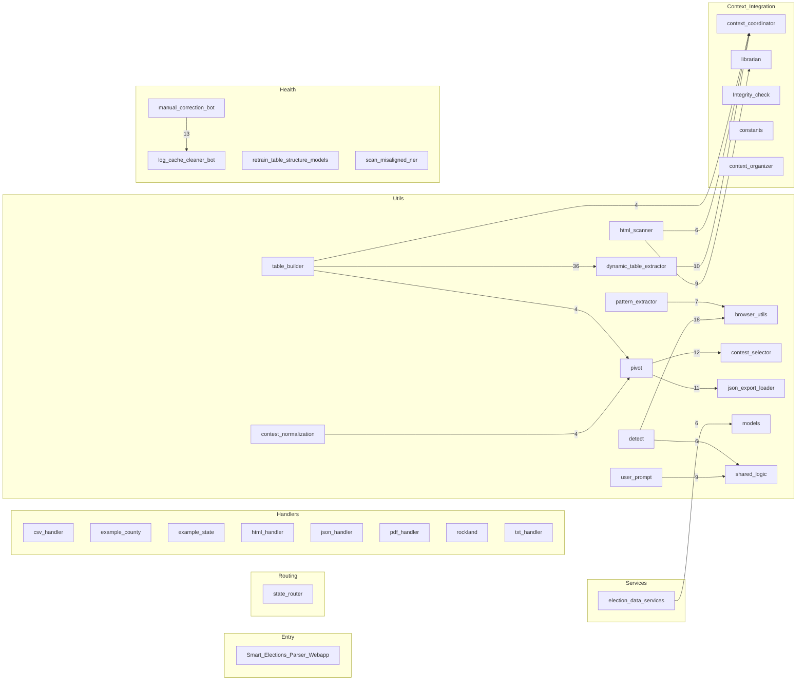
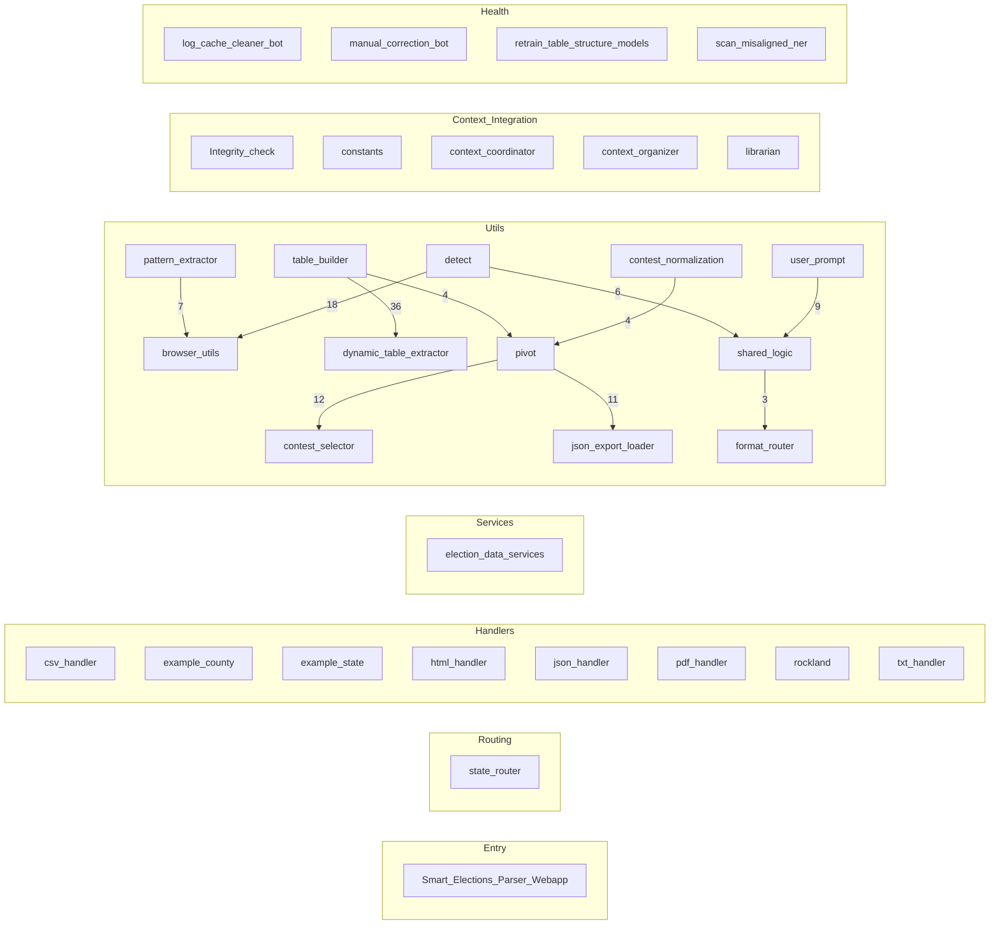

# Project Audit — webapp

Modules scanned: 78 | ~51773 non-empty LOC

## Pipeline map (Mermaid)



## Pipeline focus (compact)



## Cross-module hotspots

- webapp.parser.utils.dynamic_table_extractor:_emit ← 61 refs (dynamic_table_extractor.py)
- webapp.parser.utils.table_builder:_norm_header ← 50 refs (table_builder.py)
- webapp.parser.Context_Integration.context_coordinator:ContextCoordinator ← 30 refs (context_coordinator.py)
- webapp.parser.utils.pdf_table_utils:_record_recon_event ← 22 refs (pdf_table_utils.py)
- webapp.parser.utils.pivot:_safe_col_name ← 20 refs (pivot.py)
- webapp.parser.utils.contest_selector:_norm_key ← 18 refs (contest_selector.py)
- webapp.parser.utils.shared_logic:safe_lower ← 18 refs (shared_logic.py)
- webapp.parser.utils.rawjson_utils:_rj_first ← 16 refs (rawjson_utils.py)
- webapp.parser.utils.db_utils:get_session ← 16 refs (db_utils.py)
- webapp.parser.utils.json_export_loader:_safe_int ← 15 refs (json_export_loader.py)
- webapp.parser.health.log_cache_cleaner_bot:safe_path ← 14 refs (log_cache_cleaner_bot.py)
- webapp.parser.utils.html_scanner:_extract_clean_text ← 14 refs (html_scanner.py)
- webapp.parser.utils.pivot:_coerce_int ← 13 refs (pivot.py)
- webapp.parser.utils.pdf_table_utils:is_numeric_like ← 13 refs (pdf_table_utils.py)
- webapp.Smart_Elections_Parser_Weba:_env_flag ← 12 refs (Smart_Elections_Parser_Webapp.py)

## Leaf modules (candidates for review)

- `arizona.py`
- `example_county.py`
- `rockland.py`
- `new_york.py`
- `session_manager.py`
- `coordinator_protocol.py`
- `date_utils.py`
- `logger_singleton.py`
- `merge_utils.py`
- `seleniumbase_launcher.py`
- `session_state.py`
- `strategy_concurrency.py`
- `structure_cache.py`

## Pipeline clusters (Mermaid)


## Modules

### `webapp/Smart_Elections_Parser_Webapp.py`

- Definitions:
  - function: `\_env\_flag` (line 6)
  - function: `\_should\_skip\_eventlet\_patch` (line 13)
  - function: `ensure\_utf8` (line 198)
  - class: `EnsureWsSecurityHeaders` (line 212)
  - function: `is\_owner` (line 258)
  - function: `create\_session\_metadata` (line 262)
  - function: `cleanup\_sessions` (line 265)
  - function: `transition\_session` (line 279)
  - function: `cleanup\_old\_log\_files` (line 318)
  - function: `client\_fingerprint` (line 339)
  - function: `resolve\_session\_id` (line 348)
  - function: `emit\_contest\_options` (line 388)
  - function: `\_promote\_inner` (line 426)
  - function: `ensure\_db\_tables` (line 448)
  - function: `normalize\_log\_obj` (line 477)
  - function: `store\_log` (line 609)
  - function: `\_heartbeat\_loop` (line 621)
  - function: `socketio\_emit\_func` (line 636)
  - function: `get\_prompt\_queue` (line 727)
  - function: `broadcast\_sessions` (line 730)
  - function: `lock\_session` (line 747)
  - function: `unlock\_session` (line 758)
  - function: `safe\_is\_alive` (line 769)
  - function: `is\_output\_bypassed` (line 789)
  - function: `get\_manual\_source` (line 792)
  - function: `get\_manual\_source\_origin` (line 795)
  - function: `get\_all\_file\_lists` (line 798)
  - function: `get\_session\_enums` (line 806)
  - function: `\_csp\_nonce` (line 820)
  - function: `build\_csp` (line 829)
  - function: `add\_headers` (line 902)
  - function: `add\_url` (line 978)
  - function: `allowed\_file` (line 990)
  - function: `get\_url\_list` (line 999)
  - function: `list\_urls` (line 1006)
  - function: `log\_run\_event` (line 1032)
  - function: `index` (line 1056)
  - function: `api\_urls` (line 1060)
  - function: `data\_framework` (line 1081)
  - function: `api\_fs\_list` (line 1085)
  - function: `api\_list\_dir\_compat` (line 1131)
  - function: `api\_fs\_mkdir` (line 1135)
  - function: `api\_fs\_delete` (line 1164)
  - function: `download\_fs` (line 1200)
  - function: `favicon` (line 1219)
  - function: `robots\_txt` (line 1279)
  - function: `api\_warehouse\_election\_results` (line 1283)
  - function: `delete\_input\_file` (line 1378)
  - function: `delete\_output\_file` (line 1388)
  - function: `delete\_upload\_file` (line 1398)
  - function: `download\_input\_file` (line 1408)
  - function: `download\_output\_file` (line 1412)
  - function: `download\_upload\_file` (line 1416)
  - function: `run\_parser` (line 1420)
  - function: `site\_webmanifest` (line 1449)
  - function: `upload\_to\_input` (line 1487)
  - function: `upload\_to\_output` (line 1504)
  - function: `upload\_to\_uploads` (line 1521)
  - function: `health` (line 1535)
  - function: `heartbeat` (line 1539)
  - function: `clear\_history` (line 1543)
  - function: `history` (line 1553)
  - function: `rerun\_prior` (line 1596)
  - function: `handle\_contest\_selected` (line 1628)
  - function: `handle\_get\_session\_history` (line 1669)
  - function: `handle\_clone\_session` (line 1721)
  - function: `on\_join` (line 1765)
  - function: `handle\_get\_sessions` (line 1804)
  - function: `handle\_connect` (line 1811)
  - function: `handle\_disconnect` (line 1872)
  - function: `handle\_set\_output\_mode` (line 1893)
  - function: `handle\_parser\_prompt` (line 1922)
  - function: `handle\_cancel\_parser` (line 1951)
  - function: `handle\_toggle\_output\_bypass` (line 1993)
  - function: `handle\_set\_manual\_source` (line 2014)
  - function: `handle\_delete\_session` (line 2052)
  - function: `handle\_run\_parser` (line 2074)
- Imports:
  - **Standard Library** (12):
    - `import os as os` (line 3)
    - `import re as re` (line 90)
    - `import shutil as shutil` (line 92)
    - `import threading as threading` (line 93)
    - `import time as time` (line 94)
    - `from datetime import datetime` (line 95)
    - `from datetime import timezone` (line 95)
    - `from threading import Event` (line 96)
    - `from threading import Thread` (line 96)
    - `from typing import Callable` (line 97)
    - `from typing import Tuple` (line 97)
    - `from urllib.parse import urlparse` (line 98)
  - **Third-party** (46):
    - `import orjson as orjson` (line 100)
    - `import psycopg2 as psycopg2` (line 101)
    - `from flask import Flask` (line 102)
    - `from flask import Response` (line 102)
    - `from flask import flash` (line 102)
    - `from flask import g` (line 102)
    - `from flask import jsonify` (line 102)
    - `from flask import redirect` (line 102)
    - `from flask import render_template` (line 102)
    - `from flask import request` (line 102)
    - `from flask import send_file` (line 102)
    - `from flask import send_from_directory` (line 102)
    - `from flask import session` (line 102)
    - `from flask import url_for` (line 102)
    - `from psycopg2 import errors as pg_errors` (line 117)
    - `from werkzeug.exceptions import NotFound` (line 118)
    - `from webapp.parser.config import DATA_API_URL` (line 120)
    - `from webapp.parser.config import INPUT_DIR` (line 120)
    - `from webapp.parser.config import LOG_DIR` (line 120)
    - `from webapp.parser.config import OUTPUT_DIR` (line 120)
    - `from webapp.parser.config import POSTGRES_DB` (line 120)
    - `from webapp.parser.config import POSTGRES_HOST` (line 120)
    - `from webapp.parser.config import POSTGRES_PASSWORD_RAW` (line 120)
    - `from webapp.parser.config import POSTGRES_PORT` (line 120)
    - `from webapp.parser.config import POSTGRES_USER_RAW` (line 120)
    - `from webapp.parser.config import RUN_HISTORY_FILE` (line 120)
    - `from webapp.parser.config import SUPPORTED_EXTENSION_SET` (line 120)
    - `from webapp.parser.config import UPLOADS_DIR` (line 120)
    - `from webapp.parser.config import URL_LIST_FILE` (line 120)
    - `from webapp.parser.health.session_manager import SessionManager` (line 135)
    - `from webapp.parser.utils.logger_singleton import logger` (line 136)
    - `from webapp.parser.utils.logger_singleton import prompt` (line 136)
    - `from webapp.parser.utils.session_state import DEFAULT_PHASE_BY_STATE` (line 149)
    - `from webapp.parser.utils.session_state import PipelinePhase` (line 149)
    - `from webapp.parser.utils.session_state import SessionState` (line 149)
    - `from webapp.parser.utils.session_state import export_session_enums` (line 149)
    - `from webapp.parser.utils.shared_logic import safe_get` (line 155)
    - `from webapp.parser.utils.shared_logic import safe_is_set` (line 155)
    - `from webapp.parser.utils.shared_logic import safe_lower` (line 155)
    - `from webapp.parser.utils.shared_logic import safe_rsplit` (line 155)
    - `from webapp.parser.utils.shared_logic import safe_sid` (line 155)
    - `from webapp.parser.utils.shared_logic import safe_split` (line 155)
    - `from webapp.parser.utils.shared_logic import safe_strip` (line 155)
    - `from webapp.parser.web_pipeline import cancel_processing` (line 164)
    - `from webapp.parser.web_pipeline import cancellation_manager` (line 164)
    - `from webapp.parser.web_pipeline import process_urls_for_web` (line 164)
  - **Local/Project** (6):
    - `from __future__ import annotations` (line 1)
    - `import gzip as gzip` (line 89)
    - `import secrets as secrets` (line 91)
    - `from flask_socketio import SocketIO` (line 116)
    - `from flask_socketio import emit` (line 116)
    - `from flask_socketio import join_room` (line 116)
- TODO/FIXME/WARN:
  - L210 **WARNING**: ").upper().split(","))
  - L480 **WARNING**: , ERROR, CRITICAL, TRACE
  - L519 **WARNING**: ", "ERROR", "CRITICAL", "TRACE"}
  - L555 **WARNING**: " in mlow:
  - L954 **WARNING**:         # For websocket handshake only: add Cache-Control so webhint stops warning
  - L1229 **WARNING**: ({"type": "sec", "message": "Favicon path escape blocked", "requested": ico*path})
  - L1331 **WARNING**: ({
  - L1332 **WARNING**: ",
  - L1641 **WARNING**: ",
  - L1724 **WARNING**: (
  - L1726 **WARNING**: ",
  - L1736 **WARNING**: (
  - L1738 **WARNING**: ",
  - L1768 **WARNING**: (
  - L1770 **WARNING**: ",
  - L2055 **WARNING**: ({
  - L2056 **WARNING**: ",
  - L2120 **WARNING**: ({
  - L2121 **WARNING**: ",
  - L2171 **WARNING**: ({
  - L2172 **WARNING**: ",
  - L2194 **WARNING**: ({
  - L2195 **WARNING**: ",
  - L2203 **WARNING**: ({
  - L2204 **WARNING**: ",
  - L2211 **WARNING**: ({
  - L2212 **WARNING**: ",
- Outgoing cross-module calls (sample):
  - raw.strip (line 10)
  - \_EVENTLET\_BOOT\_NOTES.append (line 29)
  - eventlet.monkey\_patch (line 60)
  - \_EVENTLET\_PATCH\_CONFIG.items (line 62)
  - \_EVENTLET\_BOOT\_NOTES.append (line 64)
  - webapp.parser.utils.logger\_singleton.logger.info (line 138)
  - dotenv.load\_dotenv (line 177)
  - flask.Flask (line 183)
  - flask\_socketio.SocketIO (line 184)
  - ct.startswith (line 205)
  - ct.lower (line 205)
  - ct.split (line 207)
  - headers.append (line 226)
  - headers.append (line 228)
  - self.app (line 230)
  - webapp.parser.health.session\_manager.SessionManager (line 236)
  - threading.Event (line 245)
  - session\_manager.get\_metadata (line 259)
  - webapp.parser.utils.shared\_logic.safe\_get (line 260)
  - session\_manager.ensure\_session (line 263)
  - session\_manager.expire\_sessions (line 266)
  - os.remove (line 271)
  - last\_contest\_options.pop (line 274)
  - flask\_socketio.emit (line 276)
  - session\_manager.has\_session (line 291)
  - session\_manager.ensure\_session (line 292)
  - session\_manager.get\_manual\_source (line 297)
  - session\_manager.get\_manual\_source\_origin (line 299)
  - session\_manager.set\_state (line 300)
  - updated.get (line 305)
  - updated.get (line 306)
  - socketio.emit (line 313)
  - time.time (line 323)
  - os.listdir (line 325)
  - fname.startswith (line 326)
  - fname.endswith (line 326)
  - os.stat (line 333)
  - os.remove (line 335)
  - xff.split (line 342)
  - webapp.parser.utils.shared\_logic.safe\_sid (line 350)
  - webapp.parser.utils.shared\_logic.safe\_get (line 357)
  - session\_manager.bind\_socket (line 359)
  - session\_manager.resolve\_socket (line 362)
  - flask.session.get (line 366)
  - session\_manager.bind\_socket (line 368)
  - session\_manager.resolve\_fingerprint (line 372)
  - session\_manager.bind\_socket (line 374)
  - os.urandom (line 381)
  - session\_manager.bind\_fingerprint (line 382)
  - session\_manager.bind\_socket (line 383)
- Inbound references:
  - \_env\_flag ← Smart_Elections_Parser_Webapp.py:14
  - \_env\_flag ← Smart_Elections_Parser_Webapp.py:17
  - \_env\_flag ← Smart_Elections_Parser_Webapp.py:35
  - \_env\_flag ← Smart_Elections_Parser_Webapp.py:36
  - \_env\_flag ← Smart_Elections_Parser_Webapp.py:37
  - \_env\_flag ← Smart_Elections_Parser_Webapp.py:38
  - \_env\_flag ← Smart_Elections_Parser_Webapp.py:39
  - \_env\_flag ← Smart_Elections_Parser_Webapp.py:40
  - \_env\_flag ← Smart_Elections_Parser_Webapp.py:41
  - \_env\_flag ← Smart_Elections_Parser_Webapp.py:42
  - \_env\_flag ← Smart_Elections_Parser_Webapp.py:71
  - \_env\_flag ← Smart_Elections_Parser_Webapp.py:2391
  - \_should\_skip\_eventlet\_patch ← Smart_Elections_Parser_Webapp.py:22
  - ensure\_utf8 ← Smart_Elections_Parser_Webapp.py:974
  - EnsureWsSecurityHeaders ← Smart_Elections_Parser_Webapp.py:233
  - create\_session\_metadata ← Smart_Elections_Parser_Webapp.py:2105
  - cleanup\_sessions ← Smart_Elections_Parser_Webapp.py:1805
  - cleanup\_sessions ← Smart_Elections_Parser_Webapp.py:1813
  - cleanup\_sessions ← Smart_Elections_Parser_Webapp.py:1990
  - cleanup\_sessions ← Smart_Elections_Parser_Webapp.py:2079
  - transition\_session ← Smart_Elections_Parser_Webapp.py:678
  - transition\_session ← Smart_Elections_Parser_Webapp.py:750
  - transition\_session ← Smart_Elections_Parser_Webapp.py:761
  - transition\_session ← Smart_Elections_Parser_Webapp.py:1744
  - transition\_session ← Smart_Elections_Parser_Webapp.py:1938
  - transition\_session ← Smart_Elections_Parser_Webapp.py:1980
  - transition\_session ← Smart_Elections_Parser_Webapp.py:2029
  - transition\_session ← Smart_Elections_Parser_Webapp.py:2363
  - cleanup\_old\_log\_files ← Smart_Elections_Parser_Webapp.py:2385
  - client\_fingerprint ← Smart_Elections_Parser_Webapp.py:371
  - resolve\_session\_id ← Smart_Elections_Parser_Webapp.py:1633
  - resolve\_session\_id ← Smart_Elections_Parser_Webapp.py:1670
  - resolve\_session\_id ← Smart_Elections_Parser_Webapp.py:1766
  - resolve\_session\_id ← Smart_Elections_Parser_Webapp.py:1847
  - resolve\_session\_id ← Smart_Elections_Parser_Webapp.py:1896
  - resolve\_session\_id ← Smart_Elections_Parser_Webapp.py:1925
  - resolve\_session\_id ← Smart_Elections_Parser_Webapp.py:1952
  - resolve\_session\_id ← Smart_Elections_Parser_Webapp.py:1994
  - resolve\_session\_id ← Smart_Elections_Parser_Webapp.py:2015
  - resolve\_session\_id ← Smart_Elections_Parser_Webapp.py:2053
  - resolve\_session\_id ← Smart_Elections_Parser_Webapp.py:2081
  - \_promote\_inner ← Smart_Elections_Parser_Webapp.py:539
  - ensure\_db\_tables ← Smart_Elections_Parser_Webapp.py:1299
  - ensure\_db\_tables ← Smart_Elections_Parser_Webapp.py:1337
  - ensure\_db\_tables ← Smart_Elections_Parser_Webapp.py:2382
  - normalize\_log\_obj ← Smart_Elections_Parser_Webapp.py:652
  - normalize\_log\_obj ← Smart_Elections_Parser_Webapp.py:1640
  - normalize\_log\_obj ← Smart_Elections_Parser_Webapp.py:1651
  - normalize\_log\_obj ← Smart_Elections_Parser_Webapp.py:1661
  - normalize\_log\_obj ← Smart_Elections_Parser_Webapp.py:2253

### `webapp/parser/Context_Integration/Context_Library/constants.py`

- Definitions:
  - function: `build\_state\_to\_division\_type\_map` (line 691)
  - function: `\_sanitize\_party\_token` (line 2399)
  - function: `normalize\_party\_code` (line 2418)
  - function: `canonical\_ballot\_group` (line 2445)
  - function: `split\_and\_normalize\_ballot\_groups` (line 2472)
  - function: `normalize\_result\_group\_label` (line 2491)
  - function: `normalize\_party\_label` (line 2509)
  - function: `is\_pseudo\_result\_party` (line 2539)
  - function: `\_iter\_strings` (line 2710)
  - function: `\_compile\_union` (line 2721)
  - function: `\_norm\_state\_key` (line 2764)
  - function: `\_norm\_county\_key` (line 2775)
  - function: `\_collect\_layered\_patterns` (line 2784)
  - function: `get\_camelot\_title\_regex` (line 2795)
  - function: `get\_camelot\_row\_regex` (line 2805)
  - function: `build\_camelot\_row\_filter` (line 2818)
- Imports:
  - **Standard Library** (11):
    - `import re as re` (line 1)
    - `from functools import lru_cache` (line 2)
    - `from typing import Any` (line 3)
    - `from typing import Callable` (line 3)
    - `from typing import Dict` (line 3)
    - `from typing import Iterable` (line 3)
    - `from typing import List` (line 3)
    - `from typing import Optional` (line 3)
    - `from typing import Pattern` (line 3)
    - `from typing import Set` (line 3)
    - `from typing import Tuple` (line 3)
- TODO/FIXME/WARN:
  - L1831 **NOTE**: .*$",                     # Note
  - L2020 **WARNING**: ",
  - L2111 **WARNING**: ", "info*box", "navigation", "pagination", "tab", "modal", "tooltip", "ignore", "unknown"
  - L2144 **NOTE**: ", "comment",
  - L2220 **NOTE**: ", "Comment", "Feedback", "Suggestion", "Recommendation",
  - L2236 **NOTE**: ", "Comment", "Feedback", "Suggestion",
- Outgoing cross-module calls (sample):
  - DEFAULT\_DIVISION\_TYPE\_BY\_STATE.get (line 707)
  - KNOWN\_STATE\_TO\_COUNTY\_MAP.items (line 710)
  - DIVISION\_TYPE\_OVERRIDES.items (line 714)
  - KNOWN\_STATE\_TO\_COUNTY\_MAP.keys (line 750)
  - CANONICAL\_STATE\_ABBR.items (line 811)
  - k.upper (line 1253)
  - PARTY\_CODE\_MAP.items (line 1253)
  - t.lower (line 1416)
  - GROUP\_RENAME\_MAP.update (line 1418)
  - dict.fromkeys (line 1628)
  - dict.fromkeys (line 1645)
  - kw.lower (line 1649)
  - dict.fromkeys (line 1669)
  - re.escape (line 1711)
  - x.startswith (line 1711)
  - re.escape (line 1766)
  - re.escape (line 1767)
  - re.escape (line 1768)
  - re.escape (line 1769)
  - re.escape (line 1770)
  - re.escape (line 1771)
  - re.escape (line 1772)
  - re.escape (line 1773)
  - re.escape (line 1774)
  - re.escape (line 1775)
  - re.escape (line 1776)
  - re.escape (line 1777)
  - re.escape (line 1778)
  - re.compile (line 1971)
  - re.compile (line 1972)
  - re.compile (line 1973)
  - re.compile (line 1977)
  - re.compile (line 2051)
  - re.compile (line 2052)
  - GROUP\_RENAME\_MAP.items (line 2308)
  - \_k.lower (line 2309)
  - \_EXTRA\_BALLOT\_VARIANTS.items (line 2333)
  - BALLOT\_NAME\_CANON\_MAP.setdefault (line 2334)
  - \_PARTY\_CANON\_MAP.items (line 2388)
  - PARTY\_CODE\_MAP.items (line 2392)
  - PARTY\_NORMALIZATION\_MAP.setdefault (line 2393)
  - \_code.lower (line 2393)
  - re.compile (line 2395)
  - re.compile (line 2396)
  - re.compile (line 2397)
  - \_PARTY\_INCUMBENT\_TOKEN\_RE.sub (line 2403)
  - \_PARTY\_INCUMBENT\_WORD\_RE.sub (line 2404)
  - re.sub (line 2405)
  - text.replace (line 2406)
  - text.replace (line 2407)
- Inbound references:
  - build\_state\_to\_division\_type\_map ← constants.py:721
  - \_sanitize\_party\_token ← constants.py:2428
  - \_sanitize\_party\_token ← constants.py:2523
  - normalize\_party\_code ← constants.py:2526
  - canonical\_ballot\_group ← constants.py:2480
  - canonical\_ballot\_group ← constants.py:2483
  - canonical\_ballot\_group ← constants.py:2504
  - canonical\_ballot\_group ← salvage.py:93
  - normalize\_party\_label ← constants.py:2543
  - is\_pseudo\_result\_party ← constants.py:2834
  - \_iter\_strings ← constants.py:2815
  - \_compile\_union ← constants.py:2802
  - \_compile\_union ← constants.py:2816
  - \_norm\_state\_key ← constants.py:2786
  - \_norm\_county\_key ← constants.py:2787
  - \_collect\_layered\_patterns ← constants.py:2801
  - \_collect\_layered\_patterns ← constants.py:2812
  - \_collect\_layered\_patterns ← constants.py:2813
  - get\_camelot\_title\_regex ← constants.py:2825
  - get\_camelot\_row\_regex ← constants.py:2826

### `webapp/parser/Context_Integration/Integrity_check.py`

- Definitions:
  - function: `\_ensure\_alerts\_table` (line 39)
  - function: `find\_date\_anomalies` (line 46)
  - function: `detect\_anomalies\_with\_ml` (line 54)
  - function: `election\_integrity\_checks` (line 105)
  - function: `advanced\_cross\_field\_validation` (line 126)
  - function: `summarize\_context\_entities` (line 135)
  - function: `analyze\_contests` (line 144)
  - function: `auto\_tune\_contamination` (line 159)
  - function: `print\_issues\_table` (line 180)
  - function: `print\_entity\_summary` (line 200)
  - function: `print\_ml\_anomalies` (line 208)
  - function: `print\_date\_anomalies` (line 238)
  - function: `print\_auto\_tune\_result` (line 256)
  - function: `print\_analyze\_contests` (line 262)
  - function: `monitor\_db\_for\_alerts` (line 274)
  - function: `log\_integrity\_issues` (line 320)
  - function: `detect\_statistical\_outliers` (line 336)
  - function: `print\_integrity\_summary` (line 372)
- Imports:
  - **Standard Library** (9):
    - `import re as re` (line 3)
    - `import threading as threading` (line 4)
    - `import time as time` (line 5)
    - `from collections import Counter` (line 6)
    - `from pathlib import Path` (line 7)
    - `from typing import Any` (line 8)
    - `from typing import Dict` (line 8)
    - `from typing import List` (line 8)
    - `from typing import Tuple` (line 8)
  - **Third-party** (3):
    - `import numpy as np` (line 11)
    - `import orjson as orjson` (line 12)
    - `from sqlalchemy import select` (line 18)
  - **Local/Project** (23):
    - `from __future__ import annotations` (line 1)
    - `import matplotlib as matplotlib` (line 10)
    - `from rich.panel import Panel` (line 13)
    - `from rich.table import Table` (line 14)
    - `from sklearn.cluster import DBSCAN` (line 15)
    - `from sklearn.ensemble import IsolationForest` (line 16)
    - `from sklearn.preprocessing import LabelEncoder` (line 17)
    - `from config import CONTEXT_DB_PATH` (line 20)
    - `from config import CONTEXT_LIBRARY_PATH` (line 20)
    - `from Context_Integration.librarian import clean_for_json` (line 21)
    - `from utils import misc_utils` (line 22)
    - `from utils.db_utils import get_session` (line 23)
    - `from utils.logger_singleton import console` (line 24)
    - `from utils.models import Alert` (line 25)
    - `from utils.shared_logic import safe_all` (line 26)
    - `from utils.shared_logic import safe_encode` (line 26)
    - `from utils.shared_logic import safe_execute` (line 26)
    - `from utils.shared_logic import safe_get` (line 26)
    - `from utils.shared_logic import safe_items` (line 26)
    - `from utils.shared_logic import safe_tolist` (line 26)
    - `from utils.spacy_utils import extract_dates` (line 34)
    - `from utils.spacy_utils import extract_entities` (line 34)
    - `from utils.spacy_utils import flag_suspicious_contests` (line 34)
- Outgoing cross-module calls (sample):
  - matplotlib.use (line 37)
  - utils.spacy\_utils.extract\_dates (line 49)
  - utils.shared\_logic.safe\_get (line 49)
  - anomalies.append (line 51)
  - numpy.array (line 62)
  - sklearn.preprocessing.LabelEncoder (line 64)
  - sklearn.preprocessing.LabelEncoder (line 65)
  - sklearn.preprocessing.LabelEncoder (line 66)
  - utils.shared\_logic.safe\_get (line 67)
  - utils.shared\_logic.safe\_get (line 68)
  - utils.shared\_logic.safe\_get (line 69)
  - le\_state.fit (line 70)
  - le\_county.fit (line 71)
  - le\_type.fit (line 72)
  - utils.shared\_logic.safe\_get (line 76)
  - utils.shared\_logic.safe\_encode (line 78)
  - embedding\_model.encode (line 78)
  - utils.shared\_logic.safe\_tolist (line 79)
  - features.append (line 80)
  - le\_state.transform (line 81)
  - utils.shared\_logic.safe\_get (line 81)
  - le\_county.transform (line 82)
  - utils.shared\_logic.safe\_get (line 82)
  - le\_type.transform (line 83)
  - utils.shared\_logic.safe\_get (line 83)
  - utils.shared\_logic.safe\_get (line 84)
  - utils.shared\_logic.safe\_get (line 84)
  - utils.shared\_logic.safe\_get (line 85)
  - utils.shared\_logic.safe\_get (line 86)
  - utils.shared\_logic.safe\_get (line 86)
  - utils.shared\_logic.safe\_get (line 87)
  - utils.shared\_logic.safe\_get (line 87)
  - numpy.array (line 91)
  - sklearn.ensemble.IsolationForest (line 92)
  - clf.fit\_predict (line 97)
  - sklearn.cluster.DBSCAN (line 99)
  - c.get (line 109)
  - c.get (line 109)
  - c.get (line 109)
  - c.get (line 109)
  - issues.append (line 111)
  - seen.add (line 113)
  - c.get (line 114)
  - c.get (line 114)
  - issues.append (line 115)
  - c.get (line 116)
  - c.get (line 116)
  - issues.append (line 117)
  - c.get (line 119)
  - c.get (line 119)
- Inbound references:
  - \_ensure\_alerts\_table ← Integrity_check.py:42
  - find\_date\_anomalies ← Integrity_check.py:146
  - detect\_anomalies\_with\_ml ← Integrity_check.py:147
  - election\_integrity\_checks ← Integrity_check.py:145
  - advanced\_cross\_field\_validation ← Integrity_check.py:394
  - summarize\_context\_entities ← manual_correction_bot.py:1016
  - summarize\_context\_entities ← Integrity_check.py:390
  - analyze\_contests ← html_election_parser.py:512
  - analyze\_contests ← manual_correction_bot.py:996
  - analyze\_contests ← Integrity_check.py:380
  - auto\_tune\_contamination ← Integrity_check.py:399
  - print\_issues\_table ← Integrity_check.py:263
  - print\_issues\_table ← Integrity_check.py:395
  - print\_entity\_summary ← Integrity_check.py:391
  - print\_ml\_anomalies ← Integrity_check.py:265
  - print\_date\_anomalies ← Integrity_check.py:264
  - print\_auto\_tune\_result ← Integrity_check.py:400
  - print\_analyze\_contests ← Integrity_check.py:387
  - print\_integrity\_summary ← html_election_parser.py:544
  - print\_integrity\_summary ← html_election_parser.py:591

### `webapp/parser/Context_Integration/context_coordinator.py`

> context_coordinator.py

- Definitions:
  - function: `get\_semantic\_score` (line 97)
  - function: `merge\_and\_rank\_candidates` (line 145)
  - function: `dynamic\_state\_county\_detection` (line 235)
  - class: `ContextCoordinator` (line 749)
- Imports:
  - **Standard Library** (13):
    - `import os as os` (line 15)
    - `import re as re` (line 16)
    - `import subprocess as subprocess` (line 17)
    - `import threading as threading` (line 18)
    - `from collections import defaultdict` (line 19)
    - `from datetime import datetime` (line 20)
    - `from datetime import timezone` (line 20)
    - `from typing import Any` (line 21)
    - `from typing import Callable` (line 21)
    - `from typing import Dict` (line 21)
    - `from typing import List` (line 21)
    - `from typing import Optional` (line 21)
    - `from typing import Tuple` (line 21)
  - **Third-party** (2):
    - `import numpy as np` (line 23)
    - `import orjson as orjson` (line 24)
  - **Local/Project** (69):
    - `from __future__ import annotations` (line 11)
    - `import difflib as difflib` (line 13)
    - `import numbers as numbers` (line 14)
    - `from rapidfuzz import fuzz` (line 25)
    - `from rapidfuzz import process` (line 25)
    - `from sklearn.preprocessing import LabelEncoder` (line 26)
    - `from config import BATCH_MAX_WORKERS` (line 28)
    - `from config import CONTEXT_LIBRARY_PATH` (line 28)
    - `from config import LOG_DIR` (line 28)
    - `from config import PROJECT_ROOT` (line 28)
    - `from handlers.batch_handler import BatchProcessor` (line 29)
    - `from services.election_data_services import ElectionDataService` (line 30)
    - `from utils.browser_utils import safe_click` (line 31)
    - `from utils.browser_utils import safe_count` (line 31)
    - `from utils.browser_utils import safe_evaluate` (line 31)
    - `from utils.browser_utils import safe_get_attribute` (line 31)
    - `from utils.browser_utils import safe_inner_text` (line 31)
    - `from utils.browser_utils import safe_is_enabled` (line 31)
    - `from utils.browser_utils import safe_is_visible` (line 31)
    - `from utils.browser_utils import safe_locator` (line 31)
    - `from utils.browser_utils import safe_nth` (line 31)
    - `from utils.browser_utils import safe_wait_for_timeout` (line 31)
    - `from utils.browser_utils import scan_buttons_with_progress` (line 31)
    - `from utils.html_scanner import deduplicate_pattern_kb` (line 44)
    - `from utils.html_scanner import get_segment_embedding` (line 44)
    - `from utils.html_scanner import load_pattern_kb` (line 44)
    - `from utils.logger_singleton import logger` (line 49)
    - `from utils.model_registry import ModelRegistry` (line 50)
    - `from utils.shared_logic import sync_type_and_election_types` (line 51)
    - `from utils.shared_logic import keyphrase_match` (line 51)
    - `from utils.shared_logic import normalize_county_name` (line 51)
    - `from utils.shared_logic import normalize_state_name` (line 51)
    - `from utils.shared_logic import safe_append` (line 51)
    - `from utils.shared_logic import safe_endswith` (line 51)
    - `from utils.shared_logic import safe_filename` (line 51)
    - `from utils.shared_logic import safe_get` (line 51)
    - `from utils.shared_logic import safe_get_first` (line 51)
    - `from utils.shared_logic import safe_isupper` (line 51)
    - `from utils.shared_logic import safe_items` (line 51)
    - `from utils.shared_logic import safe_lower` (line 51)
    - `from utils.shared_logic import safe_model_encode` (line 51)
    - `from utils.shared_logic import safe_replace` (line 51)
    - `from utils.shared_logic import safe_similarity` (line 51)
    - `from utils.shared_logic import safe_startswith` (line 51)
    - `from utils.shared_logic import safe_strip` (line 51)
    - `from utils.shared_logic import safe_tolist` (line 51)
    - `from utils.spacy_utils import extract_dates` (line 71)
    - `from utils.spacy_utils import extract_entities` (line 71)
    - `from utils.spacy_utils import extract_locations` (line 71)
    - `from Context_Library.constants import BALLOT_TYPES` (line 72)
- TODO/FIXME/WARN:
  - L788 **WARNING**: ("\[ALERT MONITOR\] Thread did not stop cleanly.")
  - L876 **WARNING**: ({
  - L877 **WARNING**: ",
  - L995 **WARNING**: (f"\[yellow\]Integrity issues:\[/yellow\] {issues\['integrity*issues'\]}")
  - L1234 **WARNING**: (f"\[ContextCoordinator\] No table structure found for contest: {contest}")
  - L1403 **WARNING**: (f"\[get*feedback*pattern*kb\] Skipping corrupt line: {e}")
  - L1515 **WARNING**: ("\[group*dom*nodes*by*label\] No organized DOM parts. (Further warnings suppressed)")
  - L1517 **WARNING**: (f"\[group*dom*nodes*by*label\] No organized DOM parts. (Occurred {ContextCoordinator.*dom*parts*warning*count} times)")
  - L1522 **WARNING**: ("\[group*dom*nodes*by*label\] No DOM nodes found.")
  - L1540 **WARNING**: ("\[submit*user*feedback\] ContextOrganizer has no submit*user*feedback method.")
  - L1568 **WARNING**: (f"\[correct*and*update*contest\] Contest {contest*id} missing type/election*types after sync.")
  - L1592 **WARNING**: ("\[print*contest*summary\] No organized contests to summarize.")
  - L1605 **WARNING**: ("\[plot*contest*distribution\] No organized contests to plot.")
  - L1656 **WARNING**: ("No organized DOM parts.")
  - L1659 **WARNING**: ("No organized DOM parts. (Further warnings suppressed)")
  - L1670 **WARNING**: ("\[get*contest*groups\] No contest groups found.")
  - L1679 **WARNING**: ("\[get*panel*groups\] No panel groups found.")
  - L1688 **WARNING**: ("\[get*button*groups\] No button groups found.")
  - L1697 **WARNING**: ("\[get*table*groups\] No table groups found.")
  - L1706 **WARNING**: ("\[get*relationships\] No organized context.")
  - L1814 **WARNING**: (f"\[fuzzy*score\] One or both inputs are empty: a='{a*str}', b='{b*str}'")
  - L1820 **WARNING**: (f"\[fuzzy*score\] One or both inputs are too short: a='{a*str}', b='{b*str}'")
  - L2266 **WARNING**: (f"\[extract*field\] Unknown field*type: {field*type}")
  - L2524 **WARNING**: (f"\[get*full*contest\] Contest {contest*id} missing type/election*types after sync.")
  - L2609 **WARNING**: (f"\[list*tables\] Table '{tbl}' missing metadata or columns.")
  - L2641 **WARNING**: (f"\[get*table*metadata\] Table '{table*name}' missing columns.")
  - L2659 **WARNING**: (f"\[check*missing*tables\] Missing tables: {missing}")
  - L2720 **WARNING**: (f"\[save*table*structure\] Failed to save structure for contest: {contest}")
  - L2897 **WARNING**: (f"\[get*best*button*advanced\] Contest argument was not a dict. Converted to: {contest}")
  - L2901 **WARNING**: (f"\[get*best*button*advanced\] Keywords argument was not a list. Converted to: {keywords}")
  - L2905 **WARNING**: (f"\[get*best*button*advanced\] Context argument was not a dict. Converted to: {context}")
  - L2912 **WARNING**: ("\[get*best*button*advanced\]*semantic*model is not set or is not an object. Using None.")
  - L3057 **WARNING**: (f"\[yellow\]\[Coordinator\] Button '{cand.get('label')}' rejected, retrying...\[/yellow\]")
- Outgoing cross-module calls (sample):
  - utils.logger\_singleton.logger.error (line 105)
  - utils.logger\_singleton.logger.error (line 109)
  - utils.shared\_logic.safe\_model\_encode (line 116)
  - utils.shared\_logic.safe\_model\_encode (line 117)
  - utils.logger\_singleton.logger.debug (line 119)
  - util.pytorch\_cos\_sim (line 121)
  - cos\_sim.item (line 124)
  - cos\_sim.numpy (line 126)
  - arr.flatten (line 127)
  - utils.logger\_singleton.logger.error (line 132)
  - utils.logger\_singleton.logger.error (line 137)
  - utils.logger\_singleton.logger.error (line 142)
  - utils.shared\_logic.safe\_get (line 156)
  - utils.shared\_logic.safe\_get (line 158)
  - utils.shared\_logic.safe\_get (line 158)
  - seen.add (line 160)
  - all\_candidates.append (line 161)
  - utils.shared\_logic.safe\_get (line 164)
  - utils.shared\_logic.safe\_get (line 165)
  - utils.shared\_logic.safe\_get (line 168)
  - utils.shared\_logic.safe\_get (line 169)
  - utils.shared\_logic.safe\_get (line 170)
  - utils.shared\_logic.safe\_get (line 171)
  - utils.shared\_logic.safe\_get (line 174)
  - utils.shared\_logic.safe\_get (line 175)
  - utils.shared\_logic.safe\_get (line 180)
  - utils.shared\_logic.safe\_lower (line 182)
  - label.strip (line 182)
  - utils.shared\_logic.safe\_lower (line 182)
  - contest\_title.strip (line 182)
  - utils.shared\_logic.keyphrase\_match (line 186)
  - utils.shared\_logic.keyphrase\_match (line 186)
  - difflib.SequenceMatcher (line 191)
  - utils.shared\_logic.safe\_lower (line 191)
  - utils.shared\_logic.safe\_lower (line 191)
  - utils.shared\_logic.safe\_get (line 197)
  - utils.shared\_logic.safe\_get (line 203)
  - utils.shared\_logic.safe\_get (line 204)
  - utils.shared\_logic.safe\_lower (line 205)
  - utils.shared\_logic.safe\_lower (line 207)
  - all\_candidates.sort (line 225)
  - utils.shared\_logic.safe\_get (line 227)
  - utils.shared\_logic.safe\_get (line 228)
  - utils.shared\_logic.safe\_get (line 229)
  - state\_to\_county.keys (line 254)
  - state\_to\_county.values (line 255)
  - utils.shared\_logic.normalize\_county\_name (line 256)
  - county\_to\_precinct.values (line 257)
  - utils.shared\_logic.normalize\_county\_name (line 258)
  - state\_to\_county.keys (line 261)
- Inbound references:
  - get\_semantic\_score ← context_coordinator.py:195
  - get\_semantic\_score ← context_coordinator.py:200
  - get\_semantic\_score ← context_coordinator.py:2377
  - get\_semantic\_score ← context_coordinator.py:2396
  - get\_semantic\_score ← context_coordinator.py:2405
  - get\_semantic\_score ← context_coordinator.py:2441
  - get\_semantic\_score ← context_coordinator.py:2454
  - get\_semantic\_score ← context_coordinator.py:2581
  - get\_semantic\_score ← context_coordinator.py:2767
  - merge\_and\_rank\_candidates ← context_coordinator.py:1467
  - merge\_and\_rank\_candidates ← context_coordinator.py:3023
  - dynamic\_state\_county\_detection ← state_router.py:365
  - dynamic\_state\_county\_detection ← context_organizer.py:1596
  - dynamic\_state\_county\_detection ← shared_logic.py:1610
  - ContextCoordinator ← state_router.py:361
  - ContextCoordinator ← html_election_parser.py:885
  - ContextCoordinator ← html_election_parser.py:1158
  - ContextCoordinator ← contest_selector.py:886
  - ContextCoordinator ← contest_selector.py:1026
  - ContextCoordinator ← output_utils.py:66
  - ContextCoordinator ← html_scanner.py:730
  - ContextCoordinator ← html_scanner.py:1195
  - ContextCoordinator ← html_scanner.py:2585
  - ContextCoordinator ← html_scanner.py:2776
  - ContextCoordinator ← html_scanner.py:2882
  - ContextCoordinator ← html_scanner.py:3161
  - ContextCoordinator ← dynamic_table_extractor.py:284
  - ContextCoordinator ← dynamic_table_extractor.py:312
  - ContextCoordinator ← dynamic_table_extractor.py:478
  - ContextCoordinator ← dynamic_table_extractor.py:497
  - ContextCoordinator ← dynamic_table_extractor.py:984
  - ContextCoordinator ← dynamic_table_extractor.py:1028
  - ContextCoordinator ← dynamic_table_extractor.py:1058
  - ContextCoordinator ← dynamic_table_extractor.py:1076
  - ContextCoordinator ← dynamic_table_extractor.py:1108
  - ContextCoordinator ← dynamic_table_extractor.py:1138
  - ContextCoordinator ← table_builder.py:766
  - ContextCoordinator ← table_builder.py:1141
  - ContextCoordinator ← table_builder.py:1451
  - ContextCoordinator ← table_builder.py:1510
  - ContextCoordinator ← html_handler.py:103
  - ContextCoordinator ← rockland.py:39
  - ContextCoordinator ← example_state.py:34
  - ContextCoordinator ← example_county.py:27

### `webapp/parser/Context_Integration/context_organizer.py`

> context_organizer.py

- Definitions:
  - function: `get\_loading\_indicator` (line 63)
  - function: `ensure\_dict` (line 66)
  - function: `remove\_functions` (line 79)
  - function: `contest\_hash` (line 87)
  - function: `repair\_dom\_segments` (line 99)
  - function: `\_defensive\_dom\_check` (line 161)
  - class: `ContextOrganizer` (line 182)
- Imports:
  - **Standard Library** (9):
    - `import itertools as itertools` (line 10)
    - `import os as os` (line 11)
    - `import re as re` (line 12)
    - `from collections import Counter` (line 14)
    - `from collections import defaultdict` (line 14)
    - `from collections.abc import Hashable` (line 15)
    - `from datetime import datetime` (line 16)
    - `from datetime import timezone` (line 16)
    - `from typing import Any` (line 18)
  - **Third-party** (3):
    - `import numpy as np` (line 21)
    - `import orjson as orjson` (line 22)
    - `from sqlalchemy.exc import SQLAlchemyError` (line 24)
  - **Local/Project** (41):
    - `from __future__ import annotations` (line 8)
    - `import types as types` (line 13)
    - `from difflib import get_close_matches` (line 17)
    - `import matplotlib.pyplot as plt` (line 20)
    - `from rich.table import Table` (line 23)
    - `from config import CONTEXT_DB_PATH` (line 26)
    - `from config import CONTEXT_LIBRARY_PATH` (line 26)
    - `from config import LOG_DIR` (line 26)
    - `from services.election_data_services import ElectionDataService` (line 27)
    - `from utils.html_scanner import load_context_cache_from_disk` (line 28)
    - `from utils.logger_singleton import console` (line 29)
    - `from utils.logger_singleton import logger` (line 29)
    - `from utils.misc_utils import load_output_cache` (line 30)
    - `from utils.misc_utils import load_processed_urls` (line 30)
    - `from utils.model_registry import ModelRegistry` (line 31)
    - `from utils.shared_logic import sync_type_and_election_types` (line 32)
    - `from utils.shared_logic import flatten_raw_field` (line 32)
    - `from utils.shared_logic import infer_contest_fields` (line 32)
    - `from utils.shared_logic import normalize_label` (line 32)
    - `from utils.shared_logic import safe_add` (line 32)
    - `from utils.shared_logic import safe_db_call` (line 32)
    - `from utils.shared_logic import safe_filename` (line 32)
    - `from utils.shared_logic import safe_get_first` (line 32)
    - `from utils.shared_logic import safe_items` (line 32)
    - `from utils.shared_logic import safe_model_encode` (line 32)
    - `from utils.shared_logic import safe_update` (line 32)
    - `from utils.shared_logic import scan_environment` (line 32)
    - `from Context_Library.constants import BALLOT_TYPES` (line 46)
    - `from Context_Library.constants import CANDIDATE_KEYWORDS` (line 46)
    - `from Context_Library.constants import CONTEST_KEYWORDS` (line 46)
    - `from Context_Library.constants import LOCATION_KEYWORDS` (line 46)
    - `from Context_Library.constants import MISC_FOOTER_KEYWORDS` (line 46)
    - `from Context_Library.constants import PARTY_KEYWORDS` (line 46)
    - `from Context_Library.constants import PERCENT_KEYWORDS` (line 46)
    - `from Context_Library.constants import TOTAL_KEYWORDS` (line 46)
    - `from Integrity_check import detect_anomalies_with_ml` (line 56)
    - `from Integrity_check import election_integrity_checks` (line 56)
    - `from Integrity_check import print_ml_anomalies` (line 56)
    - `from librarian import clean_for_json` (line 57)
    - `from librarian import load_context_library` (line 57)
    - `from librarian import update_context_library` (line 57)
- TODO/FIXME/WARN:
  - L282 **WARNING**: (
  - L407 **WARNING**: (f"\[CONTEST\] Skipping contest with suspiciously large or missing title: {str(title)\[:100\]}...")
  - L495 **WARNING**: (f"\[CONTEST\] Filtered out {len(filtered*out)} contests due to missing required fields.")
  - L497 **WARNING**: (f"  \[Filtered\] {reason}: {str(c)\[:100\]}...")
  - L500 **WARNING**: ("\[CONTEST\] No contests with required fields for downstream output.")
  - L816 **WARNING**: (f"\[ML\] Anomaly index {idx} out of range for contests list of length {len(contests)}")
  - L1500 **WARNING**: (f"  \[yellow\]{title}\[/yellow\]: {fixes}")
  - L1505 **WARNING**: (f"\[bold yellow\]\[INTEGRITY\]\[/bold yellow\] Duplicate contest detected.\n  \[dim\]Context:\[/dim\] {contest}")
  - L1507 **WARNING**: (f"\[bold yellow\]\[INTEGRITY\]\[/bold yellow\] Contest missing location info.\n  \[dim\]Context:\[/dim\] {contest}")
  - L1509 **WARNING**: (f"\[bold yellow\]\[INTEGRITY\]\[/bold yellow\] Contest missing year.\n  \[dim\]Context:\[/dim\] {contest}")
  - L1972 **WARNING**: (f"\[ContextOrganizer\] Could not update context library with feedback: {e}")
  - L2049 **WARNING**: (f"\[CONTEXT ORGANIZER\] No table structure found for contest: {contest}")
- Outgoing cross-module calls (sample):
  - utils.misc\_utils.load\_processed\_urls (line 59)
  - utils.misc\_utils.load\_output\_cache (line 60)
  - itertools.cycle (line 61)
  - v.get (line 73)
  - v.get (line 73)
  - obj.items (line 81)
  - c\_dict.get (line 90)
  - c\_dict.get (line 92)
  - c\_dict.get (line 93)
  - c\_dict.get (line 94)
  - c\_dict.get (line 95)
  - seg.get (line 108)
  - seg.get (line 115)
  - normalized\_children.append (line 119)
  - normalized\_children.append (line 123)
  - seg.get (line 127)
  - parent\_idx.get (line 129)
  - seg.get (line 132)
  - seg.get (line 140)
  - idx\_map.get (line 141)
  - child.get (line 142)
  - seg.get (line 142)
  - seg.get (line 143)
  - seg.get (line 149)
  - seg.get (line 151)
  - idx\_map.get (line 152)
  - child\_node.get (line 155)
  - valid\_children.append (line 157)
  - dom\_parts\_dict.get (line 175)
  - utils.shared\_logic.safe\_get\_first (line 176)
  - utils.logger\_singleton.logger.error (line 179)
  - librarian.load\_context\_library (line 205)
  - self.\_default\_library (line 205)
  - utils.logger\_singleton.logger.error (line 207)
  - utils.logger\_singleton.logger.debug (line 209)
  - utils.logger\_singleton.logger.error (line 211)
  - utils.misc\_utils.load\_processed\_urls (line 214)
  - utils.misc\_utils.load\_output\_cache (line 215)
  - utils.html\_scanner.load\_context\_cache\_from\_disk (line 218)
  - services.election\_data\_services.ElectionDataService (line 221)
  - self.\_resolve\_embedding\_model (line 223)
  - utils.logger\_singleton.logger.error (line 225)
  - utils.model\_registry.ModelRegistry.get\_sentence\_transformer (line 272)
  - utils.logger\_singleton.logger.info (line 274)
  - utils.logger\_singleton.logger.info (line 279)
  - utils.logger\_singleton.logger.warning (line 282)
  - item.get (line 299)
  - item.get (line 300)
  - deduped.append (line 301)
  - seen.add (line 302)
- Inbound references:
  - get\_loading\_indicator ← context_organizer.py:1699
  - ensure\_dict ← context_organizer.py:668
  - ensure\_dict ← context_organizer.py:676
  - ensure\_dict ← context_organizer.py:684
  - ensure\_dict ← context_organizer.py:692
  - ensure\_dict ← context_organizer.py:700
  - ensure\_dict ← context_organizer.py:708
  - ensure\_dict ← context_organizer.py:716
  - ensure\_dict ← context_organizer.py:724
  - ensure\_dict ← context_organizer.py:732
  - ensure\_dict ← context_organizer.py:740
  - remove\_functions ← context_organizer.py:81
  - remove\_functions ← context_organizer.py:83
  - remove\_functions ← context_organizer.py:2018
  - contest\_hash ← context_organizer.py:989
  - repair\_dom\_segments ← context_organizer.py:333
  - repair\_dom\_segments ← context_organizer.py:1673
  - \_defensive\_dom\_check ← context_organizer.py:340
  - ContextOrganizer ← html_scanner.py:1556
  - ContextOrganizer ← html_scanner.py:3222

### `webapp/parser/Context_Integration/librarian.py`

- Top-of-file comments:

```python
# webapp/parser/Context\_Integration/librarian.py
# -----------------------------------------------------------------------------------
# This file contains functions to manage the context library for the HTML parser,
# including loading, saving, and updating the context library, as well as
# It also includes utilities for logging unknown HTML tags and attributes,
# extending context library structures, and handling ML/LLM feedback.
# -----------------------------------------------------------------------------------
```

- Definitions:
  - function: `get\_safe\_log\_path` (line 66)
  - function: `atomic\_write\_json` (line 82)
  - function: `extend\_panel\_tags` (line 138)
  - function: `extend\_heading\_tags` (line 142)
  - function: `extend\_html\_tags` (line 146)
  - function: `extend\_custom\_attr\_patterns` (line 150)
  - function: `extend\_location\_keywords` (line 158)
  - function: `extend\_candidate\_keywords` (line 162)
  - function: `extend\_ballot\_types` (line 166)
  - function: `safe\_join` (line 170)
  - function: `clean\_for\_json` (line 177)
  - function: `robust\_orjson\_loads` (line 193)
  - function: `load\_context\_library` (line 201)
  - function: `update\_context\_library` (line 288)
  - function: `backup\_context\_library` (line 303)
  - function: `save\_context\_library` (line 352)
  - function: `merge\_and\_save\_context\_library` (line 399)
  - function: `update\_context\_library\_field` (line 407)
  - function: `update\_domain\_selector\_cache` (line 418)
  - function: `get\_domain\_selectors` (line 439)
  - function: `log\_selector\_attempt` (line 444)
  - function: `\_get\_log\_path` (line 468)
  - function: `\_deduplicate\_jsonl\_log` (line 473)
  - function: `log\_unknown\_tag` (line 502)
  - function: `log\_unknown\_attr` (line 524)
  - function: `integrate\_llm\_feedback` (line 549)
  - function: `lookup\_state` (line 564)
  - function: `get\_state\_abbr` (line 589)
  - function: `lookup\_county` (line 602)
  - function: `normalize\_segment\_text` (line 628)
  - function: `get\_canonical\_segment\_label` (line 634)
  - function: `cache\_segment\_label` (line 639)
  - function: `get\_cached\_segment\_label` (line 643)
  - function: `self\_heal\_context\_library` (line 648)
  - function: `parse\_filename\_for\_location` (line 674)
- Imports:
  - **Standard Library** (16):
    - `import argparse as argparse` (line 10)
    - `import os as os` (line 11)
    - `import re as re` (line 12)
    - `import shutil as shutil` (line 13)
    - `import subprocess as subprocess` (line 14)
    - `import sys as sys` (line 15)
    - `import tempfile as tempfile` (line 16)
    - `import threading as threading` (line 17)
    - `import time as time` (line 18)
    - `from datetime import datetime` (line 19)
    - `from datetime import timezone` (line 19)
    - `from pathlib import Path` (line 20)
    - `from typing import Any` (line 21)
    - `from typing import Dict` (line 21)
    - `from typing import List` (line 21)
    - `from typing import Set` (line 21)
  - **Third-party** (2):
    - `import numpy as np` (line 23)
    - `import orjson as orjson` (line 24)
  - **Local/Project** (25):
    - `from __future__ import annotations` (line 8)
    - `from config import BASE_DIR` (line 26)
    - `from config import CONTEXT_LIBRARY_PATH` (line 26)
    - `from config import LOG_DIR` (line 26)
    - `from config import PROJECT_ROOT` (line 26)
    - `from utils.logger_singleton import logger` (line 27)
    - `from utils.misc_utils import file_hash` (line 28)
    - `from utils.misc_utils import is_safe_path` (line 28)
    - `from utils.shared_logic import safe_append` (line 29)
    - `from utils.shared_logic import safe_filename` (line 29)
    - `from utils.shared_logic import safe_get` (line 29)
    - `from utils.shared_logic import safe_merge_defaults` (line 29)
    - `from utils.shared_logic import safe_setdefault` (line 29)
    - `from utils.shared_logic import safe_startswith` (line 29)
    - `from Context_Library.constants import CANONICAL_STATE_ABBR` (line 37)
    - `from Context_Library.constants import BALLOT_TYPES` (line 37)
    - `from Context_Library.constants import CANDIDATE_KEYWORDS` (line 37)
    - `from Context_Library.constants import CANONICAL_SEGMENT_LABELS` (line 37)
    - `from Context_Library.constants import CUSTOM_ATTR_PATTERNS` (line 37)
    - `from Context_Library.constants import HEADING_TAGS` (line 37)
    - `from Context_Library.constants import HTML_TAGS` (line 37)
    - `from Context_Library.constants import KNOWN_STATE_TO_COUNTY_MAP` (line 37)
    - `from Context_Library.constants import LOCATION_KEYWORDS` (line 37)
    - `from Context_Library.constants import PANEL_TAGS` (line 37)
    - `from Context_Library.constants import STATE_ABBR` (line 37)
- TODO/FIXME/WARN:
  - L652 **WARNING**: (f"\n\[LIBRARIAN SELF-HEAL\] Attempt {attempt}...")
  - L658 **WARNING**: ("\[LIBRARIAN SELF-HEAL\] Misalignments found. Launching manual*correction...")
  - L661 **WARNING**: (f"\[LIBRARIAN SELF-HEAL\] Sleeping {cooldown}s before rescanning...")
- Outgoing cross-module calls (sample):
  - threading.Lock (line 51)
  - os.makedirs (line 73)
  - utils.shared\_logic.safe\_filename (line 75)
  - pathlib.Path (line 76)
  - utils.misc\_utils.is\_safe\_path (line 78)
  - pathlib.Path (line 89)
  - path.with\_suffix (line 90)
  - path.with\_suffix (line 91)
  - tmp\_path.exists (line 94)
  - tmp\_path.unlink (line 96)
  - backup\_path.exists (line 101)
  - backup\_path.unlink (line 103)
  - tf.write (line 109)
  - orjson.dumps (line 109)
  - path.exists (line 112)
  - shutil.copy2 (line 113)
  - shutil.move (line 118)
  - os.remove (line 123)
  - time.sleep (line 126)
  - tmp\_path.exists (line 131)
  - tmp\_path.unlink (line 133)
  - t.lower (line 140)
  - t.lower (line 144)
  - t.lower (line 148)
  - Context\_Library.constants.CUSTOM\_ATTR\_PATTERNS.append (line 154)
  - re.compile (line 154)
  - Context\_Library.constants.CUSTOM\_ATTR\_PATTERNS.append (line 156)
  - k.lower (line 160)
  - k.lower (line 164)
  - Context\_Library.constants.BALLOT\_TYPES.extend (line 168)
  - utils.shared\_logic.safe\_startswith (line 172)
  - utils.logger\_singleton.logger.debug (line 173)
  - obj.items (line 179)
  - obj.tolist (line 185)
  - orjson.loads (line 195)
  - orjson.loads (line 197)
  - val.encode (line 197)
  - os.makedirs (line 211)
  - f.write (line 225)
  - orjson.dumps (line 225)
  - f.read (line 231)
  - fw.write (line 244)
  - orjson.dumps (line 244)
  - utils.logger\_singleton.logger.error (line 248)
  - os.rename (line 252)
  - f.write (line 265)
  - orjson.dumps (line 265)
  - utils.shared\_logic.safe\_merge\_defaults (line 269)
  - lib.update (line 297)
  - os.listdir (line 315)
- Inbound references:
  - extend\_panel\_tags ← librarian.py:274
  - extend\_panel\_tags ← librarian.py:551
  - extend\_heading\_tags ← librarian.py:276
  - extend\_heading\_tags ← librarian.py:553
  - extend\_custom\_attr\_patterns ← librarian.py:278
  - extend\_custom\_attr\_patterns ← librarian.py:555
  - extend\_location\_keywords ← librarian.py:280
  - extend\_location\_keywords ← librarian.py:557
  - extend\_candidate\_keywords ← librarian.py:282
  - extend\_candidate\_keywords ← librarian.py:559
  - extend\_ballot\_types ← librarian.py:284
  - extend\_ballot\_types ← librarian.py:561
  - safe\_join ← librarian.py:363
  - safe\_join ← output_utils.py:136
  - clean\_for\_json ← librarian.py:179
  - clean\_for\_json ← librarian.py:181
  - clean\_for\_json ← librarian.py:183
  - clean\_for\_json ← librarian.py:185
  - clean\_for\_json ← librarian.py:300
  - robust\_orjson\_loads ← librarian.py:246
  - robust\_orjson\_loads ← db_utils.py:291
  - robust\_orjson\_loads ← db_utils.py:292
  - robust\_orjson\_loads ← html_scanner.py:212
  - robust\_orjson\_loads ← html_scanner.py:1798
  - robust\_orjson\_loads ← html_scanner.py:1896
  - load\_context\_library ← librarian.py:294
  - load\_context\_library ← librarian.py:403
  - load\_context\_library ← librarian.py:411
  - load\_context\_library ← librarian.py:419
  - load\_context\_library ← librarian.py:440
  - load\_context\_library ← librarian.py:448
  - load\_context\_library ← librarian.py:624
  - backup\_context\_library ← librarian.py:364
  - save\_context\_library ← librarian.py:270
  - save\_context\_library ← librarian.py:301
  - save\_context\_library ← librarian.py:405
  - save\_context\_library ← librarian.py:414
  - save\_context\_library ← librarian.py:562
  - update\_context\_library\_field ← librarian.py:437
  - update\_context\_library\_field ← librarian.py:462
  - \_get\_log\_path ← librarian.py:509
  - \_get\_log\_path ← librarian.py:518
  - \_get\_log\_path ← librarian.py:531
  - \_get\_log\_path ← librarian.py:542
  - \_deduplicate\_jsonl\_log ← librarian.py:510
  - \_deduplicate\_jsonl\_log ← librarian.py:532
  - lookup\_state ← librarian.py:611
  - normalize\_segment\_text ← librarian.py:636
  - normalize\_segment\_text ← librarian.py:640
  - normalize\_segment\_text ← librarian.py:644

### `webapp/parser/config.py`

> Central configuration module for the Smart Elections Parser Webapp.

- Definitions:
  - function: `get\_subprocess\_env` (line 242)
  - function: `get\_supported\_formats` (line 251)
  - function: `get\_sqlalchemy\_engine` (line 287)
- Imports:
  - **Standard Library** (4):
    - `import os as os` (line 8)
    - `import threading as threading` (line 9)
    - `import urllib.parse as urllib` (line 10)
    - `from pathlib import Path` (line 11)
  - **Third-party** (4):
    - `import orjson as orjson` (line 13)
    - `import psycopg2 as psycopg2` (line 14)
    - `from azure.identity import DefaultAzureCredential` (line 15)
    - `from sqlalchemy import create_engine` (line 16)
  - **Local/Project** (1):
    - `from utils.logger_singleton import logger` (line 18)
- TODO/FIXME/WARN:
  - L328 **WARNING**: ("\[DB\]\[AAD\] Falling back to password auth.")
- Outgoing cross-module calls (sample):
  - dotenv.load\_dotenv (line 22)
  - pathlib.Path (line 31)
  - VOCAB\_DIR.mkdir (line 48)
  - INPUT\_DIR.mkdir (line 52)
  - OUTPUT\_DIR.mkdir (line 54)
  - UPLOADS\_DIR.mkdir (line 56)
  - URL\_LIST\_FILE.exists (line 64)
  - f.write (line 66)
  - URL\_LIST\_FILE.stat (line 67)
  - f.write (line 70)
  - LOG\_DIR.mkdir (line 78)
  - CACHE\_DIR.mkdir (line 79)
  - RUN\_HISTORY\_FILE.exists (line 84)
  - RUN\_HISTORY\_FILE.touch (line 86)
  - OCR\_DEBUG\_DIR.mkdir (line 196)
  - threading.Lock (line 200)
  - ext.startswith (line 262)
  - env\_formats.split (line 263)
  - CONTEXT\_LIBRARY\_PATH.exists (line 266)
  - orjson.loads (line 268)
  - f.read (line 268)
  - context\_library.get (line 270)
  - json.loads (line 275)
  - ext.lower (line 281)
  - ext.startswith (line 283)
  - ext.lower (line 283)
  - ext.lower (line 283)
  - utils.logger\_singleton.logger.error (line 299)
  - azure.identity.DefaultAzureCredential (line 303)
  - cred.get\_token (line 304)
  - utils.logger\_singleton.logger.info (line 305)
  - psycopg2.connect (line 306)
  - utils.logger\_singleton.logger.info (line 316)
  - sqlalchemy.create\_engine (line 317)
  - utils.logger\_singleton.logger.error (line 324)
  - utils.logger\_singleton.logger.warning (line 328)
  - sqlalchemy.create\_engine (line 329)
  - utils.logger\_singleton.logger.info (line 338)
  - sqlalchemy.create\_engine (line 339)
- Inbound references:
  - get\_supported\_formats ← config.py:281

### `webapp/parser/data_manager.py`

- Definitions:
  - function: `\_ensure\_parent` (line 9)
  - function: `\_atomic\_write\_lines` (line 16)
  - function: `load\_urls` (line 25)
  - function: `save\_urls` (line 41)
  - function: `add\_url` (line 60)
  - function: `remove\_url` (line 75)
  - function: `replace\_urls` (line 96)
  - function: `list\_urls\_cli` (line 99)
  - function: `list\_files` (line 109)
  - function: `copy\_file\_to\_folder` (line 133)
  - function: `run\_manager` (line 147)
- Imports:
  - **Standard Library** (2):
    - `import os as os` (line 1)
    - `import re as re` (line 2)
  - **Local/Project** (6):
    - `from config import INPUT_DIR` (line 4)
    - `from config import OUTPUT_DIR` (line 4)
    - `from config import URL_LIST_FILE` (line 4)
    - `from utils.logger_singleton import console` (line 5)
    - `from utils.logger_singleton import logger` (line 5)
    - `from utils.logger_singleton import prompt` (line 5)
- TODO/FIXME/WARN:
  - L83 **WARNING**: (f"\[REMOVED\] {popped}")
  - L90 **WARNING**: (f"\[REMOVED\] {index*or*value}")
  - L129 **WARNING**: (f"\[DELETED\] {files\[idx\]}")
- Outgoing cross-module calls (sample):
  - re.compile (line 7)
  - os.makedirs (line 12)
  - os.makedirs (line 14)
  - os.fspath (line 17)
  - f.write (line 22)
  - ln.rstrip (line 22)
  - os.replace (line 23)
  - line.strip (line 32)
  - s.startswith (line 33)
  - URL\_LINE\_RE.match (line 35)
  - urls.append (line 36)
  - m.group (line 36)
  - utils.logger\_singleton.logger.error (line 38)
  - u.strip (line 47)
  - s.lower (line 50)
  - seen.add (line 52)
  - clean.append (line 53)
  - utils.logger\_singleton.logger.info (line 56)
  - utils.logger\_singleton.logger.error (line 58)
  - url.strip (line 63)
  - u.lower (line 67)
  - existing.lower (line 67)
  - utils.logger\_singleton.logger.info (line 68)
  - urls.append (line 70)
  - utils.logger\_singleton.logger.info (line 72)
  - urls.pop (line 82)
  - utils.logger\_singleton.logger.warning (line 83)
  - u.lower (line 87)
  - utils.logger\_singleton.logger.warning (line 90)
  - utils.logger\_singleton.logger.info (line 102)
  - utils.logger\_singleton.logger.info (line 104)
  - utils.logger\_singleton.logger.info (line 106)
  - os.fspath (line 110)
  - utils.logger\_singleton.logger.info (line 111)
  - os.listdir (line 113)
  - utils.logger\_singleton.logger.info (line 115)
  - utils.logger\_singleton.logger.info (line 118)
  - utils.logger\_singleton.logger.info (line 121)
  - utils.logger\_singleton.prompt.prompt\_input (line 123)
  - choice.isdigit (line 124)
  - os.remove (line 128)
  - utils.logger\_singleton.logger.warning (line 129)
  - utils.logger\_singleton.logger.error (line 131)
  - os.fspath (line 134)
  - utils.logger\_singleton.logger.error (line 136)
  - d.write (line 142)
  - s.read (line 142)
  - utils.logger\_singleton.logger.info (line 143)
  - utils.logger\_singleton.logger.error (line 145)
  - utils.logger\_singleton.console.panel (line 148)
- Inbound references:
  - \_ensure\_parent ← data_manager.py:18
  - \_ensure\_parent ← data_manager.py:138
  - \_atomic\_write\_lines ← data_manager.py:55
  - load\_urls ← data_manager.py:66
  - load\_urls ← data_manager.py:76
  - load\_urls ← data_manager.py:100
  - load\_urls ← html_election_parser.py:1454
  - save\_urls ← data_manager.py:71
  - save\_urls ← data_manager.py:93
  - save\_urls ← data_manager.py:97
  - remove\_url ← data_manager.py:176
  - replace\_urls ← data_manager.py:180
  - list\_urls\_cli ← data_manager.py:167
  - list\_urls\_cli ← data_manager.py:172
  - list\_files ← data_manager.py:182
  - list\_files ← data_manager.py:184
  - list\_files ← data_manager.py:192
  - list\_files ← data_manager.py:194
  - copy\_file\_to\_folder ← data_manager.py:187
  - copy\_file\_to\_folder ← data_manager.py:190
  - run\_manager ← data_manager.py:199

### `webapp/parser/handlers/batch_handler.py`

- Definitions:
  - function: `\_normalize\_label` (line 14)
  - class: `BatchProcessor` (line 24)
- Imports:
  - **Standard Library** (10):
    - `import copy as copy` (line 3)
    - `import time as time` (line 4)
    - `import uuid as uuid` (line 5)
    - `from typing import Any` (line 7)
    - `from typing import Callable` (line 7)
    - `from typing import Dict` (line 7)
    - `from typing import List` (line 7)
    - `from typing import Optional` (line 7)
    - `from typing import Sequence` (line 7)
    - `from typing import Tuple` (line 7)
  - **Local/Project** (10):
    - `from __future__ import annotations` (line 1)
    - `from concurrent.futures import Future` (line 6)
    - `from concurrent.futures import ThreadPoolExecutor` (line 6)
    - `from utils.logger_singleton import logger` (line 9)
    - `from utils.logger_singleton import prompt` (line 9)
    - `from utils.shared_logic import safe_get` (line 10)
    - `from utils.shared_logic import safe_lower` (line 10)
    - `from utils.shared_logic import safe_parse` (line 10)
    - `from utils.shared_logic import safe_strip` (line 10)
    - `from utils.user_prompt import PromptCancelled` (line 11)
- TODO/FIXME/WARN:
  - L134 **WARNING**: ({
  - L135 **WARNING**: ",
  - L426 **WARNING**: ({
  - L427 **WARNING**: ",
- Outgoing cross-module calls (sample):
  - utils.shared\_logic.safe\_strip (line 19)
  - utils.shared\_logic.safe\_lower (line 19)
  - uuid.uuid4 (line 56)
  - self.\_prepare\_races (line 62)
  - copy.deepcopy (line 63)
  - self.\_find\_initial\_match\_index (line 64)
  - concurrent.futures.ThreadPoolExecutor (line 77)
  - copy.deepcopy (line 83)
  - time.time (line 93)
  - utils.logger\_singleton.logger.info (line 104)
  - self.\_race\_label (line 111)
  - self.\_emit\_result (line 118)
  - self.\_process\_single\_race (line 129)
  - utils.logger\_singleton.logger.warning (line 134)
  - utils.logger\_singleton.logger.error (line 145)
  - self.\_await\_postprocessing (line 153)
  - self.\_compute\_status (line 155)
  - time.time (line 156)
  - self.\_mark\_processed (line 157)
  - utils.logger\_singleton.logger.info (line 159)
  - prepared.append (line 177)
  - copy.deepcopy (line 177)
  - prepared.append (line 179)
  - prepared.append (line 181)
  - self.\_race\_label (line 192)
  - self.\_race\_label (line 198)
  - utils.logger\_singleton.logger.info (line 199)
  - self.\_queue\_prompt\_responses (line 206)
  - self.\_build\_context (line 207)
  - utils.shared\_logic.safe\_parse (line 209)
  - utils.logger\_singleton.logger.error (line 219)
  - self.\_emit\_result (line 228)
  - copy.deepcopy (line 234)
  - context.setdefault (line 240)
  - race.get (line 246)
  - overrides.update (line 248)
  - context.update (line 250)
  - self.\_race\_label (line 252)
  - race.get (line 264)
  - self.\_format\_prompt\_value (line 269)
  - race.get (line 274)
  - self.\_build\_matcher (line 279)
  - entry.get (line 279)
  - self.\_format\_prompt\_value (line 282)
  - entry.get (line 282)
  - entry.get (line 284)
  - utils.logger\_singleton.logger.error (line 297)
  - metadata\_out.get (line 307)
  - batch\_meta.update (line 308)
  - self.\_race\_label (line 314)
- Inbound references:
  - \_normalize\_label ← batch_handler.py:188
  - \_normalize\_label ← batch_handler.py:193

### `webapp/parser/handlers/formats/csv_handler.py`

- Definitions:
  - function: `\_build\_contest\_regex` (line 37)
  - function: `parse\_csv\_election\_results` (line 56)
  - function: `parse` (line 285)
- Imports:
  - **Standard Library** (9):
    - `import csv as csv` (line 3)
    - `import os as os` (line 4)
    - `import re as re` (line 5)
    - `from typing import Any` (line 6)
    - `from typing import Dict` (line 6)
    - `from typing import List` (line 6)
    - `from typing import Optional` (line 6)
    - `from typing import Tuple` (line 6)
    - `from typing import cast` (line 6)
  - **Local/Project** (17):
    - `from __future__ import annotations` (line 1)
    - `from Context_Integration.Context_Library.constants import CONTEST_KEYWORDS` (line 8)
    - `from Context_Integration.Context_Library.constants import CONTEST_TITLE_SKIP_PHRASES` (line 8)
    - `from utils.contest_selector import select_contest_auto_first` (line 12)
    - `from utils.location_helpers import attach_precinct_column` (line 15)
    - `from utils.location_helpers import collect_location_headers` (line 15)
    - `from Context_Integration.librarian import parse_filename_for_location` (line 19)
    - `from utils.logger_singleton import logger` (line 20)
    - `from utils.output_utils import finalize_election_output` (line 21)
    - `from utils.pivot import expand_single_rawjson_row` (line 22)
    - `from utils.shared_logic import derive_candidate_party_metadata` (line 23)
    - `from utils.shared_logic import derive_state_county_from_table` (line 23)
    - `from utils.shared_logic import safe_get` (line 23)
    - `from utils.shared_logic import safe_slug` (line 23)
    - `from utils.table_builder import build_table_noninteractive` (line 29)
    - `from utils.table_core import robust_table_extraction` (line 30)
    - `from utils.header_utils import normalize_table_headers` (line 31)
- Outgoing cross-module calls (sample):
  - phrase.strip (line 40)
  - re.split (line 42)
  - phrase.strip (line 42)
  - re.escape (line 45)
  - t.replace (line 46)
  - t.replace (line 47)
  - xtoks.append (line 48)
  - parts.append (line 51)
  - re.compile (line 52)
  - re.compile (line 52)
  - csv.DictReader (line 74)
  - row.items (line 80)
  - normalized\_row.values (line 82)
  - data.append (line 83)
  - utils.header\_utils.normalize\_table\_headers (line 85)
  - h.strip (line 86)
  - \_CONTEST\_RX.search (line 88)
  - possible\_contest\_cols.sort (line 90)
  - row.get (line 96)
  - row.get (line 96)
  - Context\_Integration.librarian.parse\_filename\_for\_location (line 99)
  - parsed\_location.get (line 100)
  - s.lower (line 112)
  - utils.contest\_selector.select\_contest\_auto\_first (line 119)
  - utils.logger\_singleton.logger.error (line 127)
  - utils.shared\_logic.safe\_get (line 134)
  - row.get (line 138)
  - utils.location\_helpers.collect\_location\_headers (line 140)
  - utils.location\_helpers.attach\_precinct\_column (line 141)
  - html\_context.get (line 157)
  - html\_context.get (line 158)
  - utils.shared\_logic.derive\_state\_county\_from\_table (line 160)
  - state\_county\_diag.get (line 168)
  - state\_county\_diag.get (line 169)
  - utils.shared\_logic.derive\_candidate\_party\_metadata (line 171)
  - re.search (line 177)
  - m.group (line 178)
  - html\_context.get (line 181)
  - html\_context.get (line 181)
  - utils.shared\_logic.safe\_slug (line 186)
  - party\_diag.get (line 207)
  - utils.pivot.expand\_single\_rawjson\_row (line 209)
  - utils.table\_builder.build\_table\_noninteractive (line 211)
  - utils.output\_utils.finalize\_election\_output (line 221)
  - result.get (line 250)
  - result.get (line 257)
  - result.get (line 258)
  - utils.logger\_singleton.logger.info (line 270)
  - result.get (line 273)
  - utils.logger\_singleton.logger.info (line 276)
- Inbound references:
  - parse\_csv\_election\_results ← csv_handler.py:391

### `webapp/parser/handlers/formats/html_handler.py`

- Definitions:
  - function: `\_attempt\_generic\_fallback` (line 19)
  - function: `parse` (line 80)
- Imports:
  - **Standard Library** (7):
    - `import os as os` (line 4)
    - `from typing import Any` (line 5)
    - `from typing import Dict` (line 5)
    - `from typing import List` (line 5)
    - `from typing import Optional` (line 5)
    - `from typing import Tuple` (line 5)
    - `from typing import cast` (line 5)
  - **Third-party** (1):
    - `import orjson as orjson` (line 7)
  - **Local/Project** (13):
    - `from __future__ import annotations` (line 1)
    - `import importlib as importlib` (line 3)
    - `from Context_Integration.Context_Library.constants import KNOWN_COUNTY_TO_PRECINCTS_MAP` (line 9)
    - `from state_router import fuzzy_match_handler` (line 10)
    - `from state_router import get_handler` (line 10)
    - `from state_router import list_available_handlers` (line 10)
    - `from utils.contest_selector import resolve_selection_context` (line 11)
    - `from utils.logger_singleton import logger as app_logger` (line 14)
    - `from utils.logger_singleton import prompt` (line 15)
    - `from utils.shared_logic import normalize_county_name` (line 16)
    - `from utils.shared_logic import normalize_state_name` (line 16)
    - `from utils.shared_logic import safe_get` (line 16)
    - `from utils.shared_logic import safe_parse` (line 16)
- TODO/FIXME/WARN:
  - L216 **WARNING**: (f"\[HTML Handler\] County '{county}' not found. Closest matches: {matches}")
  - L220 **WARNING**: (f"\[HTML Handler\] Detected county '{county}' is not in known counties for state '{suggested*state or state}'.")
  - L241 **WARNING**: (f"\[HTML Handler\] State '{user*state}' not found. Closest matches: {matches}")
  - L285 **WARNING**: (f"\[HTML Handler\] County '{user*county}' not found. Closest matches: {matches}")
- Outgoing cross-module calls (sample):
  - fallback\_ctx.setdefault (line 42)
  - fallback\_ctx.setdefault (line 44)
  - context.get (line 46)
  - fallback\_ctx.get (line 46)
  - context.get (line 47)
  - context.get (line 48)
  - fallback\_ctx.get (line 48)
  - context.get (line 49)
  - context.get (line 53)
  - context.get (line 53)
  - utils.logger\_singleton.logger.debug (line 98)
  - coordinator.organize\_and\_enrich (line 105)
  - utils.contest\_selector.resolve\_selection\_context (line 109)
  - html\_context.get (line 110)
  - html\_context.get (line 112)
  - html\_context.get (line 114)
  - utils.shared\_logic.normalize\_state\_name (line 120)
  - utils.shared\_logic.normalize\_county\_name (line 122)
  - state\_router.get\_handler (line 125)
  - routing\_trace.append (line 131)
  - html\_context.get (line 131)
  - html\_context.get (line 131)
  - attempts.append (line 148)
  - routing\_trace.append (line 149)
  - attempts.append (line 152)
  - routing\_trace.append (line 153)
  - attempts.append (line 156)
  - routing\_trace.append (line 161)
  - utils.logger\_singleton.logger.info (line 162)
  - utils.logger\_singleton.prompt.prompt\_input (line 164)
  - importlib.import\_module (line 167)
  - utils.shared\_logic.safe\_parse (line 172)
  - attempts.append (line 176)
  - routing\_trace.append (line 180)
  - utils.logger\_singleton.logger.error (line 182)
  - routing\_trace.append (line 183)
  - utils.shared\_logic.normalize\_state\_name (line 185)
  - html\_context.get (line 185)
  - utils.shared\_logic.normalize\_county\_name (line 186)
  - html\_context.get (line 186)
  - html\_context.get (line 187)
  - organized.get (line 188)
  - entities.extend (line 191)
  - utils.shared\_logic.safe\_get (line 191)
  - coordinator.validate\_and\_check\_integrity (line 193)
  - utils.shared\_logic.normalize\_state\_name (line 198)
  - ml\_suggestions.get (line 198)
  - utils.shared\_logic.normalize\_county\_name (line 199)
  - ml\_suggestions.get (line 199)
  - attempts.append (line 200)
- Inbound references:
  - \_attempt\_generic\_fallback ← html_handler.py:139

### `webapp/parser/handlers/formats/json_handler.py`

- Definitions:
  - function: `\_build\_contest\_regex` (line 53)
  - function: `\_canonical\_contest\_key` (line 86)
  - function: `\_split\_primary\_title\_for\_grouping` (line 93)
  - function: `\_format\_county\_preview` (line 125)
  - function: `\_format\_scope\_label` (line 152)
  - function: `\_collect\_contest\_groups` (line 172)
  - function: `find\_key\_by\_keywords` (line 294)
  - function: `\_is\_dict\_list` (line 312)
  - function: `\_state\_key\_for\_county` (line 317)
  - function: `\_extract\_first\_str` (line 328)
  - function: `\_derive\_location\_metadata` (line 336)
  - function: `\_fastpath\_county\_results` (line 364)
  - function: `parse\_json\_election\_results` (line 955)
  - function: `parse` (line 1299)
- Imports:
  - **Standard Library** (15):
    - `import os as os` (line 3)
    - `import re as re` (line 4)
    - `from collections import Counter` (line 5)
    - `from collections import defaultdict` (line 5)
    - `from collections import OrderedDict` (line 5)
    - `from pathlib import Path` (line 6)
    - `from typing import Any` (line 7)
    - `from typing import DefaultDict` (line 7)
    - `from typing import Dict` (line 7)
    - `from typing import Iterable` (line 7)
    - `from typing import List` (line 7)
    - `from typing import Optional` (line 7)
    - `from typing import Set` (line 7)
    - `from typing import Tuple` (line 7)
    - `from typing import cast` (line 7)
  - **Third-party** (1):
    - `import orjson as orjson` (line 9)
  - **Local/Project** (30):
    - `from __future__ import annotations` (line 1)
    - `from Context_Integration.Context_Library.constants import BALLOT_TYPES` (line 11)
    - `from Context_Integration.Context_Library.constants import BALLOT_TYPES_SORT_ORDER` (line 11)
    - `from Context_Integration.Context_Library.constants import CANDIDATE_KEYWORDS` (line 11)
    - `from Context_Integration.Context_Library.constants import CONTEST_KEYWORDS` (line 11)
    - `from Context_Integration.Context_Library.constants import CONTEST_TITLE_SKIP_PHRASES` (line 11)
    - `from Context_Integration.Context_Library.constants import DEFAULT_TOTAL_RESULT_DISPLAY` (line 11)
    - `from Context_Integration.Context_Library.constants import GROUP_RENAME_MAP` (line 11)
    - `from Context_Integration.Context_Library.constants import KNOWN_STATE_TO_COUNTY_MAP` (line 11)
    - `from Context_Integration.Context_Library.constants import LOCATION_KEYWORDS` (line 11)
    - `from Context_Integration.Context_Library.constants import PARTY_KEYWORDS` (line 11)
    - `from Context_Integration.Context_Library.constants import canonical_ballot_group` (line 11)
    - `from utils.salvage import normalize_ballot_column_name` (line 24)
    - `from utils.contest_selector import select_contest_auto_first` (line 25)
    - `from utils.json_export_loader import _ALL_COUNTIES_LABEL` (line 28)
    - `from utils.json_export_loader import load_json_export` (line 28)
    - `from utils.location_helpers import attach_precinct_column` (line 29)
    - `from utils.location_helpers import collect_location_headers` (line 29)
    - `from Context_Integration.librarian import parse_filename_for_location` (line 33)
    - `from utils.logger_singleton import logger` (line 34)
    - `from utils.output_utils import finalize_election_output` (line 35)
    - `from utils.pivot import expand_single_rawjson_row` (line 36)
    - `from utils.shared_logic import format_county_label` (line 37)
    - `from utils.shared_logic import format_state_label` (line 37)
    - `from utils.shared_logic import normalize_county_name` (line 37)
    - `from utils.shared_logic import normalize_state_name` (line 37)
    - `from utils.shared_logic import safe_get` (line 37)
    - `from utils.shared_logic import safe_slug` (line 37)
    - `from utils.table_builder import build_table_noninteractive` (line 45)
    - `from utils.table_core import robust_table_extraction` (line 46)
- TODO/FIXME/WARN:
  - L376 **WARNING**: ({
  - L377 **WARNING**: ",
  - L489 **WARNING**: ({
  - L490 **WARNING**: ",
- Outgoing cross-module calls (sample):
  - phrase.strip (line 62)
  - re.split (line 65)
  - phrase.strip (line 65)
  - re.escape (line 68)
  - t.replace (line 69)
  - t.replace (line 70)
  - xtoks.append (line 71)
  - parts.append (line 76)
  - re.compile (line 79)
  - re.compile (line 80)
  - re.sub (line 89)
  - title.lower (line 89)
  - re.sub (line 90)
  - title.strip (line 97)
  - text.split (line 104)
  - head.strip (line 105)
  - tail.strip (line 105)
  - re.search (line 108)
  - match.start (line 109)
  - match.start (line 110)
  - match.group (line 111)
  - re.search (line 115)
  - match.start (line 116)
  - match.start (line 117)
  - match.group (line 118)
  - county.strip (line 130)
  - cleaned.append (line 132)
  - scope.replace (line 159)
  - seen.add (line 162)
  - cleaned.append (line 164)
  - cleaned.append (line 166)
  - cleaned.append (line 168)
  - scope\_s.title (line 168)
  - groups.setdefault (line 177)
  - groups.items (line 215)
  - collections.Counter (line 216)
  - title\_counts.most\_common (line 217)
  - summary\_parts.append (line 241)
  - summary\_parts.append (line 243)
  - summary\_parts.append (line 245)
  - detail\_segments.append (line 262)
  - scope\_label.lower (line 263)
  - detail\_segments.append (line 264)
  - detail\_segments.append (line 266)
  - scope\_label.lower (line 272)
  - base\_office.lower (line 272)
  - group\_list.append (line 283)
  - group\_list.sort (line 291)
  - obj.keys (line 298)
  - key.lower (line 300)
- Inbound references:
  - \_build\_contest\_regex ← json_handler.py:83
  - \_build\_contest\_regex ← xlsx_handler.py:54
  - \_build\_contest\_regex ← txt_handler.py:51
  - \_build\_contest\_regex ← csv_handler.py:54
  - \_build\_contest\_regex ← pdf_handler.py:1436
  - \_canonical\_contest\_key ← json_handler.py:176
  - \_split\_primary\_title\_for\_grouping ← json_handler.py:247
  - \_format\_county\_preview ← json_handler.py:249
  - \_format\_scope\_label ← json_handler.py:248
  - \_collect\_contest\_groups ← json_handler.py:393
  - find\_key\_by\_keywords ← json_handler.py:971
  - find\_key\_by\_keywords ← json_handler.py:980
  - find\_key\_by\_keywords ← json_handler.py:992
  - find\_key\_by\_keywords ← json_handler.py:1062
  - find\_key\_by\_keywords ← json_handler.py:1075
  - find\_key\_by\_keywords ← json_handler.py:1089
  - find\_key\_by\_keywords ← json_handler.py:1094
  - find\_key\_by\_keywords ← json_handler.py:1095
  - find\_key\_by\_keywords ← json_handler.py:1096
  - find\_key\_by\_keywords ← json_handler.py:1100
  - find\_key\_by\_keywords ← json_handler.py:1138
  - find\_key\_by\_keywords ← json_handler.py:1147
  - \_is\_dict\_list ← json_handler.py:989
  - \_is\_dict\_list ← json_handler.py:1060
  - \_is\_dict\_list ← json_handler.py:1081
  - \_is\_dict\_list ← json_handler.py:1086
  - \_is\_dict\_list ← json_handler.py:1093
  - \_state\_key\_for\_county ← json_handler.py:357
  - \_extract\_first\_str ← json_handler.py:342
  - \_extract\_first\_str ← json_handler.py:348
  - \_extract\_first\_str ← json_handler.py:349
  - \_extract\_first\_str ← json_handler.py:352
  - \_extract\_first\_str ← json_handler.py:354
  - \_fastpath\_county\_results ← json_handler.py:963
  - parse\_json\_election\_results ← json_handler.py:1402

### `webapp/parser/handlers/formats/pdf_handler.py`

- Definitions:
  - function: `\_sanitize\_cache\_get` (line 142)
  - function: `\_sanitize\_cache\_set` (line 153)
  - function: `\_normalize\_angle` (line 164)
  - function: `\_quantize\_angle` (line 172)
  - function: `\_collect\_page\_orientation` (line 182)
  - function: `\_get\_page\_orientation\_map` (line 222)
  - function: `\_log\_orientation\_application` (line 273)
  - function: `\_camelot\_signal\_sets` (line 286)
  - function: `\_split\_ws\_blocks` (line 329)
  - function: `\_is\_bad\_header\_line` (line 333)
  - function: `\_prepare\_output\_context` (line 337)
  - function: `\_table\_looks\_bad` (line 350)
  - function: `\_find\_header\_line` (line 354)
  - function: `\_extract\_table\_by\_whitespace` (line 358)
  - function: `\_ensure\_fitz` (line 369)
  - function: `\_coerce\_version\_tuple` (line 385)
  - function: `\_check\_pymupdf\_version` (line 411)
  - function: `\_score\_camelot\_table` (line 452)
  - function: `\_normalize\_camelot\_headers` (line 517)
  - function: `\_camelot\_table\_to\_rows` (line 532)
  - function: `\_merge\_camelot\_tables\_if\_compatible` (line 571)
  - function: `\_extract\_camelot\_tables` (line 602)
  - function: `\_hybrid\_fill\_camelot` (line 645)
  - function: `\_norm\_txt` (line 712)
  - function: `\_token\_set` (line 716)
  - function: `\_header\_signature` (line 720)
  - function: `\_looks\_like\_candidate\_header` (line 724)
  - function: `\_compute\_header\_richness` (line 728)
  - function: `\_compute\_numeric\_fill` (line 732)
  - function: `\_evaluate\_table\_candidate\_quality` (line 736)
  - function: `\_find\_best\_header\_match` (line 747)
  - function: `\_normalize\_anchor\_value` (line 751)
  - function: `\_merge\_camelot\_with\_text` (line 755)
  - function: `\_best\_title\_match\_idx` (line 763)
  - function: `\_extract\_contest\_block` (line 767)
  - function: `\_parse\_candidate\_line` (line 782)
  - function: `extract\_candidate\_totals\_from\_lines` (line 786)
  - function: `\_is\_numeric\_like` (line 791)
  - function: `\_normalize\_numeric\_token` (line 795)
  - function: `\_matches\_anchor\_header` (line 799)
  - function: `\_reconstruct\_columnar\_block` (line 803)
  - function: `\_extract\_party\_lookup\_from\_lines` (line 807)
  - function: `\_parse\_candidate\_header\_with\_party` (line 811)
  - function: `\_coerce\_vote\_value\_for\_reconstruction` (line 815)
  - function: `\_normalize\_party\_display` (line 819)
  - function: `\_try\_columnar\_reconstruction` (line 839)
  - function: `\_log\_ocr\_environment` (line 1363)
  - function: `\_detect\_poppler\_path` (line 1385)
  - function: `\_build\_contest\_regex` (line 1419)
  - function: `\_detect\_contest\_titles\_from\_text` (line 1440)
  - function: `\_detect\_contest\_positions` (line 1475)
  - function: `\_associate\_tables\_with\_contests` (line 1495)
  - function: `\_is\_mostly\_markup` (line 1519)
  - function: `\_sanitize\_extracted\_text` (line 1535)
  - function: `\_assemble\_page\_line\_records` (line 1666)
  - function: `\_pdf\_to\_images` (line 1729)
  - function: `\_prep\_variants` (line 1846)
  - function: `\_dedupe\_contest\_titles` (line 1864)
  - function: `\_ocr\_images` (line 1896)
  - function: `adaptive\_ocr\_pipeline` (line 1956)
  - function: `ocr\_multi\_pass` (line 2113)
  - function: `\_extract\_text\_multi` (line 2159)
  - function: `\_save\_ocr\_debug\_images` (line 2192)
  - function: `\_write\_debug\_text` (line 2221)
  - function: `\_header\_token\_score` (line 2250)
  - function: `\_line\_has\_digits` (line 2255)
  - function: `\_line\_is\_candidate\_only` (line 2262)
  - function: `\_group\_words\_by\_gaps` (line 2270)
  - function: `\_build\_layout\_columns` (line 2286)
  - function: `\_assign\_words\_to\_columns` (line 2316)
  - function: `\_clean\_numeric\_cell` (line 2339)
  - function: `\_split\_key\_value\_line` (line 2356)
  - function: `\_finalize\_layout\_table` (line 2371)
  - function: `\_merge\_layout\_tables` (line 2386)
  - function: `\_extract\_tables\_via\_layout` (line 2411)
  - function: `\_identify\_statement\_location\_columns` (line 2595)
  - function: `\_statement\_value\_has\_payload` (line 2599)
  - function: `\_coerce\_statement\_numeric` (line 2621)
  - function: `\_remap\_statement\_summary\_header` (line 2639)
  - function: `\_is\_statement\_summary\_header` (line 2662)
  - function: `\_parse\_statement\_candidate\_header` (line 2671)
  - function: `\_normalize\_statement\_candidate\_results` (line 2692)
  - function: `\_extract\_statement\_return\_blocks` (line 2781)
  - function: `\_attach\_statement\_precinct` (line 2990)
  - function: `\_finalize\_structured\_table\_output` (line 3022)
  - function: `infer\_headers\_and\_methods` (line 3138)
  - function: `\_should\_force\_ocr` (line 3143)
  - function: `\_should\_auto\_select` (line 3159)
  - function: `\_pick\_representative\_title` (line 3188)
  - function: `\_dedupe\_contest\_titles` (line 3220)
  - function: `\_detect\_contest\_titles\_from\_text` (line 3223)
  - function: `parse\_pdf\_election\_results` (line 3257)
  - function: `parse` (line 4375)
- Imports:
  - **Standard Library** (12):
    - `import os as os` (line 5)
    - `import re as re` (line 6)
    - `import csv as csv` (line 7)
    - `import time as time` (line 8)
    - `import math as math` (line 9)
    - `import platform as platform` (line 10)
    - `import shutil as shutil` (line 11)
    - `import hashlib as hashlib` (line 13)
    - `from collections import Counter` (line 14)
    - `from collections import OrderedDict` (line 14)
    - `from collections import defaultdict` (line 14)
    - `import html as html` (line 20)
  - **Third-party** (4):
    - `from PIL import Image` (line 16)
    - `from PIL import ImageOps` (line 16)
    - `from PIL import ImageFilter` (line 16)
    - `from PIL import ImageEnhance` (line 16)
  - **Local/Project** (63):
    - `from __future__ import annotations` (line 1)
    - `import importlib as importlib` (line 12)
    - `from concurrent.futures import ThreadPoolExecutor` (line 15)
    - `from config import ENABLE_OCR` (line 17)
    - `from config import OUTPUT_DIR` (line 17)
    - `from utils.camelot_utils import attempt_camelot_extraction` (line 49)
    - `from utils.camelot_utils import hybrid_fill_camelot` (line 49)
    - `from utils.pdf_table_utils import best_title_match_idx as utils_best_title_match_idx` (line 53)
    - `from utils.pdf_table_utils import coerce_vote_value_for_reconstruction as utils_coerce_vote_value_for_reconstruction` (line 53)
    - `from utils.pdf_table_utils import compute_header_richness as utils_compute_header_richness` (line 53)
    - `from utils.pdf_table_utils import compute_numeric_fill as utils_compute_numeric_fill` (line 53)
    - `from utils.pdf_table_utils import evaluate_table_candidate_quality as utils_evaluate_table_candidate_quality` (line 53)
    - `from utils.pdf_table_utils import extract_candidate_totals_from_lines as utils_extract_candidate_totals_from_lines` (line 53)
    - `from utils.pdf_table_utils import extract_contest_block as utils_extract_contest_block` (line 53)
    - `from utils.pdf_table_utils import extract_party_lookup_from_lines as utils_extract_party_lookup_from_lines` (line 53)
    - `from utils.pdf_table_utils import extract_table_by_whitespace as utils_extract_table_by_whitespace` (line 53)
    - `from utils.pdf_table_utils import find_best_header_match as utils_find_best_header_match` (line 53)
    - `from utils.pdf_table_utils import find_header_line as utils_find_header_line` (line 53)
    - `from utils.pdf_table_utils import detect_district_heading as utils_detect_district_heading` (line 53)
    - `from utils.pdf_table_utils import header_signature as utils_header_signature` (line 53)
    - `from utils.pdf_table_utils import is_bad_header_line as utils_is_bad_header_line` (line 53)
    - `from utils.pdf_table_utils import is_numeric_like as utils_is_numeric_like` (line 53)
    - `from utils.pdf_table_utils import looks_like_candidate_header as utils_looks_like_candidate_header` (line 53)
    - `from utils.pdf_table_utils import matches_anchor_header as utils_matches_anchor_header` (line 53)
    - `from utils.pdf_table_utils import merge_camelot_with_text as utils_merge_camelot_with_text` (line 53)
    - `from utils.pdf_table_utils import normalize_anchor_value as utils_normalize_anchor_value` (line 53)
    - `from utils.pdf_table_utils import normalize_numeric_token as utils_normalize_numeric_token` (line 53)
    - `from utils.pdf_table_utils import normalize_text_token as utils_normalize_text_token` (line 53)
    - `from utils.pdf_table_utils import parse_candidate_header_with_party as utils_parse_candidate_header_with_party` (line 53)
    - `from utils.pdf_table_utils import parse_candidate_line as utils_parse_candidate_line` (line 53)
    - `from utils.pdf_table_utils import reconstruct_columnar_block as utils_reconstruct_columnar_block` (line 53)
    - `from utils.pdf_table_utils import consume_reconstruction_debug_events as utils_consume_reconstruction_debug_events` (line 53)
    - `from utils.pdf_table_utils import split_ws_blocks as utils_split_ws_blocks` (line 53)
    - `from utils.pdf_table_utils import table_looks_bad as utils_table_looks_bad` (line 53)
    - `from utils.pdf_table_utils import token_set as utils_token_set` (line 53)
    - `from utils.logger_singleton import logger` (line 83)
    - `from Context_Integration.Context_Library.constants import LOCATION_KEYWORDS` (line 84)
    - `from Context_Integration.Context_Library.constants import CANDIDATE_KEYWORDS` (line 84)
    - `from Context_Integration.Context_Library.constants import BALLOT_TYPES` (line 84)
    - `from Context_Integration.Context_Library.constants import PARTY_KEYWORDS` (line 84)
    - `from Context_Integration.Context_Library.constants import TOTAL_KEYWORDS` (line 84)
    - `from Context_Integration.Context_Library.constants import MISC_FOOTER_KEYWORDS` (line 84)
    - `from Context_Integration.Context_Library.constants import CONTEST_KEYWORDS` (line 84)
    - `from Context_Integration.Context_Library.constants import CONTEST_TITLE_SKIP_PHRASES` (line 84)
    - `from Context_Integration.Context_Library.constants import CONTEST_HEADER_KEYWORDS` (line 84)
    - `from Context_Integration.Context_Library.constants import CONTEST_HEADER_PREFERENCE` (line 84)
    - `from utils.table_core import harmonize_headers_and_data` (line 96)
    - `from utils.table_core import robust_table_extraction` (line 96)
    - `from utils.location_helpers import attach_precinct_column` (line 97)
    - `from utils.location_helpers import collect_location_headers` (line 97)
- TODO/FIXME/WARN:
  - L421 **WARNING**: ({
  - L422 **WARNING**: ",
  - L425 **WARN**: \] Detected PyMuPDF %s. Upgrade to %s or newer to avoid parser instability."
  - L1787 **WARNING**: ({
  - L1788 **WARNING**: ",
  - L1790 **WARN**: \] Poppler binaries not detected; skipping pdf2image and using PyMuPDF fallback.",
  - L1808 **WARNING**: ({
  - L1809 **WARNING**: ",
  - L1812 **WARN**: \] pdf2image conversion failed; "
  - L2184 **WARNING**: ({
  - L2185 **WARNING**: ",
  - L2187 **WARN**: \] Multi-mode text extraction failed: {e}",
  - L3283 **WARNING**: ({
  - L3284 **WARNING**: ",
  - L3286 **WARN**: \] fitz text extraction failed: {e}",
  - L3315 **WARNING**: ({
  - L3316 **WARNING**: ",
  - L3318 **WARN**: \] ENABLE*OCR*FORCE is set but Tesseract is unavailable; skipping OCR fallback.",
  - L3366 **WARNING**: ({
  - L3367 **WARNING**: ",
  - L3369 **WARN**: \] Low-signal text detected but OCR is unavailable or disabled.",
  - L3586 **WARNING**: ({
  - L3587 **WARNING**: ",
  - L3589 **WARN**: \] No contest selected. Using filename fallback.",
  - L4034 **WARNING**: ({
  - L4035 **WARNING**: ",
  - L4037 **WARN**: \] Selected contest '{contest}' not found in column '{contest*column}'. Skipping row filter.",
  - L4136 **WARNING**: ({
  - L4137 **WARNING**: ",
  - L4139 **WARN**: \] No structured rows matched the inferred column count of {len(headers)}. Total lines scanned: {unmatched*count}",
  - L4178 **WARNING**: ({
  - L4179 **WARNING**: ",
  - L4367 **WARNING**: ({
  - L4368 **WARNING**: ",
- Outgoing cross-module calls (sample):
  - os.makedirs (line 27)
  - collections.OrderedDict (line 133)
  - \_SANITIZE\_CACHE.get (line 143)
  - \_SANITIZE\_CACHE.move\_to\_end (line 149)
  - \_SANITIZE\_CACHE.move\_to\_end (line 159)
  - \_SANITIZE\_CACHE.popitem (line 161)
  - page.get\_text (line 184)
  - raw.get (line 187)
  - block.get (line 192)
  - line.get (line 196)
  - span.get (line 202)
  - math.degrees (line 209)
  - math.atan2 (line 209)
  - votes.append (line 213)
  - collections.Counter (line 216)
  - counts.most\_common (line 217)
  - \_PAGE\_ORIENTATION\_CACHE.get (line 224)
  - \_PAGE\_ORIENTATION\_DEFAULT.get (line 226)
  - collections.Counter (line 228)
  - fitz.open (line 230)
  - doc.close (line 244)
  - utils.logger\_singleton.logger.debug (line 246)
  - orientation\_counts.most\_common (line 254)
  - orientation\_counts.values (line 255)
  - orientation\_counts.keys (line 262)
  - utils.logger\_singleton.logger.info (line 263)
  - \_PAGE\_ORIENTATION\_LOGGED.add (line 269)
  - \_PAGE\_ORIENTATION\_APPLIED.add (line 277)
  - utils.logger\_singleton.logger.info (line 278)
  - token.strip (line 298)
  - signal.add (line 299)
  - token.lower (line 299)
  - signal.update (line 300)
  - token.strip (line 324)
  - noise.update (line 326)
  - utils.pdf\_table\_utils.split\_ws\_blocks (line 330)
  - utils.pdf\_table\_utils.is\_bad\_header\_line (line 334)
  - base.items (line 341)
  - ctx.update (line 346)
  - utils.pdf\_table\_utils.table\_looks\_bad (line 351)
  - utils.pdf\_table\_utils.find\_header\_line (line 355)
  - utils.pdf\_table\_utils.extract\_table\_by\_whitespace (line 359)
  - importlib.import\_module (line 376)
  - parts.extend (line 390)
  - re.findall (line 403)
  - parts.append (line 405)
  - utils.logger\_singleton.logger.warning (line 421)
  - re.compile (line 449)
  - re.compile (line 450)
  - df.iterrows (line 473)
- Inbound references:
  - \_sanitize\_cache\_get ← pdf_handler.py:1549
  - \_sanitize\_cache\_set ← pdf_handler.py:1660
  - \_normalize\_angle ← pdf_handler.py:173
  - \_normalize\_angle ← pdf_handler.py:212
  - \_quantize\_angle ← pdf_handler.py:213
  - \_quantize\_angle ← pdf_handler.py:1744
  - \_collect\_page\_orientation ← pdf_handler.py:235
  - \_get\_page\_orientation\_map ← pdf_handler.py:1736
  - \_log\_orientation\_application ← pdf_handler.py:1748
  - \_camelot\_signal\_sets ← pdf_handler.py:447
  - \_split\_ws\_blocks ← pdf_handler.py:3700
  - \_split\_ws\_blocks ← pdf_handler.py:3710
  - \_is\_bad\_header\_line ← pdf_handler.py:2501
  - \_prepare\_output\_context ← pdf_handler.py:1026
  - \_prepare\_output\_context ← pdf_handler.py:1290
  - \_prepare\_output\_context ← pdf_handler.py:3092
  - \_prepare\_output\_context ← pdf_handler.py:3721
  - \_prepare\_output\_context ← pdf_handler.py:3874
  - \_prepare\_output\_context ← pdf_handler.py:4150
  - \_prepare\_output\_context ← pdf_handler.py:4299
  - \_prepare\_output\_context ← pdf_handler.py:4335
  - \_prepare\_output\_context ← pdf_handler.py:4414
  - \_table\_looks\_bad ← pdf_handler.py:3865
  - \_find\_header\_line ← pdf_handler.py:3140
  - \_extract\_table\_by\_whitespace ← pdf_handler.py:3716
  - \_ensure\_fitz ← pdf_handler.py:430
  - \_coerce\_version\_tuple ← pdf_handler.py:390
  - \_coerce\_version\_tuple ← pdf_handler.py:414
  - \_check\_pymupdf\_version ← pdf_handler.py:380
  - \_score\_camelot\_table ← pdf_handler.py:625
  - \_normalize\_camelot\_headers ← pdf_handler.py:550
  - \_camelot\_table\_to\_rows ← pdf_handler.py:628
  - \_merge\_camelot\_tables\_if\_compatible ← pdf_handler.py:641
  - \_token\_set ← pdf_handler.py:2251
  - \_evaluate\_table\_candidate\_quality ← pdf_handler.py:1510
  - \_evaluate\_table\_candidate\_quality ← pdf_handler.py:3757
  - \_evaluate\_table\_candidate\_quality ← pdf_handler.py:3763
  - \_evaluate\_table\_candidate\_quality ← pdf_handler.py:3773
  - \_evaluate\_table\_candidate\_quality ← pdf_handler.py:3861
  - \_evaluate\_table\_candidate\_quality ← pdf_handler.py:3922
  - \_evaluate\_table\_candidate\_quality ← pdf_handler.py:3949
  - \_evaluate\_table\_candidate\_quality ← pdf_handler.py:3983
  - \_merge\_camelot\_with\_text ← pdf_handler.py:3813
  - \_extract\_contest\_block ← pdf_handler.py:856
  - \_is\_numeric\_like ← html_election_parser.py:643
  - \_is\_numeric\_like ← html_election_parser.py:704
  - \_reconstruct\_columnar\_block ← pdf_handler.py:890
  - \_extract\_party\_lookup\_from\_lines ← pdf_handler.py:912
  - \_extract\_party\_lookup\_from\_lines ← pdf_handler.py:914
  - \_parse\_candidate\_header\_with\_party ← pdf_handler.py:923

### `webapp/parser/handlers/formats/txt_handler.py`

- Definitions:
  - function: `\_build\_contest\_regex` (line 34)
  - function: `\_read\_delimited\_file` (line 54)
  - function: `parse\_txt\_election\_results` (line 85)
  - function: `parse` (line 291)
- Imports:
  - **Standard Library** (9):
    - `import csv as csv` (line 3)
    - `import os as os` (line 4)
    - `import re as re` (line 5)
    - `from typing import Any` (line 6)
    - `from typing import Dict` (line 6)
    - `from typing import List` (line 6)
    - `from typing import Optional` (line 6)
    - `from typing import Tuple` (line 6)
    - `from typing import cast` (line 6)
  - **Local/Project** (15):
    - `from __future__ import annotations` (line 1)
    - `from Context_Integration.Context_Library.constants import CONTEST_KEYWORDS` (line 8)
    - `from Context_Integration.Context_Library.constants import CONTEST_TITLE_SKIP_PHRASES` (line 8)
    - `from utils.contest_selector import select_contest_auto_first` (line 12)
    - `from utils.location_helpers import attach_precinct_column` (line 13)
    - `from utils.location_helpers import collect_location_headers` (line 13)
    - `from utils.logger_singleton import logger` (line 17)
    - `from utils.output_utils import finalize_election_output` (line 18)
    - `from utils.pivot import expand_single_rawjson_row` (line 19)
    - `from utils.shared_logic import derive_candidate_party_metadata` (line 20)
    - `from utils.shared_logic import derive_state_county_from_table` (line 20)
    - `from utils.shared_logic import safe_get` (line 20)
    - `from utils.shared_logic import safe_slug` (line 20)
    - `from utils.table_builder import build_table_noninteractive` (line 26)
    - `from utils.table_core import robust_table_extraction` (line 27)
- Outgoing cross-module calls (sample):
  - phrase.strip (line 37)
  - re.split (line 39)
  - phrase.strip (line 39)
  - re.escape (line 42)
  - t.replace (line 43)
  - t.replace (line 44)
  - fragment.append (line 45)
  - parts.append (line 47)
  - re.compile (line 48)
  - re.compile (line 48)
  - handle.read (line 59)
  - handle.seek (line 60)
  - csv.Sniffer (line 62)
  - csv.DictReader (line 65)
  - raw.items (line 73)
  - clean.values (line 75)
  - rows.append (line 76)
  - utils.logger\_singleton.logger.error (line 94)
  - \_CONTEST\_RX.search (line 103)
  - possible\_contest\_cols.sort (line 105)
  - row.get (line 110)
  - row.get (line 110)
  - s.lower (line 120)
  - utils.contest\_selector.select\_contest\_auto\_first (line 127)
  - utils.logger\_singleton.logger.error (line 135)
  - utils.shared\_logic.safe\_get (line 142)
  - row.get (line 145)
  - utils.location\_helpers.collect\_location\_headers (line 147)
  - utils.location\_helpers.attach\_precinct\_column (line 148)
  - html\_context.get (line 164)
  - html\_context.get (line 165)
  - utils.shared\_logic.derive\_state\_county\_from\_table (line 167)
  - state\_county\_diag.get (line 175)
  - state\_county\_diag.get (line 176)
  - utils.shared\_logic.derive\_candidate\_party\_metadata (line 178)
  - utils.shared\_logic.safe\_slug (line 183)
  - re.search (line 184)
  - m.group (line 185)
  - html\_context.get (line 188)
  - html\_context.get (line 188)
  - party\_diag.get (line 212)
  - utils.pivot.expand\_single\_rawjson\_row (line 214)
  - utils.table\_builder.build\_table\_noninteractive (line 216)
  - utils.output\_utils.finalize\_election\_output (line 226)
  - result.get (line 255)
  - result.get (line 262)
  - result.get (line 263)
  - utils.logger\_singleton.logger.info (line 275)
  - result.get (line 278)
  - utils.logger\_singleton.logger.info (line 281)
- Inbound references:
  - \_read\_delimited\_file ← txt_handler.py:92
  - parse\_txt\_election\_results ← txt_handler.py:390

### `webapp/parser/handlers/formats/xlsx_handler.py`

- Definitions:
  - function: `\_build\_contest\_regex` (line 38)
  - function: `\_dataframe\_to\_records` (line 57)
  - function: `parse\_xlsx\_election\_results` (line 74)
  - function: `parse` (line 311)
- Imports:
  - **Standard Library** (8):
    - `import os as os` (line 3)
    - `import re as re` (line 4)
    - `from typing import Any` (line 5)
    - `from typing import Dict` (line 5)
    - `from typing import List` (line 5)
    - `from typing import Optional` (line 5)
    - `from typing import Tuple` (line 5)
    - `from typing import cast` (line 5)
  - **Local/Project** (15):
    - `from __future__ import annotations` (line 1)
    - `from Context_Integration.Context_Library.constants import CONTEST_KEYWORDS` (line 7)
    - `from Context_Integration.Context_Library.constants import CONTEST_TITLE_SKIP_PHRASES` (line 7)
    - `from utils.contest_selector import select_contest_auto_first` (line 11)
    - `from utils.location_helpers import attach_precinct_column` (line 12)
    - `from utils.location_helpers import collect_location_headers` (line 12)
    - `from utils.logger_singleton import logger` (line 16)
    - `from utils.output_utils import finalize_election_output` (line 17)
    - `from utils.pivot import expand_single_rawjson_row` (line 18)
    - `from utils.shared_logic import derive_candidate_party_metadata` (line 19)
    - `from utils.shared_logic import derive_state_county_from_table` (line 19)
    - `from utils.shared_logic import safe_get` (line 19)
    - `from utils.shared_logic import safe_slug` (line 19)
    - `from utils.table_builder import build_table_noninteractive` (line 25)
    - `from utils.table_core import robust_table_extraction` (line 26)
- Outgoing cross-module calls (sample):
  - typing.cast (line 35)
  - phrase.strip (line 41)
  - re.split (line 43)
  - phrase.strip (line 43)
  - re.escape (line 46)
  - esc.replace (line 47)
  - esc.replace (line 48)
  - normalized.append (line 49)
  - parts.append (line 50)
  - re.compile (line 51)
  - re.compile (line 51)
  - df.to\_dict (line 61)
  - record.items (line 63)
  - pd.notna (line 65)
  - pd.isna (line 68)
  - clean.values (line 69)
  - records.append (line 70)
  - utils.logger\_singleton.logger.error (line 83)
  - pd.read\_excel (line 93)
  - utils.logger\_singleton.logger.error (line 95)
  - df.keys (line 105)
  - utils.logger\_singleton.logger.error (line 110)
  - \_CONTEST\_RX.search (line 120)
  - possible\_contest\_cols.sort (line 122)
  - row.get (line 127)
  - row.get (line 127)
  - s.lower (line 137)
  - utils.contest\_selector.select\_contest\_auto\_first (line 144)
  - utils.logger\_singleton.logger.error (line 152)
  - utils.shared\_logic.safe\_get (line 159)
  - row.get (line 162)
  - utils.location\_helpers.collect\_location\_headers (line 164)
  - utils.location\_helpers.attach\_precinct\_column (line 165)
  - html\_context.get (line 181)
  - html\_context.get (line 182)
  - utils.shared\_logic.derive\_state\_county\_from\_table (line 184)
  - state\_county\_diag.get (line 192)
  - state\_county\_diag.get (line 193)
  - utils.shared\_logic.derive\_candidate\_party\_metadata (line 195)
  - utils.shared\_logic.safe\_slug (line 200)
  - re.search (line 201)
  - m.group (line 202)
  - html\_context.get (line 205)
  - html\_context.get (line 205)
  - party\_diag.get (line 230)
  - utils.pivot.expand\_single\_rawjson\_row (line 232)
  - utils.table\_builder.build\_table\_noninteractive (line 234)
  - utils.output\_utils.finalize\_election\_output (line 244)
  - result.get (line 274)
  - result.get (line 282)
- Inbound references:
  - \_dataframe\_to\_records ← xlsx_handler.py:118
  - parse\_xlsx\_election\_results ← xlsx_handler.py:419

### `webapp/parser/handlers/states/arizona/__init__.py`

- Imports:
  - **Local/Project** (1):
    - `from arizona import parse as parse` (line 1)

### `webapp/parser/handlers/states/arizona/arizona.py`

- Top-of-file comments:

```python
# handlers/arizona.py
# ==============================================================
# Handler for Arizona election result sites with expandable cards
# and toggles between 'Vote Type' and 'By County' views.
# ==============================================================
```

- Definitions:
  - function: `parse` (line 33)
- Imports:
  - **Standard Library** (1):
    - `import os as os` (line 6)
  - **Third-party** (1):
    - `import orjson as orjson` (line 8)
  - **Local/Project** (4):
    - `from config import CONTEXT_LIBRARY_PATH` (line 10)
    - `from Context_Integration.context_organizer import ContextOrganizer` (line 11)
    - `from utils.logger_singleton import logger` (line 12)
    - `from utils.output_utils import finalize_election_output` (line 13)
- TODO/FIXME/WARN:
  - L25 **WARNING**: ("\[WARN\] context*library.json not found. Using fallback config for Arizona handler.")
  - L51 **WARNING**: (f"\[WARN\] Could not expand card {i+1}: {e}")
  - L64 **WARNING**: (f"\[WARN\] Vote Type toggle failed: {e}")
  - L77 **WARNING**: (f"\[WARN\] County toggle failed: {e}")
  - L164 **WARNING**: ("\[FALLBACK\] No tables were parsed. Either no results are published yet or the structure has changed.")
  - L165 **WARNING**: ("\[FALLBACK\] Please verify that the site has posted election data.")
- Outgoing cross-module calls (sample):
  - orjson.loads (line 21)
  - f.read (line 21)
  - CONTEXT\_LIBRARY.get (line 22)
  - STATE\_CONFIGS.get (line 23)
  - utils.logger\_singleton.logger.warning (line 25)
  - config.setdefault (line 29)
  - config.setdefault (line 30)
  - config.setdefault (line 31)
  - utils.logger\_singleton.logger.info (line 37)
  - config.get (line 40)
  - page.locator (line 42)
  - buttons.count (line 43)
  - buttons.nth (line 45)
  - btn.scroll\_into\_view\_if\_needed (line 46)
  - btn.click (line 47)
  - page.wait\_for\_timeout (line 48)
  - utils.logger\_singleton.logger.info (line 49)
  - buttons.count (line 49)
  - utils.logger\_singleton.logger.warning (line 51)
  - config.get (line 54)
  - page.locator (line 57)
  - vote\_toggle.count (line 58)
  - utils.logger\_singleton.logger.info (line 61)
  - page.wait\_for\_timeout (line 62)
  - utils.logger\_singleton.logger.warning (line 64)
  - config.get (line 67)
  - page.locator (line 70)
  - county\_toggle.count (line 71)
  - utils.logger\_singleton.logger.info (line 74)
  - page.wait\_for\_timeout (line 75)
  - utils.logger\_singleton.logger.warning (line 77)
  - utils.logger\_singleton.logger.info (line 80)
  - utils.logger\_singleton.logger.info (line 81)
  - page.query\_selector\_all (line 85)
  - el.evaluate (line 89)
  - el.inner\_text (line 90)
  - utils.logger\_singleton.logger.debug (line 91)
  - el.inner\_text (line 94)
  - utils.logger\_singleton.logger.debug (line 97)
  - el.query\_selector\_all (line 99)
  - el.query\_selector\_all (line 100)
  - h.inner\_text (line 103)
  - utils.logger\_singleton.logger.progress\_bar (line 106)
  - cell.inner\_text (line 107)
  - row.query\_selector\_all (line 107)
  - full\_name.split (line 111)
  - full\_name.strip (line 117)
  - all\_candidates.add (line 120)
  - row\_blocks.append (line 121)
  - precinct\_data.append (line 135)

### `webapp/parser/handlers/states/example state/example_county/example_county.py`

- Definitions:
  - function: `parse` (line 16)
  - function: `parse\_single\_contest\_dynamic` (line 75)
- Imports:
  - **Standard Library** (1):
    - `from typing import TYPE_CHECKING` (line 1)
  - **Third-party** (1):
    - `from playwright.sync_api import Page` (line 3)
  - **Local/Project** (6):
    - `from utils.contest_selector import select_contest` (line 5)
    - `from utils.html_scanner import scan_html_for_context` (line 6)
    - `from utils.logger_singleton import logger` (line 7)
    - `from utils.output_utils import finalize_election_output` (line 8)
    - `from utils.table_builder import build_dynamic_table` (line 9)
    - `from utils.table_core import robust_table_extraction` (line 10)
- TODO/FIXME/WARN:
  - L123 **WARNING**: ("\[yellow\]\[WARNING\] No ballot items found by div selectors. Trying table-based extraction...\[/yellow\]")
- Outgoing cross-module calls (sample):
  - utils.logger\_singleton.logger.info (line 28)
  - utils.html\_scanner.scan\_html\_for\_context (line 31)
  - html\_context.update (line 42)
  - html\_context.get (line 43)
  - html\_context.get (line 44)
  - coordinator.organize\_and\_enrich (line 47)
  - utils.contest\_selector.select\_contest (line 50)
  - html\_context.get (line 54)
  - utils.logger\_singleton.logger.error (line 57)
  - contest.get (line 64)
  - results.append (line 68)
  - selected.get (line 71)
  - html\_context.get (line 79)
  - utils.logger\_singleton.logger.info (line 80)
  - coordinator.extract\_entities (line 83)
  - ent.lower (line 84)
  - page.locator (line 93)
  - items.count (line 94)
  - items.nth (line 95)
  - item.locator (line 96)
  - cells.nth (line 97)
  - cells.count (line 97)
  - ballot\_items.append (line 99)
  - cell.lower (line 104)
  - headers.append (line 111)
  - headers.append (line 113)
  - headers.append (line 115)
  - headers.append (line 117)
  - headers.append (line 119)
  - utils.logger\_singleton.logger.warning (line 123)
  - utils.table\_core.robust\_table\_extraction (line 124)
  - utils.logger\_singleton.logger.error (line 126)
  - utils.table\_builder.build\_dynamic\_table (line 130)
  - utils.logger\_singleton.logger.error (line 133)
  - row.keys (line 137)
  - utils.output\_utils.finalize\_election\_output (line 145)
  - metadata.update (line 151)

### `webapp/parser/handlers/states/example state/example_state.py`

- Definitions:
  - function: `parse` (line 24)
  - function: `parse\_single\_contest\_dynamic` (line 104)
- Imports:
  - **Standard Library** (1):
    - `from typing import TYPE_CHECKING` (line 2)
  - **Third-party** (1):
    - `from playwright.sync_api import Page` (line 4)
  - **Local/Project** (11):
    - `import importlib as importlib` (line 1)
    - `from utils.contest_selector import select_contest` (line 6)
    - `from utils.html_scanner import scan_html_for_context` (line 7)
    - `from utils.logger_singleton import logger` (line 8)
    - `from utils.output_utils import finalize_election_output` (line 9)
    - `from utils.shared_logic import safe_get` (line 10)
    - `from utils.shared_logic import safe_lower` (line 10)
    - `from utils.shared_logic import safe_parse` (line 10)
    - `from utils.shared_logic import safe_strip` (line 10)
    - `from utils.table_builder import build_dynamic_table` (line 16)
    - `from utils.table_core import robust_table_extraction` (line 17)
- TODO/FIXME/WARN:
  - L51 **WARNING**: (f"\[Example Handler\] No specific parser implemented for county: '{county}'. Continuing with state-level logic.")
  - L152 **WARNING**: ("\[yellow\]\[WARNING\] No ballot items found by div selectors. Trying table-based extraction...\[/yellow\]")
- Outgoing cross-module calls (sample):
  - utils.shared\_logic.safe\_get (line 36)
  - utils.shared\_logic.safe\_lower (line 37)
  - utils.shared\_logic.safe\_strip (line 37)
  - importlib.import\_module (line 41)
  - utils.logger\_singleton.logger.info (line 42)
  - utils.shared\_logic.safe\_parse (line 43)
  - utils.logger\_singleton.logger.warning (line 51)
  - utils.logger\_singleton.logger.error (line 53)
  - utils.logger\_singleton.logger.info (line 57)
  - utils.html\_scanner.scan\_html\_for\_context (line 60)
  - html\_context.update (line 71)
  - html\_context.get (line 72)
  - html\_context.get (line 73)
  - coordinator.organize\_and\_enrich (line 76)
  - utils.contest\_selector.select\_contest (line 79)
  - html\_context.get (line 83)
  - utils.logger\_singleton.logger.error (line 86)
  - contest.get (line 93)
  - results.append (line 97)
  - selected.get (line 100)
  - html\_context.get (line 108)
  - utils.logger\_singleton.logger.info (line 109)
  - coordinator.extract\_entities (line 112)
  - ent.lower (line 113)
  - page.locator (line 122)
  - items.count (line 123)
  - items.nth (line 124)
  - item.locator (line 125)
  - cells.nth (line 126)
  - cells.count (line 126)
  - ballot\_items.append (line 128)
  - cell.lower (line 133)
  - headers.append (line 140)
  - headers.append (line 142)
  - headers.append (line 144)
  - headers.append (line 146)
  - headers.append (line 148)
  - utils.logger\_singleton.logger.warning (line 152)
  - utils.table\_core.robust\_table\_extraction (line 154)
  - utils.logger\_singleton.logger.error (line 156)
  - utils.table\_builder.build\_dynamic\_table (line 160)
  - utils.logger\_singleton.logger.error (line 163)
  - row.keys (line 167)
  - utils.output\_utils.finalize\_election\_output (line 175)
  - metadata.update (line 181)
- Inbound references:
  - parse\_single\_contest\_dynamic ← example_state.py:96
  - parse\_single\_contest\_dynamic ← example_state.py:102
  - parse\_single\_contest\_dynamic ← example_county.py:67
  - parse\_single\_contest\_dynamic ← example_county.py:73

### `webapp/parser/handlers/states/new_york/county/rockland.py`

- Definitions:
  - function: `parse` (line 27)
- Imports:
  - **Standard Library** (1):
    - `from typing import TYPE_CHECKING` (line 1)
  - **Third-party** (1):
    - `from playwright.sync_api import Page` (line 3)
  - **Local/Project** (13):
    - `from Context_Integration.librarian import clean_for_json` (line 5)
    - `from utils.browser_utils import autoscroll_until_stable` (line 6)
    - `from utils.browser_utils import safe_click` (line 6)
    - `from utils.browser_utils import safe_is_enabled` (line 6)
    - `from utils.browser_utils import safe_is_visible` (line 6)
    - `from utils.contest_selector import select_contest_auto_first` (line 12)
    - `from utils.html_scanner import scan_html_for_context` (line 13)
    - `from utils.logger_singleton import logger` (line 14)
    - `from utils.logger_singleton import prompt` (line 14)
    - `from utils.output_utils import finalize_election_output` (line 15)
    - `from utils.shared_logic import safe_get` (line 16)
    - `from utils.table_builder import build_dynamic_table` (line 17)
    - `from utils.table_core import harmonize_headers_and_data` (line 18)
- TODO/FIXME/WARN:
  - L72 **WARNING**: ("\[WARNING\] dom*parts missing after organize*and*enrich.")
  - L95 **WARNING**: ("\[red\]No contest selected. Skipping.\[/red\]")
  - L139 **WARNING**: (f"\[yellow\]\[WARNING\] Button '{btn1.get('label', '')}' is not clickable (visible={safe*is*visible(element, logger)}, enabled={safe*is*enabled(element, logger)})\[/yellow\]")
  - L176 **WARNING**: (f"\[yellow\]\[WARNING\] Button '{btn2.get('label', '')}' is not clickable (visible={safe*is*visible(element, logger)}, enabled={safe*is*enabled(element, logger)})\[/yellow\]")
- Outgoing cross-module calls (sample):
  - utils.logger\_singleton.logger.info (line 40)
  - utils.html\_scanner.scan\_html\_for\_context (line 43)
  - context\_result.get (line 54)
  - context\_result.get (line 55)
  - context\_result.get (line 56)
  - utils.shared\_logic.safe\_get (line 57)
  - utils.shared\_logic.safe\_get (line 58)
  - utils.shared\_logic.safe\_get (line 60)
  - utils.shared\_logic.safe\_get (line 62)
  - Context\_Integration.librarian.clean\_for\_json (line 67)
  - coordinator.organize\_and\_enrich (line 68)
  - utils.logger\_singleton.logger.debug (line 70)
  - utils.logger\_singleton.logger.warning (line 72)
  - coordinator.get\_for\_selector (line 73)
  - utils.logger\_singleton.logger.debug (line 74)
  - selector\_data.get (line 74)
  - context\_result.get (line 80)
  - html\_context.items (line 81)
  - utils.contest\_selector.select\_contest\_auto\_first (line 86)
  - utils.logger\_singleton.logger.warning (line 95)
  - user\_selected\_contest.get (line 102)
  - utils.logger\_singleton.logger.info (line 103)
  - user\_selected\_contest.get (line 103)
  - utils.logger\_singleton.logger.debug (line 115)
  - coordinator.get\_best\_button\_advanced (line 116)
  - btn1.get (line 128)
  - utils.browser\_utils.safe\_is\_visible (line 129)
  - utils.browser\_utils.safe\_is\_enabled (line 129)
  - utils.logger\_singleton.logger.debug (line 131)
  - btn1.get (line 131)
  - utils.browser\_utils.safe\_click (line 132)
  - page.wait\_for\_timeout (line 133)
  - utils.logger\_singleton.logger.debug (line 134)
  - btn1.get (line 135)
  - utils.logger\_singleton.logger.error (line 137)
  - btn1.get (line 137)
  - utils.logger\_singleton.logger.warning (line 139)
  - btn1.get (line 139)
  - utils.browser\_utils.safe\_is\_visible (line 139)
  - utils.browser\_utils.safe\_is\_enabled (line 139)
  - utils.logger\_singleton.logger.debug (line 141)
  - btn1.get (line 141)
  - utils.logger\_singleton.logger.error (line 143)
  - utils.logger\_singleton.logger.debug (line 145)
  - utils.logger\_singleton.logger.debug (line 152)
  - coordinator.get\_best\_button\_advanced (line 153)
  - btn2.get (line 165)
  - utils.browser\_utils.safe\_is\_visible (line 166)
  - utils.browser\_utils.safe\_is\_enabled (line 166)
  - utils.logger\_singleton.logger.debug (line 168)

### `webapp/parser/handlers/states/new_york/new_york.py`

- Definitions:
  - function: `parse` (line 15)
- Imports:
  - **Standard Library** (3):
    - `from typing import Any` (line 2)
    - `from typing import Optional` (line 2)
    - `from typing import Tuple` (line 2)
  - **Third-party** (1):
    - `from playwright.sync_api import Page` (line 4)
  - **Local/Project** (6):
    - `import importlib as importlib` (line 1)
    - `from utils.logger_singleton import logger` (line 6)
    - `from utils.shared_logic import safe_get` (line 7)
    - `from utils.shared_logic import safe_lower` (line 7)
    - `from utils.shared_logic import safe_parse` (line 7)
    - `from utils.shared_logic import safe_strip` (line 7)
- TODO/FIXME/WARN:
  - L27 **WARNING**: ("\[NY Handler\] No county specified in html*context.")
  - L43 **WARNING**: (f"\[NY Handler\] No specific parser implemented for county: '{county}'. Please add it under {module*path}.py")
- Outgoing cross-module calls (sample):
  - utils.shared\_logic.safe\_get (line 24)
  - utils.shared\_logic.safe\_lower (line 25)
  - utils.shared\_logic.safe\_strip (line 25)
  - utils.logger\_singleton.logger.warning (line 27)
  - importlib.import\_module (line 33)
  - utils.logger\_singleton.logger.info (line 34)
  - utils.shared\_logic.safe\_parse (line 36)
  - utils.logger\_singleton.logger.warning (line 43)
  - utils.logger\_singleton.logger.error (line 46)

### `webapp/parser/handlers/states/pennsylvania/__init__.py`

- Imports:
  - **Local/Project** (1):
    - `from pennsylvania import parse as parse` (line 1)

### `webapp/parser/handlers/states/pennsylvania/pennsylvania.py`

- Definitions:
  - function: `apply\_navigation\_steps` (line 25)
  - function: `parse` (line 46)
- Imports:
  - **Standard Library** (3):
    - `import csv as csv` (line 1)
    - `import os as os` (line 2)
    - `from pathlib import Path` (line 3)
  - **Local/Project** (12):
    - `from config import BASE_DIR` (line 5)
    - `from utils.browser_utils import safe_click` (line 6)
    - `from utils.browser_utils import safe_inner_text` (line 6)
    - `from utils.browser_utils import safe_query_selector_all` (line 6)
    - `from utils.browser_utils import safe_wait_for_timeout` (line 6)
    - `from utils.logger_singleton import logger` (line 12)
    - `from utils.output_utils import finalize_election_output` (line 13)
    - `from utils.shared_logic import safe_get` (line 14)
    - `from utils.shared_logic import safe_isdigit` (line 14)
    - `from utils.shared_logic import safe_lower` (line 14)
    - `from utils.shared_logic import safe_replace` (line 14)
    - `from utils.shared_logic import safe_strip` (line 14)
- TODO/FIXME/WARN:
  - L44 **WARNING**: (f"\[NAV\] Step failed: {step} — {e}")
  - L55 **WARNING**: (f"\[bold yellow\]Detected election:\[/bold yellow\] {header*text}")
  - L76 **WARNING**: ("\[PA\] Invalid index input for election selection.")
  - L78 **WARNING**: ("\[PA\] Elections dropdown not found.")
  - L80 **WARNING**: (f"\[PA\] Failed to expand Elections menu or load selection: {e}")
  - L96 **WARNING**: ("\[PA\] County Breakdown link not found.")
  - L98 **WARNING**: (f"\[PA\] Failed to click County Breakdown link: {e}")
  - L113 **WARNING**: ("\[yellow\]Multiple CSV files found in input. Please select one:\[/yellow\]")
- Outgoing cross-module calls (sample):
  - pathlib.Path (line 22)
  - pathlib.Path (line 23)
  - utils.shared\_logic.safe\_get (line 26)
  - utils.shared\_logic.safe\_get (line 29)
  - utils.shared\_logic.safe\_get (line 30)
  - utils.shared\_logic.safe\_get (line 31)
  - utils.shared\_logic.safe\_get (line 32)
  - utils.browser\_utils.safe\_query\_selector\_all (line 34)
  - utils.logger\_singleton.logger.info (line 37)
  - utils.browser\_utils.safe\_click (line 38)
  - utils.browser\_utils.safe\_wait\_for\_timeout (line 39)
  - utils.logger\_singleton.logger.info (line 41)
  - utils.browser\_utils.safe\_wait\_for\_timeout (line 42)
  - utils.logger\_singleton.logger.warning (line 44)
  - utils.shared\_logic.safe\_get (line 48)
  - utils.logger\_singleton.logger.info (line 49)
  - utils.shared\_logic.safe\_get (line 54)
  - utils.logger\_singleton.logger.warning (line 55)
  - utils.shared\_logic.safe\_lower (line 56)
  - utils.shared\_logic.safe\_strip (line 56)
  - utils.logger\_singleton.logger.info (line 58)
  - utils.browser\_utils.safe\_query\_selector\_all (line 61)
  - utils.browser\_utils.safe\_click (line 64)
  - utils.browser\_utils.safe\_wait\_for\_timeout (line 65)
  - utils.browser\_utils.safe\_query\_selector\_all (line 66)
  - utils.shared\_logic.safe\_strip (line 68)
  - utils.browser\_utils.safe\_inner\_text (line 68)
  - utils.logger\_singleton.logger.info (line 69)
  - utils.shared\_logic.safe\_strip (line 70)
  - utils.shared\_logic.safe\_isdigit (line 71)
  - utils.browser\_utils.safe\_click (line 73)
  - utils.browser\_utils.safe\_wait\_for\_timeout (line 74)
  - utils.logger\_singleton.logger.warning (line 76)
  - utils.logger\_singleton.logger.warning (line 78)
  - utils.logger\_singleton.logger.warning (line 80)
  - utils.logger\_singleton.logger.info (line 82)
  - utils.shared\_logic.safe\_get (line 86)
  - utils.logger\_singleton.logger.info (line 88)
  - utils.browser\_utils.safe\_query\_selector\_all (line 89)
  - utils.browser\_utils.safe\_click (line 92)
  - utils.browser\_utils.safe\_wait\_for\_timeout (line 93)
  - utils.logger\_singleton.logger.info (line 94)
  - utils.logger\_singleton.logger.warning (line 96)
  - utils.logger\_singleton.logger.warning (line 98)
  - os.listdir (line 102)
  - utils.shared\_logic.safe\_lower (line 102)
  - utils.logger\_singleton.logger.error (line 104)
  - utils.logger\_singleton.logger.error (line 108)
  - utils.logger\_singleton.logger.warning (line 113)
  - utils.logger\_singleton.logger.info (line 115)
- Inbound references:
  - apply\_navigation\_steps ← pennsylvania.py:52
  - apply\_navigation\_steps ← pennsylvania.py:83

### `webapp/parser/health/context_migration.py`

- Definitions:
  - function: `table\_structure\_exists` (line 30)
  - function: `create\_table\_structure` (line 37)
  - function: `migrate\_table\_structures\_from\_jsonl` (line 50)
  - function: `migrate\_table\_structures\_from\_json` (line 74)
  - function: `load\_migration\_state` (line 109)
  - function: `save\_migration\_state` (line 115)
  - function: `\_normalize\_geo` (line 120)
  - function: `\_coerce\_year` (line 128)
  - function: `\_ensure\_contest\_for\_snapshot` (line 137)
  - function: `migrate\_context\_snapshot\_from\_metadata` (line 191)
  - function: `migrate\_all` (line 281)
  - function: `migrate\_context\_cache\_to\_db` (line 320)
- Imports:
  - **Standard Library** (6):
    - `from datetime import datetime` (line 1)
    - `from datetime import timezone` (line 1)
    - `from pathlib import Path` (line 2)
    - `from typing import Any` (line 3)
    - `from typing import Dict` (line 3)
    - `from typing import List` (line 3)
  - **Third-party** (1):
    - `import orjson as orjson` (line 5)
  - **Local/Project** (22):
    - `from config import CACHE_DIR` (line 7)
    - `from config import CONTEXT_LIBRARY_DIR` (line 7)
    - `from config import LOG_DIR` (line 7)
    - `from config import OUTPUT_DIR` (line 7)
    - `from Context_Integration.librarian import clean_for_json` (line 8)
    - `from utils.db_utils import get_session` (line 9)
    - `from utils.db_utils import get_or_create_county` (line 9)
    - `from utils.db_utils import get_or_create_state` (line 9)
    - `from utils.html_scanner import export_context_cache_for_db` (line 10)
    - `from utils.logger_singleton import console` (line 11)
    - `from utils.models import BallotType` (line 12)
    - `from utils.models import CandidatePanel` (line 12)
    - `from utils.models import Contest` (line 12)
    - `from utils.models import Heading` (line 12)
    - `from utils.models import LocationPanel` (line 12)
    - `from utils.models import Panel` (line 12)
    - `from utils.models import PartyLabel` (line 12)
    - `from utils.models import ResultsTimestamp` (line 12)
    - `from utils.models import TableStructure` (line 12)
    - `from utils.models import VoteMethod` (line 12)
    - `from manual_correction_bot import AUX_FIELDS` (line 24)
    - `from manual_correction_bot import MAIN_FIELDS` (line 24)
- Outgoing cross-module calls (sample):
  - pathlib.Path (line 28)
  - session.query (line 31)
  - utils.models.TableStructure (line 41)
  - session.add (line 47)
  - utils.logger\_singleton.console.table (line 48)
  - utils.logger\_singleton.console.panel (line 51)
  - utils.db\_utils.get\_session (line 53)
  - orjson.loads (line 57)
  - utils.logger\_singleton.console.log (line 59)
  - utils.logger\_singleton.console.log (line 62)
  - entry.get (line 64)
  - entry.get (line 64)
  - entry.get (line 65)
  - orjson.dumps (line 66)
  - entry.get (line 66)
  - orjson.dumps (line 67)
  - entry.get (line 67)
  - session.commit (line 71)
  - utils.logger\_singleton.console.log (line 72)
  - utils.logger\_singleton.console.log (line 75)
  - utils.db\_utils.get\_session (line 77)
  - orjson.loads (line 80)
  - f.read (line 80)
  - utils.logger\_singleton.console.log (line 82)
  - data.get (line 87)
  - utils.logger\_singleton.console.log (line 92)
  - entry.get (line 94)
  - orjson.dumps (line 95)
  - entry.get (line 95)
  - orjson.dumps (line 96)
  - entry.get (line 96)
  - entry.get (line 103)
  - session.commit (line 106)
  - utils.logger\_singleton.console.panel (line 107)
  - MIGRATION\_STATE\_FILE.exists (line 110)
  - orjson.loads (line 112)
  - f.read (line 112)
  - f.write (line 118)
  - orjson.dumps (line 118)
  - value.lower (line 124)
  - value.strip (line 132)
  - raw.isdigit (line 133)
  - utils.db\_utils.get\_or\_create\_state (line 147)
  - utils.db\_utils.get\_or\_create\_county (line 148)
  - session.query (line 150)
  - query.filter (line 152)
  - query.filter (line 154)
  - query.filter (line 156)
  - query.filter (line 158)
  - query.filter (line 160)
- Inbound references:
  - table\_structure\_exists ← context_migration.py:68
  - table\_structure\_exists ← context_migration.py:97
  - create\_table\_structure ← context_migration.py:69
  - create\_table\_structure ← context_migration.py:98
  - migrate\_table\_structures\_from\_jsonl ← context_migration.py:311
  - migrate\_table\_structures\_from\_json ← context_migration.py:313
  - load\_migration\_state ← context_migration.py:286
  - save\_migration\_state ← context_migration.py:318
  - \_normalize\_geo ← context_migration.py:214
  - \_normalize\_geo ← context_migration.py:215
  - \_coerce\_year ← context_migration.py:220
  - \_ensure\_contest\_for\_snapshot ← context_migration.py:251
  - migrate\_context\_snapshot\_from\_metadata ← context_migration.py:305
  - migrate\_all ← context_migration.py:420
  - migrate\_context\_cache\_to\_db ← context_migration.py:292

### `webapp/parser/health/health_router.py`

- Definitions:
  - function: `register\_orchestration\_plugin` (line 57)
  - function: `run\_orchestration\_plugins` (line 60)
  - function: `preclean\_json\_logs` (line 69)
  - class: `BotPipeline` (line 124)
- Imports:
  - **Standard Library** (7):
    - `import os as os` (line 3)
    - `import re as re` (line 4)
    - `import subprocess as subprocess` (line 5)
    - `import sys as sys` (line 6)
    - `import time as time` (line 7)
    - `from datetime import datetime` (line 8)
    - `from pathlib import Path` (line 9)
  - **Third-party** (2):
    - `import orjson as orjson` (line 11)
    - `from sqlalchemy import inspect` (line 12)
  - **Local/Project** (36):
    - `import errno as errno` (line 1)
    - `import glob as glob` (line 2)
    - `from config import BATCH_MODE` (line 14)
    - `from config import CACHE_DIR` (line 14)
    - `from config import CACHE_EXPIRE_DAYS` (line 14)
    - `from config import CONTEXT_PATH` (line 14)
    - `from config import COOLDOWN` (line 14)
    - `from config import CORRECTION_MODE` (line 14)
    - `from config import DB_PATH` (line 14)
    - `from config import DRY_RUN` (line 14)
    - `from config import ENABLE_ENHANCED` (line 14)
    - `from config import EXPORT_AUDIT_LOG` (line 14)
    - `from config import FAST_MODE` (line 14)
    - `from config import FIELDS` (line 14)
    - `from config import FILTER_CONTEXT_KEY` (line 14)
    - `from config import FILTER_VALUE` (line 14)
    - `from config import FLUSH_CACHE` (line 14)
    - `from config import INTEGRITY_CHECK` (line 14)
    - `from config import LLM_API_KEY` (line 14)
    - `from config import LLM_EXTRA_INSTRUCTIONS` (line 14)
    - `from config import LLM_MODEL` (line 14)
    - `from config import LLM_PROVIDER` (line 14)
    - `from config import LLM_SYSTEM_PROMPT` (line 14)
    - `from config import LOG_DIR` (line 14)
    - `from config import MAX_RETRIES` (line 14)
    - `from config import NO_COORDINATOR` (line 14)
    - `from config import NO_ORGANIZER` (line 14)
    - `from config import PROJECT_ROOT` (line 14)
    - `from config import REST_API` (line 14)
    - `from config import SELF_HEAL` (line 14)
    - `from config import UPDATE_DB` (line 14)
    - `from Context_Integration.librarian import load_context_library` (line 45)
    - `from utils.db_utils import get_engine` (line 46)
    - `from utils.logger_singleton import console` (line 47)
    - `from utils.logger_singleton import logger` (line 47)
    - `from utils.models import Base` (line 48)
- TODO/FIXME/WARN:
  - L252 **WARNING**: (f"\[health*router\] manual*correction failed (attempt {attempt}): {result.stderr}")
  - L336 **WARNING**: ("\[SELF-HEAL\] Misalignments found. Launching manual*correction...")
  - L338 **WARNING**: (f"\[SELF-HEAL\] Sleeping {cooldown}s before rescanning...")
  - L340 **WARNING**: ("\[SELF-HEAL\] Max retries reached. Some misalignments may remain.")
  - L375 **WARNING**: (f"\[PIPELINE\] Could not fix corrupted JSON files: {e}")
  - L380 **WARNING**: ("\[PIPELINE\] Misaligned NER examples found. Self-heal loop will be handled by scan*misaligned*ner.")
  - L382 **WARNING**: ("\[PIPELINE\] scan*misaligned*ner failed or file missing. Proceeding with caution.")
  - L414 **WARNING**: ("\[PIPELINE\] Model retraining failed.")
- Outgoing cross-module calls (sample):
  - ORCHESTRATION\_PLUGINS.append (line 58)
  - suggestions.extend (line 64)
  - utils.logger\_singleton.logger.error (line 66)
  - glob.glob (line 78)
  - line.strip (line 83)
  - json.loads (line 89)
  - valid\_lines.append (line 90)
  - re.sub (line 94)
  - re.sub (line 95)
  - re.sub (line 96)
  - fixed.replace (line 97)
  - json.loads (line 99)
  - valid\_lines.append (line 100)
  - corrupt\_lines.append (line 102)
  - out.write (line 106)
  - out.write (line 112)
  - utils.db\_utils.get\_engine (line 134)
  - sqlalchemy.inspect (line 136)
  - inspector.get\_table\_names (line 137)
  - table.add\_column (line 140)
  - table.add\_row (line 142)
  - utils.logger\_singleton.console.table (line 143)
  - utils.logger\_singleton.logger.info (line 144)
  - utils.logger\_singleton.logger.info (line 145)
  - utils.logger\_singleton.logger.error (line 149)
  - args.append (line 156)
  - args.append (line 158)
  - args.append (line 160)
  - args.append (line 162)
  - args.append (line 164)
  - args.extend (line 169)
  - args.extend (line 175)
  - args.extend (line 177)
  - args.extend (line 179)
  - args.extend (line 181)
  - args.extend (line 183)
  - config.FIELDS.split (line 183)
  - args.extend (line 185)
  - args.extend (line 187)
  - args.append (line 189)
  - args.append (line 191)
  - args.append (line 193)
  - args.append (line 195)
  - args.append (line 197)
  - args.append (line 199)
  - args.extend (line 201)
  - args.extend (line 203)
  - args.append (line 205)
  - args.append (line 207)
  - args.extend (line 209)
- Inbound references:
  - run\_orchestration\_plugins ← health_router.py:518
  - preclean\_json\_logs ← health_router.py:356
  - BotPipeline ← health_router.py:565

### `webapp/parser/health/log_cache_cleaner_bot.py`

> log_cache_cleaner_bot.py

- Definitions:
  - function: `is\_jsonl\_file` (line 44)
  - function: `is\_json\_file` (line 47)
  - function: `is\_html\_file` (line 50)
  - function: `safe\_path` (line 53)
  - function: `log\_empty\_entry` (line 61)
  - function: `clean\_jsonl` (line 72)
  - function: `clean\_json` (line 175)
  - function: `clean\_html` (line 295)
  - function: `human\_size` (line 388)
  - function: `clean\_dir` (line 395)
  - function: `run\_db\_maintenance` (line 441)
  - function: `run\_log\_cache\_cleaner` (line 486)
  - function: `schedule\_log\_cache\_cleaner` (line 520)
  - function: `main` (line 530)
- Imports:
  - **Standard Library** (5):
    - `import argparse as argparse` (line 24)
    - `import os as os` (line 25)
    - `import threading as threading` (line 26)
    - `import time as time` (line 27)
    - `from pathlib import Path` (line 28)
  - **Third-party** (3):
    - `import orjson as orjson` (line 30)
    - `from sqlalchemy import text` (line 31)
    - `from sqlalchemy.exc import SQLAlchemyError` (line 32)
  - **Local/Project** (6):
    - `from config import CACHE_DIR` (line 34)
    - `from config import CONTEXT_LIBRARY_DIR` (line 34)
    - `from config import LOG_DIR` (line 34)
    - `from utils.db_utils import get_engine` (line 35)
    - `from utils.logger_singleton import logger` (line 36)
    - `from context_migration import migrate_all` (line 37)
- TODO/FIXME/WARN:
  - L151 **WARNING**: (f"Skipping non-dict entry in spacy*ner*train*data.jsonl: {entry}")
  - L460 **WARNING**: ("\[DB\]\[WARNING\] No user tables found in schema 'public'.")
  - L503 **WARNING**: ("\[CLEAN\]\[WARNING\] The following files are still too large after cleaning:")
  - L507 **WARNING**: ("\[MISALIGNED\] Consider cleaning or pattern-excluding these from your training data:")
- Outgoing cross-module calls (sample):
  - fname.endswith (line 45)
  - fname.endswith (line 48)
  - fname.endswith (line 51)
  - path.startswith (line 57)
  - f.write (line 70)
  - orjson.dumps (line 70)
  - os.remove (line 104)
  - shutil.copy2 (line 107)
  - line.strip (line 109)
  - orjson.loads (line 115)
  - malformed\_examples.append (line 119)
  - null\_examples.append (line 124)
  - empty\_examples.append (line 129)
  - nondict\_examples.append (line 134)
  - missing\_required\_examples.append (line 140)
  - orjson.dumps (line 142)
  - seen.add (line 144)
  - entries.append (line 145)
  - misaligned.append (line 147)
  - utils.logger\_singleton.logger.warning (line 151)
  - f.write (line 153)
  - orjson.dumps (line 153)
  - error\_parts.append (line 156)
  - error\_parts.append (line 158)
  - error\_parts.append (line 160)
  - error\_parts.append (line 162)
  - error\_parts.append (line 164)
  - f.write (line 197)
  - orjson.dumps (line 197)
  - os.remove (line 203)
  - shutil.copy2 (line 206)
  - orjson.loads (line 209)
  - f.read (line 209)
  - wf.write (line 212)
  - orjson.dumps (line 212)
  - data.items (line 219)
  - empty\_keys.append (line 225)
  - seen.add (line 232)
  - f.write (line 236)
  - orjson.dumps (line 236)
  - utils.logger\_singleton.logger.info (line 238)
  - utils.logger\_singleton.logger.info (line 244)
  - empty\_indices.append (line 259)
  - orjson.dumps (line 265)
  - seen.add (line 267)
  - deduped.append (line 268)
  - f.write (line 274)
  - orjson.dumps (line 274)
  - utils.logger\_singleton.logger.info (line 276)
  - utils.logger\_singleton.logger.info (line 282)
- Inbound references:
  - is\_jsonl\_file ← log_cache_cleaner_bot.py:416
  - is\_json\_file ← log_cache_cleaner_bot.py:418
  - is\_html\_file ← log_cache_cleaner_bot.py:420
  - safe\_path ← log_cache_cleaner_bot.py:408
  - safe\_path ← manual_correction_bot.py:353
  - safe\_path ← manual_correction_bot.py:522
  - safe\_path ← manual_correction_bot.py:551
  - safe\_path ← manual_correction_bot.py:568
  - safe\_path ← manual_correction_bot.py:657
  - safe\_path ← manual_correction_bot.py:738
  - safe\_path ← manual_correction_bot.py:1030
  - safe\_path ← manual_correction_bot.py:1042
  - safe\_path ← manual_correction_bot.py:1047
  - safe\_path ← manual_correction_bot.py:1054
  - safe\_path ← manual_correction_bot.py:1055
  - safe\_path ← manual_correction_bot.py:1081
  - safe\_path ← manual_correction_bot.py:1230
  - log\_empty\_entry ← log_cache_cleaner_bot.py:226
  - log\_empty\_entry ← log_cache_cleaner_bot.py:260
  - clean\_jsonl ← log_cache_cleaner_bot.py:417
  - clean\_json ← log_cache_cleaner_bot.py:419
  - clean\_html ← log_cache_cleaner_bot.py:421
  - human\_size ← log_cache_cleaner_bot.py:437
  - clean\_dir ← log_cache_cleaner_bot.py:490
  - clean\_dir ← log_cache_cleaner_bot.py:492
  - clean\_dir ← log_cache_cleaner_bot.py:494
  - run\_db\_maintenance ← log_cache_cleaner_bot.py:515
  - run\_log\_cache\_cleaner ← log_cache_cleaner_bot.py:523
  - run\_log\_cache\_cleaner ← log_cache_cleaner_bot.py:557
  - schedule\_log\_cache\_cleaner ← log_cache_cleaner_bot.py:542

### `webapp/parser/health/manual_correction_bot.py`

> manual_correction.py

- Definitions:
  - function: `load\_cache` (line 68)
  - function: `close\_cache` (line 81)
  - function: `write\_audit\_log` (line 85)
  - function: `process\_logs\_with\_cache` (line 98)
  - function: `process\_and\_sync` (line 110)
  - function: `discover\_field\_types\_from\_logs` (line 154)
  - function: `atomic\_write\_json` (line 187)
  - function: `safe\_path` (line 243)
  - function: `llm\_suggest\_action` (line 258)
  - function: `ml\_score\_entry` (line 310)
  - function: `ml\_suggest\_field` (line 333)
  - function: `load\_jsonl` (line 352)
  - function: `check\_and\_fix\_json\_files` (line 367)
  - function: `find\_log\_files` (line 499)
  - function: `load\_jsonl\_incremental` (line 549)
  - function: `save\_jsonl` (line 567)
  - function: `deduplicate\_entries` (line 576)
  - function: `entry\_key` (line 590)
  - function: `aggregate\_successful\_field\_entries` (line 601)
  - function: `feedback\_loop` (line 642)
  - function: `trim\_log\_file` (line 730)
  - function: `update\_context\_with\_new\_entries` (line 737)
  - function: `extract\_year` (line 754)
  - function: `extract\_state` (line 768)
  - function: `extract\_county` (line 787)
  - function: `extract\_type` (line 809)
  - function: `autofix\_contest\_fields` (line 829)
  - function: `suggest\_fields\_with\_models` (line 875)
  - function: `prompt\_for\_missing\_fields` (line 955)
  - function: `highlight\_anomalies` (line 978)
  - function: `update\_database\_with\_context` (line 1026)
  - function: `export\_correction\_session` (line 1041)
  - function: `import\_correction\_session` (line 1053)
  - function: `field\_matches\_log` (line 1059)
  - function: `ensure\_context\_library` (line 1076)
  - function: `process\_auto\_mode` (line 1101)
  - function: `main` (line 1165)
- Imports:
  - **Standard Library** (12):
    - `import argparse as argparse` (line 14)
    - `import os as os` (line 16)
    - `import re as re` (line 17)
    - `import shutil as shutil` (line 19)
    - `import subprocess as subprocess` (line 20)
    - `import sys as sys` (line 21)
    - `import time as time` (line 22)
    - `from collections import Counter` (line 23)
    - `from collections import defaultdict` (line 23)
    - `from datetime import datetime` (line 24)
    - `from datetime import timedelta` (line 24)
    - `from pathlib import Path` (line 25)
  - **Third-party** (2):
    - `import openai as openai` (line 27)
    - `import orjson as orjson` (line 28)
  - **Local/Project** (24):
    - `import importlib as importlib` (line 15)
    - `import shelve as shelve` (line 18)
    - `from config import CACHE_DIR` (line 30)
    - `from config import CONTEXT_LIBRARY_DIR` (line 30)
    - `from config import CONTEXT_LIBRARY_PATH` (line 30)
    - `from config import LLM_API_KEY` (line 30)
    - `from config import LLM_EXTRA_INSTRUCTIONS` (line 30)
    - `from config import LLM_MODEL` (line 30)
    - `from config import LLM_PROVIDER` (line 30)
    - `from config import LLM_SYSTEM_PROMPT` (line 30)
    - `from config import LOG_DIR` (line 30)
    - `from config import PROJECT_ROOT` (line 30)
    - `from config import USER_NAME` (line 30)
    - `from Context_Integration.context_coordinator import ContextCoordinator` (line 43)
    - `from Context_Integration.librarian import DEFAULT_STRUCTURE` (line 44)
    - `from Context_Integration.librarian import SCHEMA_VERSION` (line 44)
    - `from Context_Integration.librarian import get_state_abbr` (line 44)
    - `from Context_Integration.librarian import load_context_library` (line 44)
    - `from Context_Integration.librarian import lookup_county` (line 44)
    - `from Context_Integration.librarian import lookup_state` (line 44)
    - `from Context_Integration.librarian import update_context_library` (line 44)
    - `from utils.logger_singleton import logger` (line 53)
    - `from utils.misc_utils import file_hash` (line 54)
    - `from utils.model_registry import ModelRegistry` (line 55)
- TODO/FIXME/WARN:
  - L322 **WARNING**: (f"Coordinator ML scoring failed: {e}")
  - L343 **WARNING**: (f"Coordinator field suggestion failed: {e}")
  - L355 **WARNING**: (f"Log file not found: {path}")
  - L364 **WARNING**: (f"\[CORRUPT\] {path} line {i}: {e}")
  - L396 **WARNING**: (f"\[SKIP\] File not found: {file}")
  - L400 **WARNING**: (f"\[SKIP\] File too large: {file}")
  - L422 **WARNING**: (f"\[CORRUPT-LINE\] {file} line {i+1}: {line\[:80\]}... ({e})")
  - L434 **WARNING**: (f"\[CORRUPT\] {len(corrupt*items)} lines saved to {corrupt*path}")
  - L439 **WARNING**: (f"\[FIXED\] All lines invalid, recreated empty .jsonl file: {file}")
  - L453 **WARNING**: (f"\[CORRUPT\] {file}: {e}")
  - L465 **WARNING**: (f"\[CORRUPT\] Corrupt JSON saved to {corrupt*path}")
  - L471 **WARNING**: (f"\[FIXED\] All content invalid, recreated minimal valid JSON in {file}")
  - L476 **WARNING**: (f"\[CORRUPT\] {file}: {e}")
  - L485 **WARNING**: (f"\[QUARANTINED\] {file} -&gt; {quarantine*dir / file.name}")
  - L489 **WARNING**: (f"\[DELETED\] {file}")
  - L492 **WARNING**: (f"\[SKIP-DELETE\] File already missing: {file}")
  - L537 **WARNING**: (f"\[FIND-LOGS\] Skipped {d}: {e}")
  - L562 **WARNING**: (f"\[CORRUPT\] {path} line {line*num}: {e}")
  - L717 **WARNING**: (f"Invalid JSON, skipping edit: {e}")
  - L750 **TODO**: Add JSON schema validation here if desired
  - L989 **WARNING**: (
  - L1079 **WARN**: if schema version mismatches.
  - L1098 **WARNING**: (f"Schema version mismatch: found {context*lib.get('schema*version')}, expected {SCHEMA*VERSION}. Consider migrating.")
  - L1141 **WARNING**: (f"\[AUTO\] Could not delete log file {log*file}: {e}")
  - L1257 **WARNING**: (f"\[SKIP\] Could not load {log*file}: {e}")
  - L1273 **WARNING**: ("No log files matched any of the specified fields. Will attempt to process all log files for all fields.")
  - L1356 **WARNING**: (f"Could not delete log file {log*file}: {e}")
  - L1376 **WARNING**: ("\[WARNING\] No entries were processed. Check your log file naming, field configuration, or use --dry-run for debugging.")
- Outgoing cross-module calls (sample):
  - pathlib.Path (line 58)
  - pathlib.Path (line 59)
  - pathlib.Path (line 60)
  - config.LOG\_DIR.mkdir (line 63)
  - shelve.open (line 69)
  - datetime.datetime.now (line 71)
  - cache.items (line 73)
  - v.get (line 74)
  - datetime.datetime.fromisoformat (line 75)
  - datetime.timedelta (line 75)
  - expired.append (line 76)
  - cache.close (line 82)
  - datetime.datetime.now (line 87)
  - orjson.dumps (line 89)
  - f.write (line 96)
  - orjson.dumps (line 96)
  - orjson.dumps (line 102)
  - cache.sync (line 108)
  - orjson.dumps (line 115)
  - batch.append (line 119)
  - datetime.datetime.now (line 120)
  - batch.clear (line 125)
  - cache.sync (line 131)
  - orjson.loads (line 171)
  - field\_types.add (line 175)
  - entry.keys (line 177)
  - field\_types.add (line 179)
  - pathlib.Path (line 194)
  - path.with\_suffix (line 195)
  - path.with\_suffix (line 196)
  - tmp\_path.exists (line 199)
  - tmp\_path.unlink (line 201)
  - backup\_path.exists (line 206)
  - backup\_path.unlink (line 208)
  - tf.write (line 214)
  - orjson.dumps (line 214)
  - path.exists (line 217)
  - shutil.copy2 (line 218)
  - shutil.move (line 223)
  - os.remove (line 228)
  - time.sleep (line 231)
  - tmp\_path.exists (line 236)
  - tmp\_path.unlink (line 238)
  - pathlib.Path (line 244)
  - pathlib.Path (line 246)
  - spacy.load (line 254)
  - entry.get (line 288)
  - orjson.dumps (line 289)
  - utils.logger\_singleton.logger.error (line 307)
  - Context\_Integration.context\_coordinator.ContextCoordinator (line 315)
- Inbound references:
  - load\_cache ← manual_correction_bot.py:1199
  - load\_cache ← manual_correction_bot.py:1205
  - close\_cache ← manual_correction_bot.py:1201
  - write\_audit\_log ← manual_correction_bot.py:1132
  - discover\_field\_types\_from\_logs ← manual_correction_bot.py:1243
  - atomic\_write\_json ← manual_correction_bot.py:751
  - atomic\_write\_json ← manual_correction_bot.py:1035
  - llm\_suggest\_action ← manual_correction_bot.py:698
  - ml\_score\_entry ← manual_correction_bot.py:694
  - ml\_suggest\_field ← manual_correction_bot.py:695
  - load\_jsonl ← manual_correction_bot.py:100
  - load\_jsonl ← manual_correction_bot.py:113
  - load\_jsonl ← manual_correction_bot.py:605
  - load\_jsonl ← manual_correction_bot.py:732
  - load\_jsonl ← manual_correction_bot.py:1255
  - check\_and\_fix\_json\_files ← manual_correction_bot.py:1249
  - find\_log\_files ← manual_correction_bot.py:1237
  - save\_jsonl ← manual_correction_bot.py:734
  - deduplicate\_entries ← manual_correction_bot.py:607
  - deduplicate\_entries ← manual_correction_bot.py:733
  - entry\_key ← manual_correction_bot.py:686
  - entry\_key ← manual_correction_bot.py:686
  - aggregate\_successful\_field\_entries ← manual_correction_bot.py:1116
  - aggregate\_successful\_field\_entries ← manual_correction_bot.py:1285
  - feedback\_loop ← manual_correction_bot.py:1323
  - update\_context\_with\_new\_entries ← manual_correction_bot.py:122
  - update\_context\_with\_new\_entries ← manual_correction_bot.py:128
  - update\_context\_with\_new\_entries ← manual_correction_bot.py:725
  - update\_context\_with\_new\_entries ← manual_correction_bot.py:1153
  - update\_context\_with\_new\_entries ← manual_correction_bot.py:1159
  - update\_context\_with\_new\_entries ← manual_correction_bot.py:1315
  - extract\_year ← manual_correction_bot.py:836
  - extract\_year ← manual_correction_bot.py:837
  - extract\_state ← manual_correction_bot.py:846
  - extract\_state ← manual_correction_bot.py:847
  - extract\_county ← manual_correction_bot.py:856
  - extract\_county ← manual_correction_bot.py:857
  - extract\_type ← manual_correction_bot.py:866
  - extract\_type ← manual_correction_bot.py:867
  - suggest\_fields\_with\_models ← manual_correction_bot.py:1009
  - prompt\_for\_missing\_fields ← manual_correction_bot.py:1012
  - highlight\_anomalies ← manual_correction_bot.py:1344
  - update\_database\_with\_context ← manual_correction_bot.py:124
  - update\_database\_with\_context ← manual_correction_bot.py:130
  - update\_database\_with\_context ← manual_correction_bot.py:1351
  - field\_matches\_log ← manual_correction_bot.py:1261
  - ensure\_context\_library ← manual_correction_bot.py:1231
  - process\_auto\_mode ← manual_correction_bot.py:1306

### `webapp/parser/health/retrain_table_structure_models.py`

- Definitions:
  - class: `NERPipeProtocol` (line 86)
  - class: `MakeDocProtocol` (line 89)
  - function: `normalize\_entity` (line 98)
  - function: `normalize\_entity\_list` (line 103)
  - function: `update\_advanced\_entities` (line 107)
  - function: `is\_misaligned\_text` (line 152)
  - function: `clean\_misaligned\_ner\_jsonl` (line 158)
  - function: `append\_training\_data` (line 218)
  - function: `save\_training\_data\_jsonl` (line 244)
  - function: `cluster\_container\_patterns` (line 257)
  - function: `auto\_label\_header` (line 297)
  - function: `extract\_candidates\_from\_context` (line 319)
  - function: `entity\_frequency\_analysis` (line 327)
  - function: `update\_db\_with\_new\_entities` (line 334)
  - function: `load\_spacy\_ner\_examples` (line 350)
  - function: `remove\_overlapping\_entities` (line 366)
  - function: `validate\_training\_data` (line 388)
  - function: `retrain\_spacy\_ner\_advanced` (line 411)
  - function: `get\_all\_confirmed\_structures` (line 648)
  - function: `run\_manual\_correction` (line 670)
  - function: `retrain\_sentence\_transformer` (line 689)
  - function: `segment\_hash` (line 786)
  - function: `load\_cached\_segment\_hashes` (line 796)
  - function: `scan\_in\_memory\_ner\_examples` (line 800)
  - function: `ensure\_table\_structures\_exists` (line 817)
  - function: `main` (line 850)
- Imports:
  - **Standard Library** (18):
    - `import copy as copy` (line 1)
    - `import datetime as datetime` (line 2)
    - `import hashlib as hashlib` (line 5)
    - `import os as os` (line 6)
    - `import random as random` (line 7)
    - `import re as re` (line 8)
    - `import shutil as shutil` (line 9)
    - `import subprocess as subprocess` (line 10)
    - `import sys as sys` (line 11)
    - `from collections import Counter` (line 12)
    - `from typing import Any` (line 15)
    - `from typing import Dict` (line 15)
    - `from typing import List` (line 15)
    - `from typing import Optional` (line 15)
    - `from typing import Protocol` (line 15)
    - `from typing import Set` (line 15)
    - `from typing import Tuple` (line 15)
    - `from typing import runtime_checkable` (line 15)
  - **Third-party** (10):
    - `import numpy as np` (line 17)
    - `import orjson as orjson` (line 18)
    - `import spacy as spacy` (line 19)
    - `from spacy.language import Language` (line 23)
    - `from spacy.lookups import Lookups` (line 24)
    - `from spacy.training import Example` (line 25)
    - `from spacy.training import offsets_to_biluo_tags` (line 25)
    - `from sqlalchemy import inspect` (line 26)
    - `from sqlalchemy import select` (line 26)
    - `from torch.utils.data import DataLoader` (line 27)
  - **Local/Project** (55):
    - `import gc as gc` (line 3)
    - `import glob as glob` (line 4)
    - `from importlib.util import find_spec` (line 13)
    - `from types import ModuleType` (line 14)
    - `from sentence_transformers import InputExample` (line 20)
    - `from sentence_transformers import losses` (line 20)
    - `from sklearn.cluster import KMeans` (line 21)
    - `from sklearn.feature_extraction.text import TfidfVectorizer` (line 22)
    - `from config import CONTEXT_DB_PATH` (line 29)
    - `from config import LOG_DIR` (line 29)
    - `from config import MODEL_DIR` (line 29)
    - `from config import PROJECT_ROOT` (line 29)
    - `from config import REVIEW_WITH_MANUAL_BOT` (line 29)
    - `from config import SBERT_BATCH_SIZE` (line 29)
    - `from config import SBERT_EPOCHS` (line 29)
    - `from config import SPACY_NER_BATCH_SIZE` (line 29)
    - `from config import SPACY_NER_EPOCHS` (line 29)
    - `from config import SPACY_NER_MIN_DELTA` (line 29)
    - `from config import SPACY_NER_PATIENCE` (line 29)
    - `from config import get_sqlalchemy_engine` (line 29)
    - `from config import get_subprocess_env` (line 29)
    - `from Context_Integration.Context_Library.constants import ELECTION_ENTITY_LABELS` (line 44)
    - `from Context_Integration.Context_Library.constants import ENTITY_PATTERNS` (line 44)
    - `from Context_Integration.Context_Library.constants import MISALIGNED_PATTERNS` (line 44)
    - `from Context_Integration.Context_Library.constants import PARTY_KEYWORDS` (line 44)
    - `from Context_Integration.librarian import load_context_library` (line 50)
    - `from utils.db_utils import get_session` (line 51)
    - `from utils.logger_singleton import console` (line 52)
    - `from utils.logger_singleton import logger` (line 52)
    - `from utils.misc_utils import safe_db_path` (line 53)
    - `from utils.model_registry import ModelRegistry` (line 54)
    - `from utils.models import Base` (line 55)
    - `from utils.models import Candidate` (line 55)
    - `from utils.models import Contest` (line 55)
    - `from utils.models import County` (line 55)
    - `from utils.models import DeclarativeBaseProtocol` (line 55)
    - `from utils.models import District` (line 55)
    - `from utils.models import Entity` (line 55)
    - `from utils.models import MetaDataProtocol` (line 55)
    - `from utils.models import Office` (line 55)
    - `from utils.models import Party` (line 55)
    - `from utils.models import Result` (line 55)
    - `from utils.models import State` (line 55)
    - `from utils.models import TableStructure` (line 55)
    - `from utils.shared_logic import get_or_create` (line 70)
    - `from utils.shared_logic import safe_add` (line 70)
    - `from utils.shared_logic import safe_commit` (line 70)
    - `from utils.shared_logic import safe_encode` (line 70)
    - `from utils.shared_logic import safe_execute` (line 70)
    - `from utils.shared_logic import safe_get` (line 70)
- TODO/FIXME/WARN:
  - L178 **WARNING**: (f"\[CLEAN\] File not found: {jsonl*path}")
  - L186 **WARNING**: (f"\[CLEAN\] Could not parse line: {e}")
  - L201 **WARNING**: (f"\[CLEAN\] Alignment check failed for text: {text\[:50\]}... ({e})")
  - L274 **WARNING**: (f"Failed to load {path}: {e}")
  - L403 **WARNING**: (f"Skipping misaligned entity in: {text}")
  - L408 **WARNING**: (f"Error validating entity alignment: {e}")
  - L434 **WARNING**: (f"\[spaCy\] Could not check GPU availability: {e}")
  - L450 **WARNING**: (f"\[spaCy\] Could not load lexeme normalization table. You may ignore this for English. Error: {e}")
  - L536 **WARNING**: (f"\[NER\] Skipped {misaligned*count} misaligned examples. Saved to {misaligned*path}")
  - L550 **WARNING**: ("No NER training examples found. Skipping spaCy NER retraining.")
  - L619 **WARNING**: ("\[SUGGESTION\] Consider lowering min*delta or increasing patience if you want longer training.")
  - L621 **WARNING**: ("\[SUGGESTION\] Model improved until the last epoch. Consider increasing epochs for further improvement.")
  - L622 **WARNING**: (f"\[SUGGESTION\] Next run: patience={patience}, min*delta={min*delta:.2f}, epochs={epochs}")
  - L708 **WARNING**: ("No training examples found. Aborting retraining.")
  - L727 **WARNING**: (f"\[WARN\] Could not delete old model directory {oldest*path}: {e}")
  - L739 **WARNING**: (f"\[WARN\] Failed to load existing model: {e}")
  - L742 **WARNING**: ("Falling back to base model (all-MiniLM-L6-v2).")
  - L782 **WARNING**: (f"\[WARN\] Could not update canonical model directory: {e}")
  - L810 **WARNING**: (f"MISALIGNED: {text} {annots\['entities'\]}")
  - L840 **WARNING**: ("\[DB\] Base.metadata.tables is empty. No models registered? Did you import all model classes?")
- Outgoing cross-module calls (sample):
  - value.strip (line 101)
  - utils.misc\_utils.safe\_db\_path (line 115)
  - utils.db\_utils.get\_session (line 116)
  - utils.shared\_logic.get\_or\_create (line 119)
  - utils.shared\_logic.safe\_get (line 119)
  - utils.shared\_logic.get\_or\_create (line 120)
  - utils.shared\_logic.safe\_get (line 120)
  - utils.shared\_logic.get\_or\_create (line 121)
  - utils.shared\_logic.safe\_get (line 121)
  - utils.shared\_logic.get\_or\_create (line 122)
  - utils.shared\_logic.safe\_get (line 122)
  - utils.shared\_logic.get\_or\_create (line 123)
  - utils.shared\_logic.safe\_get (line 123)
  - utils.shared\_logic.get\_or\_create (line 124)
  - utils.shared\_logic.safe\_get (line 126)
  - utils.shared\_logic.get\_or\_create (line 129)
  - utils.shared\_logic.safe\_get (line 131)
  - utils.shared\_logic.safe\_get (line 132)
  - utils.shared\_logic.get\_or\_create (line 135)
  - utils.shared\_logic.safe\_get (line 138)
  - utils.shared\_logic.safe\_get (line 139)
  - utils.shared\_logic.safe\_get (line 140)
  - utils.shared\_logic.safe\_get (line 141)
  - utils.shared\_logic.safe\_get (line 142)
  - results.append (line 144)
  - utils.logger\_singleton.console.panel (line 145)
  - utils.logger\_singleton.console.table (line 147)
  - utils.shared\_logic.safe\_commit (line 148)
  - utils.logger\_singleton.console.log (line 149)
  - re.match (line 154)
  - spacy.blank (line 164)
  - Context\_Integration.Context\_Library.constants.MISALIGNED\_PATTERNS.copy (line 165)
  - patterns.extend (line 167)
  - re.match (line 171)
  - utils.logger\_singleton.logger.warning (line 178)
  - orjson.loads (line 184)
  - utils.logger\_singleton.logger.warning (line 186)
  - utils.shared\_logic.safe\_get (line 188)
  - utils.shared\_logic.safe\_get (line 189)
  - misaligned.append (line 192)
  - spacy.training.offsets\_to\_biluo\_tags (line 196)
  - nlp.make\_doc (line 196)
  - misaligned.append (line 198)
  - utils.logger\_singleton.logger.warning (line 201)
  - misaligned.append (line 202)
  - cleaned.append (line 204)
  - utils.shared\_logic.safe\_replace (line 207)
  - f.write (line 210)
  - orjson.dumps (line 210)
  - f.write (line 214)
- Inbound references:
  - normalize\_entity ← retrain_table_structure_models.py:104
  - normalize\_entity ← retrain_table_structure_models.py:119
  - normalize\_entity ← retrain_table_structure_models.py:120
  - normalize\_entity ← retrain_table_structure_models.py:121
  - normalize\_entity ← retrain_table_structure_models.py:122
  - normalize\_entity ← retrain_table_structure_models.py:123
  - normalize\_entity ← retrain_table_structure_models.py:126
  - normalize\_entity ← retrain_table_structure_models.py:131
  - normalize\_entity\_list ← retrain_table_structure_models.py:644
  - is\_misaligned\_text ← retrain_table_structure_models.py:509
  - is\_misaligned\_text ← retrain_table_structure_models.py:927
  - clean\_misaligned\_ner\_jsonl ← retrain_table_structure_models.py:857
  - save\_training\_data\_jsonl ← retrain_table_structure_models.py:538
  - cluster\_container\_patterns ← retrain_table_structure_models.py:967
  - auto\_label\_header ← retrain_table_structure_models.py:511
  - auto\_label\_header ← retrain_table_structure_models.py:929
  - extract\_candidates\_from\_context ← retrain_table_structure_models.py:484
  - extract\_candidates\_from\_context ← retrain_table_structure_models.py:915
  - entity\_frequency\_analysis ← retrain_table_structure_models.py:539
  - update\_db\_with\_new\_entities ← retrain_table_structure_models.py:645
  - load\_spacy\_ner\_examples ← retrain_table_structure_models.py:469
  - load\_spacy\_ner\_examples ← retrain_table_structure_models.py:898
  - remove\_overlapping\_entities ← retrain_table_structure_models.py:513
  - remove\_overlapping\_entities ← retrain_table_structure_models.py:546
  - remove\_overlapping\_entities ← retrain_table_structure_models.py:931
  - retrain\_spacy\_ner\_advanced ← retrain_table_structure_models.py:959
  - get\_all\_confirmed\_structures ← retrain_table_structure_models.py:859
  - run\_manual\_correction ← retrain_table_structure_models.py:853
  - run\_manual\_correction ← retrain_table_structure_models.py:949
  - retrain\_sentence\_transformer ← retrain_table_structure_models.py:954
  - segment\_hash ← retrain_table_structure_models.py:885
  - segment\_hash ← html_scanner.py:1583
  - segment\_hash ← html_scanner.py:2884
  - load\_cached\_segment\_hashes ← retrain_table_structure_models.py:882
  - scan\_in\_memory\_ner\_examples ← retrain_table_structure_models.py:936
  - ensure\_table\_structures\_exists ← retrain_table_structure_models.py:851

### `webapp/parser/health/scan_misaligned_ner.py`

- Definitions:
  - function: `resolve\_jsonl\_path` (line 15)
  - function: `scan\_misaligned` (line 22)
  - function: `self\_heal\_loop` (line 101)
  - function: `main` (line 125)
- Imports:
  - **Standard Library** (5):
    - `import os as os` (line 1)
    - `import subprocess as subprocess` (line 2)
    - `import sys as sys` (line 3)
    - `import time as time` (line 4)
    - `from pathlib import Path` (line 5)
  - **Third-party** (3):
    - `import orjson as orjson` (line 7)
    - `import spacy as spacy` (line 8)
    - `from spacy.training import offsets_to_biluo_tags` (line 9)
  - **Local/Project** (3):
    - `from config import LOG_DIR` (line 11)
    - `from config import PROJECT_ROOT` (line 11)
    - `from utils.logger_singleton import logger` (line 12)
- TODO/FIXME/WARN:
  - L62 **WARNING**: (f"\[CORRUPT\] Could not parse line: {e}")
  - L83 **WARNING**: (f"\n\[MISALIGNED\] Top {top*n} most frequent misaligned NER texts:")
  - L85 **WARNING**: (f"  {repr(text)}: {count} times")
  - L86 **WARNING**: ("\[MISALIGNED\] Consider cleaning or pattern-excluding these from your training data.")
  - L87 **WARNING**: ("Run the manual*correction to review and clean these examples before retraining.")
  - L88 **WARNING**: ("If you see spaCy entity alignment warnings, consider cleaning your training data or using the provided validation function.")
  - L98 **WARNING**: (f"\[WARN\] Could not remove old misaligned file: {e}")
  - L112 **WARNING**: ("\[SELF-HEAL\] Misalignments found. Launching manual*correction for spacy*ner*misaligned...")
  - L119 **WARNING**: (f"\[SELF-HEAL\] manual*correction exited with code {result.returncode}")
  - L120 **WARNING**: (f"\[SELF-HEAL\] Sleeping {cooldown}s before rescanning...")
  - L122 **WARNING**: ("\[SELF-HEAL\] Max retries reached. Some misalignments may remain.")
- Outgoing cross-module calls (sample):
  - pathlib.Path (line 17)
  - p.is\_absolute (line 18)
  - pathlib.Path (line 19)
  - spacy.blank (line 31)
  - utils.logger\_singleton.logger.error (line 39)
  - line.strip (line 44)
  - orjson.loads (line 47)
  - entry.get (line 48)
  - entry.get (line 49)
  - spacy.training.offsets\_to\_biluo\_tags (line 52)
  - nlp.make\_doc (line 52)
  - misaligned.append (line 54)
  - utils.logger\_singleton.logger.info (line 56)
  - misaligned.append (line 58)
  - utils.logger\_singleton.logger.error (line 60)
  - utils.logger\_singleton.logger.warning (line 62)
  - utils.logger\_singleton.logger.error (line 64)
  - utils.logger\_singleton.logger.info (line 67)
  - f.write (line 73)
  - orjson.dumps (line 73)
  - utils.logger\_singleton.logger.info (line 74)
  - entry.get (line 79)
  - utils.logger\_singleton.logger.warning (line 83)
  - counter.most\_common (line 84)
  - utils.logger\_singleton.logger.warning (line 85)
  - utils.logger\_singleton.logger.warning (line 86)
  - utils.logger\_singleton.logger.warning (line 87)
  - utils.logger\_singleton.logger.warning (line 88)
  - utils.logger\_singleton.logger.info (line 91)
  - os.remove (line 95)
  - utils.logger\_singleton.logger.info (line 96)
  - utils.logger\_singleton.logger.warning (line 98)
  - utils.logger\_singleton.logger.info (line 107)
  - utils.logger\_singleton.logger.info (line 110)
  - utils.logger\_singleton.logger.warning (line 112)
  - subprocess.run (line 114)
  - utils.logger\_singleton.logger.warning (line 119)
  - utils.logger\_singleton.logger.warning (line 120)
  - time.sleep (line 121)
  - utils.logger\_singleton.logger.warning (line 122)
  - argparse.ArgumentParser (line 129)
  - parser.add\_argument (line 136)
  - parser.add\_argument (line 137)
  - parser.add\_argument (line 138)
  - parser.add\_argument (line 139)
  - parser.add\_argument (line 140)
  - parser.add\_argument (line 141)
  - parser.parse\_args (line 142)
  - utils.logger\_singleton.logger.info (line 151)
  - subprocess.run (line 152)
- Inbound references:
  - resolve\_jsonl\_path ← scan_misaligned_ner.py:37
  - resolve\_jsonl\_path ← scan_misaligned_ner.py:145
  - scan\_misaligned ← scan_misaligned_ner.py:108
  - scan\_misaligned ← scan_misaligned_ner.py:149
  - self\_heal\_loop ← scan_misaligned_ner.py:147

### `webapp/parser/health/session_manager.py`

- Definitions:
  - class: `SessionManager` (line 15)
- Imports:
  - **Standard Library** (11):
    - `import os as os` (line 3)
    - `import time as time` (line 4)
    - `from datetime import datetime` (line 5)
    - `from datetime import timezone` (line 5)
    - `from queue import Queue` (line 6)
    - `from threading import RLock` (line 7)
    - `from threading import Thread` (line 7)
    - `from typing import Any` (line 8)
    - `from typing import Callable` (line 8)
    - `from typing import Dict` (line 8)
    - `from typing import Optional` (line 8)
  - **Third-party** (3):
    - `from webapp.parser.utils.session_state import DEFAULT_PHASE_BY_STATE` (line 10)
    - `from webapp.parser.utils.session_state import PipelinePhase` (line 10)
    - `from webapp.parser.utils.session_state import SessionState` (line 10)
  - **Local/Project** (1):
    - `from __future__ import annotations` (line 1)
- Outgoing cross-module calls (sample):
  - threading.RLock (line 19)
  - time.perf\_counter (line 44)
  - self.\_build\_metadata (line 49)
  - meta.get (line 51)
  - time.time (line 53)
  - self.\_record\_profile (line 68)
  - time.perf\_counter (line 68)
  - datetime.datetime.now (line 74)
  - time.time (line 75)
  - meta.update (line 97)
  - self.\_infer\_phase\_from\_state (line 127)
  - datetime.datetime.now (line 128)
  - meta.update (line 130)
  - extras.get (line 131)
  - extras.get (line 132)
  - self.set\_manual\_source (line 134)
  - meta.get (line 136)
  - self.set\_manual\_source (line 137)
  - time.time (line 138)
  - webapp.parser.utils.session\_state.DEFAULT\_PHASE\_BY\_STATE.get (line 142)
  - webapp.parser.utils.session\_state.PipelinePhase (line 145)
  - time.time (line 159)
  - time.perf\_counter (line 183)
  - datetime.datetime.now (line 191)
  - time.time (line 192)
  - self.\_record\_profile (line 218)
  - time.perf\_counter (line 218)
  - logs.append (line 226)
  - queue.Queue (line 246)
  - self.ensure\_session (line 352)
  - time.time (line 382)
  - time.perf\_counter (line 426)
  - self.\_record\_profile (line 450)
  - time.perf\_counter (line 450)
  - self.\_delete\_session\_locked (line 454)
  - time.time (line 457)
  - expired.append (line 462)
  - self.\_delete\_session\_locked (line 463)

### `webapp/parser/html_election_parser.py`

- Definitions:
  - function: `load\_urls` (line 59)
  - function: `mark\_url\_processed` (line 109)
  - function: `prompt\_url\_selection` (line 140)
  - function: `process\_format\_override` (line 308)
  - function: `ai\_analyze\_results` (line 492)
  - function: `stream\_results` (line 565)
  - function: `\_read\_text\_file\_with\_fallback` (line 612)
  - function: `\_extract\_text\_blocks` (line 628)
  - function: `generate\_generic\_html\_result` (line 816)
  - function: `orchestrate\_url` (line 1034)
  - function: `\_orchestrate\_url\_worker` (line 1335)
  - function: `main` (line 1352)
- Imports:
  - **Standard Library** (11):
    - `import os as os` (line 6)
    - `import re as re` (line 7)
    - `import sys as sys` (line 8)
    - `import threading as threading` (line 9)
    - `from collections import Counter` (line 10)
    - `from collections import defaultdict` (line 10)
    - `from datetime import datetime` (line 11)
    - `from multiprocessing import Pool` (line 12)
    - `from typing import Any` (line 13)
    - `from typing import Dict` (line 13)
    - `from typing import List` (line 13)
  - **Third-party** (4):
    - `import orjson as orjson` (line 15)
    - `import psycopg2 as psycopg2` (line 16)
    - `from playwright.sync_api import sync_playwright` (line 17)
    - `from sqlalchemy.exc import OperationalError` (line 18)
  - **Local/Project** (33):
    - `from __future__ import annotations` (line 1)
    - `from config import CACHE_LOCK` (line 20)
    - `from config import CACHE_RESET` (line 20)
    - `from config import ENABLE_AI_ANALYSIS` (line 20)
    - `from config import ENABLE_PARALLEL` (line 20)
    - `from config import ENABLE_REALTIME_STREAM` (line 20)
    - `from config import INPUT_DIR` (line 20)
    - `from config import MAX_URLS_DISPLAYED` (line 20)
    - `from config import OUTPUT_DIR` (line 20)
    - `from config import PROCESSED_URLS_FILE` (line 20)
    - `from config import UPLOADS_DIR` (line 20)
    - `from config import URL_LIST_FILE` (line 20)
    - `from state_router import get_handler` (line 33)
    - `from state_router import preload_handler_map` (line 33)
    - `from utils.browser_utils import autoscroll_until_stable` (line 34)
    - `from utils.browser_utils import safe_content` (line 34)
    - `from utils.browser_utils import sync_browser_pipeline` (line 34)
    - `from utils.browser_utils import sync_safe_browser_close` (line 34)
    - `from utils.download_utils import ensure_input_directory` (line 40)
    - `from utils.download_utils import ensure_output_directory` (line 40)
    - `from utils.dynamic_table_extractor import dynamic_table_extractor` (line 41)
    - `from utils.format_router import prompt_and_handle_download` (line 42)
    - `from utils.format_router import route_format_handler` (line 42)
    - `from utils.logger_singleton import logger` (line 43)
    - `from utils.logger_singleton import prompt` (line 43)
    - `from utils.misc_utils import load_processed_urls` (line 44)
    - `from utils.output_utils import finalize_election_output` (line 45)
    - `from utils.shared_logic import infer_state_county_from_url` (line 46)
    - `from utils.shared_logic import safe_is_set` (line 46)
    - `from utils.shared_logic import safe_parse` (line 46)
    - `from utils.shared_logic import safe_slug` (line 46)
    - `from utils.shared_logic import safe_strip` (line 46)
    - `from utils.table_builder import build_table_noninteractive` (line 53)
- TODO/FIXME/WARN:
  - L56 **WARNING**: ("Deleting .processed*urls cache for fresh start...")
  - L393 **WARNING**: ({
  - L394 **WARNING**: ",
  - L408 **WARNING**: ({
  - L409 **WARNING**: ",
  - L469 **WARNING**: ({
  - L470 **WARNING**: ",
  - L543 **WARNING**: (payload*2)
  - L870 **WARNING**: ({
  - L871 **WARNING**: ",
  - L917 **WARNING**: ({
  - L918 **WARNING**: ",
  - L971 **WARNING**: ({
  - L972 **WARNING**: ",
  - L1076 **WARNING**: ",
  - L1081 **WARNING**: (payload)
  - L1106 **WARN**: if nothing found
  - L1166 **WARNING**: ",
  - L1171 **WARNING**: (payload)
  - L1249 **WARNING**: ({
  - L1250 **WARNING**: ",
  - L1267 **WARNING**: ",
  - L1272 **WARNING**: (payload)
  - L1283 **WARNING**: ",
  - L1288 **WARNING**: (payload)
  - L1290 **WARN**: \] No output file path returned from parser and no output files found."
  - L1292 **WARNING**: ",
  - L1297 **WARNING**: (payload)
  - L1302 **WARNING**: ",
  - L1307 **WARNING**: (payload)
  - L1425 **WARNING**: ({
  - L1426 **WARNING**: ",
  - L1486 **WARNING**: ({
  - L1487 **WARNING**: ",
- Outgoing cross-module calls (sample):
  - config.PROCESSED\_URLS\_FILE.exists (line 55)
  - utils.logger\_singleton.logger.warning (line 56)
  - config.PROCESSED\_URLS\_FILE.unlink (line 57)
  - config.URL\_LIST\_FILE.exists (line 60)
  - utils.logger\_singleton.logger.error (line 67)
  - utils.shared\_logic.safe\_strip (line 68)
  - utils.logger\_singleton.prompt.prompt\_input (line 68)
  - config.URL\_LIST\_FILE.write\_text (line 70)
  - utils.logger\_singleton.logger.info (line 77)
  - config.URL\_LIST\_FILE.open (line 80)
  - utils.shared\_logic.safe\_strip (line 83)
  - line\_stripped.startswith (line 84)
  - lines.append (line 85)
  - utils.logger\_singleton.logger.error (line 94)
  - utils.shared\_logic.safe\_strip (line 95)
  - utils.logger\_singleton.prompt.prompt\_input (line 95)
  - config.URL\_LIST\_FILE.open (line 97)
  - f\_append.write (line 98)
  - utils.logger\_singleton.logger.info (line 105)
  - datetime.datetime.now (line 110)
  - config.PROCESSED\_URLS\_FILE.exists (line 118)
  - orjson.loads (line 121)
  - f.read (line 121)
  - e.get (line 130)
  - entries.append (line 136)
  - f.write (line 138)
  - orjson.dumps (line 138)
  - utils.logger\_singleton.logger.info (line 156)
  - processed.get (line 158)
  - proc\_entry.get (line 161)
  - utils.logger\_singleton.logger.info (line 178)
  - utils.logger\_singleton.logger.info (line 180)
  - cancel\_flag.is\_set (line 189)
  - utils.logger\_singleton.logger.info (line 192)
  - utils.logger\_singleton.prompt.prompt\_input (line 197)
  - cancel\_flag.is\_set (line 207)
  - utils.logger\_singleton.logger.info (line 210)
  - user\_input\_stripped.lower (line 217)
  - re.fullmatch (line 222)
  - user\_input\_stripped.split (line 224)
  - part.strip (line 225)
  - p.strip (line 229)
  - part.split (line 229)
  - s.isdigit (line 230)
  - e.isdigit (line 230)
  - indices.extend (line 231)
  - part.isdigit (line 232)
  - indices.append (line 235)
  - query.strip (line 241)
  - re.compile (line 243)
- Inbound references:
  - mark\_url\_processed ← html_election_parser.py:399
  - mark\_url\_processed ← html_election_parser.py:481
  - mark\_url\_processed ← html_election_parser.py:1113
  - mark\_url\_processed ← html_election_parser.py:1195
  - mark\_url\_processed ← html_election_parser.py:1227
  - mark\_url\_processed ← html_election_parser.py:1298
  - mark\_url\_processed ← html_election_parser.py:1308
  - mark\_url\_processed ← html_election_parser.py:1332
  - mark\_url\_processed ← html_election_parser.py:1416
  - prompt\_url\_selection ← html_election_parser.py:1503
  - process\_format\_override ← html_election_parser.py:1384
  - ai\_analyze\_results ← html_election_parser.py:1232
  - stream\_results ← html_election_parser.py:1233
  - stream\_results ← html_election_parser.py:1415
  - \_read\_text\_file\_with\_fallback ← html_election_parser.py:858
  - \_extract\_text\_blocks ← html_election_parser.py:904
  - generate\_generic\_html\_result ← html_election_parser.py:1177
  - generate\_generic\_html\_result ← html_election_parser.py:1406
  - generate\_generic\_html\_result ← html_handler.py:56
  - orchestrate\_url ← html_election_parser.py:1324
  - orchestrate\_url ← html_election_parser.py:1343
  - orchestrate\_url ← html_election_parser.py:1536
  - main ← html_election_parser.py:1583
  - main ← retrain_table_structure_models.py:975
  - main ← scan_misaligned_ner.py:165
  - main ← log_cache_cleaner_bot.py:567
  - main ← manual_correction_bot.py:1223
  - main ← manual_correction_bot.py:1379
  - main ← models.py:468

### `webapp/parser/services/context_service.py`

- Definitions:
  - class: `ContextBasedPredictor` (line 35)
  - class: `ContextService` (line 215)
- Imports:
  - **Standard Library** (10):
    - `import hashlib as hashlib` (line 1)
    - `import json as json` (line 2)
    - `import os as os` (line 3)
    - `import re as re` (line 4)
    - `from datetime import datetime` (line 5)
    - `from typing import Any` (line 6)
    - `from typing import Callable` (line 6)
    - `from typing import Dict` (line 6)
    - `from typing import List` (line 6)
    - `from typing import Optional` (line 6)
  - **Local/Project** (20):
    - `from Context_Integration.Context_Library.constants import CANDIDATE_KEYWORDS` (line 8)
    - `from Context_Integration.Context_Library.constants import CONTEST_KEYWORDS` (line 8)
    - `from Context_Integration.Context_Library.constants import ELECTION_TYPES` (line 8)
    - `from Context_Integration.Context_Library.constants import KNOWN_COUNTY_TO_PRECINCTS_MAP` (line 8)
    - `from Context_Integration.Context_Library.constants import KNOWN_STATE_TO_COUNTY_MAP` (line 8)
    - `from Context_Integration.Context_Library.constants import PARTY_KEYWORDS` (line 8)
    - `from Context_Integration.Context_Library.constants import STATE_ABBR` (line 8)
    - `from Context_Integration.librarian import load_context_library` (line 17)
    - `from services.election_data_services import ElectionDataService` (line 21)
    - `from utils.logger_singleton import logger` (line 22)
    - `from utils.logger_singleton import prompt` (line 22)
    - `from utils.shared_logic import PredictionResult` (line 23)
    - `from utils.shared_logic import normalize_county_name` (line 23)
    - `from utils.shared_logic import normalize_state_name` (line 23)
    - `from utils.shared_logic import resolve_county_alias` (line 23)
    - `from utils.shared_logic import safe_append` (line 23)
    - `from utils.shared_logic import safe_get` (line 23)
    - `from utils.spacy_utils import extract_dates` (line 31)
    - `from utils.spacy_utils import extract_entities` (line 31)
    - `from utils.spacy_utils import extract_locations` (line 31)
- Outgoing cross-module calls (sample):
  - services.election\_data\_services.ElectionDataService (line 38)
  - ModelRegistry.get\_sentence\_transformer (line 43)
  - text.lower (line 49)
  - utils.spacy\_utils.extract\_entities (line 52)
  - utils.spacy\_utils.extract\_dates (line 53)
  - utils.spacy\_utils.extract\_locations (line 54)
  - utils.shared\_logic.normalize\_state\_name (line 59)
  - Context\_Integration.Context\_Library.constants.STATE\_ABBR.items (line 62)
  - utils.shared\_logic.resolve\_county\_alias (line 65)
  - utils.shared\_logic.normalize\_county\_name (line 67)
  - difflib.get\_close\_matches (line 73)
  - Context\_Integration.Context\_Library.constants.KNOWN\_COUNTY\_TO\_PRECINCTS\_MAP.get (line 80)
  - re.search (line 88)
  - year\_match.group (line 90)
  - re.match (line 92)
  - ent.lower (line 101)
  - re.search (line 128)
  - ballot\_type\_match.group (line 130)
  - re.search (line 133)
  - vote\_method\_match.group (line 135)
  - re.search (line 138)
  - timestamp\_match.group (line 140)
  - re.match (line 142)
  - re.search (line 147)
  - url\_match.group (line 149)
  - self.\_get\_confidence\_keys (line 157)
  - result.get (line 158)
  - db\_c.get (line 158)
  - db\_c.get (line 162)
  - emb.tolist (line 169)
  - utils.logger\_singleton.logger.error (line 171)
  - self.\_estimate\_confidence (line 174)
  - asyncio.sleep (line 189)
  - self.predict (line 190)
  - context\_fields.append (line 202)
  - self.\_get\_confidence\_keys (line 206)
  - result.get (line 207)
  - result.get (line 209)
  - Context\_Integration.librarian.load\_context\_library (line 223)
  - self.\_compute\_version (line 224)
  - self.get\_all (line 236)
  - self.get\_all (line 239)
  - self.get\_all (line 242)
  - self.get\_all (line 245)
  - self.get\_all (line 248)
  - utils.shared\_logic.normalize\_state\_name (line 253)
  - utils.shared\_logic.resolve\_county\_alias (line 256)
  - self.get\_all (line 262)
  - f.write (line 266)
  - self.\_log\_audit (line 267)
- Inbound references:
  - ContextService ← context_service.py:37
  - ContextService ← context_service.py:431

### `webapp/parser/services/election_data_services.py`

> ElectionDataService: Service layer for all election DB operations.

- Definitions:
  - class: `DictConvertible` (line 66)
  - function: `get\_decl\_class\_registry` (line 83)
  - function: `iter\_orm\_classes` (line 92)
  - function: `get\_orm\_class\_by\_tablename` (line 100)
  - function: `get\_table\_columns` (line 109)
  - function: `get\_row\_table` (line 119)
  - function: `iter\_row\_columns` (line 125)
  - function: `row\_to\_dict` (line 134)
  - function: `\_get\_contest\_id` (line 146)
  - function: `columns\_to\_names` (line 164)
  - function: `get\_metadata\_tables` (line 170)
  - class: `ElectionDataService` (line 183)
- Imports:
  - **Standard Library** (8):
    - `from typing import Any` (line 9)
    - `from typing import Dict` (line 9)
    - `from typing import Iterator` (line 9)
    - `from typing import List` (line 9)
    - `from typing import Optional` (line 9)
    - `from typing import Protocol` (line 9)
    - `from typing import Type` (line 9)
    - `from typing import Union` (line 9)
  - **Third-party** (6):
    - `from sqlalchemy import inspect` (line 11)
    - `from sqlalchemy.engine import Engine` (line 12)
    - `from sqlalchemy.orm import DeclarativeMeta` (line 13)
    - `from sqlalchemy.orm import Session` (line 13)
    - `from sqlalchemy.sql.schema import Column` (line 14)
    - `from sqlalchemy.sql.schema import Table` (line 14)
  - **Local/Project** (45):
    - `from Context_Integration.librarian import clean_for_json` (line 16)
    - `from utils.db_utils import SessionLocal` (line 17)
    - `from utils.db_utils import check_missing_tables` (line 17)
    - `from utils.db_utils import create_batch_metadata` (line 17)
    - `from utils.db_utils import create_staging_election_result` (line 17)
    - `from utils.db_utils import create_warehouse_election_result` (line 17)
    - `from utils.db_utils import fetch_contest_full` (line 17)
    - `from utils.db_utils import fetch_table_structures` (line 17)
    - `from utils.db_utils import get_batch_metadata` (line 17)
    - `from utils.db_utils import get_engine` (line 17)
    - `from utils.db_utils import get_or_create_county` (line 17)
    - `from utils.db_utils import get_or_create_party` (line 17)
    - `from utils.db_utils import get_or_create_state` (line 17)
    - `from utils.db_utils import get_session` (line 17)
    - `from utils.db_utils import get_staging_results_by_batch` (line 17)
    - `from utils.db_utils import get_table_structure_from_db` (line 17)
    - `from utils.db_utils import get_warehouse_results_by_batch` (line 17)
    - `from utils.db_utils import save_table_structure_to_db` (line 17)
    - `from utils.db_utils import search_table_structures` (line 17)
    - `from utils.db_utils import select_table_structures_by_title` (line 17)
    - `from utils.db_utils import update_batch_metadata` (line 17)
    - `from utils.db_utils import update_table_structure_fields` (line 17)
    - `from utils.db_utils import upsert_contest` (line 17)
    - `from utils.logger_singleton import logger` (line 41)
    - `from utils.models import BallotType` (line 42)
    - `from utils.models import Base` (line 42)
    - `from utils.models import Button` (line 42)
    - `from utils.models import Candidate` (line 42)
    - `from utils.models import CandidatePanel` (line 42)
    - `from utils.models import Contest` (line 42)
    - `from utils.models import County` (line 42)
    - `from utils.models import District` (line 42)
    - `from utils.models import Heading` (line 42)
    - `from utils.models import LocationPanel` (line 42)
    - `from utils.models import Office` (line 42)
    - `from utils.models import Panel` (line 42)
    - `from utils.models import Party` (line 42)
    - `from utils.models import PartyLabel` (line 42)
    - `from utils.models import Result` (line 42)
    - `from utils.models import ResultsTimestamp` (line 42)
    - `from utils.models import State` (line 42)
    - `from utils.models import TableStructure` (line 42)
    - `from utils.models import VoteMethod` (line 42)
    - `from utils.shared_logic import safe_items` (line 63)
    - `from utils.shared_logic import safe_values` (line 63)
- Outgoing cross-module calls (sample):
  - k.startswith (line 79)
  - utils.shared\_logic.safe\_values (line 88)
  - row.as\_dict (line 143)
  - contest.get (line 149)
  - contest.get (line 151)
  - session.query (line 152)
  - filters.items (line 153)
  - q.filter (line 155)
  - q.first (line 156)
  - utils.logger\_singleton.logger.error (line 161)
  - utils.db\_utils.get\_session (line 199)
  - utils.db\_utils.fetch\_contest\_full (line 200)
  - utils.logger\_singleton.logger.error (line 202)
  - utils.db\_utils.get\_session (line 221)
  - session.query (line 222)
  - utils.shared\_logic.safe\_items (line 224)
  - query.filter (line 226)
  - query.limit (line 227)
  - query.with\_entities (line 230)
  - query.all (line 232)
  - query.all (line 238)
  - results.append (line 240)
  - results.append (line 243)
  - utils.logger\_singleton.logger.error (line 246)
  - self.get\_contests\_by\_advanced\_filter (line 253)
  - utils.db\_utils.get\_session (line 254)
  - utils.db\_utils.fetch\_contest\_full (line 255)
  - utils.db\_utils.get\_engine (line 262)
  - sqlalchemy.inspect (line 263)
  - inspector.get\_table\_names (line 264)
  - utils.db\_utils.SessionLocal (line 272)
  - session.query (line 274)
  - result.append (line 278)
  - Context\_Integration.librarian.clean\_for\_json (line 278)
  - utils.logger\_singleton.logger.error (line 281)
  - session.close (line 284)
  - utils.db\_utils.get\_session (line 289)
  - session.query (line 292)
  - utils.logger\_singleton.logger.error (line 304)
  - utils.db\_utils.get\_session (line 310)
  - session.query (line 311)
  - utils.logger\_singleton.logger.error (line 324)
  - utils.db\_utils.get\_session (line 330)
  - session.query (line 332)
  - utils.logger\_singleton.logger.error (line 345)
  - utils.db\_utils.get\_session (line 351)
  - session.query (line 353)
  - utils.logger\_singleton.logger.error (line 366)
  - utils.db\_utils.get\_session (line 372)
  - session.query (line 374)
- Inbound references:
  - get\_decl\_class\_registry ← election_data_services.py:96
  - iter\_orm\_classes ← election_data_services.py:104
  - get\_orm\_class\_by\_tablename ← election_data_services.py:268
  - get\_table\_columns ← election_data_services.py:72
  - get\_table\_columns ← election_data_services.py:235
  - get\_row\_table ← election_data_services.py:129
  - row\_to\_dict ← election_data_services.py:240
  - row\_to\_dict ← election_data_services.py:277
  - \_get\_contest\_id ← election_data_services.py:480
  - \_get\_contest\_id ← election_data_services.py:504
  - columns\_to\_names ← election_data_services.py:74
  - columns\_to\_names ← election_data_services.py:236
  - get\_metadata\_tables ← election_data_services.py:867
  - get\_metadata\_tables ← election_data_services.py:874
  - get\_metadata\_tables ← election_data_services.py:886

### `webapp/parser/state_router.py`

- Top-of-file comments:

```python
# state\_router.py
# ===============================================
# Dynamically routes to the correct state or county-specific handler module
# Uses importlib for auto-resolution from folder structure.
# Now uses librarian.py for state/county mapping.
# Also provides state/county info for format\_router and download\_utils.
# ===============================================
```

- Definitions:
  - function: `list\_available\_states` (line 45)
  - function: `list\_available\_counties` (line 57)
  - function: `import\_handler` (line 76)
  - function: `prompt\_for\_handler\_fallback` (line 120)
  - function: `preload\_handler\_map` (line 192)
  - function: `reload\_handler\_map` (line 219)
  - function: `scan\_url\_for\_state\_county` (line 226)
  - function: `fuzzy\_match\_handler` (line 263)
  - function: `list\_available\_handlers` (line 277)
  - function: `get\_handler` (line 322)
  - function: `cli` (line 482)
- Imports:
  - **Standard Library** (8):
    - `import os as os` (line 10)
    - `import time as time` (line 11)
    - `import traceback as traceback` (line 12)
    - `from typing import Any` (line 13)
    - `from typing import Dict` (line 13)
    - `from typing import List` (line 13)
    - `from typing import Optional` (line 13)
    - `from typing import Tuple` (line 13)
  - **Third-party** (1):
    - `import orjson as orjson` (line 15)
  - **Local/Project** (14):
    - `import difflib as difflib` (line 8)
    - `import importlib as importlib` (line 9)
    - `from config import BASE_DIR` (line 17)
    - `from Context_Integration.Context_Library.constants import KNOWN_COUNTY_TO_PRECINCTS_MAP` (line 18)
    - `from Context_Integration.Context_Library.constants import STATE_MODULE_MAP` (line 18)
    - `from utils.logger_singleton import console` (line 22)
    - `from utils.logger_singleton import logger` (line 22)
    - `from utils.logger_singleton import prompt` (line 22)
    - `from utils.shared_logic import normalize_county_name` (line 23)
    - `from utils.shared_logic import normalize_state_name` (line 23)
    - `from utils.shared_logic import safe_append` (line 23)
    - `from utils.shared_logic import safe_get_first` (line 23)
    - `from utils.shared_logic import safe_lower` (line 23)
    - `from utils.user_prompt import PromptCancelled` (line 30)
- TODO/FIXME/WARN:
  - L49 **WARNING**: ("\[Router\] handlers/states directory not found.")
  - L66 **WARNING**: (f"\[Router\] counties directory not found for state: {state*key}")
  - L137 **WARNING**: (f"\[Fallback\]\[Session:{session*id}\] No handler states available for manual selection.")
  - L154 **WARNING**: (f"\[Fallback\]\[Session:{session*id}\] Aborted by user.")
  - L157 **WARNING**: (f"\[Fallback\]\[Session:{session*id}\] Aborted by user.")
  - L160 **WARNING**: (f"\[Fallback\]\[Session:{session*id}\] State '{state}' not found. Please try again.")
  - L179 **WARNING**: (f"\[Fallback\]\[Session:{session*id}\] Aborted by user.")
  - L182 **WARNING**: (f"\[Fallback\]\[Session:{session*id}\] County '{county}' not found for state '{state}'. Please try again.")
  - L189 **WARNING**: (f"\[Fallback\]\[Session:{session*id}\] Too many failed attempts. Exiting fallback.")
  - L205 **WARNING**: (f"\[Router\] Requested state '{state*name}' not found on disk. Skipping restrict filter.")
  - L512 **WARNING**: (f"No counties found for state '{state}'. Try --fuzzy for fuzzy matching.")
  - L523 **WARNING**: (f"Failed to load context from file: {e}")
  - L533 **WARNING**: ("No suitable handler found.")
  - L540 **WARNING**: ("No handler selected. Exiting.")
  - L547 **WARNING**: ("Still could not import a suitable handler.")
- Outgoing cross-module calls (sample):
  - utils.logger\_singleton.logger.warning (line 49)
  - utils.shared\_logic.normalize\_state\_name (line 52)
  - os.listdir (line 53)
  - utils.shared\_logic.normalize\_state\_name (line 62)
  - utils.logger\_singleton.logger.warning (line 66)
  - os.listdir (line 69)
  - fname.endswith (line 70)
  - fname.startswith (line 70)
  - counties.append (line 71)
  - utils.shared\_logic.normalize\_county\_name (line 71)
  - counties.append (line 73)
  - utils.shared\_logic.normalize\_county\_name (line 73)
  - module\_or\_file\_path.endswith (line 88)
  - utils.logger\_singleton.logger.error (line 94)
  - utils.logger\_singleton.logger.info (line 95)
  - rel\_path.replace (line 99)
  - module\_path.endswith (line 100)
  - utils.logger\_singleton.logger.info (line 102)
  - importlib.import\_module (line 107)
  - utils.logger\_singleton.logger.error (line 111)
  - utils.logger\_singleton.logger.debug (line 112)
  - traceback.format\_exc (line 112)
  - utils.logger\_singleton.logger.info (line 113)
  - utils.logger\_singleton.logger.info (line 114)
  - utils.logger\_singleton.logger.error (line 117)
  - traceback.format\_exc (line 117)
  - utils.logger\_singleton.logger.warning (line 137)
  - utils.logger\_singleton.logger.error (line 142)
  - utils.logger\_singleton.prompt.prompt\_choice (line 145)
  - utils.logger\_singleton.logger.warning (line 154)
  - utils.logger\_singleton.logger.warning (line 157)
  - utils.logger\_singleton.logger.warning (line 160)
  - available\_counties\_dict.get (line 165)
  - utils.logger\_singleton.prompt.prompt\_choice (line 170)
  - utils.logger\_singleton.logger.warning (line 179)
  - utils.logger\_singleton.logger.warning (line 182)
  - utils.logger\_singleton.logger.info (line 186)
  - utils.logger\_singleton.logger.warning (line 189)
  - utils.shared\_logic.normalize\_state\_name (line 200)
  - states.append (line 203)
  - utils.logger\_singleton.logger.warning (line 205)
  - utils.shared\_logic.normalize\_state\_name (line 211)
  - utils.shared\_logic.normalize\_state\_name (line 214)
  - time.time (line 216)
  - utils.logger\_singleton.logger.info (line 217)
  - counties\_by\_state.values (line 217)
  - utils.logger\_singleton.logger.info (line 224)
  - log\_entries.append (line 233)
  - utils.shared\_logic.safe\_lower (line 235)
  - log\_entries.append (line 240)
- Inbound references:
  - list\_available\_states ← state_router.py:207
  - list\_available\_states ← state_router.py:209
  - list\_available\_states ← state_router.py:293
  - list\_available\_states ← state_router.py:535
  - list\_available\_counties ← state_router.py:211
  - list\_available\_counties ← state_router.py:294
  - list\_available\_counties ← state_router.py:536
  - import\_handler ← state_router.py:429
  - import\_handler ← state_router.py:440
  - import\_handler ← state_router.py:469
  - import\_handler ← state_router.py:543
  - prompt\_for\_handler\_fallback ← state_router.py:459
  - prompt\_for\_handler\_fallback ← state_router.py:538
  - preload\_handler\_map ← state_router.py:223
  - preload\_handler\_map ← state_router.py:291
  - preload\_handler\_map ← state_router.py:339
  - reload\_handler\_map ← state_router.py:499
  - scan\_url\_for\_state\_county ← state_router.py:355
  - fuzzy\_match\_handler ← state_router.py:251
  - fuzzy\_match\_handler ← state_router.py:257
  - fuzzy\_match\_handler ← state_router.py:388
  - fuzzy\_match\_handler ← state_router.py:409
  - list\_available\_handlers ← state_router.py:502
  - list\_available\_handlers ← state_router.py:506
  - get\_handler ← state_router.py:527

### `webapp/parser/utils/browser_utils.py`

- Definitions:
  - class: `Closable` (line 101)
  - function: `get\_random\_user\_agent` (line 106)
  - function: `safe\_url` (line 113)
  - function: `safe\_inner\_text` (line 122)
  - function: `safe\_locator` (line 141)
  - function: `safe\_evaluate` (line 152)
  - function: `safe\_wait\_for\_timeout` (line 186)
  - function: `safe\_content` (line 198)
  - function: `safe\_nth` (line 221)
  - function: `safe\_is\_visible` (line 228)
  - function: `safe\_is\_enabled` (line 239)
  - function: `safe\_click` (line 250)
  - function: `safe\_get\_attribute` (line 262)
  - function: `safe\_attributes` (line 274)
  - function: `safe\_query\_selector\_all` (line 344)
  - function: `safe\_context\_library` (line 355)
  - function: `safe\_count` (line 367)
  - function: `safe\_context\_result` (line 402)
  - function: `safe\_launch` (line 428)
  - async_function: `async\_safe\_launch` (line 448)
  - function: `safe\_new\_context` (line 467)
  - async_function: `async\_safe\_new\_context` (line 478)
  - function: `safe\_new\_page` (line 489)
  - async_function: `async\_safe\_new\_page` (line 500)
  - function: `safe\_goto` (line 511)
  - async_function: `async\_safe\_goto` (line 523)
  - async_function: `async\_safe\_browser\_close` (line 535)
  - async_function: `async\_launch\_browser` (line 549)
  - async_function: `async\_detect\_cloudflare\_captcha` (line 565)
  - async_function: `async\_browser\_pipeline` (line 573)
  - function: `sync\_launch\_browser` (line 583)
  - function: `sync\_detect\_cloudflare\_captcha` (line 598)
  - function: `sync\_safe\_browser\_close` (line 606)
  - function: `sync\_browser\_pipeline` (line 618)
  - function: `autoscroll\_until\_stable` (line 638)
  - function: `scan\_buttons\_with\_progress` (line 738)
- Imports:
  - **Standard Library** (15):
    - `import asyncio as asyncio` (line 3)
    - `import inspect as inspect` (line 4)
    - `import os as os` (line 12)
    - `import random as random` (line 13)
    - `import re as re` (line 14)
    - `import time as time` (line 15)
    - `from typing import TYPE_CHECKING` (line 16)
    - `from typing import Any` (line 16)
    - `from typing import Dict` (line 16)
    - `from typing import Optional` (line 16)
    - `from typing import Protocol` (line 16)
    - `from typing import Sequence` (line 16)
    - `from typing import Tuple` (line 16)
    - `from typing import TypeVar` (line 16)
    - `from typing import Union` (line 16)
  - **Third-party** (14):
    - `from playwright.async_api import Browser as AsyncBrowser` (line 18)
    - `from playwright.async_api import BrowserContext as AsyncBrowserContext` (line 19)
    - `from playwright.async_api import BrowserType as AsyncBrowserType` (line 20)
    - `from playwright.async_api import ElementHandle as AsyncElementHandle` (line 21)
    - `from playwright.async_api import Locator as AsyncLocator` (line 22)
    - `from playwright.async_api import Page as AsyncPage` (line 23)
    - `from playwright.async_api import async_playwright` (line 24)
    - `from playwright.sync_api import Browser as SyncBrowser` (line 25)
    - `from playwright.sync_api import BrowserContext as SyncBrowserContext` (line 26)
    - `from playwright.sync_api import BrowserType as SyncBrowserType` (line 27)
    - `from playwright.sync_api import ElementHandle as SyncElementHandle` (line 28)
    - `from playwright.sync_api import Locator as SyncLocator` (line 29)
    - `from playwright.sync_api import Page as SyncPage` (line 30)
    - `from playwright.sync_api import sync_playwright` (line 31)
  - **Local/Project** (9):
    - `from __future__ import annotations` (line 1)
    - `from selectolax.parser import Node as SelectolaxNode` (line 32)
    - `from config import CONTEXT_LIBRARY_PATH` (line 45)
    - `from config import HEADLESS_DEFAULT` (line 45)
    - `from logger_singleton import console` (line 46)
    - `from logger_singleton import logger` (line 46)
    - `from logger_singleton import prompt` (line 46)
    - `from shared_logic import safe_get_first` (line 47)
    - `from shared_logic import safe_lower` (line 47)
- TODO/FIXME/WARN:
  - L89 **WARNING**: (f"\[browser*utils\] Failed to safely parse context*library value for key '{key}'")
  - L91 **WARNING**: (f"\[browser*utils\] Skipping unsafe context*library value for key '{key}'")
  - L295 **WARNING**: (f"\[safe*attributes\] Playwright JS extraction failed: {e}")
  - L309 **WARNING**: (f"\[safe*attributes\] Playwright fallback extraction failed: {e}")
  - L395 **WARNING**: (f"\[safe*count\] Object is not countable: {type(obj)}")
  - L441 **WARNING**: (f"\[safe*launch\] browser*type is not a SyncBrowserType: {type(browser*type)}")
  - L461 **WARNING**: (f"\[async*safe*launch\] browser*type is not an AsyncBrowserType: {type(browser*type)}")
  - L540 **WARNING**: ({
  - L541 **WARNING**: ",
  - L569 **WARNING**: (f"\[CAPTCHA\] Detected Cloudflare CAPTCHA indicator: '{indicator}'")
  - L578 **WARNING**: (f"\[CAPTCHA\] CAPTCHA detected in async mode. Manual intervention not implemented. (Session: {session*id})")
  - L602 **WARNING**: (f"\[CAPTCHA\] Detected Cloudflare CAPTCHA indicator: '{indicator}'")
  - L611 **WARNING**: ({
  - L612 **WARNING**: ",
  - L623 **WARNING**: (f"\[CAPTCHA\] CAPTCHA detected in sync mode. Manual intervention not implemented. (Session: {session*id})")
  - L712 **WARNING**: ("\[SCROLL\] User aborted scrolling.")
  - L733 **WARNING**: ("\[SCROLL\] Max scroll time/attempts exceeded. Page may not be fully loaded.")
- Outgoing cross-module calls (sample):
  - typing.TypeVar (line 57)
  - orjson.loads (line 71)
  - f.read (line 71)
  - context.get (line 74)
  - re.fullmatch (line 81)
  - ast.literal\_eval (line 84)
  - logger\_singleton.logger.warning (line 89)
  - logger\_singleton.logger.warning (line 91)
  - logger\_singleton.logger.error (line 97)
  - random.choice (line 108)
  - logger\_singleton.logger.error (line 119)
  - obj.inner\_text (line 129)
  - obj.inner\_text (line 131)
  - obj.inner\_text (line 133)
  - logger\_singleton.logger.error (line 134)
  - logger\_singleton.logger.error (line 138)
  - page.locator (line 145)
  - logger\_singleton.logger.error (line 149)
  - logger\_singleton.logger.error (line 167)
  - logger\_singleton.logger.error (line 170)
  - re.fullmatch (line 172)
  - script.strip (line 172)
  - logger\_singleton.logger.error (line 173)
  - obj.evaluate (line 177)
  - logger\_singleton.logger.error (line 179)
  - logger\_singleton.logger.error (line 183)
  - page.wait\_for\_timeout (line 190)
  - logger\_singleton.logger.error (line 195)
  - logger\_singleton.logger.error (line 202)
  - logger\_singleton.logger.error (line 206)
  - inspect.iscoroutinefunction (line 208)
  - asyncio.get\_event\_loop (line 210)
  - asyncio.new\_event\_loop (line 212)
  - asyncio.set\_event\_loop (line 213)
  - loop.run\_until\_complete (line 214)
  - logger\_singleton.logger.error (line 218)
  - element.is\_visible (line 232)
  - logger\_singleton.logger.error (line 236)
  - element.is\_enabled (line 243)
  - logger\_singleton.logger.error (line 247)
  - element.click (line 254)
  - logger\_singleton.logger.error (line 259)
  - element.get\_attribute (line 266)
  - logger\_singleton.logger.error (line 271)
  - attrs.items (line 293)
  - logger\_singleton.logger.warning (line 295)
  - element.get\_attribute (line 304)
  - logger\_singleton.logger.warning (line 309)
  - element.get\_property (line 314)
  - element.get\_attribute (line 326)
- Inbound references:
  - get\_random\_user\_agent ← browser_utils.py:550
  - get\_random\_user\_agent ← browser_utils.py:584
  - safe\_url ← browser_utils.py:658
  - safe\_inner\_text ← browser_utils.py:673
  - safe\_inner\_text ← browser_utils.py:675
  - safe\_inner\_text ← browser_utils.py:744
  - safe\_inner\_text ← pattern_extractor.py:75
  - safe\_inner\_text ← detect.py:431
  - safe\_inner\_text ← detect.py:444
  - safe\_locator ← browser_utils.py:671
  - safe\_locator ← browser_utils.py:703
  - safe\_locator ← pattern_extractor.py:60
  - safe\_locator ← pattern_extractor.py:72
  - safe\_locator ← detect.py:426
  - safe\_locator ← detect.py:428
  - safe\_locator ← detect.py:429
  - safe\_locator ← detect.py:433
  - safe\_locator ← detect.py:435
  - safe\_locator ← detect.py:438
  - safe\_evaluate ← browser_utils.py:650
  - safe\_evaluate ← browser_utils.py:684
  - safe\_evaluate ← browser_utils.py:699
  - safe\_wait\_for\_timeout ← browser_utils.py:651
  - safe\_wait\_for\_timeout ← browser_utils.py:700
  - safe\_nth ← pattern_extractor.py:66
  - safe\_nth ← pattern_extractor.py:75
  - safe\_nth ← detect.py:428
  - safe\_nth ← detect.py:431
  - safe\_nth ← detect.py:437
  - safe\_nth ← detect.py:445
  - safe\_count ← pattern_extractor.py:61
  - safe\_count ← pattern_extractor.py:74
  - safe\_count ← detect.py:427
  - safe\_count ← detect.py:430
  - safe\_count ← detect.py:434
  - safe\_count ← detect.py:436
  - safe\_count ← detect.py:439
  - safe\_count ← detect.py:442
  - safe\_launch ← browser_utils.py:588
  - async\_safe\_launch ← browser_utils.py:555
  - safe\_new\_context ← browser_utils.py:589
  - async\_safe\_new\_context ← browser_utils.py:556
  - safe\_new\_page ← browser_utils.py:590
  - async\_safe\_new\_page ← browser_utils.py:557
  - safe\_goto ← browser_utils.py:591
  - async\_safe\_goto ← browser_utils.py:558
  - async\_launch\_browser ← browser_utils.py:574
  - async\_detect\_cloudflare\_captcha ← browser_utils.py:575
  - sync\_launch\_browser ← browser_utils.py:619
  - sync\_detect\_cloudflare\_captcha ← browser_utils.py:620

### `webapp/parser/utils/camelot_utils.py`

- Definitions:
  - function: `\_normalize\_headers` (line 22)
  - function: `\_row\_is\_title\_noise` (line 40)
  - function: `\_table\_to\_rows` (line 44)
  - function: `\_score\_table` (line 67)
  - function: `attempt\_camelot\_extraction` (line 83)
  - function: `hybrid\_fill\_camelot` (line 118)
- Imports:
  - **Standard Library** (5):
    - `import re as re` (line 3)
    - `from typing import Any` (line 4)
    - `from typing import Dict` (line 4)
    - `from typing import List` (line 4)
    - `from typing import Tuple` (line 4)
  - **Local/Project** (4):
    - `from __future__ import annotations` (line 1)
    - `from Context_Integration.Context_Library.constants import build_camelot_row_filter` (line 12)
    - `from Context_Integration.Context_Library.constants import get_camelot_title_regex` (line 12)
    - `from salvage import normalize_ballot_column_name` (line 16)
- Outgoing cross-module calls (sample):
  - Context\_Integration.Context\_Library.constants.get\_camelot\_title\_regex (line 19)
  - Context\_Integration.Context\_Library.constants.build\_camelot\_row\_filter (line 20)
  - re.sub (line 29)
  - salvage.normalize\_ballot\_column\_name (line 30)
  - hs.lower (line 33)
  - seen.add (line 36)
  - hs.lower (line 36)
  - out.append (line 37)
  - df.head (line 54)
  - r.tolist (line 57)
  - v.strip (line 58)
  - rows.append (line 64)
  - h.lower (line 73)
  - r.values (line 75)
  - s.replace (line 77)
  - core.isdigit (line 78)
  - camelot.read\_pdf (line 89)
  - results.append (line 104)
  - results.sort (line 115)
- Inbound references:
  - \_normalize\_headers ← camelot_utils.py:52
  - \_row\_is\_title\_noise ← camelot_utils.py:62
  - \_table\_to\_rows ← camelot_utils.py:100
  - \_score\_table ← camelot_utils.py:103

### `webapp/parser/utils/captcha_tools.py`

- Definitions:
  - class: `HasContent` (line 22)
  - class: `HasPageSource` (line 28)
  - class: `HasBringToFront` (line 35)
  - class: `HasMaximizeWindow` (line 41)
  - function: `detect\_cloudflare\_challenge` (line 57)
  - function: `get\_page\_content` (line 70)
  - function: `bring\_to\_front` (line 80)
  - function: `is\_cloudflare\_captcha\_present` (line 120)
  - function: `wait\_for\_user\_to\_solve\_captcha` (line 131)
- Imports:
  - **Standard Library** (6):
    - `import os as os` (line 4)
    - `import platform as platform` (line 5)
    - `import time as time` (line 11)
    - `from typing import Any` (line 12)
    - `from typing import Protocol` (line 12)
    - `from typing import runtime_checkable` (line 12)
  - **Third-party** (1):
    - `import orjson as orjson` (line 14)
  - **Local/Project** (7):
    - `from __future__ import annotations` (line 1)
    - `import ctypes as ctypes` (line 3)
    - `from config import CONTEXT_LIBRARY_PATH` (line 16)
    - `from config import DEFAULT_CAPTCHA_TIMEOUT` (line 16)
    - `from logger_singleton import logger` (line 17)
    - `from shared_logic import safe_get` (line 18)
    - `from shared_logic import safe_lower` (line 18)
- TODO/FIXME/WARN:
  - L118 **WARNING**: (f"\[CAPTCHA\] Foreground window fallback failed: {e}")
  - L154 **WARNING**: ("\[CAPTCHA\] CAPTCHA not resolved within timeout.")
- Outgoing cross-module calls (sample):
  - orjson.loads (line 49)
  - f.read (line 49)
  - shared\_logic.safe\_get (line 50)
  - logger\_singleton.logger.error (line 52)
  - shared\_logic.safe\_lower (line 64)
  - shared\_logic.safe\_lower (line 65)
  - logger\_singleton.logger.error (line 67)
  - page\_or\_driver.content (line 75)
  - platform.system (line 85)
  - page\_or\_driver.bring\_to\_front (line 88)
  - page\_or\_driver.maximize\_window (line 90)
  - logger\_singleton.logger.debug (line 106)
  - os.system (line 109)
  - logger\_singleton.logger.debug (line 111)
  - os.system (line 114)
  - logger\_singleton.logger.debug (line 116)
  - logger\_singleton.logger.warning (line 118)
  - shared\_logic.safe\_lower (line 125)
  - shared\_logic.safe\_lower (line 126)
  - logger\_singleton.logger.error (line 128)
  - logger\_singleton.logger.info (line 136)
  - time.time (line 137)
  - time.time (line 139)
  - logger\_singleton.logger.info (line 142)
  - logger\_singleton.logger.debug (line 148)
  - time.sleep (line 149)
  - logger\_singleton.logger.error (line 152)
  - logger\_singleton.logger.warning (line 154)
- Inbound references:
  - get\_page\_content ← captcha_tools.py:64
  - get\_page\_content ← captcha_tools.py:125
  - bring\_to\_front ← captcha_tools.py:146
  - is\_cloudflare\_captcha\_present ← captcha_tools.py:141

### `webapp/parser/utils/contest_normalization.py`

> Utilities for normalizing contest titles (referenda, propositions, etc.).

- Definitions:
  - function: `\_split\_referendum\_title` (line 25)
  - function: `\_normalize\_candidate\_label` (line 57)
  - function: `normalize\_contest\_label` (line 63)
- Imports:
  - **Standard Library** (3):
    - `import re as re` (line 5)
    - `from typing import Optional` (line 6)
    - `from typing import Tuple` (line 6)
  - **Local/Project** (1):
    - `from __future__ import annotations` (line 3)
- Outgoing cross-module calls (sample):
  - re.compile (line 21)
  - re.compile (line 22)
  - text.strip (line 28)
  - text.find (line 32)
  - \_SHALL\_TOKEN\_RE.search (line 39)
  - shall\_match.start (line 40)
  - shall\_match.start (line 41)
  - shall\_match.start (line 42)
  - text.split (line 47)
  - first\_clause.strip (line 48)
  - candidate\_label.lower (line 49)
  - \_SEP\_RE.sub (line 60)
  - question.strip (line 86)
  - question.strip (line 94)
- Inbound references:
  - \_split\_referendum\_title ← contest_normalization.py:81

### `webapp/parser/utils/contest_selector.py`

- Definitions:
  - class: `ContestRecord` (line 64)
  - function: `\_bundle\_key` (line 78)
  - function: `\_collect\_bundle\_members` (line 91)
  - function: `\_should\_bundle` (line 171)
  - function: `\_inject\_bundle\_records` (line 207)
  - function: `\_merge\_contest\_metadata` (line 262)
  - function: `\_extract\_first\_int` (line 361)
  - function: `\_contest\_sort\_key` (line 373)
  - function: `\_extract\_display\_details` (line 400)
  - function: `\_extract\_year\_tokens` (line 438)
  - function: `\_strip\_years` (line 441)
  - function: `\_base\_canonical\_key` (line 444)
  - function: `\_expand\_contests\_from\_context` (line 454)
  - function: `\_merge\_expanded\_contests` (line 511)
  - function: `\_cluster\_titles\_by\_base` (line 530)
  - function: `\_pick\_rep\_title` (line 547)
  - function: `\_score\_title` (line 559)
  - function: `\_chunk\_log\_options` (line 570)
  - function: `\_render\_paginated\_contest\_menu` (line 584)
  - function: `\_log` (line 621)
  - function: `\_norm\_key` (line 646)
  - function: `\_tokens` (line 652)
  - function: `\_jaccard` (line 655)
  - function: `\_cluster\_titles` (line 660)
  - function: `\_pick\_rep` (line 676)
  - function: `\_build\_effective\_list` (line 683)
  - function: `is\_markup\_like` (line 703)
  - function: `sanitize\_title` (line 713)
  - function: `\_remove\_boilerplate` (line 727)
  - function: `\_remove\_keywords` (line 746)
  - function: `\_stem\_and\_remove\_stopwords` (line 751)
  - function: `normalize\_contest` (line 758)
  - function: `extract\_year\_from\_title` (line 772)
  - function: `infer\_election\_type` (line 802)
  - function: `ensure\_contest` (line 859)
  - function: `ml\_verify\_contest` (line 876)
  - function: `feedback\_loop\_verify\_contests` (line 1014)
  - function: `resolve\_selection\_context` (line 1062)
  - function: `select\_contest\_auto\_first` (line 1117)
  - function: `select\_contest\_noninteractive` (line 1187)
  - function: `select\_contest` (line 1275)
- Imports:
  - **Standard Library** (12):
    - `import json as json` (line 3)
    - `import math as math` (line 4)
    - `import re as re` (line 7)
    - `from collections import defaultdict` (line 8)
    - `from dataclasses import asdict` (line 9)
    - `from dataclasses import dataclass` (line 9)
    - `from typing import TYPE_CHECKING` (line 11)
    - `from typing import Any` (line 11)
    - `from typing import Dict` (line 11)
    - `from typing import List` (line 11)
    - `from typing import Optional` (line 11)
    - `from typing import Tuple` (line 11)
  - **Third-party** (1):
    - `import numpy as np` (line 13)
  - **Local/Project** (17):
    - `from __future__ import annotations` (line 1)
    - `from difflib import get_close_matches` (line 10)
    - `from Context_Integration.Context_Library.constants import CONTEST_KEYWORDS` (line 15)
    - `from Context_Integration.Context_Library.constants import CONTEST_TITLE_KEYWORDS` (line 15)
    - `from Context_Integration.Context_Library.constants import ELECTION_TYPE_REGEX_MAP` (line 15)
    - `from Context_Integration.Context_Library.constants import ELECTION_TYPES` (line 15)
    - `from Context_Integration.Context_Library.constants import OFFICE_KEYWORDS` (line 15)
    - `from logger_singleton import logger` (line 22)
    - `from logger_singleton import prompt` (line 22)
    - `from shared_logic import normalize_county_name` (line 23)
    - `from shared_logic import normalize_state_name` (line 23)
    - `from shared_logic import safe_capitalize` (line 23)
    - `from shared_logic import safe_get` (line 23)
    - `from shared_logic import safe_lower` (line 23)
    - `from shared_logic import safe_model_encode` (line 23)
    - `from shared_logic import safe_strip` (line 23)
    - `from user_prompt import PromptCancelled` (line 32)
- TODO/FIXME/WARN:
  - L635 **WARNING**: ":
  - L636 **WARNING**: (entry)
  - L1029 **WARNING**: ", "selector", f"Feedback loop {loop+1}: verifying contests", session*id=session*id,
  - L1565 **WARNING**: ({"level": "WARNING", "type": "selector", "message": "Empty search term", "session*id": session*id})
  - L1570 **WARNING**: ({"level": "WARNING", "type": "selector", "message": f"No matches for '{term}'", "session*id": session*id})
  - L1642 **WARNING**: ({"level": "WARNING", "type": "selector", "message": "No match; try again.", "session*id": session*id})
- Outgoing cross-module calls (sample):
  - stopwords.words (line 46)
  - nltk.download (line 48)
  - stopwords.words (line 49)
  - meta.get (line 81)
  - meta.get (line 81)
  - meta.get (line 83)
  - shared\_logic.safe\_lower (line 84)
  - meta.get (line 84)
  - meta.get (line 84)
  - shared\_logic.safe\_lower (line 85)
  - meta.get (line 85)
  - text\_s.lower (line 107)
  - existing.lower (line 109)
  - summary\_list.append (line 111)
  - meta.get (line 115)
  - meta.get (line 115)
  - union\_ids.update (line 116)
  - meta.get (line 117)
  - union\_counties.add (line 119)
  - meta.get (line 120)
  - union\_scopes.add (line 122)
  - meta.get (line 123)
  - union\_variants.add (line 125)
  - meta.get (line 126)
  - union\_vote\_for.add (line 128)
  - meta.get (line 129)
  - members\_serialized.append (line 135)
  - dataclasses.asdict (line 135)
  - bundle\_confidences.append (line 138)
  - bundle\_meta.setdefault (line 160)
  - meta.get (line 182)
  - meta.get (line 182)
  - union\_ids.add (line 185)
  - meta.get (line 186)
  - union\_counties.update (line 188)
  - meta.get (line 190)
  - union\_variants.add (line 192)
  - meta.get (line 193)
  - collections.defaultdict (line 209)
  - grouped.items (line 215)
  - output.extend (line 217)
  - primary\_meta.get (line 224)
  - primary\_meta.get (line 224)
  - bundle\_meta.get (line 226)
  - aggregate\_metadata.setdefault (line 231)
  - bundle\_meta.get (line 242)
  - output.append (line 246)
  - member\_meta.setdefault (line 253)
  - member\_meta.get (line 254)
  - member\_meta.setdefault (line 255)
- Inbound references:
  - ContestRecord ← contest_selector.py:233
  - ContestRecord ← contest_selector.py:1242
  - ContestRecord ← contest_selector.py:1336
  - \_bundle\_key ← contest_selector.py:211
  - \_collect\_bundle\_members ← contest_selector.py:221
  - \_should\_bundle ← contest_selector.py:216
  - \_inject\_bundle\_records ← contest_selector.py:1263
  - \_inject\_bundle\_records ← contest_selector.py:1354
  - \_merge\_contest\_metadata ← contest_selector.py:1233
  - \_merge\_contest\_metadata ← contest_selector.py:1327
  - \_extract\_first\_int ← contest_selector.py:378
  - \_extract\_display\_details ← contest_selector.py:1393
  - \_extract\_display\_details ← contest_selector.py:1480
  - \_extract\_year\_tokens ← contest_selector.py:551
  - \_extract\_year\_tokens ← contest_selector.py:1227
  - \_extract\_year\_tokens ← contest_selector.py:1321
  - \_strip\_years ← contest_selector.py:448
  - \_strip\_years ← contest_selector.py:556
  - \_strip\_years ← contest_selector.py:557
  - \_base\_canonical\_key ← contest_selector.py:82
  - \_base\_canonical\_key ← contest_selector.py:534
  - \_base\_canonical\_key ← contest_selector.py:538
  - \_base\_canonical\_key ← contest_selector.py:1248
  - \_base\_canonical\_key ← contest_selector.py:1340
  - \_expand\_contests\_from\_context ← contest_selector.py:1214
  - \_expand\_contests\_from\_context ← contest_selector.py:1302
  - \_merge\_expanded\_contests ← contest_selector.py:1216
  - \_merge\_expanded\_contests ← contest_selector.py:1304
  - \_cluster\_titles\_by\_base ← contest_selector.py:1223
  - \_cluster\_titles\_by\_base ← contest_selector.py:1317
  - \_pick\_rep\_title ← contest_selector.py:1226
  - \_pick\_rep\_title ← contest_selector.py:1320
  - \_score\_title ← contest_selector.py:1229
  - \_score\_title ← contest_selector.py:1323
  - \_log ← contest_selector.py:890
  - \_log ← contest_selector.py:1029
  - \_log ← contest_selector.py:1033
  - \_log ← contest_selector.py:1056
  - \_norm\_key ← contest_selector.py:449
  - \_norm\_key ← contest_selector.py:466
  - \_norm\_key ← contest_selector.py:504
  - \_norm\_key ← contest_selector.py:519
  - \_norm\_key ← contest_selector.py:521
  - \_norm\_key ← contest_selector.py:694
  - \_norm\_key ← pivot.py:1724
  - \_norm\_key ← pivot.py:1831
  - \_norm\_key ← pivot.py:1832
  - \_norm\_key ← pivot.py:1833
  - \_norm\_key ← pivot.py:1884
  - \_norm\_key ← pivot.py:1885

### `webapp/parser/utils/coordinator_protocol.py`

- Definitions:
  - class: `CoordinatorProtocol` (line 7)
- Imports:
  - **Standard Library** (5):
    - `from typing import Any` (line 3)
    - `from typing import Mapping` (line 3)
    - `from typing import Protocol` (line 3)
    - `from typing import Sequence` (line 3)
    - `from typing import runtime_checkable` (line 3)
  - **Local/Project** (1):
    - `from __future__ import annotations` (line 1)

### `webapp/parser/utils/date_utils.py`

> date_utils.py

- Definitions:
  - function: `is\_date\_like` (line 13)
- Imports:
  - **Standard Library** (1):
    - `import re as re` (line 7)
  - **Local/Project** (1):
    - `from __future__ import annotations` (line 5)
- Outgoing cross-module calls (sample):
  - re.compile (line 9)
  - re.compile (line 10)
  - re.compile (line 11)
  - text.strip (line 16)
  - \_DATE\_RE\_YEAR.search (line 17)
  - \_DATE\_RE\_MDY.search (line 17)
  - \_DATE\_RE\_ISO.search (line 17)

### `webapp/parser/utils/db_utils.py`

- Definitions:
  - function: `robust\_orjson\_loads` (line 35)
  - function: `get\_session` (line 46)
  - function: `get\_engine` (line 58)
  - function: `update\_contest\_in\_db` (line 65)
  - function: `fetch\_contests\_by\_filter` (line 90)
  - function: `create\_all\_tables` (line 124)
  - function: `create\_batch\_metadata` (line 128)
  - function: `update\_batch\_metadata` (line 135)
  - function: `get\_batch\_metadata` (line 144)
  - function: `create\_staging\_election\_result` (line 149)
  - function: `get\_staging\_results\_by\_batch` (line 156)
  - function: `create\_warehouse\_election\_result` (line 161)
  - function: `get\_warehouse\_results\_by\_batch` (line 168)
  - function: `create\_table\_structure` (line 172)
  - function: `update\_table\_structure` (line 185)
  - function: `get\_table\_structure\_by\_id` (line 194)
  - function: `fetch\_table\_structures` (line 198)
  - function: `search\_table\_structures` (line 212)
  - function: `update\_table\_structure\_fields` (line 228)
  - function: `select\_table\_structures\_by\_title` (line 243)
  - function: `save\_table\_structure\_to\_db` (line 251)
  - function: `get\_table\_structure\_from\_db` (line 279)
  - function: `upsert\_contest` (line 300)
  - function: `get\_or\_create\_state` (line 360)
  - function: `get\_or\_create\_county` (line 368)
  - function: `get\_or\_create\_party` (line 376)
  - function: `fetch\_contest\_full` (line 384)
  - function: `check\_missing\_tables` (line 412)
- Imports:
  - **Standard Library** (4):
    - `from contextlib import contextmanager` (line 3)
    - `from typing import Generator` (line 4)
    - `from typing import List` (line 4)
    - `from typing import Optional` (line 4)
  - **Third-party** (11):
    - `import orjson as orjson` (line 10)
    - `from sqlalchemy import and_` (line 11)
    - `from sqlalchemy import create_engine` (line 11)
    - `from sqlalchemy import desc` (line 11)
    - `from sqlalchemy import inspect` (line 11)
    - `from sqlalchemy import or_` (line 11)
    - `from sqlalchemy import select` (line 11)
    - `from sqlalchemy import update` (line 11)
    - `from sqlalchemy.exc import SQLAlchemyError` (line 12)
    - `from sqlalchemy.orm import Session` (line 13)
    - `from sqlalchemy.orm import sessionmaker` (line 13)
  - **Local/Project** (13):
    - `from __future__ import annotations` (line 1)
    - `from config import get_sqlalchemy_engine` (line 15)
    - `from Context_Integration.librarian import clean_for_json` (line 16)
    - `from logger_singleton import logger` (line 17)
    - `from models import Base` (line 18)
    - `from models import BatchMetadata` (line 18)
    - `from models import Contest` (line 18)
    - `from models import County` (line 18)
    - `from models import Party` (line 18)
    - `from models import StagingElectionResult` (line 18)
    - `from models import State` (line 18)
    - `from models import TableStructure` (line 18)
    - `from models import WarehouseElectionResult` (line 18)
- Outgoing cross-module calls (sample):
  - config.get\_sqlalchemy\_engine (line 31)
  - sqlalchemy.orm.sessionmaker (line 32)
  - orjson.loads (line 38)
  - orjson.loads (line 40)
  - val.encode (line 40)
  - session.commit (line 51)
  - session.rollback (line 53)
  - session.close (line 56)
  - config.get\_sqlalchemy\_engine (line 61)
  - session.get (line 74)
  - contest.get (line 74)
  - contest.get (line 76)
  - contest.get (line 77)
  - contest.get (line 78)
  - contest.get (line 79)
  - contest.get (line 80)
  - session.commit (line 82)
  - session.rollback (line 84)
  - session.close (line 88)
  - session.query (line 99)
  - filters.items (line 101)
  - query.filter (line 102)
  - query.order\_by (line 103)
  - sqlalchemy.desc (line 103)
  - contests.append (line 115)
  - session.close (line 119)
  - models.BatchMetadata (line 130)
  - session.add (line 131)
  - session.flush (line 132)
  - session.get (line 137)
  - kwargs.items (line 139)
  - session.commit (line 141)
  - session.get (line 146)
  - models.StagingElectionResult (line 151)
  - session.add (line 152)
  - session.flush (line 153)
  - session.query (line 158)
  - models.WarehouseElectionResult (line 163)
  - session.add (line 164)
  - session.flush (line 165)
  - session.query (line 170)
  - models.TableStructure (line 174)
  - session.add (line 181)
  - session.flush (line 182)
  - session.get (line 187)
  - kwargs.items (line 189)
  - session.commit (line 191)
  - session.get (line 196)
  - session.query (line 200)
  - filters.items (line 202)
- Inbound references:
  - get\_session ← db_utils.py:129
  - get\_session ← db_utils.py:136
  - get\_session ← db_utils.py:145
  - get\_session ← db_utils.py:150
  - get\_session ← db_utils.py:157
  - get\_session ← db_utils.py:162
  - get\_session ← db_utils.py:169
  - get\_session ← db_utils.py:173
  - get\_session ← db_utils.py:186
  - get\_session ← db_utils.py:195
  - get\_session ← db_utils.py:199
  - get\_session ← db_utils.py:217
  - get\_session ← db_utils.py:232
  - get\_session ← db_utils.py:247
  - get\_session ← db_utils.py:256
  - get\_session ← db_utils.py:284
  - get\_engine ← db_utils.py:414
  - get\_engine ← models.py:457
  - save\_table\_structure\_to\_db ← context_organizer.py:2034
  - get\_table\_structure\_from\_db ← context_organizer.py:2045
  - get\_or\_create\_state ← db_utils.py:311
  - get\_or\_create\_county ← db_utils.py:312

### `webapp/parser/utils/detect.py`

> detect.py

- Definitions:
  - function: `emit\_metric` (line 42)
  - class: `EntityInfo` (line 50)
  - class: `StructureInfo` (line 64)
  - function: `\_norm` (line 74)
  - function: `normalize\_text` (line 80)
  - function: `normalize\_for\_matching` (line 83)
  - function: `extract\_percent\_reported\_from\_heading` (line 89)
  - function: `\_is\_percent\_header` (line 100)
  - function: `\_should\_exclude\_as\_location` (line 106)
  - function: `\_is\_bad\_location\_fallback` (line 109)
  - function: `is\_location\_header` (line 115)
  - function: `dynamic\_detect\_location\_header` (line 124)
  - function: `detect\_candidate\_column` (line 178)
  - function: `nlp\_entity\_annotate\_table` (line 237)
  - function: `harmonize\_headers\_and\_data` (line 278)
  - function: `find\_best\_header` (line 377)
  - function: `is\_likely\_header` (line 391)
  - function: `parse\_numeric` (line 407)
  - function: `extract\_table\_data` (line 422)
  - function: `normalize\_header` (line 464)
  - function: `dedupe\_headers\_with\_suffix` (line 487)
  - function: `is\_total\_column` (line 500)
- Imports:
  - **Standard Library** (9):
    - `import re as re` (line 9)
    - `from dataclasses import dataclass` (line 11)
    - `from dataclasses import field` (line 11)
    - `from functools import lru_cache` (line 12)
    - `from typing import Any` (line 13)
    - `from typing import Dict` (line 13)
    - `from typing import List` (line 13)
    - `from typing import Optional` (line 13)
    - `from typing import Tuple` (line 13)
  - **Local/Project** (19):
    - `from __future__ import annotations` (line 6)
    - `import difflib as difflib` (line 8)
    - `import unicodedata as unicodedata` (line 10)
    - `from Context_Integration.Context_Library.constants import BALLOT_TYPES` (line 15)
    - `from Context_Integration.Context_Library.constants import BALLOT_TYPES_SORT_ORDER` (line 15)
    - `from Context_Integration.Context_Library.constants import CANDIDATE_KEYWORDS` (line 15)
    - `from Context_Integration.Context_Library.constants import LOCATION_ABBREVIATIONS` (line 15)
    - `from Context_Integration.Context_Library.constants import LOCATION_KEYWORDS` (line 15)
    - `from Context_Integration.Context_Library.constants import PERCENT_KEYWORDS` (line 15)
    - `from Context_Integration.Context_Library.constants import TOTAL_KEYWORDS` (line 15)
    - `from logger_singleton import logger` (line 24)
    - `from shared_logic import safe_add` (line 25)
    - `from shared_logic import safe_append` (line 25)
    - `from shared_logic import safe_get` (line 25)
    - `from shared_logic import safe_items` (line 25)
    - `from shared_logic import safe_keys` (line 25)
    - `from shared_logic import safe_lower` (line 25)
    - `from shared_logic import safe_strip` (line 25)
    - `from shared_logic import safe_translate` (line 25)
- Outgoing cross-module calls (sample):
  - re.compile (line 37)
  - re.compile (line 38)
  - re.compile (line 39)
  - logger\_singleton.logger.info (line 44)
  - dataclasses.field (line 51)
  - dataclasses.field (line 52)
  - dataclasses.field (line 53)
  - dataclasses.field (line 54)
  - dataclasses.field (line 55)
  - dataclasses.field (line 67)
  - dataclasses.field (line 68)
  - s.strip (line 75)
  - unicodedata.normalize (line 76)
  - re.sub (line 77)
  - functools.lru\_cache (line 73)
  - shared\_logic.safe\_lower (line 84)
  - shared\_logic.safe\_strip (line 84)
  - str.maketrans (line 85)
  - shared\_logic.safe\_translate (line 86)
  - PERCENT\_REPORTED\_RE.search (line 92)
  - m.group (line 94)
  - re.search (line 95)
  - re.fullmatch (line 113)
  - shared\_logic.safe\_get (line 127)
  - shared\_logic.safe\_get (line 128)
  - coordinator.extract\_entities (line 196)
  - shared\_logic.safe\_get (line 208)
  - coordinator.extract\_entities (line 214)
  - shared\_logic.safe\_get (line 226)
  - NAME\_LIKE\_RE.match (line 230)
  - value.strip (line 230)
  - coordinator.extract\_entities (line 243)
  - shared\_logic.safe\_add (line 246)
  - shared\_logic.safe\_add (line 248)
  - shared\_logic.safe\_items (line 253)
  - NUMBER\_LIKE\_RE.match (line 256)
  - v.replace (line 256)
  - shared\_logic.safe\_add (line 257)
  - shared\_logic.safe\_add (line 258)
  - bt.lower (line 259)
  - h.lower (line 259)
  - shared\_logic.safe\_add (line 260)
  - shared\_logic.safe\_add (line 261)
  - coordinator.extract\_entities (line 264)
  - shared\_logic.safe\_add (line 267)
  - shared\_logic.safe\_add (line 268)
  - shared\_logic.safe\_add (line 270)
  - shared\_logic.safe\_add (line 271)
  - shared\_logic.safe\_append (line 274)
  - all\_headers.update (line 288)
- Inbound references:
  - EntityInfo ← detect.py:238
  - normalize\_for\_matching ← detect.py:116
  - \_is\_percent\_header ← detect.py:110
  - \_is\_percent\_header ← detect.py:139
  - \_is\_percent\_header ← detect.py:145
  - \_is\_percent\_header ← detect.py:152
  - \_is\_percent\_header ← detect.py:162
  - \_should\_exclude\_as\_location ← detect.py:153
  - \_should\_exclude\_as\_location ← detect.py:163
  - is\_location\_header ← detect.py:311
  - extract\_table\_data ← extraction_strategies.py:88
  - extract\_table\_data ← extraction_strategies.py:127
  - normalize\_header ← detect.py:101
  - normalize\_header ← detect.py:102
  - normalize\_header ← detect.py:171
  - normalize\_header ← detect.py:171
  - normalize\_header ← detect.py:186
  - normalize\_header ← detect.py:189
  - normalize\_header ← detect.py:490

### `webapp/parser/utils/detector.py`

> detector.py

- Definitions:
  - function: `\_norm` (line 28)
  - function: `\_numeric\_like` (line 33)
  - class: `EntityAnnotation` (line 40)
  - class: `Detector` (line 46)
- Imports:
  - **Standard Library** (8):
    - `import re as re` (line 9)
    - `from dataclasses import dataclass` (line 11)
    - `from dataclasses import field` (line 11)
    - `from functools import lru_cache` (line 12)
    - `from typing import Any` (line 13)
    - `from typing import Dict` (line 13)
    - `from typing import List` (line 13)
    - `from typing import Optional` (line 13)
  - **Local/Project** (9):
    - `from __future__ import annotations` (line 6)
    - `import difflib as difflib` (line 8)
    - `import unicodedata as unicodedata` (line 10)
    - `from Context_Integration.Context_Library.constants import BALLOT_TYPES` (line 15)
    - `from Context_Integration.Context_Library.constants import CANDIDATE_KEYWORDS` (line 15)
    - `from Context_Integration.Context_Library.constants import LOCATION_ABBREVIATIONS` (line 15)
    - `from Context_Integration.Context_Library.constants import LOCATION_KEYWORDS` (line 15)
    - `from Context_Integration.Context_Library.constants import PERCENT_KEYWORDS` (line 15)
    - `from shared_logic import safe_add` (line 22)
- Outgoing cross-module calls (sample):
  - re.compile (line 24)
  - re.compile (line 25)
  - unicodedata.normalize (line 29)
  - re.sub (line 30)
  - functools.lru\_cache (line 27)
  - re.fullmatch (line 37)
  - dataclasses.field (line 41)
  - dataclasses.field (line 42)
  - dataclasses.field (line 43)
  - dataclasses.field (line 44)
  - self.norm (line 56)
  - \_PERCENT\_INLINE\_RE.search (line 64)
  - m.group (line 66)
  - re.search (line 67)
  - self.norm (line 73)
  - self.norm (line 74)
  - self.is\_location\_header (line 82)
  - self.is\_percent\_header (line 82)
  - self.norm (line 84)
  - difflib.SequenceMatcher (line 86)
  - self.norm (line 86)
  - self.is\_percent\_header (line 87)
  - self.is\_percent\_header (line 90)
  - self.is\_percent\_header (line 96)
  - self.norm (line 109)
  - self.norm (line 111)
  - row.get (line 130)
  - row.get (line 147)
  - \_NAME\_LIKE\_RE.match (line 151)
  - value.strip (line 151)
  - header.lower (line 157)
  - self.is\_percent\_header (line 160)
  - self.norm (line 168)
  - self.norm (line 170)
  - ballot\_type\_headers.append (line 171)
  - header.lower (line 175)
  - row.get (line 177)
  - ballot\_type\_headers.append (line 183)
  - bt.lower (line 190)
  - header.lower (line 190)
  - shared\_logic.safe\_add (line 191)
  - row.items (line 194)
  - shared\_logic.safe\_add (line 198)
  - self.is\_location\_header (line 199)
  - shared\_logic.safe\_add (line 200)
  - self.norm (line 206)
  - self.norm (line 206)
  - row.get (line 211)
  - candidates.add (line 213)
  - shared\_logic.safe\_add (line 218)
- Inbound references:
  - \_norm ← detector.py:52
  - \_norm ← detector.py:57
  - \_norm ← detect.py:81
  - \_numeric\_like ← detector.py:181
  - \_numeric\_like ← detector.py:197
  - EntityAnnotation ← detector.py:188

### `webapp/parser/utils/dom_extractor.py`

> dom_extractor.py

- Definitions:
  - function: `\_row\_score` (line 17)
  - function: `\_extract\_row\_cells` (line 23)
  - function: `\_pick\_header` (line 36)
  - function: `extract\_rows\_and\_headers\_from\_dom` (line 72)
  - function: `guess\_headers\_from\_row` (line 156)
- Imports:
  - **Standard Library** (5):
    - `import statistics as statistics` (line 8)
    - `from typing import Any` (line 9)
    - `from typing import Dict` (line 9)
    - `from typing import List` (line 9)
    - `from typing import Tuple` (line 9)
  - **Local/Project** (8):
    - `from __future__ import annotations` (line 6)
    - `from browser_utils import safe_count` (line 11)
    - `from browser_utils import safe_inner_text` (line 11)
    - `from browser_utils import safe_locator` (line 11)
    - `from browser_utils import safe_nth` (line 11)
    - `from detect import is_likely_header` (line 12)
    - `from detect import normalize_header` (line 12)
    - `from logger_singleton import logger` (line 13)
- TODO/FIXME/WARN:
  - L153 **WARNING**: (f"\[DOM*EXTRACTOR\] failure: {e}")
- Outgoing cross-module calls (sample):
  - c.strip (line 20)
  - browser\_utils.safe\_locator (line 24)
  - browser\_utils.safe\_count (line 25)
  - browser\_utils.safe\_inner\_text (line 28)
  - browser\_utils.safe\_nth (line 32)
  - out.append (line 33)
  - browser\_utils.safe\_inner\_text (line 33)
  - detect.is\_likely\_header (line 50)
  - detect.normalize\_header (line 51)
  - h.strip (line 62)
  - detect.normalize\_header (line 65)
  - seen.add (line 68)
  - detect.normalize\_header (line 68)
  - headers.append (line 69)
  - browser\_utils.safe\_locator (line 79)
  - browser\_utils.safe\_count (line 81)
  - browser\_utils.safe\_nth (line 83)
  - browser\_utils.safe\_locator (line 86)
  - browser\_utils.safe\_count (line 87)
  - browser\_utils.safe\_nth (line 93)
  - widths.append (line 98)
  - rows\_cells.append (line 99)
  - statistics.median (line 104)
  - row\_dict.values (line 123)
  - dict\_rows.append (line 125)
  - row.get (line 129)
  - best.update (line 133)
  - diagnostics.update (line 142)
  - best.get (line 145)
  - best.get (line 146)
  - best.get (line 147)
  - logger\_singleton.logger.warning (line 153)
  - c.strip (line 161)
  - detect.normalize\_header (line 164)
  - seen.add (line 167)
  - detect.normalize\_header (line 167)
  - headers.append (line 168)
- Inbound references:
  - \_row\_score ← dom_extractor.py:129
  - \_extract\_row\_cells ← dom_extractor.py:94
  - \_extract\_row\_cells ← dom_extractor.py:157
  - \_pick\_header ← dom_extractor.py:112

### `webapp/parser/utils/download_utils.py`

- Definitions:
  - function: `ensure\_input\_directory` (line 21)
  - function: `ensure\_output\_directory` (line 25)
  - function: `load\_download\_manifest` (line 29)
  - function: `update\_download\_manifest` (line 45)
  - function: `is\_already\_downloaded` (line 50)
  - function: `download\_file` (line 70)
  - function: `download\_multiple\_files` (line 114)
  - function: `download\_confirmed\_file` (line 130)
  - function: `summarize\_downloads` (line 140)
  - function: `get\_downloaded\_files\_by\_status` (line 151)
- Imports:
  - **Standard Library** (3):
    - `import os as os` (line 7)
    - `from datetime import datetime` (line 8)
    - `from urllib.parse import urljoin` (line 9)
  - **Third-party** (2):
    - `import orjson as orjson` (line 11)
    - `import requests as requests` (line 12)
  - **Local/Project** (8):
    - `from __future__ import annotations` (line 1)
    - `from config import DOWNLOAD_MANIFEST` (line 14)
    - `from config import INPUT_DIR` (line 14)
    - `from config import OUTPUT_DIR` (line 14)
    - `from Context_Integration.context_organizer import ContextOrganizer` (line 15)
    - `from utils.logger_singleton import logger` (line 16)
    - `from utils.misc_utils import file_hash` (line 17)
    - `from utils.shared_logic import safe_get` (line 18)
- Outgoing cross-module calls (sample):
  - os.makedirs (line 23)
  - os.makedirs (line 27)
  - orjson.loads (line 37)
  - utils.shared\_logic.safe\_get (line 38)
  - utils.shared\_logic.safe\_get (line 38)
  - f.write (line 48)
  - orjson.dumps (line 48)
  - utils.shared\_logic.safe\_get (line 53)
  - utils.shared\_logic.safe\_get (line 55)
  - utils.misc\_utils.file\_hash (line 56)
  - manifest.values (line 61)
  - utils.shared\_logic.safe\_get (line 62)
  - utils.shared\_logic.safe\_get (line 63)
  - utils.misc\_utils.file\_hash (line 64)
  - urllib.parse.urljoin (line 77)
  - utils.logger\_singleton.logger.info (line 78)
  - utils.logger\_singleton.logger.info (line 80)
  - requests.get (line 84)
  - response.raise\_for\_status (line 85)
  - f.write (line 87)
  - utils.misc\_utils.file\_hash (line 88)
  - utils.logger\_singleton.logger.info (line 89)
  - datetime.datetime.now (line 93)
  - Context\_Integration.context\_organizer.ContextOrganizer (line 99)
  - organizer.append\_to\_context\_library (line 100)
  - utils.logger\_singleton.logger.error (line 103)
  - datetime.datetime.now (line 107)
  - utils.logger\_singleton.logger.info (line 120)
  - downloaded\_files.append (line 127)
  - utils.logger\_singleton.logger.info (line 136)
  - utils.logger\_singleton.logger.info (line 143)
  - manifest.values (line 144)
  - utils.shared\_logic.safe\_get (line 145)
  - utils.shared\_logic.safe\_get (line 146)
  - utils.shared\_logic.safe\_get (line 147)
  - utils.shared\_logic.safe\_get (line 148)
  - utils.logger\_singleton.logger.info (line 149)
  - utils.shared\_logic.safe\_get (line 155)
  - manifest.values (line 156)
  - utils.shared\_logic.safe\_get (line 157)
  - utils.shared\_logic.safe\_get (line 157)
- Inbound references:
  - ensure\_input\_directory ← download_utils.py:74
  - ensure\_input\_directory ← download_utils.py:122
  - load\_download\_manifest ← download_utils.py:52
  - load\_download\_manifest ← download_utils.py:142
  - load\_download\_manifest ← download_utils.py:153
  - update\_download\_manifest ← download_utils.py:97
  - update\_download\_manifest ← download_utils.py:111
  - is\_already\_downloaded ← download_utils.py:79
  - download\_file ← download_utils.py:125
  - download\_file ← download_utils.py:138
  - summarize\_downloads ← format_router.py:769

### `webapp/parser/utils/dynamic_table_extractor.py`

- Definitions:
  - function: `\_emit` (line 85)
  - function: `dynamic\_table\_extractor` (line 108)
  - function: `find\_tabular\_candidates` (line 192)
  - function: `analyze\_candidate\_nlp` (line 277)
  - function: `score\_candidate` (line 303)
  - function: `remove\_low\_signal\_columns` (line 391)
  - function: `infer\_column\_types` (line 406)
  - function: `advanced\_party\_candidate\_detection` (line 472)
  - function: `extract\_candidates\_and\_parties` (line 491)
  - function: `entity\_linking` (line 542)
  - function: `find\_tables\_with\_headings` (line 589)
  - function: `discover\_container\_selectors` (line 706)
  - function: `log\_new\_dom\_pattern` (line 753)
  - function: `review\_dom\_patterns` (line 768)
  - function: `auto\_approve\_dom\_pattern` (line 814)
  - function: `find\_tables\_with\_panel\_headings` (line 832)
  - function: `find\_tables\_with\_section\_headings` (line 902)
  - function: `is\_candidate\_major\_row` (line 978)
  - function: `is\_candidate\_major\_col` (line 1022)
  - function: `is\_precinct\_major` (line 1052)
  - function: `is\_flat\_candidate\_table` (line 1070)
  - function: `is\_single\_row\_summary` (line 1096)
  - function: `is\_candidate\_footer` (line 1102)
  - function: `detect\_wide\_vs\_long` (line 1121)
  - function: `classify\_ambiguous\_tables` (line 1132)
- Imports:
  - **Standard Library** (8):
    - `import os as os` (line 19)
    - `import re as re` (line 20)
    - `from typing import TYPE_CHECKING` (line 21)
    - `from typing import Any` (line 21)
    - `from typing import Dict` (line 21)
    - `from typing import List` (line 21)
    - `from typing import Optional` (line 21)
    - `from typing import Tuple` (line 21)
  - **Third-party** (2):
    - `import numpy as np` (line 24)
    - `import orjson as orjson` (line 25)
  - **Local/Project** (48):
    - `from __future__ import annotations` (line 1)
    - `import difflib as difflib` (line 18)
    - `import dateutil.parser as dateutil` (line 23)
    - `from selectolax.parser import HTMLParser` (line 26)
    - `from Context_Integration.Context_Library.constants import BALLOT_TYPES` (line 28)
    - `from Context_Integration.Context_Library.constants import BALLOT_TYPES_SORT_ORDER` (line 28)
    - `from Context_Integration.Context_Library.constants import CANDIDATE_KEYWORDS` (line 28)
    - `from Context_Integration.Context_Library.constants import CONTAINER_EXTRA_KEYWORDS` (line 28)
    - `from Context_Integration.Context_Library.constants import CONTAINER_FALLBACK_SELECTORS` (line 28)
    - `from Context_Integration.Context_Library.constants import CONTEST_KEYWORDS` (line 28)
    - `from Context_Integration.Context_Library.constants import EXTRA_HEADING_TAGS` (line 28)
    - `from Context_Integration.Context_Library.constants import HEADING_TAGS` (line 28)
    - `from Context_Integration.Context_Library.constants import LOCATION_ABBREVIATIONS` (line 28)
    - `from Context_Integration.Context_Library.constants import LOCATION_KEYWORDS` (line 28)
    - `from Context_Integration.Context_Library.constants import MISC_FOOTER_KEYWORDS` (line 28)
    - `from Context_Integration.Context_Library.constants import NLP_SKIP_PHRASES` (line 28)
    - `from Context_Integration.Context_Library.constants import PANEL_TAGS` (line 28)
    - `from Context_Integration.Context_Library.constants import PARTY_KEYWORDS` (line 28)
    - `from Context_Integration.Context_Library.constants import TOTAL_KEYWORDS` (line 28)
    - `from Context_Integration.librarian import extend_heading_tags` (line 45)
    - `from Context_Integration.librarian import extend_panel_tags` (line 45)
    - `from Context_Integration.librarian import get_safe_log_path` (line 45)
    - `from Context_Integration.librarian import log_unknown_tag` (line 45)
    - `from browser_utils import safe_count` (line 51)
    - `from browser_utils import safe_evaluate` (line 51)
    - `from browser_utils import safe_get_attribute` (line 51)
    - `from browser_utils import safe_inner_text` (line 51)
    - `from browser_utils import safe_locator` (line 51)
    - `from browser_utils import safe_nth` (line 51)
    - `from date_utils import is_date_like` (line 59)
    - `from detect import extract_table_data` (line 60)
    - `from detect import is_location_header` (line 60)
    - `from detect import normalize_header` (line 60)
    - `from detect import normalize_text` (line 60)
    - `from dom_extractor import extract_rows_and_headers_from_dom` (line 61)
    - `from dom_extractor import guess_headers_from_row` (line 61)
    - `from logger_singleton import logger` (line 62)
    - `from pattern_extractor import extract_with_patterns` (line 63)
    - `from pattern_extractor import load_dom_patterns` (line 63)
    - `from shared_logic import safe_append` (line 64)
    - `from shared_logic import safe_copy` (line 64)
    - `from shared_logic import safe_get` (line 64)
    - `from shared_logic import safe_lower` (line 64)
    - `from shared_logic import safe_replace` (line 64)
    - `from shared_logic import safe_split` (line 64)
    - `from shared_logic import safe_strip` (line 64)
    - `from shared_logic import safe_values` (line 64)
    - `from table_core import robust_table_extraction` (line 74)
- TODO/FIXME/WARN:
  - L124 **WARNING**: ", "extractor", "\[EXTRACTOR\] No &lt;table&gt; found in provided table*html.", session*id)
  - L129 **WARNING**: ", "extractor", "\[EXTRACTOR\] No &lt;tr&gt; rows found in table*html.", session*id)
  - L171 **WARNING**: ", "extractor", "\[EXTRACTOR\] Candidate NLP/score step failed", session*id, error=str(e))
  - L187 **WARNING**: ", "extractor", "\[EXTRACTOR\] No suitable table candidates found.", session*id)
  - L217 **WARNING**: ", "extractor", "\[EXTRACTOR\] Error while scanning &lt;table&gt; elements", session*id, error=str(e))
  - L229 **WARNING**: ", "extractor", "\[EXTRACTOR\] DOM extraction failed", session*id, error=str(e))
  - L272 **WARNING**: ", "extractor", "\[EXTRACTOR\] Pattern extraction failed", session*id, error=str(e))
  - L776 **WARNING**: ", "extractor", "No learned DOM patterns found.")
  - L800 **WARNING**: ", "extractor", "Entry deleted.")
  - L805 **WARNING**: ", "extractor", "Unknown action.")
  - L807 **WARNING**: ", "extractor", "Invalid entry number.")
- Outgoing cross-module calls (sample):
  - level.upper (line 95)
  - fields.items (line 100)
  - level.lower (line 104)
  - shared\_logic.safe\_get (line 114)
  - selectolax.parser.HTMLParser (line 121)
  - soup.css\_first (line 122)
  - table.css (line 127)
  - cell.text (line 133)
  - row.css (line 136)
  - row.css (line 136)
  - data.append (line 141)
  - shared\_logic.safe\_get (line 143)
  - shared\_logic.safe\_get (line 143)
  - enriched\_candidates.append (line 169)
  - enriched\_candidates.sort (line 173)
  - c.get (line 173)
  - shared\_logic.safe\_get (line 177)
  - shared\_logic.safe\_get (line 177)
  - shared\_logic.safe\_get (line 178)
  - shared\_logic.safe\_get (line 178)
  - shared\_logic.safe\_get (line 180)
  - shared\_logic.safe\_get (line 180)
  - shared\_logic.safe\_get (line 181)
  - browser\_utils.safe\_locator (line 201)
  - browser\_utils.safe\_count (line 202)
  - browser\_utils.safe\_nth (line 205)
  - detect.extract\_table\_data (line 209)
  - shared\_logic.safe\_copy (line 213)
  - candidates.append (line 214)
  - dom\_extractor.extract\_rows\_and\_headers\_from\_dom (line 221)
  - shared\_logic.safe\_copy (line 225)
  - candidates.append (line 226)
  - pattern\_extractor.extract\_with\_patterns (line 233)
  - browser\_utils.safe\_locator (line 240)
  - browser\_utils.safe\_count (line 241)
  - dom\_extractor.guess\_headers\_from\_row (line 242)
  - browser\_utils.safe\_locator (line 249)
  - browser\_utils.safe\_count (line 250)
  - browser\_utils.safe\_count (line 253)
  - browser\_utils.safe\_nth (line 254)
  - cell.inner\_text (line 255)
  - data.append (line 264)
  - shared\_logic.safe\_copy (line 268)
  - candidates.append (line 269)
  - shared\_logic.safe\_get (line 285)
  - coordinator.extract\_entities (line 290)
  - header\_entities.append (line 293)
  - coordinator.score\_header (line 295)
  - header\_scores.append (line 298)
  - shared\_logic.safe\_get (line 313)
- Inbound references:
  - \_emit ← dynamic_table_extractor.py:115
  - \_emit ← dynamic_table_extractor.py:124
  - \_emit ← dynamic_table_extractor.py:129
  - \_emit ← dynamic_table_extractor.py:149
  - \_emit ← dynamic_table_extractor.py:153
  - \_emit ← dynamic_table_extractor.py:160
  - \_emit ← dynamic_table_extractor.py:171
  - \_emit ← dynamic_table_extractor.py:176
  - \_emit ← dynamic_table_extractor.py:187
  - \_emit ← dynamic_table_extractor.py:203
  - \_emit ← dynamic_table_extractor.py:215
  - \_emit ← dynamic_table_extractor.py:217
  - \_emit ← dynamic_table_extractor.py:227
  - \_emit ← dynamic_table_extractor.py:229
  - \_emit ← dynamic_table_extractor.py:270
  - \_emit ← dynamic_table_extractor.py:272
  - \_emit ← dynamic_table_extractor.py:274
  - \_emit ← dynamic_table_extractor.py:776
  - \_emit ← dynamic_table_extractor.py:783
  - \_emit ← dynamic_table_extractor.py:785
  - \_emit ← dynamic_table_extractor.py:786
  - \_emit ← dynamic_table_extractor.py:787
  - \_emit ← dynamic_table_extractor.py:800
  - \_emit ← dynamic_table_extractor.py:803
  - \_emit ← dynamic_table_extractor.py:805
  - \_emit ← dynamic_table_extractor.py:807
  - \_emit ← dynamic_table_extractor.py:812
  - \_emit ← table_builder.py:737
  - \_emit ← table_builder.py:802
  - \_emit ← table_builder.py:816
  - \_emit ← table_builder.py:820
  - \_emit ← table_builder.py:823
  - \_emit ← table_builder.py:828
  - \_emit ← table_builder.py:832
  - \_emit ← table_builder.py:836
  - \_emit ← table_builder.py:845
  - \_emit ← table_builder.py:862
  - \_emit ← table_builder.py:867
  - \_emit ← table_builder.py:873
  - \_emit ← table_builder.py:924
  - \_emit ← table_builder.py:950
  - \_emit ← table_builder.py:955
  - \_emit ← table_builder.py:975
  - \_emit ← table_builder.py:995
  - \_emit ← table_builder.py:1022
  - \_emit ← table_builder.py:1043
  - \_emit ← table_builder.py:1192
  - \_emit ← table_builder.py:1227
  - \_emit ← table_builder.py:1242
  - \_emit ← table_builder.py:1265

### `webapp/parser/utils/embedding_cache.py`

- Definitions:
  - function: `ensure\_embedding\_cache\_table` (line 92)
  - function: `compute\_embedding\_for\_hash` (line 104)
  - function: `save\_embedding` (line 118)
  - function: `load\_embedding` (line 141)
  - function: `get\_embedding\_from\_memory` (line 168)
  - function: `save\_embeddings\_batch` (line 187)
  - function: `load\_embeddings\_batch` (line 241)
  - function: `fix\_missing\_embeddings` (line 296)
- Imports:
  - **Standard Library** (4):
    - `import logging as logging` (line 4)
    - `import os as os` (line 10)
    - `import threading as threading` (line 11)
    - `from functools import lru_cache` (line 12)
  - **Third-party** (7):
    - `import numpy as np` (line 14)
    - `import orjson as orjson` (line 15)
    - `from sqlalchemy import inspect` (line 16)
    - `from sqlalchemy import select` (line 16)
    - `from sqlalchemy.dialects.postgresql import insert` (line 17)
    - `from sqlalchemy.exc import SQLAlchemyError` (line 18)
    - `from sqlalchemy.orm.exc import DetachedInstanceError` (line 19)
  - **Local/Project** (10):
    - `from __future__ import annotations` (line 1)
    - `import atexit as atexit` (line 3)
    - `from config import DISK_CACHE_PATH` (line 21)
    - `from config import MISSING_LOG_PATH` (line 21)
    - `from db_utils import engine` (line 22)
    - `from db_utils import get_session` (line 22)
    - `from logger_singleton import console` (line 23)
    - `from logger_singleton import logger` (line 23)
    - `from models import EmbeddingCache` (line 24)
    - `from shared_logger import SQLAlchemyToSharedLoggerHandler` (line 25)
- TODO/FIXME/WARN:
  - L178 **WARNING**: (msg)
- Outgoing cross-module calls (sample):
  - logging.getLogger (line 40)
  - logger\_obj.addHandler (line 41)
  - shared\_logger.SQLAlchemyToSharedLoggerHandler (line 41)
  - logger\_singleton.logger.progress\_bar (line 43)
  - threading.Lock (line 50)
  - threading.Lock (line 51)
  - joblib.load (line 58)
  - logger\_singleton.console.print (line 59)
  - logger\_singleton.console.print (line 62)
  - joblib.dump (line 66)
  - logger\_singleton.console.print (line 67)
  - logger\_singleton.console.print (line 69)
  - pickle.load (line 75)
  - logger\_singleton.console.print (line 76)
  - logger\_singleton.console.print (line 79)
  - pickle.dump (line 84)
  - logger\_singleton.console.print (line 85)
  - logger\_singleton.console.print (line 87)
  - atexit.register (line 90)
  - sqlalchemy.inspect (line 93)
  - inspector.has\_table (line 95)
  - logger\_singleton.console.print (line 96)
  - logger\_singleton.console.print (line 99)
  - logger\_singleton.console.print (line 101)
  - numpy.array (line 121)
  - db\_utils.get\_session (line 123)
  - session.get (line 125)
  - models.EmbeddingCache (line 129)
  - session.add (line 130)
  - session.commit (line 131)
  - session.rollback (line 133)
  - logger\_singleton.console.print (line 134)
  - numpy.array (line 138)
  - numpy.array (line 139)
  - db\_utils.get\_session (line 154)
  - session.get (line 155)
  - numpy.frombuffer (line 157)
  - f.write (line 164)
  - orjson.dumps (line 164)
  - msg.ljust (line 175)
  - logger\_singleton.logger.warning (line 178)
  - logger\_singleton.logger.error (line 181)
  - logger\_singleton.logger.error (line 184)
  - functools.lru\_cache (line 167)
  - deduped.items (line 200)
  - numpy.array (line 201)
  - arr.tobytes (line 202)
  - records.append (line 203)
  - db\_utils.get\_session (line 205)
  - sqlalchemy.dialects.postgresql.insert (line 207)
- Inbound references:
  - ensure\_embedding\_cache\_table ← embedding_cache.py:120
  - ensure\_embedding\_cache\_table ← embedding_cache.py:151
  - ensure\_embedding\_cache\_table ← embedding_cache.py:194
  - ensure\_embedding\_cache\_table ← embedding_cache.py:246
  - ensure\_embedding\_cache\_table ← embedding_cache.py:336
  - compute\_embedding\_for\_hash ← embedding_cache.py:322
  - save\_embedding ← embedding_cache.py:324
  - load\_embedding ← embedding_cache.py:170
  - load\_embedding ← embedding_cache.py:317
  - fix\_missing\_embeddings ← embedding_cache.py:337

### `webapp/parser/utils/extraction_strategies.py`

> extraction_strategies.py

- Definitions:
  - function: `register\_strategy` (line 36)
  - function: `run\_registered\_strategies` (line 45)
  - function: `strategy\_html\_tables` (line 81)
  - function: `strategy\_dom\_repetition` (line 94)
  - function: `strategy\_pattern\_based` (line 100)
  - function: `strategy\_heading\_associated` (line 104)
  - function: `strategy\_ml\_detection` (line 157)
  - function: `strategy\_selectolax\_fallback` (line 173)
  - function: `strategy\_nlp\_fallback` (line 196)
  - function: `\_normalized\_header\_tuple` (line 236)
  - function: `\_merge\_similar\_tables` (line 239)
- Imports:
  - **Standard Library** (7):
    - `import re as re` (line 9)
    - `import time as time` (line 10)
    - `from typing import Any` (line 11)
    - `from typing import Callable` (line 11)
    - `from typing import Dict` (line 11)
    - `from typing import List` (line 11)
    - `from typing import Tuple` (line 11)
  - **Local/Project** (17):
    - `from __future__ import annotations` (line 7)
    - `from selectolax.parser import HTMLParser` (line 13)
    - `from Context_Integration.Context_Library.constants import LOCATION_KEYWORDS` (line 15)
    - `from Context_Integration.Context_Library.constants import NLP_SKIP_PHRASES` (line 15)
    - `from browser_utils import safe_content` (line 19)
    - `from browser_utils import safe_count` (line 19)
    - `from browser_utils import safe_inner_text` (line 19)
    - `from browser_utils import safe_locator` (line 19)
    - `from browser_utils import safe_nth` (line 19)
    - `from detect import emit_metric` (line 20)
    - `from detect import extract_percent_reported_from_heading` (line 20)
    - `from detect import find_best_header` (line 20)
    - `from detect import normalize_header` (line 20)
    - `from dom_extractor import extract_rows_and_headers_from_dom` (line 26)
    - `from logger_singleton import logger` (line 27)
    - `from pattern_extractor import extract_with_patterns` (line 28)
    - `from shared_logic import safe_append` (line 29)
- TODO/FIXME/WARN:
  - L68 **WARNING**: (f"\[STRATEGY\] {name} failed: {e}")
- Outgoing cross-module calls (sample):
  - STRATEGY\_REGISTRY.append (line 37)
  - time.perf\_counter (line 48)
  - meta.get (line 51)
  - time.perf\_counter (line 54)
  - time.perf\_counter (line 57)
  - detect.emit\_metric (line 58)
  - diag.setdefault (line 62)
  - shared\_logic.safe\_append (line 64)
  - detect.emit\_metric (line 65)
  - time.perf\_counter (line 67)
  - logger\_singleton.logger.warning (line 68)
  - detect.emit\_metric (line 69)
  - context.get (line 72)
  - time.perf\_counter (line 75)
  - detect.emit\_metric (line 76)
  - browser\_utils.safe\_locator (line 85)
  - browser\_utils.safe\_count (line 86)
  - browser\_utils.safe\_nth (line 87)
  - results.append (line 91)
  - dom\_extractor.extract\_rows\_and\_headers\_from\_dom (line 95)
  - pattern\_extractor.extract\_with\_patterns (line 101)
  - browser\_utils.safe\_locator (line 111)
  - browser\_utils.safe\_count (line 112)
  - browser\_utils.safe\_inner\_text (line 113)
  - browser\_utils.safe\_nth (line 113)
  - detect.extract\_percent\_reported\_from\_heading (line 114)
  - browser\_utils.safe\_locator (line 118)
  - browser\_utils.safe\_count (line 119)
  - browser\_utils.safe\_nth (line 120)
  - browser\_utils.safe\_locator (line 122)
  - browser\_utils.safe\_count (line 124)
  - browser\_utils.safe\_nth (line 125)
  - browser\_utils.safe\_inner\_text (line 126)
  - detect.find\_best\_header (line 130)
  - r.pop (line 135)
  - r.get (line 135)
  - detect.find\_best\_header (line 141)
  - detect.extract\_percent\_reported\_from\_heading (line 142)
  - h.append (line 145)
  - r.get (line 150)
  - results.append (line 153)
  - browser\_utils.safe\_content (line 160)
  - t.get (line 166)
  - t.get (line 167)
  - res.append (line 169)
  - browser\_utils.safe\_content (line 175)
  - selectolax.parser.HTMLParser (line 178)
  - tree.css (line 180)
  - tbl.css (line 181)
  - c.text (line 185)
- Inbound references:
  - register\_strategy ← extraction_strategies.py:282
  - register\_strategy ← extraction_strategies.py:283
  - register\_strategy ← extraction_strategies.py:284
  - register\_strategy ← extraction_strategies.py:285
  - register\_strategy ← extraction_strategies.py:286
  - register\_strategy ← extraction_strategies.py:287
  - register\_strategy ← extraction_strategies.py:288
  - \_normalized\_header\_tuple ← extraction_strategies.py:249
  - \_merge\_similar\_tables ← extraction_strategies.py:73

### `webapp/parser/utils/format_router.py`

- Definitions:
  - function: `\_normalize\_text` (line 57)
  - function: `\_infer\_format\_from\_text` (line 61)
  - function: `\_infer\_format\_from\_attr\_value` (line 72)
  - function: `\_extract\_candidate\_urls` (line 83)
  - function: `\_clean\_filename` (line 110)
  - function: `\_guess\_filename\_from\_url` (line 116)
  - function: `\_extract\_filename\_from\_disposition` (line 135)
  - function: `\_probe\_remote\_format` (line 145)
  - function: `\_browser\_headers` (line 192)
  - function: `\_build\_download\_url` (line 213)
  - function: `\_cookies\_header\_from\_page` (line 220)
  - function: `extract\_contest\_from\_filename` (line 234)
  - function: `summarize\_downloads` (line 271)
  - function: `\_infer\_format\_from\_url` (line 281)
  - function: `\_expose\_download\_interfaces` (line 289)
  - function: `detect\_format\_from\_links` (line 338)
  - function: `route\_format\_handler` (line 389)
  - function: `extract\_download\_links\_from\_html` (line 416)
  - function: `prompt\_and\_handle\_download` (line 436)
- Imports:
  - **Standard Library** (11):
    - `import os as os` (line 1)
    - `import re as re` (line 2)
    - `import tempfile as tempfile` (line 3)
    - `import time as time` (line 4)
    - `from typing import Dict` (line 6)
    - `from typing import List` (line 6)
    - `from typing import Optional` (line 6)
    - `from typing import Tuple` (line 6)
    - `from urllib.parse import unquote` (line 7)
    - `from urllib.parse import urljoin` (line 7)
    - `from urllib.parse import urlparse` (line 7)
  - **Third-party** (1):
    - `import requests as requests` (line 9)
  - **Local/Project** (26):
    - `from difflib import get_close_matches` (line 5)
    - `from config import DISABLE_HTML_FALLBACK` (line 11)
    - `from config import SUPPORTED_FORMATS` (line 11)
    - `from Context_Integration.Context_Library.constants import CONTEST_KEYWORDS` (line 12)
    - `from handlers.formats import csv_handler` (line 13)
    - `from handlers.formats import json_handler` (line 13)
    - `from handlers.formats import pdf_handler` (line 13)
    - `from handlers.formats import txt_handler` (line 13)
    - `from handlers.formats import xlsx_handler` (line 13)
    - `from browser_utils import safe_click` (line 14)
    - `from browser_utils import safe_content` (line 14)
    - `from browser_utils import safe_context_library` (line 14)
    - `from browser_utils import safe_context_result` (line 14)
    - `from browser_utils import safe_get_attribute` (line 14)
    - `from browser_utils import safe_inner_text` (line 14)
    - `from browser_utils import safe_query_selector_all` (line 14)
    - `from browser_utils import safe_url` (line 14)
    - `from browser_utils import safe_wait_for_timeout` (line 14)
    - `from download_utils import download_file` (line 25)
    - `from download_utils import ensure_input_directory` (line 25)
    - `from html_scanner import append_pattern_kb` (line 26)
    - `from html_scanner import load_pattern_kb` (line 26)
    - `from logger_singleton import logger` (line 27)
    - `from logger_singleton import prompt` (line 27)
    - `from shared_logic import safe_lower` (line 28)
    - `from shared_logic import safe_parse` (line 28)
- TODO/FIXME/WARN:
  - L374 **WARNING**: ({
  - L375 **WARNING**: ",
  - L377 **WARN**: \] No supported file formats found on the page.",
  - L402 **WARNING**: ({
  - L403 **WARNING**: ",
  - L405 **WARN**: \] Unsupported format requested: {format*str}",
  - L409 **WARNING**: ({
  - L410 **WARNING**: ",
  - L654 **WARNING**: ({
  - L655 **WARNING**: ",
  - L874 **WARNING**: ({
  - L875 **WARNING**: ",
  - L950 **WARNING**: ({
  - L951 **WARNING**: ",
- Outgoing cross-module calls (sample):
  - re.compile (line 51)
  - raw\_value.strip (line 86)
  - urls.extend (line 89)
  - re.findall (line 89)
  - urls.extend (line 90)
  - re.findall (line 90)
  - urls.extend (line 91)
  - re.findall (line 93)
  - url.lower (line 99)
  - deduped.append (line 103)
  - raw\_value.lower (line 105)
  - urllib.parse.unquote (line 111)
  - name.strip (line 112)
  - urllib.parse.urlparse (line 118)
  - segment.split (line 126)
  - val.lower (line 128)
  - url.split (line 130)
  - FILENAME\_FROM\_DISPOSITION.search (line 138)
  - match.group (line 141)
  - match.group (line 141)
  - requests.head (line 161)
  - headers\_map.get (line 172)
  - headers\_map.get (line 172)
  - headers\_map.get (line 173)
  - headers\_map.get (line 173)
  - logger\_singleton.logger.debug (line 176)
  - content\_type.split (line 184)
  - CONTENT\_TYPE\_FORMAT\_MAP.get (line 185)
  - page.evaluate (line 194)
  - urllib.parse.urlparse (line 200)
  - urllib.parse.urljoin (line 216)
  - ctx.cookies (line 226)
  - c.get (line 229)
  - c.get (line 229)
  - c.get (line 229)
  - filename.lower (line 239)
  - kw.lower (line 243)
  - best\_kw.title (line 246)
  - re.escape (line 248)
  - re.search (line 249)
  - m.group (line 251)
  - name.split (line 253)
  - difflib.get\_close\_matches (line 256)
  - candidates.append (line 258)
  - re.search (line 263)
  - m2.group (line 268)
  - fmt.upper (line 277)
  - summary.get (line 278)
  - summary.items (line 279)
  - shared\_logic.safe\_lower (line 282)
- Inbound references:
  - \_normalize\_text ← format_router.py:62
  - \_normalize\_text ← format_router.py:73
  - \_normalize\_text ← shared_logic.py:1033
  - \_normalize\_text ← shared_logic.py:1039
  - \_normalize\_text ← shared_logic.py:1047
  - \_infer\_format\_from\_text ← format_router.py:77
  - \_infer\_format\_from\_text ← format_router.py:79
  - \_infer\_format\_from\_text ← format_router.py:187
  - \_infer\_format\_from\_text ← format_router.py:631
  - \_infer\_format\_from\_attr\_value ← format_router.py:630
  - \_infer\_format\_from\_attr\_value ← format_router.py:634
  - \_extract\_candidate\_urls ← format_router.py:625
  - \_clean\_filename ← format_router.py:122
  - \_clean\_filename ← format_router.py:127
  - \_clean\_filename ← format_router.py:130
  - \_clean\_filename ← format_router.py:142
  - \_guess\_filename\_from\_url ← format_router.py:651
  - \_guess\_filename\_from\_url ← format_router.py:751
  - \_extract\_filename\_from\_disposition ← format_router.py:174
  - \_probe\_remote\_format ← format_router.py:575
  - \_browser\_headers ← format_router.py:147
  - \_browser\_headers ← format_router.py:850
  - \_build\_download\_url ← format_router.py:626
  - \_build\_download\_url ← format_router.py:846
  - \_cookies\_header\_from\_page ← format_router.py:147
  - \_cookies\_header\_from\_page ← format_router.py:849
  - extract\_contest\_from\_filename ← format_router.py:752
  - \_infer\_format\_from\_url ← format_router.py:189
  - \_infer\_format\_from\_url ← format_router.py:629
  - \_expose\_download\_interfaces ← format_router.py:558
  - route\_format\_handler ← format_router.py:514
  - route\_format\_handler ← format_router.py:920
  - extract\_download\_links\_from\_html ← format_router.py:662

### `webapp/parser/utils/header_utils.py`

- Definitions:
  - function: `build\_candidate\_group\_hierarchical` (line 10)
  - function: `normalize\_headers\_list` (line 37)
  - function: `\_clean\_header\_fragment` (line 46)
  - function: `\_assemble\_header\_label` (line 57)
  - function: `compact\_header\_tokens` (line 84)
  - function: `collapse\_multiline\_header` (line 147)
  - function: `\_register\_header\_mapping` (line 171)
  - function: `normalize\_table\_headers` (line 178)
- Imports:
  - **Standard Library** (6):
    - `import re as re` (line 3)
    - `from typing import Any` (line 4)
    - `from typing import Dict` (line 4)
    - `from typing import Iterable` (line 4)
    - `from typing import List` (line 4)
    - `from typing import Tuple` (line 4)
  - **Local/Project** (4):
    - `from __future__ import annotations` (line 1)
    - `from detect import dedupe_headers_with_suffix` (line 6)
    - `from detect import normalize_header` (line 6)
    - `from salvage import normalize_ballot_column_name` (line 7)
- Outgoing cross-module calls (sample):
  - row1.append (line 23)
  - row2.append (line 24)
  - h.rsplit (line 27)
  - row1.append (line 30)
  - row2.append (line 31)
  - row1.append (line 33)
  - row2.append (line 34)
  - detect.normalize\_header (line 41)
  - salvage.normalize\_ballot\_column\_name (line 42)
  - detect.dedupe\_headers\_with\_suffix (line 43)
  - cleaned.strip (line 50)
  - cleaned.replace (line 51)
  - cleaned.replace (line 52)
  - re.sub (line 53)
  - cleaned.strip (line 54)
  - re.search (line 64)
  - match.group (line 67)
  - match.start (line 68)
  - pieces.append (line 73)
  - top\_fragment.lower (line 74)
  - bottom\_core.lower (line 74)
  - pieces.append (line 75)
  - re.sub (line 79)
  - cleaned\_prior.insert (line 102)
  - cleaned\_tokens.append (line 109)
  - top.append (line 120)
  - token.startswith (line 124)
  - merged\_bottom.append (line 127)
  - merged\_bottom.append (line 130)
  - combined.append (line 136)
  - re.split (line 156)
  - key.strip (line 173)
  - collapsed.lower (line 190)
  - seen.get (line 191)
  - normalized\_headers.append (line 194)
  - row.items (line 205)
  - header\_mapping.get (line 207)
  - header\_mapping.get (line 209)
  - key\_str.strip (line 209)
  - fallback.lower (line 212)
  - seen.get (line 213)
  - key\_str.strip (line 217)
  - normalized\_headers.append (line 219)
  - normalized\_rows.append (line 221)
- Inbound references:
  - normalize\_headers\_list ← header_utils.py:232
  - \_clean\_header\_fragment ← header_utils.py:58
  - \_clean\_header\_fragment ← header_utils.py:59
  - \_clean\_header\_fragment ← header_utils.py:92
  - \_clean\_header\_fragment ← header_utils.py:92
  - \_clean\_header\_fragment ← header_utils.py:93
  - \_clean\_header\_fragment ← header_utils.py:93
  - \_clean\_header\_fragment ← header_utils.py:152
  - \_clean\_header\_fragment ← header_utils.py:155
  - \_clean\_header\_fragment ← header_utils.py:157
  - \_clean\_header\_fragment ← header_utils.py:160
  - \_assemble\_header\_label ← header_utils.py:136
  - \_assemble\_header\_label ← header_utils.py:142
  - \_assemble\_header\_label ← header_utils.py:164
  - \_assemble\_header\_label ← header_utils.py:168
  - collapse\_multiline\_header ← header_utils.py:187
  - collapse\_multiline\_header ← header_utils.py:211
  - \_register\_header\_mapping ← header_utils.py:197
  - \_register\_header\_mapping ← header_utils.py:199
  - \_register\_header\_mapping ← header_utils.py:200
  - normalize\_table\_headers ← html_election_parser.py:942

### `webapp/parser/utils/html_scanner.py`

- Definitions:
  - function: `robust\_orjson\_loads` (line 126)
  - function: `\_get\_label\_cache\_path` (line 146)
  - function: `\_load\_label\_cache` (line 199)
  - function: `\_save\_label\_cache` (line 219)
  - function: `cache\_segment\_label` (line 230)
  - function: `get\_cached\_segment\_label` (line 239)
  - function: `safe\_cache\_path` (line 267)
  - function: `safe\_log\_path` (line 328)
  - function: `is\_trivial\_segment` (line 393)
  - function: `segment\_identity\_hash` (line 470)
  - function: `embedding\_cache\_hash` (line 496)
  - function: `get\_segment\_embedding` (line 515)
  - function: `batch\_get\_segment\_embeddings` (line 617)
  - function: `deduplicate\_pattern\_kb` (line 689)
  - function: `prune\_embedding\_cache` (line 699)
  - function: `submit\_segment\_correction` (line 711)
  - function: `auto\_label\_segment` (line 720)
  - function: `\_extract\_clean\_text` (line 928)
  - function: `\_label\_in` (line 943)
  - function: `\_extract\_segments\_by\_label` (line 951)
  - function: `extract\_year\_and\_type` (line 1053)
  - function: `is\_update\_panel` (line 1130)
  - function: `split\_possible\_contests` (line 1147)
  - function: `extract\_tagged\_segments\_with\_attrs` (line 1171)
  - function: `get\_page\_hash` (line 1730)
  - function: `load\_context\_cache\_from\_disk` (line 1777)
  - function: `save\_context\_cache\_to\_disk` (line 1813)
  - function: `add\_context\_entry` (line 1849)
  - function: `get\_context\_entry` (line 1861)
  - function: `export\_context\_cache\_for\_db` (line 1868)
  - function: `load\_pattern\_kb` (line 1881)
  - function: `append\_pattern\_kb` (line 1912)
  - function: `append\_feedback\_log` (line 1937)
  - function: `label\_validator` (line 1966)
  - function: `prompt\_for\_segment\_label` (line 1969)
  - function: `segment\_hash` (line 2022)
  - function: `canonicalize\_segment` (line 2026)
  - function: `validate\_dom\_parts` (line 2086)
  - function: `scan\_html\_for\_context` (line 2564)
  - function: `\_load\_context\_resources` (line 2773)
  - function: `\_prepare\_html\_and\_cache` (line 2860)
  - function: `\_fast\_path\_cache\_hit` (line 2879)
  - function: `\_organize\_segments\_and\_sections` (line 2914)
  - function: `\_enrich\_and\_validate\_context` (line 3147)
- Imports:
  - **Standard Library** (15):
    - `import datetime as datetime` (line 4)
    - `import hashlib as hashlib` (line 10)
    - `import os as os` (line 11)
    - `import re as re` (line 12)
    - `import tempfile as tempfile` (line 13)
    - `import threading as threading` (line 14)
    - `import time as time` (line 15)
    - `import traceback as traceback` (line 16)
    - `from collections import Counter` (line 17)
    - `from typing import Any` (line 19)
    - `from typing import Dict` (line 19)
    - `from typing import List` (line 19)
    - `from typing import Optional` (line 19)
    - `from typing import Pattern` (line 19)
    - `from typing import Set` (line 19)
  - **Third-party** (2):
    - `import numpy as np` (line 21)
    - `import orjson as orjson` (line 22)
  - **Local/Project** (86):
    - `from __future__ import annotations` (line 1)
    - `import concurrent.futures as concurrent` (line 3)
    - `from difflib import get_close_matches` (line 18)
    - `from selectolax.parser import HTMLParser` (line 23)
    - `from config import CACHE_DIR` (line 25)
    - `from config import CONTEXT_CACHE_PATH` (line 25)
    - `from config import CONTEXT_LIBRARY_PATH` (line 25)
    - `from config import ENABLE_SEGMENT_LABEL_PROMPT` (line 25)
    - `from config import LOG_DIR` (line 25)
    - `from Context_Integration.Context_Library.constants import ALLOWED_LABELS` (line 32)
    - `from Context_Integration.Context_Library.constants import ALWAYS_IGNORE_CLASSES` (line 32)
    - `from Context_Integration.Context_Library.constants import ALWAYS_IGNORE_IDS` (line 32)
    - `from Context_Integration.Context_Library.constants import ALWAYS_IGNORE_TAGS` (line 32)
    - `from Context_Integration.Context_Library.constants import BALLOT_TYPES` (line 32)
    - `from Context_Integration.Context_Library.constants import BALLOT_TYPES_SORT_ORDER` (line 32)
    - `from Context_Integration.Context_Library.constants import BUTTON_CLASSES` (line 32)
    - `from Context_Integration.Context_Library.constants import BUTTON_TAGS` (line 32)
    - `from Context_Integration.Context_Library.constants import CANDIDATE_KEYWORDS` (line 32)
    - `from Context_Integration.Context_Library.constants import CANONICAL_SEGMENT_LABELS` (line 32)
    - `from Context_Integration.Context_Library.constants import CONTEST_KEYWORDS` (line 32)
    - `from Context_Integration.Context_Library.constants import CONTEST_PANEL_TAGS` (line 32)
    - `from Context_Integration.Context_Library.constants import CUSTOM_ATTR_PATTERNS` (line 32)
    - `from Context_Integration.Context_Library.constants import DISTRICT_REGEX` (line 32)
    - `from Context_Integration.Context_Library.constants import ELECTION_TYPES` (line 32)
    - `from Context_Integration.Context_Library.constants import EXTRA_HEADING_TAGS` (line 32)
    - `from Context_Integration.Context_Library.constants import HEADING_CLASSES` (line 32)
    - `from Context_Integration.Context_Library.constants import HEADING_TAGS` (line 32)
    - `from Context_Integration.Context_Library.constants import HTML_TAGS` (line 32)
    - `from Context_Integration.Context_Library.constants import ICON_CLASSES` (line 32)
    - `from Context_Integration.Context_Library.constants import ICON_TAGS` (line 32)
    - `from Context_Integration.Context_Library.constants import KNOWN_COUNTY_TO_PRECINCTS_MAP` (line 32)
    - `from Context_Integration.Context_Library.constants import KNOWN_STATE_TO_COUNTY_MAP` (line 32)
    - `from Context_Integration.Context_Library.constants import LOCATION_ABBREVIATIONS` (line 32)
    - `from Context_Integration.Context_Library.constants import LOCATION_KEYWORDS` (line 32)
    - `from Context_Integration.Context_Library.constants import MISC_FOOTER_KEYWORDS` (line 32)
    - `from Context_Integration.Context_Library.constants import NOISY_LABEL_PATTERNS` (line 32)
    - `from Context_Integration.Context_Library.constants import OFFICE_KEYWORDS` (line 32)
    - `from Context_Integration.Context_Library.constants import PANEL_CLASSES` (line 32)
    - `from Context_Integration.Context_Library.constants import PANEL_TAGS` (line 32)
    - `from Context_Integration.Context_Library.constants import PARTY_KEYWORDS` (line 32)
    - `from Context_Integration.Context_Library.constants import PERCENT_KEYWORDS` (line 32)
    - `from Context_Integration.Context_Library.constants import PRECINCT_HEADER_PATTERNS` (line 32)
    - `from Context_Integration.Context_Library.constants import ROOT_CONTAINER_TAGS` (line 32)
    - `from Context_Integration.Context_Library.constants import SELECTORS` (line 32)
    - `from Context_Integration.Context_Library.constants import STATE_ABBR` (line 32)
    - `from Context_Integration.Context_Library.constants import STATE_TAGS` (line 32)
    - `from Context_Integration.Context_Library.constants import STRUCTURAL_TAGS` (line 32)
    - `from Context_Integration.Context_Library.constants import TABLE_TAGS` (line 32)
    - `from Context_Integration.Context_Library.constants import TIMESTAMP_ATTRS` (line 32)
    - `from Context_Integration.Context_Library.constants import TIMESTAMP_CLASSES` (line 32)
- TODO/FIXME/WARN:
  - L163 **WARNING**: ",
  - L167 **WARNING**: (payload)
  - L189 **WARNING**: ",
  - L193 **WARNING**: (payload)
  - L288 **WARNING**: ",
  - L292 **WARNING**: (payload)
  - L315 **WARNING**: ",
  - L319 **WARNING**: (payload)
  - L353 **WARNING**: ",
  - L357 **WARNING**: (payload)
  - L380 **WARNING**: ",
  - L384 **WARNING**: (payload)
  - L579 **WARNING**: ",
  - L583 **WARNING**: (payload)
  - L784 **WARNING**: (f"\[ML SIMILARITY\] No embedding computed for segment: {safe*get(segment, 'segment*hash', None)}")
  - L807 **WARNING**: (f"\[ML SIMILARITY\] No embedding computed for segment: {safe*get(segment, 'segment*hash', None)}")
  - L1034 **WARNING**: ",
  - L1038 **WARNING**: (payload)
  - L1045 **WARNING**: ",
  - L1049 **WARNING**: (payload)
  - L1376 **WARNING**: ",
  - L1380 **WARNING**: (payload)
  - L1438 **WARNING**: ",
  - L1442 **WARNING**: (payload)
  - L1691 **WARNING**: ({"level": "WARNING", "type": "dom*segments", "message": msg*warn})
  - L1747 **WARNING**: ({"level": "WARNING", "type": "page*hash", "message": msg})
  - L1754 **WARNING**: ({"level": "WARNING", "type": "page*hash", "message": msg})
  - L1766 **WARNING**: ({"level": "WARNING", "type": "page*hash", "message": msg})
  - L1789 **WARNING**: ({"level": "WARNING", "type": "cache", "message": msg})
  - L1824 **WARNING**: ({"level": "WARNING", "type": "cache", "message": msg})
  - L2003 **WARNING**: ({"level": "WARNING", "type": "segment*review", "message": msg})
  - L2012 **WARNING**: ({
  - L2013 **WARNING**: ",
  - L2129 **WARNING**: ",
  - L2133 **WARNING**: (payload)
  - L2145 **WARNING**: ",
  - L2149 **WARNING**: (payload)
  - L2158 **WARNING**: ",
  - L2162 **WARNING**: (payload)
  - L2177 **WARNING**: ",
  - L2181 **WARNING**: (payload)
  - L2193 **WARNING**: ",
  - L2197 **WARNING**: (payload)
  - L2206 **WARNING**: ",
  - L2210 **WARNING**: (payload)
  - L2219 **WARNING**: ",
  - L2223 **WARNING**: (payload)
  - L2233 **WARNING**: ",
  - L2237 **WARNING**: (payload)
  - L2248 **WARNING**: ",
- Outgoing cross-module calls (sample):
  - threading.Lock (line 118)
  - val.isascii (line 134)
  - val.encode (line 136)
  - orjson.loads (line 140)
  - orjson.loads (line 142)
  - shared\_logic.safe\_encode (line 142)
  - tempfile.gettempdir (line 157)
  - logger\_singleton.console.print (line 160)
  - logger\_singleton.logger.warning (line 167)
  - os.remove (line 172)
  - logger\_singleton.console.print (line 175)
  - logger\_singleton.logger.info (line 182)
  - logger\_singleton.console.print (line 186)
  - logger\_singleton.logger.warning (line 193)
  - \_TEMP\_FILES\_TRACKER.discard (line 194)
  - \_TEMP\_FILES\_TRACKER.add (line 195)
  - os.makedirs (line 205)
  - f.read (line 212)
  - f.write (line 228)
  - orjson.dumps (line 228)
  - time.time (line 236)
  - re.match (line 248)
  - shared\_logic.safe\_get (line 253)
  - cache.get (line 262)
  - shared\_logic.safe\_get (line 264)
  - re.match (line 275)
  - shared\_logic.safe\_filename (line 277)
  - tempfile.gettempdir (line 282)
  - logger\_singleton.console.print (line 285)
  - logger\_singleton.logger.warning (line 292)
  - os.makedirs (line 293)
  - os.remove (line 298)
  - logger\_singleton.console.print (line 301)
  - logger\_singleton.logger.info (line 308)
  - logger\_singleton.console.print (line 312)
  - logger\_singleton.logger.warning (line 319)
  - \_TEMP\_FILES\_TRACKER.discard (line 320)
  - \_TEMP\_FILES\_TRACKER.add (line 321)
  - os.makedirs (line 323)
  - abs\_path.startswith (line 324)
  - re.match (line 338)
  - shared\_logic.safe\_filename (line 340)
  - filename.endswith (line 341)
  - re.sub (line 342)
  - tempfile.gettempdir (line 347)
  - logger\_singleton.console.print (line 350)
  - logger\_singleton.logger.warning (line 357)
  - os.makedirs (line 358)
  - os.remove (line 363)
  - logger\_singleton.console.print (line 366)
- Inbound references:
  - \_get\_label\_cache\_path ← html_scanner.py:208
  - \_get\_label\_cache\_path ← html_scanner.py:226
  - \_get\_label\_cache\_path ← html_scanner.py:255
  - \_load\_label\_cache ← html_scanner.py:223
  - \_load\_label\_cache ← html_scanner.py:234
  - \_load\_label\_cache ← html_scanner.py:243
  - \_load\_label\_cache ← html_scanner.py:261
  - \_save\_label\_cache ← html_scanner.py:237
  - safe\_cache\_path ← html_scanner.py:154
  - safe\_log\_path ← html_scanner.py:1891
  - safe\_log\_path ← html_scanner.py:1933
  - safe\_log\_path ← html_scanner.py:1945
  - is\_trivial\_segment ← html_scanner.py:535
  - is\_trivial\_segment ← html_scanner.py:630
  - segment\_identity\_hash ← html_scanner.py:731
  - segment\_identity\_hash ← html_scanner.py:1454
  - segment\_identity\_hash ← html_scanner.py:1950
  - segment\_identity\_hash ← html_scanner.py:1974
  - embedding\_cache\_hash ← html_scanner.py:532
  - embedding\_cache\_hash ← html_scanner.py:630
  - get\_segment\_embedding ← html_scanner.py:763
  - get\_segment\_embedding ← html_scanner.py:791
  - get\_segment\_embedding ← html_scanner.py:2650
  - deduplicate\_pattern\_kb ← html_scanner.py:2852
  - prune\_embedding\_cache ← html_scanner.py:2680
  - prune\_embedding\_cache ← html_scanner.py:2762
  - auto\_label\_segment ← html_scanner.py:1983
  - \_extract\_clean\_text ← html_scanner.py:819
  - \_extract\_clean\_text ← html_scanner.py:985
  - \_extract\_clean\_text ← html_scanner.py:1457
  - \_extract\_clean\_text ← html_scanner.py:1674
  - \_extract\_clean\_text ← html_scanner.py:2619
  - \_extract\_clean\_text ← html_scanner.py:2967
  - \_extract\_clean\_text ← html_scanner.py:2979
  - \_extract\_clean\_text ← html_scanner.py:2993
  - \_extract\_clean\_text ← html_scanner.py:3007
  - \_extract\_clean\_text ← html_scanner.py:3022
  - \_extract\_clean\_text ← html_scanner.py:3035
  - \_extract\_clean\_text ← html_scanner.py:3049
  - \_extract\_clean\_text ← html_scanner.py:3061
  - \_extract\_clean\_text ← html_scanner.py:3073
  - \_label\_in ← html_scanner.py:983
  - \_extract\_segments\_by\_label ← html_scanner.py:2618
  - \_extract\_segments\_by\_label ← html_scanner.py:2948
  - \_extract\_segments\_by\_label ← html_scanner.py:2966
  - \_extract\_segments\_by\_label ← html_scanner.py:2978
  - \_extract\_segments\_by\_label ← html_scanner.py:2992
  - \_extract\_segments\_by\_label ← html_scanner.py:3006
  - \_extract\_segments\_by\_label ← html_scanner.py:3021
  - \_extract\_segments\_by\_label ← html_scanner.py:3034

### `webapp/parser/utils/json_export_loader.py`

- Definitions:
  - function: `\_safe\_int` (line 34)
  - function: `\_collapse\_spaces` (line 50)
  - function: `\_strip\_party\_from\_name` (line 54)
  - function: `\_normalize\_candidate` (line 73)
  - class: `NormalizedResultRow` (line 87)
  - class: `ContestCoverage` (line 101)
  - class: `NormalizedExport` (line 120)
  - function: `\_iter\_county\_contests` (line 132)
  - function: `\_normalize\_group\_labels` (line 139)
  - function: `\_derive\_division\_metadata` (line 143)
  - function: `\_build\_context\_snapshot` (line 179)
  - function: `load\_state\_export` (line 223)
  - function: `load\_json\_export` (line 405)
- Imports:
  - **Standard Library** (11):
    - `import json as json` (line 3)
    - `import re as re` (line 4)
    - `from collections import defaultdict` (line 5)
    - `from dataclasses import dataclass` (line 6)
    - `from dataclasses import field` (line 6)
    - `from pathlib import Path` (line 7)
    - `from typing import Dict` (line 8)
    - `from typing import Iterable` (line 8)
    - `from typing import List` (line 8)
    - `from typing import Optional` (line 8)
    - `from typing import Tuple` (line 8)
  - **Local/Project** (7):
    - `from __future__ import annotations` (line 1)
    - `from Context_Integration.Context_Library.constants import DEFAULT_TOTAL_RESULT_DISPLAY` (line 10)
    - `from Context_Integration.Context_Library.constants import PARTY_CODE_MAP` (line 10)
    - `from Context_Integration.Context_Library.constants import normalize_party_label` (line 10)
    - `from Context_Integration.Context_Library.constants import normalize_result_group_label` (line 10)
    - `from Context_Integration.librarian import clean_for_json` (line 16)
    - `from contest_normalization import normalize_contest_label` (line 17)
- Outgoing cross-module calls (sample):
  - code.upper (line 29)
  - Context\_Integration.Context\_Library.constants.PARTY\_CODE\_MAP.keys (line 29)
  - re.compile (line 30)
  - re.compile (line 31)
  - re.compile (line 32)
  - re.compile (line 33)
  - \_EXTRA\_SPACE\_RE.sub (line 51)
  - \_INCUMBENT\_TOKEN\_RE.sub (line 57)
  - \_PARTY\_SUFFIX\_RE.search (line 59)
  - match.group (line 63)
  - match.group (line 66)
  - base.rstrip (line 67)
  - base.strip (line 68)
  - option.get (line 74)
  - option.get (line 76)
  - option.get (line 78)
  - Context\_Integration.Context\_Library.constants.normalize\_party\_label (line 80)
  - dataclasses.dataclass (line 86)
  - dataclasses.field (line 112)
  - dataclasses.field (line 113)
  - dataclasses.field (line 128)
  - dataclasses.field (line 129)
  - payload.get (line 133)
  - county.get (line 134)
  - county.get (line 135)
  - Context\_Integration.Context\_Library.constants.normalize\_result\_group\_label (line 140)
  - statewide\_contest.get (line 146)
  - name.lower (line 147)
  - statewide\_contest.get (line 160)
  - statewide\_contest.get (line 160)
  - \_DISTRICT\_LABEL\_RE.search (line 162)
  - district\_match.group (line 164)
  - coverage.items (line 195)
  - coverage.items (line 203)
  - payload.get (line 207)
  - payload.get (line 208)
  - payload.get (line 215)
  - Context\_Integration.librarian.clean\_for\_json (line 218)
  - pathlib.Path (line 224)
  - json.loads (line 225)
  - path.read\_text (line 225)
  - payload.get (line 227)
  - contest.get (line 228)
  - collections.defaultdict (line 232)
  - collections.defaultdict (line 232)
  - contest.get (line 237)
  - contest.get (line 238)
  - contest.get (line 239)
  - contest\_normalization.normalize\_contest\_label (line 240)
  - coverage.setdefault (line 245)
- Inbound references:
  - \_safe\_int ← pivot.py:1972
  - \_safe\_int ← pivot.py:2003
  - \_safe\_int ← pivot.py:2007
  - \_safe\_int ← pivot.py:2008
  - \_safe\_int ← pivot.py:2032
  - \_safe\_int ← pivot.py:2034
  - \_safe\_int ← pivot.py:2052
  - \_safe\_int ← pivot.py:2054
  - \_safe\_int ← pivot.py:2139
  - \_safe\_int ← pivot.py:2143
  - \_safe\_int ← pivot.py:2152
  - \_safe\_int ← json_export_loader.py:266
  - \_safe\_int ← json_export_loader.py:267
  - \_safe\_int ← json_export_loader.py:280
  - \_safe\_int ← json_export_loader.py:316
  - \_collapse\_spaces ← json_export_loader.py:58
  - \_collapse\_spaces ← json_export_loader.py:69
  - \_collapse\_spaces ← json_export_loader.py:82
  - \_strip\_party\_from\_name ← json_export_loader.py:77
  - \_normalize\_candidate ← json_export_loader.py:278
  - NormalizedResultRow ← json_export_loader.py:283
  - NormalizedResultRow ← json_export_loader.py:319
  - NormalizedResultRow ← json_export_loader.py:346
  - ContestCoverage ← json_export_loader.py:247
  - NormalizedExport ← json_export_loader.py:392
  - \_iter\_county\_contests ← json_export_loader.py:236
  - \_normalize\_group\_labels ← json_export_loader.py:281
  - \_normalize\_group\_labels ← json_export_loader.py:317
  - \_derive\_division\_metadata ← json_export_loader.py:383
  - \_build\_context\_snapshot ← json_export_loader.py:390
  - load\_state\_export ← json_export_loader.py:407

### `webapp/parser/utils/location_helpers.py`

- Definitions:
  - function: `\_normalize\_location\_text` (line 75)
  - function: `\_location\_phrases` (line 84)
  - function: `is\_strict\_location\_header` (line 127)
  - function: `collect\_location\_headers` (line 149)
  - function: `format\_location\_fragment` (line 189)
- Imports:
  - **Standard Library** (8):
    - `import re as re` (line 3)
    - `from functools import lru_cache` (line 4)
    - `from typing import Any` (line 5)
    - `from typing import Dict` (line 5)
    - `from typing import Iterable` (line 5)
    - `from typing import List` (line 5)
    - `from typing import Sequence` (line 5)
    - `from typing import Tuple` (line 5)
  - **Local/Project** (5):
    - `from __future__ import annotations` (line 1)
    - `from Context_Integration.Context_Library.constants import LOCATION_ABBREVIATIONS` (line 7)
    - `from Context_Integration.Context_Library.constants import LOCATION_KEYWORDS` (line 7)
    - `from Context_Integration.Context_Library.constants import LOCATION_SYNONYM_MAP` (line 7)
    - `from detect import is_location_header` (line 12)
- Outgoing cross-module calls (sample):
  - Context\_Integration.Context\_Library.constants.LOCATION\_ABBREVIATIONS.keys (line 69)
  - re.sub (line 70)
  - abbr.lower (line 70)
  - \_SHORT\_LOCATION\_TOKENS.add (line 72)
  - value.lower (line 78)
  - re.sub (line 79)
  - re.sub (line 80)
  - phrases.add (line 89)
  - Context\_Integration.Context\_Library.constants.LOCATION\_SYNONYM\_MAP.items (line 90)
  - phrases.add (line 93)
  - phrases.add (line 96)
  - phrases.update (line 97)
  - functools.lru\_cache (line 83)
  - normalized.split (line 136)
  - detect.is\_location\_header (line 144)
  - ordered.append (line 160)
  - seen.add (line 161)
  - ordered.append (line 165)
  - seen.add (line 166)
  - extra.strip (line 171)
  - ordered.append (line 173)
  - seen.add (line 174)
  - header.strip (line 179)
  - ordered.append (line 183)
  - seen.add (line 184)
  - header.lower (line 196)
  - header.strip (line 234)
- Inbound references:
  - \_normalize\_location\_text ← location_helpers.py:87
  - \_normalize\_location\_text ← location_helpers.py:91
  - \_normalize\_location\_text ← location_helpers.py:94
  - \_normalize\_location\_text ← location_helpers.py:131
  - \_location\_phrases ← location_helpers.py:140
  - is\_strict\_location\_header ← location_helpers.py:182

### `webapp/parser/utils/logger_singleton.py`

- Definitions:
  - function: `set\_log\_level` (line 20)
  - function: `get\_shared\_logger` (line 23)
- Imports:
  - **Standard Library** (1):
    - `import os as os` (line 8)
  - **Local/Project** (3):
    - `from __future__ import annotations` (line 1)
    - `from shared_logger import RichConsoleProxy` (line 10)
    - `from shared_logger import SharedLogger` (line 10)
- Outgoing cross-module calls (sample):
  - shared\_logger.SharedLogger (line 16)
  - shared\_logger.RichConsoleProxy (line 17)
  - logger.set\_level (line 21)

### `webapp/parser/utils/merge_utils.py`

> merge_utils.py

- Definitions:
  - function: `merge\_table\_data` (line 19)
- Imports:
  - **Standard Library** (4):
    - `from typing import Any` (line 7)
    - `from typing import Dict` (line 7)
    - `from typing import List` (line 7)
    - `from typing import Tuple` (line 7)
  - **Local/Project** (2):
    - `from __future__ import annotations` (line 5)
    - `from salvage import collapse_ballot_synonym_columns` (line 16)
- Outgoing cross-module calls (sample):
  - ordered.append (line 31)
  - r.get (line 36)
  - d.values (line 41)
  - rows\_out.append (line 42)
  - salvage.collapse\_ballot\_synonym\_columns (line 45)

### `webapp/parser/utils/misc_utils.py`

- Definitions:
  - function: `load\_processed\_urls` (line 20)
  - function: `safe\_db\_path` (line 39)
  - function: `load\_output\_cache` (line 42)
  - function: `file\_hash` (line 51)
  - function: `is\_safe\_path` (line 66)
- Imports:
  - **Standard Library** (6):
    - `import hashlib as hashlib` (line 7)
    - `import os as os` (line 8)
    - `from pathlib import Path` (line 9)
    - `from typing import Any` (line 10)
    - `from typing import Dict` (line 10)
    - `from typing import List` (line 10)
  - **Third-party** (1):
    - `import orjson as orjson` (line 12)
  - **Local/Project** (6):
    - `from __future__ import annotations` (line 1)
    - `from config import CONTEXT_LIBRARY_PATH` (line 14)
    - `from config import OUTPUT_CACHE` (line 14)
    - `from config import PROCESSED_URLS_FILE` (line 14)
    - `from logger_singleton import logger` (line 15)
    - `from shared_logic import safe_get` (line 16)
- Outgoing cross-module calls (sample):
  - pathlib.Path (line 21)
  - cache\_path.exists (line 22)
  - cache\_path.open (line 24)
  - orjson.loads (line 26)
  - f.read (line 26)
  - shared\_logic.safe\_get (line 33)
  - pathlib.Path (line 40)
  - pathlib.Path (line 45)
  - safe\_path.exists (line 46)
  - orjson.loads (line 49)
  - line.strip (line 49)
  - logger\_singleton.logger.error (line 54)
  - hashlib.new (line 57)
  - f.read (line 59)
  - h.update (line 60)
  - h.hexdigest (line 61)
  - logger\_singleton.logger.error (line 63)
  - pathlib.Path (line 75)
  - pathlib.Path (line 75)
- Inbound references:
  - safe\_db\_path ← misc_utils.py:45

### `webapp/parser/utils/ml_table_detector.py`

- Definitions:
  - function: `\_llm\_detect\_tables` (line 53)
  - function: `detect\_tables\_ml` (line 119)
  - function: `\_ml\_detect\_tables` (line 192)
  - function: `\_vision\_detect\_tables` (line 211)
  - function: `\_extract\_table\_from\_selectolax` (line 222)
  - function: `\_looks\_like\_table\_selectolax` (line 265)
  - function: `\_extract\_table\_from\_selectolax` (line 290)
  - function: `\_looks\_like\_table\_selectolax` (line 331)
  - function: `\_extract\_table\_like\_structure\_selectolax` (line 361)
  - function: `\_regex\_table\_detection` (line 404)
  - function: `\_normalize\_header` (line 443)
- Imports:
  - **Standard Library** (7):
    - `import re as re` (line 26)
    - `from collections import Counter` (line 27)
    - `from typing import Any` (line 28)
    - `from typing import Dict` (line 28)
    - `from typing import List` (line 28)
    - `from typing import Optional` (line 28)
    - `from typing import Tuple` (line 28)
  - **Third-party** (1):
    - `import orjson as orjson` (line 30)
  - **Local/Project** (12):
    - `from __future__ import annotations` (line 1)
    - `from selectolax.parser import HTMLParser` (line 31)
    - `from config import LLM_API_KEY` (line 33)
    - `from config import LLM_EXTRA_INSTRUCTIONS` (line 33)
    - `from config import LLM_MODEL` (line 33)
    - `from config import LLM_PROVIDER` (line 33)
    - `from config import LLM_SYSTEM_PROMPT` (line 33)
    - `from config import TABLE_MODEL_PATH` (line 33)
    - `from browser_utils import safe_attributes` (line 41)
    - `from browser_utils import safe_content` (line 41)
    - `from logger_singleton import logger` (line 42)
    - `from model_registry import TableDetectionModel` (line 43)
- Outgoing cross-module calls (sample):
  - re.compile (line 46)
  - re.compile (line 47)
  - options.get (line 58)
  - options.get (line 59)
  - options.get (line 60)
  - options.get (line 61)
  - options.get (line 62)
  - orjson.loads (line 92)
  - re.findall (line 100)
  - tables.append (line 104)
  - \_JSON\_OBJECT\_RE.findall (line 109)
  - tables.append (line 112)
  - logger\_singleton.logger.error (line 116)
  - options.get (line 125)
  - options.get (line 126)
  - options.get (line 127)
  - options.get (line 128)
  - options.get (line 129)
  - options.get (line 136)
  - model\_registry.TableDetectionModel.load\_from\_checkpoint (line 138)
  - table\_model.predict\_tables (line 140)
  - tables.extend (line 142)
  - logger\_singleton.logger.error (line 144)
  - tables.extend (line 150)
  - selectolax.parser.HTMLParser (line 153)
  - html\_tree.css (line 156)
  - tables.append (line 159)
  - html\_tree.css (line 162)
  - tables.append (line 166)
  - tables.extend (line 172)
  - tables.extend (line 178)
  - t.get (line 184)
  - unique\_tables.append (line 187)
  - seen.add (line 188)
  - browser\_utils.safe\_content (line 227)
  - selectolax.parser.HTMLParser (line 228)
  - html\_tree.css (line 233)
  - cell.text (line 243)
  - row.css (line 249)
  - row.css (line 251)
  - row\_data.values (line 253)
  - data.append (line 254)
  - browser\_utils.safe\_content (line 269)
  - selectolax.parser.HTMLParser (line 270)
  - browser\_utils.safe\_attributes (line 273)
  - attrs.get (line 274)
  - html\_tree.css (line 277)
  - child.css (line 279)
  - html\_tree.css (line 285)
  - table\_node.css (line 298)
- Inbound references:
  - \_llm\_detect\_tables ← ml_table_detector.py:148
  - detect\_tables\_ml ← extraction_strategies.py:164
  - \_vision\_detect\_tables ← ml_table_detector.py:170
  - \_extract\_table\_from\_selectolax ← ml_table_detector.py:157
  - \_looks\_like\_table\_selectolax ← ml_table_detector.py:163
  - \_extract\_table\_like\_structure\_selectolax ← ml_table_detector.py:164
  - \_regex\_table\_detection ← ml_table_detector.py:176
  - \_normalize\_header ← ml_table_detector.py:185

### `webapp/parser/utils/model_registry.py`

- Definitions:
  - function: `\_hf\_offline` (line 41)
  - function: `load\_vocab\_from\_file` (line 50)
  - function: `build\_reverse\_vocab` (line 68)
  - function: `advanced\_tokenizer` (line 92)
  - class: `ContestFieldClassifier` (line 105)
  - class: `CandidateClassifier` (line 186)
  - class: `ModelRegistry` (line 236)
  - class: `TableDetectionModel` (line 490)
- Imports:
  - **Standard Library** (9):
    - `import os as os` (line 12)
    - `import re as re` (line 13)
    - `import subprocess as subprocess` (line 14)
    - `import sys as sys` (line 15)
    - `import threading as threading` (line 16)
    - `from collections import Counter` (line 17)
    - `from typing import Any` (line 18)
    - `from typing import Callable` (line 18)
    - `from typing import Dict` (line 18)
  - **Third-party** (3):
    - `import torch as torch` (line 20)
    - `import torch.nn as nn` (line 21)
    - `import torch.nn.functional as F` (line 22)
  - **Local/Project** (8):
    - `from __future__ import annotations` (line 1)
    - `from selectolax.parser import HTMLParser` (line 23)
    - `from config import MODEL_DIR` (line 25)
    - `from config import PROJECT_ROOT` (line 25)
    - `from config import TABLE_MODEL_PATH` (line 25)
    - `from config import VOCAB_DIR` (line 25)
    - `from Context_Integration.librarian import load_context_library` (line 26)
    - `from logger_singleton import logger` (line 27)
- TODO/FIXME/WARN:
  - L389 **WARNING**: (f"Failed loading local override for SentenceTransformer: {e}")
  - L409 **WARNING**: ("TRANSFORMERS*OFFLINE/HUGGINGFACE*HUB*OFFLINE set; skipping HF download. Embeddings disabled.")
  - L426 **WARNING**: for noisy environments
  - L429 **WARNING**: (f"Failed to load base SentenceTransformer (network/DNS). Running without embeddings. Error: {e}")
- Outgoing cross-module calls (sample):
  - threading.Lock (line 39)
  - os.getenv (line 43)
  - os.getenv (line 44)
  - os.getenv (line 45)
  - line.strip (line 59)
  - logger\_singleton.logger.error (line 62)
  - logger\_singleton.logger.error (line 65)
  - vocab.items (line 74)
  - vocab.items (line 75)
  - re.findall (line 98)
  - text.lower (line 98)
  - WORD2IDX.get (line 99)
  - torch.tensor (line 101)
  - torch.nn.Embedding (line 112)
  - torch.nn.LSTM (line 113)
  - torch.nn.Linear (line 114)
  - torch.nn.Linear (line 115)
  - torch.nn.Linear (line 116)
  - torch.nn.Linear (line 117)
  - self.embedding (line 120)
  - self.encoder (line 121)
  - torch.cat (line 122)
  - self.year\_head (line 123)
  - self.state\_head (line 124)
  - self.county\_head (line 125)
  - self.type\_head (line 126)
  - WORD2IDX.values (line 133)
  - YEAR2IDX.values (line 135)
  - STATE2IDX.values (line 136)
  - COUNTY2IDX.values (line 137)
  - TYPE2IDX.values (line 138)
  - model.load\_state\_dict (line 140)
  - torch.load (line 140)
  - model.eval (line 141)
  - torch.no\_grad (line 150)
  - self.forward (line 151)
  - torch.nn.functional.softmax (line 152)
  - torch.nn.functional.softmax (line 153)
  - torch.nn.functional.softmax (line 154)
  - torch.nn.functional.softmax (line 155)
  - year\_probs.argmax (line 157)
  - state\_probs.argmax (line 158)
  - county\_probs.argmax (line 159)
  - type\_probs.argmax (line 160)
  - IDX2YEAR.get (line 164)
  - IDX2STATE.get (line 169)
  - IDX2COUNTY.get (line 174)
  - IDX2TYPE.get (line 179)
  - torch.nn.Embedding (line 193)
  - torch.nn.LSTM (line 194)
- Inbound references:
  - \_hf\_offline ← model_registry.py:408
  - load\_vocab\_from\_file ← model_registry.py:79
  - load\_vocab\_from\_file ← model_registry.py:80
  - load\_vocab\_from\_file ← model_registry.py:81
  - load\_vocab\_from\_file ← model_registry.py:82
  - load\_vocab\_from\_file ← model_registry.py:83
  - build\_reverse\_vocab ← model_registry.py:85
  - build\_reverse\_vocab ← model_registry.py:86
  - build\_reverse\_vocab ← model_registry.py:87
  - build\_reverse\_vocab ← model_registry.py:88
  - advanced\_tokenizer ← model_registry.py:149

### `webapp/parser/utils/models.py`

- Definitions:
  - class: `MetaDataProtocol` (line 35)
  - class: `DeclarativeBaseProtocol` (line 39)
  - class: `ElectionTypeEnum` (line 44)
  - class: `OfficeLevelEnum` (line 50)
  - class: `StatusEnum` (line 56)
  - class: `State` (line 63)
  - class: `County` (line 75)
  - class: `District` (line 88)
  - class: `Office` (line 103)
  - class: `Party` (line 114)
  - class: `Candidate` (line 124)
  - class: `Contest` (line 142)
  - class: `Result` (line 170)
  - class: `Panel` (line 188)
  - class: `Button` (line 203)
  - class: `CandidatePanel` (line 216)
  - class: `LocationPanel` (line 233)
  - class: `Heading` (line 250)
  - class: `BallotType` (line 266)
  - class: `ResultsTimestamp` (line 283)
  - class: `PartyLabel` (line 298)
  - class: `VoteMethod` (line 313)
  - class: `Entity` (line 330)
  - class: `MiscEntity` (line 340)
  - class: `TableStructure` (line 352)
  - class: `BatchMetadata` (line 368)
  - class: `StagingElectionResult` (line 383)
  - class: `WarehouseElectionResult` (line 401)
  - class: `EmbeddingCache` (line 422)
  - class: `Alert` (line 434)
  - function: `main` (line 448)
- Imports:
  - **Standard Library** (6):
    - `import enum as enum` (line 3)
    - `import uuid as uuid` (line 4)
    - `from datetime import datetime` (line 5)
    - `from datetime import timezone` (line 5)
    - `from typing import Any` (line 6)
    - `from typing import Protocol` (line 6)
  - **Third-party** (19):
    - `from sqlalchemy import Boolean` (line 12)
    - `from sqlalchemy import Column` (line 12)
    - `from sqlalchemy import DateTime` (line 12)
    - `from sqlalchemy import Enum` (line 12)
    - `from sqlalchemy import Float` (line 12)
    - `from sqlalchemy import ForeignKey` (line 12)
    - `from sqlalchemy import Index` (line 12)
    - `from sqlalchemy import Integer` (line 12)
    - `from sqlalchemy import LargeBinary` (line 12)
    - `from sqlalchemy import String` (line 12)
    - `from sqlalchemy import Text` (line 12)
    - `from sqlalchemy import UniqueConstraint` (line 12)
    - `from sqlalchemy import inspect` (line 12)
    - `from sqlalchemy.dialects.postgresql import JSONB` (line 27)
    - `from sqlalchemy.dialects.postgresql import UUID` (line 27)
    - `from sqlalchemy.engine.base import Engine` (line 28)
    - `from sqlalchemy.orm import backref` (line 29)
    - `from sqlalchemy.orm import declarative_base` (line 29)
    - `from sqlalchemy.orm import relationship` (line 29)
  - **Local/Project** (2):
    - `from __future__ import annotations` (line 1)
    - `from logger_singleton import logger` (line 31)
- Outgoing cross-module calls (sample):
  - sqlalchemy.orm.declarative\_base (line 33)
  - sqlalchemy.Column (line 68)
  - sqlalchemy.Column (line 69)
  - sqlalchemy.Column (line 70)
  - sqlalchemy.orm.relationship (line 71)
  - sqlalchemy.orm.relationship (line 72)
  - sqlalchemy.orm.relationship (line 73)
  - sqlalchemy.Column (line 80)
  - sqlalchemy.Column (line 81)
  - sqlalchemy.Column (line 82)
  - sqlalchemy.ForeignKey (line 82)
  - sqlalchemy.orm.relationship (line 83)
  - sqlalchemy.orm.relationship (line 84)
  - sqlalchemy.orm.relationship (line 85)
  - sqlalchemy.UniqueConstraint (line 86)
  - sqlalchemy.Column (line 93)
  - sqlalchemy.Column (line 94)
  - sqlalchemy.Column (line 95)
  - sqlalchemy.Column (line 96)
  - sqlalchemy.ForeignKey (line 96)
  - sqlalchemy.orm.relationship (line 97)
  - sqlalchemy.Column (line 98)
  - sqlalchemy.ForeignKey (line 98)
  - sqlalchemy.orm.relationship (line 99)
  - sqlalchemy.orm.relationship (line 100)
  - sqlalchemy.orm.relationship (line 101)
  - sqlalchemy.Column (line 108)
  - sqlalchemy.Column (line 109)
  - sqlalchemy.Column (line 110)
  - sqlalchemy.Enum (line 110)
  - sqlalchemy.orm.relationship (line 111)
  - sqlalchemy.orm.relationship (line 112)
  - sqlalchemy.Column (line 119)
  - sqlalchemy.Column (line 120)
  - sqlalchemy.Column (line 121)
  - sqlalchemy.orm.relationship (line 122)
  - sqlalchemy.Column (line 129)
  - sqlalchemy.Column (line 130)
  - sqlalchemy.Column (line 131)
  - sqlalchemy.ForeignKey (line 131)
  - sqlalchemy.orm.relationship (line 132)
  - sqlalchemy.Column (line 133)
  - sqlalchemy.ForeignKey (line 133)
  - sqlalchemy.orm.relationship (line 134)
  - sqlalchemy.Column (line 135)
  - sqlalchemy.ForeignKey (line 135)
  - sqlalchemy.orm.relationship (line 136)
  - sqlalchemy.orm.relationship (line 137)
  - sqlalchemy.Column (line 138)
  - sqlalchemy.Column (line 139)
- Inbound references:
  - OfficeLevelEnum ← election_data_services.py:574
  - OfficeLevelEnum ← election_data_services.py:578
  - Entity ← election_data_services.py:645
  - BatchMetadata ← election_data_services.py:690
  - EmbeddingCache ← election_data_services.py:730
  - Alert ← election_data_services.py:711

### `webapp/parser/utils/output_utils.py`

- Definitions:
  - function: `coerce\_percent\_strings` (line 32)
  - function: `get\_project\_root` (line 40)
  - function: `get\_output\_root` (line 44)
  - function: `safe\_join` (line 48)
  - function: `get\_output\_path` (line 59)
  - function: `format\_timestamp` (line 143)
  - function: `update\_output\_cache` (line 146)
  - function: `check\_existing\_output` (line 167)
  - function: `convert\_sets\_to\_lists` (line 209)
  - function: `deep\_merge\_dicts` (line 219)
  - function: `\_slug` (line 236)
  - function: `build\_filename\_triplet` (line 246)
  - function: `\_ensure\_dir` (line 260)
  - function: `\_coerce\_headers` (line 266)
  - function: `apply\_results\_conditional\_formatting` (line 278)
  - function: `export\_dataframe\_with\_format` (line 315)
  - function: `\_compute\_structure\_hash` (line 324)
  - function: `finalize\_election\_output` (line 338)
- Imports:
  - **Standard Library** (10):
    - `import csv as csv` (line 3)
    - `import datetime as dt` (line 4)
    - `import hashlib as hashlib` (line 5)
    - `import os as os` (line 6)
    - `import re as re` (line 12)
    - `from datetime import datetime` (line 13)
    - `from typing import Any` (line 14)
    - `from typing import Dict` (line 14)
    - `from typing import List` (line 14)
    - `from typing import Optional` (line 14)
  - **Third-party** (2):
    - `import orjson as orjson` (line 16)
    - `import pandas as pd` (line 17)
  - **Local/Project** (13):
    - `from __future__ import annotations` (line 1)
    - `from config import BASE_DIR` (line 19)
    - `from config import OUTPUT_CACHE` (line 19)
    - `from config import OUTPUT_DIR` (line 19)
    - `from logger_singleton import logger` (line 20)
    - `from rawjson_utils import extract_rawjson_enrichment_from_rows` (line 21)
    - `from rawjson_utils import offload_rawjson_to_ndjson as _shared_offload_rawjson_to_ndjson` (line 24)
    - `from pivot import transform_wide_to_smart_standard` (line 27)
    - `from shared_logic import safe_filename` (line 28)
    - `from shared_logic import safe_get` (line 28)
    - `from shared_logic import safe_get_first` (line 28)
    - `from shared_logic import safe_items` (line 28)
    - `from shared_logic import safe_lower` (line 28)
- TODO/FIXME/WARN:
  - L105 **WARNING**: ("\[yellow\]\[OUTPUT\] Year could not be verified. Using 'Unknown'.\[/yellow\]")
  - L108 **WARNING**: ("\[yellow\]\[OUTPUT\] contests could not be verified. Using 'unknown*contests'.\[/yellow\]")
  - L531 **WARNING**: (f"\[OUTPUT*UTILS\] Enrichment build failed: {e}")
  - L607 **WARNING**: (f"\[OUTPUT*UTILS\] XLSX export failed: {e}")
- Outgoing cross-module calls (sample):
  - re.compile (line 30)
  - row.items (line 33)
  - PERCENT\_COL\_REGEX.search (line 34)
  - v.replace (line 35)
  - sv.replace (line 36)
  - path.startswith (line 55)
  - shared\_logic.safe\_get (line 70)
  - coordinator.get\_states (line 71)
  - shared\_logic.safe\_get\_first (line 71)
  - shared\_logic.safe\_get (line 73)
  - coordinator.get\_precincts (line 74)
  - shared\_logic.safe\_get\_first (line 74)
  - shared\_logic.safe\_get (line 76)
  - shared\_logic.safe\_get (line 77)
  - shared\_logic.safe\_get (line 78)
  - coordinator.get\_years (line 85)
  - shared\_logic.safe\_get\_first (line 87)
  - shared\_logic.safe\_get (line 89)
  - shared\_logic.safe\_lower (line 90)
  - coordinator.get\_contests (line 92)
  - shared\_logic.safe\_get\_first (line 94)
  - shared\_logic.safe\_get (line 96)
  - shared\_logic.safe\_get (line 100)
  - logger\_singleton.logger.warning (line 105)
  - logger\_singleton.logger.warning (line 108)
  - parts.append (line 114)
  - shared\_logic.safe\_lower (line 114)
  - parts.append (line 116)
  - shared\_logic.safe\_lower (line 116)
  - parts.append (line 118)
  - shared\_logic.safe\_lower (line 118)
  - parts.append (line 120)
  - parts.append (line 122)
  - parts.append (line 124)
  - shared\_logic.safe\_lower (line 124)
  - shared\_logic.safe\_filename (line 124)
  - c.isalnum (line 126)
  - parts.append (line 127)
  - safe\_contests.replace (line 127)
  - parts.append (line 129)
  - parts.append (line 131)
  - os.makedirs (line 137)
  - logger\_singleton.logger.error (line 139)
  - datetime.datetime.now (line 144)
  - orjson.dumps (line 157)
  - logger\_singleton.logger.error (line 159)
  - f.write (line 163)
  - logger\_singleton.logger.error (line 165)
  - f.read (line 175)
  - content.startswith (line 181)
- Inbound references:
  - coerce\_percent\_strings ← output_utils.py:452
  - get\_project\_root ← output_utils.py:46
  - get\_output\_root ← output_utils.py:134
  - format\_timestamp ← output_utils.py:152
  - convert\_sets\_to\_lists ← output_utils.py:211
  - convert\_sets\_to\_lists ← output_utils.py:215
  - deep\_merge\_dicts ← output_utils.py:231
  - \_slug ← output_utils.py:251
  - \_slug ← output_utils.py:252
  - \_slug ← output_utils.py:253
  - build\_filename\_triplet ← output_utils.py:112
  - build\_filename\_triplet ← output_utils.py:367
  - \_ensure\_dir ← output_utils.py:359
  - \_ensure\_dir ← output_utils.py:382
  - \_coerce\_headers ← output_utils.py:419
  - apply\_results\_conditional\_formatting ← output_utils.py:322
  - \_compute\_structure\_hash ← output_utils.py:391
  - finalize\_election\_output ← table_core.py:347
  - finalize\_election\_output ← table_core.py:475

### `webapp/parser/utils/pattern_extractor.py`

> pattern_extractor.py

- Definitions:
  - function: `load\_dom\_patterns` (line 17)
  - function: `extract\_with\_patterns` (line 29)
- Imports:
  - **Standard Library** (6):
    - `import json as json` (line 8)
    - `import os as os` (line 9)
    - `from typing import Any` (line 10)
    - `from typing import Dict` (line 10)
    - `from typing import List` (line 10)
    - `from typing import Tuple` (line 10)
  - **Local/Project** (4):
    - `from __future__ import annotations` (line 6)
    - `from detect import normalize_header` (line 12)
    - `from logger_singleton import logger` (line 13)
    - `from shared_logic import safe_get` (line 14)
- TODO/FIXME/WARN:
  - L26 **WARNING**: (f"\[PATTERN\] load fail {e}")
  - L95 **WARNING**: (f"\[PATTERN\] pattern error {pat.get('name')}: {e}")
- Outgoing cross-module calls (sample):
  - json.load (line 22)
  - logger\_singleton.logger.warning (line 26)
  - shared\_logic.safe\_get (line 46)
  - pat.get (line 56)
  - pat.get (line 57)
  - pat.get (line 62)
  - cdef.get (line 70)
  - cdef.get (line 71)
  - tmp\_rows.append (line 80)
  - pat.get (line 81)
  - cdef.get (line 85)
  - cdef.get (line 85)
  - detect.normalize\_header (line 86)
  - hdrs.append (line 88)
  - seen.add (line 89)
  - logger\_singleton.logger.warning (line 95)
  - pat.get (line 95)
- Inbound references:
  - load\_dom\_patterns ← pattern_extractor.py:47

### `webapp/parser/utils/pdf_table_utils.py`

- Definitions:
  - function: `\_recon\_debug\_enabled` (line 28)
  - function: `\_record\_recon\_event` (line 36)
  - function: `consume\_reconstruction\_debug\_events` (line 42)
  - function: `detect\_district\_heading` (line 112)
  - function: `build\_contest\_regex` (line 179)
  - function: `normalize\_text\_token` (line 202)
  - function: `token\_set` (line 208)
  - function: `header\_signature` (line 212)
  - function: `looks\_like\_candidate\_header` (line 218)
  - function: `compute\_header\_richness` (line 232)
  - function: `is\_numeric\_like` (line 257)
  - function: `normalize\_numeric\_token` (line 268)
  - function: `compute\_numeric\_fill` (line 277)
  - function: `evaluate\_table\_candidate\_quality` (line 300)
  - function: `find\_best\_header\_match` (line 384)
  - function: `normalize\_anchor\_value` (line 405)
  - function: `merge\_camelot\_with\_text` (line 411)
  - function: `best\_title\_match\_idx` (line 475)
  - function: `extract\_contest\_block` (line 499)
  - function: `parse\_candidate\_line` (line 619)
  - function: `extract\_candidate\_totals\_from\_lines` (line 721)
  - function: `split\_ws\_blocks` (line 756)
  - function: `is\_bad\_header\_line` (line 770)
  - function: `table\_looks\_bad` (line 808)
  - function: `find\_header\_line` (line 824)
  - function: `extract\_table\_by\_whitespace` (line 847)
  - function: `matches\_anchor\_header` (line 871)
  - function: `\_looks\_like\_vertical\_stub` (line 897)
  - function: `\_merge\_token\_fragments` (line 913)
  - function: `\_clean\_candidate\_stub` (line 926)
  - function: `\_compose\_vertical\_headers` (line 936)
  - function: `\_gather\_vertical\_rows` (line 994)
  - function: `\_reconstruct\_vertical\_table` (line 1044)
  - function: `\_combine\_header\_rows` (line 1121)
  - function: `reconstruct\_columnar\_block` (line 1143)
  - function: `extract\_party\_lookup\_from\_lines` (line 1691)
  - function: `parse\_candidate\_header\_with\_party` (line 1711)
  - function: `coerce\_vote\_value\_for\_reconstruction` (line 1756)
- Imports:
  - **Standard Library** (6):
    - `import os as os` (line 11)
    - `import re as re` (line 12)
    - `from collections import Counter` (line 13)
    - `from typing import Any` (line 14)
    - `from typing import Iterable` (line 14)
    - `from typing import Sequence` (line 14)
  - **Local/Project** (6):
    - `from __future__ import annotations` (line 1)
    - `from Context_Integration.Context_Library.constants import BALLOT_TYPES` (line 16)
    - `from Context_Integration.Context_Library.constants import PARTY_KEYWORDS` (line 16)
    - `from Context_Integration.Context_Library.constants import CONTEST_KEYWORDS` (line 16)
    - `from Context_Integration.Context_Library.constants import normalize_party_label` (line 16)
    - `from header_utils import collapse_multiline_header` (line 22)
- Outgoing cross-module calls (sample):
  - flag.strip (line 32)
  - \_RECON\_DEBUG\_EVENTS.append (line 39)
  - \_RECON\_DEBUG\_EVENTS.clear (line 46)
  - re.compile (line 50)
  - re.compile (line 51)
  - re.compile (line 103)
  - re.compile (line 104)
  - re.compile (line 105)
  - re.compile (line 107)
  - re.sub (line 116)
  - text.strip (line 116)
  - cleaned.lower (line 119)
  - tok.strip (line 127)
  - cleaned.replace (line 127)
  - token.strip (line 132)
  - \_DISTRICT\_NUM\_RE.match (line 133)
  - match.group (line 135)
  - token.lower (line 140)
  - normalized.startswith (line 141)
  - district\_positions.append (line 142)
  - district\_number.lstrip (line 173)
  - cleaned.strip (line 175)
  - phrase.strip (line 182)
  - re.split (line 184)
  - phrase.strip (line 184)
  - re.escape (line 187)
  - token.replace (line 188)
  - token.replace (line 189)
  - escaped.append (line 190)
  - parts.append (line 193)
  - re.compile (line 195)
  - re.compile (line 196)
  - re.sub (line 204)
  - re.sub (line 205)
  - re.findall (line 209)
  - header\_utils.collapse\_multiline\_header (line 213)
  - re.findall (line 214)
  - collapsed.lower (line 214)
  - label.strip (line 219)
  - ch.isalpha (line 226)
  - h.lower (line 245)
  - token.strip (line 260)
  - ch.isalpha (line 263)
  - \_NUMERIC\_TOKEN\_RE.match (line 265)
  - text.endswith (line 272)
  - text.replace (line 273)
  - text.replace (line 274)
  - row.get (line 286)
  - candidate\_headers.append (line 309)
  - seen.add (line 310)
- Inbound references:
  - \_recon\_debug\_enabled ← pdf_table_utils.py:37
  - \_record\_recon\_event ← pdf_table_utils.py:1050
  - \_record\_recon\_event ← pdf_table_utils.py:1099
  - \_record\_recon\_event ← pdf_table_utils.py:1106
  - \_record\_recon\_event ← pdf_table_utils.py:1112
  - \_record\_recon\_event ← pdf_table_utils.py:1149
  - \_record\_recon\_event ← pdf_table_utils.py:1273
  - \_record\_recon\_event ← pdf_table_utils.py:1344
  - \_record\_recon\_event ← pdf_table_utils.py:1359
  - \_record\_recon\_event ← pdf_table_utils.py:1368
  - \_record\_recon\_event ← pdf_table_utils.py:1400
  - \_record\_recon\_event ← pdf_table_utils.py:1435
  - \_record\_recon\_event ← pdf_table_utils.py:1498
  - \_record\_recon\_event ← pdf_table_utils.py:1508
  - \_record\_recon\_event ← pdf_table_utils.py:1519
  - \_record\_recon\_event ← pdf_table_utils.py:1527
  - \_record\_recon\_event ← pdf_table_utils.py:1577
  - \_record\_recon\_event ← pdf_table_utils.py:1587
  - \_record\_recon\_event ← pdf_table_utils.py:1598
  - \_record\_recon\_event ← pdf_table_utils.py:1622
  - \_record\_recon\_event ← pdf_table_utils.py:1638
  - \_record\_recon\_event ← pdf_table_utils.py:1663
  - \_record\_recon\_event ← pdf_table_utils.py:1676
  - detect\_district\_heading ← pdf_table_utils.py:572
  - detect\_district\_heading ← pdf_table_utils.py:1419
  - build\_contest\_regex ← pdf_table_utils.py:199
  - normalize\_text\_token ← pdf_table_utils.py:680
  - normalize\_text\_token ← pdf_table_utils.py:682
  - token\_set ← pdf_table_utils.py:352
  - token\_set ← pdf_table_utils.py:482
  - token\_set ← pdf_table_utils.py:486
  - token\_set ← pdf_table_utils.py:1736
  - header\_signature ← pdf_table_utils.py:221
  - header\_signature ← pdf_table_utils.py:244
  - header\_signature ← pdf_table_utils.py:355
  - header\_signature ← pdf_table_utils.py:360
  - header\_signature ← pdf_table_utils.py:385
  - header\_signature ← pdf_table_utils.py:392
  - looks\_like\_candidate\_header ← pdf_table_utils.py:308
  - compute\_header\_richness ← pdf_table_utils.py:347
  - is\_numeric\_like ← pdf_table_utils.py:295
  - is\_numeric\_like ← pdf_table_utils.py:1014
  - is\_numeric\_like ← pdf_table_utils.py:1018
  - is\_numeric\_like ← pdf_table_utils.py:1026
  - is\_numeric\_like ← pdf_table_utils.py:1088
  - is\_numeric\_like ← pdf_table_utils.py:1090
  - is\_numeric\_like ← pdf_table_utils.py:1180
  - is\_numeric\_like ← pdf_table_utils.py:1289
  - is\_numeric\_like ← pdf_table_utils.py:1291
  - is\_numeric\_like ← pdf_table_utils.py:1322

### `webapp/parser/utils/pivot.py`

> pivot.py

- Definitions:
  - function: `\_token\_to\_pattern` (line 149)
  - function: `\_build\_division\_token\_patterns` (line 157)
  - function: `\_parse\_numeric\_token` (line 235)
  - function: `\_coerce\_int` (line 269)
  - function: `\_normalized\_header\_cache` (line 285)
  - function: `\_natural\_key` (line 288)
  - function: `\_sort\_precincts` (line 299)
  - function: `\_infer\_division\_type\_by\_suffix` (line 318)
  - function: `\_extract\_municipality` (line 327)
  - function: `\_numeric\_ratio` (line 352)
  - function: `\_is\_numeric\_column` (line 363)
  - function: `\_fast\_path\_already\_wide` (line 367)
  - function: `debug\_dump\_pivot\_state` (line 416)
  - function: `\_strip\_party\_fragment` (line 420)
  - function: `\_normalize\_candidate\_label` (line 469)
  - function: `\_collect\_ballot\_types` (line 494)
  - function: `\_derive\_party\_map` (line 528)
  - function: `\_normalize\_division\_name` (line 542)
  - function: `\_division\_type\_for` (line 550)
  - function: `\_s` (line 566)
  - function: `\_safe\_col\_name` (line 573)
  - function: `\_norm\_text` (line 581)
  - function: `\_normalize\_state\_key` (line 585)
  - function: `\_detect\_division\_type\_for\_precinct` (line 597)
  - function: `\_detect\_division\_name\_for\_precinct` (line 656)
  - function: `\_normalize\_party\_value` (line 709)
  - function: `\_extract\_party\_from\_label` (line 726)
  - function: `\_candidate\_display\_and\_key` (line 798)
  - function: `\_normalize\_ballot\_suffix` (line 818)
  - function: `\_is\_misc\_candidate\_label` (line 822)
  - function: `\_map\_ballot\_suffix` (line 828)
  - function: `\_pluralize\_division` (line 850)
  - function: `\_choose\_division\_header` (line 860)
  - function: `pivot\_to\_wide` (line 898)
  - function: `transform\_wide\_to\_smart\_standard` (line 1357)
  - function: `expand\_single\_rawjson\_row` (line 1691)
  - function: `\_norm\_key` (line 1717)
  - function: `\_build\_colmap` (line 1722)
  - function: `\_read\_ndjson\_record` (line 1726)
  - function: `\_pick\_contest\_from\_obj` (line 1764)
  - function: `\_load\_contest\_from\_rows` (line 1821)
  - function: `pivot\_candidate\_groups\_from\_rawjson` (line 1863)
- Imports:
  - **Standard Library** (11):
    - `import hashlib as hashlib` (line 25)
    - `import math as math` (line 26)
    - `import os as os` (line 27)
    - `import re as re` (line 28)
    - `from collections import defaultdict` (line 29)
    - `from typing import Any` (line 30)
    - `from typing import Dict` (line 30)
    - `from typing import List` (line 30)
    - `from typing import Optional` (line 30)
    - `from typing import Set` (line 30)
    - `from typing import Tuple` (line 30)
  - **Third-party** (1):
    - `import orjson as orjson` (line 32)
  - **Local/Project** (23):
    - `from __future__ import annotations` (line 23)
    - `from Context_Integration.Context_Library.constants import BALLOT_TYPES` (line 34)
    - `from Context_Integration.Context_Library.constants import BALLOT_TYPES_SORT_ORDER` (line 34)
    - `from Context_Integration.Context_Library.constants import CANDIDATE_BALLOT_SPLIT_PATTERN` (line 34)
    - `from Context_Integration.Context_Library.constants import DIVISION_HEURISTIC_TERMS` (line 34)
    - `from Context_Integration.Context_Library.constants import DIVISION_SUFFIXES` (line 34)
    - `from Context_Integration.Context_Library.constants import LOCATION_ABBREVIATIONS` (line 34)
    - `from Context_Integration.Context_Library.constants import LOCATION_KEYWORDS` (line 34)
    - `from Context_Integration.Context_Library.constants import LOCATION_SYNONYM_MAP` (line 34)
    - `from Context_Integration.Context_Library.constants import PARTY_NORMALIZATION_MAP` (line 34)
    - `from Context_Integration.Context_Library.constants import STATE_TO_DIVISION_TYPE_MAP` (line 34)
    - `from Context_Integration.Context_Library.constants import TOTAL_KEYWORDS` (line 34)
    - `from Context_Integration.Context_Library.constants import canonical_ballot_group` (line 34)
    - `from Context_Integration.Context_Library.constants import normalize_party_code` (line 34)
    - `from Context_Integration.Context_Library.constants import normalize_party_label` (line 34)
    - `from detect import dynamic_detect_location_header` (line 50)
    - `from detect import normalize_header` (line 50)
    - `from detect import parse_numeric` (line 50)
    - `from logger_singleton import logger` (line 51)
    - `from shared_logic import lookup_precinct_aliases_for_county` (line 52)
    - `from shared_logic import normalize_county_key` (line 52)
    - `from shared_logic import safe_get` (line 52)
    - `from shared_logic import safe_strip` (line 52)
- TODO/FIXME/WARN:
  - L1353 **WARNING**: ("\[PIVOT\] No candidates detected – verify headers and candidate column extraction.")
- Outgoing cross-module calls (sample):
  - re.compile (line 59)
  - detect.normalize\_header (line 60)
  - detect.normalize\_header (line 61)
  - detect.normalize\_header (line 62)
  - detect.normalize\_header (line 64)
  - detect.normalize\_header (line 65)
  - Context\_Integration.Context\_Library.constants.PARTY\_NORMALIZATION\_MAP.values (line 70)
  - val.strip (line 71)
  - re.compile (line 107)
  - re.compile (line 110)
  - token.strip (line 150)
  - re.escape (line 151)
  - escaped.replace (line 152)
  - escaped.replace (line 153)
  - dtype.lower (line 158)
  - base\_types.update (line 159)
  - kw.strip (line 175)
  - Context\_Integration.Context\_Library.constants.LOCATION\_SYNONYM\_MAP.items (line 179)
  - canonical.strip (line 180)
  - alias.strip (line 181)
  - Context\_Integration.Context\_Library.constants.LOCATION\_ABBREVIATIONS.items (line 185)
  - abbr.strip (line 186)
  - expansion.strip (line 188)
  - token\_map.items (line 194)
  - clean\_tokens.sort (line 198)
  - patterns.append (line 204)
  - re.compile (line 204)
  - priority\_map.get (line 208)
  - patterns.sort (line 211)
  - re.compile (line 218)
  - math.isnan (line 244)
  - math.isinf (line 244)
  - val.is\_integer (line 246)
  - val.strip (line 248)
  - text.lower (line 251)
  - text.replace (line 254)
  - cleaned.strip (line 255)
  - math.isnan (line 262)
  - math.isinf (line 262)
  - num.is\_integer (line 264)
  - val.is\_integer (line 274)
  - \_NUM\_CLEAN\_RE.sub (line 276)
  - val.strip (line 276)
  - s.isdigit (line 277)
  - s.startswith (line 277)
  - detect.normalize\_header (line 286)
  - s.lower (line 291)
  - \_SPLIT\_NUM\_RE.split (line 293)
  - s.lower (line 293)
  - key.append (line 296)
- Inbound references:
  - \_token\_to\_pattern ← pivot.py:195
  - \_build\_division\_token\_patterns ← pivot.py:215
  - \_parse\_numeric\_token ← pivot.py:1468
  - \_parse\_numeric\_token ← pivot.py:1473
  - \_coerce\_int ← pivot.py:1257
  - \_coerce\_int ← pivot.py:1260
  - \_coerce\_int ← pivot.py:1266
  - \_coerce\_int ← pivot.py:1272
  - \_coerce\_int ← pivot.py:1303
  - \_coerce\_int ← pivot.py:1960
  - \_coerce\_int ← pivot.py:2177
  - \_coerce\_int ← pivot.py:2182
  - \_coerce\_int ← pivot.py:2186
  - \_coerce\_int ← pivot.py:2203
  - \_coerce\_int ← pivot.py:2212
  - \_coerce\_int ← pivot.py:2218
  - \_coerce\_int ← pivot.py:2221
  - \_normalized\_header\_cache ← pivot.py:921
  - \_sort\_precincts ← pivot.py:1141
  - \_sort\_precincts ← pivot.py:1208
  - \_infer\_division\_type\_by\_suffix ← pivot.py:564
  - \_extract\_municipality ← pivot.py:679
  - \_extract\_municipality ← pivot.py:2078
  - \_extract\_municipality ← pivot.py:2086
  - \_numeric\_ratio ← pivot.py:365
  - \_is\_numeric\_column ← pivot.py:394
  - \_is\_numeric\_column ← pivot.py:519
  - \_fast\_path\_already\_wide ← pivot.py:1028
  - \_fast\_path\_already\_wide ← pivot.py:1093
  - debug\_dump\_pivot\_state ← pivot.py:1089
  - \_strip\_party\_fragment ← pivot.py:489
  - \_strip\_party\_fragment ← pivot.py:809
  - \_normalize\_candidate\_label ← pivot.py:799
  - \_normalize\_candidate\_label ← pivot.py:1106
  - \_normalize\_candidate\_label ← contest_normalization.py:83
  - \_normalize\_candidate\_label ← contest_normalization.py:88
  - \_normalize\_candidate\_label ← contest_normalization.py:89
  - \_normalize\_candidate\_label ← contest_normalization.py:90
  - \_collect\_ballot\_types ← pivot.py:1122
  - \_derive\_party\_map ← pivot.py:1123
  - \_normalize\_division\_name ← pivot.py:555
  - \_division\_type\_for ← pivot.py:654
  - \_division\_type\_for ← pivot.py:979
  - \_division\_type\_for ← pivot.py:1144
  - \_s ← pivot.py:578
  - \_s ← table_builder.py:632
  - \_s ← table_builder.py:634
  - \_s ← table_builder.py:634
  - \_s ← table_builder.py:636
  - \_safe\_col\_name ← pivot.py:1195

### `webapp/parser/utils/rawjson_utils.py`

- Definitions:
  - function: `\_rj\_first` (line 17)
  - function: `\_rj\_as\_dict` (line 29)
  - function: `\_rj\_ensure\_list` (line 44)
  - function: `\_infer\_party\_from\_name` (line 49)
  - function: `extract\_rawjson\_enrichment\_from\_rows` (line 58)
  - function: `offload\_rawjson\_to\_ndjson` (line 183)
- Imports:
  - **Standard Library** (2):
    - `import os as os` (line 3)
    - `from typing import Iterable` (line 4)
  - **Third-party** (1):
    - `import orjson as orjson` (line 6)
  - **Local/Project** (1):
    - `from __future__ import annotations` (line 1)
- Outgoing cross-module calls (sample):
  - raw.strip (line 33)
  - orjson.loads (line 35)
  - json.loads (line 39)
  - label.lower (line 52)
  - p.title (line 55)
  - r.get (line 68)
  - group\_totals.get (line 130)
  - enr\_candidates.append (line 132)
  - group\_totals.values (line 153)
  - group\_totals.items (line 156)
  - group\_totals.keys (line 179)
  - r.get (line 190)
  - os.makedirs (line 194)
  - out\_rows.append (line 206)
  - r.pop (line 208)
  - out\_rows.append (line 210)
  - r.get (line 213)
  - f.write (line 215)
  - orjson.dumps (line 215)
  - out\_rows.append (line 221)
- Inbound references:
  - \_rj\_first ← rawjson_utils.py:76
  - \_rj\_first ← rawjson_utils.py:77
  - \_rj\_first ← rawjson_utils.py:78
  - \_rj\_first ← rawjson_utils.py:79
  - \_rj\_first ← rawjson_utils.py:80
  - \_rj\_first ← rawjson_utils.py:81
  - \_rj\_first ← rawjson_utils.py:82
  - \_rj\_first ← rawjson_utils.py:85
  - \_rj\_first ← rawjson_utils.py:98
  - \_rj\_first ← rawjson_utils.py:99
  - \_rj\_first ← rawjson_utils.py:100
  - \_rj\_first ← rawjson_utils.py:101
  - \_rj\_first ← rawjson_utils.py:112
  - \_rj\_first ← rawjson_utils.py:118
  - \_rj\_first ← rawjson_utils.py:119
  - \_rj\_first ← rawjson_utils.py:141
  - \_rj\_as\_dict ← rawjson_utils.py:69
  - \_rj\_as\_dict ← rawjson_utils.py:212
  - \_infer\_party\_from\_name ← rawjson_utils.py:100

### `webapp/parser/utils/salvage.py`

> salvage.py

- Definitions:
  - function: `\_to\_int\_or\_none` (line 35)
  - function: `normalize\_ballot\_column\_name` (line 39)
  - function: `collapse\_ballot\_synonym\_columns` (line 96)
  - function: `merge\_multiline\_candidate\_rows` (line 183)
  - function: `combine\_panel\_tables\_by\_precinct` (line 216)
  - function: `\_salvage\_rows\_from\_rawjson` (line 237)
  - function: `remove\_footer\_and\_summary\_rows` (line 333)
  - function: `remove\_outlier\_and\_empty\_rows` (line 354)
- Imports:
  - **Standard Library** (5):
    - `import re as re` (line 7)
    - `from typing import Any` (line 8)
    - `from typing import Dict` (line 8)
    - `from typing import List` (line 8)
    - `from typing import Tuple` (line 8)
  - **Local/Project** (2):
    - `from __future__ import annotations` (line 5)
    - `from detect import parse_numeric` (line 10)
- Outgoing cross-module calls (sample):
  - detect.parse\_numeric (line 36)
  - raw.lower (line 50)
  - raw.split (line 60)
  - left.strip (line 61)
  - right.strip (line 62)
  - b.lower (line 76)
  - right\_norm.endswith (line 78)
  - rename.get (line 116)
  - new\_headers.append (line 118)
  - seen.add (line 119)
  - r.items (line 127)
  - rename.get (line 128)
  - acc.get (line 131)
  - acc.get (line 134)
  - acc.get (line 145)
  - acc.items (line 148)
  - out\_rows.append (line 159)
  - present.update (line 164)
  - r.keys (line 164)
  - final\_headers.append (line 169)
  - logger.debug (line 171)
  - r.get (line 204)
  - r.items (line 206)
  - r.items (line 209)
  - prev.get (line 210)
  - out.append (line 213)
  - seen.add (line 228)
  - union\_headers.append (line 229)
  - r.get (line 233)
  - out\_rows.append (line 234)
  - h.lower (line 261)
  - h.lower (line 267)
  - ctx.get (line 285)
  - headers.append (line 295)
  - out.append (line 300)
  - rec.get (line 303)
  - \_orjson.loads (line 307)
  - blob.strip (line 311)
  - s.startswith (line 312)
  - s.startswith (line 312)
  - \_orjson.loads (line 314)
  - obj.get (line 323)
  - obj.get (line 323)
  - obj.get (line 325)
  - rec.get (line 326)
  - out.append (line 329)
  - re.compile (line 340)
  - r.values (line 345)
  - r.get (line 347)
  - r.get (line 348)
- Inbound references:
  - \_to\_int\_or\_none ← salvage.py:131
  - \_to\_int\_or\_none ← salvage.py:132
  - \_to\_int\_or\_none ← salvage.py:145
  - \_to\_int\_or\_none ← salvage.py:152
  - normalize\_ballot\_column\_name ← salvage.py:108
  - normalize\_ballot\_column\_name ← salvage.py:150

### `webapp/parser/utils/seleniumbase_launcher.py`

- Definitions:
  - class: `\_MissingDriver` (line 20)
  - function: `launch\_browser` (line 38)
  - function: `relaunch\_browser\_fullscreen\_if\_needed` (line 55)
  - function: `relaunch\_browser\_stealth` (line 95)
  - function: `close\_driver` (line 112)
- Imports:
  - **Standard Library** (2):
    - `import time as time` (line 3)
    - `from typing import Optional` (line 4)
  - **Local/Project** (3):
    - `from __future__ import annotations` (line 1)
    - `from config import HEADLESS_DEFAULT` (line 34)
    - `from logger_singleton import logger` (line 35)
- Outgoing cross-module calls (sample):
  - driver.get (line 70)
  - driver.maximize\_window (line 72)
  - logger\_singleton.logger.info (line 75)
  - logger\_singleton.logger.info (line 76)
  - time.time (line 77)
  - time.time (line 78)
  - logger\_singleton.logger.info (line 90)
  - time.sleep (line 92)
  - driver.get (line 109)
  - driver.quit (line 117)

### `webapp/parser/utils/session_state.py`

- Definitions:
  - class: `SessionState` (line 7)
  - class: `PipelinePhase` (line 21)
  - function: `export\_session\_enums` (line 44)
- Imports:
  - **Standard Library** (2):
    - `from enum import Enum` (line 3)
    - `from typing import Dict` (line 4)
  - **Local/Project** (1):
    - `from __future__ import annotations` (line 1)
- Outgoing cross-module calls (sample):
  - SessionState.as\_dict (line 47)
  - PipelinePhase.ordered (line 49)

### `webapp/parser/utils/shared_logger.py`

- Definitions:
  - function: `safe\_getvalue` (line 38)
  - class: `RichConsoleProxy` (line 49)
  - class: `SQLAlchemyToSharedLoggerHandler` (line 149)
  - class: `SharedLogger` (line 166)
- Imports:
  - **Standard Library** (17):
    - `import inspect as inspect` (line 3)
    - `import logging as logging` (line 4)
    - `import os as os` (line 12)
    - `import re as re` (line 13)
    - `import time as time` (line 14)
    - `import traceback as traceback` (line 15)
    - `from contextlib import contextmanager` (line 16)
    - `from io import StringIO` (line 17)
    - `from pathlib import Path` (line 18)
    - `from typing import Any` (line 19)
    - `from typing import Callable` (line 19)
    - `from typing import Dict` (line 19)
    - `from typing import Generator` (line 19)
    - `from typing import List` (line 19)
    - `from typing import Optional` (line 19)
    - `from typing import Set` (line 19)
    - `from typing import Tuple` (line 19)
  - **Third-party** (1):
    - `import orjson as orjson` (line 21)
  - **Local/Project** (14):
    - `from __future__ import annotations` (line 1)
    - `from rich import print as rprint` (line 22)
    - `from rich.console import Console` (line 23)
    - `from rich.console import RenderableType` (line 23)
    - `from rich.json import JSON` (line 24)
    - `from rich.logging import RichHandler` (line 25)
    - `from rich.panel import Panel` (line 26)
    - `from rich.progress import BarColumn` (line 27)
    - `from rich.progress import Progress` (line 27)
    - `from rich.progress import SpinnerColumn` (line 27)
    - `from rich.progress import TextColumn` (line 27)
    - `from rich.progress import TimeElapsedColumn` (line 27)
    - `from rich.progress import TimeRemainingColumn` (line 27)
    - `from rich.table import Table` (line 35)
- TODO/FIXME/WARN:
  - L159 **WARNING**:         elif record.levelno &gt;= logging.WARNING:
  - L160 **WARNING**: (msg)
  - L236 **WARNING**: ": logging.WARNING,
  - L307 **WARNING**: ": "yellow",
  - L369 **WARNING**: (self, msg, context=None, exc*info=None):
  - L371 **WARNING**: ", msg, context, color="yellow")
  - L385 **WARNING**: ": "yellow",
  - L598 **WARNING**: (f"Log directory does not exist: {log*dir}")
  - L615 **WARNING**: (f"Corrupt line in {path}: {e}")
- Outgoing cross-module calls (sample):
  - file\_obj.getvalue (line 44)
  - logging.error (line 46)
  - rich.console.Console (line 57)
  - renderables.append (line 68)
  - rich.json.JSON (line 68)
  - renderables.append (line 72)
  - rich.json.JSON (line 72)
  - obj.decode (line 72)
  - renderables.append (line 74)
  - obj.strip (line 76)
  - renderables.append (line 78)
  - rich.json.JSON (line 78)
  - renderables.append (line 80)
  - renderables.append (line 82)
  - self.\_render\_to\_text (line 87)
  - rich.console.Console (line 95)
  - io.StringIO (line 95)
  - temp\_console.print (line 96)
  - rich.panel.Panel (line 110)
  - self.print (line 111)
  - rich.table.Table (line 122)
  - self.\_render\_to\_text (line 125)
  - self.\_render\_to\_text (line 138)
  - self.format (line 155)
  - re.compile (line 173)
  - re.compile (line 174)
  - level.upper (line 200)
  - self.\_setup\_python\_logger (line 206)
  - logging.addLevelName (line 240)
  - logging.getLogger (line 241)
  - rich.logging.RichHandler (line 251)
  - logging.FileHandler (line 254)
  - file\_handler.setLevel (line 255)
  - logging.Formatter (line 256)
  - file\_handler.setFormatter (line 257)
  - level.upper (line 274)
  - self.\_setup\_python\_logger (line 284)
  - match.group (line 298)
  - match.group (line 299)
  - label.split (line 301)
  - color\_map.get (line 320)
  - color.upper (line 320)
  - orjson.dumps (line 335)
  - inspect.currentframe (line 342)
  - inspect.getouterframes (line 344)
  - self.\_append\_traceback (line 358)
  - self.\_log (line 359)
  - self.\_append\_traceback (line 362)
  - self.\_log (line 363)
  - self.\_append\_traceback (line 366)
- Inbound references:
  - safe\_getvalue ← shared_logger.py:97
  - SharedLogger ← shared_logger.py:56

### `webapp/parser/utils/shared_logic.py`

- Definitions:
  - class: `ExtractPlugin` (line 68)
  - class: `Saveable` (line 71)
  - class: `GCModule` (line 74)
  - class: `ShutilModule` (line 77)
  - class: `TimeModule` (line 81)
  - class: `HasItem` (line 85)
  - class: `HasAllMethod` (line 90)
  - class: `PredictionResult` (line 97)
  - class: `EventLike` (line 119)
  - class: `Predictable` (line 128)
  - function: `safe\_filename` (line 154)
  - function: `safe\_slug` (line 212)
  - function: `safe\_query` (line 228)
  - function: `safe\_key` (line 239)
  - function: `\_filter\_valid\_kwargs` (line 250)
  - function: `safe\_filter\_by` (line 268)
  - function: `safe\_first` (line 282)
  - function: `get\_or\_create` (line 295)
  - function: `safe\_translate` (line 318)
  - function: `safe\_scheme` (line 330)
  - function: `safe\_netloc` (line 338)
  - function: `safe\_geturl` (line 346)
  - function: `safe\_extract` (line 354)
  - function: `safe\_isalpha` (line 368)
  - function: `safe\_pop` (line 378)
  - function: `safe\_merge\_defaults` (line 386)
  - function: `safe\_strip` (line 402)
  - function: `safe\_setdefault` (line 408)
  - function: `safe\_tolist` (line 419)
  - function: `safe\_execute` (line 441)
  - function: `safe\_commit` (line 453)
  - function: `safe\_scalar\_one\_or\_none` (line 462)
  - function: `safe\_model\_save` (line 473)
  - function: `safe\_all` (line 518)
  - function: `safe\_copy` (line 530)
  - function: `safe\_isalnum` (line 553)
  - function: `safe\_keys` (line 563)
  - function: `safe\_attr\_keys` (line 576)
  - function: `safe\_replace` (line 590)
  - function: `safe\_isdigit` (line 603)
  - function: `safe\_get` (line 610)
  - function: `safe\_values` (line 619)
  - function: `safe\_is\_set` (line 631)
  - function: `safe\_set` (line 643)
  - function: `safe\_clear` (line 653)
  - function: `safe\_append\_cached\_segment` (line 663)
  - function: `safe\_db\_call` (line 681)
  - function: `safe\_append` (line 702)
  - function: `safe\_update` (line 723)
  - function: `safe\_extend` (line 748)
  - function: `convert\_ndarrays` (line 769)
  - function: `normalize\_html\_for\_hash` (line 779)
  - function: `clean\_cache\_inplace` (line 787)
  - function: `\_to\_json\_safe` (line 799)
  - function: `sync\_type\_and\_election\_types` (line 808)
  - function: `keyword\_in\_text` (line 834)
  - function: `safe\_lower` (line 842)
  - function: `safe\_encode` (line 848)
  - function: `safe\_startswith` (line 856)
  - function: `safe\_add` (line 871)
  - function: `safe\_predict` (line 887)
  - function: `safe\_split` (line 898)
  - function: `safe\_capitalize` (line 918)
  - function: `safe\_item` (line 922)
  - function: `safe\_items` (line 936)
  - function: `safe\_similarity` (line 955)
  - function: `safe\_model\_encode` (line 981)
  - function: `safe\_get\_first` (line 1075)
  - function: `safe\_parse` (line 1101)
  - function: `safe\_endswith` (line 1147)
  - function: `safe\_isupper` (line 1158)
  - function: `resolve\_county\_alias` (line 1169)
  - function: `safe\_sid` (line 1198)
  - function: `safe\_rsplit` (line 1220)
  - function: `normalize\_county\_name` (line 1234)
  - function: `flatten\_raw\_field` (line 1256)
  - function: `normalize\_state\_name` (line 1271)
  - function: `infer\_state\_county\_from\_url` (line 1307)
  - function: `resolve\_state\_county\_from\_context` (line 1390)
  - function: `format\_state\_label` (line 1416)
  - function: `canonicalize\_county\_label` (line 1431)
  - function: `format\_county\_label` (line 1443)
  - function: `\_table\_sample\_text` (line 1473)
  - function: `derive\_state\_county\_from\_table` (line 1504)
  - function: `derive\_candidate\_party\_metadata` (line 1630)
  - function: `build\_camelot\_row\_filter\_for\_context` (line 1738)
  - function: `record\_noise\_suggestion` (line 1746)
  - function: `get\_county\_precincts` (line 1777)
  - function: `normalize\_county\_key` (line 1782)
  - function: `lookup\_precinct\_aliases\_for\_county` (line 1794)
  - function: `get\_state\_counties` (line 1804)
  - function: `scan\_environment` (line 1808)
  - function: `get\_title\_embedding\_features` (line 1816)
  - function: `show\_progress\_bar` (line 1825)
  - function: `coordinator\_feedback` (line 1835)
  - function: `normalize\_text` (line 1838)
  - function: `match\_any` (line 1841)
  - function: `build\_csv\_headers` (line 1845)
  - function: `keyphrase\_match` (line 1852)
  - function: `normalize\_label` (line 1873)
  - function: `infer\_contest\_fields` (line 1878)
  - function: `\_infer\_category` (line 2015)
  - function: `\_read\_module\_summary` (line 2040)
  - function: `\_is\_ignored\_dir` (line 2063)
  - function: `generate\_project\_inventory` (line 2067)
  - function: `\_render\_inventory\_md` (line 2102)
  - function: `update\_architecture\_md` (line 2131)
  - function: `generate\_project\_map` (line 2154)
  - function: `\_posix` (line 2164)
  - function: `\_read\_file\_text` (line 2167)
  - function: `\_extract\_top\_comment\_block` (line 2173)
  - function: `\_harvest\_todos` (line 2203)
  - function: `\_module\_info\_from\_ast` (line 2219)
  - function: `\_scan\_webapp\_modules` (line 2313)
  - function: `\_index\_defs` (line 2332)
  - function: `\_resolve\_targets` (line 2352)
  - function: `\_render\_audit\_md` (line 2388)
  - function: `generate\_project\_audit` (line 2883)
  - function: `generate\_todos\_index` (line 2903)
  - function: `generate\_noise\_override\_suggestions` (line 2987)
  - function: `generate\_pipeline\_map` (line 3104)
- Imports:
  - **Standard Library** (28):
    - `import copy as copy` (line 3)
    - `import inspect as inspect` (line 11)
    - `import os as os` (line 12)
    - `import platform as platform` (line 13)
    - `import re as re` (line 14)
    - `import shutil as shutil` (line 15)
    - `import time as time` (line 16)
    - `from pathlib import Path` (line 17)
    - `from typing import TYPE_CHECKING` (line 18)
    - `from typing import Any` (line 18)
    - `from typing import Awaitable` (line 18)
    - `from typing import Callable` (line 18)
    - `from typing import Dict` (line 18)
    - `from typing import Generator` (line 18)
    - `from typing import Iterable` (line 18)
    - `from typing import List` (line 18)
    - `from typing import Mapping` (line 18)
    - `from typing import Optional` (line 18)
    - `from typing import Protocol` (line 18)
    - `from typing import Sequence` (line 18)
    - `from typing import Set` (line 18)
    - `from typing import Type` (line 18)
    - `from typing import TypedDict` (line 18)
    - `from typing import TypeVar` (line 18)
    - `from typing import Union` (line 18)
    - `from typing import runtime_checkable` (line 18)
    - `from urllib.parse import ParseResult` (line 38)
    - `from urllib.parse import SplitResult` (line 38)
  - **Third-party** (7):
    - `import numpy as np` (line 40)
    - `import orjson as orjson` (line 41)
    - `from flask import request` (line 42)
    - `from flask import session` (line 42)
    - `from sqlalchemy.engine import ScalarResult` (line 49)
    - `from sqlalchemy.orm import Query` (line 50)
    - `from sqlalchemy.orm import Session` (line 50)
  - **Local/Project** (10):
    - `from __future__ import annotations` (line 1)
    - `import difflib as difflib` (line 9)
    - `import gc as gc` (line 10)
    - `from Context_Integration.Context_Library.constants import KNOWN_COUNTY_TO_PRECINCTS_MAP` (line 52)
    - `from Context_Integration.Context_Library.constants import KNOWN_STATE_TO_COUNTY_MAP` (line 52)
    - `from Context_Integration.Context_Library.constants import STATE_ABBR` (line 52)
    - `from Context_Integration.Context_Library.constants import STATE_MODULE_MAP` (line 52)
    - `from Context_Integration.Context_Library.constants import build_camelot_row_filter` (line 52)
    - `from Context_Integration.Context_Library.constants import normalize_party_label` (line 52)
    - `from utils.logger_singleton import logger` (line 60)
- TODO/FIXME/WARN:
  - L236 **WARNING**: (f"\[safe*query\] session.query({model}) failed: {e}")
  - L259 **WARNING**: (f"\[safe*filter*by\] No mapper found for model {model}")
  - L265 **WARNING**: (f"\[safe*filter*by\] Could not inspect model {model}: {e}")
  - L279 **WARNING**: (f"\[safe*filter*by\] filter*by failed: {e}")
  - L292 **WARNING**: (f"\[safe*first\] query.first() failed: {e}")
  - L362 **WARNING**: (f"\[PLUGIN EXTRACTION\] Plugin {plugin} has no callable 'extract' method.")
  - L496 **WARNING**: (f"\[WARN\] Model save failed (attempt {attempt}): {e}")
  - L710 **WARNING**: (f"\[safe*append\] Target is not a list: {type(lst)}; coercing to list.")
  - L732 **WARNING**: (f"\[safe*update\] Target is not a dict: {type(dct)}")
  - L736 **WARNING**: (f"\[safe*update\] Updates is not a dict: {type(updates)}")
  - L756 **WARNING**: (f"\[safe*extend\] Target is not a list: {type(lst)}; coercing to list.")
  - L1096 **WARNING**: (f"\[DOM*PARTS\] '{label}' is not a list for URL: {url} (type: {type(lst).**name**})")
  - L1359 **WARNING**: (f"State '{state*norm}' not found in county map")
  - L2137 **WARNING**: (f"\[inventory\] architecture.md not found at {md*file}")
  - L2143 **WARNING**: ("\[inventory\] Markers not found in architecture.md; aborting replace.")
  - L2158 **WARNING**: ("\[inventory\] generate*project*map completed with warnings; check markers and path.")
  - L2204 **TODO**: /FIXME/WARN and similar keywords (case-insensitive). Returns list of (lineno, keyword, cleaned*text)."""
  - L2206 **TODO**: |FIXME|WARN|WARNING|NOTE|HACK|XXX|BUG)\b", re.IGNORECASE)
  - L2831 **TODO**: /FIXME/WARN
  - L2834 **TODO**: /FIXME/WARN:")
  - L2904 **TODO**: /FIXME/WARN lines from webapp/ into a compact index.
  - L2914 **FIXME**: ', 'BUG'\]
  - L2915 **TODO**: ', 'HACK', 'XXX'\]
  - L2916 **WARN**: ', 'WARNING', 'NOTE'\]
  - L2955 **TODO**: /FIXME Index"')
  - L2958 **TODO**: /FIXME index — webapp\n")
  - L3006 **WARNING**: (f"\[noise\] No suggestions file found at {path}")
  - L3338 **TODO**: /FIXME/WARN ({mod*name})")
- Outgoing cross-module calls (sample):
  - Context\_Integration.Context\_Library.constants.STATE\_MODULE\_MAP.keys (line 65)
  - Context\_Integration.Context\_Library.constants.KNOWN\_STATE\_TO\_COUNTY\_MAP.keys (line 65)
  - name.strip (line 173)
  - name.encode (line 177)
  - re.sub (line 180)
  - re.sub (line 183)
  - name.strip (line 186)
  - name.upper (line 194)
  - pathlib.Path (line 203)
  - typing.TypeVar (line 210)
  - c.isalnum (line 222)
  - re.sub (line 223)
  - s.replace (line 224)
  - re.sub (line 225)
  - flask.session.query (line 234)
  - utils.logger\_singleton.logger.warning (line 236)
  - utils.logger\_singleton.logger.warning (line 259)
  - kwargs.items (line 263)
  - utils.logger\_singleton.logger.warning (line 265)
  - query.filter\_by (line 277)
  - utils.logger\_singleton.logger.warning (line 279)
  - query.first (line 290)
  - utils.logger\_singleton.logger.warning (line 292)
  - params.update (line 312)
  - val.translate (line 325)
  - parsed.geturl (line 349)
  - plugin.extract (line 360)
  - utils.logger\_singleton.logger.warning (line 362)
  - utils.logger\_singleton.logger.error (line 365)
  - val.isalpha (line 374)
  - dct.pop (line 381)
  - defaults.items (line 393)
  - val.strip (line 404)
  - val.tolist (line 432)
  - flask.session.execute (line 448)
  - flask.session.commit (line 455)
  - utils.logger\_singleton.logger.error (line 458)
  - flask.session.rollback (line 459)
  - result.scalar\_one\_or\_none (line 468)
  - utils.logger\_singleton.logger.error (line 470)
  - gc\_module.collect (line 489)
  - model.save (line 490)
  - utils.logger\_singleton.logger.info (line 492)
  - utils.logger\_singleton.logger.warning (line 496)
  - time\_module.sleep (line 498)
  - gc\_module.collect (line 500)
  - gc\_module.collect (line 505)
  - model.save (line 506)
  - shutil\_module.rmtree (line 508)
  - shutil\_module.move (line 509)
- Inbound references:
  - safe\_slug ← shared_logic.py:1724
  - safe\_query ← shared_logic.py:306
  - safe\_key ← shared_logic.py:262
  - \_filter\_valid\_kwargs ← shared_logic.py:275
  - \_filter\_valid\_kwargs ← shared_logic.py:311
  - safe\_filter\_by ← shared_logic.py:307
  - safe\_first ← shared_logic.py:308
  - safe\_merge\_defaults ← shared_logic.py:398
  - safe\_strip ← shared_logic.py:1177
  - safe\_strip ← shared_logic.py:1242
  - safe\_strip ← shared_logic.py:1279
  - safe\_strip ← shared_logic.py:1839
  - safe\_strip ← shared_logic.py:1857
  - safe\_strip ← shared_logic.py:1858
  - safe\_strip ← user_prompt.py:573
  - safe\_strip ← user_prompt.py:643
  - safe\_strip ← user_prompt.py:679
  - safe\_strip ← user_prompt.py:681
  - safe\_commit ← shared_logic.py:315
  - safe\_replace ← shared_logic.py:1177
  - safe\_replace ← shared_logic.py:1243
  - safe\_replace ← shared_logic.py:1244
  - safe\_replace ← shared_logic.py:1279
  - safe\_replace ← shared_logic.py:1313
  - safe\_replace ← shared_logic.py:1313
  - safe\_get ← shared_logic.py:394
  - safe\_get ← shared_logic.py:413
  - safe\_append ← shared_logic.py:1955
  - safe\_append ← shared_logic.py:1981
  - safe\_append ← shared_logic.py:1996
  - safe\_append ← shared_logic.py:2000
  - safe\_update ← shared_logic.py:741
  - convert\_ndarrays ← shared_logic.py:771
  - convert\_ndarrays ← shared_logic.py:773
  - \_to\_json\_safe ← shared_logic.py:803
  - \_to\_json\_safe ← shared_logic.py:805
  - sync\_type\_and\_election\_types ← shared_logic.py:2007
  - safe\_lower ← shared_logger.py:431
  - safe\_lower ← shared_logic.py:584
  - safe\_lower ← shared_logic.py:586
  - safe\_lower ← shared_logic.py:836
  - safe\_lower ← shared_logic.py:838
  - safe\_lower ← shared_logic.py:1177
  - safe\_lower ← shared_logic.py:1242
  - safe\_lower ← shared_logic.py:1279
  - safe\_lower ← shared_logic.py:1312
  - safe\_lower ← shared_logic.py:1839
  - safe\_lower ← shared_logic.py:1843
  - safe\_lower ← shared_logic.py:1857
  - safe\_lower ← shared_logic.py:1858

### `webapp/parser/utils/spacy_utils.py`

- Definitions:
  - function: `extract\_entities` (line 34)
  - function: `get\_sentences` (line 49)
  - function: `clean\_text` (line 53)
  - function: `extract\_entities\_from\_list` (line 56)
  - function: `extract\_entity\_labels` (line 59)
  - function: `is\_location\_entity` (line 63)
  - function: `extract\_locations` (line 66)
  - function: `extract\_dates` (line 70)
  - function: `filter\_entities\_by\_type` (line 74)
  - function: `entity\_frequency` (line 78)
  - function: `get\_entity\_context` (line 87)
  - function: `similarity\_score` (line 97)
  - function: `extract\_persons` (line 104)
  - function: `extract\_organizations` (line 108)
  - function: `extract\_money` (line 112)
  - function: `extract\_emails` (line 116)
  - function: `extract\_urls` (line 119)
  - function: `load\_known\_states\_counties` (line 125)
  - function: `normalize\_location` (line 136)
  - function: `is\_known\_state` (line 144)
  - function: `is\_known\_county` (line 147)
  - function: `detect\_noisy\_or\_ambiguous\_entities` (line 150)
  - function: `canonicalize\_entity` (line 167)
  - function: `validate\_contest` (line 173)
  - function: `flag\_suspicious\_contests` (line 200)
  - function: `demo\_analysis` (line 253)
- Imports:
  - **Standard Library** (9):
    - `import os as os` (line 12)
    - `import re as re` (line 13)
    - `import sys as sys` (line 14)
    - `from collections import Counter` (line 15)
    - `from typing import Any` (line 16)
    - `from typing import Dict` (line 16)
    - `from typing import List` (line 16)
    - `from typing import Set` (line 16)
    - `from typing import Tuple` (line 16)
  - **Third-party** (2):
    - `import orjson as orjson` (line 18)
    - `import spacy as spacy` (line 19)
  - **Local/Project** (5):
    - `from __future__ import annotations` (line 1)
    - `from Context_Integration.Context_Library.constants import KNOWN_STATE_TO_COUNTY_MAP` (line 21)
    - `from logger_singleton import logger` (line 22)
    - `from shared_logic import safe_get` (line 23)
    - `from shared_logic import safe_lower` (line 23)
- Outgoing cross-module calls (sample):
  - spacy.load (line 27)
  - logger\_singleton.logger.error (line 29)
  - text.strip (line 39)
  - logger\_singleton.logger.error (line 40)
  - logger\_singleton.logger.error (line 46)
  - text.lower (line 54)
  - collections.Counter (line 79)
  - counter.most\_common (line 85)
  - text.lower (line 89)
  - entity.lower (line 89)
  - contexts.append (line 93)
  - text.lower (line 94)
  - entity.lower (line 94)
  - doc1.similarity (line 101)
  - re.findall (line 117)
  - re.findall (line 121)
  - Context\_Integration.Context\_Library.constants.KNOWN\_STATE\_TO\_COUNTY\_MAP.keys (line 130)
  - Context\_Integration.Context\_Library.constants.KNOWN\_STATE\_TO\_COUNTY\_MAP.values (line 132)
  - counties.update (line 133)
  - c.lower (line 133)
  - s.lower (line 134)
  - name.lower (line 140)
  - re.sub (line 141)
  - re.search (line 163)
  - noisy.append (line 164)
  - re.sub (line 171)
  - entity.strip (line 171)
  - orjson.loads (line 212)
  - f.read (line 212)
  - logger\_singleton.logger.error (line 214)
  - shared\_logic.safe\_get (line 220)
  - context\_library.keys (line 226)
  - shared\_logic.safe\_lower (line 226)
  - shared\_logic.safe\_lower (line 226)
  - context\_library.get (line 230)
  - shared\_logic.safe\_get (line 236)
  - result.setdefault (line 238)
  - flagged.append (line 240)
  - result.get (line 243)
  - result.get (line 244)
  - result.get (line 245)
  - result.get (line 247)
  - result.get (line 248)
  - result.get (line 249)
  - logger\_singleton.logger.info (line 254)
  - logger\_singleton.logger.info (line 255)
  - logger\_singleton.logger.info (line 256)
  - logger\_singleton.logger.info (line 257)
  - logger\_singleton.logger.info (line 258)
  - logger\_singleton.logger.info (line 259)
- Inbound references:
  - extract\_entities ← spacy_utils.py:57
  - extract\_entities ← spacy_utils.py:180
  - extract\_entities ← spacy_utils.py:254
  - get\_sentences ← spacy_utils.py:255
  - is\_location\_entity ← spacy_utils.py:68
  - extract\_locations ← spacy_utils.py:181
  - extract\_locations ← spacy_utils.py:256
  - extract\_dates ← spacy_utils.py:182
  - extract\_dates ← spacy_utils.py:257
  - entity\_frequency ← spacy_utils.py:263
  - similarity\_score ← spacy_utils.py:264
  - extract\_persons ← spacy_utils.py:183
  - extract\_persons ← spacy_utils.py:258
  - extract\_organizations ← spacy_utils.py:184
  - extract\_organizations ← spacy_utils.py:259
  - extract\_money ← spacy_utils.py:260
  - extract\_emails ← spacy_utils.py:261
  - extract\_urls ← spacy_utils.py:262
  - load\_known\_states\_counties ← spacy_utils.py:217
  - load\_known\_states\_counties ← spacy_utils.py:266
  - normalize\_location ← spacy_utils.py:145
  - normalize\_location ← spacy_utils.py:148
  - is\_known\_state ← spacy_utils.py:186
  - is\_known\_county ← spacy_utils.py:187
  - detect\_noisy\_or\_ambiguous\_entities ← spacy_utils.py:185
  - validate\_contest ← spacy_utils.py:231
  - validate\_contest ← spacy_utils.py:267
  - demo\_analysis ← spacy_utils.py:273

### `webapp/parser/utils/strategy_concurrency.py`

> strategy_concurrency.py

- Definitions:
  - function: `run\_strategies\_concurrently` (line 19)
  - function: `\_safe\_run\_strategy` (line 68)
  - async_function: `run\_strategies\_concurrently\_async` (line 76)
- Imports:
  - **Standard Library** (7):
    - `import asyncio as asyncio` (line 8)
    - `from functools import partial` (line 10)
    - `from typing import Any` (line 11)
    - `from typing import Callable` (line 11)
    - `from typing import Dict` (line 11)
    - `from typing import List` (line 11)
    - `from typing import Tuple` (line 11)
  - **Local/Project** (5):
    - `from __future__ import annotations` (line 6)
    - `from concurrent.futures import ThreadPoolExecutor` (line 9)
    - `from concurrent.futures import as_completed` (line 9)
    - `from browser_utils import safe_content` (line 13)
    - `from logger_singleton import logger` (line 14)
- TODO/FIXME/WARN:
  - L37 **WARNING**: (f"\[CONCURRENCY\] DOM strategy {name} failed: {e}")
  - L65 **WARNING**: (f"\[CONCURRENCY\] Strategy {name} error: {e}")
  - L73 **WARNING**: (f"\[CONCURRENCY\] {*safe*run*strategy.**name**} {name} failed: {e}")
  - L102 **WARNING**: (f"\[CONCURRENCY\]\[ASYNC\] DOM strategy {name} failed: {e}")
  - L120 **WARNING**: (f"\[CONCURRENCY\]\[ASYNC\] Strategy {name} error: {e}")
- Outgoing cross-module calls (sample):
  - results.append (line 35)
  - logger\_singleton.logger.warning (line 37)
  - browser\_utils.safe\_content (line 42)
  - concurrent.futures.ThreadPoolExecutor (line 51)
  - pool.submit (line 55)
  - concurrent.futures.as\_completed (line 57)
  - fut.result (line 60)
  - results.append (line 63)
  - logger\_singleton.logger.warning (line 65)
  - logger\_singleton.logger.warning (line 73)
  - asyncio.get\_running\_loop (line 90)
  - loop.run\_in\_executor (line 97)
  - functools.partial (line 97)
  - results.append (line 100)
  - logger\_singleton.logger.warning (line 102)
  - browser\_utils.safe\_content (line 106)
  - loop.run\_in\_executor (line 118)
  - functools.partial (line 118)
  - logger\_singleton.logger.warning (line 120)
  - asyncio.create\_task (line 123)
  - asyncio.as\_completed (line 124)
  - results.append (line 128)

### `webapp/parser/utils/structure_cache.py`

> structure_cache.py

- Definitions:
  - function: `table\_signature` (line 14)
  - function: `cache\_table\_structure` (line 19)
  - function: `get\_cached\_structure` (line 25)
- Imports:
  - **Standard Library** (4):
    - `import hashlib as hashlib` (line 7)
    - `from typing import Any` (line 8)
    - `from typing import Dict` (line 8)
    - `from typing import List` (line 8)
  - **Local/Project** (2):
    - `from __future__ import annotations` (line 5)
    - `from detect import normalize_header` (line 10)
- Outgoing cross-module calls (sample):
  - detect.normalize\_header (line 15)
  - hashlib.sha1 (line 17)
  - sig\_str.encode (line 17)
  - \_STRUCTURE\_CACHE.setdefault (line 22)
  - \_STRUCTURE\_CACHE.get (line 26)

### `webapp/parser/utils/table_builder.py`

- Definitions:
  - function: `\_normalize\_header\_cached` (line 71)
  - function: `\_norm\_header` (line 76)
  - function: `\_percent\_norms` (line 86)
  - function: `\_percent\_reported\_norm` (line 100)
  - function: `\_looks\_like\_location\_header` (line 170)
  - function: `\_location\_priority\_score` (line 178)
  - function: `\_candidate\_header\_info` (line 189)
  - function: `\_extract\_candidate\_blocks` (line 208)
  - function: `\_coerce\_int\_for\_total` (line 219)
  - function: `\_ensure\_division\_totals` (line 242)
  - function: `\_apply\_canonical\_order` (line 319)
  - function: `\_emit` (line 401)
  - function: `\_salvage\_promote\_best\_row\_as\_header` (line 420)
  - function: `\_salvage\_promote\_first\_row\_as\_header` (line 475)
  - function: `\_sanitize\_headers\_and\_rows` (line 504)
  - function: `\_stringify\_for\_pivot` (line 595)
  - function: `\_stringify\_entity\_info` (line 618)
  - function: `\_drop\_title\_noise\_rows` (line 643)
  - function: `build\_dynamic\_table` (line 746)
  - function: `build\_table\_noninteractive` (line 1027)
  - function: `\_get\_table\_builder\_cache\_dir` (line 1061)
  - function: `\_save\_table\_builder\_cache` (line 1069)
  - function: `\_list\_table\_builder\_cache` (line 1093)
  - function: `\_load\_table\_builder\_cache` (line 1106)
  - function: `prompt\_user\_to\_confirm\_table\_structure` (line 1128)
  - function: `interactive\_batch\_operations` (line 1388)
  - function: `auto\_suggest\_corrections` (line 1445)
  - function: `dynamic\_confidence\_threshold` (line 1502)
  - function: `\_unify\_percent\_columns` (line 1540)
- Imports:
  - **Standard Library** (12):
    - `import copy as copy` (line 3)
    - `import os as os` (line 4)
    - `import re as re` (line 5)
    - `import time as time` (line 6)
    - `from collections import OrderedDict` (line 7)
    - `from functools import lru_cache` (line 8)
    - `from typing import TYPE_CHECKING` (line 9)
    - `from typing import Any` (line 9)
    - `from typing import Dict` (line 9)
    - `from typing import List` (line 9)
    - `from typing import Optional` (line 9)
    - `from typing import Tuple` (line 9)
  - **Third-party** (1):
    - `import orjson as orjson` (line 16)
  - **Local/Project** (36):
    - `from __future__ import annotations` (line 1)
    - `from rich.table import Table` (line 17)
    - `from config import CACHE_DIR` (line 19)
    - `from Context_Integration.Context_Library.constants import BALLOT_TYPES_SORT_ORDER` (line 20)
    - `from Context_Integration.Context_Library.constants import LOCATION_KEYWORDS` (line 20)
    - `from Context_Integration.Context_Library.constants import PERCENT_KEYWORDS` (line 20)
    - `from Context_Integration.Context_Library.constants import TABLE_BUILDER_CANDIDATE_SUFFIXES` (line 20)
    - `from Context_Integration.Context_Library.constants import TABLE_BUILDER_LOCATION_PRIORITY` (line 20)
    - `from Context_Integration.Context_Library.constants import TABLE_BUILDER_LOCATION_TOKENS` (line 20)
    - `from Context_Integration.Context_Library.constants import TOTAL_KEYWORDS` (line 20)
    - `from Context_Integration.Context_Library.constants import get_camelot_row_regex` (line 20)
    - `from Context_Integration.Context_Library.constants import get_camelot_title_regex` (line 20)
    - `from Context_Integration.Context_Library.constants import is_pseudo_result_party` (line 20)
    - `from coordinator_protocol import CoordinatorProtocol` (line 32)
    - `from detect import emit_metric` (line 33)
    - `from detect import harmonize_headers_and_data` (line 33)
    - `from detect import nlp_entity_annotate_table` (line 33)
    - `from detect import normalize_header` (line 33)
    - `from logger_singleton import logger` (line 39)
    - `from merge_utils import merge_table_data` (line 40)
    - `from pivot import pivot_candidate_groups_from_rawjson` (line 41)
    - `from pivot import pivot_to_wide as pivot_to_wide_format` (line 42)
    - `from salvage import collapse_ballot_synonym_columns` (line 43)
    - `from shared_logic import build_camelot_row_filter_for_context` (line 44)
    - `from shared_logic import record_noise_suggestion` (line 44)
    - `from shared_logic import resolve_state_county_from_context` (line 44)
    - `from shared_logic import safe_append` (line 44)
    - `from shared_logic import safe_copy` (line 44)
    - `from shared_logic import safe_get` (line 44)
    - `from shared_logic import safe_isalnum` (line 44)
    - `from shared_logic import safe_lower` (line 44)
    - `from shared_logic import safe_replace` (line 44)
    - `from shared_logic import safe_strip` (line 44)
    - `from shared_logic import safe_values` (line 44)
    - `from structure_cache import cache_table_structure` (line 57)
    - `from structure_cache import table_signature` (line 57)
- TODO/FIXME/WARN:
  - L816 **WARNING**: ", "builder", "\[TABLE*BUILDER\] dynamic*table*extractor failed for panel table", session*id, error=str(e))
  - L828 **WARNING**: ", "builder", "\[TABLE*BUILDER\] dynamic*table*extractor failed (no panels path)", session*id, error=str(e))
  - L836 **WARNING**: ", "builder", "\[TABLE*BUILDER\] all*panel*tables was not a list; coercing to empty list", session*id, got*type=str(type(all*panel*tables)))
  - L845 **WARNING**: ", "builder", "\[TABLE*BUILDER\] Dropping invalid table entry", session*id, entry*type=str(type(item)))
  - L862 **WARNING**: ", "builder", "\[TABLE*BUILDER\] sanitize failed", session*id, error=str(e))
  - L867 **WARNING**: ", "builder", "\[TABLE*BUILDER\] harmonize failed", session*id, error=str(e))
  - L873 **WARNING**: ", "builder", "\[TABLE*BUILDER\] collapse*ballot*synonym*columns failed", session*id, error=str(e))
  - L925 **WARNING**: ",
  - L950 **WARNING**: ", "builder", "\[TABLE*BUILDER\] entity annotate failed", session*id, error=str(e))
  - L955 **WARNING**: ", "builder", "\[TABLE*BUILDER\] stringify entity*info failed", session*id, error=str(e))
  - L975 **WARNING**: ", "builder", "\[TABLE*BUILDER\] pivot*to*wide failed", session*id, error=str(e))
  - L995 **WARNING**: ", "builder", "\[TABLE*BUILDER\] ensure division totals failed", session*id, error=str(e))
  - L1288 **WARNING**: ", "builder", f"\[TABLE*BUILDER\] Column marked incorrect: {col*name}", session*id, contest=contest)
  - L1361 **WARNING**: ", "builder", "\[TABLE*BUILDER\] Failed to persist table structure logs", session*id, error=str(e))
  - L1376 **WARNING**: ", "builder", "\[TABLE*BUILDER\] Failed to persist coordinator DB log", session*id, error=str(e))
- Outgoing cross-module calls (sample):
  - detect.normalize\_header (line 73)
  - functools.lru\_cache (line 70)
  - norms.update (line 94)
  - norms.add (line 95)
  - functools.lru\_cache (line 85)
  - functools.lru\_cache (line 99)
  - dict.fromkeys (line 118)
  - tok.lower (line 118)
  - dict.fromkeys (line 122)
  - tok.lower (line 122)
  - dict.fromkeys (line 150)
  - term.lower (line 157)
  - \_TOTAL\_KEYWORD\_NORMS.update (line 159)
  - \_CANDIDATE\_SUFFIX\_NORMS.update (line 165)
  - header.lower (line 174)
  - \_LOCATION\_PRIORITY\_NORMS.index (line 181)
  - header.lower (line 182)
  - header.split (line 192)
  - left.strip (line 193)
  - right.strip (line 194)
  - bt.lower (line 203)
  - right.lower (line 203)
  - collections.OrderedDict (line 209)
  - blocks.setdefault (line 215)
  - val.is\_integer (line 227)
  - val.replace (line 229)
  - s.endswith (line 230)
  - s.lstrip (line 234)
  - row.get (line 253)
  - candidate\_blocks.values (line 260)
  - candidate\_total\_cols.append (line 268)
  - ballot\_value\_cols.append (line 270)
  - bt.lower (line 273)
  - suffix.lower (line 273)
  - ballot\_value\_cols.append (line 274)
  - row.get (line 284)
  - row.get (line 291)
  - row.get (line 293)
  - row.items (line 297)
  - row.setdefault (line 314)
  - headers.index (line 331)
  - ordered.append (line 332)
  - seen.add (line 333)
  - ordered.append (line 337)
  - seen.add (line 338)
  - ordered.append (line 344)
  - seen.add (line 345)
  - headers.index (line 348)
  - ordered.append (line 351)
  - seen.add (line 352)
- Inbound references:
  - \_normalize\_header\_cached ← table_builder.py:79
  - \_normalize\_header\_cached ← table_builder.py:81
  - \_normalize\_header\_cached ← table_builder.py:82
  - \_norm\_header ← table_builder.py:93
  - \_norm\_header ← table_builder.py:94
  - \_norm\_header ← table_builder.py:95
  - \_norm\_header ← table_builder.py:101
  - \_norm\_header ← table_builder.py:115
  - \_norm\_header ← table_builder.py:136
  - \_norm\_header ← table_builder.py:151
  - \_norm\_header ← table_builder.py:154
  - \_norm\_header ← table_builder.py:160
  - \_norm\_header ← table_builder.py:161
  - \_norm\_header ← table_builder.py:162
  - \_norm\_header ← table_builder.py:163
  - \_norm\_header ← table_builder.py:167
  - \_norm\_header ← table_builder.py:171
  - \_norm\_header ← table_builder.py:179
  - \_norm\_header ← table_builder.py:197
  - \_norm\_header ← table_builder.py:245
  - \_norm\_header ← table_builder.py:246
  - \_norm\_header ← table_builder.py:266
  - \_norm\_header ← table_builder.py:298
  - \_norm\_header ← table_builder.py:343
  - \_norm\_header ← table_builder.py:366
  - \_norm\_header ← table_builder.py:376
  - \_norm\_header ← table_builder.py:377
  - \_norm\_header ← table_builder.py:385
  - \_norm\_header ← table_builder.py:386
  - \_norm\_header ← table_builder.py:387
  - \_norm\_header ← table_builder.py:388
  - \_norm\_header ← table_builder.py:436
  - \_norm\_header ← table_builder.py:452
  - \_norm\_header ← table_builder.py:456
  - \_norm\_header ← table_builder.py:486
  - \_norm\_header ← table_builder.py:490
  - \_norm\_header ← table_builder.py:672
  - \_norm\_header ← table_builder.py:673
  - \_norm\_header ← table_builder.py:674
  - \_norm\_header ← table_builder.py:675
  - \_norm\_header ← table_builder.py:676
  - \_norm\_header ← table_builder.py:706
  - \_norm\_header ← table_builder.py:887
  - \_norm\_header ← table_builder.py:888
  - \_norm\_header ← table_builder.py:889
  - \_norm\_header ← table_builder.py:890
  - \_norm\_header ← table_builder.py:891
  - \_norm\_header ← table_builder.py:940
  - \_norm\_header ← table_builder.py:941
  - \_norm\_header ← table_builder.py:943

### `webapp/parser/utils/table_core.py`

> table_core.py (refactored orchestrator)

- Definitions:
  - function: `\_stringify\_for\_pivot` (line 83)
  - function: `\_deduplicate\_tables` (line 100)
  - function: `\_log\_extraction\_summary` (line 114)
  - function: `\_annotate\_entities\_via\_detector` (line 123)
  - function: `robust\_table\_extraction` (line 142)
  - function: `\_sanitize\_headers` (line 317)
  - function: `build\_table\_from\_page` (line 333)
  - async_function: `robust\_table\_extraction\_async` (line 352)
  - async_function: `build\_table\_from\_page\_async` (line 464)
  - function: `auto\_table\_build` (line 480)
- Imports:
  - **Standard Library** (8):
    - `import asyncio as asyncio` (line 41)
    - `import re as re` (line 42)
    - `import time as time` (line 43)
    - `from typing import Any` (line 44)
    - `from typing import Dict` (line 44)
    - `from typing import List` (line 44)
    - `from typing import Optional` (line 44)
    - `from typing import Tuple` (line 44)
  - **Local/Project** (23):
    - `from __future__ import annotations` (line 39)
    - `from detect import emit_metric` (line 47)
    - `from detect import harmonize_headers_and_data` (line 47)
    - `from detect import normalize_header` (line 47)
    - `from detector import Detector` (line 54)
    - `from extraction_strategies import strategy_dom_repetition` (line 55)
    - `from extraction_strategies import strategy_heading_associated` (line 55)
    - `from extraction_strategies import strategy_html_tables` (line 55)
    - `from extraction_strategies import strategy_ml_detection` (line 55)
    - `from extraction_strategies import strategy_nlp_fallback` (line 55)
    - `from extraction_strategies import strategy_pattern_based` (line 55)
    - `from extraction_strategies import strategy_selectolax_fallback` (line 55)
    - `from logger_singleton import logger` (line 64)
    - `from pivot import pivot_candidate_groups_from_rawjson` (line 65)
    - `from pivot import pivot_to_wide as pivot_to_wide_unified` (line 66)
    - `from salvage import _salvage_rows_from_rawjson` (line 69)
    - `from salvage import combine_panel_tables_by_precinct` (line 69)
    - `from salvage import merge_multiline_candidate_rows` (line 69)
    - `from salvage import remove_footer_and_summary_rows` (line 69)
    - `from salvage import remove_outlier_and_empty_rows` (line 69)
    - `from shared_logic import safe_get` (line 76)
    - `from strategy_concurrency import run_strategies_concurrently` (line 79)
    - `from strategy_concurrency import run_strategies_concurrently_async` (line 79)
- TODO/FIXME/WARN:
  - L231 **WARNING**: (f"\[TABLE BUILDER\] Concurrent strategies execution failed: {e}")
  - L288 **WARNING**: (f"\[TABLE BUILDER\] RawJSON pivot failed: {e}")
  - L296 **WARNING**: (f"\[TABLE BUILDER\] pivot*to*wide signature mismatch (skipped): {e}")
  - L298 **WARNING**: (f"\[TABLE BUILDER\] pivot*to*wide failed (skipped): {e}")
  - L349 **WARNING**: (f"\[TABLE BUILDER\] finalize output failed: {e}")
  - L414 **WARNING**: (f"\[TABLE BUILDER\]\[ASYNC\] Concurrent strategies execution failed: {e}")
  - L477 **WARNING**: (f"\[TABLE BUILDER\]\[ASYNC\] finalize output failed: {e}")
- Outgoing cross-module calls (sample):
  - r.items (line 88)
  - out.append (line 97)
  - sig\_map.values (line 112)
  - e.get (line 116)
  - e.get (line 118)
  - logger\_singleton.logger.info (line 121)
  - detector.annotate\_entities (line 127)
  - time.time (line 151)
  - shared\_logic.safe\_get (line 153)
  - shared\_logic.safe\_get (line 154)
  - logger\_singleton.logger.info (line 156)
  - detector.Detector (line 163)
  - collected.append (line 171)
  - extraction\_logs.append (line 172)
  - shared\_logic.safe\_get (line 181)
  - collected.append (line 187)
  - extraction\_logs.append (line 188)
  - strategy\_concurrency.run\_strategies\_concurrently (line 214)
  - collected.append (line 223)
  - extraction\_logs.append (line 224)
  - logger\_singleton.logger.warning (line 231)
  - detect.emit\_metric (line 234)
  - salvage.combine\_panel\_tables\_by\_precinct (line 243)
  - salvage.merge\_multiline\_candidate\_rows (line 248)
  - salvage.\_salvage\_rows\_from\_rawjson (line 251)
  - salvage.remove\_footer\_and\_summary\_rows (line 254)
  - salvage.remove\_outlier\_and\_empty\_rows (line 255)
  - detect.emit\_metric (line 258)
  - detect.harmonize\_headers\_and\_data (line 266)
  - shared\_logic.safe\_get (line 269)
  - shared\_logic.safe\_get (line 270)
  - shared\_logic.safe\_get (line 271)
  - re.sub (line 275)
  - re.sub (line 276)
  - n.lower (line 276)
  - pivot.pivot\_candidate\_groups\_from\_rawjson (line 282)
  - detect.emit\_metric (line 286)
  - logger\_singleton.logger.warning (line 288)
  - shared\_logic.safe\_get (line 290)
  - pivot.pivot\_to\_wide (line 294)
  - logger\_singleton.logger.warning (line 296)
  - logger\_singleton.logger.warning (line 298)
  - detect.emit\_metric (line 302)
  - logger\_singleton.logger.info (line 305)
  - time.time (line 311)
  - detect.normalize\_header (line 326)
  - seen.add (line 329)
  - cleaned.append (line 330)
  - shared\_logic.safe\_get (line 342)
  - shared\_logic.safe\_get (line 347)
- Inbound references:
  - \_stringify\_for\_pivot ← table_core.py:293
  - \_deduplicate\_tables ← table_core.py:239
  - \_deduplicate\_tables ← table_core.py:421
  - \_log\_extraction\_summary ← table_core.py:235
  - \_log\_extraction\_summary ← table_core.py:259
  - \_log\_extraction\_summary ← table_core.py:303
  - \_log\_extraction\_summary ← table_core.py:418
  - \_log\_extraction\_summary ← table_core.py:436
  - \_log\_extraction\_summary ← table_core.py:451
  - \_annotate\_entities\_via\_detector ← table_core.py:263
  - \_annotate\_entities\_via\_detector ← table_core.py:439
  - robust\_table\_extraction ← table_core.py:339
  - robust\_table\_extraction ← table_core.py:487
  - \_sanitize\_headers ← table_core.py:300
  - \_sanitize\_headers ← table_core.py:448
  - robust\_table\_extraction\_async ← table_core.py:468
  - robust\_table\_extraction\_async ← table_core.py:486

### `webapp/parser/utils/user_prompt.py`

- Definitions:
  - function: `safe\_lower` (line 32)
  - function: `safe\_strip` (line 38)
  - class: `PromptCancelled` (line 44)
  - class: `PromptSession` (line 48)
  - class: `UserPrompt` (line 129)
- Imports:
  - **Standard Library** (16):
    - `import datetime as datetime` (line 3)
    - `import inspect as inspect` (line 4)
    - `import re as re` (line 5)
    - `import threading as threading` (line 6)
    - `import time as time` (line 15)
    - `import traceback as traceback` (line 16)
    - `from contextlib import contextmanager` (line 17)
    - `from datetime import timezone` (line 18)
    - `from typing import Any` (line 19)
    - `from typing import Callable` (line 19)
    - `from typing import ContextManager` (line 19)
    - `from typing import Dict` (line 19)
    - `from typing import Generator` (line 19)
    - `from typing import List` (line 19)
    - `from typing import Optional` (line 19)
    - `from typing import Union` (line 19)
  - **Third-party** (1):
    - `import orjson as orjson` (line 21)
  - **Local/Project** (7):
    - `from __future__ import annotations` (line 1)
    - `from rich.progress import BarColumn` (line 22)
    - `from rich.progress import Progress` (line 22)
    - `from rich.progress import SpinnerColumn` (line 22)
    - `from rich.progress import TextColumn` (line 22)
    - `from rich.progress import TimeElapsedColumn` (line 22)
    - `from rich.progress import TimeRemainingColumn` (line 22)
- TODO/FIXME/WARN:
  - L312 **WARNING**: ("\[UserPrompt\] Webapp mode active but no socketio*emit*func set!")
  - L349 **WARNING**: ("\[CLI Prompt\] EOFError encountered.")
  - L370 **WARNING**: ("\[Webapp Prompt\] socketio*emit*func not set.")
  - L428 **WARNING**: ": 30,
  - L507 **WARNING**: ("\n\[Prompt\] Timed out.")
  - L558 **WARNING**: ("\n\[Prompt\] No input available (EOF). Exiting prompt.")
  - L592 **WARNING**: ("Invalid input. Please try again.")
  - L594 **WARNING**: ("\[Prompt\] Too many invalid attempts.")
  - L659 **WARNING**: ("\[Prompt Queue\] Invalid queued yes/no response; falling back to interactive prompt.")
  - L674 **WARNING**: ("\n\[Prompt\] Timed out.")
  - L881 **WARNING**: ("\[yellow\]\[FEEDBACK\] Skipped manual correction.\[/yellow\]")
  - L913 **WARNING**: ("\[yellow\]Button confirmation cancelled by user.\[/yellow\]")
- Outgoing cross-module calls (sample):
  - val.lower (line 34)
  - val.strip (line 40)
  - threading.Event (line 56)
  - traceback.print\_tb (line 79)
  - self.is\_expired (line 88)
  - self.is\_expired (line 125)
  - re.compile (line 137)
  - re.compile (line 138)
  - threading.Lock (line 153)
  - threading.Lock (line 155)
  - self.\_start\_cleanup\_thread (line 157)
  - time.time (line 165)
  - ps.is\_expired (line 173)
  - time.sleep (line 176)
  - threading.Thread (line 177)
  - t.start (line 178)
  - entry.get (line 206)
  - entry.get (line 214)
  - entry.get (line 216)
  - entry.get (line 224)
  - entry.get (line 225)
  - session.is\_expired (line 250)
  - session.is\_resolved (line 250)
  - time.time (line 259)
  - time.time (line 263)
  - sess.is\_expired (line 267)
  - logger.info (line 283)
  - logger.info (line 304)
  - logger.error (line 306)
  - logger.warning (line 312)
  - logger.error (line 322)
  - traceback.print\_tb (line 323)
  - logger.info (line 344)
  - logger.warning (line 349)
  - self.socketio\_emit\_func (line 368)
  - orjson.dumps (line 368)
  - logger.warning (line 370)
  - logger.info (line 375)
  - logger.info (line 376)
  - title.center (line 376)
  - logger.info (line 377)
  - logger.info (line 404)
  - orjson.dumps (line 404)
  - self.socketio\_emit\_func (line 407)
  - orjson.dumps (line 407)
  - console.print (line 411)
  - console.print (line 413)
  - console.print (line 415)
  - level.upper (line 433)
  - logger\_level.upper (line 434)
- Inbound references:
  - PromptCancelled ← user_prompt.py:577
  - PromptCancelled ← user_prompt.py:599
  - PromptCancelled ← user_prompt.py:648
  - PromptCancelled ← user_prompt.py:686
  - PromptSession ← user_prompt.py:237
  - PromptSession ← user_prompt.py:251
  - UserPrompt ← logger_singleton.py:29

### `webapp/parser/utils/xlsx_exporter.py`

- Definitions:
  - function: `\_auto\_width` (line 13)
  - function: `\_apply\_styles` (line 26)
  - function: `export\_candidate\_group\_pivot\_xlsx` (line 50)
- Imports:
  - **Standard Library** (5):
    - `import re as re` (line 3)
    - `from typing import Any` (line 4)
    - `from typing import Dict` (line 4)
    - `from typing import List` (line 4)
    - `from typing import Optional` (line 4)
  - **Local/Project** (9):
    - `from __future__ import annotations` (line 1)
    - `from openpyxl import Workbook` (line 6)
    - `from openpyxl.formatting.rule import ColorScaleRule` (line 7)
    - `from openpyxl.styles import Alignment` (line 8)
    - `from openpyxl.styles import Border` (line 8)
    - `from openpyxl.styles import Font` (line 8)
    - `from openpyxl.styles import PatternFill` (line 8)
    - `from openpyxl.styles import Side` (line 8)
    - `from openpyxl.utils import get_column_letter` (line 9)
- Outgoing cross-module calls (sample):
  - openpyxl.utils.get\_column\_letter (line 16)
  - openpyxl.styles.Font (line 27)
  - openpyxl.styles.Alignment (line 28)
  - openpyxl.styles.Side (line 29)
  - openpyxl.styles.Border (line 30)
  - openpyxl.styles.PatternFill (line 31)
  - openpyxl.styles.PatternFill (line 32)
  - ws.cell (line 36)
  - ws.cell (line 45)
  - openpyxl.styles.Alignment (line 48)
  - openpyxl.Workbook (line 65)
  - ws.append (line 78)
  - ws.append (line 79)
  - ws.merge\_cells (line 90)
  - ws.merge\_cells (line 101)
  - ws.merge\_cells (line 107)
  - ws.append (line 113)
  - re.compile (line 118)
  - re.compile (line 119)
  - ws.append (line 121)
  - r.get (line 121)
  - percent\_col\_re.search (line 126)
  - numeric\_candidate\_re.search (line 127)
  - ws.cell (line 133)
  - re.fullmatch (line 137)
  - val.strip (line 137)
  - ws.cell (line 143)
  - val.strip (line 150)
  - sv.replace (line 151)
  - val.replace (line 163)
  - re.fullmatch (line 164)
  - re.fullmatch (line 170)
  - percent\_col\_re.search (line 187)
  - percent\_fill\_cols.append (line 188)
  - numeric\_candidate\_re.search (line 189)
  - count\_fill\_cols.append (line 190)
  - openpyxl.utils.get\_column\_letter (line 193)
  - openpyxl.utils.get\_column\_letter (line 193)
  - openpyxl.formatting.rule.ColorScaleRule (line 196)
  - openpyxl.utils.get\_column\_letter (line 204)
  - openpyxl.utils.get\_column\_letter (line 204)
  - openpyxl.formatting.rule.ColorScaleRule (line 207)
  - ws.cell (line 218)
  - wb.create\_sheet (line 221)
  - meta\_ws.append (line 222)
  - context.get (line 224)
  - context.get (line 225)
  - context.get (line 226)
  - context.get (line 227)
  - context.get (line 228)
- Inbound references:
  - \_auto\_width ← xlsx_exporter.py:215
  - \_apply\_styles ← xlsx_exporter.py:214
  - export\_candidate\_group\_pivot\_xlsx ← output_utils.py:590

### `webapp/parser/web_pipeline.py`

- Definitions:
  - class: `CancellationManager` (line 18)
  - function: `heartbeat` (line 93)
  - function: `save\_pipeline\_report` (line 107)
  - function: `process\_urls\_for\_web` (line 118)
  - function: `cancel\_processing` (line 276)
- Imports:
  - **Standard Library** (4):
    - `import os as os` (line 1)
    - `import threading as threading` (line 2)
    - `import time as time` (line 3)
    - `import traceback as traceback` (line 4)
  - **Third-party** (1):
    - `import orjson as orjson` (line 6)
  - **Local/Project** (9):
    - `from config import PIPELINE_HEARTBEAT_INTERVAL` (line 8)
    - `from config import PIPELINE_MAX_WORKERS` (line 8)
    - `from config import URL_LIST_FILE` (line 8)
    - `from html_election_parser import main` (line 13)
    - `from utils.logger_singleton import logger` (line 14)
    - `from utils.logger_singleton import prompt` (line 14)
    - `from utils.shared_logic import safe_clear` (line 15)
    - `from utils.shared_logic import safe_is_set` (line 15)
    - `from utils.shared_logic import safe_set` (line 15)
- TODO/FIXME/WARN:
  - L49 **WARNING**: ({
  - L50 **WARNING**: ",
  - L66 **WARNING**: ({
  - L67 **WARNING**: ",
  - L83 **WARNING**: ({
  - L84 **WARNING**: ",
- Outgoing cross-module calls (sample):
  - threading.Lock (line 25)
  - threading.Event (line 31)
  - utils.shared\_logic.safe\_set (line 41)
  - utils.logger\_singleton.logger.info (line 42)
  - utils.logger\_singleton.logger.warning (line 49)
  - ev.is\_set (line 60)
  - utils.shared\_logic.safe\_clear (line 61)
  - utils.logger\_singleton.logger.warning (line 66)
  - utils.logger\_singleton.logger.warning (line 83)
  - time.sleep (line 95)
  - time.time (line 102)
  - utils.shared\_logic.safe\_is\_set (line 104)
  - os.makedirs (line 109)
  - f.write (line 112)
  - orjson.dumps (line 112)
  - cancellation\_manager.reset (line 139)
  - utils.logger\_singleton.logger.set\_mode (line 141)
  - utils.logger\_singleton.logger.set\_format (line 142)
  - utils.logger\_singleton.prompt.set\_mode (line 144)
  - utils.logger\_singleton.prompt.set\_socketio\_emit\_func (line 145)
  - threading.Thread (line 148)
  - utils.logger\_singleton.logger.info (line 154)
  - kwargs.pop (line 162)
  - ln.strip (line 185)
  - ln.strip (line 186)
  - ln.strip (line 186)
  - utils.logger\_singleton.logger.error (line 191)
  - utils.logger\_singleton.logger.info (line 197)
  - cancellation\_manager.remove (line 203)
  - utils.logger\_singleton.logger.error (line 206)
  - traceback.format\_exc (line 212)
  - cancellation\_manager.remove (line 214)
  - html\_election\_parser.main (line 217)
  - utils.logger\_singleton.logger.error (line 223)
  - cancellation\_manager.remove (line 229)
  - utils.logger\_singleton.logger.info (line 232)
  - html\_election\_parser.main (line 240)
  - utils.shared\_logic.safe\_is\_set (line 249)
  - utils.logger\_singleton.logger.info (line 250)
  - utils.logger\_singleton.logger.info (line 257)
  - utils.logger\_singleton.logger.error (line 265)
  - traceback.format\_exc (line 271)
  - cancellation\_manager.remove (line 274)
  - cancellation\_manager.cancel (line 277)
  - utils.logger\_singleton.logger.info (line 278)
- Inbound references:
  - CancellationManager ← web_pipeline.py:91
