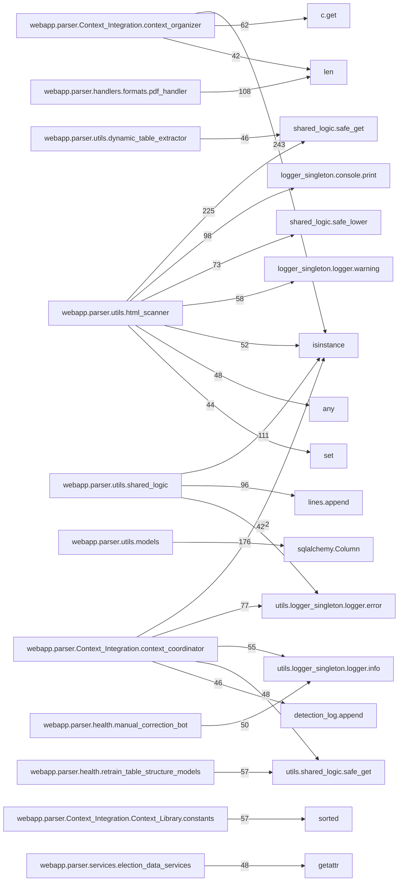
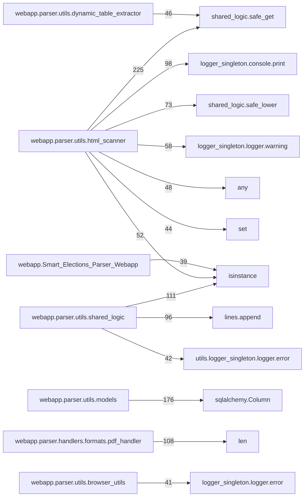

# Project Audit — webapp

Modules scanned: 69 | ~39168 non-empty LOC

## Pipeline map (Mermaid)


## Pipeline focus (compact)


## Cross-module hotspots
- webapp.parser.utils.dynamic_table_extractor:_emit ← 58 refs (C:/Users/edu-loaner/html_Parser_prototype/webapp/parser/utils/dynamic_table_extractor.py)
- webapp.parser.Context_Integration.context_coordinator:ContextCoordinator ← 29 refs (C:/Users/edu-loaner/html_Parser_prototype/webapp/parser/Context_Integration/context_coordinator.py)
- webapp.parser.utils.pivot:_safe_col_name ← 20 refs (C:/Users/edu-loaner/html_Parser_prototype/webapp/parser/utils/pivot.py)
- webapp.parser.utils.contest_selector:_norm_key ← 18 refs (C:/Users/edu-loaner/html_Parser_prototype/webapp/parser/utils/contest_selector.py)
- webapp.parser.utils.shared_logic:safe_lower ← 17 refs (C:/Users/edu-loaner/html_Parser_prototype/webapp/parser/utils/shared_logic.py)
- webapp.parser.utils.db_utils:get_session ← 16 refs (C:/Users/edu-loaner/html_Parser_prototype/webapp/parser/utils/db_utils.py)
- webapp.parser.utils.rawjson_utils:_rj_first ← 16 refs (C:/Users/edu-loaner/html_Parser_prototype/webapp/parser/utils/rawjson_utils.py)
- webapp.parser.health.log_cache_cleaner_bot:safe_path ← 14 refs (C:/Users/edu-loaner/html_Parser_prototype/webapp/parser/health/log_cache_cleaner_bot.py)
- webapp.parser.utils.html_scanner:_extract_clean_text ← 14 refs (C:/Users/edu-loaner/html_Parser_prototype/webapp/parser/utils/html_scanner.py)
- webapp.parser.utils.pivot:_coerce_int ← 13 refs (C:/Users/edu-loaner/html_Parser_prototype/webapp/parser/utils/pivot.py)
- webapp.Smart_Elections_Parser_Weba:resolve_session_id ← 11 refs (C:/Users/edu-loaner/html_Parser_prototype/webapp/Smart_Elections_Parser_Webapp.py)
- webapp.parser.handlers.formats.json_handler:find_key_by_keywords ← 11 refs (C:/Users/edu-loaner/html_Parser_prototype/webapp/parser/handlers/formats/json_handler.py)
- webapp.parser.utils.html_scanner:_extract_segments_by_label ← 11 refs (C:/Users/edu-loaner/html_Parser_prototype/webapp/parser/utils/html_scanner.py)
- webapp.parser.Context_Integration.context_organizer:ensure_dict ← 10 refs (C:/Users/edu-loaner/html_Parser_prototype/webapp/parser/Context_Integration/context_organizer.py)
- webapp.parser.utils.browser_utils:safe_locator ← 10 refs (C:/Users/edu-loaner/html_Parser_prototype/webapp/parser/utils/browser_utils.py)

## Leaf modules (candidates for review)
- `C:/Users/edu-loaner/html_Parser_prototype/webapp/parser/handlers/formats/html_handler.py`
- `C:/Users/edu-loaner/html_Parser_prototype/webapp/parser/handlers/states/arizona/arizona.py`
- `C:/Users/edu-loaner/html_Parser_prototype/webapp/parser/handlers/states/example state/example_county/example_county.py`
- `C:/Users/edu-loaner/html_Parser_prototype/webapp/parser/handlers/states/new_york/county/rockland.py`
- `C:/Users/edu-loaner/html_Parser_prototype/webapp/parser/handlers/states/new_york/new_york.py`
- `C:/Users/edu-loaner/html_Parser_prototype/webapp/parser/utils/date_utils.py`
- `C:/Users/edu-loaner/html_Parser_prototype/webapp/parser/utils/logger_singleton.py`
- `C:/Users/edu-loaner/html_Parser_prototype/webapp/parser/utils/merge_utils.py`
- `C:/Users/edu-loaner/html_Parser_prototype/webapp/parser/utils/seleniumbase_launcher.py`
- `C:/Users/edu-loaner/html_Parser_prototype/webapp/parser/utils/strategy_concurrency.py`
- `C:/Users/edu-loaner/html_Parser_prototype/webapp/parser/utils/structure_cache.py`

## Pipeline clusters (Mermaid)
```mermaid
graph LR
  subgraph Entry
    webapp_Smart_Elections_Parser_Webapp[webapp.Smart_Elections_Parser_Webapp]
  end
  subgraph Pipeline
    webapp_parser_web_pipeline[webapp.parser.web_pipeline]
  end
  subgraph Routing
    webapp_parser_state_router[webapp.parser.state_router]
  end
  subgraph Handlers
    webapp_parser_handlers_formats_csv_handler[webapp.parser.handlers.formats.csv_handler]
    webapp_parser_handlers_formats_html_handler[webapp.parser.handlers.formats.html_handler]
    webapp_parser_handlers_formats_json_handler[webapp.parser.handlers.formats.json_handler]
    webapp_parser_handlers_formats_pdf_handler[webapp.parser.handlers.formats.pdf_handler]
    webapp_parser_handlers_states_arizona_arizona[webapp.parser.handlers.states.arizona.arizona]
    webapp_parser_handlers_states_example state_example_county_example_county[webapp.parser.handlers.states.example state.example_county.example_county]
    webapp_parser_handlers_states_example state_example_state[webapp.parser.handlers.states.example state.example_state]
    webapp_parser_handlers_states_new_york_county_rockland[webapp.parser.handlers.states.new_york.county.rockland]
    webapp_parser_handlers_states_new_york_new_york[webapp.parser.handlers.states.new_york.new_york]
    webapp_parser_handlers_states_pennsylvania_pennsylvania[webapp.parser.handlers.states.pennsylvania.pennsylvania]
  end
  subgraph Services
    webapp_parser_services_context_service[webapp.parser.services.context_service]
    webapp_parser_services_election_data_services[webapp.parser.services.election_data_services]
  end
  subgraph Utils
    webapp_parser_utils_browser_utils[webapp.parser.utils.browser_utils]
    webapp_parser_utils_camelot_utils[webapp.parser.utils.camelot_utils]
    webapp_parser_utils_captcha_tools[webapp.parser.utils.captcha_tools]
    webapp_parser_utils_contest_selector[webapp.parser.utils.contest_selector]
    webapp_parser_utils_date_utils[webapp.parser.utils.date_utils]
    webapp_parser_utils_db_utils[webapp.parser.utils.db_utils]
    webapp_parser_utils_detect[webapp.parser.utils.detect]
    webapp_parser_utils_detector[webapp.parser.utils.detector]
    webapp_parser_utils_dom_extractor[webapp.parser.utils.dom_extractor]
    webapp_parser_utils_download_utils[webapp.parser.utils.download_utils]
    webapp_parser_utils_dynamic_table_extractor[webapp.parser.utils.dynamic_table_extractor]
    webapp_parser_utils_embedding_cache[webapp.parser.utils.embedding_cache]
  end
  webapp_parser_Context_Integration_context_organizer -->|243| isinstance
  webapp_parser_utils_html_scanner -->|225| shared_logic_safe_get
  webapp_parser_utils_models -->|176| sqlalchemy_Column
  webapp_parser_Context_Integration_context_coordinator -->|152| isinstance
  webapp_parser_utils_shared_logic -->|111| isinstance
  webapp_parser_handlers_formats_pdf_handler -->|108| len
  webapp_parser_utils_html_scanner -->|98| logger_singleton_console_print
  webapp_parser_utils_shared_logic -->|96| lines_append
  webapp_parser_Context_Integration_context_coordinator -->|77| utils_logger_singleton_logger_error
  webapp_parser_utils_html_scanner -->|73| shared_logic_safe_lower
  webapp_parser_Context_Integration_context_organizer -->|62| c_get
  webapp_parser_utils_html_scanner -->|58| logger_singleton_logger_warning
  webapp_parser_Context_Integration_Context_Library_constants -->|57| sorted
  webapp_parser_health_retrain_table_structure_models -->|57| utils_shared_logic_safe_get
  webapp_parser_Context_Integration_context_coordinator -->|55| utils_logger_singleton_logger_info
  webapp_parser_utils_html_scanner -->|52| isinstance
  webapp_parser_health_manual_correction_bot -->|50| utils_logger_singleton_logger_info
  webapp_parser_Context_Integration_context_coordinator -->|48| utils_shared_logic_safe_get
  webapp_parser_services_election_data_services -->|48| getattr
  webapp_parser_utils_html_scanner -->|48| any
```

## Modules

### `C:/Users/edu-loaner/html_Parser_prototype/webapp/Smart_Elections_Parser_Webapp.py`


- Definitions:
  - function: `ensure_utf8` (line 76)
  - class: `EnsureWsSecurityHeaders` (line 90)
  - function: `is_owner` (line 156)
  - function: `create_session_metadata` (line 160)
  - function: `cleanup_sessions` (line 170)
  - function: `cleanup_old_log_files` (line 190)
  - function: `client_fingerprint` (line 211)
  - function: `resolve_session_id` (line 220)
  - function: `emit_contest_options` (line 257)
  - function: `_promote_inner` (line 292)
  - function: `ensure_db_tables` (line 314)
  - function: `normalize_log_obj` (line 343)
  - function: `store_log` (line 475)
  - function: `_heartbeat_loop` (line 490)
  - function: `socketio_emit_func` (line 505)
  - function: `get_prompt_queue` (line 584)
  - function: `broadcast_sessions` (line 589)
  - function: `lock_session` (line 610)
  - function: `unlock_session` (line 615)
  - function: `safe_is_alive` (line 621)
  - function: `is_output_bypassed` (line 641)
  - function: `get_manual_source` (line 644)
  - function: `get_all_file_lists` (line 647)
  - function: `_csp_nonce` (line 664)
  - function: `build_csp` (line 673)
  - function: `add_headers` (line 743)
  - function: `add_url` (line 819)
  - function: `allowed_file` (line 831)
  - function: `get_url_list` (line 836)
  - function: `list_urls` (line 843)
  - function: `log_run_event` (line 869)
  - function: `index` (line 893)
  - function: `api_urls` (line 897)
  - function: `data_framework` (line 918)
  - function: `api_fs_list` (line 922)
  - function: `api_list_dir_compat` (line 969)
  - function: `api_fs_mkdir` (line 973)
  - function: `api_fs_delete` (line 1002)
  - function: `download_fs` (line 1039)
  - function: `favicon` (line 1058)
  - function: `api_warehouse_election_results` (line 1118)
  - function: `delete_input_file` (line 1207)
  - function: `delete_output_file` (line 1217)
  - function: `delete_upload_file` (line 1227)
  - function: `download_input_file` (line 1237)
  - function: `download_output_file` (line 1241)
  - function: `download_upload_file` (line 1245)
  - function: `run_parser` (line 1249)
  - function: `site_webmanifest` (line 1278)
  - function: `upload_to_input` (line 1316)
  - function: `upload_to_output` (line 1333)
  - function: `upload_to_uploads` (line 1350)
  - function: `health` (line 1364)
  - function: `clear_history` (line 1368)
  - function: `history` (line 1378)
  - function: `rerun_prior` (line 1421)
  - function: `handle_contest_selected` (line 1453)
  - function: `handle_get_session_history` (line 1494)
  - function: `handle_clone_session` (line 1546)
  - function: `on_join` (line 1575)
  - function: `handle_get_sessions` (line 1595)
  - function: `handle_connect` (line 1602)
  - function: `handle_disconnect` (line 1659)
  - function: `handle_set_output_mode` (line 1681)
  - function: `handle_parser_prompt` (line 1710)
  - function: `handle_cancel_parser` (line 1728)
  - function: `handle_toggle_output_bypass` (line 1755)
  - function: `handle_set_manual_source` (line 1780)
  - function: `handle_delete_session` (line 1802)
  - function: `handle_run_parser` (line 1830)
- Imports:
  - from __future__ import annotations (line 1)
  - import eventlet as eventlet (line 3)
  - from datetime import datetime (line 11)
  - from datetime import timezone (line 11)
  - from typing import Callable (line 12)
  - from typing import Iterable (line 12)
  - from typing import Tuple (line 12)
  - import secrets as secrets (line 13)
  - from flask import Flask (line 14)
  - from flask import render_template (line 14)
  - from flask import request (line 14)
  - from flask import redirect (line 14)
  - from flask import session (line 14)
  - from flask import url_for (line 14)
  - from flask import flash (line 14)
  - from flask import send_file (line 14)
  - from flask import send_from_directory (line 14)
  - from flask import jsonify (line 14)
  - from flask import Response (line 14)
  - from flask import g (line 14)
  - from flask_socketio import emit (line 19)
  - from flask_socketio import SocketIO (line 19)
  - from flask_socketio import join_room (line 19)
  - import orjson as orjson (line 20)
  - import os as os (line 21)
  - import time as time (line 22)
  - import re as re (line 23)
  - from werkzeug.exceptions import NotFound (line 24)
  - from threading import Thread (line 25)
  - from threading import RLock (line 25)
  - from threading import Event (line 25)
  - import gzip as gzip (line 26)
  - from queue import Queue (line 27)
  - import psycopg2 as psycopg2 (line 28)
  - import threading as threading (line 29)
  - import re as re (line 30)
  - from psycopg2 import sql (line 31)
  - from psycopg2 import errors as pg_errors (line 32)
  - from webapp.parser import data_manager (line 38)
  - from webapp.parser.utils.shared_logic import safe_get (line 39)
  - from webapp.parser.utils.shared_logic import safe_split (line 39)
  - from webapp.parser.utils.shared_logic import safe_lower (line 39)
  - from webapp.parser.utils.shared_logic import safe_is_set (line 39)
  - from webapp.parser.utils.shared_logic import safe_append (line 39)
  - from webapp.parser.utils.shared_logic import safe_sid (line 39)
  - from webapp.parser.utils.shared_logic import safe_rsplit (line 39)
  - from webapp.parser.utils.shared_logic import safe_strip (line 39)
  - from webapp.parser.web_pipeline import process_urls_for_web (line 43)
  - from webapp.parser.web_pipeline import cancel_processing (line 43)
  - from webapp.parser.web_pipeline import cancellation_manager (line 43)
  - from webapp.parser.config import INPUT_DIR (line 46)
  - from webapp.parser.config import OUTPUT_DIR (line 46)
  - from webapp.parser.config import UPLOADS_DIR (line 46)
  - from webapp.parser.config import URL_LIST_FILE (line 46)
  - from webapp.parser.config import SUPPORTED_FORMATS (line 46)
  - from webapp.parser.config import DATA_API_URL (line 46)
  - from webapp.parser.config import POSTGRES_DB (line 46)
  - from webapp.parser.config import POSTGRES_USER_RAW (line 46)
  - from webapp.parser.config import POSTGRES_PASSWORD_RAW (line 46)
  - from webapp.parser.config import POSTGRES_HOST (line 46)
  - from webapp.parser.config import POSTGRES_PORT (line 46)
  - from webapp.parser.config import RUN_HISTORY_FILE (line 46)
  - from webapp.parser.config import LOG_DIR (line 46)
  - from webapp.parser.utils.logger_singleton import logger (line 51)
  - from webapp.parser.utils.logger_singleton import console (line 51)
  - from webapp.parser.utils.logger_singleton import prompt (line 51)
- TODO/FIXME/WARN:
  - L88: WEBAPP_CONSOLE_LEVELS = set(os.environ.get("WEBAPP_CONSOLE_LEVELS", "ERROR,WARNING").upper().split(","))
  - L346:     Levels: INFO, DEBUG, WARNING, ERROR, CRITICAL, TRACE
  - L385:     LEVELS = {"INFO", "DEBUG", "WARNING", "ERROR", "CRITICAL", "TRACE"}
  - L421:             elif "warning" in mlow:
  - L795:         # For websocket handshake only: add Cache-Control so webhint stops warning
  - L1068:         logger.warning({"type": "sec", "message": "Favicon path escape blocked", "requested": ico_path})
  - L1160:             logger.warning({
  - L1161:                 "level": "WARNING",
  - L1466:             "level": "WARNING",
  - L1549:         logger.warning(
  - L1551:                 "level": "WARNING",
  - L1578:         logger.warning(
  - L1580:                 "level": "WARNING",
  - L1805:         logger.warning({
  - L1806:             "level": "WARNING",
  - L1874:         logger.warning({
  - L1875:             "level": "WARNING",
- Outgoing cross-module calls (sample):
  - eventlet.monkey_patch (line 4)
  - dotenv.load_dotenv (line 55)
  - flask.Flask (line 61)
  - flask_socketio.SocketIO (line 62)
  - ct.startswith (line 83)
  - ct.lower (line 83)
  - ct.split (line 85)
  - headers.append (line 104)
  - headers.append (line 106)
  - self.app (line 108)
  - threading.Event (line 128)
  - threading.RLock (line 149)
  - webapp.parser.utils.shared_logic.safe_get (line 157)
  - webapp.parser.utils.shared_logic.safe_get (line 158)
  - datetime.datetime.now (line 164)
  - time.time (line 165)
  - time.time (line 171)
  - session_last_active.items (line 173)
  - expired.append (line 175)
  - active_sessions_backend.discard (line 176)
  - session_metadata.pop (line 178)
  - session_logs.pop (line 179)
  - os.remove (line 184)
  - flask_socketio.emit (line 188)
  - time.time (line 195)
  - os.listdir (line 197)
  - fname.startswith (line 198)
  - fname.endswith (line 198)
  - os.stat (line 205)
  - os.remove (line 207)
  - xff.split (line 214)
  - webapp.parser.utils.shared_logic.safe_sid (line 222)
  - webapp.parser.utils.shared_logic.safe_get (line 230)
  - sid_to_session.get (line 234)
  - flask.session.get (line 237)
  - ip_ua_to_session.get (line 242)
  - os.urandom (line 249)
  - webapp.parser.utils.shared_logic.safe_get (line 267)
  - webapp.parser.utils.shared_logic.safe_get (line 268)
  - webapp.parser.utils.shared_logic.safe_get (line 269)
  - webapp.parser.utils.shared_logic.safe_get (line 270)
  - webapp.parser.utils.shared_logic.safe_get (line 271)
  - webapp.parser.utils.shared_logic.safe_get (line 272)
  - socketio.emit (line 277)
  - webapp.parser.utils.logger_singleton.logger.info (line 278)
  - webapp.parser.utils.logger_singleton.logger.error (line 285)
  - obj.get (line 293)
  - inner.strip (line 294)
  - orjson.loads (line 296)
  - parsed.get (line 298)
- Inbound references:
  - ensure_utf8 ← C:/Users/edu-loaner/html_Parser_prototype/webapp/Smart_Elections_Parser_Webapp.py:815
  - EnsureWsSecurityHeaders ← C:/Users/edu-loaner/html_Parser_prototype/webapp/Smart_Elections_Parser_Webapp.py:111
  - create_session_metadata ← C:/Users/edu-loaner/html_Parser_prototype/webapp/Smart_Elections_Parser_Webapp.py:254
  - create_session_metadata ← C:/Users/edu-loaner/html_Parser_prototype/webapp/Smart_Elections_Parser_Webapp.py:1590
  - create_session_metadata ← C:/Users/edu-loaner/html_Parser_prototype/webapp/Smart_Elections_Parser_Webapp.py:1861
  - cleanup_sessions ← C:/Users/edu-loaner/html_Parser_prototype/webapp/Smart_Elections_Parser_Webapp.py:1596
  - cleanup_sessions ← C:/Users/edu-loaner/html_Parser_prototype/webapp/Smart_Elections_Parser_Webapp.py:1604
  - cleanup_sessions ← C:/Users/edu-loaner/html_Parser_prototype/webapp/Smart_Elections_Parser_Webapp.py:1752
  - cleanup_sessions ← C:/Users/edu-loaner/html_Parser_prototype/webapp/Smart_Elections_Parser_Webapp.py:1835
  - cleanup_old_log_files ← C:/Users/edu-loaner/html_Parser_prototype/webapp/Smart_Elections_Parser_Webapp.py:2023
  - client_fingerprint ← C:/Users/edu-loaner/html_Parser_prototype/webapp/Smart_Elections_Parser_Webapp.py:241
  - resolve_session_id ← C:/Users/edu-loaner/html_Parser_prototype/webapp/Smart_Elections_Parser_Webapp.py:1458
  - resolve_session_id ← C:/Users/edu-loaner/html_Parser_prototype/webapp/Smart_Elections_Parser_Webapp.py:1495
  - resolve_session_id ← C:/Users/edu-loaner/html_Parser_prototype/webapp/Smart_Elections_Parser_Webapp.py:1576
  - resolve_session_id ← C:/Users/edu-loaner/html_Parser_prototype/webapp/Smart_Elections_Parser_Webapp.py:1638
  - resolve_session_id ← C:/Users/edu-loaner/html_Parser_prototype/webapp/Smart_Elections_Parser_Webapp.py:1684
  - resolve_session_id ← C:/Users/edu-loaner/html_Parser_prototype/webapp/Smart_Elections_Parser_Webapp.py:1713
  - resolve_session_id ← C:/Users/edu-loaner/html_Parser_prototype/webapp/Smart_Elections_Parser_Webapp.py:1729
  - resolve_session_id ← C:/Users/edu-loaner/html_Parser_prototype/webapp/Smart_Elections_Parser_Webapp.py:1756
  - resolve_session_id ← C:/Users/edu-loaner/html_Parser_prototype/webapp/Smart_Elections_Parser_Webapp.py:1781
  - resolve_session_id ← C:/Users/edu-loaner/html_Parser_prototype/webapp/Smart_Elections_Parser_Webapp.py:1803
  - resolve_session_id ← C:/Users/edu-loaner/html_Parser_prototype/webapp/Smart_Elections_Parser_Webapp.py:1837
  - _promote_inner ← C:/Users/edu-loaner/html_Parser_prototype/webapp/Smart_Elections_Parser_Webapp.py:405
  - ensure_db_tables ← C:/Users/edu-loaner/html_Parser_prototype/webapp/Smart_Elections_Parser_Webapp.py:1128
  - ensure_db_tables ← C:/Users/edu-loaner/html_Parser_prototype/webapp/Smart_Elections_Parser_Webapp.py:1166
  - ensure_db_tables ← C:/Users/edu-loaner/html_Parser_prototype/webapp/Smart_Elections_Parser_Webapp.py:2020
  - normalize_log_obj ← C:/Users/edu-loaner/html_Parser_prototype/webapp/Smart_Elections_Parser_Webapp.py:521
  - normalize_log_obj ← C:/Users/edu-loaner/html_Parser_prototype/webapp/Smart_Elections_Parser_Webapp.py:1465
  - normalize_log_obj ← C:/Users/edu-loaner/html_Parser_prototype/webapp/Smart_Elections_Parser_Webapp.py:1476
  - normalize_log_obj ← C:/Users/edu-loaner/html_Parser_prototype/webapp/Smart_Elections_Parser_Webapp.py:1486
  - normalize_log_obj ← C:/Users/edu-loaner/html_Parser_prototype/webapp/Smart_Elections_Parser_Webapp.py:1919
  - store_log ← C:/Users/edu-loaner/html_Parser_prototype/webapp/Smart_Elections_Parser_Webapp.py:576
  - socketio_emit_func ← C:/Users/edu-loaner/html_Parser_prototype/webapp/Smart_Elections_Parser_Webapp.py:1914
  - get_prompt_queue ← C:/Users/edu-loaner/html_Parser_prototype/webapp/Smart_Elections_Parser_Webapp.py:1957
  - broadcast_sessions ← C:/Users/edu-loaner/html_Parser_prototype/webapp/Smart_Elections_Parser_Webapp.py:613
  - broadcast_sessions ← C:/Users/edu-loaner/html_Parser_prototype/webapp/Smart_Elections_Parser_Webapp.py:619
  - broadcast_sessions ← C:/Users/edu-loaner/html_Parser_prototype/webapp/Smart_Elections_Parser_Webapp.py:1565
  - lock_session ← C:/Users/edu-loaner/html_Parser_prototype/webapp/Smart_Elections_Parser_Webapp.py:1888
  - unlock_session ← C:/Users/edu-loaner/html_Parser_prototype/webapp/Smart_Elections_Parser_Webapp.py:1751
  - unlock_session ← C:/Users/edu-loaner/html_Parser_prototype/webapp/Smart_Elections_Parser_Webapp.py:2007
  - safe_is_alive ← C:/Users/edu-loaner/html_Parser_prototype/webapp/Smart_Elections_Parser_Webapp.py:1865
  - safe_is_alive ← C:/Users/edu-loaner/html_Parser_prototype/webapp/Smart_Elections_Parser_Webapp.py:1873
  - is_output_bypassed ← C:/Users/edu-loaner/html_Parser_prototype/webapp/Smart_Elections_Parser_Webapp.py:1887
  - get_manual_source ← C:/Users/edu-loaner/html_Parser_prototype/webapp/Smart_Elections_Parser_Webapp.py:1883
  - get_all_file_lists ← C:/Users/edu-loaner/html_Parser_prototype/webapp/Smart_Elections_Parser_Webapp.py:1262
  - build_csp ← C:/Users/edu-loaner/html_Parser_prototype/webapp/Smart_Elections_Parser_Webapp.py:790
  - add_url ← C:/Users/edu-loaner/html_Parser_prototype/webapp/parser/data_manager.py:169
  - allowed_file ← C:/Users/edu-loaner/html_Parser_prototype/webapp/Smart_Elections_Parser_Webapp.py:1256
  - allowed_file ← C:/Users/edu-loaner/html_Parser_prototype/webapp/Smart_Elections_Parser_Webapp.py:1324
  - allowed_file ← C:/Users/edu-loaner/html_Parser_prototype/webapp/Smart_Elections_Parser_Webapp.py:1341

### `C:/Users/edu-loaner/html_Parser_prototype/webapp/parser/Context_Integration/Context_Library/constants.py`


- Definitions:
  - function: `build_state_to_division_type_map` (line 691)
  - function: `normalize_party_code` (line 2260)
  - function: `canonical_ballot_group` (line 2285)
  - function: `split_and_normalize_ballot_groups` (line 2312)
  - function: `normalize_party_label` (line 2330)
  - function: `is_pseudo_result_party` (line 2358)
  - function: `_iter_strings` (line 2527)
  - function: `_compile_union` (line 2538)
  - function: `_norm_state_key` (line 2577)
  - function: `_norm_county_key` (line 2588)
  - function: `_collect_layered_patterns` (line 2597)
  - function: `get_camelot_title_regex` (line 2608)
  - function: `get_camelot_row_regex` (line 2618)
  - function: `build_camelot_row_filter` (line 2631)
- Imports:
  - import re as re (line 1)
  - from functools import lru_cache (line 2)
  - from typing import Dict (line 3)
  - from typing import List (line 3)
  - from typing import Set (line 3)
  - from typing import Tuple (line 3)
  - from typing import Optional (line 3)
  - from typing import Pattern (line 3)
  - from typing import Callable (line 3)
  - from typing import Any (line 3)
  - from typing import Iterable (line 3)
- TODO/FIXME/WARN:
  - L1920:         "icon-bg-dark", "icon-bg-primary", "icon-bg-secondary", "icon-bg-success", "icon-bg-danger", "icon-bg-warning",
  - L2011:     "warning", "info_box", "navigation", "pagination", "tab", "modal", "tooltip", "ignore", "unknown"
- Outgoing cross-module calls (sample):
  - DEFAULT_DIVISION_TYPE_BY_STATE.get (line 707)
  - KNOWN_STATE_TO_COUNTY_MAP.items (line 710)
  - DIVISION_TYPE_OVERRIDES.items (line 714)
  - KNOWN_STATE_TO_COUNTY_MAP.keys (line 750)
  - _CANONICAL_STATE_ABBR.items (line 811)
  - k.upper (line 1218)
  - PARTY_CODE_MAP.items (line 1218)
  - t.lower (line 1381)
  - GROUP_RENAME_MAP.update (line 1383)
  - re.escape (line 1611)
  - x.startswith (line 1611)
  - re.escape (line 1666)
  - re.escape (line 1667)
  - re.escape (line 1668)
  - re.escape (line 1669)
  - re.escape (line 1670)
  - re.escape (line 1671)
  - re.escape (line 1672)
  - re.escape (line 1673)
  - re.escape (line 1674)
  - re.escape (line 1675)
  - re.escape (line 1676)
  - re.escape (line 1677)
  - re.escape (line 1678)
  - re.compile (line 1871)
  - re.compile (line 1872)
  - re.compile (line 1873)
  - re.compile (line 1877)
  - re.compile (line 1951)
  - re.compile (line 1952)
  - GROUP_RENAME_MAP.items (line 2208)
  - _k.lower (line 2209)
  - _EXTRA_BALLOT_VARIANTS.items (line 2221)
  - BALLOT_NAME_CANON_MAP.setdefault (line 2222)
  - _PARTY_CANON_MAP.items (line 2253)
  - PARTY_CODE_MAP.items (line 2257)
  - PARTY_NORMALIZATION_MAP.setdefault (line 2258)
  - _code.lower (line 2258)
  - PARTY_NORMALIZATION_MAP.get (line 2266)
  - token.strip (line 2267)
  - PARTY_NORMALIZATION_MAP.get (line 2269)
  - raw.upper (line 2271)
  - _re.sub (line 2276)
  - raw.lower (line 2280)
  - PARTY_NORMALIZATION_MAP.get (line 2283)
  - raw.title (line 2283)
  - name.strip (line 2289)
  - raw.lower (line 2292)
  - p.strip (line 2298)
  - _re.split (line 2298)
- Inbound references:
  - build_state_to_division_type_map ← C:/Users/edu-loaner/html_Parser_prototype/webapp/parser/Context_Integration/Context_Library/constants.py:721
  - normalize_party_code ← C:/Users/edu-loaner/html_Parser_prototype/webapp/parser/Context_Integration/Context_Library/constants.py:2345
  - canonical_ballot_group ← C:/Users/edu-loaner/html_Parser_prototype/webapp/parser/Context_Integration/Context_Library/constants.py:2320
  - canonical_ballot_group ← C:/Users/edu-loaner/html_Parser_prototype/webapp/parser/Context_Integration/Context_Library/constants.py:2323
  - canonical_ballot_group ← C:/Users/edu-loaner/html_Parser_prototype/webapp/parser/utils/salvage.py:58
  - normalize_party_label ← C:/Users/edu-loaner/html_Parser_prototype/webapp/parser/Context_Integration/Context_Library/constants.py:2362
  - is_pseudo_result_party ← C:/Users/edu-loaner/html_Parser_prototype/webapp/parser/Context_Integration/Context_Library/constants.py:2647
  - _iter_strings ← C:/Users/edu-loaner/html_Parser_prototype/webapp/parser/Context_Integration/Context_Library/constants.py:2628
  - _compile_union ← C:/Users/edu-loaner/html_Parser_prototype/webapp/parser/Context_Integration/Context_Library/constants.py:2615
  - _compile_union ← C:/Users/edu-loaner/html_Parser_prototype/webapp/parser/Context_Integration/Context_Library/constants.py:2629
  - _norm_state_key ← C:/Users/edu-loaner/html_Parser_prototype/webapp/parser/Context_Integration/Context_Library/constants.py:2599
  - _norm_county_key ← C:/Users/edu-loaner/html_Parser_prototype/webapp/parser/Context_Integration/Context_Library/constants.py:2600
  - _collect_layered_patterns ← C:/Users/edu-loaner/html_Parser_prototype/webapp/parser/Context_Integration/Context_Library/constants.py:2614
  - _collect_layered_patterns ← C:/Users/edu-loaner/html_Parser_prototype/webapp/parser/Context_Integration/Context_Library/constants.py:2625
  - _collect_layered_patterns ← C:/Users/edu-loaner/html_Parser_prototype/webapp/parser/Context_Integration/Context_Library/constants.py:2626
  - get_camelot_title_regex ← C:/Users/edu-loaner/html_Parser_prototype/webapp/parser/Context_Integration/Context_Library/constants.py:2638
  - get_camelot_row_regex ← C:/Users/edu-loaner/html_Parser_prototype/webapp/parser/Context_Integration/Context_Library/constants.py:2639

### `C:/Users/edu-loaner/html_Parser_prototype/webapp/parser/Context_Integration/Integrity_check.py`


- Definitions:
  - function: `_ensure_alerts_table` (line 35)
  - function: `find_date_anomalies` (line 42)
  - function: `detect_anomalies_with_ml` (line 50)
  - function: `election_integrity_checks` (line 101)
  - function: `advanced_cross_field_validation` (line 122)
  - function: `summarize_context_entities` (line 131)
  - function: `analyze_contests` (line 142)
  - function: `auto_tune_contamination` (line 158)
  - function: `print_issues_table` (line 179)
  - function: `print_entity_summary` (line 199)
  - function: `print_ml_anomalies` (line 207)
  - function: `print_date_anomalies` (line 237)
  - function: `print_auto_tune_result` (line 255)
  - function: `print_analyze_contests` (line 261)
  - function: `monitor_db_for_alerts` (line 273)
  - function: `log_integrity_issues` (line 319)
  - function: `detect_statistical_outliers` (line 335)
  - function: `print_integrity_summary` (line 371)
- Imports:
  - import numpy as np (line 1)
  - from sklearn.ensemble import IsolationForest (line 2)
  - from sklearn.cluster import DBSCAN (line 3)
  - from sklearn.preprocessing import LabelEncoder (line 4)
  - from sklearn.decomposition import PCA (line 5)
  - import matplotlib as matplotlib (line 6)
  - import matplotlib.pyplot as plt (line 10)
  - import threading as threading (line 11)
  - import orjson as orjson (line 12)
  - import time as time (line 13)
  - import re as re (line 14)
  - from pathlib import Path (line 15)
  - from utils.logger_singleton import console (line 16)
  - from typing import List (line 17)
  - from typing import Dict (line 17)
  - from typing import Any (line 17)
  - from typing import Tuple (line 17)
  - from utils.spacy_utils import extract_dates (line 18)
  - from config import CONTEXT_DB_PATH (line 19)
  - from config import CONTEXT_LIBRARY_PATH (line 19)
  - from utils import misc_utils (line 20)
  - from sqlalchemy import select (line 21)
  - from utils.db_utils import get_session (line 22)
  - from utils.shared_logic import safe_get (line 23)
  - from utils.shared_logic import safe_items (line 23)
  - from utils.shared_logic import safe_encode (line 23)
  - from utils.shared_logic import safe_tolist (line 23)
  - from utils.shared_logic import safe_execute (line 23)
  - from utils.shared_logic import safe_all (line 23)
  - from Context_Integration.librarian import clean_for_json (line 27)
  - from utils.models import Alert (line 30)
  - from rich.table import Table (line 32)
  - from rich.panel import Panel (line 33)
- Outgoing cross-module calls (sample):
  - matplotlib.use (line 8)
  - utils.spacy_utils.extract_dates (line 45)
  - utils.shared_logic.safe_get (line 45)
  - anomalies.append (line 47)
  - numpy.array (line 58)
  - sklearn.preprocessing.LabelEncoder (line 60)
  - sklearn.preprocessing.LabelEncoder (line 61)
  - sklearn.preprocessing.LabelEncoder (line 62)
  - utils.shared_logic.safe_get (line 63)
  - utils.shared_logic.safe_get (line 64)
  - utils.shared_logic.safe_get (line 65)
  - le_state.fit (line 66)
  - le_county.fit (line 67)
  - le_type.fit (line 68)
  - utils.shared_logic.safe_get (line 72)
  - utils.shared_logic.safe_encode (line 74)
  - embedding_model.encode (line 74)
  - utils.shared_logic.safe_tolist (line 75)
  - features.append (line 76)
  - le_state.transform (line 77)
  - utils.shared_logic.safe_get (line 77)
  - le_county.transform (line 78)
  - utils.shared_logic.safe_get (line 78)
  - le_type.transform (line 79)
  - utils.shared_logic.safe_get (line 79)
  - utils.shared_logic.safe_get (line 80)
  - utils.shared_logic.safe_get (line 80)
  - utils.shared_logic.safe_get (line 81)
  - utils.shared_logic.safe_get (line 82)
  - utils.shared_logic.safe_get (line 82)
  - utils.shared_logic.safe_get (line 83)
  - utils.shared_logic.safe_get (line 83)
  - numpy.array (line 87)
  - sklearn.ensemble.IsolationForest (line 88)
  - clf.fit_predict (line 93)
  - sklearn.cluster.DBSCAN (line 95)
  - c.get (line 105)
  - c.get (line 105)
  - c.get (line 105)
  - c.get (line 105)
  - issues.append (line 107)
  - seen.add (line 109)
  - c.get (line 110)
  - c.get (line 110)
  - issues.append (line 111)
  - c.get (line 112)
  - c.get (line 112)
  - issues.append (line 113)
  - c.get (line 115)
  - c.get (line 115)
- Inbound references:
  - _ensure_alerts_table ← C:/Users/edu-loaner/html_Parser_prototype/webapp/parser/Context_Integration/Integrity_check.py:38
  - find_date_anomalies ← C:/Users/edu-loaner/html_Parser_prototype/webapp/parser/Context_Integration/Integrity_check.py:145
  - detect_anomalies_with_ml ← C:/Users/edu-loaner/html_Parser_prototype/webapp/parser/Context_Integration/Integrity_check.py:146
  - election_integrity_checks ← C:/Users/edu-loaner/html_Parser_prototype/webapp/parser/Context_Integration/Integrity_check.py:144
  - advanced_cross_field_validation ← C:/Users/edu-loaner/html_Parser_prototype/webapp/parser/Context_Integration/Integrity_check.py:393
  - summarize_context_entities ← C:/Users/edu-loaner/html_Parser_prototype/webapp/parser/Context_Integration/Integrity_check.py:389
  - summarize_context_entities ← C:/Users/edu-loaner/html_Parser_prototype/webapp/parser/health/manual_correction_bot.py:999
  - analyze_contests ← C:/Users/edu-loaner/html_Parser_prototype/webapp/parser/html_election_parser.py:412
  - analyze_contests ← C:/Users/edu-loaner/html_Parser_prototype/webapp/parser/Context_Integration/Integrity_check.py:379
  - analyze_contests ← C:/Users/edu-loaner/html_Parser_prototype/webapp/parser/health/manual_correction_bot.py:979
  - auto_tune_contamination ← C:/Users/edu-loaner/html_Parser_prototype/webapp/parser/Context_Integration/Integrity_check.py:398
  - print_issues_table ← C:/Users/edu-loaner/html_Parser_prototype/webapp/parser/Context_Integration/Integrity_check.py:262
  - print_issues_table ← C:/Users/edu-loaner/html_Parser_prototype/webapp/parser/Context_Integration/Integrity_check.py:394
  - print_entity_summary ← C:/Users/edu-loaner/html_Parser_prototype/webapp/parser/Context_Integration/Integrity_check.py:390
  - print_ml_anomalies ← C:/Users/edu-loaner/html_Parser_prototype/webapp/parser/Context_Integration/Integrity_check.py:264
  - print_date_anomalies ← C:/Users/edu-loaner/html_Parser_prototype/webapp/parser/Context_Integration/Integrity_check.py:263
  - print_auto_tune_result ← C:/Users/edu-loaner/html_Parser_prototype/webapp/parser/Context_Integration/Integrity_check.py:399
  - print_analyze_contests ← C:/Users/edu-loaner/html_Parser_prototype/webapp/parser/Context_Integration/Integrity_check.py:386
  - print_integrity_summary ← C:/Users/edu-loaner/html_Parser_prototype/webapp/parser/html_election_parser.py:444
  - print_integrity_summary ← C:/Users/edu-loaner/html_Parser_prototype/webapp/parser/html_election_parser.py:491

### `C:/Users/edu-loaner/html_Parser_prototype/webapp/parser/Context_Integration/context_coordinator.py`

> context_coordinator.py

- Definitions:
  - function: `get_semantic_score` (line 64)
  - function: `merge_and_rank_candidates` (line 102)
  - function: `dynamic_state_county_detection` (line 192)
  - class: `ContextCoordinator` (line 706)
- Imports:
  - import re as re (line 11)
  - import os as os (line 12)
  - import numpy as np (line 13)
  - import orjson as orjson (line 14)
  - import numbers as numbers (line 15)
  - from datetime import datetime (line 16)
  - from datetime import timezone (line 16)
  - from rapidfuzz import process (line 17)
  - from rapidfuzz import fuzz (line 17)
  - from collections import defaultdict (line 18)
  - from utils.logger_singleton import logger (line 19)
  - import difflib as difflib (line 20)
  - from utils.browser_utils import safe_nth (line 21)
  - from utils.browser_utils import safe_locator (line 21)
  - from utils.browser_utils import safe_inner_text (line 21)
  - from utils.browser_utils import safe_get_attribute (line 21)
  - from utils.browser_utils import safe_evaluate (line 21)
  - from utils.browser_utils import safe_is_visible (line 21)
  - from utils.browser_utils import safe_is_enabled (line 21)
  - from utils.browser_utils import safe_click (line 21)
  - from utils.browser_utils import safe_wait_for_timeout (line 21)
  - from utils.browser_utils import safe_count (line 21)
  - from utils.browser_utils import scan_buttons_with_progress (line 21)
  - from utils.shared_logic import keyphrase_match (line 26)
  - from utils.shared_logic import normalize_state_name (line 26)
  - from utils.shared_logic import normalize_county_name (line 26)
  - from utils.shared_logic import safe_get_first (line 26)
  - from utils.shared_logic import safe_model_encode (line 26)
  - from utils.shared_logic import safe_startswith (line 26)
  - from utils.shared_logic import safe_isupper (line 26)
  - from utils.shared_logic import _sync_type_and_election_types (line 26)
  - from utils.shared_logic import safe_get (line 26)
  - from utils.shared_logic import safe_items (line 26)
  - from utils.shared_logic import safe_lower (line 26)
  - from utils.shared_logic import safe_endswith (line 26)
  - from utils.shared_logic import safe_similarity (line 26)
  - from utils.shared_logic import safe_strip (line 26)
  - from utils.shared_logic import safe_replace (line 26)
  - from utils.shared_logic import safe_append (line 26)
  - from utils.shared_logic import safe_filename (line 26)
  - from utils.shared_logic import safe_tolist (line 26)
  - from Context_Library.constants import STATE_MODULE_MAP (line 33)
  - from Context_Library.constants import KNOWN_STATE_TO_COUNTY_MAP (line 33)
  - from Context_Library.constants import KNOWN_COUNTY_TO_PRECINCTS_MAP (line 33)
  - from Context_Library.constants import PARTY_KEYWORDS (line 33)
  - from Context_Library.constants import ELECTION_TYPES (line 33)
  - from Context_Library.constants import STATE_ABBR (line 33)
  - from Context_Library.constants import LOCATION_KEYWORDS (line 33)
  - from Context_Library.constants import TABLE_TAGS (line 33)
  - from Context_Library.constants import PANEL_TAGS (line 33)
  - from Context_Library.constants import STATE_TAGS (line 33)
  - from Context_Library.constants import BUTTON_TAGS (line 33)
  - from Context_Library.constants import BALLOT_TYPES (line 33)
  - from librarian import atomic_write_json (line 38)
  - from sklearn.preprocessing import LabelEncoder (line 41)
  - import subprocess as subprocess (line 42)
  - from config import PROJECT_ROOT (line 43)
  - from config import LOG_DIR (line 43)
  - from config import CONTEXT_LIBRARY_PATH (line 43)
  - import threading as threading (line 44)
  - from utils.spacy_utils import extract_entities (line 46)
  - from utils.spacy_utils import extract_locations (line 46)
  - from utils.spacy_utils import extract_dates (line 46)
  - from Integrity_check import detect_anomalies_with_ml (line 49)
  - from Integrity_check import election_integrity_checks (line 49)
  - from Integrity_check import monitor_db_for_alerts (line 49)
  - from Integrity_check import advanced_cross_field_validation (line 49)
  - from Integrity_check import print_integrity_summary (line 49)
  - from librarian import clean_for_json (line 56)
  - from context_organizer import ContextOrganizer (line 59)
  - from services.election_data_services import ElectionDataService (line 60)
  - from typing import Optional (line 61)
  - from typing import Any (line 61)
  - from typing import List (line 61)
  - from typing import Dict (line 61)
  - from typing import Tuple (line 61)
  - from typing import Callable (line 61)
- TODO/FIXME/WARN:
  - L746:                     logger.warning("[ALERT MONITOR] Thread did not stop cleanly.")
  - L884:             logger.warning(f"[yellow]Integrity issues:[/yellow] {issues['integrity_issues']}")
  - L1123:                 logger.warning(f"[ContextCoordinator] No table structure found for contest: {contest}")
  - L1292:                     logger.warning(f"[get_feedback_pattern_kb] Skipping corrupt line: {e}")
  - L1405:                 logger.warning("[group_dom_nodes_by_label] No organized DOM parts. (Further warnings suppressed)")
  - L1407:                 logger.warning(f"[group_dom_nodes_by_label] No organized DOM parts. (Occurred {ContextCoordinator._dom_parts_warning_count} times)")
  - L1412:             logger.warning("[group_dom_nodes_by_label] No DOM nodes found.")
  - L1430:                 logger.warning("[submit_user_feedback] ContextOrganizer has no submit_user_feedback method.")
  - L1458:                 logger.warning(f"[correct_and_update_contest] Contest {contest_id} missing type/election_types after sync.")
  - L1482:             logger.warning("[print_contest_summary] No organized contests to summarize.")
  - L1495:             logger.warning("[plot_contest_distribution] No organized contests to plot.")
  - L1546:                 logger.warning("No organized DOM parts.")
  - L1549:                 logger.warning("No organized DOM parts. (Further warnings suppressed)")
  - L1560:             logger.warning("[get_contest_groups] No contest groups found.")
  - L1569:             logger.warning("[get_panel_groups] No panel groups found.")
  - L1578:             logger.warning("[get_button_groups] No button groups found.")
  - L1587:             logger.warning("[get_table_groups] No table groups found.")
  - L1596:             logger.warning("[get_relationships] No organized context.")
  - L1704:                 logger.warning(f"[fuzzy_score] One or both inputs are empty: a='{a_str}', b='{b_str}'")
  - L1710:                 logger.warning(f"[fuzzy_score] One or both inputs are too short: a='{a_str}', b='{b_str}'")
  - L2156:             logger.warning(f"[extract_field] Unknown field_type: {field_type}")
  - L2414:                     logger.warning(f"[get_full_contest] Contest {contest_id} missing type/election_types after sync.")
  - L2499:                         logger.warning(f"[list_tables] Table '{tbl}' missing metadata or columns.")
  - L2531:                 logger.warning(f"[get_table_metadata] Table '{table_name}' missing columns.")
  - L2549:                 logger.warning(f"[check_missing_tables] Missing tables: {missing}")
  - L2610:                 logger.warning(f"[save_table_structure] Failed to save structure for contest: {contest}")
  - L2787:             logger.warning(f"[get_best_button_advanced] Contest argument was not a dict. Converted to: {contest}")
  - L2791:             logger.warning(f"[get_best_button_advanced] Keywords argument was not a list. Converted to: {keywords}")
  - L2795:             logger.warning(f"[get_best_button_advanced] Context argument was not a dict. Converted to: {context}")
  - L2802:             logger.warning("[get_best_button_advanced] _semantic_model is not set or is not an object. Using None.")
  - L2946:                             logger.warning(f"[yellow][Coordinator] Button '{cand.get('label')}' rejected, retrying...[/yellow]")
- Outgoing cross-module calls (sample):
  - utils.logger_singleton.logger.error (line 71)
  - utils.logger_singleton.logger.error (line 74)
  - utils.shared_logic.safe_model_encode (line 77)
  - utils.shared_logic.safe_model_encode (line 78)
  - utils.logger_singleton.logger.debug (line 79)
  - util.pytorch_cos_sim (line 81)
  - cos_sim.item (line 84)
  - cos_sim.numpy (line 86)
  - arr.flatten (line 87)
  - utils.logger_singleton.logger.error (line 91)
  - utils.logger_singleton.logger.error (line 95)
  - utils.logger_singleton.logger.error (line 99)
  - utils.shared_logic.safe_get (line 113)
  - utils.shared_logic.safe_get (line 115)
  - utils.shared_logic.safe_get (line 115)
  - seen.add (line 117)
  - all_candidates.append (line 118)
  - utils.shared_logic.safe_get (line 121)
  - utils.shared_logic.safe_get (line 122)
  - utils.shared_logic.safe_get (line 125)
  - utils.shared_logic.safe_get (line 126)
  - utils.shared_logic.safe_get (line 127)
  - utils.shared_logic.safe_get (line 128)
  - utils.shared_logic.safe_get (line 131)
  - utils.shared_logic.safe_get (line 132)
  - utils.shared_logic.safe_get (line 137)
  - utils.shared_logic.safe_lower (line 139)
  - label.strip (line 139)
  - utils.shared_logic.safe_lower (line 139)
  - contest_title.strip (line 139)
  - utils.shared_logic.keyphrase_match (line 143)
  - utils.shared_logic.keyphrase_match (line 143)
  - difflib.SequenceMatcher (line 148)
  - utils.shared_logic.safe_lower (line 148)
  - utils.shared_logic.safe_lower (line 148)
  - utils.shared_logic.safe_get (line 154)
  - utils.shared_logic.safe_get (line 160)
  - utils.shared_logic.safe_get (line 161)
  - utils.shared_logic.safe_lower (line 162)
  - utils.shared_logic.safe_lower (line 164)
  - all_candidates.sort (line 182)
  - utils.shared_logic.safe_get (line 184)
  - utils.shared_logic.safe_get (line 185)
  - utils.shared_logic.safe_get (line 186)
  - state_to_county.keys (line 211)
  - state_to_county.values (line 212)
  - utils.shared_logic.normalize_county_name (line 213)
  - county_to_precinct.values (line 214)
  - utils.shared_logic.normalize_county_name (line 215)
  - state_to_county.keys (line 218)
- Inbound references:
  - get_semantic_score ← C:/Users/edu-loaner/html_Parser_prototype/webapp/parser/Context_Integration/context_coordinator.py:152
  - get_semantic_score ← C:/Users/edu-loaner/html_Parser_prototype/webapp/parser/Context_Integration/context_coordinator.py:157
  - get_semantic_score ← C:/Users/edu-loaner/html_Parser_prototype/webapp/parser/Context_Integration/context_coordinator.py:2267
  - get_semantic_score ← C:/Users/edu-loaner/html_Parser_prototype/webapp/parser/Context_Integration/context_coordinator.py:2286
  - get_semantic_score ← C:/Users/edu-loaner/html_Parser_prototype/webapp/parser/Context_Integration/context_coordinator.py:2295
  - get_semantic_score ← C:/Users/edu-loaner/html_Parser_prototype/webapp/parser/Context_Integration/context_coordinator.py:2331
  - get_semantic_score ← C:/Users/edu-loaner/html_Parser_prototype/webapp/parser/Context_Integration/context_coordinator.py:2344
  - get_semantic_score ← C:/Users/edu-loaner/html_Parser_prototype/webapp/parser/Context_Integration/context_coordinator.py:2471
  - get_semantic_score ← C:/Users/edu-loaner/html_Parser_prototype/webapp/parser/Context_Integration/context_coordinator.py:2657
  - merge_and_rank_candidates ← C:/Users/edu-loaner/html_Parser_prototype/webapp/parser/Context_Integration/context_coordinator.py:1357
  - merge_and_rank_candidates ← C:/Users/edu-loaner/html_Parser_prototype/webapp/parser/Context_Integration/context_coordinator.py:2912
  - dynamic_state_county_detection ← C:/Users/edu-loaner/html_Parser_prototype/webapp/parser/state_router.py:338
  - dynamic_state_county_detection ← C:/Users/edu-loaner/html_Parser_prototype/webapp/parser/Context_Integration/context_organizer.py:1447
  - ContextCoordinator ← C:/Users/edu-loaner/html_Parser_prototype/webapp/parser/html_election_parser.py:634
  - ContextCoordinator ← C:/Users/edu-loaner/html_Parser_prototype/webapp/parser/state_router.py:334
  - ContextCoordinator ← C:/Users/edu-loaner/html_Parser_prototype/webapp/parser/handlers/formats/html_handler.py:36
  - ContextCoordinator ← C:/Users/edu-loaner/html_Parser_prototype/webapp/parser/handlers/states/example state/example_state.py:30
  - ContextCoordinator ← C:/Users/edu-loaner/html_Parser_prototype/webapp/parser/handlers/states/example state/example_county/example_county.py:23
  - ContextCoordinator ← C:/Users/edu-loaner/html_Parser_prototype/webapp/parser/handlers/states/new_york/county/rockland.py:40
  - ContextCoordinator ← C:/Users/edu-loaner/html_Parser_prototype/webapp/parser/utils/contest_selector.py:517
  - ContextCoordinator ← C:/Users/edu-loaner/html_Parser_prototype/webapp/parser/utils/contest_selector.py:665
  - ContextCoordinator ← C:/Users/edu-loaner/html_Parser_prototype/webapp/parser/utils/dynamic_table_extractor.py:277
  - ContextCoordinator ← C:/Users/edu-loaner/html_Parser_prototype/webapp/parser/utils/dynamic_table_extractor.py:305
  - ContextCoordinator ← C:/Users/edu-loaner/html_Parser_prototype/webapp/parser/utils/dynamic_table_extractor.py:471
  - ContextCoordinator ← C:/Users/edu-loaner/html_Parser_prototype/webapp/parser/utils/dynamic_table_extractor.py:490
  - ContextCoordinator ← C:/Users/edu-loaner/html_Parser_prototype/webapp/parser/utils/dynamic_table_extractor.py:977
  - ContextCoordinator ← C:/Users/edu-loaner/html_Parser_prototype/webapp/parser/utils/dynamic_table_extractor.py:1021
  - ContextCoordinator ← C:/Users/edu-loaner/html_Parser_prototype/webapp/parser/utils/dynamic_table_extractor.py:1051
  - ContextCoordinator ← C:/Users/edu-loaner/html_Parser_prototype/webapp/parser/utils/dynamic_table_extractor.py:1069
  - ContextCoordinator ← C:/Users/edu-loaner/html_Parser_prototype/webapp/parser/utils/dynamic_table_extractor.py:1101
  - ContextCoordinator ← C:/Users/edu-loaner/html_Parser_prototype/webapp/parser/utils/dynamic_table_extractor.py:1131
  - ContextCoordinator ← C:/Users/edu-loaner/html_Parser_prototype/webapp/parser/utils/html_scanner.py:672
  - ContextCoordinator ← C:/Users/edu-loaner/html_Parser_prototype/webapp/parser/utils/html_scanner.py:1137
  - ContextCoordinator ← C:/Users/edu-loaner/html_Parser_prototype/webapp/parser/utils/html_scanner.py:2513
  - ContextCoordinator ← C:/Users/edu-loaner/html_Parser_prototype/webapp/parser/utils/html_scanner.py:2704
  - ContextCoordinator ← C:/Users/edu-loaner/html_Parser_prototype/webapp/parser/utils/html_scanner.py:2810
  - ContextCoordinator ← C:/Users/edu-loaner/html_Parser_prototype/webapp/parser/utils/html_scanner.py:3089
  - ContextCoordinator ← C:/Users/edu-loaner/html_Parser_prototype/webapp/parser/utils/output_utils.py:65
  - ContextCoordinator ← C:/Users/edu-loaner/html_Parser_prototype/webapp/parser/utils/table_builder.py:416
  - ContextCoordinator ← C:/Users/edu-loaner/html_Parser_prototype/webapp/parser/utils/table_builder.py:676
  - ContextCoordinator ← C:/Users/edu-loaner/html_Parser_prototype/webapp/parser/utils/table_builder.py:979
  - ContextCoordinator ← C:/Users/edu-loaner/html_Parser_prototype/webapp/parser/utils/table_builder.py:1035

### `C:/Users/edu-loaner/html_Parser_prototype/webapp/parser/Context_Integration/context_organizer.py`

> context_organizer.py

- Definitions:
  - function: `get_loading_indicator` (line 57)
  - function: `ensure_dict` (line 60)
  - function: `remove_functions` (line 73)
  - function: `contest_hash` (line 81)
  - function: `repair_dom_segments` (line 93)
  - function: `_defensive_dom_check` (line 155)
  - class: `ContextOrganizer` (line 176)
- Imports:
  - import re as re (line 8)
  - from datetime import datetime (line 9)
  - from datetime import timezone (line 9)
  - import os as os (line 10)
  - from networkx import nodes (line 11)
  - import orjson as orjson (line 12)
  - from collections import defaultdict (line 13)
  - from collections import Counter (line 13)
  - import types as types (line 14)
  - import collections.abc as collections (line 15)
  - import numpy as np (line 16)
  - from utils.model_registry import ModelRegistry (line 17)
  - from sqlalchemy.exc import SQLAlchemyError (line 18)
  - from utils.misc_utils import load_processed_urls (line 19)
  - from utils.misc_utils import load_output_cache (line 19)
  - from services.election_data_services import ElectionDataService (line 24)
  - from utils.shared_logic import safe_model_encode (line 25)
  - from utils.shared_logic import scan_environment (line 25)
  - from utils.shared_logic import flatten_raw_field (line 25)
  - from utils.shared_logic import flatten_raw_field (line 25)
  - from utils.shared_logic import infer_contest_fields (line 25)
  - from utils.shared_logic import safe_get_first (line 25)
  - from utils.shared_logic import flatten_raw_field (line 25)
  - from utils.shared_logic import safe_add (line 25)
  - from utils.shared_logic import safe_items (line 25)
  - from utils.shared_logic import safe_update (line 25)
  - from utils.shared_logic import _sync_type_and_election_types (line 25)
  - from utils.shared_logic import safe_db_call (line 25)
  - from utils.shared_logic import normalize_label (line 25)
  - from utils.shared_logic import safe_filename (line 25)
  - from Context_Library.constants import CONTEST_KEYWORDS (line 30)
  - from Context_Library.constants import CANDIDATE_KEYWORDS (line 30)
  - from Context_Library.constants import PARTY_KEYWORDS (line 30)
  - from Context_Library.constants import BALLOT_TYPES (line 30)
  - from Context_Library.constants import PARTY_KEYWORDS (line 30)
  - from Context_Library.constants import PERCENT_KEYWORDS (line 30)
  - from Context_Library.constants import TOTAL_KEYWORDS (line 30)
  - from Context_Library.constants import MISC_FOOTER_KEYWORDS (line 30)
  - from Context_Library.constants import LOCATION_KEYWORDS (line 30)
  - from librarian import load_context_library (line 34)
  - from librarian import update_context_library (line 34)
  - from Integrity_check import detect_anomalies_with_ml (line 38)
  - from Integrity_check import print_ml_anomalies (line 38)
  - from Integrity_check import election_integrity_checks (line 38)
  - from utils.html_scanner import load_context_cache_from_disk (line 41)
  - from utils.logger_singleton import logger (line 42)
  - from utils.logger_singleton import console (line 42)
  - from rich.table import Table (line 43)
  - import matplotlib.pyplot as plt (line 44)
  - from difflib import get_close_matches (line 45)
  - from config import CONTEXT_LIBRARY_PATH (line 47)
  - from config import CONTEXT_DB_PATH (line 47)
  - from config import LOG_DIR (line 47)
  - import itertools as itertools (line 54)
- TODO/FIXME/WARN:
  - L224:                 # If it's a method, class, or something else, warn and set to None
  - L225:                 logger.warning(f"[CONTEXT ORGANIZER] Provided embedding_model is not a recognized model instance or string. Type: {type(self.embedding_model)}. Setting to None.")
  - L978:                     logger.warning(f"[CONTEST] Skipping contest with suspiciously large or missing title: {str(title)[:100]}...")
  - L1071:                 logger.warning(f"[CONTEST] Filtered out {len(filtered_out)} contests due to missing required fields.")
  - L1073:                     logger.warning(f"  [Filtered] {reason}: {str(c)[:100]}...")
  - L1076:                 logger.warning("[CONTEST] No contests with required fields for downstream output.")
  - L1329:                                 logger.warning(f"[ML] Anomaly index {idx} out of range for contests list of length {len(contests)}")
  - L1362:                     logger.warning(f"  [yellow]{entry['title']}[/yellow]: {', '.join(entry['fixes'])}")
  - L1366:                     logger.warning(f"[bold yellow][INTEGRITY][/bold yellow] Duplicate contest detected.\n  [dim]Context:[/dim] {contest}")
  - L1368:                     logger.warning(f"[bold yellow][INTEGRITY][/bold yellow] Contest missing location info.\n  [dim]Context:[/dim] {contest}")
  - L1370:                     logger.warning(f"[bold yellow][INTEGRITY][/bold yellow] Contest missing year.\n  [dim]Context:[/dim] {contest}")
  - L1798:             logger.warning(f"[ContextOrganizer] Could not update context library with feedback: {e}")
  - L1878:                 logger.warning(f"[CONTEXT ORGANIZER] No table structure found for contest: {contest}")
- Outgoing cross-module calls (sample):
  - utils.misc_utils.load_processed_urls (line 52)
  - utils.misc_utils.load_output_cache (line 53)
  - itertools.cycle (line 55)
  - v.get (line 67)
  - v.get (line 67)
  - obj.items (line 75)
  - c_dict.get (line 84)
  - c_dict.get (line 86)
  - c_dict.get (line 87)
  - c_dict.get (line 88)
  - c_dict.get (line 89)
  - seg.get (line 102)
  - seg.get (line 109)
  - normalized_children.append (line 113)
  - normalized_children.append (line 117)
  - seg.get (line 121)
  - parent_idx.get (line 123)
  - seg.get (line 126)
  - seg.get (line 134)
  - idx_map.get (line 135)
  - child.get (line 136)
  - seg.get (line 136)
  - seg.get (line 137)
  - seg.get (line 143)
  - seg.get (line 145)
  - idx_map.get (line 146)
  - child_node.get (line 149)
  - valid_children.append (line 151)
  - dom_parts_dict.get (line 169)
  - utils.shared_logic.safe_get_first (line 170)
  - utils.logger_singleton.logger.error (line 173)
  - librarian.load_context_library (line 198)
  - self._default_library (line 198)
  - utils.logger_singleton.logger.error (line 200)
  - utils.logger_singleton.logger.debug (line 202)
  - utils.logger_singleton.logger.error (line 204)
  - utils.misc_utils.load_processed_urls (line 207)
  - utils.misc_utils.load_output_cache (line 208)
  - utils.html_scanner.load_context_cache_from_disk (line 211)
  - services.election_data_services.ElectionDataService (line 214)
  - utils.model_registry.ModelRegistry.get_sentence_transformer (line 217)
  - utils.logger_singleton.logger.info (line 218)
  - utils.logger_singleton.logger.info (line 222)
  - utils.logger_singleton.logger.warning (line 225)
  - utils.logger_singleton.logger.error (line 228)
  - rich.table.Table (line 271)
  - table.add_column (line 272)
  - table.add_column (line 273)
  - table.add_column (line 274)
  - table.add_column (line 275)
- Inbound references:
  - get_loading_indicator ← C:/Users/edu-loaner/html_Parser_prototype/webapp/parser/Context_Integration/context_organizer.py:1525
  - ensure_dict ← C:/Users/edu-loaner/html_Parser_prototype/webapp/parser/Context_Integration/context_organizer.py:1248
  - ensure_dict ← C:/Users/edu-loaner/html_Parser_prototype/webapp/parser/Context_Integration/context_organizer.py:1253
  - ensure_dict ← C:/Users/edu-loaner/html_Parser_prototype/webapp/parser/Context_Integration/context_organizer.py:1258
  - ensure_dict ← C:/Users/edu-loaner/html_Parser_prototype/webapp/parser/Context_Integration/context_organizer.py:1263
  - ensure_dict ← C:/Users/edu-loaner/html_Parser_prototype/webapp/parser/Context_Integration/context_organizer.py:1268
  - ensure_dict ← C:/Users/edu-loaner/html_Parser_prototype/webapp/parser/Context_Integration/context_organizer.py:1273
  - ensure_dict ← C:/Users/edu-loaner/html_Parser_prototype/webapp/parser/Context_Integration/context_organizer.py:1278
  - ensure_dict ← C:/Users/edu-loaner/html_Parser_prototype/webapp/parser/Context_Integration/context_organizer.py:1283
  - ensure_dict ← C:/Users/edu-loaner/html_Parser_prototype/webapp/parser/Context_Integration/context_organizer.py:1288
  - ensure_dict ← C:/Users/edu-loaner/html_Parser_prototype/webapp/parser/Context_Integration/context_organizer.py:1293
  - remove_functions ← C:/Users/edu-loaner/html_Parser_prototype/webapp/parser/Context_Integration/context_organizer.py:75
  - remove_functions ← C:/Users/edu-loaner/html_Parser_prototype/webapp/parser/Context_Integration/context_organizer.py:77
  - remove_functions ← C:/Users/edu-loaner/html_Parser_prototype/webapp/parser/Context_Integration/context_organizer.py:1847
  - contest_hash ← C:/Users/edu-loaner/html_Parser_prototype/webapp/parser/Context_Integration/context_organizer.py:420
  - repair_dom_segments ← C:/Users/edu-loaner/html_Parser_prototype/webapp/parser/Context_Integration/context_organizer.py:895
  - repair_dom_segments ← C:/Users/edu-loaner/html_Parser_prototype/webapp/parser/Context_Integration/context_organizer.py:1499
  - _defensive_dom_check ← C:/Users/edu-loaner/html_Parser_prototype/webapp/parser/Context_Integration/context_organizer.py:903
  - ContextOrganizer ← C:/Users/edu-loaner/html_Parser_prototype/webapp/parser/utils/html_scanner.py:1483
  - ContextOrganizer ← C:/Users/edu-loaner/html_Parser_prototype/webapp/parser/utils/html_scanner.py:3150

### `C:/Users/edu-loaner/html_Parser_prototype/webapp/parser/Context_Integration/librarian.py`


- Definitions:
  - function: `get_safe_log_path` (line 51)
  - function: `atomic_write_json` (line 67)
  - function: `extend_panel_tags` (line 123)
  - function: `extend_heading_tags` (line 127)
  - function: `extend_html_tags` (line 131)
  - function: `extend_custom_attr_patterns` (line 135)
  - function: `extend_location_keywords` (line 143)
  - function: `extend_candidate_keywords` (line 147)
  - function: `extend_ballot_types` (line 151)
  - function: `safe_join` (line 155)
  - function: `clean_for_json` (line 162)
  - function: `robust_orjson_loads` (line 178)
  - function: `load_context_library` (line 186)
  - function: `update_context_library` (line 273)
  - function: `backup_context_library` (line 288)
  - function: `save_context_library` (line 337)
  - function: `merge_and_save_context_library` (line 384)
  - function: `update_context_library_field` (line 392)
  - function: `update_domain_selector_cache` (line 403)
  - function: `get_domain_selectors` (line 424)
  - function: `log_selector_attempt` (line 429)
  - function: `_get_log_path` (line 453)
  - function: `_deduplicate_jsonl_log` (line 458)
  - function: `log_unknown_tag` (line 487)
  - function: `log_unknown_attr` (line 509)
  - function: `integrate_llm_feedback` (line 534)
  - function: `lookup_state` (line 549)
  - function: `get_state_abbr` (line 574)
  - function: `lookup_county` (line 587)
  - function: `normalize_segment_text` (line 613)
  - function: `get_canonical_segment_label` (line 619)
  - function: `cache_segment_label` (line 624)
  - function: `get_cached_segment_label` (line 628)
  - function: `self_heal_context_library` (line 633)
- Imports:
  - from __future__ import annotations (line 2)
  - import os as os (line 10)
  - import re as re (line 11)
  - import orjson as orjson (line 12)
  - import subprocess as subprocess (line 13)
  - import sys as sys (line 14)
  - import time as time (line 15)
  - import shutil as shutil (line 16)
  - import numpy as np (line 17)
  - import time as time (line 18)
  - import threading as threading (line 19)
  - import shutil as shutil (line 20)
  - import tempfile as tempfile (line 21)
  - import argparse as argparse (line 22)
  - from pathlib import Path (line 23)
  - from datetime import datetime (line 24)
  - from datetime import timezone (line 24)
  - from typing import Dict (line 25)
  - from typing import Set (line 25)
  - from typing import List (line 25)
  - from typing import Any (line 25)
  - from config import CONTEXT_LIBRARY_PATH (line 26)
  - from config import PROJECT_ROOT (line 26)
  - from config import LOG_DIR (line 26)
  - from config import BASE_DIR (line 26)
  - from Context_Library.constants import BALLOT_TYPES (line 27)
  - from Context_Library.constants import CANDIDATE_KEYWORDS (line 27)
  - from Context_Library.constants import CANONICAL_SEGMENT_LABELS (line 27)
  - from Context_Library.constants import CUSTOM_ATTR_PATTERNS (line 27)
  - from Context_Library.constants import PANEL_TAGS (line 27)
  - from Context_Library.constants import HEADING_TAGS (line 27)
  - from Context_Library.constants import HTML_TAGS (line 27)
  - from Context_Library.constants import LOCATION_KEYWORDS (line 27)
  - from Context_Library.constants import STATE_ABBR (line 27)
  - from Context_Library.constants import KNOWN_STATE_TO_COUNTY_MAP (line 27)
  - from Context_Library.constants import _CANONICAL_STATE_ABBR (line 27)
  - from utils.shared_logic import safe_get (line 31)
  - from utils.shared_logic import safe_merge_defaults (line 31)
  - from utils.shared_logic import safe_setdefault (line 31)
  - from utils.shared_logic import safe_startswith (line 31)
  - from utils.shared_logic import safe_append (line 31)
  - from utils.shared_logic import safe_filename (line 31)
  - from utils.misc_utils import file_hash (line 34)
  - from utils.misc_utils import is_safe_path (line 34)
  - from utils.logger_singleton import logger (line 35)
- TODO/FIXME/WARN:
  - L637:         logger.warning(f"\n[LIBRARIAN SELF-HEAL] Attempt {attempt}...")
  - L643:         logger.warning("[LIBRARIAN SELF-HEAL] Misalignments found. Launching manual_correction...")
  - L646:         logger.warning(f"[LIBRARIAN SELF-HEAL] Sleeping {cooldown}s before rescanning...")
- Outgoing cross-module calls (sample):
  - threading.Lock (line 36)
  - os.makedirs (line 58)
  - utils.shared_logic.safe_filename (line 60)
  - pathlib.Path (line 61)
  - utils.misc_utils.is_safe_path (line 63)
  - pathlib.Path (line 74)
  - path.with_suffix (line 75)
  - path.with_suffix (line 76)
  - tmp_path.exists (line 79)
  - tmp_path.unlink (line 81)
  - backup_path.exists (line 86)
  - backup_path.unlink (line 88)
  - tf.write (line 94)
  - orjson.dumps (line 94)
  - path.exists (line 97)
  - shutil.copy2 (line 98)
  - shutil.move (line 103)
  - os.remove (line 108)
  - time.sleep (line 111)
  - tmp_path.exists (line 116)
  - tmp_path.unlink (line 118)
  - t.lower (line 125)
  - t.lower (line 129)
  - t.lower (line 133)
  - Context_Library.constants.CUSTOM_ATTR_PATTERNS.append (line 139)
  - re.compile (line 139)
  - Context_Library.constants.CUSTOM_ATTR_PATTERNS.append (line 141)
  - k.lower (line 145)
  - k.lower (line 149)
  - Context_Library.constants.BALLOT_TYPES.extend (line 153)
  - utils.shared_logic.safe_startswith (line 157)
  - utils.logger_singleton.logger.debug (line 158)
  - obj.items (line 164)
  - obj.tolist (line 170)
  - orjson.loads (line 180)
  - orjson.loads (line 182)
  - val.encode (line 182)
  - os.makedirs (line 196)
  - f.write (line 210)
  - orjson.dumps (line 210)
  - f.read (line 216)
  - fw.write (line 229)
  - orjson.dumps (line 229)
  - utils.logger_singleton.logger.error (line 233)
  - os.rename (line 237)
  - f.write (line 250)
  - orjson.dumps (line 250)
  - utils.shared_logic.safe_merge_defaults (line 254)
  - lib.update (line 282)
  - os.listdir (line 300)
- Inbound references:
  - atomic_write_json ← C:/Users/edu-loaner/html_Parser_prototype/webapp/parser/health/manual_correction_bot.py:745
  - atomic_write_json ← C:/Users/edu-loaner/html_Parser_prototype/webapp/parser/health/manual_correction_bot.py:1019
  - extend_panel_tags ← C:/Users/edu-loaner/html_Parser_prototype/webapp/parser/Context_Integration/librarian.py:259
  - extend_panel_tags ← C:/Users/edu-loaner/html_Parser_prototype/webapp/parser/Context_Integration/librarian.py:536
  - extend_heading_tags ← C:/Users/edu-loaner/html_Parser_prototype/webapp/parser/Context_Integration/librarian.py:261
  - extend_heading_tags ← C:/Users/edu-loaner/html_Parser_prototype/webapp/parser/Context_Integration/librarian.py:538
  - extend_custom_attr_patterns ← C:/Users/edu-loaner/html_Parser_prototype/webapp/parser/Context_Integration/librarian.py:263
  - extend_custom_attr_patterns ← C:/Users/edu-loaner/html_Parser_prototype/webapp/parser/Context_Integration/librarian.py:540
  - extend_location_keywords ← C:/Users/edu-loaner/html_Parser_prototype/webapp/parser/Context_Integration/librarian.py:265
  - extend_location_keywords ← C:/Users/edu-loaner/html_Parser_prototype/webapp/parser/Context_Integration/librarian.py:542
  - extend_candidate_keywords ← C:/Users/edu-loaner/html_Parser_prototype/webapp/parser/Context_Integration/librarian.py:267
  - extend_candidate_keywords ← C:/Users/edu-loaner/html_Parser_prototype/webapp/parser/Context_Integration/librarian.py:544
  - extend_ballot_types ← C:/Users/edu-loaner/html_Parser_prototype/webapp/parser/Context_Integration/librarian.py:269
  - extend_ballot_types ← C:/Users/edu-loaner/html_Parser_prototype/webapp/parser/Context_Integration/librarian.py:546
  - safe_join ← C:/Users/edu-loaner/html_Parser_prototype/webapp/parser/Context_Integration/librarian.py:348
  - safe_join ← C:/Users/edu-loaner/html_Parser_prototype/webapp/parser/utils/output_utils.py:138
  - clean_for_json ← C:/Users/edu-loaner/html_Parser_prototype/webapp/parser/Context_Integration/context_organizer.py:1847
  - clean_for_json ← C:/Users/edu-loaner/html_Parser_prototype/webapp/parser/Context_Integration/context_organizer.py:1850
  - clean_for_json ← C:/Users/edu-loaner/html_Parser_prototype/webapp/parser/Context_Integration/librarian.py:164
  - clean_for_json ← C:/Users/edu-loaner/html_Parser_prototype/webapp/parser/Context_Integration/librarian.py:166
  - clean_for_json ← C:/Users/edu-loaner/html_Parser_prototype/webapp/parser/Context_Integration/librarian.py:168
  - clean_for_json ← C:/Users/edu-loaner/html_Parser_prototype/webapp/parser/Context_Integration/librarian.py:170
  - clean_for_json ← C:/Users/edu-loaner/html_Parser_prototype/webapp/parser/Context_Integration/librarian.py:285
  - robust_orjson_loads ← C:/Users/edu-loaner/html_Parser_prototype/webapp/parser/Context_Integration/librarian.py:231
  - robust_orjson_loads ← C:/Users/edu-loaner/html_Parser_prototype/webapp/parser/utils/db_utils.py:285
  - robust_orjson_loads ← C:/Users/edu-loaner/html_Parser_prototype/webapp/parser/utils/db_utils.py:286
  - robust_orjson_loads ← C:/Users/edu-loaner/html_Parser_prototype/webapp/parser/utils/html_scanner.py:154
  - robust_orjson_loads ← C:/Users/edu-loaner/html_Parser_prototype/webapp/parser/utils/html_scanner.py:1725
  - robust_orjson_loads ← C:/Users/edu-loaner/html_Parser_prototype/webapp/parser/utils/html_scanner.py:1823
  - load_context_library ← C:/Users/edu-loaner/html_Parser_prototype/webapp/parser/Context_Integration/librarian.py:279
  - load_context_library ← C:/Users/edu-loaner/html_Parser_prototype/webapp/parser/Context_Integration/librarian.py:388
  - load_context_library ← C:/Users/edu-loaner/html_Parser_prototype/webapp/parser/Context_Integration/librarian.py:396
  - load_context_library ← C:/Users/edu-loaner/html_Parser_prototype/webapp/parser/Context_Integration/librarian.py:404
  - load_context_library ← C:/Users/edu-loaner/html_Parser_prototype/webapp/parser/Context_Integration/librarian.py:425
  - load_context_library ← C:/Users/edu-loaner/html_Parser_prototype/webapp/parser/Context_Integration/librarian.py:433
  - load_context_library ← C:/Users/edu-loaner/html_Parser_prototype/webapp/parser/Context_Integration/librarian.py:609
  - backup_context_library ← C:/Users/edu-loaner/html_Parser_prototype/webapp/parser/Context_Integration/librarian.py:349
  - save_context_library ← C:/Users/edu-loaner/html_Parser_prototype/webapp/parser/Context_Integration/librarian.py:255
  - save_context_library ← C:/Users/edu-loaner/html_Parser_prototype/webapp/parser/Context_Integration/librarian.py:286
  - save_context_library ← C:/Users/edu-loaner/html_Parser_prototype/webapp/parser/Context_Integration/librarian.py:390
  - save_context_library ← C:/Users/edu-loaner/html_Parser_prototype/webapp/parser/Context_Integration/librarian.py:399
  - save_context_library ← C:/Users/edu-loaner/html_Parser_prototype/webapp/parser/Context_Integration/librarian.py:547
  - update_context_library_field ← C:/Users/edu-loaner/html_Parser_prototype/webapp/parser/Context_Integration/librarian.py:422
  - update_context_library_field ← C:/Users/edu-loaner/html_Parser_prototype/webapp/parser/Context_Integration/librarian.py:447
  - _get_log_path ← C:/Users/edu-loaner/html_Parser_prototype/webapp/parser/Context_Integration/librarian.py:494
  - _get_log_path ← C:/Users/edu-loaner/html_Parser_prototype/webapp/parser/Context_Integration/librarian.py:503
  - _get_log_path ← C:/Users/edu-loaner/html_Parser_prototype/webapp/parser/Context_Integration/librarian.py:516
  - _get_log_path ← C:/Users/edu-loaner/html_Parser_prototype/webapp/parser/Context_Integration/librarian.py:527
  - _deduplicate_jsonl_log ← C:/Users/edu-loaner/html_Parser_prototype/webapp/parser/Context_Integration/librarian.py:495
  - _deduplicate_jsonl_log ← C:/Users/edu-loaner/html_Parser_prototype/webapp/parser/Context_Integration/librarian.py:517

### `C:/Users/edu-loaner/html_Parser_prototype/webapp/parser/config.py`

> Central configuration module for the Smart Elections Parser Webapp.

- Definitions:
  - function: `get_subprocess_env` (line 236)
  - function: `get_supported_formats` (line 245)
  - function: `get_sqlalchemy_engine` (line 277)
- Imports:
  - import os as os (line 9)
  - import threading as threading (line 10)
  - from pathlib import Path (line 11)
  - import orjson as orjson (line 12)
  - import urllib.parse as urllib (line 13)
  - import psycopg2 as psycopg2 (line 14)
  - from sqlalchemy import create_engine (line 15)
  - from utils.logger_singleton import logger (line 16)
  - from azure.identity import DefaultAzureCredential (line 17)
- TODO/FIXME/WARN:
  - L318:                 logger.warning("[DB][AAD] Falling back to password auth.")
- Outgoing cross-module calls (sample):
  - dotenv.load_dotenv (line 20)
  - pathlib.Path (line 29)
  - VOCAB_DIR.mkdir (line 46)
  - INPUT_DIR.mkdir (line 50)
  - OUTPUT_DIR.mkdir (line 52)
  - UPLOADS_DIR.mkdir (line 54)
  - URL_LIST_FILE.exists (line 62)
  - f.write (line 64)
  - URL_LIST_FILE.stat (line 65)
  - f.write (line 68)
  - LOG_DIR.mkdir (line 76)
  - CACHE_DIR.mkdir (line 77)
  - RUN_HISTORY_FILE.exists (line 82)
  - RUN_HISTORY_FILE.touch (line 84)
  - OCR_DEBUG_DIR.mkdir (line 190)
  - threading.Lock (line 194)
  - ext.startswith (line 256)
  - env_formats.split (line 257)
  - CONTEXT_LIBRARY_PATH.exists (line 260)
  - orjson.loads (line 262)
  - f.read (line 262)
  - context_library.get (line 264)
  - json.loads (line 269)
  - ext.lower (line 275)
  - utils.logger_singleton.logger.error (line 289)
  - azure.identity.DefaultAzureCredential (line 293)
  - cred.get_token (line 294)
  - utils.logger_singleton.logger.info (line 295)
  - psycopg2.connect (line 296)
  - utils.logger_singleton.logger.info (line 306)
  - sqlalchemy.create_engine (line 307)
  - utils.logger_singleton.logger.error (line 314)
  - utils.logger_singleton.logger.warning (line 318)
  - sqlalchemy.create_engine (line 319)
  - utils.logger_singleton.logger.info (line 328)
  - sqlalchemy.create_engine (line 329)
- Inbound references:
  - get_supported_formats ← C:/Users/edu-loaner/html_Parser_prototype/webapp/parser/config.py:275

### `C:/Users/edu-loaner/html_Parser_prototype/webapp/parser/data_manager.py`


- Definitions:
  - function: `_ensure_parent` (line 8)
  - function: `_atomic_write_lines` (line 15)
  - function: `load_urls` (line 24)
  - function: `save_urls` (line 40)
  - function: `add_url` (line 59)
  - function: `remove_url` (line 74)
  - function: `replace_urls` (line 95)
  - function: `list_urls_cli` (line 98)
  - function: `list_files` (line 108)
  - function: `copy_file_to_folder` (line 132)
  - function: `run_manager` (line 146)
- Imports:
  - import os as os (line 1)
  - import re as re (line 2)
  - from config import INPUT_DIR (line 3)
  - from config import OUTPUT_DIR (line 3)
  - from config import URL_LIST_FILE (line 3)
  - from utils.logger_singleton import logger (line 4)
  - from utils.logger_singleton import console (line 4)
  - from utils.logger_singleton import prompt (line 4)
- TODO/FIXME/WARN:
  - L82:             logger.warning(f"[REMOVED] {popped}")
  - L89:             logger.warning(f"[REMOVED] {index_or_value}")
  - L128:                     logger.warning(f"[DELETED] {files[idx]}")
- Outgoing cross-module calls (sample):
  - re.compile (line 6)
  - os.makedirs (line 11)
  - os.makedirs (line 13)
  - os.fspath (line 16)
  - f.write (line 21)
  - ln.rstrip (line 21)
  - os.replace (line 22)
  - line.strip (line 31)
  - s.startswith (line 32)
  - URL_LINE_RE.match (line 34)
  - urls.append (line 35)
  - m.group (line 35)
  - utils.logger_singleton.logger.error (line 37)
  - u.strip (line 46)
  - s.lower (line 49)
  - seen.add (line 51)
  - clean.append (line 52)
  - utils.logger_singleton.logger.info (line 55)
  - utils.logger_singleton.logger.error (line 57)
  - url.strip (line 62)
  - u.lower (line 66)
  - existing.lower (line 66)
  - utils.logger_singleton.logger.info (line 67)
  - urls.append (line 69)
  - utils.logger_singleton.logger.info (line 71)
  - urls.pop (line 81)
  - utils.logger_singleton.logger.warning (line 82)
  - u.lower (line 86)
  - utils.logger_singleton.logger.warning (line 89)
  - utils.logger_singleton.logger.info (line 101)
  - utils.logger_singleton.logger.info (line 103)
  - utils.logger_singleton.logger.info (line 105)
  - os.fspath (line 109)
  - utils.logger_singleton.logger.info (line 110)
  - os.listdir (line 112)
  - utils.logger_singleton.logger.info (line 114)
  - utils.logger_singleton.logger.info (line 117)
  - utils.logger_singleton.logger.info (line 120)
  - utils.logger_singleton.prompt.prompt_input (line 122)
  - choice.isdigit (line 123)
  - os.remove (line 127)
  - utils.logger_singleton.logger.warning (line 128)
  - utils.logger_singleton.logger.error (line 130)
  - os.fspath (line 133)
  - utils.logger_singleton.logger.error (line 135)
  - d.write (line 141)
  - s.read (line 141)
  - utils.logger_singleton.logger.info (line 142)
  - utils.logger_singleton.logger.error (line 144)
  - utils.logger_singleton.console.panel (line 147)
- Inbound references:
  - _ensure_parent ← C:/Users/edu-loaner/html_Parser_prototype/webapp/parser/data_manager.py:17
  - _ensure_parent ← C:/Users/edu-loaner/html_Parser_prototype/webapp/parser/data_manager.py:137
  - _atomic_write_lines ← C:/Users/edu-loaner/html_Parser_prototype/webapp/parser/data_manager.py:54
  - load_urls ← C:/Users/edu-loaner/html_Parser_prototype/webapp/parser/data_manager.py:65
  - load_urls ← C:/Users/edu-loaner/html_Parser_prototype/webapp/parser/data_manager.py:75
  - load_urls ← C:/Users/edu-loaner/html_Parser_prototype/webapp/parser/data_manager.py:99
  - load_urls ← C:/Users/edu-loaner/html_Parser_prototype/webapp/parser/html_election_parser.py:890
  - save_urls ← C:/Users/edu-loaner/html_Parser_prototype/webapp/parser/data_manager.py:70
  - save_urls ← C:/Users/edu-loaner/html_Parser_prototype/webapp/parser/data_manager.py:92
  - save_urls ← C:/Users/edu-loaner/html_Parser_prototype/webapp/parser/data_manager.py:96
  - remove_url ← C:/Users/edu-loaner/html_Parser_prototype/webapp/parser/data_manager.py:175
  - replace_urls ← C:/Users/edu-loaner/html_Parser_prototype/webapp/parser/data_manager.py:179
  - list_urls_cli ← C:/Users/edu-loaner/html_Parser_prototype/webapp/parser/data_manager.py:166
  - list_urls_cli ← C:/Users/edu-loaner/html_Parser_prototype/webapp/parser/data_manager.py:171
  - list_files ← C:/Users/edu-loaner/html_Parser_prototype/webapp/parser/data_manager.py:181
  - list_files ← C:/Users/edu-loaner/html_Parser_prototype/webapp/parser/data_manager.py:183
  - list_files ← C:/Users/edu-loaner/html_Parser_prototype/webapp/parser/data_manager.py:191
  - list_files ← C:/Users/edu-loaner/html_Parser_prototype/webapp/parser/data_manager.py:193
  - copy_file_to_folder ← C:/Users/edu-loaner/html_Parser_prototype/webapp/parser/data_manager.py:186
  - copy_file_to_folder ← C:/Users/edu-loaner/html_Parser_prototype/webapp/parser/data_manager.py:189
  - run_manager ← C:/Users/edu-loaner/html_Parser_prototype/webapp/parser/data_manager.py:198

### `C:/Users/edu-loaner/html_Parser_prototype/webapp/parser/handlers/formats/csv_handler.py`


- Definitions:
  - function: `_build_contest_regex` (line 29)
  - function: `parse_csv_election_results` (line 48)
  - function: `parse` (line 196)
- Imports:
  - from __future__ import annotations (line 1)
  - import csv as csv (line 5)
  - import os as os (line 6)
  - import orjson as orjson (line 7)
  - import time as time (line 8)
  - from utils.pivot import expand_single_rawjson_row (line 10)
  - from config import OUTPUT_DIR (line 11)
  - from utils.logger_singleton import logger (line 14)
  - from utils.logger_singleton import prompt (line 14)
  - from Context_Integration.Context_Library.constants import LOCATION_KEYWORDS (line 15)
  - from Context_Integration.Context_Library.constants import CANDIDATE_KEYWORDS (line 15)
  - from Context_Integration.Context_Library.constants import BALLOT_TYPES (line 15)
  - from Context_Integration.Context_Library.constants import PARTY_KEYWORDS (line 15)
  - from Context_Integration.Context_Library.constants import TOTAL_KEYWORDS (line 15)
  - from Context_Integration.Context_Library.constants import MISC_FOOTER_KEYWORDS (line 15)
  - from Context_Integration.Context_Library.constants import CONTEST_KEYWORDS (line 15)
  - from Context_Integration.Context_Library.constants import CONTEST_TITLE_SKIP_PHRASES (line 15)
  - from utils.table_core import harmonize_headers_and_data (line 19)
  - from utils.contest_selector import select_contest_auto_first (line 20)
  - from utils.contest_selector import resolve_selection_context (line 20)
  - from utils.table_builder import build_table_noninteractive (line 24)
  - from utils.output_utils import finalize_election_output (line 25)
  - from utils.shared_logic import safe_get (line 26)
  - from utils.shared_logic import safe_slug (line 26)
  - import re as re (line 27)
- Outgoing cross-module calls (sample):
  - phrase.strip (line 32)
  - re.split (line 34)
  - phrase.strip (line 34)
  - re.escape (line 37)
  - t.replace (line 38)
  - t.replace (line 39)
  - xtoks.append (line 40)
  - parts.append (line 43)
  - re.compile (line 44)
  - re.compile (line 44)
  - csv.DictReader (line 60)
  - h.strip (line 61)
  - _CONTEST_RX.search (line 64)
  - possible_contest_cols.sort (line 67)
  - row.items (line 71)
  - row.values (line 72)
  - data.append (line 73)
  - row.get (line 78)
  - row.get (line 78)
  - fname.replace (line 87)
  - part.replace (line 89)
  - part.isalpha (line 90)
  - part.upper (line 91)
  - s.lower (line 96)
  - utils.contest_selector.select_contest_auto_first (line 103)
  - utils.logger_singleton.logger.error (line 111)
  - utils.shared_logic.safe_get (line 118)
  - row.get (line 122)
  - re.search (line 125)
  - m.group (line 126)
  - utils.shared_logic.safe_slug (line 127)
  - utils.pivot.expand_single_rawjson_row (line 138)
  - utils.table_builder.build_table_noninteractive (line 140)
  - utils.output_utils.finalize_election_output (line 150)
  - result.get (line 170)
  - result.get (line 177)
  - result.get (line 178)
  - utils.logger_singleton.logger.info (line 181)
  - result.get (line 184)
  - utils.logger_singleton.logger.info (line 187)
  - result.get (line 190)
  - html_context.get (line 202)
  - html_context.get (line 202)
  - utils.logger_singleton.logger.info (line 203)
  - utils.logger_singleton.logger.error (line 212)
  - utils.logger_singleton.logger.info (line 220)
  - utils.logger_singleton.logger.error (line 231)
- Inbound references:
  - _build_contest_regex ← C:/Users/edu-loaner/html_Parser_prototype/webapp/parser/handlers/formats/csv_handler.py:46
  - _build_contest_regex ← C:/Users/edu-loaner/html_Parser_prototype/webapp/parser/handlers/formats/json_handler.py:62
  - _build_contest_regex ← C:/Users/edu-loaner/html_Parser_prototype/webapp/parser/handlers/formats/pdf_handler.py:761
  - parse_csv_election_results ← C:/Users/edu-loaner/html_Parser_prototype/webapp/parser/handlers/formats/csv_handler.py:227

### `C:/Users/edu-loaner/html_Parser_prototype/webapp/parser/handlers/formats/html_handler.py`


- Definitions:
  - function: `parse` (line 20)
- Imports:
  - from __future__ import annotations (line 1)
  - from state_router import get_handler (line 8)
  - from state_router import list_available_handlers (line 8)
  - from state_router import fuzzy_match_handler (line 8)
  - from utils.contest_selector import resolve_selection_context (line 9)
  - from utils.contest_selector import select_contest_auto_first (line 9)
  - from utils.shared_logic import normalize_state_name (line 13)
  - from utils.shared_logic import normalize_county_name (line 13)
  - from utils.shared_logic import safe_parse (line 13)
  - from utils.shared_logic import safe_get (line 13)
  - from utils.logger_singleton import logger (line 14)
  - from utils.logger_singleton import prompt (line 14)
  - import orjson as orjson (line 15)
  - import os as os (line 16)
  - import importlib as importlib (line 17)
  - from Context_Integration.Context_Library.constants import KNOWN_COUNTY_TO_PRECINCTS_MAP (line 18)
- TODO/FIXME/WARN:
  - L118:             logger.warning(f"[HTML Handler] County '{county}' not found. Closest matches: {matches}")
  - L123:             logger.warning(f"[HTML Handler] Detected county '{county}' is not in known counties for state '{suggested_state or state}'.")
  - L136:                 logger.warning(f"[HTML Handler] State '{user_state}' not found. Closest matches: {matches}")
  - L166:                     logger.warning(f"[HTML Handler] County '{user_county}' not found. Closest matches: {matches}")
- Outgoing cross-module calls (sample):
  - html_context.update (line 32)
  - utils.logger_singleton.logger.debug (line 33)
  - coordinator.organize_and_enrich (line 37)
  - utils.contest_selector.resolve_selection_context (line 41)
  - html_context.get (line 42)
  - html_context.get (line 44)
  - html_context.get (line 46)
  - utils.shared_logic.normalize_state_name (line 52)
  - utils.shared_logic.normalize_county_name (line 54)
  - state_router.get_handler (line 57)
  - routing_trace.append (line 63)
  - html_context.get (line 63)
  - html_context.get (line 63)
  - utils.logger_singleton.prompt.prompt_input (line 68)
  - importlib.import_module (line 71)
  - utils.shared_logic.safe_parse (line 76)
  - attempts.append (line 80)
  - routing_trace.append (line 84)
  - utils.logger_singleton.logger.error (line 86)
  - routing_trace.append (line 87)
  - utils.shared_logic.normalize_state_name (line 90)
  - html_context.get (line 90)
  - utils.shared_logic.normalize_county_name (line 91)
  - html_context.get (line 91)
  - html_context.get (line 92)
  - organized.get (line 93)
  - entities.extend (line 96)
  - utils.shared_logic.safe_get (line 96)
  - coordinator.validate_and_check_integrity (line 97)
  - utils.shared_logic.normalize_state_name (line 98)
  - ml_suggestions.get (line 98)
  - utils.shared_logic.normalize_county_name (line 99)
  - ml_suggestions.get (line 99)
  - attempts.append (line 100)
  - routing_trace.append (line 107)
  - state_router.list_available_handlers (line 110)
  - state_router.list_available_handlers (line 111)
  - utils.logger_singleton.logger.info (line 112)
  - utils.logger_singleton.logger.info (line 113)
  - state_router.fuzzy_match_handler (line 117)
  - utils.logger_singleton.logger.warning (line 118)
  - routing_trace.append (line 119)
  - utils.logger_singleton.logger.warning (line 123)
  - routing_trace.append (line 124)
  - utils.logger_singleton.logger.info (line 127)
  - utils.logger_singleton.prompt.prompt_input (line 129)
  - utils.shared_logic.normalize_state_name (line 132)
  - state_router.list_available_handlers (line 133)
  - state_router.fuzzy_match_handler (line 135)
  - utils.logger_singleton.logger.warning (line 136)

### `C:/Users/edu-loaner/html_Parser_prototype/webapp/parser/handlers/formats/json_handler.py`


- Definitions:
  - function: `_build_contest_regex` (line 32)
  - function: `find_key_by_keywords` (line 64)
  - function: `_is_dict_list` (line 82)
  - function: `parse_json_election_results` (line 85)
  - function: `parse` (line 349)
- Imports:
  - from __future__ import annotations (line 1)
  - import orjson as orjson (line 5)
  - import os as os (line 6)
  - import csv as csv (line 7)
  - import time as time (line 8)
  - import re as re (line 9)
  - from collections import defaultdict (line 10)
  - from config import OUTPUT_DIR (line 11)
  - from Context_Integration.Context_Library.constants import GROUP_RENAME_MAP (line 14)
  - from Context_Integration.Context_Library.constants import LOCATION_KEYWORDS (line 14)
  - from Context_Integration.Context_Library.constants import CANDIDATE_KEYWORDS (line 14)
  - from Context_Integration.Context_Library.constants import BALLOT_TYPES (line 14)
  - from Context_Integration.Context_Library.constants import PARTY_KEYWORDS (line 14)
  - from Context_Integration.Context_Library.constants import TOTAL_KEYWORDS (line 14)
  - from Context_Integration.Context_Library.constants import MISC_FOOTER_KEYWORDS (line 14)
  - from Context_Integration.Context_Library.constants import CONTEST_KEYWORDS (line 14)
  - from Context_Integration.Context_Library.constants import CONTEST_TITLE_SKIP_PHRASES (line 14)
  - from utils.logger_singleton import logger (line 18)
  - from utils.logger_singleton import console (line 18)
  - from utils.logger_singleton import prompt (line 18)
  - from utils.table_core import harmonize_headers_and_data (line 19)
  - from utils.contest_selector import select_contest (line 20)
  - from utils.contest_selector import select_contest_noninteractive (line 20)
  - from utils.contest_selector import select_contest_auto_first (line 20)
  - from utils.contest_selector import resolve_selection_context (line 20)
  - from utils.table_builder import build_table_noninteractive (line 26)
  - from utils.output_utils import finalize_election_output (line 27)
  - from utils.shared_logic import safe_get (line 28)
  - from utils.shared_logic import safe_slug (line 28)
  - from utils.pivot import expand_single_rawjson_row (line 29)
- Outgoing cross-module calls (sample):
  - phrase.strip (line 41)
  - re.split (line 44)
  - phrase.strip (line 44)
  - re.escape (line 47)
  - t.replace (line 48)
  - t.replace (line 49)
  - xtoks.append (line 50)
  - parts.append (line 55)
  - re.compile (line 58)
  - re.compile (line 59)
  - obj.keys (line 68)
  - key.lower (line 70)
  - _CONTEST_RX.search (line 74)
  - kw.lower (line 78)
  - orjson.loads (line 87)
  - f.read (line 87)
  - data.get (line 90)
  - results_obj.get (line 97)
  - data.get (line 104)
  - item.get (line 120)
  - item.items (line 123)
  - v.strip (line 124)
  - _CONTEST_RX.search (line 124)
  - v.lower (line 124)
  - v.strip (line 125)
  - contests.add (line 128)
  - item.strip (line 132)
  - item.strip (line 133)
  - _CONTEST_RX.search (line 134)
  - s.lower (line 134)
  - contests.add (line 135)
  - contests.add (line 137)
  - utils.logger_singleton.logger.error (line 140)
  - s.lower (line 151)
  - utils.contest_selector.select_contest_auto_first (line 156)
  - utils.logger_singleton.logger.error (line 164)
  - utils.shared_logic.safe_get (line 171)
  - utils.logger_singleton.logger.info (line 173)
  - item.get (line 185)
  - contest_item.get (line 194)
  - opt.get (line 210)
  - opt.get (line 211)
  - raw_candidates.items (line 216)
  - collections.defaultdict (line 220)
  - collections.defaultdict (line 220)
  - opt.get (line 222)
  - opt.get (line 225)
  - precinct.get (line 230)
  - precinct.get (line 233)
  - precinct.get (line 234)
- Inbound references:
  - find_key_by_keywords ← C:/Users/edu-loaner/html_Parser_prototype/webapp/parser/handlers/formats/json_handler.py:93
  - find_key_by_keywords ← C:/Users/edu-loaner/html_Parser_prototype/webapp/parser/handlers/formats/json_handler.py:102
  - find_key_by_keywords ← C:/Users/edu-loaner/html_Parser_prototype/webapp/parser/handlers/formats/json_handler.py:114
  - find_key_by_keywords ← C:/Users/edu-loaner/html_Parser_prototype/webapp/parser/handlers/formats/json_handler.py:184
  - find_key_by_keywords ← C:/Users/edu-loaner/html_Parser_prototype/webapp/parser/handlers/formats/json_handler.py:193
  - find_key_by_keywords ← C:/Users/edu-loaner/html_Parser_prototype/webapp/parser/handlers/formats/json_handler.py:196
  - find_key_by_keywords ← C:/Users/edu-loaner/html_Parser_prototype/webapp/parser/handlers/formats/json_handler.py:197
  - find_key_by_keywords ← C:/Users/edu-loaner/html_Parser_prototype/webapp/parser/handlers/formats/json_handler.py:198
  - find_key_by_keywords ← C:/Users/edu-loaner/html_Parser_prototype/webapp/parser/handlers/formats/json_handler.py:202
  - find_key_by_keywords ← C:/Users/edu-loaner/html_Parser_prototype/webapp/parser/handlers/formats/json_handler.py:229
  - find_key_by_keywords ← C:/Users/edu-loaner/html_Parser_prototype/webapp/parser/handlers/formats/json_handler.py:238
  - _is_dict_list ← C:/Users/edu-loaner/html_Parser_prototype/webapp/parser/handlers/formats/json_handler.py:111
  - _is_dict_list ← C:/Users/edu-loaner/html_Parser_prototype/webapp/parser/handlers/formats/json_handler.py:182
  - _is_dict_list ← C:/Users/edu-loaner/html_Parser_prototype/webapp/parser/handlers/formats/json_handler.py:195
  - parse_json_election_results ← C:/Users/edu-loaner/html_Parser_prototype/webapp/parser/handlers/formats/json_handler.py:380

### `C:/Users/edu-loaner/html_Parser_prototype/webapp/parser/handlers/formats/pdf_handler.py`


- Definitions:
  - function: `_camelot_signal_sets` (line 66)
  - function: `_score_camelot_table` (line 117)
  - function: `_normalize_camelot_headers` (line 182)
  - function: `_camelot_table_to_rows` (line 197)
  - function: `_merge_camelot_tables_if_compatible` (line 236)
  - function: `_extract_camelot_tables` (line 267)
  - function: `_hybrid_fill_camelot` (line 310)
  - function: `_norm_txt` (line 377)
  - function: `_token_set` (line 382)
  - function: `_best_title_match_idx` (line 385)
  - function: `_extract_contest_block` (line 402)
  - function: `_parse_candidate_line` (line 429)
  - function: `extract_candidate_totals_from_lines` (line 530)
  - function: `_split_ws_blocks` (line 562)
  - function: `_is_bad_header_line` (line 567)
  - function: `_table_looks_bad` (line 606)
  - function: `_find_header_line` (line 629)
  - function: `_extract_table_by_whitespace` (line 658)
  - function: `_log_ocr_environment` (line 688)
  - function: `_detect_poppler_path` (line 710)
  - function: `_build_contest_regex` (line 744)
  - function: `_detect_contest_titles_from_text` (line 763)
  - function: `_is_mostly_markup` (line 791)
  - function: `_sanitize_extracted_text` (line 807)
  - function: `_pdf_to_images` (line 858)
  - function: `_prep_variants` (line 938)
  - function: `_dedupe_contest_titles` (line 956)
  - function: `_ocr_images` (line 988)
  - function: `adaptive_ocr_pipeline` (line 1048)
  - function: `ocr_multi_pass` (line 1205)
  - function: `_extract_text_multi` (line 1251)
  - function: `_save_ocr_debug_images` (line 1284)
  - function: `infer_headers_and_methods` (line 1312)
  - function: `_should_force_ocr` (line 1317)
  - function: `_should_auto_select` (line 1333)
  - function: `_pick_representative_title` (line 1362)
  - function: `parse_pdf_election_results` (line 1394)
  - function: `parse` (line 2066)
- Imports:
  - from __future__ import annotations (line 1)
  - import os as os (line 5)
  - import re as re (line 6)
  - import csv as csv (line 7)
  - import time as time (line 8)
  - import platform as platform (line 9)
  - import shutil as shutil (line 10)
  - from concurrent.futures import ThreadPoolExecutor (line 11)
  - from PIL import Image (line 12)
  - from PIL import ImageOps (line 12)
  - from PIL import ImageFilter (line 12)
  - from PIL import ImageEnhance (line 12)
  - from config import ENABLE_OCR (line 13)
  - from config import OUTPUT_DIR (line 13)
  - import html as html (line 16)
  - from utils.camelot_utils import attempt_camelot_extraction (line 39)
  - from utils.camelot_utils import hybrid_fill_camelot (line 39)
  - from utils.logger_singleton import logger (line 59)
  - from utils.logger_singleton import prompt (line 59)
  - from Context_Integration.Context_Library.constants import LOCATION_KEYWORDS (line 60)
  - from Context_Integration.Context_Library.constants import CANDIDATE_KEYWORDS (line 60)
  - from Context_Integration.Context_Library.constants import BALLOT_TYPES (line 60)
  - from Context_Integration.Context_Library.constants import PARTY_KEYWORDS (line 60)
  - from Context_Integration.Context_Library.constants import TOTAL_KEYWORDS (line 60)
  - from Context_Integration.Context_Library.constants import MISC_FOOTER_KEYWORDS (line 60)
  - from Context_Integration.Context_Library.constants import CONTEST_KEYWORDS (line 60)
  - from Context_Integration.Context_Library.constants import CONTEST_TITLE_SKIP_PHRASES (line 60)
  - from Context_Integration.Context_Library.constants import CONTEST_HEADER_KEYWORDS (line 60)
  - from Context_Integration.Context_Library.constants import CONTEST_HEADER_PREFERENCE (line 60)
  - from utils.table_core import harmonize_headers_and_data (line 80)
  - import orjson as orjson (line 81)
  - from utils.contest_selector import select_contest_auto_first (line 82)
  - from utils.contest_selector import resolve_selection_context (line 82)
  - from utils.table_builder import build_table_noninteractive (line 86)
  - from utils.output_utils import finalize_election_output (line 87)
  - from utils.shared_logic import safe_get (line 88)
  - from utils.shared_logic import safe_slug (line 88)
  - from utils.pivot import expand_single_rawjson_row (line 89)
  - from Context_Integration.context_coordinator import dynamic_state_county_detection (line 90)
  - from Context_Integration.Context_Library.constants import normalize_party_label (line 91)
- TODO/FIXME/WARN:
  - L1276:         logger.warning({
  - L1277:             "level": "WARNING",
  - L1279:             "message": f"[WARN] Multi-mode text extraction failed: {e}",
  - L1410:         logger.warning({
  - L1411:             "level": "WARNING",
  - L1413:             "message": f"[WARN] fitz text extraction failed: {e}",
  - L1441:         logger.warning({
  - L1442:             "level": "WARNING",
  - L1444:             "message": "[WARN] ENABLE_OCR_FORCE is set but Tesseract is unavailable; skipping OCR fallback.",
  - L1500:             logger.warning({
  - L1501:                 "level": "WARNING",
  - L1503:                 "message": "[WARN] Low-signal text detected but OCR is unavailable or disabled.",
  - L1599:         logger.warning({
  - L1600:             "level": "WARNING",
  - L1602:             "message": "[WARN] No contest selected. Using filename fallback.",
  - L1870:                 logger.warning({
  - L1871:                     "level": "WARNING",
  - L1873:                     "message": f"[WARN] Selected contest '{contest}' not found in column '{contest_column}'. Skipping row filter.",
  - L1957:             logger.warning({
  - L1958:                 "level": "WARNING",
  - L1960:                 "message": f"[WARN] No structured rows matched the inferred column count of {len(headers)}. Total lines scanned: {unmatched_count}",
  - L1987:             logger.warning({
  - L1988:                 "level": "WARNING",
  - L2058:     logger.warning({
  - L2059:         "level": "WARNING",
- Outgoing cross-module calls (sample):
  - os.makedirs (line 23)
  - re.compile (line 114)
  - re.compile (line 115)
  - df.iterrows (line 138)
  - row.tolist (line 141)
  - _NUM_TOKEN_RE.match (line 145)
  - _PCT_TOKEN_RE.match (line 147)
  - vs.replace (line 152)
  - core.isdigit (line 153)
  - re.sub (line 187)
  - hs.lower (line 190)
  - seen.add (line 193)
  - hs.lower (line 193)
  - norm.append (line 194)
  - df.replace (line 203)
  - c.lower (line 210)
  - df.head (line 217)
  - r.tolist (line 218)
  - v.strip (line 223)
  - vs.replace (line 224)
  - out.append (line 233)
  - h.lower (line 244)
  - buckets.setdefault (line 245)
  - buckets.items (line 247)
  - merged.append (line 249)
  - rows.extend (line 255)
  - merged.append (line 256)
  - g.get (line 261)
  - merged.sort (line 264)
  - camelot.read_pdf (line 273)
  - utils.logger_singleton.logger.debug (line 281)
  - results.append (line 295)
  - results.sort (line 304)
  - h.lower (line 315)
  - ln.lower (line 321)
  - ch.isalpha (line 323)
  - re.search (line 323)
  - name_candidate.lower (line 333)
  - row.get (line 335)
  - re.findall (line 339)
  - ocr_index.items (line 342)
  - re.findall (line 350)
  - val.endswith (line 360)
  - col.lower (line 362)
  - val.replace (line 368)
  - clean.isdigit (line 369)
  - re.compile (line 374)
  - re.compile (line 375)
  - re.sub (line 379)
  - re.sub (line 380)
- Inbound references:
  - _camelot_signal_sets ← C:/Users/edu-loaner/html_Parser_prototype/webapp/parser/handlers/formats/pdf_handler.py:112
  - _score_camelot_table ← C:/Users/edu-loaner/html_Parser_prototype/webapp/parser/handlers/formats/pdf_handler.py:290
  - _normalize_camelot_headers ← C:/Users/edu-loaner/html_Parser_prototype/webapp/parser/handlers/formats/pdf_handler.py:215
  - _camelot_table_to_rows ← C:/Users/edu-loaner/html_Parser_prototype/webapp/parser/handlers/formats/pdf_handler.py:293
  - _merge_camelot_tables_if_compatible ← C:/Users/edu-loaner/html_Parser_prototype/webapp/parser/handlers/formats/pdf_handler.py:306
  - _norm_txt ← C:/Users/edu-loaner/html_Parser_prototype/webapp/parser/handlers/formats/pdf_handler.py:486
  - _norm_txt ← C:/Users/edu-loaner/html_Parser_prototype/webapp/parser/handlers/formats/pdf_handler.py:489
  - _token_set ← C:/Users/edu-loaner/html_Parser_prototype/webapp/parser/handlers/formats/pdf_handler.py:389
  - _token_set ← C:/Users/edu-loaner/html_Parser_prototype/webapp/parser/handlers/formats/pdf_handler.py:392
  - _best_title_match_idx ← C:/Users/edu-loaner/html_Parser_prototype/webapp/parser/handlers/formats/pdf_handler.py:409
  - _extract_contest_block ← C:/Users/edu-loaner/html_Parser_prototype/webapp/parser/handlers/formats/pdf_handler.py:535
  - _parse_candidate_line ← C:/Users/edu-loaner/html_Parser_prototype/webapp/parser/handlers/formats/pdf_handler.py:543
  - extract_candidate_totals_from_lines ← C:/Users/edu-loaner/html_Parser_prototype/webapp/parser/handlers/formats/pdf_handler.py:1706
  - extract_candidate_totals_from_lines ← C:/Users/edu-loaner/html_Parser_prototype/webapp/parser/handlers/formats/pdf_handler.py:1781
  - extract_candidate_totals_from_lines ← C:/Users/edu-loaner/html_Parser_prototype/webapp/parser/handlers/formats/pdf_handler.py:1996
  - _split_ws_blocks ← C:/Users/edu-loaner/html_Parser_prototype/webapp/parser/handlers/formats/pdf_handler.py:594
  - _split_ws_blocks ← C:/Users/edu-loaner/html_Parser_prototype/webapp/parser/handlers/formats/pdf_handler.py:639
  - _split_ws_blocks ← C:/Users/edu-loaner/html_Parser_prototype/webapp/parser/handlers/formats/pdf_handler.py:653
  - _split_ws_blocks ← C:/Users/edu-loaner/html_Parser_prototype/webapp/parser/handlers/formats/pdf_handler.py:670
  - _split_ws_blocks ← C:/Users/edu-loaner/html_Parser_prototype/webapp/parser/handlers/formats/pdf_handler.py:1687
  - _split_ws_blocks ← C:/Users/edu-loaner/html_Parser_prototype/webapp/parser/handlers/formats/pdf_handler.py:1697
  - _is_bad_header_line ← C:/Users/edu-loaner/html_Parser_prototype/webapp/parser/handlers/formats/pdf_handler.py:637
  - _is_bad_header_line ← C:/Users/edu-loaner/html_Parser_prototype/webapp/parser/handlers/formats/pdf_handler.py:651
  - _table_looks_bad ← C:/Users/edu-loaner/html_Parser_prototype/webapp/parser/handlers/formats/pdf_handler.py:1749
  - _table_looks_bad ← C:/Users/edu-loaner/html_Parser_prototype/webapp/parser/handlers/formats/pdf_handler.py:1774
  - _find_header_line ← C:/Users/edu-loaner/html_Parser_prototype/webapp/parser/handlers/formats/pdf_handler.py:1314
  - _extract_table_by_whitespace ← C:/Users/edu-loaner/html_Parser_prototype/webapp/parser/handlers/formats/pdf_handler.py:1703
  - _log_ocr_environment ← C:/Users/edu-loaner/html_Parser_prototype/webapp/parser/handlers/formats/pdf_handler.py:1396
  - _detect_poppler_path ← C:/Users/edu-loaner/html_Parser_prototype/webapp/parser/handlers/formats/pdf_handler.py:897
  - _detect_contest_titles_from_text ← C:/Users/edu-loaner/html_Parser_prototype/webapp/parser/handlers/formats/pdf_handler.py:1560
  - _is_mostly_markup ← C:/Users/edu-loaner/html_Parser_prototype/webapp/parser/handlers/formats/pdf_handler.py:1426
  - _sanitize_extracted_text ← C:/Users/edu-loaner/html_Parser_prototype/webapp/parser/handlers/formats/pdf_handler.py:1475
  - _sanitize_extracted_text ← C:/Users/edu-loaner/html_Parser_prototype/webapp/parser/handlers/formats/pdf_handler.py:1523
  - _pdf_to_images ← C:/Users/edu-loaner/html_Parser_prototype/webapp/parser/handlers/formats/pdf_handler.py:1097
  - _pdf_to_images ← C:/Users/edu-loaner/html_Parser_prototype/webapp/parser/handlers/formats/pdf_handler.py:1159
  - _pdf_to_images ← C:/Users/edu-loaner/html_Parser_prototype/webapp/parser/handlers/formats/pdf_handler.py:1181
  - _pdf_to_images ← C:/Users/edu-loaner/html_Parser_prototype/webapp/parser/handlers/formats/pdf_handler.py:1288
  - _prep_variants ← C:/Users/edu-loaner/html_Parser_prototype/webapp/parser/handlers/formats/pdf_handler.py:1108
  - _prep_variants ← C:/Users/edu-loaner/html_Parser_prototype/webapp/parser/handlers/formats/pdf_handler.py:1164
  - _prep_variants ← C:/Users/edu-loaner/html_Parser_prototype/webapp/parser/handlers/formats/pdf_handler.py:1183
  - _dedupe_contest_titles ← C:/Users/edu-loaner/html_Parser_prototype/webapp/parser/handlers/formats/pdf_handler.py:1562
  - _ocr_images ← C:/Users/edu-loaner/html_Parser_prototype/webapp/parser/handlers/formats/pdf_handler.py:1117
  - _ocr_images ← C:/Users/edu-loaner/html_Parser_prototype/webapp/parser/handlers/formats/pdf_handler.py:1166
  - _ocr_images ← C:/Users/edu-loaner/html_Parser_prototype/webapp/parser/handlers/formats/pdf_handler.py:1187
  - adaptive_ocr_pipeline ← C:/Users/edu-loaner/html_Parser_prototype/webapp/parser/handlers/formats/pdf_handler.py:1457
  - adaptive_ocr_pipeline ← C:/Users/edu-loaner/html_Parser_prototype/webapp/parser/handlers/formats/pdf_handler.py:1514
  - _extract_text_multi ← C:/Users/edu-loaner/html_Parser_prototype/webapp/parser/handlers/formats/pdf_handler.py:1420
  - _save_ocr_debug_images ← C:/Users/edu-loaner/html_Parser_prototype/webapp/parser/handlers/formats/pdf_handler.py:1456
  - _save_ocr_debug_images ← C:/Users/edu-loaner/html_Parser_prototype/webapp/parser/handlers/formats/pdf_handler.py:1513
  - infer_headers_and_methods ← C:/Users/edu-loaner/html_Parser_prototype/webapp/parser/handlers/formats/pdf_handler.py:1557

### `C:/Users/edu-loaner/html_Parser_prototype/webapp/parser/handlers/states/arizona/__init__.py`


- Imports:
  - from arizona import handle as parse (line 1)

### `C:/Users/edu-loaner/html_Parser_prototype/webapp/parser/handlers/states/arizona/arizona.py`


- Top-of-file comments:
  > # handlers/arizona.py
  > # ==============================================================
  > # Handler for Arizona election result sites with expandable cards
  > # and toggles between 'Vote Type' and 'By County' views.
  > # ==============================================================

- Definitions:
  - function: `parse` (line 31)
- Imports:
  - import os as os (line 6)
  - import orjson as orjson (line 7)
  - from utils.logger_singleton import logger (line 8)
  - from Context_Integration.context_organizer import ContextOrganizer (line 9)
  - from utils.output_utils import finalize_election_output (line 10)
  - from config import CONTEXT_LIBRARY_PATH (line 11)
- TODO/FIXME/WARN:
  - L23:     logger.warning("[WARN] context_library.json not found. Using fallback config for Arizona handler.")
  - L49:                 logger.warning(f"[WARN] Could not expand card {i+1}: {e}")
  - L62:             logger.warning(f"[WARN] Vote Type toggle failed: {e}")
  - L75:             logger.warning(f"[WARN] County toggle failed: {e}")
  - L162:         logger.warning("[FALLBACK] No tables were parsed. Either no results are published yet or the structure has changed.")
  - L163:         logger.warning("[FALLBACK] Please verify that the site has posted election data.")
- Outgoing cross-module calls (sample):
  - orjson.loads (line 19)
  - f.read (line 19)
  - CONTEXT_LIBRARY.get (line 20)
  - STATE_CONFIGS.get (line 21)
  - utils.logger_singleton.logger.warning (line 23)
  - config.setdefault (line 27)
  - config.setdefault (line 28)
  - config.setdefault (line 29)
  - utils.logger_singleton.logger.info (line 35)
  - config.get (line 38)
  - page.locator (line 40)
  - buttons.count (line 41)
  - buttons.nth (line 43)
  - btn.scroll_into_view_if_needed (line 44)
  - btn.click (line 45)
  - page.wait_for_timeout (line 46)
  - utils.logger_singleton.logger.info (line 47)
  - buttons.count (line 47)
  - utils.logger_singleton.logger.warning (line 49)
  - config.get (line 52)
  - page.locator (line 55)
  - vote_toggle.count (line 56)
  - utils.logger_singleton.logger.info (line 59)
  - page.wait_for_timeout (line 60)
  - utils.logger_singleton.logger.warning (line 62)
  - config.get (line 65)
  - page.locator (line 68)
  - county_toggle.count (line 69)
  - utils.logger_singleton.logger.info (line 72)
  - page.wait_for_timeout (line 73)
  - utils.logger_singleton.logger.warning (line 75)
  - utils.logger_singleton.logger.info (line 78)
  - utils.logger_singleton.logger.info (line 79)
  - page.query_selector_all (line 83)
  - el.evaluate (line 87)
  - el.inner_text (line 88)
  - utils.logger_singleton.logger.debug (line 89)
  - el.inner_text (line 92)
  - utils.logger_singleton.logger.debug (line 95)
  - el.query_selector_all (line 97)
  - el.query_selector_all (line 98)
  - h.inner_text (line 101)
  - utils.logger_singleton.logger.progress_bar (line 104)
  - cell.inner_text (line 105)
  - row.query_selector_all (line 105)
  - full_name.split (line 109)
  - full_name.strip (line 115)
  - all_candidates.add (line 118)
  - row_blocks.append (line 119)
  - precinct_data.append (line 133)

### `C:/Users/edu-loaner/html_Parser_prototype/webapp/parser/handlers/states/example state/example_county/example_county.py`


- Definitions:
  - function: `parse` (line 12)
  - function: `parse_single_contest_dynamic` (line 71)
- Imports:
  - from playwright.sync_api import Page (line 1)
  - from utils.logger_singleton import logger (line 2)
  - from utils.output_utils import finalize_election_output (line 3)
  - from utils.table_builder import build_dynamic_table (line 4)
  - from utils.table_core import robust_table_extraction (line 5)
  - from utils.html_scanner import scan_html_for_context (line 6)
  - from utils.contest_selector import select_contest (line 7)
  - from typing import TYPE_CHECKING (line 8)
- TODO/FIXME/WARN:
  - L119:         logger.warning(f"[yellow][WARNING] No ballot items found by div selectors. Trying table-based extraction...[/yellow]")
- Outgoing cross-module calls (sample):
  - utils.logger_singleton.logger.info (line 24)
  - utils.html_scanner.scan_html_for_context (line 27)
  - html_context.update (line 38)
  - html_context.get (line 39)
  - html_context.get (line 40)
  - coordinator.organize_and_enrich (line 43)
  - utils.contest_selector.select_contest (line 46)
  - html_context.get (line 50)
  - utils.logger_singleton.logger.error (line 53)
  - contest.get (line 60)
  - results.append (line 64)
  - selected.get (line 67)
  - html_context.get (line 75)
  - utils.logger_singleton.logger.info (line 76)
  - coordinator.extract_entities (line 79)
  - ent.lower (line 80)
  - page.locator (line 89)
  - items.count (line 90)
  - items.nth (line 91)
  - item.locator (line 92)
  - cells.nth (line 93)
  - cells.count (line 93)
  - ballot_items.append (line 95)
  - cell.lower (line 100)
  - headers.append (line 107)
  - headers.append (line 109)
  - headers.append (line 111)
  - headers.append (line 113)
  - headers.append (line 115)
  - utils.logger_singleton.logger.warning (line 119)
  - utils.table_core.robust_table_extraction (line 120)
  - utils.logger_singleton.logger.error (line 122)
  - utils.table_builder.build_dynamic_table (line 126)
  - utils.logger_singleton.logger.error (line 129)
  - row.keys (line 133)
  - utils.output_utils.finalize_election_output (line 141)
  - metadata.update (line 147)

### `C:/Users/edu-loaner/html_Parser_prototype/webapp/parser/handlers/states/example state/example_state.py`


- Definitions:
  - function: `parse` (line 20)
  - function: `parse_single_contest_dynamic` (line 100)
- Imports:
  - import importlib as importlib (line 1)
  - from playwright.sync_api import Page (line 2)
  - from typing import Optional (line 3)
  - from typing import Tuple (line 3)
  - from typing import Any (line 3)
  - from typing import List (line 3)
  - from typing import Dict (line 3)
  - from utils.logger_singleton import logger (line 5)
  - from utils.shared_logic import safe_get (line 6)
  - from utils.shared_logic import safe_lower (line 6)
  - from utils.shared_logic import safe_strip (line 6)
  - from utils.shared_logic import safe_parse (line 6)
  - from utils.output_utils import finalize_election_output (line 9)
  - from utils.contest_selector import select_contest (line 10)
  - from utils.table_builder import build_dynamic_table (line 11)
  - from utils.table_core import robust_table_extraction (line 12)
  - from utils.html_scanner import scan_html_for_context (line 13)
  - from typing import TYPE_CHECKING (line 14)
- TODO/FIXME/WARN:
  - L47:             logger.warning(f"[Example Handler] No specific parser implemented for county: '{county}'. Continuing with state-level logic.")
  - L148:         logger.warning(f"[yellow][WARNING] No ballot items found by div selectors. Trying table-based extraction...[/yellow]")
- Outgoing cross-module calls (sample):
  - utils.shared_logic.safe_get (line 32)
  - utils.shared_logic.safe_lower (line 33)
  - utils.shared_logic.safe_strip (line 33)
  - importlib.import_module (line 37)
  - utils.logger_singleton.logger.info (line 38)
  - utils.shared_logic.safe_parse (line 39)
  - utils.logger_singleton.logger.warning (line 47)
  - utils.logger_singleton.logger.error (line 49)
  - utils.logger_singleton.logger.info (line 53)
  - utils.html_scanner.scan_html_for_context (line 56)
  - html_context.update (line 67)
  - html_context.get (line 68)
  - html_context.get (line 69)
  - coordinator.organize_and_enrich (line 72)
  - utils.contest_selector.select_contest (line 75)
  - html_context.get (line 79)
  - utils.logger_singleton.logger.error (line 82)
  - contest.get (line 89)
  - results.append (line 93)
  - selected.get (line 96)
  - html_context.get (line 104)
  - utils.logger_singleton.logger.info (line 105)
  - coordinator.extract_entities (line 108)
  - ent.lower (line 109)
  - page.locator (line 118)
  - items.count (line 119)
  - items.nth (line 120)
  - item.locator (line 121)
  - cells.nth (line 122)
  - cells.count (line 122)
  - ballot_items.append (line 124)
  - cell.lower (line 129)
  - headers.append (line 136)
  - headers.append (line 138)
  - headers.append (line 140)
  - headers.append (line 142)
  - headers.append (line 144)
  - utils.logger_singleton.logger.warning (line 148)
  - utils.table_core.robust_table_extraction (line 150)
  - utils.logger_singleton.logger.error (line 152)
  - utils.table_builder.build_dynamic_table (line 156)
  - utils.logger_singleton.logger.error (line 159)
  - row.keys (line 163)
  - utils.output_utils.finalize_election_output (line 171)
  - metadata.update (line 177)
- Inbound references:
  - parse_single_contest_dynamic ← C:/Users/edu-loaner/html_Parser_prototype/webapp/parser/handlers/states/example state/example_state.py:92
  - parse_single_contest_dynamic ← C:/Users/edu-loaner/html_Parser_prototype/webapp/parser/handlers/states/example state/example_state.py:98
  - parse_single_contest_dynamic ← C:/Users/edu-loaner/html_Parser_prototype/webapp/parser/handlers/states/example state/example_county/example_county.py:63
  - parse_single_contest_dynamic ← C:/Users/edu-loaner/html_Parser_prototype/webapp/parser/handlers/states/example state/example_county/example_county.py:69

### `C:/Users/edu-loaner/html_Parser_prototype/webapp/parser/handlers/states/new_york/county/rockland.py`


- Definitions:
  - function: `parse` (line 28)
- Imports:
  - from playwright.sync_api import Page (line 1)
  - from utils.contest_selector import select_contest_auto_first (line 3)
  - from utils.contest_selector import resolve_selection_context (line 3)
  - from utils.table_builder import build_dynamic_table (line 7)
  - from utils.table_core import harmonize_headers_and_data (line 8)
  - from utils.output_utils import finalize_election_output (line 9)
  - from utils.logger_singleton import logger (line 10)
  - from utils.logger_singleton import prompt (line 10)
  - from utils.browser_utils import autoscroll_until_stable (line 11)
  - from utils.browser_utils import safe_is_visible (line 11)
  - from utils.browser_utils import safe_is_enabled (line 11)
  - from utils.browser_utils import safe_click (line 11)
  - from utils.shared_logic import safe_get (line 14)
  - from utils.html_scanner import scan_html_for_context (line 15)
  - from Context_Integration.librarian import clean_for_json (line 16)
  - from typing import TYPE_CHECKING (line 20)
  - import numpy as e (line 23)
- TODO/FIXME/WARN:
  - L73:         logger.warning("[WARNING] dom_parts missing after organize_and_enrich.")
  - L96:         logger.warning("[red]No contest selected. Skipping.[/red]")
  - L140:                         logger.warning(f"[yellow][WARNING] Button '{btn1.get('label', '')}' is not clickable (visible={safe_is_visible(element, logger)}, enabled={safe_is_enabled(element, logger)})[/yellow]")
  - L177:                         logger.warning(f"[yellow][WARNING] Button '{btn2.get('label', '')}' is not clickable (visible={safe_is_visible(element, logger)}, enabled={safe_is_enabled(element, logger)})[/yellow]")
- Outgoing cross-module calls (sample):
  - utils.logger_singleton.logger.info (line 41)
  - utils.html_scanner.scan_html_for_context (line 44)
  - context_result.get (line 55)
  - context_result.get (line 56)
  - context_result.get (line 57)
  - utils.shared_logic.safe_get (line 58)
  - utils.shared_logic.safe_get (line 59)
  - utils.shared_logic.safe_get (line 61)
  - utils.shared_logic.safe_get (line 63)
  - Context_Integration.librarian.clean_for_json (line 68)
  - coordinator.organize_and_enrich (line 69)
  - utils.logger_singleton.logger.debug (line 71)
  - utils.logger_singleton.logger.warning (line 73)
  - coordinator.get_for_selector (line 74)
  - utils.logger_singleton.logger.debug (line 75)
  - selector_data.get (line 75)
  - context_result.get (line 81)
  - html_context.items (line 82)
  - utils.contest_selector.select_contest_auto_first (line 87)
  - utils.logger_singleton.logger.warning (line 96)
  - user_selected_contest.get (line 103)
  - utils.logger_singleton.logger.info (line 104)
  - user_selected_contest.get (line 104)
  - utils.logger_singleton.logger.debug (line 116)
  - coordinator.get_best_button_advanced (line 117)
  - btn1.get (line 129)
  - utils.browser_utils.safe_is_visible (line 130)
  - utils.browser_utils.safe_is_enabled (line 130)
  - utils.logger_singleton.logger.debug (line 132)
  - btn1.get (line 132)
  - utils.browser_utils.safe_click (line 133)
  - page.wait_for_timeout (line 134)
  - utils.logger_singleton.logger.debug (line 135)
  - btn1.get (line 136)
  - utils.logger_singleton.logger.error (line 138)
  - btn1.get (line 138)
  - utils.logger_singleton.logger.warning (line 140)
  - btn1.get (line 140)
  - utils.browser_utils.safe_is_visible (line 140)
  - utils.browser_utils.safe_is_enabled (line 140)
  - utils.logger_singleton.logger.debug (line 142)
  - btn1.get (line 142)
  - utils.logger_singleton.logger.error (line 144)
  - utils.logger_singleton.logger.debug (line 146)
  - utils.logger_singleton.logger.debug (line 153)
  - coordinator.get_best_button_advanced (line 154)
  - btn2.get (line 166)
  - utils.browser_utils.safe_is_visible (line 167)
  - utils.browser_utils.safe_is_enabled (line 167)
  - utils.logger_singleton.logger.debug (line 169)

### `C:/Users/edu-loaner/html_Parser_prototype/webapp/parser/handlers/states/new_york/new_york.py`


- Definitions:
  - function: `parse` (line 8)
- Imports:
  - import importlib as importlib (line 1)
  - from playwright.sync_api import Page (line 2)
  - from typing import Optional (line 3)
  - from typing import Tuple (line 3)
  - from typing import Any (line 3)
  - from utils.logger_singleton import logger (line 4)
  - from utils.shared_logic import safe_get (line 5)
  - from utils.shared_logic import safe_lower (line 5)
  - from utils.shared_logic import safe_strip (line 5)
  - from utils.shared_logic import safe_parse (line 5)
- TODO/FIXME/WARN:
  - L20:         logger.warning("[NY Handler] No county specified in html_context.")
  - L36:         logger.warning(f"[NY Handler] No specific parser implemented for county: '{county}'. Please add it under {module_path}.py")
- Outgoing cross-module calls (sample):
  - utils.shared_logic.safe_get (line 17)
  - utils.shared_logic.safe_lower (line 18)
  - utils.shared_logic.safe_strip (line 18)
  - utils.logger_singleton.logger.warning (line 20)
  - importlib.import_module (line 26)
  - utils.logger_singleton.logger.info (line 27)
  - utils.shared_logic.safe_parse (line 29)
  - utils.logger_singleton.logger.warning (line 36)
  - utils.logger_singleton.logger.error (line 39)

### `C:/Users/edu-loaner/html_Parser_prototype/webapp/parser/handlers/states/pennsylvania/__init__.py`


- Imports:
  - from pennsylvania import handle as parse (line 1)

### `C:/Users/edu-loaner/html_Parser_prototype/webapp/parser/handlers/states/pennsylvania/pennsylvania.py`


- Definitions:
  - function: `apply_navigation_steps` (line 17)
  - function: `parse` (line 38)
- Imports:
  - import os as os (line 1)
  - from pathlib import Path (line 2)
  - import csv as csv (line 3)
  - from utils.logger_singleton import logger (line 4)
  - from utils.shared_logic import safe_get (line 5)
  - from utils.shared_logic import safe_lower (line 5)
  - from utils.shared_logic import safe_strip (line 5)
  - from utils.shared_logic import safe_isdigit (line 5)
  - from utils.shared_logic import safe_replace (line 5)
  - from utils.browser_utils import safe_query_selector_all (line 8)
  - from utils.browser_utils import safe_click (line 8)
  - from utils.browser_utils import safe_wait_for_timeout (line 8)
  - from utils.browser_utils import safe_inner_text (line 8)
  - from utils.output_utils import finalize_election_output (line 11)
  - from config import CONTEXT_DB_PATH (line 12)
  - from config import BASE_DIR (line 12)
- TODO/FIXME/WARN:
  - L36:             logger.warning(f"[NAV] Step failed: {step} — {e}")
  - L47:     logger.warning(f"[bold yellow]Detected election:[/bold yellow] {header_text}")
  - L68:                     logger.warning("[PA] Invalid index input for election selection.")
  - L70:                 logger.warning("[PA] Elections dropdown not found.")
  - L72:             logger.warning(f"[PA] Failed to expand Elections menu or load selection: {e}")
  - L88:                 logger.warning("[PA] County Breakdown link not found.")
  - L90:             logger.warning(f"[PA] Failed to click County Breakdown link: {e}")
  - L105:         logger.warning("[yellow]Multiple CSV files found in input. Please select one:[/yellow]")
- Outgoing cross-module calls (sample):
  - pathlib.Path (line 14)
  - pathlib.Path (line 15)
  - utils.shared_logic.safe_get (line 18)
  - utils.shared_logic.safe_get (line 21)
  - utils.shared_logic.safe_get (line 22)
  - utils.shared_logic.safe_get (line 23)
  - utils.shared_logic.safe_get (line 24)
  - utils.browser_utils.safe_query_selector_all (line 26)
  - utils.logger_singleton.logger.info (line 29)
  - utils.browser_utils.safe_click (line 30)
  - utils.browser_utils.safe_wait_for_timeout (line 31)
  - utils.logger_singleton.logger.info (line 33)
  - utils.browser_utils.safe_wait_for_timeout (line 34)
  - utils.logger_singleton.logger.warning (line 36)
  - utils.shared_logic.safe_get (line 40)
  - utils.logger_singleton.logger.info (line 41)
  - utils.shared_logic.safe_get (line 46)
  - utils.logger_singleton.logger.warning (line 47)
  - utils.shared_logic.safe_lower (line 48)
  - utils.shared_logic.safe_strip (line 48)
  - utils.logger_singleton.logger.info (line 50)
  - utils.browser_utils.safe_query_selector_all (line 53)
  - utils.browser_utils.safe_click (line 56)
  - utils.browser_utils.safe_wait_for_timeout (line 57)
  - utils.browser_utils.safe_query_selector_all (line 58)
  - utils.shared_logic.safe_strip (line 60)
  - utils.browser_utils.safe_inner_text (line 60)
  - utils.logger_singleton.logger.info (line 61)
  - utils.shared_logic.safe_strip (line 62)
  - utils.shared_logic.safe_isdigit (line 63)
  - utils.browser_utils.safe_click (line 65)
  - utils.browser_utils.safe_wait_for_timeout (line 66)
  - utils.logger_singleton.logger.warning (line 68)
  - utils.logger_singleton.logger.warning (line 70)
  - utils.logger_singleton.logger.warning (line 72)
  - utils.logger_singleton.logger.info (line 74)
  - utils.shared_logic.safe_get (line 78)
  - utils.logger_singleton.logger.info (line 80)
  - utils.browser_utils.safe_query_selector_all (line 81)
  - utils.browser_utils.safe_click (line 84)
  - utils.browser_utils.safe_wait_for_timeout (line 85)
  - utils.logger_singleton.logger.info (line 86)
  - utils.logger_singleton.logger.warning (line 88)
  - utils.logger_singleton.logger.warning (line 90)
  - os.listdir (line 94)
  - utils.shared_logic.safe_lower (line 94)
  - utils.logger_singleton.logger.error (line 96)
  - utils.logger_singleton.logger.error (line 100)
  - utils.logger_singleton.logger.warning (line 105)
  - utils.logger_singleton.logger.info (line 107)
- Inbound references:
  - apply_navigation_steps ← C:/Users/edu-loaner/html_Parser_prototype/webapp/parser/handlers/states/pennsylvania/pennsylvania.py:44
  - apply_navigation_steps ← C:/Users/edu-loaner/html_Parser_prototype/webapp/parser/handlers/states/pennsylvania/pennsylvania.py:75

### `C:/Users/edu-loaner/html_Parser_prototype/webapp/parser/health/context_migration.py`


- Definitions:
  - function: `table_structure_exists` (line 15)
  - function: `create_table_structure` (line 22)
  - function: `migrate_table_structures_from_jsonl` (line 35)
  - function: `migrate_table_structures_from_json` (line 59)
  - function: `load_migration_state` (line 94)
  - function: `save_migration_state` (line 100)
  - function: `migrate_all` (line 105)
  - function: `migrate_context_cache_to_db` (line 139)
- Imports:
  - import orjson as orjson (line 1)
  - from pathlib import Path (line 2)
  - from typing import Any (line 3)
  - from typing import Dict (line 3)
  - from typing import List (line 3)
  - from utils.db_utils import get_session (line 4)
  - from utils.models import Contest (line 5)
  - from utils.models import Panel (line 5)
  - from utils.models import TableStructure (line 5)
  - from utils.models import CandidatePanel (line 5)
  - from utils.models import LocationPanel (line 5)
  - from utils.models import Heading (line 5)
  - from utils.models import BallotType (line 5)
  - from utils.models import ResultsTimestamp (line 5)
  - from utils.models import PartyLabel (line 5)
  - from utils.models import VoteMethod (line 5)
  - from config import CACHE_DIR (line 6)
  - from config import LOG_DIR (line 6)
  - from config import CONTEXT_LIBRARY_DIR (line 6)
  - from utils.logger_singleton import console (line 7)
  - from utils.html_scanner import export_context_cache_for_db (line 8)
  - from bots.manual_correction import MAIN_FIELDS (line 9)
  - from bots.manual_correction import AUX_FIELDS (line 9)
- Outgoing cross-module calls (sample):
  - pathlib.Path (line 13)
  - session.query (line 16)
  - utils.models.TableStructure (line 26)
  - session.add (line 32)
  - utils.logger_singleton.console.table (line 33)
  - utils.logger_singleton.console.panel (line 36)
  - utils.db_utils.get_session (line 38)
  - orjson.loads (line 42)
  - utils.logger_singleton.console.log (line 44)
  - utils.logger_singleton.console.log (line 47)
  - entry.get (line 49)
  - entry.get (line 49)
  - entry.get (line 50)
  - orjson.dumps (line 51)
  - entry.get (line 51)
  - orjson.dumps (line 52)
  - entry.get (line 52)
  - session.commit (line 56)
  - utils.logger_singleton.console.log (line 57)
  - utils.logger_singleton.console.log (line 60)
  - utils.db_utils.get_session (line 62)
  - orjson.loads (line 65)
  - f.read (line 65)
  - utils.logger_singleton.console.log (line 67)
  - data.get (line 72)
  - utils.logger_singleton.console.log (line 77)
  - entry.get (line 79)
  - orjson.dumps (line 80)
  - entry.get (line 80)
  - orjson.dumps (line 81)
  - entry.get (line 81)
  - entry.get (line 88)
  - session.commit (line 91)
  - utils.logger_singleton.console.panel (line 92)
  - MIGRATION_STATE_FILE.exists (line 95)
  - orjson.loads (line 97)
  - f.read (line 97)
  - f.write (line 103)
  - orjson.dumps (line 103)
  - patterns.append (line 114)
  - patterns.append (line 115)
  - pathlib.Path (line 118)
  - pathlib.Path (line 119)
  - pathlib.Path (line 120)
  - file_path.stat (line 123)
  - utils.logger_singleton.console.log (line 136)
  - utils.html_scanner.export_context_cache_for_db (line 143)
  - utils.db_utils.get_session (line 144)
  - entry.get (line 147)
  - utils.models.Contest (line 148)
- Inbound references:
  - table_structure_exists ← C:/Users/edu-loaner/html_Parser_prototype/webapp/parser/health/context_migration.py:53
  - table_structure_exists ← C:/Users/edu-loaner/html_Parser_prototype/webapp/parser/health/context_migration.py:82
  - create_table_structure ← C:/Users/edu-loaner/html_Parser_prototype/webapp/parser/health/context_migration.py:54
  - create_table_structure ← C:/Users/edu-loaner/html_Parser_prototype/webapp/parser/health/context_migration.py:83
  - migrate_table_structures_from_jsonl ← C:/Users/edu-loaner/html_Parser_prototype/webapp/parser/health/context_migration.py:130
  - migrate_table_structures_from_json ← C:/Users/edu-loaner/html_Parser_prototype/webapp/parser/health/context_migration.py:132
  - load_migration_state ← C:/Users/edu-loaner/html_Parser_prototype/webapp/parser/health/context_migration.py:110
  - save_migration_state ← C:/Users/edu-loaner/html_Parser_prototype/webapp/parser/health/context_migration.py:137
  - migrate_all ← C:/Users/edu-loaner/html_Parser_prototype/webapp/parser/health/context_migration.py:239
  - migrate_context_cache_to_db ← C:/Users/edu-loaner/html_Parser_prototype/webapp/parser/health/context_migration.py:116

### `C:/Users/edu-loaner/html_Parser_prototype/webapp/parser/health/health_router.py`


- Definitions:
  - function: `register_orchestration_plugin` (line 29)
  - function: `run_orchestration_plugins` (line 32)
  - function: `preclean_json_logs` (line 41)
  - class: `BotPipeline` (line 96)
- Imports:
  - import os as os (line 1)
  - import sys as sys (line 2)
  - import time as time (line 3)
  - import subprocess as subprocess (line 4)
  - import orjson as orjson (line 5)
  - import errno as errno (line 6)
  - import glob as glob (line 7)
  - import re as re (line 8)
  - from datetime import datetime (line 9)
  - from sqlalchemy import inspect (line 10)
  - from pathlib import Path (line 11)
  - from utils.logger_singleton import logger (line 12)
  - from utils.logger_singleton import console (line 12)
  - from Context_Integration.librarian import load_context_library (line 13)
  - from utils.models import Base (line 14)
  - from utils.db_utils import get_engine (line 15)
  - from config import ENABLE_ENHANCED (line 16)
  - from config import CORRECTION_MODE (line 16)
  - from config import INTEGRITY_CHECK (line 16)
  - from config import UPDATE_DB (line 16)
  - from config import LLM_API_KEY (line 16)
  - from config import LLM_PROVIDER (line 16)
  - from config import LLM_MODEL (line 16)
  - from config import LLM_SYSTEM_PROMPT (line 16)
  - from config import LLM_EXTRA_INSTRUCTIONS (line 16)
  - from config import FILTER_CONTEXT_KEY (line 16)
  - from config import FILTER_VALUE (line 16)
  - from config import FIELDS (line 16)
  - from config import CONTEXT_PATH (line 16)
  - from config import LOG_DIR (line 16)
  - from config import DRY_RUN (line 16)
  - from config import NO_COORDINATOR (line 16)
  - from config import NO_ORGANIZER (line 16)
  - from config import BATCH_MODE (line 16)
  - from config import FAST_MODE (line 16)
  - from config import FLUSH_CACHE (line 16)
  - from config import CACHE_EXPIRE_DAYS (line 16)
  - from config import EXPORT_AUDIT_LOG (line 16)
  - from config import REST_API (line 16)
  - from config import SELF_HEAL (line 16)
  - from config import MAX_RETRIES (line 16)
  - from config import COOLDOWN (line 16)
  - from config import DB_PATH (line 16)
  - from config import CACHE_DIR (line 16)
  - from config import PROJECT_ROOT (line 16)
- TODO/FIXME/WARN:
  - L224:                     logger.warning(f"[health_router] manual_correction failed (attempt {attempt}): {result.stderr}")
  - L308:             logger.warning(f"[SELF-HEAL] Misalignments found. Launching manual_correction...")
  - L310:             logger.warning(f"[SELF-HEAL] Sleeping {cooldown}s before rescanning...")
  - L312:         logger.warning("[SELF-HEAL] Max retries reached. Some misalignments may remain.")
  - L347:                 logger.warning(f"[PIPELINE] Could not fix corrupted JSON files: {e}")
  - L352:                 logger.warning("[PIPELINE] Misaligned NER examples found. Self-heal loop will be handled by scan_misaligned_ner.")
  - L354:                 logger.warning("[PIPELINE] scan_misaligned_ner failed or file missing. Proceeding with caution.")
  - L386:                 logger.warning("[PIPELINE] Model retraining failed.")
- Outgoing cross-module calls (sample):
  - ORCHESTRATION_PLUGINS.append (line 30)
  - suggestions.extend (line 36)
  - utils.logger_singleton.logger.error (line 38)
  - glob.glob (line 50)
  - line.strip (line 55)
  - json.loads (line 61)
  - valid_lines.append (line 62)
  - re.sub (line 66)
  - re.sub (line 67)
  - re.sub (line 68)
  - fixed.replace (line 69)
  - json.loads (line 71)
  - valid_lines.append (line 72)
  - corrupt_lines.append (line 74)
  - out.write (line 78)
  - out.write (line 84)
  - utils.db_utils.get_engine (line 106)
  - sqlalchemy.inspect (line 108)
  - inspector.get_table_names (line 109)
  - table.add_column (line 112)
  - table.add_row (line 114)
  - utils.logger_singleton.console.table (line 115)
  - utils.logger_singleton.logger.info (line 116)
  - utils.logger_singleton.logger.info (line 117)
  - utils.logger_singleton.logger.error (line 121)
  - args.append (line 128)
  - args.append (line 130)
  - args.append (line 132)
  - args.append (line 134)
  - args.append (line 136)
  - args.extend (line 141)
  - args.extend (line 147)
  - args.extend (line 149)
  - args.extend (line 151)
  - args.extend (line 153)
  - args.extend (line 155)
  - config.FIELDS.split (line 155)
  - args.extend (line 157)
  - args.extend (line 159)
  - args.append (line 161)
  - args.append (line 163)
  - args.append (line 165)
  - args.append (line 167)
  - args.append (line 169)
  - args.append (line 171)
  - args.extend (line 173)
  - args.extend (line 175)
  - args.append (line 177)
  - args.append (line 179)
  - args.extend (line 181)
- Inbound references:
  - run_orchestration_plugins ← C:/Users/edu-loaner/html_Parser_prototype/webapp/parser/health/health_router.py:486
  - preclean_json_logs ← C:/Users/edu-loaner/html_Parser_prototype/webapp/parser/health/health_router.py:328
  - BotPipeline ← C:/Users/edu-loaner/html_Parser_prototype/webapp/parser/health/health_router.py:533

### `C:/Users/edu-loaner/html_Parser_prototype/webapp/parser/health/log_cache_cleaner_bot.py`

> log_cache_cleaner_bot.py

- Definitions:
  - function: `is_jsonl_file` (line 44)
  - function: `is_json_file` (line 47)
  - function: `is_html_file` (line 50)
  - function: `safe_path` (line 53)
  - function: `log_empty_entry` (line 61)
  - function: `clean_jsonl` (line 72)
  - function: `clean_json` (line 175)
  - function: `clean_html` (line 295)
  - function: `human_size` (line 388)
  - function: `clean_dir` (line 395)
  - function: `run_db_maintenance` (line 441)
  - function: `run_log_cache_cleaner` (line 486)
  - function: `schedule_log_cache_cleaner` (line 520)
  - function: `main` (line 530)
- Imports:
  - import os as os (line 24)
  - import sys as sys (line 25)
  - import orjson as orjson (line 26)
  - import argparse as argparse (line 27)
  - import time as time (line 28)
  - import threading as threading (line 29)
  - from pathlib import Path (line 30)
  - from sqlalchemy import text (line 31)
  - from sqlalchemy.exc import SQLAlchemyError (line 32)
  - from utils.logger_singleton import logger (line 33)
  - from utils.db_utils import get_engine (line 35)
  - from context_migration import migrate_all (line 36)
  - from config import LOG_DIR (line 37)
  - from config import CONTEXT_LIBRARY_DIR (line 37)
  - from config import CACHE_DIR (line 37)
- TODO/FIXME/WARN:
  - L151:                     logger.warning(f"Skipping non-dict entry in spacy_ner_train_data.jsonl: {entry}")
  - L460:                 logger.warning("[DB][WARNING] No user tables found in schema 'public'.")
  - L503:         logger.warning("[CLEAN][WARNING] The following files are still too large after cleaning:")
  - L507:         logger.warning("[MISALIGNED] Consider cleaning or pattern-excluding these from your training data:")
- Outgoing cross-module calls (sample):
  - fname.endswith (line 45)
  - fname.endswith (line 48)
  - fname.endswith (line 51)
  - path.startswith (line 57)
  - f.write (line 70)
  - orjson.dumps (line 70)
  - os.remove (line 104)
  - shutil.copy2 (line 107)
  - line.strip (line 109)
  - orjson.loads (line 115)
  - malformed_examples.append (line 119)
  - null_examples.append (line 124)
  - empty_examples.append (line 129)
  - nondict_examples.append (line 134)
  - missing_required_examples.append (line 140)
  - orjson.dumps (line 142)
  - seen.add (line 144)
  - entries.append (line 145)
  - misaligned.append (line 147)
  - utils.logger_singleton.logger.warning (line 151)
  - f.write (line 153)
  - orjson.dumps (line 153)
  - error_parts.append (line 156)
  - error_parts.append (line 158)
  - error_parts.append (line 160)
  - error_parts.append (line 162)
  - error_parts.append (line 164)
  - f.write (line 197)
  - orjson.dumps (line 197)
  - os.remove (line 203)
  - shutil.copy2 (line 206)
  - orjson.loads (line 209)
  - f.read (line 209)
  - wf.write (line 212)
  - orjson.dumps (line 212)
  - data.items (line 219)
  - empty_keys.append (line 225)
  - seen.add (line 232)
  - f.write (line 236)
  - orjson.dumps (line 236)
  - utils.logger_singleton.logger.info (line 238)
  - utils.logger_singleton.logger.info (line 244)
  - empty_indices.append (line 259)
  - orjson.dumps (line 265)
  - seen.add (line 267)
  - deduped.append (line 268)
  - f.write (line 274)
  - orjson.dumps (line 274)
  - utils.logger_singleton.logger.info (line 276)
  - utils.logger_singleton.logger.info (line 282)
- Inbound references:
  - is_jsonl_file ← C:/Users/edu-loaner/html_Parser_prototype/webapp/parser/health/log_cache_cleaner_bot.py:416
  - is_json_file ← C:/Users/edu-loaner/html_Parser_prototype/webapp/parser/health/log_cache_cleaner_bot.py:418
  - is_html_file ← C:/Users/edu-loaner/html_Parser_prototype/webapp/parser/health/log_cache_cleaner_bot.py:420
  - safe_path ← C:/Users/edu-loaner/html_Parser_prototype/webapp/parser/health/log_cache_cleaner_bot.py:408
  - safe_path ← C:/Users/edu-loaner/html_Parser_prototype/webapp/parser/health/manual_correction_bot.py:345
  - safe_path ← C:/Users/edu-loaner/html_Parser_prototype/webapp/parser/health/manual_correction_bot.py:514
  - safe_path ← C:/Users/edu-loaner/html_Parser_prototype/webapp/parser/health/manual_correction_bot.py:543
  - safe_path ← C:/Users/edu-loaner/html_Parser_prototype/webapp/parser/health/manual_correction_bot.py:560
  - safe_path ← C:/Users/edu-loaner/html_Parser_prototype/webapp/parser/health/manual_correction_bot.py:650
  - safe_path ← C:/Users/edu-loaner/html_Parser_prototype/webapp/parser/health/manual_correction_bot.py:732
  - safe_path ← C:/Users/edu-loaner/html_Parser_prototype/webapp/parser/health/manual_correction_bot.py:1014
  - safe_path ← C:/Users/edu-loaner/html_Parser_prototype/webapp/parser/health/manual_correction_bot.py:1026
  - safe_path ← C:/Users/edu-loaner/html_Parser_prototype/webapp/parser/health/manual_correction_bot.py:1031
  - safe_path ← C:/Users/edu-loaner/html_Parser_prototype/webapp/parser/health/manual_correction_bot.py:1038
  - safe_path ← C:/Users/edu-loaner/html_Parser_prototype/webapp/parser/health/manual_correction_bot.py:1039
  - safe_path ← C:/Users/edu-loaner/html_Parser_prototype/webapp/parser/health/manual_correction_bot.py:1065
  - safe_path ← C:/Users/edu-loaner/html_Parser_prototype/webapp/parser/health/manual_correction_bot.py:1214
  - log_empty_entry ← C:/Users/edu-loaner/html_Parser_prototype/webapp/parser/health/log_cache_cleaner_bot.py:226
  - log_empty_entry ← C:/Users/edu-loaner/html_Parser_prototype/webapp/parser/health/log_cache_cleaner_bot.py:260
  - clean_jsonl ← C:/Users/edu-loaner/html_Parser_prototype/webapp/parser/health/log_cache_cleaner_bot.py:417
  - clean_json ← C:/Users/edu-loaner/html_Parser_prototype/webapp/parser/health/log_cache_cleaner_bot.py:419
  - clean_html ← C:/Users/edu-loaner/html_Parser_prototype/webapp/parser/health/log_cache_cleaner_bot.py:421
  - human_size ← C:/Users/edu-loaner/html_Parser_prototype/webapp/parser/health/log_cache_cleaner_bot.py:437
  - clean_dir ← C:/Users/edu-loaner/html_Parser_prototype/webapp/parser/health/log_cache_cleaner_bot.py:490
  - clean_dir ← C:/Users/edu-loaner/html_Parser_prototype/webapp/parser/health/log_cache_cleaner_bot.py:492
  - clean_dir ← C:/Users/edu-loaner/html_Parser_prototype/webapp/parser/health/log_cache_cleaner_bot.py:494
  - run_db_maintenance ← C:/Users/edu-loaner/html_Parser_prototype/webapp/parser/health/log_cache_cleaner_bot.py:515
  - run_log_cache_cleaner ← C:/Users/edu-loaner/html_Parser_prototype/webapp/parser/health/log_cache_cleaner_bot.py:523
  - run_log_cache_cleaner ← C:/Users/edu-loaner/html_Parser_prototype/webapp/parser/health/log_cache_cleaner_bot.py:557
  - schedule_log_cache_cleaner ← C:/Users/edu-loaner/html_Parser_prototype/webapp/parser/health/log_cache_cleaner_bot.py:542

### `C:/Users/edu-loaner/html_Parser_prototype/webapp/parser/health/manual_correction_bot.py`

> manual_correction.py

- Definitions:
  - function: `load_cache` (line 58)
  - function: `close_cache` (line 71)
  - function: `write_audit_log` (line 75)
  - function: `process_logs_with_cache` (line 88)
  - function: `process_and_sync` (line 100)
  - function: `discover_field_types_from_logs` (line 144)
  - function: `atomic_write_json` (line 177)
  - function: `safe_path` (line 233)
  - function: `llm_suggest_action` (line 248)
  - function: `ml_score_entry` (line 300)
  - function: `ml_suggest_field` (line 324)
  - function: `load_jsonl` (line 344)
  - function: `check_and_fix_json_files` (line 359)
  - function: `find_log_files` (line 491)
  - function: `load_jsonl_incremental` (line 541)
  - function: `save_jsonl` (line 559)
  - function: `deduplicate_entries` (line 568)
  - function: `entry_key` (line 582)
  - function: `aggregate_successful_field_entries` (line 593)
  - function: `feedback_loop` (line 634)
  - function: `trim_log_file` (line 724)
  - function: `update_context_with_new_entries` (line 731)
  - function: `extract_year` (line 748)
  - function: `extract_state` (line 762)
  - function: `extract_county` (line 781)
  - function: `extract_type` (line 803)
  - function: `autofix_contest_fields` (line 823)
  - function: `suggest_fields_with_models` (line 869)
  - function: `prompt_for_missing_fields` (line 948)
  - function: `highlight_anomalies` (line 971)
  - function: `update_database_with_context` (line 1009)
  - function: `export_correction_session` (line 1025)
  - function: `import_correction_session` (line 1037)
  - function: `field_matches_log` (line 1043)
  - function: `ensure_context_library` (line 1060)
  - function: `process_auto_mode` (line 1085)
  - function: `main` (line 1149)
- Imports:
  - import argparse as argparse (line 14)
  - import os as os (line 15)
  - import orjson as orjson (line 16)
  - import shutil as shutil (line 17)
  - from pathlib import Path (line 18)
  - from collections import defaultdict (line 19)
  - from collections import Counter (line 19)
  - import shelve as shelve (line 20)
  - from datetime import datetime (line 21)
  - from datetime import timedelta (line 21)
  - import subprocess as subprocess (line 22)
  - import sys as sys (line 23)
  - import time as time (line 24)
  - import openai as openai (line 25)
  - from utils.logger_singleton import logger (line 27)
  - import re as re (line 28)
  - from utils.misc_utils import file_hash (line 29)
  - from Context_Integration.librarian import update_context_library (line 30)
  - from Context_Integration.librarian import lookup_county (line 30)
  - from Context_Integration.librarian import SCHEMA_VERSION (line 30)
  - from Context_Integration.librarian import lookup_state (line 30)
  - from Context_Integration.librarian import get_state_abbr (line 30)
  - from Context_Integration.librarian import DEFAULT_STRUCTURE (line 30)
  - from Context_Integration.librarian import load_context_library (line 30)
  - from config import PROJECT_ROOT (line 38)
  - from config import CONTEXT_LIBRARY_PATH (line 38)
  - from config import LOG_DIR (line 38)
  - from config import CONTEXT_LIBRARY_DIR (line 38)
  - from config import CACHE_DIR (line 38)
  - from config import LLM_API_KEY (line 38)
  - from config import LLM_PROVIDER (line 38)
  - from config import LLM_MODEL (line 38)
  - from config import LLM_SYSTEM_PROMPT (line 38)
  - from config import LLM_EXTRA_INSTRUCTIONS (line 38)
  - from config import USER_NAME (line 38)
  - from Context_Integration.Context_Library.constants import lookup_state (line 43)
  - from webapp.parser.Context_Integration.context_coordinator import ContextCoordinator (line 44)
  - from utils.model_registry import ModelRegistry (line 45)
- TODO/FIXME/WARN:
  - L313:             logger.warning(f"Coordinator ML scoring failed: {e}")
  - L335:             logger.warning(f"Coordinator field suggestion failed: {e}")
  - L347:         logger.warning(f"Log file not found: {path}")
  - L356:                     logger.warning(f"[CORRUPT] {path} line {i}: {e}")
  - L388:                             logger.warning(f"[SKIP] File not found: {file}")
  - L392:                             logger.warning(f"[SKIP] File too large: {file}")
  - L414:                                         logger.warning(f"[CORRUPT-LINE] {file} line {i+1}: {line[:80]}... ({e})")
  - L426:                                 logger.warning(f"[CORRUPT] {len(corrupt_items)} lines saved to {corrupt_path}")
  - L431:                                 logger.warning(f"[FIXED] All lines invalid, recreated empty .jsonl file: {file}")
  - L445:                                 logger.warning(f"[CORRUPT] {file}: {e}")
  - L457:                                 logger.warning(f"[CORRUPT] Corrupt JSON saved to {corrupt_path}")
  - L463:                                 logger.warning(f"[FIXED] All content invalid, recreated minimal valid JSON in {file}")
  - L468:                         logger.warning(f"[CORRUPT] {file}: {e}")
  - L477:                                         logger.warning(f"[QUARANTINED] {file} -> {quarantine_dir / file.name}")
  - L481:                                         logger.warning(f"[DELETED] {file}")
  - L484:                                     logger.warning(f"[SKIP-DELETE] File already missing: {file}")
  - L529:             logger.warning(f"[FIND-LOGS] Skipped {d}: {e}")
  - L554:                     logger.warning(f"[CORRUPT] {path} line {line_num}: {e}")
  - L711:                     logger.warning(f"Invalid JSON, skipping edit: {e}")
  - L744:     # TODO: Add JSON schema validation here if desired
  - L975:         logger.warning("Could not import integrity_check for anomaly highlighting.")
  - L1063:     If missing, create with DEFAULT_STRUCTURE. Warn if schema version mismatches.
  - L1082:         logger.warning(f"Schema version mismatch: found {context_lib.get('schema_version')}, expected {SCHEMA_VERSION}. Consider migrating.")
  - L1125:                     logger.warning(f"[AUTO] Could not delete log file {log_file}: {e}")
  - L1241:             logger.warning(f"[SKIP] Could not load {log_file}: {e}")
  - L1257:         logger.warning("No log files matched any of the specified fields. Will attempt to process all log files for all fields.")
  - L1340:                 logger.warning(f"Could not delete log file {log_file}: {e}")
  - L1360:         logger.warning("[WARNING] No entries were processed. Check your log file naming, field configuration, or use --dry-run for debugging.")
- Outgoing cross-module calls (sample):
  - pathlib.Path (line 48)
  - pathlib.Path (line 49)
  - pathlib.Path (line 50)
  - config.LOG_DIR.mkdir (line 53)
  - shelve.open (line 59)
  - datetime.datetime.now (line 61)
  - cache.items (line 63)
  - v.get (line 64)
  - datetime.datetime.fromisoformat (line 65)
  - datetime.timedelta (line 65)
  - expired.append (line 66)
  - cache.close (line 72)
  - datetime.datetime.now (line 77)
  - orjson.dumps (line 79)
  - f.write (line 86)
  - orjson.dumps (line 86)
  - orjson.dumps (line 92)
  - cache.sync (line 98)
  - orjson.dumps (line 105)
  - batch.append (line 109)
  - datetime.datetime.now (line 110)
  - batch.clear (line 115)
  - cache.sync (line 121)
  - orjson.loads (line 161)
  - field_types.add (line 165)
  - entry.keys (line 167)
  - field_types.add (line 169)
  - pathlib.Path (line 184)
  - path.with_suffix (line 185)
  - path.with_suffix (line 186)
  - tmp_path.exists (line 189)
  - tmp_path.unlink (line 191)
  - backup_path.exists (line 196)
  - backup_path.unlink (line 198)
  - tf.write (line 204)
  - orjson.dumps (line 204)
  - path.exists (line 207)
  - shutil.copy2 (line 208)
  - shutil.move (line 213)
  - os.remove (line 218)
  - time.sleep (line 221)
  - tmp_path.exists (line 226)
  - tmp_path.unlink (line 228)
  - pathlib.Path (line 234)
  - pathlib.Path (line 236)
  - spacy.load (line 244)
  - entry.get (line 278)
  - orjson.dumps (line 279)
  - utils.logger_singleton.logger.error (line 297)
  - webapp.parser.Context_Integration.context_coordinator.ContextCoordinator (line 306)
- Inbound references:
  - load_cache ← C:/Users/edu-loaner/html_Parser_prototype/webapp/parser/health/manual_correction_bot.py:1183
  - load_cache ← C:/Users/edu-loaner/html_Parser_prototype/webapp/parser/health/manual_correction_bot.py:1189
  - close_cache ← C:/Users/edu-loaner/html_Parser_prototype/webapp/parser/health/manual_correction_bot.py:1185
  - write_audit_log ← C:/Users/edu-loaner/html_Parser_prototype/webapp/parser/health/manual_correction_bot.py:1116
  - discover_field_types_from_logs ← C:/Users/edu-loaner/html_Parser_prototype/webapp/parser/health/manual_correction_bot.py:1227
  - llm_suggest_action ← C:/Users/edu-loaner/html_Parser_prototype/webapp/parser/health/manual_correction_bot.py:692
  - ml_score_entry ← C:/Users/edu-loaner/html_Parser_prototype/webapp/parser/health/manual_correction_bot.py:688
  - ml_suggest_field ← C:/Users/edu-loaner/html_Parser_prototype/webapp/parser/health/manual_correction_bot.py:689
  - load_jsonl ← C:/Users/edu-loaner/html_Parser_prototype/webapp/parser/health/manual_correction_bot.py:90
  - load_jsonl ← C:/Users/edu-loaner/html_Parser_prototype/webapp/parser/health/manual_correction_bot.py:103
  - load_jsonl ← C:/Users/edu-loaner/html_Parser_prototype/webapp/parser/health/manual_correction_bot.py:597
  - load_jsonl ← C:/Users/edu-loaner/html_Parser_prototype/webapp/parser/health/manual_correction_bot.py:726
  - load_jsonl ← C:/Users/edu-loaner/html_Parser_prototype/webapp/parser/health/manual_correction_bot.py:1239
  - check_and_fix_json_files ← C:/Users/edu-loaner/html_Parser_prototype/webapp/parser/health/manual_correction_bot.py:1233
  - find_log_files ← C:/Users/edu-loaner/html_Parser_prototype/webapp/parser/health/manual_correction_bot.py:1221
  - save_jsonl ← C:/Users/edu-loaner/html_Parser_prototype/webapp/parser/health/manual_correction_bot.py:728
  - deduplicate_entries ← C:/Users/edu-loaner/html_Parser_prototype/webapp/parser/health/manual_correction_bot.py:599
  - deduplicate_entries ← C:/Users/edu-loaner/html_Parser_prototype/webapp/parser/health/manual_correction_bot.py:727
  - entry_key ← C:/Users/edu-loaner/html_Parser_prototype/webapp/parser/health/manual_correction_bot.py:680
  - entry_key ← C:/Users/edu-loaner/html_Parser_prototype/webapp/parser/health/manual_correction_bot.py:680
  - aggregate_successful_field_entries ← C:/Users/edu-loaner/html_Parser_prototype/webapp/parser/health/manual_correction_bot.py:1100
  - aggregate_successful_field_entries ← C:/Users/edu-loaner/html_Parser_prototype/webapp/parser/health/manual_correction_bot.py:1269
  - feedback_loop ← C:/Users/edu-loaner/html_Parser_prototype/webapp/parser/health/manual_correction_bot.py:1307
  - update_context_with_new_entries ← C:/Users/edu-loaner/html_Parser_prototype/webapp/parser/health/manual_correction_bot.py:112
  - update_context_with_new_entries ← C:/Users/edu-loaner/html_Parser_prototype/webapp/parser/health/manual_correction_bot.py:118
  - update_context_with_new_entries ← C:/Users/edu-loaner/html_Parser_prototype/webapp/parser/health/manual_correction_bot.py:719
  - update_context_with_new_entries ← C:/Users/edu-loaner/html_Parser_prototype/webapp/parser/health/manual_correction_bot.py:1137
  - update_context_with_new_entries ← C:/Users/edu-loaner/html_Parser_prototype/webapp/parser/health/manual_correction_bot.py:1143
  - update_context_with_new_entries ← C:/Users/edu-loaner/html_Parser_prototype/webapp/parser/health/manual_correction_bot.py:1299
  - extract_year ← C:/Users/edu-loaner/html_Parser_prototype/webapp/parser/health/manual_correction_bot.py:830
  - extract_year ← C:/Users/edu-loaner/html_Parser_prototype/webapp/parser/health/manual_correction_bot.py:831
  - extract_state ← C:/Users/edu-loaner/html_Parser_prototype/webapp/parser/health/manual_correction_bot.py:840
  - extract_state ← C:/Users/edu-loaner/html_Parser_prototype/webapp/parser/health/manual_correction_bot.py:841
  - extract_county ← C:/Users/edu-loaner/html_Parser_prototype/webapp/parser/health/manual_correction_bot.py:850
  - extract_county ← C:/Users/edu-loaner/html_Parser_prototype/webapp/parser/health/manual_correction_bot.py:851
  - extract_type ← C:/Users/edu-loaner/html_Parser_prototype/webapp/parser/health/manual_correction_bot.py:860
  - extract_type ← C:/Users/edu-loaner/html_Parser_prototype/webapp/parser/health/manual_correction_bot.py:861
  - suggest_fields_with_models ← C:/Users/edu-loaner/html_Parser_prototype/webapp/parser/health/manual_correction_bot.py:992
  - prompt_for_missing_fields ← C:/Users/edu-loaner/html_Parser_prototype/webapp/parser/health/manual_correction_bot.py:995
  - highlight_anomalies ← C:/Users/edu-loaner/html_Parser_prototype/webapp/parser/health/manual_correction_bot.py:1328
  - update_database_with_context ← C:/Users/edu-loaner/html_Parser_prototype/webapp/parser/health/manual_correction_bot.py:114
  - update_database_with_context ← C:/Users/edu-loaner/html_Parser_prototype/webapp/parser/health/manual_correction_bot.py:120
  - update_database_with_context ← C:/Users/edu-loaner/html_Parser_prototype/webapp/parser/health/manual_correction_bot.py:1335
  - field_matches_log ← C:/Users/edu-loaner/html_Parser_prototype/webapp/parser/health/manual_correction_bot.py:1245
  - ensure_context_library ← C:/Users/edu-loaner/html_Parser_prototype/webapp/parser/health/manual_correction_bot.py:1215
  - process_auto_mode ← C:/Users/edu-loaner/html_Parser_prototype/webapp/parser/health/manual_correction_bot.py:1290

### `C:/Users/edu-loaner/html_Parser_prototype/webapp/parser/health/retrain_table_structure_models.py`


- Definitions:
  - class: `NERPipeProtocol` (line 56)
  - class: `MakeDocProtocol` (line 59)
  - function: `normalize_entity` (line 68)
  - function: `normalize_entity_list` (line 73)
  - function: `update_advanced_entities` (line 77)
  - function: `is_misaligned_text` (line 122)
  - function: `clean_misaligned_ner_jsonl` (line 128)
  - function: `append_training_data` (line 188)
  - function: `save_training_data_jsonl` (line 214)
  - function: `cluster_container_patterns` (line 227)
  - function: `auto_label_header` (line 267)
  - function: `extract_candidates_from_context` (line 289)
  - function: `entity_frequency_analysis` (line 297)
  - function: `update_db_with_new_entities` (line 304)
  - function: `load_spacy_ner_examples` (line 320)
  - function: `remove_overlapping_entities` (line 336)
  - function: `validate_training_data` (line 358)
  - function: `retrain_spacy_ner_advanced` (line 381)
  - function: `get_all_confirmed_structures` (line 614)
  - function: `run_manual_correction` (line 636)
  - function: `retrain_sentence_transformer` (line 655)
  - function: `segment_hash` (line 752)
  - function: `load_cached_segment_hashes` (line 762)
  - function: `scan_in_memory_ner_examples` (line 766)
  - function: `ensure_table_structures_exists` (line 783)
  - function: `main` (line 816)
- Imports:
  - import os as os (line 1)
  - import orjson as orjson (line 2)
  - import re as re (line 3)
  - import datetime as datetime (line 4)
  - import hashlib as hashlib (line 5)
  - import subprocess as subprocess (line 6)
  - import shutil as shutil (line 7)
  - import gc as gc (line 8)
  - import sys as sys (line 9)
  - from types import ModuleType (line 10)
  - import random as random (line 11)
  - from importlib.util import find_spec (line 12)
  - import copy as copy (line 13)
  - from Context_Integration.Context_Library.constants import PARTY_KEYWORDS (line 14)
  - from Context_Integration.Context_Library.constants import ELECTION_ENTITY_LABELS (line 14)
  - from Context_Integration.Context_Library.constants import ENTITY_PATTERNS (line 14)
  - from Context_Integration.Context_Library.constants import MISALIGNED_PATTERNS (line 14)
  - from typing import List (line 18)
  - from typing import Dict (line 18)
  - from typing import Any (line 18)
  - from typing import Optional (line 18)
  - from typing import Set (line 18)
  - from typing import Tuple (line 18)
  - from typing import Protocol (line 18)
  - from typing import runtime_checkable (line 18)
  - from utils.model_registry import ModelRegistry (line 21)
  - from utils.shared_logic import safe_get (line 22)
  - from utils.shared_logic import safe_encode (line 22)
  - from utils.shared_logic import safe_update (line 22)
  - from utils.shared_logic import safe_items (line 22)
  - from utils.shared_logic import safe_add (line 22)
  - from utils.shared_logic import safe_execute (line 22)
  - from utils.shared_logic import safe_commit (line 22)
  - from utils.shared_logic import safe_scalar_one_or_none (line 22)
  - from utils.shared_logic import safe_replace (line 22)
  - from utils.shared_logic import safe_model_save (line 22)
  - from utils.shared_logic import get_or_create (line 22)
  - from collections import Counter (line 27)
  - from sentence_transformers import InputExample (line 28)
  - from sentence_transformers import losses (line 28)
  - from torch.utils.data import DataLoader (line 29)
  - from Context_Integration.librarian import load_context_library (line 30)
  - from utils.misc_utils import _safe_db_path (line 31)
  - from utils.db_utils import get_session (line 32)
  - from utils.db_utils import create_engine (line 32)
  - from utils.logger_singleton import logger (line 33)
  - from utils.logger_singleton import console (line 33)
  - from config import CONTEXT_DB_PATH (line 34)
  - from config import MODEL_DIR (line 34)
  - from config import PROJECT_ROOT (line 34)
  - from config import LOG_DIR (line 34)
  - from config import SBERT_EPOCHS (line 34)
  - from config import SBERT_BATCH_SIZE (line 34)
  - from config import SPACY_NER_EPOCHS (line 34)
  - from config import SPACY_NER_PATIENCE (line 34)
  - from config import SPACY_NER_MIN_DELTA (line 34)
  - from config import SPACY_NER_BATCH_SIZE (line 34)
  - from config import REVIEW_WITH_MANUAL_BOT (line 34)
  - from config import get_subprocess_env (line 34)
  - from config import get_sqlalchemy_engine (line 34)
  - import numpy as np (line 40)
  - import spacy as spacy (line 41)
  - from spacy.language import Language (line 42)
  - from spacy.training import Example (line 43)
  - from spacy.training import offsets_to_biluo_tags (line 43)
  - from spacy.lookups import Lookups (line 44)
  - import glob as glob (line 45)
  - from sklearn.feature_extraction.text import TfidfVectorizer (line 46)
  - from sklearn.cluster import KMeans (line 47)
  - from sqlalchemy import select (line 48)
  - from sqlalchemy import inspect (line 48)
  - from utils.models import TableStructure (line 49)
  - from utils.models import Base (line 49)
  - from utils.models import MetaDataProtocol (line 49)
  - from utils.models import DeclarativeBaseProtocol (line 49)
  - from utils.models import Entity (line 49)
  - from utils.models import Party (line 49)
  - from utils.models import State (line 49)
  - from utils.models import County (line 49)
  - from utils.models import District (line 49)
  - from utils.models import Office (line 49)
  - from utils.models import Candidate (line 49)
  - from utils.models import Contest (line 49)
  - from utils.models import Result (line 49)
- TODO/FIXME/WARN:
  - L148:         logger.warning(f"[CLEAN] File not found: {jsonl_path}")
  - L156:                 logger.warning(f"[CLEAN] Could not parse line: {e}")
  - L171:                 logger.warning(f"[CLEAN] Alignment check failed for text: {text[:50]}... ({e})")
  - L244:             logger.warning(f"Failed to load {path}: {e}")
  - L373:                     logger.warning(f"Skipping misaligned entity in: {text}")
  - L378:                 logger.warning(f"Error validating entity alignment: {e}")
  - L404:         logger.warning(f"[spaCy] Could not check GPU availability: {e}")
  - L420:         logger.warning(f"[spaCy] Could not load lexeme normalization table. You may ignore this for English. Error: {e}")
  - L502:         logger.warning(f"[NER] Skipped {misaligned_count} misaligned examples. Saved to {misaligned_path}")
  - L516:         logger.warning("No NER training examples found. Skipping spaCy NER retraining.")
  - L585:         logger.warning(f"[SUGGESTION] Consider lowering min_delta or increasing patience if you want longer training.")
  - L587:         logger.warning(f"[SUGGESTION] Model improved until the last epoch. Consider increasing epochs for further improvement.")
  - L588:     logger.warning(f"[SUGGESTION] Next run: patience={patience}, min_delta={min_delta:.2f}, epochs={epochs}")
  - L674:         logger.warning("No training examples found. Aborting retraining.")
  - L693:             logger.warning(f"[WARN] Could not delete old model directory {oldest_path}: {e}")
  - L705:             logger.warning(f"[WARN] Failed to load existing model: {e}")
  - L708:         logger.warning("Falling back to base model (all-MiniLM-L6-v2).")
  - L748:             logger.warning(f"[WARN] Could not update canonical model directory: {e}")
  - L776:                     logger.warning(f"MISALIGNED: {text} {annots['entities']}")
  - L806:             logger.warning("[DB] Base.metadata.tables is empty. No models registered? Did you import all model classes?")
- Outgoing cross-module calls (sample):
  - value.strip (line 71)
  - utils.misc_utils._safe_db_path (line 85)
  - utils.db_utils.get_session (line 86)
  - utils.shared_logic.get_or_create (line 89)
  - utils.shared_logic.safe_get (line 89)
  - utils.shared_logic.get_or_create (line 90)
  - utils.shared_logic.safe_get (line 90)
  - utils.shared_logic.get_or_create (line 91)
  - utils.shared_logic.safe_get (line 91)
  - utils.shared_logic.get_or_create (line 92)
  - utils.shared_logic.safe_get (line 92)
  - utils.shared_logic.get_or_create (line 93)
  - utils.shared_logic.safe_get (line 93)
  - utils.shared_logic.get_or_create (line 94)
  - utils.shared_logic.safe_get (line 96)
  - utils.shared_logic.get_or_create (line 99)
  - utils.shared_logic.safe_get (line 101)
  - utils.shared_logic.safe_get (line 102)
  - utils.shared_logic.get_or_create (line 105)
  - utils.shared_logic.safe_get (line 108)
  - utils.shared_logic.safe_get (line 109)
  - utils.shared_logic.safe_get (line 110)
  - utils.shared_logic.safe_get (line 111)
  - utils.shared_logic.safe_get (line 112)
  - results.append (line 114)
  - utils.logger_singleton.console.panel (line 115)
  - utils.logger_singleton.console.table (line 117)
  - utils.shared_logic.safe_commit (line 118)
  - utils.logger_singleton.console.log (line 119)
  - re.match (line 124)
  - spacy.blank (line 134)
  - Context_Integration.Context_Library.constants.MISALIGNED_PATTERNS.copy (line 135)
  - patterns.extend (line 137)
  - re.match (line 141)
  - utils.logger_singleton.logger.warning (line 148)
  - orjson.loads (line 154)
  - utils.logger_singleton.logger.warning (line 156)
  - utils.shared_logic.safe_get (line 158)
  - utils.shared_logic.safe_get (line 159)
  - misaligned.append (line 162)
  - spacy.training.offsets_to_biluo_tags (line 166)
  - nlp.make_doc (line 166)
  - misaligned.append (line 168)
  - utils.logger_singleton.logger.warning (line 171)
  - misaligned.append (line 172)
  - cleaned.append (line 174)
  - utils.shared_logic.safe_replace (line 177)
  - f.write (line 180)
  - orjson.dumps (line 180)
  - f.write (line 184)
- Inbound references:
  - normalize_entity ← C:/Users/edu-loaner/html_Parser_prototype/webapp/parser/health/retrain_table_structure_models.py:74
  - normalize_entity ← C:/Users/edu-loaner/html_Parser_prototype/webapp/parser/health/retrain_table_structure_models.py:89
  - normalize_entity ← C:/Users/edu-loaner/html_Parser_prototype/webapp/parser/health/retrain_table_structure_models.py:90
  - normalize_entity ← C:/Users/edu-loaner/html_Parser_prototype/webapp/parser/health/retrain_table_structure_models.py:91
  - normalize_entity ← C:/Users/edu-loaner/html_Parser_prototype/webapp/parser/health/retrain_table_structure_models.py:92
  - normalize_entity ← C:/Users/edu-loaner/html_Parser_prototype/webapp/parser/health/retrain_table_structure_models.py:93
  - normalize_entity ← C:/Users/edu-loaner/html_Parser_prototype/webapp/parser/health/retrain_table_structure_models.py:96
  - normalize_entity ← C:/Users/edu-loaner/html_Parser_prototype/webapp/parser/health/retrain_table_structure_models.py:101
  - normalize_entity_list ← C:/Users/edu-loaner/html_Parser_prototype/webapp/parser/health/retrain_table_structure_models.py:610
  - is_misaligned_text ← C:/Users/edu-loaner/html_Parser_prototype/webapp/parser/health/retrain_table_structure_models.py:475
  - is_misaligned_text ← C:/Users/edu-loaner/html_Parser_prototype/webapp/parser/health/retrain_table_structure_models.py:893
  - clean_misaligned_ner_jsonl ← C:/Users/edu-loaner/html_Parser_prototype/webapp/parser/health/retrain_table_structure_models.py:823
  - save_training_data_jsonl ← C:/Users/edu-loaner/html_Parser_prototype/webapp/parser/health/retrain_table_structure_models.py:504
  - cluster_container_patterns ← C:/Users/edu-loaner/html_Parser_prototype/webapp/parser/health/retrain_table_structure_models.py:933
  - auto_label_header ← C:/Users/edu-loaner/html_Parser_prototype/webapp/parser/health/retrain_table_structure_models.py:477
  - auto_label_header ← C:/Users/edu-loaner/html_Parser_prototype/webapp/parser/health/retrain_table_structure_models.py:895
  - extract_candidates_from_context ← C:/Users/edu-loaner/html_Parser_prototype/webapp/parser/health/retrain_table_structure_models.py:454
  - extract_candidates_from_context ← C:/Users/edu-loaner/html_Parser_prototype/webapp/parser/health/retrain_table_structure_models.py:881
  - entity_frequency_analysis ← C:/Users/edu-loaner/html_Parser_prototype/webapp/parser/health/retrain_table_structure_models.py:505
  - update_db_with_new_entities ← C:/Users/edu-loaner/html_Parser_prototype/webapp/parser/health/retrain_table_structure_models.py:611
  - load_spacy_ner_examples ← C:/Users/edu-loaner/html_Parser_prototype/webapp/parser/health/retrain_table_structure_models.py:439
  - load_spacy_ner_examples ← C:/Users/edu-loaner/html_Parser_prototype/webapp/parser/health/retrain_table_structure_models.py:864
  - remove_overlapping_entities ← C:/Users/edu-loaner/html_Parser_prototype/webapp/parser/health/retrain_table_structure_models.py:479
  - remove_overlapping_entities ← C:/Users/edu-loaner/html_Parser_prototype/webapp/parser/health/retrain_table_structure_models.py:512
  - remove_overlapping_entities ← C:/Users/edu-loaner/html_Parser_prototype/webapp/parser/health/retrain_table_structure_models.py:897
  - retrain_spacy_ner_advanced ← C:/Users/edu-loaner/html_Parser_prototype/webapp/parser/health/retrain_table_structure_models.py:925
  - get_all_confirmed_structures ← C:/Users/edu-loaner/html_Parser_prototype/webapp/parser/health/retrain_table_structure_models.py:825
  - run_manual_correction ← C:/Users/edu-loaner/html_Parser_prototype/webapp/parser/health/retrain_table_structure_models.py:819
  - run_manual_correction ← C:/Users/edu-loaner/html_Parser_prototype/webapp/parser/health/retrain_table_structure_models.py:915
  - retrain_sentence_transformer ← C:/Users/edu-loaner/html_Parser_prototype/webapp/parser/health/retrain_table_structure_models.py:920
  - segment_hash ← C:/Users/edu-loaner/html_Parser_prototype/webapp/parser/health/retrain_table_structure_models.py:851
  - segment_hash ← C:/Users/edu-loaner/html_Parser_prototype/webapp/parser/utils/html_scanner.py:1510
  - segment_hash ← C:/Users/edu-loaner/html_Parser_prototype/webapp/parser/utils/html_scanner.py:2812
  - load_cached_segment_hashes ← C:/Users/edu-loaner/html_Parser_prototype/webapp/parser/health/retrain_table_structure_models.py:848
  - scan_in_memory_ner_examples ← C:/Users/edu-loaner/html_Parser_prototype/webapp/parser/health/retrain_table_structure_models.py:902
  - ensure_table_structures_exists ← C:/Users/edu-loaner/html_Parser_prototype/webapp/parser/health/retrain_table_structure_models.py:817

### `C:/Users/edu-loaner/html_Parser_prototype/webapp/parser/health/scan_misaligned_ner.py`


- Definitions:
  - function: `resolve_jsonl_path` (line 13)
  - function: `scan_misaligned` (line 20)
  - function: `self_heal_loop` (line 99)
  - function: `main` (line 123)
- Imports:
  - import os as os (line 1)
  - import sys as sys (line 2)
  - import spacy as spacy (line 3)
  - from spacy.training import offsets_to_biluo_tags (line 4)
  - import orjson as orjson (line 5)
  - import subprocess as subprocess (line 6)
  - import time as time (line 7)
  - from pathlib import Path (line 8)
  - from config import LOG_DIR (line 9)
  - from config import PROJECT_ROOT (line 9)
  - from utils.logger_singleton import logger (line 10)
- TODO/FIXME/WARN:
  - L60:                     logger.warning(f"[CORRUPT] Could not parse line: {e}")
  - L81:             logger.warning(f"\n[MISALIGNED] Top {top_n} most frequent misaligned NER texts:")
  - L83:                 logger.warning(f"  {repr(text)}: {count} times")
  - L84:             logger.warning("[MISALIGNED] Consider cleaning or pattern-excluding these from your training data.")
  - L85:         logger.warning("Run the manual_correction to review and clean these examples before retraining.")
  - L86:         logger.warning("If you see spaCy entity alignment warnings, consider cleaning your training data or using the provided validation function.")
  - L96:                 logger.warning(f"[WARN] Could not remove old misaligned file: {e}")
  - L110:         logger.warning("[SELF-HEAL] Misalignments found. Launching manual_correction for spacy_ner_misaligned...")
  - L117:             logger.warning(f"[SELF-HEAL] manual_correction exited with code {result.returncode}")
  - L118:         logger.warning(f"[SELF-HEAL] Sleeping {cooldown}s before rescanning...")
  - L120:     logger.warning("[SELF-HEAL] Max retries reached. Some misalignments may remain.")
- Outgoing cross-module calls (sample):
  - pathlib.Path (line 15)
  - p.is_absolute (line 16)
  - pathlib.Path (line 17)
  - spacy.blank (line 29)
  - utils.logger_singleton.logger.error (line 37)
  - line.strip (line 42)
  - orjson.loads (line 45)
  - entry.get (line 46)
  - entry.get (line 47)
  - spacy.training.offsets_to_biluo_tags (line 50)
  - nlp.make_doc (line 50)
  - misaligned.append (line 52)
  - utils.logger_singleton.logger.info (line 54)
  - misaligned.append (line 56)
  - utils.logger_singleton.logger.error (line 58)
  - utils.logger_singleton.logger.warning (line 60)
  - utils.logger_singleton.logger.error (line 62)
  - utils.logger_singleton.logger.info (line 65)
  - f.write (line 71)
  - orjson.dumps (line 71)
  - utils.logger_singleton.logger.info (line 72)
  - entry.get (line 77)
  - utils.logger_singleton.logger.warning (line 81)
  - counter.most_common (line 82)
  - utils.logger_singleton.logger.warning (line 83)
  - utils.logger_singleton.logger.warning (line 84)
  - utils.logger_singleton.logger.warning (line 85)
  - utils.logger_singleton.logger.warning (line 86)
  - utils.logger_singleton.logger.info (line 89)
  - os.remove (line 93)
  - utils.logger_singleton.logger.info (line 94)
  - utils.logger_singleton.logger.warning (line 96)
  - utils.logger_singleton.logger.info (line 105)
  - utils.logger_singleton.logger.info (line 108)
  - utils.logger_singleton.logger.warning (line 110)
  - subprocess.run (line 112)
  - utils.logger_singleton.logger.warning (line 117)
  - utils.logger_singleton.logger.warning (line 118)
  - time.sleep (line 119)
  - utils.logger_singleton.logger.warning (line 120)
  - argparse.ArgumentParser (line 127)
  - parser.add_argument (line 134)
  - parser.add_argument (line 135)
  - parser.add_argument (line 136)
  - parser.add_argument (line 137)
  - parser.add_argument (line 138)
  - parser.add_argument (line 139)
  - parser.parse_args (line 140)
  - utils.logger_singleton.logger.info (line 149)
  - subprocess.run (line 150)
- Inbound references:
  - resolve_jsonl_path ← C:/Users/edu-loaner/html_Parser_prototype/webapp/parser/health/scan_misaligned_ner.py:35
  - resolve_jsonl_path ← C:/Users/edu-loaner/html_Parser_prototype/webapp/parser/health/scan_misaligned_ner.py:143
  - scan_misaligned ← C:/Users/edu-loaner/html_Parser_prototype/webapp/parser/health/scan_misaligned_ner.py:106
  - scan_misaligned ← C:/Users/edu-loaner/html_Parser_prototype/webapp/parser/health/scan_misaligned_ner.py:147
  - self_heal_loop ← C:/Users/edu-loaner/html_Parser_prototype/webapp/parser/health/scan_misaligned_ner.py:145

### `C:/Users/edu-loaner/html_Parser_prototype/webapp/parser/html_election_parser.py`


- Definitions:
  - function: `load_urls` (line 42)
  - function: `mark_url_processed` (line 92)
  - function: `prompt_url_selection` (line 123)
  - function: `process_format_override` (line 291)
  - function: `ai_analyze_results` (line 395)
  - function: `stream_results` (line 465)
  - function: `orchestrate_url` (line 511)
  - function: `_orchestrate_url_worker` (line 798)
  - function: `main` (line 815)
- Imports:
  - from __future__ import annotations (line 1)
  - import re as re (line 5)
  - import os as os (line 6)
  - import orjson as orjson (line 7)
  - import threading as threading (line 8)
  - import sys as sys (line 9)
  - import psycopg2 as psycopg2 (line 10)
  - from datetime import datetime (line 11)
  - from typing import cast (line 12)
  - from typing import Dict (line 12)
  - from typing import Any (line 12)
  - from typing import List (line 12)
  - from multiprocessing import Pool (line 13)
  - from playwright.sync_api import sync_playwright (line 15)
  - from playwright.sync_api import Page (line 15)
  - from sqlalchemy.exc import OperationalError (line 16)
  - from handlers.formats.html_handler import parse as html_handler (line 17)
  - from state_router import get_handler (line 18)
  - from state_router import preload_handler_map (line 18)
  - from utils.browser_utils import sync_browser_pipeline (line 19)
  - from utils.browser_utils import sync_safe_browser_close (line 19)
  - from utils.browser_utils import autoscroll_until_stable (line 19)
  - from utils.misc_utils import load_processed_urls (line 20)
  - from utils.download_utils import ensure_input_directory (line 21)
  - from utils.download_utils import ensure_output_directory (line 21)
  - from utils.format_router import prompt_and_handle_download (line 22)
  - from utils.shared_logic import infer_state_county_from_url (line 23)
  - from utils.shared_logic import safe_parse (line 23)
  - from utils.shared_logic import safe_is_set (line 23)
  - from utils.shared_logic import safe_filename (line 23)
  - from utils.shared_logic import safe_strip (line 23)
  - from utils.misc_utils import is_safe_path (line 27)
  - from Context_Integration.librarian import safe_join (line 28)
  - from utils.logger_singleton import logger (line 29)
  - from utils.logger_singleton import console (line 29)
  - from utils.logger_singleton import prompt (line 29)
  - from config import UPLOADS_DIR (line 30)
  - from config import CACHE_LOCK (line 30)
  - from config import CACHE_RESET (line 30)
  - from config import ENABLE_PARALLEL (line 30)
  - from config import ENABLE_AI_ANALYSIS (line 30)
  - from config import ENABLE_REALTIME_STREAM (line 30)
  - from config import FORCE_PARSE_INPUT_FILE (line 30)
  - from config import FORCE_PARSE_FORMAT (line 30)
  - from config import MAX_URLS_DISPLAYED (line 30)
  - from config import INPUT_DIR (line 30)
  - from config import OUTPUT_DIR (line 30)
  - from config import URL_LIST_FILE (line 30)
  - from config import PROCESSED_URLS_FILE (line 30)
- TODO/FIXME/WARN:
  - L39:     logger.warning("Deleting .processed_urls cache for fresh start...")
  - L372:                 logger.warning({
  - L373:                     "level": "WARNING",
  - L443:                 logger.warning(payload_2)
  - L553:                         "level": "WARNING",
  - L558:                     logger.warning(payload)
  - L582:                 # Soft-fail: continue; downstream will warn if nothing found
  - L642:                     "level": "WARNING",
  - L647:                 logger.warning(payload)
  - L711:                                 logger.warning({
  - L712:                                     "level": "WARNING",
  - L729:                             "level": "WARNING",
  - L734:                         logger.warning(payload)
  - L745:                             "level": "WARNING",
  - L750:                         logger.warning(payload)
  - L752:                         msg = "[WARN] No output file path returned from parser and no output files found."
  - L754:                             "level": "WARNING",
  - L759:                         logger.warning(payload)
  - L764:                     "level": "WARNING",
  - L769:                 logger.warning(payload)
  - L861:                     logger.warning({
  - L862:                         "level": "WARNING",
  - L914:         logger.warning({
  - L915:             "level": "WARNING",
- Outgoing cross-module calls (sample):
  - config.PROCESSED_URLS_FILE.exists (line 38)
  - utils.logger_singleton.logger.warning (line 39)
  - config.PROCESSED_URLS_FILE.unlink (line 40)
  - config.URL_LIST_FILE.exists (line 43)
  - utils.logger_singleton.logger.error (line 50)
  - utils.shared_logic.safe_strip (line 51)
  - utils.logger_singleton.prompt.prompt_input (line 51)
  - config.URL_LIST_FILE.write_text (line 53)
  - utils.logger_singleton.logger.info (line 60)
  - config.URL_LIST_FILE.open (line 63)
  - utils.shared_logic.safe_strip (line 66)
  - line_stripped.startswith (line 67)
  - lines.append (line 68)
  - utils.logger_singleton.logger.error (line 77)
  - utils.shared_logic.safe_strip (line 78)
  - utils.logger_singleton.prompt.prompt_input (line 78)
  - config.URL_LIST_FILE.open (line 80)
  - f_append.write (line 81)
  - utils.logger_singleton.logger.info (line 88)
  - datetime.datetime.now (line 93)
  - config.PROCESSED_URLS_FILE.exists (line 101)
  - orjson.loads (line 104)
  - f.read (line 104)
  - e.get (line 113)
  - entries.append (line 119)
  - f.write (line 121)
  - orjson.dumps (line 121)
  - utils.logger_singleton.logger.info (line 139)
  - processed.get (line 141)
  - proc_entry.get (line 144)
  - utils.logger_singleton.logger.info (line 161)
  - utils.logger_singleton.logger.info (line 163)
  - cancel_flag.is_set (line 172)
  - utils.logger_singleton.logger.info (line 175)
  - utils.logger_singleton.prompt.prompt_input (line 180)
  - cancel_flag.is_set (line 190)
  - utils.logger_singleton.logger.info (line 193)
  - user_input_stripped.lower (line 200)
  - re.fullmatch (line 205)
  - user_input_stripped.split (line 207)
  - part.strip (line 208)
  - p.strip (line 212)
  - part.split (line 212)
  - s.isdigit (line 213)
  - e.isdigit (line 213)
  - indices.extend (line 214)
  - part.isdigit (line 215)
  - indices.append (line 218)
  - query.strip (line 224)
  - re.compile (line 226)
- Inbound references:
  - mark_url_processed ← C:/Users/edu-loaner/html_Parser_prototype/webapp/parser/html_election_parser.py:384
  - mark_url_processed ← C:/Users/edu-loaner/html_Parser_prototype/webapp/parser/html_election_parser.py:589
  - mark_url_processed ← C:/Users/edu-loaner/html_Parser_prototype/webapp/parser/html_election_parser.py:659
  - mark_url_processed ← C:/Users/edu-loaner/html_Parser_prototype/webapp/parser/html_election_parser.py:689
  - mark_url_processed ← C:/Users/edu-loaner/html_Parser_prototype/webapp/parser/html_election_parser.py:760
  - mark_url_processed ← C:/Users/edu-loaner/html_Parser_prototype/webapp/parser/html_election_parser.py:770
  - mark_url_processed ← C:/Users/edu-loaner/html_Parser_prototype/webapp/parser/html_election_parser.py:794
  - prompt_url_selection ← C:/Users/edu-loaner/html_Parser_prototype/webapp/parser/html_election_parser.py:922
  - process_format_override ← C:/Users/edu-loaner/html_Parser_prototype/webapp/parser/html_election_parser.py:844
  - ai_analyze_results ← C:/Users/edu-loaner/html_Parser_prototype/webapp/parser/html_election_parser.py:694
  - stream_results ← C:/Users/edu-loaner/html_Parser_prototype/webapp/parser/html_election_parser.py:695
  - orchestrate_url ← C:/Users/edu-loaner/html_Parser_prototype/webapp/parser/html_election_parser.py:786
  - orchestrate_url ← C:/Users/edu-loaner/html_Parser_prototype/webapp/parser/html_election_parser.py:806
  - orchestrate_url ← C:/Users/edu-loaner/html_Parser_prototype/webapp/parser/html_election_parser.py:955
  - main ← C:/Users/edu-loaner/html_Parser_prototype/webapp/parser/html_election_parser.py:1002
  - main ← C:/Users/edu-loaner/html_Parser_prototype/webapp/parser/health/log_cache_cleaner_bot.py:567
  - main ← C:/Users/edu-loaner/html_Parser_prototype/webapp/parser/health/manual_correction_bot.py:1207
  - main ← C:/Users/edu-loaner/html_Parser_prototype/webapp/parser/health/manual_correction_bot.py:1363
  - main ← C:/Users/edu-loaner/html_Parser_prototype/webapp/parser/health/retrain_table_structure_models.py:941
  - main ← C:/Users/edu-loaner/html_Parser_prototype/webapp/parser/health/scan_misaligned_ner.py:163
  - main ← C:/Users/edu-loaner/html_Parser_prototype/webapp/parser/utils/models.py:455

### `C:/Users/edu-loaner/html_Parser_prototype/webapp/parser/services/context_service.py`


- Definitions:
  - class: `ContextBasedPredictor` (line 25)
  - class: `ContextService` (line 205)
- Imports:
  - import os as os (line 1)
  - import json as json (line 2)
  - import hashlib as hashlib (line 3)
  - import re as re (line 4)
  - from datetime import datetime (line 5)
  - from typing import Any (line 6)
  - from typing import Dict (line 6)
  - from typing import List (line 6)
  - from typing import Optional (line 6)
  - from typing import Callable (line 6)
  - from Context_Integration.Context_Library.constants import STATE_ABBR (line 7)
  - from Context_Integration.Context_Library.constants import KNOWN_STATE_TO_COUNTY_MAP (line 7)
  - from Context_Integration.Context_Library.constants import KNOWN_COUNTY_TO_PRECINCTS_MAP (line 7)
  - from Context_Integration.Context_Library.constants import PARTY_KEYWORDS (line 7)
  - from Context_Integration.Context_Library.constants import CANDIDATE_KEYWORDS (line 7)
  - from Context_Integration.Context_Library.constants import ELECTION_TYPES (line 7)
  - from Context_Integration.Context_Library.constants import CONTEST_KEYWORDS (line 7)
  - from Context_Integration.librarian import load_context_library (line 11)
  - from utils.shared_logic import PredictionResult (line 15)
  - from utils.shared_logic import safe_append (line 15)
  - from utils.shared_logic import safe_get (line 15)
  - from utils.shared_logic import normalize_state_name (line 15)
  - from utils.shared_logic import normalize_county_name (line 15)
  - from utils.shared_logic import resolve_county_alias (line 15)
  - from utils.logger_singleton import logger (line 19)
  - from utils.logger_singleton import prompt (line 19)
  - from services.election_data_services import ElectionDataService (line 20)
  - from utils.spacy_utils import extract_entities (line 21)
  - from utils.spacy_utils import extract_dates (line 21)
  - from utils.spacy_utils import extract_locations (line 21)
- Outgoing cross-module calls (sample):
  - services.election_data_services.ElectionDataService (line 28)
  - ModelRegistry.get_sentence_transformer (line 33)
  - text.lower (line 39)
  - utils.spacy_utils.extract_entities (line 42)
  - utils.spacy_utils.extract_dates (line 43)
  - utils.spacy_utils.extract_locations (line 44)
  - utils.shared_logic.normalize_state_name (line 49)
  - Context_Integration.Context_Library.constants.STATE_ABBR.items (line 52)
  - utils.shared_logic.resolve_county_alias (line 55)
  - utils.shared_logic.normalize_county_name (line 57)
  - difflib.get_close_matches (line 63)
  - Context_Integration.Context_Library.constants.KNOWN_COUNTY_TO_PRECINCTS_MAP.get (line 70)
  - re.search (line 78)
  - year_match.group (line 80)
  - re.match (line 82)
  - ent.lower (line 91)
  - re.search (line 118)
  - ballot_type_match.group (line 120)
  - re.search (line 123)
  - vote_method_match.group (line 125)
  - re.search (line 128)
  - timestamp_match.group (line 130)
  - re.match (line 132)
  - re.search (line 137)
  - url_match.group (line 139)
  - self._get_confidence_keys (line 147)
  - result.get (line 148)
  - db_c.get (line 148)
  - db_c.get (line 152)
  - emb.tolist (line 159)
  - utils.logger_singleton.logger.error (line 161)
  - self._estimate_confidence (line 164)
  - asyncio.sleep (line 179)
  - self.predict (line 180)
  - context_fields.append (line 192)
  - self._get_confidence_keys (line 196)
  - result.get (line 197)
  - result.get (line 199)
  - Context_Integration.librarian.load_context_library (line 213)
  - self._compute_version (line 214)
  - self.get_all (line 226)
  - self.get_all (line 229)
  - self.get_all (line 232)
  - self.get_all (line 235)
  - self.get_all (line 238)
  - utils.shared_logic.normalize_state_name (line 243)
  - utils.shared_logic.resolve_county_alias (line 246)
  - self.get_all (line 252)
  - f.write (line 256)
  - self._log_audit (line 257)
- Inbound references:
  - ContextService ← C:/Users/edu-loaner/html_Parser_prototype/webapp/parser/services/context_service.py:27
  - ContextService ← C:/Users/edu-loaner/html_Parser_prototype/webapp/parser/services/context_service.py:421

### `C:/Users/edu-loaner/html_Parser_prototype/webapp/parser/services/election_data_services.py`

> ElectionDataService: Service layer for all election DB operations.

- Definitions:
  - class: `DictConvertible` (line 36)
  - function: `get_decl_class_registry` (line 53)
  - function: `iter_orm_classes` (line 62)
  - function: `get_orm_class_by_tablename` (line 70)
  - function: `get_table_columns` (line 79)
  - function: `get_row_table` (line 89)
  - function: `iter_row_columns` (line 95)
  - function: `row_to_dict` (line 104)
  - function: `_get_contest_id` (line 116)
  - function: `columns_to_names` (line 134)
  - function: `get_metadata_tables` (line 140)
  - class: `ElectionDataService` (line 153)
- Imports:
  - from sqlalchemy import inspect (line 9)
  - from sqlalchemy.engine import Engine (line 10)
  - from sqlalchemy.orm import Session (line 11)
  - from sqlalchemy.orm import DeclarativeMeta (line 11)
  - from sqlalchemy.sql.schema import Table (line 12)
  - from sqlalchemy.sql.schema import Column (line 12)
  - from typing import Optional (line 13)
  - from typing import List (line 13)
  - from typing import Any (line 13)
  - from typing import Union (line 13)
  - from typing import Dict (line 13)
  - from typing import Type (line 13)
  - from typing import Iterator (line 13)
  - from typing import Protocol (line 13)
  - from utils.shared_logic import safe_items (line 14)
  - from utils.shared_logic import safe_values (line 14)
  - from utils.db_utils import get_session (line 15)
  - from utils.db_utils import upsert_contest (line 15)
  - from utils.db_utils import fetch_contest_full (line 15)
  - from utils.db_utils import get_table_structure_from_db (line 15)
  - from utils.db_utils import save_table_structure_to_db (line 15)
  - from utils.db_utils import create_batch_metadata (line 15)
  - from utils.db_utils import update_batch_metadata (line 15)
  - from utils.db_utils import get_batch_metadata (line 15)
  - from utils.db_utils import create_staging_election_result (line 15)
  - from utils.db_utils import get_staging_results_by_batch (line 15)
  - from utils.db_utils import create_warehouse_election_result (line 15)
  - from utils.db_utils import get_warehouse_results_by_batch (line 15)
  - from utils.db_utils import fetch_table_structures (line 15)
  - from utils.db_utils import search_table_structures (line 15)
  - from utils.db_utils import update_table_structure_fields (line 15)
  - from utils.db_utils import select_table_structures_by_title (line 15)
  - from utils.db_utils import get_or_create_state (line 15)
  - from utils.db_utils import get_or_create_county (line 15)
  - from utils.db_utils import get_or_create_party (line 15)
  - from utils.db_utils import check_missing_tables (line 15)
  - from utils.db_utils import get_engine (line 15)
  - from utils.db_utils import SessionLocal (line 15)
  - from Context_Integration.librarian import clean_for_json (line 25)
  - from utils.models import Base (line 28)
  - from utils.models import Contest (line 28)
  - from utils.models import State (line 28)
  - from utils.models import County (line 28)
  - from utils.models import Party (line 28)
  - from utils.models import TableStructure (line 28)
  - from utils.models import Panel (line 28)
  - from utils.models import CandidatePanel (line 28)
  - from utils.models import LocationPanel (line 28)
  - from utils.models import Heading (line 28)
  - from utils.models import BallotType (line 28)
  - from utils.models import ResultsTimestamp (line 28)
  - from utils.models import PartyLabel (line 28)
  - from utils.models import VoteMethod (line 28)
  - from utils.models import Candidate (line 28)
  - from utils.models import Office (line 28)
  - from utils.models import District (line 28)
  - from utils.models import Result (line 28)
  - from utils.models import Button (line 28)
  - from utils.logger_singleton import logger (line 34)
- Outgoing cross-module calls (sample):
  - k.startswith (line 49)
  - utils.shared_logic.safe_values (line 58)
  - row.as_dict (line 113)
  - contest.get (line 119)
  - contest.get (line 121)
  - session.query (line 122)
  - filters.items (line 123)
  - q.filter (line 125)
  - q.first (line 126)
  - utils.logger_singleton.logger.error (line 131)
  - utils.db_utils.get_session (line 169)
  - utils.db_utils.fetch_contest_full (line 170)
  - utils.logger_singleton.logger.error (line 172)
  - utils.db_utils.get_session (line 191)
  - session.query (line 192)
  - utils.shared_logic.safe_items (line 194)
  - query.filter (line 196)
  - query.limit (line 197)
  - query.with_entities (line 200)
  - query.all (line 202)
  - query.all (line 208)
  - results.append (line 210)
  - results.append (line 213)
  - utils.logger_singleton.logger.error (line 216)
  - self.get_contests_by_advanced_filter (line 223)
  - utils.db_utils.get_session (line 224)
  - utils.db_utils.fetch_contest_full (line 225)
  - utils.db_utils.get_engine (line 232)
  - sqlalchemy.inspect (line 233)
  - inspector.get_table_names (line 234)
  - utils.db_utils.SessionLocal (line 242)
  - session.query (line 244)
  - result.append (line 248)
  - Context_Integration.librarian.clean_for_json (line 248)
  - utils.logger_singleton.logger.error (line 251)
  - session.close (line 254)
  - utils.db_utils.get_session (line 259)
  - session.query (line 262)
  - utils.logger_singleton.logger.error (line 274)
  - utils.db_utils.get_session (line 280)
  - session.query (line 281)
  - utils.logger_singleton.logger.error (line 294)
  - utils.db_utils.get_session (line 300)
  - session.query (line 302)
  - utils.logger_singleton.logger.error (line 315)
  - utils.db_utils.get_session (line 321)
  - session.query (line 323)
  - utils.logger_singleton.logger.error (line 336)
  - utils.db_utils.get_session (line 342)
  - session.query (line 344)
- Inbound references:
  - get_decl_class_registry ← C:/Users/edu-loaner/html_Parser_prototype/webapp/parser/services/election_data_services.py:66
  - iter_orm_classes ← C:/Users/edu-loaner/html_Parser_prototype/webapp/parser/services/election_data_services.py:74
  - get_orm_class_by_tablename ← C:/Users/edu-loaner/html_Parser_prototype/webapp/parser/services/election_data_services.py:238
  - get_table_columns ← C:/Users/edu-loaner/html_Parser_prototype/webapp/parser/services/election_data_services.py:42
  - get_table_columns ← C:/Users/edu-loaner/html_Parser_prototype/webapp/parser/services/election_data_services.py:205
  - get_row_table ← C:/Users/edu-loaner/html_Parser_prototype/webapp/parser/services/election_data_services.py:99
  - row_to_dict ← C:/Users/edu-loaner/html_Parser_prototype/webapp/parser/services/election_data_services.py:210
  - row_to_dict ← C:/Users/edu-loaner/html_Parser_prototype/webapp/parser/services/election_data_services.py:247
  - _get_contest_id ← C:/Users/edu-loaner/html_Parser_prototype/webapp/parser/services/election_data_services.py:450
  - _get_contest_id ← C:/Users/edu-loaner/html_Parser_prototype/webapp/parser/services/election_data_services.py:474
  - columns_to_names ← C:/Users/edu-loaner/html_Parser_prototype/webapp/parser/services/election_data_services.py:44
  - columns_to_names ← C:/Users/edu-loaner/html_Parser_prototype/webapp/parser/services/election_data_services.py:206
  - get_metadata_tables ← C:/Users/edu-loaner/html_Parser_prototype/webapp/parser/services/election_data_services.py:837
  - get_metadata_tables ← C:/Users/edu-loaner/html_Parser_prototype/webapp/parser/services/election_data_services.py:844
  - get_metadata_tables ← C:/Users/edu-loaner/html_Parser_prototype/webapp/parser/services/election_data_services.py:856

### `C:/Users/edu-loaner/html_Parser_prototype/webapp/parser/state_router.py`


- Top-of-file comments:
  > # state_router.py
  > # ===============================================
  > # Dynamically routes to the correct state or county-specific handler module
  > # Uses importlib for auto-resolution from folder structure.
  > # Now uses librarian.py for state/county mapping.
  > # Also provides state/county info for format_router and download_utils.
  > # ===============================================

- Definitions:
  - function: `list_available_states` (line 38)
  - function: `list_available_counties` (line 50)
  - function: `import_handler` (line 69)
  - function: `prompt_for_handler_fallback` (line 113)
  - function: `preload_handler_map` (line 177)
  - function: `reload_handler_map` (line 195)
  - function: `scan_url_for_state_county` (line 202)
  - function: `fuzzy_match_handler` (line 239)
  - function: `list_available_handlers` (line 253)
  - function: `get_handler` (line 298)
  - function: `cli` (line 452)
- Imports:
  - import os as os (line 8)
  - import importlib as importlib (line 9)
  - from typing import Optional (line 10)
  - from typing import Dict (line 10)
  - from typing import Any (line 10)
  - from typing import List (line 10)
  - from typing import Tuple (line 10)
  - from utils.logger_singleton import logger (line 11)
  - from utils.logger_singleton import console (line 11)
  - from utils.logger_singleton import prompt (line 11)
  - from utils.user_prompt import PromptCancelled (line 12)
  - import traceback as traceback (line 13)
  - from config import BASE_DIR (line 14)
  - from Context_Integration.Context_Library.constants import STATE_MODULE_MAP (line 15)
  - from Context_Integration.Context_Library.constants import KNOWN_COUNTY_TO_PRECINCTS_MAP (line 15)
  - import difflib as difflib (line 18)
  - import time as time (line 19)
  - from utils.shared_logic import normalize_state_name (line 20)
  - from utils.shared_logic import normalize_county_name (line 20)
  - from utils.shared_logic import safe_append (line 20)
  - from utils.shared_logic import safe_get_first (line 20)
  - from utils.shared_logic import safe_lower (line 20)
  - import orjson as orjson (line 23)
- TODO/FIXME/WARN:
  - L42:         logger.warning("[Router] handlers/states directory not found.")
  - L59:             logger.warning(f"[Router] counties directory not found for state: {state_key}")
  - L141:             logger.warning(f"[Fallback][Session:{session_id}] Aborted by user.")
  - L144:             logger.warning(f"[Fallback][Session:{session_id}] Aborted by user.")
  - L147:             logger.warning(f"[Fallback][Session:{session_id}] State '{state}' not found. Please try again.")
  - L164:                 logger.warning(f"[Fallback][Session:{session_id}] Aborted by user.")
  - L167:                 logger.warning(f"[Fallback][Session:{session_id}] County '{county}' not found for state '{state}'. Please try again.")
  - L174:     logger.warning(f"[Fallback][Session:{session_id}] Too many failed attempts. Exiting fallback.")
  - L482:             logger.warning(f"No counties found for state '{state}'. Try --fuzzy for fuzzy matching.")
  - L493:                     logger.warning(f"Failed to load context from file: {e}")
  - L503:             logger.warning("No suitable handler found.")
  - L510:                 logger.warning("No handler selected. Exiting.")
  - L517:                 logger.warning("Still could not import a suitable handler.")
- Outgoing cross-module calls (sample):
  - utils.logger_singleton.logger.warning (line 42)
  - utils.shared_logic.normalize_state_name (line 45)
  - os.listdir (line 46)
  - utils.shared_logic.normalize_state_name (line 55)
  - utils.logger_singleton.logger.warning (line 59)
  - os.listdir (line 62)
  - fname.endswith (line 63)
  - fname.startswith (line 63)
  - counties.append (line 64)
  - utils.shared_logic.normalize_county_name (line 64)
  - counties.append (line 66)
  - utils.shared_logic.normalize_county_name (line 66)
  - module_or_file_path.endswith (line 81)
  - utils.logger_singleton.logger.error (line 87)
  - utils.logger_singleton.logger.info (line 88)
  - rel_path.replace (line 92)
  - module_path.endswith (line 93)
  - utils.logger_singleton.logger.info (line 95)
  - importlib.import_module (line 100)
  - utils.logger_singleton.logger.error (line 104)
  - utils.logger_singleton.logger.debug (line 105)
  - traceback.format_exc (line 105)
  - utils.logger_singleton.logger.info (line 106)
  - utils.logger_singleton.logger.info (line 107)
  - utils.logger_singleton.logger.error (line 110)
  - traceback.format_exc (line 110)
  - utils.logger_singleton.logger.error (line 131)
  - utils.logger_singleton.prompt.prompt_choice (line 134)
  - utils.logger_singleton.logger.warning (line 141)
  - utils.logger_singleton.logger.warning (line 144)
  - utils.logger_singleton.logger.warning (line 147)
  - available_counties_dict.get (line 152)
  - utils.logger_singleton.prompt.prompt_choice (line 157)
  - utils.logger_singleton.logger.warning (line 164)
  - utils.logger_singleton.logger.warning (line 167)
  - utils.logger_singleton.logger.info (line 171)
  - utils.logger_singleton.logger.warning (line 174)
  - utils.shared_logic.normalize_state_name (line 183)
  - utils.shared_logic.normalize_state_name (line 187)
  - utils.shared_logic.normalize_state_name (line 190)
  - time.time (line 192)
  - utils.logger_singleton.logger.info (line 193)
  - counties_by_state.values (line 193)
  - utils.logger_singleton.logger.info (line 200)
  - log_entries.append (line 209)
  - utils.shared_logic.safe_lower (line 211)
  - log_entries.append (line 216)
  - available_counties_by_state.get (line 220)
  - log_entries.append (line 224)
  - utils.shared_logic.safe_get_first (line 229)
- Inbound references:
  - list_available_states ← C:/Users/edu-loaner/html_Parser_prototype/webapp/parser/state_router.py:185
  - list_available_states ← C:/Users/edu-loaner/html_Parser_prototype/webapp/parser/state_router.py:269
  - list_available_states ← C:/Users/edu-loaner/html_Parser_prototype/webapp/parser/state_router.py:505
  - list_available_counties ← C:/Users/edu-loaner/html_Parser_prototype/webapp/parser/state_router.py:187
  - list_available_counties ← C:/Users/edu-loaner/html_Parser_prototype/webapp/parser/state_router.py:270
  - list_available_counties ← C:/Users/edu-loaner/html_Parser_prototype/webapp/parser/state_router.py:506
  - import_handler ← C:/Users/edu-loaner/html_Parser_prototype/webapp/parser/state_router.py:402
  - import_handler ← C:/Users/edu-loaner/html_Parser_prototype/webapp/parser/state_router.py:413
  - import_handler ← C:/Users/edu-loaner/html_Parser_prototype/webapp/parser/state_router.py:441
  - import_handler ← C:/Users/edu-loaner/html_Parser_prototype/webapp/parser/state_router.py:513
  - prompt_for_handler_fallback ← C:/Users/edu-loaner/html_Parser_prototype/webapp/parser/state_router.py:431
  - prompt_for_handler_fallback ← C:/Users/edu-loaner/html_Parser_prototype/webapp/parser/state_router.py:508
  - preload_handler_map ← C:/Users/edu-loaner/html_Parser_prototype/webapp/parser/state_router.py:199
  - preload_handler_map ← C:/Users/edu-loaner/html_Parser_prototype/webapp/parser/state_router.py:267
  - preload_handler_map ← C:/Users/edu-loaner/html_Parser_prototype/webapp/parser/state_router.py:312
  - reload_handler_map ← C:/Users/edu-loaner/html_Parser_prototype/webapp/parser/state_router.py:469
  - scan_url_for_state_county ← C:/Users/edu-loaner/html_Parser_prototype/webapp/parser/state_router.py:328
  - fuzzy_match_handler ← C:/Users/edu-loaner/html_Parser_prototype/webapp/parser/state_router.py:227
  - fuzzy_match_handler ← C:/Users/edu-loaner/html_Parser_prototype/webapp/parser/state_router.py:233
  - fuzzy_match_handler ← C:/Users/edu-loaner/html_Parser_prototype/webapp/parser/state_router.py:361
  - fuzzy_match_handler ← C:/Users/edu-loaner/html_Parser_prototype/webapp/parser/state_router.py:382
  - list_available_handlers ← C:/Users/edu-loaner/html_Parser_prototype/webapp/parser/state_router.py:472
  - list_available_handlers ← C:/Users/edu-loaner/html_Parser_prototype/webapp/parser/state_router.py:476
  - get_handler ← C:/Users/edu-loaner/html_Parser_prototype/webapp/parser/state_router.py:497

### `C:/Users/edu-loaner/html_Parser_prototype/webapp/parser/utils/browser_utils.py`


- Definitions:
  - class: `Closable` (line 85)
  - function: `get_random_user_agent` (line 90)
  - function: `safe_url` (line 97)
  - function: `safe_inner_text` (line 106)
  - function: `safe_locator` (line 124)
  - function: `safe_evaluate` (line 134)
  - function: `safe_wait_for_timeout` (line 167)
  - function: `safe_content` (line 178)
  - function: `safe_nth` (line 201)
  - function: `safe_is_visible` (line 208)
  - function: `safe_is_enabled` (line 218)
  - function: `safe_click` (line 228)
  - function: `safe_get_attribute` (line 239)
  - function: `safe_attributes` (line 250)
  - function: `safe_query_selector_all` (line 320)
  - function: `safe_context_library` (line 330)
  - function: `safe_count` (line 342)
  - function: `safe_context_result` (line 374)
  - function: `safe_launch` (line 400)
  - async_function: `async_safe_launch` (line 419)
  - function: `safe_new_context` (line 437)
  - async_function: `async_safe_new_context` (line 448)
  - function: `safe_new_page` (line 459)
  - async_function: `async_safe_new_page` (line 470)
  - function: `safe_goto` (line 481)
  - async_function: `async_safe_goto` (line 493)
  - async_function: `async_safe_browser_close` (line 505)
  - async_function: `async_launch_browser` (line 519)
  - async_function: `async_detect_cloudflare_captcha` (line 532)
  - async_function: `async_browser_pipeline` (line 540)
  - function: `sync_launch_browser` (line 550)
  - function: `sync_detect_cloudflare_captcha` (line 562)
  - function: `sync_safe_browser_close` (line 570)
  - function: `sync_browser_pipeline` (line 582)
  - function: `autoscroll_until_stable` (line 602)
  - function: `scan_buttons_with_progress` (line 686)
- Imports:
  - from __future__ import annotations (line 1)
  - import os as os (line 8)
  - import random as random (line 9)
  - import time as time (line 10)
  - import inspect as inspect (line 11)
  - import asyncio as asyncio (line 12)
  - import re as re (line 13)
  - from typing import Protocol (line 14)
  - from typing import Optional (line 14)
  - from typing import Tuple (line 14)
  - from typing import Union (line 14)
  - from typing import Any (line 14)
  - from typing import Sequence (line 14)
  - from typing import Dict (line 14)
  - from typing import TypeVar (line 14)
  - from selectolax.parser import Node as SelectolaxNode (line 17)
  - from playwright.sync_api import sync_playwright (line 18)
  - from playwright.sync_api import Browser as SyncBrowser (line 18)
  - from playwright.sync_api import BrowserContext as SyncBrowserContext (line 18)
  - from playwright.sync_api import Page as SyncPage (line 18)
  - from playwright.sync_api import BrowserType as SyncBrowserType (line 18)
  - from playwright.sync_api import ElementHandle as SyncElementHandle (line 18)
  - from playwright.sync_api import Locator as SyncLocator (line 18)
  - from playwright.async_api import async_playwright (line 22)
  - from playwright.async_api import Browser as AsyncBrowser (line 22)
  - from playwright.async_api import BrowserContext as AsyncBrowserContext (line 22)
  - from playwright.async_api import Page as AsyncPage (line 22)
  - from playwright.async_api import BrowserType as AsyncBrowserType (line 22)
  - from playwright.async_api import ElementHandle as AsyncElementHandle (line 22)
  - from playwright.async_api import Locator as AsyncLocator (line 22)
  - from selenium.webdriver.remote.webelement import WebElement as SeleniumElement (line 26)
  - from logger_singleton import logger (line 27)
  - from logger_singleton import console (line 27)
  - from logger_singleton import prompt (line 27)
  - from shared_logic import safe_lower (line 28)
  - from shared_logic import safe_get_first (line 28)
  - from config import CONTEXT_LIBRARY_PATH (line 31)
- TODO/FIXME/WARN:
  - L73:                     logger.warning(f"[browser_utils] Failed to safely parse context_library value for key '{key}'")
  - L75:                 logger.warning(f"[browser_utils] Skipping unsafe context_library value for key '{key}'")
  - L271:                     logger.warning(f"[safe_attributes] Playwright JS extraction failed: {e}")
  - L285:                 logger.warning(f"[safe_attributes] Playwright fallback extraction failed: {e}")
  - L368:         logger and logger.warning(f"[safe_count] Object is not countable: {type(obj)}")
  - L413:             logger.warning(f"[safe_launch] browser_type is not a SyncBrowserType: {type(browser_type)}")
  - L432:             logger.warning(f"[async_safe_launch] browser_type is not an AsyncBrowserType: {type(browser_type)}")
  - L510:             logger.warning({
  - L511:                 "level": "WARNING",
  - L536:             logger.warning(f"[CAPTCHA] Detected Cloudflare CAPTCHA indicator: '{indicator}'")
  - L545:     logger.warning(f"[CAPTCHA] CAPTCHA detected in async mode. Manual intervention not implemented. (Session: {session_id})")
  - L566:             logger.warning(f"[CAPTCHA] Detected Cloudflare CAPTCHA indicator: '{indicator}'")
  - L575:             logger.warning({
  - L576:                 "level": "WARNING",
  - L587:     logger.warning(f"[CAPTCHA] CAPTCHA detected in sync mode. Manual intervention not implemented. (Session: {session_id})")
  - L671:                     logger and logger.warning("[SCROLL] User aborted scrolling.")
  - L681:         logger and logger.warning("[SCROLL] Max scroll time/attempts exceeded. Page may not be fully loaded.")
- Outgoing cross-module calls (sample):
  - typing.TypeVar (line 41)
  - orjson.loads (line 55)
  - f.read (line 55)
  - context.get (line 58)
  - re.fullmatch (line 65)
  - ast.literal_eval (line 68)
  - logger_singleton.logger.warning (line 73)
  - logger_singleton.logger.warning (line 75)
  - logger_singleton.logger.error (line 81)
  - random.choice (line 92)
  - logger_singleton.logger.error (line 103)
  - obj.inner_text (line 113)
  - obj.inner_text (line 115)
  - obj.inner_text (line 117)
  - logger_singleton.logger.error (line 118)
  - logger_singleton.logger.error (line 121)
  - page.locator (line 128)
  - logger_singleton.logger.error (line 131)
  - logger_singleton.logger.error (line 149)
  - logger_singleton.logger.error (line 152)
  - re.fullmatch (line 154)
  - script.strip (line 154)
  - logger_singleton.logger.error (line 155)
  - obj.evaluate (line 159)
  - logger_singleton.logger.error (line 161)
  - logger_singleton.logger.error (line 164)
  - page.wait_for_timeout (line 171)
  - logger_singleton.logger.error (line 175)
  - logger_singleton.logger.error (line 182)
  - logger_singleton.logger.error (line 186)
  - inspect.iscoroutinefunction (line 188)
  - asyncio.get_event_loop (line 190)
  - asyncio.new_event_loop (line 192)
  - asyncio.set_event_loop (line 193)
  - loop.run_until_complete (line 194)
  - logger_singleton.logger.error (line 198)
  - element.is_visible (line 212)
  - logger_singleton.logger.error (line 215)
  - element.is_enabled (line 222)
  - logger_singleton.logger.error (line 225)
  - element.click (line 232)
  - logger_singleton.logger.error (line 236)
  - element.get_attribute (line 243)
  - logger_singleton.logger.error (line 247)
  - attrs.items (line 269)
  - logger_singleton.logger.warning (line 271)
  - element.get_attribute (line 280)
  - logger_singleton.logger.warning (line 285)
  - element.get_property (line 290)
  - element.get_attribute (line 302)
- Inbound references:
  - get_random_user_agent ← C:/Users/edu-loaner/html_Parser_prototype/webapp/parser/utils/browser_utils.py:520
  - get_random_user_agent ← C:/Users/edu-loaner/html_Parser_prototype/webapp/parser/utils/browser_utils.py:551
  - safe_url ← C:/Users/edu-loaner/html_Parser_prototype/webapp/parser/utils/browser_utils.py:621
  - safe_inner_text ← C:/Users/edu-loaner/html_Parser_prototype/webapp/parser/utils/browser_utils.py:636
  - safe_inner_text ← C:/Users/edu-loaner/html_Parser_prototype/webapp/parser/utils/browser_utils.py:638
  - safe_inner_text ← C:/Users/edu-loaner/html_Parser_prototype/webapp/parser/utils/browser_utils.py:692
  - safe_inner_text ← C:/Users/edu-loaner/html_Parser_prototype/webapp/parser/utils/detect.py:308
  - safe_inner_text ← C:/Users/edu-loaner/html_Parser_prototype/webapp/parser/utils/detect.py:320
  - safe_inner_text ← C:/Users/edu-loaner/html_Parser_prototype/webapp/parser/utils/pattern_extractor.py:69
  - safe_locator ← C:/Users/edu-loaner/html_Parser_prototype/webapp/parser/utils/browser_utils.py:634
  - safe_locator ← C:/Users/edu-loaner/html_Parser_prototype/webapp/parser/utils/browser_utils.py:663
  - safe_locator ← C:/Users/edu-loaner/html_Parser_prototype/webapp/parser/utils/detect.py:303
  - safe_locator ← C:/Users/edu-loaner/html_Parser_prototype/webapp/parser/utils/detect.py:305
  - safe_locator ← C:/Users/edu-loaner/html_Parser_prototype/webapp/parser/utils/detect.py:306
  - safe_locator ← C:/Users/edu-loaner/html_Parser_prototype/webapp/parser/utils/detect.py:310
  - safe_locator ← C:/Users/edu-loaner/html_Parser_prototype/webapp/parser/utils/detect.py:312
  - safe_locator ← C:/Users/edu-loaner/html_Parser_prototype/webapp/parser/utils/detect.py:315
  - safe_locator ← C:/Users/edu-loaner/html_Parser_prototype/webapp/parser/utils/pattern_extractor.py:54
  - safe_locator ← C:/Users/edu-loaner/html_Parser_prototype/webapp/parser/utils/pattern_extractor.py:66
  - safe_evaluate ← C:/Users/edu-loaner/html_Parser_prototype/webapp/parser/utils/browser_utils.py:613
  - safe_evaluate ← C:/Users/edu-loaner/html_Parser_prototype/webapp/parser/utils/browser_utils.py:644
  - safe_evaluate ← C:/Users/edu-loaner/html_Parser_prototype/webapp/parser/utils/browser_utils.py:659
  - safe_wait_for_timeout ← C:/Users/edu-loaner/html_Parser_prototype/webapp/parser/utils/browser_utils.py:614
  - safe_wait_for_timeout ← C:/Users/edu-loaner/html_Parser_prototype/webapp/parser/utils/browser_utils.py:660
  - safe_nth ← C:/Users/edu-loaner/html_Parser_prototype/webapp/parser/utils/detect.py:305
  - safe_nth ← C:/Users/edu-loaner/html_Parser_prototype/webapp/parser/utils/detect.py:308
  - safe_nth ← C:/Users/edu-loaner/html_Parser_prototype/webapp/parser/utils/detect.py:314
  - safe_nth ← C:/Users/edu-loaner/html_Parser_prototype/webapp/parser/utils/detect.py:320
  - safe_nth ← C:/Users/edu-loaner/html_Parser_prototype/webapp/parser/utils/pattern_extractor.py:60
  - safe_nth ← C:/Users/edu-loaner/html_Parser_prototype/webapp/parser/utils/pattern_extractor.py:69
  - safe_count ← C:/Users/edu-loaner/html_Parser_prototype/webapp/parser/utils/detect.py:304
  - safe_count ← C:/Users/edu-loaner/html_Parser_prototype/webapp/parser/utils/detect.py:307
  - safe_count ← C:/Users/edu-loaner/html_Parser_prototype/webapp/parser/utils/detect.py:311
  - safe_count ← C:/Users/edu-loaner/html_Parser_prototype/webapp/parser/utils/detect.py:313
  - safe_count ← C:/Users/edu-loaner/html_Parser_prototype/webapp/parser/utils/detect.py:316
  - safe_count ← C:/Users/edu-loaner/html_Parser_prototype/webapp/parser/utils/detect.py:318
  - safe_count ← C:/Users/edu-loaner/html_Parser_prototype/webapp/parser/utils/pattern_extractor.py:55
  - safe_count ← C:/Users/edu-loaner/html_Parser_prototype/webapp/parser/utils/pattern_extractor.py:68
  - safe_launch ← C:/Users/edu-loaner/html_Parser_prototype/webapp/parser/utils/browser_utils.py:553
  - async_safe_launch ← C:/Users/edu-loaner/html_Parser_prototype/webapp/parser/utils/browser_utils.py:523
  - safe_new_context ← C:/Users/edu-loaner/html_Parser_prototype/webapp/parser/utils/browser_utils.py:554
  - async_safe_new_context ← C:/Users/edu-loaner/html_Parser_prototype/webapp/parser/utils/browser_utils.py:524
  - safe_new_page ← C:/Users/edu-loaner/html_Parser_prototype/webapp/parser/utils/browser_utils.py:555
  - async_safe_new_page ← C:/Users/edu-loaner/html_Parser_prototype/webapp/parser/utils/browser_utils.py:525
  - safe_goto ← C:/Users/edu-loaner/html_Parser_prototype/webapp/parser/utils/browser_utils.py:556
  - async_safe_goto ← C:/Users/edu-loaner/html_Parser_prototype/webapp/parser/utils/browser_utils.py:526
  - async_launch_browser ← C:/Users/edu-loaner/html_Parser_prototype/webapp/parser/utils/browser_utils.py:541
  - async_detect_cloudflare_captcha ← C:/Users/edu-loaner/html_Parser_prototype/webapp/parser/utils/browser_utils.py:542
  - sync_launch_browser ← C:/Users/edu-loaner/html_Parser_prototype/webapp/parser/utils/browser_utils.py:583
  - sync_detect_cloudflare_captcha ← C:/Users/edu-loaner/html_Parser_prototype/webapp/parser/utils/browser_utils.py:584

### `C:/Users/edu-loaner/html_Parser_prototype/webapp/parser/utils/camelot_utils.py`


- Definitions:
  - function: `_normalize_headers` (line 21)
  - function: `_row_is_title_noise` (line 39)
  - function: `_table_to_rows` (line 43)
  - function: `_score_table` (line 66)
  - function: `attempt_camelot_extraction` (line 82)
  - function: `hybrid_fill_camelot` (line 117)
- Imports:
  - from __future__ import annotations (line 1)
  - import re as re (line 2)
  - from typing import List (line 3)
  - from typing import Dict (line 3)
  - from typing import Tuple (line 3)
  - from typing import Any (line 3)
  - from salvage import normalize_ballot_column_name (line 11)
  - from Context_Integration.Context_Library.constants import get_camelot_title_regex (line 12)
  - from Context_Integration.Context_Library.constants import build_camelot_row_filter (line 12)
- Outgoing cross-module calls (sample):
  - Context_Integration.Context_Library.constants.get_camelot_title_regex (line 18)
  - Context_Integration.Context_Library.constants.build_camelot_row_filter (line 19)
  - re.sub (line 28)
  - salvage.normalize_ballot_column_name (line 29)
  - hs.lower (line 32)
  - seen.add (line 35)
  - hs.lower (line 35)
  - out.append (line 36)
  - df.head (line 53)
  - r.tolist (line 56)
  - v.strip (line 57)
  - rows.append (line 63)
  - h.lower (line 72)
  - r.values (line 74)
  - s.replace (line 76)
  - core.isdigit (line 77)
  - camelot.read_pdf (line 88)
  - results.append (line 103)
  - results.sort (line 114)
- Inbound references:
  - _normalize_headers ← C:/Users/edu-loaner/html_Parser_prototype/webapp/parser/utils/camelot_utils.py:51
  - _row_is_title_noise ← C:/Users/edu-loaner/html_Parser_prototype/webapp/parser/utils/camelot_utils.py:61
  - _table_to_rows ← C:/Users/edu-loaner/html_Parser_prototype/webapp/parser/utils/camelot_utils.py:99
  - _score_table ← C:/Users/edu-loaner/html_Parser_prototype/webapp/parser/utils/camelot_utils.py:102

### `C:/Users/edu-loaner/html_Parser_prototype/webapp/parser/utils/captcha_tools.py`


- Definitions:
  - class: `HasContent` (line 17)
  - class: `HasPageSource` (line 23)
  - class: `HasBringToFront` (line 30)
  - class: `HasMaximizeWindow` (line 36)
  - function: `detect_cloudflare_challenge` (line 52)
  - function: `get_page_content` (line 65)
  - function: `bring_to_front` (line 75)
  - function: `is_cloudflare_captcha_present` (line 115)
  - function: `wait_for_user_to_solve_captcha` (line 126)
- Imports:
  - from __future__ import annotations (line 1)
  - import time as time (line 6)
  - import os as os (line 7)
  - import platform as platform (line 8)
  - import ctypes as ctypes (line 9)
  - from typing import Any (line 10)
  - from typing import Protocol (line 10)
  - from typing import runtime_checkable (line 10)
  - from logger_singleton import logger (line 11)
  - import orjson as orjson (line 12)
  - from config import CONTEXT_LIBRARY_PATH (line 13)
  - from config import DEFAULT_CAPTCHA_TIMEOUT (line 13)
  - from shared_logic import safe_get (line 14)
  - from shared_logic import safe_lower (line 14)
- TODO/FIXME/WARN:
  - L113:         logger.warning(f"[CAPTCHA] Foreground window fallback failed: {e}")
  - L149:     logger.warning("[CAPTCHA] CAPTCHA not resolved within timeout.")
- Outgoing cross-module calls (sample):
  - orjson.loads (line 44)
  - f.read (line 44)
  - shared_logic.safe_get (line 45)
  - logger_singleton.logger.error (line 47)
  - shared_logic.safe_lower (line 59)
  - shared_logic.safe_lower (line 60)
  - logger_singleton.logger.error (line 62)
  - page_or_driver.content (line 70)
  - platform.system (line 80)
  - page_or_driver.bring_to_front (line 83)
  - page_or_driver.maximize_window (line 85)
  - logger_singleton.logger.debug (line 101)
  - os.system (line 104)
  - logger_singleton.logger.debug (line 106)
  - os.system (line 109)
  - logger_singleton.logger.debug (line 111)
  - logger_singleton.logger.warning (line 113)
  - shared_logic.safe_lower (line 120)
  - shared_logic.safe_lower (line 121)
  - logger_singleton.logger.error (line 123)
  - logger_singleton.logger.info (line 131)
  - time.time (line 132)
  - time.time (line 134)
  - logger_singleton.logger.info (line 137)
  - logger_singleton.logger.debug (line 143)
  - time.sleep (line 144)
  - logger_singleton.logger.error (line 147)
  - logger_singleton.logger.warning (line 149)
- Inbound references:
  - get_page_content ← C:/Users/edu-loaner/html_Parser_prototype/webapp/parser/utils/captcha_tools.py:59
  - get_page_content ← C:/Users/edu-loaner/html_Parser_prototype/webapp/parser/utils/captcha_tools.py:120
  - bring_to_front ← C:/Users/edu-loaner/html_Parser_prototype/webapp/parser/utils/captcha_tools.py:141
  - is_cloudflare_captcha_present ← C:/Users/edu-loaner/html_Parser_prototype/webapp/parser/utils/captcha_tools.py:136

### `C:/Users/edu-loaner/html_Parser_prototype/webapp/parser/utils/contest_selector.py`


- Definitions:
  - class: `ContestRecord` (line 55)
  - function: `_extract_year_tokens` (line 69)
  - function: `_strip_years` (line 72)
  - function: `_base_canonical_key` (line 75)
  - function: `_expand_contests_from_context` (line 85)
  - function: `_merge_expanded_contests` (line 142)
  - function: `_cluster_titles_by_base` (line 161)
  - function: `_pick_rep_title` (line 178)
  - function: `_score_title` (line 190)
  - function: `_chunk_log_options` (line 201)
  - function: `_render_paginated_contest_menu` (line 215)
  - function: `_log` (line 252)
  - function: `_norm_key` (line 277)
  - function: `_tokens` (line 283)
  - function: `_jaccard` (line 286)
  - function: `_cluster_titles` (line 291)
  - function: `_pick_rep` (line 307)
  - function: `_build_effective_list` (line 314)
  - function: `is_markup_like` (line 334)
  - function: `sanitize_title` (line 344)
  - function: `_remove_boilerplate` (line 358)
  - function: `_remove_keywords` (line 377)
  - function: `_stem_and_remove_stopwords` (line 382)
  - function: `normalize_contest` (line 389)
  - function: `extract_year_from_title` (line 403)
  - function: `infer_election_type` (line 433)
  - function: `ensure_contest` (line 490)
  - function: `ml_verify_contest` (line 507)
  - function: `feedback_loop_verify_contests` (line 653)
  - function: `resolve_selection_context` (line 701)
  - function: `select_contest_auto_first` (line 756)
  - function: `select_contest_noninteractive` (line 826)
  - function: `select_contest` (line 895)
- Imports:
  - from __future__ import annotations (line 1)
  - import re as re (line 3)
  - from collections import defaultdict (line 4)
  - from difflib import get_close_matches (line 5)
  - from typing import TYPE_CHECKING (line 6)
  - from typing import List (line 6)
  - from typing import Dict (line 6)
  - from typing import Any (line 6)
  - from typing import Optional (line 6)
  - from typing import Tuple (line 6)
  - import numpy as np (line 8)
  - from logger_singleton import logger (line 10)
  - from logger_singleton import prompt (line 10)
  - from user_prompt import PromptCancelled (line 11)
  - from shared_logic import normalize_state_name (line 12)
  - from shared_logic import normalize_county_name (line 12)
  - from shared_logic import _sync_type_and_election_types (line 12)
  - from shared_logic import safe_get (line 12)
  - from shared_logic import safe_items (line 12)
  - from shared_logic import safe_lower (line 12)
  - from shared_logic import safe_split (line 12)
  - from shared_logic import safe_capitalize (line 12)
  - from shared_logic import safe_strip (line 12)
  - from shared_logic import safe_model_encode (line 12)
  - import math as math (line 17)
  - import json as json (line 18)
  - from dataclasses import dataclass (line 19)
  - from dataclasses import asdict (line 19)
  - from Context_Integration.Context_Library.constants import ELECTION_TYPES (line 20)
  - from Context_Integration.Context_Library.constants import CONTEST_KEYWORDS (line 20)
  - from Context_Integration.Context_Library.constants import CONTEST_TITLE_KEYWORDS (line 20)
  - from Context_Integration.Context_Library.constants import ELECTION_TYPE_REGEX_MAP (line 20)
  - from Context_Integration.Context_Library.constants import OFFICE_KEYWORDS (line 20)
- TODO/FIXME/WARN:
  - L266:     elif lvl == "warning":
  - L267:         logger.warning(entry)
  - L668:         _log("warning", "selector", f"Feedback loop {loop+1}: verifying contests", session_id=session_id,
  - L1119:                 logger.warning({"level": "WARNING", "type": "selector", "message": "Empty search term", "session_id": session_id})
  - L1124:                 logger.warning({"level": "WARNING", "type": "selector", "message": f"No matches for '{term}'", "session_id": session_id})
  - L1186:         logger.warning({"level": "WARNING", "type": "selector", "message": "No match; try again.", "session_id": session_id})
- Outgoing cross-module calls (sample):
  - stopwords.words (line 37)
  - nltk.download (line 39)
  - stopwords.words (line 40)
  - re.findall (line 70)
  - re.sub (line 73)
  - context.get (line 101)
  - containers.append (line 103)
  - v.splitlines (line 103)
  - context.get (line 105)
  - containers.append (line 107)
  - lines.append (line 112)
  - ln.strip (line 112)
  - k.lower (line 116)
  - k.lower (line 117)
  - t.lower (line 118)
  - s.lower (line 119)
  - ln.strip (line 123)
  - raw.lower (line 124)
  - re.findall (line 127)
  - cleaned.split (line 133)
  - seen_norm.add (line 138)
  - out.append (line 139)
  - seen_norm.add (line 150)
  - shared_logic.safe_get (line 150)
  - seen_norm.add (line 154)
  - original.append (line 155)
  - g.append (line 171)
  - groups.append (line 175)
  - coordinator.score_header (line 194)
  - logger_singleton.logger.info (line 203)
  - math.ceil (line 225)
  - shared_logic.safe_get (line 235)
  - shared_logic.safe_get (line 236)
  - shared_logic.safe_get (line 237)
  - meta.append (line 240)
  - meta.append (line 242)
  - lines.append (line 244)
  - lines.append (line 246)
  - level.upper (line 254)
  - level.lower (line 263)
  - logger_singleton.logger.debug (line 265)
  - logger_singleton.logger.warning (line 267)
  - logger_singleton.logger.error (line 269)
  - logger_singleton.logger.info (line 271)
  - re.sub (line 279)
  - re.sub (line 280)
  - re.findall (line 284)
  - c.append (line 299)
  - clusters.append (line 303)
  - x.strip (line 311)
- Inbound references:
  - ContestRecord ← C:/Users/edu-loaner/html_Parser_prototype/webapp/parser/utils/contest_selector.py:864
  - ContestRecord ← C:/Users/edu-loaner/html_Parser_prototype/webapp/parser/utils/contest_selector.py:938
  - _extract_year_tokens ← C:/Users/edu-loaner/html_Parser_prototype/webapp/parser/utils/contest_selector.py:182
  - _extract_year_tokens ← C:/Users/edu-loaner/html_Parser_prototype/webapp/parser/utils/contest_selector.py:861
  - _extract_year_tokens ← C:/Users/edu-loaner/html_Parser_prototype/webapp/parser/utils/contest_selector.py:935
  - _strip_years ← C:/Users/edu-loaner/html_Parser_prototype/webapp/parser/utils/contest_selector.py:79
  - _strip_years ← C:/Users/edu-loaner/html_Parser_prototype/webapp/parser/utils/contest_selector.py:187
  - _strip_years ← C:/Users/edu-loaner/html_Parser_prototype/webapp/parser/utils/contest_selector.py:188
  - _strip_years ← C:/Users/edu-loaner/html_Parser_prototype/webapp/parser/utils/contest_selector.py:884
  - _strip_years ← C:/Users/edu-loaner/html_Parser_prototype/webapp/parser/utils/contest_selector.py:983
  - _base_canonical_key ← C:/Users/edu-loaner/html_Parser_prototype/webapp/parser/utils/contest_selector.py:165
  - _base_canonical_key ← C:/Users/edu-loaner/html_Parser_prototype/webapp/parser/utils/contest_selector.py:169
  - _base_canonical_key ← C:/Users/edu-loaner/html_Parser_prototype/webapp/parser/utils/contest_selector.py:870
  - _base_canonical_key ← C:/Users/edu-loaner/html_Parser_prototype/webapp/parser/utils/contest_selector.py:942
  - _expand_contests_from_context ← C:/Users/edu-loaner/html_Parser_prototype/webapp/parser/utils/contest_selector.py:848
  - _expand_contests_from_context ← C:/Users/edu-loaner/html_Parser_prototype/webapp/parser/utils/contest_selector.py:922
  - _merge_expanded_contests ← C:/Users/edu-loaner/html_Parser_prototype/webapp/parser/utils/contest_selector.py:850
  - _merge_expanded_contests ← C:/Users/edu-loaner/html_Parser_prototype/webapp/parser/utils/contest_selector.py:924
  - _cluster_titles_by_base ← C:/Users/edu-loaner/html_Parser_prototype/webapp/parser/utils/contest_selector.py:857
  - _cluster_titles_by_base ← C:/Users/edu-loaner/html_Parser_prototype/webapp/parser/utils/contest_selector.py:931
  - _pick_rep_title ← C:/Users/edu-loaner/html_Parser_prototype/webapp/parser/utils/contest_selector.py:860
  - _pick_rep_title ← C:/Users/edu-loaner/html_Parser_prototype/webapp/parser/utils/contest_selector.py:934
  - _score_title ← C:/Users/edu-loaner/html_Parser_prototype/webapp/parser/utils/contest_selector.py:863
  - _score_title ← C:/Users/edu-loaner/html_Parser_prototype/webapp/parser/utils/contest_selector.py:937
  - _log ← C:/Users/edu-loaner/html_Parser_prototype/webapp/parser/utils/contest_selector.py:521
  - _log ← C:/Users/edu-loaner/html_Parser_prototype/webapp/parser/utils/contest_selector.py:668
  - _log ← C:/Users/edu-loaner/html_Parser_prototype/webapp/parser/utils/contest_selector.py:672
  - _log ← C:/Users/edu-loaner/html_Parser_prototype/webapp/parser/utils/contest_selector.py:695
  - _norm_key ← C:/Users/edu-loaner/html_Parser_prototype/webapp/parser/utils/contest_selector.py:80
  - _norm_key ← C:/Users/edu-loaner/html_Parser_prototype/webapp/parser/utils/contest_selector.py:97
  - _norm_key ← C:/Users/edu-loaner/html_Parser_prototype/webapp/parser/utils/contest_selector.py:135
  - _norm_key ← C:/Users/edu-loaner/html_Parser_prototype/webapp/parser/utils/contest_selector.py:150
  - _norm_key ← C:/Users/edu-loaner/html_Parser_prototype/webapp/parser/utils/contest_selector.py:152
  - _norm_key ← C:/Users/edu-loaner/html_Parser_prototype/webapp/parser/utils/contest_selector.py:325
  - _norm_key ← C:/Users/edu-loaner/html_Parser_prototype/webapp/parser/utils/pivot.py:842
  - _norm_key ← C:/Users/edu-loaner/html_Parser_prototype/webapp/parser/utils/pivot.py:942
  - _norm_key ← C:/Users/edu-loaner/html_Parser_prototype/webapp/parser/utils/pivot.py:943
  - _norm_key ← C:/Users/edu-loaner/html_Parser_prototype/webapp/parser/utils/pivot.py:944
  - _norm_key ← C:/Users/edu-loaner/html_Parser_prototype/webapp/parser/utils/pivot.py:992
  - _norm_key ← C:/Users/edu-loaner/html_Parser_prototype/webapp/parser/utils/pivot.py:993
  - _norm_key ← C:/Users/edu-loaner/html_Parser_prototype/webapp/parser/utils/pivot.py:993
  - _norm_key ← C:/Users/edu-loaner/html_Parser_prototype/webapp/parser/utils/pivot.py:1358
  - _norm_key ← C:/Users/edu-loaner/html_Parser_prototype/webapp/parser/utils/pivot.py:1358
  - _norm_key ← C:/Users/edu-loaner/html_Parser_prototype/webapp/parser/utils/pivot.py:1358
  - _norm_key ← C:/Users/edu-loaner/html_Parser_prototype/webapp/parser/utils/pivot.py:1359
  - _norm_key ← C:/Users/edu-loaner/html_Parser_prototype/webapp/parser/utils/pivot.py:1362
  - _tokens ← C:/Users/edu-loaner/html_Parser_prototype/webapp/parser/handlers/formats/pdf_handler.py:1844
  - _tokens ← C:/Users/edu-loaner/html_Parser_prototype/webapp/parser/handlers/formats/pdf_handler.py:1847
  - _tokens ← C:/Users/edu-loaner/html_Parser_prototype/webapp/parser/utils/contest_selector.py:166
  - _tokens ← C:/Users/edu-loaner/html_Parser_prototype/webapp/parser/utils/contest_selector.py:170

### `C:/Users/edu-loaner/html_Parser_prototype/webapp/parser/utils/date_utils.py`

> date_utils.py

- Definitions:
  - function: `is_date_like` (line 12)
- Imports:
  - from __future__ import annotations (line 5)
  - import re as re (line 6)
- Outgoing cross-module calls (sample):
  - re.compile (line 8)
  - re.compile (line 9)
  - re.compile (line 10)
  - text.strip (line 14)
  - _DATE_RE_YEAR.search (line 15)
  - _DATE_RE_MDY.search (line 15)
  - _DATE_RE_ISO.search (line 15)

### `C:/Users/edu-loaner/html_Parser_prototype/webapp/parser/utils/db_utils.py`


- Definitions:
  - function: `robust_orjson_loads` (line 29)
  - function: `get_session` (line 40)
  - function: `get_engine` (line 52)
  - function: `update_contest_in_db` (line 59)
  - function: `fetch_contests_by_filter` (line 84)
  - function: `create_all_tables` (line 118)
  - function: `create_batch_metadata` (line 122)
  - function: `update_batch_metadata` (line 129)
  - function: `get_batch_metadata` (line 138)
  - function: `create_staging_election_result` (line 143)
  - function: `get_staging_results_by_batch` (line 150)
  - function: `create_warehouse_election_result` (line 155)
  - function: `get_warehouse_results_by_batch` (line 162)
  - function: `create_table_structure` (line 166)
  - function: `update_table_structure` (line 179)
  - function: `get_table_structure_by_id` (line 188)
  - function: `fetch_table_structures` (line 192)
  - function: `search_table_structures` (line 206)
  - function: `update_table_structure_fields` (line 222)
  - function: `select_table_structures_by_title` (line 237)
  - function: `save_table_structure_to_db` (line 245)
  - function: `get_table_structure_from_db` (line 273)
  - function: `upsert_contest` (line 294)
  - function: `get_or_create_state` (line 354)
  - function: `get_or_create_county` (line 362)
  - function: `get_or_create_party` (line 370)
  - function: `fetch_contest_full` (line 378)
  - function: `check_missing_tables` (line 406)
- Imports:
  - from __future__ import annotations (line 1)
  - import orjson as orjson (line 6)
  - from typing import Optional (line 7)
  - from typing import List (line 7)
  - from typing import Generator (line 7)
  - from sqlalchemy import create_engine (line 8)
  - from sqlalchemy import update (line 8)
  - from sqlalchemy import select (line 8)
  - from sqlalchemy import and_ (line 8)
  - from sqlalchemy import or_ (line 8)
  - from sqlalchemy import desc (line 8)
  - from sqlalchemy.orm import sessionmaker (line 9)
  - from sqlalchemy.orm import Session (line 9)
  - from sqlalchemy.exc import SQLAlchemyError (line 10)
  - from sqlalchemy import inspect (line 11)
  - from contextlib import contextmanager (line 12)
  - from models import Contest (line 13)
  - from models import TableStructure (line 13)
  - from models import BatchMetadata (line 13)
  - from models import StagingElectionResult (line 13)
  - from models import WarehouseElectionResult (line 13)
  - from models import Base (line 13)
  - from models import State (line 13)
  - from models import County (line 13)
  - from models import Party (line 13)
  - from Context_Integration.librarian import clean_for_json (line 18)
  - from logger_singleton import logger (line 21)
  - from config import get_sqlalchemy_engine (line 22)
- Outgoing cross-module calls (sample):
  - config.get_sqlalchemy_engine (line 25)
  - sqlalchemy.orm.sessionmaker (line 26)
  - orjson.loads (line 32)
  - orjson.loads (line 34)
  - val.encode (line 34)
  - session.commit (line 45)
  - session.rollback (line 47)
  - session.close (line 50)
  - config.get_sqlalchemy_engine (line 55)
  - session.get (line 68)
  - contest.get (line 68)
  - contest.get (line 70)
  - contest.get (line 71)
  - contest.get (line 72)
  - contest.get (line 73)
  - contest.get (line 74)
  - session.commit (line 76)
  - session.rollback (line 78)
  - session.close (line 82)
  - session.query (line 93)
  - filters.items (line 95)
  - query.filter (line 96)
  - query.order_by (line 97)
  - sqlalchemy.desc (line 97)
  - contests.append (line 109)
  - session.close (line 113)
  - models.BatchMetadata (line 124)
  - session.add (line 125)
  - session.flush (line 126)
  - session.get (line 131)
  - kwargs.items (line 133)
  - session.commit (line 135)
  - session.get (line 140)
  - models.StagingElectionResult (line 145)
  - session.add (line 146)
  - session.flush (line 147)
  - session.query (line 152)
  - models.WarehouseElectionResult (line 157)
  - session.add (line 158)
  - session.flush (line 159)
  - session.query (line 164)
  - models.TableStructure (line 168)
  - session.add (line 175)
  - session.flush (line 176)
  - session.get (line 181)
  - kwargs.items (line 183)
  - session.commit (line 185)
  - session.get (line 190)
  - session.query (line 194)
  - filters.items (line 196)
- Inbound references:
  - get_session ← C:/Users/edu-loaner/html_Parser_prototype/webapp/parser/utils/db_utils.py:123
  - get_session ← C:/Users/edu-loaner/html_Parser_prototype/webapp/parser/utils/db_utils.py:130
  - get_session ← C:/Users/edu-loaner/html_Parser_prototype/webapp/parser/utils/db_utils.py:139
  - get_session ← C:/Users/edu-loaner/html_Parser_prototype/webapp/parser/utils/db_utils.py:144
  - get_session ← C:/Users/edu-loaner/html_Parser_prototype/webapp/parser/utils/db_utils.py:151
  - get_session ← C:/Users/edu-loaner/html_Parser_prototype/webapp/parser/utils/db_utils.py:156
  - get_session ← C:/Users/edu-loaner/html_Parser_prototype/webapp/parser/utils/db_utils.py:163
  - get_session ← C:/Users/edu-loaner/html_Parser_prototype/webapp/parser/utils/db_utils.py:167
  - get_session ← C:/Users/edu-loaner/html_Parser_prototype/webapp/parser/utils/db_utils.py:180
  - get_session ← C:/Users/edu-loaner/html_Parser_prototype/webapp/parser/utils/db_utils.py:189
  - get_session ← C:/Users/edu-loaner/html_Parser_prototype/webapp/parser/utils/db_utils.py:193
  - get_session ← C:/Users/edu-loaner/html_Parser_prototype/webapp/parser/utils/db_utils.py:211
  - get_session ← C:/Users/edu-loaner/html_Parser_prototype/webapp/parser/utils/db_utils.py:226
  - get_session ← C:/Users/edu-loaner/html_Parser_prototype/webapp/parser/utils/db_utils.py:241
  - get_session ← C:/Users/edu-loaner/html_Parser_prototype/webapp/parser/utils/db_utils.py:250
  - get_session ← C:/Users/edu-loaner/html_Parser_prototype/webapp/parser/utils/db_utils.py:278
  - get_engine ← C:/Users/edu-loaner/html_Parser_prototype/webapp/parser/utils/db_utils.py:408
  - get_engine ← C:/Users/edu-loaner/html_Parser_prototype/webapp/parser/utils/models.py:444
  - save_table_structure_to_db ← C:/Users/edu-loaner/html_Parser_prototype/webapp/parser/Context_Integration/context_organizer.py:1863
  - get_table_structure_from_db ← C:/Users/edu-loaner/html_Parser_prototype/webapp/parser/Context_Integration/context_organizer.py:1874
  - get_or_create_state ← C:/Users/edu-loaner/html_Parser_prototype/webapp/parser/utils/db_utils.py:305
  - get_or_create_county ← C:/Users/edu-loaner/html_Parser_prototype/webapp/parser/utils/db_utils.py:306

### `C:/Users/edu-loaner/html_Parser_prototype/webapp/parser/utils/detect.py`

> detect.py

- Definitions:
  - function: `emit_metric` (line 29)
  - class: `EntityInfo` (line 37)
  - class: `StructureInfo` (line 51)
  - function: `_norm` (line 61)
  - function: `normalize_text` (line 67)
  - function: `normalize_header` (line 70)
  - function: `normalize_for_matching` (line 73)
  - function: `extract_percent_reported_from_heading` (line 79)
  - function: `_is_percent_header` (line 87)
  - function: `_should_exclude_as_location` (line 92)
  - function: `_is_bad_location_fallback` (line 95)
  - function: `is_location_header` (line 100)
  - function: `dynamic_detect_location_header` (line 109)
  - function: `detect_candidate_column` (line 139)
  - function: `nlp_entity_annotate_table` (line 181)
  - function: `harmonize_headers_and_data` (line 215)
  - function: `find_best_header` (line 264)
  - function: `is_likely_header` (line 277)
  - function: `parse_numeric` (line 286)
  - function: `extract_table_data` (line 299)
  - function: `normalize_header` (line 337)
  - function: `dedupe_headers_with_suffix` (line 360)
  - function: `is_total_column` (line 373)
- Imports:
  - from __future__ import annotations (line 6)
  - from dataclasses import dataclass (line 7)
  - from dataclasses import field (line 7)
  - from typing import List (line 8)
  - from typing import Dict (line 8)
  - from typing import Any (line 8)
  - from typing import Tuple (line 8)
  - from typing import Optional (line 8)
  - import re as re (line 9)
  - import unicodedata as unicodedata (line 9)
  - import difflib as difflib (line 9)
  - import time as time (line 9)
  - from functools import lru_cache (line 10)
  - from shared_logic import safe_get (line 12)
  - from shared_logic import safe_lower (line 12)
  - from shared_logic import safe_strip (line 12)
  - from shared_logic import safe_translate (line 12)
  - from shared_logic import safe_values (line 12)
  - from shared_logic import safe_items (line 12)
  - from shared_logic import safe_append (line 12)
  - from shared_logic import safe_add (line 12)
  - from shared_logic import safe_keys (line 12)
  - from logger_singleton import logger (line 16)
  - from Context_Integration.Context_Library.constants import LOCATION_KEYWORDS (line 17)
  - from Context_Integration.Context_Library.constants import LOCATION_ABBREVIATIONS (line 17)
  - from Context_Integration.Context_Library.constants import PERCENT_KEYWORDS (line 17)
  - from Context_Integration.Context_Library.constants import CANDIDATE_KEYWORDS (line 17)
  - from Context_Integration.Context_Library.constants import BALLOT_TYPES (line 17)
  - from Context_Integration.Context_Library.constants import BALLOT_TYPES_SORT_ORDER (line 17)
  - from Context_Integration.Context_Library.constants import TOTAL_KEYWORDS (line 17)
  - from Context_Integration.Context_Library.constants import MISC_FOOTER_KEYWORDS (line 17)
  - from Context_Integration.Context_Library.constants import PARTY_KEYWORDS (line 17)
- Outgoing cross-module calls (sample):
  - re.compile (line 24)
  - re.compile (line 25)
  - re.compile (line 26)
  - logger_singleton.logger.info (line 31)
  - dataclasses.field (line 38)
  - dataclasses.field (line 39)
  - dataclasses.field (line 40)
  - dataclasses.field (line 41)
  - dataclasses.field (line 42)
  - dataclasses.field (line 54)
  - dataclasses.field (line 55)
  - s.strip (line 62)
  - unicodedata.normalize (line 63)
  - re.sub (line 64)
  - functools.lru_cache (line 60)
  - shared_logic.safe_lower (line 74)
  - shared_logic.safe_strip (line 74)
  - str.maketrans (line 75)
  - shared_logic.safe_translate (line 76)
  - PERCENT_REPORTED_RE.search (line 81)
  - m.group (line 82)
  - re.search (line 83)
  - re.fullmatch (line 98)
  - shared_logic.safe_get (line 112)
  - shared_logic.safe_get (line 113)
  - coordinator.extract_entities (line 148)
  - shared_logic.safe_get (line 158)
  - coordinator.extract_entities (line 163)
  - shared_logic.safe_get (line 172)
  - NAME_LIKE_RE.match (line 175)
  - v.strip (line 175)
  - coordinator.extract_entities (line 187)
  - shared_logic.safe_add (line 189)
  - shared_logic.safe_add (line 190)
  - shared_logic.safe_items (line 195)
  - NUMBER_LIKE_RE.match (line 197)
  - v.replace (line 197)
  - shared_logic.safe_add (line 198)
  - shared_logic.safe_add (line 199)
  - bt.lower (line 200)
  - h.lower (line 200)
  - shared_logic.safe_add (line 201)
  - shared_logic.safe_add (line 202)
  - coordinator.extract_entities (line 205)
  - shared_logic.safe_add (line 207)
  - shared_logic.safe_add (line 207)
  - shared_logic.safe_add (line 208)
  - shared_logic.safe_add (line 208)
  - shared_logic.safe_append (line 211)
  - all_headers.update (line 218)
- Inbound references:
  - EntityInfo ← C:/Users/edu-loaner/html_Parser_prototype/webapp/parser/utils/detect.py:182
  - _norm ← C:/Users/edu-loaner/html_Parser_prototype/webapp/parser/utils/detect.py:68
  - _norm ← C:/Users/edu-loaner/html_Parser_prototype/webapp/parser/utils/detect.py:71
  - _norm ← C:/Users/edu-loaner/html_Parser_prototype/webapp/parser/utils/detector.py:45
  - _norm ← C:/Users/edu-loaner/html_Parser_prototype/webapp/parser/utils/detector.py:50
  - normalize_text ← C:/Users/edu-loaner/html_Parser_prototype/webapp/parser/utils/detect.py:93
  - normalize_text ← C:/Users/edu-loaner/html_Parser_prototype/webapp/parser/utils/detect.py:116
  - normalize_text ← C:/Users/edu-loaner/html_Parser_prototype/webapp/parser/utils/detect.py:120
  - normalize_text ← C:/Users/edu-loaner/html_Parser_prototype/webapp/parser/utils/detect.py:124
  - normalize_text ← C:/Users/edu-loaner/html_Parser_prototype/webapp/parser/utils/detect.py:128
  - normalize_text ← C:/Users/edu-loaner/html_Parser_prototype/webapp/parser/utils/detect.py:132
  - normalize_text ← C:/Users/edu-loaner/html_Parser_prototype/webapp/parser/utils/shared_logic.py:1456
  - normalize_header ← C:/Users/edu-loaner/html_Parser_prototype/webapp/parser/utils/detect.py:88
  - normalize_header ← C:/Users/edu-loaner/html_Parser_prototype/webapp/parser/utils/detect.py:89
  - normalize_header ← C:/Users/edu-loaner/html_Parser_prototype/webapp/parser/utils/detect.py:134
  - normalize_header ← C:/Users/edu-loaner/html_Parser_prototype/webapp/parser/utils/detect.py:134
  - normalize_header ← C:/Users/edu-loaner/html_Parser_prototype/webapp/parser/utils/detect.py:141
  - normalize_header ← C:/Users/edu-loaner/html_Parser_prototype/webapp/parser/utils/detect.py:143
  - normalize_header ← C:/Users/edu-loaner/html_Parser_prototype/webapp/parser/utils/detect.py:363
  - normalize_for_matching ← C:/Users/edu-loaner/html_Parser_prototype/webapp/parser/utils/detect.py:101
  - _is_percent_header ← C:/Users/edu-loaner/html_Parser_prototype/webapp/parser/utils/detect.py:96
  - _is_percent_header ← C:/Users/edu-loaner/html_Parser_prototype/webapp/parser/utils/detect.py:120
  - _is_percent_header ← C:/Users/edu-loaner/html_Parser_prototype/webapp/parser/utils/detect.py:124
  - _is_percent_header ← C:/Users/edu-loaner/html_Parser_prototype/webapp/parser/utils/detect.py:128
  - _is_percent_header ← C:/Users/edu-loaner/html_Parser_prototype/webapp/parser/utils/detect.py:132
  - _should_exclude_as_location ← C:/Users/edu-loaner/html_Parser_prototype/webapp/parser/utils/detect.py:128
  - _should_exclude_as_location ← C:/Users/edu-loaner/html_Parser_prototype/webapp/parser/utils/detect.py:132
  - is_location_header ← C:/Users/edu-loaner/html_Parser_prototype/webapp/parser/utils/detect.py:232
  - extract_table_data ← C:/Users/edu-loaner/html_Parser_prototype/webapp/parser/utils/extraction_strategies.py:91
  - extract_table_data ← C:/Users/edu-loaner/html_Parser_prototype/webapp/parser/utils/extraction_strategies.py:130

### `C:/Users/edu-loaner/html_Parser_prototype/webapp/parser/utils/detector.py`

> detector.py

- Definitions:
  - function: `_norm` (line 23)
  - function: `_numeric_like` (line 28)
  - class: `EntityAnnotation` (line 34)
  - class: `Detector` (line 40)
- Imports:
  - from __future__ import annotations (line 6)
  - from dataclasses import dataclass (line 7)
  - from dataclasses import field (line 7)
  - from typing import List (line 8)
  - from typing import Dict (line 8)
  - from typing import Any (line 8)
  - from typing import Optional (line 8)
  - import re as re (line 9)
  - import unicodedata as unicodedata (line 9)
  - import difflib as difflib (line 9)
  - from functools import lru_cache (line 10)
  - from shared_logic import safe_get (line 12)
  - from shared_logic import safe_add (line 12)
  - from logger_singleton import logger (line 13)
  - from Context_Integration.Context_Library.constants import LOCATION_KEYWORDS (line 14)
  - from Context_Integration.Context_Library.constants import LOCATION_ABBREVIATIONS (line 14)
  - from Context_Integration.Context_Library.constants import PERCENT_KEYWORDS (line 14)
  - from Context_Integration.Context_Library.constants import CANDIDATE_KEYWORDS (line 14)
  - from Context_Integration.Context_Library.constants import BALLOT_TYPES (line 14)
  - from Context_Integration.Context_Library.constants import TOTAL_KEYWORDS (line 14)
- Outgoing cross-module calls (sample):
  - re.compile (line 19)
  - re.compile (line 20)
  - unicodedata.normalize (line 24)
  - re.sub (line 25)
  - functools.lru_cache (line 22)
  - re.fullmatch (line 31)
  - dataclasses.field (line 35)
  - dataclasses.field (line 36)
  - dataclasses.field (line 37)
  - dataclasses.field (line 38)
  - self.norm (line 49)
  - _PERCENT_INLINE_RE.search (line 55)
  - m.group (line 56)
  - re.search (line 57)
  - self.norm (line 63)
  - self.norm (line 64)
  - self.is_location_header (line 70)
  - self.is_percent_header (line 70)
  - self.norm (line 72)
  - difflib.SequenceMatcher (line 74)
  - self.norm (line 74)
  - self.is_percent_header (line 75)
  - self.is_percent_header (line 78)
  - self.is_percent_header (line 84)
  - self.norm (line 91)
  - self.norm (line 93)
  - r.get (line 109)
  - r.get (line 124)
  - _NAME_LIKE_RE.match (line 127)
  - v.strip (line 127)
  - h.lower (line 132)
  - self.is_percent_header (line 134)
  - self.norm (line 141)
  - self.norm (line 143)
  - bt.append (line 144)
  - h.lower (line 147)
  - r.get (line 148)
  - bt.append (line 153)
  - bt.lower (line 160)
  - h.lower (line 160)
  - shared_logic.safe_add (line 161)
  - r.items (line 164)
  - shared_logic.safe_add (line 167)
  - self.is_location_header (line 168)
  - shared_logic.safe_add (line 169)
  - self.norm (line 173)
  - self.norm (line 173)
  - r.get (line 176)
  - candidates.add (line 177)
  - shared_logic.safe_add (line 182)
- Inbound references:
  - _numeric_like ← C:/Users/edu-loaner/html_Parser_prototype/webapp/parser/utils/detector.py:151
  - _numeric_like ← C:/Users/edu-loaner/html_Parser_prototype/webapp/parser/utils/detector.py:166
  - EntityAnnotation ← C:/Users/edu-loaner/html_Parser_prototype/webapp/parser/utils/detector.py:158

### `C:/Users/edu-loaner/html_Parser_prototype/webapp/parser/utils/dom_extractor.py`

> dom_extractor.py

- Definitions:
  - function: `_row_score` (line 18)
  - function: `_extract_row_cells` (line 23)
  - function: `_pick_header` (line 36)
  - function: `extract_rows_and_headers_from_dom` (line 72)
  - function: `guess_headers_from_row` (line 151)
- Imports:
  - from __future__ import annotations (line 6)
  - from typing import List (line 7)
  - from typing import Dict (line 7)
  - from typing import Any (line 7)
  - from typing import Tuple (line 7)
  - import statistics as statistics (line 8)
  - from browser_utils import safe_locator (line 9)
  - from browser_utils import safe_nth (line 9)
  - from browser_utils import safe_count (line 9)
  - from browser_utils import safe_inner_text (line 9)
  - from logger_singleton import logger (line 12)
  - from shared_logic import safe_strip (line 13)
  - from shared_logic import safe_get (line 13)
  - from detect import is_likely_header (line 14)
  - from detect import normalize_header (line 14)
- TODO/FIXME/WARN:
  - L148:         logger.warning(f"[DOM_EXTRACTOR] failure: {e}")
- Outgoing cross-module calls (sample):
  - c.strip (line 20)
  - browser_utils.safe_locator (line 24)
  - browser_utils.safe_count (line 25)
  - browser_utils.safe_inner_text (line 28)
  - browser_utils.safe_nth (line 32)
  - out.append (line 33)
  - browser_utils.safe_inner_text (line 33)
  - detect.is_likely_header (line 49)
  - detect.normalize_header (line 50)
  - h.strip (line 61)
  - detect.normalize_header (line 65)
  - seen.add (line 68)
  - detect.normalize_header (line 68)
  - headers.append (line 69)
  - browser_utils.safe_locator (line 79)
  - browser_utils.safe_count (line 81)
  - browser_utils.safe_nth (line 83)
  - browser_utils.safe_locator (line 85)
  - browser_utils.safe_count (line 86)
  - browser_utils.safe_nth (line 92)
  - widths.append (line 97)
  - rows_cells.append (line 98)
  - statistics.median (line 103)
  - row_dict.values (line 122)
  - dict_rows.append (line 124)
  - row.get (line 127)
  - best.update (line 130)
  - diagnostics.update (line 139)
  - best.get (line 141)
  - best.get (line 142)
  - best.get (line 143)
  - logger_singleton.logger.warning (line 148)
  - c.strip (line 156)
  - detect.normalize_header (line 159)
  - seen.add (line 162)
  - detect.normalize_header (line 162)
  - headers.append (line 163)
- Inbound references:
  - _row_score ← C:/Users/edu-loaner/html_Parser_prototype/webapp/parser/utils/dom_extractor.py:127
  - _extract_row_cells ← C:/Users/edu-loaner/html_Parser_prototype/webapp/parser/utils/dom_extractor.py:93
  - _extract_row_cells ← C:/Users/edu-loaner/html_Parser_prototype/webapp/parser/utils/dom_extractor.py:152
  - _pick_header ← C:/Users/edu-loaner/html_Parser_prototype/webapp/parser/utils/dom_extractor.py:111

### `C:/Users/edu-loaner/html_Parser_prototype/webapp/parser/utils/download_utils.py`


- Definitions:
  - function: `ensure_input_directory` (line 17)
  - function: `ensure_output_directory` (line 21)
  - function: `load_download_manifest` (line 25)
  - function: `update_download_manifest` (line 41)
  - function: `is_already_downloaded` (line 46)
  - function: `download_file` (line 66)
  - function: `download_multiple_files` (line 110)
  - function: `download_confirmed_file` (line 126)
  - function: `summarize_downloads` (line 136)
  - function: `get_downloaded_files_by_status` (line 147)
- Imports:
  - from __future__ import annotations (line 1)
  - import os as os (line 6)
  - import requests as requests (line 7)
  - import orjson as orjson (line 8)
  - from urllib.parse import urljoin (line 9)
  - from datetime import datetime (line 10)
  - from utils.logger_singleton import logger (line 11)
  - from utils.shared_logic import safe_get (line 12)
  - from Context_Integration.context_organizer import ContextOrganizer (line 13)
  - from utils.misc_utils import file_hash (line 14)
  - from config import INPUT_DIR (line 15)
  - from config import OUTPUT_DIR (line 15)
  - from config import DOWNLOAD_MANIFEST (line 15)
- Outgoing cross-module calls (sample):
  - os.makedirs (line 19)
  - os.makedirs (line 23)
  - orjson.loads (line 33)
  - utils.shared_logic.safe_get (line 34)
  - utils.shared_logic.safe_get (line 34)
  - f.write (line 44)
  - orjson.dumps (line 44)
  - utils.shared_logic.safe_get (line 49)
  - utils.shared_logic.safe_get (line 51)
  - utils.misc_utils.file_hash (line 52)
  - manifest.values (line 57)
  - utils.shared_logic.safe_get (line 58)
  - utils.shared_logic.safe_get (line 59)
  - utils.misc_utils.file_hash (line 60)
  - urllib.parse.urljoin (line 73)
  - utils.logger_singleton.logger.info (line 74)
  - utils.logger_singleton.logger.info (line 76)
  - requests.get (line 80)
  - response.raise_for_status (line 81)
  - f.write (line 83)
  - utils.misc_utils.file_hash (line 84)
  - utils.logger_singleton.logger.info (line 85)
  - datetime.datetime.now (line 89)
  - Context_Integration.context_organizer.ContextOrganizer (line 95)
  - organizer.append_to_context_library (line 96)
  - utils.logger_singleton.logger.error (line 99)
  - datetime.datetime.now (line 103)
  - utils.logger_singleton.logger.info (line 116)
  - downloaded_files.append (line 123)
  - utils.logger_singleton.logger.info (line 132)
  - utils.logger_singleton.logger.info (line 139)
  - manifest.values (line 140)
  - utils.shared_logic.safe_get (line 141)
  - utils.shared_logic.safe_get (line 142)
  - utils.shared_logic.safe_get (line 143)
  - utils.shared_logic.safe_get (line 144)
  - utils.logger_singleton.logger.info (line 145)
  - utils.shared_logic.safe_get (line 151)
  - manifest.values (line 152)
  - utils.shared_logic.safe_get (line 153)
  - utils.shared_logic.safe_get (line 153)
- Inbound references:
  - ensure_input_directory ← C:/Users/edu-loaner/html_Parser_prototype/webapp/parser/utils/download_utils.py:70
  - ensure_input_directory ← C:/Users/edu-loaner/html_Parser_prototype/webapp/parser/utils/download_utils.py:118
  - load_download_manifest ← C:/Users/edu-loaner/html_Parser_prototype/webapp/parser/utils/download_utils.py:48
  - load_download_manifest ← C:/Users/edu-loaner/html_Parser_prototype/webapp/parser/utils/download_utils.py:138
  - load_download_manifest ← C:/Users/edu-loaner/html_Parser_prototype/webapp/parser/utils/download_utils.py:149
  - update_download_manifest ← C:/Users/edu-loaner/html_Parser_prototype/webapp/parser/utils/download_utils.py:93
  - update_download_manifest ← C:/Users/edu-loaner/html_Parser_prototype/webapp/parser/utils/download_utils.py:107
  - is_already_downloaded ← C:/Users/edu-loaner/html_Parser_prototype/webapp/parser/utils/download_utils.py:75
  - download_file ← C:/Users/edu-loaner/html_Parser_prototype/webapp/parser/utils/download_utils.py:121
  - download_file ← C:/Users/edu-loaner/html_Parser_prototype/webapp/parser/utils/download_utils.py:134
  - summarize_downloads ← C:/Users/edu-loaner/html_Parser_prototype/webapp/parser/utils/format_router.py:432

### `C:/Users/edu-loaner/html_Parser_prototype/webapp/parser/utils/dynamic_table_extractor.py`


- Definitions:
  - function: `_emit` (line 78)
  - function: `dynamic_table_extractor` (line 101)
  - function: `find_tabular_candidates` (line 185)
  - function: `analyze_candidate_nlp` (line 270)
  - function: `score_candidate` (line 296)
  - function: `remove_low_signal_columns` (line 384)
  - function: `infer_column_types` (line 399)
  - function: `advanced_party_candidate_detection` (line 465)
  - function: `extract_candidates_and_parties` (line 484)
  - function: `entity_linking` (line 535)
  - function: `find_tables_with_headings` (line 582)
  - function: `discover_container_selectors` (line 699)
  - function: `log_new_dom_pattern` (line 746)
  - function: `review_dom_patterns` (line 761)
  - function: `auto_approve_dom_pattern` (line 807)
  - function: `find_tables_with_panel_headings` (line 825)
  - function: `find_tables_with_section_headings` (line 895)
  - function: `is_candidate_major_row` (line 971)
  - function: `is_candidate_major_col` (line 1015)
  - function: `is_precinct_major` (line 1045)
  - function: `is_flat_candidate_table` (line 1063)
  - function: `is_single_row_summary` (line 1089)
  - function: `is_candidate_footer` (line 1095)
  - function: `detect_wide_vs_long` (line 1114)
  - function: `classify_ambiguous_tables` (line 1125)
- Imports:
  - from __future__ import annotations (line 1)
  - import os as os (line 17)
  - import re as re (line 18)
  - import orjson as orjson (line 19)
  - import difflib as difflib (line 20)
  - import numpy as np (line 21)
  - import dateutil.parser as dateutil (line 22)
  - from selectolax.parser import HTMLParser (line 23)
  - from browser_utils import safe_locator (line 24)
  - from browser_utils import safe_count (line 24)
  - from browser_utils import safe_nth (line 24)
  - from browser_utils import safe_evaluate (line 24)
  - from browser_utils import safe_inner_text (line 24)
  - from browser_utils import safe_get_attribute (line 24)
  - from shared_logic import safe_get (line 28)
  - from shared_logic import safe_append (line 28)
  - from shared_logic import safe_copy (line 28)
  - from shared_logic import safe_strip (line 28)
  - from shared_logic import safe_replace (line 28)
  - from shared_logic import safe_lower (line 28)
  - from shared_logic import safe_values (line 28)
  - from shared_logic import safe_split (line 28)
  - from Context_Integration.librarian import extend_panel_tags (line 38)
  - from Context_Integration.librarian import extend_heading_tags (line 38)
  - from Context_Integration.librarian import log_unknown_tag (line 38)
  - from Context_Integration.librarian import get_safe_log_path (line 38)
  - from Context_Integration.Context_Library.constants import CANDIDATE_KEYWORDS (line 41)
  - from Context_Integration.Context_Library.constants import HEADING_TAGS (line 41)
  - from Context_Integration.Context_Library.constants import BALLOT_TYPES (line 41)
  - from Context_Integration.Context_Library.constants import EXTRA_HEADING_TAGS (line 41)
  - from Context_Integration.Context_Library.constants import CONTEST_KEYWORDS (line 41)
  - from Context_Integration.Context_Library.constants import PARTY_KEYWORDS (line 41)
  - from Context_Integration.Context_Library.constants import LOCATION_ABBREVIATIONS (line 41)
  - from Context_Integration.Context_Library.constants import TOTAL_KEYWORDS (line 41)
  - from Context_Integration.Context_Library.constants import NLP_SKIP_PHRASES (line 41)
  - from Context_Integration.Context_Library.constants import LOCATION_KEYWORDS (line 41)
  - from Context_Integration.Context_Library.constants import BALLOT_TYPES_SORT_ORDER (line 41)
  - from Context_Integration.Context_Library.constants import MISC_FOOTER_KEYWORDS (line 41)
  - from Context_Integration.Context_Library.constants import PANEL_TAGS (line 41)
  - from Context_Integration.Context_Library.constants import CONTAINER_EXTRA_KEYWORDS (line 41)
  - from Context_Integration.Context_Library.constants import CONTAINER_FALLBACK_SELECTORS (line 41)
  - from typing import List (line 52)
  - from typing import Dict (line 52)
  - from typing import Tuple (line 52)
  - from typing import Any (line 52)
  - from typing import Optional (line 52)
  - from logger_singleton import logger (line 53)
  - from typing import TYPE_CHECKING (line 54)
  - from table_core import robust_table_extraction (line 55)
  - from dom_extractor import extract_rows_and_headers_from_dom (line 59)
  - from dom_extractor import guess_headers_from_row (line 59)
  - from pattern_extractor import extract_with_patterns (line 60)
  - from pattern_extractor import load_dom_patterns (line 60)
  - from date_utils import is_date_like (line 61)
  - from detect import normalize_text (line 63)
  - from detect import normalize_header (line 63)
  - from detect import extract_table_data (line 63)
  - from detect import is_location_header (line 63)
  - from table_core import robust_table_extraction (line 69)
- TODO/FIXME/WARN:
  - L117:                 _emit("warning", "extractor", "[EXTRACTOR] No <table> found in provided table_html.", session_id)
  - L122:                 _emit("warning", "extractor", "[EXTRACTOR] No <tr> rows found in table_html.", session_id)
  - L164:             _emit("warning", "extractor", "[EXTRACTOR] Candidate NLP/score step failed", session_id, error=str(e))
  - L180:     _emit("warning", "extractor", "[EXTRACTOR] No suitable table candidates found.", session_id)
  - L210:         _emit("warning", "extractor", "[EXTRACTOR] Error while scanning <table> elements", session_id, error=str(e))
  - L222:         _emit("warning", "extractor", "[EXTRACTOR] DOM extraction failed", session_id, error=str(e))
  - L265:         _emit("warning", "extractor", "[EXTRACTOR] Pattern extraction failed", session_id, error=str(e))
  - L769:         _emit("warning", "extractor", "No learned DOM patterns found.")
  - L793:                     _emit("warning", "extractor", "Entry deleted.")
  - L798:                     _emit("warning", "extractor", "Unknown action.")
  - L800:                 _emit("warning", "extractor", "Invalid entry number.")
- Outgoing cross-module calls (sample):
  - level.upper (line 88)
  - fields.items (line 93)
  - level.lower (line 97)
  - shared_logic.safe_get (line 107)
  - selectolax.parser.HTMLParser (line 114)
  - soup.css_first (line 115)
  - table.css (line 120)
  - cell.text (line 126)
  - row.css (line 129)
  - row.css (line 129)
  - data.append (line 134)
  - shared_logic.safe_get (line 136)
  - shared_logic.safe_get (line 136)
  - enriched_candidates.append (line 162)
  - enriched_candidates.sort (line 166)
  - c.get (line 166)
  - shared_logic.safe_get (line 170)
  - shared_logic.safe_get (line 170)
  - shared_logic.safe_get (line 171)
  - shared_logic.safe_get (line 171)
  - shared_logic.safe_get (line 173)
  - shared_logic.safe_get (line 173)
  - shared_logic.safe_get (line 174)
  - browser_utils.safe_locator (line 194)
  - browser_utils.safe_count (line 195)
  - browser_utils.safe_nth (line 198)
  - detect.extract_table_data (line 202)
  - shared_logic.safe_copy (line 206)
  - candidates.append (line 207)
  - dom_extractor.extract_rows_and_headers_from_dom (line 214)
  - shared_logic.safe_copy (line 218)
  - candidates.append (line 219)
  - pattern_extractor.extract_with_patterns (line 226)
  - browser_utils.safe_locator (line 233)
  - browser_utils.safe_count (line 234)
  - dom_extractor.guess_headers_from_row (line 235)
  - browser_utils.safe_locator (line 242)
  - browser_utils.safe_count (line 243)
  - browser_utils.safe_count (line 246)
  - browser_utils.safe_nth (line 247)
  - cell.inner_text (line 248)
  - data.append (line 257)
  - shared_logic.safe_copy (line 261)
  - candidates.append (line 262)
  - shared_logic.safe_get (line 278)
  - coordinator.extract_entities (line 283)
  - header_entities.append (line 286)
  - coordinator.score_header (line 288)
  - header_scores.append (line 291)
  - shared_logic.safe_get (line 306)
- Inbound references:
  - _emit ← C:/Users/edu-loaner/html_Parser_prototype/webapp/parser/utils/dynamic_table_extractor.py:108
  - _emit ← C:/Users/edu-loaner/html_Parser_prototype/webapp/parser/utils/dynamic_table_extractor.py:117
  - _emit ← C:/Users/edu-loaner/html_Parser_prototype/webapp/parser/utils/dynamic_table_extractor.py:122
  - _emit ← C:/Users/edu-loaner/html_Parser_prototype/webapp/parser/utils/dynamic_table_extractor.py:142
  - _emit ← C:/Users/edu-loaner/html_Parser_prototype/webapp/parser/utils/dynamic_table_extractor.py:146
  - _emit ← C:/Users/edu-loaner/html_Parser_prototype/webapp/parser/utils/dynamic_table_extractor.py:153
  - _emit ← C:/Users/edu-loaner/html_Parser_prototype/webapp/parser/utils/dynamic_table_extractor.py:164
  - _emit ← C:/Users/edu-loaner/html_Parser_prototype/webapp/parser/utils/dynamic_table_extractor.py:169
  - _emit ← C:/Users/edu-loaner/html_Parser_prototype/webapp/parser/utils/dynamic_table_extractor.py:180
  - _emit ← C:/Users/edu-loaner/html_Parser_prototype/webapp/parser/utils/dynamic_table_extractor.py:196
  - _emit ← C:/Users/edu-loaner/html_Parser_prototype/webapp/parser/utils/dynamic_table_extractor.py:208
  - _emit ← C:/Users/edu-loaner/html_Parser_prototype/webapp/parser/utils/dynamic_table_extractor.py:210
  - _emit ← C:/Users/edu-loaner/html_Parser_prototype/webapp/parser/utils/dynamic_table_extractor.py:220
  - _emit ← C:/Users/edu-loaner/html_Parser_prototype/webapp/parser/utils/dynamic_table_extractor.py:222
  - _emit ← C:/Users/edu-loaner/html_Parser_prototype/webapp/parser/utils/dynamic_table_extractor.py:263
  - _emit ← C:/Users/edu-loaner/html_Parser_prototype/webapp/parser/utils/dynamic_table_extractor.py:265
  - _emit ← C:/Users/edu-loaner/html_Parser_prototype/webapp/parser/utils/dynamic_table_extractor.py:267
  - _emit ← C:/Users/edu-loaner/html_Parser_prototype/webapp/parser/utils/dynamic_table_extractor.py:769
  - _emit ← C:/Users/edu-loaner/html_Parser_prototype/webapp/parser/utils/dynamic_table_extractor.py:776
  - _emit ← C:/Users/edu-loaner/html_Parser_prototype/webapp/parser/utils/dynamic_table_extractor.py:778
  - _emit ← C:/Users/edu-loaner/html_Parser_prototype/webapp/parser/utils/dynamic_table_extractor.py:779
  - _emit ← C:/Users/edu-loaner/html_Parser_prototype/webapp/parser/utils/dynamic_table_extractor.py:780
  - _emit ← C:/Users/edu-loaner/html_Parser_prototype/webapp/parser/utils/dynamic_table_extractor.py:793
  - _emit ← C:/Users/edu-loaner/html_Parser_prototype/webapp/parser/utils/dynamic_table_extractor.py:796
  - _emit ← C:/Users/edu-loaner/html_Parser_prototype/webapp/parser/utils/dynamic_table_extractor.py:798
  - _emit ← C:/Users/edu-loaner/html_Parser_prototype/webapp/parser/utils/dynamic_table_extractor.py:800
  - _emit ← C:/Users/edu-loaner/html_Parser_prototype/webapp/parser/utils/dynamic_table_extractor.py:805
  - _emit ← C:/Users/edu-loaner/html_Parser_prototype/webapp/parser/utils/table_builder.py:120
  - _emit ← C:/Users/edu-loaner/html_Parser_prototype/webapp/parser/utils/table_builder.py:387
  - _emit ← C:/Users/edu-loaner/html_Parser_prototype/webapp/parser/utils/table_builder.py:428
  - _emit ← C:/Users/edu-loaner/html_Parser_prototype/webapp/parser/utils/table_builder.py:442
  - _emit ← C:/Users/edu-loaner/html_Parser_prototype/webapp/parser/utils/table_builder.py:446
  - _emit ← C:/Users/edu-loaner/html_Parser_prototype/webapp/parser/utils/table_builder.py:449
  - _emit ← C:/Users/edu-loaner/html_Parser_prototype/webapp/parser/utils/table_builder.py:454
  - _emit ← C:/Users/edu-loaner/html_Parser_prototype/webapp/parser/utils/table_builder.py:458
  - _emit ← C:/Users/edu-loaner/html_Parser_prototype/webapp/parser/utils/table_builder.py:462
  - _emit ← C:/Users/edu-loaner/html_Parser_prototype/webapp/parser/utils/table_builder.py:471
  - _emit ← C:/Users/edu-loaner/html_Parser_prototype/webapp/parser/utils/table_builder.py:488
  - _emit ← C:/Users/edu-loaner/html_Parser_prototype/webapp/parser/utils/table_builder.py:493
  - _emit ← C:/Users/edu-loaner/html_Parser_prototype/webapp/parser/utils/table_builder.py:510
  - _emit ← C:/Users/edu-loaner/html_Parser_prototype/webapp/parser/utils/table_builder.py:515
  - _emit ← C:/Users/edu-loaner/html_Parser_prototype/webapp/parser/utils/table_builder.py:530
  - _emit ← C:/Users/edu-loaner/html_Parser_prototype/webapp/parser/utils/table_builder.py:557
  - _emit ← C:/Users/edu-loaner/html_Parser_prototype/webapp/parser/utils/table_builder.py:578
  - _emit ← C:/Users/edu-loaner/html_Parser_prototype/webapp/parser/utils/table_builder.py:727
  - _emit ← C:/Users/edu-loaner/html_Parser_prototype/webapp/parser/utils/table_builder.py:762
  - _emit ← C:/Users/edu-loaner/html_Parser_prototype/webapp/parser/utils/table_builder.py:777
  - _emit ← C:/Users/edu-loaner/html_Parser_prototype/webapp/parser/utils/table_builder.py:799
  - _emit ← C:/Users/edu-loaner/html_Parser_prototype/webapp/parser/utils/table_builder.py:806
  - _emit ← C:/Users/edu-loaner/html_Parser_prototype/webapp/parser/utils/table_builder.py:822

### `C:/Users/edu-loaner/html_Parser_prototype/webapp/parser/utils/embedding_cache.py`


- Definitions:
  - function: `ensure_embedding_cache_table` (line 90)
  - function: `compute_embedding_for_hash` (line 102)
  - function: `save_embedding` (line 116)
  - function: `load_embedding` (line 139)
  - function: `get_embedding_from_memory` (line 166)
  - function: `save_embeddings_batch` (line 185)
  - function: `load_embeddings_batch` (line 239)
  - function: `fix_missing_embeddings` (line 294)
- Imports:
  - from __future__ import annotations (line 1)
  - import os as os (line 6)
  - import logging as logging (line 7)
  - import threading as threading (line 8)
  - import atexit as atexit (line 9)
  - import orjson as orjson (line 10)
  - import numpy as np (line 11)
  - from functools import lru_cache (line 12)
  - from sqlalchemy.exc import SQLAlchemyError (line 13)
  - from sqlalchemy.orm.exc import DetachedInstanceError (line 14)
  - from sqlalchemy import select (line 15)
  - from sqlalchemy import inspect (line 15)
  - from sqlalchemy.dialects.postgresql import insert (line 16)
  - from db_utils import get_session (line 17)
  - from db_utils import engine (line 17)
  - from models import EmbeddingCache (line 18)
  - from config import DISK_CACHE_PATH (line 19)
  - from config import MISSING_LOG_PATH (line 19)
  - from shared_logger import SQLAlchemyToSharedLoggerHandler (line 22)
  - from logger_singleton import logger (line 23)
  - from logger_singleton import console (line 23)
- TODO/FIXME/WARN:
  - L176:                 logger.warning(msg)
- Outgoing cross-module calls (sample):
  - logging.getLogger (line 38)
  - logger_obj.addHandler (line 39)
  - shared_logger.SQLAlchemyToSharedLoggerHandler (line 39)
  - logger_singleton.logger.progress_bar (line 41)
  - threading.Lock (line 48)
  - threading.Lock (line 49)
  - joblib.load (line 56)
  - logger_singleton.console.print (line 57)
  - logger_singleton.console.print (line 60)
  - joblib.dump (line 64)
  - logger_singleton.console.print (line 65)
  - logger_singleton.console.print (line 67)
  - pickle.load (line 73)
  - logger_singleton.console.print (line 74)
  - logger_singleton.console.print (line 77)
  - pickle.dump (line 82)
  - logger_singleton.console.print (line 83)
  - logger_singleton.console.print (line 85)
  - atexit.register (line 88)
  - sqlalchemy.inspect (line 91)
  - inspector.has_table (line 93)
  - logger_singleton.console.print (line 94)
  - logger_singleton.console.print (line 97)
  - logger_singleton.console.print (line 99)
  - numpy.array (line 119)
  - db_utils.get_session (line 121)
  - session.get (line 123)
  - models.EmbeddingCache (line 127)
  - session.add (line 128)
  - session.commit (line 129)
  - session.rollback (line 131)
  - logger_singleton.console.print (line 132)
  - numpy.array (line 136)
  - numpy.array (line 137)
  - db_utils.get_session (line 152)
  - session.get (line 153)
  - numpy.frombuffer (line 155)
  - f.write (line 162)
  - orjson.dumps (line 162)
  - msg.ljust (line 173)
  - logger_singleton.logger.warning (line 176)
  - logger_singleton.logger.error (line 179)
  - logger_singleton.logger.error (line 182)
  - functools.lru_cache (line 165)
  - deduped.items (line 198)
  - numpy.array (line 199)
  - arr.tobytes (line 200)
  - records.append (line 201)
  - db_utils.get_session (line 203)
  - sqlalchemy.dialects.postgresql.insert (line 205)
- Inbound references:
  - ensure_embedding_cache_table ← C:/Users/edu-loaner/html_Parser_prototype/webapp/parser/utils/embedding_cache.py:118
  - ensure_embedding_cache_table ← C:/Users/edu-loaner/html_Parser_prototype/webapp/parser/utils/embedding_cache.py:149
  - ensure_embedding_cache_table ← C:/Users/edu-loaner/html_Parser_prototype/webapp/parser/utils/embedding_cache.py:192
  - ensure_embedding_cache_table ← C:/Users/edu-loaner/html_Parser_prototype/webapp/parser/utils/embedding_cache.py:244
  - ensure_embedding_cache_table ← C:/Users/edu-loaner/html_Parser_prototype/webapp/parser/utils/embedding_cache.py:334
  - compute_embedding_for_hash ← C:/Users/edu-loaner/html_Parser_prototype/webapp/parser/utils/embedding_cache.py:320
  - save_embedding ← C:/Users/edu-loaner/html_Parser_prototype/webapp/parser/utils/embedding_cache.py:322
  - load_embedding ← C:/Users/edu-loaner/html_Parser_prototype/webapp/parser/utils/embedding_cache.py:168
  - load_embedding ← C:/Users/edu-loaner/html_Parser_prototype/webapp/parser/utils/embedding_cache.py:315
  - fix_missing_embeddings ← C:/Users/edu-loaner/html_Parser_prototype/webapp/parser/utils/embedding_cache.py:335

### `C:/Users/edu-loaner/html_Parser_prototype/webapp/parser/utils/extraction_strategies.py`

> extraction_strategies.py

- Definitions:
  - function: `register_strategy` (line 39)
  - function: `run_registered_strategies` (line 48)
  - function: `strategy_html_tables` (line 84)
  - function: `strategy_dom_repetition` (line 97)
  - function: `strategy_pattern_based` (line 103)
  - function: `strategy_heading_associated` (line 107)
  - function: `strategy_ml_detection` (line 160)
  - function: `strategy_selectolax_fallback` (line 176)
  - function: `strategy_nlp_fallback` (line 199)
  - function: `_normalized_header_tuple` (line 239)
  - function: `_merge_similar_tables` (line 242)
- Imports:
  - from __future__ import annotations (line 7)
  - from typing import Callable (line 8)
  - from typing import List (line 8)
  - from typing import Tuple (line 8)
  - from typing import Dict (line 8)
  - from typing import Any (line 8)
  - import re as re (line 9)
  - from logger_singleton import logger (line 11)
  - from browser_utils import safe_locator (line 12)
  - from browser_utils import safe_nth (line 12)
  - from browser_utils import safe_count (line 12)
  - from browser_utils import safe_inner_text (line 12)
  - from browser_utils import safe_content (line 12)
  - from shared_logic import safe_get (line 15)
  - from shared_logic import safe_append (line 15)
  - from selectolax.parser import HTMLParser (line 16)
  - from Context_Integration.Context_Library.constants import LOCATION_KEYWORDS (line 17)
  - from Context_Integration.Context_Library.constants import NLP_SKIP_PHRASES (line 17)
  - from Context_Integration.Context_Library.constants import TOTAL_KEYWORDS (line 17)
  - from Context_Integration.Context_Library.constants import MISC_FOOTER_KEYWORDS (line 17)
  - from detect import find_best_header (line 20)
  - from detect import extract_percent_reported_from_heading (line 20)
  - from detect import normalize_header (line 20)
  - from detect import is_location_header (line 20)
  - from detect import emit_metric (line 20)
  - from detect import dynamic_detect_location_header (line 20)
  - from detect import is_likely_header (line 20)
  - from dom_extractor import extract_rows_and_headers_from_dom (line 30)
  - from pattern_extractor import extract_with_patterns (line 31)
  - from date_utils import is_date_like (line 32)
  - import time as time (line 33)
- TODO/FIXME/WARN:
  - L71:             logger.warning(f"[STRATEGY] {name} failed: {e}")
- Outgoing cross-module calls (sample):
  - STRATEGY_REGISTRY.append (line 40)
  - time.perf_counter (line 51)
  - meta.get (line 54)
  - time.perf_counter (line 57)
  - time.perf_counter (line 60)
  - detect.emit_metric (line 61)
  - diag.setdefault (line 65)
  - shared_logic.safe_append (line 67)
  - detect.emit_metric (line 68)
  - time.perf_counter (line 70)
  - logger_singleton.logger.warning (line 71)
  - detect.emit_metric (line 72)
  - context.get (line 75)
  - time.perf_counter (line 78)
  - detect.emit_metric (line 79)
  - browser_utils.safe_locator (line 88)
  - browser_utils.safe_count (line 89)
  - browser_utils.safe_nth (line 90)
  - results.append (line 94)
  - dom_extractor.extract_rows_and_headers_from_dom (line 98)
  - pattern_extractor.extract_with_patterns (line 104)
  - browser_utils.safe_locator (line 114)
  - browser_utils.safe_count (line 115)
  - browser_utils.safe_inner_text (line 116)
  - browser_utils.safe_nth (line 116)
  - detect.extract_percent_reported_from_heading (line 117)
  - browser_utils.safe_locator (line 121)
  - browser_utils.safe_count (line 122)
  - browser_utils.safe_nth (line 123)
  - browser_utils.safe_locator (line 125)
  - browser_utils.safe_count (line 127)
  - browser_utils.safe_nth (line 128)
  - browser_utils.safe_inner_text (line 129)
  - detect.find_best_header (line 133)
  - r.pop (line 138)
  - r.get (line 138)
  - detect.find_best_header (line 144)
  - detect.extract_percent_reported_from_heading (line 145)
  - h.append (line 148)
  - r.get (line 153)
  - results.append (line 156)
  - browser_utils.safe_content (line 163)
  - t.get (line 169)
  - t.get (line 170)
  - res.append (line 172)
  - browser_utils.safe_content (line 178)
  - selectolax.parser.HTMLParser (line 181)
  - tree.css (line 183)
  - tbl.css (line 184)
  - c.text (line 188)
- Inbound references:
  - register_strategy ← C:/Users/edu-loaner/html_Parser_prototype/webapp/parser/utils/extraction_strategies.py:285
  - register_strategy ← C:/Users/edu-loaner/html_Parser_prototype/webapp/parser/utils/extraction_strategies.py:286
  - register_strategy ← C:/Users/edu-loaner/html_Parser_prototype/webapp/parser/utils/extraction_strategies.py:287
  - register_strategy ← C:/Users/edu-loaner/html_Parser_prototype/webapp/parser/utils/extraction_strategies.py:288
  - register_strategy ← C:/Users/edu-loaner/html_Parser_prototype/webapp/parser/utils/extraction_strategies.py:289
  - register_strategy ← C:/Users/edu-loaner/html_Parser_prototype/webapp/parser/utils/extraction_strategies.py:290
  - register_strategy ← C:/Users/edu-loaner/html_Parser_prototype/webapp/parser/utils/extraction_strategies.py:291
  - _normalized_header_tuple ← C:/Users/edu-loaner/html_Parser_prototype/webapp/parser/utils/extraction_strategies.py:252
  - _merge_similar_tables ← C:/Users/edu-loaner/html_Parser_prototype/webapp/parser/utils/extraction_strategies.py:76

### `C:/Users/edu-loaner/html_Parser_prototype/webapp/parser/utils/format_router.py`


- Definitions:
  - function: `_browser_headers` (line 23)
  - function: `_build_download_url` (line 44)
  - function: `_cookies_header_from_page` (line 51)
  - function: `extract_contest_from_filename` (line 65)
  - function: `summarize_downloads` (line 102)
  - function: `detect_format_from_links` (line 112)
  - function: `route_format_handler` (line 163)
  - function: `extract_download_links_from_html` (line 186)
  - function: `prompt_and_handle_download` (line 206)
- Imports:
  - import os as os (line 1)
  - import time as time (line 2)
  - import re as re (line 3)
  - from typing import Tuple (line 4)
  - from typing import Optional (line 4)
  - from typing import Any (line 4)
  - from typing import Dict (line 4)
  - from typing import List (line 4)
  - from difflib import get_close_matches (line 5)
  - from handlers.formats import json_handler (line 6)
  - from handlers.formats import pdf_handler (line 6)
  - from handlers.formats import csv_handler (line 6)
  - from logger_singleton import logger (line 7)
  - from logger_singleton import prompt (line 7)
  - from shared_logic import safe_lower (line 8)
  - from shared_logic import safe_get (line 8)
  - from shared_logic import safe_isdigit (line 8)
  - from shared_logic import safe_parse (line 8)
  - from browser_utils import safe_content (line 11)
  - from browser_utils import safe_query_selector_all (line 11)
  - from browser_utils import safe_context_library (line 11)
  - from browser_utils import safe_context_result (line 11)
  - from browser_utils import safe_get_attribute (line 11)
  - from browser_utils import safe_url (line 11)
  - from urllib.parse import urljoin (line 15)
  - from urllib.parse import urlparse (line 15)
  - import requests as requests (line 16)
  - import tempfile as tempfile (line 17)
  - from config import SUPPORTED_FORMATS (line 18)
  - from config import DISABLE_HTML_FALLBACK (line 18)
  - from download_utils import download_file (line 19)
  - from download_utils import ensure_input_directory (line 19)
  - from html_scanner import load_pattern_kb (line 20)
  - from html_scanner import append_pattern_kb (line 20)
  - from Context_Integration.Context_Library.constants import CONTEST_KEYWORDS (line 21)
- TODO/FIXME/WARN:
  - L148:         logger.warning({
  - L149:             "level": "WARNING",
  - L151:             "message": "[WARN] No supported file formats found on the page.",
  - L172:         logger.warning({
  - L173:             "level": "WARNING",
  - L175:             "message": f"[WARN] Unsupported format requested: {format_str}",
  - L179:         logger.warning({
  - L180:             "level": "WARNING",
  - L354:         logger.warning({
  - L355:             "level": "WARNING",
  - L532:             logger.warning({
  - L533:                 "level": "WARNING",
  - L608:         logger.warning({
  - L609:             "level": "WARNING",
- Outgoing cross-module calls (sample):
  - page.evaluate (line 25)
  - urllib.parse.urlparse (line 31)
  - urllib.parse.urljoin (line 47)
  - ctx.cookies (line 57)
  - c.get (line 60)
  - c.get (line 60)
  - c.get (line 60)
  - filename.lower (line 70)
  - kw.lower (line 74)
  - best_kw.title (line 77)
  - re.escape (line 79)
  - re.search (line 80)
  - m.group (line 82)
  - name.split (line 84)
  - difflib.get_close_matches (line 87)
  - candidates.append (line 89)
  - re.search (line 94)
  - m2.group (line 99)
  - fmt.upper (line 108)
  - summary.get (line 109)
  - summary.items (line 110)
  - browser_utils.safe_query_selector_all (line 117)
  - logger_singleton.logger.info (line 119)
  - browser_utils.safe_get_attribute (line 126)
  - shared_logic.safe_lower (line 128)
  - shared_logic.safe_lower (line 128)
  - urllib.parse.urljoin (line 129)
  - browser_utils.safe_url (line 129)
  - logger_singleton.logger.debug (line 131)
  - logger_singleton.logger.debug (line 137)
  - flat_results.append (line 146)
  - shared_logic.safe_lower (line 146)
  - logger_singleton.logger.warning (line 148)
  - logger_singleton.logger.info (line 155)
  - format_str.lower (line 164)
  - logger_singleton.logger.warning (line 172)
  - logger_singleton.logger.warning (line 179)
  - re.compile (line 193)
  - pattern.findall (line 194)
  - shared_logic.safe_lower (line 198)
  - shared_logic.safe_lower (line 198)
  - links.append (line 199)
  - shared_logic.safe_lower (line 201)
  - logger_singleton.logger.info (line 225)
  - os.listdir (line 232)
  - logger_singleton.logger.error (line 236)
  - s.isdigit (line 250)
  - s.lower (line 253)
  - f.lower (line 254)
  - logger_singleton.prompt.prompt_input (line 257)
- Inbound references:
  - _browser_headers ← C:/Users/edu-loaner/html_Parser_prototype/webapp/parser/utils/format_router.py:508
  - _build_download_url ← C:/Users/edu-loaner/html_Parser_prototype/webapp/parser/utils/format_router.py:504
  - _cookies_header_from_page ← C:/Users/edu-loaner/html_Parser_prototype/webapp/parser/utils/format_router.py:507
  - extract_contest_from_filename ← C:/Users/edu-loaner/html_Parser_prototype/webapp/parser/utils/format_router.py:429
  - route_format_handler ← C:/Users/edu-loaner/html_Parser_prototype/webapp/parser/utils/format_router.py:284
  - route_format_handler ← C:/Users/edu-loaner/html_Parser_prototype/webapp/parser/utils/format_router.py:578
  - extract_download_links_from_html ← C:/Users/edu-loaner/html_Parser_prototype/webapp/parser/utils/format_router.py:362

### `C:/Users/edu-loaner/html_Parser_prototype/webapp/parser/utils/header_utils.py`


- Definitions:
  - function: `build_candidate_group_hierarchical` (line 7)
  - function: `normalize_headers_list` (line 34)
- Imports:
  - from __future__ import annotations (line 1)
  - from typing import List (line 3)
  - from typing import Tuple (line 3)
  - from typing import Dict (line 3)
  - from detect import normalize_header (line 4)
  - from detect import dedupe_headers_with_suffix (line 4)
  - from salvage import normalize_ballot_column_name (line 5)
- Outgoing cross-module calls (sample):
  - row1.append (line 20)
  - row2.append (line 21)
  - h.rsplit (line 24)
  - row1.append (line 27)
  - row2.append (line 28)
  - row1.append (line 30)
  - row2.append (line 31)
  - detect.normalize_header (line 38)
  - salvage.normalize_ballot_column_name (line 39)
  - detect.dedupe_headers_with_suffix (line 40)
- Inbound references:
  - normalize_headers_list ← C:/Users/edu-loaner/html_Parser_prototype/webapp/parser/utils/header_utils.py:49

### `C:/Users/edu-loaner/html_Parser_prototype/webapp/parser/utils/html_scanner.py`


- Definitions:
  - function: `robust_orjson_loads` (line 68)
  - function: `_get_label_cache_path` (line 88)
  - function: `_load_label_cache` (line 141)
  - function: `_save_label_cache` (line 161)
  - function: `cache_segment_label` (line 172)
  - function: `get_cached_segment_label` (line 181)
  - function: `safe_cache_path` (line 209)
  - function: `safe_log_path` (line 270)
  - function: `is_trivial_segment` (line 335)
  - function: `segment_identity_hash` (line 412)
  - function: `embedding_cache_hash` (line 438)
  - function: `get_segment_embedding` (line 457)
  - function: `batch_get_segment_embeddings` (line 559)
  - function: `deduplicate_pattern_kb` (line 631)
  - function: `prune_embedding_cache` (line 641)
  - function: `submit_segment_correction` (line 653)
  - function: `auto_label_segment` (line 662)
  - function: `_extract_clean_text` (line 870)
  - function: `_label_in` (line 885)
  - function: `_extract_segments_by_label` (line 893)
  - function: `extract_year_and_type` (line 995)
  - function: `is_update_panel` (line 1072)
  - function: `split_possible_contests` (line 1089)
  - function: `extract_tagged_segments_with_attrs` (line 1113)
  - function: `get_page_hash` (line 1657)
  - function: `load_context_cache_from_disk` (line 1704)
  - function: `save_context_cache_to_disk` (line 1740)
  - function: `add_context_entry` (line 1776)
  - function: `get_context_entry` (line 1788)
  - function: `export_context_cache_for_db` (line 1795)
  - function: `load_pattern_kb` (line 1808)
  - function: `append_pattern_kb` (line 1839)
  - function: `append_feedback_log` (line 1864)
  - function: `label_validator` (line 1893)
  - function: `prompt_for_segment_label` (line 1896)
  - function: `segment_hash` (line 1949)
  - function: `canonicalize_segment` (line 1953)
  - function: `validate_dom_parts` (line 2013)
  - function: `scan_html_for_context` (line 2491)
  - function: `_load_context_resources` (line 2701)
  - function: `_prepare_html_and_cache` (line 2788)
  - function: `_fast_path_cache_hit` (line 2807)
  - function: `_organize_segments_and_sections` (line 2842)
  - function: `_enrich_and_validate_context` (line 3075)
- Imports:
  - from __future__ import annotations (line 1)
  - import hashlib as hashlib (line 6)
  - import orjson as orjson (line 7)
  - import os as os (line 8)
  - import re as re (line 9)
  - import time as time (line 10)
  - import threading as threading (line 11)
  - import traceback as traceback (line 12)
  - import tempfile as tempfile (line 13)
  - import time as time (line 14)
  - import datetime as datetime (line 15)
  - import numpy as np (line 16)
  - from typing import Dict (line 17)
  - from typing import Any (line 17)
  - from typing import List (line 17)
  - from typing import Optional (line 17)
  - from typing import Set (line 17)
  - from typing import Pattern (line 17)
  - from collections import Counter (line 18)
  - import concurrent.futures as concurrent (line 19)
  - from config import CONTEXT_LIBRARY_PATH (line 20)
  - from config import CACHE_DIR (line 20)
  - from config import LOG_DIR (line 20)
  - from config import CONTEXT_CACHE_PATH (line 20)
  - from config import ENABLE_SEGMENT_LABEL_PROMPT (line 20)
  - from logger_singleton import logger (line 24)
  - from logger_singleton import console (line 24)
  - from logger_singleton import prompt (line 24)
  - from shared_logic import safe_append_cached_segment (line 25)
  - from shared_logic import safe_append (line 25)
  - from shared_logic import safe_update (line 25)
  - from shared_logic import safe_extend (line 25)
  - from shared_logic import convert_ndarrays (line 25)
  - from shared_logic import safe_filename (line 25)
  - from shared_logic import _normalize_html_for_hash (line 25)
  - from shared_logic import clean_cache_inplace (line 25)
  - from shared_logic import _keyword_in_text (line 25)
  - from shared_logic import safe_lower (line 25)
  - from shared_logic import safe_encode (line 25)
  - from shared_logic import safe_startswith (line 25)
  - from shared_logic import safe_add (line 25)
  - from shared_logic import safe_items (line 25)
  - from shared_logic import safe_model_encode (line 25)
  - from shared_logic import safe_get_first (line 25)
  - from shared_logic import _sync_type_and_election_types (line 25)
  - from shared_logic import safe_get (line 25)
  - from shared_logic import safe_strip (line 25)
  - from shared_logic import safe_setdefault (line 25)
  - from shared_logic import safe_keys (line 25)
  - from Context_Integration.Context_Library.constants import STATE_ABBR (line 32)
  - from Context_Integration.Context_Library.constants import KNOWN_STATE_TO_COUNTY_MAP (line 32)
  - from Context_Integration.Context_Library.constants import KNOWN_COUNTY_TO_PRECINCTS_MAP (line 32)
  - from Context_Integration.Context_Library.constants import ELECTION_TYPES (line 32)
  - from Context_Integration.Context_Library.constants import BALLOT_TYPES (line 32)
  - from Context_Integration.Context_Library.constants import PARTY_KEYWORDS (line 32)
  - from Context_Integration.Context_Library.constants import CONTEST_KEYWORDS (line 32)
  - from Context_Integration.Context_Library.constants import CANDIDATE_KEYWORDS (line 32)
  - from Context_Integration.Context_Library.constants import BALLOT_TYPES (line 32)
  - from Context_Integration.Context_Library.constants import ELECTION_TYPES (line 32)
  - from Context_Integration.Context_Library.constants import HTML_TAGS (line 32)
  - from Context_Integration.Context_Library.constants import PANEL_TAGS (line 32)
  - from Context_Integration.Context_Library.constants import HEADING_TAGS (line 32)
  - from Context_Integration.Context_Library.constants import CUSTOM_ATTR_PATTERNS (line 32)
  - from Context_Integration.Context_Library.constants import LOCATION_KEYWORDS (line 32)
  - from Context_Integration.Context_Library.constants import EXTRA_HEADING_TAGS (line 32)
  - from Context_Integration.Context_Library.constants import ALWAYS_IGNORE_TAGS (line 32)
  - from Context_Integration.Context_Library.constants import ALWAYS_IGNORE_CLASSES (line 32)
  - from Context_Integration.Context_Library.constants import ALWAYS_IGNORE_IDS (line 32)
  - from Context_Integration.Context_Library.constants import ICON_CLASSES (line 32)
  - from Context_Integration.Context_Library.constants import ICON_TAGS (line 32)
  - from Context_Integration.Context_Library.constants import BUTTON_CLASSES (line 32)
  - from Context_Integration.Context_Library.constants import HEADING_CLASSES (line 32)
  - from Context_Integration.Context_Library.constants import PANEL_CLASSES (line 32)
  - from Context_Integration.Context_Library.constants import TIMESTAMP_CLASSES (line 32)
  - from Context_Integration.Context_Library.constants import STRUCTURAL_TAGS (line 32)
  - from Context_Integration.Context_Library.constants import TIMESTAMP_ID_PATTERNS (line 32)
  - from Context_Integration.Context_Library.constants import TIMESTAMP_ATTRS (line 32)
  - from Context_Integration.Context_Library.constants import MISC_FOOTER_KEYWORDS (line 32)
  - from Context_Integration.Context_Library.constants import UPDATE_PANEL_KEYWORDS (line 32)
  - from Context_Integration.Context_Library.constants import VIEW_BY_PHRASES (line 32)
  - from Context_Integration.Context_Library.constants import CANONICAL_SEGMENT_LABELS (line 32)
  - from Context_Integration.Context_Library.constants import TOTAL_KEYWORDS (line 32)
  - from Context_Integration.Context_Library.constants import PERCENT_KEYWORDS (line 32)
  - from Context_Integration.Context_Library.constants import ROOT_CONTAINER_TAGS (line 32)
  - from Context_Integration.Context_Library.constants import LOCATION_ABBREVIATIONS (line 32)
  - from Context_Integration.Context_Library.constants import CONTEST_PANEL_TAGS (line 32)
  - from Context_Integration.Context_Library.constants import TABLE_TAGS (line 32)
  - from Context_Integration.Context_Library.constants import BALLOT_TYPES_SORT_ORDER (line 32)
  - from Context_Integration.Context_Library.constants import BUTTON_TAGS (line 32)
  - from Context_Integration.Context_Library.constants import BUTTON_CLASSES (line 32)
  - from Context_Integration.Context_Library.constants import STATE_TAGS (line 32)
  - from Context_Integration.Context_Library.constants import OFFICE_KEYWORDS (line 32)
  - from Context_Integration.Context_Library.constants import PRECINCT_HEADER_PATTERNS (line 32)
  - from Context_Integration.Context_Library.constants import HEADING_TAGS (line 32)
  - from Context_Integration.Context_Library.constants import HEADING_CLASSES (line 32)
  - from Context_Integration.Context_Library.constants import NOISY_LABEL_PATTERNS (line 32)
  - from Context_Integration.Context_Library.constants import SELECTORS (line 32)
  - from Context_Integration.Context_Library.constants import DISTRICT_REGEX (line 32)
  - from Context_Integration.Context_Library.constants import ALLOWED_LABELS (line 32)
  - from Context_Integration.librarian import update_context_library (line 46)
- TODO/FIXME/WARN:
  - L105:                 "level": "WARNING",
  - L109:             logger.warning(payload)
  - L131:                             "level": "WARNING",
  - L135:                         logger.warning(payload)
  - L230:                 "level": "WARNING",
  - L234:             logger.warning(payload)
  - L257:                             "level": "WARNING",
  - L261:                         logger.warning(payload)
  - L295:                 "level": "WARNING",
  - L299:             logger.warning(payload)
  - L322:                             "level": "WARNING",
  - L326:                         logger.warning(payload)
  - L521:                     "level": "WARNING",
  - L525:                 logger.warning(payload)
  - L726:                 logger.warning(f"[ML SIMILARITY] No embedding computed for segment: {safe_get(segment, 'segment_hash', None)}")
  - L749:                 logger.warning(f"[ML SIMILARITY] No embedding computed for segment: {safe_get(segment, 'segment_hash', None)}")
  - L976:                     "level": "WARNING",
  - L980:                 logger.warning(payload)
  - L987:                     "level": "WARNING",
  - L991:                 logger.warning(payload)
  - L1303:                         "level": "WARNING",
  - L1307:                     logger.warning(payload)
  - L1365:                         "level": "WARNING",
  - L1369:                     logger.warning(payload)
  - L1618:                 logger.warning({"level": "WARNING", "type": "dom_segments", "message": msg_warn})
  - L1674:                     logger.warning({"level": "WARNING", "type": "page_hash", "message": msg})
  - L1681:                 logger.warning({"level": "WARNING", "type": "page_hash", "message": msg})
  - L1693:                 logger.warning({"level": "WARNING", "type": "page_hash", "message": msg})
  - L1716:             logger.warning({"level": "WARNING", "type": "cache", "message": msg})
  - L1751:             logger.warning({"level": "WARNING", "type": "cache", "message": msg})
  - L1930:         logger.warning({"level": "WARNING", "type": "segment_review", "message": msg})
  - L1939:             else logger.warning({
  - L1940:                 "level": "WARNING",
  - L2056:                         "level": "WARNING",
  - L2060:                     logger.warning(payload)
  - L2072:                         "level": "WARNING",
  - L2076:                     logger.warning(payload)
  - L2085:                         "level": "WARNING",
  - L2089:                     logger.warning(payload)
  - L2104:                             "level": "WARNING",
  - L2108:                         logger.warning(payload)
  - L2120:                                 "level": "WARNING",
  - L2124:                             logger.warning(payload)
  - L2133:                                 "level": "WARNING",
  - L2137:                             logger.warning(payload)
  - L2146:                                 "level": "WARNING",
  - L2150:                             logger.warning(payload)
  - L2160:                                     "level": "WARNING",
  - L2164:                                 logger.warning(payload)
  - L2175:                                         "level": "WARNING",
- Outgoing cross-module calls (sample):
  - threading.Lock (line 60)
  - val.isascii (line 76)
  - val.encode (line 78)
  - orjson.loads (line 82)
  - orjson.loads (line 84)
  - shared_logic.safe_encode (line 84)
  - tempfile.gettempdir (line 99)
  - logger_singleton.console.print (line 102)
  - logger_singleton.logger.warning (line 109)
  - os.remove (line 114)
  - logger_singleton.console.print (line 117)
  - logger_singleton.logger.info (line 124)
  - logger_singleton.console.print (line 128)
  - logger_singleton.logger.warning (line 135)
  - _TEMP_FILES_TRACKER.discard (line 136)
  - _TEMP_FILES_TRACKER.add (line 137)
  - os.makedirs (line 147)
  - f.read (line 154)
  - f.write (line 170)
  - orjson.dumps (line 170)
  - time.time (line 178)
  - re.match (line 190)
  - shared_logic.safe_get (line 195)
  - cache.get (line 204)
  - shared_logic.safe_get (line 206)
  - re.match (line 217)
  - shared_logic.safe_filename (line 219)
  - tempfile.gettempdir (line 224)
  - logger_singleton.console.print (line 227)
  - logger_singleton.logger.warning (line 234)
  - os.makedirs (line 235)
  - os.remove (line 240)
  - logger_singleton.console.print (line 243)
  - logger_singleton.logger.info (line 250)
  - logger_singleton.console.print (line 254)
  - logger_singleton.logger.warning (line 261)
  - _TEMP_FILES_TRACKER.discard (line 262)
  - _TEMP_FILES_TRACKER.add (line 263)
  - os.makedirs (line 265)
  - abs_path.startswith (line 266)
  - re.match (line 280)
  - shared_logic.safe_filename (line 282)
  - filename.endswith (line 283)
  - re.sub (line 284)
  - tempfile.gettempdir (line 289)
  - logger_singleton.console.print (line 292)
  - logger_singleton.logger.warning (line 299)
  - os.makedirs (line 300)
  - os.remove (line 305)
  - logger_singleton.console.print (line 308)
- Inbound references:
  - _get_label_cache_path ← C:/Users/edu-loaner/html_Parser_prototype/webapp/parser/utils/html_scanner.py:150
  - _get_label_cache_path ← C:/Users/edu-loaner/html_Parser_prototype/webapp/parser/utils/html_scanner.py:168
  - _get_label_cache_path ← C:/Users/edu-loaner/html_Parser_prototype/webapp/parser/utils/html_scanner.py:197
  - _load_label_cache ← C:/Users/edu-loaner/html_Parser_prototype/webapp/parser/utils/html_scanner.py:165
  - _load_label_cache ← C:/Users/edu-loaner/html_Parser_prototype/webapp/parser/utils/html_scanner.py:176
  - _load_label_cache ← C:/Users/edu-loaner/html_Parser_prototype/webapp/parser/utils/html_scanner.py:185
  - _load_label_cache ← C:/Users/edu-loaner/html_Parser_prototype/webapp/parser/utils/html_scanner.py:203
  - _save_label_cache ← C:/Users/edu-loaner/html_Parser_prototype/webapp/parser/utils/html_scanner.py:179
  - safe_cache_path ← C:/Users/edu-loaner/html_Parser_prototype/webapp/parser/utils/html_scanner.py:96
  - safe_log_path ← C:/Users/edu-loaner/html_Parser_prototype/webapp/parser/utils/html_scanner.py:1818
  - safe_log_path ← C:/Users/edu-loaner/html_Parser_prototype/webapp/parser/utils/html_scanner.py:1860
  - safe_log_path ← C:/Users/edu-loaner/html_Parser_prototype/webapp/parser/utils/html_scanner.py:1872
  - is_trivial_segment ← C:/Users/edu-loaner/html_Parser_prototype/webapp/parser/utils/html_scanner.py:477
  - is_trivial_segment ← C:/Users/edu-loaner/html_Parser_prototype/webapp/parser/utils/html_scanner.py:572
  - segment_identity_hash ← C:/Users/edu-loaner/html_Parser_prototype/webapp/parser/utils/html_scanner.py:673
  - segment_identity_hash ← C:/Users/edu-loaner/html_Parser_prototype/webapp/parser/utils/html_scanner.py:1381
  - segment_identity_hash ← C:/Users/edu-loaner/html_Parser_prototype/webapp/parser/utils/html_scanner.py:1877
  - segment_identity_hash ← C:/Users/edu-loaner/html_Parser_prototype/webapp/parser/utils/html_scanner.py:1901
  - embedding_cache_hash ← C:/Users/edu-loaner/html_Parser_prototype/webapp/parser/utils/html_scanner.py:474
  - embedding_cache_hash ← C:/Users/edu-loaner/html_Parser_prototype/webapp/parser/utils/html_scanner.py:572
  - get_segment_embedding ← C:/Users/edu-loaner/html_Parser_prototype/webapp/parser/Context_Integration/context_coordinator.py:1326
  - get_segment_embedding ← C:/Users/edu-loaner/html_Parser_prototype/webapp/parser/utils/html_scanner.py:705
  - get_segment_embedding ← C:/Users/edu-loaner/html_Parser_prototype/webapp/parser/utils/html_scanner.py:733
  - get_segment_embedding ← C:/Users/edu-loaner/html_Parser_prototype/webapp/parser/utils/html_scanner.py:2578
  - deduplicate_pattern_kb ← C:/Users/edu-loaner/html_Parser_prototype/webapp/parser/Context_Integration/context_coordinator.py:800
  - deduplicate_pattern_kb ← C:/Users/edu-loaner/html_Parser_prototype/webapp/parser/utils/html_scanner.py:2780
  - prune_embedding_cache ← C:/Users/edu-loaner/html_Parser_prototype/webapp/parser/utils/html_scanner.py:2608
  - prune_embedding_cache ← C:/Users/edu-loaner/html_Parser_prototype/webapp/parser/utils/html_scanner.py:2690
  - auto_label_segment ← C:/Users/edu-loaner/html_Parser_prototype/webapp/parser/utils/html_scanner.py:1910
  - _extract_clean_text ← C:/Users/edu-loaner/html_Parser_prototype/webapp/parser/utils/html_scanner.py:761
  - _extract_clean_text ← C:/Users/edu-loaner/html_Parser_prototype/webapp/parser/utils/html_scanner.py:927
  - _extract_clean_text ← C:/Users/edu-loaner/html_Parser_prototype/webapp/parser/utils/html_scanner.py:1384
  - _extract_clean_text ← C:/Users/edu-loaner/html_Parser_prototype/webapp/parser/utils/html_scanner.py:1601
  - _extract_clean_text ← C:/Users/edu-loaner/html_Parser_prototype/webapp/parser/utils/html_scanner.py:2547
  - _extract_clean_text ← C:/Users/edu-loaner/html_Parser_prototype/webapp/parser/utils/html_scanner.py:2895
  - _extract_clean_text ← C:/Users/edu-loaner/html_Parser_prototype/webapp/parser/utils/html_scanner.py:2907
  - _extract_clean_text ← C:/Users/edu-loaner/html_Parser_prototype/webapp/parser/utils/html_scanner.py:2921
  - _extract_clean_text ← C:/Users/edu-loaner/html_Parser_prototype/webapp/parser/utils/html_scanner.py:2935
  - _extract_clean_text ← C:/Users/edu-loaner/html_Parser_prototype/webapp/parser/utils/html_scanner.py:2950
  - _extract_clean_text ← C:/Users/edu-loaner/html_Parser_prototype/webapp/parser/utils/html_scanner.py:2963
  - _extract_clean_text ← C:/Users/edu-loaner/html_Parser_prototype/webapp/parser/utils/html_scanner.py:2977
  - _extract_clean_text ← C:/Users/edu-loaner/html_Parser_prototype/webapp/parser/utils/html_scanner.py:2989
  - _extract_clean_text ← C:/Users/edu-loaner/html_Parser_prototype/webapp/parser/utils/html_scanner.py:3001
  - _label_in ← C:/Users/edu-loaner/html_Parser_prototype/webapp/parser/utils/html_scanner.py:925
  - _extract_segments_by_label ← C:/Users/edu-loaner/html_Parser_prototype/webapp/parser/utils/html_scanner.py:2546
  - _extract_segments_by_label ← C:/Users/edu-loaner/html_Parser_prototype/webapp/parser/utils/html_scanner.py:2876
  - _extract_segments_by_label ← C:/Users/edu-loaner/html_Parser_prototype/webapp/parser/utils/html_scanner.py:2894
  - _extract_segments_by_label ← C:/Users/edu-loaner/html_Parser_prototype/webapp/parser/utils/html_scanner.py:2906
  - _extract_segments_by_label ← C:/Users/edu-loaner/html_Parser_prototype/webapp/parser/utils/html_scanner.py:2920
  - _extract_segments_by_label ← C:/Users/edu-loaner/html_Parser_prototype/webapp/parser/utils/html_scanner.py:2934

### `C:/Users/edu-loaner/html_Parser_prototype/webapp/parser/utils/logger_singleton.py`


- Definitions:
  - function: `set_log_level` (line 18)
  - function: `get_shared_logger` (line 21)
- Imports:
  - from __future__ import annotations (line 1)
  - import os as os (line 7)
  - from shared_logger import SharedLogger (line 8)
  - from shared_logger import RichConsoleProxy (line 8)
- Outgoing cross-module calls (sample):
  - shared_logger.SharedLogger (line 14)
  - shared_logger.RichConsoleProxy (line 15)
  - logger.set_level (line 19)

### `C:/Users/edu-loaner/html_Parser_prototype/webapp/parser/utils/merge_utils.py`

> merge_utils.py

- Definitions:
  - function: `merge_table_data` (line 17)
- Imports:
  - from __future__ import annotations (line 5)
  - from typing import Any (line 6)
  - from typing import Dict (line 6)
  - from typing import List (line 6)
  - from typing import Tuple (line 6)
  - from salvage import collapse_ballot_synonym_columns (line 15)
- Outgoing cross-module calls (sample):
  - ordered.append (line 29)
  - r.get (line 34)
  - d.values (line 39)
  - rows_out.append (line 40)
  - salvage.collapse_ballot_synonym_columns (line 43)

### `C:/Users/edu-loaner/html_Parser_prototype/webapp/parser/utils/misc_utils.py`


- Definitions:
  - function: `load_processed_urls` (line 16)
  - function: `_safe_db_path` (line 35)
  - function: `load_output_cache` (line 38)
  - function: `file_hash` (line 47)
  - function: `is_safe_path` (line 62)
- Imports:
  - from __future__ import annotations (line 1)
  - import hashlib as hashlib (line 6)
  - import os as os (line 7)
  - import orjson as orjson (line 8)
  - from logger_singleton import logger (line 9)
  - from shared_logic import safe_get (line 10)
  - from typing import Dict (line 11)
  - from typing import Any (line 11)
  - from typing import List (line 11)
  - from pathlib import Path (line 12)
  - from config import CONTEXT_LIBRARY_PATH (line 13)
  - from config import PROCESSED_URLS_FILE (line 13)
  - from config import OUTPUT_CACHE (line 13)
- Outgoing cross-module calls (sample):
  - pathlib.Path (line 17)
  - cache_path.exists (line 18)
  - cache_path.open (line 20)
  - orjson.loads (line 22)
  - f.read (line 22)
  - shared_logic.safe_get (line 29)
  - pathlib.Path (line 36)
  - pathlib.Path (line 41)
  - safe_path.exists (line 42)
  - orjson.loads (line 45)
  - line.strip (line 45)
  - logger_singleton.logger.error (line 50)
  - hashlib.new (line 53)
  - f.read (line 55)
  - h.update (line 56)
  - h.hexdigest (line 57)
  - logger_singleton.logger.error (line 59)
  - pathlib.Path (line 71)
  - pathlib.Path (line 71)
- Inbound references:
  - _safe_db_path ← C:/Users/edu-loaner/html_Parser_prototype/webapp/parser/utils/misc_utils.py:41

### `C:/Users/edu-loaner/html_Parser_prototype/webapp/parser/utils/ml_table_detector.py`


- Definitions:
  - function: `_llm_detect_tables` (line 46)
  - function: `detect_tables_ml` (line 112)
  - function: `_ml_detect_tables` (line 185)
  - function: `_vision_detect_tables` (line 204)
  - function: `_extract_table_from_selectolax` (line 215)
  - function: `_looks_like_table_selectolax` (line 258)
  - function: `_extract_table_from_selectolax` (line 283)
  - function: `_looks_like_table_selectolax` (line 324)
  - function: `_extract_table_like_structure_selectolax` (line 354)
  - function: `_regex_table_detection` (line 397)
  - function: `_normalize_header` (line 432)
- Imports:
  - from __future__ import annotations (line 1)
  - import re as re (line 25)
  - import orjson as orjson (line 26)
  - from typing import List (line 27)
  - from typing import Dict (line 27)
  - from typing import Any (line 27)
  - from typing import Optional (line 27)
  - from typing import Tuple (line 27)
  - from collections import Counter (line 28)
  - from selectolax.parser import HTMLParser (line 29)
  - from browser_utils import safe_content (line 30)
  - from browser_utils import safe_attributes (line 30)
  - from model_registry import TableDetectionModel (line 31)
  - from logger_singleton import logger (line 32)
  - from config import LLM_PROVIDER (line 33)
  - from config import LLM_MODEL (line 33)
  - from config import LLM_API_KEY (line 33)
  - from config import LLM_SYSTEM_PROMPT (line 33)
  - from config import LLM_EXTRA_INSTRUCTIONS (line 33)
  - from config import TABLE_MODEL_PATH (line 33)
- Outgoing cross-module calls (sample):
  - re.compile (line 39)
  - re.compile (line 40)
  - options.get (line 51)
  - options.get (line 52)
  - options.get (line 53)
  - options.get (line 54)
  - options.get (line 55)
  - orjson.loads (line 85)
  - re.findall (line 93)
  - tables.append (line 97)
  - _JSON_OBJECT_RE.findall (line 102)
  - tables.append (line 105)
  - logger_singleton.logger.error (line 109)
  - options.get (line 118)
  - options.get (line 119)
  - options.get (line 120)
  - options.get (line 121)
  - options.get (line 122)
  - options.get (line 129)
  - model_registry.TableDetectionModel.load_from_checkpoint (line 131)
  - table_model.predict_tables (line 133)
  - tables.extend (line 135)
  - logger_singleton.logger.error (line 137)
  - tables.extend (line 143)
  - selectolax.parser.HTMLParser (line 146)
  - html_tree.css (line 149)
  - tables.append (line 152)
  - html_tree.css (line 155)
  - tables.append (line 159)
  - tables.extend (line 165)
  - tables.extend (line 171)
  - t.get (line 177)
  - unique_tables.append (line 180)
  - seen.add (line 181)
  - browser_utils.safe_content (line 220)
  - selectolax.parser.HTMLParser (line 221)
  - html_tree.css (line 226)
  - cell.text (line 236)
  - row.css (line 242)
  - row.css (line 244)
  - row_data.values (line 246)
  - data.append (line 247)
  - browser_utils.safe_content (line 262)
  - selectolax.parser.HTMLParser (line 263)
  - browser_utils.safe_attributes (line 266)
  - attrs.get (line 267)
  - html_tree.css (line 270)
  - child.css (line 272)
  - html_tree.css (line 278)
  - table_node.css (line 291)
- Inbound references:
  - _llm_detect_tables ← C:/Users/edu-loaner/html_Parser_prototype/webapp/parser/utils/ml_table_detector.py:141
  - detect_tables_ml ← C:/Users/edu-loaner/html_Parser_prototype/webapp/parser/utils/extraction_strategies.py:167
  - _vision_detect_tables ← C:/Users/edu-loaner/html_Parser_prototype/webapp/parser/utils/ml_table_detector.py:163
  - _extract_table_from_selectolax ← C:/Users/edu-loaner/html_Parser_prototype/webapp/parser/utils/ml_table_detector.py:150
  - _looks_like_table_selectolax ← C:/Users/edu-loaner/html_Parser_prototype/webapp/parser/utils/ml_table_detector.py:156
  - _extract_table_like_structure_selectolax ← C:/Users/edu-loaner/html_Parser_prototype/webapp/parser/utils/ml_table_detector.py:157
  - _regex_table_detection ← C:/Users/edu-loaner/html_Parser_prototype/webapp/parser/utils/ml_table_detector.py:169
  - _normalize_header ← C:/Users/edu-loaner/html_Parser_prototype/webapp/parser/utils/ml_table_detector.py:178

### `C:/Users/edu-loaner/html_Parser_prototype/webapp/parser/utils/model_registry.py`


- Definitions:
  - function: `_hf_offline` (line 38)
  - function: `load_vocab_from_file` (line 47)
  - function: `build_reverse_vocab` (line 65)
  - function: `advanced_tokenizer` (line 89)
  - class: `ContestFieldClassifier` (line 102)
  - class: `CandidateClassifier` (line 183)
  - class: `ModelRegistry` (line 233)
  - class: `TableDetectionModel` (line 488)
- Imports:
  - from __future__ import annotations (line 1)
  - import threading as threading (line 11)
  - import os as os (line 12)
  - import sys as sys (line 13)
  - import re as re (line 14)
  - import subprocess as subprocess (line 15)
  - import torch as torch (line 16)
  - import torch.nn as nn (line 17)
  - import torch.nn.functional as F (line 18)
  - from typing import Dict (line 19)
  - from typing import Any (line 19)
  - from typing import Callable (line 19)
  - from collections import Counter (line 20)
  - from selectolax.parser import HTMLParser (line 21)
  - from logger_singleton import logger (line 22)
  - from config import MODEL_DIR (line 23)
  - from config import PROJECT_ROOT (line 23)
  - from config import VOCAB_DIR (line 23)
  - from config import TABLE_MODEL_PATH (line 23)
  - from Context_Integration.librarian import load_context_library (line 24)
- TODO/FIXME/WARN:
  - L387:                     logger.warning(f"Failed loading local override for SentenceTransformer: {e}")
  - L407:                 logger.warning("TRANSFORMERS_OFFLINE/HUGGINGFACE_HUB_OFFLINE set; skipping HF download. Embeddings disabled.")
  - L424:                 # Downgrade DNS/network errors to WARNING for noisy environments
  - L427:                     logger.warning(f"Failed to load base SentenceTransformer (network/DNS). Running without embeddings. Error: {e}")
- Outgoing cross-module calls (sample):
  - threading.Lock (line 36)
  - os.getenv (line 40)
  - os.getenv (line 41)
  - os.getenv (line 42)
  - line.strip (line 56)
  - logger_singleton.logger.error (line 59)
  - logger_singleton.logger.error (line 62)
  - vocab.items (line 71)
  - vocab.items (line 72)
  - re.findall (line 95)
  - text.lower (line 95)
  - WORD2IDX.get (line 96)
  - torch.tensor (line 98)
  - torch.nn.Embedding (line 109)
  - torch.nn.LSTM (line 110)
  - torch.nn.Linear (line 111)
  - torch.nn.Linear (line 112)
  - torch.nn.Linear (line 113)
  - torch.nn.Linear (line 114)
  - self.embedding (line 117)
  - self.encoder (line 118)
  - torch.cat (line 119)
  - self.year_head (line 120)
  - self.state_head (line 121)
  - self.county_head (line 122)
  - self.type_head (line 123)
  - WORD2IDX.values (line 130)
  - YEAR2IDX.values (line 132)
  - STATE2IDX.values (line 133)
  - COUNTY2IDX.values (line 134)
  - TYPE2IDX.values (line 135)
  - model.load_state_dict (line 137)
  - torch.load (line 137)
  - model.eval (line 138)
  - torch.no_grad (line 147)
  - self.forward (line 148)
  - torch.nn.functional.softmax (line 149)
  - torch.nn.functional.softmax (line 150)
  - torch.nn.functional.softmax (line 151)
  - torch.nn.functional.softmax (line 152)
  - year_probs.argmax (line 154)
  - state_probs.argmax (line 155)
  - county_probs.argmax (line 156)
  - type_probs.argmax (line 157)
  - IDX2YEAR.get (line 161)
  - IDX2STATE.get (line 166)
  - IDX2COUNTY.get (line 171)
  - IDX2TYPE.get (line 176)
  - torch.nn.Embedding (line 190)
  - torch.nn.LSTM (line 191)
- Inbound references:
  - _hf_offline ← C:/Users/edu-loaner/html_Parser_prototype/webapp/parser/utils/model_registry.py:406
  - load_vocab_from_file ← C:/Users/edu-loaner/html_Parser_prototype/webapp/parser/utils/model_registry.py:76
  - load_vocab_from_file ← C:/Users/edu-loaner/html_Parser_prototype/webapp/parser/utils/model_registry.py:77
  - load_vocab_from_file ← C:/Users/edu-loaner/html_Parser_prototype/webapp/parser/utils/model_registry.py:78
  - load_vocab_from_file ← C:/Users/edu-loaner/html_Parser_prototype/webapp/parser/utils/model_registry.py:79
  - load_vocab_from_file ← C:/Users/edu-loaner/html_Parser_prototype/webapp/parser/utils/model_registry.py:80
  - build_reverse_vocab ← C:/Users/edu-loaner/html_Parser_prototype/webapp/parser/utils/model_registry.py:82
  - build_reverse_vocab ← C:/Users/edu-loaner/html_Parser_prototype/webapp/parser/utils/model_registry.py:83
  - build_reverse_vocab ← C:/Users/edu-loaner/html_Parser_prototype/webapp/parser/utils/model_registry.py:84
  - build_reverse_vocab ← C:/Users/edu-loaner/html_Parser_prototype/webapp/parser/utils/model_registry.py:85
  - advanced_tokenizer ← C:/Users/edu-loaner/html_Parser_prototype/webapp/parser/utils/model_registry.py:146

### `C:/Users/edu-loaner/html_Parser_prototype/webapp/parser/utils/models.py`


- Definitions:
  - class: `MetaDataProtocol` (line 22)
  - class: `DeclarativeBaseProtocol` (line 26)
  - class: `ElectionTypeEnum` (line 31)
  - class: `OfficeLevelEnum` (line 37)
  - class: `StatusEnum` (line 43)
  - class: `State` (line 50)
  - class: `County` (line 62)
  - class: `District` (line 75)
  - class: `Office` (line 90)
  - class: `Party` (line 101)
  - class: `Candidate` (line 111)
  - class: `Contest` (line 129)
  - class: `Result` (line 157)
  - class: `Panel` (line 175)
  - class: `Button` (line 190)
  - class: `CandidatePanel` (line 203)
  - class: `LocationPanel` (line 220)
  - class: `Heading` (line 237)
  - class: `BallotType` (line 253)
  - class: `ResultsTimestamp` (line 270)
  - class: `PartyLabel` (line 285)
  - class: `VoteMethod` (line 300)
  - class: `Entity` (line 317)
  - class: `MiscEntity` (line 327)
  - class: `TableStructure` (line 339)
  - class: `BatchMetadata` (line 355)
  - class: `StagingElectionResult` (line 370)
  - class: `WarehouseElectionResult` (line 388)
  - class: `EmbeddingCache` (line 409)
  - class: `Alert` (line 421)
  - function: `main` (line 435)
- Imports:
  - from __future__ import annotations (line 1)
  - from sqlalchemy import Column (line 6)
  - from sqlalchemy import Integer (line 6)
  - from sqlalchemy import String (line 6)
  - from sqlalchemy import DateTime (line 6)
  - from sqlalchemy import Text (line 6)
  - from sqlalchemy import ForeignKey (line 6)
  - from sqlalchemy import Boolean (line 6)
  - from sqlalchemy import Float (line 6)
  - from sqlalchemy import LargeBinary (line 6)
  - from sqlalchemy import UniqueConstraint (line 6)
  - from sqlalchemy import Index (line 6)
  - from sqlalchemy import Enum (line 6)
  - from sqlalchemy.dialects.postgresql import UUID (line 10)
  - from sqlalchemy.dialects.postgresql import JSONB (line 10)
  - from sqlalchemy.orm import declarative_base (line 11)
  - from sqlalchemy.orm import relationship (line 11)
  - from sqlalchemy.orm import backref (line 11)
  - from sqlalchemy import inspect (line 12)
  - import uuid as uuid (line 13)
  - from typing import Protocol (line 14)
  - from typing import Any (line 14)
  - from sqlalchemy.engine.base import Engine (line 15)
  - from datetime import datetime (line 16)
  - from datetime import timezone (line 16)
  - import enum as enum (line 17)
  - from logger_singleton import logger (line 18)
- Outgoing cross-module calls (sample):
  - sqlalchemy.orm.declarative_base (line 20)
  - sqlalchemy.Column (line 55)
  - sqlalchemy.Column (line 56)
  - sqlalchemy.Column (line 57)
  - sqlalchemy.orm.relationship (line 58)
  - sqlalchemy.orm.relationship (line 59)
  - sqlalchemy.orm.relationship (line 60)
  - sqlalchemy.Column (line 67)
  - sqlalchemy.Column (line 68)
  - sqlalchemy.Column (line 69)
  - sqlalchemy.ForeignKey (line 69)
  - sqlalchemy.orm.relationship (line 70)
  - sqlalchemy.orm.relationship (line 71)
  - sqlalchemy.orm.relationship (line 72)
  - sqlalchemy.UniqueConstraint (line 73)
  - sqlalchemy.Column (line 80)
  - sqlalchemy.Column (line 81)
  - sqlalchemy.Column (line 82)
  - sqlalchemy.Column (line 83)
  - sqlalchemy.ForeignKey (line 83)
  - sqlalchemy.orm.relationship (line 84)
  - sqlalchemy.Column (line 85)
  - sqlalchemy.ForeignKey (line 85)
  - sqlalchemy.orm.relationship (line 86)
  - sqlalchemy.orm.relationship (line 87)
  - sqlalchemy.orm.relationship (line 88)
  - sqlalchemy.Column (line 95)
  - sqlalchemy.Column (line 96)
  - sqlalchemy.Column (line 97)
  - sqlalchemy.Enum (line 97)
  - sqlalchemy.orm.relationship (line 98)
  - sqlalchemy.orm.relationship (line 99)
  - sqlalchemy.Column (line 106)
  - sqlalchemy.Column (line 107)
  - sqlalchemy.Column (line 108)
  - sqlalchemy.orm.relationship (line 109)
  - sqlalchemy.Column (line 116)
  - sqlalchemy.Column (line 117)
  - sqlalchemy.Column (line 118)
  - sqlalchemy.ForeignKey (line 118)
  - sqlalchemy.orm.relationship (line 119)
  - sqlalchemy.Column (line 120)
  - sqlalchemy.ForeignKey (line 120)
  - sqlalchemy.orm.relationship (line 121)
  - sqlalchemy.Column (line 122)
  - sqlalchemy.ForeignKey (line 122)
  - sqlalchemy.orm.relationship (line 123)
  - sqlalchemy.orm.relationship (line 124)
  - sqlalchemy.Column (line 125)
  - sqlalchemy.Column (line 126)
- Inbound references:
  - OfficeLevelEnum ← C:/Users/edu-loaner/html_Parser_prototype/webapp/parser/services/election_data_services.py:544
  - OfficeLevelEnum ← C:/Users/edu-loaner/html_Parser_prototype/webapp/parser/services/election_data_services.py:548
  - Entity ← C:/Users/edu-loaner/html_Parser_prototype/webapp/parser/services/election_data_services.py:615
  - BatchMetadata ← C:/Users/edu-loaner/html_Parser_prototype/webapp/parser/services/election_data_services.py:660
  - EmbeddingCache ← C:/Users/edu-loaner/html_Parser_prototype/webapp/parser/services/election_data_services.py:700
  - Alert ← C:/Users/edu-loaner/html_Parser_prototype/webapp/parser/services/election_data_services.py:681

### `C:/Users/edu-loaner/html_Parser_prototype/webapp/parser/utils/output_utils.py`


- Definitions:
  - function: `coerce_percent_strings` (line 31)
  - function: `get_project_root` (line 39)
  - function: `get_output_root` (line 43)
  - function: `safe_join` (line 47)
  - function: `get_output_path` (line 58)
  - function: `format_timestamp` (line 145)
  - function: `update_output_cache` (line 148)
  - function: `check_existing_output` (line 169)
  - function: `convert_sets_to_lists` (line 211)
  - function: `deep_merge_dicts` (line 221)
  - function: `_slug` (line 238)
  - function: `build_filename_triplet` (line 248)
  - function: `_ensure_dir` (line 262)
  - function: `_coerce_headers` (line 268)
  - function: `apply_results_conditional_formatting` (line 280)
  - function: `export_dataframe_with_format` (line 320)
  - function: `_compute_structure_hash` (line 329)
  - function: `finalize_election_output` (line 343)
- Imports:
  - from __future__ import annotations (line 1)
  - import re as re (line 6)
  - import csv as csv (line 7)
  - import orjson as orjson (line 8)
  - import os as os (line 9)
  - from datetime import datetime (line 10)
  - import datetime as dt (line 11)
  - from typing import List (line 12)
  - from typing import Dict (line 12)
  - from typing import Any (line 12)
  - from typing import Optional (line 12)
  - from typing import Iterable (line 12)
  - from logger_singleton import logger (line 13)
  - from shared_logic import safe_get_first (line 14)
  - from shared_logic import safe_items (line 14)
  - from shared_logic import safe_get (line 14)
  - from shared_logic import safe_lower (line 14)
  - from shared_logic import safe_filename (line 14)
  - from config import BASE_DIR (line 18)
  - from config import OUTPUT_DIR (line 18)
  - from config import ENABLE_USER_FEEDBACK (line 18)
  - from config import OUTPUT_CACHE (line 18)
  - import pandas as pd (line 22)
  - import hashlib as hashlib (line 23)
  - from rawjson_utils import extract_rawjson_enrichment_from_rows (line 24)
  - from rawjson_utils import offload_rawjson_to_ndjson as _shared_offload_rawjson_to_ndjson (line 24)
- TODO/FIXME/WARN:
  - L104:         logger.warning("[yellow][OUTPUT] Year could not be verified. Using 'Unknown'.[/yellow]")
  - L107:         logger.warning("[yellow][OUTPUT] contests could not be verified. Using 'unknown_contests'.[/yellow]")
  - L504:         logger.warning(f"[OUTPUT_UTILS] Enrichment build failed: {e}")
  - L562:         logger.warning(f"[OUTPUT_UTILS] XLSX export failed: {e}")
- Outgoing cross-module calls (sample):
  - re.compile (line 29)
  - row.items (line 32)
  - PERCENT_COL_REGEX.search (line 33)
  - v.replace (line 34)
  - sv.replace (line 35)
  - path.startswith (line 54)
  - shared_logic.safe_get (line 69)
  - coordinator.get_states (line 70)
  - shared_logic.safe_get_first (line 70)
  - shared_logic.safe_get (line 72)
  - coordinator.get_precincts (line 73)
  - shared_logic.safe_get_first (line 73)
  - shared_logic.safe_get (line 75)
  - shared_logic.safe_get (line 76)
  - shared_logic.safe_get (line 77)
  - coordinator.get_years (line 84)
  - shared_logic.safe_get_first (line 86)
  - shared_logic.safe_get (line 88)
  - shared_logic.safe_lower (line 89)
  - coordinator.get_contests (line 91)
  - shared_logic.safe_get_first (line 93)
  - shared_logic.safe_get (line 95)
  - shared_logic.safe_get (line 99)
  - logger_singleton.logger.warning (line 104)
  - logger_singleton.logger.warning (line 107)
  - shared_logic.safe_filename (line 110)
  - shared_logic.safe_filename (line 111)
  - shared_logic.safe_filename (line 112)
  - parts.append (line 116)
  - shared_logic.safe_lower (line 116)
  - parts.append (line 118)
  - shared_logic.safe_lower (line 118)
  - parts.append (line 120)
  - shared_logic.safe_lower (line 120)
  - parts.append (line 122)
  - parts.append (line 124)
  - parts.append (line 126)
  - shared_logic.safe_lower (line 126)
  - shared_logic.safe_filename (line 126)
  - c.isalnum (line 128)
  - parts.append (line 129)
  - safe_contests.replace (line 129)
  - parts.append (line 131)
  - parts.append (line 133)
  - os.makedirs (line 139)
  - logger_singleton.logger.error (line 141)
  - datetime.datetime.now (line 146)
  - orjson.dumps (line 159)
  - logger_singleton.logger.error (line 161)
  - f.write (line 165)
- Inbound references:
  - coerce_percent_strings ← C:/Users/edu-loaner/html_Parser_prototype/webapp/parser/utils/output_utils.py:425
  - get_project_root ← C:/Users/edu-loaner/html_Parser_prototype/webapp/parser/utils/output_utils.py:45
  - get_output_root ← C:/Users/edu-loaner/html_Parser_prototype/webapp/parser/utils/output_utils.py:136
  - format_timestamp ← C:/Users/edu-loaner/html_Parser_prototype/webapp/parser/utils/output_utils.py:154
  - convert_sets_to_lists ← C:/Users/edu-loaner/html_Parser_prototype/webapp/parser/utils/output_utils.py:213
  - convert_sets_to_lists ← C:/Users/edu-loaner/html_Parser_prototype/webapp/parser/utils/output_utils.py:217
  - deep_merge_dicts ← C:/Users/edu-loaner/html_Parser_prototype/webapp/parser/utils/output_utils.py:233
  - _slug ← C:/Users/edu-loaner/html_Parser_prototype/webapp/parser/utils/output_utils.py:253
  - _slug ← C:/Users/edu-loaner/html_Parser_prototype/webapp/parser/utils/output_utils.py:254
  - _slug ← C:/Users/edu-loaner/html_Parser_prototype/webapp/parser/utils/output_utils.py:255
  - build_filename_triplet ← C:/Users/edu-loaner/html_Parser_prototype/webapp/parser/utils/output_utils.py:114
  - build_filename_triplet ← C:/Users/edu-loaner/html_Parser_prototype/webapp/parser/utils/output_utils.py:370
  - _ensure_dir ← C:/Users/edu-loaner/html_Parser_prototype/webapp/parser/utils/output_utils.py:362
  - _coerce_headers ← C:/Users/edu-loaner/html_Parser_prototype/webapp/parser/utils/output_utils.py:406
  - apply_results_conditional_formatting ← C:/Users/edu-loaner/html_Parser_prototype/webapp/parser/utils/output_utils.py:327
  - _compute_structure_hash ← C:/Users/edu-loaner/html_Parser_prototype/webapp/parser/utils/output_utils.py:383

### `C:/Users/edu-loaner/html_Parser_prototype/webapp/parser/utils/pattern_extractor.py`

> pattern_extractor.py

- Definitions:
  - function: `load_dom_patterns` (line 13)
  - function: `extract_with_patterns` (line 25)
- Imports:
  - from __future__ import annotations (line 6)
  - from typing import List (line 7)
  - from typing import Dict (line 7)
  - from typing import Any (line 7)
  - from typing import Tuple (line 7)
  - import json as json (line 8)
  - import re as re (line 8)
  - import os as os (line 8)
  - from logger_singleton import logger (line 9)
  - from shared_logic import safe_get (line 10)
  - from detect import normalize_header (line 11)
- TODO/FIXME/WARN:
  - L22:         logger.warning(f"[PATTERN] load fail {e}")
  - L87:             logger.warning(f"[PATTERN] pattern error {pat.get('name')}: {e}")
- Outgoing cross-module calls (sample):
  - json.load (line 18)
  - logger_singleton.logger.warning (line 22)
  - shared_logic.safe_get (line 42)
  - pat.get (line 50)
  - pat.get (line 51)
  - pat.get (line 56)
  - cdef.get (line 64)
  - cdef.get (line 65)
  - tmp_rows.append (line 73)
  - pat.get (line 74)
  - cdef.get (line 78)
  - cdef.get (line 78)
  - detect.normalize_header (line 79)
  - hdrs.append (line 81)
  - seen.add (line 81)
  - logger_singleton.logger.warning (line 87)
  - pat.get (line 87)
- Inbound references:
  - load_dom_patterns ← C:/Users/edu-loaner/html_Parser_prototype/webapp/parser/utils/pattern_extractor.py:43

### `C:/Users/edu-loaner/html_Parser_prototype/webapp/parser/utils/pivot.py`

> pivot.py

- Definitions:
  - function: `_coerce_int` (line 66)
  - function: `_normalized_header_cache` (line 82)
  - function: `_natural_key` (line 85)
  - function: `_sort_precincts` (line 96)
  - function: `_infer_division_type_by_suffix` (line 115)
  - function: `_extract_municipality` (line 124)
  - function: `_numeric_ratio` (line 149)
  - function: `_is_numeric_column` (line 160)
  - function: `_fast_path_already_wide` (line 164)
  - function: `debug_dump_pivot_state` (line 209)
  - function: `_normalize_candidate_label` (line 213)
  - function: `_collect_ballot_types` (line 227)
  - function: `_derive_party_map` (line 260)
  - function: `_normalize_division_name` (line 274)
  - function: `_division_type_for` (line 282)
  - function: `_s` (line 298)
  - function: `_safe_col_name` (line 305)
  - function: `_norm_text` (line 313)
  - function: `_detect_division_type_for_precinct` (line 316)
  - function: `_detect_division_name_for_precinct` (line 361)
  - function: `pivot_to_wide` (line 420)
  - function: `expand_single_rawjson_row` (line 811)
  - function: `_norm_key` (line 835)
  - function: `_build_colmap` (line 840)
  - function: `_read_ndjson_record` (line 844)
  - function: `_pick_contest_from_obj` (line 882)
  - function: `_load_contest_from_rows` (line 932)
  - function: `pivot_candidate_groups_from_rawjson` (line 971)
- Imports:
  - from __future__ import annotations (line 23)
  - from typing import List (line 24)
  - from typing import Dict (line 24)
  - from typing import Any (line 24)
  - from typing import Tuple (line 24)
  - from typing import Optional (line 24)
  - from typing import Set (line 24)
  - import re as re (line 25)
  - import os as os (line 26)
  - import math as math (line 27)
  - import hashlib as hashlib (line 28)
  - import orjson as orjson (line 29)
  - from logger_singleton import logger (line 30)
  - from detect import dynamic_detect_location_header (line 31)
  - from detect import normalize_header (line 31)
  - from detect import parse_numeric (line 31)
  - from detect import emit_metric (line 31)
  - from collections import defaultdict (line 37)
  - from shared_logic import safe_get (line 38)
  - from shared_logic import safe_strip (line 38)
  - from Context_Integration.Context_Library.constants import BALLOT_TYPES_SORT_ORDER (line 39)
  - from Context_Integration.Context_Library.constants import BALLOT_TYPES (line 39)
  - from Context_Integration.Context_Library.constants import TOTAL_KEYWORDS (line 39)
  - from Context_Integration.Context_Library.constants import STATE_TO_DIVISION_TYPE_MAP (line 39)
  - from Context_Integration.Context_Library.constants import BALLOT_NAME_CANON_MAP (line 39)
  - from Context_Integration.Context_Library.constants import BALLOT_GROUP_CANON_ORDER (line 39)
  - from Context_Integration.Context_Library.constants import canonical_ballot_group (line 39)
  - from Context_Integration.Context_Library.constants import normalize_party_label (line 39)
  - from Context_Integration.Context_Library.constants import CANDIDATE_BALLOT_SPLIT_PATTERN (line 39)
  - from Context_Integration.Context_Library.constants import DIVISION_SUFFIXES (line 39)
  - from Context_Integration.Context_Library.constants import DIVISION_HEURISTIC_TERMS (line 39)
  - from Context_Integration.Context_Library.constants import KNOWN_COUNTY_TO_PRECINCTS_MAP (line 39)
- TODO/FIXME/WARN:
  - L807:         logger.warning("[PIVOT] No candidates detected – verify headers and candidate column extraction.")
- Outgoing cross-module calls (sample):
  - re.compile (line 54)
  - detect.normalize_header (line 55)
  - detect.normalize_header (line 56)
  - detect.normalize_header (line 57)
  - re.compile (line 61)
  - re.compile (line 64)
  - val.is_integer (line 71)
  - _NUM_CLEAN_RE.sub (line 73)
  - val.strip (line 73)
  - s.isdigit (line 74)
  - s.startswith (line 74)
  - detect.normalize_header (line 83)
  - s.lower (line 88)
  - _SPLIT_NUM_RE.split (line 90)
  - s.lower (line 90)
  - key.append (line 93)
  - p.isdigit (line 93)
  - context.get (line 97)
  - context.get (line 98)
  - x.lower (line 101)
  - p.isdigit (line 103)
  - p.lower (line 109)
  - p.lower (line 110)
  - p.lower (line 111)
  - original.lower (line 118)
  - low.endswith (line 120)
  - p.split (line 138)
  - re.sub (line 142)
  - re.sub (line 144)
  - re.sub (line 146)
  - s.replace (line 156)
  - shared_logic.safe_get (line 161)
  - _CAND_BT_RE.match (line 171)
  - m.group (line 174)
  - m.group (line 175)
  - candidate_map.setdefault (line 177)
  - _CAND_BT_RE.match (line 181)
  - row.get (line 197)
  - v.replace (line 201)
  - s.isdigit (line 202)
  - logger_singleton.logger.info (line 206)
  - logger_singleton.logger.debug (line 211)
  - raw.split (line 221)
  - detector.detect_ballot_types (line 229)
  - ordered.append (line 234)
  - detect.normalize_header (line 237)
  - detect.normalize_header (line 239)
  - bt_set.add (line 241)
  - detect.normalize_header (line 246)
  - b.lower (line 249)
- Inbound references:
  - _coerce_int ← C:/Users/edu-loaner/html_Parser_prototype/webapp/parser/utils/pivot.py:717
  - _coerce_int ← C:/Users/edu-loaner/html_Parser_prototype/webapp/parser/utils/pivot.py:720
  - _coerce_int ← C:/Users/edu-loaner/html_Parser_prototype/webapp/parser/utils/pivot.py:726
  - _coerce_int ← C:/Users/edu-loaner/html_Parser_prototype/webapp/parser/utils/pivot.py:732
  - _coerce_int ← C:/Users/edu-loaner/html_Parser_prototype/webapp/parser/utils/pivot.py:763
  - _coerce_int ← C:/Users/edu-loaner/html_Parser_prototype/webapp/parser/utils/pivot.py:1069
  - _coerce_int ← C:/Users/edu-loaner/html_Parser_prototype/webapp/parser/utils/pivot.py:1286
  - _coerce_int ← C:/Users/edu-loaner/html_Parser_prototype/webapp/parser/utils/pivot.py:1291
  - _coerce_int ← C:/Users/edu-loaner/html_Parser_prototype/webapp/parser/utils/pivot.py:1295
  - _coerce_int ← C:/Users/edu-loaner/html_Parser_prototype/webapp/parser/utils/pivot.py:1312
  - _coerce_int ← C:/Users/edu-loaner/html_Parser_prototype/webapp/parser/utils/pivot.py:1321
  - _coerce_int ← C:/Users/edu-loaner/html_Parser_prototype/webapp/parser/utils/pivot.py:1327
  - _coerce_int ← C:/Users/edu-loaner/html_Parser_prototype/webapp/parser/utils/pivot.py:1330
  - _normalized_header_cache ← C:/Users/edu-loaner/html_Parser_prototype/webapp/parser/utils/pivot.py:443
  - _sort_precincts ← C:/Users/edu-loaner/html_Parser_prototype/webapp/parser/utils/pivot.py:597
  - _sort_precincts ← C:/Users/edu-loaner/html_Parser_prototype/webapp/parser/utils/pivot.py:668
  - _infer_division_type_by_suffix ← C:/Users/edu-loaner/html_Parser_prototype/webapp/parser/utils/pivot.py:296
  - _extract_municipality ← C:/Users/edu-loaner/html_Parser_prototype/webapp/parser/utils/pivot.py:380
  - _extract_municipality ← C:/Users/edu-loaner/html_Parser_prototype/webapp/parser/utils/pivot.py:1187
  - _extract_municipality ← C:/Users/edu-loaner/html_Parser_prototype/webapp/parser/utils/pivot.py:1195
  - _numeric_ratio ← C:/Users/edu-loaner/html_Parser_prototype/webapp/parser/utils/pivot.py:162
  - _is_numeric_column ← C:/Users/edu-loaner/html_Parser_prototype/webapp/parser/utils/pivot.py:187
  - _is_numeric_column ← C:/Users/edu-loaner/html_Parser_prototype/webapp/parser/utils/pivot.py:252
  - _fast_path_already_wide ← C:/Users/edu-loaner/html_Parser_prototype/webapp/parser/utils/pivot.py:493
  - _fast_path_already_wide ← C:/Users/edu-loaner/html_Parser_prototype/webapp/parser/utils/pivot.py:553
  - debug_dump_pivot_state ← C:/Users/edu-loaner/html_Parser_prototype/webapp/parser/utils/pivot.py:549
  - _normalize_candidate_label ← C:/Users/edu-loaner/html_Parser_prototype/webapp/parser/utils/pivot.py:566
  - _collect_ballot_types ← C:/Users/edu-loaner/html_Parser_prototype/webapp/parser/utils/pivot.py:582
  - _derive_party_map ← C:/Users/edu-loaner/html_Parser_prototype/webapp/parser/utils/pivot.py:583
  - _normalize_division_name ← C:/Users/edu-loaner/html_Parser_prototype/webapp/parser/utils/pivot.py:287
  - _division_type_for ← C:/Users/edu-loaner/html_Parser_prototype/webapp/parser/utils/pivot.py:359
  - _division_type_for ← C:/Users/edu-loaner/html_Parser_prototype/webapp/parser/utils/pivot.py:600
  - _s ← C:/Users/edu-loaner/html_Parser_prototype/webapp/parser/utils/pivot.py:310
  - _s ← C:/Users/edu-loaner/html_Parser_prototype/webapp/parser/utils/table_builder.py:294
  - _s ← C:/Users/edu-loaner/html_Parser_prototype/webapp/parser/utils/table_builder.py:296
  - _s ← C:/Users/edu-loaner/html_Parser_prototype/webapp/parser/utils/table_builder.py:296
  - _s ← C:/Users/edu-loaner/html_Parser_prototype/webapp/parser/utils/table_builder.py:298
  - _safe_col_name ← C:/Users/edu-loaner/html_Parser_prototype/webapp/parser/utils/pivot.py:655
  - _safe_col_name ← C:/Users/edu-loaner/html_Parser_prototype/webapp/parser/utils/pivot.py:657
  - _safe_col_name ← C:/Users/edu-loaner/html_Parser_prototype/webapp/parser/utils/pivot.py:658
  - _safe_col_name ← C:/Users/edu-loaner/html_Parser_prototype/webapp/parser/utils/pivot.py:660
  - _safe_col_name ← C:/Users/edu-loaner/html_Parser_prototype/webapp/parser/utils/pivot.py:662
  - _safe_col_name ← C:/Users/edu-loaner/html_Parser_prototype/webapp/parser/utils/pivot.py:664
  - _safe_col_name ← C:/Users/edu-loaner/html_Parser_prototype/webapp/parser/utils/pivot.py:719
  - _safe_col_name ← C:/Users/edu-loaner/html_Parser_prototype/webapp/parser/utils/pivot.py:731
  - _safe_col_name ← C:/Users/edu-loaner/html_Parser_prototype/webapp/parser/utils/pivot.py:738
  - _safe_col_name ← C:/Users/edu-loaner/html_Parser_prototype/webapp/parser/utils/pivot.py:746
  - _safe_col_name ← C:/Users/edu-loaner/html_Parser_prototype/webapp/parser/utils/pivot.py:753
  - _safe_col_name ← C:/Users/edu-loaner/html_Parser_prototype/webapp/parser/utils/pivot.py:755
  - _safe_col_name ← C:/Users/edu-loaner/html_Parser_prototype/webapp/parser/utils/pivot.py:779

### `C:/Users/edu-loaner/html_Parser_prototype/webapp/parser/utils/rawjson_utils.py`


- Definitions:
  - function: `_rj_first` (line 15)
  - function: `_rj_as_dict` (line 27)
  - function: `_rj_ensure_list` (line 42)
  - function: `_infer_party_from_name` (line 47)
  - function: `extract_rawjson_enrichment_from_rows` (line 56)
  - function: `offload_rawjson_to_ndjson` (line 181)
- Imports:
  - from __future__ import annotations (line 1)
  - import os as os (line 2)
  - import orjson as orjson (line 3)
  - from typing import Iterable (line 4)
- Outgoing cross-module calls (sample):
  - raw.strip (line 31)
  - orjson.loads (line 33)
  - json.loads (line 37)
  - label.lower (line 50)
  - p.title (line 53)
  - r.get (line 66)
  - group_totals.get (line 128)
  - enr_candidates.append (line 130)
  - group_totals.values (line 151)
  - group_totals.items (line 154)
  - group_totals.keys (line 177)
  - r.get (line 188)
  - os.makedirs (line 192)
  - out_rows.append (line 204)
  - r.pop (line 206)
  - out_rows.append (line 208)
  - r.get (line 211)
  - f.write (line 213)
  - orjson.dumps (line 213)
  - out_rows.append (line 219)
- Inbound references:
  - _rj_first ← C:/Users/edu-loaner/html_Parser_prototype/webapp/parser/utils/rawjson_utils.py:74
  - _rj_first ← C:/Users/edu-loaner/html_Parser_prototype/webapp/parser/utils/rawjson_utils.py:75
  - _rj_first ← C:/Users/edu-loaner/html_Parser_prototype/webapp/parser/utils/rawjson_utils.py:76
  - _rj_first ← C:/Users/edu-loaner/html_Parser_prototype/webapp/parser/utils/rawjson_utils.py:77
  - _rj_first ← C:/Users/edu-loaner/html_Parser_prototype/webapp/parser/utils/rawjson_utils.py:78
  - _rj_first ← C:/Users/edu-loaner/html_Parser_prototype/webapp/parser/utils/rawjson_utils.py:79
  - _rj_first ← C:/Users/edu-loaner/html_Parser_prototype/webapp/parser/utils/rawjson_utils.py:80
  - _rj_first ← C:/Users/edu-loaner/html_Parser_prototype/webapp/parser/utils/rawjson_utils.py:83
  - _rj_first ← C:/Users/edu-loaner/html_Parser_prototype/webapp/parser/utils/rawjson_utils.py:96
  - _rj_first ← C:/Users/edu-loaner/html_Parser_prototype/webapp/parser/utils/rawjson_utils.py:97
  - _rj_first ← C:/Users/edu-loaner/html_Parser_prototype/webapp/parser/utils/rawjson_utils.py:98
  - _rj_first ← C:/Users/edu-loaner/html_Parser_prototype/webapp/parser/utils/rawjson_utils.py:99
  - _rj_first ← C:/Users/edu-loaner/html_Parser_prototype/webapp/parser/utils/rawjson_utils.py:110
  - _rj_first ← C:/Users/edu-loaner/html_Parser_prototype/webapp/parser/utils/rawjson_utils.py:116
  - _rj_first ← C:/Users/edu-loaner/html_Parser_prototype/webapp/parser/utils/rawjson_utils.py:117
  - _rj_first ← C:/Users/edu-loaner/html_Parser_prototype/webapp/parser/utils/rawjson_utils.py:139
  - _rj_as_dict ← C:/Users/edu-loaner/html_Parser_prototype/webapp/parser/utils/rawjson_utils.py:67
  - _rj_as_dict ← C:/Users/edu-loaner/html_Parser_prototype/webapp/parser/utils/rawjson_utils.py:210
  - _infer_party_from_name ← C:/Users/edu-loaner/html_Parser_prototype/webapp/parser/utils/rawjson_utils.py:98

### `C:/Users/edu-loaner/html_Parser_prototype/webapp/parser/utils/salvage.py`

> salvage.py

- Definitions:
  - function: `_to_int_or_none` (line 27)
  - function: `normalize_ballot_column_name` (line 38)
  - function: `collapse_ballot_synonym_columns` (line 61)
- Imports:
  - from __future__ import annotations (line 5)
  - from typing import List (line 6)
  - from typing import Dict (line 6)
  - from typing import Any (line 6)
  - from typing import Tuple (line 6)
  - import re as re (line 7)
- Outgoing cross-module calls (sample):
  - re.fullmatch (line 32)
  - raw.lower (line 48)
  - rename.get (line 81)
  - new_headers.append (line 83)
  - seen.add (line 84)
  - r.items (line 92)
  - rename.get (line 93)
  - acc.get (line 96)
  - acc.get (line 99)
  - acc.get (line 110)
  - acc.items (line 113)
  - out_rows.append (line 123)
  - present.update (line 128)
  - r.keys (line 128)
  - final_headers.append (line 133)
  - logger.debug (line 135)
- Inbound references:
  - _to_int_or_none ← C:/Users/edu-loaner/html_Parser_prototype/webapp/parser/utils/salvage.py:96
  - _to_int_or_none ← C:/Users/edu-loaner/html_Parser_prototype/webapp/parser/utils/salvage.py:97
  - _to_int_or_none ← C:/Users/edu-loaner/html_Parser_prototype/webapp/parser/utils/salvage.py:110
  - _to_int_or_none ← C:/Users/edu-loaner/html_Parser_prototype/webapp/parser/utils/salvage.py:116
  - normalize_ballot_column_name ← C:/Users/edu-loaner/html_Parser_prototype/webapp/parser/utils/salvage.py:73
  - normalize_ballot_column_name ← C:/Users/edu-loaner/html_Parser_prototype/webapp/parser/utils/salvage.py:115

### `C:/Users/edu-loaner/html_Parser_prototype/webapp/parser/utils/seleniumbase_launcher.py`


- Definitions:
  - function: `launch_browser` (line 11)
  - function: `relaunch_browser_fullscreen_if_needed` (line 27)
  - function: `relaunch_browser_stealth` (line 67)
  - function: `close_driver` (line 84)
- Imports:
  - from __future__ import annotations (line 1)
  - from seleniumbase import Driver (line 7)
  - import time as time (line 8)
  - from logger_singleton import logger (line 9)
- Outgoing cross-module calls (sample):
  - seleniumbase.Driver (line 24)
  - seleniumbase.Driver (line 41)
  - driver.get (line 42)
  - driver.maximize_window (line 44)
  - logger_singleton.logger.info (line 47)
  - logger_singleton.logger.info (line 48)
  - time.time (line 49)
  - time.time (line 50)
  - logger_singleton.logger.info (line 62)
  - time.sleep (line 64)
  - seleniumbase.Driver (line 80)
  - driver.get (line 81)
  - driver.quit (line 89)

### `C:/Users/edu-loaner/html_Parser_prototype/webapp/parser/utils/shared_logger.py`


- Definitions:
  - function: `safe_getvalue` (line 27)
  - class: `RichConsoleProxy` (line 38)
  - class: `SQLAlchemyToSharedLoggerHandler` (line 138)
  - class: `SharedLogger` (line 155)
- Imports:
  - from __future__ import annotations (line 1)
  - import os as os (line 8)
  - import re as re (line 9)
  - import time as time (line 10)
  - import logging as logging (line 11)
  - import inspect as inspect (line 12)
  - import traceback as traceback (line 13)
  - import orjson as orjson (line 14)
  - from pathlib import Path (line 15)
  - from typing import Any (line 16)
  - from typing import Callable (line 16)
  - from typing import Dict (line 16)
  - from typing import List (line 16)
  - from typing import Optional (line 16)
  - from typing import Generator (line 16)
  - from typing import Tuple (line 16)
  - from typing import Set (line 16)
  - from rich import print as rprint (line 17)
  - from rich.logging import RichHandler (line 18)
  - from rich.console import Console (line 19)
  - from rich.console import RenderableType (line 19)
  - from rich.panel import Panel (line 20)
  - from rich.progress import Progress (line 21)
  - from rich.progress import BarColumn (line 21)
  - from rich.progress import TextColumn (line 21)
  - from rich.progress import TimeElapsedColumn (line 21)
  - from rich.progress import TimeRemainingColumn (line 21)
  - from rich.progress import SpinnerColumn (line 21)
  - from rich.json import JSON (line 22)
  - from rich.table import Table (line 23)
  - from contextlib import contextmanager (line 24)
  - from io import StringIO (line 25)
- TODO/FIXME/WARN:
  - L148:         elif record.levelno >= logging.WARNING:
  - L149:             self.shared_logger.warning(msg)
  - L207:             "WARNING": logging.WARNING,
  - L280:                 "WARNING": "yellow",
  - L342:     def warning(self, msg, context=None, exc_info=None):
  - L344:         self._log("WARNING", msg, context, color="yellow")
  - L358:             "warning": "yellow",
  - L554:                 self.warning(f"Log directory does not exist: {log_dir}")
  - L571:                         self.warning(f"Corrupt line in {path}: {e}")
- Outgoing cross-module calls (sample):
  - file_obj.getvalue (line 33)
  - logging.error (line 35)
  - rich.console.Console (line 46)
  - renderables.append (line 57)
  - rich.json.JSON (line 57)
  - renderables.append (line 61)
  - rich.json.JSON (line 61)
  - obj.decode (line 61)
  - renderables.append (line 63)
  - obj.strip (line 65)
  - renderables.append (line 67)
  - rich.json.JSON (line 67)
  - renderables.append (line 69)
  - renderables.append (line 71)
  - self._render_to_text (line 76)
  - rich.console.Console (line 84)
  - io.StringIO (line 84)
  - temp_console.print (line 85)
  - rich.panel.Panel (line 99)
  - self.print (line 100)
  - rich.table.Table (line 111)
  - self._render_to_text (line 114)
  - self._render_to_text (line 127)
  - self.format (line 144)
  - re.compile (line 162)
  - re.compile (line 163)
  - level.upper (line 189)
  - self._setup_python_logger (line 195)
  - logging.addLevelName (line 211)
  - logging.getLogger (line 212)
  - rich.logging.RichHandler (line 222)
  - logging.FileHandler (line 225)
  - file_handler.setLevel (line 226)
  - logging.Formatter (line 227)
  - file_handler.setFormatter (line 228)
  - level.upper (line 245)
  - self._setup_python_logger (line 255)
  - match.group (line 269)
  - match.group (line 270)
  - label.split (line 272)
  - color_map.get (line 293)
  - color.upper (line 293)
  - orjson.dumps (line 308)
  - inspect.currentframe (line 315)
  - inspect.getouterframes (line 317)
  - self._append_traceback (line 331)
  - self._log (line 332)
  - self._append_traceback (line 335)
  - self._log (line 336)
  - self._append_traceback (line 339)
- Inbound references:
  - safe_getvalue ← C:/Users/edu-loaner/html_Parser_prototype/webapp/parser/utils/shared_logger.py:86
  - SharedLogger ← C:/Users/edu-loaner/html_Parser_prototype/webapp/parser/utils/shared_logger.py:45

### `C:/Users/edu-loaner/html_Parser_prototype/webapp/parser/utils/shared_logic.py`


- Definitions:
  - class: `ExtractPlugin` (line 41)
  - class: `Saveable` (line 44)
  - class: `GCModule` (line 47)
  - class: `ShutilModule` (line 50)
  - class: `TimeModule` (line 54)
  - class: `HasItem` (line 58)
  - class: `HasAllMethod` (line 63)
  - class: `PredictionResult` (line 70)
  - class: `EventLike` (line 92)
  - class: `Predictable` (line 101)
  - function: `safe_filename` (line 127)
  - function: `safe_slug` (line 185)
  - function: `safe_query` (line 201)
  - function: `safe_key` (line 212)
  - function: `_filter_valid_kwargs` (line 223)
  - function: `safe_filter_by` (line 241)
  - function: `safe_first` (line 255)
  - function: `get_or_create` (line 268)
  - function: `safe_translate` (line 291)
  - function: `safe_scheme` (line 303)
  - function: `safe_netloc` (line 311)
  - function: `safe_geturl` (line 319)
  - function: `safe_extract` (line 327)
  - function: `safe_isalpha` (line 341)
  - function: `safe_pop` (line 351)
  - function: `safe_merge_defaults` (line 359)
  - function: `safe_strip` (line 375)
  - function: `safe_setdefault` (line 381)
  - function: `safe_tolist` (line 392)
  - function: `safe_execute` (line 414)
  - function: `safe_commit` (line 426)
  - function: `safe_scalar_one_or_none` (line 435)
  - function: `safe_model_save` (line 446)
  - function: `safe_all` (line 491)
  - function: `safe_copy` (line 503)
  - function: `safe_isalnum` (line 526)
  - function: `safe_keys` (line 536)
  - function: `safe_attr_keys` (line 549)
  - function: `safe_replace` (line 563)
  - function: `safe_isdigit` (line 576)
  - function: `safe_get` (line 583)
  - function: `safe_values` (line 592)
  - function: `safe_is_set` (line 604)
  - function: `safe_set` (line 616)
  - function: `safe_clear` (line 626)
  - function: `safe_append_cached_segment` (line 636)
  - function: `safe_db_call` (line 654)
  - function: `safe_append` (line 675)
  - function: `safe_update` (line 694)
  - function: `safe_extend` (line 719)
  - function: `convert_ndarrays` (line 738)
  - function: `_normalize_html_for_hash` (line 748)
  - function: `clean_cache_inplace` (line 756)
  - function: `_to_json_safe` (line 768)
  - function: `_sync_type_and_election_types` (line 777)
  - function: `_keyword_in_text` (line 803)
  - function: `safe_lower` (line 811)
  - function: `safe_encode` (line 817)
  - function: `safe_startswith` (line 825)
  - function: `safe_add` (line 831)
  - function: `safe_predict` (line 847)
  - function: `safe_split` (line 858)
  - function: `safe_capitalize` (line 878)
  - function: `safe_item` (line 882)
  - function: `safe_items` (line 896)
  - function: `safe_similarity` (line 915)
  - function: `safe_model_encode` (line 937)
  - function: `safe_get_first` (line 1028)
  - function: `safe_parse` (line 1054)
  - function: `safe_startswith` (line 1100)
  - function: `safe_endswith` (line 1110)
  - function: `safe_isupper` (line 1120)
  - function: `resolve_county_alias` (line 1130)
  - function: `safe_sid` (line 1159)
  - function: `safe_rsplit` (line 1181)
  - function: `normalize_county_name` (line 1195)
  - function: `flatten_raw_field` (line 1217)
  - function: `normalize_state_name` (line 1232)
  - function: `infer_state_county_from_url` (line 1268)
  - function: `resolve_state_county_from_context` (line 1351)
  - function: `build_camelot_row_filter_for_context` (line 1376)
  - function: `record_noise_suggestion` (line 1384)
  - function: `get_county_precincts` (line 1414)
  - function: `get_state_counties` (line 1418)
  - function: `scan_environment` (line 1422)
  - function: `get_title_embedding_features` (line 1430)
  - function: `show_progress_bar` (line 1439)
  - function: `coordinator_feedback` (line 1449)
  - function: `normalize_text` (line 1452)
  - function: `match_any` (line 1455)
  - function: `build_csv_headers` (line 1459)
  - function: `keyphrase_match` (line 1466)
  - function: `normalize_label` (line 1487)
  - function: `infer_contest_fields` (line 1492)
  - function: `_infer_category` (line 1629)
  - function: `_read_module_summary` (line 1654)
  - function: `_is_ignored_dir` (line 1677)
  - function: `generate_project_inventory` (line 1681)
  - function: `_render_inventory_md` (line 1716)
  - function: `update_architecture_md` (line 1745)
  - function: `generate_project_map` (line 1768)
  - function: `_posix` (line 1778)
  - function: `_read_file_text` (line 1781)
  - function: `_extract_top_comment_block` (line 1787)
  - function: `_harvest_todos` (line 1817)
  - function: `_module_info_from_ast` (line 1827)
  - function: `_scan_webapp_modules` (line 1921)
  - function: `_index_defs` (line 1940)
  - function: `_resolve_targets` (line 1960)
  - function: `_render_audit_md` (line 1996)
  - function: `generate_project_audit` (line 2216)
  - function: `generate_todos_index` (line 2236)
  - function: `generate_noise_override_suggestions` (line 2265)
  - function: `generate_pipeline_map` (line 2370)
- Imports:
  - from __future__ import annotations (line 1)
  - import difflib as difflib (line 6)
  - import os as os (line 7)
  - import platform as platform (line 8)
  - import re as re (line 9)
  - import copy as copy (line 10)
  - import numpy as np (line 11)
  - import inspect as inspect (line 12)
  - import time as time (line 13)
  - import shutil as shutil (line 14)
  - import gc as gc (line 15)
  - import collections.abc as collections (line 16)
  - from pathlib import Path (line 17)
  - import orjson as orjson (line 18)
  - from sqlalchemy.orm import Session (line 19)
  - from sqlalchemy.orm import Query (line 19)
  - from flask import request (line 20)
  - from flask import session (line 20)
  - from sqlalchemy.engine import ScalarResult (line 21)
  - from urllib.parse import ParseResult (line 22)
  - from urllib.parse import SplitResult (line 22)
  - from utils.logger_singleton import logger (line 23)
  - from utils.logger_singleton import console (line 23)
  - from utils.logger_singleton import prompt (line 23)
  - from sentence_transformers import SentenceTransformer (line 24)
  - from Context_Integration.Context_Library.constants import STATE_ABBR (line 25)
  - from Context_Integration.Context_Library.constants import STATE_MODULE_MAP (line 25)
  - from Context_Integration.Context_Library.constants import KNOWN_STATE_TO_COUNTY_MAP (line 25)
  - from Context_Integration.Context_Library.constants import KNOWN_COUNTY_TO_PRECINCTS_MAP (line 25)
  - from Context_Integration.Context_Library.constants import build_camelot_row_filter (line 25)
  - from typing import TYPE_CHECKING (line 29)
  - from typing import Optional (line 29)
  - from typing import Generator (line 29)
  - from typing import Any (line 29)
  - from typing import Iterable (line 29)
  - from typing import Dict (line 29)
  - from typing import Union (line 29)
  - from typing import Iterable (line 29)
  - from typing import Protocol (line 29)
  - from typing import Awaitable (line 29)
  - from typing import TypedDict (line 29)
  - from typing import List (line 29)
  - from typing import Callable (line 29)
  - from typing import Mapping (line 29)
  - from typing import Sequence (line 29)
  - from typing import runtime_checkable (line 29)
  - from typing import TypeVar (line 29)
  - from typing import Type (line 29)
- TODO/FIXME/WARN:
  - L209:         logger.warning(f"[safe_query] session.query({model}) failed: {e}")
  - L232:             logger.warning(f"[safe_filter_by] No mapper found for model {model}")
  - L238:         logger.warning(f"[safe_filter_by] Could not inspect model {model}: {e}")
  - L252:         logger.warning(f"[safe_filter_by] filter_by failed: {e}")
  - L265:         logger.warning(f"[safe_first] query.first() failed: {e}")
  - L335:             logger.warning(f"[PLUGIN EXTRACTION] Plugin {plugin} has no callable 'extract' method.")
  - L469:                 logger.warning(f"[WARN] Model save failed (attempt {attempt}): {e}")
  - L682:                 try: logger.warning(f"[safe_append] Target is not a list: {type(lst)}; coercing to list.")
  - L703:             logger.warning(f"[safe_update] Target is not a dict: {type(dct)}")
  - L707:             logger.warning(f"[safe_update] Updates is not a dict: {type(updates)}")
  - L726:                 try: logger.warning(f"[safe_extend] Target is not a list: {type(lst)}; coercing to list.")
  - L1049:         logger.warning(f"[DOM_PARTS] '{label}' is not a list for URL: {url} (type: {type(lst).__name__})")
  - L1320:             logger.warning(f"State '{state_norm}' not found in county map")
  - L1751:             logger.warning(f"[inventory] architecture.md not found at {md_file}")
  - L1757:             logger.warning("[inventory] Markers not found in architecture.md; aborting replace.")
  - L1772:         logger.warning("[inventory] generate_project_map completed with warnings; check markers and path.")
  - L1818:     """Find lines containing TODO/FIXME/WARN (case-insensitive). Returns list of (lineno, text)."""
  - L1820:     pat = re.compile(r"\b(TODO|FIXME|WARN|WARNING)\b", re.IGNORECASE)
  - L2182:         # TODO/FIXME/WARN
  - L2185:             lines.append("- TODO/FIXME/WARN:")
  - L2237:     """Aggregate TODO/FIXME/WARN lines from webapp/ into a compact index.
  - L2246:         lines.append("# TODO/FIXME index — webapp\n")
  - L2284:             logger.warning(f"[noise] No suggestions file found at {path}")
- Outgoing cross-module calls (sample):
  - Context_Integration.Context_Library.constants.STATE_MODULE_MAP.keys (line 38)
  - Context_Integration.Context_Library.constants.KNOWN_STATE_TO_COUNTY_MAP.keys (line 38)
  - name.strip (line 146)
  - name.encode (line 150)
  - re.sub (line 153)
  - re.sub (line 156)
  - name.strip (line 159)
  - name.upper (line 167)
  - pathlib.Path (line 176)
  - typing.TypeVar (line 183)
  - c.isalnum (line 195)
  - re.sub (line 196)
  - s.replace (line 197)
  - re.sub (line 198)
  - flask.session.query (line 207)
  - utils.logger_singleton.logger.warning (line 209)
  - utils.logger_singleton.logger.warning (line 232)
  - kwargs.items (line 236)
  - utils.logger_singleton.logger.warning (line 238)
  - query.filter_by (line 250)
  - utils.logger_singleton.logger.warning (line 252)
  - query.first (line 263)
  - utils.logger_singleton.logger.warning (line 265)
  - params.update (line 285)
  - val.translate (line 298)
  - parsed.geturl (line 322)
  - plugin.extract (line 333)
  - utils.logger_singleton.logger.warning (line 335)
  - utils.logger_singleton.logger.error (line 338)
  - val.isalpha (line 347)
  - dct.pop (line 354)
  - defaults.items (line 366)
  - val.strip (line 377)
  - val.tolist (line 405)
  - flask.session.execute (line 421)
  - flask.session.commit (line 428)
  - utils.logger_singleton.logger.error (line 431)
  - flask.session.rollback (line 432)
  - result.scalar_one_or_none (line 441)
  - utils.logger_singleton.logger.error (line 443)
  - gc_module.collect (line 462)
  - model.save (line 463)
  - utils.logger_singleton.logger.info (line 465)
  - utils.logger_singleton.logger.warning (line 469)
  - time_module.sleep (line 471)
  - gc_module.collect (line 473)
  - gc_module.collect (line 478)
  - model.save (line 479)
  - shutil_module.rmtree (line 481)
  - shutil_module.move (line 482)
- Inbound references:
  - safe_query ← C:/Users/edu-loaner/html_Parser_prototype/webapp/parser/utils/shared_logic.py:279
  - safe_key ← C:/Users/edu-loaner/html_Parser_prototype/webapp/parser/utils/shared_logic.py:235
  - _filter_valid_kwargs ← C:/Users/edu-loaner/html_Parser_prototype/webapp/parser/utils/shared_logic.py:248
  - _filter_valid_kwargs ← C:/Users/edu-loaner/html_Parser_prototype/webapp/parser/utils/shared_logic.py:284
  - safe_filter_by ← C:/Users/edu-loaner/html_Parser_prototype/webapp/parser/utils/shared_logic.py:280
  - safe_first ← C:/Users/edu-loaner/html_Parser_prototype/webapp/parser/utils/shared_logic.py:281
  - safe_merge_defaults ← C:/Users/edu-loaner/html_Parser_prototype/webapp/parser/utils/shared_logic.py:371
  - safe_strip ← C:/Users/edu-loaner/html_Parser_prototype/webapp/parser/utils/shared_logic.py:1138
  - safe_strip ← C:/Users/edu-loaner/html_Parser_prototype/webapp/parser/utils/shared_logic.py:1203
  - safe_strip ← C:/Users/edu-loaner/html_Parser_prototype/webapp/parser/utils/shared_logic.py:1240
  - safe_strip ← C:/Users/edu-loaner/html_Parser_prototype/webapp/parser/utils/shared_logic.py:1453
  - safe_strip ← C:/Users/edu-loaner/html_Parser_prototype/webapp/parser/utils/shared_logic.py:1471
  - safe_strip ← C:/Users/edu-loaner/html_Parser_prototype/webapp/parser/utils/shared_logic.py:1472
  - safe_strip ← C:/Users/edu-loaner/html_Parser_prototype/webapp/parser/utils/user_prompt.py:497
  - safe_strip ← C:/Users/edu-loaner/html_Parser_prototype/webapp/parser/utils/user_prompt.py:573
  - safe_strip ← C:/Users/edu-loaner/html_Parser_prototype/webapp/parser/utils/user_prompt.py:575
  - safe_commit ← C:/Users/edu-loaner/html_Parser_prototype/webapp/parser/utils/shared_logic.py:288
  - safe_replace ← C:/Users/edu-loaner/html_Parser_prototype/webapp/parser/utils/shared_logic.py:1138
  - safe_replace ← C:/Users/edu-loaner/html_Parser_prototype/webapp/parser/utils/shared_logic.py:1204
  - safe_replace ← C:/Users/edu-loaner/html_Parser_prototype/webapp/parser/utils/shared_logic.py:1205
  - safe_replace ← C:/Users/edu-loaner/html_Parser_prototype/webapp/parser/utils/shared_logic.py:1240
  - safe_replace ← C:/Users/edu-loaner/html_Parser_prototype/webapp/parser/utils/shared_logic.py:1274
  - safe_replace ← C:/Users/edu-loaner/html_Parser_prototype/webapp/parser/utils/shared_logic.py:1274
  - safe_get ← C:/Users/edu-loaner/html_Parser_prototype/webapp/parser/utils/shared_logic.py:367
  - safe_get ← C:/Users/edu-loaner/html_Parser_prototype/webapp/parser/utils/shared_logic.py:386
  - safe_append ← C:/Users/edu-loaner/html_Parser_prototype/webapp/parser/utils/shared_logic.py:1569
  - safe_append ← C:/Users/edu-loaner/html_Parser_prototype/webapp/parser/utils/shared_logic.py:1595
  - safe_append ← C:/Users/edu-loaner/html_Parser_prototype/webapp/parser/utils/shared_logic.py:1610
  - safe_append ← C:/Users/edu-loaner/html_Parser_prototype/webapp/parser/utils/shared_logic.py:1614
  - safe_update ← C:/Users/edu-loaner/html_Parser_prototype/webapp/parser/utils/shared_logic.py:712
  - convert_ndarrays ← C:/Users/edu-loaner/html_Parser_prototype/webapp/parser/utils/shared_logic.py:740
  - convert_ndarrays ← C:/Users/edu-loaner/html_Parser_prototype/webapp/parser/utils/shared_logic.py:742
  - _to_json_safe ← C:/Users/edu-loaner/html_Parser_prototype/webapp/parser/utils/shared_logic.py:772
  - _to_json_safe ← C:/Users/edu-loaner/html_Parser_prototype/webapp/parser/utils/shared_logic.py:774
  - _sync_type_and_election_types ← C:/Users/edu-loaner/html_Parser_prototype/webapp/parser/utils/shared_logic.py:1621
  - safe_lower ← C:/Users/edu-loaner/html_Parser_prototype/webapp/parser/utils/shared_logger.py:404
  - safe_lower ← C:/Users/edu-loaner/html_Parser_prototype/webapp/parser/utils/shared_logic.py:557
  - safe_lower ← C:/Users/edu-loaner/html_Parser_prototype/webapp/parser/utils/shared_logic.py:559
  - safe_lower ← C:/Users/edu-loaner/html_Parser_prototype/webapp/parser/utils/shared_logic.py:805
  - safe_lower ← C:/Users/edu-loaner/html_Parser_prototype/webapp/parser/utils/shared_logic.py:807
  - safe_lower ← C:/Users/edu-loaner/html_Parser_prototype/webapp/parser/utils/shared_logic.py:1138
  - safe_lower ← C:/Users/edu-loaner/html_Parser_prototype/webapp/parser/utils/shared_logic.py:1203
  - safe_lower ← C:/Users/edu-loaner/html_Parser_prototype/webapp/parser/utils/shared_logic.py:1240
  - safe_lower ← C:/Users/edu-loaner/html_Parser_prototype/webapp/parser/utils/shared_logic.py:1273
  - safe_lower ← C:/Users/edu-loaner/html_Parser_prototype/webapp/parser/utils/shared_logic.py:1453
  - safe_lower ← C:/Users/edu-loaner/html_Parser_prototype/webapp/parser/utils/shared_logic.py:1457
  - safe_lower ← C:/Users/edu-loaner/html_Parser_prototype/webapp/parser/utils/shared_logic.py:1471
  - safe_lower ← C:/Users/edu-loaner/html_Parser_prototype/webapp/parser/utils/shared_logic.py:1472
  - safe_lower ← C:/Users/edu-loaner/html_Parser_prototype/webapp/parser/utils/user_prompt.py:497
  - safe_lower ← C:/Users/edu-loaner/html_Parser_prototype/webapp/parser/utils/user_prompt.py:569

### `C:/Users/edu-loaner/html_Parser_prototype/webapp/parser/utils/spacy_utils.py`


- Definitions:
  - function: `extract_entities` (line 34)
  - function: `get_sentences` (line 49)
  - function: `clean_text` (line 53)
  - function: `extract_entities_from_list` (line 56)
  - function: `extract_entity_labels` (line 59)
  - function: `is_location_entity` (line 63)
  - function: `extract_locations` (line 66)
  - function: `extract_dates` (line 70)
  - function: `filter_entities_by_type` (line 74)
  - function: `entity_frequency` (line 78)
  - function: `get_entity_context` (line 87)
  - function: `similarity_score` (line 97)
  - function: `extract_persons` (line 104)
  - function: `extract_organizations` (line 108)
  - function: `extract_money` (line 112)
  - function: `extract_emails` (line 116)
  - function: `extract_urls` (line 119)
  - function: `load_known_states_counties` (line 125)
  - function: `normalize_location` (line 136)
  - function: `is_known_state` (line 144)
  - function: `is_known_county` (line 147)
  - function: `detect_noisy_or_ambiguous_entities` (line 150)
  - function: `canonicalize_entity` (line 167)
  - function: `validate_contest` (line 173)
  - function: `flag_suspicious_contests` (line 200)
  - function: `demo_analysis` (line 253)
- Imports:
  - from __future__ import annotations (line 1)
  - import spacy as spacy (line 11)
  - import sys as sys (line 12)
  - import re as re (line 13)
  - import os as os (line 14)
  - import orjson as orjson (line 15)
  - from collections import Counter (line 16)
  - from typing import List (line 17)
  - from typing import Tuple (line 17)
  - from typing import Dict (line 17)
  - from typing import Any (line 17)
  - from typing import Set (line 17)
  - from Context_Integration.Context_Library.constants import KNOWN_STATE_TO_COUNTY_MAP (line 18)
  - from logger_singleton import logger (line 21)
  - from shared_logic import safe_get (line 22)
  - from shared_logic import safe_lower (line 22)
- Outgoing cross-module calls (sample):
  - spacy.load (line 27)
  - logger_singleton.logger.error (line 29)
  - text.strip (line 39)
  - logger_singleton.logger.error (line 40)
  - logger_singleton.logger.error (line 46)
  - text.lower (line 54)
  - collections.Counter (line 79)
  - counter.most_common (line 85)
  - text.lower (line 89)
  - entity.lower (line 89)
  - contexts.append (line 93)
  - text.lower (line 94)
  - entity.lower (line 94)
  - doc1.similarity (line 101)
  - re.findall (line 117)
  - re.findall (line 121)
  - Context_Integration.Context_Library.constants.KNOWN_STATE_TO_COUNTY_MAP.keys (line 130)
  - Context_Integration.Context_Library.constants.KNOWN_STATE_TO_COUNTY_MAP.values (line 132)
  - counties.update (line 133)
  - c.lower (line 133)
  - s.lower (line 134)
  - name.lower (line 140)
  - re.sub (line 141)
  - re.search (line 163)
  - noisy.append (line 164)
  - re.sub (line 171)
  - entity.strip (line 171)
  - orjson.loads (line 212)
  - f.read (line 212)
  - logger_singleton.logger.error (line 214)
  - shared_logic.safe_get (line 220)
  - context_library.keys (line 226)
  - shared_logic.safe_lower (line 226)
  - shared_logic.safe_lower (line 226)
  - context_library.get (line 230)
  - shared_logic.safe_get (line 236)
  - result.setdefault (line 238)
  - flagged.append (line 240)
  - result.get (line 243)
  - result.get (line 244)
  - result.get (line 245)
  - result.get (line 247)
  - result.get (line 248)
  - result.get (line 249)
  - logger_singleton.logger.info (line 254)
  - logger_singleton.logger.info (line 255)
  - logger_singleton.logger.info (line 256)
  - logger_singleton.logger.info (line 257)
  - logger_singleton.logger.info (line 258)
  - logger_singleton.logger.info (line 259)
- Inbound references:
  - extract_entities ← C:/Users/edu-loaner/html_Parser_prototype/webapp/parser/Context_Integration/Integrity_check.py:137
  - extract_entities ← C:/Users/edu-loaner/html_Parser_prototype/webapp/parser/utils/spacy_utils.py:57
  - extract_entities ← C:/Users/edu-loaner/html_Parser_prototype/webapp/parser/utils/spacy_utils.py:180
  - extract_entities ← C:/Users/edu-loaner/html_Parser_prototype/webapp/parser/utils/spacy_utils.py:254
  - get_sentences ← C:/Users/edu-loaner/html_Parser_prototype/webapp/parser/utils/spacy_utils.py:255
  - is_location_entity ← C:/Users/edu-loaner/html_Parser_prototype/webapp/parser/utils/spacy_utils.py:68
  - extract_locations ← C:/Users/edu-loaner/html_Parser_prototype/webapp/parser/utils/spacy_utils.py:181
  - extract_locations ← C:/Users/edu-loaner/html_Parser_prototype/webapp/parser/utils/spacy_utils.py:256
  - extract_dates ← C:/Users/edu-loaner/html_Parser_prototype/webapp/parser/utils/spacy_utils.py:182
  - extract_dates ← C:/Users/edu-loaner/html_Parser_prototype/webapp/parser/utils/spacy_utils.py:257
  - entity_frequency ← C:/Users/edu-loaner/html_Parser_prototype/webapp/parser/utils/spacy_utils.py:263
  - similarity_score ← C:/Users/edu-loaner/html_Parser_prototype/webapp/parser/utils/spacy_utils.py:264
  - extract_persons ← C:/Users/edu-loaner/html_Parser_prototype/webapp/parser/utils/spacy_utils.py:183
  - extract_persons ← C:/Users/edu-loaner/html_Parser_prototype/webapp/parser/utils/spacy_utils.py:258
  - extract_organizations ← C:/Users/edu-loaner/html_Parser_prototype/webapp/parser/utils/spacy_utils.py:184
  - extract_organizations ← C:/Users/edu-loaner/html_Parser_prototype/webapp/parser/utils/spacy_utils.py:259
  - extract_money ← C:/Users/edu-loaner/html_Parser_prototype/webapp/parser/utils/spacy_utils.py:260
  - extract_emails ← C:/Users/edu-loaner/html_Parser_prototype/webapp/parser/utils/spacy_utils.py:261
  - extract_urls ← C:/Users/edu-loaner/html_Parser_prototype/webapp/parser/utils/spacy_utils.py:262
  - load_known_states_counties ← C:/Users/edu-loaner/html_Parser_prototype/webapp/parser/utils/spacy_utils.py:217
  - load_known_states_counties ← C:/Users/edu-loaner/html_Parser_prototype/webapp/parser/utils/spacy_utils.py:266
  - normalize_location ← C:/Users/edu-loaner/html_Parser_prototype/webapp/parser/utils/spacy_utils.py:145
  - normalize_location ← C:/Users/edu-loaner/html_Parser_prototype/webapp/parser/utils/spacy_utils.py:148
  - is_known_state ← C:/Users/edu-loaner/html_Parser_prototype/webapp/parser/utils/spacy_utils.py:186
  - is_known_county ← C:/Users/edu-loaner/html_Parser_prototype/webapp/parser/utils/spacy_utils.py:187
  - detect_noisy_or_ambiguous_entities ← C:/Users/edu-loaner/html_Parser_prototype/webapp/parser/utils/spacy_utils.py:185
  - validate_contest ← C:/Users/edu-loaner/html_Parser_prototype/webapp/parser/utils/spacy_utils.py:231
  - validate_contest ← C:/Users/edu-loaner/html_Parser_prototype/webapp/parser/utils/spacy_utils.py:267
  - flag_suspicious_contests ← C:/Users/edu-loaner/html_Parser_prototype/webapp/parser/Context_Integration/Integrity_check.py:149
  - demo_analysis ← C:/Users/edu-loaner/html_Parser_prototype/webapp/parser/utils/spacy_utils.py:273

### `C:/Users/edu-loaner/html_Parser_prototype/webapp/parser/utils/strategy_concurrency.py`

> strategy_concurrency.py

- Definitions:
  - function: `run_strategies_concurrently` (line 17)
  - function: `_safe_run_strategy` (line 66)
  - async_function: `run_strategies_concurrently_async` (line 74)
- Imports:
  - from __future__ import annotations (line 6)
  - from typing import List (line 7)
  - from typing import Tuple (line 7)
  - from typing import Dict (line 7)
  - from typing import Any (line 7)
  - from typing import Callable (line 7)
  - from concurrent.futures import ThreadPoolExecutor (line 8)
  - from concurrent.futures import as_completed (line 8)
  - from logger_singleton import logger (line 9)
  - from browser_utils import safe_content (line 10)
  - import asyncio as asyncio (line 11)
  - from functools import partial (line 12)
- TODO/FIXME/WARN:
  - L35:             logger.warning(f"[CONCURRENCY] DOM strategy {name} failed: {e}")
  - L63:                 logger.warning(f"[CONCURRENCY] Strategy {name} error: {e}")
  - L71:         logger.warning(f"[CONCURRENCY] {_safe_run_strategy.__name__} {name} failed: {e}")
  - L100:             logger.warning(f"[CONCURRENCY][ASYNC] DOM strategy {name} failed: {e}")
  - L118:             logger.warning(f"[CONCURRENCY][ASYNC] Strategy {name} error: {e}")
- Outgoing cross-module calls (sample):
  - results.append (line 33)
  - logger_singleton.logger.warning (line 35)
  - browser_utils.safe_content (line 40)
  - concurrent.futures.ThreadPoolExecutor (line 49)
  - pool.submit (line 53)
  - concurrent.futures.as_completed (line 55)
  - fut.result (line 58)
  - results.append (line 61)
  - logger_singleton.logger.warning (line 63)
  - logger_singleton.logger.warning (line 71)
  - asyncio.get_running_loop (line 88)
  - loop.run_in_executor (line 95)
  - functools.partial (line 95)
  - results.append (line 98)
  - logger_singleton.logger.warning (line 100)
  - browser_utils.safe_content (line 104)
  - loop.run_in_executor (line 116)
  - functools.partial (line 116)
  - logger_singleton.logger.warning (line 118)
  - asyncio.create_task (line 121)
  - asyncio.as_completed (line 122)
  - results.append (line 126)

### `C:/Users/edu-loaner/html_Parser_prototype/webapp/parser/utils/structure_cache.py`

> structure_cache.py

- Definitions:
  - function: `table_signature` (line 12)
  - function: `cache_table_structure` (line 17)
  - function: `get_cached_structure` (line 23)
- Imports:
  - from __future__ import annotations (line 5)
  - from typing import List (line 6)
  - from typing import Dict (line 6)
  - from typing import Any (line 6)
  - import hashlib as hashlib (line 7)
  - from detect import normalize_header (line 8)
- Outgoing cross-module calls (sample):
  - detect.normalize_header (line 13)
  - hashlib.sha1 (line 15)
  - sig_str.encode (line 15)
  - _STRUCTURE_CACHE.setdefault (line 20)
  - _STRUCTURE_CACHE.get (line 24)

### `C:/Users/edu-loaner/html_Parser_prototype/webapp/parser/utils/table_builder.py`


- Definitions:
  - function: `_emit` (line 50)
  - function: `_salvage_promote_best_row_as_header` (line 69)
  - function: `_salvage_promote_first_row_as_header` (line 130)
  - function: `_sanitize_headers_and_rows` (line 166)
  - function: `_stringify_for_pivot` (line 257)
  - function: `_stringify_entity_info` (line 280)
  - function: `_drop_title_noise_rows` (line 305)
  - function: `build_dynamic_table` (line 396)
  - function: `build_table_noninteractive` (line 562)
  - function: `_get_table_builder_cache_dir` (line 596)
  - function: `_save_table_builder_cache` (line 604)
  - function: `_list_table_builder_cache` (line 628)
  - function: `_load_table_builder_cache` (line 641)
  - function: `prompt_user_to_confirm_table_structure` (line 663)
  - function: `interactive_batch_operations` (line 916)
  - function: `auto_suggest_corrections` (line 973)
  - function: `dynamic_confidence_threshold` (line 1027)
  - function: `_unify_percent_columns` (line 1061)
- Imports:
  - from __future__ import annotations (line 1)
  - import re as re (line 7)
  - import copy as copy (line 8)
  - import os as os (line 9)
  - import orjson as orjson (line 10)
  - import time as time (line 11)
  - from typing import List (line 12)
  - from typing import Dict (line 12)
  - from typing import Tuple (line 12)
  - from typing import Any (line 12)
  - from typing import TYPE_CHECKING (line 12)
  - from typing import Optional (line 12)
  - from rich.table import Table (line 13)
  - from Context_Integration.Context_Library.constants import PERCENT_KEYWORDS (line 15)
  - from Context_Integration.Context_Library.constants import get_camelot_title_regex (line 15)
  - from Context_Integration.Context_Library.constants import get_camelot_row_regex (line 15)
  - from Context_Integration.Context_Library.constants import is_pseudo_result_party (line 15)
  - from shared_logic import safe_get (line 21)
  - from shared_logic import safe_append (line 21)
  - from shared_logic import safe_isalnum (line 21)
  - from shared_logic import safe_copy (line 21)
  - from shared_logic import safe_strip (line 21)
  - from shared_logic import safe_replace (line 21)
  - from shared_logic import safe_lower (line 21)
  - from shared_logic import safe_values (line 21)
  - from shared_logic import resolve_state_county_from_context (line 21)
  - from shared_logic import build_camelot_row_filter_for_context (line 21)
  - from shared_logic import record_noise_suggestion (line 21)
  - from logger_singleton import logger (line 26)
  - from config import CACHE_DIR (line 27)
  - from detect import harmonize_headers_and_data (line 29)
  - from detect import nlp_entity_annotate_table (line 29)
  - from detect import normalize_header (line 29)
  - from detect import emit_metric (line 29)
  - from pivot import pivot_to_wide as pivot_to_wide_format (line 35)
  - from pivot import pivot_candidate_groups_from_rawjson (line 35)
  - from merge_utils import merge_table_data (line 39)
  - from structure_cache import table_signature (line 40)
  - from structure_cache import cache_table_structure (line 40)
  - from dynamic_table_extractor import dynamic_table_extractor (line 41)
- TODO/FIXME/WARN:
  - L442:                     _emit("warning", "builder", "[TABLE_BUILDER] dynamic_table_extractor failed for panel table", session_id, error=str(e))
  - L454:             _emit("warning", "builder", "[TABLE_BUILDER] dynamic_table_extractor failed (no panels path)", session_id, error=str(e))
  - L462:         _emit("warning", "builder", "[TABLE_BUILDER] all_panel_tables was not a list; coercing to empty list", session_id, got_type=str(type(all_panel_tables)))
  - L471:                 _emit("warning", "builder", "[TABLE_BUILDER] Dropping invalid table entry", session_id, entry_type=str(type(item)))
  - L488:         _emit("warning", "builder", "[TABLE_BUILDER] sanitize failed", session_id, error=str(e))
  - L493:         _emit("warning", "builder", "[TABLE_BUILDER] harmonize failed", session_id, error=str(e))
  - L510:         _emit("warning", "builder", "[TABLE_BUILDER] entity annotate failed", session_id, error=str(e))
  - L515:         _emit("warning", "builder", "[TABLE_BUILDER] stringify entity_info failed", session_id, error=str(e))
  - L530:             _emit("warning", "builder", "[TABLE_BUILDER] pivot_to_wide failed", session_id, error=str(e))
  - L822:                         _emit("warning", "builder", f"[TABLE_BUILDER] Column marked incorrect: {col_name}", session_id, contest=contest)
  - L904:             _emit("warning", "builder", "[TABLE_BUILDER] Failed to persist table structure logs", session_id, error=str(e))
- Outgoing cross-module calls (sample):
  - level.upper (line 55)
  - fields.items (line 61)
  - level.lower (line 65)
  - detect.normalize_header (line 85)
  - detect.normalize_header (line 100)
  - seen.add (line 103)
  - detect.normalize_header (line 103)
  - header_cells.append (line 104)
  - row.get (line 113)
  - d.values (line 116)
  - dict_rows.append (line 117)
  - detect.emit_metric (line 119)
  - detect.normalize_header (line 141)
  - detect.normalize_header (line 146)
  - detect.normalize_header (line 150)
  - norm_seen.add (line 151)
  - final_headers.append (line 152)
  - r.get (line 158)
  - d.values (line 161)
  - dict_rows.append (line 162)
  - detect.emit_metric (line 163)
  - re.match (line 178)
  - context.setdefault (line 187)
  - re.compile (line 200)
  - h.strip (line 203)
  - detect.normalize_header (line 206)
  - col_pattern.match (line 208)
  - m.group (line 210)
  - detect.normalize_header (line 211)
  - flat_headers.append (line 213)
  - seen_norm.add (line 214)
  - detect.normalize_header (line 224)
  - flat_headers.append (line 225)
  - seen_norm.add (line 226)
  - detect.normalize_header (line 226)
  - r.items (line 232)
  - detect.normalize_header (line 234)
  - flat_headers.append (line 235)
  - seen_norm.add (line 236)
  - detect.normalize_header (line 236)
  - sanitized_rows.append (line 238)
  - sanitized_rows.append (line 242)
  - seen_norm.add (line 247)
  - detect.normalize_header (line 247)
  - sanitized_rows.append (line 248)
  - detect.emit_metric (line 252)
  - r.items (line 267)
  - out.append (line 277)
  - entity_info.items (line 292)
  - v.items (line 296)
- Inbound references:
  - _salvage_promote_best_row_as_header ← C:/Users/edu-loaner/html_Parser_prototype/webapp/parser/utils/table_builder.py:180
  - _salvage_promote_first_row_as_header ← C:/Users/edu-loaner/html_Parser_prototype/webapp/parser/utils/table_builder.py:183
  - _sanitize_headers_and_rows ← C:/Users/edu-loaner/html_Parser_prototype/webapp/parser/utils/table_builder.py:486
  - _stringify_for_pivot ← C:/Users/edu-loaner/html_Parser_prototype/webapp/parser/utils/table_core.py:275
  - _stringify_entity_info ← C:/Users/edu-loaner/html_Parser_prototype/webapp/parser/utils/table_builder.py:513
  - _drop_title_noise_rows ← C:/Users/edu-loaner/html_Parser_prototype/webapp/parser/utils/table_builder.py:496
  - build_dynamic_table ← C:/Users/edu-loaner/html_Parser_prototype/webapp/parser/utils/table_builder.py:579
  - _get_table_builder_cache_dir ← C:/Users/edu-loaner/html_Parser_prototype/webapp/parser/utils/table_builder.py:609
  - _get_table_builder_cache_dir ← C:/Users/edu-loaner/html_Parser_prototype/webapp/parser/utils/table_builder.py:632
  - _get_table_builder_cache_dir ← C:/Users/edu-loaner/html_Parser_prototype/webapp/parser/utils/table_builder.py:648
  - _save_table_builder_cache ← C:/Users/edu-loaner/html_Parser_prototype/webapp/parser/utils/table_builder.py:552
  - _list_table_builder_cache ← C:/Users/edu-loaner/html_Parser_prototype/webapp/parser/utils/table_builder.py:645

### `C:/Users/edu-loaner/html_Parser_prototype/webapp/parser/utils/table_core.py`

> table_core.py (refactored orchestrator)

- Definitions:
  - function: `_stringify_for_pivot` (line 83)
  - function: `_deduplicate_tables` (line 100)
  - function: `_log_extraction_summary` (line 114)
  - function: `_annotate_entities_via_detector` (line 123)
  - function: `robust_table_extraction` (line 142)
  - function: `_sanitize_headers` (line 299)
  - function: `build_table_from_page` (line 315)
  - async_function: `robust_table_extraction_async` (line 334)
  - async_function: `build_table_from_page_async` (line 446)
  - function: `auto_table_build` (line 462)
- Imports:
  - from __future__ import annotations (line 39)
  - from typing import List (line 40)
  - from typing import Dict (line 40)
  - from typing import Any (line 40)
  - from typing import Tuple (line 40)
  - from typing import Optional (line 40)
  - import time as time (line 41)
  - import re as re (line 42)
  - from logger_singleton import logger (line 43)
  - from shared_logic import safe_get (line 44)
  - import inspect as inspect (line 45)
  - from strategy_concurrency import run_strategies_concurrently (line 48)
  - from strategy_concurrency import run_strategies_concurrently_async (line 48)
  - import asyncio as asyncio (line 49)
  - from extraction_strategies import strategy_dom_repetition (line 50)
  - from extraction_strategies import strategy_pattern_based (line 50)
  - from extraction_strategies import strategy_heading_associated (line 50)
  - from extraction_strategies import strategy_html_tables (line 50)
  - from extraction_strategies import strategy_ml_detection (line 50)
  - from extraction_strategies import strategy_selectolax_fallback (line 50)
  - from extraction_strategies import strategy_nlp_fallback (line 50)
  - from salvage import merge_multiline_candidate_rows (line 61)
  - from salvage import combine_panel_tables_by_precinct (line 61)
  - from salvage import _salvage_rows_from_rawjson (line 61)
  - from salvage import remove_footer_and_summary_rows (line 61)
  - from salvage import remove_outlier_and_empty_rows (line 61)
  - from detector import Detector (line 70)
  - from detect import harmonize_headers_and_data (line 71)
  - from pivot import pivot_to_wide as pivot_to_wide_unified (line 74)
  - from pivot import pivot_candidate_groups_from_rawjson (line 75)
  - from output_utils import finalize_election_output (line 76)
  - from detect import emit_metric (line 79)
  - from detect import normalize_header (line 79)
- TODO/FIXME/WARN:
  - L213:         logger.warning(f"[TABLE BUILDER] Concurrent strategies execution failed: {e}")
  - L270:             logger.warning(f"[TABLE BUILDER] RawJSON pivot failed: {e}")
  - L278:             logger.warning(f"[TABLE BUILDER] pivot_to_wide signature mismatch (skipped): {e}")
  - L280:             logger.warning(f"[TABLE BUILDER] pivot_to_wide failed (skipped): {e}")
  - L331:                 logger.warning(f"[TABLE BUILDER] finalize output failed: {e}")
  - L396:         logger.warning(f"[TABLE BUILDER][ASYNC] Concurrent strategies execution failed: {e}")
  - L459:                 logger.warning(f"[TABLE BUILDER][ASYNC] finalize output failed: {e}")
- Outgoing cross-module calls (sample):
  - r.items (line 88)
  - out.append (line 97)
  - sig_map.values (line 112)
  - e.get (line 116)
  - e.get (line 118)
  - logger_singleton.logger.info (line 121)
  - detector.annotate_entities (line 127)
  - time.time (line 151)
  - shared_logic.safe_get (line 153)
  - shared_logic.safe_get (line 154)
  - logger_singleton.logger.info (line 156)
  - detector.Detector (line 163)
  - collected.append (line 171)
  - extraction_logs.append (line 172)
  - strategy_concurrency.run_strategies_concurrently (line 196)
  - collected.append (line 205)
  - extraction_logs.append (line 206)
  - logger_singleton.logger.warning (line 213)
  - detect.emit_metric (line 216)
  - salvage.combine_panel_tables_by_precinct (line 225)
  - salvage.merge_multiline_candidate_rows (line 230)
  - salvage._salvage_rows_from_rawjson (line 233)
  - salvage.remove_footer_and_summary_rows (line 236)
  - salvage.remove_outlier_and_empty_rows (line 237)
  - detect.emit_metric (line 240)
  - detect.harmonize_headers_and_data (line 248)
  - shared_logic.safe_get (line 251)
  - shared_logic.safe_get (line 252)
  - shared_logic.safe_get (line 253)
  - re.sub (line 257)
  - re.sub (line 258)
  - n.lower (line 258)
  - pivot.pivot_candidate_groups_from_rawjson (line 264)
  - detect.emit_metric (line 268)
  - logger_singleton.logger.warning (line 270)
  - pivot.pivot_to_wide (line 276)
  - logger_singleton.logger.warning (line 278)
  - logger_singleton.logger.warning (line 280)
  - detect.emit_metric (line 284)
  - logger_singleton.logger.info (line 287)
  - time.time (line 293)
  - detect.normalize_header (line 308)
  - seen.add (line 311)
  - cleaned.append (line 312)
  - shared_logic.safe_get (line 324)
  - output_utils.finalize_election_output (line 329)
  - shared_logic.safe_get (line 329)
  - logger_singleton.logger.warning (line 331)
  - time.time (line 344)
  - shared_logic.safe_get (line 346)
- Inbound references:
  - _deduplicate_tables ← C:/Users/edu-loaner/html_Parser_prototype/webapp/parser/utils/table_core.py:221
  - _deduplicate_tables ← C:/Users/edu-loaner/html_Parser_prototype/webapp/parser/utils/table_core.py:403
  - _log_extraction_summary ← C:/Users/edu-loaner/html_Parser_prototype/webapp/parser/utils/table_core.py:217
  - _log_extraction_summary ← C:/Users/edu-loaner/html_Parser_prototype/webapp/parser/utils/table_core.py:241
  - _log_extraction_summary ← C:/Users/edu-loaner/html_Parser_prototype/webapp/parser/utils/table_core.py:285
  - _log_extraction_summary ← C:/Users/edu-loaner/html_Parser_prototype/webapp/parser/utils/table_core.py:400
  - _log_extraction_summary ← C:/Users/edu-loaner/html_Parser_prototype/webapp/parser/utils/table_core.py:418
  - _log_extraction_summary ← C:/Users/edu-loaner/html_Parser_prototype/webapp/parser/utils/table_core.py:433
  - _annotate_entities_via_detector ← C:/Users/edu-loaner/html_Parser_prototype/webapp/parser/utils/table_core.py:245
  - _annotate_entities_via_detector ← C:/Users/edu-loaner/html_Parser_prototype/webapp/parser/utils/table_core.py:421
  - robust_table_extraction ← C:/Users/edu-loaner/html_Parser_prototype/webapp/parser/utils/table_core.py:321
  - robust_table_extraction ← C:/Users/edu-loaner/html_Parser_prototype/webapp/parser/utils/table_core.py:469
  - _sanitize_headers ← C:/Users/edu-loaner/html_Parser_prototype/webapp/parser/utils/table_core.py:282
  - _sanitize_headers ← C:/Users/edu-loaner/html_Parser_prototype/webapp/parser/utils/table_core.py:430
  - robust_table_extraction_async ← C:/Users/edu-loaner/html_Parser_prototype/webapp/parser/utils/table_core.py:450
  - robust_table_extraction_async ← C:/Users/edu-loaner/html_Parser_prototype/webapp/parser/utils/table_core.py:468

### `C:/Users/edu-loaner/html_Parser_prototype/webapp/parser/utils/user_prompt.py`


- Definitions:
  - function: `safe_lower` (line 21)
  - function: `safe_strip` (line 27)
  - class: `PromptCancelled` (line 33)
  - class: `PromptSession` (line 37)
  - class: `UserPrompt` (line 118)
- Imports:
  - from __future__ import annotations (line 1)
  - import time as time (line 9)
  - import threading as threading (line 10)
  - import datetime as datetime (line 11)
  - import re as re (line 12)
  - import orjson as orjson (line 13)
  - import inspect as inspect (line 14)
  - import traceback as traceback (line 15)
  - from datetime import timezone (line 16)
  - from rich.progress import Progress (line 17)
  - from rich.progress import BarColumn (line 17)
  - from rich.progress import TextColumn (line 17)
  - from rich.progress import TimeElapsedColumn (line 17)
  - from rich.progress import TimeRemainingColumn (line 17)
  - from rich.progress import SpinnerColumn (line 17)
  - from typing import Any (line 18)
  - from typing import Callable (line 18)
  - from typing import Dict (line 18)
  - from typing import List (line 18)
  - from typing import Optional (line 18)
  - from typing import Union (line 18)
  - from typing import Generator (line 18)
  - from typing import ContextManager (line 18)
  - from contextlib import contextmanager (line 19)
- TODO/FIXME/WARN:
  - L242:                 logger.warning("[UserPrompt] Webapp mode active but no socketio_emit_func set!")
  - L279:             logger.warning("[CLI Prompt] EOFError encountered.")
  - L300:             logger.warning("[Webapp Prompt] socketio_emit_func not set.")
  - L358:             "WARNING": 30,
  - L438:                 logger.warning("\n[Prompt] Timed out.")
  - L486:                 logger.warning("\n[Prompt] No input available (EOF). Exiting prompt.")
  - L516:                 logger.warning("Invalid input. Please try again.")
  - L518:                     logger.warning("[Prompt] Too many invalid attempts.")
  - L568:                     logger.warning("\n[Prompt] Timed out.")
  - L775:                 logger.warning("[yellow][FEEDBACK] Skipped manual correction.[/yellow]")
  - L807:             logger.warning("[yellow]Button confirmation cancelled by user.[/yellow]")
- Outgoing cross-module calls (sample):
  - val.lower (line 23)
  - val.strip (line 29)
  - threading.Event (line 45)
  - traceback.print_tb (line 68)
  - self.is_expired (line 77)
  - self.is_expired (line 114)
  - re.compile (line 126)
  - re.compile (line 127)
  - threading.Lock (line 142)
  - self._start_cleanup_thread (line 144)
  - time.time (line 152)
  - ps.is_expired (line 160)
  - time.sleep (line 163)
  - threading.Thread (line 164)
  - t.start (line 165)
  - session.is_expired (line 180)
  - time.time (line 189)
  - time.time (line 193)
  - sess.is_expired (line 197)
  - logger.info (line 213)
  - logger.info (line 234)
  - logger.error (line 236)
  - logger.warning (line 242)
  - logger.error (line 252)
  - traceback.print_tb (line 253)
  - logger.info (line 274)
  - logger.warning (line 279)
  - self.socketio_emit_func (line 298)
  - orjson.dumps (line 298)
  - logger.warning (line 300)
  - logger.info (line 305)
  - logger.info (line 306)
  - title.center (line 306)
  - logger.info (line 307)
  - logger.info (line 334)
  - orjson.dumps (line 334)
  - self.socketio_emit_func (line 337)
  - orjson.dumps (line 337)
  - console.print (line 341)
  - console.print (line 343)
  - console.print (line 345)
  - level.upper (line 363)
  - logger_level.upper (line 364)
  - level_mapping.get (line 365)
  - level_mapping.get (line 365)
  - orjson.dumps (line 373)
  - inspect.currentframe (line 380)
  - inspect.getouterframes (line 382)
  - self._format_context (line 399)
  - self._get_caller_info (line 400)
- Inbound references:
  - PromptCancelled ← C:/Users/edu-loaner/html_Parser_prototype/webapp/parser/utils/user_prompt.py:501
  - PromptCancelled ← C:/Users/edu-loaner/html_Parser_prototype/webapp/parser/utils/user_prompt.py:523
  - PromptCancelled ← C:/Users/edu-loaner/html_Parser_prototype/webapp/parser/utils/user_prompt.py:580
  - PromptSession ← C:/Users/edu-loaner/html_Parser_prototype/webapp/parser/utils/user_prompt.py:169
  - PromptSession ← C:/Users/edu-loaner/html_Parser_prototype/webapp/parser/utils/user_prompt.py:181
  - UserPrompt ← C:/Users/edu-loaner/html_Parser_prototype/webapp/parser/utils/logger_singleton.py:27

### `C:/Users/edu-loaner/html_Parser_prototype/webapp/parser/utils/xlsx_exporter.py`


- Definitions:
  - function: `_auto_width` (line 11)
  - function: `_apply_styles` (line 24)
  - function: `export_candidate_group_pivot_xlsx` (line 48)
- Imports:
  - from __future__ import annotations (line 1)
  - from typing import List (line 3)
  - from typing import Dict (line 3)
  - from typing import Any (line 3)
  - from typing import Optional (line 3)
  - from openpyxl import Workbook (line 4)
  - from openpyxl.styles import Font (line 5)
  - from openpyxl.styles import Alignment (line 5)
  - from openpyxl.styles import PatternFill (line 5)
  - from openpyxl.styles import Border (line 5)
  - from openpyxl.styles import Side (line 5)
  - from openpyxl.utils import get_column_letter (line 6)
  - from openpyxl.formatting.rule import ColorScaleRule (line 7)
  - import re as re (line 8)
- Outgoing cross-module calls (sample):
  - openpyxl.utils.get_column_letter (line 14)
  - openpyxl.styles.Font (line 25)
  - openpyxl.styles.Alignment (line 26)
  - openpyxl.styles.Side (line 27)
  - openpyxl.styles.Border (line 28)
  - openpyxl.styles.PatternFill (line 29)
  - openpyxl.styles.PatternFill (line 30)
  - ws.cell (line 34)
  - ws.cell (line 43)
  - openpyxl.styles.Alignment (line 46)
  - openpyxl.Workbook (line 63)
  - ws.append (line 76)
  - ws.append (line 77)
  - ws.merge_cells (line 88)
  - ws.merge_cells (line 99)
  - ws.merge_cells (line 105)
  - ws.append (line 111)
  - re.compile (line 116)
  - re.compile (line 117)
  - ws.append (line 119)
  - r.get (line 119)
  - openpyxl.utils.get_column_letter (line 124)
  - percent_col_re.search (line 125)
  - numeric_candidate_re.search (line 126)
  - ws.cell (line 132)
  - re.fullmatch (line 136)
  - val.strip (line 136)
  - ws.cell (line 142)
  - val.strip (line 149)
  - sv.replace (line 150)
  - val.replace (line 162)
  - re.fullmatch (line 163)
  - re.fullmatch (line 169)
  - percent_col_re.search (line 186)
  - percent_fill_cols.append (line 187)
  - numeric_candidate_re.search (line 188)
  - count_fill_cols.append (line 189)
  - openpyxl.utils.get_column_letter (line 192)
  - openpyxl.utils.get_column_letter (line 192)
  - openpyxl.formatting.rule.ColorScaleRule (line 195)
  - openpyxl.utils.get_column_letter (line 203)
  - openpyxl.utils.get_column_letter (line 203)
  - openpyxl.formatting.rule.ColorScaleRule (line 206)
  - ws.cell (line 217)
  - wb.create_sheet (line 220)
  - meta_ws.append (line 221)
  - context.get (line 223)
  - context.get (line 224)
  - context.get (line 225)
  - context.get (line 226)
- Inbound references:
  - _auto_width ← C:/Users/edu-loaner/html_Parser_prototype/webapp/parser/utils/xlsx_exporter.py:214
  - _apply_styles ← C:/Users/edu-loaner/html_Parser_prototype/webapp/parser/utils/xlsx_exporter.py:213
  - export_candidate_group_pivot_xlsx ← C:/Users/edu-loaner/html_Parser_prototype/webapp/parser/utils/output_utils.py:545

### `C:/Users/edu-loaner/html_Parser_prototype/webapp/parser/web_pipeline.py`


- Definitions:
  - class: `CancellationManager` (line 19)
  - function: `heartbeat` (line 94)
  - function: `save_pipeline_report` (line 108)
  - function: `process_urls_for_web` (line 119)
  - function: `cancel_processing` (line 271)
- Imports:
  - from html_election_parser import main (line 1)
  - from concurrent.futures import ThreadPoolExecutor (line 2)
  - from concurrent.futures import as_completed (line 2)
  - import threading as threading (line 3)
  - import time as time (line 4)
  - import os as os (line 5)
  - import orjson as orjson (line 6)
  - import traceback as traceback (line 7)
  - from utils.shared_logic import safe_set (line 8)
  - from utils.shared_logic import safe_clear (line 8)
  - from utils.shared_logic import safe_is_set (line 8)
  - from utils.logger_singleton import logger (line 13)
  - from utils.logger_singleton import prompt (line 13)
  - from config import PIPELINE_MAX_WORKERS (line 14)
  - from config import PIPELINE_MAX_ERRORS (line 14)
  - from config import PIPELINE_HEARTBEAT_INTERVAL (line 14)
  - from config import URL_LIST_FILE (line 14)
- TODO/FIXME/WARN:
  - L50:                 logger.warning({
  - L51:                     "level": "WARNING",
  - L67:                     logger.warning({
  - L68:                         "level": "WARNING",
  - L84:                     logger.warning({
  - L85:                         "level": "WARNING",
- Outgoing cross-module calls (sample):
  - threading.Lock (line 26)
  - threading.Event (line 32)
  - utils.shared_logic.safe_set (line 42)
  - utils.logger_singleton.logger.info (line 43)
  - utils.logger_singleton.logger.warning (line 50)
  - ev.is_set (line 61)
  - utils.shared_logic.safe_clear (line 62)
  - utils.logger_singleton.logger.warning (line 67)
  - utils.logger_singleton.logger.warning (line 84)
  - time.sleep (line 96)
  - time.time (line 103)
  - utils.shared_logic.safe_is_set (line 105)
  - os.makedirs (line 110)
  - f.write (line 113)
  - orjson.dumps (line 113)
  - cancellation_manager.reset (line 140)
  - utils.logger_singleton.logger.set_mode (line 142)
  - utils.logger_singleton.logger.set_format (line 143)
  - utils.logger_singleton.prompt.set_mode (line 145)
  - utils.logger_singleton.prompt.set_socketio_emit_func (line 146)
  - threading.Thread (line 149)
  - utils.logger_singleton.logger.info (line 155)
  - kwargs.get (line 163)
  - ln.strip (line 186)
  - ln.strip (line 187)
  - ln.strip (line 187)
  - utils.logger_singleton.logger.error (line 192)
  - utils.logger_singleton.logger.info (line 198)
  - cancellation_manager.remove (line 204)
  - utils.logger_singleton.logger.error (line 207)
  - traceback.format_exc (line 213)
  - cancellation_manager.remove (line 215)
  - html_election_parser.main (line 218)
  - utils.logger_singleton.logger.error (line 224)
  - cancellation_manager.remove (line 230)
  - utils.logger_singleton.logger.info (line 233)
  - html_election_parser.main (line 241)
  - utils.shared_logic.safe_is_set (line 244)
  - utils.logger_singleton.logger.info (line 245)
  - utils.logger_singleton.logger.info (line 252)
  - utils.logger_singleton.logger.error (line 260)
  - traceback.format_exc (line 266)
  - cancellation_manager.remove (line 269)
  - cancellation_manager.cancel (line 272)
  - utils.logger_singleton.logger.info (line 273)
- Inbound references:
  - CancellationManager ← C:/Users/edu-loaner/html_Parser_prototype/webapp/parser/web_pipeline.py:92

### `C:/Users/edu-loaner/html_Parser_prototype/webapp/tests/test_header_normalization.py`


- Definitions:
  - function: `test_ballot_synonyms_and_totals` (line 6)
  - function: `test_detect_normalize_and_dedupe` (line 23)
  - function: `test_collapse_absentee_military_synonyms` (line 31)
  - function: `test_title_noise_regex` (line 47)
- Imports:
  - import pytest as pytest (line 1)
  - from webapp.parser.utils.salvage import collapse_ballot_synonym_columns (line 2)
  - from webapp.parser.utils.salvage import normalize_ballot_column_name (line 2)
  - from webapp.parser.utils.detect import normalize_header (line 3)
  - from webapp.parser.utils.detect import dedupe_headers_with_suffix (line 3)
  - from webapp.parser.utils.camelot_utils import _TITLE_NOISE_RE (line 4)
- Outgoing cross-module calls (sample):
  - webapp.parser.utils.salvage.collapse_ballot_synonym_columns (line 12)
  - webapp.parser.utils.salvage.normalize_ballot_column_name (line 14)
  - webapp.parser.utils.salvage.normalize_ballot_column_name (line 16)
  - alice.get (line 20)
  - bob.get (line 21)
  - webapp.parser.utils.detect.normalize_header (line 25)
  - webapp.parser.utils.detect.dedupe_headers_with_suffix (line 28)
  - x.lower (line 29)
  - webapp.parser.utils.salvage.collapse_ballot_synonym_columns (line 37)
  - webapp.parser.utils.camelot_utils._TITLE_NOISE_RE.search (line 49)
