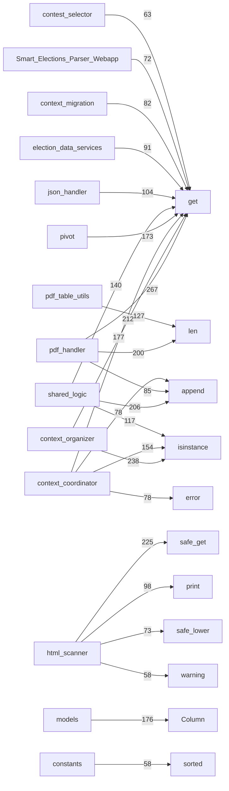
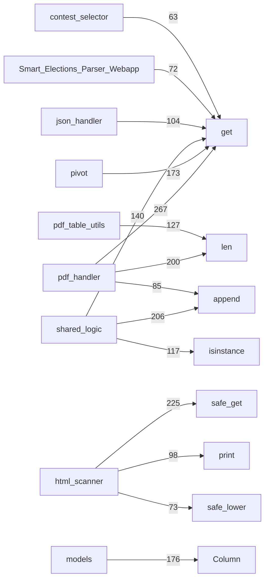
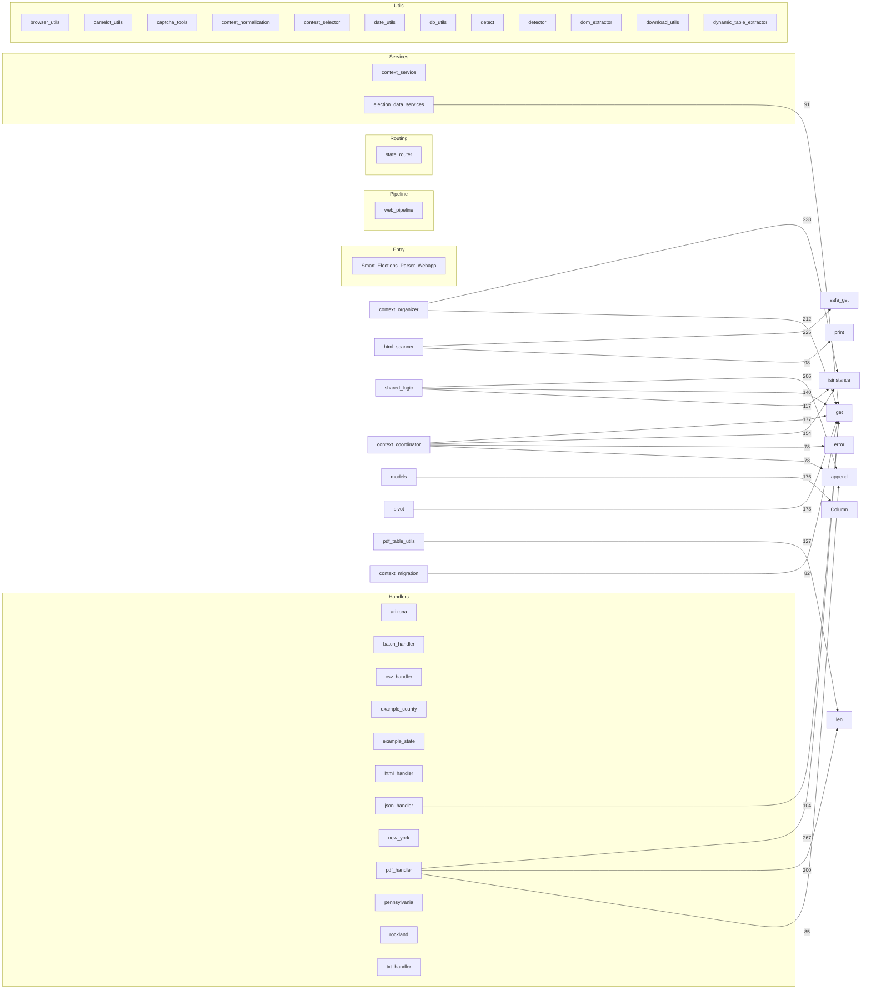

# Project Audit — webapp

Modules scanned: 98 | ~53695 non-empty LOC

## Pipeline map (Mermaid)



## Pipeline focus (compact)



## Cross-module hotspots

- webapp.parser.utils.dynamic_table_extractor:_emit ← 61 refs (dynamic_table_extractor.py)
- webapp.parser.utils.table_builder:_norm_header ← 50 refs (table_builder.py)
- webapp.parser.Context_Integration.context_coordinator:ContextCoordinator ← 30 refs (context_coordinator.py)
- webapp.parser.utils.pdf_table_utils:_record_recon_event ← 22 refs (pdf_table_utils.py)
- webapp.parser.utils.pivot:_safe_col_name ← 20 refs (pivot.py)
- webapp.parser.utils.contest_selector:_norm_key ← 18 refs (contest_selector.py)
- webapp.parser.utils.shared_logic:safe_lower ← 18 refs (shared_logic.py)
- webapp.parser.utils.pivot:_coerce_int ← 17 refs (pivot.py)
- webapp.parser.utils.db_utils:get_session ← 16 refs (db_utils.py)
- webapp.parser.utils.rawjson_utils:_rj_first ← 16 refs (rawjson_utils.py)
- webapp.parser.utils.json_export_loader:_safe_int ← 15 refs (json_export_loader.py)
- webapp.parser.health.log_cache_cleaner_bot:safe_path ← 14 refs (log_cache_cleaner_bot.py)
- webapp.parser.utils.html_scanner:_extract_clean_text ← 14 refs (html_scanner.py)
- webapp.parser.utils.pdf_table_utils:is_numeric_like ← 13 refs (pdf_table_utils.py)
- webapp.Smart_Elections_Parser_Weba:_env_flag ← 12 refs (Smart_Elections_Parser_Webapp.py)

## Leaf modules (candidates for review)

- `arizona.py`
- `example_county.py`
- `rockland.py`
- `new_york.py`
- `session_manager.py`
- `coordinator_protocol.py`
- `date_utils.py`
- `logger_singleton.py`
- `merge_utils.py`
- `seleniumbase_launcher.py`
- `session_state.py`
- `strategy_concurrency.py`
- `structure_cache.py`

## Pipeline clusters (Mermaid)



## Modules

### `webapp/Smart_Elections_Parser_Webapp.py`

- Definitions:
  - function: `_env_flag` (line 6)
  - function: `_should_skip_eventlet_patch` (line 13)
  - function: `ensure_utf8` (line 198)
  - class: `EnsureWsSecurityHeaders` (line 212)
  - function: `is_owner` (line 258)
  - function: `create_session_metadata` (line 262)
  - function: `cleanup_sessions` (line 265)
  - function: `transition_session` (line 279)
  - function: `cleanup_old_log_files` (line 318)
  - function: `client_fingerprint` (line 339)
  - function: `resolve_session_id` (line 348)
  - function: `emit_contest_options` (line 388)
  - function: `_promote_inner` (line 426)
  - function: `ensure_db_tables` (line 448)
  - function: `normalize_log_obj` (line 477)
  - function: `store_log` (line 609)
  - function: `_heartbeat_loop` (line 621)
  - function: `socketio_emit_func` (line 636)
  - function: `get_prompt_queue` (line 727)
  - function: `broadcast_sessions` (line 730)
  - function: `lock_session` (line 747)
  - function: `unlock_session` (line 758)
  - function: `safe_is_alive` (line 769)
  - function: `is_output_bypassed` (line 789)
  - function: `get_manual_source` (line 792)
  - function: `get_manual_source_origin` (line 795)
  - function: `get_all_file_lists` (line 798)
  - function: `get_session_enums` (line 806)
  - function: `_csp_nonce` (line 820)
  - function: `build_csp` (line 829)
  - function: `add_headers` (line 902)
  - function: `add_url` (line 978)
  - function: `allowed_file` (line 990)
  - function: `get_url_list` (line 999)
  - function: `list_urls` (line 1006)
  - function: `log_run_event` (line 1032)
  - function: `index` (line 1056)
  - function: `api_urls` (line 1060)
  - function: `data_framework` (line 1081)
  - function: `api_fs_list` (line 1085)
  - function: `api_list_dir_compat` (line 1131)
  - function: `api_fs_mkdir` (line 1135)
  - function: `api_fs_delete` (line 1164)
  - function: `download_fs` (line 1200)
  - function: `favicon` (line 1219)
  - function: `robots_txt` (line 1279)
  - function: `api_warehouse_election_results` (line 1283)
  - function: `delete_input_file` (line 1378)
  - function: `delete_output_file` (line 1388)
  - function: `delete_upload_file` (line 1398)
  - function: `download_input_file` (line 1408)
  - function: `download_output_file` (line 1412)
  - function: `download_upload_file` (line 1416)
  - function: `run_parser` (line 1420)
  - function: `site_webmanifest` (line 1449)
  - function: `upload_to_input` (line 1487)
  - function: `upload_to_output` (line 1504)
  - function: `upload_to_uploads` (line 1521)
  - function: `health` (line 1535)
  - function: `heartbeat` (line 1539)
  - function: `clear_history` (line 1543)
  - function: `history` (line 1553)
  - function: `rerun_prior` (line 1596)
  - function: `handle_contest_selected` (line 1628)
  - function: `handle_get_session_history` (line 1669)
  - function: `handle_clone_session` (line 1721)
  - function: `on_join` (line 1765)
  - function: `handle_get_sessions` (line 1804)
  - function: `handle_connect` (line 1811)
  - function: `handle_disconnect` (line 1872)
  - function: `handle_set_output_mode` (line 1893)
  - function: `handle_parser_prompt` (line 1922)
  - function: `handle_cancel_parser` (line 1951)
  - function: `handle_toggle_output_bypass` (line 1993)
  - function: `handle_set_manual_source` (line 2014)
  - function: `handle_delete_session` (line 2052)
  - function: `handle_run_parser` (line 2074)
- Imports:
  - `from __future__ import annotations (line 1)`
  - `import os as os (line 3)`
  - `import gzip as gzip (line 89)`
  - `import re as re (line 90)`
  - `import secrets as secrets (line 91)`
  - `import shutil as shutil (line 92)`
  - `import threading as threading (line 93)`
  - `import time as time (line 94)`
  - `from datetime import datetime (line 95)`
  - `from datetime import timezone (line 95)`
  - `from threading import Event (line 96)`
  - `from threading import Thread (line 96)`
  - `from typing import Callable (line 97)`
  - `from typing import Tuple (line 97)`
  - `from urllib.parse import urlparse (line 98)`
  - `import orjson as orjson (line 100)`
  - `import psycopg2 as psycopg2 (line 101)`
  - `from flask import Flask (line 102)`
  - `from flask import Response (line 102)`
  - `from flask import flash (line 102)`
  - `from flask import g (line 102)`
  - `from flask import jsonify (line 102)`
  - `from flask import redirect (line 102)`
  - `from flask import render_template (line 102)`
  - `from flask import request (line 102)`
  - `from flask import send_file (line 102)`
  - `from flask import send_from_directory (line 102)`
  - `from flask import session (line 102)`
  - `from flask import url_for (line 102)`
  - `from flask_socketio import SocketIO (line 116)`
  - `from flask_socketio import emit (line 116)`
  - `from flask_socketio import join_room (line 116)`
  - `from psycopg2 import errors as pg_errors (line 117)`
  - `from werkzeug.exceptions import NotFound (line 118)`
  - `from webapp.parser.config import DATA_API_URL (line 120)`
  - `from webapp.parser.config import INPUT_DIR (line 120)`
  - `from webapp.parser.config import LOG_DIR (line 120)`
  - `from webapp.parser.config import OUTPUT_DIR (line 120)`
  - `from webapp.parser.config import POSTGRES_DB (line 120)`
  - `from webapp.parser.config import POSTGRES_HOST (line 120)`
  - `from webapp.parser.config import POSTGRES_PASSWORD_RAW (line 120)`
  - `from webapp.parser.config import POSTGRES_PORT (line 120)`
  - `from webapp.parser.config import POSTGRES_USER_RAW (line 120)`
  - `from webapp.parser.config import RUN_HISTORY_FILE (line 120)`
  - `from webapp.parser.config import SUPPORTED_EXTENSION_SET (line 120)`
  - `from webapp.parser.config import UPLOADS_DIR (line 120)`
  - `from webapp.parser.config import URL_LIST_FILE (line 120)`
  - `from webapp.parser.health.session_manager import SessionManager (line 135)`
  - `from webapp.parser.utils.logger_singleton import logger (line 136)`
  - `from webapp.parser.utils.logger_singleton import prompt (line 136)`
  - `from webapp.parser.utils.session_state import DEFAULT_PHASE_BY_STATE (line 149)`
  - `from webapp.parser.utils.session_state import PipelinePhase (line 149)`
  - `from webapp.parser.utils.session_state import SessionState (line 149)`
  - `from webapp.parser.utils.session_state import export_session_enums (line 149)`
  - `from webapp.parser.utils.shared_logic import safe_get (line 155)`
  - `from webapp.parser.utils.shared_logic import safe_is_set (line 155)`
  - `from webapp.parser.utils.shared_logic import safe_lower (line 155)`
  - `from webapp.parser.utils.shared_logic import safe_rsplit (line 155)`
  - `from webapp.parser.utils.shared_logic import safe_sid (line 155)`
  - `from webapp.parser.utils.shared_logic import safe_split (line 155)`
  - `from webapp.parser.utils.shared_logic import safe_strip (line 155)`
  - `from webapp.parser.web_pipeline import cancel_processing (line 164)`
  - `from webapp.parser.web_pipeline import cancellation_manager (line 164)`
  - `from webapp.parser.web_pipeline import process_urls_for_web (line 164)`
- TODO/FIXME/WARN:
  - L210: WEBAPP_CONSOLE_LEVELS = set(os.environ.get("WEBAPP_CONSOLE_LEVELS", "ERROR,WARNING").upper().split(","))
  - L480:     Levels: INFO, DEBUG, WARNING, ERROR, CRITICAL, TRACE
  - L519:     LEVELS = {"INFO", "DEBUG", "WARNING", "ERROR", "CRITICAL", "TRACE"}
  - L555:             elif "warning" in mlow:
  - L954:         # For websocket handshake only: add Cache-Control so webhint stops warning
  - L1229:         logger.warning({"type": "sec", "message": "Favicon path escape blocked", "requested": ico_path})
  - L1331:             logger.warning({
  - L1332:                 "level": "WARNING",
  - L1641:             "level": "WARNING",
  - L1724:         logger.warning(
  - L1726:                 "level": "WARNING",
  - L1736:         logger.warning(
  - L1738:                 "level": "WARNING",
  - L1768:         logger.warning(
  - L1770:                 "level": "WARNING",
  - L2055:         logger.warning({
  - L2056:             "level": "WARNING",
  - L2120:         logger.warning({
  - L2121:             "level": "WARNING",
  - L2171:             logger.warning({
  - L2172:                 "level": "WARNING",
  - L2194:                 logger.warning({
  - L2195:                     "level": "WARNING",
  - L2203:         logger.warning({
  - L2204:             "level": "WARNING",
  - L2211:         logger.warning({
  - L2212:             "level": "WARNING",
- Outgoing cross-module calls (sample):
  - raw.strip (line 10)
  - _EVENTLET_BOOT_NOTES.append (line 29)
  - eventlet.monkey_patch (line 60)
  - _EVENTLET_PATCH_CONFIG.items (line 62)
  - _EVENTLET_BOOT_NOTES.append (line 64)
  - webapp.parser.utils.logger_singleton.logger.info (line 138)
  - dotenv.load_dotenv (line 177)
  - flask.Flask (line 183)
  - flask_socketio.SocketIO (line 184)
  - ct.startswith (line 205)
  - ct.lower (line 205)
  - ct.split (line 207)
  - headers.append (line 226)
  - headers.append (line 228)
  - self.app (line 230)
  - webapp.parser.health.session_manager.SessionManager (line 236)
  - threading.Event (line 245)
  - session_manager.get_metadata (line 259)
  - webapp.parser.utils.shared_logic.safe_get (line 260)
  - session_manager.ensure_session (line 263)
  - session_manager.expire_sessions (line 266)
  - os.remove (line 271)
  - last_contest_options.pop (line 274)
  - flask_socketio.emit (line 276)
  - session_manager.has_session (line 291)
  - session_manager.ensure_session (line 292)
  - session_manager.get_manual_source (line 297)
  - session_manager.get_manual_source_origin (line 299)
  - session_manager.set_state (line 300)
  - updated.get (line 305)
  - updated.get (line 306)
  - socketio.emit (line 313)
  - time.time (line 323)
  - os.listdir (line 325)
  - fname.startswith (line 326)
  - fname.endswith (line 326)
  - os.stat (line 333)
  - os.remove (line 335)
  - xff.split (line 342)
  - webapp.parser.utils.shared_logic.safe_sid (line 350)
  - webapp.parser.utils.shared_logic.safe_get (line 357)
  - session_manager.bind_socket (line 359)
  - session_manager.resolve_socket (line 362)
  - flask.session.get (line 366)
  - session_manager.bind_socket (line 368)
  - session_manager.resolve_fingerprint (line 372)
  - session_manager.bind_socket (line 374)
  - os.urandom (line 381)
  - session_manager.bind_fingerprint (line 382)
  - session_manager.bind_socket (line 383)
- Inbound references:
  - _env_flag ← Smart_Elections_Parser_Webapp.py:14
  - _env_flag ← Smart_Elections_Parser_Webapp.py:17
  - _env_flag ← Smart_Elections_Parser_Webapp.py:35
  - _env_flag ← Smart_Elections_Parser_Webapp.py:36
  - _env_flag ← Smart_Elections_Parser_Webapp.py:37
  - _env_flag ← Smart_Elections_Parser_Webapp.py:38
  - _env_flag ← Smart_Elections_Parser_Webapp.py:39
  - _env_flag ← Smart_Elections_Parser_Webapp.py:40
  - _env_flag ← Smart_Elections_Parser_Webapp.py:41
  - _env_flag ← Smart_Elections_Parser_Webapp.py:42
  - _env_flag ← Smart_Elections_Parser_Webapp.py:71
  - _env_flag ← Smart_Elections_Parser_Webapp.py:2391
  - _should_skip_eventlet_patch ← Smart_Elections_Parser_Webapp.py:22
  - ensure_utf8 ← Smart_Elections_Parser_Webapp.py:974
  - EnsureWsSecurityHeaders ← Smart_Elections_Parser_Webapp.py:233
  - create_session_metadata ← Smart_Elections_Parser_Webapp.py:2105
  - cleanup_sessions ← Smart_Elections_Parser_Webapp.py:1805
  - cleanup_sessions ← Smart_Elections_Parser_Webapp.py:1813
  - cleanup_sessions ← Smart_Elections_Parser_Webapp.py:1990
  - cleanup_sessions ← Smart_Elections_Parser_Webapp.py:2079
  - transition_session ← Smart_Elections_Parser_Webapp.py:678
  - transition_session ← Smart_Elections_Parser_Webapp.py:750
  - transition_session ← Smart_Elections_Parser_Webapp.py:761
  - transition_session ← Smart_Elections_Parser_Webapp.py:1744
  - transition_session ← Smart_Elections_Parser_Webapp.py:1938
  - transition_session ← Smart_Elections_Parser_Webapp.py:1980
  - transition_session ← Smart_Elections_Parser_Webapp.py:2029
  - transition_session ← Smart_Elections_Parser_Webapp.py:2363
  - cleanup_old_log_files ← Smart_Elections_Parser_Webapp.py:2385
  - client_fingerprint ← Smart_Elections_Parser_Webapp.py:371
  - resolve_session_id ← Smart_Elections_Parser_Webapp.py:1633
  - resolve_session_id ← Smart_Elections_Parser_Webapp.py:1670
  - resolve_session_id ← Smart_Elections_Parser_Webapp.py:1766
  - resolve_session_id ← Smart_Elections_Parser_Webapp.py:1847
  - resolve_session_id ← Smart_Elections_Parser_Webapp.py:1896
  - resolve_session_id ← Smart_Elections_Parser_Webapp.py:1925
  - resolve_session_id ← Smart_Elections_Parser_Webapp.py:1952
  - resolve_session_id ← Smart_Elections_Parser_Webapp.py:1994
  - resolve_session_id ← Smart_Elections_Parser_Webapp.py:2015
  - resolve_session_id ← Smart_Elections_Parser_Webapp.py:2053
  - resolve_session_id ← Smart_Elections_Parser_Webapp.py:2081
  - _promote_inner ← Smart_Elections_Parser_Webapp.py:539
  - ensure_db_tables ← Smart_Elections_Parser_Webapp.py:1299
  - ensure_db_tables ← Smart_Elections_Parser_Webapp.py:1337
  - ensure_db_tables ← Smart_Elections_Parser_Webapp.py:2382
  - normalize_log_obj ← Smart_Elections_Parser_Webapp.py:652
  - normalize_log_obj ← Smart_Elections_Parser_Webapp.py:1640
  - normalize_log_obj ← Smart_Elections_Parser_Webapp.py:1651
  - normalize_log_obj ← Smart_Elections_Parser_Webapp.py:1661
  - normalize_log_obj ← Smart_Elections_Parser_Webapp.py:2253

### `webapp/parser/Context_Integration/Context_Library/constants.py`

- Definitions:
  - function: `build_state_to_division_type_map` (line 691)
  - function: `_sanitize_party_token` (line 2399)
  - function: `normalize_party_code` (line 2418)
  - function: `canonical_ballot_group` (line 2445)
  - function: `split_and_normalize_ballot_groups` (line 2472)
  - function: `normalize_result_group_label` (line 2491)
  - function: `normalize_party_label` (line 2509)
  - function: `is_pseudo_result_party` (line 2539)
  - function: `_iter_strings` (line 2710)
  - function: `_compile_union` (line 2721)
  - function: `_norm_state_key` (line 2764)
  - function: `_norm_county_key` (line 2775)
  - function: `_collect_layered_patterns` (line 2784)
  - function: `get_camelot_title_regex` (line 2795)
  - function: `get_camelot_row_regex` (line 2805)
  - function: `build_camelot_row_filter` (line 2818)
- Imports:
  - `import re as re (line 1)`
  - `from functools import lru_cache (line 2)`
  - `from typing import Any (line 3)`
  - `from typing import Callable (line 3)`
  - `from typing import Dict (line 3)`
  - `from typing import Iterable (line 3)`
  - `from typing import List (line 3)`
  - `from typing import Optional (line 3)`
  - `from typing import Pattern (line 3)`
  - `from typing import Set (line 3)`
  - `from typing import Tuple (line 3)`
- TODO/FIXME/WARN:
  - L2020:         "icon-bg-dark", "icon-bg-primary", "icon-bg-secondary", "icon-bg-success", "icon-bg-danger", "icon-bg-warning",
  - L2111:     "warning", "info_box", "navigation", "pagination", "tab", "modal", "tooltip", "ignore", "unknown"
- Outgoing cross-module calls (sample):
  - DEFAULT_DIVISION_TYPE_BY_STATE.get (line 707)
  - KNOWN_STATE_TO_COUNTY_MAP.items (line 710)
  - DIVISION_TYPE_OVERRIDES.items (line 714)
  - KNOWN_STATE_TO_COUNTY_MAP.keys (line 750)
  - CANONICAL_STATE_ABBR.items (line 811)
  - k.upper (line 1253)
  - PARTY_CODE_MAP.items (line 1253)
  - t.lower (line 1416)
  - GROUP_RENAME_MAP.update (line 1418)
  - dict.fromkeys (line 1628)
  - dict.fromkeys (line 1645)
  - kw.lower (line 1649)
  - dict.fromkeys (line 1669)
  - re.escape (line 1711)
  - x.startswith (line 1711)
  - re.escape (line 1766)
  - re.escape (line 1767)
  - re.escape (line 1768)
  - re.escape (line 1769)
  - re.escape (line 1770)
  - re.escape (line 1771)
  - re.escape (line 1772)
  - re.escape (line 1773)
  - re.escape (line 1774)
  - re.escape (line 1775)
  - re.escape (line 1776)
  - re.escape (line 1777)
  - re.escape (line 1778)
  - re.compile (line 1971)
  - re.compile (line 1972)
  - re.compile (line 1973)
  - re.compile (line 1977)
  - re.compile (line 2051)
  - re.compile (line 2052)
  - GROUP_RENAME_MAP.items (line 2308)
  - _k.lower (line 2309)
  - _EXTRA_BALLOT_VARIANTS.items (line 2333)
  - BALLOT_NAME_CANON_MAP.setdefault (line 2334)
  - _PARTY_CANON_MAP.items (line 2388)
  - PARTY_CODE_MAP.items (line 2392)
  - PARTY_NORMALIZATION_MAP.setdefault (line 2393)
  - _code.lower (line 2393)
  - re.compile (line 2395)
  - re.compile (line 2396)
  - re.compile (line 2397)
  - _PARTY_INCUMBENT_TOKEN_RE.sub (line 2403)
  - _PARTY_INCUMBENT_WORD_RE.sub (line 2404)
  - re.sub (line 2405)
  - text.replace (line 2406)
  - text.replace (line 2407)
- Inbound references:
  - build_state_to_division_type_map ← constants.py:721
  - _sanitize_party_token ← constants.py:2428
  - _sanitize_party_token ← constants.py:2523
  - normalize_party_code ← constants.py:2526
  - canonical_ballot_group ← constants.py:2480
  - canonical_ballot_group ← constants.py:2483
  - canonical_ballot_group ← constants.py:2504
  - canonical_ballot_group ← salvage.py:93
  - normalize_party_label ← constants.py:2543
  - is_pseudo_result_party ← constants.py:2834
  - _iter_strings ← constants.py:2815
  - _compile_union ← constants.py:2802
  - _compile_union ← constants.py:2816
  - _norm_state_key ← constants.py:2786
  - _norm_county_key ← constants.py:2787
  - _collect_layered_patterns ← constants.py:2801
  - _collect_layered_patterns ← constants.py:2812
  - _collect_layered_patterns ← constants.py:2813
  - get_camelot_title_regex ← constants.py:2825
  - get_camelot_row_regex ← constants.py:2826

### `webapp/parser/Context_Integration/Integrity_check.py`

- Definitions:
  - function: `_ensure_alerts_table` (line 39)
  - function: `find_date_anomalies` (line 46)
  - function: `detect_anomalies_with_ml` (line 54)
  - function: `election_integrity_checks` (line 105)
  - function: `advanced_cross_field_validation` (line 126)
  - function: `summarize_context_entities` (line 135)
  - function: `analyze_contests` (line 144)
  - function: `auto_tune_contamination` (line 159)
  - function: `print_issues_table` (line 180)
  - function: `print_entity_summary` (line 200)
  - function: `print_ml_anomalies` (line 208)
  - function: `print_date_anomalies` (line 238)
  - function: `print_auto_tune_result` (line 256)
  - function: `print_analyze_contests` (line 262)
  - function: `monitor_db_for_alerts` (line 274)
  - function: `log_integrity_issues` (line 320)
  - function: `detect_statistical_outliers` (line 336)
  - function: `print_integrity_summary` (line 372)
- Imports:
  - `from __future__ import annotations (line 1)`
  - `import re as re (line 3)`
  - `import threading as threading (line 4)`
  - `import time as time (line 5)`
  - `from collections import Counter (line 6)`
  - `from pathlib import Path (line 7)`
  - `from typing import Any (line 8)`
  - `from typing import Dict (line 8)`
  - `from typing import List (line 8)`
  - `from typing import Tuple (line 8)`
  - `import matplotlib as matplotlib (line 10)`
  - `import numpy as np (line 11)`
  - `import orjson as orjson (line 12)`
  - `from rich.panel import Panel (line 13)`
  - `from rich.table import Table (line 14)`
  - `from sklearn.cluster import DBSCAN (line 15)`
  - `from sklearn.ensemble import IsolationForest (line 16)`
  - `from sklearn.preprocessing import LabelEncoder (line 17)`
  - `from sqlalchemy import select (line 18)`
  - `from config import CONTEXT_DB_PATH (line 20)`
  - `from config import CONTEXT_LIBRARY_PATH (line 20)`
  - `from Context_Integration.librarian import clean_for_json (line 21)`
  - `from utils import misc_utils (line 22)`
  - `from utils.db_utils import get_session (line 23)`
  - `from utils.logger_singleton import console (line 24)`
  - `from utils.models import Alert (line 25)`
  - `from utils.shared_logic import safe_all (line 26)`
  - `from utils.shared_logic import safe_encode (line 26)`
  - `from utils.shared_logic import safe_execute (line 26)`
  - `from utils.shared_logic import safe_get (line 26)`
  - `from utils.shared_logic import safe_items (line 26)`
  - `from utils.shared_logic import safe_tolist (line 26)`
  - `from utils.spacy_utils import extract_dates (line 34)`
  - `from utils.spacy_utils import extract_entities (line 34)`
  - `from utils.spacy_utils import flag_suspicious_contests (line 34)`
- Outgoing cross-module calls (sample):
  - matplotlib.use (line 37)
  - utils.spacy_utils.extract_dates (line 49)
  - utils.shared_logic.safe_get (line 49)
  - anomalies.append (line 51)
  - numpy.array (line 62)
  - sklearn.preprocessing.LabelEncoder (line 64)
  - sklearn.preprocessing.LabelEncoder (line 65)
  - sklearn.preprocessing.LabelEncoder (line 66)
  - utils.shared_logic.safe_get (line 67)
  - utils.shared_logic.safe_get (line 68)
  - utils.shared_logic.safe_get (line 69)
  - le_state.fit (line 70)
  - le_county.fit (line 71)
  - le_type.fit (line 72)
  - utils.shared_logic.safe_get (line 76)
  - utils.shared_logic.safe_encode (line 78)
  - embedding_model.encode (line 78)
  - utils.shared_logic.safe_tolist (line 79)
  - features.append (line 80)
  - le_state.transform (line 81)
  - utils.shared_logic.safe_get (line 81)
  - le_county.transform (line 82)
  - utils.shared_logic.safe_get (line 82)
  - le_type.transform (line 83)
  - utils.shared_logic.safe_get (line 83)
  - utils.shared_logic.safe_get (line 84)
  - utils.shared_logic.safe_get (line 84)
  - utils.shared_logic.safe_get (line 85)
  - utils.shared_logic.safe_get (line 86)
  - utils.shared_logic.safe_get (line 86)
  - utils.shared_logic.safe_get (line 87)
  - utils.shared_logic.safe_get (line 87)
  - numpy.array (line 91)
  - sklearn.ensemble.IsolationForest (line 92)
  - clf.fit_predict (line 97)
  - sklearn.cluster.DBSCAN (line 99)
  - c.get (line 109)
  - c.get (line 109)
  - c.get (line 109)
  - c.get (line 109)
  - issues.append (line 111)
  - seen.add (line 113)
  - c.get (line 114)
  - c.get (line 114)
  - issues.append (line 115)
  - c.get (line 116)
  - c.get (line 116)
  - issues.append (line 117)
  - c.get (line 119)
  - c.get (line 119)
- Inbound references:
  - _ensure_alerts_table ← Integrity_check.py:42
  - find_date_anomalies ← Integrity_check.py:146
  - detect_anomalies_with_ml ← Integrity_check.py:147
  - election_integrity_checks ← Integrity_check.py:145
  - advanced_cross_field_validation ← Integrity_check.py:394
  - summarize_context_entities ← Integrity_check.py:390
  - summarize_context_entities ← manual_correction_bot.py:1016
  - analyze_contests ← html_election_parser.py:512
  - analyze_contests ← Integrity_check.py:380
  - analyze_contests ← manual_correction_bot.py:996
  - auto_tune_contamination ← Integrity_check.py:399
  - print_issues_table ← Integrity_check.py:263
  - print_issues_table ← Integrity_check.py:395
  - print_entity_summary ← Integrity_check.py:391
  - print_ml_anomalies ← Integrity_check.py:265
  - print_date_anomalies ← Integrity_check.py:264
  - print_auto_tune_result ← Integrity_check.py:400
  - print_analyze_contests ← Integrity_check.py:387
  - print_integrity_summary ← html_election_parser.py:544
  - print_integrity_summary ← html_election_parser.py:591

### `webapp/parser/Context_Integration/context_coordinator.py`

> context_coordinator.py

- Definitions:
  - function: `get_semantic_score` (line 97)
  - function: `merge_and_rank_candidates` (line 145)
  - function: `dynamic_state_county_detection` (line 235)
  - class: `ContextCoordinator` (line 749)
- Imports:
  - `from __future__ import annotations (line 11)`
  - `import difflib as difflib (line 13)`
  - `import numbers as numbers (line 14)`
  - `import os as os (line 15)`
  - `import re as re (line 16)`
  - `import subprocess as subprocess (line 17)`
  - `import threading as threading (line 18)`
  - `from collections import defaultdict (line 19)`
  - `from datetime import datetime (line 20)`
  - `from datetime import timezone (line 20)`
  - `from typing import Any (line 21)`
  - `from typing import Callable (line 21)`
  - `from typing import Dict (line 21)`
  - `from typing import List (line 21)`
  - `from typing import Optional (line 21)`
  - `from typing import Tuple (line 21)`
  - `import numpy as np (line 23)`
  - `import orjson as orjson (line 24)`
  - `from rapidfuzz import fuzz (line 25)`
  - `from rapidfuzz import process (line 25)`
  - `from sklearn.preprocessing import LabelEncoder (line 26)`
  - `from config import BATCH_MAX_WORKERS (line 28)`
  - `from config import CONTEXT_LIBRARY_PATH (line 28)`
  - `from config import LOG_DIR (line 28)`
  - `from config import PROJECT_ROOT (line 28)`
  - `from handlers.batch_handler import BatchProcessor (line 29)`
  - `from services.election_data_services import ElectionDataService (line 30)`
  - `from utils.browser_utils import safe_click (line 31)`
  - `from utils.browser_utils import safe_count (line 31)`
  - `from utils.browser_utils import safe_evaluate (line 31)`
  - `from utils.browser_utils import safe_get_attribute (line 31)`
  - `from utils.browser_utils import safe_inner_text (line 31)`
  - `from utils.browser_utils import safe_is_enabled (line 31)`
  - `from utils.browser_utils import safe_is_visible (line 31)`
  - `from utils.browser_utils import safe_locator (line 31)`
  - `from utils.browser_utils import safe_nth (line 31)`
  - `from utils.browser_utils import safe_wait_for_timeout (line 31)`
  - `from utils.browser_utils import scan_buttons_with_progress (line 31)`
  - `from utils.html_scanner import deduplicate_pattern_kb (line 44)`
  - `from utils.html_scanner import get_segment_embedding (line 44)`
  - `from utils.html_scanner import load_pattern_kb (line 44)`
  - `from utils.logger_singleton import logger (line 49)`
  - `from utils.model_registry import ModelRegistry (line 50)`
  - `from utils.shared_logic import sync_type_and_election_types (line 51)`
  - `from utils.shared_logic import keyphrase_match (line 51)`
  - `from utils.shared_logic import normalize_county_name (line 51)`
  - `from utils.shared_logic import normalize_state_name (line 51)`
  - `from utils.shared_logic import safe_append (line 51)`
  - `from utils.shared_logic import safe_endswith (line 51)`
  - `from utils.shared_logic import safe_filename (line 51)`
  - `from utils.shared_logic import safe_get (line 51)`
  - `from utils.shared_logic import safe_get_first (line 51)`
  - `from utils.shared_logic import safe_isupper (line 51)`
  - `from utils.shared_logic import safe_items (line 51)`
  - `from utils.shared_logic import safe_lower (line 51)`
  - `from utils.shared_logic import safe_model_encode (line 51)`
  - `from utils.shared_logic import safe_replace (line 51)`
  - `from utils.shared_logic import safe_similarity (line 51)`
  - `from utils.shared_logic import safe_startswith (line 51)`
  - `from utils.shared_logic import safe_strip (line 51)`
  - `from utils.shared_logic import safe_tolist (line 51)`
  - `from utils.spacy_utils import extract_dates (line 71)`
  - `from utils.spacy_utils import extract_entities (line 71)`
  - `from utils.spacy_utils import extract_locations (line 71)`
  - `from Context_Library.constants import BALLOT_TYPES (line 72)`
  - `from Context_Library.constants import BUTTON_TAGS (line 72)`
  - `from Context_Library.constants import ELECTION_TYPES (line 72)`
  - `from Context_Library.constants import KNOWN_COUNTY_TO_PRECINCTS_MAP (line 72)`
  - `from Context_Library.constants import KNOWN_STATE_TO_COUNTY_MAP (line 72)`
  - `from Context_Library.constants import LOCATION_KEYWORDS (line 72)`
  - `from Context_Library.constants import PANEL_TAGS (line 72)`
  - `from Context_Library.constants import PARTY_KEYWORDS (line 72)`
  - `from Context_Library.constants import STATE_ABBR (line 72)`
  - `from Context_Library.constants import STATE_MODULE_MAP (line 72)`
  - `from Context_Library.constants import STATE_TAGS (line 72)`
  - `from Context_Library.constants import TABLE_TAGS (line 72)`
  - `from context_organizer import ContextOrganizer (line 86)`
  - `from Integrity_check import advanced_cross_field_validation (line 87)`
  - `from Integrity_check import detect_anomalies_with_ml (line 87)`
  - `from Integrity_check import election_integrity_checks (line 87)`
  - `from Integrity_check import monitor_db_for_alerts (line 87)`
  - `from Integrity_check import print_integrity_summary (line 87)`
  - `from librarian import atomic_write_json (line 94)`
  - `from librarian import clean_for_json (line 94)`
- TODO/FIXME/WARN:
  - L788:                     logger.warning("\[ALERT MONITOR\] Thread did not stop cleanly.")
  - L876:             logger.warning({
  - L877:                 "level": "WARNING",
  - L995:             logger.warning(f"\[yellow\]Integrity issues:\[/yellow\] {issues\['integrity_issues'\]}")
  - L1234:                 logger.warning(f"\[ContextCoordinator\] No table structure found for contest: {contest}")
  - L1403:                     logger.warning(f"\[get_feedback_pattern_kb\] Skipping corrupt line: {e}")
  - L1515:                 logger.warning("\[group_dom_nodes_by_label\] No organized DOM parts. (Further warnings suppressed)")
  - L1517:                 logger.warning(f"\[group_dom_nodes_by_label\] No organized DOM parts. (Occurred {ContextCoordinator._dom_parts_warning_count} times)")
  - L1522:             logger.warning("\[group_dom_nodes_by_label\] No DOM nodes found.")
  - L1540:                 logger.warning("\[submit_user_feedback\] ContextOrganizer has no submit_user_feedback method.")
  - L1568:                 logger.warning(f"\[correct_and_update_contest\] Contest {contest_id} missing type/election_types after sync.")
  - L1592:             logger.warning("\[print_contest_summary\] No organized contests to summarize.")
  - L1605:             logger.warning("\[plot_contest_distribution\] No organized contests to plot.")
  - L1656:                 logger.warning("No organized DOM parts.")
  - L1659:                 logger.warning("No organized DOM parts. (Further warnings suppressed)")
  - L1670:             logger.warning("\[get_contest_groups\] No contest groups found.")
  - L1679:             logger.warning("\[get_panel_groups\] No panel groups found.")
  - L1688:             logger.warning("\[get_button_groups\] No button groups found.")
  - L1697:             logger.warning("\[get_table_groups\] No table groups found.")
  - L1706:             logger.warning("\[get_relationships\] No organized context.")
  - L1814:                 logger.warning(f"\[fuzzy_score\] One or both inputs are empty: a='{a_str}', b='{b_str}'")
  - L1820:                 logger.warning(f"\[fuzzy_score\] One or both inputs are too short: a='{a_str}', b='{b_str}'")
  - L2266:             logger.warning(f"\[extract_field\] Unknown field_type: {field_type}")
  - L2524:                     logger.warning(f"\[get_full_contest\] Contest {contest_id} missing type/election_types after sync.")
  - L2609:                         logger.warning(f"\[list_tables\] Table '{tbl}' missing metadata or columns.")
  - L2641:                 logger.warning(f"\[get_table_metadata\] Table '{table_name}' missing columns.")
  - L2659:                 logger.warning(f"\[check_missing_tables\] Missing tables: {missing}")
  - L2720:                 logger.warning(f"\[save_table_structure\] Failed to save structure for contest: {contest}")
  - L2897:             logger.warning(f"\[get_best_button_advanced\] Contest argument was not a dict. Converted to: {contest}")
  - L2901:             logger.warning(f"\[get_best_button_advanced\] Keywords argument was not a list. Converted to: {keywords}")
  - L2905:             logger.warning(f"\[get_best_button_advanced\] Context argument was not a dict. Converted to: {context}")
  - L2912:             logger.warning("\[get_best_button_advanced\]_semantic_model is not set or is not an object. Using None.")
  - L3057:                             logger.warning(f"\[yellow\]\[Coordinator\] Button '{cand.get('label')}' rejected, retrying...\[/yellow\]")
- Outgoing cross-module calls (sample):
  - utils.logger_singleton.logger.error (line 105)
  - utils.logger_singleton.logger.error (line 109)
  - utils.shared_logic.safe_model_encode (line 116)
  - utils.shared_logic.safe_model_encode (line 117)
  - utils.logger_singleton.logger.debug (line 119)
  - util.pytorch_cos_sim (line 121)
  - cos_sim.item (line 124)
  - cos_sim.numpy (line 126)
  - arr.flatten (line 127)
  - utils.logger_singleton.logger.error (line 132)
  - utils.logger_singleton.logger.error (line 137)
  - utils.logger_singleton.logger.error (line 142)
  - utils.shared_logic.safe_get (line 156)
  - utils.shared_logic.safe_get (line 158)
  - utils.shared_logic.safe_get (line 158)
  - seen.add (line 160)
  - all_candidates.append (line 161)
  - utils.shared_logic.safe_get (line 164)
  - utils.shared_logic.safe_get (line 165)
  - utils.shared_logic.safe_get (line 168)
  - utils.shared_logic.safe_get (line 169)
  - utils.shared_logic.safe_get (line 170)
  - utils.shared_logic.safe_get (line 171)
  - utils.shared_logic.safe_get (line 174)
  - utils.shared_logic.safe_get (line 175)
  - utils.shared_logic.safe_get (line 180)
  - utils.shared_logic.safe_lower (line 182)
  - label.strip (line 182)
  - utils.shared_logic.safe_lower (line 182)
  - contest_title.strip (line 182)
  - utils.shared_logic.keyphrase_match (line 186)
  - utils.shared_logic.keyphrase_match (line 186)
  - difflib.SequenceMatcher (line 191)
  - utils.shared_logic.safe_lower (line 191)
  - utils.shared_logic.safe_lower (line 191)
  - utils.shared_logic.safe_get (line 197)
  - utils.shared_logic.safe_get (line 203)
  - utils.shared_logic.safe_get (line 204)
  - utils.shared_logic.safe_lower (line 205)
  - utils.shared_logic.safe_lower (line 207)
  - all_candidates.sort (line 225)
  - utils.shared_logic.safe_get (line 227)
  - utils.shared_logic.safe_get (line 228)
  - utils.shared_logic.safe_get (line 229)
  - state_to_county.keys (line 254)
  - state_to_county.values (line 255)
  - utils.shared_logic.normalize_county_name (line 256)
  - county_to_precinct.values (line 257)
  - utils.shared_logic.normalize_county_name (line 258)
  - state_to_county.keys (line 261)
- Inbound references:
  - get_semantic_score ← context_coordinator.py:195
  - get_semantic_score ← context_coordinator.py:200
  - get_semantic_score ← context_coordinator.py:2377
  - get_semantic_score ← context_coordinator.py:2396
  - get_semantic_score ← context_coordinator.py:2405
  - get_semantic_score ← context_coordinator.py:2441
  - get_semantic_score ← context_coordinator.py:2454
  - get_semantic_score ← context_coordinator.py:2581
  - get_semantic_score ← context_coordinator.py:2767
  - merge_and_rank_candidates ← context_coordinator.py:1467
  - merge_and_rank_candidates ← context_coordinator.py:3023
  - dynamic_state_county_detection ← state_router.py:365
  - dynamic_state_county_detection ← context_organizer.py:1596
  - dynamic_state_county_detection ← shared_logic.py:1610
  - ContextCoordinator ← html_election_parser.py:885
  - ContextCoordinator ← html_election_parser.py:1158
  - ContextCoordinator ← state_router.py:361
  - ContextCoordinator ← html_handler.py:103
  - ContextCoordinator ← example_state.py:34
  - ContextCoordinator ← example_county.py:27
  - ContextCoordinator ← rockland.py:39
  - ContextCoordinator ← contest_selector.py:886
  - ContextCoordinator ← contest_selector.py:1026
  - ContextCoordinator ← dynamic_table_extractor.py:284
  - ContextCoordinator ← dynamic_table_extractor.py:312
  - ContextCoordinator ← dynamic_table_extractor.py:478
  - ContextCoordinator ← dynamic_table_extractor.py:497
  - ContextCoordinator ← dynamic_table_extractor.py:984
  - ContextCoordinator ← dynamic_table_extractor.py:1028
  - ContextCoordinator ← dynamic_table_extractor.py:1058
  - ContextCoordinator ← dynamic_table_extractor.py:1076
  - ContextCoordinator ← dynamic_table_extractor.py:1108
  - ContextCoordinator ← dynamic_table_extractor.py:1138
  - ContextCoordinator ← html_scanner.py:730
  - ContextCoordinator ← html_scanner.py:1195
  - ContextCoordinator ← html_scanner.py:2585
  - ContextCoordinator ← html_scanner.py:2776
  - ContextCoordinator ← html_scanner.py:2882
  - ContextCoordinator ← html_scanner.py:3161
  - ContextCoordinator ← output_utils.py:66
  - ContextCoordinator ← table_builder.py:766
  - ContextCoordinator ← table_builder.py:1141
  - ContextCoordinator ← table_builder.py:1451
  - ContextCoordinator ← table_builder.py:1510

### `webapp/parser/Context_Integration/context_organizer.py`

> context_organizer.py

- Definitions:
  - function: `get_loading_indicator` (line 63)
  - function: `ensure_dict` (line 66)
  - function: `remove_functions` (line 79)
  - function: `contest_hash` (line 87)
  - function: `repair_dom_segments` (line 99)
  - function: `_defensive_dom_check` (line 161)
  - class: `ContextOrganizer` (line 182)
- Imports:
  - `from __future__ import annotations (line 8)`
  - `import itertools as itertools (line 10)`
  - `import os as os (line 11)`
  - `import re as re (line 12)`
  - `import types as types (line 13)`
  - `from collections import Counter (line 14)`
  - `from collections import defaultdict (line 14)`
  - `from collections.abc import Hashable (line 15)`
  - `from datetime import datetime (line 16)`
  - `from datetime import timezone (line 16)`
  - `from difflib import get_close_matches (line 17)`
  - `from typing import Any (line 18)`
  - `import matplotlib.pyplot as plt (line 20)`
  - `import numpy as np (line 21)`
  - `import orjson as orjson (line 22)`
  - `from rich.table import Table (line 23)`
  - `from sqlalchemy.exc import SQLAlchemyError (line 24)`
  - `from config import CONTEXT_DB_PATH (line 26)`
  - `from config import CONTEXT_LIBRARY_PATH (line 26)`
  - `from config import LOG_DIR (line 26)`
  - `from services.election_data_services import ElectionDataService (line 27)`
  - `from utils.html_scanner import load_context_cache_from_disk (line 28)`
  - `from utils.logger_singleton import console (line 29)`
  - `from utils.logger_singleton import logger (line 29)`
  - `from utils.misc_utils import load_output_cache (line 30)`
  - `from utils.misc_utils import load_processed_urls (line 30)`
  - `from utils.model_registry import ModelRegistry (line 31)`
  - `from utils.shared_logic import sync_type_and_election_types (line 32)`
  - `from utils.shared_logic import flatten_raw_field (line 32)`
  - `from utils.shared_logic import infer_contest_fields (line 32)`
  - `from utils.shared_logic import normalize_label (line 32)`
  - `from utils.shared_logic import safe_add (line 32)`
  - `from utils.shared_logic import safe_db_call (line 32)`
  - `from utils.shared_logic import safe_filename (line 32)`
  - `from utils.shared_logic import safe_get_first (line 32)`
  - `from utils.shared_logic import safe_items (line 32)`
  - `from utils.shared_logic import safe_model_encode (line 32)`
  - `from utils.shared_logic import safe_update (line 32)`
  - `from utils.shared_logic import scan_environment (line 32)`
  - `from Context_Library.constants import BALLOT_TYPES (line 46)`
  - `from Context_Library.constants import CANDIDATE_KEYWORDS (line 46)`
  - `from Context_Library.constants import CONTEST_KEYWORDS (line 46)`
  - `from Context_Library.constants import LOCATION_KEYWORDS (line 46)`
  - `from Context_Library.constants import MISC_FOOTER_KEYWORDS (line 46)`
  - `from Context_Library.constants import PARTY_KEYWORDS (line 46)`
  - `from Context_Library.constants import PERCENT_KEYWORDS (line 46)`
  - `from Context_Library.constants import TOTAL_KEYWORDS (line 46)`
  - `from Integrity_check import detect_anomalies_with_ml (line 56)`
  - `from Integrity_check import election_integrity_checks (line 56)`
  - `from Integrity_check import print_ml_anomalies (line 56)`
  - `from librarian import clean_for_json (line 57)`
  - `from librarian import load_context_library (line 57)`
  - `from librarian import update_context_library (line 57)`
- TODO/FIXME/WARN:
  - L282:             logger.warning(
  - L407:                 logger.warning(f"\[CONTEST\] Skipping contest with suspiciously large or missing title: {str(title)\[:100\]}...")
  - L495:             logger.warning(f"\[CONTEST\] Filtered out {len(filtered_out)} contests due to missing required fields.")
  - L497:                 logger.warning(f"  \[Filtered\] {reason}: {str(c)\[:100\]}...")
  - L500:             logger.warning("\[CONTEST\] No contests with required fields for downstream output.")
  - L816:                             logger.warning(f"\[ML\] Anomaly index {idx} out of range for contests list of length {len(contests)}")
  - L1500:                     logger.warning(f"  \[yellow\]{title}\[/yellow\]: {fixes}")
  - L1505:                     logger.warning(f"\[bold yellow\]\[INTEGRITY\]\[/bold yellow\] Duplicate contest detected.\n  \[dim\]Context:\[/dim\] {contest}")
  - L1507:                     logger.warning(f"\[bold yellow\]\[INTEGRITY\]\[/bold yellow\] Contest missing location info.\n  \[dim\]Context:\[/dim\] {contest}")
  - L1509:                     logger.warning(f"\[bold yellow\]\[INTEGRITY\]\[/bold yellow\] Contest missing year.\n  \[dim\]Context:\[/dim\] {contest}")
  - L1972:             logger.warning(f"\[ContextOrganizer\] Could not update context library with feedback: {e}")
  - L2049:                 logger.warning(f"\[CONTEXT ORGANIZER\] No table structure found for contest: {contest}")
- Outgoing cross-module calls (sample):
  - utils.misc_utils.load_processed_urls (line 59)
  - utils.misc_utils.load_output_cache (line 60)
  - itertools.cycle (line 61)
  - v.get (line 73)
  - v.get (line 73)
  - obj.items (line 81)
  - c_dict.get (line 90)
  - c_dict.get (line 92)
  - c_dict.get (line 93)
  - c_dict.get (line 94)
  - c_dict.get (line 95)
  - seg.get (line 108)
  - seg.get (line 115)
  - normalized_children.append (line 119)
  - normalized_children.append (line 123)
  - seg.get (line 127)
  - parent_idx.get (line 129)
  - seg.get (line 132)
  - seg.get (line 140)
  - idx_map.get (line 141)
  - child.get (line 142)
  - seg.get (line 142)
  - seg.get (line 143)
  - seg.get (line 149)
  - seg.get (line 151)
  - idx_map.get (line 152)
  - child_node.get (line 155)
  - valid_children.append (line 157)
  - dom_parts_dict.get (line 175)
  - utils.shared_logic.safe_get_first (line 176)
  - utils.logger_singleton.logger.error (line 179)
  - librarian.load_context_library (line 205)
  - self._default_library (line 205)
  - utils.logger_singleton.logger.error (line 207)
  - utils.logger_singleton.logger.debug (line 209)
  - utils.logger_singleton.logger.error (line 211)
  - utils.misc_utils.load_processed_urls (line 214)
  - utils.misc_utils.load_output_cache (line 215)
  - utils.html_scanner.load_context_cache_from_disk (line 218)
  - services.election_data_services.ElectionDataService (line 221)
  - self._resolve_embedding_model (line 223)
  - utils.logger_singleton.logger.error (line 225)
  - utils.model_registry.ModelRegistry.get_sentence_transformer (line 272)
  - utils.logger_singleton.logger.info (line 274)
  - utils.logger_singleton.logger.info (line 279)
  - utils.logger_singleton.logger.warning (line 282)
  - item.get (line 299)
  - item.get (line 300)
  - deduped.append (line 301)
  - seen.add (line 302)
- Inbound references:
  - get_loading_indicator ← context_organizer.py:1699
  - ensure_dict ← context_organizer.py:668
  - ensure_dict ← context_organizer.py:676
  - ensure_dict ← context_organizer.py:684
  - ensure_dict ← context_organizer.py:692
  - ensure_dict ← context_organizer.py:700
  - ensure_dict ← context_organizer.py:708
  - ensure_dict ← context_organizer.py:716
  - ensure_dict ← context_organizer.py:724
  - ensure_dict ← context_organizer.py:732
  - ensure_dict ← context_organizer.py:740
  - remove_functions ← context_organizer.py:81
  - remove_functions ← context_organizer.py:83
  - remove_functions ← context_organizer.py:2018
  - contest_hash ← context_organizer.py:989
  - repair_dom_segments ← context_organizer.py:333
  - repair_dom_segments ← context_organizer.py:1673
  - _defensive_dom_check ← context_organizer.py:340
  - ContextOrganizer ← html_scanner.py:1556
  - ContextOrganizer ← html_scanner.py:3222

### `webapp/parser/Context_Integration/librarian.py`

- Top-of-file comments:

```python
# webapp/parser/Context\_Integration/librarian.py
# -----------------------------------------------------------------------------------
# This file contains functions to manage the context library for the HTML parser,
# including loading, saving, and updating the context library, as well as
# It also includes utilities for logging unknown HTML tags and attributes,
# extending context library structures, and handling ML/LLM feedback.
# -----------------------------------------------------------------------------------
```

- Definitions:
  - function: `get_safe_log_path` (line 66)
  - function: `atomic_write_json` (line 82)
  - function: `extend_panel_tags` (line 138)
  - function: `extend_heading_tags` (line 142)
  - function: `extend_html_tags` (line 146)
  - function: `extend_custom_attr_patterns` (line 150)
  - function: `extend_location_keywords` (line 158)
  - function: `extend_candidate_keywords` (line 162)
  - function: `extend_ballot_types` (line 166)
  - function: `safe_join` (line 170)
  - function: `clean_for_json` (line 177)
  - function: `robust_orjson_loads` (line 193)
  - function: `load_context_library` (line 201)
  - function: `update_context_library` (line 288)
  - function: `backup_context_library` (line 303)
  - function: `save_context_library` (line 352)
  - function: `merge_and_save_context_library` (line 399)
  - function: `update_context_library_field` (line 407)
  - function: `update_domain_selector_cache` (line 418)
  - function: `get_domain_selectors` (line 439)
  - function: `log_selector_attempt` (line 444)
  - function: `_get_log_path` (line 468)
  - function: `_deduplicate_jsonl_log` (line 473)
  - function: `log_unknown_tag` (line 502)
  - function: `log_unknown_attr` (line 524)
  - function: `integrate_llm_feedback` (line 549)
  - function: `lookup_state` (line 564)
  - function: `get_state_abbr` (line 589)
  - function: `lookup_county` (line 602)
  - function: `normalize_segment_text` (line 628)
  - function: `get_canonical_segment_label` (line 634)
  - function: `cache_segment_label` (line 639)
  - function: `get_cached_segment_label` (line 643)
  - function: `self_heal_context_library` (line 648)
  - function: `parse_filename_for_location` (line 674)
- Imports:
  - `from __future__ import annotations (line 8)`
  - `import argparse as argparse (line 10)`
  - `import os as os (line 11)`
  - `import re as re (line 12)`
  - `import shutil as shutil (line 13)`
  - `import subprocess as subprocess (line 14)`
  - `import sys as sys (line 15)`
  - `import tempfile as tempfile (line 16)`
  - `import threading as threading (line 17)`
  - `import time as time (line 18)`
  - `from datetime import datetime (line 19)`
  - `from datetime import timezone (line 19)`
  - `from pathlib import Path (line 20)`
  - `from typing import Any (line 21)`
  - `from typing import Dict (line 21)`
  - `from typing import List (line 21)`
  - `from typing import Set (line 21)`
  - `import numpy as np (line 23)`
  - `import orjson as orjson (line 24)`
  - `from config import BASE_DIR (line 26)`
  - `from config import CONTEXT_LIBRARY_PATH (line 26)`
  - `from config import LOG_DIR (line 26)`
  - `from config import PROJECT_ROOT (line 26)`
  - `from utils.logger_singleton import logger (line 27)`
  - `from utils.misc_utils import file_hash (line 28)`
  - `from utils.misc_utils import is_safe_path (line 28)`
  - `from utils.shared_logic import safe_append (line 29)`
  - `from utils.shared_logic import safe_filename (line 29)`
  - `from utils.shared_logic import safe_get (line 29)`
  - `from utils.shared_logic import safe_merge_defaults (line 29)`
  - `from utils.shared_logic import safe_setdefault (line 29)`
  - `from utils.shared_logic import safe_startswith (line 29)`
  - `from Context_Library.constants import CANONICAL_STATE_ABBR (line 37)`
  - `from Context_Library.constants import BALLOT_TYPES (line 37)`
  - `from Context_Library.constants import CANDIDATE_KEYWORDS (line 37)`
  - `from Context_Library.constants import CANONICAL_SEGMENT_LABELS (line 37)`
  - `from Context_Library.constants import CUSTOM_ATTR_PATTERNS (line 37)`
  - `from Context_Library.constants import HEADING_TAGS (line 37)`
  - `from Context_Library.constants import HTML_TAGS (line 37)`
  - `from Context_Library.constants import KNOWN_STATE_TO_COUNTY_MAP (line 37)`
  - `from Context_Library.constants import LOCATION_KEYWORDS (line 37)`
  - `from Context_Library.constants import PANEL_TAGS (line 37)`
  - `from Context_Library.constants import STATE_ABBR (line 37)`
- TODO/FIXME/WARN:
  - L652:         logger.warning(f"\n\[LIBRARIAN SELF-HEAL\] Attempt {attempt}...")
  - L658:         logger.warning("\[LIBRARIAN SELF-HEAL\] Misalignments found. Launching manual_correction...")
  - L661:         logger.warning(f"\[LIBRARIAN SELF-HEAL\] Sleeping {cooldown}s before rescanning...")
- Outgoing cross-module calls (sample):
  - threading.Lock (line 51)
  - os.makedirs (line 73)
  - utils.shared_logic.safe_filename (line 75)
  - pathlib.Path (line 76)
  - utils.misc_utils.is_safe_path (line 78)
  - pathlib.Path (line 89)
  - path.with_suffix (line 90)
  - path.with_suffix (line 91)
  - tmp_path.exists (line 94)
  - tmp_path.unlink (line 96)
  - backup_path.exists (line 101)
  - backup_path.unlink (line 103)
  - tf.write (line 109)
  - orjson.dumps (line 109)
  - path.exists (line 112)
  - shutil.copy2 (line 113)
  - shutil.move (line 118)
  - os.remove (line 123)
  - time.sleep (line 126)
  - tmp_path.exists (line 131)
  - tmp_path.unlink (line 133)
  - t.lower (line 140)
  - t.lower (line 144)
  - t.lower (line 148)
  - Context_Library.constants.CUSTOM_ATTR_PATTERNS.append (line 154)
  - re.compile (line 154)
  - Context_Library.constants.CUSTOM_ATTR_PATTERNS.append (line 156)
  - k.lower (line 160)
  - k.lower (line 164)
  - Context_Library.constants.BALLOT_TYPES.extend (line 168)
  - utils.shared_logic.safe_startswith (line 172)
  - utils.logger_singleton.logger.debug (line 173)
  - obj.items (line 179)
  - obj.tolist (line 185)
  - orjson.loads (line 195)
  - orjson.loads (line 197)
  - val.encode (line 197)
  - os.makedirs (line 211)
  - f.write (line 225)
  - orjson.dumps (line 225)
  - f.read (line 231)
  - fw.write (line 244)
  - orjson.dumps (line 244)
  - utils.logger_singleton.logger.error (line 248)
  - os.rename (line 252)
  - f.write (line 265)
  - orjson.dumps (line 265)
  - utils.shared_logic.safe_merge_defaults (line 269)
  - lib.update (line 297)
  - os.listdir (line 315)
- Inbound references:
  - atomic_write_json ← manual_correction_bot.py:751
  - atomic_write_json ← manual_correction_bot.py:1035
  - extend_panel_tags ← librarian.py:274
  - extend_panel_tags ← librarian.py:551
  - extend_heading_tags ← librarian.py:276
  - extend_heading_tags ← librarian.py:553
  - extend_custom_attr_patterns ← librarian.py:278
  - extend_custom_attr_patterns ← librarian.py:555
  - extend_location_keywords ← librarian.py:280
  - extend_location_keywords ← librarian.py:557
  - extend_candidate_keywords ← librarian.py:282
  - extend_candidate_keywords ← librarian.py:559
  - extend_ballot_types ← librarian.py:284
  - extend_ballot_types ← librarian.py:561
  - safe_join ← librarian.py:363
  - safe_join ← output_utils.py:136
  - clean_for_json ← librarian.py:179
  - clean_for_json ← librarian.py:181
  - clean_for_json ← librarian.py:183
  - clean_for_json ← librarian.py:185
  - clean_for_json ← librarian.py:300
  - robust_orjson_loads ← librarian.py:246
  - robust_orjson_loads ← db_utils.py:291
  - robust_orjson_loads ← db_utils.py:292
  - robust_orjson_loads ← html_scanner.py:212
  - robust_orjson_loads ← html_scanner.py:1798
  - robust_orjson_loads ← html_scanner.py:1896
  - load_context_library ← librarian.py:294
  - load_context_library ← librarian.py:403
  - load_context_library ← librarian.py:411
  - load_context_library ← librarian.py:419
  - load_context_library ← librarian.py:440
  - load_context_library ← librarian.py:448
  - load_context_library ← librarian.py:624
  - backup_context_library ← librarian.py:364
  - save_context_library ← librarian.py:270
  - save_context_library ← librarian.py:301
  - save_context_library ← librarian.py:405
  - save_context_library ← librarian.py:414
  - save_context_library ← librarian.py:562
  - update_context_library_field ← librarian.py:437
  - update_context_library_field ← librarian.py:462
  - _get_log_path ← librarian.py:509
  - _get_log_path ← librarian.py:518
  - _get_log_path ← librarian.py:531
  - _get_log_path ← librarian.py:542
  - _deduplicate_jsonl_log ← librarian.py:510
  - _deduplicate_jsonl_log ← librarian.py:532
  - lookup_state ← librarian.py:611
  - normalize_segment_text ← librarian.py:636

### `webapp/parser/config.py`

> Central configuration module for the Smart Elections Parser Webapp.

- Definitions:
  - function: `get_subprocess_env` (line 242)
  - function: `get_supported_formats` (line 251)
  - function: `get_sqlalchemy_engine` (line 287)
- Imports:
  - `import os as os (line 8)`
  - `import threading as threading (line 9)`
  - `import urllib.parse as urllib (line 10)`
  - `from pathlib import Path (line 11)`
  - `import orjson as orjson (line 13)`
  - `import psycopg2 as psycopg2 (line 14)`
  - `from azure.identity import DefaultAzureCredential (line 15)`
  - `from sqlalchemy import create_engine (line 16)`
  - `from utils.logger_singleton import logger (line 18)`
- TODO/FIXME/WARN:
  - L328:                 logger.warning("\[DB\]\[AAD\] Falling back to password auth.")
- Outgoing cross-module calls (sample):
  - dotenv.load_dotenv (line 22)
  - pathlib.Path (line 31)
  - VOCAB_DIR.mkdir (line 48)
  - INPUT_DIR.mkdir (line 52)
  - OUTPUT_DIR.mkdir (line 54)
  - UPLOADS_DIR.mkdir (line 56)
  - URL_LIST_FILE.exists (line 64)
  - f.write (line 66)
  - URL_LIST_FILE.stat (line 67)
  - f.write (line 70)
  - LOG_DIR.mkdir (line 78)
  - CACHE_DIR.mkdir (line 79)
  - RUN_HISTORY_FILE.exists (line 84)
  - RUN_HISTORY_FILE.touch (line 86)
  - OCR_DEBUG_DIR.mkdir (line 196)
  - threading.Lock (line 200)
  - ext.startswith (line 262)
  - env_formats.split (line 263)
  - CONTEXT_LIBRARY_PATH.exists (line 266)
  - orjson.loads (line 268)
  - f.read (line 268)
  - context_library.get (line 270)
  - json.loads (line 275)
  - ext.lower (line 281)
  - ext.startswith (line 283)
  - ext.lower (line 283)
  - ext.lower (line 283)
  - utils.logger_singleton.logger.error (line 299)
  - azure.identity.DefaultAzureCredential (line 303)
  - cred.get_token (line 304)
  - utils.logger_singleton.logger.info (line 305)
  - psycopg2.connect (line 306)
  - utils.logger_singleton.logger.info (line 316)
  - sqlalchemy.create_engine (line 317)
  - utils.logger_singleton.logger.error (line 324)
  - utils.logger_singleton.logger.warning (line 328)
  - sqlalchemy.create_engine (line 329)
  - utils.logger_singleton.logger.info (line 338)
  - sqlalchemy.create_engine (line 339)
- Inbound references:
  - get_supported_formats ← config.py:281

### `webapp/parser/data_manager.py`

- Definitions:
  - function: `_ensure_parent` (line 9)
  - function: `_atomic_write_lines` (line 16)
  - function: `load_urls` (line 25)
  - function: `save_urls` (line 41)
  - function: `add_url` (line 60)
  - function: `remove_url` (line 75)
  - function: `replace_urls` (line 96)
  - function: `list_urls_cli` (line 99)
  - function: `list_files` (line 109)
  - function: `copy_file_to_folder` (line 133)
  - function: `run_manager` (line 147)
- Imports:
  - `import os as os (line 1)`
  - `import re as re (line 2)`
  - `from config import INPUT_DIR (line 4)`
  - `from config import OUTPUT_DIR (line 4)`
  - `from config import URL_LIST_FILE (line 4)`
  - `from utils.logger_singleton import console (line 5)`
  - `from utils.logger_singleton import logger (line 5)`
  - `from utils.logger_singleton import prompt (line 5)`
- TODO/FIXME/WARN:
  - L83:             logger.warning(f"\[REMOVED\] {popped}")
  - L90:             logger.warning(f"\[REMOVED\] {index_or_value}")
  - L129:                     logger.warning(f"\[DELETED\] {files\[idx\]}")
- Outgoing cross-module calls (sample):
  - re.compile (line 7)
  - os.makedirs (line 12)
  - os.makedirs (line 14)
  - os.fspath (line 17)
  - f.write (line 22)
  - ln.rstrip (line 22)
  - os.replace (line 23)
  - line.strip (line 32)
  - s.startswith (line 33)
  - URL_LINE_RE.match (line 35)
  - urls.append (line 36)
  - m.group (line 36)
  - utils.logger_singleton.logger.error (line 38)
  - u.strip (line 47)
  - s.lower (line 50)
  - seen.add (line 52)
  - clean.append (line 53)
  - utils.logger_singleton.logger.info (line 56)
  - utils.logger_singleton.logger.error (line 58)
  - url.strip (line 63)
  - u.lower (line 67)
  - existing.lower (line 67)
  - utils.logger_singleton.logger.info (line 68)
  - urls.append (line 70)
  - utils.logger_singleton.logger.info (line 72)
  - urls.pop (line 82)
  - utils.logger_singleton.logger.warning (line 83)
  - u.lower (line 87)
  - utils.logger_singleton.logger.warning (line 90)
  - utils.logger_singleton.logger.info (line 102)
  - utils.logger_singleton.logger.info (line 104)
  - utils.logger_singleton.logger.info (line 106)
  - os.fspath (line 110)
  - utils.logger_singleton.logger.info (line 111)
  - os.listdir (line 113)
  - utils.logger_singleton.logger.info (line 115)
  - utils.logger_singleton.logger.info (line 118)
  - utils.logger_singleton.logger.info (line 121)
  - utils.logger_singleton.prompt.prompt_input (line 123)
  - choice.isdigit (line 124)
  - os.remove (line 128)
  - utils.logger_singleton.logger.warning (line 129)
  - utils.logger_singleton.logger.error (line 131)
  - os.fspath (line 134)
  - utils.logger_singleton.logger.error (line 136)
  - d.write (line 142)
  - s.read (line 142)
  - utils.logger_singleton.logger.info (line 143)
  - utils.logger_singleton.logger.error (line 145)
  - utils.logger_singleton.console.panel (line 148)
- Inbound references:
  - _ensure_parent ← data_manager.py:18
  - _ensure_parent ← data_manager.py:138
  - _atomic_write_lines ← data_manager.py:55
  - load_urls ← data_manager.py:66
  - load_urls ← data_manager.py:76
  - load_urls ← data_manager.py:100
  - load_urls ← html_election_parser.py:1454
  - save_urls ← data_manager.py:71
  - save_urls ← data_manager.py:93
  - save_urls ← data_manager.py:97
  - remove_url ← data_manager.py:176
  - replace_urls ← data_manager.py:180
  - list_urls_cli ← data_manager.py:167
  - list_urls_cli ← data_manager.py:172
  - list_files ← data_manager.py:182
  - list_files ← data_manager.py:184
  - list_files ← data_manager.py:192
  - list_files ← data_manager.py:194
  - copy_file_to_folder ← data_manager.py:187
  - copy_file_to_folder ← data_manager.py:190
  - run_manager ← data_manager.py:199

### `webapp/parser/handlers/batch_handler.py`

- Definitions:
  - function: `_normalize_label` (line 14)
  - class: `BatchProcessor` (line 24)
- Imports:
  - `from __future__ import annotations (line 1)`
  - `import copy as copy (line 3)`
  - `import time as time (line 4)`
  - `import uuid as uuid (line 5)`
  - `from concurrent.futures import Future (line 6)`
  - `from concurrent.futures import ThreadPoolExecutor (line 6)`
  - `from typing import Any (line 7)`
  - `from typing import Callable (line 7)`
  - `from typing import Dict (line 7)`
  - `from typing import List (line 7)`
  - `from typing import Optional (line 7)`
  - `from typing import Sequence (line 7)`
  - `from typing import Tuple (line 7)`
  - `from utils.logger_singleton import logger (line 9)`
  - `from utils.logger_singleton import prompt (line 9)`
  - `from utils.shared_logic import safe_get (line 10)`
  - `from utils.shared_logic import safe_lower (line 10)`
  - `from utils.shared_logic import safe_parse (line 10)`
  - `from utils.shared_logic import safe_strip (line 10)`
  - `from utils.user_prompt import PromptCancelled (line 11)`
- TODO/FIXME/WARN:
  - L134:                 logger.warning({
  - L135:                     "level": "WARNING",
  - L426:             logger.warning({
  - L427:                 "level": "WARNING",
- Outgoing cross-module calls (sample):
  - utils.shared_logic.safe_strip (line 19)
  - utils.shared_logic.safe_lower (line 19)
  - uuid.uuid4 (line 56)
  - self._prepare_races (line 62)
  - copy.deepcopy (line 63)
  - self._find_initial_match_index (line 64)
  - concurrent.futures.ThreadPoolExecutor (line 77)
  - copy.deepcopy (line 83)
  - time.time (line 93)
  - utils.logger_singleton.logger.info (line 104)
  - self._race_label (line 111)
  - self._emit_result (line 118)
  - self._process_single_race (line 129)
  - utils.logger_singleton.logger.warning (line 134)
  - utils.logger_singleton.logger.error (line 145)
  - self._await_postprocessing (line 153)
  - self._compute_status (line 155)
  - time.time (line 156)
  - self._mark_processed (line 157)
  - utils.logger_singleton.logger.info (line 159)
  - prepared.append (line 177)
  - copy.deepcopy (line 177)
  - prepared.append (line 179)
  - prepared.append (line 181)
  - self._race_label (line 192)
  - self._race_label (line 198)
  - utils.logger_singleton.logger.info (line 199)
  - self._queue_prompt_responses (line 206)
  - self._build_context (line 207)
  - utils.shared_logic.safe_parse (line 209)
  - utils.logger_singleton.logger.error (line 219)
  - self._emit_result (line 228)
  - copy.deepcopy (line 234)
  - context.setdefault (line 240)
  - race.get (line 246)
  - overrides.update (line 248)
  - context.update (line 250)
  - self._race_label (line 252)
  - race.get (line 264)
  - self._format_prompt_value (line 269)
  - race.get (line 274)
  - self._build_matcher (line 279)
  - entry.get (line 279)
  - self._format_prompt_value (line 282)
  - entry.get (line 282)
  - entry.get (line 284)
  - utils.logger_singleton.logger.error (line 297)
  - metadata_out.get (line 307)
  - batch_meta.update (line 308)
  - self._race_label (line 314)
- Inbound references:
  - _normalize_label ← batch_handler.py:188
  - _normalize_label ← batch_handler.py:193

### `webapp/parser/handlers/formats/csv_handler.py`

- Definitions:
  - function: `_build_contest_regex` (line 37)
  - function: `parse_csv_election_results` (line 56)
  - function: `parse` (line 285)
- Imports:
  - `from __future__ import annotations (line 1)`
  - `import csv as csv (line 3)`
  - `import os as os (line 4)`
  - `import re as re (line 5)`
  - `from typing import Any (line 6)`
  - `from typing import Dict (line 6)`
  - `from typing import List (line 6)`
  - `from typing import Optional (line 6)`
  - `from typing import Tuple (line 6)`
  - `from typing import cast (line 6)`
  - `from Context_Integration.Context_Library.constants import CONTEST_KEYWORDS (line 8)`
  - `from Context_Integration.Context_Library.constants import CONTEST_TITLE_SKIP_PHRASES (line 8)`
  - `from utils.contest_selector import select_contest_auto_first (line 12)`
  - `from utils.location_helpers import attach_precinct_column (line 15)`
  - `from utils.location_helpers import collect_location_headers (line 15)`
  - `from Context_Integration.librarian import parse_filename_for_location (line 19)`
  - `from utils.logger_singleton import logger (line 20)`
  - `from utils.output_utils import finalize_election_output (line 21)`
  - `from utils.pivot import expand_single_rawjson_row (line 22)`
  - `from utils.shared_logic import derive_candidate_party_metadata (line 23)`
  - `from utils.shared_logic import derive_state_county_from_table (line 23)`
  - `from utils.shared_logic import safe_get (line 23)`
  - `from utils.shared_logic import safe_slug (line 23)`
  - `from utils.table_builder import build_table_noninteractive (line 29)`
  - `from utils.table_core import robust_table_extraction (line 30)`
  - `from utils.header_utils import normalize_table_headers (line 31)`
- Outgoing cross-module calls (sample):
  - phrase.strip (line 40)
  - re.split (line 42)
  - phrase.strip (line 42)
  - re.escape (line 45)
  - t.replace (line 46)
  - t.replace (line 47)
  - xtoks.append (line 48)
  - parts.append (line 51)
  - re.compile (line 52)
  - re.compile (line 52)
  - csv.DictReader (line 74)
  - row.items (line 80)
  - normalized_row.values (line 82)
  - data.append (line 83)
  - utils.header_utils.normalize_table_headers (line 85)
  - h.strip (line 86)
  - _CONTEST_RX.search (line 88)
  - possible_contest_cols.sort (line 90)
  - row.get (line 96)
  - row.get (line 96)
  - Context_Integration.librarian.parse_filename_for_location (line 99)
  - parsed_location.get (line 100)
  - s.lower (line 112)
  - utils.contest_selector.select_contest_auto_first (line 119)
  - utils.logger_singleton.logger.error (line 127)
  - utils.shared_logic.safe_get (line 134)
  - row.get (line 138)
  - utils.location_helpers.collect_location_headers (line 140)
  - utils.location_helpers.attach_precinct_column (line 141)
  - html_context.get (line 157)
  - html_context.get (line 158)
  - utils.shared_logic.derive_state_county_from_table (line 160)
  - state_county_diag.get (line 168)
  - state_county_diag.get (line 169)
  - utils.shared_logic.derive_candidate_party_metadata (line 171)
  - re.search (line 177)
  - m.group (line 178)
  - html_context.get (line 181)
  - html_context.get (line 181)
  - utils.shared_logic.safe_slug (line 186)
  - party_diag.get (line 207)
  - utils.pivot.expand_single_rawjson_row (line 209)
  - utils.table_builder.build_table_noninteractive (line 211)
  - utils.output_utils.finalize_election_output (line 221)
  - result.get (line 250)
  - result.get (line 257)
  - result.get (line 258)
  - utils.logger_singleton.logger.info (line 270)
  - result.get (line 273)
  - utils.logger_singleton.logger.info (line 276)
- Inbound references:
  - _build_contest_regex ← csv_handler.py:54
  - _build_contest_regex ← json_handler.py:83
  - _build_contest_regex ← pdf_handler.py:1436
  - _build_contest_regex ← txt_handler.py:51
  - _build_contest_regex ← xlsx_handler.py:54
  - parse_csv_election_results ← csv_handler.py:391

### `webapp/parser/handlers/formats/html_handler.py`

- Definitions:
  - function: `_attempt_generic_fallback` (line 19)
  - function: `parse` (line 80)
- Imports:
  - `from __future__ import annotations (line 1)`
  - `import importlib as importlib (line 3)`
  - `import os as os (line 4)`
  - `from typing import Any (line 5)`
  - `from typing import Dict (line 5)`
  - `from typing import List (line 5)`
  - `from typing import Optional (line 5)`
  - `from typing import Tuple (line 5)`
  - `from typing import cast (line 5)`
  - `import orjson as orjson (line 7)`
  - `from Context_Integration.Context_Library.constants import KNOWN_COUNTY_TO_PRECINCTS_MAP (line 9)`
  - `from state_router import fuzzy_match_handler (line 10)`
  - `from state_router import get_handler (line 10)`
  - `from state_router import list_available_handlers (line 10)`
  - `from utils.contest_selector import resolve_selection_context (line 11)`
  - `from utils.logger_singleton import logger as app_logger (line 14)`
  - `from utils.logger_singleton import prompt (line 15)`
  - `from utils.shared_logic import normalize_county_name (line 16)`
  - `from utils.shared_logic import normalize_state_name (line 16)`
  - `from utils.shared_logic import safe_get (line 16)`
  - `from utils.shared_logic import safe_parse (line 16)`
- TODO/FIXME/WARN:
  - L216:                 app_logger.warning(f"\[HTML Handler\] County '{county}' not found. Closest matches: {matches}")
  - L220:                 app_logger.warning(f"\[HTML Handler\] Detected county '{county}' is not in known counties for state '{suggested_state or state}'.")
  - L241:                     app_logger.warning(f"\[HTML Handler\] State '{user_state}' not found. Closest matches: {matches}")
  - L285:                         app_logger.warning(f"\[HTML Handler\] County '{user_county}' not found. Closest matches: {matches}")
- Outgoing cross-module calls (sample):
  - fallback_ctx.setdefault (line 42)
  - fallback_ctx.setdefault (line 44)
  - context.get (line 46)
  - fallback_ctx.get (line 46)
  - context.get (line 47)
  - context.get (line 48)
  - fallback_ctx.get (line 48)
  - context.get (line 49)
  - context.get (line 53)
  - context.get (line 53)
  - utils.logger_singleton.logger.debug (line 98)
  - coordinator.organize_and_enrich (line 105)
  - utils.contest_selector.resolve_selection_context (line 109)
  - html_context.get (line 110)
  - html_context.get (line 112)
  - html_context.get (line 114)
  - utils.shared_logic.normalize_state_name (line 120)
  - utils.shared_logic.normalize_county_name (line 122)
  - state_router.get_handler (line 125)
  - routing_trace.append (line 131)
  - html_context.get (line 131)
  - html_context.get (line 131)
  - attempts.append (line 148)
  - routing_trace.append (line 149)
  - attempts.append (line 152)
  - routing_trace.append (line 153)
  - attempts.append (line 156)
  - routing_trace.append (line 161)
  - utils.logger_singleton.logger.info (line 162)
  - utils.logger_singleton.prompt.prompt_input (line 164)
  - importlib.import_module (line 167)
  - utils.shared_logic.safe_parse (line 172)
  - attempts.append (line 176)
  - routing_trace.append (line 180)
  - utils.logger_singleton.logger.error (line 182)
  - routing_trace.append (line 183)
  - utils.shared_logic.normalize_state_name (line 185)
  - html_context.get (line 185)
  - utils.shared_logic.normalize_county_name (line 186)
  - html_context.get (line 186)
  - html_context.get (line 187)
  - organized.get (line 188)
  - entities.extend (line 191)
  - utils.shared_logic.safe_get (line 191)
  - coordinator.validate_and_check_integrity (line 193)
  - utils.shared_logic.normalize_state_name (line 198)
  - ml_suggestions.get (line 198)
  - utils.shared_logic.normalize_county_name (line 199)
  - ml_suggestions.get (line 199)
  - attempts.append (line 200)
- Inbound references:
  - _attempt_generic_fallback ← html_handler.py:139

### `webapp/parser/handlers/formats/json_handler.py`

- Definitions:
  - function: `_build_contest_regex` (line 53)
  - function: `_canonical_contest_key` (line 86)
  - function: `_split_primary_title_for_grouping` (line 93)
  - function: `_format_county_preview` (line 125)
  - function: `_format_scope_label` (line 152)
  - function: `_collect_contest_groups` (line 172)
  - function: `find_key_by_keywords` (line 294)
  - function: `_is_dict_list` (line 312)
  - function: `_state_key_for_county` (line 317)
  - function: `_extract_first_str` (line 328)
  - function: `_derive_location_metadata` (line 336)
  - function: `_fastpath_county_results` (line 364)
  - function: `parse_json_election_results` (line 955)
  - function: `parse` (line 1299)
- Imports:
  - `from __future__ import annotations (line 1)`
  - `import os as os (line 3)`
  - `import re as re (line 4)`
  - `from collections import Counter (line 5)`
  - `from collections import defaultdict (line 5)`
  - `from collections import OrderedDict (line 5)`
  - `from pathlib import Path (line 6)`
  - `from typing import Any (line 7)`
  - `from typing import DefaultDict (line 7)`
  - `from typing import Dict (line 7)`
  - `from typing import Iterable (line 7)`
  - `from typing import List (line 7)`
  - `from typing import Optional (line 7)`
  - `from typing import Set (line 7)`
  - `from typing import Tuple (line 7)`
  - `from typing import cast (line 7)`
  - `import orjson as orjson (line 9)`
  - `from Context_Integration.Context_Library.constants import BALLOT_TYPES (line 11)`
  - `from Context_Integration.Context_Library.constants import BALLOT_TYPES_SORT_ORDER (line 11)`
  - `from Context_Integration.Context_Library.constants import CANDIDATE_KEYWORDS (line 11)`
  - `from Context_Integration.Context_Library.constants import CONTEST_KEYWORDS (line 11)`
  - `from Context_Integration.Context_Library.constants import CONTEST_TITLE_SKIP_PHRASES (line 11)`
  - `from Context_Integration.Context_Library.constants import DEFAULT_TOTAL_RESULT_DISPLAY (line 11)`
  - `from Context_Integration.Context_Library.constants import GROUP_RENAME_MAP (line 11)`
  - `from Context_Integration.Context_Library.constants import KNOWN_STATE_TO_COUNTY_MAP (line 11)`
  - `from Context_Integration.Context_Library.constants import LOCATION_KEYWORDS (line 11)`
  - `from Context_Integration.Context_Library.constants import PARTY_KEYWORDS (line 11)`
  - `from Context_Integration.Context_Library.constants import canonical_ballot_group (line 11)`
  - `from utils.salvage import normalize_ballot_column_name (line 24)`
  - `from utils.contest_selector import select_contest_auto_first (line 25)`
  - `from utils.json_export_loader import _ALL_COUNTIES_LABEL (line 28)`
  - `from utils.json_export_loader import load_json_export (line 28)`
  - `from utils.location_helpers import attach_precinct_column (line 29)`
  - `from utils.location_helpers import collect_location_headers (line 29)`
  - `from Context_Integration.librarian import parse_filename_for_location (line 33)`
  - `from utils.logger_singleton import logger (line 34)`
  - `from utils.output_utils import finalize_election_output (line 35)`
  - `from utils.pivot import expand_single_rawjson_row (line 36)`
  - `from utils.shared_logic import format_county_label (line 37)`
  - `from utils.shared_logic import format_state_label (line 37)`
  - `from utils.shared_logic import normalize_county_name (line 37)`
  - `from utils.shared_logic import normalize_state_name (line 37)`
  - `from utils.shared_logic import safe_get (line 37)`
  - `from utils.shared_logic import safe_slug (line 37)`
  - `from utils.table_builder import build_table_noninteractive (line 45)`
  - `from utils.table_core import robust_table_extraction (line 46)`
- TODO/FIXME/WARN:
  - L376:         logger.warning({
  - L377:             "level": "WARNING",
  - L489:         logger.warning({
  - L490:             "level": "WARNING",
- Outgoing cross-module calls (sample):
  - phrase.strip (line 62)
  - re.split (line 65)
  - phrase.strip (line 65)
  - re.escape (line 68)
  - t.replace (line 69)
  - t.replace (line 70)
  - xtoks.append (line 71)
  - parts.append (line 76)
  - re.compile (line 79)
  - re.compile (line 80)
  - re.sub (line 89)
  - title.lower (line 89)
  - re.sub (line 90)
  - title.strip (line 97)
  - text.split (line 104)
  - head.strip (line 105)
  - tail.strip (line 105)
  - re.search (line 108)
  - match.start (line 109)
  - match.start (line 110)
  - match.group (line 111)
  - re.search (line 115)
  - match.start (line 116)
  - match.start (line 117)
  - match.group (line 118)
  - county.strip (line 130)
  - cleaned.append (line 132)
  - scope.replace (line 159)
  - seen.add (line 162)
  - cleaned.append (line 164)
  - cleaned.append (line 166)
  - cleaned.append (line 168)
  - scope_s.title (line 168)
  - groups.setdefault (line 177)
  - groups.items (line 215)
  - collections.Counter (line 216)
  - title_counts.most_common (line 217)
  - summary_parts.append (line 241)
  - summary_parts.append (line 243)
  - summary_parts.append (line 245)
  - detail_segments.append (line 262)
  - scope_label.lower (line 263)
  - detail_segments.append (line 264)
  - detail_segments.append (line 266)
  - scope_label.lower (line 272)
  - base_office.lower (line 272)
  - group_list.append (line 283)
  - group_list.sort (line 291)
  - obj.keys (line 298)
  - key.lower (line 300)
- Inbound references:
  - _canonical_contest_key ← json_handler.py:176
  - _split_primary_title_for_grouping ← json_handler.py:247
  - _format_county_preview ← json_handler.py:249
  - _format_scope_label ← json_handler.py:248
  - _collect_contest_groups ← json_handler.py:393
  - find_key_by_keywords ← json_handler.py:971
  - find_key_by_keywords ← json_handler.py:980
  - find_key_by_keywords ← json_handler.py:992
  - find_key_by_keywords ← json_handler.py:1062
  - find_key_by_keywords ← json_handler.py:1075
  - find_key_by_keywords ← json_handler.py:1089
  - find_key_by_keywords ← json_handler.py:1094
  - find_key_by_keywords ← json_handler.py:1095
  - find_key_by_keywords ← json_handler.py:1096
  - find_key_by_keywords ← json_handler.py:1100
  - find_key_by_keywords ← json_handler.py:1138
  - find_key_by_keywords ← json_handler.py:1147
  - _is_dict_list ← json_handler.py:989
  - _is_dict_list ← json_handler.py:1060
  - _is_dict_list ← json_handler.py:1081
  - _is_dict_list ← json_handler.py:1086
  - _is_dict_list ← json_handler.py:1093
  - _state_key_for_county ← json_handler.py:357
  - _extract_first_str ← json_handler.py:342
  - _extract_first_str ← json_handler.py:348
  - _extract_first_str ← json_handler.py:349
  - _extract_first_str ← json_handler.py:352
  - _extract_first_str ← json_handler.py:354
  - _fastpath_county_results ← json_handler.py:963
  - parse_json_election_results ← json_handler.py:1402

### `webapp/parser/handlers/formats/pdf_handler.py`

- Definitions:
  - function: `_sanitize_cache_get` (line 142)
  - function: `_sanitize_cache_set` (line 153)
  - function: `_normalize_angle` (line 164)
  - function: `_quantize_angle` (line 172)
  - function: `_collect_page_orientation` (line 182)
  - function: `_get_page_orientation_map` (line 222)
  - function: `_log_orientation_application` (line 273)
  - function: `_camelot_signal_sets` (line 286)
  - function: `_split_ws_blocks` (line 329)
  - function: `_is_bad_header_line` (line 333)
  - function: `_prepare_output_context` (line 337)
  - function: `_table_looks_bad` (line 350)
  - function: `_find_header_line` (line 354)
  - function: `_extract_table_by_whitespace` (line 358)
  - function: `_ensure_fitz` (line 369)
  - function: `_coerce_version_tuple` (line 385)
  - function: `_check_pymupdf_version` (line 411)
  - function: `_score_camelot_table` (line 452)
  - function: `_normalize_camelot_headers` (line 517)
  - function: `_camelot_table_to_rows` (line 532)
  - function: `_merge_camelot_tables_if_compatible` (line 571)
  - function: `_extract_camelot_tables` (line 602)
  - function: `_hybrid_fill_camelot` (line 645)
  - function: `_norm_txt` (line 712)
  - function: `_token_set` (line 716)
  - function: `_header_signature` (line 720)
  - function: `_looks_like_candidate_header` (line 724)
  - function: `_compute_header_richness` (line 728)
  - function: `_compute_numeric_fill` (line 732)
  - function: `_evaluate_table_candidate_quality` (line 736)
  - function: `_find_best_header_match` (line 747)
  - function: `_normalize_anchor_value` (line 751)
  - function: `_merge_camelot_with_text` (line 755)
  - function: `_best_title_match_idx` (line 763)
  - function: `_extract_contest_block` (line 767)
  - function: `_parse_candidate_line` (line 782)
  - function: `extract_candidate_totals_from_lines` (line 786)
  - function: `_is_numeric_like` (line 791)
  - function: `_normalize_numeric_token` (line 795)
  - function: `_matches_anchor_header` (line 799)
  - function: `_reconstruct_columnar_block` (line 803)
  - function: `_extract_party_lookup_from_lines` (line 807)
  - function: `_parse_candidate_header_with_party` (line 811)
  - function: `_coerce_vote_value_for_reconstruction` (line 815)
  - function: `_normalize_party_display` (line 819)
  - function: `_try_columnar_reconstruction` (line 839)
  - function: `_log_ocr_environment` (line 1363)
  - function: `_detect_poppler_path` (line 1385)
  - function: `_build_contest_regex` (line 1419)
  - function: `_detect_contest_titles_from_text` (line 1440)
  - function: `_detect_contest_positions` (line 1475)
  - function: `_associate_tables_with_contests` (line 1495)
  - function: `_is_mostly_markup` (line 1519)
  - function: `_sanitize_extracted_text` (line 1535)
  - function: `_assemble_page_line_records` (line 1666)
  - function: `_pdf_to_images` (line 1729)
  - function: `_prep_variants` (line 1846)
  - function: `_dedupe_contest_titles` (line 1864)
  - function: `_ocr_images` (line 1896)
  - function: `adaptive_ocr_pipeline` (line 1956)
  - function: `ocr_multi_pass` (line 2113)
  - function: `_extract_text_multi` (line 2159)
  - function: `_save_ocr_debug_images` (line 2192)
  - function: `_write_debug_text` (line 2221)
  - function: `_header_token_score` (line 2250)
  - function: `_line_has_digits` (line 2255)
  - function: `_line_is_candidate_only` (line 2262)
  - function: `_group_words_by_gaps` (line 2270)
  - function: `_build_layout_columns` (line 2286)
  - function: `_assign_words_to_columns` (line 2316)
  - function: `_clean_numeric_cell` (line 2339)
  - function: `_split_key_value_line` (line 2356)
  - function: `_finalize_layout_table` (line 2371)
  - function: `_merge_layout_tables` (line 2386)
  - function: `_extract_tables_via_layout` (line 2411)
  - function: `_identify_statement_location_columns` (line 2595)
  - function: `_statement_value_has_payload` (line 2599)
  - function: `_coerce_statement_numeric` (line 2621)
  - function: `_remap_statement_summary_header` (line 2639)
  - function: `_is_statement_summary_header` (line 2662)
  - function: `_parse_statement_candidate_header` (line 2671)
  - function: `_normalize_statement_candidate_results` (line 2692)
  - function: `_extract_statement_return_blocks` (line 2781)
  - function: `_attach_statement_precinct` (line 2990)
  - function: `_finalize_structured_table_output` (line 3022)
  - function: `infer_headers_and_methods` (line 3138)
  - function: `_should_force_ocr` (line 3143)
  - function: `_should_auto_select` (line 3159)
  - function: `_pick_representative_title` (line 3188)
  - function: `_dedupe_contest_titles` (line 3220)
  - function: `_detect_contest_titles_from_text` (line 3223)
  - function: `parse_pdf_election_results` (line 3257)
  - function: `parse` (line 4375)
- Imports:
  - `from __future__ import annotations (line 1)`
  - `import os as os (line 5)`
  - `import re as re (line 6)`
  - `import csv as csv (line 7)`
  - `import time as time (line 8)`
  - `import math as math (line 9)`
  - `import platform as platform (line 10)`
  - `import shutil as shutil (line 11)`
  - `import importlib as importlib (line 12)`
  - `import hashlib as hashlib (line 13)`
  - `from collections import Counter (line 14)`
  - `from collections import OrderedDict (line 14)`
  - `from collections import defaultdict (line 14)`
  - `from concurrent.futures import ThreadPoolExecutor (line 15)`
  - `from PIL import Image (line 16)`
  - `from PIL import ImageOps (line 16)`
  - `from PIL import ImageFilter (line 16)`
  - `from PIL import ImageEnhance (line 16)`
  - `from config import ENABLE_OCR (line 17)`
  - `from config import OUTPUT_DIR (line 17)`
  - `import html as html (line 20)`
  - `from utils.camelot_utils import attempt_camelot_extraction (line 49)`
  - `from utils.camelot_utils import hybrid_fill_camelot (line 49)`
  - `from utils.pdf_table_utils import best_title_match_idx as utils_best_title_match_idx (line 53)`
  - `from utils.pdf_table_utils import coerce_vote_value_for_reconstruction as utils_coerce_vote_value_for_reconstruction (line 53)`
  - `from utils.pdf_table_utils import compute_header_richness as utils_compute_header_richness (line 53)`
  - `from utils.pdf_table_utils import compute_numeric_fill as utils_compute_numeric_fill (line 53)`
  - `from utils.pdf_table_utils import evaluate_table_candidate_quality as utils_evaluate_table_candidate_quality (line 53)`
  - `from utils.pdf_table_utils import extract_candidate_totals_from_lines as utils_extract_candidate_totals_from_lines (line 53)`
  - `from utils.pdf_table_utils import extract_contest_block as utils_extract_contest_block (line 53)`
  - `from utils.pdf_table_utils import extract_party_lookup_from_lines as utils_extract_party_lookup_from_lines (line 53)`
  - `from utils.pdf_table_utils import extract_table_by_whitespace as utils_extract_table_by_whitespace (line 53)`
  - `from utils.pdf_table_utils import find_best_header_match as utils_find_best_header_match (line 53)`
  - `from utils.pdf_table_utils import find_header_line as utils_find_header_line (line 53)`
  - `from utils.pdf_table_utils import detect_district_heading as utils_detect_district_heading (line 53)`
  - `from utils.pdf_table_utils import header_signature as utils_header_signature (line 53)`
  - `from utils.pdf_table_utils import is_bad_header_line as utils_is_bad_header_line (line 53)`
  - `from utils.pdf_table_utils import is_numeric_like as utils_is_numeric_like (line 53)`
  - `from utils.pdf_table_utils import looks_like_candidate_header as utils_looks_like_candidate_header (line 53)`
  - `from utils.pdf_table_utils import matches_anchor_header as utils_matches_anchor_header (line 53)`
  - `from utils.pdf_table_utils import merge_camelot_with_text as utils_merge_camelot_with_text (line 53)`
  - `from utils.pdf_table_utils import normalize_anchor_value as utils_normalize_anchor_value (line 53)`
  - `from utils.pdf_table_utils import normalize_numeric_token as utils_normalize_numeric_token (line 53)`
  - `from utils.pdf_table_utils import normalize_text_token as utils_normalize_text_token (line 53)`
  - `from utils.pdf_table_utils import parse_candidate_header_with_party as utils_parse_candidate_header_with_party (line 53)`
  - `from utils.pdf_table_utils import parse_candidate_line as utils_parse_candidate_line (line 53)`
  - `from utils.pdf_table_utils import reconstruct_columnar_block as utils_reconstruct_columnar_block (line 53)`
  - `from utils.pdf_table_utils import consume_reconstruction_debug_events as utils_consume_reconstruction_debug_events (line 53)`
  - `from utils.pdf_table_utils import split_ws_blocks as utils_split_ws_blocks (line 53)`
  - `from utils.pdf_table_utils import table_looks_bad as utils_table_looks_bad (line 53)`
  - `from utils.pdf_table_utils import token_set as utils_token_set (line 53)`
  - `from utils.logger_singleton import logger (line 83)`
  - `from Context_Integration.Context_Library.constants import LOCATION_KEYWORDS (line 84)`
  - `from Context_Integration.Context_Library.constants import CANDIDATE_KEYWORDS (line 84)`
  - `from Context_Integration.Context_Library.constants import BALLOT_TYPES (line 84)`
  - `from Context_Integration.Context_Library.constants import PARTY_KEYWORDS (line 84)`
  - `from Context_Integration.Context_Library.constants import TOTAL_KEYWORDS (line 84)`
  - `from Context_Integration.Context_Library.constants import MISC_FOOTER_KEYWORDS (line 84)`
  - `from Context_Integration.Context_Library.constants import CONTEST_KEYWORDS (line 84)`
  - `from Context_Integration.Context_Library.constants import CONTEST_TITLE_SKIP_PHRASES (line 84)`
  - `from Context_Integration.Context_Library.constants import CONTEST_HEADER_KEYWORDS (line 84)`
  - `from Context_Integration.Context_Library.constants import CONTEST_HEADER_PREFERENCE (line 84)`
  - `from utils.table_core import harmonize_headers_and_data (line 96)`
  - `from utils.table_core import robust_table_extraction (line 96)`
  - `from utils.location_helpers import attach_precinct_column (line 97)`
  - `from utils.location_helpers import collect_location_headers (line 97)`
  - `from utils.location_helpers import is_strict_location_header (line 97)`
  - `from Context_Integration.librarian import parse_filename_for_location (line 102)`
  - `from utils.contest_selector import select_contest_auto_first (line 103)`
  - `from utils.table_builder import build_table_noninteractive (line 104)`
  - `from utils.output_utils import finalize_election_output (line 105)`
  - `from utils.shared_logic import format_county_label (line 106)`
  - `from utils.shared_logic import format_state_label (line 106)`
  - `from utils.shared_logic import safe_get (line 106)`
  - `from utils.shared_logic import safe_slug (line 106)`
  - `from utils.pivot import expand_single_rawjson_row (line 107)`
  - `from utils.pivot import transform_wide_to_smart_standard (line 107)`
  - `from Context_Integration.context_coordinator import dynamic_state_county_detection (line 108)`
  - `from utils.header_utils import normalize_table_headers (line 109)`
- TODO/FIXME/WARN:
  - L421:         logger.warning({
  - L422:             "level": "WARNING",
  - L425:                 "\[WARN\] Detected PyMuPDF %s. Upgrade to %s or newer to avoid parser instability."
  - L1787:                     logger.warning({
  - L1788:                         "level": "WARNING",
  - L1790:                         "message": "\[WARN\] Poppler binaries not detected; skipping pdf2image and using PyMuPDF fallback.",
  - L1808:             logger.warning({
  - L1809:                 "level": "WARNING",
  - L1812:                     "\[WARN\] pdf2image conversion failed; "
  - L2184:         logger.warning({
  - L2185:             "level": "WARNING",
  - L2187:             "message": f"\[WARN\] Multi-mode text extraction failed: {e}",
  - L3283:         logger.warning({
  - L3284:             "level": "WARNING",
  - L3286:             "message": f"\[WARN\] fitz text extraction failed: {e}",
  - L3315:         logger.warning({
  - L3316:             "level": "WARNING",
  - L3318:             "message": "\[WARN\] ENABLE_OCR_FORCE is set but Tesseract is unavailable; skipping OCR fallback.",
  - L3366:             logger.warning({
  - L3367:                 "level": "WARNING",
  - L3369:                 "message": "\[WARN\] Low-signal text detected but OCR is unavailable or disabled.",
  - L3586:         logger.warning({
  - L3587:             "level": "WARNING",
  - L3589:             "message": "\[WARN\] No contest selected. Using filename fallback.",
  - L4034:                 logger.warning({
  - L4035:                     "level": "WARNING",
  - L4037:                     "message": f"\[WARN\] Selected contest '{contest}' not found in column '{contest_column}'. Skipping row filter.",
  - L4136:             logger.warning({
  - L4137:                 "level": "WARNING",
  - L4139:                 "message": f"\[WARN\] No structured rows matched the inferred column count of {len(headers)}. Total lines scanned: {unmatched_count}",
  - L4178:             logger.warning({
  - L4179:                 "level": "WARNING",
  - L4367:     logger.warning({
  - L4368:         "level": "WARNING",
- Outgoing cross-module calls (sample):
  - os.makedirs (line 27)
  - collections.OrderedDict (line 133)
  - _SANITIZE_CACHE.get (line 143)
  - _SANITIZE_CACHE.move_to_end (line 149)
  - _SANITIZE_CACHE.move_to_end (line 159)
  - _SANITIZE_CACHE.popitem (line 161)
  - page.get_text (line 184)
  - raw.get (line 187)
  - block.get (line 192)
  - line.get (line 196)
  - span.get (line 202)
  - math.degrees (line 209)
  - math.atan2 (line 209)
  - votes.append (line 213)
  - collections.Counter (line 216)
  - counts.most_common (line 217)
  - _PAGE_ORIENTATION_CACHE.get (line 224)
  - _PAGE_ORIENTATION_DEFAULT.get (line 226)
  - collections.Counter (line 228)
  - fitz.open (line 230)
  - doc.close (line 244)
  - utils.logger_singleton.logger.debug (line 246)
  - orientation_counts.most_common (line 254)
  - orientation_counts.values (line 255)
  - orientation_counts.keys (line 262)
  - utils.logger_singleton.logger.info (line 263)
  - _PAGE_ORIENTATION_LOGGED.add (line 269)
  - _PAGE_ORIENTATION_APPLIED.add (line 277)
  - utils.logger_singleton.logger.info (line 278)
  - token.strip (line 298)
  - signal.add (line 299)
  - token.lower (line 299)
  - signal.update (line 300)
  - token.strip (line 324)
  - noise.update (line 326)
  - utils.pdf_table_utils.split_ws_blocks (line 330)
  - utils.pdf_table_utils.is_bad_header_line (line 334)
  - base.items (line 341)
  - ctx.update (line 346)
  - utils.pdf_table_utils.table_looks_bad (line 351)
  - utils.pdf_table_utils.find_header_line (line 355)
  - utils.pdf_table_utils.extract_table_by_whitespace (line 359)
  - importlib.import_module (line 376)
  - parts.extend (line 390)
  - re.findall (line 403)
  - parts.append (line 405)
  - utils.logger_singleton.logger.warning (line 421)
  - re.compile (line 449)
  - re.compile (line 450)
  - df.iterrows (line 473)
- Inbound references:
  - _sanitize_cache_get ← pdf_handler.py:1549
  - _sanitize_cache_set ← pdf_handler.py:1660
  - _normalize_angle ← pdf_handler.py:173
  - _normalize_angle ← pdf_handler.py:212
  - _quantize_angle ← pdf_handler.py:213
  - _quantize_angle ← pdf_handler.py:1744
  - _collect_page_orientation ← pdf_handler.py:235
  - _get_page_orientation_map ← pdf_handler.py:1736
  - _log_orientation_application ← pdf_handler.py:1748
  - _camelot_signal_sets ← pdf_handler.py:447
  - _split_ws_blocks ← pdf_handler.py:3700
  - _split_ws_blocks ← pdf_handler.py:3710
  - _is_bad_header_line ← pdf_handler.py:2501
  - _prepare_output_context ← pdf_handler.py:1026
  - _prepare_output_context ← pdf_handler.py:1290
  - _prepare_output_context ← pdf_handler.py:3092
  - _prepare_output_context ← pdf_handler.py:3721
  - _prepare_output_context ← pdf_handler.py:3874
  - _prepare_output_context ← pdf_handler.py:4150
  - _prepare_output_context ← pdf_handler.py:4299
  - _prepare_output_context ← pdf_handler.py:4335
  - _prepare_output_context ← pdf_handler.py:4414
  - _table_looks_bad ← pdf_handler.py:3865
  - _find_header_line ← pdf_handler.py:3140
  - _extract_table_by_whitespace ← pdf_handler.py:3716
  - _ensure_fitz ← pdf_handler.py:430
  - _coerce_version_tuple ← pdf_handler.py:390
  - _coerce_version_tuple ← pdf_handler.py:414
  - _check_pymupdf_version ← pdf_handler.py:380
  - _score_camelot_table ← pdf_handler.py:625
  - _normalize_camelot_headers ← pdf_handler.py:550
  - _camelot_table_to_rows ← pdf_handler.py:628
  - _merge_camelot_tables_if_compatible ← pdf_handler.py:641
  - _token_set ← pdf_handler.py:2251
  - _evaluate_table_candidate_quality ← pdf_handler.py:1510
  - _evaluate_table_candidate_quality ← pdf_handler.py:3757
  - _evaluate_table_candidate_quality ← pdf_handler.py:3763
  - _evaluate_table_candidate_quality ← pdf_handler.py:3773
  - _evaluate_table_candidate_quality ← pdf_handler.py:3861
  - _evaluate_table_candidate_quality ← pdf_handler.py:3922
  - _evaluate_table_candidate_quality ← pdf_handler.py:3949
  - _evaluate_table_candidate_quality ← pdf_handler.py:3983
  - _merge_camelot_with_text ← pdf_handler.py:3813
  - _extract_contest_block ← pdf_handler.py:856
  - extract_candidate_totals_from_lines ← pdf_handler.py:3719
  - extract_candidate_totals_from_lines ← pdf_handler.py:3872
  - extract_candidate_totals_from_lines ← pdf_handler.py:4297
  - _is_numeric_like ← html_election_parser.py:643
  - _is_numeric_like ← html_election_parser.py:704
  - _reconstruct_columnar_block ← pdf_handler.py:890

### `webapp/parser/handlers/formats/txt_handler.py`

- Definitions:
  - function: `_build_contest_regex` (line 34)
  - function: `_read_delimited_file` (line 54)
  - function: `parse_txt_election_results` (line 85)
  - function: `parse` (line 291)
- Imports:
  - `from __future__ import annotations (line 1)`
  - `import csv as csv (line 3)`
  - `import os as os (line 4)`
  - `import re as re (line 5)`
  - `from typing import Any (line 6)`
  - `from typing import Dict (line 6)`
  - `from typing import List (line 6)`
  - `from typing import Optional (line 6)`
  - `from typing import Tuple (line 6)`
  - `from typing import cast (line 6)`
  - `from Context_Integration.Context_Library.constants import CONTEST_KEYWORDS (line 8)`
  - `from Context_Integration.Context_Library.constants import CONTEST_TITLE_SKIP_PHRASES (line 8)`
  - `from utils.contest_selector import select_contest_auto_first (line 12)`
  - `from utils.location_helpers import attach_precinct_column (line 13)`
  - `from utils.location_helpers import collect_location_headers (line 13)`
  - `from utils.logger_singleton import logger (line 17)`
  - `from utils.output_utils import finalize_election_output (line 18)`
  - `from utils.pivot import expand_single_rawjson_row (line 19)`
  - `from utils.shared_logic import derive_candidate_party_metadata (line 20)`
  - `from utils.shared_logic import derive_state_county_from_table (line 20)`
  - `from utils.shared_logic import safe_get (line 20)`
  - `from utils.shared_logic import safe_slug (line 20)`
  - `from utils.table_builder import build_table_noninteractive (line 26)`
  - `from utils.table_core import robust_table_extraction (line 27)`
- Outgoing cross-module calls (sample):
  - phrase.strip (line 37)
  - re.split (line 39)
  - phrase.strip (line 39)
  - re.escape (line 42)
  - t.replace (line 43)
  - t.replace (line 44)
  - fragment.append (line 45)
  - parts.append (line 47)
  - re.compile (line 48)
  - re.compile (line 48)
  - handle.read (line 59)
  - handle.seek (line 60)
  - csv.Sniffer (line 62)
  - csv.DictReader (line 65)
  - raw.items (line 73)
  - clean.values (line 75)
  - rows.append (line 76)
  - utils.logger_singleton.logger.error (line 94)
  - _CONTEST_RX.search (line 103)
  - possible_contest_cols.sort (line 105)
  - row.get (line 110)
  - row.get (line 110)
  - s.lower (line 120)
  - utils.contest_selector.select_contest_auto_first (line 127)
  - utils.logger_singleton.logger.error (line 135)
  - utils.shared_logic.safe_get (line 142)
  - row.get (line 145)
  - utils.location_helpers.collect_location_headers (line 147)
  - utils.location_helpers.attach_precinct_column (line 148)
  - html_context.get (line 164)
  - html_context.get (line 165)
  - utils.shared_logic.derive_state_county_from_table (line 167)
  - state_county_diag.get (line 175)
  - state_county_diag.get (line 176)
  - utils.shared_logic.derive_candidate_party_metadata (line 178)
  - utils.shared_logic.safe_slug (line 183)
  - re.search (line 184)
  - m.group (line 185)
  - html_context.get (line 188)
  - html_context.get (line 188)
  - party_diag.get (line 212)
  - utils.pivot.expand_single_rawjson_row (line 214)
  - utils.table_builder.build_table_noninteractive (line 216)
  - utils.output_utils.finalize_election_output (line 226)
  - result.get (line 255)
  - result.get (line 262)
  - result.get (line 263)
  - utils.logger_singleton.logger.info (line 275)
  - result.get (line 278)
  - utils.logger_singleton.logger.info (line 281)
- Inbound references:
  - _read_delimited_file ← txt_handler.py:92
  - parse_txt_election_results ← txt_handler.py:390

### `webapp/parser/handlers/formats/xlsx_handler.py`

- Definitions:
  - function: `_build_contest_regex` (line 38)
  - function: `_dataframe_to_records` (line 57)
  - function: `parse_xlsx_election_results` (line 74)
  - function: `parse` (line 311)
- Imports:
  - `from __future__ import annotations (line 1)`
  - `import os as os (line 3)`
  - `import re as re (line 4)`
  - `from typing import Any (line 5)`
  - `from typing import Dict (line 5)`
  - `from typing import List (line 5)`
  - `from typing import Optional (line 5)`
  - `from typing import Tuple (line 5)`
  - `from typing import cast (line 5)`
  - `from Context_Integration.Context_Library.constants import CONTEST_KEYWORDS (line 7)`
  - `from Context_Integration.Context_Library.constants import CONTEST_TITLE_SKIP_PHRASES (line 7)`
  - `from utils.contest_selector import select_contest_auto_first (line 11)`
  - `from utils.location_helpers import attach_precinct_column (line 12)`
  - `from utils.location_helpers import collect_location_headers (line 12)`
  - `from utils.logger_singleton import logger (line 16)`
  - `from utils.output_utils import finalize_election_output (line 17)`
  - `from utils.pivot import expand_single_rawjson_row (line 18)`
  - `from utils.shared_logic import derive_candidate_party_metadata (line 19)`
  - `from utils.shared_logic import derive_state_county_from_table (line 19)`
  - `from utils.shared_logic import safe_get (line 19)`
  - `from utils.shared_logic import safe_slug (line 19)`
  - `from utils.table_builder import build_table_noninteractive (line 25)`
  - `from utils.table_core import robust_table_extraction (line 26)`
- Outgoing cross-module calls (sample):
  - typing.cast (line 35)
  - phrase.strip (line 41)
  - re.split (line 43)
  - phrase.strip (line 43)
  - re.escape (line 46)
  - esc.replace (line 47)
  - esc.replace (line 48)
  - normalized.append (line 49)
  - parts.append (line 50)
  - re.compile (line 51)
  - re.compile (line 51)
  - df.to_dict (line 61)
  - record.items (line 63)
  - pd.notna (line 65)
  - pd.isna (line 68)
  - clean.values (line 69)
  - records.append (line 70)
  - utils.logger_singleton.logger.error (line 83)
  - pd.read_excel (line 93)
  - utils.logger_singleton.logger.error (line 95)
  - df.keys (line 105)
  - utils.logger_singleton.logger.error (line 110)
  - _CONTEST_RX.search (line 120)
  - possible_contest_cols.sort (line 122)
  - row.get (line 127)
  - row.get (line 127)
  - s.lower (line 137)
  - utils.contest_selector.select_contest_auto_first (line 144)
  - utils.logger_singleton.logger.error (line 152)
  - utils.shared_logic.safe_get (line 159)
  - row.get (line 162)
  - utils.location_helpers.collect_location_headers (line 164)
  - utils.location_helpers.attach_precinct_column (line 165)
  - html_context.get (line 181)
  - html_context.get (line 182)
  - utils.shared_logic.derive_state_county_from_table (line 184)
  - state_county_diag.get (line 192)
  - state_county_diag.get (line 193)
  - utils.shared_logic.derive_candidate_party_metadata (line 195)
  - utils.shared_logic.safe_slug (line 200)
  - re.search (line 201)
  - m.group (line 202)
  - html_context.get (line 205)
  - html_context.get (line 205)
  - party_diag.get (line 230)
  - utils.pivot.expand_single_rawjson_row (line 232)
  - utils.table_builder.build_table_noninteractive (line 234)
  - utils.output_utils.finalize_election_output (line 244)
  - result.get (line 274)
  - result.get (line 282)
- Inbound references:
  - _dataframe_to_records ← xlsx_handler.py:118
  - parse_xlsx_election_results ← xlsx_handler.py:419

### `webapp/parser/handlers/states/arizona/__init__.py`

- Imports:
  - `from arizona import parse as parse (line 1)`

### `webapp/parser/handlers/states/arizona/arizona.py`

- Top-of-file comments:

```python
# handlers/arizona.py
# ==============================================================
# Handler for Arizona election result sites with expandable cards
# and toggles between 'Vote Type' and 'By County' views.
# ==============================================================
```

- Definitions:
  - function: `parse` (line 33)
- Imports:
  - `import os as os (line 6)`
  - `import orjson as orjson (line 8)`
  - `from config import CONTEXT_LIBRARY_PATH (line 10)`
  - `from Context_Integration.context_organizer import ContextOrganizer (line 11)`
  - `from utils.logger_singleton import logger (line 12)`
  - `from utils.output_utils import finalize_election_output (line 13)`
- TODO/FIXME/WARN:
  - L25:     logger.warning("\[WARN\] context_library.json not found. Using fallback config for Arizona handler.")
  - L51:                 logger.warning(f"\[WARN\] Could not expand card {i+1}: {e}")
  - L64:             logger.warning(f"\[WARN\] Vote Type toggle failed: {e}")
  - L77:             logger.warning(f"\[WARN\] County toggle failed: {e}")
  - L164:         logger.warning("\[FALLBACK\] No tables were parsed. Either no results are published yet or the structure has changed.")
  - L165:         logger.warning("\[FALLBACK\] Please verify that the site has posted election data.")
- Outgoing cross-module calls (sample):
  - orjson.loads (line 21)
  - f.read (line 21)
  - CONTEXT_LIBRARY.get (line 22)
  - STATE_CONFIGS.get (line 23)
  - utils.logger_singleton.logger.warning (line 25)
  - config.setdefault (line 29)
  - config.setdefault (line 30)
  - config.setdefault (line 31)
  - utils.logger_singleton.logger.info (line 37)
  - config.get (line 40)
  - page.locator (line 42)
  - buttons.count (line 43)
  - buttons.nth (line 45)
  - btn.scroll_into_view_if_needed (line 46)
  - btn.click (line 47)
  - page.wait_for_timeout (line 48)
  - utils.logger_singleton.logger.info (line 49)
  - buttons.count (line 49)
  - utils.logger_singleton.logger.warning (line 51)
  - config.get (line 54)
  - page.locator (line 57)
  - vote_toggle.count (line 58)
  - utils.logger_singleton.logger.info (line 61)
  - page.wait_for_timeout (line 62)
  - utils.logger_singleton.logger.warning (line 64)
  - config.get (line 67)
  - page.locator (line 70)
  - county_toggle.count (line 71)
  - utils.logger_singleton.logger.info (line 74)
  - page.wait_for_timeout (line 75)
  - utils.logger_singleton.logger.warning (line 77)
  - utils.logger_singleton.logger.info (line 80)
  - utils.logger_singleton.logger.info (line 81)
  - page.query_selector_all (line 85)
  - el.evaluate (line 89)
  - el.inner_text (line 90)
  - utils.logger_singleton.logger.debug (line 91)
  - el.inner_text (line 94)
  - utils.logger_singleton.logger.debug (line 97)
  - el.query_selector_all (line 99)
  - el.query_selector_all (line 100)
  - h.inner_text (line 103)
  - utils.logger_singleton.logger.progress_bar (line 106)
  - cell.inner_text (line 107)
  - row.query_selector_all (line 107)
  - full_name.split (line 111)
  - full_name.strip (line 117)
  - all_candidates.add (line 120)
  - row_blocks.append (line 121)
  - precinct_data.append (line 135)

### `webapp/parser/handlers/states/example state/example_county/example_county.py`

- Definitions:
  - function: `parse` (line 16)
  - function: `parse_single_contest_dynamic` (line 75)
- Imports:
  - `from typing import TYPE_CHECKING (line 1)`
  - `from playwright.sync_api import Page (line 3)`
  - `from utils.contest_selector import select_contest (line 5)`
  - `from utils.html_scanner import scan_html_for_context (line 6)`
  - `from utils.logger_singleton import logger (line 7)`
  - `from utils.output_utils import finalize_election_output (line 8)`
  - `from utils.table_builder import build_dynamic_table (line 9)`
  - `from utils.table_core import robust_table_extraction (line 10)`
- TODO/FIXME/WARN:
  - L123:         logger.warning("\[yellow\]\[WARNING\] No ballot items found by div selectors. Trying table-based extraction...\[/yellow\]")
- Outgoing cross-module calls (sample):
  - utils.logger_singleton.logger.info (line 28)
  - utils.html_scanner.scan_html_for_context (line 31)
  - html_context.update (line 42)
  - html_context.get (line 43)
  - html_context.get (line 44)
  - coordinator.organize_and_enrich (line 47)
  - utils.contest_selector.select_contest (line 50)
  - html_context.get (line 54)
  - utils.logger_singleton.logger.error (line 57)
  - contest.get (line 64)
  - results.append (line 68)
  - selected.get (line 71)
  - html_context.get (line 79)
  - utils.logger_singleton.logger.info (line 80)
  - coordinator.extract_entities (line 83)
  - ent.lower (line 84)
  - page.locator (line 93)
  - items.count (line 94)
  - items.nth (line 95)
  - item.locator (line 96)
  - cells.nth (line 97)
  - cells.count (line 97)
  - ballot_items.append (line 99)
  - cell.lower (line 104)
  - headers.append (line 111)
  - headers.append (line 113)
  - headers.append (line 115)
  - headers.append (line 117)
  - headers.append (line 119)
  - utils.logger_singleton.logger.warning (line 123)
  - utils.table_core.robust_table_extraction (line 124)
  - utils.logger_singleton.logger.error (line 126)
  - utils.table_builder.build_dynamic_table (line 130)
  - utils.logger_singleton.logger.error (line 133)
  - row.keys (line 137)
  - utils.output_utils.finalize_election_output (line 145)
  - metadata.update (line 151)

### `webapp/parser/handlers/states/example state/example_state.py`

- Definitions:
  - function: `parse` (line 24)
  - function: `parse_single_contest_dynamic` (line 104)
- Imports:
  - `import importlib as importlib (line 1)`
  - `from typing import TYPE_CHECKING (line 2)`
  - `from playwright.sync_api import Page (line 4)`
  - `from utils.contest_selector import select_contest (line 6)`
  - `from utils.html_scanner import scan_html_for_context (line 7)`
  - `from utils.logger_singleton import logger (line 8)`
  - `from utils.output_utils import finalize_election_output (line 9)`
  - `from utils.shared_logic import safe_get (line 10)`
  - `from utils.shared_logic import safe_lower (line 10)`
  - `from utils.shared_logic import safe_parse (line 10)`
  - `from utils.shared_logic import safe_strip (line 10)`
  - `from utils.table_builder import build_dynamic_table (line 16)`
  - `from utils.table_core import robust_table_extraction (line 17)`
- TODO/FIXME/WARN:
  - L51:             logger.warning(f"\[Example Handler\] No specific parser implemented for county: '{county}'. Continuing with state-level logic.")
  - L152:         logger.warning("\[yellow\]\[WARNING\] No ballot items found by div selectors. Trying table-based extraction...\[/yellow\]")
- Outgoing cross-module calls (sample):
  - utils.shared_logic.safe_get (line 36)
  - utils.shared_logic.safe_lower (line 37)
  - utils.shared_logic.safe_strip (line 37)
  - importlib.import_module (line 41)
  - utils.logger_singleton.logger.info (line 42)
  - utils.shared_logic.safe_parse (line 43)
  - utils.logger_singleton.logger.warning (line 51)
  - utils.logger_singleton.logger.error (line 53)
  - utils.logger_singleton.logger.info (line 57)
  - utils.html_scanner.scan_html_for_context (line 60)
  - html_context.update (line 71)
  - html_context.get (line 72)
  - html_context.get (line 73)
  - coordinator.organize_and_enrich (line 76)
  - utils.contest_selector.select_contest (line 79)
  - html_context.get (line 83)
  - utils.logger_singleton.logger.error (line 86)
  - contest.get (line 93)
  - results.append (line 97)
  - selected.get (line 100)
  - html_context.get (line 108)
  - utils.logger_singleton.logger.info (line 109)
  - coordinator.extract_entities (line 112)
  - ent.lower (line 113)
  - page.locator (line 122)
  - items.count (line 123)
  - items.nth (line 124)
  - item.locator (line 125)
  - cells.nth (line 126)
  - cells.count (line 126)
  - ballot_items.append (line 128)
  - cell.lower (line 133)
  - headers.append (line 140)
  - headers.append (line 142)
  - headers.append (line 144)
  - headers.append (line 146)
  - headers.append (line 148)
  - utils.logger_singleton.logger.warning (line 152)
  - utils.table_core.robust_table_extraction (line 154)
  - utils.logger_singleton.logger.error (line 156)
  - utils.table_builder.build_dynamic_table (line 160)
  - utils.logger_singleton.logger.error (line 163)
  - row.keys (line 167)
  - utils.output_utils.finalize_election_output (line 175)
  - metadata.update (line 181)
- Inbound references:
  - parse_single_contest_dynamic ← example_state.py:96
  - parse_single_contest_dynamic ← example_state.py:102
  - parse_single_contest_dynamic ← example_county.py:67
  - parse_single_contest_dynamic ← example_county.py:73

### `webapp/parser/handlers/states/new_york/county/rockland.py`

- Definitions:
  - function: `parse` (line 27)
- Imports:
  - `from typing import TYPE_CHECKING (line 1)`
  - `from playwright.sync_api import Page (line 3)`
  - `from Context_Integration.librarian import clean_for_json (line 5)`
  - `from utils.browser_utils import autoscroll_until_stable (line 6)`
  - `from utils.browser_utils import safe_click (line 6)`
  - `from utils.browser_utils import safe_is_enabled (line 6)`
  - `from utils.browser_utils import safe_is_visible (line 6)`
  - `from utils.contest_selector import select_contest_auto_first (line 12)`
  - `from utils.html_scanner import scan_html_for_context (line 13)`
  - `from utils.logger_singleton import logger (line 14)`
  - `from utils.logger_singleton import prompt (line 14)`
  - `from utils.output_utils import finalize_election_output (line 15)`
  - `from utils.shared_logic import safe_get (line 16)`
  - `from utils.table_builder import build_dynamic_table (line 17)`
  - `from utils.table_core import harmonize_headers_and_data (line 18)`
- TODO/FIXME/WARN:
  - L72:         logger.warning("\[WARNING\] dom_parts missing after organize_and_enrich.")
  - L95:         logger.warning("\[red\]No contest selected. Skipping.\[/red\]")
  - L139:                         logger.warning(f"\[yellow\]\[WARNING\] Button '{btn1.get('label', '')}' is not clickable (visible={safe_is_visible(element, logger)}, enabled={safe_is_enabled(element, logger)})\[/yellow\]")
  - L176:                         logger.warning(f"\[yellow\]\[WARNING\] Button '{btn2.get('label', '')}' is not clickable (visible={safe_is_visible(element, logger)}, enabled={safe_is_enabled(element, logger)})\[/yellow\]")
- Outgoing cross-module calls (sample):
  - utils.logger_singleton.logger.info (line 40)
  - utils.html_scanner.scan_html_for_context (line 43)
  - context_result.get (line 54)
  - context_result.get (line 55)
  - context_result.get (line 56)
  - utils.shared_logic.safe_get (line 57)
  - utils.shared_logic.safe_get (line 58)
  - utils.shared_logic.safe_get (line 60)
  - utils.shared_logic.safe_get (line 62)
  - Context_Integration.librarian.clean_for_json (line 67)
  - coordinator.organize_and_enrich (line 68)
  - utils.logger_singleton.logger.debug (line 70)
  - utils.logger_singleton.logger.warning (line 72)
  - coordinator.get_for_selector (line 73)
  - utils.logger_singleton.logger.debug (line 74)
  - selector_data.get (line 74)
  - context_result.get (line 80)
  - html_context.items (line 81)
  - utils.contest_selector.select_contest_auto_first (line 86)
  - utils.logger_singleton.logger.warning (line 95)
  - user_selected_contest.get (line 102)
  - utils.logger_singleton.logger.info (line 103)
  - user_selected_contest.get (line 103)
  - utils.logger_singleton.logger.debug (line 115)
  - coordinator.get_best_button_advanced (line 116)
  - btn1.get (line 128)
  - utils.browser_utils.safe_is_visible (line 129)
  - utils.browser_utils.safe_is_enabled (line 129)
  - utils.logger_singleton.logger.debug (line 131)
  - btn1.get (line 131)
  - utils.browser_utils.safe_click (line 132)
  - page.wait_for_timeout (line 133)
  - utils.logger_singleton.logger.debug (line 134)
  - btn1.get (line 135)
  - utils.logger_singleton.logger.error (line 137)
  - btn1.get (line 137)
  - utils.logger_singleton.logger.warning (line 139)
  - btn1.get (line 139)
  - utils.browser_utils.safe_is_visible (line 139)
  - utils.browser_utils.safe_is_enabled (line 139)
  - utils.logger_singleton.logger.debug (line 141)
  - btn1.get (line 141)
  - utils.logger_singleton.logger.error (line 143)
  - utils.logger_singleton.logger.debug (line 145)
  - utils.logger_singleton.logger.debug (line 152)
  - coordinator.get_best_button_advanced (line 153)
  - btn2.get (line 165)
  - utils.browser_utils.safe_is_visible (line 166)
  - utils.browser_utils.safe_is_enabled (line 166)
  - utils.logger_singleton.logger.debug (line 168)

### `webapp/parser/handlers/states/new_york/new_york.py`

- Definitions:
  - function: `parse` (line 15)
- Imports:
  - `import importlib as importlib (line 1)`
  - `from typing import Any (line 2)`
  - `from typing import Optional (line 2)`
  - `from typing import Tuple (line 2)`
  - `from playwright.sync_api import Page (line 4)`
  - `from utils.logger_singleton import logger (line 6)`
  - `from utils.shared_logic import safe_get (line 7)`
  - `from utils.shared_logic import safe_lower (line 7)`
  - `from utils.shared_logic import safe_parse (line 7)`
  - `from utils.shared_logic import safe_strip (line 7)`
- TODO/FIXME/WARN:
  - L27:         logger.warning("\[NY Handler\] No county specified in html_context.")
  - L43:         logger.warning(f"\[NY Handler\] No specific parser implemented for county: '{county}'. Please add it under {module_path}.py")
- Outgoing cross-module calls (sample):
  - utils.shared_logic.safe_get (line 24)
  - utils.shared_logic.safe_lower (line 25)
  - utils.shared_logic.safe_strip (line 25)
  - utils.logger_singleton.logger.warning (line 27)
  - importlib.import_module (line 33)
  - utils.logger_singleton.logger.info (line 34)
  - utils.shared_logic.safe_parse (line 36)
  - utils.logger_singleton.logger.warning (line 43)
  - utils.logger_singleton.logger.error (line 46)

### `webapp/parser/handlers/states/pennsylvania/__init__.py`

- Imports:
  - `from pennsylvania import parse as parse (line 1)`

### `webapp/parser/handlers/states/pennsylvania/pennsylvania.py`

- Definitions:
  - function: `apply_navigation_steps` (line 25)
  - function: `parse` (line 46)
- Imports:
  - `import csv as csv (line 1)`
  - `import os as os (line 2)`
  - `from pathlib import Path (line 3)`
  - `from config import BASE_DIR (line 5)`
  - `from utils.browser_utils import safe_click (line 6)`
  - `from utils.browser_utils import safe_inner_text (line 6)`
  - `from utils.browser_utils import safe_query_selector_all (line 6)`
  - `from utils.browser_utils import safe_wait_for_timeout (line 6)`
  - `from utils.logger_singleton import logger (line 12)`
  - `from utils.output_utils import finalize_election_output (line 13)`
  - `from utils.shared_logic import safe_get (line 14)`
  - `from utils.shared_logic import safe_isdigit (line 14)`
  - `from utils.shared_logic import safe_lower (line 14)`
  - `from utils.shared_logic import safe_replace (line 14)`
  - `from utils.shared_logic import safe_strip (line 14)`
- TODO/FIXME/WARN:
  - L44:             logger.warning(f"\[NAV\] Step failed: {step} — {e}")
  - L55:     logger.warning(f"\[bold yellow\]Detected election:\[/bold yellow\] {header_text}")
  - L76:                     logger.warning("\[PA\] Invalid index input for election selection.")
  - L78:                 logger.warning("\[PA\] Elections dropdown not found.")
  - L80:             logger.warning(f"\[PA\] Failed to expand Elections menu or load selection: {e}")
  - L96:                 logger.warning("\[PA\] County Breakdown link not found.")
  - L98:             logger.warning(f"\[PA\] Failed to click County Breakdown link: {e}")
  - L113:         logger.warning("\[yellow\]Multiple CSV files found in input. Please select one:\[/yellow\]")
- Outgoing cross-module calls (sample):
  - pathlib.Path (line 22)
  - pathlib.Path (line 23)
  - utils.shared_logic.safe_get (line 26)
  - utils.shared_logic.safe_get (line 29)
  - utils.shared_logic.safe_get (line 30)
  - utils.shared_logic.safe_get (line 31)
  - utils.shared_logic.safe_get (line 32)
  - utils.browser_utils.safe_query_selector_all (line 34)
  - utils.logger_singleton.logger.info (line 37)
  - utils.browser_utils.safe_click (line 38)
  - utils.browser_utils.safe_wait_for_timeout (line 39)
  - utils.logger_singleton.logger.info (line 41)
  - utils.browser_utils.safe_wait_for_timeout (line 42)
  - utils.logger_singleton.logger.warning (line 44)
  - utils.shared_logic.safe_get (line 48)
  - utils.logger_singleton.logger.info (line 49)
  - utils.shared_logic.safe_get (line 54)
  - utils.logger_singleton.logger.warning (line 55)
  - utils.shared_logic.safe_lower (line 56)
  - utils.shared_logic.safe_strip (line 56)
  - utils.logger_singleton.logger.info (line 58)
  - utils.browser_utils.safe_query_selector_all (line 61)
  - utils.browser_utils.safe_click (line 64)
  - utils.browser_utils.safe_wait_for_timeout (line 65)
  - utils.browser_utils.safe_query_selector_all (line 66)
  - utils.shared_logic.safe_strip (line 68)
  - utils.browser_utils.safe_inner_text (line 68)
  - utils.logger_singleton.logger.info (line 69)
  - utils.shared_logic.safe_strip (line 70)
  - utils.shared_logic.safe_isdigit (line 71)
  - utils.browser_utils.safe_click (line 73)
  - utils.browser_utils.safe_wait_for_timeout (line 74)
  - utils.logger_singleton.logger.warning (line 76)
  - utils.logger_singleton.logger.warning (line 78)
  - utils.logger_singleton.logger.warning (line 80)
  - utils.logger_singleton.logger.info (line 82)
  - utils.shared_logic.safe_get (line 86)
  - utils.logger_singleton.logger.info (line 88)
  - utils.browser_utils.safe_query_selector_all (line 89)
  - utils.browser_utils.safe_click (line 92)
  - utils.browser_utils.safe_wait_for_timeout (line 93)
  - utils.logger_singleton.logger.info (line 94)
  - utils.logger_singleton.logger.warning (line 96)
  - utils.logger_singleton.logger.warning (line 98)
  - os.listdir (line 102)
  - utils.shared_logic.safe_lower (line 102)
  - utils.logger_singleton.logger.error (line 104)
  - utils.logger_singleton.logger.error (line 108)
  - utils.logger_singleton.logger.warning (line 113)
  - utils.logger_singleton.logger.info (line 115)
- Inbound references:
  - apply_navigation_steps ← pennsylvania.py:52
  - apply_navigation_steps ← pennsylvania.py:83

### `webapp/parser/health/context_migration.py`

- Definitions:
  - function: `table_structure_exists` (line 30)
  - function: `create_table_structure` (line 37)
  - function: `migrate_table_structures_from_jsonl` (line 50)
  - function: `migrate_table_structures_from_json` (line 74)
  - function: `load_migration_state` (line 109)
  - function: `save_migration_state` (line 115)
  - function: `_normalize_geo` (line 120)
  - function: `_coerce_year` (line 128)
  - function: `_ensure_contest_for_snapshot` (line 137)
  - function: `migrate_context_snapshot_from_metadata` (line 191)
  - function: `migrate_all` (line 281)
  - function: `migrate_context_cache_to_db` (line 320)
- Imports:
  - `from datetime import datetime (line 1)`
  - `from datetime import timezone (line 1)`
  - `from pathlib import Path (line 2)`
  - `from typing import Any (line 3)`
  - `from typing import Dict (line 3)`
  - `from typing import List (line 3)`
  - `import orjson as orjson (line 5)`
  - `from config import CACHE_DIR (line 7)`
  - `from config import CONTEXT_LIBRARY_DIR (line 7)`
  - `from config import LOG_DIR (line 7)`
  - `from config import OUTPUT_DIR (line 7)`
  - `from Context_Integration.librarian import clean_for_json (line 8)`
  - `from utils.db_utils import get_session (line 9)`
  - `from utils.db_utils import get_or_create_county (line 9)`
  - `from utils.db_utils import get_or_create_state (line 9)`
  - `from utils.html_scanner import export_context_cache_for_db (line 10)`
  - `from utils.logger_singleton import console (line 11)`
  - `from utils.models import BallotType (line 12)`
  - `from utils.models import CandidatePanel (line 12)`
  - `from utils.models import Contest (line 12)`
  - `from utils.models import Heading (line 12)`
  - `from utils.models import LocationPanel (line 12)`
  - `from utils.models import Panel (line 12)`
  - `from utils.models import PartyLabel (line 12)`
  - `from utils.models import ResultsTimestamp (line 12)`
  - `from utils.models import TableStructure (line 12)`
  - `from utils.models import VoteMethod (line 12)`
  - `from manual_correction_bot import AUX_FIELDS (line 24)`
  - `from manual_correction_bot import MAIN_FIELDS (line 24)`
- Outgoing cross-module calls (sample):
  - pathlib.Path (line 28)
  - session.query (line 31)
  - utils.models.TableStructure (line 41)
  - session.add (line 47)
  - utils.logger_singleton.console.table (line 48)
  - utils.logger_singleton.console.panel (line 51)
  - utils.db_utils.get_session (line 53)
  - orjson.loads (line 57)
  - utils.logger_singleton.console.log (line 59)
  - utils.logger_singleton.console.log (line 62)
  - entry.get (line 64)
  - entry.get (line 64)
  - entry.get (line 65)
  - orjson.dumps (line 66)
  - entry.get (line 66)
  - orjson.dumps (line 67)
  - entry.get (line 67)
  - session.commit (line 71)
  - utils.logger_singleton.console.log (line 72)
  - utils.logger_singleton.console.log (line 75)
  - utils.db_utils.get_session (line 77)
  - orjson.loads (line 80)
  - f.read (line 80)
  - utils.logger_singleton.console.log (line 82)
  - data.get (line 87)
  - utils.logger_singleton.console.log (line 92)
  - entry.get (line 94)
  - orjson.dumps (line 95)
  - entry.get (line 95)
  - orjson.dumps (line 96)
  - entry.get (line 96)
  - entry.get (line 103)
  - session.commit (line 106)
  - utils.logger_singleton.console.panel (line 107)
  - MIGRATION_STATE_FILE.exists (line 110)
  - orjson.loads (line 112)
  - f.read (line 112)
  - f.write (line 118)
  - orjson.dumps (line 118)
  - value.lower (line 124)
  - value.strip (line 132)
  - raw.isdigit (line 133)
  - utils.db_utils.get_or_create_state (line 147)
  - utils.db_utils.get_or_create_county (line 148)
  - session.query (line 150)
  - query.filter (line 152)
  - query.filter (line 154)
  - query.filter (line 156)
  - query.filter (line 158)
  - query.filter (line 160)
- Inbound references:
  - table_structure_exists ← context_migration.py:68
  - table_structure_exists ← context_migration.py:97
  - create_table_structure ← context_migration.py:69
  - create_table_structure ← context_migration.py:98
  - migrate_table_structures_from_jsonl ← context_migration.py:311
  - migrate_table_structures_from_json ← context_migration.py:313
  - load_migration_state ← context_migration.py:286
  - save_migration_state ← context_migration.py:318
  - _normalize_geo ← context_migration.py:214
  - _normalize_geo ← context_migration.py:215
  - _coerce_year ← context_migration.py:220
  - _ensure_contest_for_snapshot ← context_migration.py:251
  - migrate_context_snapshot_from_metadata ← context_migration.py:305
  - migrate_all ← context_migration.py:420
  - migrate_context_cache_to_db ← context_migration.py:292

### `webapp/parser/health/health_router.py`

- Definitions:
  - function: `register_orchestration_plugin` (line 57)
  - function: `run_orchestration_plugins` (line 60)
  - function: `preclean_json_logs` (line 69)
  - class: `BotPipeline` (line 124)
- Imports:
  - `import errno as errno (line 1)`
  - `import glob as glob (line 2)`
  - `import os as os (line 3)`
  - `import re as re (line 4)`
  - `import subprocess as subprocess (line 5)`
  - `import sys as sys (line 6)`
  - `import time as time (line 7)`
  - `from datetime import datetime (line 8)`
  - `from pathlib import Path (line 9)`
  - `import orjson as orjson (line 11)`
  - `from sqlalchemy import inspect (line 12)`
  - `from config import BATCH_MODE (line 14)`
  - `from config import CACHE_DIR (line 14)`
  - `from config import CACHE_EXPIRE_DAYS (line 14)`
  - `from config import CONTEXT_PATH (line 14)`
  - `from config import COOLDOWN (line 14)`
  - `from config import CORRECTION_MODE (line 14)`
  - `from config import DB_PATH (line 14)`
  - `from config import DRY_RUN (line 14)`
  - `from config import ENABLE_ENHANCED (line 14)`
  - `from config import EXPORT_AUDIT_LOG (line 14)`
  - `from config import FAST_MODE (line 14)`
  - `from config import FIELDS (line 14)`
  - `from config import FILTER_CONTEXT_KEY (line 14)`
  - `from config import FILTER_VALUE (line 14)`
  - `from config import FLUSH_CACHE (line 14)`
  - `from config import INTEGRITY_CHECK (line 14)`
  - `from config import LLM_API_KEY (line 14)`
  - `from config import LLM_EXTRA_INSTRUCTIONS (line 14)`
  - `from config import LLM_MODEL (line 14)`
  - `from config import LLM_PROVIDER (line 14)`
  - `from config import LLM_SYSTEM_PROMPT (line 14)`
  - `from config import LOG_DIR (line 14)`
  - `from config import MAX_RETRIES (line 14)`
  - `from config import NO_COORDINATOR (line 14)`
  - `from config import NO_ORGANIZER (line 14)`
  - `from config import PROJECT_ROOT (line 14)`
  - `from config import REST_API (line 14)`
  - `from config import SELF_HEAL (line 14)`
  - `from config import UPDATE_DB (line 14)`
  - `from Context_Integration.librarian import load_context_library (line 45)`
  - `from utils.db_utils import get_engine (line 46)`
  - `from utils.logger_singleton import console (line 47)`
  - `from utils.logger_singleton import logger (line 47)`
  - `from utils.models import Base (line 48)`
- TODO/FIXME/WARN:
  - L252:                     logger.warning(f"\[health_router\] manual_correction failed (attempt {attempt}): {result.stderr}")
  - L336:             logger.warning("\[SELF-HEAL\] Misalignments found. Launching manual_correction...")
  - L338:             logger.warning(f"\[SELF-HEAL\] Sleeping {cooldown}s before rescanning...")
  - L340:         logger.warning("\[SELF-HEAL\] Max retries reached. Some misalignments may remain.")
  - L375:                 logger.warning(f"\[PIPELINE\] Could not fix corrupted JSON files: {e}")
  - L380:                 logger.warning("\[PIPELINE\] Misaligned NER examples found. Self-heal loop will be handled by scan_misaligned_ner.")
  - L382:                 logger.warning("\[PIPELINE\] scan_misaligned_ner failed or file missing. Proceeding with caution.")
  - L414:                 logger.warning("\[PIPELINE\] Model retraining failed.")
- Outgoing cross-module calls (sample):
  - ORCHESTRATION_PLUGINS.append (line 58)
  - suggestions.extend (line 64)
  - utils.logger_singleton.logger.error (line 66)
  - glob.glob (line 78)
  - line.strip (line 83)
  - json.loads (line 89)
  - valid_lines.append (line 90)
  - re.sub (line 94)
  - re.sub (line 95)
  - re.sub (line 96)
  - fixed.replace (line 97)
  - json.loads (line 99)
  - valid_lines.append (line 100)
  - corrupt_lines.append (line 102)
  - out.write (line 106)
  - out.write (line 112)
  - utils.db_utils.get_engine (line 134)
  - sqlalchemy.inspect (line 136)
  - inspector.get_table_names (line 137)
  - table.add_column (line 140)
  - table.add_row (line 142)
  - utils.logger_singleton.console.table (line 143)
  - utils.logger_singleton.logger.info (line 144)
  - utils.logger_singleton.logger.info (line 145)
  - utils.logger_singleton.logger.error (line 149)
  - args.append (line 156)
  - args.append (line 158)
  - args.append (line 160)
  - args.append (line 162)
  - args.append (line 164)
  - args.extend (line 169)
  - args.extend (line 175)
  - args.extend (line 177)
  - args.extend (line 179)
  - args.extend (line 181)
  - args.extend (line 183)
  - config.FIELDS.split (line 183)
  - args.extend (line 185)
  - args.extend (line 187)
  - args.append (line 189)
  - args.append (line 191)
  - args.append (line 193)
  - args.append (line 195)
  - args.append (line 197)
  - args.append (line 199)
  - args.extend (line 201)
  - args.extend (line 203)
  - args.append (line 205)
  - args.append (line 207)
  - args.extend (line 209)
- Inbound references:
  - run_orchestration_plugins ← health_router.py:518
  - preclean_json_logs ← health_router.py:356
  - BotPipeline ← health_router.py:565

### `webapp/parser/health/log_cache_cleaner_bot.py`

> log_cache_cleaner_bot.py

- Definitions:
  - function: `is_jsonl_file` (line 44)
  - function: `is_json_file` (line 47)
  - function: `is_html_file` (line 50)
  - function: `safe_path` (line 53)
  - function: `log_empty_entry` (line 61)
  - function: `clean_jsonl` (line 72)
  - function: `clean_json` (line 175)
  - function: `clean_html` (line 295)
  - function: `human_size` (line 388)
  - function: `clean_dir` (line 395)
  - function: `run_db_maintenance` (line 441)
  - function: `run_log_cache_cleaner` (line 486)
  - function: `schedule_log_cache_cleaner` (line 520)
  - function: `main` (line 530)
- Imports:
  - `import argparse as argparse (line 24)`
  - `import os as os (line 25)`
  - `import threading as threading (line 26)`
  - `import time as time (line 27)`
  - `from pathlib import Path (line 28)`
  - `import orjson as orjson (line 30)`
  - `from sqlalchemy import text (line 31)`
  - `from sqlalchemy.exc import SQLAlchemyError (line 32)`
  - `from config import CACHE_DIR (line 34)`
  - `from config import CONTEXT_LIBRARY_DIR (line 34)`
  - `from config import LOG_DIR (line 34)`
  - `from utils.db_utils import get_engine (line 35)`
  - `from utils.logger_singleton import logger (line 36)`
  - `from context_migration import migrate_all (line 37)`
- TODO/FIXME/WARN:
  - L151:                     logger.warning(f"Skipping non-dict entry in spacy_ner_train_data.jsonl: {entry}")
  - L460:                 logger.warning("\[DB\]\[WARNING\] No user tables found in schema 'public'.")
  - L503:         logger.warning("\[CLEAN\]\[WARNING\] The following files are still too large after cleaning:")
  - L507:         logger.warning("\[MISALIGNED\] Consider cleaning or pattern-excluding these from your training data:")
- Outgoing cross-module calls (sample):
  - fname.endswith (line 45)
  - fname.endswith (line 48)
  - fname.endswith (line 51)
  - path.startswith (line 57)
  - f.write (line 70)
  - orjson.dumps (line 70)
  - os.remove (line 104)
  - shutil.copy2 (line 107)
  - line.strip (line 109)
  - orjson.loads (line 115)
  - malformed_examples.append (line 119)
  - null_examples.append (line 124)
  - empty_examples.append (line 129)
  - nondict_examples.append (line 134)
  - missing_required_examples.append (line 140)
  - orjson.dumps (line 142)
  - seen.add (line 144)
  - entries.append (line 145)
  - misaligned.append (line 147)
  - utils.logger_singleton.logger.warning (line 151)
  - f.write (line 153)
  - orjson.dumps (line 153)
  - error_parts.append (line 156)
  - error_parts.append (line 158)
  - error_parts.append (line 160)
  - error_parts.append (line 162)
  - error_parts.append (line 164)
  - f.write (line 197)
  - orjson.dumps (line 197)
  - os.remove (line 203)
  - shutil.copy2 (line 206)
  - orjson.loads (line 209)
  - f.read (line 209)
  - wf.write (line 212)
  - orjson.dumps (line 212)
  - data.items (line 219)
  - empty_keys.append (line 225)
  - seen.add (line 232)
  - f.write (line 236)
  - orjson.dumps (line 236)
  - utils.logger_singleton.logger.info (line 238)
  - utils.logger_singleton.logger.info (line 244)
  - empty_indices.append (line 259)
  - orjson.dumps (line 265)
  - seen.add (line 267)
  - deduped.append (line 268)
  - f.write (line 274)
  - orjson.dumps (line 274)
  - utils.logger_singleton.logger.info (line 276)
  - utils.logger_singleton.logger.info (line 282)
- Inbound references:
  - is_jsonl_file ← log_cache_cleaner_bot.py:416
  - is_json_file ← log_cache_cleaner_bot.py:418
  - is_html_file ← log_cache_cleaner_bot.py:420
  - safe_path ← log_cache_cleaner_bot.py:408
  - safe_path ← manual_correction_bot.py:353
  - safe_path ← manual_correction_bot.py:522
  - safe_path ← manual_correction_bot.py:551
  - safe_path ← manual_correction_bot.py:568
  - safe_path ← manual_correction_bot.py:657
  - safe_path ← manual_correction_bot.py:738
  - safe_path ← manual_correction_bot.py:1030
  - safe_path ← manual_correction_bot.py:1042
  - safe_path ← manual_correction_bot.py:1047
  - safe_path ← manual_correction_bot.py:1054
  - safe_path ← manual_correction_bot.py:1055
  - safe_path ← manual_correction_bot.py:1081
  - safe_path ← manual_correction_bot.py:1230
  - log_empty_entry ← log_cache_cleaner_bot.py:226
  - log_empty_entry ← log_cache_cleaner_bot.py:260
  - clean_jsonl ← log_cache_cleaner_bot.py:417
  - clean_json ← log_cache_cleaner_bot.py:419
  - clean_html ← log_cache_cleaner_bot.py:421
  - human_size ← log_cache_cleaner_bot.py:437
  - clean_dir ← log_cache_cleaner_bot.py:490
  - clean_dir ← log_cache_cleaner_bot.py:492
  - clean_dir ← log_cache_cleaner_bot.py:494
  - run_db_maintenance ← log_cache_cleaner_bot.py:515
  - run_log_cache_cleaner ← log_cache_cleaner_bot.py:523
  - run_log_cache_cleaner ← log_cache_cleaner_bot.py:557
  - schedule_log_cache_cleaner ← log_cache_cleaner_bot.py:542

### `webapp/parser/health/manual_correction_bot.py`

> manual_correction.py

- Definitions:
  - function: `load_cache` (line 68)
  - function: `close_cache` (line 81)
  - function: `write_audit_log` (line 85)
  - function: `process_logs_with_cache` (line 98)
  - function: `process_and_sync` (line 110)
  - function: `discover_field_types_from_logs` (line 154)
  - function: `atomic_write_json` (line 187)
  - function: `safe_path` (line 243)
  - function: `llm_suggest_action` (line 258)
  - function: `ml_score_entry` (line 310)
  - function: `ml_suggest_field` (line 333)
  - function: `load_jsonl` (line 352)
  - function: `check_and_fix_json_files` (line 367)
  - function: `find_log_files` (line 499)
  - function: `load_jsonl_incremental` (line 549)
  - function: `save_jsonl` (line 567)
  - function: `deduplicate_entries` (line 576)
  - function: `entry_key` (line 590)
  - function: `aggregate_successful_field_entries` (line 601)
  - function: `feedback_loop` (line 642)
  - function: `trim_log_file` (line 730)
  - function: `update_context_with_new_entries` (line 737)
  - function: `extract_year` (line 754)
  - function: `extract_state` (line 768)
  - function: `extract_county` (line 787)
  - function: `extract_type` (line 809)
  - function: `autofix_contest_fields` (line 829)
  - function: `suggest_fields_with_models` (line 875)
  - function: `prompt_for_missing_fields` (line 955)
  - function: `highlight_anomalies` (line 978)
  - function: `update_database_with_context` (line 1026)
  - function: `export_correction_session` (line 1041)
  - function: `import_correction_session` (line 1053)
  - function: `field_matches_log` (line 1059)
  - function: `ensure_context_library` (line 1076)
  - function: `process_auto_mode` (line 1101)
  - function: `main` (line 1165)
- Imports:
  - `import argparse as argparse (line 14)`
  - `import importlib as importlib (line 15)`
  - `import os as os (line 16)`
  - `import re as re (line 17)`
  - `import shelve as shelve (line 18)`
  - `import shutil as shutil (line 19)`
  - `import subprocess as subprocess (line 20)`
  - `import sys as sys (line 21)`
  - `import time as time (line 22)`
  - `from collections import Counter (line 23)`
  - `from collections import defaultdict (line 23)`
  - `from datetime import datetime (line 24)`
  - `from datetime import timedelta (line 24)`
  - `from pathlib import Path (line 25)`
  - `import openai as openai (line 27)`
  - `import orjson as orjson (line 28)`
  - `from config import CACHE_DIR (line 30)`
  - `from config import CONTEXT_LIBRARY_DIR (line 30)`
  - `from config import CONTEXT_LIBRARY_PATH (line 30)`
  - `from config import LLM_API_KEY (line 30)`
  - `from config import LLM_EXTRA_INSTRUCTIONS (line 30)`
  - `from config import LLM_MODEL (line 30)`
  - `from config import LLM_PROVIDER (line 30)`
  - `from config import LLM_SYSTEM_PROMPT (line 30)`
  - `from config import LOG_DIR (line 30)`
  - `from config import PROJECT_ROOT (line 30)`
  - `from config import USER_NAME (line 30)`
  - `from Context_Integration.context_coordinator import ContextCoordinator (line 43)`
  - `from Context_Integration.librarian import DEFAULT_STRUCTURE (line 44)`
  - `from Context_Integration.librarian import SCHEMA_VERSION (line 44)`
  - `from Context_Integration.librarian import get_state_abbr (line 44)`
  - `from Context_Integration.librarian import load_context_library (line 44)`
  - `from Context_Integration.librarian import lookup_county (line 44)`
  - `from Context_Integration.librarian import lookup_state (line 44)`
  - `from Context_Integration.librarian import update_context_library (line 44)`
  - `from utils.logger_singleton import logger (line 53)`
  - `from utils.misc_utils import file_hash (line 54)`
  - `from utils.model_registry import ModelRegistry (line 55)`
- TODO/FIXME/WARN:
  - L322:             logger.warning(f"Coordinator ML scoring failed: {e}")
  - L343:             logger.warning(f"Coordinator field suggestion failed: {e}")
  - L355:         logger.warning(f"Log file not found: {path}")
  - L364:                     logger.warning(f"\[CORRUPT\] {path} line {i}: {e}")
  - L396:                             logger.warning(f"\[SKIP\] File not found: {file}")
  - L400:                             logger.warning(f"\[SKIP\] File too large: {file}")
  - L422:                                         logger.warning(f"\[CORRUPT-LINE\] {file} line {i+1}: {line\[:80\]}... ({e})")
  - L434:                                 logger.warning(f"\[CORRUPT\] {len(corrupt_items)} lines saved to {corrupt_path}")
  - L439:                                 logger.warning(f"\[FIXED\] All lines invalid, recreated empty .jsonl file: {file}")
  - L453:                                 logger.warning(f"\[CORRUPT\] {file}: {e}")
  - L465:                                 logger.warning(f"\[CORRUPT\] Corrupt JSON saved to {corrupt_path}")
  - L471:                                 logger.warning(f"\[FIXED\] All content invalid, recreated minimal valid JSON in {file}")
  - L476:                         logger.warning(f"\[CORRUPT\] {file}: {e}")
  - L485:                                         logger.warning(f"\[QUARANTINED\] {file} -&gt; {quarantine_dir / file.name}")
  - L489:                                         logger.warning(f"\[DELETED\] {file}")
  - L492:                                     logger.warning(f"\[SKIP-DELETE\] File already missing: {file}")
  - L537:             logger.warning(f"\[FIND-LOGS\] Skipped {d}: {e}")
  - L562:                     logger.warning(f"\[CORRUPT\] {path} line {line_num}: {e}")
  - L717:                     logger.warning(f"Invalid JSON, skipping edit: {e}")
  - L750:     # TODO: Add JSON schema validation here if desired
  - L989:         logger.warning(
  - L1079:     If missing, create with DEFAULT_STRUCTURE. Warn if schema version mismatches.
  - L1098:         logger.warning(f"Schema version mismatch: found {context_lib.get('schema_version')}, expected {SCHEMA_VERSION}. Consider migrating.")
  - L1141:                     logger.warning(f"\[AUTO\] Could not delete log file {log_file}: {e}")
  - L1257:             logger.warning(f"\[SKIP\] Could not load {log_file}: {e}")
  - L1273:         logger.warning("No log files matched any of the specified fields. Will attempt to process all log files for all fields.")
  - L1356:                 logger.warning(f"Could not delete log file {log_file}: {e}")
  - L1376:         logger.warning("\[WARNING\] No entries were processed. Check your log file naming, field configuration, or use --dry-run for debugging.")
- Outgoing cross-module calls (sample):
  - pathlib.Path (line 58)
  - pathlib.Path (line 59)
  - pathlib.Path (line 60)
  - config.LOG_DIR.mkdir (line 63)
  - shelve.open (line 69)
  - datetime.datetime.now (line 71)
  - cache.items (line 73)
  - v.get (line 74)
  - datetime.datetime.fromisoformat (line 75)
  - datetime.timedelta (line 75)
  - expired.append (line 76)
  - cache.close (line 82)
  - datetime.datetime.now (line 87)
  - orjson.dumps (line 89)
  - f.write (line 96)
  - orjson.dumps (line 96)
  - orjson.dumps (line 102)
  - cache.sync (line 108)
  - orjson.dumps (line 115)
  - batch.append (line 119)
  - datetime.datetime.now (line 120)
  - batch.clear (line 125)
  - cache.sync (line 131)
  - orjson.loads (line 171)
  - field_types.add (line 175)
  - entry.keys (line 177)
  - field_types.add (line 179)
  - pathlib.Path (line 194)
  - path.with_suffix (line 195)
  - path.with_suffix (line 196)
  - tmp_path.exists (line 199)
  - tmp_path.unlink (line 201)
  - backup_path.exists (line 206)
  - backup_path.unlink (line 208)
  - tf.write (line 214)
  - orjson.dumps (line 214)
  - path.exists (line 217)
  - shutil.copy2 (line 218)
  - shutil.move (line 223)
  - os.remove (line 228)
  - time.sleep (line 231)
  - tmp_path.exists (line 236)
  - tmp_path.unlink (line 238)
  - pathlib.Path (line 244)
  - pathlib.Path (line 246)
  - spacy.load (line 254)
  - entry.get (line 288)
  - orjson.dumps (line 289)
  - utils.logger_singleton.logger.error (line 307)
  - Context_Integration.context_coordinator.ContextCoordinator (line 315)
- Inbound references:
  - load_cache ← manual_correction_bot.py:1199
  - load_cache ← manual_correction_bot.py:1205
  - close_cache ← manual_correction_bot.py:1201
  - write_audit_log ← manual_correction_bot.py:1132
  - discover_field_types_from_logs ← manual_correction_bot.py:1243
  - llm_suggest_action ← manual_correction_bot.py:698
  - ml_score_entry ← manual_correction_bot.py:694
  - ml_suggest_field ← manual_correction_bot.py:695
  - load_jsonl ← manual_correction_bot.py:100
  - load_jsonl ← manual_correction_bot.py:113
  - load_jsonl ← manual_correction_bot.py:605
  - load_jsonl ← manual_correction_bot.py:732
  - load_jsonl ← manual_correction_bot.py:1255
  - check_and_fix_json_files ← manual_correction_bot.py:1249
  - find_log_files ← manual_correction_bot.py:1237
  - save_jsonl ← manual_correction_bot.py:734
  - deduplicate_entries ← manual_correction_bot.py:607
  - deduplicate_entries ← manual_correction_bot.py:733
  - entry_key ← manual_correction_bot.py:686
  - entry_key ← manual_correction_bot.py:686
  - aggregate_successful_field_entries ← manual_correction_bot.py:1116
  - aggregate_successful_field_entries ← manual_correction_bot.py:1285
  - feedback_loop ← manual_correction_bot.py:1323
  - update_context_with_new_entries ← manual_correction_bot.py:122
  - update_context_with_new_entries ← manual_correction_bot.py:128
  - update_context_with_new_entries ← manual_correction_bot.py:725
  - update_context_with_new_entries ← manual_correction_bot.py:1153
  - update_context_with_new_entries ← manual_correction_bot.py:1159
  - update_context_with_new_entries ← manual_correction_bot.py:1315
  - extract_year ← manual_correction_bot.py:836
  - extract_year ← manual_correction_bot.py:837
  - extract_state ← manual_correction_bot.py:846
  - extract_state ← manual_correction_bot.py:847
  - extract_county ← manual_correction_bot.py:856
  - extract_county ← manual_correction_bot.py:857
  - extract_type ← manual_correction_bot.py:866
  - extract_type ← manual_correction_bot.py:867
  - suggest_fields_with_models ← manual_correction_bot.py:1009
  - prompt_for_missing_fields ← manual_correction_bot.py:1012
  - highlight_anomalies ← manual_correction_bot.py:1344
  - update_database_with_context ← manual_correction_bot.py:124
  - update_database_with_context ← manual_correction_bot.py:130
  - update_database_with_context ← manual_correction_bot.py:1351
  - field_matches_log ← manual_correction_bot.py:1261
  - ensure_context_library ← manual_correction_bot.py:1231
  - process_auto_mode ← manual_correction_bot.py:1306

### `webapp/parser/health/retrain_table_structure_models.py`

- Definitions:
  - class: `NERPipeProtocol` (line 86)
  - class: `MakeDocProtocol` (line 89)
  - function: `normalize_entity` (line 98)
  - function: `normalize_entity_list` (line 103)
  - function: `update_advanced_entities` (line 107)
  - function: `is_misaligned_text` (line 152)
  - function: `clean_misaligned_ner_jsonl` (line 158)
  - function: `append_training_data` (line 218)
  - function: `save_training_data_jsonl` (line 244)
  - function: `cluster_container_patterns` (line 257)
  - function: `auto_label_header` (line 297)
  - function: `extract_candidates_from_context` (line 319)
  - function: `entity_frequency_analysis` (line 327)
  - function: `update_db_with_new_entities` (line 334)
  - function: `load_spacy_ner_examples` (line 350)
  - function: `remove_overlapping_entities` (line 366)
  - function: `validate_training_data` (line 388)
  - function: `retrain_spacy_ner_advanced` (line 411)
  - function: `get_all_confirmed_structures` (line 648)
  - function: `run_manual_correction` (line 670)
  - function: `retrain_sentence_transformer` (line 689)
  - function: `segment_hash` (line 786)
  - function: `load_cached_segment_hashes` (line 796)
  - function: `scan_in_memory_ner_examples` (line 800)
  - function: `ensure_table_structures_exists` (line 817)
  - function: `main` (line 850)
- Imports:
  - `import copy as copy (line 1)`
  - `import datetime as datetime (line 2)`
  - `import gc as gc (line 3)`
  - `import glob as glob (line 4)`
  - `import hashlib as hashlib (line 5)`
  - `import os as os (line 6)`
  - `import random as random (line 7)`
  - `import re as re (line 8)`
  - `import shutil as shutil (line 9)`
  - `import subprocess as subprocess (line 10)`
  - `import sys as sys (line 11)`
  - `from collections import Counter (line 12)`
  - `from importlib.util import find_spec (line 13)`
  - `from types import ModuleType (line 14)`
  - `from typing import Any (line 15)`
  - `from typing import Dict (line 15)`
  - `from typing import List (line 15)`
  - `from typing import Optional (line 15)`
  - `from typing import Protocol (line 15)`
  - `from typing import Set (line 15)`
  - `from typing import Tuple (line 15)`
  - `from typing import runtime_checkable (line 15)`
  - `import numpy as np (line 17)`
  - `import orjson as orjson (line 18)`
  - `import spacy as spacy (line 19)`
  - `from sentence_transformers import InputExample (line 20)`
  - `from sentence_transformers import losses (line 20)`
  - `from sklearn.cluster import KMeans (line 21)`
  - `from sklearn.feature_extraction.text import TfidfVectorizer (line 22)`
  - `from spacy.language import Language (line 23)`
  - `from spacy.lookups import Lookups (line 24)`
  - `from spacy.training import Example (line 25)`
  - `from spacy.training import offsets_to_biluo_tags (line 25)`
  - `from sqlalchemy import inspect (line 26)`
  - `from sqlalchemy import select (line 26)`
  - `from torch.utils.data import DataLoader (line 27)`
  - `from config import CONTEXT_DB_PATH (line 29)`
  - `from config import LOG_DIR (line 29)`
  - `from config import MODEL_DIR (line 29)`
  - `from config import PROJECT_ROOT (line 29)`
  - `from config import REVIEW_WITH_MANUAL_BOT (line 29)`
  - `from config import SBERT_BATCH_SIZE (line 29)`
  - `from config import SBERT_EPOCHS (line 29)`
  - `from config import SPACY_NER_BATCH_SIZE (line 29)`
  - `from config import SPACY_NER_EPOCHS (line 29)`
  - `from config import SPACY_NER_MIN_DELTA (line 29)`
  - `from config import SPACY_NER_PATIENCE (line 29)`
  - `from config import get_sqlalchemy_engine (line 29)`
  - `from config import get_subprocess_env (line 29)`
  - `from Context_Integration.Context_Library.constants import ELECTION_ENTITY_LABELS (line 44)`
  - `from Context_Integration.Context_Library.constants import ENTITY_PATTERNS (line 44)`
  - `from Context_Integration.Context_Library.constants import MISALIGNED_PATTERNS (line 44)`
  - `from Context_Integration.Context_Library.constants import PARTY_KEYWORDS (line 44)`
  - `from Context_Integration.librarian import load_context_library (line 50)`
  - `from utils.db_utils import get_session (line 51)`
  - `from utils.logger_singleton import console (line 52)`
  - `from utils.logger_singleton import logger (line 52)`
  - `from utils.misc_utils import safe_db_path (line 53)`
  - `from utils.model_registry import ModelRegistry (line 54)`
  - `from utils.models import Base (line 55)`
  - `from utils.models import Candidate (line 55)`
  - `from utils.models import Contest (line 55)`
  - `from utils.models import County (line 55)`
  - `from utils.models import DeclarativeBaseProtocol (line 55)`
  - `from utils.models import District (line 55)`
  - `from utils.models import Entity (line 55)`
  - `from utils.models import MetaDataProtocol (line 55)`
  - `from utils.models import Office (line 55)`
  - `from utils.models import Party (line 55)`
  - `from utils.models import Result (line 55)`
  - `from utils.models import State (line 55)`
  - `from utils.models import TableStructure (line 55)`
  - `from utils.shared_logic import get_or_create (line 70)`
  - `from utils.shared_logic import safe_add (line 70)`
  - `from utils.shared_logic import safe_commit (line 70)`
  - `from utils.shared_logic import safe_encode (line 70)`
  - `from utils.shared_logic import safe_execute (line 70)`
  - `from utils.shared_logic import safe_get (line 70)`
  - `from utils.shared_logic import safe_items (line 70)`
  - `from utils.shared_logic import safe_model_save (line 70)`
  - `from utils.shared_logic import safe_replace (line 70)`
  - `from utils.shared_logic import safe_scalar_one_or_none (line 70)`
  - `from utils.shared_logic import safe_update (line 70)`
- TODO/FIXME/WARN:
  - L178:         logger.warning(f"\[CLEAN\] File not found: {jsonl_path}")
  - L186:                 logger.warning(f"\[CLEAN\] Could not parse line: {e}")
  - L201:                 logger.warning(f"\[CLEAN\] Alignment check failed for text: {text\[:50\]}... ({e})")
  - L274:             logger.warning(f"Failed to load {path}: {e}")
  - L403:                     logger.warning(f"Skipping misaligned entity in: {text}")
  - L408:                 logger.warning(f"Error validating entity alignment: {e}")
  - L434:         logger.warning(f"\[spaCy\] Could not check GPU availability: {e}")
  - L450:         logger.warning(f"\[spaCy\] Could not load lexeme normalization table. You may ignore this for English. Error: {e}")
  - L536:         logger.warning(f"\[NER\] Skipped {misaligned_count} misaligned examples. Saved to {misaligned_path}")
  - L550:         logger.warning("No NER training examples found. Skipping spaCy NER retraining.")
  - L619:         logger.warning("\[SUGGESTION\] Consider lowering min_delta or increasing patience if you want longer training.")
  - L621:         logger.warning("\[SUGGESTION\] Model improved until the last epoch. Consider increasing epochs for further improvement.")
  - L622:     logger.warning(f"\[SUGGESTION\] Next run: patience={patience}, min_delta={min_delta:.2f}, epochs={epochs}")
  - L708:         logger.warning("No training examples found. Aborting retraining.")
  - L727:             logger.warning(f"\[WARN\] Could not delete old model directory {oldest_path}: {e}")
  - L739:             logger.warning(f"\[WARN\] Failed to load existing model: {e}")
  - L742:         logger.warning("Falling back to base model (all-MiniLM-L6-v2).")
  - L782:             logger.warning(f"\[WARN\] Could not update canonical model directory: {e}")
  - L810:                     logger.warning(f"MISALIGNED: {text} {annots\['entities'\]}")
  - L840:             logger.warning("\[DB\] Base.metadata.tables is empty. No models registered? Did you import all model classes?")
- Outgoing cross-module calls (sample):
  - value.strip (line 101)
  - utils.misc_utils.safe_db_path (line 115)
  - utils.db_utils.get_session (line 116)
  - utils.shared_logic.get_or_create (line 119)
  - utils.shared_logic.safe_get (line 119)
  - utils.shared_logic.get_or_create (line 120)
  - utils.shared_logic.safe_get (line 120)
  - utils.shared_logic.get_or_create (line 121)
  - utils.shared_logic.safe_get (line 121)
  - utils.shared_logic.get_or_create (line 122)
  - utils.shared_logic.safe_get (line 122)
  - utils.shared_logic.get_or_create (line 123)
  - utils.shared_logic.safe_get (line 123)
  - utils.shared_logic.get_or_create (line 124)
  - utils.shared_logic.safe_get (line 126)
  - utils.shared_logic.get_or_create (line 129)
  - utils.shared_logic.safe_get (line 131)
  - utils.shared_logic.safe_get (line 132)
  - utils.shared_logic.get_or_create (line 135)
  - utils.shared_logic.safe_get (line 138)
  - utils.shared_logic.safe_get (line 139)
  - utils.shared_logic.safe_get (line 140)
  - utils.shared_logic.safe_get (line 141)
  - utils.shared_logic.safe_get (line 142)
  - results.append (line 144)
  - utils.logger_singleton.console.panel (line 145)
  - utils.logger_singleton.console.table (line 147)
  - utils.shared_logic.safe_commit (line 148)
  - utils.logger_singleton.console.log (line 149)
  - re.match (line 154)
  - spacy.blank (line 164)
  - Context_Integration.Context_Library.constants.MISALIGNED_PATTERNS.copy (line 165)
  - patterns.extend (line 167)
  - re.match (line 171)
  - utils.logger_singleton.logger.warning (line 178)
  - orjson.loads (line 184)
  - utils.logger_singleton.logger.warning (line 186)
  - utils.shared_logic.safe_get (line 188)
  - utils.shared_logic.safe_get (line 189)
  - misaligned.append (line 192)
  - spacy.training.offsets_to_biluo_tags (line 196)
  - nlp.make_doc (line 196)
  - misaligned.append (line 198)
  - utils.logger_singleton.logger.warning (line 201)
  - misaligned.append (line 202)
  - cleaned.append (line 204)
  - utils.shared_logic.safe_replace (line 207)
  - f.write (line 210)
  - orjson.dumps (line 210)
  - f.write (line 214)
- Inbound references:
  - normalize_entity ← retrain_table_structure_models.py:104
  - normalize_entity ← retrain_table_structure_models.py:119
  - normalize_entity ← retrain_table_structure_models.py:120
  - normalize_entity ← retrain_table_structure_models.py:121
  - normalize_entity ← retrain_table_structure_models.py:122
  - normalize_entity ← retrain_table_structure_models.py:123
  - normalize_entity ← retrain_table_structure_models.py:126
  - normalize_entity ← retrain_table_structure_models.py:131
  - normalize_entity_list ← retrain_table_structure_models.py:644
  - is_misaligned_text ← retrain_table_structure_models.py:509
  - is_misaligned_text ← retrain_table_structure_models.py:927
  - clean_misaligned_ner_jsonl ← retrain_table_structure_models.py:857
  - save_training_data_jsonl ← retrain_table_structure_models.py:538
  - cluster_container_patterns ← retrain_table_structure_models.py:967
  - auto_label_header ← retrain_table_structure_models.py:511
  - auto_label_header ← retrain_table_structure_models.py:929
  - extract_candidates_from_context ← retrain_table_structure_models.py:484
  - extract_candidates_from_context ← retrain_table_structure_models.py:915
  - entity_frequency_analysis ← retrain_table_structure_models.py:539
  - update_db_with_new_entities ← retrain_table_structure_models.py:645
  - load_spacy_ner_examples ← retrain_table_structure_models.py:469
  - load_spacy_ner_examples ← retrain_table_structure_models.py:898
  - remove_overlapping_entities ← retrain_table_structure_models.py:513
  - remove_overlapping_entities ← retrain_table_structure_models.py:546
  - remove_overlapping_entities ← retrain_table_structure_models.py:931
  - retrain_spacy_ner_advanced ← retrain_table_structure_models.py:959
  - get_all_confirmed_structures ← retrain_table_structure_models.py:859
  - run_manual_correction ← retrain_table_structure_models.py:853
  - run_manual_correction ← retrain_table_structure_models.py:949
  - retrain_sentence_transformer ← retrain_table_structure_models.py:954
  - segment_hash ← retrain_table_structure_models.py:885
  - segment_hash ← html_scanner.py:1583
  - segment_hash ← html_scanner.py:2884
  - load_cached_segment_hashes ← retrain_table_structure_models.py:882
  - scan_in_memory_ner_examples ← retrain_table_structure_models.py:936
  - ensure_table_structures_exists ← retrain_table_structure_models.py:851

### `webapp/parser/health/scan_misaligned_ner.py`

- Definitions:
  - function: `resolve_jsonl_path` (line 15)
  - function: `scan_misaligned` (line 22)
  - function: `self_heal_loop` (line 101)
  - function: `main` (line 125)
- Imports:
  - `import os as os (line 1)`
  - `import subprocess as subprocess (line 2)`
  - `import sys as sys (line 3)`
  - `import time as time (line 4)`
  - `from pathlib import Path (line 5)`
  - `import orjson as orjson (line 7)`
  - `import spacy as spacy (line 8)`
  - `from spacy.training import offsets_to_biluo_tags (line 9)`
  - `from config import LOG_DIR (line 11)`
  - `from config import PROJECT_ROOT (line 11)`
  - `from utils.logger_singleton import logger (line 12)`
- TODO/FIXME/WARN:
  - L62:                     logger.warning(f"\[CORRUPT\] Could not parse line: {e}")
  - L83:             logger.warning(f"\n\[MISALIGNED\] Top {top_n} most frequent misaligned NER texts:")
  - L85:                 logger.warning(f"  {repr(text)}: {count} times")
  - L86:             logger.warning("\[MISALIGNED\] Consider cleaning or pattern-excluding these from your training data.")
  - L87:         logger.warning("Run the manual_correction to review and clean these examples before retraining.")
  - L88:         logger.warning("If you see spaCy entity alignment warnings, consider cleaning your training data or using the provided validation function.")
  - L98:                 logger.warning(f"\[WARN\] Could not remove old misaligned file: {e}")
  - L112:         logger.warning("\[SELF-HEAL\] Misalignments found. Launching manual_correction for spacy_ner_misaligned...")
  - L119:             logger.warning(f"\[SELF-HEAL\] manual_correction exited with code {result.returncode}")
  - L120:         logger.warning(f"\[SELF-HEAL\] Sleeping {cooldown}s before rescanning...")
  - L122:     logger.warning("\[SELF-HEAL\] Max retries reached. Some misalignments may remain.")
- Outgoing cross-module calls (sample):
  - pathlib.Path (line 17)
  - p.is_absolute (line 18)
  - pathlib.Path (line 19)
  - spacy.blank (line 31)
  - utils.logger_singleton.logger.error (line 39)
  - line.strip (line 44)
  - orjson.loads (line 47)
  - entry.get (line 48)
  - entry.get (line 49)
  - spacy.training.offsets_to_biluo_tags (line 52)
  - nlp.make_doc (line 52)
  - misaligned.append (line 54)
  - utils.logger_singleton.logger.info (line 56)
  - misaligned.append (line 58)
  - utils.logger_singleton.logger.error (line 60)
  - utils.logger_singleton.logger.warning (line 62)
  - utils.logger_singleton.logger.error (line 64)
  - utils.logger_singleton.logger.info (line 67)
  - f.write (line 73)
  - orjson.dumps (line 73)
  - utils.logger_singleton.logger.info (line 74)
  - entry.get (line 79)
  - utils.logger_singleton.logger.warning (line 83)
  - counter.most_common (line 84)
  - utils.logger_singleton.logger.warning (line 85)
  - utils.logger_singleton.logger.warning (line 86)
  - utils.logger_singleton.logger.warning (line 87)
  - utils.logger_singleton.logger.warning (line 88)
  - utils.logger_singleton.logger.info (line 91)
  - os.remove (line 95)
  - utils.logger_singleton.logger.info (line 96)
  - utils.logger_singleton.logger.warning (line 98)
  - utils.logger_singleton.logger.info (line 107)
  - utils.logger_singleton.logger.info (line 110)
  - utils.logger_singleton.logger.warning (line 112)
  - subprocess.run (line 114)
  - utils.logger_singleton.logger.warning (line 119)
  - utils.logger_singleton.logger.warning (line 120)
  - time.sleep (line 121)
  - utils.logger_singleton.logger.warning (line 122)
  - argparse.ArgumentParser (line 129)
  - parser.add_argument (line 136)
  - parser.add_argument (line 137)
  - parser.add_argument (line 138)
  - parser.add_argument (line 139)
  - parser.add_argument (line 140)
  - parser.add_argument (line 141)
  - parser.parse_args (line 142)
  - utils.logger_singleton.logger.info (line 151)
  - subprocess.run (line 152)
- Inbound references:
  - resolve_jsonl_path ← scan_misaligned_ner.py:37
  - resolve_jsonl_path ← scan_misaligned_ner.py:145
  - scan_misaligned ← scan_misaligned_ner.py:108
  - scan_misaligned ← scan_misaligned_ner.py:149
  - self_heal_loop ← scan_misaligned_ner.py:147

### `webapp/parser/health/session_manager.py`

- Definitions:
  - class: `SessionManager` (line 15)
- Imports:
  - `from __future__ import annotations (line 1)`
  - `import os as os (line 3)`
  - `import time as time (line 4)`
  - `from datetime import datetime (line 5)`
  - `from datetime import timezone (line 5)`
  - `from queue import Queue (line 6)`
  - `from threading import RLock (line 7)`
  - `from threading import Thread (line 7)`
  - `from typing import Any (line 8)`
  - `from typing import Callable (line 8)`
  - `from typing import Dict (line 8)`
  - `from typing import Optional (line 8)`
  - `from webapp.parser.utils.session_state import DEFAULT_PHASE_BY_STATE (line 10)`
  - `from webapp.parser.utils.session_state import PipelinePhase (line 10)`
  - `from webapp.parser.utils.session_state import SessionState (line 10)`
- Outgoing cross-module calls (sample):
  - threading.RLock (line 19)
  - time.perf_counter (line 44)
  - self._build_metadata (line 49)
  - meta.get (line 51)
  - time.time (line 53)
  - self._record_profile (line 68)
  - time.perf_counter (line 68)
  - datetime.datetime.now (line 74)
  - time.time (line 75)
  - meta.update (line 97)
  - self._infer_phase_from_state (line 127)
  - datetime.datetime.now (line 128)
  - meta.update (line 130)
  - extras.get (line 131)
  - extras.get (line 132)
  - self.set_manual_source (line 134)
  - meta.get (line 136)
  - self.set_manual_source (line 137)
  - time.time (line 138)
  - webapp.parser.utils.session_state.DEFAULT_PHASE_BY_STATE.get (line 142)
  - webapp.parser.utils.session_state.PipelinePhase (line 145)
  - time.time (line 159)
  - time.perf_counter (line 183)
  - datetime.datetime.now (line 191)
  - time.time (line 192)
  - self._record_profile (line 218)
  - time.perf_counter (line 218)
  - logs.append (line 226)
  - queue.Queue (line 246)
  - self.ensure_session (line 352)
  - time.time (line 382)
  - time.perf_counter (line 426)
  - self._record_profile (line 450)
  - time.perf_counter (line 450)
  - self._delete_session_locked (line 454)
  - time.time (line 457)
  - expired.append (line 462)
  - self._delete_session_locked (line 463)

### `webapp/parser/html_election_parser.py`

- Definitions:
  - function: `load_urls` (line 59)
  - function: `mark_url_processed` (line 109)
  - function: `prompt_url_selection` (line 140)
  - function: `process_format_override` (line 308)
  - function: `ai_analyze_results` (line 492)
  - function: `stream_results` (line 565)
  - function: `_read_text_file_with_fallback` (line 612)
  - function: `_extract_text_blocks` (line 628)
  - function: `generate_generic_html_result` (line 816)
  - function: `orchestrate_url` (line 1034)
  - function: `_orchestrate_url_worker` (line 1335)
  - function: `main` (line 1352)
- Imports:
  - `from __future__ import annotations (line 1)`
  - `import os as os (line 6)`
  - `import re as re (line 7)`
  - `import sys as sys (line 8)`
  - `import threading as threading (line 9)`
  - `from collections import Counter (line 10)`
  - `from collections import defaultdict (line 10)`
  - `from datetime import datetime (line 11)`
  - `from multiprocessing import Pool (line 12)`
  - `from typing import Any (line 13)`
  - `from typing import Dict (line 13)`
  - `from typing import List (line 13)`
  - `import orjson as orjson (line 15)`
  - `import psycopg2 as psycopg2 (line 16)`
  - `from playwright.sync_api import sync_playwright (line 17)`
  - `from sqlalchemy.exc import OperationalError (line 18)`
  - `from config import CACHE_LOCK (line 20)`
  - `from config import CACHE_RESET (line 20)`
  - `from config import ENABLE_AI_ANALYSIS (line 20)`
  - `from config import ENABLE_PARALLEL (line 20)`
  - `from config import ENABLE_REALTIME_STREAM (line 20)`
  - `from config import INPUT_DIR (line 20)`
  - `from config import MAX_URLS_DISPLAYED (line 20)`
  - `from config import OUTPUT_DIR (line 20)`
  - `from config import PROCESSED_URLS_FILE (line 20)`
  - `from config import UPLOADS_DIR (line 20)`
  - `from config import URL_LIST_FILE (line 20)`
  - `from state_router import get_handler (line 33)`
  - `from state_router import preload_handler_map (line 33)`
  - `from utils.browser_utils import autoscroll_until_stable (line 34)`
  - `from utils.browser_utils import safe_content (line 34)`
  - `from utils.browser_utils import sync_browser_pipeline (line 34)`
  - `from utils.browser_utils import sync_safe_browser_close (line 34)`
  - `from utils.download_utils import ensure_input_directory (line 40)`
  - `from utils.download_utils import ensure_output_directory (line 40)`
  - `from utils.dynamic_table_extractor import dynamic_table_extractor (line 41)`
  - `from utils.format_router import prompt_and_handle_download (line 42)`
  - `from utils.format_router import route_format_handler (line 42)`
  - `from utils.logger_singleton import logger (line 43)`
  - `from utils.logger_singleton import prompt (line 43)`
  - `from utils.misc_utils import load_processed_urls (line 44)`
  - `from utils.output_utils import finalize_election_output (line 45)`
  - `from utils.shared_logic import infer_state_county_from_url (line 46)`
  - `from utils.shared_logic import safe_is_set (line 46)`
  - `from utils.shared_logic import safe_parse (line 46)`
  - `from utils.shared_logic import safe_slug (line 46)`
  - `from utils.shared_logic import safe_strip (line 46)`
  - `from utils.table_builder import build_table_noninteractive (line 53)`
- TODO/FIXME/WARN:
  - L56:     logger.warning("Deleting .processed_urls cache for fresh start...")
  - L393:                     logger.warning({
  - L394:                         "level": "WARNING",
  - L408:             logger.warning({
  - L409:                 "level": "WARNING",
  - L469:                 logger.warning({
  - L470:                     "level": "WARNING",
  - L543:                 logger.warning(payload_2)
  - L870:                     logger.warning({
  - L871:                         "level": "WARNING",
  - L917:         logger.warning({
  - L918:             "level": "WARNING",
  - L971:         logger.warning({
  - L972:             "level": "WARNING",
  - L1076:                         "level": "WARNING",
  - L1081:                     logger.warning(payload)
  - L1106:                 # Soft-fail: continue; downstream will warn if nothing found
  - L1166:                     "level": "WARNING",
  - L1171:                 logger.warning(payload)
  - L1249:                                 logger.warning({
  - L1250:                                     "level": "WARNING",
  - L1267:                             "level": "WARNING",
  - L1272:                         logger.warning(payload)
  - L1283:                             "level": "WARNING",
  - L1288:                         logger.warning(payload)
  - L1290:                         msg = "\[WARN\] No output file path returned from parser and no output files found."
  - L1292:                             "level": "WARNING",
  - L1297:                         logger.warning(payload)
  - L1302:                     "level": "WARNING",
  - L1307:                 logger.warning(payload)
  - L1425:                     logger.warning({
  - L1426:                         "level": "WARNING",
  - L1486:         logger.warning({
  - L1487:             "level": "WARNING",
- Outgoing cross-module calls (sample):
  - config.PROCESSED_URLS_FILE.exists (line 55)
  - utils.logger_singleton.logger.warning (line 56)
  - config.PROCESSED_URLS_FILE.unlink (line 57)
  - config.URL_LIST_FILE.exists (line 60)
  - utils.logger_singleton.logger.error (line 67)
  - utils.shared_logic.safe_strip (line 68)
  - utils.logger_singleton.prompt.prompt_input (line 68)
  - config.URL_LIST_FILE.write_text (line 70)
  - utils.logger_singleton.logger.info (line 77)
  - config.URL_LIST_FILE.open (line 80)
  - utils.shared_logic.safe_strip (line 83)
  - line_stripped.startswith (line 84)
  - lines.append (line 85)
  - utils.logger_singleton.logger.error (line 94)
  - utils.shared_logic.safe_strip (line 95)
  - utils.logger_singleton.prompt.prompt_input (line 95)
  - config.URL_LIST_FILE.open (line 97)
  - f_append.write (line 98)
  - utils.logger_singleton.logger.info (line 105)
  - datetime.datetime.now (line 110)
  - config.PROCESSED_URLS_FILE.exists (line 118)
  - orjson.loads (line 121)
  - f.read (line 121)
  - e.get (line 130)
  - entries.append (line 136)
  - f.write (line 138)
  - orjson.dumps (line 138)
  - utils.logger_singleton.logger.info (line 156)
  - processed.get (line 158)
  - proc_entry.get (line 161)
  - utils.logger_singleton.logger.info (line 178)
  - utils.logger_singleton.logger.info (line 180)
  - cancel_flag.is_set (line 189)
  - utils.logger_singleton.logger.info (line 192)
  - utils.logger_singleton.prompt.prompt_input (line 197)
  - cancel_flag.is_set (line 207)
  - utils.logger_singleton.logger.info (line 210)
  - user_input_stripped.lower (line 217)
  - re.fullmatch (line 222)
  - user_input_stripped.split (line 224)
  - part.strip (line 225)
  - p.strip (line 229)
  - part.split (line 229)
  - s.isdigit (line 230)
  - e.isdigit (line 230)
  - indices.extend (line 231)
  - part.isdigit (line 232)
  - indices.append (line 235)
  - query.strip (line 241)
  - re.compile (line 243)
- Inbound references:
  - mark_url_processed ← html_election_parser.py:399
  - mark_url_processed ← html_election_parser.py:481
  - mark_url_processed ← html_election_parser.py:1113
  - mark_url_processed ← html_election_parser.py:1195
  - mark_url_processed ← html_election_parser.py:1227
  - mark_url_processed ← html_election_parser.py:1298
  - mark_url_processed ← html_election_parser.py:1308
  - mark_url_processed ← html_election_parser.py:1332
  - mark_url_processed ← html_election_parser.py:1416
  - prompt_url_selection ← html_election_parser.py:1503
  - process_format_override ← html_election_parser.py:1384
  - ai_analyze_results ← html_election_parser.py:1232
  - stream_results ← html_election_parser.py:1233
  - stream_results ← html_election_parser.py:1415
  - _read_text_file_with_fallback ← html_election_parser.py:858
  - _extract_text_blocks ← html_election_parser.py:904
  - generate_generic_html_result ← html_election_parser.py:1177
  - generate_generic_html_result ← html_election_parser.py:1406
  - generate_generic_html_result ← html_handler.py:56
  - orchestrate_url ← html_election_parser.py:1324
  - orchestrate_url ← html_election_parser.py:1343
  - orchestrate_url ← html_election_parser.py:1536
  - main ← html_election_parser.py:1583
  - main ← log_cache_cleaner_bot.py:567
  - main ← manual_correction_bot.py:1223
  - main ← manual_correction_bot.py:1379
  - main ← retrain_table_structure_models.py:975
  - main ← scan_misaligned_ner.py:165
  - main ← models.py:468

### `webapp/parser/services/context_service.py`

- Definitions:
  - class: `ContextBasedPredictor` (line 35)
  - class: `ContextService` (line 215)
- Imports:
  - `import hashlib as hashlib (line 1)`
  - `import json as json (line 2)`
  - `import os as os (line 3)`
  - `import re as re (line 4)`
  - `from datetime import datetime (line 5)`
  - `from typing import Any (line 6)`
  - `from typing import Callable (line 6)`
  - `from typing import Dict (line 6)`
  - `from typing import List (line 6)`
  - `from typing import Optional (line 6)`
  - `from Context_Integration.Context_Library.constants import CANDIDATE_KEYWORDS (line 8)`
  - `from Context_Integration.Context_Library.constants import CONTEST_KEYWORDS (line 8)`
  - `from Context_Integration.Context_Library.constants import ELECTION_TYPES (line 8)`
  - `from Context_Integration.Context_Library.constants import KNOWN_COUNTY_TO_PRECINCTS_MAP (line 8)`
  - `from Context_Integration.Context_Library.constants import KNOWN_STATE_TO_COUNTY_MAP (line 8)`
  - `from Context_Integration.Context_Library.constants import PARTY_KEYWORDS (line 8)`
  - `from Context_Integration.Context_Library.constants import STATE_ABBR (line 8)`
  - `from Context_Integration.librarian import load_context_library (line 17)`
  - `from services.election_data_services import ElectionDataService (line 21)`
  - `from utils.logger_singleton import logger (line 22)`
  - `from utils.logger_singleton import prompt (line 22)`
  - `from utils.shared_logic import PredictionResult (line 23)`
  - `from utils.shared_logic import normalize_county_name (line 23)`
  - `from utils.shared_logic import normalize_state_name (line 23)`
  - `from utils.shared_logic import resolve_county_alias (line 23)`
  - `from utils.shared_logic import safe_append (line 23)`
  - `from utils.shared_logic import safe_get (line 23)`
  - `from utils.spacy_utils import extract_dates (line 31)`
  - `from utils.spacy_utils import extract_entities (line 31)`
  - `from utils.spacy_utils import extract_locations (line 31)`
- Outgoing cross-module calls (sample):
  - services.election_data_services.ElectionDataService (line 38)
  - ModelRegistry.get_sentence_transformer (line 43)
  - text.lower (line 49)
  - utils.spacy_utils.extract_entities (line 52)
  - utils.spacy_utils.extract_dates (line 53)
  - utils.spacy_utils.extract_locations (line 54)
  - utils.shared_logic.normalize_state_name (line 59)
  - Context_Integration.Context_Library.constants.STATE_ABBR.items (line 62)
  - utils.shared_logic.resolve_county_alias (line 65)
  - utils.shared_logic.normalize_county_name (line 67)
  - difflib.get_close_matches (line 73)
  - Context_Integration.Context_Library.constants.KNOWN_COUNTY_TO_PRECINCTS_MAP.get (line 80)
  - re.search (line 88)
  - year_match.group (line 90)
  - re.match (line 92)
  - ent.lower (line 101)
  - re.search (line 128)
  - ballot_type_match.group (line 130)
  - re.search (line 133)
  - vote_method_match.group (line 135)
  - re.search (line 138)
  - timestamp_match.group (line 140)
  - re.match (line 142)
  - re.search (line 147)
  - url_match.group (line 149)
  - self._get_confidence_keys (line 157)
  - result.get (line 158)
  - db_c.get (line 158)
  - db_c.get (line 162)
  - emb.tolist (line 169)
  - utils.logger_singleton.logger.error (line 171)
  - self._estimate_confidence (line 174)
  - asyncio.sleep (line 189)
  - self.predict (line 190)
  - context_fields.append (line 202)
  - self._get_confidence_keys (line 206)
  - result.get (line 207)
  - result.get (line 209)
  - Context_Integration.librarian.load_context_library (line 223)
  - self._compute_version (line 224)
  - self.get_all (line 236)
  - self.get_all (line 239)
  - self.get_all (line 242)
  - self.get_all (line 245)
  - self.get_all (line 248)
  - utils.shared_logic.normalize_state_name (line 253)
  - utils.shared_logic.resolve_county_alias (line 256)
  - self.get_all (line 262)
  - f.write (line 266)
  - self._log_audit (line 267)
- Inbound references:
  - ContextService ← context_service.py:37
  - ContextService ← context_service.py:431

### `webapp/parser/services/election_data_services.py`

> ElectionDataService: Service layer for all election DB operations.

- Definitions:
  - class: `DictConvertible` (line 66)
  - function: `get_decl_class_registry` (line 83)
  - function: `iter_orm_classes` (line 92)
  - function: `get_orm_class_by_tablename` (line 100)
  - function: `get_table_columns` (line 109)
  - function: `get_row_table` (line 119)
  - function: `iter_row_columns` (line 125)
  - function: `row_to_dict` (line 134)
  - function: `_get_contest_id` (line 146)
  - function: `columns_to_names` (line 164)
  - function: `get_metadata_tables` (line 170)
  - class: `ElectionDataService` (line 183)
- Imports:
  - `from typing import Any (line 9)`
  - `from typing import Dict (line 9)`
  - `from typing import Iterator (line 9)`
  - `from typing import List (line 9)`
  - `from typing import Optional (line 9)`
  - `from typing import Protocol (line 9)`
  - `from typing import Type (line 9)`
  - `from typing import Union (line 9)`
  - `from sqlalchemy import inspect (line 11)`
  - `from sqlalchemy.engine import Engine (line 12)`
  - `from sqlalchemy.orm import DeclarativeMeta (line 13)`
  - `from sqlalchemy.orm import Session (line 13)`
  - `from sqlalchemy.sql.schema import Column (line 14)`
  - `from sqlalchemy.sql.schema import Table (line 14)`
  - `from Context_Integration.librarian import clean_for_json (line 16)`
  - `from utils.db_utils import SessionLocal (line 17)`
  - `from utils.db_utils import check_missing_tables (line 17)`
  - `from utils.db_utils import create_batch_metadata (line 17)`
  - `from utils.db_utils import create_staging_election_result (line 17)`
  - `from utils.db_utils import create_warehouse_election_result (line 17)`
  - `from utils.db_utils import fetch_contest_full (line 17)`
  - `from utils.db_utils import fetch_table_structures (line 17)`
  - `from utils.db_utils import get_batch_metadata (line 17)`
  - `from utils.db_utils import get_engine (line 17)`
  - `from utils.db_utils import get_or_create_county (line 17)`
  - `from utils.db_utils import get_or_create_party (line 17)`
  - `from utils.db_utils import get_or_create_state (line 17)`
  - `from utils.db_utils import get_session (line 17)`
  - `from utils.db_utils import get_staging_results_by_batch (line 17)`
  - `from utils.db_utils import get_table_structure_from_db (line 17)`
  - `from utils.db_utils import get_warehouse_results_by_batch (line 17)`
  - `from utils.db_utils import save_table_structure_to_db (line 17)`
  - `from utils.db_utils import search_table_structures (line 17)`
  - `from utils.db_utils import select_table_structures_by_title (line 17)`
  - `from utils.db_utils import update_batch_metadata (line 17)`
  - `from utils.db_utils import update_table_structure_fields (line 17)`
  - `from utils.db_utils import upsert_contest (line 17)`
  - `from utils.logger_singleton import logger (line 41)`
  - `from utils.models import BallotType (line 42)`
  - `from utils.models import Base (line 42)`
  - `from utils.models import Button (line 42)`
  - `from utils.models import Candidate (line 42)`
  - `from utils.models import CandidatePanel (line 42)`
  - `from utils.models import Contest (line 42)`
  - `from utils.models import County (line 42)`
  - `from utils.models import District (line 42)`
  - `from utils.models import Heading (line 42)`
  - `from utils.models import LocationPanel (line 42)`
  - `from utils.models import Office (line 42)`
  - `from utils.models import Panel (line 42)`
  - `from utils.models import Party (line 42)`
  - `from utils.models import PartyLabel (line 42)`
  - `from utils.models import Result (line 42)`
  - `from utils.models import ResultsTimestamp (line 42)`
  - `from utils.models import State (line 42)`
  - `from utils.models import TableStructure (line 42)`
  - `from utils.models import VoteMethod (line 42)`
  - `from utils.shared_logic import safe_items (line 63)`
  - `from utils.shared_logic import safe_values (line 63)`
- Outgoing cross-module calls (sample):
  - k.startswith (line 79)
  - utils.shared_logic.safe_values (line 88)
  - row.as_dict (line 143)
  - contest.get (line 149)
  - contest.get (line 151)
  - session.query (line 152)
  - filters.items (line 153)
  - q.filter (line 155)
  - q.first (line 156)
  - utils.logger_singleton.logger.error (line 161)
  - utils.db_utils.get_session (line 199)
  - utils.db_utils.fetch_contest_full (line 200)
  - utils.logger_singleton.logger.error (line 202)
  - utils.db_utils.get_session (line 221)
  - session.query (line 222)
  - utils.shared_logic.safe_items (line 224)
  - query.filter (line 226)
  - query.limit (line 227)
  - query.with_entities (line 230)
  - query.all (line 232)
  - query.all (line 238)
  - results.append (line 240)
  - results.append (line 243)
  - utils.logger_singleton.logger.error (line 246)
  - self.get_contests_by_advanced_filter (line 253)
  - utils.db_utils.get_session (line 254)
  - utils.db_utils.fetch_contest_full (line 255)
  - utils.db_utils.get_engine (line 262)
  - sqlalchemy.inspect (line 263)
  - inspector.get_table_names (line 264)
  - utils.db_utils.SessionLocal (line 272)
  - session.query (line 274)
  - result.append (line 278)
  - Context_Integration.librarian.clean_for_json (line 278)
  - utils.logger_singleton.logger.error (line 281)
  - session.close (line 284)
  - utils.db_utils.get_session (line 289)
  - session.query (line 292)
  - utils.logger_singleton.logger.error (line 304)
  - utils.db_utils.get_session (line 310)
  - session.query (line 311)
  - utils.logger_singleton.logger.error (line 324)
  - utils.db_utils.get_session (line 330)
  - session.query (line 332)
  - utils.logger_singleton.logger.error (line 345)
  - utils.db_utils.get_session (line 351)
  - session.query (line 353)
  - utils.logger_singleton.logger.error (line 366)
  - utils.db_utils.get_session (line 372)
  - session.query (line 374)
- Inbound references:
  - get_decl_class_registry ← election_data_services.py:96
  - iter_orm_classes ← election_data_services.py:104
  - get_orm_class_by_tablename ← election_data_services.py:268
  - get_table_columns ← election_data_services.py:72
  - get_table_columns ← election_data_services.py:235
  - get_row_table ← election_data_services.py:129
  - row_to_dict ← election_data_services.py:240
  - row_to_dict ← election_data_services.py:277
  - _get_contest_id ← election_data_services.py:480
  - _get_contest_id ← election_data_services.py:504
  - columns_to_names ← election_data_services.py:74
  - columns_to_names ← election_data_services.py:236
  - get_metadata_tables ← election_data_services.py:867
  - get_metadata_tables ← election_data_services.py:874
  - get_metadata_tables ← election_data_services.py:886

### `webapp/parser/state_router.py`

- Top-of-file comments:

```python
# state\_router.py
# ===============================================
# Dynamically routes to the correct state or county-specific handler module
# Uses importlib for auto-resolution from folder structure.
# Now uses librarian.py for state/county mapping.
# Also provides state/county info for format\_router and download\_utils.
# ===============================================
```

- Definitions:
  - function: `list_available_states` (line 45)
  - function: `list_available_counties` (line 57)
  - function: `import_handler` (line 76)
  - function: `prompt_for_handler_fallback` (line 120)
  - function: `preload_handler_map` (line 192)
  - function: `reload_handler_map` (line 219)
  - function: `scan_url_for_state_county` (line 226)
  - function: `fuzzy_match_handler` (line 263)
  - function: `list_available_handlers` (line 277)
  - function: `get_handler` (line 322)
  - function: `cli` (line 482)
- Imports:
  - `import difflib as difflib (line 8)`
  - `import importlib as importlib (line 9)`
  - `import os as os (line 10)`
  - `import time as time (line 11)`
  - `import traceback as traceback (line 12)`
  - `from typing import Any (line 13)`
  - `from typing import Dict (line 13)`
  - `from typing import List (line 13)`
  - `from typing import Optional (line 13)`
  - `from typing import Tuple (line 13)`
  - `import orjson as orjson (line 15)`
  - `from config import BASE_DIR (line 17)`
  - `from Context_Integration.Context_Library.constants import KNOWN_COUNTY_TO_PRECINCTS_MAP (line 18)`
  - `from Context_Integration.Context_Library.constants import STATE_MODULE_MAP (line 18)`
  - `from utils.logger_singleton import console (line 22)`
  - `from utils.logger_singleton import logger (line 22)`
  - `from utils.logger_singleton import prompt (line 22)`
  - `from utils.shared_logic import normalize_county_name (line 23)`
  - `from utils.shared_logic import normalize_state_name (line 23)`
  - `from utils.shared_logic import safe_append (line 23)`
  - `from utils.shared_logic import safe_get_first (line 23)`
  - `from utils.shared_logic import safe_lower (line 23)`
  - `from utils.user_prompt import PromptCancelled (line 30)`
- TODO/FIXME/WARN:
  - L49:         logger.warning("\[Router\] handlers/states directory not found.")
  - L66:             logger.warning(f"\[Router\] counties directory not found for state: {state_key}")
  - L137:         logger.warning(f"\[Fallback\]\[Session:{session_id}\] No handler states available for manual selection.")
  - L154:             logger.warning(f"\[Fallback\]\[Session:{session_id}\] Aborted by user.")
  - L157:             logger.warning(f"\[Fallback\]\[Session:{session_id}\] Aborted by user.")
  - L160:             logger.warning(f"\[Fallback\]\[Session:{session_id}\] State '{state}' not found. Please try again.")
  - L179:                 logger.warning(f"\[Fallback\]\[Session:{session_id}\] Aborted by user.")
  - L182:                 logger.warning(f"\[Fallback\]\[Session:{session_id}\] County '{county}' not found for state '{state}'. Please try again.")
  - L189:     logger.warning(f"\[Fallback\]\[Session:{session_id}\] Too many failed attempts. Exiting fallback.")
  - L205:                 logger.warning(f"\[Router\] Requested state '{state_name}' not found on disk. Skipping restrict filter.")
  - L512:             logger.warning(f"No counties found for state '{state}'. Try --fuzzy for fuzzy matching.")
  - L523:                     logger.warning(f"Failed to load context from file: {e}")
  - L533:             logger.warning("No suitable handler found.")
  - L540:                 logger.warning("No handler selected. Exiting.")
  - L547:                 logger.warning("Still could not import a suitable handler.")
- Outgoing cross-module calls (sample):
  - utils.logger_singleton.logger.warning (line 49)
  - utils.shared_logic.normalize_state_name (line 52)
  - os.listdir (line 53)
  - utils.shared_logic.normalize_state_name (line 62)
  - utils.logger_singleton.logger.warning (line 66)
  - os.listdir (line 69)
  - fname.endswith (line 70)
  - fname.startswith (line 70)
  - counties.append (line 71)
  - utils.shared_logic.normalize_county_name (line 71)
  - counties.append (line 73)
  - utils.shared_logic.normalize_county_name (line 73)
  - module_or_file_path.endswith (line 88)
  - utils.logger_singleton.logger.error (line 94)
  - utils.logger_singleton.logger.info (line 95)
  - rel_path.replace (line 99)
  - module_path.endswith (line 100)
  - utils.logger_singleton.logger.info (line 102)
  - importlib.import_module (line 107)
  - utils.logger_singleton.logger.error (line 111)
  - utils.logger_singleton.logger.debug (line 112)
  - traceback.format_exc (line 112)
  - utils.logger_singleton.logger.info (line 113)
  - utils.logger_singleton.logger.info (line 114)
  - utils.logger_singleton.logger.error (line 117)
  - traceback.format_exc (line 117)
  - utils.logger_singleton.logger.warning (line 137)
  - utils.logger_singleton.logger.error (line 142)
  - utils.logger_singleton.prompt.prompt_choice (line 145)
  - utils.logger_singleton.logger.warning (line 154)
  - utils.logger_singleton.logger.warning (line 157)
  - utils.logger_singleton.logger.warning (line 160)
  - available_counties_dict.get (line 165)
  - utils.logger_singleton.prompt.prompt_choice (line 170)
  - utils.logger_singleton.logger.warning (line 179)
  - utils.logger_singleton.logger.warning (line 182)
  - utils.logger_singleton.logger.info (line 186)
  - utils.logger_singleton.logger.warning (line 189)
  - utils.shared_logic.normalize_state_name (line 200)
  - states.append (line 203)
  - utils.logger_singleton.logger.warning (line 205)
  - utils.shared_logic.normalize_state_name (line 211)
  - utils.shared_logic.normalize_state_name (line 214)
  - time.time (line 216)
  - utils.logger_singleton.logger.info (line 217)
  - counties_by_state.values (line 217)
  - utils.logger_singleton.logger.info (line 224)
  - log_entries.append (line 233)
  - utils.shared_logic.safe_lower (line 235)
  - log_entries.append (line 240)
- Inbound references:
  - list_available_states ← state_router.py:207
  - list_available_states ← state_router.py:209
  - list_available_states ← state_router.py:293
  - list_available_states ← state_router.py:535
  - list_available_counties ← state_router.py:211
  - list_available_counties ← state_router.py:294
  - list_available_counties ← state_router.py:536
  - import_handler ← state_router.py:429
  - import_handler ← state_router.py:440
  - import_handler ← state_router.py:469
  - import_handler ← state_router.py:543
  - prompt_for_handler_fallback ← state_router.py:459
  - prompt_for_handler_fallback ← state_router.py:538
  - preload_handler_map ← state_router.py:223
  - preload_handler_map ← state_router.py:291
  - preload_handler_map ← state_router.py:339
  - reload_handler_map ← state_router.py:499
  - scan_url_for_state_county ← state_router.py:355
  - fuzzy_match_handler ← state_router.py:251
  - fuzzy_match_handler ← state_router.py:257
  - fuzzy_match_handler ← state_router.py:388
  - fuzzy_match_handler ← state_router.py:409
  - list_available_handlers ← state_router.py:502
  - list_available_handlers ← state_router.py:506
  - get_handler ← state_router.py:527

### `webapp/parser/utils/browser_utils.py`

- Definitions:
  - class: `Closable` (line 101)
  - function: `get_random_user_agent` (line 106)
  - function: `safe_url` (line 113)
  - function: `safe_inner_text` (line 122)
  - function: `safe_locator` (line 141)
  - function: `safe_evaluate` (line 152)
  - function: `safe_wait_for_timeout` (line 186)
  - function: `safe_content` (line 198)
  - function: `safe_nth` (line 221)
  - function: `safe_is_visible` (line 228)
  - function: `safe_is_enabled` (line 239)
  - function: `safe_click` (line 250)
  - function: `safe_get_attribute` (line 262)
  - function: `safe_attributes` (line 274)
  - function: `safe_query_selector_all` (line 344)
  - function: `safe_context_library` (line 355)
  - function: `safe_count` (line 367)
  - function: `safe_context_result` (line 402)
  - function: `safe_launch` (line 428)
  - async_function: `async_safe_launch` (line 448)
  - function: `safe_new_context` (line 467)
  - async_function: `async_safe_new_context` (line 478)
  - function: `safe_new_page` (line 489)
  - async_function: `async_safe_new_page` (line 500)
  - function: `safe_goto` (line 511)
  - async_function: `async_safe_goto` (line 523)
  - async_function: `async_safe_browser_close` (line 535)
  - async_function: `async_launch_browser` (line 549)
  - async_function: `async_detect_cloudflare_captcha` (line 565)
  - async_function: `async_browser_pipeline` (line 573)
  - function: `sync_launch_browser` (line 583)
  - function: `sync_detect_cloudflare_captcha` (line 598)
  - function: `sync_safe_browser_close` (line 606)
  - function: `sync_browser_pipeline` (line 618)
  - function: `autoscroll_until_stable` (line 638)
  - function: `scan_buttons_with_progress` (line 738)
- Imports:
  - `from __future__ import annotations (line 1)`
  - `import asyncio as asyncio (line 3)`
  - `import inspect as inspect (line 4)`
  - `import os as os (line 12)`
  - `import random as random (line 13)`
  - `import re as re (line 14)`
  - `import time as time (line 15)`
  - `from typing import TYPE_CHECKING (line 16)`
  - `from typing import Any (line 16)`
  - `from typing import Dict (line 16)`
  - `from typing import Optional (line 16)`
  - `from typing import Protocol (line 16)`
  - `from typing import Sequence (line 16)`
  - `from typing import Tuple (line 16)`
  - `from typing import TypeVar (line 16)`
  - `from typing import Union (line 16)`
  - `from playwright.async_api import Browser as AsyncBrowser (line 18)`
  - `from playwright.async_api import BrowserContext as AsyncBrowserContext (line 19)`
  - `from playwright.async_api import BrowserType as AsyncBrowserType (line 20)`
  - `from playwright.async_api import ElementHandle as AsyncElementHandle (line 21)`
  - `from playwright.async_api import Locator as AsyncLocator (line 22)`
  - `from playwright.async_api import Page as AsyncPage (line 23)`
  - `from playwright.async_api import async_playwright (line 24)`
  - `from playwright.sync_api import Browser as SyncBrowser (line 25)`
  - `from playwright.sync_api import BrowserContext as SyncBrowserContext (line 26)`
  - `from playwright.sync_api import BrowserType as SyncBrowserType (line 27)`
  - `from playwright.sync_api import ElementHandle as SyncElementHandle (line 28)`
  - `from playwright.sync_api import Locator as SyncLocator (line 29)`
  - `from playwright.sync_api import Page as SyncPage (line 30)`
  - `from playwright.sync_api import sync_playwright (line 31)`
  - `from selectolax.parser import Node as SelectolaxNode (line 32)`
  - `from config import CONTEXT_LIBRARY_PATH (line 45)`
  - `from config import HEADLESS_DEFAULT (line 45)`
  - `from logger_singleton import console (line 46)`
  - `from logger_singleton import logger (line 46)`
  - `from logger_singleton import prompt (line 46)`
  - `from shared_logic import safe_get_first (line 47)`
  - `from shared_logic import safe_lower (line 47)`
- TODO/FIXME/WARN:
  - L89:                     logger.warning(f"\[browser_utils\] Failed to safely parse context_library value for key '{key}'")
  - L91:                 logger.warning(f"\[browser_utils\] Skipping unsafe context_library value for key '{key}'")
  - L295:                     logger.warning(f"\[safe_attributes\] Playwright JS extraction failed: {e}")
  - L309:                 logger.warning(f"\[safe_attributes\] Playwright fallback extraction failed: {e}")
  - L395:         logger and logger.warning(f"\[safe_count\] Object is not countable: {type(obj)}")
  - L441:             logger.warning(f"\[safe_launch\] browser_type is not a SyncBrowserType: {type(browser_type)}")
  - L461:             logger.warning(f"\[async_safe_launch\] browser_type is not an AsyncBrowserType: {type(browser_type)}")
  - L540:             logger.warning({
  - L541:                 "level": "WARNING",
  - L569:             logger.warning(f"\[CAPTCHA\] Detected Cloudflare CAPTCHA indicator: '{indicator}'")
  - L578:     logger.warning(f"\[CAPTCHA\] CAPTCHA detected in async mode. Manual intervention not implemented. (Session: {session_id})")
  - L602:             logger.warning(f"\[CAPTCHA\] Detected Cloudflare CAPTCHA indicator: '{indicator}'")
  - L611:             logger.warning({
  - L612:                 "level": "WARNING",
  - L623:     logger.warning(f"\[CAPTCHA\] CAPTCHA detected in sync mode. Manual intervention not implemented. (Session: {session_id})")
  - L712:                         logger and logger.warning("\[SCROLL\] User aborted scrolling.")
  - L733:         logger and logger.warning("\[SCROLL\] Max scroll time/attempts exceeded. Page may not be fully loaded.")
- Outgoing cross-module calls (sample):
  - typing.TypeVar (line 57)
  - orjson.loads (line 71)
  - f.read (line 71)
  - context.get (line 74)
  - re.fullmatch (line 81)
  - ast.literal_eval (line 84)
  - logger_singleton.logger.warning (line 89)
  - logger_singleton.logger.warning (line 91)
  - logger_singleton.logger.error (line 97)
  - random.choice (line 108)
  - logger_singleton.logger.error (line 119)
  - obj.inner_text (line 129)
  - obj.inner_text (line 131)
  - obj.inner_text (line 133)
  - logger_singleton.logger.error (line 134)
  - logger_singleton.logger.error (line 138)
  - page.locator (line 145)
  - logger_singleton.logger.error (line 149)
  - logger_singleton.logger.error (line 167)
  - logger_singleton.logger.error (line 170)
  - re.fullmatch (line 172)
  - script.strip (line 172)
  - logger_singleton.logger.error (line 173)
  - obj.evaluate (line 177)
  - logger_singleton.logger.error (line 179)
  - logger_singleton.logger.error (line 183)
  - page.wait_for_timeout (line 190)
  - logger_singleton.logger.error (line 195)
  - logger_singleton.logger.error (line 202)
  - logger_singleton.logger.error (line 206)
  - inspect.iscoroutinefunction (line 208)
  - asyncio.get_event_loop (line 210)
  - asyncio.new_event_loop (line 212)
  - asyncio.set_event_loop (line 213)
  - loop.run_until_complete (line 214)
  - logger_singleton.logger.error (line 218)
  - element.is_visible (line 232)
  - logger_singleton.logger.error (line 236)
  - element.is_enabled (line 243)
  - logger_singleton.logger.error (line 247)
  - element.click (line 254)
  - logger_singleton.logger.error (line 259)
  - element.get_attribute (line 266)
  - logger_singleton.logger.error (line 271)
  - attrs.items (line 293)
  - logger_singleton.logger.warning (line 295)
  - element.get_attribute (line 304)
  - logger_singleton.logger.warning (line 309)
  - element.get_property (line 314)
  - element.get_attribute (line 326)
- Inbound references:
  - get_random_user_agent ← browser_utils.py:550
  - get_random_user_agent ← browser_utils.py:584
  - safe_url ← browser_utils.py:658
  - safe_inner_text ← browser_utils.py:673
  - safe_inner_text ← browser_utils.py:675
  - safe_inner_text ← browser_utils.py:744
  - safe_inner_text ← detect.py:431
  - safe_inner_text ← detect.py:444
  - safe_inner_text ← pattern_extractor.py:75
  - safe_locator ← browser_utils.py:671
  - safe_locator ← browser_utils.py:703
  - safe_locator ← detect.py:426
  - safe_locator ← detect.py:428
  - safe_locator ← detect.py:429
  - safe_locator ← detect.py:433
  - safe_locator ← detect.py:435
  - safe_locator ← detect.py:438
  - safe_locator ← pattern_extractor.py:60
  - safe_locator ← pattern_extractor.py:72
  - safe_evaluate ← browser_utils.py:650
  - safe_evaluate ← browser_utils.py:684
  - safe_evaluate ← browser_utils.py:699
  - safe_wait_for_timeout ← browser_utils.py:651
  - safe_wait_for_timeout ← browser_utils.py:700
  - safe_nth ← detect.py:428
  - safe_nth ← detect.py:431
  - safe_nth ← detect.py:437
  - safe_nth ← detect.py:445
  - safe_nth ← pattern_extractor.py:66
  - safe_nth ← pattern_extractor.py:75
  - safe_count ← detect.py:427
  - safe_count ← detect.py:430
  - safe_count ← detect.py:434
  - safe_count ← detect.py:436
  - safe_count ← detect.py:439
  - safe_count ← detect.py:442
  - safe_count ← pattern_extractor.py:61
  - safe_count ← pattern_extractor.py:74
  - safe_launch ← browser_utils.py:588
  - async_safe_launch ← browser_utils.py:555
  - safe_new_context ← browser_utils.py:589
  - async_safe_new_context ← browser_utils.py:556
  - safe_new_page ← browser_utils.py:590
  - async_safe_new_page ← browser_utils.py:557
  - safe_goto ← browser_utils.py:591
  - async_safe_goto ← browser_utils.py:558
  - async_launch_browser ← browser_utils.py:574
  - async_detect_cloudflare_captcha ← browser_utils.py:575
  - sync_launch_browser ← browser_utils.py:619
  - sync_detect_cloudflare_captcha ← browser_utils.py:620

### `webapp/parser/utils/camelot_utils.py`

- Definitions:
  - function: `_normalize_headers` (line 22)
  - function: `_row_is_title_noise` (line 40)
  - function: `_table_to_rows` (line 44)
  - function: `_score_table` (line 67)
  - function: `attempt_camelot_extraction` (line 83)
  - function: `hybrid_fill_camelot` (line 118)
- Imports:
  - `from __future__ import annotations (line 1)`
  - `import re as re (line 3)`
  - `from typing import Any (line 4)`
  - `from typing import Dict (line 4)`
  - `from typing import List (line 4)`
  - `from typing import Tuple (line 4)`
  - `from Context_Integration.Context_Library.constants import build_camelot_row_filter (line 12)`
  - `from Context_Integration.Context_Library.constants import get_camelot_title_regex (line 12)`
  - `from salvage import normalize_ballot_column_name (line 16)`
- Outgoing cross-module calls (sample):
  - Context_Integration.Context_Library.constants.get_camelot_title_regex (line 19)
  - Context_Integration.Context_Library.constants.build_camelot_row_filter (line 20)
  - re.sub (line 29)
  - salvage.normalize_ballot_column_name (line 30)
  - hs.lower (line 33)
  - seen.add (line 36)
  - hs.lower (line 36)
  - out.append (line 37)
  - df.head (line 54)
  - r.tolist (line 57)
  - v.strip (line 58)
  - rows.append (line 64)
  - h.lower (line 73)
  - r.values (line 75)
  - s.replace (line 77)
  - core.isdigit (line 78)
  - camelot.read_pdf (line 89)
  - results.append (line 104)
  - results.sort (line 115)
- Inbound references:
  - _normalize_headers ← camelot_utils.py:52
  - _row_is_title_noise ← camelot_utils.py:62
  - _table_to_rows ← camelot_utils.py:100
  - _score_table ← camelot_utils.py:103

### `webapp/parser/utils/captcha_tools.py`

- Definitions:
  - class: `HasContent` (line 22)
  - class: `HasPageSource` (line 28)
  - class: `HasBringToFront` (line 35)
  - class: `HasMaximizeWindow` (line 41)
  - function: `detect_cloudflare_challenge` (line 57)
  - function: `get_page_content` (line 70)
  - function: `bring_to_front` (line 80)
  - function: `is_cloudflare_captcha_present` (line 120)
  - function: `wait_for_user_to_solve_captcha` (line 131)
- Imports:
  - `from __future__ import annotations (line 1)`
  - `import ctypes as ctypes (line 3)`
  - `import os as os (line 4)`
  - `import platform as platform (line 5)`
  - `import time as time (line 11)`
  - `from typing import Any (line 12)`
  - `from typing import Protocol (line 12)`
  - `from typing import runtime_checkable (line 12)`
  - `import orjson as orjson (line 14)`
  - `from config import CONTEXT_LIBRARY_PATH (line 16)`
  - `from config import DEFAULT_CAPTCHA_TIMEOUT (line 16)`
  - `from logger_singleton import logger (line 17)`
  - `from shared_logic import safe_get (line 18)`
  - `from shared_logic import safe_lower (line 18)`
- TODO/FIXME/WARN:
  - L118:         logger.warning(f"\[CAPTCHA\] Foreground window fallback failed: {e}")
  - L154:     logger.warning("\[CAPTCHA\] CAPTCHA not resolved within timeout.")
- Outgoing cross-module calls (sample):
  - orjson.loads (line 49)
  - f.read (line 49)
  - shared_logic.safe_get (line 50)
  - logger_singleton.logger.error (line 52)
  - shared_logic.safe_lower (line 64)
  - shared_logic.safe_lower (line 65)
  - logger_singleton.logger.error (line 67)
  - page_or_driver.content (line 75)
  - platform.system (line 85)
  - page_or_driver.bring_to_front (line 88)
  - page_or_driver.maximize_window (line 90)
  - logger_singleton.logger.debug (line 106)
  - os.system (line 109)
  - logger_singleton.logger.debug (line 111)
  - os.system (line 114)
  - logger_singleton.logger.debug (line 116)
  - logger_singleton.logger.warning (line 118)
  - shared_logic.safe_lower (line 125)
  - shared_logic.safe_lower (line 126)
  - logger_singleton.logger.error (line 128)
  - logger_singleton.logger.info (line 136)
  - time.time (line 137)
  - time.time (line 139)
  - logger_singleton.logger.info (line 142)
  - logger_singleton.logger.debug (line 148)
  - time.sleep (line 149)
  - logger_singleton.logger.error (line 152)
  - logger_singleton.logger.warning (line 154)
- Inbound references:
  - get_page_content ← captcha_tools.py:64
  - get_page_content ← captcha_tools.py:125
  - bring_to_front ← captcha_tools.py:146
  - is_cloudflare_captcha_present ← captcha_tools.py:141

### `webapp/parser/utils/contest_normalization.py`

> Utilities for normalizing contest titles (referenda, propositions, etc.).

- Definitions:
  - function: `_split_referendum_title` (line 25)
  - function: `_normalize_candidate_label` (line 57)
  - function: `normalize_contest_label` (line 63)
- Imports:
  - `from __future__ import annotations (line 3)`
  - `import re as re (line 5)`
  - `from typing import Optional (line 6)`
  - `from typing import Tuple (line 6)`
- Outgoing cross-module calls (sample):
  - re.compile (line 21)
  - re.compile (line 22)
  - text.strip (line 28)
  - text.find (line 32)
  - _SHALL_TOKEN_RE.search (line 39)
  - shall_match.start (line 40)
  - shall_match.start (line 41)
  - shall_match.start (line 42)
  - text.split (line 47)
  - first_clause.strip (line 48)
  - candidate_label.lower (line 49)
  - _SEP_RE.sub (line 60)
  - question.strip (line 86)
  - question.strip (line 94)
- Inbound references:
  - _split_referendum_title ← contest_normalization.py:81
  - _normalize_candidate_label ← contest_normalization.py:83
  - _normalize_candidate_label ← contest_normalization.py:88
  - _normalize_candidate_label ← contest_normalization.py:89
  - _normalize_candidate_label ← contest_normalization.py:90
  - _normalize_candidate_label ← pivot.py:799
  - _normalize_candidate_label ← pivot.py:1106

### `webapp/parser/utils/contest_selector.py`

- Definitions:
  - class: `ContestRecord` (line 64)
  - function: `_bundle_key` (line 78)
  - function: `_collect_bundle_members` (line 91)
  - function: `_should_bundle` (line 171)
  - function: `_inject_bundle_records` (line 207)
  - function: `_merge_contest_metadata` (line 262)
  - function: `_extract_first_int` (line 361)
  - function: `_contest_sort_key` (line 373)
  - function: `_extract_display_details` (line 400)
  - function: `_extract_year_tokens` (line 438)
  - function: `_strip_years` (line 441)
  - function: `_base_canonical_key` (line 444)
  - function: `_expand_contests_from_context` (line 454)
  - function: `_merge_expanded_contests` (line 511)
  - function: `_cluster_titles_by_base` (line 530)
  - function: `_pick_rep_title` (line 547)
  - function: `_score_title` (line 559)
  - function: `_chunk_log_options` (line 570)
  - function: `_render_paginated_contest_menu` (line 584)
  - function: `_log` (line 621)
  - function: `_norm_key` (line 646)
  - function: `_tokens` (line 652)
  - function: `_jaccard` (line 655)
  - function: `_cluster_titles` (line 660)
  - function: `_pick_rep` (line 676)
  - function: `_build_effective_list` (line 683)
  - function: `is_markup_like` (line 703)
  - function: `sanitize_title` (line 713)
  - function: `_remove_boilerplate` (line 727)
  - function: `_remove_keywords` (line 746)
  - function: `_stem_and_remove_stopwords` (line 751)
  - function: `normalize_contest` (line 758)
  - function: `extract_year_from_title` (line 772)
  - function: `infer_election_type` (line 802)
  - function: `ensure_contest` (line 859)
  - function: `ml_verify_contest` (line 876)
  - function: `feedback_loop_verify_contests` (line 1014)
  - function: `resolve_selection_context` (line 1062)
  - function: `select_contest_auto_first` (line 1117)
  - function: `select_contest_noninteractive` (line 1187)
  - function: `select_contest` (line 1275)
- Imports:
  - `from __future__ import annotations (line 1)`
  - `import json as json (line 3)`
  - `import math as math (line 4)`
  - `import re as re (line 7)`
  - `from collections import defaultdict (line 8)`
  - `from dataclasses import asdict (line 9)`
  - `from dataclasses import dataclass (line 9)`
  - `from difflib import get_close_matches (line 10)`
  - `from typing import TYPE_CHECKING (line 11)`
  - `from typing import Any (line 11)`
  - `from typing import Dict (line 11)`
  - `from typing import List (line 11)`
  - `from typing import Optional (line 11)`
  - `from typing import Tuple (line 11)`
  - `import numpy as np (line 13)`
  - `from Context_Integration.Context_Library.constants import CONTEST_KEYWORDS (line 15)`
  - `from Context_Integration.Context_Library.constants import CONTEST_TITLE_KEYWORDS (line 15)`
  - `from Context_Integration.Context_Library.constants import ELECTION_TYPE_REGEX_MAP (line 15)`
  - `from Context_Integration.Context_Library.constants import ELECTION_TYPES (line 15)`
  - `from Context_Integration.Context_Library.constants import OFFICE_KEYWORDS (line 15)`
  - `from logger_singleton import logger (line 22)`
  - `from logger_singleton import prompt (line 22)`
  - `from shared_logic import normalize_county_name (line 23)`
  - `from shared_logic import normalize_state_name (line 23)`
  - `from shared_logic import safe_capitalize (line 23)`
  - `from shared_logic import safe_get (line 23)`
  - `from shared_logic import safe_lower (line 23)`
  - `from shared_logic import safe_model_encode (line 23)`
  - `from shared_logic import safe_strip (line 23)`
  - `from user_prompt import PromptCancelled (line 32)`
- TODO/FIXME/WARN:
  - L635:     elif lvl == "warning":
  - L636:         logger.warning(entry)
  - L1029: _log("warning", "selector", f"Feedback loop {loop+1}: verifying contests", session_id=session_id,
  - L1565:                 logger.warning({"level": "WARNING", "type": "selector", "message": "Empty search term", "session_id": session_id})
  - L1570:                 logger.warning({"level": "WARNING", "type": "selector", "message": f"No matches for '{term}'", "session_id": session_id})
  - L1642:         logger.warning({"level": "WARNING", "type": "selector", "message": "No match; try again.", "session_id": session_id})
- Outgoing cross-module calls (sample):
  - stopwords.words (line 46)
  - nltk.download (line 48)
  - stopwords.words (line 49)
  - meta.get (line 81)
  - meta.get (line 81)
  - meta.get (line 83)
  - shared_logic.safe_lower (line 84)
  - meta.get (line 84)
  - meta.get (line 84)
  - shared_logic.safe_lower (line 85)
  - meta.get (line 85)
  - text_s.lower (line 107)
  - existing.lower (line 109)
  - summary_list.append (line 111)
  - meta.get (line 115)
  - meta.get (line 115)
  - union_ids.update (line 116)
  - meta.get (line 117)
  - union_counties.add (line 119)
  - meta.get (line 120)
  - union_scopes.add (line 122)
  - meta.get (line 123)
  - union_variants.add (line 125)
  - meta.get (line 126)
  - union_vote_for.add (line 128)
  - meta.get (line 129)
  - members_serialized.append (line 135)
  - dataclasses.asdict (line 135)
  - bundle_confidences.append (line 138)
  - bundle_meta.setdefault (line 160)
  - meta.get (line 182)
  - meta.get (line 182)
  - union_ids.add (line 185)
  - meta.get (line 186)
  - union_counties.update (line 188)
  - meta.get (line 190)
  - union_variants.add (line 192)
  - meta.get (line 193)
  - collections.defaultdict (line 209)
  - grouped.items (line 215)
  - output.extend (line 217)
  - primary_meta.get (line 224)
  - primary_meta.get (line 224)
  - bundle_meta.get (line 226)
  - aggregate_metadata.setdefault (line 231)
  - bundle_meta.get (line 242)
  - output.append (line 246)
  - member_meta.setdefault (line 253)
  - member_meta.get (line 254)
  - member_meta.setdefault (line 255)
- Inbound references:
  - ContestRecord ← contest_selector.py:233
  - ContestRecord ← contest_selector.py:1242
  - ContestRecord ← contest_selector.py:1336
  - _bundle_key ← contest_selector.py:211
  - _collect_bundle_members ← contest_selector.py:221
  - _should_bundle ← contest_selector.py:216
  - _inject_bundle_records ← contest_selector.py:1263
  - _inject_bundle_records ← contest_selector.py:1354
  - _merge_contest_metadata ← contest_selector.py:1233
  - _merge_contest_metadata ← contest_selector.py:1327
  - _extract_first_int ← contest_selector.py:378
  - _extract_display_details ← contest_selector.py:1393
  - _extract_display_details ← contest_selector.py:1480
  - _extract_year_tokens ← contest_selector.py:551
  - _extract_year_tokens ← contest_selector.py:1227
  - _extract_year_tokens ← contest_selector.py:1321
  - _strip_years ← contest_selector.py:448
  - _strip_years ← contest_selector.py:556
  - _strip_years ← contest_selector.py:557
  - _base_canonical_key ← contest_selector.py:82
  - _base_canonical_key ← contest_selector.py:534
  - _base_canonical_key ← contest_selector.py:538
  - _base_canonical_key ← contest_selector.py:1248
  - _base_canonical_key ← contest_selector.py:1340
  - _expand_contests_from_context ← contest_selector.py:1214
  - _expand_contests_from_context ← contest_selector.py:1302
  - _merge_expanded_contests ← contest_selector.py:1216
  - _merge_expanded_contests ← contest_selector.py:1304
  - _cluster_titles_by_base ← contest_selector.py:1223
  - _cluster_titles_by_base ← contest_selector.py:1317
  - _pick_rep_title ← contest_selector.py:1226
  - _pick_rep_title ← contest_selector.py:1320
  - _score_title ← contest_selector.py:1229
  - _score_title ← contest_selector.py:1323
  - _log ← contest_selector.py:890
  - _log ← contest_selector.py:1029
  - _log ← contest_selector.py:1033
  - _log ← contest_selector.py:1056
  - _norm_key ← contest_selector.py:449
  - _norm_key ← contest_selector.py:466
  - _norm_key ← contest_selector.py:504
  - _norm_key ← contest_selector.py:519
  - _norm_key ← contest_selector.py:521
  - _norm_key ← contest_selector.py:694
  - _norm_key ← pivot.py:1724
  - _norm_key ← pivot.py:1831
  - _norm_key ← pivot.py:1832
  - _norm_key ← pivot.py:1833
  - _norm_key ← pivot.py:1884
  - _norm_key ← pivot.py:1885

### `webapp/parser/utils/coordinator_protocol.py`

- Definitions:
  - class: `CoordinatorProtocol` (line 7)
- Imports:
  - `from __future__ import annotations (line 1)`
  - `from typing import Any (line 3)`
  - `from typing import Mapping (line 3)`
  - `from typing import Protocol (line 3)`
  - `from typing import Sequence (line 3)`
  - `from typing import runtime_checkable (line 3)`

### `webapp/parser/utils/date_utils.py`

> date_utils.py

- Definitions:
  - function: `is_date_like` (line 13)
- Imports:
  - `from __future__ import annotations (line 5)`
  - `import re as re (line 7)`
- Outgoing cross-module calls (sample):
  - re.compile (line 9)
  - re.compile (line 10)
  - re.compile (line 11)
  - text.strip (line 16)
  - _DATE_RE_YEAR.search (line 17)
  - _DATE_RE_MDY.search (line 17)
  - _DATE_RE_ISO.search (line 17)

### `webapp/parser/utils/db_utils.py`

- Definitions:
  - function: `robust_orjson_loads` (line 35)
  - function: `get_session` (line 46)
  - function: `get_engine` (line 58)
  - function: `update_contest_in_db` (line 65)
  - function: `fetch_contests_by_filter` (line 90)
  - function: `create_all_tables` (line 124)
  - function: `create_batch_metadata` (line 128)
  - function: `update_batch_metadata` (line 135)
  - function: `get_batch_metadata` (line 144)
  - function: `create_staging_election_result` (line 149)
  - function: `get_staging_results_by_batch` (line 156)
  - function: `create_warehouse_election_result` (line 161)
  - function: `get_warehouse_results_by_batch` (line 168)
  - function: `create_table_structure` (line 172)
  - function: `update_table_structure` (line 185)
  - function: `get_table_structure_by_id` (line 194)
  - function: `fetch_table_structures` (line 198)
  - function: `search_table_structures` (line 212)
  - function: `update_table_structure_fields` (line 228)
  - function: `select_table_structures_by_title` (line 243)
  - function: `save_table_structure_to_db` (line 251)
  - function: `get_table_structure_from_db` (line 279)
  - function: `upsert_contest` (line 300)
  - function: `get_or_create_state` (line 360)
  - function: `get_or_create_county` (line 368)
  - function: `get_or_create_party` (line 376)
  - function: `fetch_contest_full` (line 384)
  - function: `check_missing_tables` (line 412)
- Imports:
  - `from __future__ import annotations (line 1)`
  - `from contextlib import contextmanager (line 3)`
  - `from typing import Generator (line 4)`
  - `from typing import List (line 4)`
  - `from typing import Optional (line 4)`
  - `import orjson as orjson (line 10)`
  - `from sqlalchemy import and_ (line 11)`
  - `from sqlalchemy import create_engine (line 11)`
  - `from sqlalchemy import desc (line 11)`
  - `from sqlalchemy import inspect (line 11)`
  - `from sqlalchemy import or_ (line 11)`
  - `from sqlalchemy import select (line 11)`
  - `from sqlalchemy import update (line 11)`
  - `from sqlalchemy.exc import SQLAlchemyError (line 12)`
  - `from sqlalchemy.orm import Session (line 13)`
  - `from sqlalchemy.orm import sessionmaker (line 13)`
  - `from config import get_sqlalchemy_engine (line 15)`
  - `from Context_Integration.librarian import clean_for_json (line 16)`
  - `from logger_singleton import logger (line 17)`
  - `from models import Base (line 18)`
  - `from models import BatchMetadata (line 18)`
  - `from models import Contest (line 18)`
  - `from models import County (line 18)`
  - `from models import Party (line 18)`
  - `from models import StagingElectionResult (line 18)`
  - `from models import State (line 18)`
  - `from models import TableStructure (line 18)`
  - `from models import WarehouseElectionResult (line 18)`
- Outgoing cross-module calls (sample):
  - config.get_sqlalchemy_engine (line 31)
  - sqlalchemy.orm.sessionmaker (line 32)
  - orjson.loads (line 38)
  - orjson.loads (line 40)
  - val.encode (line 40)
  - session.commit (line 51)
  - session.rollback (line 53)
  - session.close (line 56)
  - config.get_sqlalchemy_engine (line 61)
  - session.get (line 74)
  - contest.get (line 74)
  - contest.get (line 76)
  - contest.get (line 77)
  - contest.get (line 78)
  - contest.get (line 79)
  - contest.get (line 80)
  - session.commit (line 82)
  - session.rollback (line 84)
  - session.close (line 88)
  - session.query (line 99)
  - filters.items (line 101)
  - query.filter (line 102)
  - query.order_by (line 103)
  - sqlalchemy.desc (line 103)
  - contests.append (line 115)
  - session.close (line 119)
  - models.BatchMetadata (line 130)
  - session.add (line 131)
  - session.flush (line 132)
  - session.get (line 137)
  - kwargs.items (line 139)
  - session.commit (line 141)
  - session.get (line 146)
  - models.StagingElectionResult (line 151)
  - session.add (line 152)
  - session.flush (line 153)
  - session.query (line 158)
  - models.WarehouseElectionResult (line 163)
  - session.add (line 164)
  - session.flush (line 165)
  - session.query (line 170)
  - models.TableStructure (line 174)
  - session.add (line 181)
  - session.flush (line 182)
  - session.get (line 187)
  - kwargs.items (line 189)
  - session.commit (line 191)
  - session.get (line 196)
  - session.query (line 200)
  - filters.items (line 202)
- Inbound references:
  - get_session ← db_utils.py:129
  - get_session ← db_utils.py:136
  - get_session ← db_utils.py:145
  - get_session ← db_utils.py:150
  - get_session ← db_utils.py:157
  - get_session ← db_utils.py:162
  - get_session ← db_utils.py:169
  - get_session ← db_utils.py:173
  - get_session ← db_utils.py:186
  - get_session ← db_utils.py:195
  - get_session ← db_utils.py:199
  - get_session ← db_utils.py:217
  - get_session ← db_utils.py:232
  - get_session ← db_utils.py:247
  - get_session ← db_utils.py:256
  - get_session ← db_utils.py:284
  - get_engine ← db_utils.py:414
  - get_engine ← models.py:457
  - save_table_structure_to_db ← context_organizer.py:2034
  - get_table_structure_from_db ← context_organizer.py:2045
  - get_or_create_state ← db_utils.py:311
  - get_or_create_county ← db_utils.py:312

### `webapp/parser/utils/detect.py`

> detect.py

- Definitions:
  - function: `emit_metric` (line 42)
  - class: `EntityInfo` (line 50)
  - class: `StructureInfo` (line 64)
  - function: `_norm` (line 74)
  - function: `normalize_text` (line 80)
  - function: `normalize_for_matching` (line 83)
  - function: `extract_percent_reported_from_heading` (line 89)
  - function: `_is_percent_header` (line 100)
  - function: `_should_exclude_as_location` (line 106)
  - function: `_is_bad_location_fallback` (line 109)
  - function: `is_location_header` (line 115)
  - function: `dynamic_detect_location_header` (line 124)
  - function: `detect_candidate_column` (line 178)
  - function: `nlp_entity_annotate_table` (line 237)
  - function: `harmonize_headers_and_data` (line 278)
  - function: `find_best_header` (line 377)
  - function: `is_likely_header` (line 391)
  - function: `parse_numeric` (line 407)
  - function: `extract_table_data` (line 422)
  - function: `normalize_header` (line 464)
  - function: `dedupe_headers_with_suffix` (line 487)
  - function: `is_total_column` (line 500)
- Imports:
  - `from __future__ import annotations (line 6)`
  - `import difflib as difflib (line 8)`
  - `import re as re (line 9)`
  - `import unicodedata as unicodedata (line 10)`
  - `from dataclasses import dataclass (line 11)`
  - `from dataclasses import field (line 11)`
  - `from functools import lru_cache (line 12)`
  - `from typing import Any (line 13)`
  - `from typing import Dict (line 13)`
  - `from typing import List (line 13)`
  - `from typing import Optional (line 13)`
  - `from typing import Tuple (line 13)`
  - `from Context_Integration.Context_Library.constants import BALLOT_TYPES (line 15)`
  - `from Context_Integration.Context_Library.constants import BALLOT_TYPES_SORT_ORDER (line 15)`
  - `from Context_Integration.Context_Library.constants import CANDIDATE_KEYWORDS (line 15)`
  - `from Context_Integration.Context_Library.constants import LOCATION_ABBREVIATIONS (line 15)`
  - `from Context_Integration.Context_Library.constants import LOCATION_KEYWORDS (line 15)`
  - `from Context_Integration.Context_Library.constants import PERCENT_KEYWORDS (line 15)`
  - `from Context_Integration.Context_Library.constants import TOTAL_KEYWORDS (line 15)`
  - `from logger_singleton import logger (line 24)`
  - `from shared_logic import safe_add (line 25)`
  - `from shared_logic import safe_append (line 25)`
  - `from shared_logic import safe_get (line 25)`
  - `from shared_logic import safe_items (line 25)`
  - `from shared_logic import safe_keys (line 25)`
  - `from shared_logic import safe_lower (line 25)`
  - `from shared_logic import safe_strip (line 25)`
  - `from shared_logic import safe_translate (line 25)`
- Outgoing cross-module calls (sample):
  - re.compile (line 37)
  - re.compile (line 38)
  - re.compile (line 39)
  - logger_singleton.logger.info (line 44)
  - dataclasses.field (line 51)
  - dataclasses.field (line 52)
  - dataclasses.field (line 53)
  - dataclasses.field (line 54)
  - dataclasses.field (line 55)
  - dataclasses.field (line 67)
  - dataclasses.field (line 68)
  - s.strip (line 75)
  - unicodedata.normalize (line 76)
  - re.sub (line 77)
  - functools.lru_cache (line 73)
  - shared_logic.safe_lower (line 84)
  - shared_logic.safe_strip (line 84)
  - str.maketrans (line 85)
  - shared_logic.safe_translate (line 86)
  - PERCENT_REPORTED_RE.search (line 92)
  - m.group (line 94)
  - re.search (line 95)
  - re.fullmatch (line 113)
  - shared_logic.safe_get (line 127)
  - shared_logic.safe_get (line 128)
  - coordinator.extract_entities (line 196)
  - shared_logic.safe_get (line 208)
  - coordinator.extract_entities (line 214)
  - shared_logic.safe_get (line 226)
  - NAME_LIKE_RE.match (line 230)
  - value.strip (line 230)
  - coordinator.extract_entities (line 243)
  - shared_logic.safe_add (line 246)
  - shared_logic.safe_add (line 248)
  - shared_logic.safe_items (line 253)
  - NUMBER_LIKE_RE.match (line 256)
  - v.replace (line 256)
  - shared_logic.safe_add (line 257)
  - shared_logic.safe_add (line 258)
  - bt.lower (line 259)
  - h.lower (line 259)
  - shared_logic.safe_add (line 260)
  - shared_logic.safe_add (line 261)
  - coordinator.extract_entities (line 264)
  - shared_logic.safe_add (line 267)
  - shared_logic.safe_add (line 268)
  - shared_logic.safe_add (line 270)
  - shared_logic.safe_add (line 271)
  - shared_logic.safe_append (line 274)
  - all_headers.update (line 288)
- Inbound references:
  - EntityInfo ← detect.py:238
  - _norm ← detect.py:81
  - _norm ← detector.py:52
  - _norm ← detector.py:57
  - normalize_text ← detect.py:107
  - normalize_text ← detect.py:133
  - normalize_text ← detect.py:139
  - normalize_text ← detect.py:145
  - normalize_text ← detect.py:151
  - normalize_text ← detect.py:161
  - normalize_text ← shared_logic.py:1842
  - normalize_for_matching ← detect.py:116
  - _is_percent_header ← detect.py:110
  - _is_percent_header ← detect.py:139
  - _is_percent_header ← detect.py:145
  - _is_percent_header ← detect.py:152
  - _is_percent_header ← detect.py:162
  - _should_exclude_as_location ← detect.py:153
  - _should_exclude_as_location ← detect.py:163
  - is_location_header ← detect.py:311
  - extract_table_data ← extraction_strategies.py:88
  - extract_table_data ← extraction_strategies.py:127
  - normalize_header ← detect.py:101
  - normalize_header ← detect.py:102
  - normalize_header ← detect.py:171
  - normalize_header ← detect.py:171
  - normalize_header ← detect.py:186
  - normalize_header ← detect.py:189
  - normalize_header ← detect.py:490

### `webapp/parser/utils/detector.py`

> detector.py

- Definitions:
  - function: `_norm` (line 28)
  - function: `_numeric_like` (line 33)
  - class: `EntityAnnotation` (line 40)
  - class: `Detector` (line 46)
- Imports:
  - `from __future__ import annotations (line 6)`
  - `import difflib as difflib (line 8)`
  - `import re as re (line 9)`
  - `import unicodedata as unicodedata (line 10)`
  - `from dataclasses import dataclass (line 11)`
  - `from dataclasses import field (line 11)`
  - `from functools import lru_cache (line 12)`
  - `from typing import Any (line 13)`
  - `from typing import Dict (line 13)`
  - `from typing import List (line 13)`
  - `from typing import Optional (line 13)`
  - `from Context_Integration.Context_Library.constants import BALLOT_TYPES (line 15)`
  - `from Context_Integration.Context_Library.constants import CANDIDATE_KEYWORDS (line 15)`
  - `from Context_Integration.Context_Library.constants import LOCATION_ABBREVIATIONS (line 15)`
  - `from Context_Integration.Context_Library.constants import LOCATION_KEYWORDS (line 15)`
  - `from Context_Integration.Context_Library.constants import PERCENT_KEYWORDS (line 15)`
  - `from shared_logic import safe_add (line 22)`
- Outgoing cross-module calls (sample):
  - re.compile (line 24)
  - re.compile (line 25)
  - unicodedata.normalize (line 29)
  - re.sub (line 30)
  - functools.lru_cache (line 27)
  - re.fullmatch (line 37)
  - dataclasses.field (line 41)
  - dataclasses.field (line 42)
  - dataclasses.field (line 43)
  - dataclasses.field (line 44)
  - self.norm (line 56)
  - _PERCENT_INLINE_RE.search (line 64)
  - m.group (line 66)
  - re.search (line 67)
  - self.norm (line 73)
  - self.norm (line 74)
  - self.is_location_header (line 82)
  - self.is_percent_header (line 82)
  - self.norm (line 84)
  - difflib.SequenceMatcher (line 86)
  - self.norm (line 86)
  - self.is_percent_header (line 87)
  - self.is_percent_header (line 90)
  - self.is_percent_header (line 96)
  - self.norm (line 109)
  - self.norm (line 111)
  - row.get (line 130)
  - row.get (line 147)
  - _NAME_LIKE_RE.match (line 151)
  - value.strip (line 151)
  - header.lower (line 157)
  - self.is_percent_header (line 160)
  - self.norm (line 168)
  - self.norm (line 170)
  - ballot_type_headers.append (line 171)
  - header.lower (line 175)
  - row.get (line 177)
  - ballot_type_headers.append (line 183)
  - bt.lower (line 190)
  - header.lower (line 190)
  - shared_logic.safe_add (line 191)
  - row.items (line 194)
  - shared_logic.safe_add (line 198)
  - self.is_location_header (line 199)
  - shared_logic.safe_add (line 200)
  - self.norm (line 206)
  - self.norm (line 206)
  - row.get (line 211)
  - candidates.add (line 213)
  - shared_logic.safe_add (line 218)
- Inbound references:
  - _numeric_like ← detector.py:181
  - _numeric_like ← detector.py:197
  - EntityAnnotation ← detector.py:188

### `webapp/parser/utils/dom_extractor.py`

> dom_extractor.py

- Definitions:
  - function: `_row_score` (line 17)
  - function: `_extract_row_cells` (line 23)
  - function: `_pick_header` (line 36)
  - function: `extract_rows_and_headers_from_dom` (line 72)
  - function: `guess_headers_from_row` (line 156)
- Imports:
  - `from __future__ import annotations (line 6)`
  - `import statistics as statistics (line 8)`
  - `from typing import Any (line 9)`
  - `from typing import Dict (line 9)`
  - `from typing import List (line 9)`
  - `from typing import Tuple (line 9)`
  - `from browser_utils import safe_count (line 11)`
  - `from browser_utils import safe_inner_text (line 11)`
  - `from browser_utils import safe_locator (line 11)`
  - `from browser_utils import safe_nth (line 11)`
  - `from detect import is_likely_header (line 12)`
  - `from detect import normalize_header (line 12)`
  - `from logger_singleton import logger (line 13)`
- TODO/FIXME/WARN:
  - L153:         logger.warning(f"\[DOM_EXTRACTOR\] failure: {e}")
- Outgoing cross-module calls (sample):
  - c.strip (line 20)
  - browser_utils.safe_locator (line 24)
  - browser_utils.safe_count (line 25)
  - browser_utils.safe_inner_text (line 28)
  - browser_utils.safe_nth (line 32)
  - out.append (line 33)
  - browser_utils.safe_inner_text (line 33)
  - detect.is_likely_header (line 50)
  - detect.normalize_header (line 51)
  - h.strip (line 62)
  - detect.normalize_header (line 65)
  - seen.add (line 68)
  - detect.normalize_header (line 68)
  - headers.append (line 69)
  - browser_utils.safe_locator (line 79)
  - browser_utils.safe_count (line 81)
  - browser_utils.safe_nth (line 83)
  - browser_utils.safe_locator (line 86)
  - browser_utils.safe_count (line 87)
  - browser_utils.safe_nth (line 93)
  - widths.append (line 98)
  - rows_cells.append (line 99)
  - statistics.median (line 104)
  - row_dict.values (line 123)
  - dict_rows.append (line 125)
  - row.get (line 129)
  - best.update (line 133)
  - diagnostics.update (line 142)
  - best.get (line 145)
  - best.get (line 146)
  - best.get (line 147)
  - logger_singleton.logger.warning (line 153)
  - c.strip (line 161)
  - detect.normalize_header (line 164)
  - seen.add (line 167)
  - detect.normalize_header (line 167)
  - headers.append (line 168)
- Inbound references:
  - _row_score ← dom_extractor.py:129
  - _extract_row_cells ← dom_extractor.py:94
  - _extract_row_cells ← dom_extractor.py:157
  - _pick_header ← dom_extractor.py:112

### `webapp/parser/utils/download_utils.py`

- Definitions:
  - function: `ensure_input_directory` (line 21)
  - function: `ensure_output_directory` (line 25)
  - function: `load_download_manifest` (line 29)
  - function: `update_download_manifest` (line 45)
  - function: `is_already_downloaded` (line 50)
  - function: `download_file` (line 70)
  - function: `download_multiple_files` (line 114)
  - function: `download_confirmed_file` (line 130)
  - function: `summarize_downloads` (line 140)
  - function: `get_downloaded_files_by_status` (line 151)
- Imports:
  - `from __future__ import annotations (line 1)`
  - `import os as os (line 7)`
  - `from datetime import datetime (line 8)`
  - `from urllib.parse import urljoin (line 9)`
  - `import orjson as orjson (line 11)`
  - `import requests as requests (line 12)`
  - `from config import DOWNLOAD_MANIFEST (line 14)`
  - `from config import INPUT_DIR (line 14)`
  - `from config import OUTPUT_DIR (line 14)`
  - `from Context_Integration.context_organizer import ContextOrganizer (line 15)`
  - `from utils.logger_singleton import logger (line 16)`
  - `from utils.misc_utils import file_hash (line 17)`
  - `from utils.shared_logic import safe_get (line 18)`
- Outgoing cross-module calls (sample):
  - os.makedirs (line 23)
  - os.makedirs (line 27)
  - orjson.loads (line 37)
  - utils.shared_logic.safe_get (line 38)
  - utils.shared_logic.safe_get (line 38)
  - f.write (line 48)
  - orjson.dumps (line 48)
  - utils.shared_logic.safe_get (line 53)
  - utils.shared_logic.safe_get (line 55)
  - utils.misc_utils.file_hash (line 56)
  - manifest.values (line 61)
  - utils.shared_logic.safe_get (line 62)
  - utils.shared_logic.safe_get (line 63)
  - utils.misc_utils.file_hash (line 64)
  - urllib.parse.urljoin (line 77)
  - utils.logger_singleton.logger.info (line 78)
  - utils.logger_singleton.logger.info (line 80)
  - requests.get (line 84)
  - response.raise_for_status (line 85)
  - f.write (line 87)
  - utils.misc_utils.file_hash (line 88)
  - utils.logger_singleton.logger.info (line 89)
  - datetime.datetime.now (line 93)
  - Context_Integration.context_organizer.ContextOrganizer (line 99)
  - organizer.append_to_context_library (line 100)
  - utils.logger_singleton.logger.error (line 103)
  - datetime.datetime.now (line 107)
  - utils.logger_singleton.logger.info (line 120)
  - downloaded_files.append (line 127)
  - utils.logger_singleton.logger.info (line 136)
  - utils.logger_singleton.logger.info (line 143)
  - manifest.values (line 144)
  - utils.shared_logic.safe_get (line 145)
  - utils.shared_logic.safe_get (line 146)
  - utils.shared_logic.safe_get (line 147)
  - utils.shared_logic.safe_get (line 148)
  - utils.logger_singleton.logger.info (line 149)
  - utils.shared_logic.safe_get (line 155)
  - manifest.values (line 156)
  - utils.shared_logic.safe_get (line 157)
  - utils.shared_logic.safe_get (line 157)
- Inbound references:
  - ensure_input_directory ← download_utils.py:74
  - ensure_input_directory ← download_utils.py:122
  - load_download_manifest ← download_utils.py:52
  - load_download_manifest ← download_utils.py:142
  - load_download_manifest ← download_utils.py:153
  - update_download_manifest ← download_utils.py:97
  - update_download_manifest ← download_utils.py:111
  - is_already_downloaded ← download_utils.py:79
  - download_file ← download_utils.py:125
  - download_file ← download_utils.py:138
  - summarize_downloads ← format_router.py:769

### `webapp/parser/utils/dynamic_table_extractor.py`

- Definitions:
  - function: `_emit` (line 85)
  - function: `dynamic_table_extractor` (line 108)
  - function: `find_tabular_candidates` (line 192)
  - function: `analyze_candidate_nlp` (line 277)
  - function: `score_candidate` (line 303)
  - function: `remove_low_signal_columns` (line 391)
  - function: `infer_column_types` (line 406)
  - function: `advanced_party_candidate_detection` (line 472)
  - function: `extract_candidates_and_parties` (line 491)
  - function: `entity_linking` (line 542)
  - function: `find_tables_with_headings` (line 589)
  - function: `discover_container_selectors` (line 706)
  - function: `log_new_dom_pattern` (line 753)
  - function: `review_dom_patterns` (line 768)
  - function: `auto_approve_dom_pattern` (line 814)
  - function: `find_tables_with_panel_headings` (line 832)
  - function: `find_tables_with_section_headings` (line 902)
  - function: `is_candidate_major_row` (line 978)
  - function: `is_candidate_major_col` (line 1022)
  - function: `is_precinct_major` (line 1052)
  - function: `is_flat_candidate_table` (line 1070)
  - function: `is_single_row_summary` (line 1096)
  - function: `is_candidate_footer` (line 1102)
  - function: `detect_wide_vs_long` (line 1121)
  - function: `classify_ambiguous_tables` (line 1132)
- Imports:
  - `from __future__ import annotations (line 1)`
  - `import difflib as difflib (line 18)`
  - `import os as os (line 19)`
  - `import re as re (line 20)`
  - `from typing import TYPE_CHECKING (line 21)`
  - `from typing import Any (line 21)`
  - `from typing import Dict (line 21)`
  - `from typing import List (line 21)`
  - `from typing import Optional (line 21)`
  - `from typing import Tuple (line 21)`
  - `import dateutil.parser as dateutil (line 23)`
  - `import numpy as np (line 24)`
  - `import orjson as orjson (line 25)`
  - `from selectolax.parser import HTMLParser (line 26)`
  - `from Context_Integration.Context_Library.constants import BALLOT_TYPES (line 28)`
  - `from Context_Integration.Context_Library.constants import BALLOT_TYPES_SORT_ORDER (line 28)`
  - `from Context_Integration.Context_Library.constants import CANDIDATE_KEYWORDS (line 28)`
  - `from Context_Integration.Context_Library.constants import CONTAINER_EXTRA_KEYWORDS (line 28)`
  - `from Context_Integration.Context_Library.constants import CONTAINER_FALLBACK_SELECTORS (line 28)`
  - `from Context_Integration.Context_Library.constants import CONTEST_KEYWORDS (line 28)`
  - `from Context_Integration.Context_Library.constants import EXTRA_HEADING_TAGS (line 28)`
  - `from Context_Integration.Context_Library.constants import HEADING_TAGS (line 28)`
  - `from Context_Integration.Context_Library.constants import LOCATION_ABBREVIATIONS (line 28)`
  - `from Context_Integration.Context_Library.constants import LOCATION_KEYWORDS (line 28)`
  - `from Context_Integration.Context_Library.constants import MISC_FOOTER_KEYWORDS (line 28)`
  - `from Context_Integration.Context_Library.constants import NLP_SKIP_PHRASES (line 28)`
  - `from Context_Integration.Context_Library.constants import PANEL_TAGS (line 28)`
  - `from Context_Integration.Context_Library.constants import PARTY_KEYWORDS (line 28)`
  - `from Context_Integration.Context_Library.constants import TOTAL_KEYWORDS (line 28)`
  - `from Context_Integration.librarian import extend_heading_tags (line 45)`
  - `from Context_Integration.librarian import extend_panel_tags (line 45)`
  - `from Context_Integration.librarian import get_safe_log_path (line 45)`
  - `from Context_Integration.librarian import log_unknown_tag (line 45)`
  - `from browser_utils import safe_count (line 51)`
  - `from browser_utils import safe_evaluate (line 51)`
  - `from browser_utils import safe_get_attribute (line 51)`
  - `from browser_utils import safe_inner_text (line 51)`
  - `from browser_utils import safe_locator (line 51)`
  - `from browser_utils import safe_nth (line 51)`
  - `from date_utils import is_date_like (line 59)`
  - `from detect import extract_table_data (line 60)`
  - `from detect import is_location_header (line 60)`
  - `from detect import normalize_header (line 60)`
  - `from detect import normalize_text (line 60)`
  - `from dom_extractor import extract_rows_and_headers_from_dom (line 61)`
  - `from dom_extractor import guess_headers_from_row (line 61)`
  - `from logger_singleton import logger (line 62)`
  - `from pattern_extractor import extract_with_patterns (line 63)`
  - `from pattern_extractor import load_dom_patterns (line 63)`
  - `from shared_logic import safe_append (line 64)`
  - `from shared_logic import safe_copy (line 64)`
  - `from shared_logic import safe_get (line 64)`
  - `from shared_logic import safe_lower (line 64)`
  - `from shared_logic import safe_replace (line 64)`
  - `from shared_logic import safe_split (line 64)`
  - `from shared_logic import safe_strip (line 64)`
  - `from shared_logic import safe_values (line 64)`
  - `from table_core import robust_table_extraction (line 74)`
- TODO/FIXME/WARN:
  - L124: _emit("warning", "extractor", "\[EXTRACTOR\] No &lt;table&gt; found in provided table_html.", session_id)
  - L129: _emit("warning", "extractor", "\[EXTRACTOR\] No &lt;tr&gt; rows found in table_html.", session_id)
  - L171: _emit("warning", "extractor", "\[EXTRACTOR\] Candidate NLP/score step failed", session_id, error=str(e))
  - L187: _emit("warning", "extractor", "\[EXTRACTOR\] No suitable table candidates found.", session_id)
  - L217: _emit("warning", "extractor", "\[EXTRACTOR\] Error while scanning &lt;table&gt; elements", session_id, error=str(e))
  - L229: _emit("warning", "extractor", "\[EXTRACTOR\] DOM extraction failed", session_id, error=str(e))
  - L272: _emit("warning", "extractor", "\[EXTRACTOR\] Pattern extraction failed", session_id, error=str(e))
  - L776: _emit("warning", "extractor", "No learned DOM patterns found.")
  - L800: _emit("warning", "extractor", "Entry deleted.")
  - L805: _emit("warning", "extractor", "Unknown action.")
  - L807: _emit("warning", "extractor", "Invalid entry number.")
- Outgoing cross-module calls (sample):
  - level.upper (line 95)
  - fields.items (line 100)
  - level.lower (line 104)
  - shared_logic.safe_get (line 114)
  - selectolax.parser.HTMLParser (line 121)
  - soup.css_first (line 122)
  - table.css (line 127)
  - cell.text (line 133)
  - row.css (line 136)
  - row.css (line 136)
  - data.append (line 141)
  - shared_logic.safe_get (line 143)
  - shared_logic.safe_get (line 143)
  - enriched_candidates.append (line 169)
  - enriched_candidates.sort (line 173)
  - c.get (line 173)
  - shared_logic.safe_get (line 177)
  - shared_logic.safe_get (line 177)
  - shared_logic.safe_get (line 178)
  - shared_logic.safe_get (line 178)
  - shared_logic.safe_get (line 180)
  - shared_logic.safe_get (line 180)
  - shared_logic.safe_get (line 181)
  - browser_utils.safe_locator (line 201)
  - browser_utils.safe_count (line 202)
  - browser_utils.safe_nth (line 205)
  - detect.extract_table_data (line 209)
  - shared_logic.safe_copy (line 213)
  - candidates.append (line 214)
  - dom_extractor.extract_rows_and_headers_from_dom (line 221)
  - shared_logic.safe_copy (line 225)
  - candidates.append (line 226)
  - pattern_extractor.extract_with_patterns (line 233)
  - browser_utils.safe_locator (line 240)
  - browser_utils.safe_count (line 241)
  - dom_extractor.guess_headers_from_row (line 242)
  - browser_utils.safe_locator (line 249)
  - browser_utils.safe_count (line 250)
  - browser_utils.safe_count (line 253)
  - browser_utils.safe_nth (line 254)
  - cell.inner_text (line 255)
  - data.append (line 264)
  - shared_logic.safe_copy (line 268)
  - candidates.append (line 269)
  - shared_logic.safe_get (line 285)
  - coordinator.extract_entities (line 290)
  - header_entities.append (line 293)
  - coordinator.score_header (line 295)
  - header_scores.append (line 298)
  - shared_logic.safe_get (line 313)
- Inbound references:
  - _emit ← dynamic_table_extractor.py:115
  - _emit ← dynamic_table_extractor.py:124
  - _emit ← dynamic_table_extractor.py:129
  - _emit ← dynamic_table_extractor.py:149
  - _emit ← dynamic_table_extractor.py:153
  - _emit ← dynamic_table_extractor.py:160
  - _emit ← dynamic_table_extractor.py:171
  - _emit ← dynamic_table_extractor.py:176
  - _emit ← dynamic_table_extractor.py:187
  - _emit ← dynamic_table_extractor.py:203
  - _emit ← dynamic_table_extractor.py:215
  - _emit ← dynamic_table_extractor.py:217
  - _emit ← dynamic_table_extractor.py:227
  - _emit ← dynamic_table_extractor.py:229
  - _emit ← dynamic_table_extractor.py:270
  - _emit ← dynamic_table_extractor.py:272
  - _emit ← dynamic_table_extractor.py:274
  - _emit ← dynamic_table_extractor.py:776
  - _emit ← dynamic_table_extractor.py:783
  - _emit ← dynamic_table_extractor.py:785
  - _emit ← dynamic_table_extractor.py:786
  - _emit ← dynamic_table_extractor.py:787
  - _emit ← dynamic_table_extractor.py:800
  - _emit ← dynamic_table_extractor.py:803
  - _emit ← dynamic_table_extractor.py:805
  - _emit ← dynamic_table_extractor.py:807
  - _emit ← dynamic_table_extractor.py:812
  - _emit ← table_builder.py:737
  - _emit ← table_builder.py:802
  - _emit ← table_builder.py:816
  - _emit ← table_builder.py:820
  - _emit ← table_builder.py:823
  - _emit ← table_builder.py:828
  - _emit ← table_builder.py:832
  - _emit ← table_builder.py:836
  - _emit ← table_builder.py:845
  - _emit ← table_builder.py:862
  - _emit ← table_builder.py:867
  - _emit ← table_builder.py:873
  - _emit ← table_builder.py:924
  - _emit ← table_builder.py:950
  - _emit ← table_builder.py:955
  - _emit ← table_builder.py:975
  - _emit ← table_builder.py:995
  - _emit ← table_builder.py:1022
  - _emit ← table_builder.py:1043
  - _emit ← table_builder.py:1192
  - _emit ← table_builder.py:1227
  - _emit ← table_builder.py:1242
  - _emit ← table_builder.py:1265

### `webapp/parser/utils/embedding_cache.py`

- Definitions:
  - function: `ensure_embedding_cache_table` (line 92)
  - function: `compute_embedding_for_hash` (line 104)
  - function: `save_embedding` (line 118)
  - function: `load_embedding` (line 141)
  - function: `get_embedding_from_memory` (line 168)
  - function: `save_embeddings_batch` (line 187)
  - function: `load_embeddings_batch` (line 241)
  - function: `fix_missing_embeddings` (line 296)
- Imports:
  - `from __future__ import annotations (line 1)`
  - `import atexit as atexit (line 3)`
  - `import logging as logging (line 4)`
  - `import os as os (line 10)`
  - `import threading as threading (line 11)`
  - `from functools import lru_cache (line 12)`
  - `import numpy as np (line 14)`
  - `import orjson as orjson (line 15)`
  - `from sqlalchemy import inspect (line 16)`
  - `from sqlalchemy import select (line 16)`
  - `from sqlalchemy.dialects.postgresql import insert (line 17)`
  - `from sqlalchemy.exc import SQLAlchemyError (line 18)`
  - `from sqlalchemy.orm.exc import DetachedInstanceError (line 19)`
  - `from config import DISK_CACHE_PATH (line 21)`
  - `from config import MISSING_LOG_PATH (line 21)`
  - `from db_utils import engine (line 22)`
  - `from db_utils import get_session (line 22)`
  - `from logger_singleton import console (line 23)`
  - `from logger_singleton import logger (line 23)`
  - `from models import EmbeddingCache (line 24)`
  - `from shared_logger import SQLAlchemyToSharedLoggerHandler (line 25)`
- TODO/FIXME/WARN:
  - L178:                 logger.warning(msg)
- Outgoing cross-module calls (sample):
  - logging.getLogger (line 40)
  - logger_obj.addHandler (line 41)
  - shared_logger.SQLAlchemyToSharedLoggerHandler (line 41)
  - logger_singleton.logger.progress_bar (line 43)
  - threading.Lock (line 50)
  - threading.Lock (line 51)
  - joblib.load (line 58)
  - logger_singleton.console.print (line 59)
  - logger_singleton.console.print (line 62)
  - joblib.dump (line 66)
  - logger_singleton.console.print (line 67)
  - logger_singleton.console.print (line 69)
  - pickle.load (line 75)
  - logger_singleton.console.print (line 76)
  - logger_singleton.console.print (line 79)
  - pickle.dump (line 84)
  - logger_singleton.console.print (line 85)
  - logger_singleton.console.print (line 87)
  - atexit.register (line 90)
  - sqlalchemy.inspect (line 93)
  - inspector.has_table (line 95)
  - logger_singleton.console.print (line 96)
  - logger_singleton.console.print (line 99)
  - logger_singleton.console.print (line 101)
  - numpy.array (line 121)
  - db_utils.get_session (line 123)
  - session.get (line 125)
  - models.EmbeddingCache (line 129)
  - session.add (line 130)
  - session.commit (line 131)
  - session.rollback (line 133)
  - logger_singleton.console.print (line 134)
  - numpy.array (line 138)
  - numpy.array (line 139)
  - db_utils.get_session (line 154)
  - session.get (line 155)
  - numpy.frombuffer (line 157)
  - f.write (line 164)
  - orjson.dumps (line 164)
  - msg.ljust (line 175)
  - logger_singleton.logger.warning (line 178)
  - logger_singleton.logger.error (line 181)
  - logger_singleton.logger.error (line 184)
  - functools.lru_cache (line 167)
  - deduped.items (line 200)
  - numpy.array (line 201)
  - arr.tobytes (line 202)
  - records.append (line 203)
  - db_utils.get_session (line 205)
  - sqlalchemy.dialects.postgresql.insert (line 207)
- Inbound references:
  - ensure_embedding_cache_table ← embedding_cache.py:120
  - ensure_embedding_cache_table ← embedding_cache.py:151
  - ensure_embedding_cache_table ← embedding_cache.py:194
  - ensure_embedding_cache_table ← embedding_cache.py:246
  - ensure_embedding_cache_table ← embedding_cache.py:336
  - compute_embedding_for_hash ← embedding_cache.py:322
  - save_embedding ← embedding_cache.py:324
  - load_embedding ← embedding_cache.py:170
  - load_embedding ← embedding_cache.py:317
  - fix_missing_embeddings ← embedding_cache.py:337

### `webapp/parser/utils/extraction_strategies.py`

> extraction_strategies.py

- Definitions:
  - function: `register_strategy` (line 36)
  - function: `run_registered_strategies` (line 45)
  - function: `strategy_html_tables` (line 81)
  - function: `strategy_dom_repetition` (line 94)
  - function: `strategy_pattern_based` (line 100)
  - function: `strategy_heading_associated` (line 104)
  - function: `strategy_ml_detection` (line 157)
  - function: `strategy_selectolax_fallback` (line 173)
  - function: `strategy_nlp_fallback` (line 196)
  - function: `_normalized_header_tuple` (line 236)
  - function: `_merge_similar_tables` (line 239)
- Imports:
  - `from __future__ import annotations (line 7)`
  - `import re as re (line 9)`
  - `import time as time (line 10)`
  - `from typing import Any (line 11)`
  - `from typing import Callable (line 11)`
  - `from typing import Dict (line 11)`
  - `from typing import List (line 11)`
  - `from typing import Tuple (line 11)`
  - `from selectolax.parser import HTMLParser (line 13)`
  - `from Context_Integration.Context_Library.constants import LOCATION_KEYWORDS (line 15)`
  - `from Context_Integration.Context_Library.constants import NLP_SKIP_PHRASES (line 15)`
  - `from browser_utils import safe_content (line 19)`
  - `from browser_utils import safe_count (line 19)`
  - `from browser_utils import safe_inner_text (line 19)`
  - `from browser_utils import safe_locator (line 19)`
  - `from browser_utils import safe_nth (line 19)`
  - `from detect import emit_metric (line 20)`
  - `from detect import extract_percent_reported_from_heading (line 20)`
  - `from detect import find_best_header (line 20)`
  - `from detect import normalize_header (line 20)`
  - `from dom_extractor import extract_rows_and_headers_from_dom (line 26)`
  - `from logger_singleton import logger (line 27)`
  - `from pattern_extractor import extract_with_patterns (line 28)`
  - `from shared_logic import safe_append (line 29)`
- TODO/FIXME/WARN:
  - L68:             logger.warning(f"\[STRATEGY\] {name} failed: {e}")
- Outgoing cross-module calls (sample):
  - STRATEGY_REGISTRY.append (line 37)
  - time.perf_counter (line 48)
  - meta.get (line 51)
  - time.perf_counter (line 54)
  - time.perf_counter (line 57)
  - detect.emit_metric (line 58)
  - diag.setdefault (line 62)
  - shared_logic.safe_append (line 64)
  - detect.emit_metric (line 65)
  - time.perf_counter (line 67)
  - logger_singleton.logger.warning (line 68)
  - detect.emit_metric (line 69)
  - context.get (line 72)
  - time.perf_counter (line 75)
  - detect.emit_metric (line 76)
  - browser_utils.safe_locator (line 85)
  - browser_utils.safe_count (line 86)
  - browser_utils.safe_nth (line 87)
  - results.append (line 91)
  - dom_extractor.extract_rows_and_headers_from_dom (line 95)
  - pattern_extractor.extract_with_patterns (line 101)
  - browser_utils.safe_locator (line 111)
  - browser_utils.safe_count (line 112)
  - browser_utils.safe_inner_text (line 113)
  - browser_utils.safe_nth (line 113)
  - detect.extract_percent_reported_from_heading (line 114)
  - browser_utils.safe_locator (line 118)
  - browser_utils.safe_count (line 119)
  - browser_utils.safe_nth (line 120)
  - browser_utils.safe_locator (line 122)
  - browser_utils.safe_count (line 124)
  - browser_utils.safe_nth (line 125)
  - browser_utils.safe_inner_text (line 126)
  - detect.find_best_header (line 130)
  - r.pop (line 135)
  - r.get (line 135)
  - detect.find_best_header (line 141)
  - detect.extract_percent_reported_from_heading (line 142)
  - h.append (line 145)
  - r.get (line 150)
  - results.append (line 153)
  - browser_utils.safe_content (line 160)
  - t.get (line 166)
  - t.get (line 167)
  - res.append (line 169)
  - browser_utils.safe_content (line 175)
  - selectolax.parser.HTMLParser (line 178)
  - tree.css (line 180)
  - tbl.css (line 181)
  - c.text (line 185)
- Inbound references:
  - register_strategy ← extraction_strategies.py:282
  - register_strategy ← extraction_strategies.py:283
  - register_strategy ← extraction_strategies.py:284
  - register_strategy ← extraction_strategies.py:285
  - register_strategy ← extraction_strategies.py:286
  - register_strategy ← extraction_strategies.py:287
  - register_strategy ← extraction_strategies.py:288
  - _normalized_header_tuple ← extraction_strategies.py:249
  - _merge_similar_tables ← extraction_strategies.py:73

### `webapp/parser/utils/format_router.py`

- Definitions:
  - function: `_normalize_text` (line 57)
  - function: `_infer_format_from_text` (line 61)
  - function: `_infer_format_from_attr_value` (line 72)
  - function: `_extract_candidate_urls` (line 83)
  - function: `_clean_filename` (line 110)
  - function: `_guess_filename_from_url` (line 116)
  - function: `_extract_filename_from_disposition` (line 135)
  - function: `_probe_remote_format` (line 145)
  - function: `_browser_headers` (line 192)
  - function: `_build_download_url` (line 213)
  - function: `_cookies_header_from_page` (line 220)
  - function: `extract_contest_from_filename` (line 234)
  - function: `summarize_downloads` (line 271)
  - function: `_infer_format_from_url` (line 281)
  - function: `_expose_download_interfaces` (line 289)
  - function: `detect_format_from_links` (line 338)
  - function: `route_format_handler` (line 389)
  - function: `extract_download_links_from_html` (line 416)
  - function: `prompt_and_handle_download` (line 436)
- Imports:
  - `import os as os (line 1)`
  - `import re as re (line 2)`
  - `import tempfile as tempfile (line 3)`
  - `import time as time (line 4)`
  - `from difflib import get_close_matches (line 5)`
  - `from typing import Dict (line 6)`
  - `from typing import List (line 6)`
  - `from typing import Optional (line 6)`
  - `from typing import Tuple (line 6)`
  - `from urllib.parse import unquote (line 7)`
  - `from urllib.parse import urljoin (line 7)`
  - `from urllib.parse import urlparse (line 7)`
  - `import requests as requests (line 9)`
  - `from config import DISABLE_HTML_FALLBACK (line 11)`
  - `from config import SUPPORTED_FORMATS (line 11)`
  - `from Context_Integration.Context_Library.constants import CONTEST_KEYWORDS (line 12)`
  - `from handlers.formats import csv_handler (line 13)`
  - `from handlers.formats import json_handler (line 13)`
  - `from handlers.formats import pdf_handler (line 13)`
  - `from handlers.formats import txt_handler (line 13)`
  - `from handlers.formats import xlsx_handler (line 13)`
  - `from browser_utils import safe_click (line 14)`
  - `from browser_utils import safe_content (line 14)`
  - `from browser_utils import safe_context_library (line 14)`
  - `from browser_utils import safe_context_result (line 14)`
  - `from browser_utils import safe_get_attribute (line 14)`
  - `from browser_utils import safe_inner_text (line 14)`
  - `from browser_utils import safe_query_selector_all (line 14)`
  - `from browser_utils import safe_url (line 14)`
  - `from browser_utils import safe_wait_for_timeout (line 14)`
  - `from download_utils import download_file (line 25)`
  - `from download_utils import ensure_input_directory (line 25)`
  - `from html_scanner import append_pattern_kb (line 26)`
  - `from html_scanner import load_pattern_kb (line 26)`
  - `from logger_singleton import logger (line 27)`
  - `from logger_singleton import prompt (line 27)`
  - `from shared_logic import safe_lower (line 28)`
  - `from shared_logic import safe_parse (line 28)`
- TODO/FIXME/WARN:
  - L374:         logger.warning({
  - L375:             "level": "WARNING",
  - L377:             "message": "\[WARN\] No supported file formats found on the page.",
  - L402:         logger.warning({
  - L403:             "level": "WARNING",
  - L405:             "message": f"\[WARN\] Unsupported format requested: {format_str}",
  - L409:         logger.warning({
  - L410:             "level": "WARNING",
  - L654:         logger.warning({
  - L655:             "level": "WARNING",
  - L874:             logger.warning({
  - L875:                 "level": "WARNING",
  - L950:         logger.warning({
  - L951:             "level": "WARNING",
- Outgoing cross-module calls (sample):
  - re.compile (line 51)
  - raw_value.strip (line 86)
  - urls.extend (line 89)
  - re.findall (line 89)
  - urls.extend (line 90)
  - re.findall (line 90)
  - urls.extend (line 91)
  - re.findall (line 93)
  - url.lower (line 99)
  - deduped.append (line 103)
  - raw_value.lower (line 105)
  - urllib.parse.unquote (line 111)
  - name.strip (line 112)
  - urllib.parse.urlparse (line 118)
  - segment.split (line 126)
  - val.lower (line 128)
  - url.split (line 130)
  - FILENAME_FROM_DISPOSITION.search (line 138)
  - match.group (line 141)
  - match.group (line 141)
  - requests.head (line 161)
  - headers_map.get (line 172)
  - headers_map.get (line 172)
  - headers_map.get (line 173)
  - headers_map.get (line 173)
  - logger_singleton.logger.debug (line 176)
  - content_type.split (line 184)
  - CONTENT_TYPE_FORMAT_MAP.get (line 185)
  - page.evaluate (line 194)
  - urllib.parse.urlparse (line 200)
  - urllib.parse.urljoin (line 216)
  - ctx.cookies (line 226)
  - c.get (line 229)
  - c.get (line 229)
  - c.get (line 229)
  - filename.lower (line 239)
  - kw.lower (line 243)
  - best_kw.title (line 246)
  - re.escape (line 248)
  - re.search (line 249)
  - m.group (line 251)
  - name.split (line 253)
  - difflib.get_close_matches (line 256)
  - candidates.append (line 258)
  - re.search (line 263)
  - m2.group (line 268)
  - fmt.upper (line 277)
  - summary.get (line 278)
  - summary.items (line 279)
  - shared_logic.safe_lower (line 282)
- Inbound references:
  - _normalize_text ← format_router.py:62
  - _normalize_text ← format_router.py:73
  - _normalize_text ← shared_logic.py:1033
  - _normalize_text ← shared_logic.py:1039
  - _normalize_text ← shared_logic.py:1047
  - _infer_format_from_text ← format_router.py:77
  - _infer_format_from_text ← format_router.py:79
  - _infer_format_from_text ← format_router.py:187
  - _infer_format_from_text ← format_router.py:631
  - _infer_format_from_attr_value ← format_router.py:630
  - _infer_format_from_attr_value ← format_router.py:634
  - _extract_candidate_urls ← format_router.py:625
  - _clean_filename ← format_router.py:122
  - _clean_filename ← format_router.py:127
  - _clean_filename ← format_router.py:130
  - _clean_filename ← format_router.py:142
  - _guess_filename_from_url ← format_router.py:651
  - _guess_filename_from_url ← format_router.py:751
  - _extract_filename_from_disposition ← format_router.py:174
  - _probe_remote_format ← format_router.py:575
  - _browser_headers ← format_router.py:147
  - _browser_headers ← format_router.py:850
  - _build_download_url ← format_router.py:626
  - _build_download_url ← format_router.py:846
  - _cookies_header_from_page ← format_router.py:147
  - _cookies_header_from_page ← format_router.py:849
  - extract_contest_from_filename ← format_router.py:752
  - _infer_format_from_url ← format_router.py:189
  - _infer_format_from_url ← format_router.py:629
  - _expose_download_interfaces ← format_router.py:558
  - route_format_handler ← format_router.py:514
  - route_format_handler ← format_router.py:920
  - extract_download_links_from_html ← format_router.py:662

### `webapp/parser/utils/header_utils.py`

- Definitions:
  - function: `build_candidate_group_hierarchical` (line 10)
  - function: `normalize_headers_list` (line 37)
  - function: `_clean_header_fragment` (line 46)
  - function: `_assemble_header_label` (line 57)
  - function: `compact_header_tokens` (line 84)
  - function: `collapse_multiline_header` (line 147)
  - function: `_register_header_mapping` (line 171)
  - function: `normalize_table_headers` (line 178)
- Imports:
  - `from __future__ import annotations (line 1)`
  - `import re as re (line 3)`
  - `from typing import Any (line 4)`
  - `from typing import Dict (line 4)`
  - `from typing import Iterable (line 4)`
  - `from typing import List (line 4)`
  - `from typing import Tuple (line 4)`
  - `from detect import dedupe_headers_with_suffix (line 6)`
  - `from detect import normalize_header (line 6)`
  - `from salvage import normalize_ballot_column_name (line 7)`
- Outgoing cross-module calls (sample):
  - row1.append (line 23)
  - row2.append (line 24)
  - h.rsplit (line 27)
  - row1.append (line 30)
  - row2.append (line 31)
  - row1.append (line 33)
  - row2.append (line 34)
  - detect.normalize_header (line 41)
  - salvage.normalize_ballot_column_name (line 42)
  - detect.dedupe_headers_with_suffix (line 43)
  - cleaned.strip (line 50)
  - cleaned.replace (line 51)
  - cleaned.replace (line 52)
  - re.sub (line 53)
  - cleaned.strip (line 54)
  - re.search (line 64)
  - match.group (line 67)
  - match.start (line 68)
  - pieces.append (line 73)
  - top_fragment.lower (line 74)
  - bottom_core.lower (line 74)
  - pieces.append (line 75)
  - re.sub (line 79)
  - cleaned_prior.insert (line 102)
  - cleaned_tokens.append (line 109)
  - top.append (line 120)
  - token.startswith (line 124)
  - merged_bottom.append (line 127)
  - merged_bottom.append (line 130)
  - combined.append (line 136)
  - re.split (line 156)
  - key.strip (line 173)
  - collapsed.lower (line 190)
  - seen.get (line 191)
  - normalized_headers.append (line 194)
  - row.items (line 205)
  - header_mapping.get (line 207)
  - header_mapping.get (line 209)
  - key_str.strip (line 209)
  - fallback.lower (line 212)
  - seen.get (line 213)
  - key_str.strip (line 217)
  - normalized_headers.append (line 219)
  - normalized_rows.append (line 221)
- Inbound references:
  - normalize_headers_list ← header_utils.py:232
  - _clean_header_fragment ← header_utils.py:58
  - _clean_header_fragment ← header_utils.py:59
  - _clean_header_fragment ← header_utils.py:92
  - _clean_header_fragment ← header_utils.py:92
  - _clean_header_fragment ← header_utils.py:93
  - _clean_header_fragment ← header_utils.py:93
  - _clean_header_fragment ← header_utils.py:152
  - _clean_header_fragment ← header_utils.py:155
  - _clean_header_fragment ← header_utils.py:157
  - _clean_header_fragment ← header_utils.py:160
  - _assemble_header_label ← header_utils.py:136
  - _assemble_header_label ← header_utils.py:142
  - _assemble_header_label ← header_utils.py:164
  - _assemble_header_label ← header_utils.py:168
  - collapse_multiline_header ← header_utils.py:187
  - collapse_multiline_header ← header_utils.py:211
  - _register_header_mapping ← header_utils.py:197
  - _register_header_mapping ← header_utils.py:199
  - _register_header_mapping ← header_utils.py:200
  - normalize_table_headers ← html_election_parser.py:942

### `webapp/parser/utils/html_scanner.py`

- Definitions:
  - function: `robust_orjson_loads` (line 126)
  - function: `_get_label_cache_path` (line 146)
  - function: `_load_label_cache` (line 199)
  - function: `_save_label_cache` (line 219)
  - function: `cache_segment_label` (line 230)
  - function: `get_cached_segment_label` (line 239)
  - function: `safe_cache_path` (line 267)
  - function: `safe_log_path` (line 328)
  - function: `is_trivial_segment` (line 393)
  - function: `segment_identity_hash` (line 470)
  - function: `embedding_cache_hash` (line 496)
  - function: `get_segment_embedding` (line 515)
  - function: `batch_get_segment_embeddings` (line 617)
  - function: `deduplicate_pattern_kb` (line 689)
  - function: `prune_embedding_cache` (line 699)
  - function: `submit_segment_correction` (line 711)
  - function: `auto_label_segment` (line 720)
  - function: `_extract_clean_text` (line 928)
  - function: `_label_in` (line 943)
  - function: `_extract_segments_by_label` (line 951)
  - function: `extract_year_and_type` (line 1053)
  - function: `is_update_panel` (line 1130)
  - function: `split_possible_contests` (line 1147)
  - function: `extract_tagged_segments_with_attrs` (line 1171)
  - function: `get_page_hash` (line 1730)
  - function: `load_context_cache_from_disk` (line 1777)
  - function: `save_context_cache_to_disk` (line 1813)
  - function: `add_context_entry` (line 1849)
  - function: `get_context_entry` (line 1861)
  - function: `export_context_cache_for_db` (line 1868)
  - function: `load_pattern_kb` (line 1881)
  - function: `append_pattern_kb` (line 1912)
  - function: `append_feedback_log` (line 1937)
  - function: `label_validator` (line 1966)
  - function: `prompt_for_segment_label` (line 1969)
  - function: `segment_hash` (line 2022)
  - function: `canonicalize_segment` (line 2026)
  - function: `validate_dom_parts` (line 2086)
  - function: `scan_html_for_context` (line 2564)
  - function: `_load_context_resources` (line 2773)
  - function: `_prepare_html_and_cache` (line 2860)
  - function: `_fast_path_cache_hit` (line 2879)
  - function: `_organize_segments_and_sections` (line 2914)
  - function: `_enrich_and_validate_context` (line 3147)
- Imports:
  - `from __future__ import annotations (line 1)`
  - `import concurrent.futures as concurrent (line 3)`
  - `import datetime as datetime (line 4)`
  - `import hashlib as hashlib (line 10)`
  - `import os as os (line 11)`
  - `import re as re (line 12)`
  - `import tempfile as tempfile (line 13)`
  - `import threading as threading (line 14)`
  - `import time as time (line 15)`
  - `import traceback as traceback (line 16)`
  - `from collections import Counter (line 17)`
  - `from difflib import get_close_matches (line 18)`
  - `from typing import Any (line 19)`
  - `from typing import Dict (line 19)`
  - `from typing import List (line 19)`
  - `from typing import Optional (line 19)`
  - `from typing import Pattern (line 19)`
  - `from typing import Set (line 19)`
  - `import numpy as np (line 21)`
  - `import orjson as orjson (line 22)`
  - `from selectolax.parser import HTMLParser (line 23)`
  - `from config import CACHE_DIR (line 25)`
  - `from config import CONTEXT_CACHE_PATH (line 25)`
  - `from config import CONTEXT_LIBRARY_PATH (line 25)`
  - `from config import ENABLE_SEGMENT_LABEL_PROMPT (line 25)`
  - `from config import LOG_DIR (line 25)`
  - `from Context_Integration.Context_Library.constants import ALLOWED_LABELS (line 32)`
  - `from Context_Integration.Context_Library.constants import ALWAYS_IGNORE_CLASSES (line 32)`
  - `from Context_Integration.Context_Library.constants import ALWAYS_IGNORE_IDS (line 32)`
  - `from Context_Integration.Context_Library.constants import ALWAYS_IGNORE_TAGS (line 32)`
  - `from Context_Integration.Context_Library.constants import BALLOT_TYPES (line 32)`
  - `from Context_Integration.Context_Library.constants import BALLOT_TYPES_SORT_ORDER (line 32)`
  - `from Context_Integration.Context_Library.constants import BUTTON_CLASSES (line 32)`
  - `from Context_Integration.Context_Library.constants import BUTTON_TAGS (line 32)`
  - `from Context_Integration.Context_Library.constants import CANDIDATE_KEYWORDS (line 32)`
  - `from Context_Integration.Context_Library.constants import CANONICAL_SEGMENT_LABELS (line 32)`
  - `from Context_Integration.Context_Library.constants import CONTEST_KEYWORDS (line 32)`
  - `from Context_Integration.Context_Library.constants import CONTEST_PANEL_TAGS (line 32)`
  - `from Context_Integration.Context_Library.constants import CUSTOM_ATTR_PATTERNS (line 32)`
  - `from Context_Integration.Context_Library.constants import DISTRICT_REGEX (line 32)`
  - `from Context_Integration.Context_Library.constants import ELECTION_TYPES (line 32)`
  - `from Context_Integration.Context_Library.constants import EXTRA_HEADING_TAGS (line 32)`
  - `from Context_Integration.Context_Library.constants import HEADING_CLASSES (line 32)`
  - `from Context_Integration.Context_Library.constants import HEADING_TAGS (line 32)`
  - `from Context_Integration.Context_Library.constants import HTML_TAGS (line 32)`
  - `from Context_Integration.Context_Library.constants import ICON_CLASSES (line 32)`
  - `from Context_Integration.Context_Library.constants import ICON_TAGS (line 32)`
  - `from Context_Integration.Context_Library.constants import KNOWN_COUNTY_TO_PRECINCTS_MAP (line 32)`
  - `from Context_Integration.Context_Library.constants import KNOWN_STATE_TO_COUNTY_MAP (line 32)`
  - `from Context_Integration.Context_Library.constants import LOCATION_ABBREVIATIONS (line 32)`
  - `from Context_Integration.Context_Library.constants import LOCATION_KEYWORDS (line 32)`
  - `from Context_Integration.Context_Library.constants import MISC_FOOTER_KEYWORDS (line 32)`
  - `from Context_Integration.Context_Library.constants import NOISY_LABEL_PATTERNS (line 32)`
  - `from Context_Integration.Context_Library.constants import OFFICE_KEYWORDS (line 32)`
  - `from Context_Integration.Context_Library.constants import PANEL_CLASSES (line 32)`
  - `from Context_Integration.Context_Library.constants import PANEL_TAGS (line 32)`
  - `from Context_Integration.Context_Library.constants import PARTY_KEYWORDS (line 32)`
  - `from Context_Integration.Context_Library.constants import PERCENT_KEYWORDS (line 32)`
  - `from Context_Integration.Context_Library.constants import PRECINCT_HEADER_PATTERNS (line 32)`
  - `from Context_Integration.Context_Library.constants import ROOT_CONTAINER_TAGS (line 32)`
  - `from Context_Integration.Context_Library.constants import SELECTORS (line 32)`
  - `from Context_Integration.Context_Library.constants import STATE_ABBR (line 32)`
  - `from Context_Integration.Context_Library.constants import STATE_TAGS (line 32)`
  - `from Context_Integration.Context_Library.constants import STRUCTURAL_TAGS (line 32)`
  - `from Context_Integration.Context_Library.constants import TABLE_TAGS (line 32)`
  - `from Context_Integration.Context_Library.constants import TIMESTAMP_ATTRS (line 32)`
  - `from Context_Integration.Context_Library.constants import TIMESTAMP_CLASSES (line 32)`
  - `from Context_Integration.Context_Library.constants import TIMESTAMP_ID_PATTERNS (line 32)`
  - `from Context_Integration.Context_Library.constants import TOTAL_KEYWORDS (line 32)`
  - `from Context_Integration.Context_Library.constants import UPDATE_PANEL_KEYWORDS (line 32)`
  - `from Context_Integration.Context_Library.constants import VIEW_BY_PHRASES (line 32)`
  - `from Context_Integration.librarian import get_canonical_segment_label (line 79)`
  - `from Context_Integration.librarian import load_context_library (line 79)`
  - `from Context_Integration.librarian import update_context_library (line 79)`
  - `from embedding_cache import get_embedding_from_memory (line 84)`
  - `from embedding_cache import load_embeddings_batch (line 84)`
  - `from embedding_cache import save_embedding (line 84)`
  - `from embedding_cache import save_embeddings_batch (line 84)`
  - `from logger_singleton import console (line 90)`
  - `from logger_singleton import logger (line 90)`
  - `from logger_singleton import prompt (line 90)`
  - `from model_registry import ModelRegistry (line 91)`
  - `from shared_logic import keyword_in_text (line 92)`
  - `from shared_logic import normalize_html_for_hash (line 92)`
  - `from shared_logic import sync_type_and_election_types (line 92)`
  - `from shared_logic import clean_cache_inplace (line 92)`
  - `from shared_logic import convert_ndarrays (line 92)`
  - `from shared_logic import safe_add (line 92)`
  - `from shared_logic import safe_append (line 92)`
  - `from shared_logic import safe_append_cached_segment (line 92)`
  - `from shared_logic import safe_encode (line 92)`
  - `from shared_logic import safe_extend (line 92)`
  - `from shared_logic import safe_filename (line 92)`
  - `from shared_logic import safe_get (line 92)`
  - `from shared_logic import safe_get_first (line 92)`
  - `from shared_logic import safe_items (line 92)`
  - `from shared_logic import safe_keys (line 92)`
  - `from shared_logic import safe_lower (line 92)`
  - `from shared_logic import safe_model_encode (line 92)`
  - `from shared_logic import safe_setdefault (line 92)`
- TODO/FIXME/WARN:
  - L163:                 "level": "WARNING",
  - L167:             logger.warning(payload)
  - L189:                             "level": "WARNING",
  - L193:                         logger.warning(payload)
  - L288:                 "level": "WARNING",
  - L292:             logger.warning(payload)
  - L315:                             "level": "WARNING",
  - L319:                         logger.warning(payload)
  - L353:                 "level": "WARNING",
  - L357:             logger.warning(payload)
  - L380:                             "level": "WARNING",
  - L384:                         logger.warning(payload)
  - L579:                     "level": "WARNING",
  - L583:                 logger.warning(payload)
  - L784:                 logger.warning(f"\[ML SIMILARITY\] No embedding computed for segment: {safe_get(segment, 'segment_hash', None)}")
  - L807:                 logger.warning(f"\[ML SIMILARITY\] No embedding computed for segment: {safe_get(segment, 'segment_hash', None)}")
  - L1034:                     "level": "WARNING",
  - L1038:                 logger.warning(payload)
  - L1045:                     "level": "WARNING",
  - L1049:                 logger.warning(payload)
  - L1376:                         "level": "WARNING",
  - L1380:                     logger.warning(payload)
  - L1438:                         "level": "WARNING",
  - L1442:                     logger.warning(payload)
  - L1691:                 logger.warning({"level": "WARNING", "type": "dom_segments", "message": msg_warn})
  - L1747:                     logger.warning({"level": "WARNING", "type": "page_hash", "message": msg})
  - L1754:                 logger.warning({"level": "WARNING", "type": "page_hash", "message": msg})
  - L1766:                 logger.warning({"level": "WARNING", "type": "page_hash", "message": msg})
  - L1789:             logger.warning({"level": "WARNING", "type": "cache", "message": msg})
  - L1824:             logger.warning({"level": "WARNING", "type": "cache", "message": msg})
  - L2003:         logger.warning({"level": "WARNING", "type": "segment_review", "message": msg})
  - L2012:             else logger.warning({
  - L2013:                 "level": "WARNING",
  - L2129:                         "level": "WARNING",
  - L2133:                     logger.warning(payload)
  - L2145:                         "level": "WARNING",
  - L2149:                     logger.warning(payload)
  - L2158:                         "level": "WARNING",
  - L2162:                     logger.warning(payload)
  - L2177:                             "level": "WARNING",
  - L2181:                         logger.warning(payload)
  - L2193:                                 "level": "WARNING",
  - L2197:                             logger.warning(payload)
  - L2206:                                 "level": "WARNING",
  - L2210:                             logger.warning(payload)
  - L2219:                                 "level": "WARNING",
  - L2223:                             logger.warning(payload)
  - L2233:                                     "level": "WARNING",
  - L2237:                                 logger.warning(payload)
  - L2248:                                         "level": "WARNING",
- Outgoing cross-module calls (sample):
  - threading.Lock (line 118)
  - val.isascii (line 134)
  - val.encode (line 136)
  - orjson.loads (line 140)
  - orjson.loads (line 142)
  - shared_logic.safe_encode (line 142)
  - tempfile.gettempdir (line 157)
  - logger_singleton.console.print (line 160)
  - logger_singleton.logger.warning (line 167)
  - os.remove (line 172)
  - logger_singleton.console.print (line 175)
  - logger_singleton.logger.info (line 182)
  - logger_singleton.console.print (line 186)
  - logger_singleton.logger.warning (line 193)
  - _TEMP_FILES_TRACKER.discard (line 194)
  - _TEMP_FILES_TRACKER.add (line 195)
  - os.makedirs (line 205)
  - f.read (line 212)
  - f.write (line 228)
  - orjson.dumps (line 228)
  - time.time (line 236)
  - re.match (line 248)
  - shared_logic.safe_get (line 253)
  - cache.get (line 262)
  - shared_logic.safe_get (line 264)
  - re.match (line 275)
  - shared_logic.safe_filename (line 277)
  - tempfile.gettempdir (line 282)
  - logger_singleton.console.print (line 285)
  - logger_singleton.logger.warning (line 292)
  - os.makedirs (line 293)
  - os.remove (line 298)
  - logger_singleton.console.print (line 301)
  - logger_singleton.logger.info (line 308)
  - logger_singleton.console.print (line 312)
  - logger_singleton.logger.warning (line 319)
  - _TEMP_FILES_TRACKER.discard (line 320)
  - _TEMP_FILES_TRACKER.add (line 321)
  - os.makedirs (line 323)
  - abs_path.startswith (line 324)
  - re.match (line 338)
  - shared_logic.safe_filename (line 340)
  - filename.endswith (line 341)
  - re.sub (line 342)
  - tempfile.gettempdir (line 347)
  - logger_singleton.console.print (line 350)
  - logger_singleton.logger.warning (line 357)
  - os.makedirs (line 358)
  - os.remove (line 363)
  - logger_singleton.console.print (line 366)
- Inbound references:
  - _get_label_cache_path ← html_scanner.py:208
  - _get_label_cache_path ← html_scanner.py:226
  - _get_label_cache_path ← html_scanner.py:255
  - _load_label_cache ← html_scanner.py:223
  - _load_label_cache ← html_scanner.py:234
  - _load_label_cache ← html_scanner.py:243
  - _load_label_cache ← html_scanner.py:261
  - _save_label_cache ← html_scanner.py:237
  - safe_cache_path ← html_scanner.py:154
  - safe_log_path ← html_scanner.py:1891
  - safe_log_path ← html_scanner.py:1933
  - safe_log_path ← html_scanner.py:1945
  - is_trivial_segment ← html_scanner.py:535
  - is_trivial_segment ← html_scanner.py:630
  - segment_identity_hash ← html_scanner.py:731
  - segment_identity_hash ← html_scanner.py:1454
  - segment_identity_hash ← html_scanner.py:1950
  - segment_identity_hash ← html_scanner.py:1974
  - embedding_cache_hash ← html_scanner.py:532
  - embedding_cache_hash ← html_scanner.py:630
  - get_segment_embedding ← html_scanner.py:763
  - get_segment_embedding ← html_scanner.py:791
  - get_segment_embedding ← html_scanner.py:2650
  - deduplicate_pattern_kb ← html_scanner.py:2852
  - prune_embedding_cache ← html_scanner.py:2680
  - prune_embedding_cache ← html_scanner.py:2762
  - auto_label_segment ← html_scanner.py:1983
  - _extract_clean_text ← html_scanner.py:819
  - _extract_clean_text ← html_scanner.py:985
  - _extract_clean_text ← html_scanner.py:1457
  - _extract_clean_text ← html_scanner.py:1674
  - _extract_clean_text ← html_scanner.py:2619
  - _extract_clean_text ← html_scanner.py:2967
  - _extract_clean_text ← html_scanner.py:2979
  - _extract_clean_text ← html_scanner.py:2993
  - _extract_clean_text ← html_scanner.py:3007
  - _extract_clean_text ← html_scanner.py:3022
  - _extract_clean_text ← html_scanner.py:3035
  - _extract_clean_text ← html_scanner.py:3049
  - _extract_clean_text ← html_scanner.py:3061
  - _extract_clean_text ← html_scanner.py:3073
  - _label_in ← html_scanner.py:983
  - _extract_segments_by_label ← html_scanner.py:2618
  - _extract_segments_by_label ← html_scanner.py:2948
  - _extract_segments_by_label ← html_scanner.py:2966
  - _extract_segments_by_label ← html_scanner.py:2978
  - _extract_segments_by_label ← html_scanner.py:2992
  - _extract_segments_by_label ← html_scanner.py:3006
  - _extract_segments_by_label ← html_scanner.py:3021
  - _extract_segments_by_label ← html_scanner.py:3034

### `webapp/parser/utils/json_export_loader.py`

- Definitions:
  - function: `_safe_int` (line 34)
  - function: `_collapse_spaces` (line 50)
  - function: `_strip_party_from_name` (line 54)
  - function: `_normalize_candidate` (line 73)
  - class: `NormalizedResultRow` (line 87)
  - class: `ContestCoverage` (line 101)
  - class: `NormalizedExport` (line 120)
  - function: `_iter_county_contests` (line 132)
  - function: `_normalize_group_labels` (line 139)
  - function: `_derive_division_metadata` (line 143)
  - function: `_build_context_snapshot` (line 179)
  - function: `load_state_export` (line 223)
  - function: `load_json_export` (line 405)
- Imports:
  - `from __future__ import annotations (line 1)`
  - `import json as json (line 3)`
  - `import re as re (line 4)`
  - `from collections import defaultdict (line 5)`
  - `from dataclasses import dataclass (line 6)`
  - `from dataclasses import field (line 6)`
  - `from pathlib import Path (line 7)`
  - `from typing import Dict (line 8)`
  - `from typing import Iterable (line 8)`
  - `from typing import List (line 8)`
  - `from typing import Optional (line 8)`
  - `from typing import Tuple (line 8)`
  - `from Context_Integration.Context_Library.constants import DEFAULT_TOTAL_RESULT_DISPLAY (line 10)`
  - `from Context_Integration.Context_Library.constants import PARTY_CODE_MAP (line 10)`
  - `from Context_Integration.Context_Library.constants import normalize_party_label (line 10)`
  - `from Context_Integration.Context_Library.constants import normalize_result_group_label (line 10)`
  - `from Context_Integration.librarian import clean_for_json (line 16)`
  - `from contest_normalization import normalize_contest_label (line 17)`
- Outgoing cross-module calls (sample):
  - code.upper (line 29)
  - Context_Integration.Context_Library.constants.PARTY_CODE_MAP.keys (line 29)
  - re.compile (line 30)
  - re.compile (line 31)
  - re.compile (line 32)
  - re.compile (line 33)
  - _EXTRA_SPACE_RE.sub (line 51)
  - _INCUMBENT_TOKEN_RE.sub (line 57)
  - _PARTY_SUFFIX_RE.search (line 59)
  - match.group (line 63)
  - match.group (line 66)
  - base.rstrip (line 67)
  - base.strip (line 68)
  - option.get (line 74)
  - option.get (line 76)
  - option.get (line 78)
  - Context_Integration.Context_Library.constants.normalize_party_label (line 80)
  - dataclasses.dataclass (line 86)
  - dataclasses.field (line 112)
  - dataclasses.field (line 113)
  - dataclasses.field (line 128)
  - dataclasses.field (line 129)
  - payload.get (line 133)
  - county.get (line 134)
  - county.get (line 135)
  - Context_Integration.Context_Library.constants.normalize_result_group_label (line 140)
  - statewide_contest.get (line 146)
  - name.lower (line 147)
  - statewide_contest.get (line 160)
  - statewide_contest.get (line 160)
  - _DISTRICT_LABEL_RE.search (line 162)
  - district_match.group (line 164)
  - coverage.items (line 195)
  - coverage.items (line 203)
  - payload.get (line 207)
  - payload.get (line 208)
  - payload.get (line 215)
  - Context_Integration.librarian.clean_for_json (line 218)
  - pathlib.Path (line 224)
  - json.loads (line 225)
  - path.read_text (line 225)
  - payload.get (line 227)
  - contest.get (line 228)
  - collections.defaultdict (line 232)
  - collections.defaultdict (line 232)
  - contest.get (line 237)
  - contest.get (line 238)
  - contest.get (line 239)
  - contest_normalization.normalize_contest_label (line 240)
  - coverage.setdefault (line 245)
- Inbound references:
  - _safe_int ← json_export_loader.py:266
  - _safe_int ← json_export_loader.py:267
  - _safe_int ← json_export_loader.py:280
  - _safe_int ← json_export_loader.py:316
  - _safe_int ← pivot.py:1972
  - _safe_int ← pivot.py:2003
  - _safe_int ← pivot.py:2007
  - _safe_int ← pivot.py:2008
  - _safe_int ← pivot.py:2032
  - _safe_int ← pivot.py:2034
  - _safe_int ← pivot.py:2052
  - _safe_int ← pivot.py:2054
  - _safe_int ← pivot.py:2139
  - _safe_int ← pivot.py:2143
  - _safe_int ← pivot.py:2152
  - _collapse_spaces ← json_export_loader.py:58
  - _collapse_spaces ← json_export_loader.py:69
  - _collapse_spaces ← json_export_loader.py:82
  - _strip_party_from_name ← json_export_loader.py:77
  - _normalize_candidate ← json_export_loader.py:278
  - NormalizedResultRow ← json_export_loader.py:283
  - NormalizedResultRow ← json_export_loader.py:319
  - NormalizedResultRow ← json_export_loader.py:346
  - ContestCoverage ← json_export_loader.py:247
  - NormalizedExport ← json_export_loader.py:392
  - _iter_county_contests ← json_export_loader.py:236
  - _normalize_group_labels ← json_export_loader.py:281
  - _normalize_group_labels ← json_export_loader.py:317
  - _derive_division_metadata ← json_export_loader.py:383
  - _build_context_snapshot ← json_export_loader.py:390
  - load_state_export ← json_export_loader.py:407

### `webapp/parser/utils/location_helpers.py`

- Definitions:
  - function: `_normalize_location_text` (line 75)
  - function: `_location_phrases` (line 84)
  - function: `is_strict_location_header` (line 127)
  - function: `collect_location_headers` (line 149)
  - function: `format_location_fragment` (line 189)
- Imports:
  - `from __future__ import annotations (line 1)`
  - `import re as re (line 3)`
  - `from functools import lru_cache (line 4)`
  - `from typing import Any (line 5)`
  - `from typing import Dict (line 5)`
  - `from typing import Iterable (line 5)`
  - `from typing import List (line 5)`
  - `from typing import Sequence (line 5)`
  - `from typing import Tuple (line 5)`
  - `from Context_Integration.Context_Library.constants import LOCATION_ABBREVIATIONS (line 7)`
  - `from Context_Integration.Context_Library.constants import LOCATION_KEYWORDS (line 7)`
  - `from Context_Integration.Context_Library.constants import LOCATION_SYNONYM_MAP (line 7)`
  - `from detect import is_location_header (line 12)`
- Outgoing cross-module calls (sample):
  - Context_Integration.Context_Library.constants.LOCATION_ABBREVIATIONS.keys (line 69)
  - re.sub (line 70)
  - abbr.lower (line 70)
  - _SHORT_LOCATION_TOKENS.add (line 72)
  - value.lower (line 78)
  - re.sub (line 79)
  - re.sub (line 80)
  - phrases.add (line 89)
  - Context_Integration.Context_Library.constants.LOCATION_SYNONYM_MAP.items (line 90)
  - phrases.add (line 93)
  - phrases.add (line 96)
  - phrases.update (line 97)
  - functools.lru_cache (line 83)
  - normalized.split (line 136)
  - detect.is_location_header (line 144)
  - ordered.append (line 160)
  - seen.add (line 161)
  - ordered.append (line 165)
  - seen.add (line 166)
  - extra.strip (line 171)
  - ordered.append (line 173)
  - seen.add (line 174)
  - header.strip (line 179)
  - ordered.append (line 183)
  - seen.add (line 184)
  - header.lower (line 196)
  - header.strip (line 234)
- Inbound references:
  - _normalize_location_text ← location_helpers.py:87
  - _normalize_location_text ← location_helpers.py:91
  - _normalize_location_text ← location_helpers.py:94
  - _normalize_location_text ← location_helpers.py:131
  - _location_phrases ← location_helpers.py:140
  - is_strict_location_header ← location_helpers.py:182

### `webapp/parser/utils/logger_singleton.py`

- Definitions:
  - function: `set_log_level` (line 20)
  - function: `get_shared_logger` (line 23)
- Imports:
  - `from __future__ import annotations (line 1)`
  - `import os as os (line 8)`
  - `from shared_logger import RichConsoleProxy (line 10)`
  - `from shared_logger import SharedLogger (line 10)`
- Outgoing cross-module calls (sample):
  - shared_logger.SharedLogger (line 16)
  - shared_logger.RichConsoleProxy (line 17)
  - logger.set_level (line 21)

### `webapp/parser/utils/merge_utils.py`

> merge_utils.py

- Definitions:
  - function: `merge_table_data` (line 19)
- Imports:
  - `from __future__ import annotations (line 5)`
  - `from typing import Any (line 7)`
  - `from typing import Dict (line 7)`
  - `from typing import List (line 7)`
  - `from typing import Tuple (line 7)`
  - `from salvage import collapse_ballot_synonym_columns (line 16)`
- Outgoing cross-module calls (sample):
  - ordered.append (line 31)
  - r.get (line 36)
  - d.values (line 41)
  - rows_out.append (line 42)
  - salvage.collapse_ballot_synonym_columns (line 45)

### `webapp/parser/utils/misc_utils.py`

- Definitions:
  - function: `load_processed_urls` (line 20)
  - function: `safe_db_path` (line 39)
  - function: `load_output_cache` (line 42)
  - function: `file_hash` (line 51)
  - function: `is_safe_path` (line 66)
- Imports:
  - `from __future__ import annotations (line 1)`
  - `import hashlib as hashlib (line 7)`
  - `import os as os (line 8)`
  - `from pathlib import Path (line 9)`
  - `from typing import Any (line 10)`
  - `from typing import Dict (line 10)`
  - `from typing import List (line 10)`
  - `import orjson as orjson (line 12)`
  - `from config import CONTEXT_LIBRARY_PATH (line 14)`
  - `from config import OUTPUT_CACHE (line 14)`
  - `from config import PROCESSED_URLS_FILE (line 14)`
  - `from logger_singleton import logger (line 15)`
  - `from shared_logic import safe_get (line 16)`
- Outgoing cross-module calls (sample):
  - pathlib.Path (line 21)
  - cache_path.exists (line 22)
  - cache_path.open (line 24)
  - orjson.loads (line 26)
  - f.read (line 26)
  - shared_logic.safe_get (line 33)
  - pathlib.Path (line 40)
  - pathlib.Path (line 45)
  - safe_path.exists (line 46)
  - orjson.loads (line 49)
  - line.strip (line 49)
  - logger_singleton.logger.error (line 54)
  - hashlib.new (line 57)
  - f.read (line 59)
  - h.update (line 60)
  - h.hexdigest (line 61)
  - logger_singleton.logger.error (line 63)
  - pathlib.Path (line 75)
  - pathlib.Path (line 75)
- Inbound references:
  - safe_db_path ← misc_utils.py:45

### `webapp/parser/utils/ml_table_detector.py`

- Definitions:
  - function: `_llm_detect_tables` (line 53)
  - function: `detect_tables_ml` (line 119)
  - function: `_ml_detect_tables` (line 192)
  - function: `_vision_detect_tables` (line 211)
  - function: `_extract_table_from_selectolax` (line 222)
  - function: `_looks_like_table_selectolax` (line 265)
  - function: `_extract_table_from_selectolax` (line 290)
  - function: `_looks_like_table_selectolax` (line 331)
  - function: `_extract_table_like_structure_selectolax` (line 361)
  - function: `_regex_table_detection` (line 404)
  - function: `_normalize_header` (line 443)
- Imports:
  - `from __future__ import annotations (line 1)`
  - `import re as re (line 26)`
  - `from collections import Counter (line 27)`
  - `from typing import Any (line 28)`
  - `from typing import Dict (line 28)`
  - `from typing import List (line 28)`
  - `from typing import Optional (line 28)`
  - `from typing import Tuple (line 28)`
  - `import orjson as orjson (line 30)`
  - `from selectolax.parser import HTMLParser (line 31)`
  - `from config import LLM_API_KEY (line 33)`
  - `from config import LLM_EXTRA_INSTRUCTIONS (line 33)`
  - `from config import LLM_MODEL (line 33)`
  - `from config import LLM_PROVIDER (line 33)`
  - `from config import LLM_SYSTEM_PROMPT (line 33)`
  - `from config import TABLE_MODEL_PATH (line 33)`
  - `from browser_utils import safe_attributes (line 41)`
  - `from browser_utils import safe_content (line 41)`
  - `from logger_singleton import logger (line 42)`
  - `from model_registry import TableDetectionModel (line 43)`
- Outgoing cross-module calls (sample):
  - re.compile (line 46)
  - re.compile (line 47)
  - options.get (line 58)
  - options.get (line 59)
  - options.get (line 60)
  - options.get (line 61)
  - options.get (line 62)
  - orjson.loads (line 92)
  - re.findall (line 100)
  - tables.append (line 104)
  - _JSON_OBJECT_RE.findall (line 109)
  - tables.append (line 112)
  - logger_singleton.logger.error (line 116)
  - options.get (line 125)
  - options.get (line 126)
  - options.get (line 127)
  - options.get (line 128)
  - options.get (line 129)
  - options.get (line 136)
  - model_registry.TableDetectionModel.load_from_checkpoint (line 138)
  - table_model.predict_tables (line 140)
  - tables.extend (line 142)
  - logger_singleton.logger.error (line 144)
  - tables.extend (line 150)
  - selectolax.parser.HTMLParser (line 153)
  - html_tree.css (line 156)
  - tables.append (line 159)
  - html_tree.css (line 162)
  - tables.append (line 166)
  - tables.extend (line 172)
  - tables.extend (line 178)
  - t.get (line 184)
  - unique_tables.append (line 187)
  - seen.add (line 188)
  - browser_utils.safe_content (line 227)
  - selectolax.parser.HTMLParser (line 228)
  - html_tree.css (line 233)
  - cell.text (line 243)
  - row.css (line 249)
  - row.css (line 251)
  - row_data.values (line 253)
  - data.append (line 254)
  - browser_utils.safe_content (line 269)
  - selectolax.parser.HTMLParser (line 270)
  - browser_utils.safe_attributes (line 273)
  - attrs.get (line 274)
  - html_tree.css (line 277)
  - child.css (line 279)
  - html_tree.css (line 285)
  - table_node.css (line 298)
- Inbound references:
  - _llm_detect_tables ← ml_table_detector.py:148
  - detect_tables_ml ← extraction_strategies.py:164
  - _vision_detect_tables ← ml_table_detector.py:170
  - _extract_table_from_selectolax ← ml_table_detector.py:157
  - _looks_like_table_selectolax ← ml_table_detector.py:163
  - _extract_table_like_structure_selectolax ← ml_table_detector.py:164
  - _regex_table_detection ← ml_table_detector.py:176
  - _normalize_header ← ml_table_detector.py:185

### `webapp/parser/utils/model_registry.py`

- Definitions:
  - function: `_hf_offline` (line 41)
  - function: `load_vocab_from_file` (line 50)
  - function: `build_reverse_vocab` (line 68)
  - function: `advanced_tokenizer` (line 92)
  - class: `ContestFieldClassifier` (line 105)
  - class: `CandidateClassifier` (line 186)
  - class: `ModelRegistry` (line 236)
  - class: `TableDetectionModel` (line 490)
- Imports:
  - `from __future__ import annotations (line 1)`
  - `import os as os (line 12)`
  - `import re as re (line 13)`
  - `import subprocess as subprocess (line 14)`
  - `import sys as sys (line 15)`
  - `import threading as threading (line 16)`
  - `from collections import Counter (line 17)`
  - `from typing import Any (line 18)`
  - `from typing import Callable (line 18)`
  - `from typing import Dict (line 18)`
  - `import torch as torch (line 20)`
  - `import torch.nn as nn (line 21)`
  - `import torch.nn.functional as F (line 22)`
  - `from selectolax.parser import HTMLParser (line 23)`
  - `from config import MODEL_DIR (line 25)`
  - `from config import PROJECT_ROOT (line 25)`
  - `from config import TABLE_MODEL_PATH (line 25)`
  - `from config import VOCAB_DIR (line 25)`
  - `from Context_Integration.librarian import load_context_library (line 26)`
  - `from logger_singleton import logger (line 27)`
- TODO/FIXME/WARN:
  - L389:                     logger.warning(f"Failed loading local override for SentenceTransformer: {e}")
  - L409:                 logger.warning("TRANSFORMERS_OFFLINE/HUGGINGFACE_HUB_OFFLINE set; skipping HF download. Embeddings disabled.")
  - L426:                 # Downgrade DNS/network errors to WARNING for noisy environments
  - L429:                     logger.warning(f"Failed to load base SentenceTransformer (network/DNS). Running without embeddings. Error: {e}")
- Outgoing cross-module calls (sample):
  - threading.Lock (line 39)
  - os.getenv (line 43)
  - os.getenv (line 44)
  - os.getenv (line 45)
  - line.strip (line 59)
  - logger_singleton.logger.error (line 62)
  - logger_singleton.logger.error (line 65)
  - vocab.items (line 74)
  - vocab.items (line 75)
  - re.findall (line 98)
  - text.lower (line 98)
  - WORD2IDX.get (line 99)
  - torch.tensor (line 101)
  - torch.nn.Embedding (line 112)
  - torch.nn.LSTM (line 113)
  - torch.nn.Linear (line 114)
  - torch.nn.Linear (line 115)
  - torch.nn.Linear (line 116)
  - torch.nn.Linear (line 117)
  - self.embedding (line 120)
  - self.encoder (line 121)
  - torch.cat (line 122)
  - self.year_head (line 123)
  - self.state_head (line 124)
  - self.county_head (line 125)
  - self.type_head (line 126)
  - WORD2IDX.values (line 133)
  - YEAR2IDX.values (line 135)
  - STATE2IDX.values (line 136)
  - COUNTY2IDX.values (line 137)
  - TYPE2IDX.values (line 138)
  - model.load_state_dict (line 140)
  - torch.load (line 140)
  - model.eval (line 141)
  - torch.no_grad (line 150)
  - self.forward (line 151)
  - torch.nn.functional.softmax (line 152)
  - torch.nn.functional.softmax (line 153)
  - torch.nn.functional.softmax (line 154)
  - torch.nn.functional.softmax (line 155)
  - year_probs.argmax (line 157)
  - state_probs.argmax (line 158)
  - county_probs.argmax (line 159)
  - type_probs.argmax (line 160)
  - IDX2YEAR.get (line 164)
  - IDX2STATE.get (line 169)
  - IDX2COUNTY.get (line 174)
  - IDX2TYPE.get (line 179)
  - torch.nn.Embedding (line 193)
  - torch.nn.LSTM (line 194)
- Inbound references:
  - _hf_offline ← model_registry.py:408
  - load_vocab_from_file ← model_registry.py:79
  - load_vocab_from_file ← model_registry.py:80
  - load_vocab_from_file ← model_registry.py:81
  - load_vocab_from_file ← model_registry.py:82
  - load_vocab_from_file ← model_registry.py:83
  - build_reverse_vocab ← model_registry.py:85
  - build_reverse_vocab ← model_registry.py:86
  - build_reverse_vocab ← model_registry.py:87
  - build_reverse_vocab ← model_registry.py:88
  - advanced_tokenizer ← model_registry.py:149

### `webapp/parser/utils/models.py`

- Definitions:
  - class: `MetaDataProtocol` (line 35)
  - class: `DeclarativeBaseProtocol` (line 39)
  - class: `ElectionTypeEnum` (line 44)
  - class: `OfficeLevelEnum` (line 50)
  - class: `StatusEnum` (line 56)
  - class: `State` (line 63)
  - class: `County` (line 75)
  - class: `District` (line 88)
  - class: `Office` (line 103)
  - class: `Party` (line 114)
  - class: `Candidate` (line 124)
  - class: `Contest` (line 142)
  - class: `Result` (line 170)
  - class: `Panel` (line 188)
  - class: `Button` (line 203)
  - class: `CandidatePanel` (line 216)
  - class: `LocationPanel` (line 233)
  - class: `Heading` (line 250)
  - class: `BallotType` (line 266)
  - class: `ResultsTimestamp` (line 283)
  - class: `PartyLabel` (line 298)
  - class: `VoteMethod` (line 313)
  - class: `Entity` (line 330)
  - class: `MiscEntity` (line 340)
  - class: `TableStructure` (line 352)
  - class: `BatchMetadata` (line 368)
  - class: `StagingElectionResult` (line 383)
  - class: `WarehouseElectionResult` (line 401)
  - class: `EmbeddingCache` (line 422)
  - class: `Alert` (line 434)
  - function: `main` (line 448)
- Imports:
  - `from __future__ import annotations (line 1)`
  - `import enum as enum (line 3)`
  - `import uuid as uuid (line 4)`
  - `from datetime import datetime (line 5)`
  - `from datetime import timezone (line 5)`
  - `from typing import Any (line 6)`
  - `from typing import Protocol (line 6)`
  - `from sqlalchemy import Boolean (line 12)`
  - `from sqlalchemy import Column (line 12)`
  - `from sqlalchemy import DateTime (line 12)`
  - `from sqlalchemy import Enum (line 12)`
  - `from sqlalchemy import Float (line 12)`
  - `from sqlalchemy import ForeignKey (line 12)`
  - `from sqlalchemy import Index (line 12)`
  - `from sqlalchemy import Integer (line 12)`
  - `from sqlalchemy import LargeBinary (line 12)`
  - `from sqlalchemy import String (line 12)`
  - `from sqlalchemy import Text (line 12)`
  - `from sqlalchemy import UniqueConstraint (line 12)`
  - `from sqlalchemy import inspect (line 12)`
  - `from sqlalchemy.dialects.postgresql import JSONB (line 27)`
  - `from sqlalchemy.dialects.postgresql import UUID (line 27)`
  - `from sqlalchemy.engine.base import Engine (line 28)`
  - `from sqlalchemy.orm import backref (line 29)`
  - `from sqlalchemy.orm import declarative_base (line 29)`
  - `from sqlalchemy.orm import relationship (line 29)`
  - `from logger_singleton import logger (line 31)`
- Outgoing cross-module calls (sample):
  - sqlalchemy.orm.declarative_base (line 33)
  - sqlalchemy.Column (line 68)
  - sqlalchemy.Column (line 69)
  - sqlalchemy.Column (line 70)
  - sqlalchemy.orm.relationship (line 71)
  - sqlalchemy.orm.relationship (line 72)
  - sqlalchemy.orm.relationship (line 73)
  - sqlalchemy.Column (line 80)
  - sqlalchemy.Column (line 81)
  - sqlalchemy.Column (line 82)
  - sqlalchemy.ForeignKey (line 82)
  - sqlalchemy.orm.relationship (line 83)
  - sqlalchemy.orm.relationship (line 84)
  - sqlalchemy.orm.relationship (line 85)
  - sqlalchemy.UniqueConstraint (line 86)
  - sqlalchemy.Column (line 93)
  - sqlalchemy.Column (line 94)
  - sqlalchemy.Column (line 95)
  - sqlalchemy.Column (line 96)
  - sqlalchemy.ForeignKey (line 96)
  - sqlalchemy.orm.relationship (line 97)
  - sqlalchemy.Column (line 98)
  - sqlalchemy.ForeignKey (line 98)
  - sqlalchemy.orm.relationship (line 99)
  - sqlalchemy.orm.relationship (line 100)
  - sqlalchemy.orm.relationship (line 101)
  - sqlalchemy.Column (line 108)
  - sqlalchemy.Column (line 109)
  - sqlalchemy.Column (line 110)
  - sqlalchemy.Enum (line 110)
  - sqlalchemy.orm.relationship (line 111)
  - sqlalchemy.orm.relationship (line 112)
  - sqlalchemy.Column (line 119)
  - sqlalchemy.Column (line 120)
  - sqlalchemy.Column (line 121)
  - sqlalchemy.orm.relationship (line 122)
  - sqlalchemy.Column (line 129)
  - sqlalchemy.Column (line 130)
  - sqlalchemy.Column (line 131)
  - sqlalchemy.ForeignKey (line 131)
  - sqlalchemy.orm.relationship (line 132)
  - sqlalchemy.Column (line 133)
  - sqlalchemy.ForeignKey (line 133)
  - sqlalchemy.orm.relationship (line 134)
  - sqlalchemy.Column (line 135)
  - sqlalchemy.ForeignKey (line 135)
  - sqlalchemy.orm.relationship (line 136)
  - sqlalchemy.orm.relationship (line 137)
  - sqlalchemy.Column (line 138)
  - sqlalchemy.Column (line 139)
- Inbound references:
  - OfficeLevelEnum ← election_data_services.py:574
  - OfficeLevelEnum ← election_data_services.py:578
  - Entity ← election_data_services.py:645
  - BatchMetadata ← election_data_services.py:690
  - EmbeddingCache ← election_data_services.py:730
  - Alert ← election_data_services.py:711

### `webapp/parser/utils/output_utils.py`

- Definitions:
  - function: `coerce_percent_strings` (line 32)
  - function: `get_project_root` (line 40)
  - function: `get_output_root` (line 44)
  - function: `safe_join` (line 48)
  - function: `get_output_path` (line 59)
  - function: `format_timestamp` (line 143)
  - function: `update_output_cache` (line 146)
  - function: `check_existing_output` (line 167)
  - function: `convert_sets_to_lists` (line 209)
  - function: `deep_merge_dicts` (line 219)
  - function: `_slug` (line 236)
  - function: `build_filename_triplet` (line 246)
  - function: `_ensure_dir` (line 260)
  - function: `_coerce_headers` (line 266)
  - function: `apply_results_conditional_formatting` (line 278)
  - function: `export_dataframe_with_format` (line 315)
  - function: `_compute_structure_hash` (line 324)
  - function: `finalize_election_output` (line 338)
- Imports:
  - `from __future__ import annotations (line 1)`
  - `import csv as csv (line 3)`
  - `import datetime as dt (line 4)`
  - `import hashlib as hashlib (line 5)`
  - `import os as os (line 6)`
  - `import re as re (line 12)`
  - `from datetime import datetime (line 13)`
  - `from typing import Any (line 14)`
  - `from typing import Dict (line 14)`
  - `from typing import List (line 14)`
  - `from typing import Optional (line 14)`
  - `import orjson as orjson (line 16)`
  - `import pandas as pd (line 17)`
  - `from config import BASE_DIR (line 19)`
  - `from config import OUTPUT_CACHE (line 19)`
  - `from config import OUTPUT_DIR (line 19)`
  - `from logger_singleton import logger (line 20)`
  - `from rawjson_utils import extract_rawjson_enrichment_from_rows (line 21)`
  - `from rawjson_utils import offload_rawjson_to_ndjson as _shared_offload_rawjson_to_ndjson (line 24)`
  - `from pivot import transform_wide_to_smart_standard (line 27)`
  - `from shared_logic import safe_filename (line 28)`
  - `from shared_logic import safe_get (line 28)`
  - `from shared_logic import safe_get_first (line 28)`
  - `from shared_logic import safe_items (line 28)`
  - `from shared_logic import safe_lower (line 28)`
- TODO/FIXME/WARN:
  - L105:         logger.warning("\[yellow\]\[OUTPUT\] Year could not be verified. Using 'Unknown'.\[/yellow\]")
  - L108:         logger.warning("\[yellow\]\[OUTPUT\] contests could not be verified. Using 'unknown_contests'.\[/yellow\]")
  - L531:         logger.warning(f"\[OUTPUT_UTILS\] Enrichment build failed: {e}")
  - L607:         logger.warning(f"\[OUTPUT_UTILS\] XLSX export failed: {e}")
- Outgoing cross-module calls (sample):
  - re.compile (line 30)
  - row.items (line 33)
  - PERCENT_COL_REGEX.search (line 34)
  - v.replace (line 35)
  - sv.replace (line 36)
  - path.startswith (line 55)
  - shared_logic.safe_get (line 70)
  - coordinator.get_states (line 71)
  - shared_logic.safe_get_first (line 71)
  - shared_logic.safe_get (line 73)
  - coordinator.get_precincts (line 74)
  - shared_logic.safe_get_first (line 74)
  - shared_logic.safe_get (line 76)
  - shared_logic.safe_get (line 77)
  - shared_logic.safe_get (line 78)
  - coordinator.get_years (line 85)
  - shared_logic.safe_get_first (line 87)
  - shared_logic.safe_get (line 89)
  - shared_logic.safe_lower (line 90)
  - coordinator.get_contests (line 92)
  - shared_logic.safe_get_first (line 94)
  - shared_logic.safe_get (line 96)
  - shared_logic.safe_get (line 100)
  - logger_singleton.logger.warning (line 105)
  - logger_singleton.logger.warning (line 108)
  - parts.append (line 114)
  - shared_logic.safe_lower (line 114)
  - parts.append (line 116)
  - shared_logic.safe_lower (line 116)
  - parts.append (line 118)
  - shared_logic.safe_lower (line 118)
  - parts.append (line 120)
  - parts.append (line 122)
  - parts.append (line 124)
  - shared_logic.safe_lower (line 124)
  - shared_logic.safe_filename (line 124)
  - c.isalnum (line 126)
  - parts.append (line 127)
  - safe_contests.replace (line 127)
  - parts.append (line 129)
  - parts.append (line 131)
  - os.makedirs (line 137)
  - logger_singleton.logger.error (line 139)
  - datetime.datetime.now (line 144)
  - orjson.dumps (line 157)
  - logger_singleton.logger.error (line 159)
  - f.write (line 163)
  - logger_singleton.logger.error (line 165)
  - f.read (line 175)
  - content.startswith (line 181)
- Inbound references:
  - coerce_percent_strings ← output_utils.py:452
  - get_project_root ← output_utils.py:46
  - get_output_root ← output_utils.py:134
  - format_timestamp ← output_utils.py:152
  - convert_sets_to_lists ← output_utils.py:211
  - convert_sets_to_lists ← output_utils.py:215
  - deep_merge_dicts ← output_utils.py:231
  - _slug ← output_utils.py:251
  - _slug ← output_utils.py:252
  - _slug ← output_utils.py:253
  - build_filename_triplet ← output_utils.py:112
  - build_filename_triplet ← output_utils.py:367
  - _ensure_dir ← output_utils.py:359
  - _ensure_dir ← output_utils.py:382
  - _coerce_headers ← output_utils.py:419
  - apply_results_conditional_formatting ← output_utils.py:322
  - _compute_structure_hash ← output_utils.py:391
  - finalize_election_output ← table_core.py:347
  - finalize_election_output ← table_core.py:475

### `webapp/parser/utils/pattern_extractor.py`

> pattern_extractor.py

- Definitions:
  - function: `load_dom_patterns` (line 17)
  - function: `extract_with_patterns` (line 29)
- Imports:
  - `from __future__ import annotations (line 6)`
  - `import json as json (line 8)`
  - `import os as os (line 9)`
  - `from typing import Any (line 10)`
  - `from typing import Dict (line 10)`
  - `from typing import List (line 10)`
  - `from typing import Tuple (line 10)`
  - `from detect import normalize_header (line 12)`
  - `from logger_singleton import logger (line 13)`
  - `from shared_logic import safe_get (line 14)`
- TODO/FIXME/WARN:
  - L26:         logger.warning(f"\[PATTERN\] load fail {e}")
  - L95:             logger.warning(f"\[PATTERN\] pattern error {pat.get('name')}: {e}")
- Outgoing cross-module calls (sample):
  - json.load (line 22)
  - logger_singleton.logger.warning (line 26)
  - shared_logic.safe_get (line 46)
  - pat.get (line 56)
  - pat.get (line 57)
  - pat.get (line 62)
  - cdef.get (line 70)
  - cdef.get (line 71)
  - tmp_rows.append (line 80)
  - pat.get (line 81)
  - cdef.get (line 85)
  - cdef.get (line 85)
  - detect.normalize_header (line 86)
  - hdrs.append (line 88)
  - seen.add (line 89)
  - logger_singleton.logger.warning (line 95)
  - pat.get (line 95)
- Inbound references:
  - load_dom_patterns ← pattern_extractor.py:47

### `webapp/parser/utils/pdf_table_utils.py`

- Definitions:
  - function: `_recon_debug_enabled` (line 28)
  - function: `_record_recon_event` (line 36)
  - function: `consume_reconstruction_debug_events` (line 42)
  - function: `detect_district_heading` (line 112)
  - function: `build_contest_regex` (line 179)
  - function: `normalize_text_token` (line 202)
  - function: `token_set` (line 208)
  - function: `header_signature` (line 212)
  - function: `looks_like_candidate_header` (line 218)
  - function: `compute_header_richness` (line 232)
  - function: `is_numeric_like` (line 257)
  - function: `normalize_numeric_token` (line 268)
  - function: `compute_numeric_fill` (line 277)
  - function: `evaluate_table_candidate_quality` (line 300)
  - function: `find_best_header_match` (line 384)
  - function: `normalize_anchor_value` (line 405)
  - function: `merge_camelot_with_text` (line 411)
  - function: `best_title_match_idx` (line 475)
  - function: `extract_contest_block` (line 499)
  - function: `parse_candidate_line` (line 619)
  - function: `extract_candidate_totals_from_lines` (line 721)
  - function: `split_ws_blocks` (line 756)
  - function: `is_bad_header_line` (line 770)
  - function: `table_looks_bad` (line 808)
  - function: `find_header_line` (line 824)
  - function: `extract_table_by_whitespace` (line 847)
  - function: `matches_anchor_header` (line 871)
  - function: `_looks_like_vertical_stub` (line 897)
  - function: `_merge_token_fragments` (line 913)
  - function: `_clean_candidate_stub` (line 926)
  - function: `_compose_vertical_headers` (line 936)
  - function: `_gather_vertical_rows` (line 994)
  - function: `_reconstruct_vertical_table` (line 1044)
  - function: `_combine_header_rows` (line 1121)
  - function: `reconstruct_columnar_block` (line 1143)
  - function: `extract_party_lookup_from_lines` (line 1691)
  - function: `parse_candidate_header_with_party` (line 1711)
  - function: `coerce_vote_value_for_reconstruction` (line 1756)
- Imports:
  - `from __future__ import annotations (line 1)`
  - `import os as os (line 11)`
  - `import re as re (line 12)`
  - `from collections import Counter (line 13)`
  - `from typing import Any (line 14)`
  - `from typing import Iterable (line 14)`
  - `from typing import Sequence (line 14)`
  - `from Context_Integration.Context_Library.constants import BALLOT_TYPES (line 16)`
  - `from Context_Integration.Context_Library.constants import PARTY_KEYWORDS (line 16)`
  - `from Context_Integration.Context_Library.constants import CONTEST_KEYWORDS (line 16)`
  - `from Context_Integration.Context_Library.constants import normalize_party_label (line 16)`
  - `from header_utils import collapse_multiline_header (line 22)`
- Outgoing cross-module calls (sample):
  - flag.strip (line 32)
  - _RECON_DEBUG_EVENTS.append (line 39)
  - _RECON_DEBUG_EVENTS.clear (line 46)
  - re.compile (line 50)
  - re.compile (line 51)
  - re.compile (line 103)
  - re.compile (line 104)
  - re.compile (line 105)
  - re.compile (line 107)
  - re.sub (line 116)
  - text.strip (line 116)
  - cleaned.lower (line 119)
  - tok.strip (line 127)
  - cleaned.replace (line 127)
  - token.strip (line 132)
  - _DISTRICT_NUM_RE.match (line 133)
  - match.group (line 135)
  - token.lower (line 140)
  - normalized.startswith (line 141)
  - district_positions.append (line 142)
  - district_number.lstrip (line 173)
  - cleaned.strip (line 175)
  - phrase.strip (line 182)
  - re.split (line 184)
  - phrase.strip (line 184)
  - re.escape (line 187)
  - token.replace (line 188)
  - token.replace (line 189)
  - escaped.append (line 190)
  - parts.append (line 193)
  - re.compile (line 195)
  - re.compile (line 196)
  - re.sub (line 204)
  - re.sub (line 205)
  - re.findall (line 209)
  - header_utils.collapse_multiline_header (line 213)
  - re.findall (line 214)
  - collapsed.lower (line 214)
  - label.strip (line 219)
  - ch.isalpha (line 226)
  - h.lower (line 245)
  - token.strip (line 260)
  - ch.isalpha (line 263)
  - _NUMERIC_TOKEN_RE.match (line 265)
  - text.endswith (line 272)
  - text.replace (line 273)
  - text.replace (line 274)
  - row.get (line 286)
  - candidate_headers.append (line 309)
  - seen.add (line 310)
- Inbound references:
  - _recon_debug_enabled ← pdf_table_utils.py:37
  - _record_recon_event ← pdf_table_utils.py:1050
  - _record_recon_event ← pdf_table_utils.py:1099
  - _record_recon_event ← pdf_table_utils.py:1106
  - _record_recon_event ← pdf_table_utils.py:1112
  - _record_recon_event ← pdf_table_utils.py:1149
  - _record_recon_event ← pdf_table_utils.py:1273
  - _record_recon_event ← pdf_table_utils.py:1344
  - _record_recon_event ← pdf_table_utils.py:1359
  - _record_recon_event ← pdf_table_utils.py:1368
  - _record_recon_event ← pdf_table_utils.py:1400
  - _record_recon_event ← pdf_table_utils.py:1435
  - _record_recon_event ← pdf_table_utils.py:1498
  - _record_recon_event ← pdf_table_utils.py:1508
  - _record_recon_event ← pdf_table_utils.py:1519
  - _record_recon_event ← pdf_table_utils.py:1527
  - _record_recon_event ← pdf_table_utils.py:1577
  - _record_recon_event ← pdf_table_utils.py:1587
  - _record_recon_event ← pdf_table_utils.py:1598
  - _record_recon_event ← pdf_table_utils.py:1622
  - _record_recon_event ← pdf_table_utils.py:1638
  - _record_recon_event ← pdf_table_utils.py:1663
  - _record_recon_event ← pdf_table_utils.py:1676
  - detect_district_heading ← pdf_table_utils.py:572
  - detect_district_heading ← pdf_table_utils.py:1419
  - build_contest_regex ← pdf_table_utils.py:199
  - normalize_text_token ← pdf_table_utils.py:680
  - normalize_text_token ← pdf_table_utils.py:682
  - token_set ← pdf_table_utils.py:352
  - token_set ← pdf_table_utils.py:482
  - token_set ← pdf_table_utils.py:486
  - token_set ← pdf_table_utils.py:1736
  - header_signature ← pdf_table_utils.py:221
  - header_signature ← pdf_table_utils.py:244
  - header_signature ← pdf_table_utils.py:355
  - header_signature ← pdf_table_utils.py:360
  - header_signature ← pdf_table_utils.py:385
  - header_signature ← pdf_table_utils.py:392
  - looks_like_candidate_header ← pdf_table_utils.py:308
  - compute_header_richness ← pdf_table_utils.py:347
  - is_numeric_like ← pdf_table_utils.py:295
  - is_numeric_like ← pdf_table_utils.py:1014
  - is_numeric_like ← pdf_table_utils.py:1018
  - is_numeric_like ← pdf_table_utils.py:1026
  - is_numeric_like ← pdf_table_utils.py:1088
  - is_numeric_like ← pdf_table_utils.py:1090
  - is_numeric_like ← pdf_table_utils.py:1180
  - is_numeric_like ← pdf_table_utils.py:1289
  - is_numeric_like ← pdf_table_utils.py:1291
  - is_numeric_like ← pdf_table_utils.py:1322

### `webapp/parser/utils/pivot.py`

> pivot.py

- Definitions:
  - function: `_token_to_pattern` (line 149)
  - function: `_build_division_token_patterns` (line 157)
  - function: `_parse_numeric_token` (line 235)
  - function: `_coerce_int` (line 269)
  - function: `_normalized_header_cache` (line 285)
  - function: `_natural_key` (line 288)
  - function: `_sort_precincts` (line 299)
  - function: `_infer_division_type_by_suffix` (line 318)
  - function: `_extract_municipality` (line 327)
  - function: `_numeric_ratio` (line 352)
  - function: `_is_numeric_column` (line 363)
  - function: `_fast_path_already_wide` (line 367)
  - function: `debug_dump_pivot_state` (line 416)
  - function: `_strip_party_fragment` (line 420)
  - function: `_normalize_candidate_label` (line 469)
  - function: `_collect_ballot_types` (line 494)
  - function: `_derive_party_map` (line 528)
  - function: `_normalize_division_name` (line 542)
  - function: `_division_type_for` (line 550)
  - function: `_s` (line 566)
  - function: `_safe_col_name` (line 573)
  - function: `_norm_text` (line 581)
  - function: `_normalize_state_key` (line 585)
  - function: `_detect_division_type_for_precinct` (line 597)
  - function: `_detect_division_name_for_precinct` (line 656)
  - function: `_normalize_party_value` (line 709)
  - function: `_extract_party_from_label` (line 726)
  - function: `_candidate_display_and_key` (line 798)
  - function: `_normalize_ballot_suffix` (line 818)
  - function: `_is_misc_candidate_label` (line 822)
  - function: `_map_ballot_suffix` (line 828)
  - function: `_pluralize_division` (line 850)
  - function: `_choose_division_header` (line 860)
  - function: `pivot_to_wide` (line 898)
  - function: `transform_wide_to_smart_standard` (line 1357)
  - function: `expand_single_rawjson_row` (line 1691)
  - function: `_norm_key` (line 1717)
  - function: `_build_colmap` (line 1722)
  - function: `_read_ndjson_record` (line 1726)
  - function: `_pick_contest_from_obj` (line 1764)
  - function: `_load_contest_from_rows` (line 1821)
  - function: `pivot_candidate_groups_from_rawjson` (line 1863)
- Imports:
  - `from __future__ import annotations (line 23)`
  - `import hashlib as hashlib (line 25)`
  - `import math as math (line 26)`
  - `import os as os (line 27)`
  - `import re as re (line 28)`
  - `from collections import defaultdict (line 29)`
  - `from typing import Any (line 30)`
  - `from typing import Dict (line 30)`
  - `from typing import List (line 30)`
  - `from typing import Optional (line 30)`
  - `from typing import Set (line 30)`
  - `from typing import Tuple (line 30)`
  - `import orjson as orjson (line 32)`
  - `from Context_Integration.Context_Library.constants import BALLOT_TYPES (line 34)`
  - `from Context_Integration.Context_Library.constants import BALLOT_TYPES_SORT_ORDER (line 34)`
  - `from Context_Integration.Context_Library.constants import CANDIDATE_BALLOT_SPLIT_PATTERN (line 34)`
  - `from Context_Integration.Context_Library.constants import DIVISION_HEURISTIC_TERMS (line 34)`
  - `from Context_Integration.Context_Library.constants import DIVISION_SUFFIXES (line 34)`
  - `from Context_Integration.Context_Library.constants import LOCATION_ABBREVIATIONS (line 34)`
  - `from Context_Integration.Context_Library.constants import LOCATION_KEYWORDS (line 34)`
  - `from Context_Integration.Context_Library.constants import LOCATION_SYNONYM_MAP (line 34)`
  - `from Context_Integration.Context_Library.constants import PARTY_NORMALIZATION_MAP (line 34)`
  - `from Context_Integration.Context_Library.constants import STATE_TO_DIVISION_TYPE_MAP (line 34)`
  - `from Context_Integration.Context_Library.constants import TOTAL_KEYWORDS (line 34)`
  - `from Context_Integration.Context_Library.constants import canonical_ballot_group (line 34)`
  - `from Context_Integration.Context_Library.constants import normalize_party_code (line 34)`
  - `from Context_Integration.Context_Library.constants import normalize_party_label (line 34)`
  - `from detect import dynamic_detect_location_header (line 50)`
  - `from detect import normalize_header (line 50)`
  - `from detect import parse_numeric (line 50)`
  - `from logger_singleton import logger (line 51)`
  - `from shared_logic import lookup_precinct_aliases_for_county (line 52)`
  - `from shared_logic import normalize_county_key (line 52)`
  - `from shared_logic import safe_get (line 52)`
  - `from shared_logic import safe_strip (line 52)`
- TODO/FIXME/WARN:
  - L1353:         logger.warning("\[PIVOT\] No candidates detected – verify headers and candidate column extraction.")
- Outgoing cross-module calls (sample):
  - re.compile (line 59)
  - detect.normalize_header (line 60)
  - detect.normalize_header (line 61)
  - detect.normalize_header (line 62)
  - detect.normalize_header (line 64)
  - detect.normalize_header (line 65)
  - Context_Integration.Context_Library.constants.PARTY_NORMALIZATION_MAP.values (line 70)
  - val.strip (line 71)
  - re.compile (line 107)
  - re.compile (line 110)
  - token.strip (line 150)
  - re.escape (line 151)
  - escaped.replace (line 152)
  - escaped.replace (line 153)
  - dtype.lower (line 158)
  - base_types.update (line 159)
  - kw.strip (line 175)
  - Context_Integration.Context_Library.constants.LOCATION_SYNONYM_MAP.items (line 179)
  - canonical.strip (line 180)
  - alias.strip (line 181)
  - Context_Integration.Context_Library.constants.LOCATION_ABBREVIATIONS.items (line 185)
  - abbr.strip (line 186)
  - expansion.strip (line 188)
  - token_map.items (line 194)
  - clean_tokens.sort (line 198)
  - patterns.append (line 204)
  - re.compile (line 204)
  - priority_map.get (line 208)
  - patterns.sort (line 211)
  - re.compile (line 218)
  - math.isnan (line 244)
  - math.isinf (line 244)
  - val.is_integer (line 246)
  - val.strip (line 248)
  - text.lower (line 251)
  - text.replace (line 254)
  - cleaned.strip (line 255)
  - math.isnan (line 262)
  - math.isinf (line 262)
  - num.is_integer (line 264)
  - val.is_integer (line 274)
  - _NUM_CLEAN_RE.sub (line 276)
  - val.strip (line 276)
  - s.isdigit (line 277)
  - s.startswith (line 277)
  - detect.normalize_header (line 286)
  - s.lower (line 291)
  - _SPLIT_NUM_RE.split (line 293)
  - s.lower (line 293)
  - key.append (line 296)
- Inbound references:
  - _token_to_pattern ← pivot.py:195
  - _build_division_token_patterns ← pivot.py:215
  - _parse_numeric_token ← pivot.py:1468
  - _parse_numeric_token ← pivot.py:1473
  - _coerce_int ← pivot.py:1257
  - _coerce_int ← pivot.py:1260
  - _coerce_int ← pivot.py:1266
  - _coerce_int ← pivot.py:1272
  - _coerce_int ← pivot.py:1303
  - _coerce_int ← pivot.py:1960
  - _coerce_int ← pivot.py:2177
  - _coerce_int ← pivot.py:2182
  - _coerce_int ← pivot.py:2186
  - _coerce_int ← pivot.py:2203
  - _coerce_int ← pivot.py:2212
  - _coerce_int ← pivot.py:2218
  - _coerce_int ← pivot.py:2221
  - _coerce_int ← test_pdf_mock_pipeline.py:262
  - _coerce_int ← test_pdf_mock_pipeline.py:263
  - _coerce_int ← test_pdf_mock_pipeline.py:293
  - _coerce_int ← test_pdf_mock_pipeline.py:294
  - _normalized_header_cache ← pivot.py:921
  - _sort_precincts ← pivot.py:1141
  - _sort_precincts ← pivot.py:1208
  - _infer_division_type_by_suffix ← pivot.py:564
  - _extract_municipality ← pivot.py:679
  - _extract_municipality ← pivot.py:2078
  - _extract_municipality ← pivot.py:2086
  - _numeric_ratio ← pivot.py:365
  - _is_numeric_column ← pivot.py:394
  - _is_numeric_column ← pivot.py:519
  - _fast_path_already_wide ← pivot.py:1028
  - _fast_path_already_wide ← pivot.py:1093
  - debug_dump_pivot_state ← pivot.py:1089
  - _strip_party_fragment ← pivot.py:489
  - _strip_party_fragment ← pivot.py:809
  - _collect_ballot_types ← pivot.py:1122
  - _derive_party_map ← pivot.py:1123
  - _normalize_division_name ← pivot.py:555
  - _division_type_for ← pivot.py:654
  - _division_type_for ← pivot.py:979
  - _division_type_for ← pivot.py:1144
  - _s ← pivot.py:578
  - _s ← table_builder.py:632
  - _s ← table_builder.py:634
  - _s ← table_builder.py:634
  - _s ← table_builder.py:636
  - _safe_col_name ← pivot.py:1195
  - _safe_col_name ← pivot.py:1197
  - _safe_col_name ← pivot.py:1198

### `webapp/parser/utils/rawjson_utils.py`

- Definitions:
  - function: `_rj_first` (line 17)
  - function: `_rj_as_dict` (line 29)
  - function: `_rj_ensure_list` (line 44)
  - function: `_infer_party_from_name` (line 49)
  - function: `extract_rawjson_enrichment_from_rows` (line 58)
  - function: `offload_rawjson_to_ndjson` (line 183)
- Imports:
  - `from __future__ import annotations (line 1)`
  - `import os as os (line 3)`
  - `from typing import Iterable (line 4)`
  - `import orjson as orjson (line 6)`
- Outgoing cross-module calls (sample):
  - raw.strip (line 33)
  - orjson.loads (line 35)
  - json.loads (line 39)
  - label.lower (line 52)
  - p.title (line 55)
  - r.get (line 68)
  - group_totals.get (line 130)
  - enr_candidates.append (line 132)
  - group_totals.values (line 153)
  - group_totals.items (line 156)
  - group_totals.keys (line 179)
  - r.get (line 190)
  - os.makedirs (line 194)
  - out_rows.append (line 206)
  - r.pop (line 208)
  - out_rows.append (line 210)
  - r.get (line 213)
  - f.write (line 215)
  - orjson.dumps (line 215)
  - out_rows.append (line 221)
- Inbound references:
  - _rj_first ← rawjson_utils.py:76
  - _rj_first ← rawjson_utils.py:77
  - _rj_first ← rawjson_utils.py:78
  - _rj_first ← rawjson_utils.py:79
  - _rj_first ← rawjson_utils.py:80
  - _rj_first ← rawjson_utils.py:81
  - _rj_first ← rawjson_utils.py:82
  - _rj_first ← rawjson_utils.py:85
  - _rj_first ← rawjson_utils.py:98
  - _rj_first ← rawjson_utils.py:99
  - _rj_first ← rawjson_utils.py:100
  - _rj_first ← rawjson_utils.py:101
  - _rj_first ← rawjson_utils.py:112
  - _rj_first ← rawjson_utils.py:118
  - _rj_first ← rawjson_utils.py:119
  - _rj_first ← rawjson_utils.py:141
  - _rj_as_dict ← rawjson_utils.py:69
  - _rj_as_dict ← rawjson_utils.py:212
  - _infer_party_from_name ← rawjson_utils.py:100

### `webapp/parser/utils/salvage.py`

> salvage.py

- Definitions:
  - function: `_to_int_or_none` (line 35)
  - function: `normalize_ballot_column_name` (line 39)
  - function: `collapse_ballot_synonym_columns` (line 96)
  - function: `merge_multiline_candidate_rows` (line 183)
  - function: `combine_panel_tables_by_precinct` (line 216)
  - function: `_salvage_rows_from_rawjson` (line 237)
  - function: `remove_footer_and_summary_rows` (line 333)
  - function: `remove_outlier_and_empty_rows` (line 354)
- Imports:
  - `from __future__ import annotations (line 5)`
  - `import re as re (line 7)`
  - `from typing import Any (line 8)`
  - `from typing import Dict (line 8)`
  - `from typing import List (line 8)`
  - `from typing import Tuple (line 8)`
  - `from detect import parse_numeric (line 10)`
- Outgoing cross-module calls (sample):
  - detect.parse_numeric (line 36)
  - raw.lower (line 50)
  - raw.split (line 60)
  - left.strip (line 61)
  - right.strip (line 62)
  - b.lower (line 76)
  - right_norm.endswith (line 78)
  - rename.get (line 116)
  - new_headers.append (line 118)
  - seen.add (line 119)
  - r.items (line 127)
  - rename.get (line 128)
  - acc.get (line 131)
  - acc.get (line 134)
  - acc.get (line 145)
  - acc.items (line 148)
  - out_rows.append (line 159)
  - present.update (line 164)
  - r.keys (line 164)
  - final_headers.append (line 169)
  - logger.debug (line 171)
  - r.get (line 204)
  - r.items (line 206)
  - r.items (line 209)
  - prev.get (line 210)
  - out.append (line 213)
  - seen.add (line 228)
  - union_headers.append (line 229)
  - r.get (line 233)
  - out_rows.append (line 234)
  - h.lower (line 261)
  - h.lower (line 267)
  - ctx.get (line 285)
  - headers.append (line 295)
  - out.append (line 300)
  - rec.get (line 303)
  - _orjson.loads (line 307)
  - blob.strip (line 311)
  - s.startswith (line 312)
  - s.startswith (line 312)
  - _orjson.loads (line 314)
  - obj.get (line 323)
  - obj.get (line 323)
  - obj.get (line 325)
  - rec.get (line 326)
  - out.append (line 329)
  - re.compile (line 340)
  - r.values (line 345)
  - r.get (line 347)
  - r.get (line 348)
- Inbound references:
  - _to_int_or_none ← salvage.py:131
  - _to_int_or_none ← salvage.py:132
  - _to_int_or_none ← salvage.py:145
  - _to_int_or_none ← salvage.py:152
  - normalize_ballot_column_name ← salvage.py:108
  - normalize_ballot_column_name ← salvage.py:150

### `webapp/parser/utils/seleniumbase_launcher.py`

- Definitions:
  - class: `_MissingDriver` (line 20)
  - function: `launch_browser` (line 38)
  - function: `relaunch_browser_fullscreen_if_needed` (line 55)
  - function: `relaunch_browser_stealth` (line 95)
  - function: `close_driver` (line 112)
- Imports:
  - `from __future__ import annotations (line 1)`
  - `import time as time (line 3)`
  - `from typing import Optional (line 4)`
  - `from config import HEADLESS_DEFAULT (line 34)`
  - `from logger_singleton import logger (line 35)`
- Outgoing cross-module calls (sample):
  - driver.get (line 70)
  - driver.maximize_window (line 72)
  - logger_singleton.logger.info (line 75)
  - logger_singleton.logger.info (line 76)
  - time.time (line 77)
  - time.time (line 78)
  - logger_singleton.logger.info (line 90)
  - time.sleep (line 92)
  - driver.get (line 109)
  - driver.quit (line 117)

### `webapp/parser/utils/session_state.py`

- Definitions:
  - class: `SessionState` (line 7)
  - class: `PipelinePhase` (line 21)
  - function: `export_session_enums` (line 44)
- Imports:
  - `from __future__ import annotations (line 1)`
  - `from enum import Enum (line 3)`
  - `from typing import Dict (line 4)`
- Outgoing cross-module calls (sample):
  - SessionState.as_dict (line 47)
  - PipelinePhase.ordered (line 49)

### `webapp/parser/utils/shared_logger.py`

- Definitions:
  - function: `safe_getvalue` (line 38)
  - class: `RichConsoleProxy` (line 49)
  - class: `SQLAlchemyToSharedLoggerHandler` (line 149)
  - class: `SharedLogger` (line 166)
- Imports:
  - `from __future__ import annotations (line 1)`
  - `import inspect as inspect (line 3)`
  - `import logging as logging (line 4)`
  - `import os as os (line 12)`
  - `import re as re (line 13)`
  - `import time as time (line 14)`
  - `import traceback as traceback (line 15)`
  - `from contextlib import contextmanager (line 16)`
  - `from io import StringIO (line 17)`
  - `from pathlib import Path (line 18)`
  - `from typing import Any (line 19)`
  - `from typing import Callable (line 19)`
  - `from typing import Dict (line 19)`
  - `from typing import Generator (line 19)`
  - `from typing import List (line 19)`
  - `from typing import Optional (line 19)`
  - `from typing import Set (line 19)`
  - `from typing import Tuple (line 19)`
  - `import orjson as orjson (line 21)`
  - `from rich import print as rprint (line 22)`
  - `from rich.console import Console (line 23)`
  - `from rich.console import RenderableType (line 23)`
  - `from rich.json import JSON (line 24)`
  - `from rich.logging import RichHandler (line 25)`
  - `from rich.panel import Panel (line 26)`
  - `from rich.progress import BarColumn (line 27)`
  - `from rich.progress import Progress (line 27)`
  - `from rich.progress import SpinnerColumn (line 27)`
  - `from rich.progress import TextColumn (line 27)`
  - `from rich.progress import TimeElapsedColumn (line 27)`
  - `from rich.progress import TimeRemainingColumn (line 27)`
  - `from rich.table import Table (line 35)`
- TODO/FIXME/WARN:
  - L159:         elif record.levelno &gt;= logging.WARNING:
  - L160:             self.shared_logger.warning(msg)
  - L236:             "WARNING": logging.WARNING,
  - L307:                 "WARNING": "yellow",
  - L369:     def warning(self, msg, context=None, exc_info=None):
  - L371:         self._log("WARNING", msg, context, color="yellow")
  - L385:             "warning": "yellow",
  - L598:                 self.warning(f"Log directory does not exist: {log_dir}")
  - L615:                         self.warning(f"Corrupt line in {path}: {e}")
- Outgoing cross-module calls (sample):
  - file_obj.getvalue (line 44)
  - logging.error (line 46)
  - rich.console.Console (line 57)
  - renderables.append (line 68)
  - rich.json.JSON (line 68)
  - renderables.append (line 72)
  - rich.json.JSON (line 72)
  - obj.decode (line 72)
  - renderables.append (line 74)
  - obj.strip (line 76)
  - renderables.append (line 78)
  - rich.json.JSON (line 78)
  - renderables.append (line 80)
  - renderables.append (line 82)
  - self._render_to_text (line 87)
  - rich.console.Console (line 95)
  - io.StringIO (line 95)
  - temp_console.print (line 96)
  - rich.panel.Panel (line 110)
  - self.print (line 111)
  - rich.table.Table (line 122)
  - self._render_to_text (line 125)
  - self._render_to_text (line 138)
  - self.format (line 155)
  - re.compile (line 173)
  - re.compile (line 174)
  - level.upper (line 200)
  - self._setup_python_logger (line 206)
  - logging.addLevelName (line 240)
  - logging.getLogger (line 241)
  - rich.logging.RichHandler (line 251)
  - logging.FileHandler (line 254)
  - file_handler.setLevel (line 255)
  - logging.Formatter (line 256)
  - file_handler.setFormatter (line 257)
  - level.upper (line 274)
  - self._setup_python_logger (line 284)
  - match.group (line 298)
  - match.group (line 299)
  - label.split (line 301)
  - color_map.get (line 320)
  - color.upper (line 320)
  - orjson.dumps (line 335)
  - inspect.currentframe (line 342)
  - inspect.getouterframes (line 344)
  - self._append_traceback (line 358)
  - self._log (line 359)
  - self._append_traceback (line 362)
  - self._log (line 363)
  - self._append_traceback (line 366)
- Inbound references:
  - safe_getvalue ← shared_logger.py:97
  - SharedLogger ← shared_logger.py:56

### `webapp/parser/utils/shared_logic.py`

- Definitions:
  - class: `ExtractPlugin` (line 68)
  - class: `Saveable` (line 71)
  - class: `GCModule` (line 74)
  - class: `ShutilModule` (line 77)
  - class: `TimeModule` (line 81)
  - class: `HasItem` (line 85)
  - class: `HasAllMethod` (line 90)
  - class: `PredictionResult` (line 97)
  - class: `EventLike` (line 119)
  - class: `Predictable` (line 128)
  - function: `safe_filename` (line 154)
  - function: `safe_slug` (line 212)
  - function: `safe_query` (line 228)
  - function: `safe_key` (line 239)
  - function: `_filter_valid_kwargs` (line 250)
  - function: `safe_filter_by` (line 268)
  - function: `safe_first` (line 282)
  - function: `get_or_create` (line 295)
  - function: `safe_translate` (line 318)
  - function: `safe_scheme` (line 330)
  - function: `safe_netloc` (line 338)
  - function: `safe_geturl` (line 346)
  - function: `safe_extract` (line 354)
  - function: `safe_isalpha` (line 368)
  - function: `safe_pop` (line 378)
  - function: `safe_merge_defaults` (line 386)
  - function: `safe_strip` (line 402)
  - function: `safe_setdefault` (line 408)
  - function: `safe_tolist` (line 419)
  - function: `safe_execute` (line 441)
  - function: `safe_commit` (line 453)
  - function: `safe_scalar_one_or_none` (line 462)
  - function: `safe_model_save` (line 473)
  - function: `safe_all` (line 518)
  - function: `safe_copy` (line 530)
  - function: `safe_isalnum` (line 553)
  - function: `safe_keys` (line 563)
  - function: `safe_attr_keys` (line 576)
  - function: `safe_replace` (line 590)
  - function: `safe_isdigit` (line 603)
  - function: `safe_get` (line 610)
  - function: `safe_values` (line 619)
  - function: `safe_is_set` (line 631)
  - function: `safe_set` (line 643)
  - function: `safe_clear` (line 653)
  - function: `safe_append_cached_segment` (line 663)
  - function: `safe_db_call` (line 681)
  - function: `safe_append` (line 702)
  - function: `safe_update` (line 723)
  - function: `safe_extend` (line 748)
  - function: `convert_ndarrays` (line 769)
  - function: `normalize_html_for_hash` (line 779)
  - function: `clean_cache_inplace` (line 787)
  - function: `_to_json_safe` (line 799)
  - function: `sync_type_and_election_types` (line 808)
  - function: `keyword_in_text` (line 834)
  - function: `safe_lower` (line 842)
  - function: `safe_encode` (line 848)
  - function: `safe_startswith` (line 856)
  - function: `safe_add` (line 871)
  - function: `safe_predict` (line 887)
  - function: `safe_split` (line 898)
  - function: `safe_capitalize` (line 918)
  - function: `safe_item` (line 922)
  - function: `safe_items` (line 936)
  - function: `safe_similarity` (line 955)
  - function: `safe_model_encode` (line 981)
  - function: `safe_get_first` (line 1075)
  - function: `safe_parse` (line 1101)
  - function: `safe_endswith` (line 1147)
  - function: `safe_isupper` (line 1158)
  - function: `resolve_county_alias` (line 1169)
  - function: `safe_sid` (line 1198)
  - function: `safe_rsplit` (line 1220)
  - function: `normalize_county_name` (line 1234)
  - function: `flatten_raw_field` (line 1256)
  - function: `normalize_state_name` (line 1271)
  - function: `infer_state_county_from_url` (line 1307)
  - function: `resolve_state_county_from_context` (line 1390)
  - function: `format_state_label` (line 1416)
  - function: `canonicalize_county_label` (line 1431)
  - function: `format_county_label` (line 1443)
  - function: `_table_sample_text` (line 1473)
  - function: `derive_state_county_from_table` (line 1504)
  - function: `derive_candidate_party_metadata` (line 1630)
  - function: `build_camelot_row_filter_for_context` (line 1738)
  - function: `record_noise_suggestion` (line 1746)
  - function: `get_county_precincts` (line 1777)
  - function: `normalize_county_key` (line 1782)
  - function: `lookup_precinct_aliases_for_county` (line 1794)
  - function: `get_state_counties` (line 1804)
  - function: `scan_environment` (line 1808)
  - function: `get_title_embedding_features` (line 1816)
  - function: `show_progress_bar` (line 1825)
  - function: `coordinator_feedback` (line 1835)
  - function: `normalize_text` (line 1838)
  - function: `match_any` (line 1841)
  - function: `build_csv_headers` (line 1845)
  - function: `keyphrase_match` (line 1852)
  - function: `normalize_label` (line 1873)
  - function: `infer_contest_fields` (line 1878)
  - function: `_infer_category` (line 2015)
  - function: `_read_module_summary` (line 2040)
  - function: `_is_ignored_dir` (line 2063)
  - function: `generate_project_inventory` (line 2067)
  - function: `_render_inventory_md` (line 2102)
  - function: `update_architecture_md` (line 2131)
  - function: `generate_project_map` (line 2154)
  - function: `_posix` (line 2164)
  - function: `_read_file_text` (line 2167)
  - function: `_extract_top_comment_block` (line 2173)
  - function: `_harvest_todos` (line 2203)
  - function: `_module_info_from_ast` (line 2213)
  - function: `_scan_webapp_modules` (line 2307)
  - function: `_index_defs` (line 2326)
  - function: `_resolve_targets` (line 2346)
  - function: `_render_audit_md` (line 2382)
  - function: `generate_project_audit` (line 2662)
  - function: `generate_todos_index` (line 2682)
  - function: `generate_noise_override_suggestions` (line 2724)
  - function: `generate_pipeline_map` (line 2835)
- Imports:
  - `from __future__ import annotations (line 1)`
  - `import copy as copy (line 3)`
  - `import difflib as difflib (line 9)`
  - `import gc as gc (line 10)`
  - `import inspect as inspect (line 11)`
  - `import os as os (line 12)`
  - `import platform as platform (line 13)`
  - `import re as re (line 14)`
  - `import shutil as shutil (line 15)`
  - `import time as time (line 16)`
  - `from pathlib import Path (line 17)`
  - `from typing import TYPE_CHECKING (line 18)`
  - `from typing import Any (line 18)`
  - `from typing import Awaitable (line 18)`
  - `from typing import Callable (line 18)`
  - `from typing import Dict (line 18)`
  - `from typing import Generator (line 18)`
  - `from typing import Iterable (line 18)`
  - `from typing import List (line 18)`
  - `from typing import Mapping (line 18)`
  - `from typing import Optional (line 18)`
  - `from typing import Protocol (line 18)`
  - `from typing import Sequence (line 18)`
  - `from typing import Set (line 18)`
  - `from typing import Type (line 18)`
  - `from typing import TypedDict (line 18)`
  - `from typing import TypeVar (line 18)`
  - `from typing import Union (line 18)`
  - `from typing import runtime_checkable (line 18)`
  - `from urllib.parse import ParseResult (line 38)`
  - `from urllib.parse import SplitResult (line 38)`
  - `import numpy as np (line 40)`
  - `import orjson as orjson (line 41)`
  - `from flask import request (line 42)`
  - `from flask import session (line 42)`
  - `from sqlalchemy.engine import ScalarResult (line 49)`
  - `from sqlalchemy.orm import Query (line 50)`
  - `from sqlalchemy.orm import Session (line 50)`
  - `from Context_Integration.Context_Library.constants import KNOWN_COUNTY_TO_PRECINCTS_MAP (line 52)`
  - `from Context_Integration.Context_Library.constants import KNOWN_STATE_TO_COUNTY_MAP (line 52)`
  - `from Context_Integration.Context_Library.constants import STATE_ABBR (line 52)`
  - `from Context_Integration.Context_Library.constants import STATE_MODULE_MAP (line 52)`
  - `from Context_Integration.Context_Library.constants import build_camelot_row_filter (line 52)`
  - `from Context_Integration.Context_Library.constants import normalize_party_label (line 52)`
  - `from utils.logger_singleton import logger (line 60)`
- TODO/FIXME/WARN:
  - L236:         logger.warning(f"\[safe_query\] session.query({model}) failed: {e}")
  - L259:             logger.warning(f"\[safe_filter_by\] No mapper found for model {model}")
  - L265:         logger.warning(f"\[safe_filter_by\] Could not inspect model {model}: {e}")
  - L279:         logger.warning(f"\[safe_filter_by\] filter_by failed: {e}")
  - L292:         logger.warning(f"\[safe_first\] query.first() failed: {e}")
  - L362:             logger.warning(f"\[PLUGIN EXTRACTION\] Plugin {plugin} has no callable 'extract' method.")
  - L496:                 logger.warning(f"\[WARN\] Model save failed (attempt {attempt}): {e}")
  - L710:                     logger.warning(f"\[safe_append\] Target is not a list: {type(lst)}; coercing to list.")
  - L732:             logger.warning(f"\[safe_update\] Target is not a dict: {type(dct)}")
  - L736:             logger.warning(f"\[safe_update\] Updates is not a dict: {type(updates)}")
  - L756:                     logger.warning(f"\[safe_extend\] Target is not a list: {type(lst)}; coercing to list.")
  - L1096:         logger.warning(f"\[DOM_PARTS\] '{label}' is not a list for URL: {url} (type: {type(lst).__name__})")
  - L1359:             logger.warning(f"State '{state_norm}' not found in county map")
  - L2137:             logger.warning(f"\[inventory\] architecture.md not found at {md_file}")
  - L2143:             logger.warning("\[inventory\] Markers not found in architecture.md; aborting replace.")
  - L2158:         logger.warning("\[inventory\] generate_project_map completed with warnings; check markers and path.")
  - L2204:     """Find lines containing TODO/FIXME/WARN (case-insensitive). Returns list of (lineno, text)."""
  - L2206:     pat = re.compile(r"\b(TODO|FIXME|WARN|WARNING)\b", re.IGNORECASE)
  - L2613:         # TODO/FIXME/WARN
  - L2616:             lines.append("- TODO/FIXME/WARN:")
  - L2683:     """Aggregate TODO/FIXME/WARN lines from webapp/ into a compact index.
  - L2692:         lines.append("# TODO/FIXME index — webapp\n")
  - L2743:             logger.warning(f"\[noise\] No suggestions file found at {path}")
  - L3039:                 lines.append("### ⚠️ TODO/FIXME/WARN")
- Outgoing cross-module calls (sample):
  - Context_Integration.Context_Library.constants.STATE_MODULE_MAP.keys (line 65)
  - Context_Integration.Context_Library.constants.KNOWN_STATE_TO_COUNTY_MAP.keys (line 65)
  - name.strip (line 173)
  - name.encode (line 177)
  - re.sub (line 180)
  - re.sub (line 183)
  - name.strip (line 186)
  - name.upper (line 194)
  - pathlib.Path (line 203)
  - typing.TypeVar (line 210)
  - c.isalnum (line 222)
  - re.sub (line 223)
  - s.replace (line 224)
  - re.sub (line 225)
  - flask.session.query (line 234)
  - utils.logger_singleton.logger.warning (line 236)
  - utils.logger_singleton.logger.warning (line 259)
  - kwargs.items (line 263)
  - utils.logger_singleton.logger.warning (line 265)
  - query.filter_by (line 277)
  - utils.logger_singleton.logger.warning (line 279)
  - query.first (line 290)
  - utils.logger_singleton.logger.warning (line 292)
  - params.update (line 312)
  - val.translate (line 325)
  - parsed.geturl (line 349)
  - plugin.extract (line 360)
  - utils.logger_singleton.logger.warning (line 362)
  - utils.logger_singleton.logger.error (line 365)
  - val.isalpha (line 374)
  - dct.pop (line 381)
  - defaults.items (line 393)
  - val.strip (line 404)
  - val.tolist (line 432)
  - flask.session.execute (line 448)
  - flask.session.commit (line 455)
  - utils.logger_singleton.logger.error (line 458)
  - flask.session.rollback (line 459)
  - result.scalar_one_or_none (line 468)
  - utils.logger_singleton.logger.error (line 470)
  - gc_module.collect (line 489)
  - model.save (line 490)
  - utils.logger_singleton.logger.info (line 492)
  - utils.logger_singleton.logger.warning (line 496)
  - time_module.sleep (line 498)
  - gc_module.collect (line 500)
  - gc_module.collect (line 505)
  - model.save (line 506)
  - shutil_module.rmtree (line 508)
  - shutil_module.move (line 509)
- Inbound references:
  - safe_slug ← shared_logic.py:1724
  - safe_query ← shared_logic.py:306
  - safe_key ← shared_logic.py:262
  - _filter_valid_kwargs ← shared_logic.py:275
  - _filter_valid_kwargs ← shared_logic.py:311
  - safe_filter_by ← shared_logic.py:307
  - safe_first ← shared_logic.py:308
  - safe_merge_defaults ← shared_logic.py:398
  - safe_strip ← shared_logic.py:1177
  - safe_strip ← shared_logic.py:1242
  - safe_strip ← shared_logic.py:1279
  - safe_strip ← shared_logic.py:1839
  - safe_strip ← shared_logic.py:1857
  - safe_strip ← shared_logic.py:1858
  - safe_strip ← user_prompt.py:573
  - safe_strip ← user_prompt.py:643
  - safe_strip ← user_prompt.py:679
  - safe_strip ← user_prompt.py:681
  - safe_commit ← shared_logic.py:315
  - safe_replace ← shared_logic.py:1177
  - safe_replace ← shared_logic.py:1243
  - safe_replace ← shared_logic.py:1244
  - safe_replace ← shared_logic.py:1279
  - safe_replace ← shared_logic.py:1313
  - safe_replace ← shared_logic.py:1313
  - safe_get ← shared_logic.py:394
  - safe_get ← shared_logic.py:413
  - safe_append ← shared_logic.py:1955
  - safe_append ← shared_logic.py:1981
  - safe_append ← shared_logic.py:1996
  - safe_append ← shared_logic.py:2000
  - safe_update ← shared_logic.py:741
  - convert_ndarrays ← shared_logic.py:771
  - convert_ndarrays ← shared_logic.py:773
  - _to_json_safe ← shared_logic.py:803
  - _to_json_safe ← shared_logic.py:805
  - sync_type_and_election_types ← shared_logic.py:2007
  - safe_lower ← shared_logger.py:431
  - safe_lower ← shared_logic.py:584
  - safe_lower ← shared_logic.py:586
  - safe_lower ← shared_logic.py:836
  - safe_lower ← shared_logic.py:838
  - safe_lower ← shared_logic.py:1177
  - safe_lower ← shared_logic.py:1242
  - safe_lower ← shared_logic.py:1279
  - safe_lower ← shared_logic.py:1312
  - safe_lower ← shared_logic.py:1839
  - safe_lower ← shared_logic.py:1843
  - safe_lower ← shared_logic.py:1857
  - safe_lower ← shared_logic.py:1858

### `webapp/parser/utils/spacy_utils.py`

- Definitions:
  - function: `extract_entities` (line 34)
  - function: `get_sentences` (line 49)
  - function: `clean_text` (line 53)
  - function: `extract_entities_from_list` (line 56)
  - function: `extract_entity_labels` (line 59)
  - function: `is_location_entity` (line 63)
  - function: `extract_locations` (line 66)
  - function: `extract_dates` (line 70)
  - function: `filter_entities_by_type` (line 74)
  - function: `entity_frequency` (line 78)
  - function: `get_entity_context` (line 87)
  - function: `similarity_score` (line 97)
  - function: `extract_persons` (line 104)
  - function: `extract_organizations` (line 108)
  - function: `extract_money` (line 112)
  - function: `extract_emails` (line 116)
  - function: `extract_urls` (line 119)
  - function: `load_known_states_counties` (line 125)
  - function: `normalize_location` (line 136)
  - function: `is_known_state` (line 144)
  - function: `is_known_county` (line 147)
  - function: `detect_noisy_or_ambiguous_entities` (line 150)
  - function: `canonicalize_entity` (line 167)
  - function: `validate_contest` (line 173)
  - function: `flag_suspicious_contests` (line 200)
  - function: `demo_analysis` (line 253)
- Imports:
  - `from __future__ import annotations (line 1)`
  - `import os as os (line 12)`
  - `import re as re (line 13)`
  - `import sys as sys (line 14)`
  - `from collections import Counter (line 15)`
  - `from typing import Any (line 16)`
  - `from typing import Dict (line 16)`
  - `from typing import List (line 16)`
  - `from typing import Set (line 16)`
  - `from typing import Tuple (line 16)`
  - `import orjson as orjson (line 18)`
  - `import spacy as spacy (line 19)`
  - `from Context_Integration.Context_Library.constants import KNOWN_STATE_TO_COUNTY_MAP (line 21)`
  - `from logger_singleton import logger (line 22)`
  - `from shared_logic import safe_get (line 23)`
  - `from shared_logic import safe_lower (line 23)`
- Outgoing cross-module calls (sample):
  - spacy.load (line 27)
  - logger_singleton.logger.error (line 29)
  - text.strip (line 39)
  - logger_singleton.logger.error (line 40)
  - logger_singleton.logger.error (line 46)
  - text.lower (line 54)
  - collections.Counter (line 79)
  - counter.most_common (line 85)
  - text.lower (line 89)
  - entity.lower (line 89)
  - contexts.append (line 93)
  - text.lower (line 94)
  - entity.lower (line 94)
  - doc1.similarity (line 101)
  - re.findall (line 117)
  - re.findall (line 121)
  - Context_Integration.Context_Library.constants.KNOWN_STATE_TO_COUNTY_MAP.keys (line 130)
  - Context_Integration.Context_Library.constants.KNOWN_STATE_TO_COUNTY_MAP.values (line 132)
  - counties.update (line 133)
  - c.lower (line 133)
  - s.lower (line 134)
  - name.lower (line 140)
  - re.sub (line 141)
  - re.search (line 163)
  - noisy.append (line 164)
  - re.sub (line 171)
  - entity.strip (line 171)
  - orjson.loads (line 212)
  - f.read (line 212)
  - logger_singleton.logger.error (line 214)
  - shared_logic.safe_get (line 220)
  - context_library.keys (line 226)
  - shared_logic.safe_lower (line 226)
  - shared_logic.safe_lower (line 226)
  - context_library.get (line 230)
  - shared_logic.safe_get (line 236)
  - result.setdefault (line 238)
  - flagged.append (line 240)
  - result.get (line 243)
  - result.get (line 244)
  - result.get (line 245)
  - result.get (line 247)
  - result.get (line 248)
  - result.get (line 249)
  - logger_singleton.logger.info (line 254)
  - logger_singleton.logger.info (line 255)
  - logger_singleton.logger.info (line 256)
  - logger_singleton.logger.info (line 257)
  - logger_singleton.logger.info (line 258)
  - logger_singleton.logger.info (line 259)
- Inbound references:
  - extract_entities ← spacy_utils.py:57
  - extract_entities ← spacy_utils.py:180
  - extract_entities ← spacy_utils.py:254
  - get_sentences ← spacy_utils.py:255
  - is_location_entity ← spacy_utils.py:68
  - extract_locations ← spacy_utils.py:181
  - extract_locations ← spacy_utils.py:256
  - extract_dates ← spacy_utils.py:182
  - extract_dates ← spacy_utils.py:257
  - entity_frequency ← spacy_utils.py:263
  - similarity_score ← spacy_utils.py:264
  - extract_persons ← spacy_utils.py:183
  - extract_persons ← spacy_utils.py:258
  - extract_organizations ← spacy_utils.py:184
  - extract_organizations ← spacy_utils.py:259
  - extract_money ← spacy_utils.py:260
  - extract_emails ← spacy_utils.py:261
  - extract_urls ← spacy_utils.py:262
  - load_known_states_counties ← spacy_utils.py:217
  - load_known_states_counties ← spacy_utils.py:266
  - normalize_location ← spacy_utils.py:145
  - normalize_location ← spacy_utils.py:148
  - is_known_state ← spacy_utils.py:186
  - is_known_county ← spacy_utils.py:187
  - detect_noisy_or_ambiguous_entities ← spacy_utils.py:185
  - validate_contest ← spacy_utils.py:231
  - validate_contest ← spacy_utils.py:267
  - demo_analysis ← spacy_utils.py:273

### `webapp/parser/utils/strategy_concurrency.py`

> strategy_concurrency.py

- Definitions:
  - function: `run_strategies_concurrently` (line 19)
  - function: `_safe_run_strategy` (line 68)
  - async_function: `run_strategies_concurrently_async` (line 76)
- Imports:
  - `from __future__ import annotations (line 6)`
  - `import asyncio as asyncio (line 8)`
  - `from concurrent.futures import ThreadPoolExecutor (line 9)`
  - `from concurrent.futures import as_completed (line 9)`
  - `from functools import partial (line 10)`
  - `from typing import Any (line 11)`
  - `from typing import Callable (line 11)`
  - `from typing import Dict (line 11)`
  - `from typing import List (line 11)`
  - `from typing import Tuple (line 11)`
  - `from browser_utils import safe_content (line 13)`
  - `from logger_singleton import logger (line 14)`
- TODO/FIXME/WARN:
  - L37:             logger.warning(f"\[CONCURRENCY\] DOM strategy {name} failed: {e}")
  - L65:                 logger.warning(f"\[CONCURRENCY\] Strategy {name} error: {e}")
  - L73:         logger.warning(f"\[CONCURRENCY\] {_safe_run_strategy.__name__} {name} failed: {e}")
  - L102:             logger.warning(f"\[CONCURRENCY\]\[ASYNC\] DOM strategy {name} failed: {e}")
  - L120:             logger.warning(f"\[CONCURRENCY\]\[ASYNC\] Strategy {name} error: {e}")
- Outgoing cross-module calls (sample):
  - results.append (line 35)
  - logger_singleton.logger.warning (line 37)
  - browser_utils.safe_content (line 42)
  - concurrent.futures.ThreadPoolExecutor (line 51)
  - pool.submit (line 55)
  - concurrent.futures.as_completed (line 57)
  - fut.result (line 60)
  - results.append (line 63)
  - logger_singleton.logger.warning (line 65)
  - logger_singleton.logger.warning (line 73)
  - asyncio.get_running_loop (line 90)
  - loop.run_in_executor (line 97)
  - functools.partial (line 97)
  - results.append (line 100)
  - logger_singleton.logger.warning (line 102)
  - browser_utils.safe_content (line 106)
  - loop.run_in_executor (line 118)
  - functools.partial (line 118)
  - logger_singleton.logger.warning (line 120)
  - asyncio.create_task (line 123)
  - asyncio.as_completed (line 124)
  - results.append (line 128)

### `webapp/parser/utils/structure_cache.py`

> structure_cache.py

- Definitions:
  - function: `table_signature` (line 14)
  - function: `cache_table_structure` (line 19)
  - function: `get_cached_structure` (line 25)
- Imports:
  - `from __future__ import annotations (line 5)`
  - `import hashlib as hashlib (line 7)`
  - `from typing import Any (line 8)`
  - `from typing import Dict (line 8)`
  - `from typing import List (line 8)`
  - `from detect import normalize_header (line 10)`
- Outgoing cross-module calls (sample):
  - detect.normalize_header (line 15)
  - hashlib.sha1 (line 17)
  - sig_str.encode (line 17)
  - _STRUCTURE_CACHE.setdefault (line 22)
  - _STRUCTURE_CACHE.get (line 26)

### `webapp/parser/utils/table_builder.py`

- Definitions:
  - function: `_normalize_header_cached` (line 71)
  - function: `_norm_header` (line 76)
  - function: `_percent_norms` (line 86)
  - function: `_percent_reported_norm` (line 100)
  - function: `_looks_like_location_header` (line 170)
  - function: `_location_priority_score` (line 178)
  - function: `_candidate_header_info` (line 189)
  - function: `_extract_candidate_blocks` (line 208)
  - function: `_coerce_int_for_total` (line 219)
  - function: `_ensure_division_totals` (line 242)
  - function: `_apply_canonical_order` (line 319)
  - function: `_emit` (line 401)
  - function: `_salvage_promote_best_row_as_header` (line 420)
  - function: `_salvage_promote_first_row_as_header` (line 475)
  - function: `_sanitize_headers_and_rows` (line 504)
  - function: `_stringify_for_pivot` (line 595)
  - function: `_stringify_entity_info` (line 618)
  - function: `_drop_title_noise_rows` (line 643)
  - function: `build_dynamic_table` (line 746)
  - function: `build_table_noninteractive` (line 1027)
  - function: `_get_table_builder_cache_dir` (line 1061)
  - function: `_save_table_builder_cache` (line 1069)
  - function: `_list_table_builder_cache` (line 1093)
  - function: `_load_table_builder_cache` (line 1106)
  - function: `prompt_user_to_confirm_table_structure` (line 1128)
  - function: `interactive_batch_operations` (line 1388)
  - function: `auto_suggest_corrections` (line 1445)
  - function: `dynamic_confidence_threshold` (line 1502)
  - function: `_unify_percent_columns` (line 1540)
- Imports:
  - `from __future__ import annotations (line 1)`
  - `import copy as copy (line 3)`
  - `import os as os (line 4)`
  - `import re as re (line 5)`
  - `import time as time (line 6)`
  - `from collections import OrderedDict (line 7)`
  - `from functools import lru_cache (line 8)`
  - `from typing import TYPE_CHECKING (line 9)`
  - `from typing import Any (line 9)`
  - `from typing import Dict (line 9)`
  - `from typing import List (line 9)`
  - `from typing import Optional (line 9)`
  - `from typing import Tuple (line 9)`
  - `import orjson as orjson (line 16)`
  - `from rich.table import Table (line 17)`
  - `from config import CACHE_DIR (line 19)`
  - `from Context_Integration.Context_Library.constants import BALLOT_TYPES_SORT_ORDER (line 20)`
  - `from Context_Integration.Context_Library.constants import LOCATION_KEYWORDS (line 20)`
  - `from Context_Integration.Context_Library.constants import PERCENT_KEYWORDS (line 20)`
  - `from Context_Integration.Context_Library.constants import TABLE_BUILDER_CANDIDATE_SUFFIXES (line 20)`
  - `from Context_Integration.Context_Library.constants import TABLE_BUILDER_LOCATION_PRIORITY (line 20)`
  - `from Context_Integration.Context_Library.constants import TABLE_BUILDER_LOCATION_TOKENS (line 20)`
  - `from Context_Integration.Context_Library.constants import TOTAL_KEYWORDS (line 20)`
  - `from Context_Integration.Context_Library.constants import get_camelot_row_regex (line 20)`
  - `from Context_Integration.Context_Library.constants import get_camelot_title_regex (line 20)`
  - `from Context_Integration.Context_Library.constants import is_pseudo_result_party (line 20)`
  - `from coordinator_protocol import CoordinatorProtocol (line 32)`
  - `from detect import emit_metric (line 33)`
  - `from detect import harmonize_headers_and_data (line 33)`
  - `from detect import nlp_entity_annotate_table (line 33)`
  - `from detect import normalize_header (line 33)`
  - `from logger_singleton import logger (line 39)`
  - `from merge_utils import merge_table_data (line 40)`
  - `from pivot import pivot_candidate_groups_from_rawjson (line 41)`
  - `from pivot import pivot_to_wide as pivot_to_wide_format (line 42)`
  - `from salvage import collapse_ballot_synonym_columns (line 43)`
  - `from shared_logic import build_camelot_row_filter_for_context (line 44)`
  - `from shared_logic import record_noise_suggestion (line 44)`
  - `from shared_logic import resolve_state_county_from_context (line 44)`
  - `from shared_logic import safe_append (line 44)`
  - `from shared_logic import safe_copy (line 44)`
  - `from shared_logic import safe_get (line 44)`
  - `from shared_logic import safe_isalnum (line 44)`
  - `from shared_logic import safe_lower (line 44)`
  - `from shared_logic import safe_replace (line 44)`
  - `from shared_logic import safe_strip (line 44)`
  - `from shared_logic import safe_values (line 44)`
  - `from structure_cache import cache_table_structure (line 57)`
  - `from structure_cache import table_signature (line 57)`
- TODO/FIXME/WARN:
  - L816: _emit("warning", "builder", "\[TABLE_BUILDER\] dynamic_table_extractor failed for panel table", session_id, error=str(e))
  - L828: _emit("warning", "builder", "\[TABLE_BUILDER\] dynamic_table_extractor failed (no panels path)", session_id, error=str(e))
  - L836: _emit("warning", "builder", "\[TABLE_BUILDER\] all_panel_tables was not a list; coercing to empty list", session_id, got_type=str(type(all_panel_tables)))
  - L845: _emit("warning", "builder", "\[TABLE_BUILDER\] Dropping invalid table entry", session_id, entry_type=str(type(item)))
  - L862: _emit("warning", "builder", "\[TABLE_BUILDER\] sanitize failed", session_id, error=str(e))
  - L867: _emit("warning", "builder", "\[TABLE_BUILDER\] harmonize failed", session_id, error=str(e))
  - L873: _emit("warning", "builder", "\[TABLE_BUILDER\] collapse_ballot_synonym_columns failed", session_id, error=str(e))
  - L925:                 "info" if status == "ok" else "warning",
  - L950: _emit("warning", "builder", "\[TABLE_BUILDER\] entity annotate failed", session_id, error=str(e))
  - L955: _emit("warning", "builder", "\[TABLE_BUILDER\] stringify entity_info failed", session_id, error=str(e))
  - L975: _emit("warning", "builder", "\[TABLE_BUILDER\] pivot_to_wide failed", session_id, error=str(e))
  - L995: _emit("warning", "builder", "\[TABLE_BUILDER\] ensure division totals failed", session_id, error=str(e))
  - L1288: _emit("warning", "builder", f"\[TABLE_BUILDER\] Column marked incorrect: {col_name}", session_id, contest=contest)
  - L1361: _emit("warning", "builder", "\[TABLE_BUILDER\] Failed to persist table structure logs", session_id, error=str(e))
  - L1376: _emit("warning", "builder", "\[TABLE_BUILDER\] Failed to persist coordinator DB log", session_id, error=str(e))
- Outgoing cross-module calls (sample):
  - detect.normalize_header (line 73)
  - functools.lru_cache (line 70)
  - norms.update (line 94)
  - norms.add (line 95)
  - functools.lru_cache (line 85)
  - functools.lru_cache (line 99)
  - dict.fromkeys (line 118)
  - tok.lower (line 118)
  - dict.fromkeys (line 122)
  - tok.lower (line 122)
  - dict.fromkeys (line 150)
  - term.lower (line 157)
  - _TOTAL_KEYWORD_NORMS.update (line 159)
  - _CANDIDATE_SUFFIX_NORMS.update (line 165)
  - header.lower (line 174)
  - _LOCATION_PRIORITY_NORMS.index (line 181)
  - header.lower (line 182)
  - header.split (line 192)
  - left.strip (line 193)
  - right.strip (line 194)
  - bt.lower (line 203)
  - right.lower (line 203)
  - collections.OrderedDict (line 209)
  - blocks.setdefault (line 215)
  - val.is_integer (line 227)
  - val.replace (line 229)
  - s.endswith (line 230)
  - s.lstrip (line 234)
  - row.get (line 253)
  - candidate_blocks.values (line 260)
  - candidate_total_cols.append (line 268)
  - ballot_value_cols.append (line 270)
  - bt.lower (line 273)
  - suffix.lower (line 273)
  - ballot_value_cols.append (line 274)
  - row.get (line 284)
  - row.get (line 291)
  - row.get (line 293)
  - row.items (line 297)
  - row.setdefault (line 314)
  - headers.index (line 331)
  - ordered.append (line 332)
  - seen.add (line 333)
  - ordered.append (line 337)
  - seen.add (line 338)
  - ordered.append (line 344)
  - seen.add (line 345)
  - headers.index (line 348)
  - ordered.append (line 351)
  - seen.add (line 352)
- Inbound references:
  - _normalize_header_cached ← table_builder.py:79
  - _normalize_header_cached ← table_builder.py:81
  - _normalize_header_cached ← table_builder.py:82
  - _norm_header ← table_builder.py:93
  - _norm_header ← table_builder.py:94
  - _norm_header ← table_builder.py:95
  - _norm_header ← table_builder.py:101
  - _norm_header ← table_builder.py:115
  - _norm_header ← table_builder.py:136
  - _norm_header ← table_builder.py:151
  - _norm_header ← table_builder.py:154
  - _norm_header ← table_builder.py:160
  - _norm_header ← table_builder.py:161
  - _norm_header ← table_builder.py:162
  - _norm_header ← table_builder.py:163
  - _norm_header ← table_builder.py:167
  - _norm_header ← table_builder.py:171
  - _norm_header ← table_builder.py:179
  - _norm_header ← table_builder.py:197
  - _norm_header ← table_builder.py:245
  - _norm_header ← table_builder.py:246
  - _norm_header ← table_builder.py:266
  - _norm_header ← table_builder.py:298
  - _norm_header ← table_builder.py:343
  - _norm_header ← table_builder.py:366
  - _norm_header ← table_builder.py:376
  - _norm_header ← table_builder.py:377
  - _norm_header ← table_builder.py:385
  - _norm_header ← table_builder.py:386
  - _norm_header ← table_builder.py:387
  - _norm_header ← table_builder.py:388
  - _norm_header ← table_builder.py:436
  - _norm_header ← table_builder.py:452
  - _norm_header ← table_builder.py:456
  - _norm_header ← table_builder.py:486
  - _norm_header ← table_builder.py:490
  - _norm_header ← table_builder.py:672
  - _norm_header ← table_builder.py:673
  - _norm_header ← table_builder.py:674
  - _norm_header ← table_builder.py:675
  - _norm_header ← table_builder.py:676
  - _norm_header ← table_builder.py:706
  - _norm_header ← table_builder.py:887
  - _norm_header ← table_builder.py:888
  - _norm_header ← table_builder.py:889
  - _norm_header ← table_builder.py:890
  - _norm_header ← table_builder.py:891
  - _norm_header ← table_builder.py:940
  - _norm_header ← table_builder.py:941
  - _norm_header ← table_builder.py:943

### `webapp/parser/utils/table_core.py`

> table_core.py (refactored orchestrator)

- Definitions:
  - function: `_stringify_for_pivot` (line 83)
  - function: `_deduplicate_tables` (line 100)
  - function: `_log_extraction_summary` (line 114)
  - function: `_annotate_entities_via_detector` (line 123)
  - function: `robust_table_extraction` (line 142)
  - function: `_sanitize_headers` (line 317)
  - function: `build_table_from_page` (line 333)
  - async_function: `robust_table_extraction_async` (line 352)
  - async_function: `build_table_from_page_async` (line 464)
  - function: `auto_table_build` (line 480)
- Imports:
  - `from __future__ import annotations (line 39)`
  - `import asyncio as asyncio (line 41)`
  - `import re as re (line 42)`
  - `import time as time (line 43)`
  - `from typing import Any (line 44)`
  - `from typing import Dict (line 44)`
  - `from typing import List (line 44)`
  - `from typing import Optional (line 44)`
  - `from typing import Tuple (line 44)`
  - `from detect import emit_metric (line 47)`
  - `from detect import harmonize_headers_and_data (line 47)`
  - `from detect import normalize_header (line 47)`
  - `from detector import Detector (line 54)`
  - `from extraction_strategies import strategy_dom_repetition (line 55)`
  - `from extraction_strategies import strategy_heading_associated (line 55)`
  - `from extraction_strategies import strategy_html_tables (line 55)`
  - `from extraction_strategies import strategy_ml_detection (line 55)`
  - `from extraction_strategies import strategy_nlp_fallback (line 55)`
  - `from extraction_strategies import strategy_pattern_based (line 55)`
  - `from extraction_strategies import strategy_selectolax_fallback (line 55)`
  - `from logger_singleton import logger (line 64)`
  - `from pivot import pivot_candidate_groups_from_rawjson (line 65)`
  - `from pivot import pivot_to_wide as pivot_to_wide_unified (line 66)`
  - `from salvage import _salvage_rows_from_rawjson (line 69)`
  - `from salvage import combine_panel_tables_by_precinct (line 69)`
  - `from salvage import merge_multiline_candidate_rows (line 69)`
  - `from salvage import remove_footer_and_summary_rows (line 69)`
  - `from salvage import remove_outlier_and_empty_rows (line 69)`
  - `from shared_logic import safe_get (line 76)`
  - `from strategy_concurrency import run_strategies_concurrently (line 79)`
  - `from strategy_concurrency import run_strategies_concurrently_async (line 79)`
- TODO/FIXME/WARN:
  - L231:         logger.warning(f"\[TABLE BUILDER\] Concurrent strategies execution failed: {e}")
  - L288:             logger.warning(f"\[TABLE BUILDER\] RawJSON pivot failed: {e}")
  - L296:             logger.warning(f"\[TABLE BUILDER\] pivot_to_wide signature mismatch (skipped): {e}")
  - L298:             logger.warning(f"\[TABLE BUILDER\] pivot_to_wide failed (skipped): {e}")
  - L349:                 logger.warning(f"\[TABLE BUILDER\] finalize output failed: {e}")
  - L414:         logger.warning(f"\[TABLE BUILDER\]\[ASYNC\] Concurrent strategies execution failed: {e}")
  - L477:                 logger.warning(f"\[TABLE BUILDER\]\[ASYNC\] finalize output failed: {e}")
- Outgoing cross-module calls (sample):
  - r.items (line 88)
  - out.append (line 97)
  - sig_map.values (line 112)
  - e.get (line 116)
  - e.get (line 118)
  - logger_singleton.logger.info (line 121)
  - detector.annotate_entities (line 127)
  - time.time (line 151)
  - shared_logic.safe_get (line 153)
  - shared_logic.safe_get (line 154)
  - logger_singleton.logger.info (line 156)
  - detector.Detector (line 163)
  - collected.append (line 171)
  - extraction_logs.append (line 172)
  - shared_logic.safe_get (line 181)
  - collected.append (line 187)
  - extraction_logs.append (line 188)
  - strategy_concurrency.run_strategies_concurrently (line 214)
  - collected.append (line 223)
  - extraction_logs.append (line 224)
  - logger_singleton.logger.warning (line 231)
  - detect.emit_metric (line 234)
  - salvage.combine_panel_tables_by_precinct (line 243)
  - salvage.merge_multiline_candidate_rows (line 248)
  - salvage._salvage_rows_from_rawjson (line 251)
  - salvage.remove_footer_and_summary_rows (line 254)
  - salvage.remove_outlier_and_empty_rows (line 255)
  - detect.emit_metric (line 258)
  - detect.harmonize_headers_and_data (line 266)
  - shared_logic.safe_get (line 269)
  - shared_logic.safe_get (line 270)
  - shared_logic.safe_get (line 271)
  - re.sub (line 275)
  - re.sub (line 276)
  - n.lower (line 276)
  - pivot.pivot_candidate_groups_from_rawjson (line 282)
  - detect.emit_metric (line 286)
  - logger_singleton.logger.warning (line 288)
  - shared_logic.safe_get (line 290)
  - pivot.pivot_to_wide (line 294)
  - logger_singleton.logger.warning (line 296)
  - logger_singleton.logger.warning (line 298)
  - detect.emit_metric (line 302)
  - logger_singleton.logger.info (line 305)
  - time.time (line 311)
  - detect.normalize_header (line 326)
  - seen.add (line 329)
  - cleaned.append (line 330)
  - shared_logic.safe_get (line 342)
  - shared_logic.safe_get (line 347)
- Inbound references:
  - _deduplicate_tables ← table_core.py:239
  - _deduplicate_tables ← table_core.py:421
  - _log_extraction_summary ← table_core.py:235
  - _log_extraction_summary ← table_core.py:259
  - _log_extraction_summary ← table_core.py:303
  - _log_extraction_summary ← table_core.py:418
  - _log_extraction_summary ← table_core.py:436
  - _log_extraction_summary ← table_core.py:451
  - _annotate_entities_via_detector ← table_core.py:263
  - _annotate_entities_via_detector ← table_core.py:439
  - robust_table_extraction ← table_core.py:339
  - robust_table_extraction ← table_core.py:487
  - _sanitize_headers ← table_core.py:300
  - _sanitize_headers ← table_core.py:448
  - robust_table_extraction_async ← table_core.py:468
  - robust_table_extraction_async ← table_core.py:486

### `webapp/parser/utils/user_prompt.py`

- Definitions:
  - function: `safe_lower` (line 32)
  - function: `safe_strip` (line 38)
  - class: `PromptCancelled` (line 44)
  - class: `PromptSession` (line 48)
  - class: `UserPrompt` (line 129)
- Imports:
  - `from __future__ import annotations (line 1)`
  - `import datetime as datetime (line 3)`
  - `import inspect as inspect (line 4)`
  - `import re as re (line 5)`
  - `import threading as threading (line 6)`
  - `import time as time (line 15)`
  - `import traceback as traceback (line 16)`
  - `from contextlib import contextmanager (line 17)`
  - `from datetime import timezone (line 18)`
  - `from typing import Any (line 19)`
  - `from typing import Callable (line 19)`
  - `from typing import ContextManager (line 19)`
  - `from typing import Dict (line 19)`
  - `from typing import Generator (line 19)`
  - `from typing import List (line 19)`
  - `from typing import Optional (line 19)`
  - `from typing import Union (line 19)`
  - `import orjson as orjson (line 21)`
  - `from rich.progress import BarColumn (line 22)`
  - `from rich.progress import Progress (line 22)`
  - `from rich.progress import SpinnerColumn (line 22)`
  - `from rich.progress import TextColumn (line 22)`
  - `from rich.progress import TimeElapsedColumn (line 22)`
  - `from rich.progress import TimeRemainingColumn (line 22)`
- TODO/FIXME/WARN:
  - L312:                 logger.warning("\[UserPrompt\] Webapp mode active but no socketio_emit_func set!")
  - L349:             logger.warning("\[CLI Prompt\] EOFError encountered.")
  - L370:             logger.warning("\[Webapp Prompt\] socketio_emit_func not set.")
  - L428:             "WARNING": 30,
  - L507:                 logger.warning("\n\[Prompt\] Timed out.")
  - L558:                 logger.warning("\n\[Prompt\] No input available (EOF). Exiting prompt.")
  - L592:                 logger.warning("Invalid input. Please try again.")
  - L594:                     logger.warning("\[Prompt\] Too many invalid attempts.")
  - L659:             logger.warning("\[Prompt Queue\] Invalid queued yes/no response; falling back to interactive prompt.")
  - L674:                     logger.warning("\n\[Prompt\] Timed out.")
  - L881:                 logger.warning("\[yellow\]\[FEEDBACK\] Skipped manual correction.\[/yellow\]")
  - L913:             logger.warning("\[yellow\]Button confirmation cancelled by user.\[/yellow\]")
- Outgoing cross-module calls (sample):
  - val.lower (line 34)
  - val.strip (line 40)
  - threading.Event (line 56)
  - traceback.print_tb (line 79)
  - self.is_expired (line 88)
  - self.is_expired (line 125)
  - re.compile (line 137)
  - re.compile (line 138)
  - threading.Lock (line 153)
  - threading.Lock (line 155)
  - self._start_cleanup_thread (line 157)
  - time.time (line 165)
  - ps.is_expired (line 173)
  - time.sleep (line 176)
  - threading.Thread (line 177)
  - t.start (line 178)
  - entry.get (line 206)
  - entry.get (line 214)
  - entry.get (line 216)
  - entry.get (line 224)
  - entry.get (line 225)
  - session.is_expired (line 250)
  - session.is_resolved (line 250)
  - time.time (line 259)
  - time.time (line 263)
  - sess.is_expired (line 267)
  - logger.info (line 283)
  - logger.info (line 304)
  - logger.error (line 306)
  - logger.warning (line 312)
  - logger.error (line 322)
  - traceback.print_tb (line 323)
  - logger.info (line 344)
  - logger.warning (line 349)
  - self.socketio_emit_func (line 368)
  - orjson.dumps (line 368)
  - logger.warning (line 370)
  - logger.info (line 375)
  - logger.info (line 376)
  - title.center (line 376)
  - logger.info (line 377)
  - logger.info (line 404)
  - orjson.dumps (line 404)
  - self.socketio_emit_func (line 407)
  - orjson.dumps (line 407)
  - console.print (line 411)
  - console.print (line 413)
  - console.print (line 415)
  - level.upper (line 433)
  - logger_level.upper (line 434)
- Inbound references:
  - PromptCancelled ← user_prompt.py:577
  - PromptCancelled ← user_prompt.py:599
  - PromptCancelled ← user_prompt.py:648
  - PromptCancelled ← user_prompt.py:686
  - PromptSession ← user_prompt.py:237
  - PromptSession ← user_prompt.py:251
  - UserPrompt ← logger_singleton.py:29

### `webapp/parser/utils/xlsx_exporter.py`

- Definitions:
  - function: `_auto_width` (line 13)
  - function: `_apply_styles` (line 26)
  - function: `export_candidate_group_pivot_xlsx` (line 50)
- Imports:
  - `from __future__ import annotations (line 1)`
  - `import re as re (line 3)`
  - `from typing import Any (line 4)`
  - `from typing import Dict (line 4)`
  - `from typing import List (line 4)`
  - `from typing import Optional (line 4)`
  - `from openpyxl import Workbook (line 6)`
  - `from openpyxl.formatting.rule import ColorScaleRule (line 7)`
  - `from openpyxl.styles import Alignment (line 8)`
  - `from openpyxl.styles import Border (line 8)`
  - `from openpyxl.styles import Font (line 8)`
  - `from openpyxl.styles import PatternFill (line 8)`
  - `from openpyxl.styles import Side (line 8)`
  - `from openpyxl.utils import get_column_letter (line 9)`
- Outgoing cross-module calls (sample):
  - openpyxl.utils.get_column_letter (line 16)
  - openpyxl.styles.Font (line 27)
  - openpyxl.styles.Alignment (line 28)
  - openpyxl.styles.Side (line 29)
  - openpyxl.styles.Border (line 30)
  - openpyxl.styles.PatternFill (line 31)
  - openpyxl.styles.PatternFill (line 32)
  - ws.cell (line 36)
  - ws.cell (line 45)
  - openpyxl.styles.Alignment (line 48)
  - openpyxl.Workbook (line 65)
  - ws.append (line 78)
  - ws.append (line 79)
  - ws.merge_cells (line 90)
  - ws.merge_cells (line 101)
  - ws.merge_cells (line 107)
  - ws.append (line 113)
  - re.compile (line 118)
  - re.compile (line 119)
  - ws.append (line 121)
  - r.get (line 121)
  - percent_col_re.search (line 126)
  - numeric_candidate_re.search (line 127)
  - ws.cell (line 133)
  - re.fullmatch (line 137)
  - val.strip (line 137)
  - ws.cell (line 143)
  - val.strip (line 150)
  - sv.replace (line 151)
  - val.replace (line 163)
  - re.fullmatch (line 164)
  - re.fullmatch (line 170)
  - percent_col_re.search (line 187)
  - percent_fill_cols.append (line 188)
  - numeric_candidate_re.search (line 189)
  - count_fill_cols.append (line 190)
  - openpyxl.utils.get_column_letter (line 193)
  - openpyxl.utils.get_column_letter (line 193)
  - openpyxl.formatting.rule.ColorScaleRule (line 196)
  - openpyxl.utils.get_column_letter (line 204)
  - openpyxl.utils.get_column_letter (line 204)
  - openpyxl.formatting.rule.ColorScaleRule (line 207)
  - ws.cell (line 218)
  - wb.create_sheet (line 221)
  - meta_ws.append (line 222)
  - context.get (line 224)
  - context.get (line 225)
  - context.get (line 226)
  - context.get (line 227)
  - context.get (line 228)
- Inbound references:
  - _auto_width ← xlsx_exporter.py:215
  - _apply_styles ← xlsx_exporter.py:214
  - export_candidate_group_pivot_xlsx ← output_utils.py:590

### `webapp/parser/web_pipeline.py`

- Definitions:
  - class: `CancellationManager` (line 18)
  - function: `heartbeat` (line 93)
  - function: `save_pipeline_report` (line 107)
  - function: `process_urls_for_web` (line 118)
  - function: `cancel_processing` (line 276)
- Imports:
  - `import os as os (line 1)`
  - `import threading as threading (line 2)`
  - `import time as time (line 3)`
  - `import traceback as traceback (line 4)`
  - `import orjson as orjson (line 6)`
  - `from config import PIPELINE_HEARTBEAT_INTERVAL (line 8)`
  - `from config import PIPELINE_MAX_WORKERS (line 8)`
  - `from config import URL_LIST_FILE (line 8)`
  - `from html_election_parser import main (line 13)`
  - `from utils.logger_singleton import logger (line 14)`
  - `from utils.logger_singleton import prompt (line 14)`
  - `from utils.shared_logic import safe_clear (line 15)`
  - `from utils.shared_logic import safe_is_set (line 15)`
  - `from utils.shared_logic import safe_set (line 15)`
- TODO/FIXME/WARN:
  - L49:                 logger.warning({
  - L50:                     "level": "WARNING",
  - L66:                     logger.warning({
  - L67:                         "level": "WARNING",
  - L83:                     logger.warning({
  - L84:                         "level": "WARNING",
- Outgoing cross-module calls (sample):
  - threading.Lock (line 25)
  - threading.Event (line 31)
  - utils.shared_logic.safe_set (line 41)
  - utils.logger_singleton.logger.info (line 42)
  - utils.logger_singleton.logger.warning (line 49)
  - ev.is_set (line 60)
  - utils.shared_logic.safe_clear (line 61)
  - utils.logger_singleton.logger.warning (line 66)
  - utils.logger_singleton.logger.warning (line 83)
  - time.sleep (line 95)
  - time.time (line 102)
  - utils.shared_logic.safe_is_set (line 104)
  - os.makedirs (line 109)
  - f.write (line 112)
  - orjson.dumps (line 112)
  - cancellation_manager.reset (line 139)
  - utils.logger_singleton.logger.set_mode (line 141)
  - utils.logger_singleton.logger.set_format (line 142)
  - utils.logger_singleton.prompt.set_mode (line 144)
  - utils.logger_singleton.prompt.set_socketio_emit_func (line 145)
  - threading.Thread (line 148)
  - utils.logger_singleton.logger.info (line 154)
  - kwargs.pop (line 162)
  - ln.strip (line 185)
  - ln.strip (line 186)
  - ln.strip (line 186)
  - utils.logger_singleton.logger.error (line 191)
  - utils.logger_singleton.logger.info (line 197)
  - cancellation_manager.remove (line 203)
  - utils.logger_singleton.logger.error (line 206)
  - traceback.format_exc (line 212)
  - cancellation_manager.remove (line 214)
  - html_election_parser.main (line 217)
  - utils.logger_singleton.logger.error (line 223)
  - cancellation_manager.remove (line 229)
  - utils.logger_singleton.logger.info (line 232)
  - html_election_parser.main (line 240)
  - utils.shared_logic.safe_is_set (line 249)
  - utils.logger_singleton.logger.info (line 250)
  - utils.logger_singleton.logger.info (line 257)
  - utils.logger_singleton.logger.error (line 265)
  - traceback.format_exc (line 271)
  - cancellation_manager.remove (line 274)
  - cancellation_manager.cancel (line 277)
  - utils.logger_singleton.logger.info (line 278)
- Inbound references:
  - CancellationManager ← web_pipeline.py:91

### `webapp/tests/benchmarks/test_pipeline_benchmark.py`

- Definitions:
  - function: `test_pipeline_benchmark_and_idempotency` (line 16)
- Imports:
  - `import os as os (line 1)`
  - `import sys as sys (line 2)`
  - `import time as time (line 3)`
  - `from pathlib import Path (line 4)`
  - `import pytest as pytest (line 6)`
  - `from webapp.parser.utils.table_builder import build_table_noninteractive (line 12)`
  - `from webapp.parser.utils.detect import harmonize_headers_and_data (line 13)`
- Outgoing cross-module calls (sample):
  - pathlib.Path (line 8)
  - pytest.skip (line 18)
  - rows.append (line 24)
  - time.perf_counter (line 31)
  - webapp.parser.utils.table_builder.build_table_noninteractive (line 32)
  - time.perf_counter (line 40)
  - webapp.parser.utils.detect.harmonize_headers_and_data (line 47)

### `webapp/tests/conftest.py`

> Pytest configuration for Smart Elections Parser tests.

- Definitions:
  - function: `pytest_configure` (line 12)
- Imports:
  - `import warnings as warnings (line 7)`
  - `import pytest as pytest (line 9)`
- TODO/FIXME/WARN:
  - L17:  alive.  When we run with ⁣`⁣`PYTHONWARNINGS=error⁣`⁣` this warning escalates to
  - L21:  1. Ignore the specific warning category so it never escalates.
  - L23:     otherwise raise an ⁣`⁣`ExceptionGroup⁣`⁣` even if the warning was ignored.
- Outgoing cross-module calls (sample):
  - warnings.filterwarnings (line 26)

### `webapp/tests/test_browser_launch_defaults.py`

- Definitions:
  - class: `DummySyncBrowserType` (line 11)
  - class: `DummyAsyncBrowserType` (line 20)
  - function: `test_safe_launch_uses_headless_default_when_unspecified` (line 29)
  - function: `test_safe_launch_respects_explicit_override` (line 39)
  - function: `test_async_safe_launch_uses_headless_default` (line 49)
  - function: `test_async_safe_launch_respects_override` (line 59)
  - function: `test_sync_launch_browser_headless_default` (line 70)
  - function: `test_sync_launch_browser_headful_has_window_args` (line 109)
  - function: `test_async_launch_browser_headless_default` (line 143)
  - function: `test_async_launch_browser_headful_has_window_args` (line 192)
  - function: `test_seleniumbase_launch_browser_uses_default` (line 235)
  - function: `test_seleniumbase_launch_browser_override` (line 252)
- Imports:
  - `import asyncio as asyncio (line 1)`
  - `import types as types (line 2)`
  - `from typing import Any (line 3)`
  - `from typing import Dict (line 3)`
  - `from typing import cast (line 3)`
  - `import pytest as pytest (line 5)`
  - `from webapp.parser.utils import browser_utils (line 7)`
  - `from webapp.parser.utils import seleniumbase_launcher (line 8)`
- Outgoing cross-module calls (sample):
  - monkeypatch.setattr (line 31)
  - webapp.parser.utils.browser_utils.safe_launch (line 32)
  - typing.cast (line 34)
  - monkeypatch.setattr (line 41)
  - webapp.parser.utils.browser_utils.safe_launch (line 42)
  - typing.cast (line 44)
  - monkeypatch.setattr (line 51)
  - asyncio.run (line 52)
  - webapp.parser.utils.browser_utils.async_safe_launch (line 52)
  - typing.cast (line 54)
  - monkeypatch.setattr (line 61)
  - webapp.parser.utils.browser_utils.async_safe_launch (line 62)
  - asyncio.run (line 63)
  - typing.cast (line 65)
  - monkeypatch.setattr (line 72)
  - monkeypatch.setattr (line 73)
  - monkeypatch.setattr (line 91)
  - monkeypatch.setattr (line 92)
  - monkeypatch.setattr (line 93)
  - monkeypatch.setattr (line 94)
  - monkeypatch.setattr (line 95)
  - types.SimpleNamespace (line 97)
  - webapp.parser.utils.browser_utils.sync_launch_browser (line 99)
  - monkeypatch.setattr (line 111)
  - monkeypatch.setattr (line 112)
  - monkeypatch.setattr (line 127)
  - monkeypatch.setattr (line 128)
  - monkeypatch.setattr (line 129)
  - monkeypatch.setattr (line 130)
  - monkeypatch.setattr (line 131)
  - types.SimpleNamespace (line 133)
  - webapp.parser.utils.browser_utils.sync_launch_browser (line 135)
  - monkeypatch.setattr (line 145)
  - monkeypatch.setattr (line 146)
  - types.SimpleNamespace (line 150)
  - monkeypatch.setattr (line 174)
  - monkeypatch.setattr (line 175)
  - monkeypatch.setattr (line 176)
  - monkeypatch.setattr (line 177)
  - monkeypatch.setattr (line 178)
  - monkeypatch.setattr (line 179)
  - webapp.parser.utils.browser_utils.async_launch_browser (line 181)
  - asyncio.run (line 182)
  - monkeypatch.setattr (line 194)
  - monkeypatch.setattr (line 195)
  - types.SimpleNamespace (line 199)
  - monkeypatch.setattr (line 220)
  - monkeypatch.setattr (line 221)
  - monkeypatch.setattr (line 222)
  - monkeypatch.setattr (line 223)
- Inbound references:
  - DummySyncBrowserType ← test_browser_launch_defaults.py:30
  - DummySyncBrowserType ← test_browser_launch_defaults.py:40
  - DummyAsyncBrowserType ← test_browser_launch_defaults.py:50
  - DummyAsyncBrowserType ← test_browser_launch_defaults.py:60

### `webapp/tests/test_context_integration.py`

- Top-of-file comments:

```python
# mypy: disable-error-code=unreachable
```

- Definitions:
  - class: `StubElectionDataService` (line 18)
  - function: `_no_context_library_write` (line 62)
  - function: `test_context_organizer_returns_structured_payload` (line 73)
  - function: `test_context_coordinator_integrates_with_organizer` (line 135)
- Imports:
  - `import sys as sys (line 3)`
  - `from pathlib import Path (line 4)`
  - `from typing import Any (line 10)`
  - `from typing import Dict (line 10)`
  - `from typing import List (line 10)`
  - `from typing import cast (line 10)`
  - `import pytest as pytest (line 12)`
  - `from webapp.parser.Context_Integration import context_coordinator (line 14)`
  - `from webapp.parser.Context_Integration.context_organizer import ContextOrganizer (line 15)`
- Outgoing cross-module calls (sample):
  - pathlib.Path (line 6)
  - monkeypatch.setattr (line 65)
  - pytest.fixture (line 61)
  - webapp.parser.Context_Integration.context_organizer.ContextOrganizer (line 74)
  - typing.cast (line 81)
  - organizer.organize_context (line 114)
  - typed_result.get (line 128)
  - pytest.fail (line 130)
  - typed_result.get (line 131)
  - monkeypatch.setattr (line 152)
  - monkeypatch.setattr (line 153)
  - webapp.parser.Context_Integration.context_coordinator.ContextCoordinator (line 159)
  - coordinator.organize_and_enrich (line 167)
  - pytest.fail (line 173)
  - coordinator.organize_context_advanced (line 184)
- Inbound references:
  - StubElectionDataService ← test_context_integration.py:81

### `webapp/tests/test_csv_normalization.py`

- Definitions:
  - function: `test_csv_header_normalization_and_deduplication` (line 7)
- Imports:
  - `import os as os (line 1)`
  - `import pytest as pytest (line 2)`
  - `from webapp.parser.utils.table_builder import build_table_noninteractive (line 4)`
- Outgoing cross-module calls (sample):
  - webapp.parser.utils.table_builder.build_table_noninteractive (line 17)
  - r.get (line 33)
  - r.get (line 34)
  - a.get (line 35)
  - b.get (line 36)

### `webapp/tests/test_handler_parity.py`

- Definitions:
  - function: `_simple_tables` (line 15)
  - function: `test_csv_handler_provided_tables_skip_pivot` (line 21)
  - function: `test_json_handler_provided_tables_skip_pivot` (line 43)
  - function: `test_pdf_handler_missing_optional_deps_with_provided_tables` (line 60)
- Imports:
  - `import os as os (line 1)`
  - `import sys as sys (line 2)`
  - `import types as types (line 3)`
  - `import pytest as pytest (line 4)`
  - `from webapp.parser.handlers.formats import csv_handler (line 12)`
  - `from webapp.parser.handlers.formats import json_handler (line 12)`
  - `from webapp.parser.handlers.formats import pdf_handler (line 12)`
- Outgoing cross-module calls (sample):
  - webapp.parser.handlers.formats.csv_handler.parse (line 31)
  - meta.get (line 40)
  - webapp.parser.handlers.formats.json_handler.parse (line 52)
  - meta.get (line 57)
  - monkeypatch.setattr (line 62)
  - monkeypatch.setattr (line 63)
  - monkeypatch.setattr (line 64)
  - webapp.parser.handlers.formats.pdf_handler.parse (line 74)
  - meta.get (line 79)
  - meta.get (line 81)
  - opt.get (line 82)
  - opt.get (line 83)
  - opt.get (line 84)
- Inbound references:
  - _simple_tables ← test_handler_parity.py:23
  - _simple_tables ← test_handler_parity.py:45
  - _simple_tables ← test_handler_parity.py:67

### `webapp/tests/test_header_normalization.py`

- Definitions:
  - function: `test_ballot_synonyms_and_totals` (line 6)
  - function: `test_detect_normalize_and_dedupe` (line 23)
  - function: `test_collapse_absentee_military_synonyms` (line 31)
  - function: `test_title_noise_regex` (line 47)
- Imports:
  - `import pytest as pytest (line 1)`
  - `from webapp.parser.utils.salvage import collapse_ballot_synonym_columns (line 2)`
  - `from webapp.parser.utils.salvage import normalize_ballot_column_name (line 2)`
  - `from webapp.parser.utils.detect import normalize_header (line 3)`
  - `from webapp.parser.utils.detect import dedupe_headers_with_suffix (line 3)`
  - `from webapp.parser.utils.camelot_utils import _TITLE_NOISE_RE (line 4)`
- Outgoing cross-module calls (sample):
  - webapp.parser.utils.salvage.collapse_ballot_synonym_columns (line 12)
  - webapp.parser.utils.salvage.normalize_ballot_column_name (line 14)
  - webapp.parser.utils.salvage.normalize_ballot_column_name (line 16)
  - alice.get (line 20)
  - bob.get (line 21)
  - webapp.parser.utils.detect.normalize_header (line 25)
  - webapp.parser.utils.detect.dedupe_headers_with_suffix (line 28)
  - x.lower (line 29)
  - webapp.parser.utils.salvage.collapse_ballot_synonym_columns (line 37)
  - webapp.parser.utils.camelot_utils._TITLE_NOISE_RE.search (line 49)

### `webapp/tests/test_json_export_loader_utils.py`

- Definitions:
  - function: `_load_payload` (line 19)
  - function: `test_party_normalizer_strips_incumbent_tokens` (line 23)
  - function: `test_statewide_totals_match_report` (line 30)
  - function: `test_candidate_normalization_removes_incumbent_suffix` (line 48)
  - function: `test_statewide_coverage_tracks_all_counties` (line 60)
  - function: `test_statewide_rows_include_party_information` (line 72)
  - function: `test_normalize_party_label_examples` (line 95)
  - function: `test_total_counties_exposed` (line 99)
  - function: `test_candidate_label_map_includes_raw_names` (line 104)
  - function: `test_context_snapshot_tracks_ballot_groups` (line 114)
  - function: `test_referendum_titles_are_normalized` (line 123)
  - function: `test_statewide_contest_scope_detection` (line 137)
  - function: `test_district_contest_scope_detection` (line 146)
- Imports:
  - `from __future__ import annotations (line 1)`
  - `import json as json (line 3)`
  - `from pathlib import Path (line 4)`
  - `import sys as sys (line 5)`
  - `import pytest as pytest (line 11)`
  - `from webapp.parser.Context_Integration.Context_Library.constants import normalize_party_label (line 13)`
  - `from webapp.parser.utils.json_export_loader import load_state_export (line 14)`
- Outgoing cross-module calls (sample):
  - pathlib.Path (line 7)
  - pathlib.Path (line 16)
  - json.loads (line 20)
  - _FIXTURE_PATH.read_text (line 20)
  - webapp.parser.Context_Integration.Context_Library.constants.normalize_party_label (line 24)
  - webapp.parser.Context_Integration.Context_Library.constants.normalize_party_label (line 24)
  - webapp.parser.Context_Integration.Context_Library.constants.normalize_party_label (line 25)
  - webapp.parser.Context_Integration.Context_Library.constants.normalize_party_label (line 26)
  - webapp.parser.Context_Integration.Context_Library.constants.normalize_party_label (line 27)
  - webapp.parser.utils.json_export_loader.load_state_export (line 31)
  - contest.get (line 41)
  - option.get (line 42)
  - option.get (line 45)
  - webapp.parser.utils.json_export_loader.load_state_export (line 49)
  - webapp.parser.utils.json_export_loader.load_state_export (line 61)
  - webapp.parser.utils.json_export_loader.load_state_export (line 73)
  - webapp.parser.Context_Integration.Context_Library.constants.normalize_party_label (line 96)
  - webapp.parser.utils.json_export_loader.load_state_export (line 100)
  - webapp.parser.utils.json_export_loader.load_state_export (line 105)
  - webapp.parser.utils.json_export_loader.load_state_export (line 115)
  - snapshot.get (line 120)
  - webapp.parser.utils.json_export_loader.load_state_export (line 124)
  - snapshot.get (line 131)
  - webapp.parser.utils.json_export_loader.load_state_export (line 138)
  - webapp.parser.utils.json_export_loader.load_state_export (line 147)
  - contest.get (line 151)
- Inbound references:
  - _load_payload ← test_json_export_loader_utils.py:32
  - _load_payload ← test_json_export_loader_utils.py:62

### `webapp/tests/test_json_handler_regression.py`

- Definitions:
  - function: `_build_sample_payload` (line 15)
  - function: `_fake_select_contest` (line 81)
  - function: `test_json_handler_preserves_precinct_wide_output` (line 85)
  - function: `test_json_handler_fastpath_uses_loader` (line 147)
- Imports:
  - `import sys as sys (line 1)`
  - `from pathlib import Path (line 2)`
  - `from typing import Any (line 3)`
  - `from typing import Dict (line 3)`
  - `from typing import List (line 3)`
  - `import orjson as orjson (line 5)`
  - `import pytest as pytest (line 6)`
  - `from webapp.parser.handlers.formats import json_handler (line 12)`
- Outgoing cross-module calls (sample):
  - pathlib.Path (line 8)
  - json_path.write_bytes (line 88)
  - orjson.dumps (line 88)
  - monkeypatch.setattr (line 113)
  - monkeypatch.setattr (line 114)
  - webapp.parser.handlers.formats.json_handler.parse_json_election_results (line 116)
  - json_path.write_bytes (line 188)
  - orjson.dumps (line 188)
  - kwargs.get (line 197)
  - monkeypatch.setattr (line 209)
  - monkeypatch.setattr (line 210)
  - webapp.parser.handlers.formats.json_handler.parse_json_election_results (line 212)
- Inbound references:
  - _build_sample_payload ← test_json_handler_regression.py:86

### `webapp/tests/test_pdf_mock_pipeline.py`

- Definitions:
  - function: `_fresh_tricky_rows` (line 75)
  - function: `_coerce_int` (line 79)
  - function: `_run_pdf_parser_with_tricky_fixture` (line 89)
  - function: `test_pdf_mock_list_rows_promote_header_and_ordering` (line 209)
  - function: `test_pdf_tricky_fixture_grand_total_and_location_priority` (line 233)
  - function: `test_pdf_handler_tricky_fixture_aligns_metadata` (line 266)
  - function: `test_pdf_handler_tricky_fixture_schema_snapshot` (line 297)
  - function: `test_columnar_reconstruction_series_parses_vertical_pdf_block` (line 316)
  - function: `test_columnar_reconstruction_prefers_contest_block` (line 366)
  - function: `test_extract_contest_block_reaches_deep_pages` (line 413)
  - function: `test_pdf_handler_columnar_fallback_end_to_end` (line 432)
- Imports:
  - `import csv as csv (line 1)`
  - `import json as json (line 2)`
  - `import sys as sys (line 3)`
  - `from copy import deepcopy (line 4)`
  - `from pathlib import Path (line 5)`
  - `from types import SimpleNamespace (line 6)`
  - `from typing import Any (line 7)`
  - `from typing import Dict (line 7)`
  - `from typing import List (line 7)`
  - `from typing import cast (line 7)`
  - `import pytest as pytest (line 13)`
  - `from webapp.parser.handlers.formats import pdf_handler (line 15)`
  - `from webapp.parser.utils.table_builder import build_table_noninteractive (line 16)`
- Outgoing cross-module calls (sample):
  - pathlib.Path (line 9)
  - pathlib.Path (line 72)
  - copy.deepcopy (line 76)
  - monkeypatch.setattr (line 120)
  - types.SimpleNamespace (line 120)
  - monkeypatch.setattr (line 128)
  - row.get (line 131)
  - monkeypatch.setattr (line 142)
  - monkeypatch.setattr (line 147)
  - monkeypatch.setattr (line 152)
  - csv_path.open (line 169)
  - csv.DictWriter (line 170)
  - writer.writeheader (line 171)
  - writer.writerow (line 173)
  - row.get (line 173)
  - row.get (line 173)
  - metadata_path.open (line 185)
  - json.dump (line 186)
  - monkeypatch.setattr (line 193)
  - pdf_path.write_bytes (line 196)
  - webapp.parser.handlers.formats.pdf_handler.parse_pdf_election_results (line 198)
  - outputs.update (line 200)
  - webapp.parser.utils.table_builder.build_table_noninteractive (line 217)
  - typing.cast (line 220)
  - h.index (line 230)
  - h.index (line 230)
  - webapp.parser.utils.table_builder.build_table_noninteractive (line 237)
  - col.endswith (line 250)
  - row.get (line 259)
  - row.get (line 262)
  - row.get (line 263)
  - pathlib.Path (line 282)
  - typing.cast (line 282)
  - pathlib.Path (line 283)
  - typing.cast (line 283)
  - csv_path.exists (line 284)
  - metadata_path.exists (line 285)
  - csv_path.open (line 287)
  - csv.DictReader (line 288)
  - col.endswith (line 292)
  - first.get (line 293)
  - first.get (line 294)
  - pathlib.Path (line 300)
  - typing.cast (line 300)
  - pathlib.Path (line 301)
  - typing.cast (line 301)
  - csv_path.open (line 303)
  - csv.DictReader (line 304)
  - metadata_path.open (line 307)
  - json.load (line 308)
- Inbound references:
  - _fresh_tricky_rows ← test_pdf_mock_pipeline.py:131
  - _fresh_tricky_rows ← test_pdf_mock_pipeline.py:235
  - _run_pdf_parser_with_tricky_fixture ← test_pdf_mock_pipeline.py:267
  - _run_pdf_parser_with_tricky_fixture ← test_pdf_mock_pipeline.py:298

### `webapp/tests/test_pivot_and_merge.py`

- Definitions:
  - class: `DummyCoord` (line 18)
  - function: `test_rawjson_pivot_simple` (line 26)
  - function: `test_rawjson_pivot_hierarchical_headers` (line 73)
  - function: `test_combine_panel_tables_by_precinct` (line 117)
  - function: `test_pivot_wide_fastpath` (line 127)
- Imports:
  - `import os as os (line 1)`
  - `import sys as sys (line 2)`
  - `from typing import Any (line 3)`
  - `from typing import Dict (line 3)`
  - `from typing import List (line 3)`
  - `from typing import Mapping (line 3)`
  - `import pytest as pytest (line 5)`
  - `from webapp.parser.utils.table_builder import build_table_noninteractive (line 13)`
  - `from webapp.parser.utils.salvage import combine_panel_tables_by_precinct (line 14)`
  - `from webapp.parser.utils.pivot import pivot_to_wide (line 15)`
- Outgoing cross-module calls (sample):
  - webapp.parser.utils.table_builder.build_table_noninteractive (line 56)
  - h.endswith (line 67)
  - h.endswith (line 68)
  - webapp.parser.utils.table_builder.build_table_noninteractive (line 101)
  - ctx.get (line 112)
  - webapp.parser.utils.salvage.combine_panel_tables_by_precinct (line 120)
  - r.get (line 123)
  - r.get (line 124)
  - webapp.parser.utils.pivot.pivot_to_wide (line 147)
- Inbound references:
  - DummyCoord ← test_pivot_and_merge.py:60
  - DummyCoord ← test_pivot_and_merge.py:105
  - DummyCoord ← test_pivot_and_merge.py:147
  - DummyCoord ← test_table_builder_e2e.py:48
  - DummyCoord ← test_table_builder_e2e.py:120

### `webapp/tests/test_rawjson_edges.py`

- Definitions:
  - function: `test_rawjson_missing_fields_and_empty_ballot_options` (line 8)
- Imports:
  - `from typing import Any (line 1)`
  - `from typing import Dict (line 1)`
  - `from typing import List (line 1)`
  - `import pytest as pytest (line 3)`
  - `from webapp.parser.utils.salvage import _salvage_rows_from_rawjson (line 5)`
- Outgoing cross-module calls (sample):
  - webapp.parser.utils.salvage._salvage_rows_from_rawjson (line 17)
  - row1.get (line 25)
  - row1.get (line 26)
  - row2.get (line 30)
  - row2.get (line 31)
  - row3.get (line 35)
  - row3.get (line 36)
  - row4.get (line 40)
  - row4.get (line 41)

### `webapp/tests/test_rawjson_salvage.py`

- Definitions:
  - function: `test_salvage_rows_from_rawjson_inline_flatten` (line 14)
  - function: `test_salvage_rows_from_rawjson_allowlist_type_only` (line 40)
- Imports:
  - `import os as os (line 1)`
  - `import sys as sys (line 2)`
  - `import pytest as pytest (line 3)`
  - `from webapp.parser.utils.salvage import _salvage_rows_from_rawjson (line 11)`
- Outgoing cross-module calls (sample):
  - orjson.dumps (line 24)
  - webapp.parser.utils.salvage._salvage_rows_from_rawjson (line 31)
  - rec.get (line 34)
  - rec.get (line 35)
  - rec.get (line 36)
  - rec.get (line 37)
  - orjson.dumps (line 44)
  - webapp.parser.utils.salvage._salvage_rows_from_rawjson (line 53)

### `webapp/tests/test_schema_validation_warnings.py`

- Definitions:
  - function: `test_schema_validation_logs_warning_for_weak_wide_schema` (line 12)
- Imports:
  - `import os as os (line 1)`
  - `import json as json (line 2)`
  - `import time as time (line 3)`
  - `from typing import Any (line 4)`
  - `from typing import Dict (line 4)`
  - `from typing import List (line 4)`
  - `import pytest as pytest (line 6)`
  - `from webapp.parser.utils.table_builder import build_table_noninteractive (line 8)`
  - `from webapp.parser.utils.logger_singleton import logger (line 9)`
- TODO/FIXME/WARN:
  - L17:     # Build a table that lacks candidate/ballot/total columns, forcing a 'normalized schema weak' warning
  - L39:                 return lvl=="warning" and msg.get("status")=="weak"
  - L44:                     return lvl=="warning" and inner.get("status")=="weak"
  - L49:     assert found, f"Expected a schema weak warning in captured logs; got: {captured}"
- Outgoing cross-module calls (sample):
  - webapp.parser.utils.logger_singleton.logger.add_test_sink (line 15)
  - webapp.parser.utils.table_builder.build_table_noninteractive (line 24)
  - entry.get (line 36)
  - entry.get (line 37)
  - msg.get (line 38)
  - msg.get (line 39)
  - msg.get (line 41)
  - inner.get (line 43)
  - inner.get (line 44)
  - webapp.parser.utils.logger_singleton.logger.remove_test_sink (line 48)

### `webapp/tests/test_table_builder_e2e.py`

- Definitions:
  - class: `DummyCoord` (line 17)
  - function: `_to_int` (line 25)
  - function: `test_table_builder_keeps_only_real_rows` (line 35)
  - function: `test_table_builder_round_trip_preserves_wide_schema` (line 61)
  - function: `test_pivot_emits_party_column_even_when_sparse` (line 157)
  - function: `test_detect_division_type_handles_multi_level_precincts` (line 173)
- Imports:
  - `import os as os (line 1)`
  - `import sys as sys (line 2)`
  - `from typing import Any (line 3)`
  - `from typing import Dict (line 3)`
  - `from typing import List (line 3)`
  - `from typing import Mapping (line 3)`
  - `import pytest as pytest (line 5)`
  - `from webapp.parser.utils.pivot import _detect_division_type_for_precinct (line 13)`
  - `from webapp.parser.utils.pivot import pivot_to_wide (line 13)`
  - `from webapp.parser.utils.table_builder import build_table_noninteractive (line 14)`
- Outgoing cross-module calls (sample):
  - webapp.parser.utils.table_builder.build_table_noninteractive (line 44)
  - webapp.parser.utils.table_builder.build_table_noninteractive (line 116)
  - webapp.parser.utils.pivot.pivot_to_wide (line 126)
  - info.get (line 130)
  - col.endswith (line 140)
  - row.get (line 144)
  - row.get (line 147)
  - row.get (line 148)
  - wide_headers.index (line 154)
  - wide_headers.index (line 154)
  - webapp.parser.utils.pivot.pivot_to_wide (line 165)
  - wide_headers.index (line 169)
  - wide_headers.index (line 169)
  - webapp.parser.utils.pivot._detect_division_type_for_precinct (line 175)
  - webapp.parser.utils.pivot._detect_division_type_for_precinct (line 176)
  - webapp.parser.utils.pivot._detect_division_type_for_precinct (line 177)
  - webapp.parser.utils.pivot._detect_division_type_for_precinct (line 178)
  - webapp.parser.utils.pivot._detect_division_type_for_precinct (line 179)
- Inbound references:
  - _to_int ← test_table_builder_e2e.py:147
  - _to_int ← test_table_builder_e2e.py:148

### `webapp/tests/test_table_builder_noise.py`

- Definitions:
  - function: `test_title_and_pseudo_party_rows_filtered_new_york` (line 18)
  - function: `test_row_filter_factory_flags_noise_and_pseudo` (line 33)
  - function: `test_compiled_regexes_match_titles` (line 44)
- Imports:
  - `import os as os (line 1)`
  - `import sys as sys (line 2)`
  - `import pytest as pytest (line 3)`
  - `from webapp.parser.utils.shared_logic import build_camelot_row_filter_for_context (line 11)`
  - `from webapp.parser.Context_Integration.Context_Library.constants import get_camelot_title_regex (line 12)`
  - `from webapp.parser.Context_Integration.Context_Library.constants import get_camelot_row_regex (line 12)`
- Outgoing cross-module calls (sample):
  - webapp.parser.utils.shared_logic.build_camelot_row_filter_for_context (line 26)
  - webapp.parser.utils.shared_logic.build_camelot_row_filter_for_context (line 35)
  - webapp.parser.Context_Integration.Context_Library.constants.get_camelot_title_regex (line 45)
  - webapp.parser.Context_Integration.Context_Library.constants.get_camelot_title_regex (line 46)
  - ny_title.search (line 47)
  - fl_title.search (line 48)

### `webapp/tests/test_table_core_panels.py`

- Definitions:
  - function: `test_pipeline_panel_merge_with_provided_tables` (line 14)
  - function: `test_dedupe_prefers_larger_table_for_same_signature` (line 36)
- Imports:
  - `import os as os (line 1)`
  - `import sys as sys (line 2)`
  - `import pytest as pytest (line 3)`
  - `from webapp.parser.utils.table_core import robust_table_extraction (line 11)`
- Outgoing cross-module calls (sample):
  - webapp.parser.utils.table_core.robust_table_extraction (line 25)
  - webapp.parser.utils.table_core.robust_table_extraction (line 49)

### `webapp/tests/test_upload_validation.py`

- Definitions:
  - function: `test_allowed_file_accepts_supported_extensions` (line 5)
  - function: `test_allowed_file_rejects_unknown_or_invalid_extensions` (line 14)
- Imports:
  - `from webapp.Smart_Elections_Parser_Webapp import allowed_file (line 1)`
  - `from webapp.parser.config import SUPPORTED_EXTENSION_SET (line 2)`
- Outgoing cross-module calls (sample):
  - ext.upper (line 9)
  - webapp.Smart_Elections_Parser_Webapp.allowed_file (line 10)
  - webapp.Smart_Elections_Parser_Webapp.allowed_file (line 11)
  - webapp.Smart_Elections_Parser_Webapp.allowed_file (line 15)
  - webapp.Smart_Elections_Parser_Webapp.allowed_file (line 16)
  - webapp.Smart_Elections_Parser_Webapp.allowed_file (line 18)

### `webapp/tests/test_webapp_app.py`

- Definitions:
  - function: `webapp_module` (line 12)
  - function: `reset_webapp_state` (line 30)
  - function: `client` (line 45)
  - function: `test_eventlet_status_reports_threading_mode` (line 50)
  - function: `test_health_endpoint_ok` (line 59)
  - function: `test_run_parser_lists_available_files` (line 67)
  - function: `test_api_fs_list_blocks_escape` (line 102)
  - function: `test_api_fs_mkdir_and_delete` (line 107)
  - function: `test_socket_run_parser_happy_path` (line 129)
  - function: `test_emit_contest_options_sends_payload` (line 184)
  - function: `test_contest_selected_sets_prompt_response` (line 224)
  - function: `test_cancel_parser_sets_flag_and_unlocks_session` (line 254)
  - function: `test_session_manager_lock_is_native_threading` (line 295)
  - function: `test_socket_events_are_session_scoped` (line 302)
- Imports:
  - `import importlib as importlib (line 1)`
  - `import json as json (line 2)`
  - `import logging as logging (line 3)`
  - `from pathlib import Path (line 4)`
  - `import time as time (line 5)`
  - `from typing import Dict (line 6)`
  - `import pytest as pytest (line 8)`
- TODO/FIXME/WARN:
  - L17:     mp.setenv("WEBAPP_CONSOLE_LEVELS", "INFO,WARNING,ERROR")
- Outgoing cross-module calls (sample):
  - pytest.MonkeyPatch (line 14)
  - mp.setenv (line 15)
  - mp.setenv (line 17)
  - mp.setenv (line 18)
  - mp.setenv (line 19)
  - importlib.import_module (line 21)
  - importlib.reload (line 22)
  - mp.undo (line 25)
  - logging.shutdown (line 26)
  - pytest.fixture (line 11)
  - pytest.fixture (line 29)
  - client.get (line 60)
  - resp.get_json (line 62)
  - input_path.write_text (line 75)
  - uploaded_path.write_text (line 76)
  - output_path.write_text (line 77)
  - client.get (line 79)
  - client.get (line 82)
  - client.get (line 83)
  - client.get (line 84)
  - payload.get_json (line 87)
  - path.unlink (line 97)
  - client.get (line 103)
  - client.post (line 114)
  - target_dir.exists (line 116)
  - target_dir.is_dir (line 116)
  - client.post (line 118)
  - target_dir.exists (line 123)
  - target_dir.exists (line 125)
  - target_dir.rmdir (line 126)
  - session_id.startswith (line 133)
  - emitted.append (line 134)
  - monkeypatch.setattr (line 153)
  - monkeypatch.setattr (line 154)
  - monkeypatch.setattr (line 155)
  - events.append (line 155)
  - sio_client.get_received (line 161)
  - sio_client.emit (line 163)
  - sio_client.get_received (line 164)
  - pkt.get (line 168)
  - pkt.get (line 170)
  - parser_logs.append (line 172)
  - entry.get (line 173)
  - evt.get (line 177)
  - evt.get (line 178)
  - sio_client.disconnect (line 181)
  - sio_client.get_received (line 188)
  - sio_client.emit (line 190)
  - sio_client.get_received (line 191)
  - pathlib.Path (line 193)

### `webapp/tests/unit/test_batch_processor.py`

- Definitions:
  - class: `DummyPrompt` (line 11)
  - function: `_make_processor` (line 23)
  - class: `SimpleHandler` (line 66)
  - function: `test_successful_batch` (line 83)
  - function: `test_handler_failure` (line 104)
  - function: `test_no_selected_races` (line 120)
  - function: `does_not_raise` (line 133)
  - function: `test_initial_result_used` (line 137)
  - function: `test_queue_prompt_custom_responses` (line 158)
- Imports:
  - `from __future__ import annotations (line 1)`
  - `import contextlib as contextlib (line 3)`
  - `from typing import Any (line 4)`
  - `from typing import Dict (line 4)`
  - `from typing import List (line 4)`
  - `from typing import Tuple (line 4)`
  - `import pytest as pytest (line 6)`
  - `from webapp.parser.handlers.batch_handler import BatchProcessor (line 8)`
- Outgoing cross-module calls (sample):
  - overrides.pop (line 33)
  - overrides.pop (line 41)
  - overrides.pop (line 42)
  - overrides.pop (line 43)
  - webapp.parser.handlers.batch_handler.BatchProcessor (line 45)
  - context.get (line 76)
  - title.replace (line 79)
  - monkeypatch.context (line 88)
  - ctx.setattr (line 89)
  - processor.run (line 90)
  - monkeypatch.context (line 113)
  - ctx.setattr (line 114)
  - processor.run (line 115)
  - monkeypatch.context (line 124)
  - ctx.setattr (line 125)
  - processor.run (line 126)
  - monkeypatch.context (line 148)
  - ctx.setattr (line 149)
  - processor.run (line 150)
  - monkeypatch.context (line 172)
  - ctx.setattr (line 173)
  - processor.run (line 174)
- Inbound references:
  - DummyPrompt ← test_batch_processor.py:41
  - DummyPrompt ← test_batch_processor.py:84
  - DummyPrompt ← test_batch_processor.py:105
  - DummyPrompt ← test_batch_processor.py:121
  - DummyPrompt ← test_batch_processor.py:138
  - DummyPrompt ← test_batch_processor.py:159
  - _make_processor ← test_batch_processor.py:85
  - _make_processor ← test_batch_processor.py:111
  - _make_processor ← test_batch_processor.py:122
  - _make_processor ← test_batch_processor.py:146
  - _make_processor ← test_batch_processor.py:170
  - SimpleHandler ← test_batch_processor.py:42
